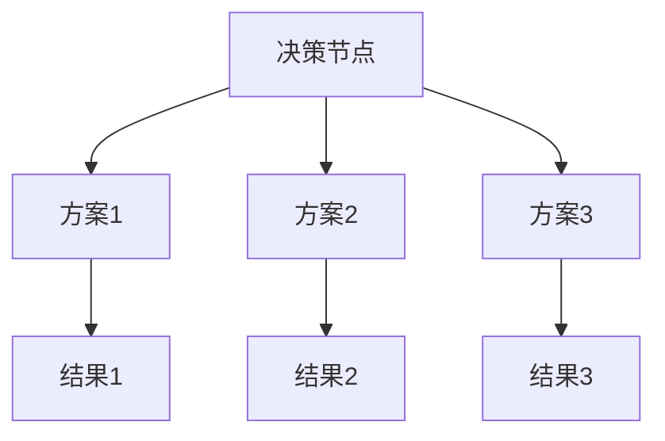

                 

### 文章标题：领导力修炼笔记：00后创业者的蜕变历程

> 关键词：领导力修炼、00后创业者、蜕变历程、个人成长、团队建设、市场营销、财务管理

> 摘要：本文旨在探讨00后创业者在领导力修炼过程中的蜕变历程，从个人成长、团队建设、市场营销、财务管理等多方面深入分析，提供实际案例和实用技巧，为创业者提供全面的指导。

## 第一部分：领导力修炼

### 第1章：领导力核心概念与原理

#### 1.1 领导力的定义与类型

领导力是一种能够激发他人积极性的能力，是领导者通过影响和激励他人来实现共同目标的一种艺术。根据不同的分类标准，领导力可以分为以下几种类型：

1. **任务型领导力**：侧重于明确目标和任务，强调执行力。
2. **关系型领导力**：注重与团队成员建立良好的人际关系，增强团队凝聚力。
3. **变革型领导力**：通过创新和变革推动团队发展。
4. **授权型领导力**：鼓励团队成员自主决策，发挥个人潜力。

#### 1.2 领导力的重要理论

1. **领导力冰山模型**：将领导力划分为显性和隐性两部分，强调隐性领导力（如价值观、动机、个性等）的重要性。
2. **领导力五因素模型**：提出领导力包含五个维度，即愿景、决策、激励、沟通和团队建设。

#### 1.3 领导力的数学模型

领导力数学模型主要用于分析领导力的行为和效果。例如，可以使用决策树模型来分析领导者在决策过程中的选择和结果。

## 第2章：领导力实践应用

#### 2.1 领导风格与团队互动

领导风格对团队互动有着重要影响。例如，民主型领导风格鼓励团队成员参与决策，增强团队凝聚力；而权威型领导风格则更加注重效率，但可能导致团队成员缺乏主动性。

#### 2.2 决策与问题解决

领导者需要具备良好的决策能力，能够快速、准确地做出决策。问题解决能力同样重要，领导者需要能够识别问题、分析原因、制定解决方案。

#### 2.3 领导力提升的实践方法

1. **不断学习与反思**：通过阅读书籍、参加培训等方式提升自己的领导力。
2. **实践与总结**：在实际工作中积累经验，不断总结和完善自己的领导方法。
3. **建立良好的人际关系**：与团队成员建立信任，增强团队凝聚力。

## 第二部分：00后创业者的蜕变历程

### 第3章：个人成长与心理素质

#### 3.1 个人成长的重要性

个人成长是00后创业者成功的关键。通过不断学习、提升自己的技能和知识，创业者可以更好地应对市场变化和挑战。

#### 3.2 心理素质对创业的影响

心理素质对创业成功至关重要。创业者需要具备抗压能力、情绪调节能力等，以应对创业过程中的各种困难和挑战。

#### 3.3 心理素质提升方法

1. **积极心态**：保持乐观，相信自己的能力，勇于面对困难。
2. **情绪调节**：学会缓解压力，合理处理负面情绪。
3. **自我激励**：为自己设定目标，不断激励自己前进。

### 第4章：团队建设与管理

#### 4.1 团队建设的核心要素

团队建设包括团队目标、团队角色、团队协作等方面。核心要素包括：

1. **共同目标**：确保团队成员明确团队目标，共同努力实现。
2. **合理分工**：根据团队成员的特长和兴趣进行分工，发挥个人优势。
3. **有效沟通**：建立良好的沟通机制，确保信息畅通。

#### 4.2 团队管理与领导力

团队管理是创业者的重要职责。领导者需要具备以下能力：

1. **激励与鼓励**：激发团队成员的积极性，提高团队执行力。
2. **监督与指导**：确保团队成员按照既定目标完成任务。
3. **反馈与改进**：及时给予团队成员反馈，促进个人和团队成长。

#### 4.3 团队协作与冲突管理

团队协作是团队建设的关键。创业者需要：

1. **建立信任**：通过沟通和合作，建立团队成员之间的信任。
2. **解决冲突**：及时处理团队内部冲突，避免影响团队士气。
3. **优化流程**：不断改进团队协作流程，提高工作效率。

### 第5章：市场营销策略

#### 5.1 市场营销的基础理论

市场营销是创业成功的重要环节。创业者需要了解以下基础理论：

1. **4P营销理论**：产品（Product）、价格（Price）、渠道（Place）、促销（Promotion）。
2. **SWOT分析**：分析企业的优势（Strengths）、劣势（Weaknesses）、机会（Opportunities）、威胁（Threats）。

#### 5.2 市场定位与目标客户

市场定位是市场营销的关键。创业者需要：

1. **明确市场定位**：根据产品特点和目标市场，明确自己的市场定位。
2. **寻找目标客户**：了解目标客户的需求和偏好，为他们提供优质的产品和服务。

#### 5.3 市场营销策略制定与实施

市场营销策略包括以下方面：

1. **产品策略**：根据市场定位，开发符合目标客户需求的产品。
2. **价格策略**：合理定价，提高产品竞争力。
3. **渠道策略**：选择合适的销售渠道，扩大市场份额。
4. **促销策略**：利用各种促销手段，提高产品知名度和销量。

### 第6章：财务管理与资金筹集

#### 6.1 财务管理的基本原则

财务管理是创业者需要掌握的重要技能。基本原则包括：

1. **预算管理**：制定合理的预算，控制成本。
2. **现金流量管理**：确保现金流量稳定，避免资金短缺。
3. **利润管理**：提高利润率，增加企业盈利。

#### 6.2 资金筹集渠道与策略

创业者需要了解以下资金筹集渠道和策略：

1. **天使投资**：寻找有经验的投资者，为企业提供资金支持。
2. **风险投资**：寻找风险投资机构，获得风险投资。
3. **政府资助**：了解政府提供的各种创业扶持政策，争取资助。
4. **内部融资**：通过股权融资、债券融资等方式，筹集内部资金。

#### 6.3 财务报表分析与决策

创业者需要掌握财务报表分析技巧，根据财务报表数据做出合理决策。财务报表包括：

1. **资产负债表**：反映企业资产、负债和所有者权益的状况。
2. **利润表**：反映企业收入、成本和利润的情况。
3. **现金流量表**：反映企业现金流入和流出的情况。

### 第7章：创业成功案例分析

#### 7.1 国内00后创业成功案例

分析国内00后创业成功案例，如美团、滴滴等，探讨其成功的原因和经验。

#### 7.2 国外00后创业成功案例

分析国外00后创业成功案例，如微软创始人比尔·盖茨、谷歌创始人拉里·佩奇等，了解其创业历程和经验。

#### 7.3 案例分析与创业启示

通过对成功创业案例的分析，总结创业经验，为创业者提供启示。

## 附录

### 附录A：领导力修炼相关资源

1. **领导力研究机构与资料**：介绍一些知名领导力研究机构和相关资料。
2. **创业者社群与论坛**：推荐一些创业者社群和论坛，供创业者交流学习。
3. **相关书籍与文献推荐**：推荐一些领导力和创业相关的经典书籍和文献。

### 附录B：00后创业者成长资源

1. **创业教育课程与培训**：介绍一些创业教育课程和培训项目。
2. **创业者扶持政策与资金来源**：介绍政府和企业为创业者提供的扶持政策和资金来源。
3. **创业者必备工具与资源**：推荐一些创业者必备的工具和资源。

## 作者信息

作者：AI天才研究院/AI Genius Institute & 禅与计算机程序设计艺术 /Zen And The Art of Computer Programming

## 最佳实践 Tips、小结、注意事项、拓展阅读等内容

1. **最佳实践 Tips**：总结创业过程中的最佳实践经验，供创业者参考。
2. **小结**：对全文内容进行简要总结，强调领导力修炼对创业者的重要性。
3. **注意事项**：提醒创业者注意在创业过程中可能遇到的问题和挑战。
4. **拓展阅读**：推荐一些相关书籍、文章和网站，供创业者进一步学习。

### 文章结束  

