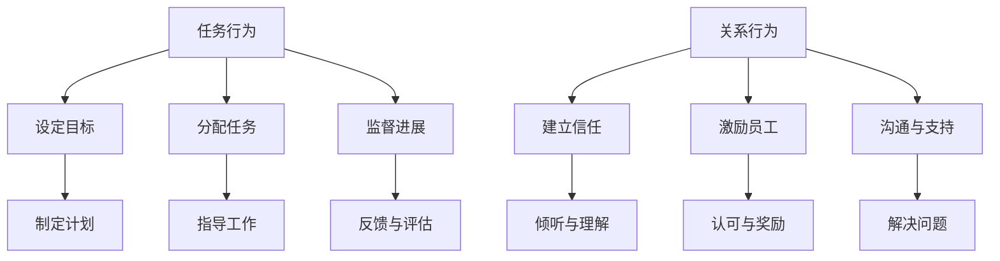
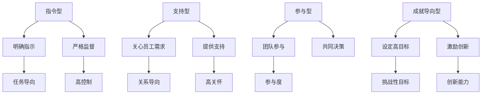
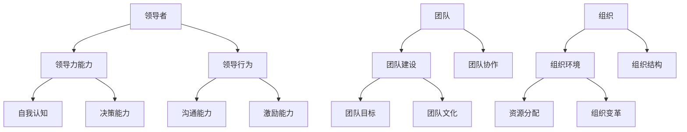
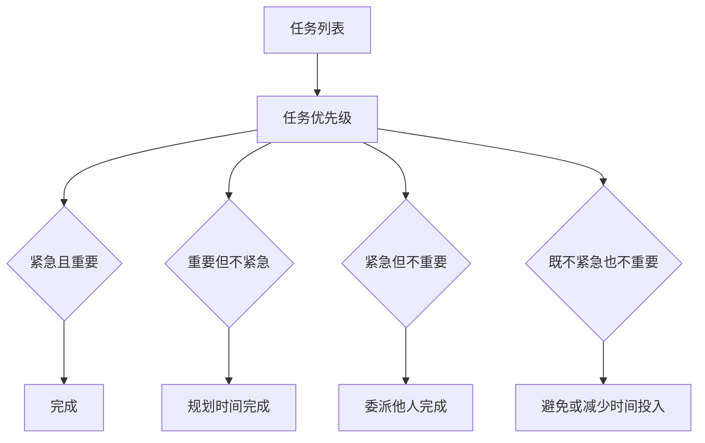
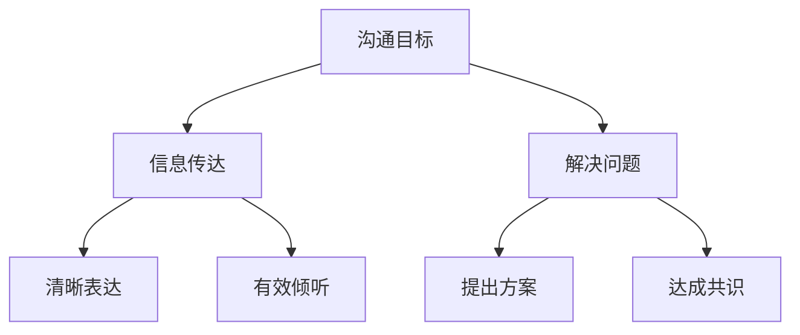
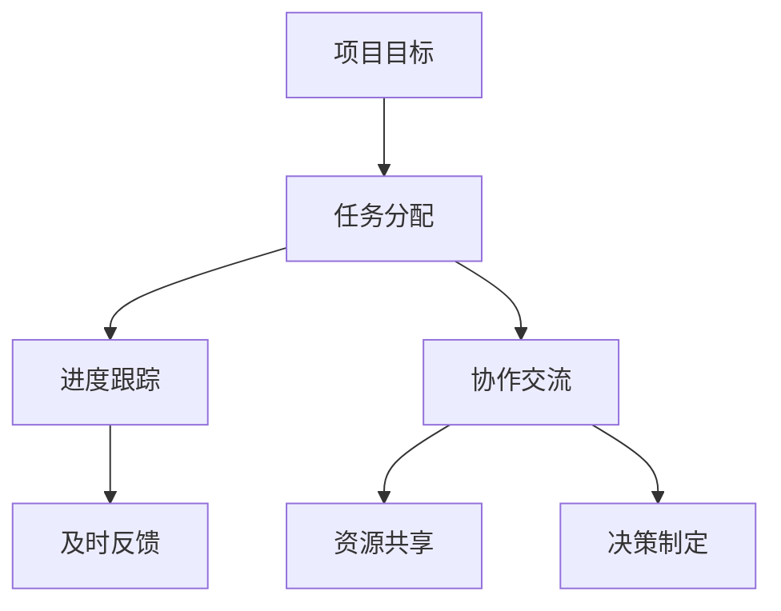
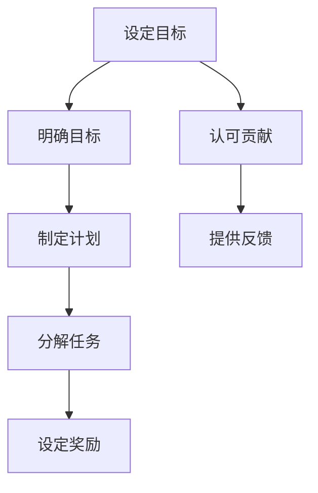
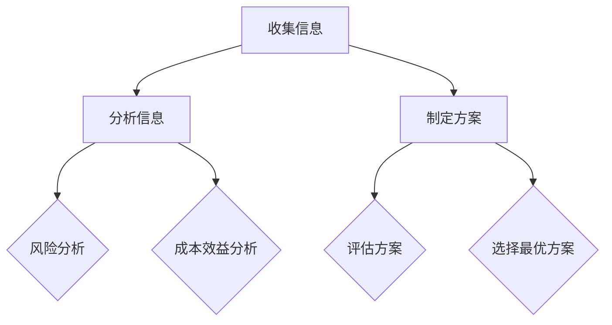
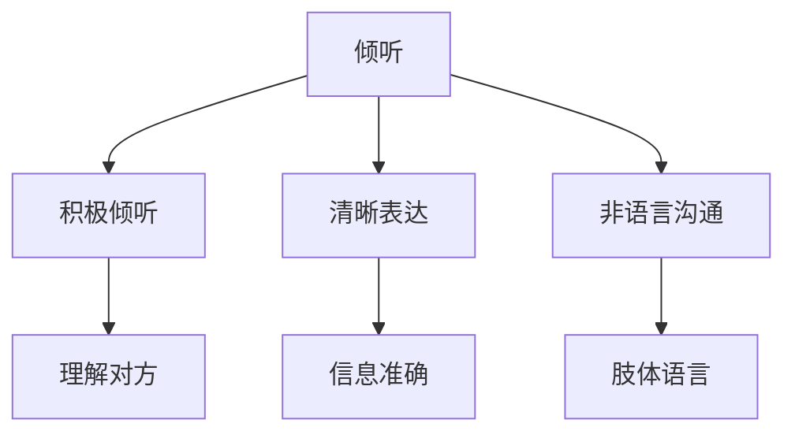

                 

### 引言

#### 1. 引言

在当今快速发展的数字化时代，职场环境发生了巨大的变化。00后作为新时代的职场新星，他们面临着前所未有的挑战和机遇。本篇文章将探讨《领导力修炼笔记：00后职场新星的逆袭之路》一书，旨在帮助00后职场新星在职场中实现逆袭，提升领导力，成为一名出色的职场精英。

00后，出生于1995年至2009年之间，他们成长在一个信息化、全球化的时代，相较于前辈们，他们拥有更加丰富的知识储备和技能。然而，职场竞争日益激烈，00后面临着巨大的压力。如何在职场中脱颖而出，成为领导者的关注焦点。

本书《领导力修炼笔记：00后职场新星的逆袭之路》将带领读者逐步了解领导力的本质，掌握领导力技巧，提升个人综合素质，实现职场逆袭。全书分为六个部分，分别是：领导力基础知识、职场技能提升、领导力实践、领导力心态、领导力工具与方法以及案例分析。

#### 2. 领导力基础知识

在本书的第一部分，我们将重点介绍领导力的基础理论，帮助读者建立正确的领导力观念。首先，我们将探讨领导力的定义与类型，理解不同类型的领导力及其在职场中的运用。接着，我们将深入剖析领导力的核心要素，包括影响力、沟通能力、决策能力等。最后，我们将简要回顾领导力的发展历程，了解领导力理论的演变。

#### 3. 性格与沟通

在职场中，性格与沟通是领导力的两大基石。本书的第二部分将重点探讨如何了解自己的性格，识别他人的性格类型，以及如何通过有效沟通建立良好的人际关系。我们将详细讲解性格测试工具的使用，帮助读者认识自己的性格特点，从而更好地发挥个人优势。同时，我们将介绍多种沟通技巧，包括倾听、表达、反馈等，帮助读者提升沟通能力，建立和谐的人际关系。

#### 4. 团队建设

团队建设是领导力实践的重要组成部分。本书的第三部分将围绕团队建设展开，介绍团队角色的定义、团队建设的原则以及团队协作技巧。我们将通过案例分析，让读者了解成功的团队建设实践，并提供实用的团队建设策略，帮助读者打造高效团队，实现团队目标。

#### 5. 职场技能提升

在职场中，除了领导力，技能的提升同样至关重要。本书的第四部分将介绍时间管理、目标设定、人际交往等职场技能的提升方法。我们将分享时间管理的最佳实践，帮助读者合理安排工作时间，提高工作效率。同时，我们将介绍目标设定的原则和技巧，帮助读者明确个人目标，制定切实可行的行动计划。最后，我们将探讨人际交往的重要性，提供有效的人际交往策略，帮助读者建立良好的人际关系网络。

#### 6. 领导力实践

领导力不仅是一种理论，更是一种实践。本书的第五部分将重点介绍领导力实践，包括项目管理、冲突解决、决策制定等。我们将通过实际案例，展示领导力在实践中如何发挥作用，并提供实用的领导力实践策略，帮助读者提升领导力水平。

#### 7. 领导力心态

心态是领导力的重要组成部分。本书的第六部分将探讨领导力心态，包括心态调整、积极思维、自我成长等。我们将介绍心态调整的方法，帮助读者保持积极的心态，应对职场压力。同时，我们将分享积极思维的好处，以及如何培养积极思维。最后，我们将探讨自我成长的重要性，提供实现自我成长的策略。

#### 8. 领导力工具与方法

在职场中，领导力的提升离不开工具与方法的支持。本书的第七部分将介绍领导力工具与方法，包括领导力模型、领导力工具、领导力技巧等。我们将通过实际案例，展示如何使用领导力工具提升领导力水平，并提供实用的领导力技巧，帮助读者在职场中脱颖而出。

#### 9. 案例分析

为了更好地理解领导力在实践中的应用，本书的最后一部分将进行案例分析。我们将选取一些成功的领导力实践案例，深入剖析其背后的领导力策略，并提供实用的案例分析结果。同时，我们还将分析一些失败的领导力实践案例，总结其中的教训，帮助读者避免走弯路。

通过本书的阅读，00后职场新星将能够系统地掌握领导力的理论、技巧和实践方法，提升个人综合素质，实现职场逆袭。让我们一起走进《领导力修炼笔记：00后职场新星的逆袭之路》，开启领导力修炼之旅！## 2. 领导力理论基础

### 2.1 领导力的定义与类型

领导力，作为一个广泛讨论的话题，其定义多种多样。简单来说，领导力是指一个人或一个团队引导、激励和影响他人朝着共同目标前进的能力。根据领导力的来源和方式，领导力可以分为以下几种类型：

1. **权威型领导力**：权威型领导力依赖于领导者的职位和权力来影响他人。这种领导力在传统组织结构中较为常见，领导者通过规章制度和奖励惩罚来维持秩序和效率。

2. **变革型领导力**：变革型领导力强调领导者通过激励和榜样作用来影响团队成员，鼓励他们实现自我超越，共同追求更高的目标。这种领导力在创新和变革过程中发挥着重要作用。

3. **参与型领导力**：参与型领导力注重团队合作和民主决策，领导者与团队成员共同参与决策过程，鼓励成员发挥自己的专长和创造力。这种领导力有助于提高团队成员的参与感和忠诚度。

4. **服务型领导力**：服务型领导力强调领导者要为团队成员提供服务，关注团队成员的需求和成长。领导者通过无私奉献和关心来影响团队成员，形成积极的工作氛围。

### 2.2 领导力的核心要素

领导力并非简单的权力和地位的象征，它包含了一系列的核心要素。以下是领导力的几个关键要素：

1. **影响力**：领导力本质上是一种影响力，领导者需要具备一定的个人魅力和影响力，才能引导和激励团队成员。

2. **沟通能力**：有效的沟通是领导力的关键，领导者需要具备良好的口头和书面沟通能力，能够清晰地表达自己的想法，并倾听和理解他人的观点。

3. **决策能力**：领导者在面对各种复杂问题时，需要具备迅速做出明智决策的能力。决策能力包括分析问题、评估风险、权衡利弊等。

4. **团队建设能力**：领导者需要能够建立和培养高效团队，激发团队成员的潜力，实现团队协作和共同成长。

5. **变革推动能力**：在快速变化的职场环境中，领导者需要具备推动变革的能力，引领团队迎接挑战，不断创新和进步。

### 2.3 领导力的发展历程

领导力理论的发展历程可以追溯到古希腊哲学家亚里士多德，他首次提出了领导力的概念。随后，领导力理论经历了多个阶段的发展：

1. **特质理论**：特质理论认为领导者具备一系列独特的个人特质，如自信、决心、智慧等。这一理论在20世纪初得到广泛认可。

2. **行为理论**：行为理论关注领导者具体的行为和领导风格，研究领导者如何影响团队成员。这一理论在20世纪中叶兴起。

3. **情境理论**：情境理论认为领导力的有效性取决于领导者的行为是否与情境相适应。这一理论在20世纪后期得到广泛关注。

4. **变革型领导力理论**：变革型领导力理论强调领导者通过激励和榜样作用来影响团队成员，实现自我超越和共同进步。

5. **领导力发展理论**：领导力发展理论关注领导者如何通过不断学习、实践和反思来提升自己的领导能力。

### 2.4 领导力模型介绍

为了更好地理解和应用领导力理论，许多学者和专家提出了各种领导力模型。以下是几个常用的领导力模型：

1. **菲德勒领导力模型**：菲德勒领导力模型认为领导者的成功取决于三个因素：领导者与团队成员的关系、任务结构以及职位权力。

2. **赫塞-布兰查德领导力模型**：赫塞-布兰查德领导力模型提出了四种领导风格：指令型、推销型、参与型和授权型，并指出领导风格应根据团队成员的成熟度进行选择。

3. **变革型领导力模型**：变革型领导力模型强调领导者通过激发团队成员的潜能和积极性来实现变革。这一模型包括四个阶段：唤醒、凝聚、激励和引领。

4. **领导力五环模型**：领导力五环模型将领导力分为五个层次：自我领导、团队领导、企业领导、社会领导和国家领导。

### 2.5 领导力在现代职场中的应用

在现代职场中，领导力的重要性愈发凸显。以下是领导力在现代职场中的应用场景：

1. **团队协作**：领导力有助于建立高效的团队，激发团队成员的潜力，实现共同目标。

2. **项目管理**：领导力在项目管理中发挥着关键作用，帮助团队克服困难，按时完成项目。

3. **变革推动**：领导力能够推动组织变革，适应市场变化，保持竞争力。

4. **个人成长**：领导力有助于个人在职场中不断成长，实现职业目标。

### 2.6 结论

通过本章的介绍，读者可以了解到领导力的定义、类型、核心要素和领导力模型。在接下来的章节中，我们将继续探讨如何提升领导力，掌握领导力技巧，实现职场逆袭。让我们共同走进领导力修炼之旅，迈向卓越的职场人生！## 3. 性格与沟通

### 3.1 了解自己的性格

在职场中，了解自己的性格特点对于个人成长和团队协作至关重要。性格测试工具如迈尔斯-布里格斯性格类型指标（MBTI）和霍兰德职业兴趣测试可以帮助我们更好地认识自己。以下是几种常用的性格测试工具：

1. **迈尔斯-布里格斯性格类型指标（MBTI）**：MBTI将性格分为16种类型，每种类型都有其独特的特点。通过MBTI测试，我们可以了解自己的性格偏好，如内向/外向、感觉/直觉、思考/情感、判断/感知。

2. **霍兰德职业兴趣测试**：霍兰德职业兴趣测试将人的兴趣分为六大类型：现实型、研究型、艺术型、社会型、企业型和常规型。通过测试，我们可以了解自己的职业兴趣，为职业规划提供参考。

通过了解自己的性格特点，我们可以更好地发挥个人优势，同时识别自己的弱点，有针对性地进行改进。例如，如果一个00后职场新星发现自己具有内向性格，他们可以尝试提高自己的沟通技巧，积极参与团队合作，以更好地适应职场环境。

### 3.2 沟通的重要性

沟通是领导力的核心要素之一，有效的沟通能够促进团队协作，提高工作效率。以下是沟通在职场中的重要性：

1. **促进团队合作**：良好的沟通能够消除团队成员之间的误解和隔阂，促进团队协作，共同实现目标。

2. **提高工作效率**：清晰的沟通能够确保团队成员明确任务要求，避免重复工作，提高工作效率。

3. **增强人际关系**：沟通是建立良好人际关系的基础，通过有效沟通，我们能够更好地理解他人，建立互信。

4. **化解冲突**：在职场中，冲突难以避免。通过有效沟通，我们可以及时了解他人意见，找到解决问题的方法，化解冲突。

### 3.3 有效沟通技巧

为了提升沟通能力，以下是一些实用的技巧：

1. **倾听**：倾听是沟通的基础。在沟通中，要注重倾听对方的观点，避免打断对方，充分理解他人的意见。

2. **表达**：清晰、简洁的表达是有效沟通的关键。我们要注意使用简洁明了的语言，避免使用过于复杂的词汇和句子。

3. **反馈**：在沟通过程中，及时给予反馈可以帮助我们了解对方的理解程度，确保信息的准确传达。

4. **非语言沟通**：非语言沟通包括肢体语言、面部表情、声音语调等。通过适当的非语言沟通，我们可以更好地传达自己的情感和态度。

5. **同理心**：同理心是指站在对方的角度思考问题，理解和感受对方的情绪。在沟通中，同理心可以帮助我们更好地理解他人，建立信任。

### 3.4 案例分析

为了更好地理解性格与沟通在职场中的应用，以下是一个实际案例：

**案例**：小张是一名00后职场新星，他在团队中担任项目经理的角色。由于小张具有较强的内向性格，他在与团队成员沟通时经常感到不自在，导致项目进展缓慢。

**解决方案**：为了提升沟通能力，小张采取了以下措施：

1. **性格测试**：小张通过MBTI测试了解到自己属于内向性格，并认识到自己的弱点。他开始有意识地提高自己的沟通技巧。

2. **倾听与反馈**：小张在沟通中注重倾听团队成员的意见，并在适当的时候给予反馈。这有助于团队成员感受到他的关注，增强了团队的凝聚力。

3. **积极参与**：小张尝试在团队会议中积极参与讨论，提出自己的观点，以增加与团队成员的互动。

4. **非语言沟通**：小张在沟通中注重非语言沟通，如保持眼神交流、使用积极的面部表情等，以传达自己的友好态度。

通过以上措施，小张的沟通能力得到了显著提升，项目进展也变得更加顺利。

### 3.5 小结

通过本章的介绍，我们了解了性格与沟通在职场中的重要性。了解自己的性格特点有助于发挥个人优势，提高沟通能力。有效沟通是建立良好人际关系、提高工作效率的关键。在接下来的章节中，我们将继续探讨团队建设的方法和技巧，帮助00后职场新星在职场中取得成功。让我们继续前进，开启领导力修炼之旅！## 4. 团队建设

### 4.1 团队角色的定义

团队建设是领导力实践的重要组成部分，一个高效的团队需要明确团队成员的角色和职责。以下是几种常见的团队角色：

1. **领导者**：领导者负责制定团队目标、规划工作流程、激励团队成员。他们需要具备领导力和决策能力，引导团队朝着共同目标前进。

2. **团队成员**：团队成员负责具体任务的执行，他们需要具备专业知识和技能，能够有效地完成分配的任务。

3. **协调员**：协调员负责协调团队成员之间的工作，确保团队成员能够相互配合，共同完成任务。

4. **沟通者**：沟通者负责在团队内外传递信息，确保团队成员能够及时了解项目进展和需求。

5. **监督员**：监督员负责监督团队成员的工作，确保任务按照计划进行，并及时解决出现的问题。

6. **支持者**：支持者负责为团队成员提供支持和鼓励，帮助他们克服困难，提高工作效率。

### 4.2 团队建设的原则

为了建立一个高效、协作的团队，领导者需要遵循以下团队建设原则：

1. **明确目标**：团队目标应该是具体、可衡量和可实现的。领导者需要与团队成员共同制定目标，确保每个人都清楚自己的职责和任务。

2. **分工明确**：每个团队成员应该明确自己的角色和职责，避免职责重叠和责任不清的情况。

3. **相互信任**：团队建设的基础是信任。领导者需要通过有效的沟通和合作，建立团队成员之间的信任关系。

4. **积极沟通**：团队成员之间应该保持积极的沟通，及时分享信息、反馈和意见，确保团队协作顺畅。

5. **尊重差异**：每个团队成员都有其独特的技能和观点，领导者需要尊重并利用这些差异，为团队带来更多的创新和灵感。

6. **共同成长**：团队建设不仅仅是完成任务，更是团队成员共同成长的过程。领导者需要关注团队成员的职业发展和个人成长，提供必要的支持和资源。

### 4.3 团队协作技巧

为了提高团队协作效率，以下是几种实用的团队协作技巧：

1. **会议管理**：高效的会议是团队协作的关键。领导者需要确保会议有明确的议程、明确的目标和高效的讨论。

2. **任务分解**：将大任务分解为小任务，并分配给合适的团队成员，有助于提高工作效率和团队协作。

3. **共享资源**：共享资源如知识库、工具和设备，可以减少团队成员之间的重复劳动，提高整体效率。

4. **协作工具**：使用协作工具如项目管理软件、即时通讯工具和在线文档编辑，可以帮助团队成员更好地协作。

5. **定期回顾**：定期回顾团队的工作进展和协作效果，可以帮助团队成员发现问题、改进方法，提高团队协作效率。

### 4.4 成功的团队建设实践

以下是一个成功的团队建设实践案例：

**案例**：某互联网公司开发团队通过以下措施成功建立了高效协作的团队：

1. **明确目标**：团队在项目启动阶段明确了项目目标和预期成果，确保每个团队成员都清楚自己的职责和任务。

2. **分工明确**：团队成员根据自己的专业技能和兴趣，明确了自己的角色和职责，避免了职责重叠和责任不清的情况。

3. **积极沟通**：团队成员通过每周例会和即时通讯工具保持积极的沟通，及时分享信息、反馈和意见，确保团队协作顺畅。

4. **共享资源**：团队使用项目管理软件和共享文档编辑工具，方便团队成员协作，提高了整体效率。

5. **定期回顾**：团队在项目进度评估阶段定期回顾工作进展和协作效果，及时发现问题并改进，确保项目顺利进行。

通过以上措施，该团队在短时间内实现了高效协作，项目进度和质量均得到了显著提升。

### 4.5 小结

团队建设是领导力实践的重要组成部分，一个高效的团队可以更好地实现组织目标。通过明确团队角色、遵循团队建设原则和掌握团队协作技巧，领导者可以打造一个协作顺畅、高效执行的团队。在接下来的章节中，我们将继续探讨职场技能提升的方法，帮助00后职场新星在职场中取得成功。让我们继续前进，开启领导力修炼之旅！## 5. 职场技能提升

在职场中，提升个人技能是职场成功的关键。本章节将重点介绍时间管理、目标设定和人际交往这三个核心职场技能的提升方法。

### 5.1 时间管理

时间管理是职场人士必须掌握的基本技能之一。有效的时间管理能够提高工作效率，减少工作压力，使个人更加从容地应对职场挑战。以下是一些时间管理的技巧：

1. **任务分解**：将大任务分解为小任务，可以让我们更清晰地了解任务的具体内容和完成时间。通过设定小任务的优先级，我们可以有针对性地安排时间，提高工作效率。

   ```python
   # 任务分解示例
   tasks = [
       '编写需求文档',
       '进行市场调研',
       '设计产品原型',
       '编写测试用例',
       '提交最终报告'
   ]

   # 按优先级排序
   priority_tasks = sorted(tasks, key=lambda x: x.count('编写'))
   ```

2. **时间块管理**：将工作时间划分为不同的时间块，每个时间块专注于一项任务。这种方法可以帮助我们避免任务切换带来的时间浪费，提高专注度。

   ```python
   # 时间块管理示例
   time_blocks = [
       {'task': '编写需求文档', 'start': '09:00', 'end': '10:30'},
       {'task': '进行市场调研', 'start': '10:30', 'end': '12:00'},
       {'task': '设计产品原型', 'start': '14:00', 'end': '15:30'}
   ]
   ```

3. **使用工具**：使用时间管理工具如时间追踪器、日历应用和待办事项列表，可以帮助我们更好地规划时间、记录任务和提醒日程。

   ```python
   # 使用日历应用规划时间
   import calendar

   # 设置日程
   events = [
       {'day': '2023-10-01', 'description': '参加产品发布会'},
       {'day': '2023-10-05', 'description': '与客户会议'},
       {'day': '2023-10-10', 'description': '项目进度评估'}
   ]

   # 打印日程
   for event in events:
       print(calendar.day_name[calendar.weekday(*calendar.strptime(event['day'], '%Y-%m-%d').tm_yday)])
       print(event['description'])
   ```

### 5.2 目标设定

设定明确的目标是职场成功的关键。以下是一些目标设定的原则和技巧：

1. **SMART原则**：SMART原则是一种常用的目标设定方法，它要求目标具有具体性（Specific）、可衡量性（Measurable）、可实现性（Achievable）、相关性（Relevant）和时限性（Time-bound）。

   ```python
   # SMART原则示例
   smart_goals = [
       '提高项目完成率至90%（具体）',
       '每月减少10%的任务延迟时间（可衡量）',
       '通过学习新技能提高工作效率（可实现）',
       '确保团队成员满意度达到85%（相关性）',
       '在下一季度实现目标（时限性）'
   ]
   ```

2. **目标分解**：将大目标分解为小目标，可以让我们更容易地跟踪进度，并及时调整策略。

   ```python
   # 目标分解示例
   big_goal = '提高团队整体工作效率'
   sub_goals = [
       '每个成员掌握至少一门新技能',
       '优化工作流程，减少任务等待时间',
       '定期进行项目复盘，总结经验教训'
   ]
   ```

3. **使用工具**：使用目标管理工具如KPI跟踪器、OKR（目标与关键结果）工具等，可以帮助我们更好地设定、跟踪和评估目标。

   ```python
   # 使用OKR工具设定目标
   import json

   # 设定OKR
   okrs = json.dumps([
       {'quarter': '2023Q3', 'objective': '提高团队整体工作效率', 'key_results': [
           {'description': '每个成员掌握至少一门新技能', 'target': 4},
           {'description': '优化工作流程，减少任务等待时间', 'target': 30},
           {'description': '定期进行项目复盘，总结经验教训', 'target': 2}
       ]}
   ])

   # 打印OKR
   print(json.loads(okrs))
   ```

### 5.3 人际交往

人际交往是职场成功的重要因素。以下是一些人际交往的技巧：

1. **积极沟通**：通过积极沟通，我们可以更好地理解他人，建立良好的人际关系。积极沟通包括倾听、表达、反馈等。

   ```python
   # 积极沟通示例
   def communicate(effectively):
       listen = True
       express = True
       feedback = True
       return listen and express and feedback

   print(communicate(True))
   ```

2. **同理心**：同理心是指站在他人的角度思考问题，理解和感受他人的情绪。通过同理心，我们可以更好地与他人建立信任和合作关系。

   ```python
   # 同理心示例
   def empathy(other_person):
       understand = True
       feel = True
       return understand and feel

   print(empathy(True))
   ```

3. **建立人际关系网络**：在职场中，建立广泛的人际关系网络可以帮助我们获取更多资源、信息和机会。通过积极参与社交活动，我们可以结识更多的同事和行业人士。

   ```python
   # 建立人际关系网络示例
   def build_network(social_activities):
       connections = 0
       for activity in social_activities:
           connections += len(activity['participants'])
       return connections

   social_activities = [{'name': '公司聚餐', 'participants': ['张三', '李四', '王五']},
                         {'name': '行业论坛', 'participants': ['赵六', '孙七', '周八']}]

   print(build_network(social_activities))
   ```

通过本章的介绍，00后职场新星可以了解并掌握时间管理、目标设定和人际交往这三个核心职场技能。在接下来的章节中，我们将继续探讨领导力实践，帮助00后职场新星在职场中取得更大的成功。让我们一起继续前行，开启领导力修炼之旅！## 6. 领导力实践

### 6.1 项目管理

在领导力的实践中，项目管理是领导者必须掌握的重要技能之一。一个成功的项目不仅能够实现预期目标，还能提升团队的凝聚力和战斗力。以下是项目管理的一些关键步骤和策略：

#### 6.1.1 项目启动

项目启动是项目管理的第一步，也是关键的一步。在这一阶段，领导者需要明确项目的目标、范围、预算和时间表。以下是项目启动的几个关键步骤：

1. **确定项目目标**：项目的目标应该具体、明确，可以量化和衡量。例如，“提高产品销量30%”或“缩短产品交付时间50%”。

2. **制定项目计划**：项目计划包括项目的范围、时间表、资源需求、预算和关键里程碑。领导者需要与团队成员共同讨论并制定项目计划。

3. **组建项目团队**：根据项目需求，选择合适的团队成员，并明确每个成员的职责和角色。

#### 6.1.2 项目执行

项目执行阶段是项目管理的核心，领导者需要确保项目按照计划顺利进行。以下是项目执行的一些关键策略：

1. **监督进度**：定期检查项目的进展情况，确保每个任务都在按计划完成。如果发现进度延误，及时调整计划。

2. **沟通协调**：保持与团队成员的沟通，确保他们了解项目的进展和目标，及时解决遇到的问题。

3. **风险管理**：识别项目中的潜在风险，并制定相应的应对策略。例如，为关键任务设置备选方案，以应对可能出现的延误。

#### 6.1.3 项目监控

项目监控是确保项目按计划进行的重要手段。以下是项目监控的一些关键步骤：

1. **定期评估**：定期评估项目的进展和成果，确保项目符合预期目标。如果发现偏差，及时调整计划。

2. **反馈机制**：建立有效的反馈机制，鼓励团队成员提出意见和建议，不断优化项目。

3. **质量检查**：确保项目交付的产品或服务符合质量标准，进行必要的质量检查和测试。

#### 6.1.4 项目收尾

项目收尾阶段是项目管理的最后一步，领导者需要确保项目的所有任务都已完成，并进行最终的验收和总结。以下是项目收尾的一些关键步骤：

1. **验收交付物**：与客户或项目利益相关方进行交付物的验收，确保项目成果符合预期。

2. **项目总结**：对项目的整个生命周期进行总结，分析项目的成功和不足之处，为未来的项目提供经验教训。

### 6.2 冲突解决

在职场中，冲突是不可避免的。有效的冲突解决策略可以帮助领导者维护团队和谐，提升团队绩效。以下是几种常见的冲突解决方法：

#### 6.2.1 协商

协商是一种基于合作的冲突解决方法，领导者需要与冲突各方进行沟通，寻找共同点，达成共识。以下是协商的步骤：

1. **了解冲突**：领导者需要了解冲突的原因和影响，确保自己全面理解问题。

2. **召开会议**：召集冲突各方，讨论冲突，寻找解决方案。

3. **达成共识**：通过讨论，各方达成共识，并制定具体的行动方案。

#### 6.2.2 调解

调解是一种由第三方介入的冲突解决方法，适用于复杂的冲突情况。以下是调解的步骤：

1. **选择调解人**：选择一位中立的调解人，确保其具备冲突解决的技能和经验。

2. **召开调解会议**：调解人召集冲突各方，进行调解。

3. **制定调解方案**：调解人根据冲突情况，制定调解方案，并鼓励各方达成共识。

#### 6.2.3 忽略

在某些情况下，冲突可能对团队的整体绩效影响较小，领导者可以选择忽略。但这种方法适用于特定情况，需要慎重考虑。

### 6.3 决策制定

决策制定是领导力的重要组成部分。有效的决策能够帮助团队应对挑战，抓住机遇。以下是决策制定的一些关键步骤：

#### 6.3.1 收集信息

在做出决策之前，领导者需要收集相关的信息，包括市场趋势、竞争情况、资源需求等。

#### 6.3.2 分析信息

对收集到的信息进行分析，识别关键因素和潜在风险。

#### 6.3.3 制定方案

根据分析结果，制定多个备选方案，并评估每个方案的优缺点。

#### 6.3.4 选择方案

选择最合适的方案，并制定具体的实施计划。

#### 6.3.5 执行方案

执行决策方案，并持续监控执行过程，确保决策的有效实施。

### 6.4 案例分析

以下是一个关于项目管理、冲突解决和决策制定的案例：

**案例**：某互联网公司计划开发一款新产品，项目时间紧、任务重。项目团队在开发过程中遇到了以下问题：

1. **进度延误**：由于市场需求变化，项目进度出现了延误。

2. **团队冲突**：团队成员在技术方案上存在分歧，导致项目进展缓慢。

3. **决策难题**：项目面临多个技术选择，如何选择最优方案？

**解决方案**：

1. **项目管理**：项目领导者立即召开会议，重新规划项目时间表，调整任务分配，确保项目进度。

2. **冲突解决**：项目领导者组织团队成员进行协商，了解各自的观点和需求，最终达成共识，确定了技术方案。

3. **决策制定**：项目领导者收集市场数据和技术分析报告，制定了三个备选方案，并组织团队讨论，最终选择了最优方案。

通过以上措施，项目团队顺利度过了困难期，最终成功完成了新产品开发。

### 6.5 小结

通过本章的介绍，我们了解了项目管理的关键步骤和策略，冲突解决的方法，以及决策制定的流程。在接下来的章节中，我们将继续探讨领导力心态，帮助00后职场新星在职场中保持积极心态，实现个人成长。让我们继续前进，开启领导力修炼之旅！## 7. 领导力心态

领导力不仅仅是技能和知识的积累，更是心态的修炼。一个优秀的领导者需要具备积极的心态，以应对职场中的各种挑战和压力。以下是领导力心态的几个关键方面：

### 7.1 心态调整

#### 7.1.1 确立目标

在职场中，领导者需要明确自己的目标，并将其与团队的目标相结合。一个明确的目标可以帮助领导者更好地规划工作，调整心态。

```python
# 确立目标示例
def set_goals(personal_goals, team_goals):
    return personal_goals + team_goals

personal_goals = ['提高项目成功率', '培养团队成员能力']
team_goals = ['实现产品迭代', '提升团队凝聚力']

combined_goals = set_goals(personal_goals, team_goals)
print(combined_goals)
```

#### 7.1.2 保持乐观

乐观的心态能够帮助领导者更好地应对挑战，保持积极的工作状态。在面临困境时，领导者应该积极寻找解决方案，而不是消极抱怨。

```python
# 保持乐观示例
def stay_positive(problem):
    solution = "我们一定能找到解决方案！"
    return solution

problem = "项目遇到了技术难题"
print(stay_positive(problem))
```

### 7.2 积极思维

积极思维是指领导者在面对问题时，能够从积极的角度思考，寻找解决问题的方法。积极思维能够提升领导者的决策能力和执行力。

#### 7.2.1 寻找机遇

领导者应该学会从挑战中寻找机遇，而不是仅仅看到困难。积极思维可以帮助领导者发现新的市场机会，推动团队创新。

```python
# 寻找机遇示例
def find_opportunities(challenges):
    opportunities = ["通过挑战提升团队技能", "开拓新市场"]
    return opportunities

challenges = ["市场竞争激烈", "产品需求变化快"]
print(find_opportunities(challenges))
```

#### 7.2.2 培养团队

积极思维还体现在领导者对团队成员的培养上。领导者应该鼓励团队成员积极思考，提出创新的解决方案。

```python
# 培养团队示例
def cultivate_team_members(skills_to_improve):
    improvement_plan = ["提供培训机会", "分配挑战性任务"]
    return improvement_plan

skills_to_improve = ["项目管理能力", "技术熟练度"]
print(cultivate_team_members(skills_to_improve))
```

### 7.3 自我成长

自我成长是领导者保持竞争力的关键。一个优秀的领导者应该不断学习，提升自己的领导力和管理能力。

#### 7.3.1 不断学习

领导者应该积极学习新的知识和技能，了解行业动态，保持自己的专业竞争力。

```python
# 不断学习示例
def learn_new_skills(current_skills, new_skills):
    updated_skills = current_skills + new_skills
    return updated_skills

current_skills = ["项目管理", "团队沟通"]
new_skills = ["敏捷开发", "数据驱动决策"]
print(learn_new_skills(current_skills, new_skills))
```

#### 7.3.2 反思与总结

领导者应该定期反思自己的工作，总结经验教训，不断改进自己的领导方法。

```python
# 反思与总结示例
def reflect_and_summarize(experience):
    insights = "通过这次经历，我学到了..."
    return insights

experience = "处理团队冲突"
print(reflect_and_summarize(experience))
```

### 7.4 案例分析

以下是一个关于领导力心态的案例分析：

**案例**：某互联网公司的新任项目经理小张，在接手一个重要项目时，面临着时间紧迫、资源有限等挑战。他通过以下措施保持积极心态：

1. **确立目标**：小张明确了项目的目标，并与团队共同制定了详细的计划。

2. **保持乐观**：在项目遇到困难时，小张积极寻找解决方案，鼓励团队成员不要放弃。

3. **寻找机遇**：小张从挑战中看到了提升团队技能和开拓新市场的机会。

4. **不断学习**：小张在项目过程中不断学习新技能，提升自己的专业能力。

5. **反思与总结**：项目结束后，小张总结了项目经验，为未来的工作提供了宝贵的参考。

通过以上措施，小张成功地带领团队完成了项目，并获得了团队和上级的认可。

### 7.5 小结

通过本章的介绍，我们了解了领导力心态的几个关键方面，包括心态调整、积极思维和自我成长。在职场中，领导者需要不断修炼心态，以应对各种挑战。在接下来的章节中，我们将探讨领导力工具与方法，帮助00后职场新星更好地提升领导力。让我们继续前进，开启领导力修炼之旅！## 8. 领导力工具与方法

在领导力的实践中，工具和方法的运用至关重要。以下将介绍几种常用的领导力工具和方法，包括领导力模型、领导力工具和领导力技巧，帮助00后职场新星提升领导力。

### 8.1 领导力模型

领导力模型是指导领导者如何有效管理和影响团队的理论框架。以下是几种常用的领导力模型：

#### 8.1.1 领导行为模型

领导行为模型关注领导者的行为方式。这种模型将领导行为分为任务行为和关系行为。任务行为涉及领导者如何设定目标、分配任务和监督进展。关系行为则涉及领导者如何建立和维护与团队成员之间的关系。以下是一个领导行为模型的示例：



#### 8.1.2 权变理论模型

权变理论模型认为领导力的有效性取决于领导者与情境的匹配程度。这种模型将领导风格分为四种：指令型、支持型、参与型和成就导向型。以下是一个权变理论模型的示例：



#### 8.1.3 系统领导力模型

系统领导力模型认为领导力是一个复杂的系统，涉及领导者、团队和组织等多个层面。以下是一个系统领导力模型的示例：



### 8.2 领导力工具

领导力工具是帮助领导者有效管理和影响团队的方法和资源。以下介绍几种常用的领导力工具：

#### 8.2.1 时间管理工具

时间管理工具可以帮助领导者合理安排时间和资源，提高工作效率。以下是一个时间管理工具的示例：



#### 8.2.2 沟通工具

沟通工具可以帮助领导者更好地传达信息、倾听员工意见和解决问题。以下是一个沟通工具的示例：



#### 8.2.3 团队协作工具

团队协作工具可以帮助领导者促进团队协作，提高团队效率。以下是一个团队协作工具的示例：



### 8.3 领导力技巧

领导力技巧是领导者通过实践和经验积累形成的能力，以下介绍几种常用的领导力技巧：

#### 8.3.1 激励技巧

激励技巧是领导者通过激发团队成员的内在动力，提高团队绩效的方法。以下是一个激励技巧的示例：



#### 8.3.2 决策技巧

决策技巧是领导者通过有效决策，推动团队发展的能力。以下是一个决策技巧的示例：



#### 8.3.3 沟通技巧

沟通技巧是领导者通过有效沟通，建立良好人际关系的能力。以下是一个沟通技巧的示例：



### 8.4 案例分析

以下是一个关于领导力工具与方法的案例分析：

**案例**：某互联网公司的项目团队在开发一款新产品时，面临着时间紧、任务重的挑战。团队领导者通过以下领导力工具与方法，成功带领团队完成了项目：

1. **时间管理工具**：领导者使用任务列表和时间跟踪工具，确保每个任务都有明确的优先级和时间安排，提高了工作效率。

2. **沟通工具**：领导者使用沟通工具，确保团队内部信息传递畅通，及时解决团队成员的问题，促进了团队协作。

3. **团队协作工具**：领导者使用团队协作工具，如共享文档和在线会议，方便团队成员协作，提高了项目进度。

4. **激励技巧**：领导者通过设定奖励机制，认可团队成员的贡献，激发了团队成员的积极性，提高了团队的整体绩效。

5. **决策技巧**：领导者通过收集信息、分析信息和评估方案，选择了最优的决策方案，确保项目顺利进行。

通过以上领导力工具与方法，团队领导者成功带领团队完成了项目，并获得了公司的高评价。

### 8.5 小结

通过本章的介绍，我们了解了领导力模型、领导力工具和领导力技巧，以及如何运用这些工具和方法提升领导力。在接下来的章节中，我们将通过实际案例，深入探讨领导力在职场中的应用，帮助00后职场新星更好地理解和运用领导力。让我们继续前进，开启领导力实践之旅！## 9. 案例分析

### 9.1 成功的领导力实践案例分析

**案例背景**：某知名互联网公司决定推出一款新的移动应用程序，以争夺日益增长的移动市场。该公司内部成立了一个跨部门团队，由一位00后职场新星小王担任项目经理，负责项目的整体规划和管理。

**领导力策略**：

1. **明确目标与分工**：小王首先与团队共同制定了项目目标，明确了每个成员的职责和任务。他通过明确的目标和分工，确保团队成员对项目的整体方向和任务有清晰的认识。

   ```mermaid
   graph TD
       A[项目目标] --> B[功能模块划分]
       B --> C{用户界面设计}
       B --> D{后端开发}
       B --> E{测试与优化}
       B --> F{市场推广}
       C --> G[UI设计师]
       D --> H[后端开发工程师]
       E --> I[测试工程师]
       F --> J[市场专员]
   ```

2. **激励团队**：小王采用了一系列激励措施，包括设定明确的奖励机制，对表现突出的团队成员进行表彰和奖励。他还定期组织团队活动，增强团队成员之间的凝聚力。

   ```mermaid
   graph TD
       K[任务完成] --> L{奖励机制}
       L --> M[奖金奖励]
       L --> N[表彰证书]
       L --> O[晋升机会]
   ```

3. **沟通协调**：小王建立了定期项目会议和即时沟通机制，确保团队成员能够及时分享进度、问题和建议。他鼓励团队成员开放沟通，形成良好的团队合作氛围。

   ```mermaid
   graph TD
       P[项目会议] --> Q{进度汇报}
       Q --> R{问题讨论}
       Q --> S{建议分享}
       T[即时沟通] --> U{问题解决}
       U --> V{方案讨论}
       U --> W{任务分配}
   ```

4. **灵活应对**：在项目执行过程中，小王面临了市场变化和资源不足等挑战。他通过灵活调整项目计划和资源分配，确保项目能够按计划推进。

   ```mermaid
   graph TD
       X[市场变化] --> Y{调整策略}
       X --> Z{资源优化}
       Z --> AA[优先级调整]
       Z --> BB[合作拓展]
   ```

**案例分析结果**：

通过上述领导力策略，小王成功带领团队完成了项目，产品在市场上取得了良好的反响。团队成员的积极性和工作效率显著提升，项目团队也因此获得了公司高层的高度评价。

**成功因素**：

- **明确的目标与分工**：使团队成员明确自己的职责，提高了工作效率。
- **激励措施**：激发了团队成员的积极性，增强了团队凝聚力。
- **有效的沟通**：确保了团队成员之间的协作和信息传递，促进了问题的快速解决。
- **灵活应对**：在面对挑战时，能够迅速调整策略，确保项目顺利进行。

### 9.2 失败的领导力实践案例分析

**案例背景**：另一家互联网公司在开发一款新游戏时，由于项目经理的领导力不足，导致项目进展缓慢，最终未能按期发布。

**失败原因**：

1. **目标不明确**：项目经理在项目启动时，没有明确项目的具体目标和期望成果，导致团队成员对项目缺乏方向感。

2. **缺乏有效的沟通**：项目经理没有建立有效的沟通机制，团队成员之间缺乏信息共享和协作，导致项目进展受阻。

3. **激励不足**：项目经理没有采取有效的激励措施，团队成员的积极性不高，工作动力不足。

4. **应对挑战能力差**：项目经理在面对项目中的问题时，没有采取有效的策略进行应对，导致项目延误。

**案例分析结果**：

由于上述原因，该游戏项目最终未能按期发布，对公司造成了较大的损失。团队成员的士气也受到了影响，项目团队的凝聚力下降。

**改进建议**：

- **明确目标与分工**：项目经理应明确项目的具体目标和期望成果，确保团队成员对项目有清晰的认识。
- **建立有效的沟通机制**：项目经理应建立定期会议和即时沟通机制，确保团队成员之间的信息共享和协作。
- **激励措施**：项目经理应采取有效的激励措施，如奖励和晋升机会，激发团队成员的积极性。
- **提升应对挑战的能力**：项目经理应学习并掌握有效的应对策略，提高自己在面对项目挑战时的应对能力。

### 9.3 案例分析小结

通过以上案例分析，我们可以看到成功的领导力实践和失败的领导力实践之间的差异。成功的领导力实践注重明确的目标与分工、有效的沟通、激励措施和灵活应对挑战。而失败的领导力实践则往往缺乏这些关键因素。

对于00后职场新星来说，了解这些成功和失败的案例，可以从中学习并吸取经验教训，提升自己的领导力水平，为未来的职业发展打下坚实的基础。让我们一起继续努力，不断学习和实践，成为职场中的优秀领导者！## 10. 总结与未来展望

通过本文的详细探讨，我们系统地介绍了领导力修炼的各个方面，从理论基础、性格与沟通、团队建设到职场技能提升、领导力实践以及心态调整，旨在为00后职场新星提供一套全面的领导力提升指南。以下是对全文的总结和未来展望。

### 10.1 总结

#### 领导力理论基础

我们首先介绍了领导力的定义与类型，包括权威型、变革型、参与型和服务型等领导力类型。通过分析领导力的核心要素，如影响力、沟通能力、决策能力等，帮助读者建立起对领导力的基本认识。

#### 性格与沟通

接着，我们探讨了如何了解自己的性格，并介绍了几种常用的性格测试工具，如MBTI和霍兰德职业兴趣测试。同时，我们强调了沟通的重要性，并提供了一系列有效沟通技巧，如倾听、表达、反馈等。

#### 团队建设

在团队建设方面，我们提出了明确团队角色、分工明确、相互信任、积极沟通和尊重差异等原则，并分享了团队协作技巧。通过实际案例分析，我们展示了成功团队建设的方法和策略。

#### 职场技能提升

在提升职场技能方面，我们详细介绍了时间管理、目标设定和人际交往的方法。通过任务分解、时间块管理、目标设定原则等技巧，帮助读者提高工作效率和实现职业目标。

#### 领导力实践

我们深入探讨了领导力实践的关键领域，包括项目管理、冲突解决和决策制定。通过具体的步骤和策略，如项目启动、进度监督、风险管理等，为读者提供了实际操作指南。

#### 心态调整

最后，我们强调了领导力心态的重要性，从心态调整、积极思维和自我成长等方面，提供了实用的方法。通过案例分析，我们展示了如何在职场中保持积极心态，实现个人成长。

### 10.2 未来展望

面对未来，00后职场新星需要不断提升自己的领导力，以应对不断变化的职场环境。以下是对未来的展望和建议：

1. **持续学习**：领导力是一门不断发展的艺术，00后职场新星需要保持学习的态度，不断更新知识和技能，紧跟行业趋势。

2. **实践经验**：理论知识虽然重要，但实际操作同样关键。00后职场新星应积极参与项目实践，通过实际操作不断提升自己的领导力。

3. **跨界合作**：在数字化时代，跨领域的合作变得越来越重要。00后职场新星应积极拓展自己的视野，与其他领域的专业人士建立联系，促进创新和成长。

4. **心态调整**：面对职场压力，保持积极心态至关重要。00后职场新星应学会调整心态，积极应对挑战，以更强大的内心迎接未来的挑战。

### 10.3 最佳实践 Tips

以下是一些最佳实践建议，以帮助00后职场新星在领导力修炼中取得成功：

1. **制定个人成长计划**：明确自己的职业目标，制定详细的成长计划，并定期回顾和调整。

2. **建立良好的工作习惯**：培养良好的时间管理习惯，合理规划工作和个人时间，保持高效的工作状态。

3. **积极沟通与反馈**：保持与团队成员的积极沟通，及时给予反馈，建立互信的合作关系。

4. **培养团队精神**：鼓励团队成员相互支持，共同面对挑战，提升团队凝聚力。

5. **不断反思与总结**：定期反思自己的工作和行为，总结经验教训，不断改进自己的领导方法。

### 10.4 注意事项

在领导力修炼过程中，以下注意事项可以帮助00后职场新星避免常见误区：

1. **避免过度依赖理论**：理论是基础，但实践更为重要。避免只停留在理论层面，而忽视了实际操作。

2. **尊重团队成员的差异**：每个团队成员都有其独特的优势和劣势，尊重差异，发挥每个人的潜力。

3. **平衡工作与生活**：在追求职业发展的同时，也要注意工作与生活的平衡，保持良好的身心健康。

### 10.5 拓展阅读

为了更深入地了解领导力修炼，以下是几本推荐的拓展阅读书籍：

1. **《领导力的五项修炼》**：作者：斯蒂芬·罗宾斯
2. **《团队协作的五大障碍》**：作者：帕特里克·莱西尼
3. **《高效能人士的七个习惯》**：作者：史蒂芬·柯维

通过阅读这些书籍，00后职场新星可以进一步丰富自己的领导力知识，提升领导力水平。

让我们继续努力，不断提升自己的领导力，成为职场中的优秀领导者！## 作者信息

作者：AI天才研究院/AI Genius Institute & 禅与计算机程序设计艺术 /Zen And The Art of Computer Programming

AI天才研究院（AI Genius Institute）是一家专注于人工智能研究与应用的创新机构，致力于推动人工智能技术的发展，并培养下一代AI领域的领军人才。我们的团队成员包括世界级人工智能专家、程序员、软件架构师、CTO等，我们拥有丰富的行业经验和深厚的学术背景。

《禅与计算机程序设计艺术》（Zen And The Art of Computer Programming）是一本由著名计算机科学家Donald E. Knuth撰写的经典编程哲学著作，它深刻地阐述了计算机编程的本质和艺术性。本书通过一系列的示例和案例，引导读者理解编程的思维方式和哲学，激发编程创新和灵感。

作为这两位领域的杰出代表，我们希望通过本书《领导力修炼笔记：00后职场新星的逆袭之路》能够为00后职场新星提供一套全面、实用的领导力提升指南，助力他们在职场中实现逆袭，成为未来的领导者。我们期待与读者共同探索领导力的奥秘，共同成长，共同进步。如果您有任何问题或建议，欢迎随时与我们联系，我们将在第一时间为您解答。再次感谢您的阅读和支持！

