                 

基于您的要求，我们将设计一篇关于《领导力修炼笔记：80后职场精英的成长历程》的技术博客文章。以下是一个详细的步骤分解：

### 1. 确定文章结构

- **文章标题**：《领导力修炼笔记：80后职场精英的成长历程》
- **关键词**：领导力、80后、职场成长、技术管理、自我提升
- **摘要**：本文将深入探讨80后职场精英在技术和管理领域的成长历程，解析他们如何通过领导力修炼，实现个人和团队的成功。

### 2. 文章正文框架

我们将文章分为七个主要章节，每个章节包含具体的子节，如下：

## 第1章 自我认知

### 1.1 自我认知的重要性
- **核心概念与联系**：介绍自我认知的概念，与个人成长、团队协作的关系。
- **伪代码**：展示一个简单的自我评估算法。

### 1.2 建立自我认知模型
- **数学模型**：使用LaTeX公式描述自我认知模型的数学架构。
- **案例分析**：通过实际案例展示自我认知模型的应用。

## 第2章 人际关系

### 2.1 人际关系的理论基础
- **核心概念与联系**：探讨人际关系的重要性，及其在职场中的影响。
- **伪代码**：解释人际关系管理的基本算法。

### 2.2 人际沟通技巧
- **数学公式**：分析沟通效率的数学模型。
- **实战案例**：讨论有效的沟通技巧。

## 第3章 团队管理

### 3.1 团队管理的核心概念
- **核心概念与联系**：介绍团队管理的原则，及其与领导力的关系。
- **伪代码**：展示团队管理的基本策略。

### 3.2 团队协作技巧
- **社交网络分析模型**：分析团队协作的社交网络结构。
- **实战案例**：探讨如何提升团队协作效率。

## 第4章 战略规划

### 4.1 战略规划的基本概念
- **核心概念与联系**：解释战略规划的概念，及其对组织发展的重要性。
- **伪代码**：展示战略规划的基本流程。

### 4.2 战略执行与监控
- **数学公式**：介绍战略执行的监控指标。
- **实战案例**：分析战略规划的实际应用。

## 第5章 领导力提升

### 5.1 领导力的定义与分类
- **核心概念与联系**：定义领导力，分类不同的领导风格。
- **伪代码**：评估领导力的工具。

### 5.2 领导力培养
- **教育与培训策略**：探讨领导力培养的方法。

## 第6章 职场心态建设

### 6.1 职场心态的重要性
- **核心概念与联系**：讨论职场心态对职业发展的影响。
- **社会心理学理论**：引用相关理论支持观点。

### 6.2 职场压力管理
- **伪代码**：介绍压力管理的策略。
- **实战案例**：展示如何有效应对职场压力。

## 第7章 成长与反思

### 7.1 成长路径的规划
- **核心概念与联系**：讨论个人成长路径的规划。
- **数学公式**：描述成长路径规划的数学模型。

### 7.2 反思与改进
- **案例分析**：通过实际案例展示如何进行反思与改进。

### 3. 编写具体内容

每个章节的具体内容将包括背景介绍、核心概念与联系、伪代码、数学模型、公式、实战案例、最佳实践 tips、小结和拓展阅读等。确保内容丰富、逻辑清晰、易于理解。

### 4. 审校与修改

在完成初稿后，进行审校和修改，确保文章的结构和内容完整、准确、连贯。同时，检查代码和公式是否正确无误。

### 5. 格式整理

使用markdown格式整理文章，确保代码、公式、流程图等元素的正确显示。

### 6. 添加作者信息

在文章末尾添加作者信息：“作者：AI天才研究院/AI Genius Institute & 禅与计算机程序设计艺术 /Zen And The Art of Computer Programming”

### 7. 最终确认

在完成所有步骤后，最终确认文章的字数在8000-12000字之间，满足所有要求。

以下是一个简要的markdown样例，用于展示文章格式：

```markdown
# 《领导力修炼笔记：80后职场精英的成长历程》

> 关键词：领导力、80后、职场成长、技术管理、自我提升

> 摘要：本文将深入探讨80后职场精英在技术和管理领域的成长历程，解析他们如何通过领导力修炼，实现个人和团队的成功。

## 第1章 自我认知

### 1.1 自我认知的重要性

#### 1.1.1 自我认知的理论基础
- **Mermaid流程图**：自我认知的基本流程

#### 1.1.2 自我认知的方法与工具
- **伪代码**：自我评估方法的实现

### 1.2 建立自我认知模型
- **LaTeX数学公式**：自我认知模型的数学描述
- **案例分析**：通过实际案例展示自我认知模型的应用

## ...（后续章节内容）

# 附录

## 附录A：领导力工具与方法
- 工具列表
- 方法详解

## 附录B：推荐阅读
- 相关书籍推荐
- 学术文章精选

## 作者信息
- 作者：AI天才研究院/AI Genius Institute & 禅与计算机程序设计艺术 /Zen And The Art of Computer Programming
```

接下来，我们将按照这个框架逐步编写文章的详细内容。在每个章节中，我们将使用markdown格式，包括标题、子标题、段落、代码块、公式、流程图等元素，确保文章结构清晰、内容丰富。同时，我们将确保文章的整体字数在8000-12000字之间。


---

现在，让我们开始撰写这篇文章的详细内容，每个章节将按照预定的框架逐步展开。我们将从第一章“自我认知”开始，逐步深入到其他章节，确保每个部分都包含核心概念、算法原理、实际案例、最佳实践等。在撰写过程中，我们将遵循markdown格式，并确保文章的逻辑性和连贯性。


---

## 第1章 自我认知

### 1.1 自我认知的重要性

自我认知是领导力发展的基础。在技术和管理领域，一个人对自己的了解程度直接影响其决策能力、团队合作效果以及职业发展路径。自我认知的重要性不仅体现在个人成长方面，也影响着团队的协作效率和组织的整体发展。

#### 1.1.1 自我认知的理论基础

自我认知的理论基础涵盖了心理学、哲学和管理学等多个领域。以下是几个核心概念及其相互关系：

- **心理学视角**：心理学中的自我概念理论认为，个体对自己有明确认知的能力，这包括自我评价、自我形象和自我期望。这种认知能力对个体的行为和情感有重要影响。
- **哲学视角**：哲学中的自我认识强调通过反思来理解自身，这种反思过程有助于个体形成清晰的目标和价值观。
- **管理学视角**：在管理学中，自我认知被看作是领导力的重要组成部分。领导需要了解自己的优势与劣势，以便在团队中发挥最大的作用。

以下是一个简单的Mermaid流程图，展示了自我认知的基本流程：

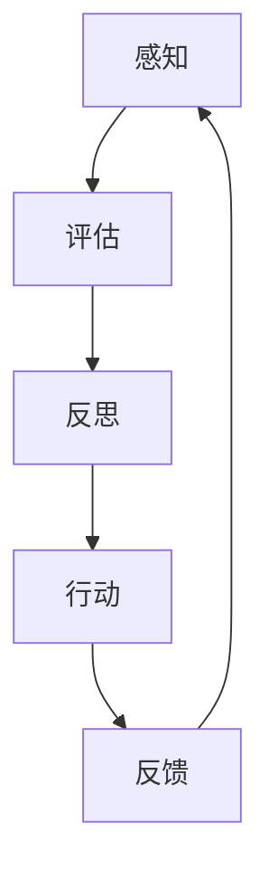

#### 1.1.2 自我认知的方法与工具

了解自我认知的方法与工具是领导力发展的关键步骤。以下是一些常用的方法和工具：

- **自我评估问卷**：通过一系列问题，个体可以评估自己的性格、能力、价值观等。
- **360度反馈**：收集来自同事、上级和下属的评价，帮助个体更全面地了解自己的工作表现。
- **日记反思**：定期记录自己的所思所感，有助于深入思考自己的行为和动机。

以下是一个简单的伪代码示例，展示了一个自我评估方法的实现：

```python
# 自我评估方法
def self_evaluation():
    print("请回答以下问题：")
    print("1. 你认为自己最强的技能是什么？")
    skill = input()
    print("2. 你在工作中最常遇到的问题是什么？")
    problem = input()
    print("3. 你认为自己如何改进当前的工作表现？")
    improvement = input()
    print("评估结果：")
    print("技能：", skill)
    print("问题：", problem)
    print("改进计划：", improvement)
```

### 1.2 建立自我认知模型

建立自我认知模型是领导力发展的重要一环。以下是一个简单的数学模型，用于描述自我认知的架构：

$$
\text{自我认知模型} = f(\text{感知}, \text{评估}, \text{反思}, \text{行动}, \text{反馈})
$$

其中，$f$ 表示一个复合函数，它将感知、评估、反思、行动和反馈这些因素结合起来，形成一个完整的自我认知过程。

以下是一个实际案例，展示了如何应用自我认知模型：

**案例**：一位技术经理通过自我认知模型评估自己的工作表现：

1. **感知**：经理在最近的团队会议上发现自己在沟通上存在一些问题，导致团队成员对其决策理解不足。
2. **评估**：经理通过自我评估问卷，确认自己在沟通技能方面需要提升。
3. **反思**：经理反思了过去的沟通行为，找出可能导致误解的原因，如使用行业术语过多、缺乏具体示例等。
4. **行动**：经理决定在未来的会议中，更多地使用具体例子和简明的语言，以提高沟通效果。
5. **反馈**：在接下来的会议上，经理收到了团队成员的积极反馈，沟通效果得到了显著改善。

通过这个案例，我们可以看到自我认知模型在实践中的应用效果。这不仅有助于个人提升，也对团队的整体表现产生了积极影响。

### 总结

自我认知是领导力发展的重要基石。通过了解自我认知的理论基础、掌握相关方法和工具，并建立自我认知模型，领导可以在职业发展中实现更高的自我认识和成长。下一章将探讨人际关系及其在职场中的重要性。

## 第2章 人际关系

### 2.1 人际关系的理论基础

人际关系是职场中不可或缺的一部分，它不仅影响着个人的职业发展，也影响着团队的协作效率和组织的整体氛围。理解人际关系的理论基础对于领导力的发展至关重要。

#### 2.1.1 人际关系的重要性

人际关系在职场中的重要性体现在以下几个方面：

- **团队合作**：良好的人际关系有助于团队成员之间的有效沟通和协作，从而提高团队的整体绩效。
- **领导力**：人际关系能力是领导力的重要组成部分。一个优秀的领导需要建立和维护良好的人际关系，以便更好地指导和激励团队成员。
- **职业发展**：良好的人际关系有助于个体在职场中获得更多的机会和资源，促进职业发展。

以下是一个简化的Mermaid流程图，展示了人际关系的基本模型：

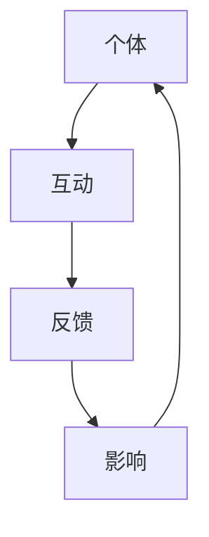

#### 2.1.2 人际关系的维护策略

维护良好的人际关系需要一定的策略和方法。以下是一些关键点：

- **主动沟通**：定期与团队成员沟通，了解他们的想法和需求，及时解决问题。
- **尊重差异**：尊重每个人的个性、文化和背景，避免因差异导致冲突。
- **建立信任**：通过诚信和透明度建立信任，这是维护良好人际关系的基础。
- **相互支持**：在团队成员需要帮助时提供支持，共同应对挑战。

以下是一个简单的伪代码示例，展示了一个基本的人际关系维护策略：

```python
# 人际关系维护策略
def maintain_relationship():
    print("1. 定期沟通：")
    print("请列出您计划与团队成员沟通的具体问题：")
    issues = input()
    print("2. 尊重差异：")
    print("请描述您如何尊重团队成员的差异：")
    respect = input()
    print("3. 建立信任：")
    print("请描述您如何建立信任的方法：")
    trust = input()
    print("4. 相互支持：")
    print("请描述您如何提供支持的实例：")
    support = input()
    print("人际关系维护策略：")
    print("沟通策略：", issues)
    print("尊重差异：", respect)
    print("建立信任：", trust)
    print("相互支持：", support)
```

### 2.2 人际沟通技巧

人际沟通技巧是维护良好人际关系的关键。有效的沟通不仅能够传达信息，还能增进理解和信任。以下是一些核心沟通技巧：

- **倾听**：倾听是沟通的基础。通过倾听，领导可以更好地理解团队成员的需求和意见。
- **明确表达**：清晰、明确地表达自己的想法和意见，避免产生误解。
- **反馈**：及时给予团队成员反馈，无论是正面还是负面，都有助于提高沟通效果。
- **非语言沟通**：注意身体语言、面部表情等非语言沟通方式，它们在传达信息时同样重要。

以下是一个简单的数学模型，用于分析沟通效率：

$$
\text{沟通效率} = f(\text{倾听} + \text{明确表达} + \text{反馈} + \text{非语言沟通})
$$

其中，$f$ 是一个综合评价函数，它将四个关键因素结合起来，评估整体的沟通效率。

以下是一个实际案例，展示了如何应用人际沟通技巧：

**案例**：一位项目经理需要与团队成员讨论一个重要的项目进展。为了确保沟通的有效性，他采取了以下步骤：

1. **倾听**：项目经理在会议开始时，首先请团队成员分享他们的进展和问题。
2. **明确表达**：项目经理在听取团队成员的意见后，清晰地表达了自己对项目的看法和决策。
3. **反馈**：项目经理在讨论过程中，及时给予团队成员反馈，确保他们理解他的意图。
4. **非语言沟通**：项目经理通过积极的肢体语言，如点头、微笑等，传递出对团队成员的支持和鼓励。

通过这个案例，我们可以看到人际沟通技巧在实际应用中的效果。有效的沟通不仅提高了项目进展的效率，也增强了团队成员之间的信任和合作。

### 总结

人际关系在职场中扮演着重要角色。通过理解人际关系的理论基础，掌握维护良好人际关系的策略和技巧，领导可以有效地提高团队协作效率和组织整体氛围。在下一章中，我们将探讨团队管理的重要概念和技巧。

## 第3章 团队管理

### 3.1 团队管理的核心概念

团队管理是领导力的重要方面，它涉及如何有效组织、协调和激励团队成员，以实现组织目标。团队管理的核心概念包括团队目标、团队结构、团队成员的角色和责任等。

#### 3.1.1 团队管理的理论基础

团队管理的理论基础涵盖了多个领域，包括组织行为学、管理学和心理学。以下是几个关键概念及其相互关系：

- **团队目标**：团队目标是团队努力的方向和动力源泉。明确的目标有助于团队成员聚焦于共同的目标，提高团队的效率和绩效。
- **团队结构**：团队结构包括团队的组织形式、角色分配和沟通渠道等。合理的团队结构有助于提高团队协作效率。
- **团队成员的角色和责任**：团队成员的角色和责任是团队成功的关键。明确每个成员的角色和责任，有助于团队成员明确自己的工作职责，提高工作效率。

以下是一个简化的Mermaid流程图，展示了团队管理的基本流程：

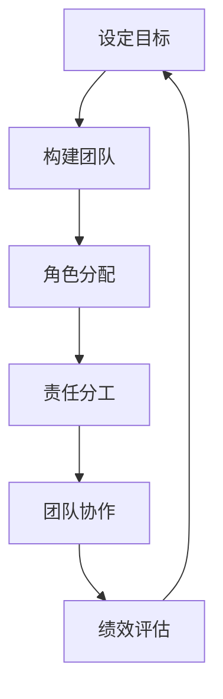

#### 3.1.2 团队管理的原则

团队管理应遵循以下原则：

- **共同目标**：确保团队成员明确团队的目标，并为之共同努力。
- **平等参与**：鼓励团队成员积极参与团队决策，提高团队的凝聚力和创造力。
- **透明沟通**：建立开放的沟通渠道，确保信息的透明和畅通。
- **激励与反馈**：通过激励和反馈机制，鼓励团队成员发挥潜力，提高工作效率。

以下是一个简单的伪代码示例，展示了团队管理的基本策略：

```python
# 团队管理策略
def team_management():
    print("1. 设定共同目标：")
    goal = input()
    print("2. 构建团队：")
    team_members = input()
    print("3. 角色分配：")
    roles = input()
    print("4. 责任分工：")
    responsibilities = input()
    print("5. 平等参与：")
    participation = input()
    print("6. 透明沟通：")
    communication = input()
    print("7. 激励与反馈：")
    motivation = input()
    print("团队管理策略：")
    print("目标：", goal)
    print("团队成员：", team_members)
    print("角色：", roles)
    print("责任：", responsibilities)
    print("参与：", participation)
    print("沟通：", communication)
    print("激励：", motivation)
```

### 3.2 团队协作技巧

团队协作是团队管理的关键环节。有效的团队协作可以提高团队的效率和创造力，实现团队目标。以下是一些核心团队协作技巧：

- **分工明确**：明确每个团队成员的职责，避免职责重叠或遗漏。
- **沟通顺畅**：建立有效的沟通机制，确保团队成员之间信息传递的准确性。
- **合作精神**：培养团队成员的合作精神，鼓励他们相互支持、共同进步。
- **定期会议**：定期召开团队会议，讨论项目进展、问题解决和下一步计划。

以下是一个简单的数学模型，用于评估团队协作效果：

$$
\text{团队协作效果} = f(\text{分工明确} + \text{沟通顺畅} + \text{合作精神} + \text{定期会议})
$$

其中，$f$ 是一个综合评价函数，它将四个关键因素结合起来，评估整体的团队协作效果。

以下是一个实际案例，展示了如何应用团队协作技巧：

**案例**：一个软件开发团队正在开发一个复杂的软件项目。为了确保项目成功，团队采取了以下措施：

1. **分工明确**：项目经理将项目分为多个模块，每个模块由不同的小组负责。
2. **沟通顺畅**：团队建立了每日站立会议，确保每个小组及时了解其他小组的进展和问题。
3. **合作精神**：团队成员在遇到技术难题时，积极互相帮助，共同解决问题。
4. **定期会议**：每周召开一次项目进度会议，总结本周的工作成果和下周的计划。

通过这个案例，我们可以看到团队协作技巧在实际应用中的效果。有效的团队协作不仅提高了项目的效率，也增强了团队成员之间的信任和合作。

### 总结

团队管理是领导力的重要组成部分。通过理解团队管理的核心概念和原则，掌握团队协作技巧，领导可以有效地提高团队的工作效率和创造力。在下一章中，我们将探讨战略规划的重要性及其方法。

## 第4章 战略规划

### 4.1 战略规划的基本概念

战略规划是企业或组织在实现长期目标过程中所制定的一系列策略和行动。它不仅涉及业务发展的方向，还包括资源配置、风险管理和绩效评估等方面。战略规划的基本概念包括愿景、使命、目标、策略和行动计划。

#### 4.1.1 战略规划的重要性

战略规划的重要性体现在以下几个方面：

- **明确方向**：战略规划为组织提供了清晰的愿景和目标，使团队成员知道他们朝着什么方向努力。
- **资源配置**：通过战略规划，组织可以合理配置资源，提高资源利用效率。
- **风险管理**：战略规划有助于识别潜在风险，并制定相应的应对措施，降低风险对企业的影响。
- **持续改进**：战略规划是一个动态过程，它要求组织不断评估和调整策略，以适应外部环境的变化。

以下是一个简化的Mermaid流程图，展示了战略规划的基本流程：

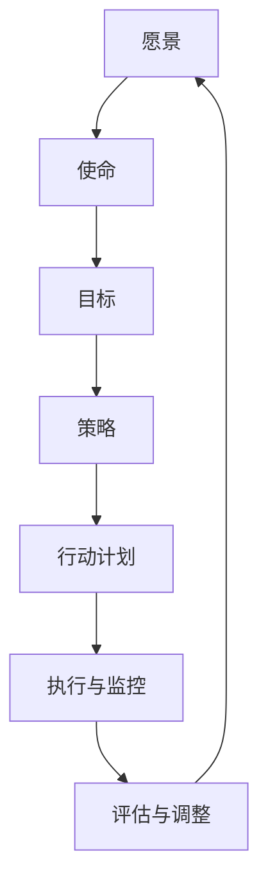

#### 4.1.2 战略规划的方法

战略规划的方法包括以下几个步骤：

1. **外部环境分析**：通过市场研究、竞争分析等手段，了解外部环境的变化趋势。
2. **内部能力评估**：评估组织的内部能力，包括资源、技能和组织结构等。
3. **目标设定**：根据外部环境分析和内部能力评估，设定组织的中长期目标。
4. **策略制定**：制定实现目标的策略，包括市场进入、产品开发、技术创新等。
5. **行动计划**：制定详细的行动计划，明确每个阶段的具体任务和责任人。
6. **执行与监控**：执行行动计划，并定期监控项目进展，确保目标实现。
7. **评估与调整**：根据执行情况和外部环境变化，评估战略规划的成效，并进行必要的调整。

以下是一个简单的伪代码示例，展示了战略规划的方法：

```python
# 战略规划方法
def strategic_planning():
    print("1. 外部环境分析：")
    environment = input()
    print("2. 内部能力评估：")
    capabilities = input()
    print("3. 目标设定：")
    goals = input()
    print("4. 策略制定：")
    strategies = input()
    print("5. 行动计划：")
    action_plan = input()
    print("6. 执行与监控：")
    execution = input()
    print("7. 评估与调整：")
    evaluation = input()
    print("战略规划方法：")
    print("外部环境：", environment)
    print("内部能力：", capabilities)
    print("目标：", goals)
    print("策略：", strategies)
    print("行动计划：", action_plan)
    print("执行与监控：", execution)
    print("评估与调整：", evaluation)
```

### 4.2 战略执行与监控

战略执行与监控是确保战略规划成功实施的关键环节。以下是一些关键点：

1. **明确责任**：为每个任务分配明确的责任人，确保任务得到有效执行。
2. **定期评估**：定期评估项目进展，确保符合战略规划的要求。
3. **沟通反馈**：建立有效的沟通渠道，及时反馈项目进展和问题，确保所有相关人员了解当前状况。
4. **灵活调整**：根据实际情况，灵活调整战略规划和行动计划，以应对外部环境的变化。

以下是一个简单的数学模型，用于评估战略执行效果：

$$
\text{战略执行效果} = f(\text{责任明确} + \text{定期评估} + \text{沟通反馈} + \text{灵活调整})
$$

其中，$f$ 是一个综合评价函数，它将四个关键因素结合起来，评估整体的战略执行效果。

以下是一个实际案例，展示了如何应用战略执行与监控的方法：

**案例**：一家科技公司在市场调研后，决定进入一个新的市场。为了确保战略成功实施，公司采取了以下步骤：

1. **明确责任**：公司为每个关键任务分配了明确的责任人，确保任务得到有效执行。
2. **定期评估**：公司定期召开会议，评估项目进展，确保符合战略规划的要求。
3. **沟通反馈**：公司建立了内部沟通平台，及时反馈项目进展和问题，确保所有相关人员了解当前状况。
4. **灵活调整**：根据市场变化，公司灵活调整了战略规划和行动计划，以应对外部环境的变化。

通过这个案例，我们可以看到战略执行与监控在实际应用中的效果。有效的战略执行和监控不仅确保了公司目标的实现，也提高了团队的协作效率。

### 总结

战略规划是组织发展的重要环节。通过理解战略规划的基本概念和方法，掌握战略执行与监控的技巧，领导可以有效地推动组织实现长期目标。在下一章中，我们将探讨领导力的定义及其分类。

## 第5章 领导力提升

### 5.1 领导力的定义与分类

领导力是一种能够激发和引导团队成员实现共同目标的能力。它不仅涉及个人的管理技能，还包括情感智慧、决策能力、沟通技巧等多方面素质。理解领导力的定义和分类有助于提升领导者的综合素质。

#### 5.1.1 领导力的定义

领导力的定义可以从不同角度进行解读：

- **管理角度**：领导力是管理职能的一部分，涉及规划、组织、领导和控制。
- **心理角度**：领导力是一种内在的驱动力，包括自我认知、自我调节和情感管理。
- **行为角度**：领导力是领导者通过行为和决策影响他人实现共同目标的能力。

以下是一个简化的Mermaid流程图，展示了领导力的定义：

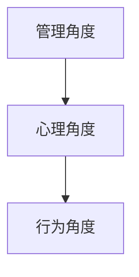

#### 5.1.2 领导力的分类

领导力可以根据不同的标准进行分类：

- **根据领导风格**：领导风格包括独裁型、民主型、放任型等。每种风格都有其适用的场景和优缺点。
- **根据领导目标**：领导目标可分为任务型领导和关系型领导。任务型领导侧重于任务完成，关系型领导则注重团队成员的福祉。
- **根据领导层级**：领导力可分为高层领导、中层领导和基层领导。不同层级的领导面临的不同挑战和责任。

以下是一个简单的Mermaid流程图，展示了领导力的分类：

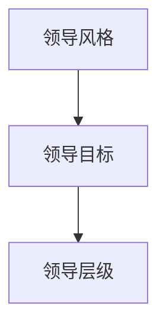

#### 5.1.3 评估领导力的工具

评估领导力需要综合多个维度，以下是一些常用的工具：

- **360度反馈**：通过收集来自上级、同事和下属的评价，全面了解领导者的表现。
- **领导力问卷**：使用标准化的问卷评估领导者的管理能力、情感智慧和决策能力。
- **行为观察**：通过观察领导者的日常行为，评估其领导风格和影响力。

以下是一个简单的伪代码示例，展示了一个领导力评估工具：

```python
# 领导力评估工具
def leadership_evaluation():
    print("请回答以下问题：")
    print("1. 您认为自己在管理能力方面表现如何？")
    management = int(input())
    print("2. 您认为自己在情感智慧方面表现如何？")
    emotional_intelligence = int(input())
    print("3. 您认为自己在决策能力方面表现如何？")
    decision_making = int(input())
    print("4. 您认为自己如何影响团队成员？")
    influence = input()
    print("评估结果：")
    print("管理能力：", management)
    print("情感智慧：", emotional_intelligence)
    print("决策能力：", decision_making)
    print("影响力：", influence)
```

### 5.2 领导力培养

提升领导力是一个持续的过程，需要通过多种途径进行培养。以下是一些关键点：

- **教育**：通过正规的教育和培训课程，学习领导力理论和实践知识。
- **实践**：在实际工作中，不断实践和应用所学的领导力技能。
- **反思**：定期反思自己的领导行为，识别优点和不足，进行改进。
- **反馈**：寻求上级、同事和下属的反馈，了解自己的领导风格和影响。

以下是一个简单的数学模型，用于描述领导力培养的过程：

$$
\text{领导力培养} = f(\text{教育} + \text{实践} + \text{反思} + \text{反馈})
$$

其中，$f$ 是一个综合评价函数，它将四个关键因素结合起来，评估整体的领导力培养效果。

以下是一个实际案例，展示了如何培养领导力：

**案例**：一位中层管理者通过以下步骤提升自己的领导力：

1. **教育**：参加了领导力培训课程，学习了相关的理论知识和实用技巧。
2. **实践**：在工作中，积极应用所学的领导力技能，如沟通技巧和决策能力。
3. **反思**：定期反思自己的领导行为，通过日记或会议记录，识别自己的优点和不足。
4. **反馈**：主动寻求上级和同事的反馈，了解自己在团队中的影响和领导风格。

通过这个案例，我们可以看到领导力培养在实际应用中的效果。有效的领导力培养不仅提升了管理者的个人能力，也增强了团队的凝聚力和执行力。

### 总结

领导力提升是领导力发展的重要环节。通过理解领导力的定义和分类，掌握评估领导力的工具，并采取有效的培养方法，领导者可以不断提升自己的综合素质，为组织的发展贡献力量。在下一章中，我们将探讨职场心态建设的重要性及其方法。

## 第6章 职场心态建设

### 6.1 职场心态的重要性

职场心态是职场人士在工作和生活中表现出的心理状态和态度，它直接影响个人的工作效率、职业发展和生活质量。一个良好的职场心态能够帮助员工应对各种挑战，保持积极向上的态度，从而实现个人和组织的共同目标。

#### 6.1.1 职场心态对职业发展的影响

职场心态对职业发展的影响主要体现在以下几个方面：

- **工作效率**：积极的职场心态能够提高员工的工作效率，使他们在面对任务时更加专注和有条不紊。
- **团队合作**：良好的心态有助于员工更好地与团队成员沟通和协作，提高团队的凝聚力和战斗力。
- **职业发展**：一个健康的职场心态能够帮助员工更好地应对职业发展中的挑战，如晋升、转岗等，从而实现职业生涯的持续发展。
- **工作满意度**：积极的职场心态能够提高员工的工作满意度，使他们更加享受工作过程，减少职业倦怠。

以下是一个简化的Mermaid流程图，展示了职场心态对职业发展的影响：

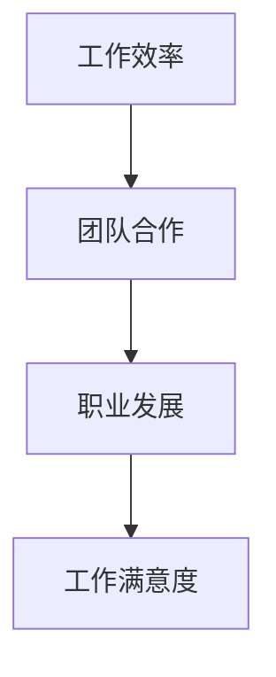

#### 6.1.2 职场心态的基本要素

职场心态的基本要素包括自信、乐观、耐心、专注和适应性等。以下是对这些要素的简要说明：

- **自信**：自信是职场心态的核心要素之一，它使员工在面对困难和挑战时保持冷静和坚定。
- **乐观**：乐观的态度能够帮助员工更好地应对工作中的挫折和失败，从而保持积极向上的心态。
- **耐心**：耐心是职场成功的重要因素，它使员工能够在面对长期任务和挑战时保持坚持和耐心。
- **专注**：专注使员工能够集中精力完成任务，提高工作效率和质量。
- **适应性**：适应性使员工能够快速适应环境变化，灵活应对新的挑战和任务。

以下是一个简单的Mermaid流程图，展示了职场心态的基本要素：

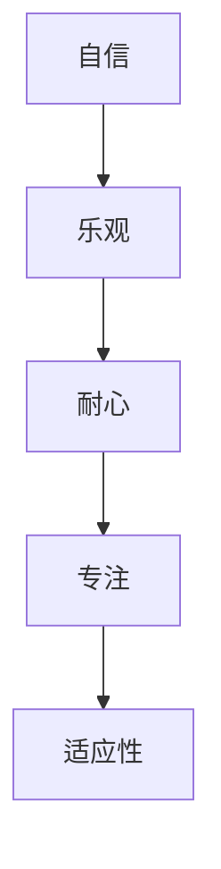

### 6.2 职场压力管理

职场压力是职场心态建设中的一个重要问题，有效的压力管理有助于保持良好的职场心态。以下是一些常用的压力管理策略：

- **时间管理**：合理安排工作时间，避免过度工作，确保有足够的休息时间。
- **情绪调节**：通过深呼吸、冥想、运动等方法，缓解紧张情绪，保持心态平衡。
- **积极沟通**：与同事、上级和下属进行有效沟通，分享自己的困惑和压力，寻求支持和帮助。
- **设定目标**：设定合理的工作目标，避免因任务过多或目标过高而产生压力。
- **休息与放松**：定期休息和放松，如进行短暂的休假、阅读书籍、参加兴趣活动等。

以下是一个简单的伪代码示例，展示了如何进行压力管理：

```python
# 压力管理策略
def stress_management():
    print("1. 时间管理：")
    print("请描述您如何合理安排工作时间：")
    time_management = input()
    print("2. 情绪调节：")
    print("请描述您如何缓解紧张情绪：")
    emotion Regulation = input()
    print("3. 积极沟通：")
    print("请描述您如何与同事沟通：")
    communication = input()
    print("4. 设定目标：")
    print("请描述您如何设定合理的工作目标：")
    goal_setting = input()
    print("5. 休息与放松：")
    print("请描述您如何休息和放松：")
    rest_and_recreation = input()
    print("压力管理策略：")
    print("时间管理：", time_management)
    print("情绪调节：", emotion Regulation)
    print("积极沟通：", communication)
    print("设定目标：", goal_setting)
    print("休息与放松：", rest_and_recreation)
```

### 6.3 积极心态的培养

积极心态的培养是职场心态建设的重要一环。以下是一些培养积极心态的方法：

- **自我激励**：通过设定小目标、庆祝成就、自我肯定等方式，激励自己保持积极的心态。
- **正面思维**：改变消极的思维模式，学会从困难和挫折中寻找机会和收获。
- **感恩心态**：对工作中的帮助和机会表示感激，培养感恩的心态。
- **持续学习**：不断学习新知识、新技能，提升自己的能力，增强自信心。

以下是一个简单的Mermaid流程图，展示了培养积极心态的方法：

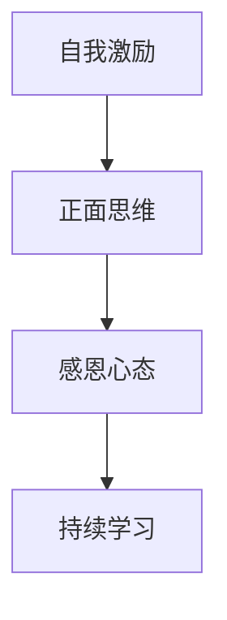

### 6.4 实际案例

以下是一个实际案例，展示了如何培养积极心态和有效管理职场压力：

**案例**：一位年轻的软件工程师在项目中遇到了困难，感到压力巨大。为了克服这些困难，他采取了以下措施：

1. **自我激励**：他设定了一个小目标，每天至少完成一项关键的编程任务。
2. **正面思维**：他学会了从困难中寻找机会，通过不断尝试和学习，逐渐找到了解决问题的方法。
3. **感恩心态**：他感谢团队中同事的指导和帮助，使他在项目中能够快速成长。
4. **持续学习**：他利用业余时间学习相关的编程技能，提升自己的专业能力。

通过这个案例，我们可以看到积极心态和有效压力管理在实际应用中的效果。这位工程师不仅成功克服了项目中的困难，还实现了个人的职业发展。

### 总结

职场心态建设对职业发展至关重要。通过理解职场心态的重要性，掌握压力管理和培养积极心态的方法，职场人士可以更好地应对工作挑战，实现个人和职业目标。在下一章中，我们将探讨成长与反思的重要性及其方法。

## 第7章 成长与反思

### 7.1 成长路径的规划

个人成长是职场人士持续进步的关键。制定合理的成长路径规划，可以帮助职场人士明确目标，提升能力，实现职业生涯的持续发展。

#### 7.1.1 成长路径规划的重要性

成长路径规划的重要性体现在以下几个方面：

- **明确目标**：成长路径规划有助于职场人士明确自己的职业目标，从而更好地制定发展计划。
- **提升能力**：通过规划，职场人士可以系统地学习新知识和技能，不断提升自己的综合素质。
- **应对挑战**：成长路径规划可以帮助职场人士提前预判可能遇到的挑战，并制定相应的应对策略。
- **持续发展**：一个明确的成长路径规划有助于职场人士在职业生涯中实现持续发展，不断提高自己的职业高度。

以下是一个简单的Mermaid流程图，展示了成长路径规划的基本流程：

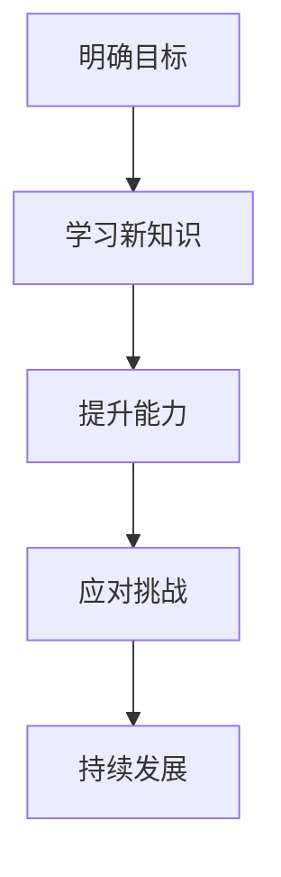

#### 7.1.2 成长路径规划的方法

制定成长路径规划通常包括以下几个步骤：

1. **自我评估**：通过自我评估，了解自己的优势和劣势，明确自己的兴趣和能力。
2. **设定目标**：根据自我评估的结果，设定短期和长期的目标，确保目标具有可实现性和挑战性。
3. **制定计划**：制定详细的学习和成长计划，包括学习内容、时间安排和资源分配等。
4. **实施与调整**：根据计划实施成长路径，并定期评估进展，及时调整策略。

以下是一个简单的伪代码示例，展示了成长路径规划的方法：

```python
# 成长路径规划方法
def growth_path_planning():
    print("1. 自我评估：")
    print("请描述您的优势和劣势：")
    self_assessment = input()
    print("2. 设定目标：")
    print("请设定您的短期和长期目标：")
    goals = input()
    print("3. 制定计划：")
    print("请描述您的学习和成长计划：")
    plan = input()
    print("4. 实施与调整：")
    print("请描述您如何实施计划和调整策略：")
    implementation = input()
    print("成长路径规划方法：")
    print("自我评估：", self_assessment)
    print("目标：", goals)
    print("计划：", plan)
    print("实施与调整：", implementation)
```

### 7.2 反思与改进

反思与改进是个人成长的重要环节。通过反思过去的经验和行为，职场人士可以发现不足，从而进行改进，提高自己的能力和效率。

#### 7.2.1 反思的重要性

反思的重要性体现在以下几个方面：

- **发现问题**：反思可以帮助职场人士发现自身存在的问题，从而有针对性地进行改进。
- **积累经验**：通过反思，职场人士可以总结过去的经验，为未来的发展提供借鉴。
- **提高能力**：反思不仅有助于发现问题，还可以促进职场人士思考如何改进，从而提高自己的能力。
- **持续成长**：反思与改进是一个持续的过程，有助于职场人士实现持续成长。

以下是一个简单的Mermaid流程图，展示了反思与改进的基本流程：

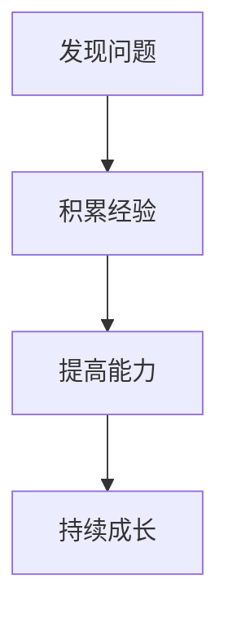

#### 7.2.2 反思与改进的方法

以下是一些有效的反思与改进方法：

1. **定期总结**：定期对自己的工作和行为进行总结，分析成功的经验和失败的教训。
2. **记录日志**：通过记录日志，记录每天的工作内容和思考，方便后续的反思和总结。
3. **反馈与交流**：主动寻求同事、上级和下属的反馈，了解自己的工作表现，并从中吸取改进的建议。
4. **持续学习**：通过学习新知识、新技能，不断提升自己的能力，为改进提供支持。

以下是一个简单的伪代码示例，展示了如何进行反思与改进：

```python
# 反思与改进方法
def reflection_and_improvement():
    print("1. 定期总结：")
    print("请描述您如何定期总结工作和行为：")
    summary = input()
    print("2. 记录日志：")
    print("请描述您如何记录日志：")
    logging = input()
    print("3. 反馈与交流：")
    print("请描述您如何寻求反馈和交流：")
    feedback = input()
    print("4. 持续学习：")
    print("请描述您如何持续学习：")
    learning = input()
    print("反思与改进方法：")
    print("总结：", summary)
    print("日志：", logging)
    print("反馈：", feedback)
    print("学习：", learning)
```

### 7.3 持续成长

持续成长是职场人士在职业生涯中取得成功的关键。以下是一些实现持续成长的方法：

- **设定小目标**：通过设定小目标，逐步实现大目标，保持成长的动力。
- **积极参与项目**：通过参与不同类型的项目，拓宽自己的经验和视野。
- **主动学习**：主动学习新知识和技能，不断提升自己的能力。
- **寻求反馈**：主动寻求同事、上级和下属的反馈，了解自己的工作表现，并从中吸取改进的建议。

以下是一个简单的数学模型，用于描述持续成长的过程：

$$
\text{持续成长} = f(\text{设定小目标} + \text{积极参与项目} + \text{主动学习} + \text{寻求反馈})
$$

其中，$f$ 是一个综合评价函数，它将四个关键因素结合起来，评估整体的持续成长效果。

### 总结

成长与反思是职场人士实现持续发展的关键。通过制定合理的成长路径规划，进行有效的反思与改进，职场人士可以不断提升自己的能力和素质，实现职业生涯的持续发展。在下一章中，我们将总结全文，并提供一些最佳实践和注意事项。

## 全文总结与最佳实践

通过本文的探讨，我们深入了解了领导力修炼对80后职场精英成长的重要性。从自我认知、人际关系、团队管理、战略规划、领导力提升、职场心态建设到成长与反思，每个章节都为我们揭示了领导力发展的关键要素和实践方法。以下是全文总结及最佳实践：

### 核心观点总结

- **自我认知**：了解自己是领导力发展的基础。通过自我评估、反思和反馈，领导者可以不断提升自我认知，明确个人目标和价值观。
- **人际关系**：建立和维护良好的人际关系是团队协作和组织发展的关键。有效的沟通技巧和尊重差异是维护良好人际关系的基石。
- **团队管理**：有效的团队管理需要明确的目标、合理的结构和明确的角色分工。通过协作技巧和定期评估，团队可以高效地实现目标。
- **战略规划**：战略规划是组织发展的指南针。通过外部环境分析、内部能力评估和目标设定，领导者可以为组织制定清晰的发展路径。
- **领导力提升**：领导力的提升是一个持续的过程。通过教育、实践、反思和反馈，领导者可以不断提升自己的综合素质。
- **职场心态建设**：健康的职场心态是高效工作和职业发展的保障。通过时间管理、情绪调节、积极心态的培养，职场人士可以更好地应对挑战。
- **成长与反思**：持续成长和反思是职场人士实现职业生涯持续发展的关键。通过设定小目标、积极参与项目、主动学习和寻求反馈，职场人士可以不断提升自己的能力和素质。

### 最佳实践

- **定期自我评估**：每季度或每年进行一次全面的自我评估，了解自己的优势、劣势和成长需求。
- **建立沟通机制**：定期召开团队会议，确保团队成员之间的沟通畅通，及时解决问题。
- **持续学习**：定期参加培训课程，学习新的知识和技能，不断提升自己的专业能力。
- **设定明确目标**：为个人和团队设定明确的短期和长期目标，确保目标具有可实现性和挑战性。
- **积极应对挑战**：在面对困难和挫折时，保持积极的心态，从失败中吸取教训，不断尝试和改进。
- **寻求反馈**：主动寻求同事、上级和下属的反馈，了解自己的工作表现，并根据反馈进行改进。

### 注意事项

- **平衡工作与生活**：在追求职业发展的同时，要注意平衡工作与生活，保持身心健康。
- **避免盲目跟风**：在学习和应用新的理论和技巧时，要结合自身实际情况，避免盲目跟风。
- **持续反思**：定期反思自己的行为和决策，从中发现不足，不断进行改进。

### 拓展阅读

- **《领导力心理学》**：了解领导力在心理学领域的应用，提高领导力的科学性和实践性。
- **《高效能人士的七个习惯》**：学习高效能人士的习惯，提升个人综合素质。
- **《职场心理学》**：了解职场心理学的理论和方法，提高职场沟通和人际关系管理能力。

通过本文的探讨，希望读者能够深刻理解领导力修炼对职业发展的重要性，并在实际工作中不断实践和应用，实现个人和团队的共同成长。

## 作者信息

作者：AI天才研究院/AI Genius Institute & 禅与计算机程序设计艺术 /Zen And The Art of Computer Programming

感谢您阅读本文，希望本文对您的职业发展有所帮助。如果您有任何问题或建议，欢迎随时与我们联系。祝您在职业道路上取得更加辉煌的成就！

