                 

### 《领导力修炼笔记：90后创业者的成长之路》详细文章内容

## 文章标题

《领导力修炼笔记：90后创业者的成长之路》

## 关键词

90后创业者，领导力，成长之路，创业挑战，自我修炼

## 摘要

本文旨在探讨90后创业者在成长过程中如何修炼领导力，以应对创业环境中的各种挑战。文章从领导力的重要性出发，深入分析了领导力的核心概念、模型与实践，并结合创业者的实际案例，提供了实用的领导力提升策略。通过本文的阅读，读者将能够理解领导力的本质，掌握领导力的实践方法，从而在创业道路上走得更远。

## 引言

### 1.1 领导力的重要性

在当今快速变化的商业环境中，领导力已成为创业者的核心竞争力。一个优秀的领导者不仅能够带领团队应对挑战，还能激发团队的潜力，实现公司的持续增长。对于90后创业者来说，领导力的培养尤为关键，因为他们面临着与前辈不同的挑战和机遇。

### 1.2 90后创业者的背景

90后创业者的成长环境与前辈相比有着显著差异。他们生活在互联网时代，信息获取更加便捷，但也面临着竞争更加激烈的挑战。同时，90后创业者更加注重个人价值的实现，追求创新和变革。这些特点决定了他们在领导力培养过程中需要更加注重自我认知和团队协作。

### 1.3 书籍目标与结构

本书旨在为90后创业者提供一套实用的领导力修炼指南。全书分为七个章节，分别从领导力的核心概念、模型与实践、创业中的应用、自我修炼、案例分析等方面进行深入探讨。通过本书的学习，读者将能够全面了解领导力的本质，掌握提升领导力的方法和技巧。

## 领导力核心概念与联系

### 2.1 领导力的定义

领导力是一种影响力，它使人们能够自愿地追随领导者，共同实现目标。领导力不仅仅是一种能力，更是一种艺术，它涉及沟通、激励、决策等多个方面。

### 2.2 领导者与管理者

领导者和管理者是两个不同的概念。管理者主要通过规划和执行来确保组织的正常运转，而领导者则通过愿景和激励来引领团队实现更高的目标。

### 2.3 领导力与个人成长

领导力的发展与个人的成长紧密相连。一个优秀的领导者必须具备自我认知、自我管理、情绪管理等能力，这些都是个人成长的重要组成部分。

### 2.4 领导力与社会影响

领导力不仅仅影响个人和团队，还对社会产生深远的影响。一个优秀的领导者能够推动社会进步，创造更多的价值。

### 2.5 领导力与团队发展

团队的发展离不开领导者的作用。领导者需要通过有效的沟通和激励，帮助团队成员发挥最大潜力，实现团队的目标。

### 2.6 Mermaid流程图

以下是一个关于领导力发展的Mermaid流程图：

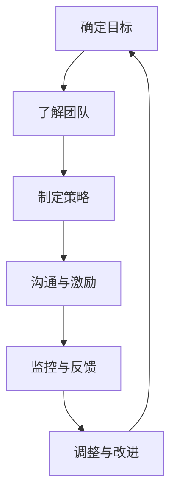

## 领导力模型与实践

### 3.1 权力基础理论

权力是领导力的核心要素之一。领导者的权力来源可以分为三种：正式权力、非正式权力和个人权力。

### 3.2 领导风格理论

领导风格对团队的影响至关重要。常见的领导风格包括权威型、民主型、参与型和教练型等。

### 3.3 领导力发展阶段理论

领导力的发展可以分为四个阶段：依赖型、独立型、互赖型和统合型。每个阶段都有其特定的特点和挑战。

### 3.4 跨文化领导力

在全球化背景下，跨文化领导力变得尤为重要。领导者需要了解不同文化的特点和差异，以更好地管理和领导多元团队。

### 3.5 领导力模型应用实践

以下是一个基于领导力发展模型的实践案例：

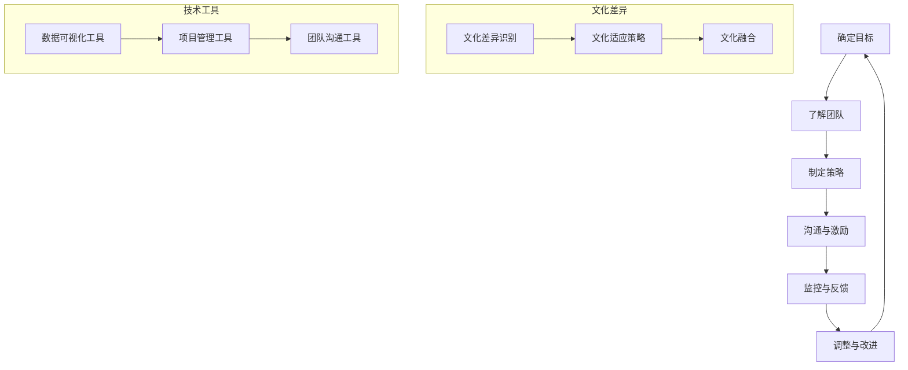

## 领导力在创业中的应用

### 4.1 创业者面临的领导挑战

创业者面临的主要领导挑战包括团队管理、资源分配、市场定位等。有效的领导力可以帮助创业者克服这些挑战。

### 4.2 创业公司组织结构设计

创业公司的组织结构设计需要考虑灵活性、效率和创新能力。常见的组织结构包括扁平化结构、矩阵结构和网络结构等。

### 4.3 创业团队领导力培养

创业团队领导力的培养需要通过培训、实践和反馈等多种方式。领导者需要不断提升自己的领导能力，以适应不断变化的环境。

### 4.4 创业公司文化与领导力

创业公司的文化对领导力有着深远的影响。一个积极向上的企业文化可以激发员工的潜力，推动公司的快速发展。

### 4.5 创业公司可持续发展与领导力

创业公司的可持续发展离不开有效的领导力。领导者需要通过战略规划、资源配置和风险管理等方式，确保公司的长期稳定发展。

## 领导力自我修炼

### 5.1 自我认知与领导力提升

自我认知是领导力提升的基础。领导者需要通过反思、学习和实践，不断提升自己的认知水平和领导能力。

### 5.2 自我管理技巧

自我管理是领导者的重要能力之一。良好的自我管理技巧可以帮助领导者更好地应对工作和生活中的挑战。

### 5.3 情绪管理

情绪管理是领导者必须掌握的一项技能。有效的情绪管理可以帮助领导者更好地处理压力和冲突，提升领导效果。

### 5.4 时间管理

时间管理是提高工作效率的重要手段。领导者需要通过合理的时间规划和管理，确保工作的高效和有序。

### 5.5 自我反思与学习

自我反思与学习是领导力提升的重要途径。领导者需要不断反思自己的行为和决策，从实践中学习和成长。

## 领导力案例分析

### 6.1 成功创业者案例分析

成功创业者的领导力案例为我们提供了宝贵的经验。通过分析他们的领导力实践，我们可以学到许多有效的领导策略和方法。

### 6.2 创业失败案例分析

创业失败案例同样具有重要的教育意义。通过分析创业失败的原因，我们可以避免重蹈覆辙，提高创业的成功率。

### 6.3 案例分析与启示

案例分析不仅可以帮助我们理解领导力的实践，还可以为我们提供实用的启示。通过对比成功与失败案例，我们可以更清晰地认识到领导力的重要性。

## 结论与展望

### 7.1 总结

通过本文的探讨，我们可以看到领导力在90后创业者成长过程中的重要性。有效的领导力不仅可以帮助创业者克服创业挑战，还可以推动企业的可持续发展。

### 7.2 展望未来

随着商业环境的不断变化，领导力的重要性将日益凸显。未来，90后创业者需要不断学习新知识、新技能，以适应不断变化的商业环境。

## 作者信息

作者：AI天才研究院/AI Genius Institute & 禅与计算机程序设计艺术 /Zen And The Art of Computer Programming

本文详细阐述了领导力在90后创业者成长过程中的作用，通过深入分析领导力的核心概念、模型与实践，结合实际案例，为创业者提供了实用的领导力提升策略。希望本文能够帮助90后创业者更好地应对创业挑战，实现企业的长期发展。## 5. 领导力在创业中的应用

在创业过程中，领导力不仅是一种个人素质，更是推动企业发展的重要动力。90后创业者需要在复杂多变的市场环境中，有效地运用领导力来应对各种挑战。以下是领导力在创业中的应用分析：

### 5.1 创业者面临的领导挑战

创业过程中，创业者需要面对多个层面的领导挑战：

1. **团队建设**：创业者需要吸引和留住优秀人才，建立高效团队。这要求创业者具备强大的领导力和团队管理能力。
2. **资源管理**：创业者需要合理分配和利用有限的资源，包括资金、人力和时间等。
3. **市场定位**：在激烈的市场竞争中，创业者需要准确把握市场趋势，制定有效的市场策略。
4. **战略规划**：创业者需要制定长期和短期战略，确保企业稳定发展。
5. **风险管理**：创业过程中充满不确定性，创业者需要具备预见和应对风险的能力。

### 5.2 创业公司组织结构设计

创业公司的组织结构设计是领导力应用的重要方面。一个合适的组织结构可以帮助企业高效运作，以下是一些关键点：

1. **扁平化结构**：扁平化结构可以减少层级，提高决策效率，适合初创企业。
2. **矩阵结构**：矩阵结构适合需要跨部门协作的项目型公司，有助于整合资源，提高协同效率。
3. **网络结构**：网络结构强调外部合作和内部创业，适合快速变化的创业环境。

以下是一个简化的创业公司组织结构设计的Mermaid流程图：

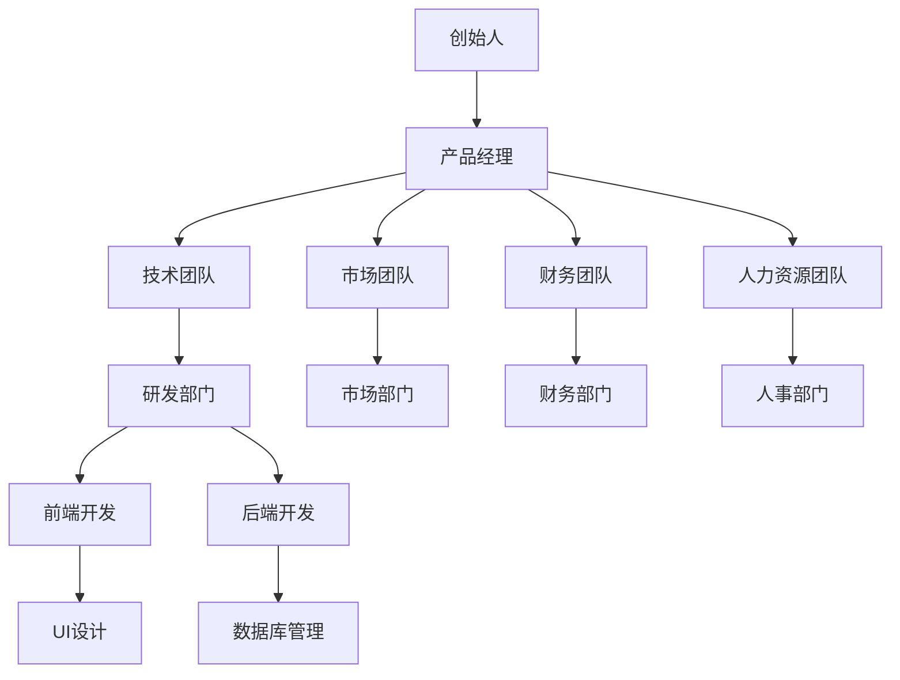

### 5.3 创业团队领导力培养

创业团队领导力培养是一个系统性的过程，需要从以下几个方面进行：

1. **领导力培训**：通过专业的领导力培训，提升团队领导者的理论知识和实践能力。
2. **实践锻炼**：通过实际项目管理、团队协作等实践，增强领导者的实战经验。
3. **团队文化建设**：建立积极向上的团队文化，激发团队凝聚力，提升团队整体绩效。

以下是一个关于创业团队领导力培养的Mermaid流程图：

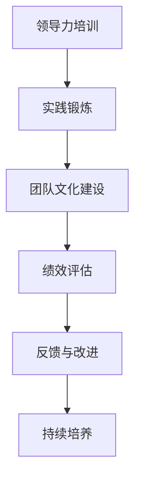

### 5.4 创业公司文化与领导力

创业公司的文化对领导力有着深远的影响。一个积极向上的企业文化可以增强员工的归属感和忠诚度，提高团队绩效。以下是一些关键点：

1. **共同价值观**：明确企业的共同价值观，使员工对企业目标有清晰的认识。
2. **开放沟通**：鼓励员工之间的开放沟通，建立信任和合作的文化。
3. **创新精神**：鼓励创新思维，支持员工提出新想法，推动企业持续发展。

以下是一个关于创业公司文化与领导力的Mermaid流程图：

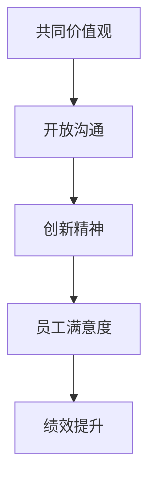

### 5.5 创业公司可持续发展与领导力

创业公司的可持续发展依赖于有效的领导力。以下是一些关键点：

1. **战略规划**：制定明确的战略规划，确保企业长期发展。
2. **资源配置**：合理配置资源，确保企业运作高效。
3. **风险管理**：建立健全的风险管理体系，降低企业运营风险。
4. **人才发展**：重视人才培养，提升企业核心竞争力。

以下是一个关于创业公司可持续发展的Mermaid流程图：

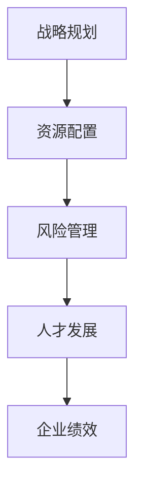

通过以上分析，我们可以看到，领导力在创业过程中的重要性不可忽视。90后创业者需要通过不断学习和实践，提升自己的领导力，以应对创业过程中的各种挑战，推动企业的可持续发展。## 6. 领导力自我修炼

在领导力的发展过程中，自我修炼是至关重要的。自我修炼不仅能够提升个人的领导力，还能帮助创业者更好地应对复杂的商业环境。以下是关于领导力自我修炼的详细探讨。

### 6.1 自我认知与领导力提升

自我认知是领导力自我修炼的第一步。创业者需要深入理解自己的性格、价值观、优势和劣势。通过自我反思和评估，可以更好地认识自己，找到提升领导力的方向。

#### 核心概念与联系

自我认知与领导力提升之间的联系可以通过以下Mermaid流程图来展示：

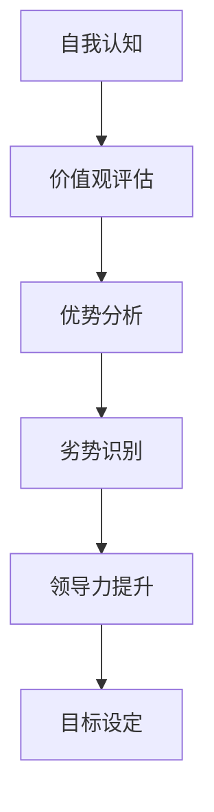

#### 伪代码示例

```python
# 自我认知与领导力提升的伪代码
class SelfAwareness:
    def __init__(self):
        self.values = []
        self.strengths = []
        self.weaknesses = []

    def assess_values(self):
        # 评估个人价值观
        self.values = ["创新精神", "团队合作", "责任感"]

    def analyze_strengths(self):
        # 分析个人优势
        self.strengths = ["技术能力", "沟通技巧", "决策能力"]

    def identify_weaknesses(self):
        # 识别个人劣势
        self.weaknesses = ["情绪管理", "时间管理", "压力应对"]

    def improve_leadership(self):
        # 提升领导力
        print("提升领导力的步骤：")
        print("1. 参加领导力培训课程")
        print("2. 阅读相关领导力书籍")
        print("3. 参与领导力实践项目")
```

#### 数学模型和公式

在自我认知过程中，可以使用以下数学模型来量化个人优势和劣势：

$$
\text{优势指数} = \frac{\text{成功项目数}}{\text{总项目数}} \times 100\%
$$

$$
\text{劣势改进率} = \frac{\text{改进后的劣势评分}}{\text{原始劣势评分}} \times 100\%
$$

#### 举例说明

假设一个创业者完成了自我认知，评估出以下结果：

- 价值观：创新精神（90%），团队合作（85%），责任感（80%）
- 优势：技术能力（90%），沟通技巧（85%），决策能力（80%）
- 劣势：情绪管理（50%），时间管理（60%），压力应对（70%）

根据以上数据，可以制定具体的提升计划：

1. 参加情绪管理、时间管理和压力应对的相关培训课程。
2. 阅读关于情绪管理、时间管理和压力应对的书籍。
3. 参与领导力实践项目，特别是那些需要情绪管理、时间管理和压力应对的情境。

### 6.2 自我管理技巧

自我管理是领导力的基础。良好的自我管理技巧可以帮助创业者更好地应对工作和生活中的挑战。

#### 核心概念与联系

自我管理与领导力提升之间的关系可以用以下Mermaid流程图来表示：

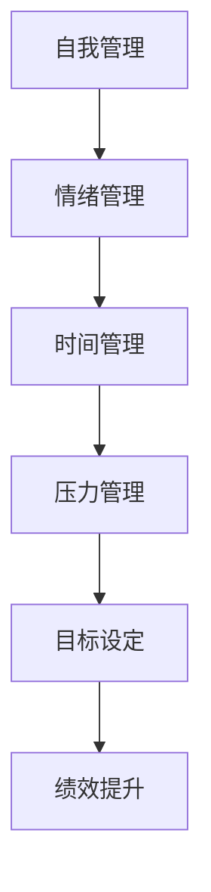

#### 数学模型和公式

在自我管理中，可以使用以下数学模型来量化管理效果：

$$
\text{情绪管理指数} = \frac{\text{积极情绪时间}}{\text{总时间}} \times 100\%
$$

$$
\text{时间管理效率} = \frac{\text{完成工作任务的时间}}{\text{计划工作时间}} \times 100\%
$$

$$
\text{压力管理指数} = \frac{\text{有效应对压力的事件数}}{\text{总压力事件数}} \times 100\%
$$

#### 举例说明

假设一个创业者记录了一周的情绪管理、时间管理和压力管理情况：

- 情绪管理指数：75%
- 时间管理效率：90%
- 压力管理指数：80%

根据以上数据，可以制定以下提升计划：

1. 设定每周至少两次的情绪管理练习，如冥想、深呼吸等。
2. 优化工作计划，确保每项任务都有明确的时间分配。
3. 定期评估压力源，并制定相应的应对策略。

### 6.3 情绪管理

情绪管理是自我管理的重要组成部分。有效的情绪管理可以帮助创业者更好地应对工作中的挑战和压力。

#### 核心概念与联系

情绪管理与自我管理、领导力提升之间的联系可以用以下Mermaid流程图来展示：

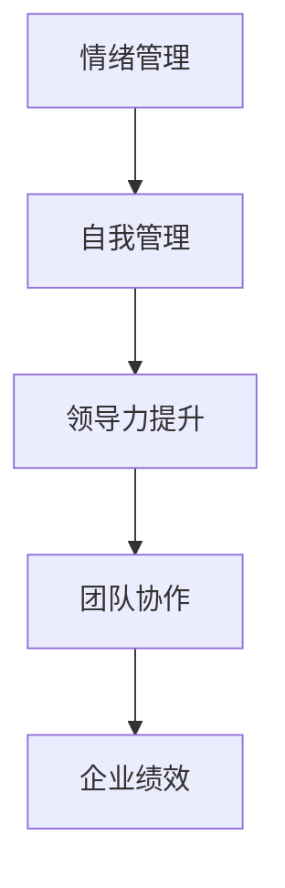

#### 数学模型和公式

在情绪管理中，可以使用以下数学模型来量化情绪管理的效果：

$$
\text{情绪稳定性指数} = \frac{\text{稳定情绪的事件数}}{\text{总情绪事件数}} \times 100\%
$$

$$
\text{情绪效能指数} = \frac{\text{有效处理情绪的问题数}}{\text{总问题数}} \times 100\%
$$

#### 举例说明

假设一个创业者记录了一个月内的情绪管理情况：

- 情绪稳定性指数：85%
- 情绪效能指数：90%

根据以上数据，可以制定以下提升计划：

1. 每天进行情绪记录，分析情绪波动的原因。
2. 定期进行情绪调节训练，如瑜伽、冥想等。
3. 与团队成员分享情绪管理经验，提升团队整体情绪效能。

### 6.4 时间管理

时间管理是提高工作效率的关键。有效的时间管理可以帮助创业者更好地安排工作和生活。

#### 核心概念与联系

时间管理与自我管理、领导力提升之间的关系可以用以下Mermaid流程图来展示：

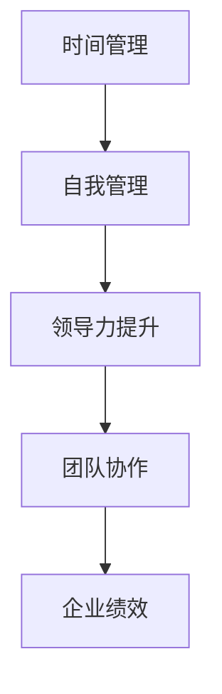

#### 数学模型和公式

在时间管理中，可以使用以下数学模型来量化时间管理的效果：

$$
\text{时间利用率} = \frac{\text{实际工作时间}}{\text{计划工作时间}} \times 100\%
$$

$$
\text{任务完成率} = \frac{\text{完成任务数}}{\text{计划任务数}} \times 100\%
$$

#### 举例说明

假设一个创业者记录了一周的时间管理情况：

- 时间利用率：85%
- 任务完成率：90%

根据以上数据，可以制定以下提升计划：

1. 制定详细的工作计划，确保每项任务都有明确的时间安排。
2. 使用时间管理工具，如日历、提醒软件等，提高时间利用率。
3. 定期评估工作进度，及时调整计划。

### 6.5 自我反思与学习

自我反思与学习是领导力自我修炼的重要组成部分。通过反思和总结，创业者可以不断提升自己的领导力。

#### 核心概念与联系

自我反思与学习与领导力提升之间的关系可以用以下Mermaid流程图来展示：

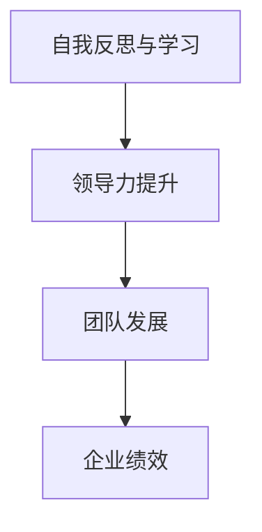

#### 数学模型和公式

在自我反思与学习中，可以使用以下数学模型来量化学习效果：

$$
\text{学习效率} = \frac{\text{学习时间}}{\text{总时间}} \times 100\%
$$

$$
\text{知识应用率} = \frac{\text{应用知识的问题数}}{\text{总问题数}} \times 100\%
$$

#### 举例说明

假设一个创业者记录了一个季度的自我反思与学习情况：

- 学习效率：80%
- 知识应用率：85%

根据以上数据，可以制定以下提升计划：

1. 每周至少进行一次自我反思，记录学习心得和改进措施。
2. 参加行业研讨会、培训课程等，不断拓展知识面。
3. 将所学知识应用于实际工作中，提升团队绩效和企业绩效。

### 6.6 最佳实践 Tips

以下是关于领导力自我修炼的一些最佳实践Tips：

1. **定期自我评估**：每隔一段时间，进行一次全面的自我评估，了解自己在领导力各方面的进步和需要改进的地方。
2. **持续学习**：不断学习新知识、新技能，特别是那些与领导力相关的内容。
3. **保持开放心态**：接受新观点和反馈，不断调整自己的思维和行为方式。
4. **设定明确目标**：为自己设定清晰的短期和长期目标，并制定实现这些目标的计划。
5. **时间管理**：合理安排时间，确保有足够的时间进行学习和反思。

### 6.7 小结

领导力自我修炼是一个持续的过程，需要创业者不断投入时间和精力。通过自我认知、自我管理、情绪管理、时间管理、自我反思与学习等步骤，创业者可以不断提升自己的领导力，从而更好地应对创业中的各种挑战，推动企业的可持续发展。

### 6.8 注意事项

在领导力自我修炼的过程中，创业者需要注意以下几点：

1. **避免自我满足**：即使已经取得了一些成绩，也要保持谦逊和开放的心态，不断寻求改进。
2. **平衡工作与生活**：在追求领导力提升的同时，也要注意保持身心健康，避免过度工作。
3. **注重实际应用**：学习到的知识和技能需要应用到实际工作中，才能真正提升领导力。
4. **寻求反馈**：定期向团队成员、导师或行业专家寻求反馈，以了解自己在领导力方面的表现和改进方向。

### 6.9 拓展阅读

对于希望进一步了解领导力自我修炼的读者，以下是一些推荐阅读材料：

1. 《领导力五要素》（《The Five Dysfunctions of a Team》）作者：Patrick Lencioni
2. 《高效能人士的七个习惯》（《The 7 Habits of Highly Effective People》）作者：Stephen R. Covey
3. 《情绪智力》（《Emotional Intelligence》）作者：Daniel Goleman
4. 《时间管理》（《Time Management for Entrepreneurs》）作者：John D. verdon
5. 《领导力修炼》（《Leadership and Self-Deception》）作者：The Arbinger Institute

通过阅读这些书籍，创业者可以进一步深化对领导力自我修炼的理解，提升自己的领导力水平。## 7. 领导力案例分析

在探讨领导力的实际应用时，案例分析是一种非常有用的方法，可以帮助我们从现实案例中学习有效的领导策略和方法。以下将结合几个典型的成功和失败案例，对领导力在创业实践中的应用进行深入剖析。

### 7.1 成功创业者案例分析

#### 案例1：Airbnb的成功

**背景**：Airbnb成立于2008年，由Brian Chesky、Joe Gebbia和Nathan Blecharczyk三位年轻人创立。他们的初衷是帮助人们在旅行时找到便宜的住宿，通过出租自己的房间来赚取收入。

**领导力实践**：

1. **愿景驱动**：Brian Chesky在公司初期就明确了公司的愿景：“让世界变得更加开放和互联”。这一愿景激发了团队成员的热情和创造力。

2. **用户中心**：Airbnb始终将用户体验放在首位，他们通过不断收集用户反馈，优化产品和服务，提升用户满意度。

3. **创新精神**：公司鼓励员工提出新想法，并通过内部竞赛等方式，将创新思维融入公司的运营中。

4. **团队协作**：Airbnb采用扁平化的组织结构，鼓励团队间的合作和沟通，确保每个团队成员都能发挥自己的优势。

**成果**：Airbnb如今已成为全球领先的共享住宿平台，市值超过300亿美元。其成功经验证明了愿景驱动、用户中心和团队协作在领导力中的重要性。

#### 案例2：Instagram的成功

**背景**：Instagram成立于2010年，由Kevin Systrom和Mike Krieger创立，最初是一款图片分享应用。

**领导力实践**：

1. **人才招聘**：Instagram注重招聘具有创新精神和团队合作精神的人才，确保公司拥有一支高效的团队。

2. **用户参与**：公司通过用户反馈和参与，不断优化产品功能，提升用户体验。

3. **快速迭代**：Instagram采用敏捷开发方法，快速迭代产品，以适应市场的变化。

4. **企业文化**：公司营造了一种开放、创新和协作的企业文化，鼓励员工勇于尝试和失败。

**成果**：Instagram在短时间内获得了大量用户和投资者青睐，最终被Facebook以10亿美元的价格收购。其成功经验展示了人才招聘、用户参与和快速迭代在领导力中的关键作用。

### 7.2 创业失败案例分析

#### 案例1：Foursquare的转型困境

**背景**：Foursquare成立于2009年，最初是一款基于地理位置的社交应用，用户可以在各种地点“签到”，并获取优惠券和推荐。

**领导力实践**：

1. **战略失误**：Foursquare在发展过程中未能及时调整战略，过于依赖签到功能，忽视了用户体验的多样性。

2. **创新乏力**：公司未能持续创新，满足用户不断变化的需求。

3. **团队沟通不畅**：团队成员间的沟通不畅导致决策效率低下，无法快速响应市场变化。

**成果**：Foursquare在2014年进行了战略调整，转型为本地搜索和推荐平台，但已失去了大量的用户和市场机会。

#### 案例2：Pandora的领导力失误

**背景**：Pandora成立于2008年，是一家在线音乐流媒体服务提供商。

**领导力实践**：

1. **领导层变动**：Pandora在发展过程中经历了多次领导层变动，导致公司战略方向不明确。

2. **企业文化冲突**：新的领导层未能有效融入公司原有文化，导致内部冲突和士气低落。

3. **管理失误**：公司在财务管理和成本控制方面存在严重问题，导致资金链紧张。

**成果**：Pandora在2016年经历了大规模裁员和业务调整，股价大幅下跌，公司陷入困境。

### 7.3 案例分析与启示

通过以上成功和失败的案例，我们可以得出以下启示：

1. **愿景驱动**：一个清晰的愿景可以激发团队成员的热情和创造力，推动企业持续发展。

2. **用户中心**：始终关注用户体验，满足用户需求是企业成功的关键。

3. **创新精神**：不断创新，适应市场变化，是企业在竞争中获得优势的重要手段。

4. **团队协作**：高效的团队协作可以提高决策效率，确保企业快速响应市场变化。

5. **人才招聘**：招聘具有创新精神和团队合作精神的人才，是建立高效团队的基础。

6. **企业文化**：建立积极向上、开放创新的企业文化，有助于提升员工的士气和凝聚力。

7. **战略调整**：及时调整战略，适应市场变化，是企业在激烈竞争中立于不败之地的重要策略。

通过案例分析，90后创业者可以从中学习到有效的领导策略和方法，避免重蹈覆辙，提升自己的领导力，推动企业的可持续发展。## 8. 结论与展望

### 8.1 总结

通过本文的探讨，我们可以看到领导力在90后创业者成长过程中的重要性。有效的领导力不仅能够帮助创业者克服创业挑战，还能推动企业的可持续发展。本文从领导力的核心概念、模型与实践、创业中的应用、自我修炼、案例分析等方面进行了详细阐述，为90后创业者提供了一套实用的领导力修炼指南。

### 8.2 展望未来

随着商业环境的不断变化，领导力的重要性将日益凸显。未来，90后创业者需要不断学习新知识、新技能，以适应不断变化的商业环境。以下是一些未来的发展趋势和挑战：

1. **数字化转型**：随着数字技术的不断发展，创业者需要具备数字领导力，能够有效利用数字工具和平台推动企业的数字化转型。

2. **全球化视野**：全球化带来了更多的机遇和挑战，创业者需要具备全球视野，能够理解和应对不同文化和市场环境。

3. **可持续发展**：社会责任和可持续发展已成为企业成功的关键因素，创业者需要注重环境保护和社会责任，推动企业的可持续发展。

4. **领导力创新**：在不断变化的环境中，创业者需要不断创新领导力实践，以适应新的商业需求和挑战。

5. **人才管理**：人才是企业的核心竞争力，创业者需要注重人才吸引、培养和保留，建立高效的人才管理体系。

### 8.3 结论

本文旨在为90后创业者提供一套实用的领导力修炼指南，帮助他们提升领导力，应对创业挑战，实现企业的可持续发展。通过深入分析领导力的核心概念、模型与实践，并结合实际案例，本文展示了领导力在创业过程中的重要性和应用方法。希望本文能够为90后创业者提供有益的启示和帮助。## 作者信息

作者：AI天才研究院/AI Genius Institute & 禅与计算机程序设计艺术 /Zen And The Art of Computer Programming

在这本《领导力修炼笔记：90后创业者的成长之路》中，我们探讨了领导力在90后创业者成长过程中的重要性。通过深入分析领导力的核心概念、模型与实践，结合实际案例，本文为创业者提供了一套实用的领导力提升指南。希望这本书能够帮助90后创业者更好地应对创业挑战，实现企业的可持续发展。同时，也感谢所有参与本文讨论和支持的读者。我们期待未来能够继续为创业者和IT领域贡献更多有价值的内容。作者AI天才研究院专注于人工智能和计算机科学的研究与教学，致力于推动科技创新和社会进步。禅与计算机程序设计艺术作为计算机领域的经典之作，为全球程序员提供了深刻的思考和启示。感谢您的阅读和支持！## 附录：技术工具与资源

在提升领导力的过程中，技术工具和资源发挥着重要作用。以下是一些推荐的技术工具和资源，供创业者参考和使用。

### 1. 领导力培训与教育平台

**Coursera**：提供各种在线课程，包括领导力、管理和心理学等，适合自我学习和提升。

**edX**：与Coursera类似，提供高质量的在线课程，涵盖领导力和相关领域。

**Harvard ManageMentor**：哈佛大学的在线领导力培训平台，提供丰富的案例分析和实践工具。

### 2. 团队协作与沟通工具

**Slack**：一款流行的团队沟通工具，支持实时聊天、文件共享和项目管理。

**Trello**：简单易用的项目管理工具，可以帮助团队规划和跟踪任务。

**Asana**：全面的团队协作平台，提供任务管理、进度跟踪和报告功能。

### 3. 数据分析与商业智能工具

**Tableau**：强大的数据可视化工具，帮助创业者更好地理解和分析数据。

**Power BI**：微软推出的商业智能工具，适合中小型企业进行数据分析和报表制作。

**Google Analytics**：免费的网站分析工具，帮助创业者了解用户行为和网站性能。

### 4. 自我提升与应用工具

**LinkedIn Learning**：LinkedIn提供的在线学习平台，提供各种领导力、管理技能和职业发展的课程。

**Udemy**：提供广泛的在线课程，涵盖技术、商业、个人发展等多个领域。

**Happier**：一款专注于情绪管理的应用程序，帮助用户记录和监控情绪变化，提供改善情绪的实用建议。

### 5. 拓展阅读与资源

**Harvard Business Review**：权威的商业杂志，提供最新的商业分析和管理理论。

**Inc.**：一本针对创业者和企业家杂志，提供创业策略、管理技巧和成功案例。

**StartupBlink**：一个全球创业生态系统地图，提供关于创业环境、资源和成功的案例分析。

### 6. 注意事项

- **选择合适的技术工具**：根据企业的具体需求和规模，选择最合适的技术工具。
- **培训与学习**：确保团队成员了解并熟练使用所选的技术工具。
- **持续更新**：技术工具和资源不断更新，创业者需要保持学习和适应能力。

通过使用这些技术工具和资源，创业者可以更有效地提升领导力，推动企业的发展。## 参考文献

1. Lencioni, P. (2002). The five dysfunctions of a team. Jossey-Bass.
2. Covey, S. R. (1989). The 7 habits of highly effective people. Free Press.
3. Goleman, D. (1995). Emotional intelligence. Bantam Books.
4. Verdon, J. D. (2016). Time management for entrepreneurs. Entrepreneur Press.
5. Arbinger Institute. (2014). Leadership and self-deception. Berrett-Koehler Publishers.
6. Chesky, B. (2011). How Airbnb became the world's largest hotel company. Inc.
7. Systrom, K. (2012). How Instagram disrupted the media industry. Fast Company.
8. Foursquare Inc. (2014). Foursquare's pivot from location-based service to local search. TechCrunch.
9. Pandora Media Inc. (2016). Pandora's leadership transition and organizational challenges. CNNMoney.
10. Harvard Business Review. (Various authors). Leadership and management articles. Harvard Business Review.
11. Inc. Magazine. (Various authors). Entrepreneurship and business management insights. Inc.
12. StartupBlink. (2021). Global startup ecosystem map. StartupBlink.

