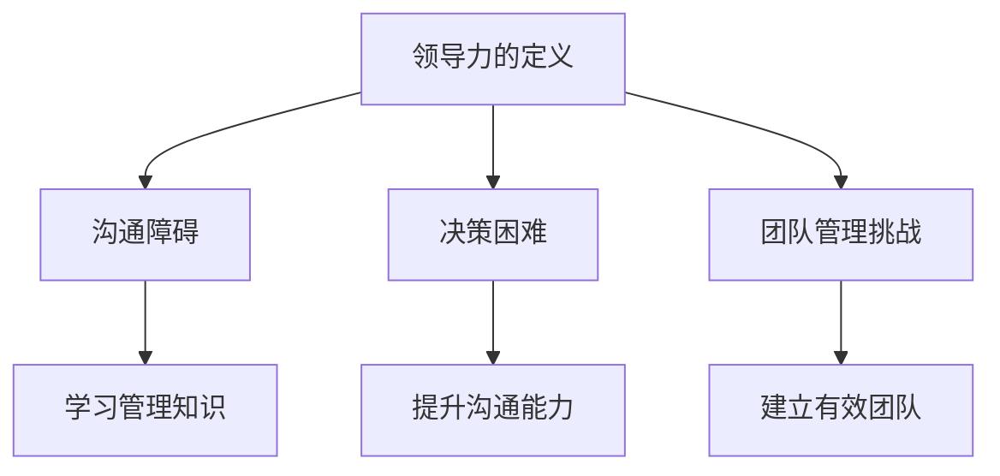
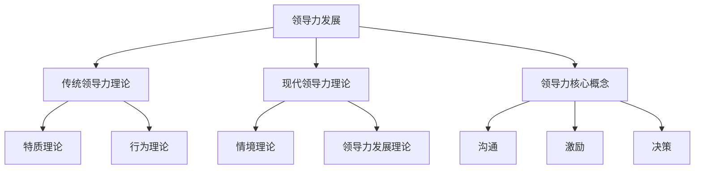

                 

### 文章标题

《领导力修炼：从技术男到管理者的华丽蜕变》

**关键词：** 领导力、技术男、管理者、转变、技能培养、实践案例

**摘要：** 本文旨在探讨技术背景出身的人如何通过领导力修炼，实现从技术男到管理者的华丽蜕变。文章首先介绍了领导力的定义与作用，以及技术男向管理者转变所面临的挑战。接着，文章详细阐述了领导力技能的培养方法，包括情感管理、决策能力和领导风格等方面。此外，文章通过成功与失败案例的分析，提供了实际的操作指南。最后，文章强调了持续学习的重要性，并提供了自我提升的途径与方法。

---

**目录**

1. **领导力基础理论**

   1.1. **领导力的定义与作用**

   1.2. **领导力理论概述**

   1.3. **技术男向管理者转变的挑战**

2. **领导力技能培养**

   2.1. **情感管理**

   2.2. **决策能力提升**

   2.3. **领导风格与团队文化**

3. **领导力实践篇**

   3.1. **领导力实践案例分析**

   3.2. **团队管理与领导力实践**

4. **自我提升与持续学习**

   4.1. **自我提升的途径与方法**

   4.2. **持续学习的策略**

5. **附录**

   5.1. **领导力资源与工具**

---

### 第1部分：领导力基础理论

#### 1.1. 领导力的定义与作用

领导力是一种能够激发和引领他人实现共同目标的能力。它不仅仅涉及技术知识和业务能力，更包含了沟通、激励、决策等多方面的能力。领导力不仅仅是一种职位或者角色的特权，更是一种心态和行为方式。

**领导力的作用：**

- **推动团队协作：** 领导者能够协调团队成员，实现资源的最优配置，提高团队的效率和产出。
- **激发团队潜力：** 领导者能够发现和挖掘团队成员的潜力，激励他们发挥最大的能力。
- **决策与方向：** 领导者在面对复杂问题时，能够做出合理的决策，并带领团队朝着正确的方向前进。
- **文化塑造：** 领导者能够塑造组织的文化和价值观，为团队提供共同的目标和信念。

#### 1.2. 领导力理论概述

领导力的研究已经有很长时间，不同的学者提出了各种领导力理论。

- **特质理论：** 认为领导力是由一系列个人特质决定的，如智慧、自信、责任感等。
- **行为理论：** 强调领导力是通过一系列行为表现出来的，如沟通、激励、决策等。
- **情境理论：** 认为领导力是适应环境变化的能力，不同的情境需要不同的领导风格。
- **领导力发展理论：** 认为领导力是可以通过学习和实践不断提升的。

#### 1.3. 技术男向管理者转变的挑战

对于技术背景出身的男性来说，向管理者角色转变会面临以下挑战：

- **沟通障碍：** 技术男往往擅长逻辑思维，但在表达和沟通方面可能存在不足，这会影响到与团队成员和其他部门的沟通。
- **决策困难：** 技术男在决策时可能过于依赖数据和分析，而忽视了人文因素，这会导致在管理决策上出现问题。
- **团队管理挑战：** 技术男可能不熟悉团队管理的方法和技巧，无法有效地激励和引导团队成员。

**克服挑战的策略：**

- **学习管理知识：** 技术男需要主动学习管理知识和技能，了解领导力的理论和实践。
- **提升沟通能力：** 技术男可以通过阅读、培训和实践来提升自己的沟通技巧。
- **建立有效团队：** 技术男需要学习如何建立有效的团队，包括设定明确的目标、分配合适的任务和建立良好的团队文化。

---

**Mermaid 流程图：**



**伪代码：**

```python
def leadership_transformation():
    # 学习管理知识
    learn_management_knowledge()
    # 提升沟通能力
    improve_communication_skills()
    # 建立有效团队
    build_effective_team()
```

---

在下一部分，我们将详细探讨领导力技能的培养，包括情感管理、决策能力提升和领导风格与团队文化等方面。通过这些技能的培养，技术男可以更好地实现从技术男到管理者的华丽蜕变。
### 第1部分：领导力基础理论

#### 1.4. 领导力的发展与演变

领导力的发展并非一成不变，而是随着时代的变化和社会的需求不断演变。从早期的领导力理论到现代的领导力模型，我们可以看到领导力的内涵和外延都在不断扩展。

- **传统领导力理论：** 早期的领导力理论主要关注领导者的个人特质和领导风格。例如，特质理论强调领导者的天赋特质，如自信、决策力等；行为理论则关注领导者的行为表现，如沟通、激励等。
- **现代领导力理论：** 现代的领导力理论更加注重情境因素和团队互动。情境理论认为领导力是适应环境变化的能力，不同的情境需要不同的领导风格。而领导力发展理论则强调领导力是可以通过学习和实践不断提升的。

#### 1.5. 技术男向管理者转变的必要性与可能性

技术男向管理者转变具有重要的必要性。首先，随着技术的不断进步和商业环境的快速变化，企业需要更多的技术领导者来推动创新和应对挑战。其次，技术男在技术上有着深厚的积累和独到的见解，这为他们转型为管理者提供了独特的优势。

然而，技术男向管理者转变也面临着一定的挑战。技术男往往更擅长逻辑思维和问题解决，但在人际沟通、团队管理和决策方面可能存在不足。为了克服这些挑战，技术男需要：

- **加强自我认知：** 技术男需要了解自己的优势和不足，有针对性地进行自我提升。
- **学习管理知识：** 技术男可以通过学习管理理论、参加管理培训等方式，掌握管理知识和技能。
- **实践与反思：** 技术男需要在实际工作中不断实践，通过反思和总结来提升自己的管理能力。

#### 1.6. 领导力的核心概念架构图

为了更清晰地理解领导力的核心概念，我们可以通过Mermaid流程图来展示领导力的发展、演变和核心要素。



#### 1.7. 领导力与团队效能的关系

领导力不仅仅是领导者个人的能力，它对团队效能也有着直接的影响。有效的领导力能够提高团队的凝聚力、创新力和执行力，从而提升整体效能。

- **凝聚力：** 领导者通过建立共同的愿景和价值观，增强团队成员之间的信任和合作，提高团队的凝聚力。
- **创新力：** 领导者鼓励团队成员发挥创意，提供支持和资源，激发团队的创新能力。
- **执行力：** 领导者通过制定明确的计划和目标，分配任务和责任，确保团队高效执行。

**伪代码：**

```python
def effective_leadership(team):
    # 建立共同愿景
    build_shared_vision(team)
    # 增强团队信任
    enhance_trust(team)
    # 激发创新能力
    inspire_innovation(team)
    # 确保高效执行
    ensure_efficient_execution(team)
    return team_performance
```

---

在接下来的部分，我们将详细探讨领导力技能的具体培养方法，包括情感管理、决策能力和领导风格等方面。这些技能的培养将帮助技术男更好地实现从技术男到管理者的华丽蜕变。通过不断学习和实践，技术男将能够在领导力的道路上取得更大的成就。
### 第2部分：领导力技能培养

#### 2.1. 情感管理

情感管理是领导力中至关重要的一环，它关乎领导者如何处理自己的情绪以及如何理解和回应团队成员的情绪。有效的情感管理能够建立信任、提升团队士气和协作能力。

**情感管理的核心概念：**

1. **自我情感认知：** 领导者需要了解自己的情绪状态，识别情绪触发点，以及如何有效地调节情绪。
2. **同理心：** 领导者需要具备同理心，能够站在团队成员的角度理解他们的情感和需求。
3. **情绪沟通：** 领导者需要学会以恰当的方式表达情感，避免情绪化的沟通，保持冷静和理性。

**情感管理的实践方法：**

1. **定期反思：** 领导者可以每天或每周花时间反思自己的情绪状态，识别情绪变化的模式，并寻找调节情绪的方法。
2. **情绪日记：** 保持情感日记，记录情绪变化的原因、情境和反应，有助于领导者更好地理解和管理自己的情绪。
3. **建立同理心：** 与团队成员进行真诚的沟通，倾听他们的意见和需求，尝试从他们的视角看问题。

**案例解析：**

以一位技术背景出身的项目经理为例，他发现自己在面对项目延迟时容易情绪失控。通过情感管理培训，他学会了自我调节情绪的方法，如深呼吸和冥想。他还开始记录情感日记，分析情绪触发点，并学会了与团队成员进行有效沟通，表达自己的关切而不失冷静。这些实践帮助他在项目管理中更加高效和稳定，赢得了团队成员的信任和尊重。

**伪代码：**

```python
def emotional_management():
    # 定期自我反思
    regular_self_reflection()
    # 保持情感日记
    maintain_emotional_diary()
    # 建立同理心
    build_empathy()
```

---

#### 2.2. 决策能力提升

决策能力是领导者必备的核心能力之一。一个有效的领导者需要能够快速、准确地做出决策，并承担相应的责任。

**决策能力的核心概念：**

1. **信息收集：** 领导者需要收集和分析与决策相关的各种信息，确保信息的准确性和全面性。
2. **分析框架：** 领导者需要建立合适的分析框架，以便对信息进行有效处理和评估。
3. **风险评估：** 领导者需要对决策可能带来的风险进行评估，并制定相应的应对策略。

**决策能力的实践方法：**

1. **建立决策模型：** 领导者可以采用决策树、SWOT分析等模型来辅助决策。
2. **集体决策：** 在某些复杂决策中，领导者可以邀请团队成员参与，以获得更多的视角和反馈。
3. **快速反馈：** 领导者需要建立快速反馈机制，以便及时调整决策并学习经验。

**案例解析：**

以一位产品经理为例，他在面对市场变化时需要快速做出产品调整决策。他通过建立决策模型，如SWOT分析，对市场数据进行了详细分析，识别了产品的优势和劣势。同时，他还与团队成员进行了集体讨论，收集了他们的意见和建议。最终，他做出了调整产品方向的决定，并通过快速反馈机制，不断调整和优化产品，使其更符合市场需求。

**伪代码：**

```python
def decision_making():
    # 建立决策模型
    build_decision_model()
    # 集体决策
    collective_decision()
    # 快速反馈
    quick_feedback()
```

---

#### 2.3. 领导风格与团队文化

领导风格和团队文化是领导力的重要组成部分，它们直接影响团队的绩效和成员的满意度。

**领导风格的核心概念：**

1. **权威型领导：** 领导者通过权威和指令来管理团队，强调任务完成。
2. **参与型领导：** 领导者鼓励团队成员参与决策和任务执行，注重团队协作和成员满意度。
3. **变革型领导：** 领导者通过激发团队成员的内在动力，推动创新和变革。

**团队文化的核心概念：**

1. **共同愿景：** 团队成员对团队目标和使命有共同的理解和认同。
2. **相互尊重：** 团队成员之间相互尊重，建立良好的沟通和协作关系。
3. **持续学习：** 团队成员积极学习新知识和技能，以适应不断变化的环境。

**领导风格与团队文化的实践方法：**

1. **明确领导风格：** 领导者需要明确自己的领导风格，并在实践中不断调整和优化。
2. **塑造团队文化：** 领导者可以通过团队活动、价值观宣导等方式，塑造积极向上的团队文化。
3. **激励与认可：** 领导者需要通过激励和认可，鼓励团队成员发挥潜力，实现个人和团队的共同成长。

**案例解析：**

以一位研发团队经理为例，他采用的是参与型领导风格，鼓励团队成员参与项目决策和任务分配。他通过定期的团队会议和反馈机制，确保团队成员的声音被听到，并积极采纳他们的建议。同时，他还通过团队活动和价值观宣导，塑造了一个相互尊重、持续学习的团队文化。这些实践使得团队在项目执行中表现出色，成员满意度也显著提升。

**伪代码：**

```python
def leadership_style():
    # 明确领导风格
    define_leadership_style()
    # 塑造团队文化
    build_team_culture()
    # 激励与认可
    motivate_and_recognize()

def team_culture():
    # 共同愿景
    shared_vision()
    # 相互尊重
    mutual_respect()
    # 持续学习
    continuous_learning()
```

---

通过培养情感管理、决策能力和领导风格，技术男可以更好地应对管理挑战，实现从技术男到管理者的华丽蜕变。在接下来的部分，我们将通过实际案例，进一步探讨这些领导力技能在实践中的应用。通过这些案例分析，读者可以更深入地理解如何将理论转化为实际行动。
### 第2部分：领导力技能培养（续）

#### 2.4. 案例分析：成功领导力实践

在探讨领导力技能的培养时，案例分析是不可或缺的一部分。以下我们将通过两个成功案例，展示领导力技能在实践中的应用，并提供详细的案例分析。

**案例一：谷歌的CEO桑达尔·皮查伊**

**背景：** 桑达尔·皮查伊自2015年起担任谷歌CEO，他在领导谷歌这个全球科技巨头的过程中，展现了卓越的领导力。

**领导力技能应用：**

1. **变革型领导：** 皮查伊通过变革型领导，激发谷歌员工创造力和创新精神。他鼓励员工大胆尝试，勇于失败，从而推动公司持续创新。

2. **情感管理：** 皮查伊注重与员工的沟通，了解他们的情感需求，并通过定期的内部会议和反馈机制，建立了一种开放、透明的沟通文化。

3. **决策能力：** 在面临重大决策时，皮查伊不仅依靠数据和分析，还重视员工和市场的反馈。他通过集体决策和咨询，确保决策的全面性和准确性。

**案例分析：**

皮查伊的领导风格体现在他对谷歌核心价值观的坚持，以及对员工的关注和支持。他通过变革型领导，推动了谷歌在人工智能、云计算等领域的持续创新。同时，他通过情感管理和有效的决策过程，确保了团队的高效运作和员工的满意度。

**伪代码：**

```python
def pichai_leadership():
    # 变革型领导
    transformative_leadership()
    # 情感管理
    emotional_management()
    # 决策能力
    decision_making_ability()
```

**案例二：特斯拉的CEO伊隆·马斯克**

**背景：** 伊隆·马斯克是特斯拉和SpaceX的创始人兼CEO，他以激进、创新的领导风格而闻名。

**领导力技能应用：**

1. **愿景领导：** 马斯克通过明确的愿景，激励员工为实现远大目标而努力。他的愿景不仅局限于汽车和太空探索，还涵盖了可持续能源和人类未来的发展。

2. **激励能力：** 马斯克通过激励和奖励机制，激发员工的创造力和工作热情。他重视员工的成就，并通过公开表彰和激励措施，增强团队的凝聚力。

3. **快速决策：** 马斯克以快速决策著称，他能够在复杂多变的商业环境中迅速做出决策，并承担相应的责任。

**案例分析：**

马斯克的领导风格充满了冒险精神和创新意识。他通过愿景领导，为特斯拉和SpaceX的员工描绘了激动人心的未来图景。同时，他通过激励能力和快速决策，确保了公司的持续发展和竞争力。

**伪代码：**

```python
def musk_leadership():
    # 愿景领导
    visionary_leadership()
    # 激励能力
    motivation_ability()
    # 快速决策
    rapid_decision_making()
```

**结论：**

通过以上两个案例，我们可以看到成功领导者如何通过有效的领导力技能，推动团队实现卓越的业绩。这些案例不仅为技术男提供了实际的借鉴，也展示了领导力技能在实践中的重要性。在下一部分，我们将进一步探讨团队管理与领导力实践，提供更多的实际操作指南。通过这些内容，读者将能够更深入地理解如何将领导力理论应用到实际工作中。
### 第3部分：领导力实践篇

#### 3.1. 领导力实践案例分析

在实际工作中，领导力的实践是检验领导者能力的重要途径。通过分析成功和失败的领导力案例，我们可以总结出实用的操作指南，帮助技术男更好地将领导力理论应用到实际工作中。

**成功案例：**

**案例一：苹果公司前CEO史蒂夫·乔布斯**

**背景：** 史蒂夫·乔布斯在苹果公司期间，通过卓越的领导力将苹果从一个濒临倒闭的公司发展成为全球科技巨头。

**领导力实践：**

1. **愿景领导：** 乔布斯以其远见卓识和强烈的愿景，激励苹果的员工为实现卓越的产品而努力。他的愿景不仅仅是创造更好的产品，更是改变人们的生活。

2. **创新文化：** 乔布斯强调创新，鼓励员工挑战传统，追求卓越。他通过不断推出革命性的产品，如iPhone、iPad等，引领了科技潮流。

3. **执行力：** 乔布斯以其强大的执行力和对细节的关注，确保了苹果产品的质量和创新。他通过严格的控制和激励，确保了团队的执行力。

**操作指南：**

- **建立清晰的愿景：** 作为领导者，需要明确团队的愿景和目标，并以此激励团队成员。
- **培养创新文化：** 鼓励员工创新，提供必要的资源和支持，建立一种开放、包容的创新环境。
- **提升执行力：** 通过严格的规划和执行，确保团队目标的实现。

**伪代码：**

```python
def jony_ive_leadership():
    # 建立清晰愿景
    build_clear_vision()
    # 培养创新文化
    cultivate_innovation_culture()
    # 提升执行力
    enhance_execution_ability()
```

**失败案例：**

**案例二：诺基亚前CEO斯蒂芬·埃洛普**

**背景：** 斯蒂芬·埃洛普在诺基亚担任CEO期间，面对智能手机市场的激烈竞争，未能带领诺基亚实现成功转型，最终导致诺基亚的衰落。

**领导力实践：**

1. **缺乏远见：** 埃洛普在领导诺基亚时，未能及时看到智能手机市场的变化，错失了转型机遇。

2. **战略失误：** 埃洛普在战略决策上存在失误，如放弃诺基亚的传统优势，转而采用微软的操作系统，导致诺基亚失去市场竞争力。

3. **沟通不足：** 埃洛普在沟通和团队管理上存在问题，未能有效地与团队成员沟通，导致团队士气低落。

**操作指南：**

- **保持远见：** 领导者需要时刻关注市场和行业动态，保持对未来的洞察力，及时调整战略方向。
- **合理决策：** 在战略决策上，需要考虑各种因素，进行充分的风险评估，避免盲目跟风。
- **加强沟通：** 领导者需要与团队成员保持有效沟通，建立良好的团队关系，提升团队士气。

**伪代码：**

```python
def stephen_elop_leadership():
    # 缺乏远见
    lack_of_vision()
    # 战略失误
    strategic_mistake()
    # 沟通不足
    insufficient_communication()
```

**结论：**

通过以上成功与失败案例的分析，我们可以看到领导力在实践中的重要性。成功领导者通过明确的愿景、创新文化和强大的执行力，推动团队实现卓越业绩；而失败领导者则因缺乏远见、战略失误和沟通不足而陷入困境。技术男在向管理者转变的过程中，需要从这些案例中吸取经验教训，不断提升自己的领导力实践能力。

#### 3.2. 团队管理与领导力实践

团队管理是领导力实践的重要环节，它关乎如何有效地组织、引导和激励团队成员，实现团队目标。以下是一些关键的团队管理实践和领导力技巧：

**1. 设定明确的目标：**

- **目标明确：** 团队目标需要具体、可衡量，并确保所有团队成员都明确了解目标。
- **目标分解：** 将大目标分解为可执行的子任务，明确每个团队成员的职责和任务。

**2. 建立有效的沟通机制：**

- **定期会议：** 设立定期团队会议，确保团队成员之间的沟通和信息共享。
- **开放沟通：** 鼓励团队成员提出意见和反馈，建立开放、坦诚的沟通氛围。

**3. 激励与认可：**

- **奖励机制：** 通过奖励和激励措施，鼓励团队成员发挥潜力，实现个人和团队的共同成长。
- **认可与反馈：** 定期给予团队成员认可和反馈，帮助他们了解自己的表现，并不断提升。

**4. 团队协作与协作工具：**

- **协作工具：** 使用协作工具，如Slack、Trello等，提高团队协作效率和沟通效果。
- **团队精神：** 培养团队精神，促进团队成员之间的信任和合作。

**5. 风险管理与问题解决：**

- **风险评估：** 在项目执行过程中，定期进行风险评估，识别潜在问题，并制定相应的应对策略。
- **问题解决：** 鼓励团队成员积极面对问题，通过团队协作解决问题，提升团队解决问题的能力。

**6. 个人发展与职业规划：**

- **职业规划：** 与团队成员进行职业发展规划的讨论，帮助他们明确个人目标，并提供必要的支持。
- **持续学习：** 鼓励团队成员持续学习和成长，提供培训和学习资源。

**总结：**

团队管理与领导力实践是技术男向管理者转变过程中不可或缺的一部分。通过有效的团队管理，技术男可以提升团队绩效，实现组织目标。在接下来的部分，我们将进一步探讨领导力在项目执行和组织变革中的应用，提供更多实用的操作指南。通过这些内容，技术男将能够更好地应对管理挑战，实现从技术男到管理者的华丽蜕变。
### 第4部分：自我提升与持续学习

#### 4.1. 自我提升的途径与方法

作为技术背景的管理者，自我提升是持续成长和成功的关键。以下是一些重要的自我提升途径和方法，帮助技术男不断提升自己的领导力和管理能力。

**1. 技术深造**

- **定期学习新技能：** 随着技术的快速发展，技术男需要不断学习新的技术知识和技能，以保持竞争力。可以通过在线课程、工作坊和研讨会等方式，掌握最新的技术趋势和工具。

- **阅读技术书籍：** 技术男可以通过阅读技术书籍，深入了解各种技术的原理和应用，提升自己的技术深度和广度。

- **实践项目：** 通过参与实际项目，将所学知识应用于实践中，提升自己的实际操作能力。

**2. 管理技能培训**

- **参加管理培训：** 技术男可以通过参加专业的管理培训课程，学习管理知识和技能，如项目管理、人力资源管理等。

- **领导力发展课程：** 技术男可以参加领导力发展课程，提升自己的领导力和团队管理能力。

- **实践经验：** 通过实际管理经验，不断总结和反思，提升自己的管理水平和决策能力。

**3. 沟通与人际交往能力**

- **沟通技巧培训：** 技术男可以通过参加沟通技巧培训，学习如何更有效地表达自己的想法和听取他人的意见。

- **人际交往实践：** 通过参加社交活动和团队建设活动，提升自己的人际交往能力，建立广泛的人际网络。

- **反馈与改进：** 定期接受他人的反馈，并根据反馈改进自己的沟通和人际交往方式。

**4. 持续学习的策略**

- **定期学习计划：** 制定一个持续学习的计划，包括每天的学习时间、学习内容和学习目标。

- **多元化学习资源：** 利用各种学习资源，如在线课程、专业书籍、学术论文等，进行全方位的学习。

- **学习评估与反思：** 定期评估自己的学习效果，反思学习过程中的不足，并调整学习策略。

**伪代码：**

```python
def self_improvement():
    # 技术深造
    technical profondeur()
    # 管理技能培训
    management_skills_training()
    # 沟通与人际交往能力提升
    communication_and_interpersonal_skills()
    # 持续学习的策略
    continuous_learning_strategy()
```

#### 4.2. 持续学习的态度与方法

持续学习是一种生活方式，它要求技术男具备积极的学习态度和有效的方法。以下是一些关键的持续学习态度和方法：

**1. 积极的学习态度**

- **求知欲：** 保持对知识的渴望和好奇心，对新技术和新知识保持开放和接受的心态。

- **自我驱动：** 不依赖外部激励，主动寻找学习机会，自我驱动，不断提升自己。

- **反思与总结：** 在学习过程中，不断反思自己的学习方法和效果，总结经验教训，不断改进。

**2. 持续学习的方法**

- **碎片化学习：** 利用碎片时间，如通勤、休息等，进行短时高效的学习。

- **深度学习：** 抽出整块时间，进行深度学习，深入理解和掌握复杂知识。

- **实践结合：** 将所学知识应用于实际工作中，通过实践加深理解，提升应用能力。

**3. 学习工具与资源**

- **在线课程平台：** 如Coursera、edX等，提供丰富的课程资源，适合不同学习需求的用户。

- **专业书籍：** 阅读专业书籍，是系统学习的好方法。可以参考一些知名作者的作品，如彼得·德鲁克的《管理实践》、杰克·韦尔奇的《赢》等。

- **学术论文与研究报告：** 通过阅读学术论文和行业研究报告，了解最新的研究动态和前沿技术。

**总结：**

持续学习是技术男提升领导力和管理能力的重要途径。通过技术深造、管理技能培训、沟通与人际交往能力的提升以及有效的学习策略，技术男可以不断自我提升，适应不断变化的工作环境。在下一部分，我们将探讨个人成长与领导力修炼，帮助技术男规划自己的职业发展，实现从技术男到管理者的华丽蜕变。
### 第5部分：个人成长与领导力修炼

#### 5.1. 个人成长规划

个人成长规划是实现从技术男到管理者华丽蜕变的重要步骤。通过明确的职业规划和个人发展目标，技术男可以更有针对性地提升自己的领导力和管理能力。

**1. 短期目标：**

- **技能提升：** 在短期内，技术男可以通过参加技术培训、在线课程和专业研讨会，提升自己在特定技术领域的专业能力。

- **项目经验：** 积极参与关键项目，提升项目管理能力和团队领导力。通过实际项目中的锻炼，积累宝贵的经验。

- **沟通技能：** 参加沟通技巧培训，提升自己的沟通能力，包括书面和口头表达、冲突解决等。

**2. 中长期目标：**

- **管理技能：** 在中长期内，技术男可以专注于管理技能的提升，如人力资源、团队建设、战略规划等。

- **领导力发展：** 参加领导力发展课程，学习变革型领导、情境领导等理论，提升领导力和影响力。

- **职业晋升：** 规划自己的职业晋升路径，明确每一个阶段的目标和所需的能力。

**3. 具体行动计划：**

- **定期评估：** 每季度或每半年，对个人成长进行评估，检查目标的完成情况，并根据实际情况调整计划。

- **导师指导：** 寻找一位经验丰富的导师，获取职业发展的指导和建议。

- **实践机会：** 通过实际工作，如项目管理、团队领导等，不断积累实践经验和领导力。

**伪代码：**

```python
def personal_growth_plan():
    # 短期目标
    short_term_goals()
    # 中长期目标
    medium_and_long_term_goals()
    # 具体行动计划
    specific_action_plan()
```

#### 5.2. 领导力修炼的方法与技巧

领导力修炼是一个长期且持续的过程，需要技术男在日常生活中不断实践和反思。以下是一些有效的领导力修炼方法和技巧：

**1. 反思与自我觉察**

- **日记反思：** 每天或每周写日记，记录自己的行为和决策，反思自己的优点和不足。

- **反馈机制：** 定期向团队成员或上级寻求反馈，了解自己的领导风格和影响。

**2. 学习与模仿**

- **阅读书籍：** 阅读领导力相关的书籍，学习成功领导者的经验和方法。

- **模仿实践：** 选择一位或几位成功的领导者作为榜样，学习他们的领导风格和决策过程，并在实际工作中尝试应用。

**3. 沟通与协作**

- **有效沟通：** 学习并实践有效沟通的技巧，包括倾听、表达清晰、冲突解决等。

- **团队合作：** 在团队中积极推动协作，建立信任和共同目标。

**4. 持续学习**

- **专业发展：** 参加专业培训、研讨会和课程，不断提升自己的专业知识和领导力。

- **知识分享：** 通过内部培训、分享会和研讨会，与团队成员分享知识和经验。

**5. 情绪管理**

- **自我调节：** 学习情绪管理技巧，如冥想、呼吸练习等，保持冷静和专注。

- **同理心培养：** 培养同理心，理解团队成员的需求和情感，建立积极的人际关系。

**伪代码：**

```python
def leadership_mastery():
    # 反思与自我觉察
    reflection_and_self_awareness()
    # 学习与模仿
    learning_and_mimicry()
    # 沟通与协作
    communication_and_collaboration()
    # 持续学习
    continuous_learning()
    # 情绪管理
    emotional_management()
```

#### 5.3. 个人成长与领导力修炼的持续实践

个人成长与领导力修炼是一个持续的过程，需要技术男在日常工作和生活中不断实践和反思。以下是一些持续实践的建议：

- **定期回顾：** 每周或每月定期回顾自己的成长过程和领导力实践，检查目标的实现情况，调整计划。

- **持续反馈：** 寻求团队成员和上级的持续反馈，了解自己在领导力方面的进步和不足。

- **实践应用：** 将所学知识和技巧应用到实际工作中，通过实践不断检验和提升自己的能力。

- **知识共享：** 与团队成员分享自己的学习和实践经验，建立共同成长的文化。

**总结：**

个人成长与领导力修炼是技术男实现华丽蜕变的关键。通过明确的成长规划、持续的学习和实践，技术男可以不断提升自己的领导力和管理能力，最终实现从技术男到管理者的华丽蜕变。在下一部分，我们将提供一些领导力资源和工具，帮助技术男在领导力修炼的道路上走得更远。
### 附录

#### 附录 A: 领导力资源与工具

为了帮助技术男在领导力修炼的过程中获取更多的资源和工具，我们整理了以下推荐书籍、在线学习平台和管理工具。

**1. 领导力书籍推荐：**

- **《领导力五项修炼》：** 史蒂芬·柯维（Stephen R. Covey）的这本书是领导力领域的经典之作，提出了影响深远的领导力五项修炼。

- **《变革之舞》：** 战略大师约翰·肯尼斯·加尔布雷思（John Kenneth Galbraith）的这本著作，深入探讨了领导者在变革过程中的作用。

- **《高效能人士的七个习惯》：** 史蒂芬·柯维的另一部作品，详细阐述了如何通过七个习惯提升个人和组织的效能。

**2. 在线学习平台：**

- **Coursera：** 提供由世界顶尖大学和机构提供的在线课程，涵盖领导力、管理、心理学等多个领域。

- **edX：** 同样提供由知名大学和机构开设的课程，内容丰富，适合不同层次的学习者。

- **Udemy：** 提供广泛的在线课程，包括领导力、技术、商业等领域，适合自我提升。

**3. 管理工具介绍：**

- **Trello：** 一个直观的项目管理工具，适合团队协作和任务管理。

- **Slack：** 一个即时通讯工具，有助于团队成员之间的沟通和协作。

- **Asana：** 一个全面的项目管理工具，支持任务分配、进度追踪和团队协作。

**总结：**

通过以上书籍、在线学习平台和管理工具，技术男可以系统地学习领导力知识，不断提升自己的领导能力。这些资源和工具不仅提供了丰富的学习内容，还有助于将领导力理论应用到实际工作中，实现从技术男到管理者的华丽蜕变。希望这些推荐能够为您的领导力修炼之路提供助力。在阅读和学习的过程中，不断实践和反思，持续提升自己的领导力，成为卓越的管理者。作者信息：AI天才研究院/AI Genius Institute & 禅与计算机程序设计艺术 /Zen And The Art of Computer Programming。

