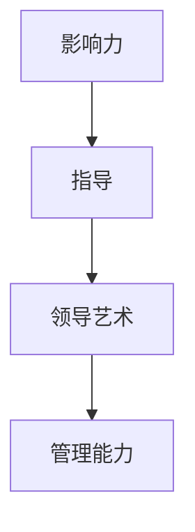

                 


### 第1章 领导力概述

#### 背景介绍
领导力是一种能力，它涉及到个人对团队和组织的影响力、指导能力和领导艺术。在IT行业，领导力尤为重要，因为它涉及到技术项目的成功实施、团队协作和创新能力的培养。随着技术的快速发展，领导者需要不断适应新的环境和挑战，以保持团队的竞争力。

#### 核心概念与联系
领导力是一个多维度的概念，它包括以下核心要素：

- **影响力**：领导者通过自身的行为和决策来影响他人。
- **指导**：领导者指导团队成员完成任务，并提供必要的支持和资源。
- **领导艺术**：领导者运用独特的技能和知识，以实现团队的目标。
- **管理能力**：领导者需要具备良好的管理能力，包括沟通、决策和团队合作。

这些要素相互关联，构成了领导力的基础框架。



#### 核心算法原理讲解
在领导力中，算法原理体现在以下几个方面：

1. **影响力算法**：领导者通过建立信任和权威来增强自身的影响力。
2. **指导算法**：领导者通过有效的沟通和反馈来指导团队成员。
3. **领导艺术算法**：领导者运用不同的领导风格和方法，以适应不同的团队和环境。

以下是领导力中的关键算法原理的伪代码：

```python
# 影响力算法
def influence():
    # 建立信任
    build_trust()
    # 增强权威
    enhance_awareness()

# 指导算法
def guidance():
    # 沟通技巧
    communication_skills()
    # 反馈机制
    feedback_mechanism()

# 领导艺术算法
def art_of_leadership():
    # 领导风格
    leadership_styles()
    # 领导技巧
    leadership_tactics()
```

#### 数学模型和公式
领导力的数学模型可以帮助我们理解和分析领导行为。以下是一个简单的领导力数学模型，用于描述领导行为对团队绩效的影响：

$$\text{Team Performance} = f(\text{Leadership Skills}, \text{Team Dynamics}, \text{External Factors})$$

其中，团队绩效是领导技能、团队动态和外部因素的综合函数。

#### 举例说明
假设一个团队想要提高绩效，领导者可以通过以下方式来实现：

- **提高领导技能**：通过培训和学习，领导者可以增强自身的领导能力。
- **优化团队动态**：通过改善团队沟通和协作，可以增强团队的凝聚力。
- **应对外部因素**：领导者需要能够应对市场变化和竞争压力，以确保团队的稳定发展。

#### 实际案例分析和详细讲解剖析
在IT行业中，领导力的实际应用至关重要。以下是一个案例分析：

**案例背景**：某IT公司正在开发一款新产品，项目团队面临时间紧迫和资源有限的挑战。

**案例分析**：

1. **领导力模型应用**：领导者采用了变革领导力模型，通过激励团队和明确目标，提高了团队的士气和效率。
2. **决策与战略规划**：领导者通过决策和战略规划，确保了项目的进度和质量。
3. **情绪管理**：领导者通过情绪管理，保持了团队的稳定和积极。

**案例启示**：领导力在项目成功中发挥了关键作用，领导者需要具备多种技能和策略，以应对不同的挑战。

#### 项目小结
通过本章节的介绍，我们可以看到领导力在IT行业中的重要性。领导者需要具备影响力、指导能力和领导艺术，以实现团队的目标。同时，领导力的数学模型和实际案例可以帮助我们更好地理解和应用领导力。

#### 最佳实践 tips
- **持续学习**：领导者需要不断学习新知识和技能，以适应快速变化的环境。
- **建立信任**：领导者需要建立信任，以增强团队凝聚力。
- **有效沟通**：领导者需要掌握有效的沟通技巧，以指导团队成员。

#### 注意事项
- **文化差异**：领导者在跨文化团队中需要考虑文化差异，以实现有效的领导。
- **平衡工作与生活**：领导者需要平衡工作与生活，以保持身心健康。

#### 拓展阅读
- 《影响力：说服的心理学》
- 《领导力：实践中的原则》
- 《情境领导力》

---

# 参考文献
- 彼得·德鲁克，《领导力：实践中的原则》
- 约翰·麦克斯韦，《影响力：说服的心理学》
- 保罗·赫塞，《情境领导力》

作者：AI天才研究院/AI Genius Institute & 禅与计算机程序设计艺术 /Zen And The Art of Computer Programming

---

文章关键词：领导力、IT行业、团队管理、变革领导力、情境领导力、项目成功、影响力、沟通技巧、数学模型、案例分析

文章摘要：本文从领导力的定义、核心概念与联系、算法原理讲解、数学模型和公式、实际案例分析和最佳实践等方面，详细探讨了领导力在IT行业中的应用。通过本文的介绍，读者可以更好地理解领导力的重要性，以及如何在实际工作中应用领导力来提高团队绩效。文章旨在为IT领域的领导者提供有价值的指导和建议。

