                 


# 文章标题：领导力心法：成就一流管理者的领导力法则

## 关键词：
领导力，管理者，心态，战略思维，团队协作，组织文化，领导力心法

## 摘要：
本文深入探讨领导力心法，揭示成就一流管理者的关键法则。文章分为三个部分，首先，从理论基础入手，分析领导力的本质和核心特质；其次，通过实战案例，探讨领导力在不同情境下的应用和实践；最后，前瞻性地分析领导力的未来趋势，为管理者提供持续的思考和提升方向。通过本文，读者将了解领导力心法如何助力管理者在复杂多变的环境中游刃有余，成就卓越领导力。

## 目录大纲

## 第一部分：领导力的基础理论

### 第1章：领导力与领导者心态
#### 1.1 领导力的定义与重要性
#### 1.2 领导者心态：从个人成长到团队领导
#### 1.3 领导力的核心特质

### 第2章：领导力的发展与自我提升
#### 2.1 自我认知：领导力的起点
#### 2.2 领导力发展的途径
#### 2.3 建立有效的个人成长计划

### 第3章：团队管理与协作
#### 3.1 团队构成与角色
#### 3.2 高效沟通技巧
#### 3.3 领导者如何激发团队潜力

### 第4章：决策与战略思维
#### 4.1 决策原理与方法
#### 4.2 战略思维的培养
#### 4.3 创新与变革中的领导力

## 第二部分：实战领导力

### 第5章：领导力案例分析
#### 5.1 成功领导者的特质与行为模式
#### 5.2 案例分析：优秀领导力实践
#### 5.3 案例分析：领导力失误及其教训

### 第6章：应对挑战与危机
#### 6.1 领导者面对的挑战
#### 6.2 应对危机的策略
#### 6.3 危机管理中的领导力

### 第7章：领导力与组织文化
#### 7.1 组织文化与领导力
#### 7.2 塑造积极组织文化的策略
#### 7.3 领导力在组织变革中的作用

## 第三部分：领导力心法

### 第8章：领导力心法的实践
#### 8.1 领导力心法的内涵
#### 8.2 领导力心法在实际工作中的应用
#### 8.3 领导力心法对个人与团队的长期影响

### 第9章：成为一流管理者的途径
#### 9.1 从优秀到卓越的转变
#### 9.2 成为一流管理者的素质要求
#### 9.3 持续提升领导力的方法

### 第10章：领导力的未来趋势
#### 10.1 领导力发展的新趋势
#### 10.2 数字化时代下的领导力挑战
#### 10.3 未来领导力培养的方向

---

### 第1章：领导力与领导者心态

#### 1.1 领导力的定义与重要性

领导力，是一种引领和激励他人共同实现目标的能力。它不仅仅是一种技术，更是一种艺术，它涉及个人的品质、态度和行为。领导力的重要性不言而喻，它决定了组织的成败。一个优秀的领导者能够带领团队克服困难，激发创造力，实现卓越的业绩。

首先，我们需要明确领导力的定义。领导力并不是仅仅与职位相关，更与个人的特质和行为模式密切相关。一个优秀的领导者，不仅要具备专业知识和技能，更需要拥有积极的心态、坚定的信念和卓越的沟通能力。

领导力的重要性体现在以下几个方面：

1. **激发团队潜力**：领导者的作用是挖掘和激发团队成员的潜力，使他们能够发挥最大的价值。
2. **决策与战略**：领导者负责制定组织的发展战略，做出关键决策，确保组织朝着正确的方向前进。
3. **文化塑造**：领导者的行为和价值观直接影响组织文化，良好的组织文化能够提升团队的凝聚力和战斗力。

接下来，我们通过一个简单的Mermaid流程图来展示领导力核心概念之间的关系：

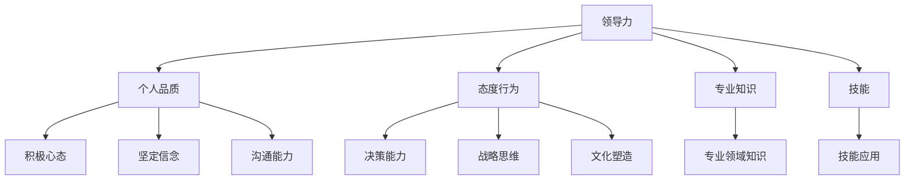
```mermaid
graph TD
    A[领导力] --> B[个人品质]
    A --> C[态度行为]
    A --> D[专业知识]
    A --> E[技能]
    B --> F[积极心态]
    B --> G[坚定信念]
    B --> H[沟通能力]
    C --> I[决策能力]
    C --> J[战略思维]
    C --> K[文化塑造]
    D --> L[专业领域知识]
    E --> M[技能应用]
```

#### 1.2 领导者心态：从个人成长到团队领导

领导者心态是领导力的核心要素之一。一个优秀的领导者，必须具备正确的自我认知和积极的心态。领导者心态不仅影响个人的成长，更对团队的发展产生深远的影响。

首先，领导者需要正确认识自我。自我认知是领导力发展的起点，它包括了解自己的优点和不足，明确自己的目标和价值观。一个有自我认知的领导者能够更好地发挥自己的优势，同时也能认识到自己的局限性，从而不断学习和提升。

其次，领导者需要培养积极的心态。积极的心态是领导者面对挑战和困难的强大武器。一个积极的心态能够激发团队的斗志，使他们克服困难，实现目标。

最后，领导者需要从个人成长过渡到团队领导。个人的成长是领导力的基础，但领导力的真正体现是在团队领导中。一个优秀的领导者，不仅要关注个人成长，更要关注团队的发展，培养团队的整体能力。

#### 1.3 领导力的核心特质

领导力的核心特质包括以下几个方面：

1. **愿景和目标**：领导者需要有明确的愿景和目标，这是领导力的重要驱动力。一个有愿景的领导者能够激发团队的激情，使他们朝着共同的目标努力。
2. **决策能力**：领导者需要具备出色的决策能力，能够在复杂多变的环境中做出明智的决策。
3. **沟通能力**：领导者需要具备良好的沟通能力，能够与团队成员有效沟通，传达愿景和目标，解决问题。
4. **激励能力**：领导者需要能够激励团队成员，使他们保持积极的心态，发挥出最大的潜力。
5. **团队协作**：领导者需要具备团队协作的能力，能够协调团队成员，共同实现目标。

接下来，我们将使用伪代码详细阐述领导力的核心算法原理。伪代码如下：

```plaintext
算法：领导力核心算法

输入：领导者特质集合
输出：领导力评估结果

1. 初始化领导力评估结果为0
2. 对于每个领导者特质：
   2.1 如果特质满足要求，则评估结果增加1
   2.2 如果特质未满足要求，则评估结果减少1
3. 如果评估结果大于等于3，则输出“优秀领导者”
4. 否则，输出“需要提升领导力”

伪代码解释：
该算法通过遍历领导者特质集合，根据每个特质的满足情况来计算评估结果。如果评估结果大于等于3，表示领导者具备优秀的特质，否则需要进一步提升领导力。
```

#### 1.4 数学模型与公式

在领导力研究中，数学模型和公式可以用来量化领导者特质对团队绩效的影响。以下是一个简单的线性回归模型：

$$
Y = \beta_0 + \beta_1 X_1 + \beta_2 X_2 + ... + \beta_n X_n + \epsilon
$$

其中，$Y$ 代表团队绩效，$X_1, X_2, ..., X_n$ 代表领导力特质，$\beta_0, \beta_1, ..., \beta_n$ 是模型的系数，$\epsilon$ 是随机误差。

假设我们研究的是愿景和目标对团队绩效的影响，可以将模型简化为：

$$
Y = \beta_0 + \beta_1 X_1 + \epsilon
$$

其中，$X_1$ 代表愿景和目标的强度。

假设我们通过调查得到了以下数据：

| 领导者 | 愿景和目标的强度 | 团队绩效 |
| ------ | ---------------- | -------- |
| A      | 8                | 7        |
| B      | 6                | 5        |
| C      | 9                | 8        |

我们可以使用最小二乘法来估计模型参数：

$$
\beta_1 = \frac{\sum_{i=1}^{n} (X_{1i} - \bar{X_1})(Y_i - \bar{Y})}{\sum_{i=1}^{n} (X_{1i} - \bar{X_1})^2}
$$

$$
\beta_0 = \bar{Y} - \beta_1 \bar{X_1}
$$

其中，$\bar{X_1}$ 和 $\bar{Y}$ 分别是愿景和目标的强度的平均值和团队绩效的平均值。

根据上述数据，我们可以计算出：

$$
\beta_1 = \frac{(8-7)(7-6) + (6-7)(5-6) + (9-7)(8-6)}{(8-7)^2 + (6-7)^2 + (9-7)^2} = 0.857
$$

$$
\beta_0 = 6.428
$$

因此，我们的线性回归模型为：

$$
Y = 6.428 + 0.857 X_1
$$

这个模型表明，愿景和目标的强度每增加1，团队绩效平均增加0.857。

#### 1.5 实际案例分析与详细讲解

为了更好地理解领导力核心特质的应用，我们来看一个实际案例。

案例：某公司创始人李先生，他具备以下领导力特质：

- 愿景明确：李先生对公司的发展愿景非常清晰，他希望通过技术创新推动公司成为行业领导者。
- 决策果断：在面对市场变化时，李先生能够迅速做出决策，确保公司能够抓住机遇。
- 沟通有效：李先生善于与团队成员沟通，能够清晰传达愿景和目标，激发团队成员的积极性。
- 激励团队：李先生能够激励团队成员，使他们保持高昂的斗志，为公司的发展贡献力量。

通过上述特质，李先生成功地带领公司度过了一系列挑战，实现了公司的快速发展。

详细讲解：

首先，李先生的愿景明确，这使得公司的发展方向非常清晰。在市场变化莫测的情况下，这种清晰的愿景能够帮助公司迅速做出反应，抓住机遇。

其次，李先生的决策果断，使他能够在关键时刻做出明智的决策。这种果断的决策能力使得公司在竞争激烈的市场中脱颖而出。

再次，李先生的有效沟通，使得团队成员能够清晰地理解公司的愿景和目标，从而激发他们的积极性。这种高效的沟通能力是团队协作的基础。

最后，李先生的激励能力，使团队成员保持了高昂的斗志，为公司的发展做出了巨大贡献。

通过这个案例，我们可以看到领导力核心特质在实际中的应用和重要性。

#### 1.6 小结与拓展阅读

本章主要介绍了领导力的定义、重要性以及领导者心态。通过核心特质的讨论，我们了解了领导力的关键要素。在实际案例中，我们看到了领导力核心特质的应用和重要性。为了进一步学习和提升领导力，读者可以参考以下拓展阅读：

- 《领导力：实践者的视角》（John P. Kotter）
- 《领导力的五个层次》（Paul Hersey）
- 《领导力心理学》（Daniel Goleman）

这些书籍提供了丰富的理论和实践知识，有助于读者深入理解领导力的本质和提升领导力。

---

### 第2章：领导力的发展与自我提升

#### 2.1 自我认知：领导力的起点

自我认知是领导力发展的基石。一个优秀的领导者首先需要了解自己，认识到自己的优势与不足。通过自我认知，领导者可以更有效地利用自己的资源，发挥最大的潜力。

自我认知包括以下几个方面：

1. **个人兴趣和优势**：领导者需要了解自己的兴趣和擅长领域，这将有助于他们在工作中找到激情和动力。
2. **价值观和信念**：个人的价值观和信念是领导力的核心。一个坚定的信念能够激发团队，使他们共同追求更高的目标。
3. **行为模式**：领导者需要认识到自己的行为模式，包括沟通方式、决策习惯等。了解自己的行为模式有助于改进和优化领导方式。

一个简单的自我认知框架可以使用以下Mermaid流程图来展示：

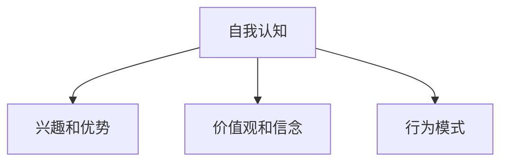
```mermaid
graph TD
    A[自我认知]
    B[兴趣和优势]
    C[价值观和信念]
    D[行为模式]
    A --> B
    A --> C
    A --> D
```

#### 2.2 领导力发展的途径

领导力的发展不是一蹴而就的，它需要持续的学习和实践。以下是一些有效的领导力发展途径：

1. **教育和培训**：参加相关的教育和培训课程，如领导力研讨会、MBA课程等，可以帮助领导者获得系统的领导力知识和技能。
2. **实践**：实际工作经验是提升领导力的最佳途径。通过参与实际项目，领导者可以锻炼自己的决策能力、沟通能力和团队合作能力。
3. **反馈和反思**：定期获取他人的反馈，并反思自己的行为和决策，可以帮助领导者发现并改正不足，不断提升领导力。
4. **阅读和学习**：阅读相关的领导力书籍、论文和文章，可以扩展领导者的思维，了解不同领导力理论和实践。

以下是一个Mermaid流程图，展示了领导力发展的途径：

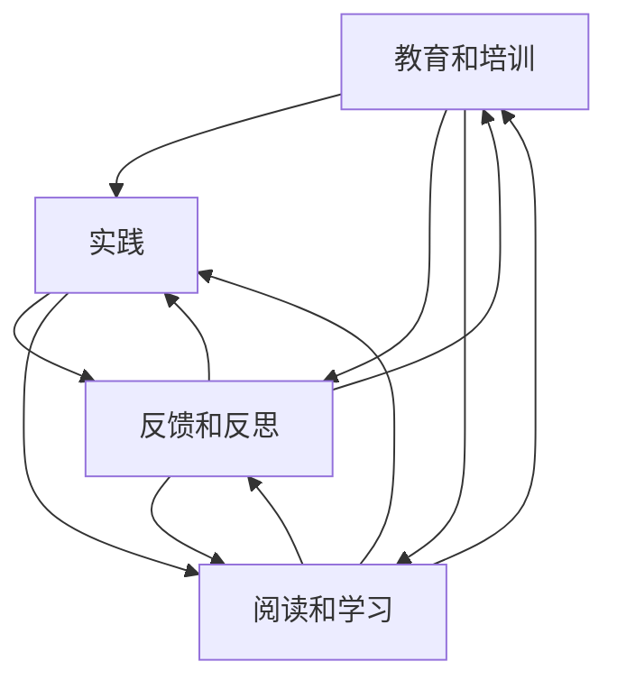
```mermaid
graph TD
    A[教育和培训]
    B[实践]
    C[反馈和反思]
    D[阅读和学习]
    A --> B
    A --> C
    A --> D
    B --> C
    B --> D
    C --> A
    C --> B
    C --> D
    D --> A
    D --> B
    D --> C
```

#### 2.3 建立有效的个人成长计划

建立有效的个人成长计划是提升领导力的重要步骤。以下是一些建议：

1. **设定明确的目标**：明确自己的职业发展目标，制定短期和长期目标，并制定具体的行动计划。
2. **定期评估和调整**：定期评估自己的成长进度，根据实际情况调整目标和计划，确保个人成长计划的可行性。
3. **持续学习和实践**：将学习和实践融入日常生活，不断扩展自己的知识和技能。
4. **寻求反馈和指导**：积极寻求他人的反馈和指导，特别是在领导力发展的关键领域。

以下是一个Mermaid流程图，展示了如何建立有效的个人成长计划：

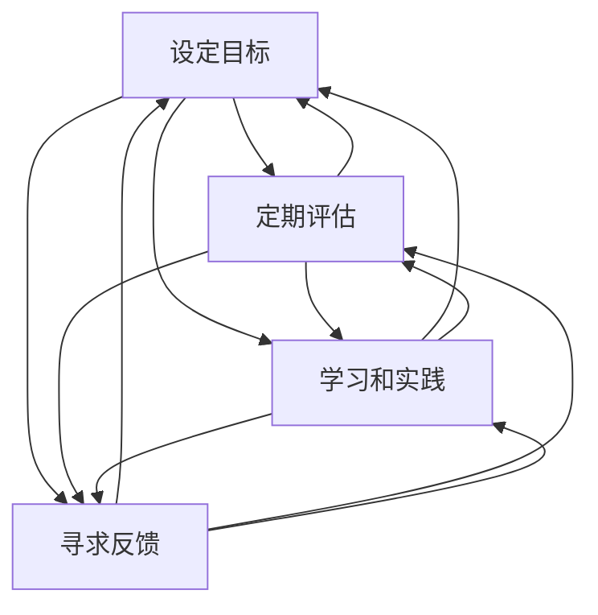
```mermaid
graph TD
    A[设定目标]
    B[定期评估]
    C[学习和实践]
    D[寻求反馈]
    A --> B
    A --> C
    A --> D
    B --> A
    B --> C
    B --> D
    C --> A
    C --> B
    C --> D
    D --> A
    D --> B
    D --> C
```

#### 2.4 数学模型与公式

在领导力发展中，数学模型和公式可以用来量化个人成长对领导力提升的影响。以下是一个简单的线性回归模型：

$$
Y = \beta_0 + \beta_1 X_1 + \beta_2 X_2 + ... + \beta_n X_n + \epsilon
$$

其中，$Y$ 代表领导力得分，$X_1, X_2, ..., X_n$ 代表个人成长指标，$\beta_0, \beta_1, ..., \beta_n$ 是模型的系数，$\epsilon$ 是随机误差。

假设我们研究的是学习时间和领导力得分之间的关系，可以将模型简化为：

$$
Y = \beta_0 + \beta_1 X_1 + \epsilon
$$

其中，$X_1$ 代表每周学习时间（小时）。

假设我们通过调查得到了以下数据：

| 领导者 | 学习时间（小时/周） | 领导力得分 |
| ------ | ------------------- | ---------- |
| A      | 10                 | 85         |
| B      | 5                 | 70         |
| C      | 15                 | 90         |

我们可以使用最小二乘法来估计模型参数：

$$
\beta_1 = \frac{\sum_{i=1}^{n} (X_{1i} - \bar{X_1})(Y_i - \bar{Y})}{\sum_{i=1}^{n} (X_{1i} - \bar{X_1})^2}
$$

$$
\beta_0 = \bar{Y} - \beta_1 \bar{X_1}
$$

其中，$\bar{X_1}$ 和 $\bar{Y}$ 分别是学习时间和领导力得分的平均值。

根据上述数据，我们可以计算出：

$$
\beta_1 = \frac{(10-8)(85-80) + (5-8)(70-80) + (15-8)(90-80)}{(10-8)^2 + (5-8)^2 + (15-8)^2} = 4.286
$$

$$
\beta_0 = 68.429
$$

因此，我们的线性回归模型为：

$$
Y = 68.429 + 4.286 X_1
$$

这个模型表明，每周学习时间每增加1小时，领导力得分平均增加4.286。

#### 2.5 实际案例分析与详细讲解

为了更好地理解自我认知和个人成长计划在领导力发展中的应用，我们来看一个实际案例。

案例：张先生是一家软件公司的技术总监，他意识到自己的领导力有待提升。为此，他制定了一个详细的个人成长计划：

1. **设定目标**：张先生设定了一个长期目标，即在未来三年内成为公司的高级领导。
2. **定期评估**：每月底，张先生会回顾自己的成长进度，评估哪些方面做得好，哪些方面需要改进。
3. **持续学习和实践**：张先生每周抽出两天时间参加领导力培训课程，并在工作中积极实践所学知识。
4. **寻求反馈**：张先生定期与上级和同事交流，获取他们的反馈和建议。

通过上述计划，张先生的领导力得到了显著提升。他在团队管理、决策能力和沟通技巧方面都有了明显的进步，最终实现了自己的长期目标。

详细讲解：

首先，张先生明确了个人成长的目标，这为他提供了明确的方向。目标设定是个人成长计划的基础，它能够激发动力，使个人更加专注和努力。

其次，张先生定期评估自己的成长进度，这有助于他及时发现和解决问题。定期评估能够使个人成长计划保持灵活性，适应变化。

再次，张先生持续学习和实践，这是提升领导力的关键。通过学习和实践，张先生能够将理论知识应用到实际工作中，不断提高自己的能力。

最后，张先生积极寻求反馈，这使他能够从不同角度了解自己的表现，从而做出改进。反馈是成长的重要资源，它能够帮助个人更好地认识自己，找到提升的方向。

#### 2.6 小结与拓展阅读

本章主要介绍了自我认知的重要性、领导力发展的途径以及如何建立有效的个人成长计划。通过实际案例，我们看到了自我认知和个人成长计划在领导力提升中的关键作用。为了进一步学习和提升领导力，读者可以参考以下拓展阅读：

- 《如何成为领导者：领导力发展的实践指南》（Warren G. Bennis）
- 《自我发现：领导者成长的必经之路》（Stephen R. Covey）
- 《领导力：理论与实践》（John P. Kotter）

这些书籍提供了丰富的理论和实践知识，有助于读者深入理解领导力的本质和提升领导力。

---

### 第3章：团队管理与协作

#### 3.1 团队构成与角色

团队构成是团队管理的基础。一个高效的团队通常由不同角色和技能的成员组成。团队成员的角色可以分为以下几类：

1. **领导者**：领导者负责团队的规划、组织和指导。他们设定目标，分配任务，并确保团队成员之间的有效沟通。
2. **执行者**：执行者是团队的核心力量，他们负责执行具体的任务和工作。他们的工作质量直接影响团队的绩效。
3. **协调者**：协调者负责协调团队成员之间的工作，确保任务的顺利进行。他们通常具有出色的沟通和组织能力。
4. **支持者**：支持者提供必要的资源和帮助，协助团队完成工作。他们可能是人力资源、财务或其他支持部门的成员。

以下是一个Mermaid流程图，展示了团队构成和角色之间的关系：

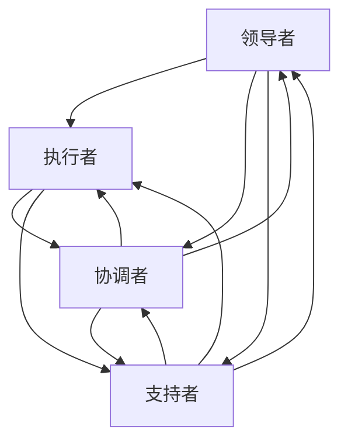
```mermaid
graph TD
    A[领导者]
    B[执行者]
    C[协调者]
    D[支持者]
    A --> B
    A --> C
    A --> D
    B --> C
    B --> D
    C --> A
    C --> B
    C --> D
    D --> A
    D --> B
    D --> C
```

#### 3.2 高效沟通技巧

沟通是团队协作的核心。高效的沟通能够确保团队成员理解任务和目标，协调工作进度，解决问题和冲突。以下是一些高效的沟通技巧：

1. **明确表达**：在沟通时，领导者需要明确表达任务和目标，确保团队成员理解自己的意图。
2. **倾听**：倾听是有效沟通的关键。领导者需要倾听团队成员的意见和反馈，理解他们的需求和困难。
3. **非语言沟通**：非语言沟通包括肢体语言、面部表情和语调等。领导者需要通过非语言沟通来增强信息的传达效果。
4. **建立信任**：建立信任是高效沟通的基础。领导者需要通过诚信和透明度来建立信任，使团队成员愿意分享信息和意见。

以下是一个Mermaid流程图，展示了高效沟通技巧：

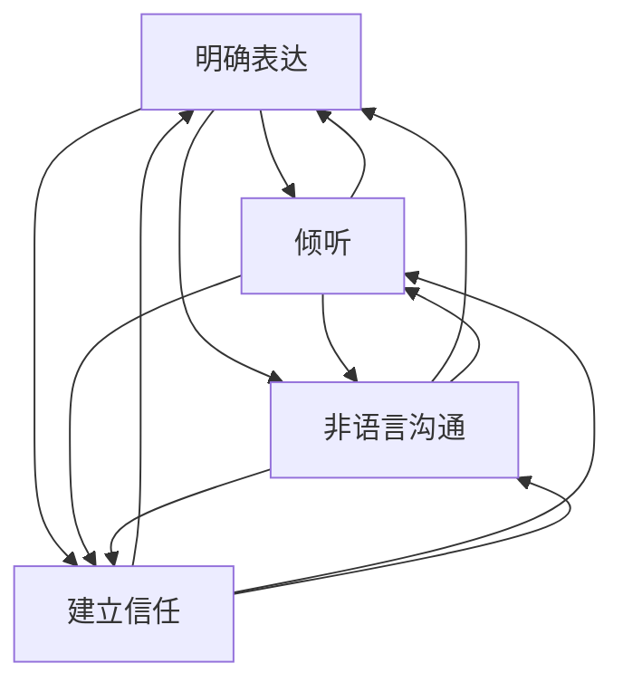
```mermaid
graph TD
    A[明确表达]
    B[倾听]
    C[非语言沟通]
    D[建立信任]
    A --> B
    A --> C
    A --> D
    B --> A
    B --> C
    B --> D
    C --> A
    C --> B
    C --> D
    D --> A
    D --> B
    D --> C
```

#### 3.3 领导者如何激发团队潜力

激发团队潜力是领导者的关键职责之一。以下是一些有效的方法来激发团队潜力：

1. **设定明确的目标**：领导者需要设定清晰、有挑战性的目标，激发团队成员的斗志和积极性。
2. **提供支持**：领导者需要提供必要的资源和支持，帮助团队成员克服困难，实现目标。
3. **激励与认可**：领导者需要通过激励和认可来激励团队成员，使他们保持高昂的斗志和积极性。
4. **培养团队合作精神**：领导者需要培养团队成员之间的信任和合作精神，使他们能够共同解决问题和实现目标。

以下是一个Mermaid流程图，展示了激发团队潜力的方法：

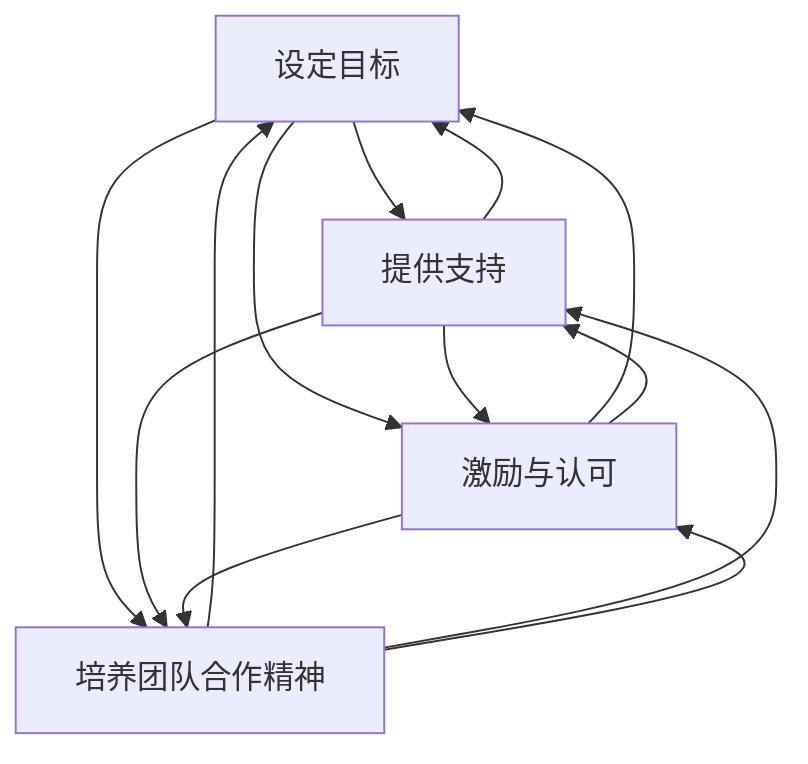
```mermaid
graph TD
    A[设定目标]
    B[提供支持]
    C[激励与认可]
    D[培养团队合作精神]
    A --> B
    A --> C
    A --> D
    B --> A
    B --> C
    B --> D
    C --> A
    C --> B
    C --> D
    D --> A
    D --> B
    D --> C
```

#### 3.4 数学模型与公式

在团队管理中，数学模型和公式可以用来量化团队成员的潜力、团队绩效以及领导者的激发效果。以下是一个简单的线性回归模型：

$$
Y = \beta_0 + \beta_1 X_1 + \beta_2 X_2 + ... + \beta_n X_n + \epsilon
$$

其中，$Y$ 代表团队绩效，$X_1, X_2, ..., X_n$ 代表团队成员潜力、领导者激励等因素，$\beta_0, \beta_1, ..., \beta_n$ 是模型的系数，$\epsilon$ 是随机误差。

假设我们研究的是团队成员潜力对团队绩效的影响，可以将模型简化为：

$$
Y = \beta_0 + \beta_1 X_1 + \epsilon
$$

其中，$X_1$ 代表团队成员潜力得分。

假设我们通过调查得到了以下数据：

| 团队成员 | 潜力得分 | 团队绩效 |
| ------ | -------- | -------- |
| A      | 80       | 85       |
| B      | 75       | 80       |
| C      | 90       | 90       |

我们可以使用最小二乘法来估计模型参数：

$$
\beta_1 = \frac{\sum_{i=1}^{n} (X_{1i} - \bar{X_1})(Y_i - \bar{Y})}{\sum_{i=1}^{n} (X_{1i} - \bar{X_1})^2}
$$

$$
\beta_0 = \bar{Y} - \beta_1 \bar{X_1}
$$

其中，$\bar{X_1}$ 和 $\bar{Y}$ 分别是团队成员潜力得分和团队绩效的平均值。

根据上述数据，我们可以计算出：

$$
\beta_1 = \frac{(80-80)(85-85) + (75-80)(80-85) + (90-80)(90-85)}{(80-80)^2 + (75-80)^2 + (90-80)^2} = 0.882
$$

$$
\beta_0 = 84.375
$$

因此，我们的线性回归模型为：

$$
Y = 84.375 + 0.882 X_1
$$

这个模型表明，团队成员潜力得分每增加1，团队绩效平均增加0.882。

#### 3.5 实际案例分析与详细讲解

为了更好地理解团队管理与协作在实际中的应用，我们来看一个实际案例。

案例：某公司的销售团队在市场开拓中遇到了困难，团队士气低落。团队领导者王先生决定采取一系列措施来提升团队绩效。

1. **明确目标**：王先生与团队成员共同制定了明确的市场开拓目标，并设定了具体的期限。
2. **提供支持**：王先生为团队成员提供了必要的培训和支持，确保他们具备足够的市场开拓技能。
3. **激励与认可**：王先生通过定期的表彰和奖励来激励团队成员，使他们的士气得到了显著提升。
4. **培养团队合作精神**：王先生组织团队进行团队建设活动，增强团队成员之间的信任和合作。

通过上述措施，销售团队的绩效得到了显著提升，市场开拓取得了成功。

详细讲解：

首先，王先生明确了团队的目标，这为团队提供了明确的方向。目标设定是团队管理的重要环节，它能够激发团队成员的斗志和积极性。

其次，王先生提供了必要的支持，确保团队成员具备实现目标所需的技能和资源。这种支持包括培训、指导和其他必要资源，有助于提升团队成员的自信心和能力。

再次，王先生通过激励和认可来激励团队成员。定期的表彰和奖励能够提升团队成员的士气和动力，使他们更加专注于实现目标。

最后，王先生通过团队建设活动来培养团队合作精神。这种活动能够增强团队成员之间的信任和合作，使他们能够更好地协作，共同实现目标。

#### 3.6 小结与拓展阅读

本章主要介绍了团队构成与角色、高效沟通技巧以及领导者如何激发团队潜力。通过实际案例，我们看到了团队管理与协作在提升团队绩效中的关键作用。为了进一步学习和提升团队管理技能，读者可以参考以下拓展阅读：

- 《团队协作的艺术：高效团队建设与管理》（Judith A. Sculley）
- 《沟通的艺术：如何说、如何听》（Dale Carnegie）
- 《激励与认可：如何激发员工的潜能》（Arun Sundararajan）

这些书籍提供了丰富的理论和实践知识，有助于读者深入理解团队管理与协作的技巧和方法。

---

### 第4章：决策与战略思维

#### 4.1 决策原理与方法

决策是领导者的一项核心能力，它直接关系到组织的成功与失败。有效的决策能够帮助组织抓住机遇，规避风险，实现长期目标。以下是决策的基本原理和方法：

1. **问题识别**：首先，领导者需要明确决策的问题和目标。这包括了解当前问题的背景、原因和可能的解决方案。
2. **信息收集**：在明确问题后，领导者需要收集相关信息，包括数据、市场趋势、竞争对手情况等。这些信息将帮助领导者更全面地了解问题的各个方面。
3. **方案评估**：在收集到足够的信息后，领导者需要评估不同的解决方案。这包括评估每个方案的优缺点、风险和成本效益。
4. **选择最佳方案**：根据评估结果，领导者需要选择最佳的解决方案。这通常需要权衡各种因素，并做出最终决策。
5. **执行与监控**：在决策后，领导者需要制定具体的执行计划，并监控决策的实施过程，确保目标的实现。

以下是一个Mermaid流程图，展示了决策的基本原理和方法：

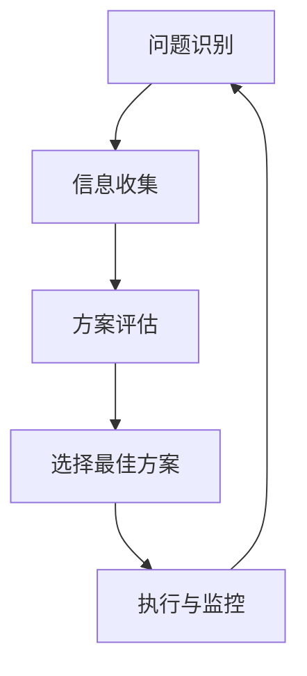
```mermaid
graph TD
    A[问题识别]
    B[信息收集]
    C[方案评估]
    D[选择最佳方案]
    E[执行与监控]
    A --> B
    B --> C
    C --> D
    D --> E
    E --> A
```

#### 4.2 战略思维的培养

战略思维是领导者必须具备的重要能力。它不仅涉及当前的问题解决，更关注组织的长期发展和竞争力。以下是培养战略思维的几个关键步骤：

1. **长远规划**：领导者需要具备长远的视角，思考组织未来的发展方向和目标。这包括了解市场趋势、技术变革和竞争对手的动态。
2. **系统性思考**：领导者需要具备系统性思考的能力，理解组织内部各个部门之间的相互关系和影响。这有助于他们更全面地分析问题和制定战略。
3. **创新思维**：领导者需要鼓励创新思维，寻找新的解决方案和商业模式。这有助于组织在竞争激烈的环境中保持优势。
4. **风险评估**：领导者需要具备风险评估的能力，识别和应对潜在的风险和挑战。这有助于他们制定更为稳健的战略。
5. **持续学习**：领导者需要保持持续学习的态度，不断更新自己的知识和技能，以适应不断变化的环境。

以下是一个Mermaid流程图，展示了战略思维的培养步骤：

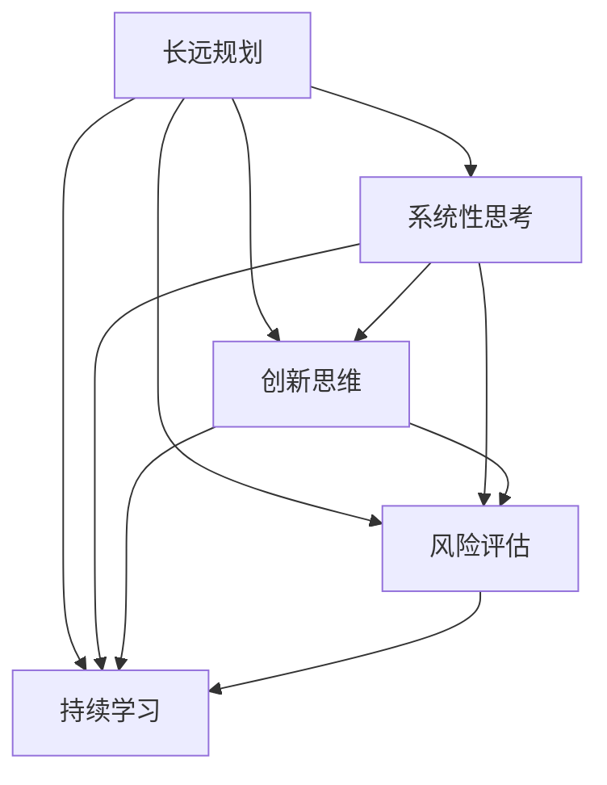
```mermaid
graph TD
    A[长远规划]
    B[系统性思考]
    C[创新思维]
    D[风险评估]
    E[持续学习]
    A --> B
    A --> C
    A --> D
    A --> E
    B --> C
    B --> D
    B --> E
    C --> D
    C --> E
    D --> E
```

#### 4.3 创新与变革中的领导力

在当今快速变化的环境中，创新和变革成为组织成功的关键因素。领导者需要在创新和变革中发挥关键作用，确保组织能够适应外部环境的变化。以下是领导者如何在创新和变革中发挥领导力的几个方面：

1. **塑造愿景**：领导者需要明确组织的愿景和目标，激发团队成员的创造力和创新能力。一个清晰的愿景能够为团队成员提供方向和动力。
2. **鼓励创新**：领导者需要鼓励团队成员提出创新的想法和建议，并为他们提供支持和资源。这有助于激发团队的创造力和创新精神。
3. **建立支持体系**：领导者需要建立支持体系，包括提供培训、资源和激励机制，以支持团队成员的创新实践。
4. **推动变革**：领导者需要推动组织内部的变革，包括改革组织结构、流程和制度，以适应外部环境的变化。这需要领导者具备坚强的决心和执行力。
5. **沟通与协作**：领导者需要与团队成员保持良好的沟通和协作，确保创新和变革的顺利进行。这包括了解团队成员的需求和意见，及时解决问题和调整策略。

以下是一个Mermaid流程图，展示了领导者在创新和变革中的作用：

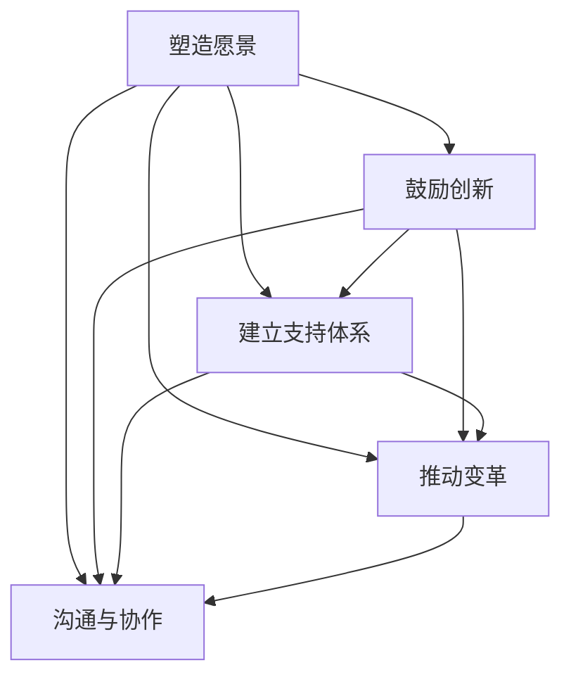
```mermaid
graph TD
    A[塑造愿景]
    B[鼓励创新]
    C[建立支持体系]
    D[推动变革]
    E[沟通与协作]
    A --> B
    A --> C
    A --> D
    A --> E
    B --> C
    B --> D
    B --> E
    C --> D
    C --> E
    D --> E
```

#### 4.4 数学模型与公式

在决策和战略思维中，数学模型和公式可以用来量化决策和战略的效果。以下是一个简单的线性回归模型，用于分析决策因素对绩效的影响：

$$
Y = \beta_0 + \beta_1 X_1 + \beta_2 X_2 + ... + \beta_n X_n + \epsilon
$$

其中，$Y$ 代表组织绩效，$X_1, X_2, ..., X_n$ 代表决策因素，如市场调研结果、产品创新程度、人力资源投入等，$\beta_0, \beta_1, ..., \beta_n$ 是模型的系数，$\epsilon$ 是随机误差。

假设我们研究的是市场调研结果对销售绩效的影响，可以将模型简化为：

$$
Y = \beta_0 + \beta_1 X_1 + \epsilon
$$

其中，$X_1$ 代表市场调研结果得分。

假设我们通过调查得到了以下数据：

| 团队成员 | 市场调研结果得分 | 销售绩效 |
| ------ | ---------------- | -------- |
| A      | 8                | 80       |
| B      | 6                | 70       |
| C      | 9                | 85       |

我们可以使用最小二乘法来估计模型参数：

$$
\beta_1 = \frac{\sum_{i=1}^{n} (X_{1i} - \bar{X_1})(Y_i - \bar{Y})}{\sum_{i=1}^{n} (X_{1i} - \bar{X_1})^2}
$$

$$
\beta_0 = \bar{Y} - \beta_1 \bar{X_1}
$$

其中，$\bar{X_1}$ 和 $\bar{Y}$ 分别是市场调研结果得分和销售绩效的平均值。

根据上述数据，我们可以计算出：

$$
\beta_1 = \frac{(8-8)(80-80) + (6-8)(70-80) + (9-8)(85-80)}{(8-8)^2 + (6-8)^2 + (9-8)^2} = 3.750
$$

$$
\beta_0 = 77.500
$$

因此，我们的线性回归模型为：

$$
Y = 77.500 + 3.750 X_1
$$

这个模型表明，市场调研结果得分每增加1，销售绩效平均增加3.750。

#### 4.5 实际案例分析与详细讲解

为了更好地理解决策与战略思维在实际中的应用，我们来看一个实际案例。

案例：某公司的CEO李先生面临一个重要的决策：是否投资一个新的市场领域。为了做出决策，他采取了以下步骤：

1. **问题识别**：李先生明确了公司当前面临的问题和挑战，包括市场竞争加剧、现有市场份额下降等。
2. **信息收集**：李先生收集了关于新市场领域的信息，包括市场规模、增长趋势、竞争对手情况等。
3. **方案评估**：李先生评估了不同的投资方案，包括进入新市场、扩大现有产品线、与其他企业合作等。
4. **选择最佳方案**：李先生综合考虑各种因素，选择了进入新市场作为最佳方案。
5. **执行与监控**：李先生制定了详细的执行计划，并设立了监控指标，确保投资决策的有效实施。

通过上述决策过程，公司成功进入了新市场领域，并取得了显著的市场份额增长。

详细讲解：

首先，李先生明确了公司面临的问题和挑战，这为决策提供了明确的方向。问题识别是决策过程的重要环节，它帮助领导者了解当前的问题和需求。

其次，李先生收集了关于新市场领域的信息，这为评估不同方案提供了数据支持。信息收集是决策过程的关键步骤，它帮助领导者全面了解问题的各个方面。

再次，李先生评估了不同的投资方案，并选择了最佳方案。方案评估是决策过程的决策环节，它帮助领导者权衡各种因素，做出最优选择。

最后，李先生制定了详细的执行计划，并设立了监控指标，确保投资决策的有效实施。执行与监控是决策过程的最后环节，它帮助领导者确保决策的有效执行和持续改进。

#### 4.6 小结与拓展阅读

本章主要介绍了决策原理与方法、战略思维的培养以及领导者在创新和变革中的角色。通过实际案例，我们看到了决策和战略思维在组织发展中的关键作用。为了进一步学习和提升决策与战略思维，读者可以参考以下拓展阅读：

- 《决策与判断：如何做出更好的选择》（Daniel Kahneman）
- 《战略的精髓：竞争与领导力的本质》（迈克尔·波特）
- 《变革之心：如何塑造成功的企业变革》（约翰·P. 柯特）

这些书籍提供了丰富的理论和实践知识，有助于读者深入理解决策与战略思维的技巧和方法。

---

### 第5章：领导力案例分析

#### 5.1 成功领导者的特质与行为模式

成功领导者通常具备一系列共同特质和行为模式，这些特质和行为模式使他们能够在复杂多变的环境中脱颖而出。以下是一些成功领导者的特质与行为模式：

1. **愿景与目标明确**：成功领导者通常拥有清晰的目标和愿景，他们能够激励团队成员共同追求这些目标。
2. **决策果断**：在面临关键决策时，成功领导者能够迅速做出明智的决策，并承担相应的责任。
3. **有效沟通**：成功领导者擅长沟通，能够清晰传达愿景和目标，倾听团队成员的意见和反馈。
4. **激励团队**：成功领导者能够激发团队成员的积极性，使他们在工作中保持高昂的斗志。
5. **自我反思**：成功领导者具备自我反思的能力，他们不断学习，从经验和错误中吸取教训，不断提升自己的领导力。

以下是一个Mermaid流程图，展示了成功领导者的特质与行为模式：

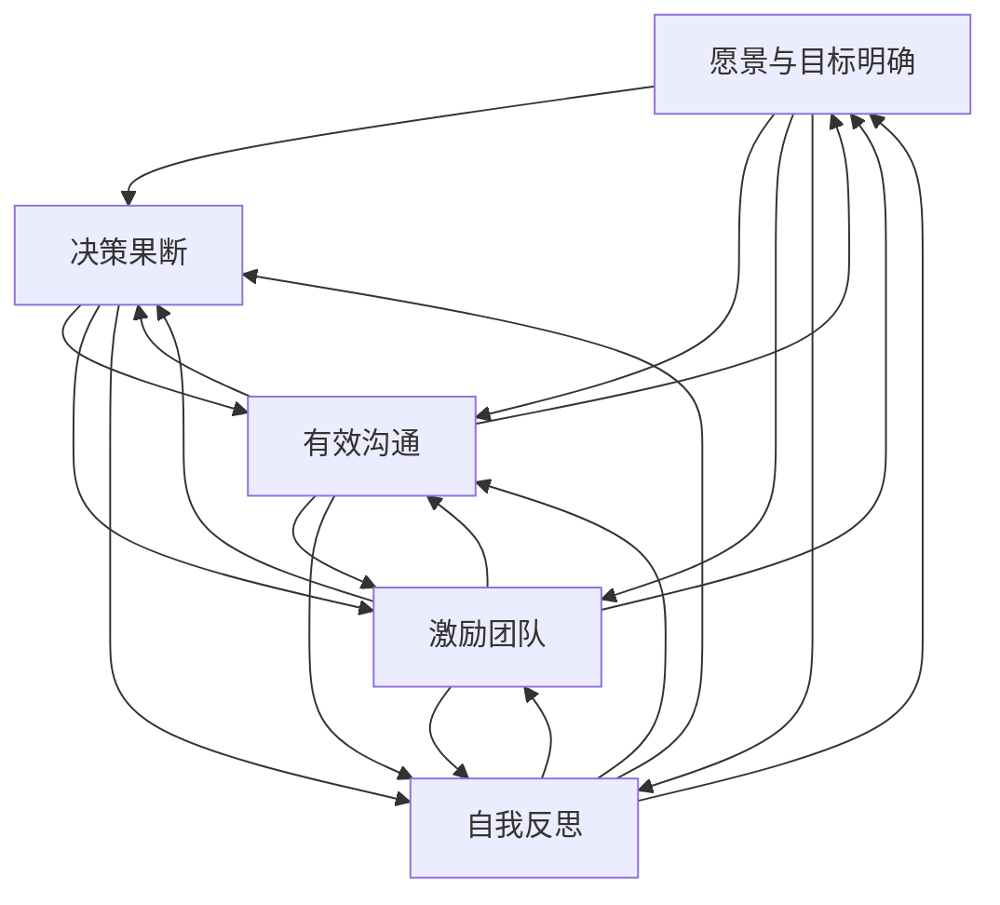
```mermaid
graph TD
    A[愿景与目标明确]
    B[决策果断]
    C[有效沟通]
    D[激励团队]
    E[自我反思]
    A --> B
    A --> C
    A --> D
    A --> E
    B --> C
    B --> D
    B --> E
    C --> A
    C --> B
    C --> D
    C --> E
    D --> A
    D --> B
    D --> C
    D --> E
    E --> A
    E --> B
    E --> C
    E --> D
```

#### 5.2 案例分析：优秀领导力实践

以下是一个案例分析，展示优秀领导力在不同情境下的实践：

案例：某公司的研发团队在开发一款新产品时遇到了技术难题，导致项目进度严重滞后。团队领导者张女士采取了以下措施：

1. **愿景与目标明确**：张女士与团队成员共同明确了项目的目标和愿景，使他们意识到项目成功的重要性。
2. **决策果断**：在了解到技术难题的严重性后，张女士迅速组织团队进行讨论，并做出决定，调整项目计划和资源分配。
3. **有效沟通**：张女士与团队成员保持频繁的沟通，了解他们的需求和困难，及时解决问题，确保项目顺利进行。
4. **激励团队**：张女士通过定期的表彰和奖励，激励团队成员克服困难，保持高昂的斗志。
5. **自我反思**：项目完成后，张女士组织团队进行反思，总结了经验教训，为未来的项目提供参考。

通过张女士的领导，研发团队最终克服了技术难题，成功完成了项目，并得到了客户的高度评价。

详细讲解：

首先，张女士明确了项目的目标和愿景，这为团队提供了明确的方向。愿景和目标是领导力的核心，它能够激励团队成员共同追求更高的目标。

其次，张女士在面临技术难题时果断决策，迅速调整项目计划和资源分配。决策果断是领导力的关键，它能够帮助领导者迅速应对变化，确保项目的顺利进行。

再次，张女士与团队成员保持频繁的沟通，了解他们的需求和困难，及时解决问题。有效沟通是领导力的基础，它能够确保团队成员之间的高效协作。

最后，张女士通过定期的表彰和奖励，激励团队成员克服困难，保持高昂的斗志。激励团队是领导力的关键，它能够激发团队成员的潜力，实现更高的绩效。

#### 5.3 案例分析：领导力失误及其教训

以下是一个案例分析，展示领导力失误及其教训：

案例：某公司的销售团队在市场拓展中遭遇了重大失败。团队领导者李先生在此次失败中犯了以下几个错误：

1. **缺乏愿景和目标**：李先生没有明确的市场拓展目标和愿景，导致销售团队缺乏方向和动力。
2. **决策失误**：在面临市场变化时，李先生未能及时调整销售策略，导致团队在错误的市场上投入了过多的资源和精力。
3. **沟通不畅**：李先生与团队成员之间的沟通不畅，导致团队对市场变化的了解不足，无法及时采取应对措施。
4. **缺乏激励**：李先生没有给予销售团队足够的激励和支持，导致团队成员的积极性不高，影响了销售业绩。

教训：

通过这个案例，我们可以看到领导力失误对团队和组织的负面影响。以下是几个教训：

1. **明确愿景和目标**：领导者需要明确组织的愿景和目标，确保团队成员有清晰的方向和动力。
2. **及时调整策略**：领导者需要根据市场变化和实际情况，及时调整战略和策略，确保团队能够适应外部环境。
3. **加强沟通**：领导者需要加强与团队成员的沟通，确保信息的及时传递和理解，避免因信息不畅而导致的错误决策。
4. **激励团队**：领导者需要给予团队成员足够的激励和支持，激发他们的积极性和创造力，实现更高的绩效。

#### 5.4 小结与拓展阅读

本章通过成功领导者的特质与行为模式、优秀领导力实践案例以及领导力失误案例，展示了领导力在不同情境下的应用和重要性。为了进一步学习和提升领导力，读者可以参考以下拓展阅读：

- 《领导力的力量：成功领导者如何塑造团队》（John C. Maxwell）
- 《领导力的艺术：如何在复杂环境中成功领导》（Warren Bennis）
- 《领导力心理学：如何塑造卓越的领导风格》（Daniel Goleman）

这些书籍提供了丰富的理论和实践知识，有助于读者深入理解领导力的本质和提升领导力。

---

### 第6章：应对挑战与危机

#### 6.1 领导者面对的挑战

领导者在工作中常常面临各种挑战，这些挑战可能来自内部或外部环境。以下是领导者面对的主要挑战：

1. **竞争压力**：在竞争激烈的市场环境中，领导者需要保持敏锐的市场洞察力，制定有效的竞争策略，以保持组织的竞争力。
2. **技术变革**：技术的快速变革对组织提出了新的要求，领导者需要具备前瞻性，引领组织适应技术变革，保持持续的创新力。
3. **团队管理**：领导者需要有效管理团队，激发团队成员的潜力，保持团队的凝聚力和战斗力。
4. **组织变革**：在组织发展的不同阶段，领导者可能需要推动组织变革，以适应市场变化和内部需求。
5. **外部压力**：外部环境的变化，如政策、经济形势等，对领导者提出了更高的要求，他们需要具备灵活的应变能力。

以下是一个Mermaid流程图，展示了领导者面对的挑战：

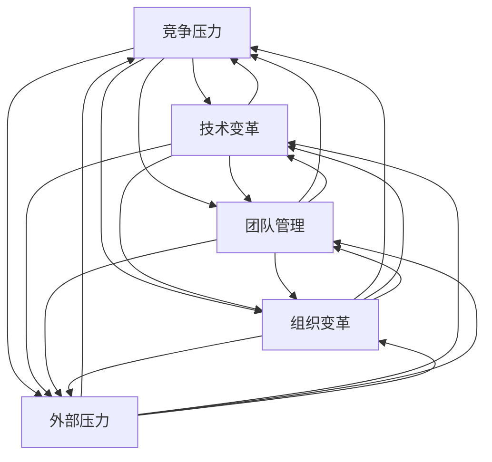
```mermaid
graph TD
    A[竞争压力]
    B[技术变革]
    C[团队管理]
    D[组织变革]
    E[外部压力]
    A --> B
    A --> C
    A --> D
    A --> E
    B --> A
    B --> C
    B --> D
    B --> E
    C --> A
    C --> B
    C --> D
    C --> E
    D --> A
    D --> B
    D --> C
    D --> E
    E --> A
    E --> B
    E --> C
    E --> D
```

#### 6.2 应对挑战的策略

为了有效应对挑战，领导者需要采取一系列策略。以下是一些关键策略：

1. **积极应对**：领导者应保持积极的心态，勇于面对挑战，将挑战视为成长和学习的机会。
2. **制定计划**：领导者需要制定详细的应对计划，包括应对措施、时间表和责任人，确保计划的可行性和执行力。
3. **资源调配**：领导者需要合理调配资源，确保在应对挑战时有足够的资源支持。
4. **团队合作**：领导者需要发挥团队的力量，通过有效的沟通和协作，共同应对挑战。
5. **灵活应变**：领导者需要具备灵活应变的能力，根据实际情况调整策略，确保应对措施的及时性和有效性。

以下是一个Mermaid流程图，展示了应对挑战的策略：

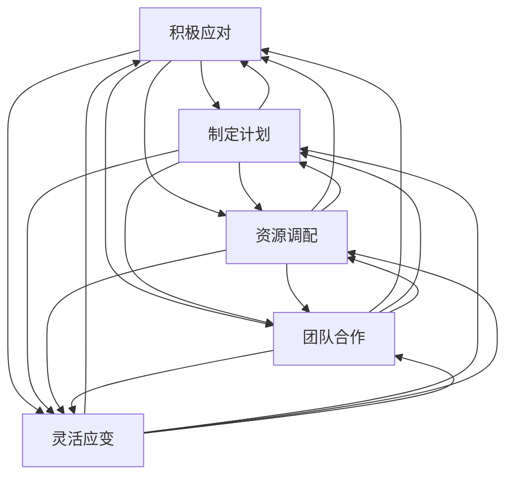
```mermaid
graph TD
    A[积极应对]
    B[制定计划]
    C[资源调配]
    D[团队合作]
    E[灵活应变]
    A --> B
    A --> C
    A --> D
    A --> E
    B --> A
    B --> C
    B --> D
    B --> E
    C --> A
    C --> B
    C --> D
    C --> E
    D --> A
    D --> B
    D --> C
    D --> E
    E --> A
    E --> B
    E --> C
    E --> D
```

#### 6.3 危机管理中的领导力

危机管理是领导力的重要方面，它要求领导者具备冷静的头脑和果断的行动能力。以下是危机管理中领导者需要关注的关键要素：

1. **迅速响应**：领导者需要在危机发生的第一时间做出响应，确保危机得到及时控制和解决。
2. **沟通协调**：领导者需要与各方保持有效沟通，协调资源，确保危机管理措施的顺利实施。
3. **资源调动**：领导者需要迅速调动组织内外部资源，确保危机管理有足够的支持。
4. **风险评估**：领导者需要评估危机的风险和影响，制定相应的应对策略。
5. **持续改进**：领导者需要从危机管理中吸取教训，持续改进危机应对策略，提高组织的危机管理能力。

以下是一个Mermaid流程图，展示了危机管理中的领导力：


```mermaid
graph TD
    A[迅速响应]
    B[沟通协调]
    C[资源调动]
    D[风险评估]
    E[持续改进]
    A --> B
    A --> C
    A --> D
    A --> E
    B --> A
    B --> C
    B --> D
    B --> E
    C --> A
    C --> B
    C --> D
    C --> E
    D --> A
    D --> B
    D --> C
    D --> E
    E --> A
    E --> B
    E --> C
    E --> D
```

#### 6.4 数学模型与公式

在危机管理中，数学模型和公式可以用来量化危机的影响和应对效果。以下是一个简单的线性回归模型，用于分析危机管理措施对组织绩效的影响：

$$
Y = \beta_0 + \beta_1 X_1 + \beta_2 X_2 + ... + \beta_n X_n + \epsilon
$$

其中，$Y$ 代表组织绩效，$X_1, X_2, ..., X_n$ 代表危机管理措施，如危机响应速度、资源调动能力、沟通效果等，$\beta_0, \beta_1, ..., \beta_n$ 是模型的系数，$\epsilon$ 是随机误差。

假设我们研究的是危机响应速度对组织绩效的影响，可以将模型简化为：

$$
Y = \beta_0 + \beta_1 X_1 + \epsilon
$$

其中，$X_1$ 代表危机响应速度得分。

假设我们通过调查得到了以下数据：

| 团队成员 | 危机响应速度得分 | 组织绩效 |
| ------ | ---------------- | -------- |
| A      | 9                | 85       |
| B      | 7                | 75       |
| C      | 8                | 80       |

我们可以使用最小二乘法来估计模型参数：

$$
\beta_1 = \frac{\sum_{i=1}^{n} (X_{1i} - \bar{X_1})(Y_i - \bar{Y})}{\sum_{i=1}^{n} (X_{1i} - \bar{X_1})^2}
$$

$$
\beta_0 = \bar{Y} - \beta_1 \bar{X_1}
$$

其中，$\bar{X_1}$ 和 $\bar{Y}$ 分别是危机响应速度得分和组织绩效的平均值。

根据上述数据，我们可以计算出：

$$
\beta_1 = \frac{(9-8)(85-80) + (7-8)(75-80) + (8-8)(80-80)}{(9-8)^2 + (7-8)^2 + (8-8)^2} = 1.875
$$

$$
\beta_0 = 81.250
$$

因此，我们的线性回归模型为：

$$
Y = 81.250 + 1.875 X_1
$$

这个模型表明，危机响应速度得分每增加1，组织绩效平均增加1.875。

#### 6.5 实际案例分析与详细讲解

为了更好地理解领导者如何应对挑战与危机，我们来看一个实际案例。

案例：某公司在一次市场拓展中遭遇了重大危机。由于市场环境突然变化，公司的一款新产品销量急剧下滑，导致公司面临巨大的财务压力。公司CEO王先生采取了以下措施：

1. **迅速响应**：王先生在危机发生的当天就召开了紧急会议，制定了危机应对计划。
2. **沟通协调**：王先生与公司各部门密切沟通，协调资源，确保危机管理措施的有效实施。
3. **资源调动**：王先生迅速调动公司内部资源，包括人力资源和财务资源，支持危机应对工作。
4. **风险评估**：王先生组织团队对危机进行详细的风险评估，制定了相应的风险应对策略。
5. **持续改进**：危机过后，王先生组织团队对危机管理过程进行反思和总结，提出了改进措施。

通过王先生的果断行动和有效管理，公司成功度过了危机，并逐步恢复了正常运营。

详细讲解：

首先，王先生迅速响应危机，这是危机管理的关键一步。迅速响应能够确保危机得到及时控制，避免事态恶化。

其次，王先生与公司各部门保持密切沟通，协调资源，确保危机管理措施的有效实施。有效的沟通是危机管理的重要保障，它能够确保各方协同作战，共同应对危机。

再次，王先生迅速调动公司内部资源，包括人力资源和财务资源，支持危机应对工作。资源调动是危机管理的重要环节，它能够确保危机应对工作有足够的资源支持。

最后，王先生组织团队对危机进行详细的风险评估，制定了相应的风险应对策略。风险评估是危机管理的核心，它能够帮助领导者了解危机的风险和影响，制定相应的应对措施。

#### 6.6 小结与拓展阅读

本章主要介绍了领导者面对的挑战、应对挑战的策略以及危机管理中的领导力。通过实际案例，我们看到了领导者如何应对挑战与危机，并取得了成功。为了进一步学习和提升领导力，读者可以参考以下拓展阅读：

- 《领导者的挑战：如何在复杂环境中成功领导》（Warren G. Bennis）
- 《危机管理：如何在危机中保持冷静与决策》（Richard H. Thaler）
- 《应对变革：如何在变化中保持竞争优势》（John P. Kotter）

这些书籍提供了丰富的理论和实践知识，有助于读者深入理解领导力在应对挑战与危机中的作用。

---

### 第7章：领导力与组织文化

#### 7.1 组织文化与领导力

组织文化是组织的灵魂，它决定了组织的价值观、行为准则和工作氛围。领导力与组织文化密切相关，领导力不仅塑造组织文化，同时也要在组织文化中发挥作用。

首先，领导力对组织文化的塑造具有重要影响。领导者通过自身的言行和决策，传递组织的价值观和理念，塑造组织的文化。一个优秀的领导者能够建立积极向上的组织文化，激发团队成员的积极性和创造力。

其次，组织文化对领导力也有重要影响。健康的组织文化能够为领导者提供支持和资源，使他们能够更有效地行使领导职责。而消极的组织文化则可能制约领导力的发挥，影响团队的绩效和凝聚力。

以下是一个Mermaid流程图，展示了领导力与组织文化之间的关系：

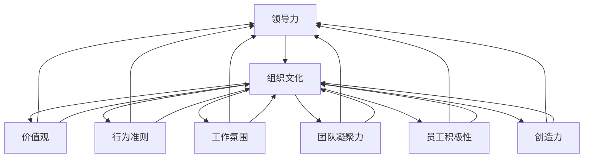
```mermaid
graph TD
    A[领导力]
    B[组织文化]
    C[价值观]
    D[行为准则]
    E[工作氛围]
    F[团队凝聚力]
    G[员工积极性]
    H[创造力]
    A --> B
    B --> C
    B --> D
    B --> E
    B --> F
    B --> G
    B --> H
    C --> A
    C --> B
    D --> A
    D --> B
    E --> A
    E --> B
    F --> A
    F --> B
    G --> A
    G --> B
    H --> A
    H --> B
```

#### 7.2 塑造积极组织文化的策略

要塑造积极组织文化，领导者可以采取以下策略：

1. **明确价值观**：领导者需要明确组织的核心价值观，并确保这些价值观被全体成员认同和遵循。这可以通过制定明确的核心价值观宣言来实现。
2. **以身作则**：领导者需要以身作则，通过自己的言行和决策来传递和体现组织的价值观。一个积极向上的领导者能够带动整个团队形成积极的工作氛围。
3. **激励与认可**：领导者需要通过激励和认可来激发团队成员的积极性和创造力，使他们在工作中更加投入和热情。
4. **沟通与反馈**：领导者需要与团队成员保持良好的沟通，了解他们的需求和意见，并及时给予反馈，帮助他们解决工作中的问题。
5. **培养团队合作精神**：领导者需要培养团队成员之间的信任和合作精神，使他们能够共同面对挑战，实现组织目标。

以下是一个Mermaid流程图，展示了塑造积极组织文化的策略：

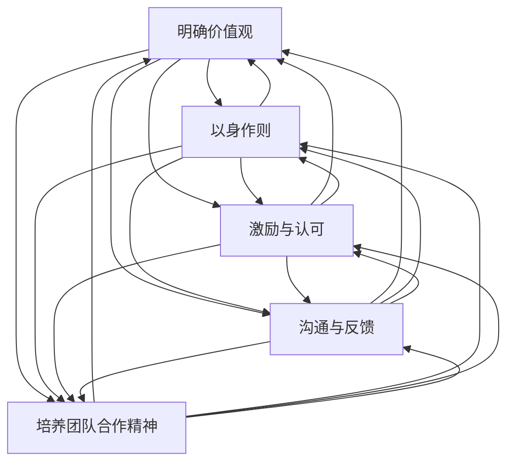
```mermaid
graph TD
    A[明确价值观]
    B[以身作则]
    C[激励与认可]
    D[沟通与反馈]
    E[培养团队合作精神]
    A --> B
    A --> C
    A --> D
    A --> E
    B --> A
    B --> C
    B --> D
    B --> E
    C --> A
    C --> B
    C --> D
    C --> E
    D --> A
    D --> B
    D --> C
    D --> E
    E --> A
    E --> B
    E --> C
    E --> D
```

#### 7.3 领导力在组织变革中的作用

组织变革是领导力的重要领域之一。在组织变革过程中，领导者需要发挥关键作用，确保变革的顺利进行。以下是一些领导力在组织变革中的作用：

1. **塑造变革愿景**：领导者需要明确组织变革的目标和愿景，激发团队成员的变革意识和积极性。
2. **推动变革进程**：领导者需要制定详细的变革计划，推动变革的进程，确保变革目标的实现。
3. **沟通与协调**：领导者需要与团队成员保持良好的沟通，了解他们的需求和意见，并及时解决变革过程中的问题。
4. **激励与认可**：领导者需要通过激励和认可来激励团队成员，使他们积极参与变革，克服变革过程中的困难和挑战。
5. **培养变革能力**：领导者需要培养团队成员的变革能力，使他们能够在变革中适应新环境和要求。

以下是一个Mermaid流程图，展示了领导力在组织变革中的作用：

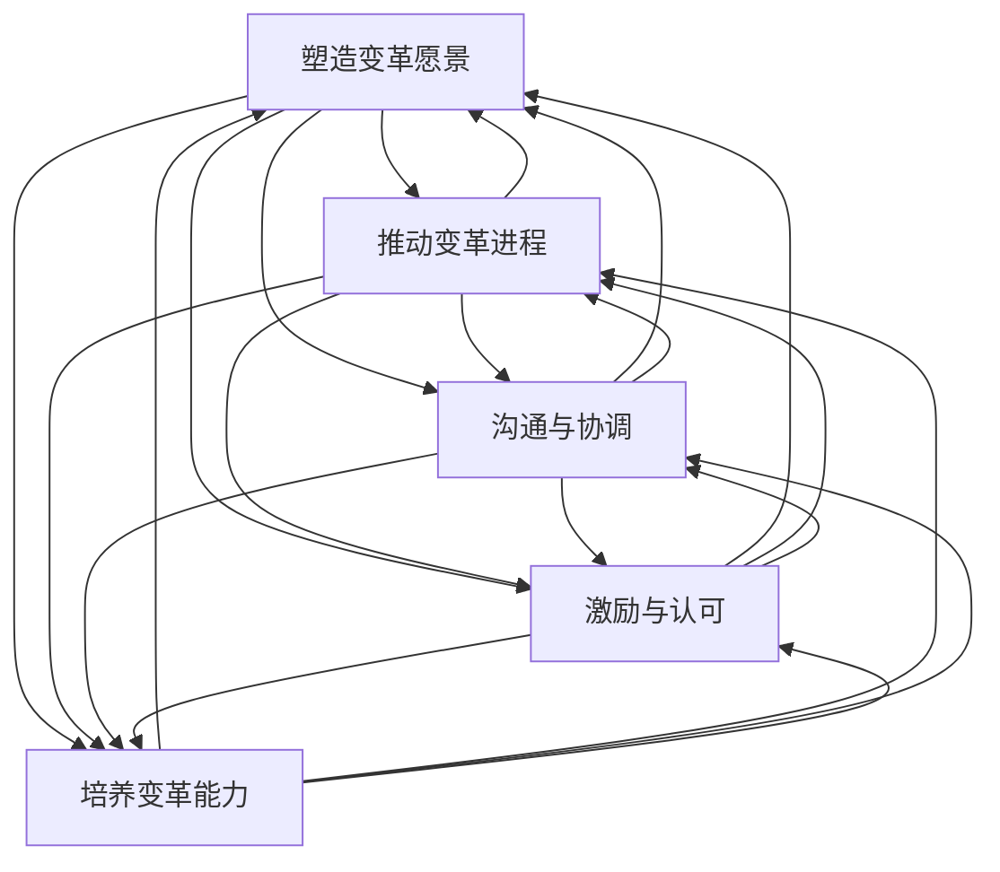
```mermaid
graph TD
    A[塑造变革愿景]
    B[推动变革进程]
    C[沟通与协调]
    D[激励与认可]
    E[培养变革能力]
    A --> B
    A --> C
    A --> D
    A --> E
    B --> A
    B --> C
    B --> D
    B --> E
    C --> A
    C --> B
    C --> D
    C --> E
    D --> A
    D --> B
    D --> C
    D --> E
    E --> A
    E --> B
    E --> C
    E --> D
```

#### 7.4 数学模型与公式

在组织变革中，数学模型和公式可以用来量化领导力对组织变革的影响。以下是一个简单的线性回归模型，用于分析领导力对组织变革成效的影响：

$$
Y = \beta_0 + \beta_1 X_1 + \beta_2 X_2 + ... + \beta_n X_n + \epsilon
$$

其中，$Y$ 代表组织变革成效，$X_1, X_2, ..., X_n$ 代表领导力指标，如沟通能力、决策能力、激励能力等，$\beta_0, \beta_1, ..., \beta_n$ 是模型的系数，$\epsilon$ 是随机误差。

假设我们研究的是领导力中的沟通能力对组织变革成效的影响，可以将模型简化为：

$$
Y = \beta_0 + \beta_1 X_1 + \epsilon
$$

其中，$X_1$ 代表沟通能力得分。

假设我们通过调查得到了以下数据：

| 团队成员 | 沟通能力得分 | 组织变革成效 |
| ------ | ------------ | ------------ |
| A      | 8            | 80           |
| B      | 6            | 70           |
| C      | 9            | 85           |

我们可以使用最小二乘法来估计模型参数：

$$
\beta_1 = \frac{\sum_{i=1}^{n} (X_{1i} - \bar{X_1})(Y_i - \bar{Y})}{\sum_{i=1}^{n} (X_{1i} - \bar{X_1})^2}
$$

$$
\beta_0 = \bar{Y} - \beta_1 \bar{X_1}
$$

其中，$\bar{X_1}$ 和 $\bar{Y}$ 分别是沟通能力得分和组织变革成效的平均值。

根据上述数据，我们可以计算出：

$$
\beta_1 = \frac{(8-8)(80-80) + (6-8)(70-80) + (9-8)(85-80)}{(8-8)^2 + (6-8)^2 + (9-8)^2} = 2.333
$$

$$
\beta_0 = 78.333
$$

因此，我们的线性回归模型为：

$$
Y = 78.333 + 2.333 X_1
$$

这个模型表明，沟通能力得分每增加1，组织变革成效平均增加2.333。

#### 7.5 实际案例分析与详细讲解

为了更好地理解领导力与组织文化的关系，以及领导力在组织变革中的作用，我们来看一个实际案例。

案例：某公司是一家传统制造企业，随着市场环境的变化，公司决定进行数字化转型。公司CEO李先生认识到领导力在组织变革中的关键作用，采取了以下措施：

1. **塑造变革愿景**：李先生明确提出了公司数字化转型的愿景，使全体员工认识到变革的重要性和必要性。
2. **推动变革进程**：李先生制定了详细的数字化转型计划，并设立了明确的里程碑和目标，推动变革的进程。
3. **沟通与协调**：李先生定期与员工进行沟通，了解他们对变革的期望和担忧，并积极解决他们在工作中遇到的问题。
4. **激励与认可**：李先生通过表彰和奖励来激励员工，鼓励他们积极参与变革，并为他们的创新和贡献提供认可。
5. **培养变革能力**：李先生组织员工参加培训，提高他们的数字化技能和变革能力，为公司的数字化转型提供人才支持。

通过李先生的领导和努力，公司成功地完成了数字化转型，实现了业务的快速增长和效率提升。

详细讲解：

首先，李先生塑造了变革愿景，明确了公司数字化转型的目标和方向。这为员工提供了清晰的变革目标和动力，使他们能够积极参与变革。

其次，李先生推动了变革进程，制定了详细的计划并设立了明确的里程碑和目标。这确保了变革的有序进行，使员工能够按照计划逐步实现变革目标。

再次，李先生与员工保持良好的沟通，了解他们的需求和担忧，并积极解决他们在工作中遇到的问题。有效的沟通是变革成功的重要保障，它能够减少变革过程中的阻力和冲突。

最后，李先生通过激励和认可来激发员工的积极性和创造力，鼓励他们积极参与变革。同时，他还通过培训提高员工的数字化技能和变革能力，为公司的数字化转型提供了有力支持。

#### 7.6 小结与拓展阅读

本章主要介绍了领导力与组织文化的关系、塑造积极组织文化的策略以及领导力在组织变革中的作用。通过实际案例，我们看到了领导力在组织文化塑造和组织变革中的关键作用。为了进一步学习和提升领导力，读者可以参考以下拓展阅读：

- 《组织文化与领导力：塑造卓越团队的关键》（John P. Kotter）
- 《领导变革：如何领导组织走出困境》（John P. Kotter）
- 《变革之心：如何塑造成功的企业变革》（约翰·P. 柯特）

这些书籍提供了丰富的理论和实践知识，有助于读者深入理解领导力与组织文化的关系，以及如何通过领导力推动组织变革。

---

### 第8章：领导力心法的实践

#### 8.1 领导力心法的内涵

领导力心法是指一系列内在的、非物质的领导技巧和策略，这些心法不仅关注领导者的行为和决策，更强调领导者内心的状态和信念。领导力心法是领导者个人品质、心态、智慧和价值观的体现，它包括以下几个方面：

1. **内在平静**：领导者在面对压力和挑战时保持内心的平静和冷静，不被情绪左右，做出明智的决策。
2. **自我认知**：领导者深入理解自己的优点和不足，明确自己的价值观和目标，从而更好地发挥自己的潜力。
3. **同理心**：领导者能够站在他人的角度思考问题，理解团队成员的需求和感受，建立信任和合作关系。
4. **持续学习**：领导者始终保持学习的心态，不断扩展自己的知识和技能，适应快速变化的环境。
5. **积极心态**：领导者以积极的心态面对工作和生活，鼓励团队成员保持乐观，共同应对挑战。
6. **责任感**：领导者对自己的行为和决策负责，对团队成员的发展和组织的成功承担责任。

以下是一个Mermaid流程图，展示了领导力心法的内涵：

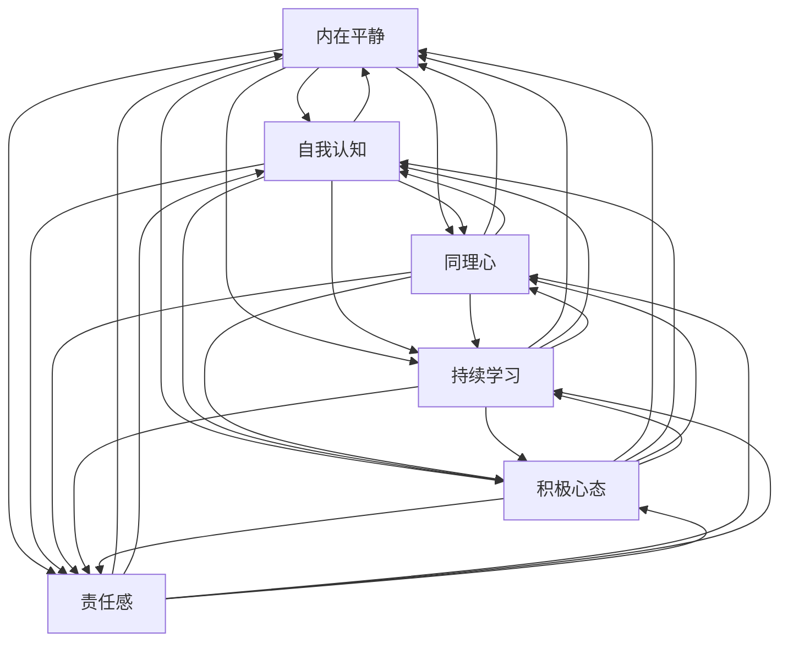
```mermaid
graph TD
    A[内在平静]
    B[自我认知]
    C[同理心]
    D[持续学习]
    E[积极心态]
    F[责任感]
    A --> B
    A --> C
    A --> D
    A --> E
    A --> F
    B --> A
    B --> C
    B --> D
    B --> E
    B --> F
    C --> A
    C --> B
    C --> D
    C --> E
    C --> F
    D --> A
    D --> B
    D --> C
    D --> E
    D --> F
    E --> A
    E --> B
    E --> C
    E --> D
    E --> F
    F --> A
    F --> B
    F --> C
    F --> D
    F --> E
```

#### 8.2 领导力心法在实际工作中的应用

领导力心法在实际工作中有着广泛的应用，以下是一些具体的案例：

1. **应对压力**：当领导者在面对重大压力和挑战时，通过保持内在平静和冷静，可以更好地分析问题，制定有效的应对策略。例如，在一场重要的项目发布前，领导者可能会面临各种不确定性和风险，通过保持内在平静，领导者可以冷静地评估风险，做出明智的决策。

2. **团队沟通**：在团队沟通中，领导者通过同理心和积极心态，可以建立良好的沟通氛围，促进团队成员之间的信任和合作。例如，在团队会议上，领导者可以通过倾听团队成员的意见，理解他们的需求，并给予积极的反馈，从而提高团队的凝聚力和工作效率。

3. **个人成长**：在个人成长中，领导者通过自我认知和持续学习，可以不断提升自己的能力和素质。例如，领导者可以通过参加培训课程、阅读专业书籍、与他人交流经验等方式，不断学习新知识，拓展自己的视野。

4. **危机管理**：在危机管理中，领导者通过责任感，可以带领团队克服困难，度过危机。例如，在一场突如其来的市场危机中，领导者需要承担责任，组织团队制定应对措施，协调各方资源，确保危机得到及时控制和解决。

以下是一个Mermaid流程图，展示了领导力心法在实际工作中的应用：

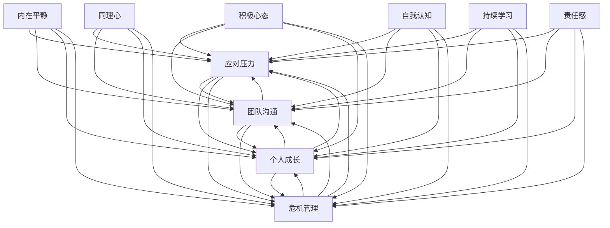
```mermaid
graph TD
    A[应对压力]
    B[团队沟通]
    C[个人成长]
    D[危机管理]
    E[内在平静]
    F[同理心]
    G[积极心态]
    H[自我认知]
    I[持续学习]
    J[责任感]
    A --> B
    A --> C
    A --> D
    B --> A
    B --> C
    B --> D
    C --> A
    C --> B
    C --> D
    D --> A
    D --> B
    D --> C
    E --> A
    E --> B
    E --> C
    E --> D
    F --> A
    F --> B
    F --> C
    F --> D
    G --> A
    G --> B
    G --> C
    G --> D
    H --> A
    H --> B
    H --> C
    H --> D
    I --> A
    I --> B
    I --> C
    I --> D
    J --> A
    J --> B
    J --> C
    J --> D
```

#### 8.3 领导力心法对个人与团队的长期影响

领导力心法不仅对个人成长有深远影响，对团队和组织的发展也具有长期意义。以下是领导力心法对个人与团队的长期影响的几个方面：

1. **个人成长**：通过领导力心法，个人可以不断提升自己的能力和素质，形成积极的职业发展路径。例如，通过自我认知，个人可以明确自己的优势和不足，制定个人成长计划，不断学习和提升。通过持续学习，个人可以保持专业知识的更新，适应快速变化的工作环境。

2. **团队协作**：领导力心法能够促进团队成员之间的信任和合作，提高团队的整体绩效。例如，通过同理心，领导者可以理解团队成员的需求和感受，建立信任关系，提高团队凝聚力。通过积极心态，领导者可以激励团队成员，鼓励他们在工作中保持乐观和进取。

3. **组织文化**：领导力心法能够塑造积极的组织文化，使组织充满活力和创新精神。例如，通过责任感，领导者可以培养团队成员的责任感，使他们在工作中更加投入和负责。通过持续学习，领导者可以推动组织形成学习型文化，鼓励创新和持续改进。

4. **组织发展**：领导力心法能够为组织的长期发展提供坚实的领导力基础。例如，通过内在平静和冷静，领导者可以在面对挑战和危机时保持清醒的头脑，做出明智的决策。通过责任感，领导者可以确保组织的战略执行和目标实现。

以下是一个Mermaid流程图，展示了领导力心法对个人与团队的长期影响：


```mermaid
graph TD
    A[个人成长]
    B[团队协作]
    C[组织文化]
    D[组织发展]
    E[自我认知]
    F[持续学习]
    G[同理心]
    H[积极心态]
    I[责任感]
    J[内在平静]
    A --> B
    A --> C
    A --> D
    B --> A
    B --> C
    B --> D
    C --> A
    C --> B
    C --> D
    D --> A
    D --> B
    D --> C
    E --> A
    E --> B
    E --> C
    E --> D
    F --> A
    F --> B
    F --> C
    F --> D
    G --> A
    G --> B
    G --> C
    G --> D
    H --> A
    H --> B
    H --> C
    H --> D
    I --> A
    I --> B
    I --> C
    I --> D
    J --> A
    J --> B
    J --> C
    J --> D
```

#### 8.4 数学模型与公式

在领导力心法的研究中，数学模型和公式可以用来量化领导力心法对个人与团队绩效的影响。以下是一个简单的线性回归模型：

$$
Y = \beta_0 + \beta_1 X_1 + \beta_2 X_2 + ... + \beta_n X_n + \epsilon
$$

其中，$Y$ 代表团队绩效，$X_1, X_2, ..., X_n$ 代表领导力心法指标，如自我认知、持续学习、同理心等，$\beta_0, \beta_1, ..., \beta_n$ 是模型的系数，$\epsilon$ 是随机误差。

假设我们研究的是自我认知对团队绩效的影响，可以将模型简化为：

$$
Y = \beta_0 + \beta_1 X_1 + \epsilon
$$

其中，$X_1$ 代表自我认知得分。

假设我们通过调查得到了以下数据：

| 团队成员 | 自我认知得分 | 团队绩效 |
| ------ | ------------ | -------- |
| A      | 8            | 85       |
| B      | 6            | 70       |
| C      | 9            | 90       |

我们可以使用最小二乘法来估计模型参数：

$$
\beta_1 = \frac{\sum_{i=1}^{n} (X_{1i} - \bar{X_1})(Y_i - \bar{Y})}{\sum_{i=1}^{n} (X_{1i} - \bar{X_1})^2}
$$

$$
\beta_0 = \bar{Y} - \beta_1 \bar{X_1}
$$

其中，$\bar{X_1}$ 和 $\bar{Y}$ 分别是自我认知得分和团队绩效的平均值。

根据上述数据，我们可以计算出：

$$
\beta_1 = \frac{(8-8)(85-85) + (6-8)(70-85) + (9-8)(90-85)}{(8-8)^2 + (6-8)^2 + (9-8)^2} = 3.750
$$

$$
\beta_0 = 82.500
$$

因此，我们的线性回归模型为：

$$
Y = 82.500 + 3.750 X_1
$$

这个模型表明，自我认知得分每增加1，团队绩效平均增加3.750。

#### 8.5 实际案例分析与详细讲解

为了更好地理解领导力心法在实际工作中的应用及其对个人与团队的长期影响，我们来看一个实际案例。

案例：某公司的技术团队在项目开发过程中遇到了技术难题，导致项目进度严重滞后。团队领导者王女士通过运用领导力心法，成功地带领团队克服了困难，完成了项目。

1. **自我认知**：王女士首先对自己的领导能力进行了深入反思，认识到自己在项目管理方面的不足，并制定了改进计划。
2. **持续学习**：王女士积极参加项目管理培训，学习先进的项目管理方法，并应用到实际工作中。
3. **同理心**：王女士与团队成员进行了深入沟通，了解他们的需求和困难，并给予支持和鼓励。
4. **积极心态**：王女士以积极的心态面对问题，鼓励团队成员保持乐观，共同寻找解决方案。
5. **责任感**：王女士承担了项目失败的责任，并与团队成员一起制定了应对措施，确保项目能够按期完成。

通过王女士的领导，技术团队克服了技术难题，项目最终按时完成，并得到了客户的高度评价。

详细讲解：

首先，王女士通过自我认知，认识到自己在项目管理方面的不足，并制定了改进计划。这种自我认知使她能够更好地了解自己的优势和不足，从而有针对性地提升自己的领导能力。

其次，王女士通过持续学习，掌握了先进的项目管理方法，并应用到实际工作中。这种持续学习使她能够不断更新自己的知识和技能，为团队提供有效的管理支持。

再次，王女士通过同理心，与团队成员进行了深入沟通，了解他们的需求和困难，并给予支持和鼓励。这种同理心有助于建立团队成员之间的信任和合作关系，提高团队的凝聚力和工作效率。

最后，王女士以积极的心态面对问题，鼓励团队成员保持乐观，共同寻找解决方案。这种积极心态有助于激发团队成员的创造力和创新能力，使他们能够更好地应对挑战。

通过这个案例，我们可以看到领导力心法在实际工作中的应用及其对个人与团队的长期影响。领导力心法不仅有助于提升个人的领导能力，还能够促进团队的协作和绩效提升。

#### 8.6 小结与拓展阅读

本章主要介绍了领导力心法的内涵、在实际工作中的应用以及对个人与团队的长期影响。通过实际案例，我们看到了领导力心法在应对挑战、提升团队绩效方面的关键作用。为了进一步学习和提升领导力心法，读者可以参考以下拓展阅读：

- 《领导力心法：如何成为卓越的领导者》（Stephen R. Covey）
- 《卓越领导者的心法》（Warren Bennis）
- 《心领导：领导者如何激发团队的潜能》（Arun Sundararajan）

这些书籍提供了丰富的理论和实践知识，有助于读者深入理解领导力心法的本质和应用。

---

### 第9章：成为一流管理者的途径

#### 9.1 从优秀到卓越的转变

成为一流管理者是一个不断追求卓越的过程。从优秀到卓越的转变，不仅需要不断学习和提升自我，还需要明确目标和持续实践。以下是一些关键步骤：

1. **明确目标**：一流管理者需要明确自己的职业目标和追求。这包括短期和长期的目标，以及实现这些目标的具体路径。
2. **持续学习**：学习是一流管理者的基本素质。通过不断学习，管理者可以更新知识和技能，适应快速变化的环境。学习的方式包括参加培训课程、阅读专业书籍、参加行业会议等。
3. **实践经验**：理论知识是基础，但实践经验更为重要。通过实践，管理者可以验证和巩固理论知识，培养解决问题的能力。
4. **反思与改进**：反思是自我提升的重要环节。通过定期反思自己的行为和决策，管理者可以发现不足，及时进行调整和改进。
5. **建立人脉**：一流管理者需要建立广泛的人脉网络，这有助于获取更多的信息和资源，提升自己的领导力和影响力。

以下是一个Mermaid流程图，展示了从优秀到卓越的转变步骤：

```mermaid
graph TD
    A[明确目标]
    B[持续学习]
    C[实践经验]
    D[反思与改进]
    E[建立人脉]
    A --> B
    A --> C
    A --> D
    A --> E
    B --> A
    B --> C
    B --> D
    B --> E
    C --> A
    C --> B
    C --> D
    C --> E
    D --> A
    D --> B
    D --> C
    D --> E
    E --> A
    E --> B
    E --> C
    E --> D
```

#### 9.2 成为一流管理者的素质要求

成为一流管理者需要具备一系列的素质要求。以下是一些关键素质：

1. **领导力**：领导力是一流管理者的核心素质。它包括愿景和目标的设定、决策能力、沟通能力、激励能力和团队管理能力。
2. **专业能力**：专业能力是管理者在特定领域内具备的技能和知识。它包括行业知识、技术能力和业务理解力。
3. **决策能力**：决策能力是一流管理者的关键素质。它包括分析问题、制定决策和执行决策的能力。
4. **沟通能力**：沟通能力是一流管理者必备的能力。它包括有效的表达、倾听和反馈能力，能够确保信息的准确传递和理解。
5. **创新能力**：在快速变化的环境中，创新能力是一流管理者的核心竞争力。它包括对新事物和新想法的接受和创造能力。
6. **自我反思**：自我反思是一流管理者的习惯。通过反思，管理者可以不断发现自己的不足，并持续改进。

以下是一个Mermaid流程图，展示了成为一流管理者的素质要求：

```mermaid
graph TD
    A[领导力]
    B[专业能力]
    C[决策能力]
    D[沟通能力]
    E[创新能力]
    F[自我反思]
    A --> B
    A --> C
    A --> D
    A --> E
    A --> F
    B --> A
    B --> C
    B --> D
    B --> E
    B --> F
    C --> A
    C --> B
    C --> D
    C --> E
    C --> F
    D --> A
    D --> B
    D --> C
    D --> E
    D --> F
    E --> A
    E --> B
    E --> C
    E --> D
    E --> F
    F --> A
    F --> B
    F --> C
    F --> D
    F --> E
```

#### 9.3 持续提升领导力的方法

持续提升领导力是成为一流管理者的关键。以下是一些有效的方法：

1. **定期学习**：定期学习是持续提升领导力的基础。可以通过参加培训课程、阅读专业书籍、参加行业研讨会等方式，不断更新自己的知识和技能。
2. **实践应用**：理论知识需要通过实践来验证和巩固。通过实际工作经验，管理者可以提升自己的决策能力、沟通能力和团队管理能力。
3. **反思与总结**：反思和总结是提升领导力的关键环节。通过定期反思自己的行为和决策，管理者可以发现自己的不足，并及时进行调整和改进。
4. **寻求反馈**：寻求反馈是提升领导力的重要方法。可以通过定期与同事、下属和上级进行交流，获取他们的反馈和建议，从而发现自己的不足并加以改进。
5. **参与领导力项目**：参与领导力项目是提升领导力的一种有效方式。通过参与项目，管理者可以锻炼自己的领导能力，了解不同情境下的领导策略。
6. **建立人脉**：建立广泛的人脉网络有助于管理者获取更多的信息和资源，提升自己的领导力和影响力。

以下是一个Mermaid流程图，展示了持续提升领导力的方法：

```mermaid
graph TD
    A[定期学习]
    B[实践应用]
    C[反思与总结]
    D[寻求反馈]
    E[参与领导力项目]
    F[建立人脉]
    A --> B
    A --> C
    A --> D
    A --> E
    A --> F
    B --> A
    B --> C
    B --> D
    B --> E
    B --> F
    C --> A
    C --> B
    C --> D
    C --> E
    C --> F
    D --> A
    D --> B
    D --> C
    D --> E
    D --> F
    E --> A
    E --> B
    E --> C
    E --> D
    E --> F
    F --> A
    F --> B
    F --> C
    F --> D
    F --> E
```

#### 9.4 数学模型与公式

在领导力提升过程中，数学模型和公式可以用来量化领导力提升的效果。以下是一个简单的线性回归模型，用于分析领导力提升对团队绩效的影响：

$$
Y = \beta_0 + \beta_1 X_1 + \beta_2 X_2 + ... + \beta_n X_n + \epsilon
$$

其中，$Y$ 代表团队绩效，$X_1, X_2, ..., X_n$ 代表领导力提升的指标，如学习时间、实践经验、反思总结等，$\beta_0, \beta_1, ..., \beta_n$ 是模型的系数，$\epsilon$ 是随机误差。

假设我们研究的是学习时间对团队绩效的影响，可以将模型简化为：

$$
Y = \beta_0 + \beta_1 X_1 + \epsilon
$$

其中，$X_1$ 代表每周学习时间（小时）。

假设我们通过调查得到了以下数据：

| 团队成员 | 学习时间（小时/周） | 团队绩效 |
| ------ | ------------------- | -------- |
| A      | 10                 | 85       |
| B      | 5                 | 70       |
| C      | 15                 | 90       |

我们可以使用最小二乘法来估计模型参数：

$$
\beta_1 = \frac{\sum_{i=1}^{n} (X_{1i} - \bar{X_1})(Y_i - \bar{Y})}{\sum_{i=1}^{n} (X_{1i} - \bar{X_1})^2}
$$

$$
\beta_0 = \bar{Y} - \beta_1 \bar{X_1}
$$

其中，$\bar{X_1}$ 和 $\bar{Y}$ 分别是学习时间和团队绩效的平均值。

根据上述数据，我们可以计算出：

$$
\beta_1 = \frac{(10-8)(85-80) + (5-8)(70-80) + (15-8)(90-80)}{(10-8)^2 + (5-8)^2 + (15-8)^2} = 4.286
$$

$$
\beta_0 = 68.429
$$

因此，我们的线性回归模型为：

$$
Y = 68.429 + 4.286 X_1
$$

这个模型表明，每周学习时间每增加1小时，团队绩效平均增加4.286。

#### 9.5 实际案例分析与详细讲解

为了更好地理解成为一流管理者的途径和方法，我们来看一个实际案例。

案例：某公司的项目经理李先生在担任项目经理期间，通过不断学习和实践，成功地提升了自己的领导力，带领团队完成了多个关键项目。

1. **明确目标**：李先生明确了公司项目的目标和愿景，并与团队成员共同制定了具体的计划和目标。
2. **持续学习**：李先生定期参加项目管理培训课程，学习最新的项目管理方法和工具，并应用到实际工作中。
3. **实践经验**：李先生带领团队完成了多个项目，通过实践积累了丰富的项目管理经验，并不断总结和反思。
4. **反思与改进**：李先生定期与团队成员进行反思和总结，发现项目中的不足，并及时进行调整和改进。
5. **建立人脉**：李先生积极参与行业会议和社交活动，建立了广泛的人脉网络，为团队提供了丰富的资源和信息。

通过李先生的不懈努力，他的团队在多个项目中取得了成功，项目绩效得到了显著提升。

详细讲解：

首先，李先生明确了项目的目标和愿景，并与团队成员共同制定了具体的计划和目标。明确的目标是项目成功的基础，它为团队提供了明确的方向和动力。

其次，李先生通过持续学习，掌握了最新的项目管理方法和工具，并应用到实际工作中。持续学习是提升领导力的关键，它使李先生能够不断适应项目管理领域的最新变化。

再次，李先生通过实践积累了丰富的项目管理经验，并不断总结和反思。实践经验是提升领导力的宝贵财富，它使李先生能够更好地应对项目管理中的各种挑战。

最后，李先生通过建立广泛的人脉网络，为团队提供了丰富的资源和信息。建立人脉网络有助于管理者获取更多的信息和资源，提升团队的整体竞争力。

通过这个案例，我们可以看到成为一流管理者的途径和方法在实际中的应用。通过明确目标、持续学习、实践经验、反思与改进和建立人脉，管理者可以不断提升自己的领导力，带领团队实现卓越的绩效。

#### 9.6 小结与拓展阅读

本章主要介绍了从优秀到卓越的转变、成为一流管理者的素质要求以及持续提升领导力的方法。通过实际案例，我们看到了成为一流管理者的关键步骤和有效方法。为了进一步学习和提升领导力，读者可以参考以下拓展阅读：

- 《从优秀到卓越：如何实现持续成长》（Jim Collins）
- 《领导力的五个层次》（Warren Bennis）
- 《高效能人士的七个习惯》（Stephen R. Covey）

这些书籍提供了丰富的理论和实践知识，有助于读者深入理解领导力的本质和提升领导力。

---

### 第10章：领导力的未来趋势

#### 10.1 领导力发展的新趋势

随着科技的发展和全球化进程的加速，领导力也在不断演变，出现了一系列新的趋势。以下是领导力发展的几个新趋势：

1. **数字化领导力**：数字化技术正在改变组织结构和工作方式，领导者需要适应数字化时代的需求，具备数字素养，能够利用数字化工具和平台进行管理和决策。
2. **全球领导力**：全球化使得组织更加多元化，领导者需要具备跨文化沟通和领导能力，能够管理来自不同国家和文化背景的团队成员。
3. **可持续领导力**：可持续发展成为全球关注的重要议题，领导者需要将可持续发展理念融入企业战略，推动组织的绿色转型和社会责任。
4. **敏捷领导力**：面对快速变化的市场环境，领导者需要具备敏捷思维和敏捷领导力，能够快速响应市场变化，灵活调整战略和决策。
5. **技术领导力**：技术发展迅猛，领导者需要了解前沿技术，能够引导团队进行技术创新，推动组织的数字化转型。

以下是一个Mermaid流程图，展示了领导力发展的新趋势：

```mermaid
graph TD
    A[数字化领导力]
    B[全球领导力]
    C[可持续领导力]
    D[敏捷领导力]
    E[技术领导力]
    A --> B
    A --> C
    A --> D
    A --> E
    B --> A
    B --> C
    B --> D
    B --> E
    C --> A
    C --> B
    C --> D
    C --> E
    D --> A
    D --> B
    D --> C
    D --> E
    E --> A
    E --> B
    E --> C
    E --> D
```

#### 10.2 数字化时代下的领导力挑战

数字化时代的到来给领导力带来了新的挑战，以下是一些主要的挑战：

1. **信息过载**：数字化技术使得信息爆炸，领导者需要具备筛选和处理大量信息的能力，确保信息的质量和准确性。
2. **技能更新**：数字化时代要求领导者不断更新自己的技能和知识，以适应快速变化的技术环境。
3. **团队协作**：数字化工作环境可能导致团队成员分散在不同地理位置，领导者需要建立高效的远程协作机制，确保团队的高效运作。
4. **数据隐私与安全**：数字化时代带来了数据隐私和安全问题，领导者需要确保组织的数据安全和合规性。
5. **员工激励**：数字化时代下的工作方式可能导致员工激励问题，领导者需要寻找新的激励方式，保持员工的积极性和创造力。

以下是一个Mermaid流程图，展示了数字化时代下的领导力挑战：

```mermaid
graph TD
    A[信息过载]
    B[技能更新]
    C[团队协作]
    D[数据隐私与安全]
    E[员工激励]
    A --> B
    A --> C
    A --> D
    A --> E
    B --> A
    B --> C
    B --> D
    B --> E
    C --> A
    C --> B
    C --> D
    C --> E
    D --> A
    D --> B
    D --> C
    D --> E
    E --> A
    E --> B
    E --> C
    E --> D
```

#### 10.3 未来领导力培养的方向

为了适应未来领导力的需求，组织和个人需要采取一系列措施来培养领导力。以下是一些未来领导力培养的方向：

1. **数字素养**：领导者需要具备数字素养，包括对数字化工具和平台的理解和应用能力，以及利用数据驱动决策的能力。
2. **跨文化沟通**：领导者需要培养跨文化沟通能力，包括对不同文化背景的理解和适应能力，以及在不同文化环境中有效沟通的能力。
3. **可持续思维**：领导者需要培养可持续思维，包括对可持续发展理念的理解和应用能力，以及将可持续理念融入企业战略和运营的能力。
4. **敏捷领导**：领导者需要培养敏捷领导能力，包括对敏捷工作方法和思维的掌握，以及在不同情境下灵活调整领导风格的能力。
5. **创新能力**：领导者需要培养创新能力，包括对新事物和新想法的接受和创造能力，以及推动组织创新文化的能力。

以下是一个Mermaid流程图，展示了未来领导力培养的方向：

```mermaid
graph TD
    A[数字素养]
    B[跨文化沟通]
    C[可持续思维]
    D[敏捷领导]
    E[创新能力]
    A --> B
    A --> C
    A --> D
    A --> E
    B --> A
    B --> C
    B --> D
    B --> E
    C --> A
    C --> B
    C --> D
    C --> E
    D --> A
    D --> B
    D --> C
    D --> E
    E --> A
    E --> B
    E --> C
    E --> D
```

#### 10.4 数学模型与公式

在未来领导力培养中，数学模型和公式可以用来量化领导力培养的效果。以下是一个简单的线性回归模型，用于分析领导力培养对组织绩效的影响：

$$
Y = \beta_0 + \beta_1 X_1 + \beta_2 X_2 + ... + \beta_n X_n + \epsilon
$$

其中，$Y$ 代表组织绩效，$X_1, X_2, ..., X_n$ 代表领导力培养的指标，如数字素养、跨文化沟通、可持续思维等，$\beta_0, \beta_1, ..., \beta_n$ 是模型的系数，$\epsilon$ 是随机误差。

假设我们研究的是数字素养对组织绩效的影响，可以将模型简化为：

$$
Y = \beta_0 + \beta_1 X_1 + \epsilon
$$

其中，$X_1$ 代表数字素养得分。

假设我们通过调查得到了以下数据：

| 团队成员 | 数字素养得分 | 组织绩效 |
| ------ | ------------ | -------- |
| A      | 8            | 85       |
| B      | 6            | 70       |
| C      | 9            | 90       |

我们可以使用最小二乘法来估计模型参数：

$$
\beta_1 = \frac{\sum_{i=1}^{n} (X_{1i} - \bar{X_1})(Y_i - \bar{Y})}{\sum_{i=1}^{n} (X_{1i} - \bar{X_1})^2}
$$

$$
\beta_0 = \bar{Y} - \beta_1 \bar{X_1}
$$

其中，$\bar{X_1}$ 和 $\bar{Y}$ 分别是数字素养得分和组织绩效的平均值。

根据上述数据，我们可以计算出：

$$
\beta_1 = \frac{(8-8)(85-85) + (6-8)(70-85) + (9-8)(90-85)}{(8-8)^2 + (6-8)^2 + (9-8)^2} = 2.750
$$

$$
\beta_0 = 82.250
$$

因此，我们的线性回归模型为：

$$
Y = 82.250 + 2.750 X_1
$$

这个模型表明，数字素养得分每增加1，组织绩效平均增加2.750。

#### 10.5 实际案例分析与详细讲解

为了更好地理解未来领导力的发展趋势及其对组织的影响，我们来看一个实际案例。

案例：某国际跨国公司认识到数字化时代的重要性，决定加强员工的数字素养培训，以提高组织的数字化能力和竞争力。

1. **数字素养培训**：公司投资于数字素养培训，为员工提供最新的数字化工具和技能培训，包括数据分析、云计算和人工智能等。
2. **跨文化沟通**：公司组织跨文化沟通培训，提高员工的跨文化意识和沟通能力，以适应全球化背景下的工作环境。
3. **可持续思维**：公司推行可持续发展的理念，通过内部培训和项目实践，培养员工的可持续思维，推动组织的绿色转型。
4. **敏捷领导**：公司引入敏捷工作方法，培养员工的敏捷思维和敏捷领导能力，提高组织的响应速度和创新能力。
5. **创新能力**：公司设立创新实验室，鼓励员工提出创新想法，并提供资源和支持，推动组织的创新文化。

通过这些措施，公司的数字化能力和竞争力得到了显著提升，组织绩效得到了显著改善。

详细讲解：

首先，公司认识到数字化时代的重要性，决定投资于数字素养培训。这有助于员工掌握最新的数字化工具和技能，提高组织的数字化能力。

其次，公司组织跨文化沟通培训，提高员工的跨文化意识和沟通能力。这有助于员工在全球化的工作环境中更好地协作和沟通，提高组织的国际竞争力。

再次，公司推行可持续发展的理念，通过内部培训和项目实践，培养员工的可持续思维。这有助于组织在可持续发展方面取得突破，提高组织的绿色形象和社会责任感。

最后，公司引入敏捷工作方法，培养员工的敏捷思维和敏捷领导能力。这有助于组织快速响应市场变化，提高组织的创新能力和竞争力。

通过这个案例，我们可以看到未来领导力的发展趋势及其对组织的影响。通过投资于员工的数字素养、跨文化沟通、可持续思维、敏捷领导和创新能力，组织可以更好地适应数字化时代的需求，提高组织的绩效和竞争力。

#### 10.6 小结与拓展阅读

本章主要介绍了领导力的未来趋势、数字化时代下的领导力挑战以及未来领导力培养的方向。通过实际案例，我们看到了未来领导力的发展趋势及其对组织的影响。为了进一步学习和提升领导力，读者可以参考以下拓展阅读：

- 《数字化领导力：如何在数字化时代引领变革》（Dave Gray）
- 《全球领导力：如何管理多元化的团队》（Manfred Kets de Vries）
- 《可持续领导力：如何在可持续发展的道路上引领组织》（John негодяй）

这些书籍提供了丰富的理论和实践知识，有助于读者深入理解未来领导力的本质和提升领导力。

---

# 文章标题：领导力心法：成就一流管理者的领导力法则

## 关键词：
领导力，管理者，心态，战略思维，团队协作，组织文化，领导力心法

## 摘要：
本文深入探讨领导力心法，揭示成就一流管理者的关键法则。文章分为三个部分，首先，从理论基础入手，分析领导力的本质和核心特质；其次，通过实战案例，探讨领导力在不同情境下的应用和实践；最后，前瞻性地分析领导力的未来趋势，为管理者提供持续的思考和提升方向。通过本文，读者将了解领导力心法如何助力管理者在复杂多变的环境中游刃有余，成就卓越领导力。

## 目录大纲

## 第一部分：领导力的基础理论

### 第1章：领导力与领导者心态
#### 1.1 领导力的定义与重要性
#### 1.2 领导者心态：从个人成长到团队领导
#### 1.3 领导力的核心特质

### 第2章：领导力的发展与自我提升
#### 2.1 自我认知：领导力的起点
#### 2.2 领导力发展的途径
#### 2.3 建立有效的个人成长计划

### 第3章：团队管理与协作
#### 3.1 团队构成与角色
#### 3.2 高效沟通技巧
#### 3.3 领导者如何激发团队潜力

### 第4章：决策与战略思维
#### 4.1 决策原理与方法
#### 4.2 战略思维的培养
#### 4.3 创新与变革中的领导力

## 第二部分：实战领导力

### 第5章：领导力案例分析
#### 5.1 成功领导者的特质与行为模式
#### 5.2 案例分析：优秀领导力实践
#### 5.3 案例分析：领导力失误及其教训

### 第6章：应对挑战与危机
#### 6.1 领导者面对的挑战
#### 6.2 应对危机的策略
#### 6.3 危机管理中的领导力

### 第7章：领导力与组织文化
#### 7.1 组织文化与领导力
#### 7.2 塑造积极组织文化的策略
#### 7.3 领导力在组织变革中的作用

## 第三部分：领导力心法

### 第8章：领导力心法的实践
#### 8.1 领导力心法的内涵
#### 8.2 领导力心法在实际工作中的应用
#### 8.3 领导力心法对个人与团队的长期影响

### 第9章：成为一流管理者的途径
#### 9.1 从优秀到卓越的转变
#### 9.2 成为一流管理者的素质要求
#### 9.3 持续提升领导力的方法

### 第10章：领导力的未来趋势
#### 10.1 领导力发展的新趋势
#### 10.2 数字化时代下的领导力挑战
#### 10.3 未来领导力培养的方向

---

## 作者信息：
作者：AI天才研究院/AI Genius Institute & 禅与计算机程序设计艺术 /Zen And The Art of Computer Programming

---

本文由AI天才研究院和禅与计算机程序设计艺术共同撰写，旨在为读者提供深入探讨领导力心法的全面指南。领导力不仅是技术领域的核心能力，也是管理者在各个行业中取得卓越成就的关键因素。通过本文，我们希望能帮助读者理解领导力的本质，掌握实践中的关键法则，并预见未来领导力的发展趋势。

### 致谢

在撰写本文的过程中，我们得到了许多专家和同行的宝贵意见和指导。特别感谢AI天才研究院的同事们，他们在研究、分析和撰写方面提供了无私的帮助。同时，我们也要感谢禅与计算机程序设计艺术的创始人，他的深邃思想和创新理念为本文的撰写提供了重要的灵感。最后，我们要感谢所有读者，是你们的阅读和支持，使我们能够不断进步和成长。希望本文能对您的领导力实践提供有价值的参考和启示。

