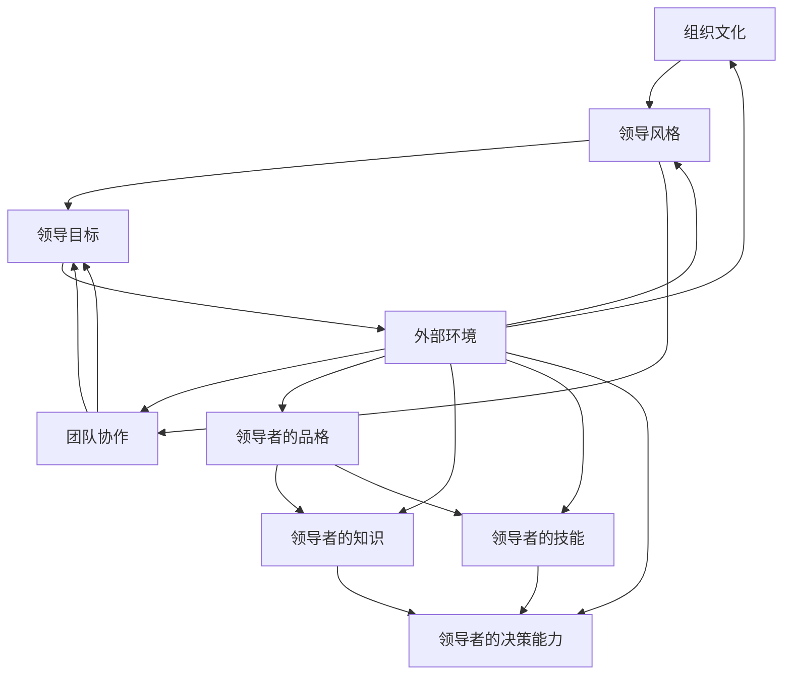

                 

### 背景介绍

在当今快速变革的商业和社会环境中，领导力的重要性愈发突出。无论是在企业、政府机构，还是在非营利组织，领导者都扮演着至关重要的角色。有效的领导力不仅能够激发团队活力，提升组织绩效，还能应对复杂多变的外部挑战，引领组织走向成功。然而，领导力并非与生俱来，而是需要不断学习、实践和提升的。

随着全球化的深入发展，领导力也面临着前所未有的挑战和机遇。企业需要具备跨文化领导能力，能够适应不同国家和地区的商业环境；同时，技术革命，特别是人工智能、大数据和物联网等新兴技术的兴起，也为领导力的发展带来了新的思路和方法。在这种背景下，如何理解和培养一流的领导力，成为众多组织和个人关注的焦点。

《领导力心法：成就一流领导者的领导力法则》正是为了回应这一需求而作。本书旨在通过深入探讨领导力的核心概念、原理和应用，帮助读者掌握领导力的精髓，提升自身的领导力水平。本书的目标读者包括企业高管、中层管理者、技术团队领导者，以及所有对领导力感兴趣的读者。

本书的结构安排合理，内容丰富，从领导力的基础概念和原理，到领导力的发展与提升，再到领导力的实践与应用，以及领导力的心法与哲学，乃至领导力在特殊情境下的应用和发展趋势，都进行了详细的阐述。通过这种系统化的学习，读者可以逐步建立起完整的领导力知识体系，并在实际工作中灵活应用。

总之，本书不仅为读者提供了丰富的理论知识，还通过实践案例和最佳实践分享，帮助读者将领导力理念转化为实际行动，从而实现个人和组织的共同成长。

### 核心概念与联系：领导力的架构

领导力是一个多维度的概念，包含多个核心要素和原理。为了更好地理解和掌握领导力的本质，我们可以借助Mermaid流程图来展示这些核心概念及其相互关系。

以下是一个简化的Mermaid流程图，展示了领导力的一些关键要素及其相互关系：

- **领导者的品格（A）**：领导者的品格是领导力的基础，包括诚信、责任感、勇气等。这些品格决定了领导者的行为和态度，进而影响领导力效果。

- **领导者的知识（B）**：领导者的知识涵盖了广泛的主题，如业务知识、市场趋势、管理知识等。知识是领导者做出有效决策和指导团队的重要依据。

- **领导者的技能（C）**：领导者的技能包括沟通能力、决策能力、解决问题的能力等。技能是领导者实现领导目标的关键工具。

- **领导者的决策能力（D）**：决策能力是领导者的一项核心技能，包括制定战略、评估风险、做出选择等。有效的决策能力可以显著提升领导效果。

- **组织文化（E）**：组织文化是影响领导力的关键因素。领导者需要塑造和维护一种积极向上的组织文化，以促进团队协作和员工发展。

- **领导风格（F）**：领导风格是领导者影响团队成员的方式。不同的领导风格适合不同的情境，有效的领导风格可以提升团队绩效。

- **团队协作（G）**：团队协作是领导力的重要组成部分。通过有效的团队协作，领导者可以激发团队成员的潜力，实现共同的目标。

- **领导目标（H）**：领导目标是指领导者希望达成的目标。这些目标是领导力的导向，决定了领导行为和团队行动的方向。

- **外部环境（I）**：外部环境包括市场、竞争、政策等因素，这些因素对领导力有着重要的影响。领导者需要不断适应外部环境的变化，调整领导策略。

通过上述Mermaid流程图，我们可以清晰地看到领导力核心要素之间的相互关系。这些要素相互作用，共同构成了领导力的整体架构。理解这一架构有助于我们更深入地探讨领导力的本质，为后续章节的详细讲解打下基础。

### 领导力的发展与提升

领导力并非与生俱来，而是可以通过不断的学习和实践来发展和提升。以下将从几个关键方面详细探讨如何提升领导力：

#### 自我认知与自我提升

**1. 自我认知的重要性**

自我认知是领导力发展的基础。一个成功的领导者必须深刻了解自己的优点和不足，这有助于制定个性化的提升计划。自我认知包括自我反思、自我评估和反馈收集。

**2. 自我提升的方法**

- **自我反思**：领导者可以通过定期进行自我反思，回顾自己的行为和决策，识别成功和失败的原因。这种反思有助于提升自我认知，并指导未来的行为。

- **职业规划**：制定明确的职业规划可以帮助领导者有目的地提升自己的能力。职业规划应包括短期和长期目标，以及实现这些目标的具体步骤。

- **持续学习**：领导力是一个不断发展的领域，领导者需要通过阅读、参加培训课程、研讨会等方式不断学习新知识、新技能。

#### 建立信任与沟通

**1. 信任的重要性**

信任是领导力的核心要素之一。没有信任，领导者无法有效地影响和激励团队成员。建立信任的方法包括：

- **透明沟通**：领导者应保持透明，及时与团队成员分享信息，减少误解和猜疑。

- **诚实与正直**：领导者应以诚实和正直的态度行事，这有助于建立和维护信任。

**2. 沟通技巧**

有效的沟通是建立信任的重要手段。以下是一些提高沟通技巧的方法：

- **倾听**：倾听是有效沟通的关键。领导者应学会倾听团队成员的意见和反馈，理解他们的需求和期望。

- **清晰表达**：领导者应确保自己的沟通内容清晰、准确，避免模糊和歧义。

- **非语言沟通**：领导者应注重非语言沟通，如身体语言、面部表情和姿态等，这些因素同样影响沟通效果。

#### 领导风格与领导力发展

**1. 领导风格**

领导风格是指领导者影响和激励团队成员的方式。常见的领导风格包括权威型、民主型、参与型等。每种风格都有其适用情境和效果。

**2. 领导风格的发展**

- **适应性**：领导者应根据不同的情境和团队成员的需求，灵活调整领导风格。适应性是提升领导力的关键。

- **个性化**：领导者应发展出符合自己个性和价值观的领导风格。这种风格不仅能够提升领导效果，还能增强个人魅力。

#### 领导力的创新思维

**1. 创新思维的重要性**

在快速变化的商业环境中，领导者需要具备创新思维，以应对不断出现的新挑战和机遇。创新思维有助于团队保持竞争力，推动组织持续发展。

**2. 培养创新思维的方法**

- **开放式思维**：领导者应鼓励团队成员提出不同的观点和建议，培养开放、包容的思维环境。

- **跨学科合作**：跨学科合作可以激发创新思维，通过不同领域的知识和视角，产生新的解决方案。

- **实验和试错**：领导者应鼓励团队成员进行实验和尝试，从失败中学习，不断优化创新过程。

#### 领导力的决策能力

**1. 决策能力的重要性**

决策能力是领导者的一项核心技能。有效的决策能力能够帮助领导者做出正确的决策，提高团队和组织的绩效。

**2. 提升决策能力的方法**

- **收集信息**：领导者应广泛收集与决策相关的信息，包括市场趋势、竞争对手情况、团队成员意见等。

- **分析评估**：领导者应学会使用多种工具和方法进行决策分析，如SWOT分析、成本效益分析等。

- **风险控制**：领导者应考虑潜在的风险，并制定相应的风险控制措施，以确保决策的可执行性。

#### 领导力的应对挑战与危机

**1. 应对挑战**

领导者需要具备应对挑战的能力，包括：

- **灵活应变**：领导者应能够迅速适应环境变化，调整策略和计划。

- **激发团队**：领导者应能够激励团队成员，共同应对挑战，保持积极向上的态度。

**2. 应对危机**

危机管理是领导力的重要组成部分。以下是一些应对危机的方法：

- **快速反应**：领导者应能够迅速识别危机，并采取紧急措施应对。

- **沟通协调**：领导者应保持与团队成员、利益相关者和公众的沟通，确保信息的透明和一致性。

- **资源整合**：领导者应能够有效整合内部和外部资源，应对危机带来的挑战。

通过上述方法，领导者可以不断提升自身的领导力水平，应对各种挑战和危机，带领团队和组织走向成功。

### 团队管理与领导

在领导力的发展中，团队管理是一个至关重要的环节。有效的团队管理不仅能够提升团队绩效，还能够促进团队成员的个人成长和职业发展。以下将从团队管理的基本原则、领导力在团队管理中的实践，以及实际案例来探讨团队管理与领导的关系。

#### 团队管理的基本原则

**1. 明确目标和职责**

团队管理的首要原则是明确目标和职责。领导者应确保每个团队成员都了解团队的目标和自己的职责，这有助于提高团队的整体效率和合作效果。

**2. 建立信任和沟通**

信任和沟通是团队管理的基础。领导者应通过透明沟通、诚实反馈和开放讨论来建立和维护团队信任，促进团队成员之间的合作。

**3. 激励和奖励**

激励和奖励是保持团队活力和动力的关键。领导者应根据团队成员的贡献和表现，给予适当的奖励和认可，激发他们的工作热情和积极性。

**4. 培养团队文化**

团队文化是影响团队绩效的重要因素。领导者应努力培养一种积极向上、互相支持、共同成长的团队文化，以增强团队的凝聚力和归属感。

#### 领导力在团队管理中的实践

**1. 领导力与团队管理的关系**

领导力是团队管理的重要组成部分。领导者不仅是团队的目标设定者，更是团队的榜样和引导者。通过有效的领导，领导者可以激发团队成员的潜力，提高团队的整体绩效。

**2. 领导力在团队管理中的应用**

- **目标设定**：领导者应与团队成员共同设定明确、具体、可衡量的目标，并确保每个成员都理解自己的角色和责任。

- **角色分配**：领导者应根据团队成员的能力和特长，合理分配任务和角色，使每个人都能在适合自己的岗位上发挥最大价值。

- **激励与反馈**：领导者应通过正面的激励和及时的反馈，鼓励团队成员不断进步，并在他们遇到困难时提供支持和帮助。

- **团队协作**：领导者应促进团队成员之间的协作，通过有效的沟通和合作，实现团队的目标。

#### 实际案例：谷歌的团队管理模式

谷歌是全球知名的科技公司，其团队管理模式在业界享有盛誉。以下是谷歌在团队管理中的一些成功实践：

**1. 聚焦员工成长**

谷歌注重员工的个人成长和职业发展。公司提供丰富的培训机会和职业发展路径，帮助员工不断提升自己的技能和知识。这种关注员工成长的文化，不仅提高了员工的工作满意度，也增强了团队的凝聚力和战斗力。

**2. 弹性工作制度**

谷歌采用弹性工作制度，允许员工根据个人情况灵活安排工作时间。这种制度不仅提高了员工的工作效率，也增强了员工的满意度和忠诚度。

**3. 项目导向的管理**

谷歌的团队管理模式以项目为导向。每个项目都有一个明确的负责人，负责项目的整体规划和执行。这种模式有助于提高团队的工作效率和项目管理能力。

**4. 透明沟通和反馈**

谷歌鼓励团队成员之间的透明沟通和开放反馈。公司定期组织团队会议和反馈环节，让员工能够畅所欲言，表达自己的意见和建议。这种沟通机制有助于及时发现和解决问题，提高团队的整体绩效。

通过上述实践，谷歌成功地打造了一个高效、积极、富有创新精神的团队，为公司的持续发展和成功奠定了坚实的基础。

总之，团队管理与领导是相辅相成的。通过遵循基本原则、运用领导力实践，以及借鉴实际案例，领导者可以有效地管理团队，提升团队绩效，实现个人和组织的共同成长。

### 项目管理与领导

在领导力的实践中，项目管理是一个关键领域，因为项目往往是一个组织中实现目标的核心活动。有效的项目领导不仅能够确保项目的成功完成，还能提高团队成员的满意度和生产力。以下将探讨领导力在项目管理中的具体应用，并通过实际案例进行分析。

#### 领导力在项目管理中的应用

**1. 项目目标设定**

项目领导者的首要任务是与团队一起明确项目的目标。这包括确定项目的范围、期望结果和可衡量的里程碑。有效的目标设定有助于确保所有团队成员都朝着共同的方向努力。

**2. 角色分配与团队协作**

项目领导者需要根据团队成员的能力和专长分配角色，并确保每个成员都理解自己的职责。同时，领导者应促进团队成员之间的协作，建立良好的沟通机制，确保信息流畅和透明。

**3. 决策与风险管理**

项目领导者需要做出关键决策，并负责识别和管理项目风险。这包括制定应急预案，确保项目在面临挑战时能够迅速调整策略。

**4. 激励与支持**

领导者应通过激励和鼓励来提升团队成员的士气和动力。这可以通过定期的反馈、奖励和认可来实现。在团队成员遇到困难时，领导者应提供必要的支持和资源。

**5. 适应变化**

在项目执行过程中，变化是不可避免的。有效的项目领导者应具备快速适应变化的能力，并能够灵活调整项目计划和资源分配，以应对意外情况。

#### 实际案例：亚马逊的敏捷项目管理

亚马逊是全球领先的电子商务公司，其成功在很大程度上得益于其高效的项目管理实践。以下是亚马逊在敏捷项目管理中运用领导力的几个关键方面：

**1. 精益创业方法**

亚马逊采用了精益创业的方法，即通过快速迭代和持续改进来开发和优化产品。领导者鼓励团队成员进行小规模的实验和快速反馈，以便及时调整项目方向。

**2. 自组织团队**

亚马逊的团队是自组织的，这意味着团队成员拥有更多的自主权来决策和管理项目。领导者作为教练和指导者，为团队提供方向和资源，而不是直接指挥和控制。

**3. 精准的决策**

亚马逊的领导者通过数据驱动的方式做出精准的决策。他们依赖关键绩效指标（KPIs）和实时数据分析来评估项目的进展和效果，确保项目始终在正确的轨道上。

**4. 持续学习和改进**

亚马逊强调持续学习和改进，领导者鼓励团队成员分享经验和最佳实践，并通过定期回顾会议（如反思会议）来识别改进机会。

**案例分析**

亚马逊的项目管理实践展示了领导力在项目成功中的关键作用。通过灵活应用敏捷方法，亚马逊不仅提高了项目的交付速度和质量，还增强了团队的适应性和创新能力。以下是亚马逊敏捷项目管理实践的几个具体成果：

- **快速响应市场需求**：通过快速迭代和实验，亚马逊能够迅速响应市场变化，满足客户需求，保持竞争优势。

- **高效团队协作**：自组织团队模式促进了团队成员之间的沟通和合作，提高了项目的执行效率和团队士气。

- **持续改进**：持续学习和改进文化使得亚马逊能够在项目过程中不断优化流程和产品，实现长期成功。

总之，领导力在项目管理中发挥着至关重要的作用。通过明确目标、有效决策、团队协作和持续改进，领导者可以帮助项目团队克服挑战，实现项目的成功，并为组织的整体发展做出贡献。

### 领导力的跨文化应用

在全球化背景下，跨文化领导力成为领导者必备的技能。有效的跨文化领导不仅能够促进国际业务的顺利进行，还能增强团队凝聚力和员工满意度。以下将探讨跨文化领导力的核心要素，以及如何在实际工作中应用这些要素。

#### 跨文化领导力的核心要素

**1. 文化敏感性**

文化敏感性是指领导者对不同文化背景的理解和尊重。这包括了解不同文化的价值观、行为规范和工作习惯。文化敏感性的重要性在于，它能够帮助领导者避免文化冲突，促进跨文化团队的和谐与合作。

**2. 沟通技巧**

有效的沟通技巧是跨文化领导力的关键。领导者需要能够清晰、准确地表达自己的意图，同时也需要倾听和理解团队成员的观点和需求。这要求领导者具备良好的语言能力和跨文化沟通策略。

**3. 协调能力**

跨文化团队中的协调能力至关重要。领导者需要协调不同文化之间的差异，确保团队成员能够在共同的目标下合作。这包括解决文化冲突、平衡不同利益和建立共同的工作准则。

**4. 适应性**

跨文化领导力要求领导者具备高度的适应性。领导者需要能够灵活应对不同文化环境中的挑战，并根据具体情境调整领导风格和策略。

#### 跨文化领导力的实际应用

**1. 文化敏感性培训**

为了提高跨文化领导能力，企业可以提供文化敏感性培训，帮助领导者了解不同文化的特点和行为模式。这种培训可以通过内部课程、外部咨询或文化交流活动来实现。

**2. 制定跨文化沟通策略**

领导者应根据不同文化背景，制定相应的沟通策略。例如，在与高权力距离文化的团队成员沟通时，领导者应更加注重正式和权威；而在与低权力距离文化的团队成员沟通时，领导者应更加开放和包容。

**3. 建立多元文化团队**

建立多元文化团队有助于促进跨文化理解与合作。领导者可以通过多样化的招聘策略，组建具有不同文化背景的团队。同时，领导者应鼓励团队成员分享自己的文化和经验，促进文化融合。

**4. 应对文化冲突**

在跨文化团队中，文化冲突是不可避免的。领导者应具备处理文化冲突的能力，通过对话和协商解决冲突。领导者应保持中立，避免偏袒一方，并寻求双赢的解决方案。

#### 实际案例：微软的跨文化领导力实践

微软是全球领先的科技公司，其跨文化领导力实践在业界具有示范作用。以下是微软在跨文化领导力方面的一些成功经验：

**1. 文化多样性培训**

微软为全球员工提供文化多样性培训，帮助员工了解不同文化背景的价值观和工作习惯。这种培训有助于提高员工的文化敏感性，促进团队协作。

**2. 跨文化团队项目**

微软通过跨文化团队项目，鼓励员工在不同文化环境中工作。这种实践不仅提升了员工的跨文化沟通能力，还促进了团队的创新和协作。

**3. 高层领导者的文化敏感性**

微软的高层领导者高度重视文化敏感性，他们通过亲身实践和培训，不断提升自己的跨文化领导能力。这种示范效应激励了整个组织的跨文化合作。

**4. 文化融合活动**

微软定期举办各种文化融合活动，如国际美食节、文化交流会等。这些活动不仅增强了员工之间的友谊，还促进了不同文化之间的理解和尊重。

通过这些实践，微软成功地实现了跨文化领导力的落地，不仅提升了组织的国际竞争力，也增强了员工的归属感和满意度。

总之，跨文化领导力是全球化时代领导者不可或缺的技能。通过文化敏感性、沟通技巧、协调能力和适应性，领导者可以有效地应对跨文化挑战，促进团队协作和业务成功。

### 领导力在社会企业中的应用

在社会企业中，领导力不仅是实现商业目标的关键，更是推动社会变革和可持续发展的重要力量。社会企业的领导者需要具备独特的领导技能和价值观，以应对复杂的社会问题和商业挑战。以下将探讨领导力在社会企业中的应用，并通过实际案例进行分析。

#### 领导力在社会企业中的核心作用

**1. 社会使命的明确**

社会企业的领导者必须明确企业的社会使命，并确保这一使命与商业目标相一致。领导者的首要任务是激发团队成员对社会问题的关注和责任感，从而使他们在实现商业成功的同时，也能够为社会做出贡献。

**2. 社会价值的创造**

领导力在社会企业中的应用不仅体现在创造经济价值上，更重要的是创造社会价值。领导者需要通过创新和协作，开发出能够解决社会问题的产品和服务，并确保这些产品和服务的可持续发展。

**3. 利益相关者的整合**

社会企业的利益相关者众多，包括员工、客户、社区和投资者等。领导者需要整合这些利益相关者的需求和期望，确保企业的决策和行动能够平衡各方利益，实现共同目标。

**4. 持续创新**

社会企业面临着不断变化的社会问题和商业环境。领导者需要具备持续创新的能力，以适应环境变化，并推动企业不断进步。这包括引入新技术、优化业务模式，以及探索新的社会问题解决方案。

#### 实际案例：Kiva的社会企业领导力实践

Kiva是一个国际性社会企业，专注于通过微贷款和众筹平台支持小企业和创业者，以促进全球经济和社会的可持续发展。以下是Kiva在领导力方面的一些成功实践：

**1. 强调社会使命**

Kiva的领导者始终将社会使命放在首位。他们通过明确企业的社会使命，激励团队成员将社会价值创造与商业成功紧密结合。Kiva的使命是“通过贷款，帮助人们改变生活”，这一使命激发了员工的热情和责任感。

**2. 创新和协作**

Kiva的领导者鼓励创新和协作，推动企业不断进步。他们通过引入新技术，如区块链和人工智能，优化贷款流程，提高贷款效率。同时，Kiva还与全球合作伙伴合作，共同推动社会企业的发展。

**3. 利益相关者的整合**

Kiva的领导者重视与利益相关者的沟通和合作。他们通过透明的沟通机制，与投资者、小企业和创业者保持紧密联系，确保企业的决策和行动能够满足各方利益。这种整合不仅提高了企业的运营效率，也增强了员工的归属感和满意度。

**4. 持续发展**

Kiva的领导者注重企业的可持续发展，通过多种方式推动社会进步。例如，他们通过教育项目，提升贷款者的金融素养和创业技能；通过环保项目，减少企业的碳足迹。这种持续发展的实践不仅提升了Kiva的品牌价值，也为社会带来了长期利益。

**案例分析**

Kiva的成功实践展示了领导力在社会企业中的关键作用。通过强调社会使命、创新和协作，整合利益相关者，以及推动可持续发展，Kiva不仅实现了商业成功，也为社会做出了重要贡献。以下是Kiva领导力实践的一些具体成果：

- **全球影响力**：Kiva在全球范围内产生了广泛的社会影响力，帮助了无数小企业和创业者实现了梦想。

- **员工满意度**：Kiva的领导力实践激发了员工的热情和创造力，提高了员工的工作满意度和忠诚度。

- **品牌价值**：Kiva通过积极的社会责任实践，提升了品牌形象和市场竞争力。

- **可持续发展**：Kiva的持续发展实践不仅推动了企业的长期成功，也为社会带来了积极的变化。

总之，领导力在社会企业中的应用至关重要。通过明确社会使命、创新和协作、整合利益相关者，以及推动可持续发展，社会企业的领导者可以引领企业实现商业成功和社会贡献的双重目标。

### 领导力的道德伦理

在领导力的实践中，道德伦理是一个不可忽视的核心问题。领导者的道德伦理不仅影响他们的个人形象和声誉，还直接关系到组织的健康发展和团队成员的信任与忠诚。以下将详细探讨领导者道德伦理的重要性，以及在实践中的具体体现。

#### 领导者道德伦理的重要性

**1. 建立信任和尊重**

领导者的道德伦理是其建立信任和尊重的基础。一个具备良好道德伦理的领导者，能够赢得团队成员的信任和尊重，形成积极向上的组织文化。

**2. 维护组织声誉**

领导者的行为往往成为组织的代表。一个道德高尚的领导者能够树立良好的组织形象，提升组织在社会中的声誉和影响力。

**3. 促进可持续发展**

道德伦理是组织可持续发展的重要保障。领导者通过遵循道德规范，确保组织在商业成功的同时，也能承担社会责任，实现长期发展。

#### 领导者道德伦理的具体体现

**1. 诚实与正直**

诚实和正直是领导者道德伦理的核心。领导者应坚持真实、透明的行为，避免任何形式的不诚实和欺骗。通过诚实与正直，领导者能够树立良好的榜样，赢得团队成员的信任。

**2. 责任与担当**

领导者应对自己的行为和决策承担责任。在面对困难和挑战时，领导者应勇于担当，并为团队树立正确的价值观和行为规范。

**3. 社会责任**

领导者应具备强烈的社会责任感，关注社会问题和环境挑战。通过积极承担社会责任，领导者不仅能够提升组织的形象，还能为社会带来积极的变化。

**4. 尊重多样性和包容性**

领导者应尊重团队成员的多样性，包括文化、性别、年龄和背景等。通过建立包容性的组织文化，领导者能够激发团队成员的潜力，促进团队的协作和创新。

#### 实践中的道德伦理挑战

**1. 诚信与隐私**

在信息化时代，领导者面临的诚信与隐私挑战日益增加。如何保护员工隐私，同时保持组织的透明度，是领导者需要面对的道德伦理问题。

**2. 偏见与歧视**

领导者应避免偏见和歧视，确保团队成员在公平的环境中得到发展机会。这需要领导者具备敏锐的观察力和公正的态度。

**3. 环境与社会责任**

在追求商业成功的同时，领导者需要关注环境保护和社会责任。如何在经济增长与环境保护之间找到平衡，是领导者需要思考的问题。

#### 道德伦理在实践中的应用

**1. 道德准则制定**

组织可以制定明确的道德准则，为领导者提供行为指南。这些准则应涵盖组织的核心价值观和道德伦理要求。

**2. 培训与教育**

组织应定期开展道德伦理培训，提升领导者的道德素养和责任感。通过培训，领导者可以更好地理解和应对道德伦理挑战。

**3. 激励与考核**

组织可以通过激励和考核机制，鼓励领导者遵循道德伦理。例如，将道德行为纳入绩效考核指标，激励领导者做出道德高尚的决策。

总之，领导者的道德伦理在组织中具有重要意义。通过诚实与正直、责任与担当、社会责任、尊重多样性和包容性，领导者可以建立良好的组织文化，促进组织的可持续发展。同时，领导者应积极应对道德伦理挑战，确保自身和组织的道德行为符合社会期望。

### 领导者的心灵修养

在领导力的实践中，领导者的心灵修养是一个不可忽视的方面。一个优秀的领导者不仅需要具备卓越的专业技能和决策能力，还需要拥有良好的心态和自我修养。以下将从几个关键方面探讨领导者的心灵修养，并介绍相关的实践方法和工具。

#### 自我反思

**1. 自我反思的重要性**

自我反思是领导者心灵修养的核心。通过自我反思，领导者可以深入了解自己的行为、思想和情绪，发现自身的优点和不足，并制定改进计划。

**2. 实践方法**

- **定期回顾**：领导者应定期花时间回顾自己的行为和决策，分析成功和失败的原因。
- **写日记**：通过写日记，领导者可以记录自己的思考、感受和经历，深入反思。
- **寻求反馈**：领导者应主动寻求他人的反馈，了解自己的行为对他人的影响。

#### 情绪管理

**1. 情绪管理的重要性**

情绪管理是领导者心灵修养的重要组成部分。情绪稳定的领导者能够更好地应对压力和挑战，保持冷静和理智，做出正确的决策。

**2. 实践方法**

- **情绪识别**：领导者应学会识别和了解自己的情绪，明确情绪的来源和影响。
- **情绪调节**：领导者可以通过冥想、呼吸练习和运动等方式，调节情绪，保持心理平衡。
- **情绪表达**：领导者应学会以健康的方式表达情绪，避免情绪失控和负面情绪的传递。

#### 人际关系

**1. 人际关系的重要性**

领导者的人际关系能力直接影响领导效果和团队协作。良好的人际关系有助于建立信任、促进沟通和提升团队凝聚力。

**2. 实践方法**

- **倾听与理解**：领导者应学会倾听团队成员的意见和需求，理解和尊重他们的感受。
- **积极沟通**：领导者应通过积极沟通，明确目标、传达信息，并解决冲突。
- **建立联系**：领导者可以通过共同的兴趣、活动和社交活动，与团队成员建立联系和友谊。

#### 心灵成长

**1. 心灵成长的重要性**

心灵成长是领导者终身学习和自我提升的过程。通过不断学习和成长，领导者可以提升自我认知、情感智慧和领导力。

**2. 实践方法**

- **阅读与学习**：领导者应定期阅读相关书籍、文章和研究，了解最新的领导力理论和实践。
- **导师指导**：领导者可以通过寻找导师，获得指导和建议，加速自己的成长过程。
- **实践应用**：领导者应将学到的知识和方法应用到实际工作中，不断反思和调整。

#### 心灵修养的实践工具

**1. 冥想**

冥想是一种有效的心灵修养工具，可以帮助领导者放松身心、提升专注力和情绪管理能力。通过冥想，领导者可以更好地认识自我，增强内心的平静和力量。

**2. 正念**

正念是一种通过专注于当下的感受和体验，提升自我意识和情绪管理的技巧。领导者可以通过正念练习，提高自我调节能力，减少压力和焦虑。

**3. 心理咨询**

心理咨询是一种专业的心灵修养工具，可以帮助领导者处理内心的困惑和问题。通过心理咨询，领导者可以提升自我认知，解决情绪困扰，增强心理韧性。

总之，领导者的心灵修养是一个综合性的过程，涉及自我反思、情绪管理、人际关系和心灵成长等多个方面。通过运用相关的实践方法和工具，领导者可以不断提升自身的心理素质和领导力，更好地应对各种挑战和压力，实现个人和组织的共同成长。

### 领导力的哲学思考

在领导力的实践中，哲学思考为领导者提供了深刻的理论基础和指导思想。哲学思考不仅有助于领导者理解领导力的本质，还能帮助他们在复杂多变的商业环境中做出明智的决策。以下将探讨领导力的哲学思考，并介绍相关的哲学原理和方法。

#### 领导力的本质

**1. 领导力的定义**

领导力可以定义为一种影响他人、推动团队和组织实现共同目标的能力。领导力不仅仅关乎权力和地位，更关乎影响力、信任和价值观。

**2. 领导力的哲学基础**

领导力的哲学基础包括自由意志、社会责任和共同体意识。自由意志强调个体的自主性和责任感，社会责任强调领导者对团队和组织的责任，共同体意识强调团队和组织的整体性。

#### 领导者的道德责任

**1. 道德责任的重要性**

领导者的道德责任是领导力哲学思考的核心。领导者的决策和行为不仅影响自己，还影响团队和组织，甚至影响社会。因此，领导者必须具备高度的责任感和道德准则。

**2. 道德责任的哲学原理**

道德责任的哲学原理包括正义、公平和诚信。正义要求领导者公平对待团队成员，公平分配资源和机会；公平要求领导者确保每个成员都能在公正的环境中发展；诚信要求领导者言行一致，保持透明和诚信。

#### 领导力的哲学方法

**1. 思辩与反思**

思辩与反思是领导力哲学思考的重要方法。领导者应通过深入思考和分析，不断质疑和挑战自己的假设和观点，寻找最合理的解决方案。

**2. 柏拉图对话**

柏拉图对话是一种哲学思考方法，通过对话和讨论，领导者可以与团队成员共同探讨问题，寻求共识和解决方案。这种方法有助于培养团队合作精神和集体智慧。

**3. 苏格拉底式提问**

苏格拉底式提问是一种启发式的方法，通过提问引导团队成员思考和探讨问题。这种方法有助于激发团队成员的思考和创造力，提高问题解决能力。

#### 领导力的哲学应用

**1. 领导力教育**

领导力教育是将哲学思考融入领导力培训和实践的重要途径。通过哲学教育，领导者可以提升自我认知、道德素养和决策能力。

**2. 企业文化建设**

企业文化建设是将哲学思考应用于实践的重要方面。领导者应通过建立具有哲学基础的企业文化，塑造企业的价值观和行为准则，引导团队成员共同追求卓越。

**3. 社会责任**

领导力的哲学思考还应体现在社会责任方面。领导者应通过参与社会公益活动，推动企业社会责任的实现，为社会的可持续发展做出贡献。

总之，领导力的哲学思考为领导者提供了深刻的指导思想和理论基础。通过理解领导力的本质、道德责任和哲学方法，领导者可以提升自身的领导力水平，实现个人和组织的共同成长。哲学思考不仅为领导者提供了智慧和洞察力，也为他们在复杂多变的商业环境中做出明智决策提供了可靠的支持。

### 领导力与人生观、价值观的关系

领导力不仅是职业成功的关键，也与个人的人生观和价值观密切相关。一个优秀的领导者，不仅要在职业领域表现出色，还应在个人生活中展现出高尚的品质和正确的价值观。以下将探讨领导力与人生观、价值观的关系，并分析个人品质和价值观对领导力的影响。

#### 领导力与人生观的关系

**1. 人生观对领导力的影响**

人生观是指个人对生活、目标和意义的理解。一个积极、健康的人生观能够对领导力产生深远的影响。以下是几个关键方面：

- **目标导向**：拥有明确人生目标的领导者能够更好地设定和实现组织目标。这种目标导向有助于领导者保持专注和决心，推动团队前进。

- **意义感**：对生活有深刻意义的理解可以帮助领导者找到工作的动力，从而激励团队成员追求共同的目标。

- **价值观**：人生观中的价值观，如诚信、正直、责任感等，直接影响领导者的行为和决策，塑造组织文化。

**2. 领导力对人生观的影响**

领导力不仅影响团队和组织，也会对领导者的人生观产生积极影响。以下是几个方面：

- **自我认知**：领导者的角色要求他们不断反思和提升自我。这种自我认知有助于领导者更深刻地理解自己的生活目标和价值观。

- **社会责任**：在领导过程中，领导者会面临更多社会责任，从而促使他们思考如何为社会做出贡献，提升人生的意义。

- **持续学习**：领导力需要不断学习和成长。这种学习过程不仅提升了领导者的技能，还拓展了他们的视野，丰富了他们的人生体验。

#### 个人品质和价值观对领导力的影响

**1. 个人品质**

个人品质是领导力的基石。以下是一些关键的个人品质及其对领导力的影响：

- **诚信**：诚信是建立信任和尊重的基础。一个诚信的领导者能够赢得团队成员的信任，促进团队合作。

- **责任感**：责任感使领导者勇于承担决策和行动的后果，从而在团队中树立榜样。

- **韧性**：韧性使领导者能够面对挑战和失败，从挫折中恢复并继续前进。这种韧性有助于团队在面对困难时保持积极和坚定。

**2. 价值观**

价值观是个人对事物的判断和选择的准则。以下是一些关键的价值观及其对领导力的影响：

- **共赢**：共赢价值观鼓励领导者关注团队成员的共同利益，促进合作和协作。

- **创新**：创新价值观鼓励领导者勇于尝试新的方法和思路，推动组织不断进步。

- **可持续发展**：可持续发展价值观使领导者关注长远的利益，推动组织的可持续发展和社会责任。

#### 个人品质和价值观的实践方法

**1. 自我反思**

领导者应定期进行自我反思，审视自己的行为和决策，评估其对团队和组织的影响。这种反思有助于领导者发现不足，调整行为，提升个人品质和价值观。

**2. 榜样作用**

领导者应以身作则，通过自己的行为和决策，树立榜样。这种榜样作用不仅能够提升领导力，还能引导团队成员积极践行正确的价值观。

**3. 沟通与交流**

领导者应与团队成员进行开放、真诚的沟通和交流，分享自己的价值观和信念。这种沟通有助于建立共同的目标和价值观，提升团队的凝聚力和协作力。

**4. 持续学习**

领导者应持续学习，不断提升自己的知识和技能。这不仅有助于提升领导力，还能丰富个人品质和价值观，为个人和组织的成长奠定基础。

总之，领导力与人生观、价值观密切相关。个人品质和价值观不仅影响领导力的实践效果，还直接影响领导者的行为和决策。通过自我反思、榜样作用、沟通与交流和持续学习，领导者可以不断提升个人品质和价值观，从而实现领导力的全面提升。

### 领导力的心法：修炼内在智慧

在领导力的修炼过程中，内在智慧的培养至关重要。内在智慧不仅包括领导者的道德品质、心理素质，还涉及领导者的哲学思考和人生观。以下将探讨领导力心法的重要性，以及如何通过自我反思、心灵修养和哲学思考来修炼内在智慧。

#### 领导力心法的重要性

**1. 增强决策能力**

内在智慧使领导者能够更加敏锐地洞察问题，做出更明智的决策。通过修炼内在智慧，领导者能够从多个角度分析问题，避免盲目决策。

**2. 提高情绪管理能力**

内在智慧有助于领导者更好地控制自己的情绪，保持冷静和理智。通过修炼内在智慧，领导者可以学会如何调节情绪，避免情绪波动对决策和团队关系的影响。

**3. 增强团队凝聚力**

内在智慧使领导者能够更好地理解团队成员的需求和期望，建立深厚的信任关系。通过修炼内在智慧，领导者可以营造一个积极、和谐的工作氛围，提升团队的凝聚力。

**4. 促进持续成长**

内在智慧使领导者具备自我反省和持续学习的能力，推动个人的成长和进步。通过修炼内在智慧，领导者能够不断提升自我，适应不断变化的环境和挑战。

#### 自我反思：修炼内在智慧的基础

**1. 定期自我反思**

领导者应定期花时间进行自我反思，回顾自己的行为、决策和人际关系。通过自我反思，领导者可以发现自身的不足，找到改进的方向。

**2. 记录反思日记**

记录反思日记是一种有效的自我反思方法。通过写作，领导者可以更清晰地表达自己的思考，深入挖掘内心的感受和认识。

**3. 寻求外部反馈**

领导者应主动寻求他人的反馈，了解自己的行为对他人的影响。通过外部反馈，领导者可以更客观地评估自己的表现，发现自身的盲点。

#### 心灵修养：提升内在智慧的核心

**1. 冥想与正念**

冥想和正念练习有助于领导者提升专注力和情绪管理能力。通过冥想和正念，领导者可以培养内心的平静和清晰，更好地应对压力和挑战。

**2. 心理咨询与辅导**

心理咨询和辅导可以帮助领导者处理内心的困惑和问题，提升自我认知和心理素质。通过心理咨询，领导者可以更好地了解自己，增强内在智慧。

**3. 情绪管理技巧**

领导者应学习情绪管理技巧，如情绪识别、情绪调节和情绪表达。通过情绪管理技巧，领导者可以更好地控制自己的情绪，避免情绪波动对工作和人际关系的影响。

#### 哲学思考：拓展内在智慧的深度

**1. 领导哲学**

领导者应学习领导哲学，包括道德伦理、社会责任和共同体意识等。通过领导哲学的学习，领导者可以提升对领导力的理解，培养高尚的领导品质。

**2. 哲学思考方法**

领导者应运用哲学思考方法，如思辩、反思和提问等。通过哲学思考方法，领导者可以深入探讨问题，寻找解决问题的智慧。

**3. 领导力与人生观的融合**

领导者应将领导力与人生观相结合，通过实践和反思，找到适合自己的领导哲学。通过领导力与人生观的融合，领导者可以提升内在智慧，实现个人和组织的共同成长。

#### 实践与总结

**1. 实践领导力心法**

领导者应将领导力心法融入日常工作和生活中，通过实践不断检验和提升内在智慧。例如，通过冥想和正念练习来提升专注力和情绪管理能力，通过记录反思日记来深入自我反思。

**2. 定期总结与评估**

领导者应定期总结自己的实践经历，评估内在智慧的提升情况。通过总结和评估，领导者可以找出不足，制定改进计划。

**3. 持续学习与成长**

领导者应持续学习，通过阅读、培训和实践，不断提升自己的内在智慧。通过持续学习与成长，领导者可以更好地应对复杂多变的领导环境，实现个人和组织的共同发展。

总之，领导力的心法是领导者修炼内在智慧的重要途径。通过自我反思、心灵修养和哲学思考，领导者可以提升内在智慧，增强领导能力，实现个人和组织的共同成长。

### 领导力在应急情况下的应用

在突发事件和危机中，领导力的有效应用至关重要。领导者需要在短时间内做出迅速且明智的决策，同时保持团队的稳定和高效运作。以下将探讨领导力在应急情况下的重要性，以及应对突发事件的策略和方法。

#### 领导力在应急情况下的重要性

**1. 保持冷静和理性**

在危机中，领导者的冷静和理性是团队的定海神针。领导者需要保持清晰的头脑，快速分析问题，做出合理的决策。

**2. 沟通和协调**

有效的沟通和协调是应急情况下的关键。领导者需要及时与团队成员、利益相关者和公众沟通，确保信息的透明和一致性，减少误解和恐慌。

**3. 快速响应和决策**

应急情况下，领导者需要具备快速响应和决策的能力。这包括迅速识别危机、评估影响，并采取有效的应对措施。

**4. 团队协作**

在危机中，团队的协作和凝聚力尤为重要。领导者需要激励团队成员，共同面对挑战，确保团队的协同作战。

#### 应对突发事件的策略和方法

**1. 预防和准备**

预防是应对突发事件的关键。领导者应制定应急预案，包括风险评估、资源准备和演练。通过预防措施，可以最大限度地降低突发事件的影响。

**2. 识别和评估**

在突发事件发生后，领导者应迅速识别危机的性质和影响范围，进行详细评估。这有助于制定针对性的应对策略。

**3. 快速响应**

领导者需要立即采取行动，启动应急预案，确保危机得到有效控制。这包括调度资源、指挥行动和协调各方。

**4. 沟通和协调**

领导者应保持与团队成员、利益相关者和公众的持续沟通。通过透明、及时的沟通，减少误解和恐慌，增强团队的信任和凝聚力。

**5. 持续监控和调整**

在危机处理过程中，领导者需要持续监控事态发展，并根据实际情况调整应对策略。这有助于确保危机得到及时、有效的解决。

**6. 总结和反思**

危机过后，领导者应组织团队进行总结和反思，分析危机的原因和应对措施的效果，从中吸取经验教训，提升未来应对突发事件的能力。

#### 实际案例：2020年新冠疫情中的领导力应对

2020年新冠疫情是一场全球性的危机，各国政府和组织在应对过程中展现了不同的领导力。以下是几个成功应对新冠疫情的领导力案例：

**1. 新加坡**

新加坡在新冠疫情中采取了严格的防控措施，包括封锁边境、检测和隔离。新加坡的领导人李显龙通过公开透明的方式与公众沟通，确保信息的准确传达，赢得了公众的信任和支持。

**2. 华为**

华为在疫情初期迅速采取行动，确保供应链的稳定和员工的健康。公司领导层通过远程会议和数字化工具，保持团队的沟通和协作，确保业务的持续运营。

**3. 纽约市**

纽约市在疫情高峰期面临着巨大的压力。市长比尔·白思豪通过有效协调医疗资源和社区支持，以及与联邦政府合作，成功控制了疫情的扩散。

**案例分析**

这些案例展示了领导力在应急情况下的重要性。有效的领导力不仅能够迅速应对危机，还能保持团队的稳定和高效运作。以下是这些案例的几个关键成功因素：

- **快速响应和决策**：新加坡、华为和纽约市在疫情初期迅速采取行动，确保了危机得到及时控制。

- **透明沟通**：新加坡和华为通过公开透明的方式与公众和员工沟通，增强了信任和凝聚力。

- **团队协作**：华为和纽约市通过远程会议和数字化工具，保持了团队的协作和沟通，确保业务的持续运营。

- **资源协调**：纽约市通过有效协调医疗资源和社区支持，确保了危机期间的基本生活需求。

总之，领导力在应急情况下的应用至关重要。通过保持冷静、快速响应、透明沟通和团队协作，领导者可以有效地应对突发事件，确保组织的稳定和持续发展。

### 领导力在变革管理中的应用

变革管理是领导力的重要领域之一，因为几乎每个组织都会经历某种形式的变革。有效的变革管理不仅能够确保变革目标的实现，还能减少变革过程中的摩擦和阻力。以下将探讨领导力在变革管理中的核心策略和关键步骤，并通过实际案例进行分析。

#### 领导力在变革管理中的核心策略

**1. 明确变革目标**

领导者首先需要明确变革的目标和方向。这包括确定变革的必要性和紧迫性，以及预期的长期和短期效果。明确的目标有助于团队聚焦努力，避免在变革过程中迷失方向。

**2. 沟通与共识**

有效的沟通是变革管理成功的关键。领导者需要与所有利益相关者进行开放、坦诚的沟通，解释变革的背景、目的和预期效果，争取他们的理解和支持。

**3. 建立变革团队**

建立专门的变革团队负责变革的规划、实施和监督。团队成员应具备相关技能和经验，能够应对变革过程中的各种挑战。

**4. 制定详细的变革计划**

领导者需要制定详细的变革计划，包括变革的步骤、时间表、资源和风险评估。详细的计划有助于确保变革过程的有序进行，减少不确定性。

**5. 领导者的示范作用**

领导者应以身作则，通过自己的行为和决策，展示对变革的支持和信心。领导者的示范作用能够激励团队成员积极参与变革，减少抵触情绪。

#### 变革管理的关键步骤

**1. 准备阶段**

在准备阶段，领导者需要评估变革的必要性和可行性，明确变革的目标和范围。同时，制定初步的变革计划，与利益相关者沟通，争取支持。

**2. 启动阶段**

启动阶段是变革实施的开始，领导者需要正式宣布变革计划，组建变革团队，制定详细的变革步骤和时间表。同时，进行必要的培训和沟通，确保团队成员了解变革的背景和目的。

**3. 实施阶段**

在实施阶段，领导者需要密切监控变革的进展，及时调整计划，应对突发事件。通过持续沟通和反馈，确保团队成员积极参与变革，并解决变革过程中出现的问题。

**4. 监控与评估阶段**

变革完成后，领导者需要对变革的效果进行监控和评估，确保目标实现。通过收集数据、反馈和评估结果，领导者可以识别成功经验和不足之处，为未来的变革提供参考。

#### 实际案例：IBM的数字化转型

IBM是一家全球知名的科技公司，其数字化转型案例展示了领导力在变革管理中的成功应用。以下是IBM数字化转型的一些关键步骤和成功因素：

**1. 明确变革目标**

IBM明确其数字化转型目标是提升业务效率、创新能力和客户体验。通过数字化转型，IBM希望从传统的硬件和软件服务转向云计算、人工智能和数据分析等新兴领域。

**2. 沟通与共识**

IBM的领导层通过内部会议、培训和邮件，向全体员工解释数字化转型的重要性，以及如何影响他们的工作和角色。同时，IBM还与客户和合作伙伴保持沟通，确保他们的需求得到满足。

**3. 建立变革团队**

IBM组建了一个专门的数字化转型团队，负责制定和实施变革计划。团队成员来自不同部门，包括技术、市场和人力资源等，具备丰富的经验和技能。

**4. 制定详细的变革计划**

IBM制定了详细的数字化转型计划，包括技术选型、项目实施步骤和时间表。计划还包含了必要的培训和支持措施，确保团队成员能够顺利适应新环境。

**5. 领导者的示范作用**

IBM的CEO和高级领导层亲自参与变革过程，通过自己的行为和决策展示对变革的支持。他们还定期与团队成员交流，了解变革的进展和挑战。

**6. 持续监控与评估**

在变革过程中，IBM持续监控项目进展，并根据实际情况调整计划。通过定期的评估和反馈，IBM识别了成功经验和不足之处，为未来的变革提供了宝贵的参考。

**案例分析**

IBM的数字化转型成功展示了领导力在变革管理中的关键作用。以下是几个关键成功因素：

- **明确的目标和方向**：IBM通过明确的目标和方向，确保团队成员聚焦于变革的核心目标。

- **有效的沟通与共识**：IBM通过与内部和外部利益相关者的开放沟通，赢得了他们的理解和支持。

- **专业的变革团队**：IBM的变革团队具备丰富的经验和技能，能够有效应对变革过程中的各种挑战。

- **领导者的示范作用**：IBM的领导层通过自己的行为和决策，展示了变革的支持和信心，激励了团队成员的积极参与。

- **持续监控与评估**：IBM通过持续监控和评估，确保变革目标的实现，并不断优化变革过程。

总之，领导力在变革管理中的应用至关重要。通过明确目标、有效沟通、专业团队、领导者的示范作用和持续监控，领导者可以确保变革的成功实施，推动组织的持续发展。

### 领导力在跨部门协作中的应用

在复杂的大型组织中，跨部门协作是确保项目成功和业务高效运行的关键。有效的跨部门协作不仅能够优化资源配置，提高工作效率，还能促进创新和知识共享。以下将探讨领导力在跨部门协作中的核心作用，以及如何通过策略和实践提升跨部门协作的效率。

#### 领导力在跨部门协作中的核心作用

**1. 沟通与协调**

领导力在跨部门协作中的首要作用是沟通与协调。领导者需要建立有效的沟通机制，确保各部门之间的信息流畅和透明。通过定期的会议、报告和沟通工具，领导者可以及时了解各部门的工作进展和需求，协调资源，解决冲突。

**2. 建立信任**

信任是跨部门协作的基础。领导者应通过建立共同的目标和价值观，促进各部门之间的信任和合作。领导者可以通过团队成员间的互动、共同经历挑战和分享成功，逐步建立信任。

**3. 跨文化管理**

跨部门协作往往涉及不同文化和背景的团队成员。领导者需要具备跨文化管理的能力，理解不同文化之间的差异，尊重多元文化，促进文化融合。

**4. 激励与支持**

领导者应激励和支持团队成员，鼓励他们积极参与跨部门协作。通过设定明确的期望、提供必要的资源和支持，领导者可以提升团队成员的积极性和协作精神。

#### 提升跨部门协作效率的策略

**1. 明确共同目标**

领导者应确保各部门明确共同的目标和期望，使团队成员了解自己在跨部门协作中的角色和责任。共同的目标有助于减少误解和冲突，提升协作效率。

**2. 建立协同机制**

建立有效的协同机制是提升跨部门协作效率的关键。领导者可以通过设置跨部门协调岗位、设立联合工作组或项目办公室等方式，确保各部门之间的紧密协作。

**3. 跨部门沟通工具**

领导者应利用现代沟通工具，如即时通讯软件、项目管理平台和视频会议系统，提高跨部门沟通的效率。这些工具可以帮助团队成员快速传递信息、分享资源和协作解决问题。

**4. 培训与指导**

领导者应定期为团队成员提供跨部门协作的培训和指导，提高他们的协作技能和意识。培训内容可以包括沟通技巧、跨文化理解和团队建设等。

**5. 反馈与改进**

领导者应建立反馈机制，鼓励团队成员对跨部门协作提出意见和建议。通过定期的反馈会议和评估，领导者可以识别协作中的问题，及时调整策略，优化协作流程。

#### 实际案例：谷歌的跨部门协作实践

谷歌是一家全球领先的科技公司，其跨部门协作实践在业界具有代表性。以下是谷歌在提升跨部门协作效率方面的一些成功经验：

**1. 跨部门联合办公**

谷歌在办公环境中采取开放和灵活的设计，鼓励不同部门的团队成员在共享空间中工作。这种布局不仅提升了沟通效率，还促进了知识的共享和创新。

**2. 跨部门项目团队**

谷歌通过设立跨部门项目团队，确保项目在多个部门之间的顺利推进。每个项目团队由不同部门的代表组成，负责项目的整体规划和执行。这种模式促进了各部门之间的协作和资源整合。

**3. 定期沟通会议**

谷歌定期组织跨部门的沟通会议，包括项目进展报告、问题讨论和经验分享等。这些会议帮助各部门及时了解项目动态，协调资源和解决冲突。

**4. 跨部门培训和指导**

谷歌为团队成员提供跨部门协作的培训和指导，包括跨文化沟通、团队合作和项目管理等。这些培训不仅提升了团队成员的协作技能，还增强了跨部门协作的文化氛围。

**5. 反馈与改进机制**

谷歌建立了反馈与改进机制，鼓励团队成员对跨部门协作提出意见和建议。通过定期的反馈会议和评估，谷歌不断优化协作流程，提升协作效率。

**案例分析**

谷歌的跨部门协作实践展示了领导力在提升协作效率中的关键作用。以下是谷歌成功实践的几个关键因素：

- **开放和灵活的办公环境**：通过共享空间和灵活的办公布局，谷歌提升了各部门之间的沟通和合作效率。

- **跨部门项目团队**：通过设立跨部门项目团队，谷歌确保了项目在多个部门之间的顺利推进，促进了资源的整合和创新。

- **定期沟通会议**：谷歌的定期沟通会议帮助各部门及时了解项目动态，协调资源和解决冲突，提升了协作效率。

- **跨部门培训和指导**：谷歌通过培训和指导，提升了团队成员的协作技能和意识，增强了跨部门协作的文化氛围。

- **反馈与改进机制**：谷歌的反馈与改进机制促进了团队成员对跨部门协作的持续优化，提升了协作效率。

总之，领导力在跨部门协作中的应用至关重要。通过明确共同目标、建立协同机制、利用现代沟通工具、培训与指导，以及建立反馈与改进机制，领导者可以提升跨部门协作的效率，推动组织的整体发展。

### 领导力在远程办公环境中的应用

随着技术的发展，远程办公已经成为许多组织的重要组成部分。有效的领导力在远程办公环境中至关重要，它不仅关乎工作效率，还影响到团队成员的满意度和团队凝聚力。以下将探讨领导力在远程办公环境中的应用，以及如何适应这种新型工作模式。

#### 领导力在远程办公环境中的重要性

**1. 沟通与协作**

远程办公环境中，领导者需要通过有效的沟通工具和策略，保持与团队成员的紧密联系。沟通技巧在远程办公中尤为重要，领导者需要确保信息传达的准确性和及时性，以避免误解和冲突。

**2. 自我管理**

远程办公对团队成员的自我管理能力提出了更高的要求。领导者需要帮助团队成员建立良好的时间管理习惯和自律意识，确保远程办公的高效和有序。

**3. 员工关怀**

在远程办公环境中，领导者需要更加关注团队成员的心理健康和工作状态。通过定期的关怀和沟通，领导者可以了解团队成员的需求和困扰，提供必要的支持和帮助。

#### 适应远程办公的领导力策略

**1. 明确目标和期望**

领导者应明确远程办公的目标和期望，确保团队成员了解自己的工作职责和目标。这有助于团队成员保持方向感，提高工作效率。

**2. 建立有效的沟通机制**

领导者需要利用各种沟通工具，如视频会议、即时通讯和项目管理平台，确保与团队成员的实时沟通。通过定期的会议和报告，领导者可以了解项目进展，及时解决问题。

**3. 强化团队协作**

远程办公环境下，领导者需要加强团队协作，确保团队成员能够高效合作。通过设立跨部门项目团队和共享工作空间，领导者可以促进团队成员之间的互动和合作。

**4. 培养自律和自我管理**

领导者应帮助团队成员建立自律和自我管理的能力。这包括设定合理的工作时间表、制定工作目标和计划，以及培养良好的时间管理习惯。

**5. 增加员工关怀**

领导者应关注团队成员的心理健康和工作状态，通过定期的沟通和关怀，了解他们的需求和困扰。提供必要的心理支持和资源，帮助团队成员应对远程办公带来的挑战。

#### 实际案例：微软的远程办公实践

微软是一家全球领先的科技公司，其远程办公实践在业界具有代表性。以下是微软在远程办公中应用领导力的几个成功经验：

**1. 灵活的办公政策**

微软采取了灵活的办公政策，允许员工选择适合自己的工作时间和地点。这种灵活性不仅提高了员工的工作满意度，还增强了员工的归属感和忠诚度。

**2. 有效的沟通工具**

微软利用各种沟通工具，如Microsoft Teams、Skype for Business和SharePoint等，确保团队成员之间的实时沟通和协作。这些工具帮助团队成员保持紧密联系，提高了工作效率。

**3. 团队建设活动**

微软定期组织在线团队建设活动，如虚拟咖啡会、在线游戏和团队分享会等。这些活动不仅增强了团队的凝聚力，还促进了团队成员之间的互动和交流。

**4. 心理健康支持**

微软为员工提供心理健康支持，包括在线心理咨询服务和心理健康培训。这些支持措施帮助员工应对远程办公带来的压力和挑战，提高了员工的心理健康水平。

**5. 绩效评估和反馈**

微软通过定期的绩效评估和反馈，了解员工的工作表现和需求。这种评估和反馈机制不仅帮助员工识别自己的优势和不足，还为员工的职业发展提供了指导。

**案例分析**

微软的远程办公实践展示了领导力在远程办公环境中的重要性。以下是微软成功实践的几个关键因素：

- **灵活的办公政策**：微软的灵活办公政策提高了员工的工作满意度和忠诚度，增强了团队凝聚力。

- **有效的沟通工具**：微软利用现代沟通工具，确保团队成员之间的实时沟通和协作，提高了工作效率。

- **团队建设活动**：微软的团队建设活动增强了团队的凝聚力，促进了团队成员之间的互动和交流。

- **心理健康支持**：微软的心理健康支持措施帮助员工应对远程办公带来的压力和挑战，提高了员工的心理健康水平。

- **绩效评估和反馈**：微软的绩效评估和反馈机制帮助员工识别自己的优势和不足，为员工的职业发展提供了指导。

总之，领导力在远程办公环境中的应用至关重要。通过灵活的办公政策、有效的沟通工具、团队建设活动、心理健康支持以及绩效评估和反馈，领导者可以确保远程办公的高效和有序，提升团队的整体绩效和员工满意度。

### 领导力在数字化时代的发展趋势

在数字化时代，领导力的发展面临诸多新的机遇和挑战。以下将探讨领导力在数字化时代的发展趋势，包括领导力模型的变化、技术对领导力的影响，以及未来的发展方向。

#### 领导力模型的变化

**1. 自主领导**

数字化时代，自主领导成为领导力模型的重要趋势。团队成员越来越倾向于自我管理和自我驱动，领导者需要从传统的指挥和控制角色转变为指导和支持者。这种转变要求领导者具备更高的沟通能力和信任建设能力，以促进团队成员的自主性和创新。

**2. 网络领导**

随着网络化协作工具的普及，网络领导成为数字化时代的重要领导方式。领导者需要具备强大的网络化思维，能够利用数字工具和平台，建立跨部门、跨地域的协作网络。网络领导强调开放、共享和协同，有助于提升团队的整体效能。

**3. 适应性领导**

数字化时代，市场和技术环境变化迅速，领导者需要具备高度的适应性。适应性领导强调领导者能够快速响应变化，灵活调整战略和决策，以应对不确定性。这种领导力要求领导者具备敏锐的洞察力和敏捷的执行能力。

#### 技术对领导力的影响

**1. 数据驱动的决策**

数字化时代，数据成为重要的决策依据。领导者需要掌握数据分析技能，通过数据洞察，做出更加科学和有效的决策。数据驱动的决策有助于提升组织的透明度和效率，减少决策失误。

**2. 人工智能的辅助**

人工智能技术在领导力中的应用日益广泛。领导者可以利用人工智能进行人才管理、绩效评估和风险预测等。人工智能的辅助能够提高领导者的工作效率，减少人为错误，同时为领导者提供更加全面的决策支持。

**3. 数字化沟通**

数字化沟通工具的普及改变了传统的沟通方式。领导者需要适应数字化沟通的特点，如即时性、非面对面沟通等。数字化沟通要求领导者提升沟通技巧，确保信息传递的准确性和效率。

#### 领导力发展的未来方向

**1. 人才发展**

未来，领导力的发展将更加注重人才的发展和培养。领导者需要关注员工的职业成长，提供个性化的培训和发展机会。通过人才发展，领导者可以激发团队的潜力，提升组织的整体竞争力。

**2. 社会责任**

随着全球化的推进，社会责任成为领导力发展的重要方向。领导者需要关注环境、社会和治理（ESG）问题，确保企业的可持续发展。通过履行社会责任，领导者可以提升企业的品牌价值，赢得公众的信任。

**3. 创新思维**

未来，创新思维将成为领导力的核心要素。领导者需要具备创新的思维和能力，推动组织在快速变化的环境中保持竞争力。通过创新，领导者可以引领组织不断进步，开拓新的业务领域。

**4. 心理健康**

随着工作压力的增加，心理健康成为领导力发展的重要关注点。领导者需要关注团队成员的心理健康，提供必要的支持和资源。通过关注心理健康，领导者可以提升团队的整体幸福感和工作效率。

总之，数字化时代为领导力的发展带来了新的机遇和挑战。领导者需要适应时代的变化，不断提升自身的领导力水平，以应对复杂多变的商业环境。通过自主领导、网络领导、适应性领导，以及数据驱动决策、人工智能辅助和数字化沟通，领导者可以引领组织走向成功。同时，关注人才发展、社会责任、创新思维和心理健康，将为未来的领导力发展提供重要的指导。

### 总结与展望

《领导力心法：成就一流领导者的领导力法则》通过系统化的内容结构，全面探讨了领导力的核心概念、原理和实践方法。从领导力的基础概念、发展提升，到跨文化应用、社会企业中的应用，再到道德伦理和哲学思考，本书为读者提供了一个全面的领导力知识体系。通过本文的探讨，我们可以总结出以下关键观点：

1. **领导力的重要性**：领导力不仅是职业成功的关键，更是个人成长和社会发展的推动力。有效的领导力能够提升团队绩效、激发创新，并推动组织的持续发展。

2. **领导力的发展与提升**：领导者需要通过自我认知、持续学习、沟通技巧和情绪管理来提升自身能力。自我反思和自我提升是领导力发展的基础，而有效的沟通和情绪管理则是实现领导目标的重要工具。

3. **跨文化领导力**：在全球化背景下，跨文化领导力成为领导者必备的技能。文化敏感性、沟通技巧和适应性是跨文化领导力的核心要素，领导者需要具备这些能力，以应对不同文化背景的挑战。

4. **领导力的道德伦理**：领导者的道德伦理直接影响组织的健康发展和团队成员的信任与忠诚。诚实、责任感和社会责任是领导者道德伦理的核心，领导者应将这些价值观融入日常工作中。

5. **数字化时代的领导力**：随着技术的发展，数字化时代对领导力提出了新的要求。自主领导、网络领导和数据驱动决策成为数字化时代领导力的重要趋势，领导者需要适应这些变化，提升自身的领导力水平。

展望未来，领导力将继续在组织和社会中发挥重要作用。随着全球化和数字化进程的加速，领导者需要不断更新知识和技能，以应对不断变化的商业环境和社会需求。未来的领导力发展将更加注重创新思维、心理健康的关注和社会责任，领导者需要在这些方面不断提升，以引领组织走向成功。

通过本书的阅读和实践，读者不仅可以提升自身的领导力水平，还能在职业生涯中实现个人和组织的共同成长。让我们共同努力，成为具备卓越领导力的领导者，为社会的发展和进步做出积极贡献。

### 完整的文章摘要

本文《领导力心法：成就一流领导者的领导力法则》从多个角度深入探讨了领导力的核心概念、原理和实践方法。文章首先介绍了领导力的重要性，并明确了领导力在现代社会中的作用和价值。接着，本文详细分析了领导力的基础概念，如领导者的品格、知识和技能，并阐述了这些概念之间的相互关系。

在探讨领导力的发展与提升时，文章从自我认知、建立信任与沟通、领导风格与领导力发展、创新思维、决策能力等方面进行了详细的讲解，并提供了实用的方法和策略。此外，文章还探讨了领导力在不同情境下的应用，包括团队管理、项目管理、跨文化领导力、社会企业中的应用，以及数字化时代领导力的发展趋势。

在道德伦理和哲学思考方面，文章强调了领导者的道德责任和社会责任，提出了诚信、正直、责任感和可持续发展的价值观。同时，文章通过哲学思考和人生观的关系，探讨了个人品质和价值观对领导力的影响，以及领导者在领导过程中的心灵修养。

本文还通过实际案例，如谷歌的跨部门协作实践和微软的远程办公实践，分析了领导力在不同领域的成功应用。这些案例不仅展示了领导力实践的多样性，还为读者提供了具体的操作方法和经验。

最后，文章对领导力的发展趋势进行了展望，提出了未来领导力发展的几个关键方向，包括人才发展、社会责任、创新思维和心理健康。通过本文的阅读和实践，读者可以全面提升自身的领导力水平，实现个人和组织的共同成长。总之，本文为读者提供了一个全面、系统的领导力知识体系，旨在帮助读者成为一流领导者。

