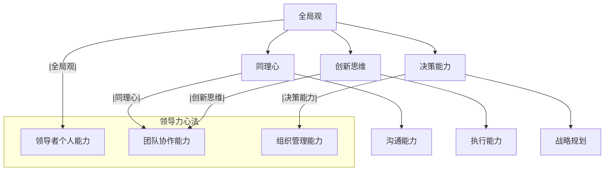

                 

### 文章标题：领导力心法：成就伟大事业的领导者法则

> 关键词：领导力、心法、领导者法则、团队管理、项目实施、个人成长

> 摘要：本文旨在深入探讨《领导力心法：成就伟大事业的领导者法则》一书的核心内容，分析领导力的本质及其在不同场景下的应用。文章将通过逐步分析，详细阐述领导力心法的基本理论、实践应用以及对个人成长的影响，最后展望领导力心法在未来的发展趋势。

### 引言

在当今复杂多变的社会环境中，领导力已成为成功的关键因素。无论是企业、政府还是社会组织，领导者都需要具备卓越的领导力，才能引领团队走向成功。《领导力心法：成就伟大事业的领导者法则》一书，正是为了帮助领导者提升自身能力，实现伟大事业而作。本书以领导力心法为核心，从理论到实践，全面解析领导力的内涵和运用。

### 第一部分：领导力心法的基本理论

#### 1.1 领导力的定义与类型

领导力是指领导者通过影响和激励他人，实现共同目标的能力。根据作用对象的不同，领导力可以分为三大类型：**个人领导力**、**团队领导力**和**组织领导力**。

- **个人领导力**：关注领导者个人的品格、能力和价值观，强调自我驱动和自我管理。
- **团队领导力**：关注团队协作和团队文化，强调领导者的沟通、协调和激励能力。
- **组织领导力**：关注组织战略和变革，强调领导者的决策、规划和执行能力。

#### 1.2 领导力心法的核心概念

领导力心法是一种深层次的领导思维模式，它包括以下核心概念：

- **全局观**：领导者需要具备全局观念，从整体出发，把握事物发展的趋势和规律。
- **同理心**：领导者需要理解他人的需求和情感，建立良好的人际关系。
- **创新思维**：领导者需要具备创新意识，不断寻求新的解决方案，推动组织发展。
- **决策能力**：领导者需要具备准确的判断力和果断的行动力，做出正确的决策。

#### 1.3 领导力心法的架构图

以下是领导力心法的架构图：

#### 1.4 领导力心法的基本原则

领导力心法遵循以下基本原则：

- **以人为本**：领导者应始终将人的因素放在首位，关注团队成员的需求和成长。
- **持续学习**：领导者应具备持续学习的能力，不断提升自身素质和能力。
- **创新驱动**：领导者应鼓励创新，推动组织持续发展。
- **合作共赢**：领导者应建立良好的团队关系，实现团队共赢。

### 第二部分：领导力心法的实践应用

#### 2.1 领导力心法在团队管理中的应用

在团队管理中，领导力心法可以帮助领导者更好地协调团队成员，提高团队绩效。以下是一些具体的应用方法：

- **建立共同目标**：领导者应与团队成员共同制定目标，确保目标的一致性和可达成性。
- **提高沟通能力**：领导者应加强沟通，确保信息的准确传递和理解。
- **激发团队活力**：领导者应鼓励团队成员发挥创意，积极参与团队活动。
- **培养团队文化**：领导者应建立积极向上的团队文化，增强团队的凝聚力和向心力。

#### 2.2 领导力心法在项目管理中的应用

在项目管理中，领导力心法可以帮助领导者更好地规划项目，控制项目风险，提高项目成功率。以下是一些具体的应用方法：

- **明确项目目标**：领导者应确保项目目标明确，且与组织战略一致。
- **制定详细计划**：领导者应制定详细的项目计划，包括时间、资源、质量等方面的安排。
- **风险管理**：领导者应识别项目风险，并制定相应的应对策略。
- **团队协作**：领导者应确保团队成员之间的协作顺畅，提高项目执行力。

#### 2.3 领导力心法在组织变革中的应用

在组织变革中，领导力心法可以帮助领导者更好地推动变革，实现组织转型。以下是一些具体的应用方法：

- **明确变革目标**：领导者应明确变革的目标，确保变革的可行性和必要性。
- **沟通与共识**：领导者应与员工进行有效沟通，达成共识，确保变革的顺利实施。
- **激励与支持**：领导者应激励员工积极参与变革，并提供必要的支持和资源。
- **评估与反馈**：领导者应定期评估变革的进展，及时调整策略，确保变革的成功。

#### 2.4 领导力心法在个人成长中的应用

在个人成长中，领导力心法可以帮助领导者更好地提升自身能力，实现个人发展。以下是一些具体的应用方法：

- **自我反思**：领导者应定期进行自我反思，了解自身的优点和不足，不断提升自我。
- **学习与成长**：领导者应不断学习新知识、新技能，提升自身的综合素质。
- **设定目标**：领导者应设定清晰的个人目标，制定可行的行动计划。
- **积极心态**：领导者应保持积极的心态，面对挑战和困难时保持乐观和坚韧。

### 第三部分：领导力心法对个人成长的影响

#### 3.1 领导力心法对领导者自我认知的影响

领导力心法可以帮助领导者更好地认识自己，了解自己的优势和劣势，从而有针对性地进行自我提升。以下是一些具体的影响：

- **增强自我认知**：领导者通过反思和自我评估，增强对自身的认知。
- **明确发展目标**：领导者根据自我认知，设定明确的发展目标，制定提升计划。
- **提升自我管理能力**：领导者通过自我管理，提升时间管理、情绪管理和人际关系管理能力。

#### 3.2 领导力心法对领导者决策能力的影响

领导力心法可以帮助领导者提高决策能力，做出更加明智和有效的决策。以下是一些具体的影响：

- **提高信息收集和分析能力**：领导者通过广泛收集信息和深入分析，提高决策的准确性。
- **增强决策的果断性**：领导者通过训练和经验积累，提高决策的果断性和执行力。
- **降低决策风险**：领导者通过风险评估和应对策略，降低决策风险，确保决策的成功。

#### 3.3 领导力心法对领导者沟通能力的影响

领导力心法可以帮助领导者提高沟通能力，建立良好的人际关系，增强团队的凝聚力。以下是一些具体的影响：

- **提升沟通技巧**：领导者通过学习沟通技巧，提高沟通的效果和影响力。
- **增强人际理解**：领导者通过同理心和倾听，增强对他人情感和需求的理解。
- **改善人际关系**：领导者通过有效的沟通和协作，改善人际关系，促进团队的和谐与发展。

#### 3.4 领导力心法对领导者领导风格的影响

领导力心法可以帮助领导者根据不同的场景和需求，调整领导风格，实现领导力的最佳效果。以下是一些具体的影响：

- **灵活调整领导风格**：领导者根据团队成员的特点和环境的变化，灵活调整领导风格。
- **提升领导艺术**：领导者通过实践和总结，提升领导的艺术性，提高领导的效果。
- **增强团队凝聚力**：领导者通过合适的领导风格，增强团队的凝聚力，提升团队的绩效。

### 第四部分：领导力心法的未来展望

#### 4.1 领导力心法在未来的发展趋势

随着社会和科技的不断进步，领导力心法也将不断发展和完善。以下是一些可能的发展趋势：

- **数字化领导**：随着数字化技术的发展，领导者需要具备数字化领导能力，引领组织进行数字化转型。
- **创新领导**：创新已成为组织的核心竞争力，领导者需要具备创新思维和创新领导能力，推动组织的创新发展。
- **全球化领导**：全球化背景下，领导者需要具备跨文化领导能力，有效管理和协调国际团队。

#### 4.2 领导力心法对组织管理的影响

领导力心法将深刻影响组织管理的方式和方法。以下是一些可能的影响：

- **提高组织效能**：领导力心法可以帮助组织提高效能，实现更高的绩效目标。
- **优化组织结构**：领导力心法可以帮助组织优化组织结构，提高组织的灵活性和适应性。
- **培养人才**：领导力心法可以帮助组织培养和激励人才，提高组织的核心竞争力。

#### 4.3 领导力心法对个人职业发展的影响

领导力心法对个人的职业发展具有重要作用。以下是一些可能的影响：

- **提升职业竞争力**：领导力心法可以帮助个人提升职业竞争力，实现职业发展的突破。
- **拓宽职业路径**：领导力心法可以帮助个人拓宽职业路径，实现跨领域、跨行业的职业发展。
- **实现职业价值**：领导力心法可以帮助个人实现职业价值，实现个人理想和人生目标。

### 总结

领导力心法是一种深层次的领导思维模式，它不仅关注领导者的个人能力，更关注领导者与团队成员、组织之间的关系和互动。通过逐步分析，《领导力心法：成就伟大事业的领导者法则》一书为我们呈现了一个全面的领导力心法体系，为领导者提供了实用的指导和方法。在未来的发展中，领导力心法将继续发挥重要作用，为领导者提供更加深入和全面的指导。

### 作者信息

作者：AI天才研究院/AI Genius Institute & 禅与计算机程序设计艺术 /Zen And The Art of Computer Programming

### 附录

#### 附录 A：领导力心法案例分析

通过具体的案例分析，我们可以更深入地理解领导力心法的应用和实践。

#### 附录 B：领导力心法相关资源与工具推荐

为了帮助读者更好地理解和应用领导力心法，我们推荐以下资源与工具。

#### 附录 C：常见问题解答

针对读者可能遇到的问题，我们提供了一些常见问题的解答。

### 结语

领导力心法是领导者实现伟大事业的关键。通过学习和应用领导力心法，领导者可以提升自身的领导能力，实现个人和团队的共同成长。让我们共同努力，用领导力心法成就伟大事业。

