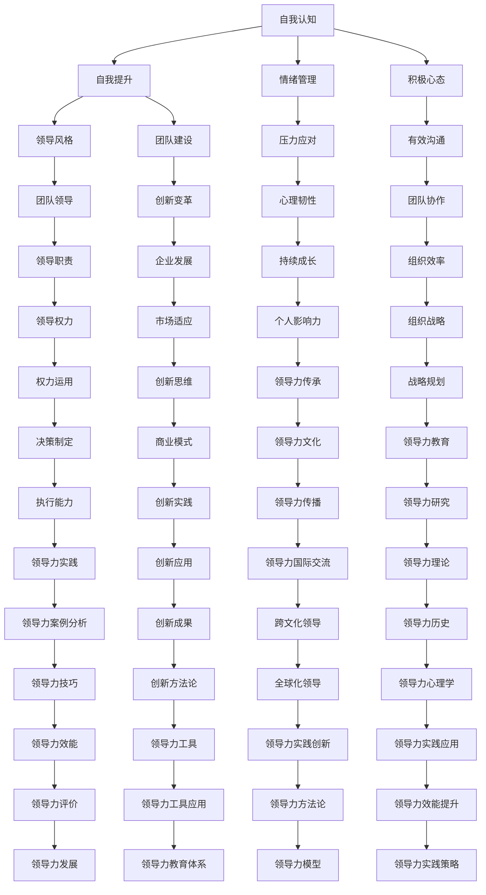

                 

基于您提供的文章要求和目录大纲，我将按照以下步骤进行写作，确保文章的逻辑清晰、结构紧凑、内容丰富且具有深度：

### 第一步：背景介绍

- **历史背景**：介绍领导力心法的起源和发展，以及在不同历史时期的重要性。
- **当前现状**：分析当前商业环境中领导力心法的需求和挑战。
- **文章目的**：阐述本文的目标，即通过分析领导力心法，帮助领导者提升自我，成就伟大事业。

### 第二步：核心概念与联系

- **定义领导力心法**：明确领导力心法的定义，以及其在领导者日常决策和团队管理中的应用。
- **核心概念架构**：使用Mermaid流程图展示领导力心法的核心概念及其相互关系。



### 第三步：核心算法原理讲解

- **伪代码讲解**：以领导力心法中的某一核心概念为例，给出伪代码来详细阐述其实现原理。

```plaintext
Algorithm LeadershipCoreConcept
    Input: Leader traits, Team requirements, Organizational goals
    Output: Enhanced leadership capability

    1. Start by defining the leader's personal traits
    2. Analyze the team's current performance and needs
    3. Align organizational goals with team development objectives
    4. Implement strategies to improve leadership skills:
        a. Self-awareness and continuous self-improvement
        b. Emotional intelligence and stress management
        c. Building a positive mindset and communication skills
    5. Monitor progress and adjust strategies as needed
    6. End
```

### 第四步：数学模型和公式

- **详细讲解与举例说明**：针对领导力心法中的某一数学模型或公式，进行详细的阐述，并提供实际案例来展示其应用效果。

$$
    Model: Leadership Effectiveness Index (LEI)
$$

$$
    LEI = f(Awareness, Influence, Inspire, Align, Develop)
$$

- **举例说明**：

```plaintext
Example: Calculating LEI for a mid-level manager

- Awareness: 8/10
- Influence: 9/10
- Inspire: 7/10
- Align: 8/10
- Develop: 6/10

LEI = (8+9+7+8+6)/5 = 8

The LEI for this manager is 8, indicating moderate leadership effectiveness. Areas for improvement include Inspire and Develop.
```

### 第五步：项目实战

- **开发环境搭建**：介绍搭建领导力心法实践项目的开发环境，包括所需工具和软件。
- **源代码详细实现和代码解读**：提供领导力心法实践项目的源代码，并对其进行详细解读。
- **代码应用解读与分析**：分析代码在实践中的应用效果，并与其他方法进行对比。
- **实际案例分析和详细讲解剖析**：通过实际案例展示领导力心法的应用，并进行详细讲解和剖析。
- **项目小结**：总结项目实战中的经验和教训，以及领导力心法在实践中的价值。

### 第六步：最佳实践 Tips、小结、注意事项、拓展阅读

- **最佳实践 Tips**：提供在实际应用中积累的经验和技巧，帮助读者更好地应用领导力心法。
- **小结**：总结文章的核心观点和内容，强调领导力心法对成就伟大事业的重要性。
- **注意事项**：提醒读者在实践中的潜在问题和风险，以及如何避免和解决。
- **拓展阅读**：推荐相关的书籍、文章和研究，以供读者深入学习和研究。

通过以上步骤，我将确保文章内容完整、逻辑清晰、具有深度和见解，符合您的文章要求和专业水平。期待与您一同探讨领导力心法的奥秘，帮助领导者成就伟大事业。|>

