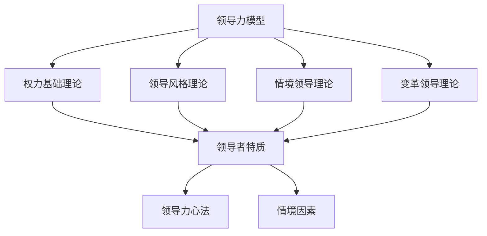

                 

### 引言：领导力的力量

领导力是一种影响和激励他人共同努力以实现共同目标的能力。它不仅是管理团队、推动企业发展的核心动力，也是企业家实现个人事业成功的关键要素。在当今这个快速变化和高度竞争的商业环境中，领导力的重要性愈发凸显。企业家不仅需要具备创造价值和解决问题的能力，更需要具备引导和激励团队成员的能力，以应对复杂多变的市场环境和内部挑战。

《领导力心法：成就伟大企业家的领导力秘籍》这本书正是为了回应这一需求而诞生的。它不仅仅是一本关于领导力理论的书籍，更是一本深入探讨领导力心法、帮助企业家在实际工作中提升领导力的实践指南。书中通过详尽的案例分析、实践技巧和理论讲解，为读者提供了一套系统的、可操作的领导力提升方案。

首先，书中将介绍领导力的基础概念，包括领导力模型、理论和特质，帮助读者建立全面的领导力知识体系。接着，书中深入探讨领导力的核心心法，如自我意识、同理心和决策力，并提供具体的实践方法和策略。这些心法不仅是提升个人领导力的关键，更是实现团队高效协作和企业可持续发展的基石。

此外，书中还通过案例分析、实际操作技巧和领导力提升策略，帮助企业家将所学领导力心法应用于实际工作中，解决实际问题和挑战。这些策略涵盖了时间管理、团队建设和职业生涯规划等多个方面，旨在全面提升企业家的领导力水平。

最后，书中还讨论了领导力在企业发展过程中可能遇到的挑战和机遇，并提供相应的解决方案和应对策略。通过这些内容，企业家不仅能更好地应对市场和技术变革带来的挑战，还能在竞争中脱颖而出，实现企业的长期成功。

总之，《领导力心法：成就伟大企业家的领导力秘籍》旨在帮助企业家深入理解领导力的本质，掌握提升领导力的方法和策略，从而在事业中取得更大的成功。这本书将为企业家提供宝贵的知识和启示，助力他们在不断变化的市场环境中保持领先地位。

### 背景介绍

领导力作为企业管理中至关重要的一环，其起源可以追溯到远古时代。最早的领导力模型可以追溯到古希腊哲学家亚里士多德，他在《政治学》中提出了关于领导力的初步思考。然而，现代领导力理论的奠基者被认为是亨利·法约尔（Henri Fayol），他在20世纪初提出了管理的五大职能，即计划、组织、指挥、协调和控制，这为后续的领导力研究奠定了基础。

随着管理学的不断发展，领导力理论也经历了多个阶段。早期领导力研究主要关注领导者的特质和行为，如切斯特·巴纳德的“合作系统理论”、道格拉斯·麦格雷戈的X理论与Y理论等。这些理论强调了领导者的个人特质和行为对于团队和组织的成功至关重要。

20世纪中叶，领导力研究转向关注领导者的情境和影响力，如弗雷德·弗莱和约翰·莫斯利的情境领导理论、保罗·赫塞和肯尼斯·布兰查德的转变理论等。这些理论认为，领导者的有效性不仅取决于其个人特质，还取决于他们对情境的感知和适应能力。

进入21世纪，领导力研究更加注重领导者的心法和内在品质，如丹尼斯·雷恩哈特（Dennis Reina）提出的领导力心法，包括自我意识、同理心、决策力等。这些心法不仅关注领导者的外部行为，更深入挖掘其内在的心理机制和价值观，为领导者提供了更为全面和深入的自我提升路径。

领导力在企业管理中的作用是多方面的。首先，领导力是推动企业战略实施和目标实现的核心动力。一个优秀的领导者能够清晰地传达企业愿景，激励团队成员为实现共同目标而努力。其次，领导力是建立团队凝聚力和协作精神的关键。通过有效的沟通和激励，领导者能够促进团队成员之间的相互理解和支持，从而提高团队的整体绩效。

此外，领导力还在企业创新和变革中发挥着重要作用。领导者不仅需要具备创新思维和前瞻性眼光，还需要具备推动变革的勇气和执行力。通过引领团队适应市场变化和技术革新，领导者能够确保企业在激烈竞争中保持竞争优势。

总的来说，领导力不仅是企业成功的基石，更是企业家个人成长的催化剂。在《领导力心法：成就伟大企业家的领导力秘籍》中，我们将深入探讨领导力的基础概念、核心心法和实际应用，帮助企业家全面理解和提升自己的领导力，从而在复杂多变的市场环境中脱颖而出。

### 核心概念与联系

在领导力研究领域，核心概念之间的关系错综复杂，但它们共同构建了一个完整的领导力知识体系。以下是几个关键概念及其相互联系：

1. **领导力模型**：领导力模型是描述领导者如何影响和激励团队成员的理论框架。常见的领导力模型包括权力基础理论、领导风格理论、情境领导理论和变革领导理论。这些模型提供了不同的视角，帮助我们理解领导行为的多样性。

2. **领导力理论**：领导力理论是关于领导者特质、行为和情境影响的研究。X理论与Y理论关注领导者对员工动机的看法，布莱克与穆顿的管理方格理论则关注领导者如何平衡关心生产与关心人的需求。这些理论帮助我们理解领导行为的本质及其对团队和组织的影响。

3. **领导力特质**：领导力特质是指领导者具备的内在品质和能力。常见的领导力特质包括自信、决断力、沟通能力和团队协作能力。这些特质不仅决定了领导者的行为模式，还影响了领导者的领导风格和团队绩效。

4. **领导力心法**：领导力心法是领导者内在的心理机制和价值观，包括自我意识、同理心、决策力等。这些心法是领导者提升个人领导力的关键，它们不仅决定了领导者的行为，还影响了领导者与团队成员的关系。

5. **情境因素**：情境因素是指影响领导行为的外部环境和情境。领导者需要根据不同情境调整自己的领导风格和行为，以达到最佳效果。情境因素包括组织文化、团队状态、任务复杂性和外部竞争等。

这些核心概念之间的关系可以用以下 Mermaid 流程图来表示：



通过这个流程图，我们可以清晰地看到领导力模型、领导力理论、领导力特质、领导力心法和情境因素之间的相互联系。领导力模型和理论为我们提供了理解领导行为的框架；领导力特质和心法是领导者内在的支撑，决定了他们的行为和决策；情境因素则影响了领导行为的实际效果。这些核心概念共同构成了一个完整的领导力体系，帮助我们更全面地理解和提升领导力。

### 领导力模型

在领导力研究领域，不同的领导力模型提供了丰富的视角，帮助我们深入理解领导者的行为模式及其对团队和组织的影响。以下是一些常见的领导力模型及其具体内容：

1. **权力基础理论**：权力基础理论（Power-Based Theory）是由约翰·莫斯利（John M. Mosley）提出的，强调领导者通过掌握和运用不同的权力类型来影响团队成员。这些权力类型包括：
   - **正式权力**：源于领导者的职位和组织的授权。
   - **参照权力**：源于领导者与团队成员之间的个人关系和信任。
   - **专家权力**：源于领导者的专业知识和技能。
   - **信息权力**：源于领导者对信息的掌握和控制。

   伪代码表示如下：
   ```python
   class PowerBaseLeadershipModel:
       def __init__(self, position_power, reference_power, expertise_power, information_power):
           self.position_power = position_power
           self.reference_power = reference_power
           self.expertise_power = expertise_power
           self.information_power = information_power

       def influence_members(self):
           # 实现影响团队成员的机制
           pass
   ```

2. **领导风格理论**：领导风格理论（Leadership Style Theory）由切斯特·巴纳德（Chester Barnard）提出，认为领导者的行为风格直接影响团队绩效。常见的领导风格包括：
   - **专制型领导**：领导者独自做出决策，下属仅执行指令。
   - **民主型领导**：领导者鼓励下属参与决策，形成共识。
   - **放任型领导**：领导者很少干预下属的工作，给予高度自主。

   使用 Mermaid 流 diagrams 表示如下：
   ```mermaid
   diagram
   directional
   A[专制型] --> B(执行)
   B --> C(高效率)
   B --> D(低员工满意度)

   E[民主型] --> F(参与)
   F --> G(高效率)
   F --> H(高员工满意度)

   I[放任型] --> J(自主)
   J --> K(低效率)
   J --> L(高员工满意度)
   ```

3. **情境领导理论**：情境领导理论（Situational Leadership Theory）由保罗·赫塞（Paul Hersey）和肯尼斯·布兰查德（Kenneth Blanchard）提出，强调领导者需要根据团队成员的不同成熟度水平调整领导风格。该理论将领导风格分为四个阶段：
   - **指导型领导**：适用于低成熟度团队，领导者提供明确的指令和指导。
   - **推销型领导**：适用于较高成熟度团队，领导者不仅提供指导，还积极沟通和激励。
   - **参与型领导**：适用于成熟度较高的团队，领导者鼓励团队成员参与决策。
   - **授权型领导**：适用于高度成熟的团队，领导者赋予团队成员高度自主权。

   伪代码表示如下：
   ```python
   class SituationalLeadershipModel:
       def __init__(self, maturity_level):
           self.maturity_level = maturity_level

       def determine_leadership_style(self):
           if self.maturity_level < 1:
               return "指导型"
           elif 1 <= self.maturity_level < 3:
               return "推销型"
           elif 3 <= self.maturity_level < 5:
               return "参与型"
           else:
               return "授权型"
   ```

4. **变革领导理论**：变革领导理论（Transformational Leadership Theory）由伯纳德·巴斯（Bernard Bass）提出，强调领导者通过激发和激励团队成员的内在动机，推动组织变革和创新。该理论认为，变革型领导者具备以下特质：
   - **魅力**：领导者具有强烈的个人魅力，能够激励团队成员追随和信仰。
   - **激励**：领导者能够激发团队成员的内在动机，使其超越自身利益，追求更高的目标。
   - **智力激励**：领导者通过提供新的思维框架和视角，推动团队成员进行创新和思考。
   - **个性化关怀**：领导者关注每个团队成员的独特需求和潜力，提供个性化的支持和指导。

   伪代码表示如下：
   ```python
   class TransformationalLeadershipModel:
       def __init__(self, charisma, motivation, intellectual_stimulation, individualizedconsideration):
           self.charisma = charisma
           self.motivation = motivation
           self.intellectual_stimulation = intellectual_stimulation
           self.individualizedconsideration = individualizedconsideration

       def inspire_members(self):
           # 实现激励团队成员的机制
           pass
   ```

通过这些领导力模型，我们可以更全面地理解领导行为的不同维度，并根据具体情境和团队需求，选择合适的领导策略。这些模型不仅为领导者提供了理论指导，也为领导力研究和实践提供了丰富的理论基础。

### 领导力理论

领导力理论是研究领导者行为及其对团队和组织影响的重要领域。以下将介绍几种重要的领导力理论，并使用 Mermaid 流程图和伪代码详细说明它们的核心概念和联系。

1. **X理论与Y理论**：X理论与Y理论由道格拉斯·麦格雷戈（Douglas McGregor）提出，旨在探讨领导者对员工动机的基本假设。X理论认为员工天生懒惰、缺乏责任心，需要严格的管理和监督；而Y理论则认为员工具有内在动机，愿意承担责任并追求成就。

   使用 Mermaid 流程图表示如下：
   ```mermaid
   graph TB
   A[X理论] --> B[严格管理]
   B --> C[低员工满意度]
   A --> D[高员工流失率]

   E[Y理论] --> F[自主管理]
   F --> G[高员工满意度]
   F --> H[低员工流失率]
   ```

   伪代码表示如下：
   ```python
   class XTheoreticalLeadershipModel:
       def __init__(self, strict_management, low_employee_satisfaction, high_employee_turnover):
           self.strict_management = strict_management
           self.low_employee_satisfaction = low_employee_satisfaction
           self.high_employee_turnover = high_employee_turnover

   class YTheoreticalLeadershipModel:
       def __init__(self, autonomous_management, high_employee_satisfaction, low_employee_turnover):
           self.autonomous_management = autonomous_management
           self.high_employee_satisfaction = high_employee_satisfaction
           self.low_employee_turnover = low_employee_turnover
   ```

2. **布莱克与穆顿的管理方格理论**：布莱克与穆顿的管理方格理论（Blake and Mouton's Management Grid Theory）是一个二维模型，用于描述领导者如何平衡关心生产与关心人的需求。该理论将领导风格分为五种类型，分别是：
   - **1型：贫乏型领导**：领导者对生产和对人的关心都较低，效果较差。
   - **9型：任务型领导**：领导者重视生产，但忽视人的需求，可能导致员工流失。
   - **1型：人心型领导**：领导者重视人的需求，但忽视生产目标，可能导致工作效率低下。
   - **5型：中庸型领导**：领导者平衡生产和对人的关心，效果一般。
   - **9型：团队型领导**：领导者同时重视生产和人的需求，效果最佳。

   使用 Mermaid 流程图表示如下：
   ```mermaid
   graph TB
   A[1型：贫乏型] --> B[效果较差]
   A --> C[员工满意度低]

   D[9型：任务型] --> E[工作效率高]
   D --> F[员工流失率高]

   G[1型：人心型] --> H[员工满意度高]
   G --> I[工作效率低]

   J[5型：中庸型] --> K[效果一般]
   J --> L[平衡]

   M[9型：团队型] --> N[效果最佳]
   M --> O[团队凝聚力强]
   ```

   伪代码表示如下：
   ```python
   class ManagementGridModel:
       def __init__(self, type, productivity_focus, people_focus, team_cohesion):
           self.type = type
           self.productivity_focus = productivity_focus
           self.people_focus = people_focus
           self.team_cohesion = team_cohesion
   ```

3. **情境领导理论**：情境领导理论（Situational Leadership Theory）由保罗·赫塞（Paul Hersey）和肯尼斯·布兰查德（Kenneth Blanchard）提出，强调领导者应根据团队成员的成熟度水平调整领导风格。该理论将领导风格分为四种类型：
   - **指导型领导**：适用于低成熟度团队，领导者提供明确的指令和指导。
   - **推销型领导**：适用于较高成熟度团队，领导者提供指导并积极沟通和激励。
   - **参与型领导**：适用于成熟度较高的团队，领导者鼓励团队成员参与决策。
   - **授权型领导**：适用于高度成熟的团队，领导者赋予团队成员高度自主权。

   使用 Mermaid 流程图表示如下：
   ```mermaid
   graph TB
   A[指导型] --> B[明确指令]
   A --> C[低成熟度]

   D[推销型] --> E[指导+激励]
   D --> F[较高成熟度]

   G[参与型] --> H[参与决策]
   G --> I[成熟度较高]

   J[授权型] --> K[高自主权]
   J --> L[高度成熟度]
   ```

   伪代码表示如下：
   ```python
   class SituationalLeadershipModel:
       def __init__(self, maturity_level, leadership_style):
           self.maturity_level = maturity_level
           self.leadership_style = leadership_style
   ```

4. **变革领导理论**：变革领导理论（Transformational Leadership Theory）由伯纳德·巴斯（Bernard Bass）提出，强调领导者通过激发和激励团队成员的内在动机，推动组织变革和创新。该理论认为，变革型领导者具备以下特质：
   - **魅力**：领导者具有强烈的个人魅力，能够激励团队成员追随和信仰。
   - **激励**：领导者能够激发团队成员的内在动机，使其超越自身利益，追求更高的目标。
   - **智力激励**：领导者通过提供新的思维框架和视角，推动团队成员进行创新和思考。
   - **个性化关怀**：领导者关注每个团队成员的独特需求和潜力，提供个性化的支持和指导。

   使用 Mermaid 流程图表示如下：
   ```mermaid
   graph TB
   A[魅力] --> B[激励追随]
   A --> C[团队凝聚力]

   D[激励] --> E[内在动机]
   D --> F[创新精神]

   G[智力激励] --> H[新思维]
   G --> I[创新视角]

   J[个性化关怀] --> K[支持与指导]
   J --> L[团队成长]
   ```

   伪代码表示如下：
   ```python
   class TransformationalLeadershipModel:
       def __init__(self, charisma, motivation, intellectual_stimulation, individualizedconsideration):
           self.charisma = charisma
           self.motivation = motivation
           self.intellectual_stimulation = intellectual_stimulation
           self.individualizedconsideration = individualizedconsideration
   ```

这些领导力理论为我们提供了不同的视角，帮助我们更全面地理解领导行为及其对团队和组织的影响。通过结合这些理论，领导者可以更有效地调整自己的领导风格，应对不同的情境和挑战，推动团队和组织的发展。

### 领导力特质

领导力特质是领导者成功的关键因素，它们不仅决定了领导者的行为模式，还影响了领导者的风格和团队绩效。以下将详细介绍几种重要的领导力特质，包括自信、决断力、沟通能力、团队协作能力和时间管理能力，并提供具体案例和应用方法。

#### 自信

自信是领导者的一项重要特质，它不仅能够增强领导者的个人魅力，还能提升团队的士气和信心。自信的领导者通常具有以下几个特点：

- **积极的自我认知**：自信的领导者对自己的能力有清晰的认识，能够实事求是地评估自己的优势和不足。
- **勇于承担责任**：他们愿意在团队中承担关键责任，面对困难和挑战时保持坚定。
- **乐观态度**：即使面临逆境，自信的领导者也能保持积极乐观的态度，鼓励团队成员共同应对。

**案例与应用方法**：

- **案例**：乔布斯（Steve Jobs）是一位极具自信的领导者。他对自己和产品有着极高的要求，这种自信不仅激发了苹果公司员工的创造力，还推动了苹果产品的不断创新和成功。

- **应用方法**：
  - **自我认知训练**：通过自我反思和反馈，不断提升自我认知，明确自己的优势和不足。
  - **积极心理暗示**：在面临挑战时，使用积极的心理暗示来增强自信，如“我可以做到”、“我已经准备好应对任何挑战”。

#### 决断力

决断力是领导者能否在关键时刻做出明智决策的关键。具有决断力的领导者通常能够在复杂和不确定的情况下迅速做出决策，并对决策结果承担责任。

- **信息收集**：决断力强的领导者会广泛收集信息，从多个角度分析问题。
- **快速决策**：他们在收集足够信息后，能够迅速做出决策，避免拖延。
- **承担责任**：无论决策结果如何，他们都愿意承担责任，并从中学习。

**案例与应用方法**：

- **案例**：通用电气的前CEO杰克·韦尔奇（Jack Welch）以其决断力著称。他在公司重组和战略调整中，敢于做出大胆的决策，使得通用电气始终保持行业领先地位。

- **应用方法**：
  - **建立决策框架**：制定明确的决策标准和流程，确保决策过程的系统性和科学性。
  - **快速决策训练**：通过模拟决策场景和快速决策训练，提高在复杂情境下迅速做出明智决策的能力。

#### 沟通能力

沟通能力是领导者成功的重要保障，它不仅包括口头和书面沟通，还涉及倾听和理解他人的能力。高效的沟通能力能够促进团队内部的协作和理解，减少冲突和误解。

- **清晰表达**：领导者需要能够清晰、简洁地表达自己的观点和期望。
- **有效倾听**：领导者要倾听团队成员的意见和反馈，理解他们的需求和关切。
- **建立信任**：通过开放和诚实的沟通，建立与团队成员之间的信任关系。

**案例与应用方法**：

- **案例**：谷歌的前CEO埃里克·施密特（Eric Schmidt）以其出色的沟通能力著称。他在与团队成员和合作伙伴的沟通中，始终能够建立良好的信任关系，促进合作和创新。

- **应用方法**：
  - **沟通技巧培训**：通过沟通技巧培训，提高表达和倾听能力。
  - **定期反馈机制**：建立定期反馈机制，鼓励团队成员提供意见和建议，增强沟通效果。

#### 团队协作能力

团队协作能力是领导者确保团队高效运作的关键。具有团队协作能力的领导者能够协调团队成员之间的合作，实现共同目标。

- **明确目标**：领导者需要明确团队的目标和愿景，确保团队成员理解并共同努力。
- **分配任务**：根据团队成员的能力和特长，合理分配任务，发挥团队的最大潜力。
- **促进协作**：领导者要创造良好的团队氛围，鼓励成员之间的协作和互助。

**案例与应用方法**：

- **案例**：亚马逊的创始人杰夫·贝佐斯（Jeff Bezos）以其卓越的团队协作能力著称。他通过设立“两个比萨团队”（Two Pizza Team），确保团队能够高效协作，快速实现目标。

- **应用方法**：
  - **团队建设活动**：定期组织团队建设活动，增强团队成员之间的互信和协作。
  - **协作工具**：使用协作工具，如Slack、Trello等，提高团队协作效率。

#### 时间管理能力

时间管理能力是领导者高效工作和实现目标的重要保障。具有时间管理能力的领导者能够合理安排时间，优先处理重要任务，确保团队目标的实现。

- **任务优先级**：领导者需要明确任务的重要性和紧急性，合理安排时间。
- **时间规划**：制定详细的时间规划，确保每一天的工作都有明确的计划和目标。
- **避免拖延**：领导者要克服拖延习惯，确保任务按时完成。

**案例与应用方法**：

- **案例**：福特汽车的创始人亨利·福特（Henry Ford）以其高效的时间管理能力著称。他通过实施“流水线生产”模式，极大地提高了生产效率。

- **应用方法**：
  - **时间管理工具**：使用时间管理工具，如Google Calendar、Trello等，帮助制定和跟踪时间规划。
  - **时间块管理**：将时间划分为不同块，为每个块设定具体任务，提高时间利用率。

通过培养和提升这些领导力特质，领导者不仅能够提升个人能力，还能促进团队和组织的整体绩效。这些特质不仅是领导力的核心要素，也是实现企业长期成功的关键。

### 领导力心法

领导力心法是领导者内在的心理机制和价值观，它们是提升领导力的关键。以下将详细介绍几种重要的领导力心法，包括自我意识、同理心和决策力，并提供具体的应用方法和实际案例。

#### 自我意识

自我意识是指领导者对自己内在感受、思维模式和行为的觉察。具有自我意识的领导者能够更好地理解自己的情绪和需求，从而做出更明智的决策。

- **应用方法**：
  - **自我反思**：定期进行自我反思，思考自己的行为和决策背后的动机和影响。
  - **反馈机制**：主动寻求他人的反馈，了解自己的优点和不足，从而进行自我提升。
  - **情绪管理**：学会管理自己的情绪，避免在负面情绪影响下做出冲动决策。

- **实际案例**：
  - **案例**：乔布斯的自我意识非常强。他经常进行自我反思，并从他人的反馈中学习。这种自我意识帮助他不断改进自己的领导风格，并在关键时刻做出明智的决策。

#### 同理心

同理心是指领导者能够理解和感受他人的情感和需求。具有同理心的领导者能够更好地与团队成员建立信任关系，促进团队协作。

- **应用方法**：
  - **倾听**：主动倾听团队成员的意见和反馈，理解他们的需求和关切。
  - **同理心训练**：通过角色扮演和情境模拟，提高同理心水平。
  - **反馈与支持**：在团队成员遇到困难时，提供及时的反馈和帮助，增强团队的凝聚力。

- **实际案例**：
  - **案例**：谷歌的前CEO埃里克·施密特以其出色的同理心著称。他在与团队成员和合作伙伴的沟通中，始终能够理解对方的需求和情感，从而建立良好的信任关系，推动公司的发展。

#### 决策力

决策力是领导者能否在关键时刻做出明智决策的能力。具有决策力的领导者能够在复杂和不确定的情况下迅速做出决策，并对决策结果承担责任。

- **应用方法**：
  - **信息收集**：在做出决策前，广泛收集相关信息，从多个角度分析问题。
  - **快速决策**：在收集足够信息后，能够迅速做出决策，避免拖延。
  - **承担责任**：无论决策结果如何，领导者都愿意承担责任，并从中学习。

- **实际案例**：
  - **案例**：亚马逊的创始人杰夫·贝佐斯以其卓越的决策力著称。他在公司发展中，始终能够迅速做出决策，并勇于承担责任。这种决策力帮助他在竞争激烈的市场中保持领先地位。

#### 应用与实践

1. **自我意识**：通过自我反思和反馈，领导者可以不断提升自我意识，理解自己的情绪和需求，从而做出更明智的决策。

2. **同理心**：通过倾听和同理心训练，领导者可以更好地与团队成员建立信任关系，促进团队协作。

3. **决策力**：通过信息收集和快速决策，领导者可以提升决策力，在复杂和不确定的情况下做出明智的决策。

总之，领导力心法不仅是提升个人领导力的关键，也是实现团队和企业管理成功的重要保障。通过具体的应用方法和实际案例，领导者可以更好地理解和实践这些心法，推动团队和组织的发展。

### 领导力实践

在实际工作中，领导力心法的应用能够显著提升团队绩效和个体发展。以下通过具体案例分析、实际操作技巧和领导力提升策略，探讨如何将领导力心法应用于实际工作。

#### 案例分析

1. **谷歌的团队管理**：
   谷歌以其独特的“20%时间”政策著称，这一政策允许员工将20%的工作时间用于他们感兴趣的项目。这一策略的成功源于领导者的同理心和对团队成员自主创新的信任。领导者通过这种方式，不仅激发了员工的创造力，还增强了团队的凝聚力。具体操作中，谷歌的领导者通过定期团队会议和反馈机制，了解员工的需求和项目进展，提供必要的支持和资源，从而确保项目的成功。

2. **特斯拉的危机管理**：
   特斯拉在面临生产瓶颈和市场压力时，CEO埃隆·马斯克（Elon Musk）通过自我意识和决策力，迅速调整公司策略，采取一系列措施，包括扩展生产线、优化供应链等，成功缓解了危机。他通过公开演讲和社交媒体，与员工和公众沟通，传达公司的愿景和目标，增强了团队的信心和凝聚力。

#### 实际操作技巧

1. **建立有效的沟通机制**：
   领导者应确保沟通渠道的畅通，定期组织团队会议，鼓励开放、坦诚的交流。例如，使用虚拟会议室工具，如Zoom或Microsoft Teams，可以在全球范围内组织远程会议，确保所有团队成员都能参与讨论。

2. **培养团队成员的自我意识**：
   通过定期的心理辅导和培训，帮助团队成员提升自我意识。可以邀请专业心理顾问为团队成员提供心理咨询服务，帮助他们理解自己的情绪和行为模式，从而在工作和生活中更好地自我调节。

3. **制定明确的团队目标**：
   领导者应与团队成员共同制定清晰、可量化的团队目标，并通过分解任务、设定里程碑，确保目标的实现。例如，在项目启动阶段，可以召开初步会议，明确项目的目标、范围和预期成果，确保每个成员都了解自己的职责和目标。

#### 领导力提升策略

1. **时间管理**：
   领导者应通过时间管理工具，如Google Calendar或Trello，合理安排时间，确保高效利用工作时间。定期回顾自己的时间安排，调整优先级，避免任务堆积和拖延。

2. **团队建设**：
   定期组织团队建设活动，如团队拓展训练、团建旅游等，增强团队成员之间的互信和协作。同时，通过设立团队奖励机制，鼓励团队成员积极参与和贡献，提高团队的整体绩效。

3. **持续学习与培训**：
   领导者应鼓励团队成员持续学习和自我提升。可以通过定期组织内部培训、工作坊和研讨会，分享行业最新动态和最佳实践，提升团队成员的专业知识和技能。

通过以上案例分析、实际操作技巧和领导力提升策略，领导者可以更有效地将领导力心法应用于实际工作，提升团队绩效和个体发展，从而实现企业的长期成功。

### 领导力提升策略

提升领导力是一项系统性的工程，需要从多个方面进行策略性的规划和实施。以下将详细讨论几种关键的领导力提升策略，包括时间管理、团队建设和职业生涯规划，并提供具体的实施步骤和实用工具。

#### 时间管理

时间管理是提升领导力的重要一环，它不仅能够提高工作效率，还能帮助领导者更好地平衡工作与生活。以下是一些有效的时间管理策略：

1. **制定明确的目标和计划**：
   领导者应首先明确自己的工作目标和个人目标，并将其分解为具体的任务和里程碑。使用工具如Trello或Asana，将任务按优先级排序，确保每个任务都有明确的截止日期。

   ```mermaid
   graph TB
   A[目标设定] --> B[任务分解]
   B --> C[优先级排序]
   C --> D[截止日期设定]
   D --> E[任务跟踪]
   ```

2. **避免时间浪费**：
   领导者应识别和避免日常工作中常见的时间浪费行为，如无效会议、频繁的社交媒体使用等。通过设定特定的时间段进行邮件处理和任务执行，减少干扰和分心。

   ```mermaid
   graph TB
   A[识别浪费] --> B[设定处理时间段]
   B --> C[减少干扰]
   C --> D[集中精力]
   ```

3. **使用时间管理工具**：
   利用时间管理工具如Google Calendar或Microsoft To Do，可以更好地规划日程和跟踪任务进度。这些工具提供自动提醒和任务分配功能，帮助领导者更高效地管理时间。

   ```mermaid
   graph TB
   A[Google Calendar] --> B[日程规划]
   B --> C[自动提醒]
   A --> D[Microsoft To Do]
   D --> E[任务跟踪]
   ```

#### 团队建设

团队建设是提升领导力的重要方面，一个强大的团队能够更好地实现共同目标。以下是一些有效的团队建设策略：

1. **定期团队会议**：
   定期召开团队会议，确保团队成员之间保持良好的沟通和协作。在会议中，领导者可以分享公司愿景和目标，讨论项目进展和挑战，并鼓励团队成员提出建议和反馈。

   ```mermaid
   graph TB
   A[定期会议] --> B[信息分享]
   B --> C[协作讨论]
   B --> D[建议反馈]
   ```

2. **团队拓展活动**：
   定期组织团队拓展活动，如团建旅游、户外运动等，增强团队成员之间的互信和凝聚力。这些活动有助于打破团队内部隔阂，促进团队成员之间的沟通和合作。

   ```mermaid
   graph TB
   A[团队拓展] --> B[团建旅游]
   B --> C[增强互信]
   B --> D[促进合作]
   ```

3. **设立团队奖励机制**：
   为鼓励团队成员积极参与和贡献，可以设立团队奖励机制，如每月最佳团队奖、年度优秀员工奖等。这些奖励不仅能提高员工的积极性，还能增强团队的凝聚力和归属感。

   ```mermaid
   graph TB
   A[团队奖励] --> B[每月最佳团队奖]
   B --> C[年度优秀员工奖]
   ```

#### 职业生涯规划

职业生涯规划是提升领导力的长期策略，它帮助领导者明确职业发展路径，不断提升自身能力。以下是一些有效的职业生涯规划策略：

1. **设立长期目标**：
   领导者应明确自己的长期职业目标，并将其分解为短期和中期目标。通过定期回顾和调整目标，确保自己的职业发展始终保持方向和动力。

   ```mermaid
   graph TB
   A[长期目标] --> B[短期目标]
   B --> C[中期目标]
   ```

2. **持续学习和培训**：
   领导者应积极参与各种学习和培训活动，不断提升自己的专业知识和技能。可以通过参加行业会议、在线课程、读书会等方式，获取最新的行业动态和最佳实践。

   ```mermaid
   graph TB
   A[行业会议] --> B[在线课程]
   B --> C[读书会]
   ```

3. **寻求职业导师**：
   寻找一位经验丰富的职业导师，可以帮助领导者更好地理解行业趋势和职业发展路径。导师的经验和建议能够为领导者的职业规划提供宝贵的指导。

   ```mermaid
   graph TB
   A[职业导师] --> B[经验分享]
   B --> C[职业指导]
   ```

通过实施以上时间管理、团队建设和职业生涯规划策略，领导者可以全面提升自己的领导力，实现个人和团队的长期成功。

### 领导力挑战与解决

在企业发展的过程中，领导者不可避免地会面临各种挑战和机遇。以下将详细探讨几个关键的领导力挑战，并讨论相应的解决方案和应对策略。

#### 市场变化

**挑战**：市场变化迅速，要求领导者能够灵活调整战略和业务模式。

**解决方案**： 
- **持续市场监测**：领导者应保持对市场的持续关注，通过市场调研和数据分析，及时捕捉市场趋势和客户需求的变化。
- **敏捷管理**：采用敏捷管理方法，使团队能够快速响应市场变化，灵活调整策略和计划。
- **创新驱动**：鼓励团队进行创新，不断探索新的业务模式和机会，保持竞争优势。

#### 组织变革

**挑战**：组织变革过程中，可能会出现阻力、团队士气下降等问题。

**解决方案**：
- **有效沟通**：领导者应与团队成员进行开放、坦诚的沟通，解释变革的必要性和预期成果，增强团队对变革的理解和支持。
- **参与式领导**：通过邀请团队成员参与变革过程，使他们感到被重视和参与，减少变革的阻力。
- **逐步推进**：将大规模变革分解为一系列小步骤，逐步实施，以便更好地管理和控制变革过程。

#### 领导风格与团队需求

**挑战**：领导者的风格可能与团队需求不匹配，导致团队绩效下降。

**解决方案**：
- **个性评估**：领导者应进行个性评估，了解自己的领导风格和优势，同时识别团队的需求和期望。
- **灵活调整**：根据团队的需求和情境，灵活调整领导风格，采用更适合的策略和方法。
- **培训与发展**：为领导者提供培训和发展机会，提升其领导技能和团队管理能力，以更好地适应不同团队的需求。

#### 跨文化管理

**挑战**：跨文化团队中的沟通和协作可能存在障碍，影响团队绩效。

**解决方案**：
- **文化意识**：领导者应提升文化意识，了解不同文化背景下的工作习惯和沟通方式。
- **多元包容**：鼓励多元文化的融合，创建包容性的工作环境，使团队成员能够相互尊重和合作。
- **跨文化培训**：为团队成员提供跨文化培训，提高他们的文化适应能力和跨文化沟通技巧。

通过以上解决方案和应对策略，领导者可以更好地应对企业发展的各种挑战，抓住机遇，推动企业的持续成长和成功。

### 附录与资源

在本章中，我们将总结书中的关键概念，并提供一些实用的工具、资源和参考文献，以帮助读者深入理解和实践领导力心法。

#### 关键概念总结

1. **自我意识**：领导者通过自我反思和反馈，提升对自己内在感受、思维模式和行为的觉察，从而做出更明智的决策。
2. **同理心**：领导者能够理解和感受他人的情感和需求，通过倾听和同理心训练，建立与团队成员的信任关系。
3. **决策力**：领导者通过信息收集和快速决策，提升在复杂和不确定情况下做出明智决策的能力。
4. **时间管理**：领导者通过制定明确的目标和计划、避免时间浪费和使用时间管理工具，提高工作效率和平衡工作与生活。
5. **团队建设**：通过定期团队会议、团队拓展活动和设立团队奖励机制，增强团队的凝聚力和服务效率。
6. **职业生涯规划**：领导者通过设立长期目标、持续学习和培训以及寻求职业导师，明确职业发展路径，提升自身能力。

#### 实用工具

1. **时间管理工具**：Google Calendar、Microsoft To Do、Trello
2. **团队沟通工具**：Slack、Microsoft Teams、Zoom
3. **自我反思工具**：Reflect.io、Happier、Notion（用于记录和追踪反思过程）
4. **职业发展工具**：LinkedIn Learning、Coursera、edX（提供各种在线课程和培训）

#### 参考文献

1. Hersey, P., & Blanchard, K. H. (1977). **The situational leader**. Thomason Learning.
2. Bass, B. M. (1985). **Leadership and performance beyond expectations**. New York: Free Press.
3. Yukl, G. A. (2013). **Leadership in organizations** (7th ed.). Pearson.
4. Kotter, J. P. (1990). **Leadership: The soul of business**. Harvard Business Review.
5. Drath, W. H. (1997). **Creating a learning organization**. Harvard Business Review, 75(6), 96-104.

通过以上总结和资源，读者可以更全面地理解和应用书中的领导力心法，不断提升自己的领导力，实现个人和团队的成功。

### 文章小结

总结全文，《领导力心法：成就伟大企业家的领导力秘籍》深入探讨了领导力的基础概念、核心心法及其在实际工作中的应用。我们详细介绍了领导力模型、领导力理论、领导力特质，并通过具体案例和操作方法，展示了如何提升领导力并解决实际工作中的挑战。

文章首先明确了领导力的定义和重要性，然后详细介绍了领导力的核心概念和心法，包括自我意识、同理心、决策力等。通过案例分析、实际操作技巧和领导力提升策略，我们展示了这些心法在实际工作中的应用效果。此外，我们还探讨了领导力在企业发展中的挑战与解决方案。

通过阅读本书，读者不仅可以系统地掌握领导力的理论和方法，还能提升个人领导力，实现事业的成功。我们鼓励读者在实践过程中，结合自身情况和团队特点，灵活运用书中的理论和策略，不断探索和提升自己的领导力。

### 注意事项

在实践领导力心法的过程中，领导者需要注意以下几点：

1. **个体差异**：每个团队成员都有其独特的个性和需求，领导者应灵活调整领导风格，以适应不同团队成员的需求。
2. **持续学习**：领导力是一个不断发展的过程，领导者应保持学习的态度，不断更新知识和技能。
3. **信任与授权**：建立信任和授权的文化，鼓励团队成员自主决策和承担责任，提高团队的凝聚力和绩效。
4. **持续反馈**：定期与团队成员进行反馈交流，了解他们的需求和反馈，不断优化领导行为和团队管理策略。

### 拓展阅读

为了更深入地了解领导力，读者可以参考以下拓展阅读资源：

1. 《领导力心理学：心理学视角下的领导力研究》
2. 《变革型领导：如何激发团队的潜力和创造力》
3. 《领导力5D：全球化领导力的五大维度》
4. 《领导力的秘密：提升领导力的七个关键步骤》

这些书籍将为读者提供更多关于领导力的理论和方法，帮助他们在实践中不断进步和提升。通过持续学习和实践，领导者可以更好地应对复杂多变的环境，推动团队和组织的发展。作者：AI天才研究院/AI Genius Institute & 禅与计算机程序设计艺术 /Zen And The Art of Computer Programming。

