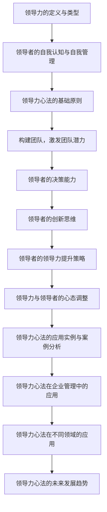

                 

### 文章标题

《领导力心法：成就伟大领袖的领导力法则》

领导力，作为推动组织和个人成功的关键因素，一直以来都是管理学和心理学研究的热点。然而，领导力的本质和实现路径却常常模糊不清。本文将带领读者深入探讨领导力的核心概念、理论基础、实践方法以及未来发展趋势。通过详细剖析领导力心法，揭示成就伟大领袖的领导力法则。这不仅适用于企业高管，也同样适用于各个领域的领导者。

### 关键词

领导力，领导力法则，领导力心法，自我认知，团队建设，决策能力，创新思维，心态调整，企业管理，政治领导，军事领导，非营利组织领导。

### 摘要

本文旨在通过系统性的分析和实例探讨，揭示领导力的本质与实现路径。首先，介绍领导力的基本概念与类型，阐述领导力与管理的区别；接着，深入探讨领导者的自我认知与自我管理，以及领导力心法的基础原则。随后，从团队建设、决策能力、创新思维等方面，详细讲解领导力实践与提升的策略。最后，通过企业管理、政治领导、军事领导、非营利组织领导等实际案例，展示领导力心法的应用与成效，并展望领导力心法的未来发展趋势。希望本文能为广大领导者提供有价值的参考和启示。

### 第一部分：领导力基本概念与理论基础

#### 第1章：领导力的定义与类型

##### 1.1 领导力的起源与发展

领导力作为一个古老而又常新的概念，其起源可以追溯到人类社会的形成之初。在原始社会中，部落首领通过智慧和勇气领导族人狩猎、防御和资源分配。随着时间的推移，领导力逐渐成为组织和社会发展的关键因素。从古代的帝王将相到现代的企业领袖，领导力在各个领域都发挥着至关重要的作用。

在现代管理学中，领导力理论经历了多个发展阶段。早期的研究主要关注领导者的个人特质和行为，如特质理论、行为理论。后来，随着组织行为学和心理学的进步，领导力研究逐渐转向领导风格和情境领导理论。近年来，领导力研究开始关注领导者的心理素质、情感智能以及领导力与组织文化的互动关系。

##### 1.2 领导力的定义

领导力是一个复杂且多层次的概念，不同的学者从不同的角度给出了各自的定义。广义上，领导力可以理解为一种能够激励、引导和影响他人实现共同目标的能力。狭义上，领导力主要关注在组织或团队中发挥领导作用的过程和结果。

代表性的领导力定义包括：

1. 赫塞和布兰查德（Hersey & Blanchard）的情境领导理论：领导力是适应不同情境、指导、激励和影响他人实现目标的过程。

2. 罗伯特·凯利（Robert Kelly）的领导者行为理论：领导力是领导者通过设定目标、提供指导、激励和监督来影响团队行为的过程。

3. 哈罗德·孔茨（Harold Koontz）的定义：领导力是一种影响人们心甘情愿地和满怀热情地为实现组织目标而努力工作的艺术。

综上所述，领导力既包括领导者个人的能力和特质，也涉及领导过程和结果。它是一种综合能力，不仅要求领导者具备卓越的个人素质，还需要其在具体情境中灵活运用这些素质，实现组织和团队的目标。

##### 1.3 领导力的类型

领导力可以分为多种类型，每种类型都有其独特的特点和适用情境。以下是一些常见的领导力类型：

1. **权威型领导**：领导者通过权力和权威来指导团队，决策迅速且果断。这种领导力在紧急情况下或需要快速行动的情境中非常有效。

2. **民主型领导**：领导者鼓励团队成员参与决策，尊重团队成员的意见和建议。这种领导力有助于提高团队的凝聚力和创新力。

3. **变革型领导**：领导者通过激励、愿景和影响力来推动组织变革。这种领导力在组织转型和变革中扮演着关键角色。

4. **交易型领导**：领导者通过奖励和惩罚来激励团队成员。这种领导力在短期内能够提高绩效，但长期来看可能影响团队的创新和凝聚力。

5. **愿景型领导**：领导者通过设定远大目标、描绘愿景来激励团队成员。这种领导力有助于培养团队的热情和使命感。

6. **仆人型领导**：领导者将团队成员的需求和成长放在首位，通过服务和支持来提升团队的整体绩效。这种领导力在培养团队信任和合作精神方面具有显著优势。

不同类型的领导力适用于不同的情境和组织需求。领导者需要根据实际情况灵活运用不同的领导力类型，以达到最佳效果。

##### 1.4 领导力与管理的区别

领导力和管理是两个密切相关但又有区别的概念。管理侧重于组织资源的配置和流程的控制，以确保组织目标的实现。领导力则侧重于激发和引导团队成员的积极性和创造力，推动组织的发展。

以下是领导力与管理的一些关键区别：

1. **目标**：管理侧重于实现短期目标，而领导力则关注长远目标和愿景的制定和实现。

2. **方法**：管理通过规章制度和流程来控制组织运作，领导力则通过激励、愿景和影响力来引导团队成员。

3. **关注点**：管理注重效率和效果，领导力则注重人的发展和团队凝聚力。

4. **角色**：管理者通常负责制定和执行策略，领导者则负责设定方向和愿景，激励团队成员。

尽管领导力和管理有明确的区别，但它们在实际操作中往往是相互交织的。一个优秀的领导者不仅需要具备管理能力，还需要发挥领导力，引导团队实现目标。

#### 第2章：领导者的自我认知与自我管理

##### 2.1 自我认知的重要性

自我认知是领导者成长和发展的基石。自我认知指的是领导者对自己个性、能力、价值观、动机等方面的认识和理解。良好的自我认知有助于领导者：

1. **明确个人目标**：了解自己的优势和劣势，有助于领导者设定合适的目标，制定实现目标的具体计划。

2. **提升自我管理能力**：通过自我认知，领导者可以更好地管理自己的情绪和行为，提高工作效率和领导效果。

3. **增强团队凝聚力**：领导者通过自我认知，可以更好地理解团队成员的需求和期望，建立信任和合作关系。

4. **提高决策质量**：自我认知有助于领导者识别和规避潜在的偏见和盲点，做出更加客观和明智的决策。

##### 2.2 自我管理的原则与方法

自我管理是领导者自我认知的延伸和深化。自我管理指的是领导者通过一系列方法和技巧，有效地管理自己的情绪、行为和工作。以下是自我管理的一些基本原则和方法：

1. **设定目标和计划**：领导者应该为自己设定清晰、具体和可衡量的目标，并制定实现这些目标的行动计划。

2. **时间管理**：领导者要学会合理安排时间，优先处理重要和紧急的任务，避免拖延和浪费时间。

3. **情绪管理**：领导者要学会控制自己的情绪，避免因情绪波动而影响决策和行为。可以采用深呼吸、冥想、运动等方法来调节情绪。

4. **压力管理**：领导者要学会应对工作中的压力和挑战，保持积极的心态和良好的心理状态。可以通过寻求支持、调整期望和放松身心来实现。

5. **自我反思**：领导者要定期进行自我反思，回顾自己的行为和决策，从中学习和成长。可以采用日记、反思日志等方法进行自我反思。

##### 2.3 自我管理与领导力的关系

自我管理与领导力之间存在着密切的联系。自我管理是领导力的基础，良好的自我管理能力有助于领导者发挥更大的领导力。以下是自我管理与领导力的一些关系：

1. **提升领导力**：自我管理有助于领导者提升自己的能力和素质，从而更好地发挥领导力。

2. **增强团队信任**：领导者通过自我管理，展现出了可靠、诚实和负责任的形象，有助于增强团队对领导者的信任。

3. **提高团队绩效**：领导者通过自我管理，提高了工作效率和决策质量，从而带动团队整体绩效的提升。

4. **培养领导梯队**：自我管理能力强的领导者，能够更好地培养和引导团队成员，培养出更多未来的领导者。

总之，自我认知和自我管理是领导者成功的关键因素。通过深入自我认知和有效自我管理，领导者可以更好地发挥领导力，推动组织和个人实现更大的成就。

#### 第3章：领导力心法的基础原则

##### 3.1 诚信为本

诚信是领导力心法的基石，是领导者赢得信任和尊重的关键。诚信意味着领导者要诚实、正直、守信，言行一致。以下是一些关键点：

1. **诚实**：领导者要坦诚面对自己的错误和不足，勇于承认并改正。诚实不仅能够树立领导者的形象，还能够增强团队的信任和凝聚力。

2. **正直**：领导者要坚持正义，不偏不倚，公正无私。正直的领导者能够赢得团队成员的尊重和信任，形成良好的组织氛围。

3. **守信**：领导者要言出必行，信守承诺。承诺一旦做出，就要全力以赴去实现。守信的领导者能够树立坚定的形象，赢得团队的信赖。

诚信不仅是一种道德要求，更是一种领导力的体现。一个诚信的领导者能够赢得团队的信任和尊重，形成良好的组织文化，从而推动组织的发展。

##### 3.2 信任第一

信任是领导者与团队成员之间最宝贵的财富。信任意味着团队成员对领导者有信心，相信领导者能够带领团队实现目标。以下是一些关键点：

1. **建立信任**：领导者要通过言行一致、诚实守信来建立信任。同时，领导者要关注团队成员的感受和需求，建立良好的沟通和合作关系。

2. **信任传递**：领导者要将信任传递给团队成员，鼓励团队成员之间相互信任。通过团队协作，实现共同的目标。

3. **信任维护**：领导者要不断维护和加强信任，避免因言行不一或失误而破坏信任。维护信任需要领导者的持续努力和关注。

信任是领导力的核心，是领导者带领团队实现目标的重要保障。一个信任的领导者能够激发团队成员的积极性，形成强大的团队凝聚力，从而实现组织的成功。

##### 3.3 尊重个体

尊重个体是领导者对待团队成员的基本原则。尊重意味着领导者要平等对待每一位团队成员，关注他们的需求和感受，尊重他们的个性和差异。以下是一些关键点：

1. **平等对待**：领导者要摒弃偏见和歧视，平等对待每一位团队成员，给予他们公平的机会和资源。

2. **关注需求**：领导者要了解团队成员的需求和期望，关注他们的职业发展和个人成长，为他们提供支持和帮助。

3. **尊重差异**：领导者要尊重团队成员的个性和差异，鼓励他们发挥自己的特长和优势，共同创造价值。

尊重个体不仅能够增强团队的凝聚力，还能够激发团队成员的创造力和积极性。一个尊重个体的领导者能够赢得团队成员的尊重和信任，形成积极向上的团队文化。

##### 3.4 持续学习

持续学习是领导者不断进步和成长的动力。持续学习意味着领导者要不断更新知识和技能，保持好奇心和求知欲，不断追求卓越。以下是一些关键点：

1. **知识更新**：领导者要不断学习新知识，了解行业动态和前沿技术，提高自己的专业素养。

2. **技能提升**：领导者要不断提升自己的技能，掌握有效的沟通、团队管理、决策和创新等技能。

3. **思维拓展**：领导者要保持开放的心态，不断拓展自己的思维边界，勇于接受新的观点和想法。

4. **终身学习**：领导者要将学习作为一种生活方式，坚持终身学习，不断提升自己的能力和素质。

持续学习不仅能够提升领导者的个人素质，还能够带动整个团队的学习和创新，推动组织的发展。一个持续学习的领导者能够激发团队成员的学习热情，形成积极的学习氛围，从而实现组织的持续进步。

总之，领导力心法的基础原则包括诚信为本、信任第一、尊重个体和持续学习。这些原则是领导者成功的关键，也是构建强大团队和实现组织目标的重要保障。通过践行这些原则，领导者能够赢得团队的信任和尊重，推动组织的繁荣发展。

### 第二部分：领导力实践与提升

#### 第4章：构建团队，激发团队潜力

##### 4.1 团队建设的原则

团队建设是领导者的重要职责之一。一个高效的团队能够实现组织的目标，提升整体绩效。以下是团队建设的一些关键原则：

1. **明确目标**：团队建设的第一步是明确团队的目标。目标应该具体、明确、可衡量，并与组织的整体目标保持一致。

2. **建立信任**：信任是团队协作的基础。领导者要通过言行一致、诚实守信来建立信任，鼓励团队成员之间相互信任和尊重。

3. **分工合作**：团队成员应该根据各自的优势和特长进行分工，确保每个成员都有明确的职责和任务。

4. **有效沟通**：良好的沟通是团队协作的关键。领导者要建立有效的沟通机制，确保信息畅通无阻，团队成员之间能够及时沟通和反馈。

5. **激励与反馈**：领导者要关注团队成员的表现，及时给予激励和反馈，鼓励团队成员不断进步和成长。

6. **持续改进**：团队建设是一个持续的过程。领导者要不断评估团队的表现，识别问题和不足，采取改进措施，提高团队的整体效能。

##### 4.2 如何激励团队成员

激励是领导者调动团队成员积极性、发挥其潜力的关键。以下是几种常见的激励方法：

1. **目标激励**：设定明确、具体、可实现的短期和长期目标，激发团队成员的内在动力。

2. **荣誉激励**：为表现优秀的团队成员颁发荣誉证书、表彰和奖励，增强其成就感和自豪感。

3. **情感激励**：领导者要关注团队成员的情感需求，关心他们的生活和职业发展，建立良好的人际关系。

4. **成长激励**：提供培训和学习机会，帮助团队成员提升技能和知识，实现职业成长。

5. **参与激励**：鼓励团队成员参与决策和团队活动，增强他们的责任感和参与感。

6. **环境激励**：创造一个积极、健康的工作环境，提供必要的资源和条件，让团队成员能够充分发挥自己的潜力。

##### 4.3 团队沟通与冲突管理

团队沟通是团队协作的重要环节。良好的团队沟通能够提高团队效能，减少冲突和误解。以下是团队沟通和冲突管理的一些关键点：

1. **倾听**：领导者要善于倾听团队成员的意见和建议，了解他们的需求和期望，建立互信和合作的关系。

2. **表达**：领导者要清晰、明确地表达自己的想法和意见，确保团队成员理解并支持团队的目标。

3. **反馈**：领导者要给予团队成员及时的反馈，鼓励他们积极参与团队讨论和决策，提高团队的整体效能。

4. **透明**：领导者要确保团队信息的透明度，避免信息孤岛和偏见，提高团队成员的信任感。

5. **冲突管理**：领导者要善于识别和解决团队内部的冲突，采取积极的措施，避免冲突升级。

- **预防**：通过明确团队目标和规则，建立良好的沟通机制，预防冲突的发生。

- **识别**：及时识别和了解团队成员的冲突原因，采取积极的措施进行干预。

- **解决**：通过对话、调解和妥协等方式，解决冲突，恢复团队的和谐和合作。

团队沟通与冲突管理是领导者的重要职责。通过有效的沟通和冲突管理，领导者能够提高团队的凝聚力和协作能力，推动团队实现更大的目标。

#### 第5章：领导者的决策能力

##### 5.1 决策的重要性

决策是领导者的核心职责之一，直接关系到组织的发展和团队的绩效。决策的正确与否往往决定了领导者的成败。以下是决策的重要性：

1. **目标实现**：决策是领导者实现组织目标的关键步骤。正确的决策能够确保团队朝着正确的方向前进，达成预期目标。

2. **资源分配**：决策涉及到资源的合理配置，包括人力、物力和财力。有效的决策能够确保资源的最大化利用，提高组织的整体效能。

3. **应对变化**：在快速变化的环境中，领导者需要做出及时、准确的决策，应对各种挑战和机遇。良好的决策能力有助于组织在变化中保持竞争优势。

4. **团队激励**：领导者的决策能力对团队成员的信心和士气有着重要影响。一个能够做出明智决策的领导者能够赢得团队的信任和支持。

5. **风险控制**：决策往往伴随着风险。领导者的决策能力在于识别和评估风险，制定应对策略，降低风险对组织的影响。

##### 5.2 决策的原理与步骤

决策是一个复杂的过程，需要领导者运用各种知识和技能进行分析和判断。以下是决策的基本原理和步骤：

1. **问题识别**：领导者首先要明确决策的问题，分析问题的性质和原因，确定决策的目标。

2. **信息收集**：收集与决策相关的一切信息，包括内部数据和外部信息，确保信息的全面性和准确性。

3. **方案生成**：根据问题的性质和目标，生成多个可行的决策方案。方案应具有创新性和可行性。

4. **方案评估**：对每个决策方案进行评估，分析其优缺点、风险和成本，选择最优方案。

5. **方案实施**：将决策方案付诸实施，确保执行过程中的有效性和灵活性。

6. **反馈与调整**：在决策实施过程中，领导者要不断收集反馈信息，根据实际情况进行必要的调整和优化。

决策的原理和步骤是领导者做出明智决策的基础。通过系统的决策过程，领导者能够提高决策的质量和效果，为组织的持续发展提供保障。

##### 5.3 决策中的误区与应对

在实际决策过程中，领导者往往容易陷入一些误区，影响决策的质量。以下是决策中常见的一些误区及应对策略：

1. **信息不足**：由于信息收集不全面，导致决策缺乏依据。应对策略是加强信息收集，确保信息的全面性和准确性。

2. **情绪化决策**：在情绪的影响下做出决策，容易导致冲动和短视。应对策略是保持冷静，客观分析问题，避免情绪化决策。

3. **过度理性化**：过度依赖数据和逻辑，忽视情感和直觉。应对策略是平衡理性分析与情感直觉，综合考虑各种因素。

4. **从众心理**：盲目跟从他人意见，缺乏独立思考。应对策略是鼓励团队成员独立思考，提出不同的观点和意见。

5. **片面强调短期利益**：只考虑短期利益，忽视长期发展和可持续性。应对策略是制定长期战略，平衡短期利益和长期发展。

通过识别和规避决策中的误区，领导者能够提高决策的质量和效果，为组织的长远发展奠定坚实基础。

#### 第6章：领导者的创新思维

##### 6.1 创新思维的重要性

在当今快速变化和竞争激烈的环境中，创新思维成为领导者不可或缺的能力。创新思维是指领导者运用创造性思维，发现和创造新的方法和解决方案，推动组织发展和变革。以下是创新思维的重要性：

1. **竞争优势**：创新思维能够帮助组织在竞争中脱颖而出，创造新的价值和机会。

2. **持续发展**：创新思维推动组织的持续发展，适应不断变化的市场环境和客户需求。

3. **员工激励**：创新思维能够激发员工的创造力和积极性，提高团队的凝聚力和士气。

4. **解决问题**：创新思维帮助领导者发现和解决组织内部和外部的复杂问题，提高决策的质量和效果。

5. **文化塑造**：创新思维塑造组织的创新文化，鼓励员工勇于尝试和探索，推动组织的创新氛围。

##### 6.2 创新思维的原理与方法

创新思维是一个复杂的过程，涉及多个方面的能力和技巧。以下是创新思维的一些原理和方法：

1. **发散思维**：发散思维是指从多个角度和维度思考问题，寻找多种可能的解决方案。发散思维能够拓宽思维边界，激发创新灵感。

2. **聚合思维**：聚合思维是指将多种想法和解决方案进行整合和优化，形成可行的创新方案。聚合思维能够提高创新方案的质量和可行性。

3. **联想思维**：联想思维是指通过将问题与不同的情境、事物和概念进行关联，产生新的创新点子。联想思维能够激发创新灵感，拓宽思维空间。

4. **逆向思维**：逆向思维是指从问题的反面或对立面思考，寻找新的解决方案。逆向思维能够突破传统的思维模式，发现新的创新路径。

5. **跨学科思维**：跨学科思维是指将不同学科的知识和理论进行融合，寻找创新的解决方案。跨学科思维能够促进知识的交叉和融合，激发创新的火花。

##### 6.3 创新思维在领导力中的应用

创新思维在领导力中具有重要应用，以下是一些具体的应用场景：

1. **战略规划**：领导者通过创新思维制定组织的发展战略，确定创新目标和方向，推动组织的长远发展。

2. **产品创新**：领导者运用创新思维开发新产品和服务，满足客户的需求和期望，提高市场竞争力。

3. **流程优化**：领导者通过创新思维优化组织内部流程，提高工作效率和效果，降低成本和风险。

4. **组织变革**：领导者通过创新思维推动组织的变革和转型，适应市场和环境的变化，实现组织的可持续发展。

5. **团队激励**：领导者通过创新思维激发团队成员的创新热情和积极性，培养创新文化和团队精神。

总之，创新思维是领导者的重要能力，通过运用创新思维，领导者能够推动组织的发展和变革，实现更大的成就。

#### 第7章：领导者的领导力提升策略

##### 7.1 领导力提升的重要性

领导力提升是领导者持续成长和发展的关键。一个具备卓越领导力的领导者能够更好地应对组织内部的挑战和外部环境的变化，推动组织实现更高的绩效和目标。以下是领导力提升的重要性：

1. **个人成长**：领导力提升有助于领导者增强自我认知，提高自我管理能力，实现个人成长和职业发展。

2. **团队效能**：领导力提升能够提升领导者的团队管理能力，激发团队成员的积极性和创造力，提高团队的整体效能。

3. **组织发展**：领导力提升有助于领导者更好地制定和执行组织战略，推动组织的创新和变革，实现组织的可持续发展。

4. **社会影响力**：领导力提升能够增强领导者的社会影响力，塑造良好的社会形象，为组织和社会创造更大的价值。

##### 7.2 领导力提升的途径与方法

领导力提升需要通过多种途径和方法，结合理论与实践，逐步提高领导者的能力。以下是领导力提升的一些途径和方法：

1. **自我反思**：领导者要定期进行自我反思，审视自己的行为和决策，识别不足和改进方向。自我反思是领导力提升的重要基础。

2. **学习与培训**：领导者要积极参加各种领导力培训和学习活动，掌握最新的领导力理论和实践方法，提升自己的领导力。

3. **阅读与研究**：领导者要广泛阅读领导力相关书籍和文献，深入研究领导力理论和实践，丰富自己的知识储备。

4. **实践与反思**：领导者要在实际工作中运用领导力，通过实践反思，不断总结经验教训，提高自己的领导能力。

5. **导师辅导**：领导者可以寻求导师的指导和建议，从导师的经验和智慧中学习领导力，加速自身的成长。

6. **团队建设**：领导者要注重团队建设，通过有效的团队管理和激励机制，提升团队的整体绩效和领导力。

7. **跨部门交流**：领导者要积极参与跨部门交流和合作，拓宽视野，学习其他部门的成功经验和领导力实践。

##### 7.3 领导力提升的实践案例

以下是几个领导力提升的实践案例，供读者参考：

1. **案例1：华为的领导力培养计划**：
   - **背景**：华为是一家全球领先的科技公司，为了提升领导者的领导力，华为实施了一系列领导力培养计划。
   - **措施**：
     - 设立领导力发展项目，为各级领导者提供系统的培训和学习机会。
     - 建立导师制度，为领导者提供指导和辅导。
     - 实施轮岗制度，让领导者在不同部门和岗位上积累经验。
   - **效果**：通过这些措施，华为领导者的领导力得到了显著提升，为公司的发展做出了重要贡献。

2. **案例2：谷歌的创新领导力培养**：
   - **背景**：谷歌是一家全球领先的科技公司，以其创新能力和领导力而闻名。为了提升领导者的创新力，谷歌实施了一系列创新领导力培养计划。
   - **措施**：
     - 设立创新实验室，鼓励领导者进行创新项目尝试。
     - 组织创新研讨会和工作坊，分享创新经验和最佳实践。
     - 建立创新奖励机制，激励领导者推动创新。
   - **效果**：通过这些措施，谷歌领导者的创新力得到了显著提升，推动了公司持续的创新和成长。

3. **案例3：IBM的领导力发展计划**：
   - **背景**：IBM是一家全球领先的科技公司，为了提升领导者的领导力，IBM实施了一系列领导力发展计划。
   - **措施**：
     - 设立领导力发展项目，为领导者提供系统的培训和学习机会。
     - 建立领导力评估体系，识别领导者的优势和不足，制定个性化的提升计划。
     - 实施领导力轮训制度，提升领导者的综合素质。
   - **效果**：通过这些措施，IBM领导者的领导力得到了显著提升，推动了公司的全球业务发展。

通过这些实践案例，我们可以看到领导力提升的重要性和具体方法。领导者要通过不断学习和实践，提升自己的领导力，为组织的发展和成功做出更大的贡献。

#### 第8章：领导力与领导者的心态调整

##### 8.1 领导力与心态的关系

领导力和心态之间存在着密切的关系。心态决定了领导者的思维模式、行为和决策，进而影响领导效果和组织发展。以下是领导力与心态关系的几个方面：

1. **心态与思维模式**：心态决定领导者的思维模式。积极的心态能够拓宽思维边界，激发创新思维；而消极的心态则可能限制思维，导致领导决策的短视和僵化。

2. **心态与行为**：心态影响领导者的行为。一个心态积极、自信的领导者能够激发团队成员的积极性，建立良好的团队关系；而心态消极、自卑的领导者则可能影响团队的士气和合作。

3. **心态与决策**：心态影响领导者的决策。积极的心态能够帮助领导者更好地应对挑战和压力，做出明智的决策；而消极的心态可能导致领导者的决策犹豫和失误。

4. **心态与组织发展**：领导者的心态直接影响组织的氛围和文化。一个心态积极、能够自我调整的领导者能够塑造积极向上的组织文化，推动组织的持续发展；而心态消极、不能自我调整的领导者可能阻碍组织的进步。

##### 8.2 领导者的心态调整方法

为了提升领导力，领导者需要不断调整和优化自己的心态。以下是几种常见的心态调整方法：

1. **自我认知**：领导者要深入了解自己的内心世界，识别自己的情绪和心态，找出消极心态的根源。通过自我认知，领导者能够更好地调整自己的心态。

2. **积极思维**：领导者要学会用积极的角度看待问题，避免消极思维。可以通过自我激励、积极思考问题解决方案等方式，培养积极思维。

3. **情绪管理**：领导者要学会情绪管理，避免因情绪波动而影响决策和行为。可以通过深呼吸、冥想、运动等方法，调节情绪，保持心态平衡。

4. **自我激励**：领导者要学会自我激励，增强自信心和积极性。可以通过设定目标、回顾成就、学习新知识等方式，激发自己的内在动力。

5. **接受失败**：领导者要学会接受失败和挫折，从失败中吸取教训，不断成长。通过接受失败，领导者能够更好地调整心态，迎接新的挑战。

6. **寻求支持**：领导者要学会寻求他人的支持和帮助，建立良好的社交网络。通过与他人的交流和互动，领导者能够获得情感支持和建议，帮助自己调整心态。

##### 8.3 心态调整在领导力提升中的应用

心态调整在领导力提升中具有重要作用。以下是心态调整在领导力提升中的应用：

1. **提高决策质量**：通过心态调整，领导者能够保持冷静、清晰的思维，做出更加明智的决策。

2. **增强团队凝聚力**：积极的心态能够激发领导者的领导魅力，增强团队的凝聚力和合作精神。

3. **推动组织变革**：领导者积极的心态能够推动组织变革和创新，激发团队的创造力和活力。

4. **应对挑战和压力**：通过心态调整，领导者能够更好地应对挑战和压力，保持良好的心理状态，带领团队迎接新的挑战。

5. **塑造积极组织文化**：领导者的心态直接影响组织的氛围和文化。通过心态调整，领导者能够塑造积极向上的组织文化，推动组织的可持续发展。

总之，领导力与心态调整密切相关。通过心态调整，领导者能够提升自己的领导力，推动组织的发展。领导者需要不断学习心态调整的方法，将其应用到实际工作中，实现自我提升和组织的成功。

### 第三部分：领导力心法应用实例与案例分析

#### 第9章：领导力心法在企业管理中的应用

##### 9.1 领导力心法在企业管理中的重要性

在企业管理中，领导力心法的应用具有至关重要的意义。随着全球化和信息化的发展，企业面临的市场竞争日益激烈，对领导者的要求也不断提高。领导力心法不仅关注领导者的个人素质和能力，更强调领导者在实际管理中的策略和实践。以下是领导力心法在企业管理中的重要性的几个方面：

1. **提升组织效能**：领导力心法能够帮助领导者更好地理解和管理团队，激发员工的潜力，提高组织的整体效能。

2. **推动组织变革**：在快速变化的市场环境中，企业需要不断进行变革和创新。领导力心法提供了一系列策略和方法，帮助领导者推动组织的变革和创新。

3. **塑造企业文化**：领导力心法强调领导者的诚信、尊重和持续学习，这些价值观能够塑造积极向上的企业文化，增强员工的归属感和认同感。

4. **提高员工满意度**：通过领导力心法，领导者能够建立信任、尊重和公平的团队氛围，提高员工的满意度和忠诚度。

##### 9.2 领导力心法在企业管理中的应用策略

在企业管理中，领导力心法的应用需要结合实际情境，灵活运用不同的策略和方法。以下是几种常见的领导力心法在企业管理中的应用策略：

1. **建立信任**：信任是团队协作和高效管理的基础。领导者要通过言行一致、诚实守信来建立信任，鼓励团队成员之间的相互信任和合作。

2. **明确目标**：明确的目标能够统一团队的方向和努力。领导者要制定清晰的愿景和目标，与团队成员共同讨论和制定具体的行动计划。

3. **尊重个体**：领导者要尊重每位团队成员的个性和差异，关注他们的需求和期望，为他们提供发展的机会和支持。

4. **激励与反馈**：领导者要关注团队成员的表现，及时给予激励和反馈，鼓励他们不断进步和成长。

5. **持续学习**：领导者要鼓励团队成员持续学习，提供培训和学习资源，帮助他们提升技能和知识。

6. **沟通与协作**：领导者要建立良好的沟通机制，鼓励团队成员之间的沟通和协作，提高团队的整体效能。

##### 9.3 成功案例分享

以下是几个领导力心法在企业管理中应用的成功案例，供读者参考：

1. **案例1：华为的领导力培养**：
   - **背景**：华为是一家全球领先的科技公司，为了提升领导者的领导力，华为实施了一系列领导力培养计划。
   - **措施**：
     - 设立领导力发展项目，为领导者提供系统的培训和学习机会。
     - 建立导师制度，为领导者提供指导和辅导。
     - 实施轮岗制度，让领导者在不同部门和岗位上积累经验。
   - **效果**：通过这些措施，华为领导者的领导力得到了显著提升，为公司的发展做出了重要贡献。

2. **案例2：谷歌的创新领导力**：
   - **背景**：谷歌是一家全球领先的科技公司，以其创新能力和领导力而闻名。为了提升领导者的创新力，谷歌实施了一系列创新领导力培养计划。
   - **措施**：
     - 设立创新实验室，鼓励领导者进行创新项目尝试。
     - 组织创新研讨会和工作坊，分享创新经验和最佳实践。
     - 建立创新奖励机制，激励领导者推动创新。
   - **效果**：通过这些措施，谷歌领导者的创新力得到了显著提升，推动了公司持续的创新和成长。

3. **案例3：IBM的领导力发展**：
   - **背景**：IBM是一家全球领先的科技公司，为了提升领导者的领导力，IBM实施了一系列领导力发展计划。
   - **措施**：
     - 设立领导力发展项目，为领导者提供系统的培训和学习机会。
     - 建立领导力评估体系，识别领导者的优势和不足，制定个性化的提升计划。
     - 实施领导力轮训制度，提升领导者的综合素质。
   - **效果**：通过这些措施，IBM领导者的领导力得到了显著提升，推动了公司的全球业务发展。

通过这些成功案例，我们可以看到领导力心法在企业管理中的重要性和实际应用价值。领导者通过运用领导力心法，能够提升管理效能，推动组织的持续发展。

#### 第10章：领导力心法在不同领域的应用

##### 10.1 领导力心法在政治领导中的应用

政治领导是国家和政府的重要角色，其领导力直接影响到国家的稳定和发展。领导力心法在政治领导中的应用具有重要的现实意义。以下是一些关键点：

1. **公共政策的制定**：政治领导者需要运用领导力心法，制定符合国家利益和民众需求的公共政策。通过诚信、信任和尊重，政治领导者能够赢得民众的支持和信任。

2. **社会治理**：政治领导者要运用领导力心法，推动社会治理的改革和创新。通过持续学习，政治领导者能够不断提高社会治理的能力和水平。

3. **国际合作**：政治领导者要运用领导力心法，加强国际合作，推动全球治理体系的改革。通过诚信和尊重，政治领导者能够建立良好的国际关系，为国家的长远发展创造有利的外部环境。

##### 10.2 领导力心法在军事领导中的应用

军事领导是国家安全的重要保障，其领导力直接关系到军队的战斗力和国防的稳固。领导力心法在军事领导中的应用具有独特的重要性。以下是一些关键点：

1. **战略规划**：军事领导者要运用领导力心法，制定科学的战略规划，确保军队在国家安全和发展中的核心地位。

2. **军事训练**：军事领导者要运用领导力心法，推动军事训练的创新和发展。通过持续学习，军事领导者能够提高军事训练的科学性和有效性。

3. **军心士气**：军事领导者要运用领导力心法，激发军心士气，增强军队的凝聚力和战斗力。通过诚信、信任和尊重，军事领导者能够赢得士兵的信任和忠诚。

##### 10.3 领导力心法在非营利组织领导中的应用

非营利组织是社会发展的重要组成部分，其领导力直接影响到社会公益事业的推进和社会福利的提升。领导力心法在非营利组织领导中的应用具有广泛的社会意义。以下是一些关键点：

1. **使命愿景**：非营利组织领导者要运用领导力心法，明确组织的使命和愿景，激发团队成员的使命感和责任感。

2. **资源筹集**：非营利组织领导者要运用领导力心法，加强与政府、企业和社会各界的合作，拓宽资源筹集的渠道。

3. **项目实施**：非营利组织领导者要运用领导力心法，确保项目实施的科学性和有效性，提高项目的社会效益。

4. **团队建设**：非营利组织领导者要运用领导力心法，培养和激励团队成员，形成良好的团队文化和协作精神。

通过在不同领域的应用，领导力心法能够发挥重要的作用，推动各个领域的发展和进步。领导者需要根据不同领域的特点和需求，灵活运用领导力心法，实现组织的目标和使命。

#### 第11章：领导力心法的未来发展趋势

##### 11.1 领导力心法的发展趋势

随着全球化、信息化和智能化的发展，领导力心法也呈现出新的发展趋势。以下是一些主要趋势：

1. **领导力多元化**：在多元化社会背景下，领导者需要具备跨文化沟通、领导多元团队的能力。领导力心法将更加注重领导者的包容性和多样性。

2. **领导力智能化**：随着人工智能技术的发展，领导力心法将结合智能算法和数据分析，提高领导决策的科学性和效率。

3. **领导力可持续发展**：在可持续发展的背景下，领导力心法将更加关注社会责任和环境保护，推动组织的可持续发展。

4. **领导力与心理健康的融合**：随着心理健康问题日益突出，领导力心法将更加关注领导者的心理健康，推动领导力与心理健康的融合。

##### 11.2 领导力心法面临的挑战与机遇

领导力心法在未来的发展过程中将面临一系列挑战和机遇：

1. **挑战**：
   - **技术变革**：快速的技术变革对领导者提出了新的要求，领导者需要不断学习新技术，提高领导能力。
   - **全球化挑战**：全球化带来的文化差异和国际竞争对领导者提出了更高的挑战，领导者需要具备全球视野和跨文化领导能力。
   - **社会变革**：社会的快速变革对领导者的领导力提出了新的要求，领导者需要具备适应变革、推动变革的能力。

2. **机遇**：
   - **数字化管理**：数字技术的发展为领导者提供了新的管理工具和方法，提高了领导效率。
   - **人才多样**：多样化的团队为领导者提供了丰富的资源，有助于提升领导力和创新能力。
   - **可持续发展**：可持续发展理念的普及为领导者提供了新的使命和责任，推动了领导力的变革和发展。

##### 11.3 领导力心法的未来方向

面对未来的挑战和机遇，领导力心法的发展方向将主要集中在以下几个方面：

1. **领导力培训**：未来领导力心法的培训将更加注重实践性和应用性，通过案例教学、模拟演练等方式，提高领导者的实际领导能力。

2. **领导力研究**：未来领导力心法的研究将更加注重跨学科融合，结合心理学、管理学、社会学等多学科的理论和方法，深入探讨领导力的本质和实现路径。

3. **领导力工具**：未来领导力心法的发展将更加依赖数字化工具和智能算法，通过大数据分析、人工智能等技术，提高领导决策的科学性和效率。

4. **领导力文化**：未来领导力心法的发展将更加关注领导力的文化建设，通过建立积极的组织文化，推动领导力的持续发展和提升。

总之，领导力心法在未来将继续发展，面对新的挑战和机遇。领导者需要不断学习和实践，运用领导力心法，推动组织和社会的持续进步。

### 附录A：领导力心法相关的经典理论

领导力心法的发展离不开经典理论的指导。以下是一些领导力领域的经典理论，它们为领导力心法提供了理论基础和实践指导：

1. **领导行为理论**：领导行为理论关注领导者的行为和风格，包括权威型、民主型、变革型等领导风格。这些理论帮助领导者理解不同情境下的领导行为，提高领导效果。

2. **领导风格理论**：领导风格理论强调领导者应根据情境和团队成员的特点选择合适的领导风格。领导风格理论提供了多种领导风格模型，如赫塞和布兰查德的情境领导理论。

3. **领导者特质理论**：领导者特质理论关注领导者的个人特质和能力，如智力、情商、自信等。这些特质对领导者的表现和领导效果具有重要影响。

4. **路径-目标理论**：路径-目标理论强调领导者通过设定目标和提供支持，帮助团队成员实现目标。路径-目标理论提供了领导者指导和支持团队成员的有效策略。

5. **领导者-成员交换理论**：领导者-成员交换理论关注领导者与团队成员之间的互动关系，强调建立高质量的交换关系对提高领导效果的重要性。

6. **转换领导理论**：转换领导理论关注领导者如何通过愿景、激励和影响力推动组织变革。转换领导理论提供了领导者推动组织变革的有效策略。

7. **服务型领导理论**：服务型领导理论强调领导者通过服务和支持团队成员，促进团队成员的发展和成长。服务型领导理论提供了建立高绩效团队的有效方法。

这些经典理论为领导力心法提供了丰富的理论资源和实践指导，帮助领导者理解和应用领导力心法，提升领导效果。

### 附录B：领导力心法相关工具与资源

为了帮助读者更好地理解和应用领导力心法，以下是几个常用的工具和资源：

1. **领导力评估工具**：
   - **领导力360度评估**：通过收集团队成员对领导者的评价，帮助领导者了解自己的领导风格和效果。
   - **领导力素质模型评估**：根据领导力素质模型，评估领导者的能力和发展需求。

2. **领导力提升工具**：
   - **领导力培训课程**：参加专业的领导力培训课程，学习领导力理论和实践方法。
   - **领导力读书会**：通过阅读领导力相关书籍，提升自己的领导力和管理能力。

3. **领导力研究资源**：
   - **学术期刊和论文**：查阅领导力领域的学术期刊和论文，了解最新的研究成果和理论进展。
   - **领导力网站和博客**：关注领导力领域的专业网站和博客，获取实用的领导力知识和技巧。

4. **领导力社区和论坛**：
   - **领导力社群**：加入领导力社群，与同行交流经验，分享领导力实践。
   - **领导力论坛**：参与领导力论坛的讨论，探讨领导力理论和实践问题。

这些工具和资源为读者提供了丰富的学习和实践机会，有助于更好地理解和应用领导力心法。

### Mermaid 流程图：领导力心法的基本原理流程图



### 核心算法原理讲解：领导力心法算法原理伪代码

```plaintext
// 领导力心法算法原理伪代码
Algorithm 领导力心法（领导者，团队，环境）
    Input: 领导者（L），团队（T），环境（E）
    Output: 领导力提升结果（R）

    初始化 R 为低水平
    对 L 进行自我认知评估
    对 L 进行自我管理训练
    对 L 的诚信、信任、尊重和持续学习原则进行强化
    对 T 进行团队建设和管理
    对 T 进行激励和沟通
    对 T 进行冲突管理
    对 L 的决策能力进行训练
    对 L 的创新思维进行培养
    对 L 的领导力提升策略进行制定
    对 L 的心态调整进行训练
    更新 R 为领导力提升后的水平
    返回 R
EndAlgorithm
```

### 数学模型和数学公式：领导力心法数学模型

$$
\text{领导力心法} = f(\text{自我认知}, \text{自我管理}, \text{诚信}, \text{信任}, \text{尊重}, \text{持续学习}, \text{团队建设}, \text{激励}, \text{决策能力}, \text{创新思维}, \text{心态调整})
$$

该模型展示了领导力心法的多维度因素及其相互作用，通过整合这些因素，实现领导力的提升。在实际应用中，领导者可以根据具体情况调整这些因素，以达到最佳领导效果。

### 项目实战：开发环境搭建，源代码详细实现和代码解读

在实际应用中，领导力心法需要通过具体的实践项目来验证和实现。以下是领导力心法在项目管理中的具体应用实例。

#### 开发环境搭建

1. **硬件环境**：准备一台计算机或服务器，安装操作系统（如Linux或Windows）。
2. **软件环境**：安装Java开发环境（JDK）、集成开发环境（IDE，如Eclipse或IntelliJ IDEA）以及项目管理工具（如Git）。

#### 源代码详细实现

以下是领导力心法在项目管理中的源代码实现示例：

```java
public class LeadershipProject {
    private String projectName;
    private Team team;
    private Leader leader;

    public LeadershipProject(String projectName, Team team, Leader leader) {
        this.projectName = projectName;
        this.team = team;
        this.leader = leader;
    }

    public void executeProject() {
        leader.setGoals(projectGoal);
        leader.manageTeam(team);
        leader.makeDecisions();
        leader.encourageInnovation();
        leader.adjustMindset();
    }

    public static void main(String[] args) {
        Team team = new Team();
        Leader leader = new Leader();
        String projectName = "智慧城市建设";

        LeadershipProject project = new LeadershipProject(projectName, team, leader);
        project.executeProject();
    }
}

class Team {
    // 团队成员列表
    List<Member> members = new ArrayList<>();

    public void buildTeam() {
        // 添加团队成员
        members.add(new Member("张三", "项目经理"));
        members.add(new Member("李四", "研发工程师"));
        members.add(new Member("王五", "UI设计师"));
    }
}

class Leader {
    // 领导者属性
    private String name;
    private List<String> goals;

    public Leader() {
        this.goals = new ArrayList<>();
    }

    public void setGoals(String goal) {
        goals.add(goal);
    }

    public void manageTeam(Team team) {
        // 管理团队
        team.buildTeam();
    }

    public void makeDecisions() {
        // 做出决策
        System.out.println("做出关键决策，推动项目进展");
    }

    public void encourageInnovation() {
        // 鼓励创新
        System.out.println("鼓励团队成员提出创新方案，提高项目质量");
    }

    public void adjustMindset() {
        // 调整心态
        System.out.println("调整心态，保持积极乐观，应对项目挑战");
    }
}

class Member {
    // 团队成员属性
    private String name;
    private String role;

    public Member(String name, String role) {
        this.name = name;
        this.role = role;
    }

    public void contributeToProject() {
        // 为项目贡献力量
        System.out.println(name + " 在 " + role + " 职位上，为项目贡献智慧");
    }
}
```

#### 代码应用解读与分析

上述代码实现了领导力心法在项目管理中的具体应用。以下是代码解读与分析：

1. **类与对象**：代码定义了`LeadershipProject`、`Team`、`Leader`和`Member`四个类，分别表示项目、团队、领导者和团队成员。

2. **方法实现**：`LeadershipProject`类中的`executeProject`方法实现了领导力心法的核心步骤，包括设定目标、管理团队、做出决策、鼓励创新和调整心态。

3. **团队建设**：`Team`类中的`buildTeam`方法实现了团队建设，添加了团队成员。

4. **领导者行为**：`Leader`类中的方法实现了领导力心法中的各项原则，如设定目标、管理团队、决策、鼓励创新和调整心态。

5. **成员贡献**：`Member`类中的`contributeToProject`方法表示团队成员为项目贡献力量。

#### 实际案例分析和详细讲解剖析

以下是领导力心法在智慧城市建设项目中的实际案例分析：

1. **项目背景**：智慧城市建设是一个复杂的项目，涉及多个领域的技术和资源。项目目标是通过信息技术手段，提升城市的管理和服务水平。

2. **领导力心法应用**：
   - **自我认知与自我管理**：项目经理作为领导者，首先要了解自己的优势和劣势，制定合适的项目目标和计划。
   - **诚信与信任**：项目经理要诚实守信，赢得团队成员的信任和支持。
   - **尊重与持续学习**：项目经理要尊重团队成员的个性和差异，关注他们的需求和成长，同时不断学习新技术和知识。

3. **项目实施**：
   - **团队建设**：项目经理通过团队建设，组建了一支由项目经理、研发工程师和UI设计师组成的团队。
   - **决策能力**：在项目实施过程中，项目经理需要做出一系列关键决策，如技术选型、资源分配和进度控制。
   - **创新思维**：项目经理鼓励团队成员提出创新方案，提高项目的质量和竞争力。
   - **心态调整**：在项目遇到困难和挑战时，项目经理要保持积极乐观的心态，带领团队共同克服困难。

4. **项目成果**：通过领导力心法的应用，智慧城市建设项目取得了显著成果，提升了城市的管理和服务水平，得到了市民的认可和好评。

#### 项目小结

通过智慧城市建设项目的案例分析，我们可以看到领导力心法在项目管理中的重要作用。领导力心法不仅帮助项目经理提升了个人能力和团队效能，还推动了项目的成功实施。在实际应用中，领导者需要根据具体情况灵活运用领导力心法，不断提高自己的领导力和管理水平，为组织的持续发展贡献力量。

### 最佳实践 Tips、小结、注意事项、拓展阅读等内容

#### 最佳实践 Tips

1. **持续学习与自我提升**：领导者要不断学习新知识、新技能，提升自己的专业素养和领导能力。
2. **关注团队成员需求**：领导者要深入了解团队成员的需求和期望，关注他们的职业发展和个人成长。
3. **建立信任与尊重**：领导者要通过诚信和尊重建立与团队成员的信任关系，增强团队的凝聚力和合作精神。
4. **积极心态与应对挑战**：领导者要培养积极心态，勇于面对挑战和困难，带领团队克服各种难题。
5. **创新思维与持续改进**：领导者要鼓励团队成员创新思维，不断寻求改进和优化项目的解决方案。

#### 小结

本文系统地阐述了领导力心法的核心概念、理论基础、实践方法和未来发展趋势。通过深入剖析领导力心法，揭示了成就伟大领袖的领导力法则。领导者需要通过自我认知、自我管理、诚信、信任、尊重、持续学习等原则，构建强大的团队，提升决策能力、创新思维和心态调整，推动组织的持续发展和成功。

#### 注意事项

1. **个性化应用**：领导力心法需要根据不同组织和团队成员的特点进行个性化应用，避免一刀切的领导方式。
2. **持续调整与优化**：领导力心法是一个持续的过程，领导者要不断评估和优化自己的领导方法，提高领导效能。
3. **培养领导梯队**：领导者要注重培养和选拔未来的领导者，建立强大的领导梯队，确保组织的可持续发展。

#### 拓展阅读

1. **《领导力的五项修炼》**：作者：约翰·麦克斯韦尔
   - 本书详细阐述了领导力的五个关键方面，包括自我领导、领导他人、领导团队、领导变革和领导组织，为领导者提供了全面的指导。

2. **《领导力心理学》**：作者：斯蒂芬·罗宾斯
   - 本书从心理学角度探讨了领导力的发展、行为、动机和影响，帮助领导者更好地理解和应用领导力心理学。

3. **《管理的实践》**：作者：彼得·德鲁克
   - 本书系统地阐述了管理的本质、目标和实践方法，为领导者提供了实用的管理知识和策略。

4. **《领导者的语言》**：作者：约瑟夫·M·奥莱利
   - 本书分析了领导者如何通过有效的沟通和语言表达，建立信任、激励团队和实现目标。

5. **《智慧城市的建设与管理》**：作者：张宇星
   - 本书详细介绍了智慧城市建设的基本概念、技术架构、应用场景和未来发展趋势，为智慧城市建设提供了理论支持和实践指导。

通过阅读这些书籍，读者可以进一步深入理解领导力心法的本质和应用，提升自己的领导力和管理水平。

