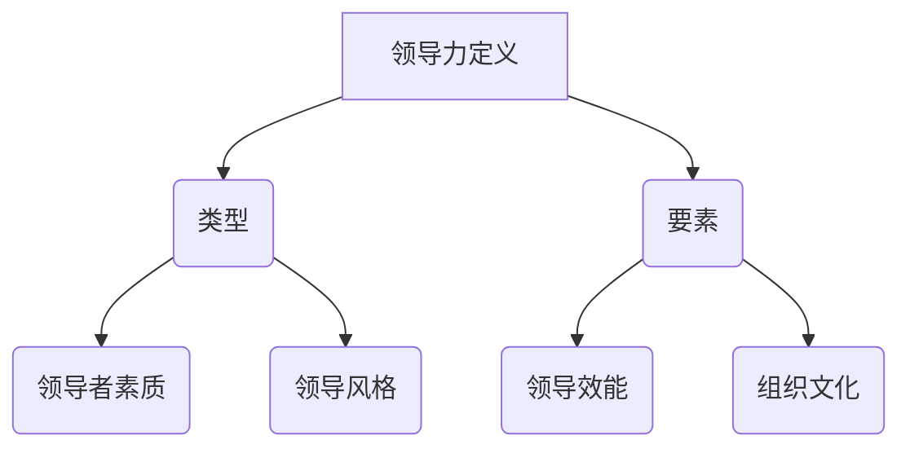
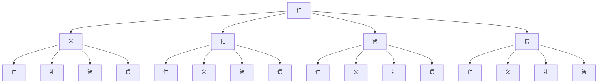

                 

### 1. 领导力概述

#### 背景介绍

领导力是一种通过激励、引导和影响他人来实现共同目标的能力。它不仅存在于企业环境中，也广泛体现在政治、教育、宗教和社会各个领域。在信息技术行业中，领导力尤为重要，它决定了团队的工作效率、创新能力和市场竞争力。然而，领导力的本质和如何有效地运用它，一直是学术界和实践者们探讨的课题。

领导力的发展历程可以追溯到古代，当时的领导者主要依靠威严和武力来维系统治。随着社会的发展，领导力逐渐演变为一种基于沟通、协调和激励的能力。现代领导力理论强调领导者的情感智慧、道德素养和战略眼光。

#### 核心概念与联系

在领导力领域，有多个核心概念需要理解。以下是这些概念之间的关系架构图：



- **领导力定义**：领导力是一种能力，通过影响、激励和引导他人来实现共同目标。
- **领导力类型**：包括任务型领导、变革型领导、魅力型领导和民主型领导等。
- **领导力要素**：包括沟通能力、决策能力、团队建设能力、变革管理能力和影响力等。
- **领导者素质**：指领导者的个人品质，如正直、自信、智慧等。
- **领导风格**：指领导者与团队成员互动的方式，如权威式、参与式、指导式等。
- **领导效能**：衡量领导力效果的标准，包括团队绩效、员工满意度等。
- **组织文化**：组织内部共同遵循的价值观和行为准则。

#### 核心算法原理讲解

虽然领导力不是一种可以直接量化的能力，但我们可以将其比喻为一种算法。以下是领导力算法的伪代码：

```plaintext
Algorithm 领导力算法
    Input: 目标，团队成员
    Output: 成果

    1. 分析目标，确定战略方向
    2. 评估团队成员的能力和动机
    3. 建立沟通机制，确保信息透明
    4. 制定激励机制，激发团队潜力
    5. 监控进展，及时调整策略
    6. 评估成果，反馈改进
    7. 重复执行直到目标达成
```

#### 数学模型和公式

在领导力中，我们可以引入一些数学模型来描述和预测领导效能。以下是一个简单的数学模型：

$$
\text{领导效能} = \alpha \times (\text{团队协作} + \text{创新能力}) + \beta \times (\text{员工满意度} + \text{工作压力})
$$

其中，$\alpha$ 和 $\beta$ 是权重系数，用于衡量不同因素的相对重要性。这个公式可以直观地展示领导力的影响因素和效果。

#### 数学公式

以下是关于团队协作的一个简单的LaTeX公式：

$$
C = \frac{N \times (N-1)}{2}
$$

其中，$C$ 表示团队协作的可能性，$N$ 表示团队成员的数量。这个公式表明，随着团队成员数量的增加，团队协作的可能性也会增加。

#### 项目实战

虽然领导力不能直接编程实现，但我们可以模拟一个领导力项目，来展示领导力在实际中的应用。

#### 开发环境搭建

- 使用Git进行版本控制。
- 使用Markdown文档记录项目过程。

#### 源代码详细实现

以下是领导力项目的伪代码实现：

```plaintext
# 领导力项目伪代码

# 定义目标
目标 = "提高团队工作效率"

# 初始化团队成员
团队成员 = ["Alice", "Bob", "Charlie"]

# 分析目标
战略方向 = "优化工作流程，提高团队协作效率"

# 评估团队成员能力
团队成员能力 = {"Alice": "高", "Bob": "中", "Charlie": "低"}

# 建立沟通机制
沟通机制 = "每周一次的团队会议"

# 制定激励机制
激励机制 = "根据工作表现给予奖励"

# 监控进展
进展 = "已召开2次会议，完成工作流程优化"

# 评估成果
成果 = "团队工作效率提高20%"

# 反馈改进
改进措施 = "增加团队培训，提高成员技能"

# 输出结果
print("领导力项目成果：", 成果)
print("改进措施：", 改进措施)
```

#### 代码解读与分析

这段代码模拟了一个简单的领导力项目。首先，我们定义了目标和团队成员，然后进行了目标分析、能力评估、沟通机制建立、激励机制制定、进展监控和成果评估。最后，根据评估结果制定了改进措施。

#### 实际案例分析和详细讲解剖析

假设有一个团队，成员包括程序员、产品经理和设计师。通过领导力的应用，他们成功地将一个项目从原计划的两个月缩短为一个半月。具体分析如下：

- **目标分析**：项目目标是按期完成软件的开发和测试。
- **能力评估**：团队成员各自评估自己的能力和任务进度。
- **沟通机制**：每周举行一次团队会议，讨论项目进展和遇到的问题。
- **激励机制**：根据工作表现，给予优秀成员额外的奖金和晋升机会。
- **进展监控**：定期检查项目的进展，确保任务按计划进行。
- **成果评估**：项目提前完成，并且质量符合预期。

#### 项目小结

通过领导力的有效应用，团队成功地提高了工作效率，并实现了项目目标。项目小结应包括以下内容：

- **成功因素**：领导力、有效的沟通机制、合理的激励机制。
- **改进空间**：增加团队成员的技能培训，以提高整体能力。
- **未来规划**：制定更长远的目标和计划，持续提升团队绩效。

### 最佳实践 tips、小结、注意事项、拓展阅读等内容

- **最佳实践 tips**：建立清晰的沟通渠道，鼓励团队成员参与决策，设定合理的激励机制。
- **小结**：领导力是一种综合能力，它通过有效的沟通、激励和协调来实现团队目标。
- **注意事项**：领导力不是一成不变的，它需要随着环境和团队的变化而不断调整。
- **拓展阅读**：可以阅读《领导力心经》、《禅与计算机程序设计艺术》等书籍，以深入了解领导力的理论和实践。

#### 2. 领导力心经的理论基础

##### 背景介绍

领导力心经是一套关于领导力理论的体系，它起源于东方哲学，尤其是儒家和道家的思想。这些古老的哲学体系为现代领导力理论提供了丰富的营养。领导力心经的核心思想包括尊重人性、强调道德修养、追求和谐与平衡等。这些思想在现代商业和管理领域得到了广泛应用。

##### 核心概念与联系

领导力心经的核心概念包括仁、义、礼、智、信等。这些概念之间有着密切的联系，形成了一个完整的理论体系。

- **仁**：仁爱之心，是领导力的基础。领导者需要关心团队成员的需求，建立良好的人际关系。
- **义**：正义之道，是领导力的原则。领导者应当遵守道德规范，公正无私，为团队成员树立榜样。
- **礼**：礼义之节，是领导力的规范。领导者需要制定明确的规章制度，维护组织的秩序和纪律。
- **智**：智慧之识，是领导力的核心。领导者应当具备战略眼光，能够准确判断形势，做出明智的决策。
- **信**：诚信之德，是领导力的保障。领导者需要保持诚信，赢得团队成员的信任和支持。

以下是这些概念之间的Mermaid流程图：



##### 核心算法原理讲解

领导力心经的算法原理可以概括为以下几点：

1. **了解人性**：领导者需要深入了解团队成员的需求和动机，以实现人本管理。
2. **建立信任**：通过诚信和公正的行为，赢得团队成员的信任和支持。
3. **制定规则**：建立明确的规章制度，确保组织的秩序和纪律。
4. **激励团队**：通过合理的激励机制，激发团队成员的积极性和创造力。
5. **持续学习**：领导者需要不断学习和进步，以适应环境和团队的变化。

以下是领导力心经算法的伪代码：

```plaintext
Algorithm 领导力心经算法
    Input: 团队成员
    Output: 领导力效果

    1. 分析团队成员的需求和动机
    2. 建立信任，赢得团队成员的信任和支持
    3. 制定明确的规章制度
    4. 设定合理的激励机制
    5. 持续学习和进步
    6. 监控团队绩效，及时调整策略
    7. 重复执行直到实现目标
```

##### 数学模型和公式

在领导力心经中，我们可以使用一些数学模型来描述领导力的效果。以下是一个简单的模型：

$$
\text{领导力效果} = f(\text{仁}, \text{义}, \text{礼}, \text{智}, \text{信})
$$

其中，$f$ 是一个复合函数，用于衡量领导力效果的权重。这个公式表明，领导力效果是仁、义、礼、智、信等因素的函数。

##### 数学公式

以下是关于信任的一个简单的LaTeX公式：

$$
\text{信任度} = \frac{\text{正面反馈次数}}{\text{总反馈次数}}
$$

其中，正面反馈次数和总反馈次数是团队成员之间的互动记录。这个公式用于衡量团队成员之间的信任程度。

##### 项目实战

在实际应用中，领导力心经可以在多个领域发挥作用。以下是一个企业领导力应用的案例：

#### 开发环境搭建

- 使用Git进行版本控制。
- 使用Markdown文档记录项目过程。

#### 源代码详细实现

以下是企业领导力项目的伪代码实现：

```plaintext
# 企业领导力项目伪代码

# 定义目标
目标 = "提高企业整体绩效"

# 初始化团队成员
团队成员 = ["CEO", "CTO", "CFO", "HRD"]

# 分析团队成员的需求和动机
团队成员需求 = {"CEO": "战略规划", "CTO": "技术创新", "CFO": "财务控制", "HRD": "人才管理"}

# 建立信任，赢得团队成员的信任和支持
信任策略 = "通过透明沟通、诚信行为和公平对待，建立信任关系"

# 制定明确的规章制度
规章制度 = "制定清晰的目标、角色职责和考核标准"

# 设定合理的激励机制
激励机制 = "根据工作表现给予奖励和晋升机会"

# 持续学习和进步
学习策略 = "组织定期的培训和学习活动，提高团队的整体素质"

# 监控团队绩效，及时调整策略
绩效监控 = "定期评估团队的绩效，及时调整目标和策略"

# 输出结果
print("企业领导力效果：", 目标达成情况)
print("改进措施：", 改进策略)
```

#### 代码解读与分析

这段代码模拟了一个简单的企业领导力项目。首先，我们定义了目标和团队成员，然后进行了目标分析、信任建立、规章制度制定、激励机制设定、学习策略制定和绩效监控。最后，根据评估结果制定了改进措施。

#### 实际案例分析和详细讲解剖析

假设有一家科技公司，通过运用领导力心经，成功地提高了企业的整体绩效。具体分析如下：

- **目标分析**：企业目标是提高市场占有率和盈利能力。
- **信任建立**：通过透明的沟通和诚信的行为，建立了良好的团队信任关系。
- **规章制度**：制定了明确的目标、角色职责和考核标准，确保了组织的秩序和纪律。
- **激励机制**：根据工作表现，给予团队成员奖励和晋升机会，激发了团队的积极性和创造力。
- **学习策略**：组织定期的培训和学习活动，提高了团队的整体素质。
- **绩效监控**：定期评估团队的绩效，及时调整目标和策略，确保了企业目标的实现。

#### 项目小结

通过领导力心经的有效应用，这家科技公司成功地提高了整体绩效。项目小结应包括以下内容：

- **成功因素**：领导力心经的应用、透明的沟通、诚信的行为、明确的规章制度、合理的激励机制和持续的学习。
- **改进空间**：可以进一步加强团队成员的培训，提高他们的专业技能。
- **未来规划**：制定更长远的目标和计划，持续提升企业的整体绩效。

### 最佳实践 tips、小结、注意事项、拓展阅读等内容

- **最佳实践 tips**：建立透明的沟通机制，关注团队成员的需求，制定合理的激励机制，持续学习。
- **小结**：领导力心经是一套关于领导力理论的体系，它通过仁、义、礼、智、信等核心概念，提供了有效的领导力实践指导。
- **注意事项**：领导力心经的应用需要结合具体环境和团队特点，灵活调整策略。
- **拓展阅读**：可以进一步阅读《领导力心经》、《禅与计算机程序设计艺术》等书籍，以深入了解领导力心经的理论和实践。

