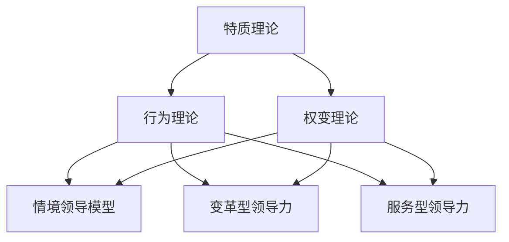

                 

## 文章标题：领导力心经：成就一流企业的领导者法则

### 关键词：领导力、企业管理、企业战略、领导者法则、团队建设

### 摘要：
本文旨在深入探讨企业领导力在成就一流企业中的关键作用。通过系统分析领导力的定义、类型、核心技能以及在实际应用中的实践指导，本文将揭示一流企业领导者所遵循的法则。文章以逻辑清晰、结构紧凑的方式，运用技术语言和专业分析，帮助读者理解领导力的本质和提升领导力的重要性。文章还将通过实际案例和实战指导，为读者提供实用的领导力提升策略，助力企业实现卓越发展。

----------------------------------------------------------------

### 引言：领导力在当代企业中的重要性

在当今快速变化和高度竞争的商业环境中，企业的成功与否越来越依赖于领导者的能力。领导力不仅是推动企业发展的核心动力，更是塑造企业文化、凝聚团队力量、制定战略决策的关键因素。随着全球化、技术变革以及市场需求的不断变化，企业领导者面临着前所未有的挑战，如何在这一复杂多变的环境中脱颖而出，成为了领导力研究的重要课题。

#### 领导力的定义与作用

领导力可以定义为影响、激励和引导他人实现共同目标的能力。它不仅仅涉及个人的领导技能，还涵盖了对组织环境的感知、对团队成员的理解以及对战略方向的把握。领导力在企业管理中的作用主要体现在以下几个方面：

1. **塑造企业文化**：领导者的行为和价值观对企业的文化氛围有着深远的影响。一流的领导者通过树立积极向上的价值观，推动企业文化的建设，从而增强企业的凝聚力和竞争力。
   
2. **驱动企业战略**：领导者是制定和执行企业战略的关键人物。他们需要根据市场环境和内部资源，制定切实可行的战略计划，并确保团队全力以赴地执行。

3. **激励和培养团队**：领导者需要激发团队成员的潜力，培养他们的能力和积极性。通过有效的沟通和激励机制，领导者能够建立一个高效、协作的团队，推动企业的持续发展。

4. **应对危机和挑战**：在面临市场波动、竞争压力或其他危机时，领导者的决策和领导能力对企业的生存和发展至关重要。卓越的领导者能够迅速做出决策，带领团队走出困境。

#### 当代企业面临的挑战

在当前的商业环境中，企业领导者面临着多种挑战：

1. **技术变革**：随着人工智能、大数据、区块链等技术的快速发展，企业需要领导者具备前瞻性的技术视野，以引领企业进行技术创新和业务模式转型。

2. **全球化竞争**：全球化带来了更多的市场机遇，但同时也加剧了竞争压力。企业领导者需要具备全球化视野，灵活应对跨国经营的挑战。

3. **员工多样化**：现代企业的员工背景多样化，包括年龄、性别、文化、经验和技能等方面的差异。领导者需要具备包容性和多样性管理能力，激发员工潜能。

4. **持续创新**：在快速变化的市场中，企业需要不断创新以保持竞争力。领导者必须具备推动创新的能力，鼓励团队不断探索新的业务领域和技术应用。

#### 领导力在企业管理中的重要性

领导力在企业管理中的重要性体现在以下几个方面：

1. **提升企业绩效**：卓越的领导力能够提升企业的整体绩效，通过有效的管理和激励机制，提高员工的工作效率和创新能力。

2. **构建竞争优势**：领导者的战略眼光和决策能力有助于构建企业的核心竞争力，使其在激烈的市场竞争中脱颖而出。

3. **促进团队协作**：领导者的沟通能力和团队管理能力有助于建立高效的团队协作机制，推动企业的协调发展。

4. **培养接班人**：领导者不仅需要管理现有团队，还需要培养未来的领导者，确保企业后继有人才。

总之，领导力是现代企业成功的关键因素之一。通过系统研究和实践领导力，企业领导者可以更好地应对挑战，实现企业的长期发展目标。

### 领导力理论的发展

领导力理论的发展经历了多个阶段，从古典理论到现代理论，每一种理论都为我们理解领导力提供了不同的视角。在这一部分，我们将回顾领导力理论的发展历程，并分析各种领导力理论的核心观点和适用场景。

#### 古典领导力理论

古典领导力理论主要关注领导者的个人特质和行为，认为领导者的特质和能力是决定领导效果的关键因素。以下是一些主要的古典领导力理论：

1. **特质理论**（Trait Theory）：特质理论认为领导者具有一系列固定的特质，如自信、决策力、魅力等，这些特质使他们能够成功领导团队。研究者通过问卷调查和实验方法，试图识别出这些特质。

   **伪代码**：
   ```
   def identify_leader_traits():
       survey_data = collect_survey_data()
       traits = analyze_survey_data(survey_data)
       return traits
   ```

2. **行为理论**（Behavioral Theory）：行为理论关注领导者的行为和领导风格，认为领导效果不仅仅取决于领导者的个人特质，还取决于他们的行为方式。行为理论提出了多种领导风格，如专制型、民主型、放任型等。

   **伪代码**：
   ```
   def identify_leader_behavior():
       behavior_data = observe_leader_behavior()
       styles = classify_styles(behavior_data)
       return styles
   ```

#### 现代领导力理论

现代领导力理论更加注重领导过程和情境因素，认为领导效果受到多种因素的影响，包括领导者、团队成员和组织环境。以下是一些现代领导力理论：

1. **权变理论**（Contingency Theory）：权变理论认为没有一种单一的领导风格适合所有情况。领导者需要根据具体情境选择合适的领导风格，以实现最佳领导效果。

   **伪代码**：
   ```
   def select_leader_style(context):
       if context.is_high_structure():
           style = "authoritative"
       elif context.is_high_task():
           style = "task-oriented"
       else:
           style = "participative"
       return style
   ```

2. **情境领导模型**（Situational Leadership Model）：情境领导模型由赫赛和布兰查德提出，认为领导者的效果取决于领导风格和下属成熟度之间的关系。领导者需要根据下属的成熟度选择不同的领导风格。

   **伪代码**：
   ```
   def select_situation Leadership_STYLE(subordinate_maturity):
       if subordinate_maturity.is_very_mature():
           style = "delegating"
       elif subordinate_maturity.is_mature():
           style = "supporting"
       elif subordinate_maturity.is_undeveloped():
           style = "directing"
       else:
           style = "coaching"
       return style
   ```

3. **变革型领导力**（Transformational Leadership）：变革型领导力强调领导者通过激励和启发下属来实现变革。领导者通过愿景激励、个性化关注和积极榜样作用，推动团队实现卓越表现。

   **伪代码**：
   ```
   def transformational_leadership(team):
       vision = define_vision()
       inspire = inspire_team(vision)
       empower = empower_team()
       model = lead_by_example()
       return inspire, empower, model
   ```

4. **服务型领导力**（Servant Leadership）：服务型领导力认为领导者的首要任务是服务团队成员，帮助其实现个人和职业发展。领导者通过倾听、协调和支持，建立信任和合作关系，推动组织的长期发展。

   **伪代码**：
   ```
   def servant_leadership(team):
       listen = listen_to_team()
       empathize = empathize_with_team()
       serve = serve_team_needs()
       develop = develop_team_members()
       collaborate = collaborate_with_team()
       return listen, empathize, serve, develop, collaborate
   ```

#### 领导力理论之间的关系架构

各种领导力理论之间存在着一定的联系和区别。古典理论主要关注领导者的个人特质和领导行为，而现代理论更加注重领导过程和情境因素。以下是一个简单的 Mermaid 流程图，展示了不同领导力理论之间的关系：



通过分析不同领导力理论的发展，我们可以更好地理解领导力的本质和复杂性。在实践过程中，企业领导者需要结合具体情境，灵活运用不同理论，以实现最佳领导效果。

### 不同类型的领导力

领导力不仅涉及个人的能力，还包括多种领导风格和策略。根据领导者的行为、目标和方法，我们可以将领导力分为不同类型。以下是几种主要类型的领导力及其核心特点。

#### 交易型领导力

交易型领导力（Transactional Leadership）是一种基于交易原则的领导风格，领导者通过明确奖惩机制来激励和引导下属。交易型领导力强调达成目标的重要性，领导者通过奖励来激励下属完成任务，并通过惩罚来纠正不良行为。

**核心特点**：
- **目标导向**：交易型领导者专注于实现具体的目标和任务。
- **奖惩机制**：领导者通过奖励来激励积极行为，通过惩罚来纠正消极行为。
- **明确规范**：交易型领导者制定明确的规范和标准，确保团队成员了解期望和责任。

**适用场景**：
交易型领导力适用于需要高效执行和明确目标的企业和组织，特别是在紧急情况下或执行标准化流程时尤为有效。

**伪代码**：
```
def transactional_leadership(team, goals):
    for member in team:
        if member_meets_goals(member, goals):
            reward_member(member)
        else:
            correct_member_behavior(member)
    return team
```

#### 变革型领导力

变革型领导力（Transformational Leadership）强调领导者的愿景和影响力，通过激励和启发下属来实现组织变革。变革型领导者关注长远发展，通过创新思维和愿景激励，推动团队超越既定目标。

**核心特点**：
- **愿景激励**：变革型领导者拥有明确的愿景，并通过愿景激励团队。
- **个性化关注**：领导者关注每个团队成员的个人需求，提供个性化支持。
- **积极榜样**：领导者通过自身行为树立榜样，激励团队成员效仿。

**适用场景**：
变革型领导力适用于需要创新和变革的组织，特别是在面临重大转型或发展新业务时。

**伪代码**：
```
def transformational_leadership(team, vision):
    inspire_team(vision)
    for member in team:
        provide_individual_support(member)
    lead_by_example()
    return team
```

#### 情境型领导力

情境型领导力（Situational Leadership）认为没有一种固定的领导风格适合所有情况。领导者需要根据团队成员的成熟度和具体情境，灵活调整领导风格。

**核心特点**：
- **情境适应性**：领导者根据团队成员的成熟度和任务需求，选择合适的领导风格。
- **授权**：在适当的情境下，领导者授权团队成员自主决策和行动。
- **支持与指导**：在团队成员成熟度较低时，领导者提供必要的指导和支持。

**适用场景**：
情境型领导力适用于多样化的团队和复杂多变的工作环境，特别适用于需要灵活应对变化的情况。

**伪代码**：
```
def situational_leadership(team, member_maturity, task):
    if member_maturity.is_high():
        style = "delegating"
    elif member_maturity.is_medium():
        style = "supporting"
    else:
        style = "directing"
    if task.is_complex():
        provide_guidance(team)
    else:
        delegate_task(team)
    return team
```

#### 领导力的核心技能

领导力不仅仅是领导者的个人特质，还包括一系列关键技能。这些技能帮助领导者有效管理团队、推动企业发展和实现战略目标。以下是几种核心的领导力技能及其在领导过程中的应用。

#### 沟通与协调

有效的沟通是领导者成功的关键。良好的沟通技能可以帮助领导者与团队成员建立信任，确保信息传递准确无误。以下是一些沟通与协调的关键点：

1. **倾听**：领导者需要倾听团队成员的意见和建议，了解他们的需求和困扰。

   **伪代码**：
   ```
   def listen_to_team_members():
       create_an_ambience_of_openness()
       ask_openended_questions()
       validate_and_summarize()
   ```

2. **表达**：领导者需要清晰、明确地表达自己的思想和意图，确保团队成员理解。

   **伪代码**：
   ```
   def communicate_clearly(message):
       use_plain_language()
       be_specific_and_organised()
       check_for_understanding()
   ```

3. **协调**：领导者需要协调团队成员的工作，确保各方的努力能够协同一致。

   **伪代码**：
   ```
   def coordinate_teams():
       define_clear_goals()
       assign_responsibilities()
       facilitate_communication()
   ```

#### 决策与战略

决策和战略是领导者的核心职责。领导者需要根据企业目标和外部环境，制定有效的决策和战略计划。以下是决策与战略的关键点：

1. **收集信息**：领导者需要收集和分析与决策相关的各种信息。

   **伪代码**：
   ```
   def collect_information():
       gather_data()
       perform_analytical_models()
       evaluate_impact()
   ```

2. **制定战略**：领导者需要制定长期的战略计划，确保企业能够实现长远发展。

   **伪代码**：
   ```
   def develop_strategy():
       define_core_vision()
       identify_strategic_goals()
       create_action_plans()
   ```

3. **执行决策**：领导者需要确保战略计划能够得到有效执行。

   **伪代码**：
   ```
   def execute_decision():
       allocate_resources()
       monitor_progress()
       take corrective_actions()
   ```

#### 创新与变革

创新和变革是推动企业持续发展的重要动力。领导者需要具备推动创新和应对变革的能力。以下是创新与变革的关键点：

1. **激发创新思维**：领导者需要鼓励团队成员提出新的想法，并为他们提供实验和试错的机会。

   **伪代码**：
   ```
   def encourage_innovation():
       create_an_innovative_culture()
       provide_resources_for_exploration()
       reward_innovative_ideas()
   ```

2. **推动变革**：领导者需要带领团队适应变革，确保变革能够顺利实施。

   **伪代码**：
   ```
   def drive_change():
       communicate_the_why()
       involve_team_members()
       address_resistance()
   ```

3. **变革管理**：领导者需要制定有效的变革管理策略，确保变革能够成功落地。

   **伪代码**：
   ```
   def manage_change():
       define_change_strategy()
       communicate_changes()
       provide_support()
   ```

通过掌握这些核心技能，领导者可以更好地管理团队、推动企业发展，并在复杂多变的环境中保持竞争力。

### 领导力在企业管理中的应用

在企业管理中，领导力不仅是推动企业发展的核心动力，也是实现战略目标和确保团队高效运作的关键因素。以下将详细探讨领导力在团队建设、人才选拔与培养、以及企业文化塑造方面的具体应用。

#### 团队建设与管理

团队建设是领导者的重要职责之一。一个高效的团队不仅能够提升工作效率，还能增强企业的创新能力和竞争力。以下是领导者在团队建设与管理中应关注的关键点：

1. **明确团队目标**：领导者需要与团队成员共同制定明确的目标和期望，确保每个成员都了解自己的职责和贡献。

   **伪代码**：
   ```
   define_team_goals(team_members):
       for member in team_members:
           discuss_goals(member)
           document_contributions()
       set_common_objectives()
   ```

2. **培养团队协作精神**：领导者应通过多种方式培养团队协作精神，例如组织团队建设活动、设置跨部门项目等。

   **伪代码**：
   ```
   cultivate_collaboration(team_members):
       organize_team_building_activities()
       assign_cross-functional_projects()
       encourage_open_communication()
   ```

3. **优化团队结构**：领导者应根据工作需求和市场变化，适时调整团队结构，确保团队能够高效运作。

   **伪代码**：
   ```
   optimize_team_structure(team):
       assess_workload()
       adjust_team_size()
       realign_skills_and_roles()
   ```

#### 人才选拔与培养

人才是企业最宝贵的资源。领导者需要具备敏锐的洞察力，选拔出有能力、有潜力的人才，并通过有效的培养策略，提升他们的能力和素质。以下是领导者在人才选拔与培养中应关注的关键点：

1. **选拔人才**：领导者应通过多种渠道选拔人才，包括内部推荐、外部招聘、人才市场等。

   **伪代码**：
   ```
   select_talent():
       define_skill_requirements()
       screen_applicants()
       conduct_interviews()
       evaluate_potential()
   ```

2. **培养人才**：领导者应制定系统的培养计划，为员工提供培训机会、项目经验和个人指导。

   **伪代码**：
   ```
   develop_talent(employee):
       identify_training_needs()
       assign_mentors()
       provide_project_experience()
       monitor_progress()
   ```

3. **激励人才**：领导者应通过绩效激励、职业发展、荣誉奖励等多种方式，激发员工的积极性和创造力。

   **伪代码**：
   ```
   motivate_talent(employee):
       set_clear-performance_goals()
       provide_feedback()
       offer职业发展路径()
       recognize_achievements()
   ```

#### 企业文化建设

企业文化是企业的灵魂，对员工的行为和价值观有着深远的影响。领导者需要塑造积极向上的企业文化，提升员工的归属感和工作满意度。以下是领导者在企业文化建设中应关注的关键点：

1. **确立企业价值观**：领导者应与员工共同确立企业的核心价值观，并确保这些价值观能够体现在日常工作中。

   **伪代码**：
   ```
   establish_enterprise_values():
       engage_employees_in_discussion()
       define_shared_values()
       integrate_values_into_daily_work()
   ```

2. **营造积极氛围**：领导者应通过多种方式营造积极的工作氛围，例如组织团队活动、鼓励创新思维、提供反馈和支持等。

   **伪代码**：
   ```
   create_positive_ambience():
       organize_team_activities()
       encourage_innovation()
       provide_feedback_and_support()
   ```

3. **传播企业文化**：领导者应通过内部沟通、外部展示等方式，广泛传播企业文化，提升员工的认同感和自豪感。

   **伪代码**：
   ```
   communicate_culture():
       develop_communication_channels()
       showcase_culture_in_actions()
       integrate_culture_into_strategy()
   ```

通过在团队建设、人才选拔与培养、以及企业文化塑造方面的有效应用，领导者可以提升企业的整体绩效，推动企业实现长期发展目标。

### 领导力技能提升实战

在现实工作中，提升领导力技能不仅需要理论学习，更需要通过实际操作和实战锻炼。以下将通过案例分析、领导力训练方法、自我评估与提升，详细探讨领导力技能的提升路径。

#### 案例研究：优秀领导力的实践

为了更好地理解领导力在实践中的应用，我们可以分析一些成功的企业案例。以下是一个关于优秀领导力的实际案例：

**案例：谷歌的领导力文化**

谷歌（Google）以其独特的企业文化和卓越的领导力而闻名。其前首席执行官拉里·佩奇（Larry Page）和谢尔盖·布林（Sergey Brin）通过以下几方面实践了卓越的领导力：

1. **愿景激励**：佩奇和布林共同确立了谷歌的使命：“整合全球信息，使人人都能访问并从中受益”。这一愿景激励着谷歌的员工不断创新，追求卓越。

2. **员工赋能**：谷歌鼓励员工自由探索和尝试新的项目，这种自主权激发了员工的创造力和创新精神。

3. **透明沟通**：谷歌内部建立了高效的沟通机制，如员工反馈会议和内部邮件系统，确保信息透明和及时传达。

4. **团队合作**：谷歌强调跨部门的合作，通过组织团队项目，培养员工的团队合作精神。

通过这些实践，谷歌不仅成为了一家技术领先的企业，也成为了领导力的典范。

#### 领导力训练方法

提升领导力技能，可以通过多种训练方法进行系统学习和实践。以下是一些常见的领导力训练方法：

1. **工作坊和研讨会**：参加领导力工作坊和研讨会，可以帮助领导者学习最新的领导力理论和实践经验。

2. **在线课程**：通过在线平台，如Coursera、edX等，领导者可以学习各种领导力课程，获取系统的知识体系。

3. **角色扮演**：通过角色扮演，领导者可以模拟实际工作场景，锻炼解决问题的能力和沟通技巧。

4. **教练辅导**：专业教练可以提供个性化的指导，帮助领导者识别自身的优势和不足，制定个性化的提升计划。

5. **实战演练**：将领导力理论应用到实际工作中，通过实战演练，不断提升领导能力。

#### 自我评估与提升

自我评估是提升领导力的重要步骤。以下是一些自我评估的方法：

1. **360度反馈**：通过同事、下属和上级的反馈，了解自己的领导风格和存在的问题。

2. **自我反思**：定期进行自我反思，思考自己在工作中的表现和改进空间。

3. **能力评估**：通过专业的能力评估工具，如MBTI、DISC等，了解自己的领导风格和优势。

4. **制定提升计划**：根据自我评估的结果，制定具体的提升计划，包括学习目标、行动步骤和时间表。

通过案例研究、领导力训练方法和自我评估，领导者可以不断提升自身的领导力技能，实现个人和团队的成长。

### 领导力在面对危机时的应对策略

在快速变化的商业环境中，企业领导者不可避免地会面临各种危机。危机管理是领导者的一项关键能力，它直接影响到企业的生存和发展。以下是领导力在面对危机时的一些关键策略。

#### 危机管理的领导力

危机管理不仅仅是一种应对突发事件的策略，更是一种系统性的领导力。有效的危机管理需要领导者具备以下几个方面的能力：

1. **快速响应**：领导者需要在危机发生的第一时间做出快速反应，制定应对方案。快速响应可以减少危机的负面影响，并为后续处理赢得宝贵的时间。

2. **清晰沟通**：在危机管理过程中，领导者需要与内部团队和外部利益相关者保持清晰、及时的沟通。通过有效的沟通，领导者可以稳定团队情绪，减少恐慌，同时增强对外界的透明度。

3. **决策果断**：危机往往需要领导者做出快速而果断的决策。领导者需要根据现有的信息，迅速评估形势，选择最合适的应对策略。

4. **资源整合**：领导者需要整合企业内外部资源，包括人力、物力和信息，确保危机管理工作的顺利进行。

#### 应对突发事件的策略

在应对突发事件时，领导者可以采取以下策略：

1. **风险评估**：在危机发生前，领导者应进行风险识别和评估，制定相应的应急预案。这有助于在危机发生时，迅速启动应急机制。

2. **信息收集**：及时收集和评估与危机相关的信息，包括事件的起因、影响范围、可能的后果等。这有助于领导者做出准确的判断和决策。

3. **问题解决**：针对危机的具体问题，制定具体的解决方案。解决方案应包括短期应对措施和长期解决方案，以减轻危机的影响并防止类似事件再次发生。

4. **心理疏导**：在危机期间，领导者需要关注团队成员的心理状态，提供心理疏导和支持，确保团队保持稳定和积极的态度。

#### 企业危机后的重建

危机过后，企业需要进入重建阶段。以下是企业危机后的重建策略：

1. **评估影响**：对危机的影响进行全面的评估，包括财务、运营、员工心理等方面。这有助于企业了解危机带来的损失，为后续的重建工作提供依据。

2. **资源整合**：整合企业内外部资源，包括资金、技术和人力，确保重建工作的顺利进行。

3. **重建战略**：制定详细的重建战略，包括短期目标和长期目标，明确重建的重点和步骤。

4. **员工激励**：通过激励措施，恢复员工的工作热情和信心，确保企业能够迅速恢复运营。

5. **经验总结**：对危机管理过程进行总结，识别成功和不足之处，为未来的危机管理提供经验教训。

通过有效的危机管理策略，企业领导者可以在危机中保持冷静和理性，带领团队走出困境，实现企业的持续发展。

### 领导力相关术语解释

在探讨领导力时，理解相关术语对于深入掌握领导力的概念和理论至关重要。以下是一些常见的领导力相关术语及其解释：

1. **领导力**：领导力是指影响、激励和引导他人实现共同目标的能力。它包括个人特质、行为、情境因素等多个方面。

2. **领导者**：领导者是指在组织中担任领导角色的人，他们通过设定目标、规划策略、激励团队等方式，推动组织发展。

3. **领导风格**：领导风格是指领导者处理和管理团队的方式，包括专制型、民主型、放任型等。

4. **变革型领导力**：变革型领导力是指通过愿景激励、个性化关注和积极榜样作用，推动团队实现变革和卓越表现的领导风格。

5. **服务型领导力**：服务型领导力是指领导者首先关注团队成员的需求，通过倾听、协调和支持，建立信任和合作关系，推动组织发展的领导风格。

6. **团队建设**：团队建设是指通过一系列措施和活动，提高团队成员之间的合作和沟通，建立高效的团队。

7. **情境领导**：情境领导是指领导者根据团队成员的成熟度和具体情境，灵活调整领导风格，以实现最佳领导效果。

8. **权变理论**：权变理论认为没有一种单一的领导风格适合所有情况，领导者需要根据具体情境选择合适的领导风格。

9. **决策过程**：决策过程是指领导者做出决策的步骤和过程，包括信息收集、评估、选择和执行等。

10. **企业文化**：企业文化是指企业在长期经营过程中形成的价值观、行为规范和工作氛围，对员工的行为和价值观有着深远的影响。

通过理解这些术语，读者可以更全面地掌握领导力的核心概念和理论，为实际应用提供指导。

### 推荐阅读与资源

为了更深入地理解和实践领导力，以下是一些建议的阅读材料和资源：

1. **书籍推荐**：
   - 《领导力的五个层次》（The Five Levels of Leadership）——拉尔夫·华尔特斯（Ralph Wilson）
   - 《领导者的语言》（The Language of Leaders）——贾森·贾德森（Jason Jaggard）
   - 《变革之舞：变革型领导力实践》（The Dance of Change）——Warren Bennis 和 Burt Nanus

2. **在线课程**：
   - Coursera上的“领导力与团队管理”（Leadership and Team Management）
   - edX上的“变革型领导力”（Transformational Leadership）

3. **学术论文与期刊**：
   - “领导力：理论与实践”（Leadership: Theory and Practice）——期刊
   - “组织行为学杂志”（Journal of Organizational Behavior）

4. **专业组织与协会**：
   - 国际领导力发展协会（International Leadership Association，ILA）
   - 领导力研究院（Center for Creative Leadership，CCL）

通过这些资源，读者可以进一步扩展对领导力的理解和应用，提升自身的领导力技能。

### 结论：领导力是企业成功的基石

综上所述，《领导力心经：成就一流企业的领导者法则》通过深入探讨领导力的本质、发展历程、不同类型的领导力以及在实际企业管理中的应用，展示了领导力在企业成功中的关键作用。领导力不仅是企业战略的核心驱动力，也是塑造企业文化、激励团队、应对危机和推动创新的重要工具。通过掌握和提升领导力，企业领导者可以更好地应对快速变化的商业环境，实现企业的长期发展目标。

### 附录

#### 领导力相关术语解释

- **领导力**：影响、激励和引导他人实现共同目标的能力。
- **领导者**：在组织中担任领导角色的人。
- **领导风格**：领导者处理和管理团队的方式。
- **变革型领导力**：通过愿景激励、个性化关注和积极榜样作用，推动团队实现变革和卓越表现的领导风格。
- **服务型领导力**：领导者首先关注团队成员的需求，通过倾听、协调和支持，建立信任和合作关系，推动组织发展的领导风格。
- **团队建设**：通过一系列措施和活动，提高团队成员之间的合作和沟通，建立高效的团队。
- **情境领导**：领导者根据团队成员的成熟度和具体情境，灵活调整领导风格，以实现最佳领导效果。
- **权变理论**：认为没有一种单一的领导风格适合所有情况，领导者需要根据具体情境选择合适的领导风格。
- **决策过程**：领导者做出决策的步骤和过程。
- **企业文化**：企业在长期经营过程中形成的价值观、行为规范和工作氛围。

#### 推荐阅读与资源

- **书籍推荐**：
  - 《领导力的五个层次》——拉尔夫·华尔特斯
  - 《领导者的语言》——贾森·贾德森
  - 《变革之舞：变革型领导力实践》——Warren Bennis 和 Burt Nanus

- **在线课程**：
  - Coursera上的“领导力与团队管理”
  - edX上的“变革型领导力”

- **学术论文与期刊**：
  - “领导力：理论与实践”期刊
  - “组织行为学杂志”期刊

- **专业组织与协会**：
  - 国际领导力发展协会（ILA）
  - 领导力研究院（CCL）

通过这些资源，读者可以进一步扩展对领导力的理解和应用，提升自身的领导力技能。感谢大家的阅读，希望本文能对您在领导力提升方面有所启发。作者：AI天才研究院/AI Genius Institute & 禅与计算机程序设计艺术 /Zen And The Art of Computer Programming。

