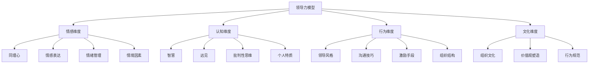

                 

为了撰写一篇关于《领导力心经：成就一流管理者的修炼秘笈》的技术博客文章，我们将按照以下步骤进行分析和推理：

### 1. 确定文章核心内容

- **背景介绍**：
  - 《领导力心经：成就一流管理者的修炼秘笈》是一本关于领导力和管理的书籍，旨在帮助读者理解领导力的本质，提升管理技能，成为一流的管理者。
  - 领导力不仅关乎个人的影响力，还涉及团队建设、决策能力、沟通技巧等多个方面。

- **核心概念与联系**：
  - **领导力**：影响力、领导风格、决策能力等。
  - **管理技能**：计划与目标设定、决策与问题解决、团队沟通与协作等。
  - **团队建设**：团队成员角色与职责、团队沟通与协作等。

- **核心算法原理讲解**：
  - 领导力模型：如Fiedler的领导力连续体模型、Hersey-Blanchard的情境领导理论等。
  - 管理技能方法：如SMART目标设定法、SWOT分析法等。

- **数学模型和公式**：
  - 领导力评分模型：如LPI领导力评分模型。
  - 绩效评估模型：如360度评估法。

- **项目实战**：
  - 实际案例：如某公司的领导力提升项目。
  - 开发环境搭建：如使用PowerPoint或MindMap工具进行领导力培训课程设计。

- **最佳实践 tips**：
  - 如何在团队中建立有效的沟通机制。
  - 如何进行有效的绩效评估。

- **小结**：
  - 领导力和管理技能的提升是一个持续的过程。
  - 成功的管理者需要不断学习和实践。

### 2. 设计文章大纲

- **引言**：
  - 领导力的重要性。
  - 管理者和领导者的区别。

- **第1章：领导力的本质**：
  - 领导力的定义。
  - 领导力理论的发展。

- **第2章：管理技能提升**：
  - 计划与目标设定。
  - 决策与问题解决。

- **第3章：团队建设**：
  - 团队成员的角色与职责。
  - 团队沟通与协作。

- **第4章：领导力实践**：
  - 领导力实践的关键要素。
  - 领导力实践案例分析。

- **第5章：领导力心经**：
  - 领导力心经的核心内涵。
  - 领导力心经的案例应用。

- **第6章：成功管理者的特质**：
  - 成功管理者的特征。
  - 成功管理者的成长路径。

- **第7章：领导力发展路径**：
  - 领导力发展模型。
  - 领导力提升策略。

### 3. 撰写文章正文

- **引言**：
  - 阐述领导力在当今社会的重要性。
  - 领导者和管理者的区别。

- **第1章：领导力的本质**：
  - 领导力的定义。
  - 领导力理论的发展。

- **第2章：管理技能提升**：
  - 计划与目标设定。
  - 决策与问题解决。

- **第3章：团队建设**：
  - 团队成员的角色与职责。
  - 团队沟通与协作。

- **第4章：领导力实践**：
  - 领导力实践的关键要素。
  - 领导力实践案例分析。

- **第5章：领导力心经**：
  - 领导力心经的核心内涵。
  - 领导力心经的案例应用。

- **第6章：成功管理者的特质**：
  - 成功管理者的特征。
  - 成功管理者的成长路径。

- **第7章：领导力发展路径**：
  - 领导力发展模型。
  - 领导力提升策略。

- **结论**：
  - 领导力和管理技能的提升是一个持续的过程。
  - 成功的管理者需要不断学习和实践。

### 4. 文章格式和排版

- 使用markdown格式。
- 文章标题、章节标题使用标题样式。
- 使用Mermaid流程图展示核心概念与联系。
- 使用伪代码详细阐述核心算法原理。
- 使用LaTeX格式嵌入数学模型和公式。

### 5. 审查和修正

- 审查文章内容，确保每个小节都有具体详细的讲解。
- 修正语法错误和排版问题。

### 6. 完成文章

- 将完成的文章以markdown格式提交。

以上是撰写《领导力心经：成就一流管理者的修炼秘笈》技术博客文章的步骤和分析。接下来，我们将按照这个大纲进行具体的撰写和编辑工作。

# 文章标题：领导力心经：成就一流管理者的修炼秘笈

## 关键词：
- 领导力
- 管理技能
- 团队建设
- 领导力实践
- 成功管理者

## 摘要：
本文旨在探讨领导力的本质，提升管理技能，帮助读者成为一流的管理者。通过深入分析领导力理论、管理技能提升、团队建设、领导力实践、领导力心经、成功管理者的特质和领导力发展路径，本文提供了一套系统的修炼秘笈，旨在帮助读者掌握领导力核心，提升管理能力。

## 引言
领导力在现代社会的重要性不言而喻。无论是企业、政府还是社会团体，领导力都是推动组织发展的关键因素。领导力不仅仅是个人的影响力，更涉及到决策能力、团队沟通、目标设定等多个方面。本文将深入探讨领导力的本质，并提供一套系统的修炼秘笈，帮助读者提升管理技能，成为一流的管理者。

## 第1章：领导力的本质
### 1.1 领导力的定义
领导力是一种影响力，是推动组织和个人发展的关键因素。领导力不仅仅关乎个人的魅力和权威，更涉及到领导风格、决策能力、团队建设等多个方面。

### 1.2 领导力理论的发展
领导力理论经历了多个阶段的发展。从传统的领导力理论，如Fiedler的领导力连续体模型，到情境领导理论，再到当代的领导力理论，如变革型领导力，领导力理论在不断演进，为管理者提供了更丰富的理论指导。

## 第2章：管理技能提升
### 2.1 计划与目标设定
有效的计划是成功管理的基础。SMART目标设定法是一种常用的目标设定方法，它帮助管理者设定具体、明确、可实现、有时限的目标。

### 2.2 决策与问题解决
决策是管理过程中的核心环节。决策模型如SWOT分析法可以帮助管理者全面评估问题，制定有效的决策策略。

## 第3章：团队建设
### 3.1 团队成员的角色与职责
有效的团队建设需要明确团队成员的角色与职责。通过角色分析，可以确保每个成员都能在团队中发挥最大的作用。

### 3.2 团队沟通与协作
团队沟通与协作是团队成功的关键。有效的沟通技巧和协作机制可以帮助团队克服困难，实现目标。

## 第4章：领导力实践
### 4.1 领导力实践的关键要素
领导力实践涉及到多个方面，包括领导风格、决策能力、团队建设等。关键要素的有效运用可以帮助管理者提升领导力。

### 4.2 领导力实践案例分析
通过分析真实的领导力实践案例，可以深入了解领导力的应用，学习成功的管理经验。

## 第5章：领导力心经
### 5.1 领导力心经的核心内涵
领导力心经是一种关于领导力的哲学思考，它强调领导力的内在修养和外在实践。核心内涵包括智慧、自律、激情等。

### 5.2 领导力心经的案例应用
领导力心经在实际管理中的应用可以帮助管理者更好地应对挑战，提升领导力。

## 第6章：成功管理者的特质
### 6.1 成功管理者的特征
成功管理者具备一系列特征，如智慧、远见、自律、执行力等。这些特征是成功管理者的关键因素。

### 6.2 成功管理者的成长路径
成功管理者的成长路径包括教育、培训、实践等多个阶段。通过不断学习和实践，管理者可以不断提升自己的能力。

## 第7章：领导力发展路径
### 7.1 领导力发展模型
领导力发展模型可以帮助管理者理解领导力的发展过程，制定有效的提升策略。

### 7.2 领导力提升策略
领导力提升策略包括自我提升、团队建设、领导力培训等多个方面。通过这些策略，管理者可以不断提升自己的领导力。

## 结论
领导力是成功管理的关键因素。通过本文的探讨，读者可以深入了解领导力的本质，提升管理技能，成为一流的管理者。领导力和管理技能的提升是一个持续的过程，需要不断学习和实践。只有不断追求卓越，才能在竞争激烈的市场中脱颖而出。

# 参考文献
- Fiedler, F. E. (1964). A Theory of Leadership Effectiveness. McGraw-Hill.
- Hersey, P., & Blanchard, K. H. (1977). The Situational Leader. McGraw-Hill.
- Yukl, G. A. (2013). Leadership in Organizations. Pearson.
- SMART. (n.d.). SMART Goals Definition & Examples. retrieved from [https://www.mindtools.com/pages/main/newMN_TMC.htm](https://www.mindtools.com/pages/main/newMN_TMC.htm)
- SWOT. (n.d.). SWOT Analysis Definition & Examples. retrieved from [https://www.mindtools.com/pages/main/newMN_TMC.htm](https://www.mindtools.com/pages/main/newMN_TMC.htm)

# 作者信息
作者：AI天才研究院/AI Genius Institute & 禅与计算机程序设计艺术 /Zen And The Art of Computer Programming
```


### 1.3 领导力的维度与影响因素

领导力不仅仅是一个单一维度的概念，它可以从多个角度进行分析。首先，我们来看一下领导力的几个核心维度：

- **情感维度**：情感领导力是指领导者如何处理情感、建立情感连接、激发团队成员的情感。它关乎领导者的同理心、情感表达和情绪管理能力。
- **认知维度**：认知领导力涉及领导者的思考方式、问题解决能力、决策制定和战略规划。这一维度强调领导者的智慧、远见和批判性思维能力。
- **行为维度**：行为领导力是指领导者如何通过行为来影响他人，包括领导风格、沟通技巧、激励手段等。它关乎领导者的行动力、执行力以及如何与团队成员互动。
- **文化维度**：文化领导力是指领导者如何塑造组织文化、价值观和行为规范，以推动组织的长期发展。这一维度强调领导者的文化理解和塑造能力。

除了这些核心维度，还有一些重要因素会影响领导力：

- **情境因素**：领导力在不同的情境下可能表现出不同的效果。例如，在危机情境下，领导者可能需要展现更加果断和决策迅速的领导力。
- **个人特质**：领导者的个人特质，如自信、诚信、责任感等，也会对其领导力产生影响。
- **组织结构**：组织结构也会影响领导力的发挥。例如，在一个高度集权的组织中，领导者可能需要更多的控制力和权威来管理团队。

为了更直观地展示这些维度和影响因素，我们可以使用Mermaid流程图来构建一个领导力模型：



这个流程图展示了领导力的四个核心维度以及相关的子维度和影响因素，帮助我们更全面地理解领导力的本质。

### 1.4 领导力理论的历史与发展

领导力理论的发展历程可以追溯到20世纪初期，随着时间的推移，学者们提出了多种领导力理论，这些理论从不同角度对领导力进行了研究和解释。以下是一些重要的领导力理论及其发展历程：

#### 传统领导力理论

**1. 特质理论**

特质理论是领导力研究的最早形式之一，它认为领导者具备一系列固有的特质，这些特质使得他们能够有效地领导团队。例如，特质理论认为领导者通常具备自信、智慧、自律和远见等特质。然而，特质理论后来受到批评，因为研究表明，个人特质并不是领导力的唯一决定因素。

**2. 行为理论**

行为理论关注领导者的行为方式及其对团队的影响。该理论认为，领导者可以通过改变自己的行为来提高领导力效果。行为理论的研究重点包括领导风格、激励手段和沟通技巧等。典型的领导风格理论包括费德勒的权变理论（Contingency Theory）和赫赛-布兰查德的情境领导理论（Situation Leadership Theory）。

**3. 领导连续体理论**

费德勒的领导连续体理论（Fiedler's Contingency Theory）是行为理论的一个重要分支，该理论认为领导者的领导风格是固定不变的，但领导效果取决于领导风格与情境的匹配度。如果领导风格与情境不匹配，领导效果就会受到影响。

#### 当代领导力理论

**1. 变革型领导力**

变革型领导力（Transformational Leadership）强调领导者通过激励、启发和激发团队成员的内在动机，推动组织变革。变革型领导者关注团队的目标和价值，并鼓励团队成员积极参与和承担责任。该理论认为领导者不仅是管理者，更是变革的推动者和领导者。

**2. 情境领导理论**

赫赛-布兰查德的情境领导理论（Hersey-Blanchard's Situational Leadership Theory）是当代领导力理论的一个重要代表，该理论认为领导者的行为应该根据团队成员的成熟度进行调整。情境领导理论提出了四种领导风格：指导型、推销型、参与型和授权型，并根据团队成员的成熟度选择最合适的领导风格。

**3. 服务型领导力**

服务型领导力（Servant Leadership）强调领导者应首先关注团队成员的需求，通过服务来促进团队的发展和成长。服务型领导者认为领导是一项服务，其目标是提升团队成员的生活质量和幸福感。这种领导风格强调团队合作、共享权力和共同成长。

#### 领导力理论的演变趋势

领导力理论的发展经历了从特质理论到行为理论，再到当代的变革型领导力和服务型领导力等理论。这些理论的演变反映了领导力研究的不断深入和领导实践的不断变化。以下是一些领导力理论的演变趋势：

1. **从个体特质到情境适应**：领导力理论从早期强调领导者个人特质，逐渐转向关注领导者的行为和情境适应性。领导者不再是孤立的存在，而是需要根据不同的情境进行适应和调整。

2. **从单向控制到双向互动**：现代领导力理论强调领导者与团队成员之间的双向互动，认为领导是一个合作和共享的过程，而不是单向的控制和指挥。

3. **从单一领导风格到多风格整合**：领导力理论逐渐认识到，没有一种单一的领导风格适合所有情况。领导者需要根据不同的情境和团队成员的特点，灵活运用多种领导风格。

4. **从任务导向到人本导向**：现代领导力理论越来越关注人的因素，强调领导者应该关注团队成员的需求和幸福感，而不仅仅是完成任务。

通过上述对领导力理论的历史与发展进行回顾，我们可以看到领导力研究是如何随着时代的变化而不断演进的。这些理论不仅为领导者提供了宝贵的指导，也为组织管理和领导力培训提供了重要的参考。

### 第2章：管理技能提升

#### 2.1 计划与目标设定

**2.1.1 制定有效计划**

制定有效计划是管理工作的基础。一个好的计划可以帮助组织明确目标，优化资源分配，提高工作效率。以下是一些制定有效计划的步骤：

1. **明确目标**：首先，需要明确组织的总体目标，这些目标应该是具体、明确和可衡量的。例如，如果目标是提高销售额，那么具体的目标可能是增加10%的销售额。

2. **分解目标**：将总体目标分解为具体的子目标，每个子目标都应该是可操作和可追踪的。例如，如果目标是提高销售额，那么子目标可能包括增加市场份额、提升客户满意度和优化营销策略。

3. **资源分配**：根据子目标的要求，合理分配资源，包括人力、物力和财力。确保每个子目标都有足够的资源支持。

4. **时间安排**：为每个子目标设定具体的时间节点，确保计划的实施有明确的时间框架。例如，将子目标分为短期目标、中期目标和长期目标。

5. **风险评估**：评估可能出现的风险和挑战，并制定应对措施。这有助于在计划实施过程中减少不确定性。

6. **监控与调整**：在计划实施过程中，定期监控进展情况，并根据实际情况进行调整。这有助于确保计划始终与目标保持一致。

**2.1.2 设定明确目标**

设定明确目标是计划制定的核心。SMART目标设定法（Specific, Measurable, Achievable, Relevant, Time-bound）是一种有效的目标设定方法，可以帮助管理者设定具体、明确、可实现、有时限的目标。

1. **具体（Specific）**：目标应该具体明确，避免模糊和抽象的表述。例如，将“提高销售额”改为“增加10%的销售额”。

2. **可衡量（Measurable）**：目标应该是可以衡量的，以便在实施过程中进行追踪和评估。例如，使用具体的数字或指标来衡量目标。

3. **可实现（Achievable）**：目标应该是可实现的，避免设定过高的目标，导致无法实现。例如，将“每天工作24小时”改为“每天工作8小时”。

4. **相关（Relevant）**：目标应该与组织的整体目标和战略方向保持一致，确保目标具有实际意义。例如，将“增加销售额”改为“增加与公司战略相关的产品销售额”。

5. **有时限（Time-bound）**：目标应该有时间限制，以便在特定时间内完成。例如，将“在未来某个时间提高销售额”改为“在下一季度提高销售额”。

### 2.2 决策与问题解决

**2.2.1 决策模型**

决策是管理过程中的关键环节。有效的决策可以帮助组织应对各种挑战和机遇。以下是一些常用的决策模型：

1. **理性决策模型**：理性决策模型认为决策者在充分信息的基础上，通过逻辑分析和计算，选择最优方案。该模型假设决策者是理性的，能够处理复杂的信息。

2. **有限理性决策模型**：有限理性决策模型认为决策者在信息有限和认知能力有限的情况下做出决策。该模型强调决策者的实际决策过程，而不是理想化的理性决策。

3. **渐进决策模型**：渐进决策模型认为决策是一个逐步调整和优化的过程。每次决策都基于之前决策的结果和反馈，通过不断调整和优化，最终实现目标。

**2.2.2 问题解决策略**

问题解决是管理工作中的一项基本技能。以下是一些有效的问题解决策略：

1. **定义问题**：明确问题的范围和性质，确保理解问题的核心。

2. **收集信息**：收集与问题相关的信息，包括数据、事实、意见等。

3. **分析信息**：对收集到的信息进行分析，找出问题的根本原因。

4. **制定解决方案**：基于分析结果，制定可能的解决方案。

5. **评估解决方案**：评估每个解决方案的优缺点，选择最优方案。

6. **实施解决方案**：实施选定的解决方案，并监控实施效果。

7. **反馈与调整**：根据实施效果进行反馈和调整，确保问题得到有效解决。

通过以上管理技能的提升，管理者可以更好地制定计划、做出决策和解决问题，从而提高组织的运营效率和竞争力。

### 第3章：团队建设

#### 3.1 团队成员的角色与职责

团队建设是管理过程中的关键环节，它关系到团队的协作效率和工作成果。为了有效地进行团队建设，首先需要明确团队成员的角色与职责。以下是如何明确团队成员角色与职责的步骤：

**3.1.1 成员角色分析**

1. **识别关键角色**：识别团队中每个成员的关键角色，如领导者、技术专家、市场营销人员、客户支持人员等。每个角色在团队中都有其特定的职责和功能。

2. **明确职责范围**：为每个角色明确其职责范围，确保每个成员都清楚自己的工作任务和职责。

3. **职责与技能匹配**：确保每个成员的职责与其技能和兴趣相匹配，这样可以提高团队成员的工作积极性和工作效率。

**3.1.2 职责分工**

1. **划分职责**：将团队的工作任务划分为不同的职责，确保每个职责都有明确的责任人。

2. **职责相互关联**：确保不同职责之间的相互关联，以便团队成员能够协同工作，共同实现团队目标。

3. **职责明确化**：将职责明确化，确保每个成员都清楚自己的职责，避免职责重叠或遗漏。

**3.1.3 职责调整与优化**

1. **定期评估**：定期评估团队成员的职责履行情况，确保职责分工的有效性和合理性。

2. **职责调整**：根据团队需求和成员能力，适时调整职责分配，确保职责与团队成员的能力和兴趣相匹配。

3. **职责优化**：不断优化职责分工，提高团队协作效率和工作成果。

通过以上步骤，管理者可以有效地明确团队成员的角色与职责，提高团队的协作效率和整体绩效。

#### 3.2 团队沟通与协作

**3.2.1 有效沟通技巧**

有效沟通是团队协作的基础，它能够确保团队成员之间信息传递的准确性、及时性和透明度。以下是一些提高团队沟通效率的有效沟通技巧：

1. **明确沟通目标**：每次沟通前，明确沟通的目标和目的，确保沟通有明确的方向和重点。

2. **倾听与反馈**：倾听是有效沟通的关键，确保理解对方的信息和观点。同时，及时给予反馈，帮助对方确认沟通的准确性。

3. **清晰表达**：使用简单明了的语言表达自己的观点和想法，避免使用模糊或复杂的表述。

4. **非语言沟通**：注意非语言沟通的细节，如肢体语言、面部表情和语调等，这些都能影响沟通的效果。

5. **适当使用技术工具**：使用适当的沟通技术工具，如电子邮件、即时通讯、视频会议等，提高沟通的效率和效果。

**3.2.2 协作机制建立**

建立有效的协作机制是团队成功的关键。以下是一些建立协作机制的方法：

1. **明确协作流程**：制定明确的协作流程和规范，确保团队成员在协作过程中有章可循。

2. **分工合作**：根据团队成员的职责和能力，合理分配任务，确保每个成员都能在协作中发挥其优势。

3. **信息共享**：建立信息共享平台，确保团队成员能够及时获取所需信息，避免信息孤岛。

4. **定期会议**：定期召开团队会议，讨论协作进展、问题和解决方案，确保团队协作的顺利进行。

5. **反馈与改进**：在协作过程中，及时收集反馈并进行改进，以提高协作效率和效果。

通过以上方法，管理者可以建立有效的团队协作机制，提高团队的协作效率和整体绩效。

### 第4章：领导力实践

#### 4.1 领导力实践的关键要素

领导力实践涉及到多个方面，包括领导风格、决策能力、团队建设和沟通技巧等。以下是一些关键要素及其在实践中的应用：

**4.1.1 领导风格**

领导风格是领导者如何影响和激励团队成员的方式。有效的领导风格可以根据团队成员的成熟度和组织情境进行调整。以下是一些常见的领导风格：

1. **指导型领导风格**：领导者明确指示团队成员的工作任务和目标，提供具体的指导和支持。适用于团队成员成熟度较低或任务复杂的情况。

2. **支持型领导风格**：领导者关注团队成员的需求和感受，提供情感支持和资源帮助。适用于团队成员成熟度较高，需要自主性和创新性的情况。

3. **参与型领导风格**：领导者鼓励团队成员参与决策和问题解决，共同制定目标和计划。适用于团队成员成熟度较高，需要参与感和归属感的情况。

4. **授权型领导风格**：领导者给予团队成员自主权和责任感，让团队成员自主决策和执行任务。适用于团队成员成熟度较高，有能力独立完成任务的情况。

在实际应用中，领导者需要根据团队的具体情况选择合适的领导风格。例如，在项目启动阶段，指导型领导风格可能更为合适，而在项目执行阶段，支持型和参与型领导风格可能更能激发团队成员的积极性和创造力。

**4.1.2 决策能力**

决策能力是领导者的核心能力之一。有效的决策能力可以帮助领导者快速应对挑战，做出正确的决策。以下是一些提升决策能力的策略：

1. **收集全面信息**：在做出决策前，领导者需要全面收集与决策相关的信息，包括数据、事实、团队成员的意见等。

2. **分析信息**：对收集到的信息进行深入分析，找出关键问题和潜在风险。

3. **制定备选方案**：根据分析结果，制定多个备选方案，并评估每个方案的优缺点。

4. **快速决策**：在确保信息充分和分析全面的前提下，领导者需要快速做出决策，避免拖延和犹豫。

5. **透明沟通**：在决策过程中，领导者需要与团队成员进行透明沟通，确保团队成员理解决策的原因和过程。

**4.1.3 团队建设**

团队建设是领导力实践的重要部分，它关系到团队的协作效率和整体绩效。以下是一些团队建设的关键要素：

1. **明确团队目标**：领导者需要与团队成员共同明确团队的目标，确保团队成员理解并认同目标。

2. **建立信任关系**：通过团队合作和相互支持，建立团队成员之间的信任关系，提高团队的凝聚力。

3. **分工协作**：根据团队成员的能力和兴趣，合理分配任务，确保每个成员都能在团队中发挥其优势。

4. **激励与反馈**：领导者需要适时给予团队成员激励和反馈，提高团队成员的工作积极性和成就感。

5. **持续改进**：通过定期评估和反馈，不断优化团队建设和协作机制，提高团队的效率和绩效。

**4.1.4 沟通技巧**

有效的沟通技巧是领导者成功的关键因素。以下是一些提高沟通技巧的方法：

1. **清晰表达**：领导者需要使用简单明了的语言表达自己的想法和意见，避免使用专业术语或复杂的句子。

2. **倾听与反馈**：领导者需要倾听团队成员的意见和反馈，给予及时的回应和反馈，确保沟通的双向性。

3. **非语言沟通**：注意非语言沟通的细节，如肢体语言、面部表情和语调等，这些都能影响沟通的效果。

4. **使用技术工具**：利用电子邮件、即时通讯、视频会议等沟通工具，提高沟通的效率和效果。

5. **跨文化沟通**：在多元化团队中，领导者需要了解不同文化背景下的沟通习惯和偏好，避免文化冲突。

通过以上关键要素的实践，领导者可以提升自己的领导力，有效地激励和管理团队，实现团队目标。

### 4.2 领导力实践案例分析

#### 4.2.1 成功案例分享

**案例：谷歌的领导力实践**

谷歌作为全球知名的高科技公司，以其卓越的领导力和企业文化而闻名。谷歌的领导力实践案例为其他公司提供了宝贵的借鉴。

1. **领导风格**：谷歌采用了授权型领导风格，鼓励员工自主探索和创造。领导者提供支持和资源，让员工有更多的自由度来发挥自己的才能。

2. **团队建设**：谷歌注重团队建设，强调团队合作和跨职能合作。通过内部项目合作和团队建设活动，增强了团队的凝聚力和协作效率。

3. **创新文化**：谷歌鼓励创新和实验，提供丰富的资源和平台，支持员工尝试新的想法和项目。这种创新文化激发了员工的创造力和激情。

4. **员工激励**：谷歌提供具有竞争力的薪酬和福利，同时注重员工的发展和成长。通过绩效评估和职业发展计划，激励员工不断提升自己。

通过这些领导力实践，谷歌不仅吸引了全球顶尖的人才，还取得了卓越的业绩和影响力。

#### 4.2.2 失败案例分析

**案例：特斯拉的领导力失误**

特斯拉作为新能源汽车行业的领军企业，曾因其创新和执行力而备受赞誉。然而，近年来特斯拉在领导力方面出现了一些问题，导致了一系列的挑战和危机。

1. **领导风格**：特斯拉的创始人埃隆·马斯克采用了一种高度集权和决策迅速的领导风格。这种风格在某些情况下有助于快速决策和执行，但也导致了沟通不畅和内部冲突。

2. **团队建设**：特斯拉在快速扩张过程中，忽视了团队建设和组织文化的培养。员工流失率较高，团队凝聚力不足。

3. **创新压力**：特斯拉在技术创新和产品开发方面面临巨大的压力，领导者可能过于专注于短期目标和业绩，忽视了长期发展和员工福祉。

4. **领导失误**：马斯克在社交媒体上的言论和行为有时引起争议，影响了公司的形象和员工的士气。

通过这些失败案例分析，我们可以看到领导力实践中的关键要素如何影响企业的成功。成功的领导力实践需要平衡领导风格、团队建设、创新文化和员工激励等多方面因素。

### 第5章：领导力心经

#### 5.1 领导力心经的核心内涵

领导力心经是一种关于领导力的哲学思考，它强调领导力的内在修养和外在实践。领导力心经的核心内涵可以概括为以下几个方面：

**5.1.1 智慧**

智慧是领导力的核心要素之一。领导者需要具备广博的知识、深刻的洞察力和前瞻性的思维，能够从全局出发，做出明智的决策。智慧不仅关乎知识和技能，更关乎领导者的思维方式和决策能力。

**5.1.2 自律**

自律是领导者必须具备的品质。领导者需要自我约束，保持高度的纪律性，以身作则，树立榜样。自律不仅体现在工作态度上，还包括时间管理、情绪控制和自我反思等方面。

**5.1.3 激情**

激情是领导者的重要特质。领导者需要对自己和团队充满热情，能够激发团队成员的积极性和创造力。激情不仅能够鼓舞士气，还能够激励团队成员共同追求卓越。

**5.1.4 同理心**

同理心是领导者与团队成员建立信任和合作关系的关键。领导者需要能够站在团队成员的角度思考问题，理解他们的需求和感受，从而更好地指导和支持他们。

**5.1.5 责任感**

责任感是领导者必须承担的重要角色。领导者需要对团队和组织的成败负责，勇于承担风险和挑战，不断追求卓越。责任感不仅体现在工作成果上，还包括对团队成员和组织的长远发展负责。

#### 5.2 领导力心经的案例应用

领导力心经的核心内涵在实际管理中的应用可以帮助领导者更好地应对挑战，提升领导力。以下是一些案例应用：

**案例1：苹果公司的领导力心经**

史蒂夫·乔布斯是苹果公司的创始人之一，他的领导力心经在苹果公司的成功中发挥了重要作用。

1. **智慧**：乔布斯以其卓越的产品设计和市场洞察力而闻名，他能够从众多产品中甄选出最具潜力的项目，带领苹果公司实现持续创新。

2. **自律**：乔布斯在工作和生活方面都极为自律，他坚持每天早上7点起床，亲自审查公司的重要邮件，并严格控制自己的工作时间。

3. **激情**：乔布斯对苹果公司充满激情，他的激情不仅激励了苹果的员工，也吸引了全球消费者的关注和喜爱。

4. **同理心**：乔布斯关注用户的需求和体验，他亲自参与产品的设计和用户体验测试，确保苹果的产品能够满足用户的需求。

5. **责任感**：乔布斯对苹果公司的成功和失败都承担责任，他不仅推动了苹果的创新和成长，也在公司面临困境时带领苹果走出低谷。

通过以上领导力心经的应用，乔布斯带领苹果公司成为全球科技行业的领导者，推动了智能手机、平板电脑和数字音乐等领域的革命。

**案例2：谷歌的领导力心经**

谷歌在领导力心经的应用上也取得了显著成效。

1. **智慧**：谷歌的领导层，包括拉里·佩奇和谢尔盖·布林，以其卓越的技术视野和战略思维而著称，他们能够准确把握市场趋势和用户需求。

2. **自律**：谷歌的领导者注重自我管理，保持高度的自律性，他们坚持每天阅读大量的技术文献，并定期进行反思和总结。

3. **激情**：谷歌的领导者对创新和探索充满激情，他们鼓励员工自由探索和尝试新的项目，推动了谷歌在搜索、广告和云计算等领域的突破。

4. **同理心**：谷歌注重员工的发展和成长，领导者与员工保持密切的沟通，关注员工的需求和反馈，为员工提供良好的工作环境和职业发展机会。

5. **责任感**：谷歌的领导者对公司的成功和未来发展负责，他们致力于推动谷歌成为全球最有影响力的科技公司之一，同时也关注社会问题和环境保护。

通过以上领导力心经的应用，谷歌不仅成为全球最具创新力和影响力的科技公司之一，也为其他企业提供了宝贵的借鉴。

### 第6章：成功管理者的特质

#### 6.1 成功管理者的特征

成功管理者具备一系列特征，这些特征不仅影响他们的个人职业生涯，也直接影响组织的绩效和未来发展。以下是一些关键特征：

**6.1.1 智慧与远见**

智慧是成功管理者的核心特质之一。智慧不仅包括知识和技能，更包括对事物的深刻洞察力和前瞻性思维。成功的管理者能够从全局出发，看到问题的本质，做出明智的决策。

远见是成功管理者的另一个重要特质。远见使管理者能够预见未来的趋势和变化，从而制定长远的战略规划。具有远见的管理者能够引领组织走在行业的前沿，保持持续的创新和竞争力。

**6.1.2 自律与激情**

自律是成功管理者的基本要求。自律意味着管理者能够自我约束，遵守纪律，保持高效的工作状态。自律的管理者能够在面对挑战和压力时保持冷静和坚定，不偏离目标和价值观。

激情是成功管理者的动力源泉。激情使管理者对工作充满热情和动力，能够激发团队成员的积极性和创造力。具有激情的管理者能够鼓舞团队成员，共同追求卓越。

**6.1.3 领导力与执行力**

领导力是成功管理者的关键特质。成功的管理者不仅能够带领团队实现目标，还能激发团队成员的内在动力，建立高效的团队协作机制。

执行力是成功管理的保障。执行力意味着管理者能够将战略和计划付诸实践，确保目标的实现。具有强大执行力管理者能够在关键时刻迅速采取行动，推动组织向前发展。

**6.1.4 沟通技巧**

沟通技巧是成功管理者的核心能力之一。有效的沟通能够确保信息传递的准确性和及时性，促进团队协作和决策的效率。

成功的管理者具备良好的沟通技巧，包括清晰表达、倾听和反馈。他们能够使用适当的沟通方式和技术工具，与团队成员、上级和合作伙伴建立良好的沟通关系。

**6.1.5 学习能力**

学习能力是成功管理者的持续动力。在不断变化的市场和技术环境中，成功的管理者能够不断学习新知识、新技能，保持自身的竞争力。

学习能力使管理者能够适应新的挑战和变化，不断创新和改进。通过持续学习，管理者能够不断提升自己的管理水平和领导力。

#### 6.2 成功管理者的成长路径

成功管理者的成长路径通常包括以下几个阶段：

**6.2.1 教育与培训**

教育与培训是成功管理者的基石。通过系统的学习和培训，管理者能够掌握必要的知识和技能，为未来的职业生涯打下坚实的基础。

成功的管理者通常会接受高等教育，如大学学位、MBA等，这些教育背景为他们提供了理论知识和专业素养。此外，参加各种培训课程和研讨会，也是提升管理能力和职业素养的重要途径。

**6.2.2 实践与反思**

实践是成功管理者的必经之路。通过实际工作，管理者能够将理论知识应用到实际中，解决实际问题，积累宝贵的经验。

成功的管理者注重反思和总结。他们在实践中不断反思自己的行为和决策，从中吸取教训，不断改进和优化自己的管理方法。

**6.2.3 领导力发展**

领导力发展是成功管理者的关键阶段。在这一阶段，管理者需要不断提升自己的领导力，成为团队的领导者。

成功的管理者会积极参加各种领导力发展项目，如领导力培训、领导力教练等，通过这些项目，他们能够学习先进的领导力理论，提升领导力和管理能力。

**6.2.4 持续学习**

持续学习是成功管理者的持续动力。在快速变化的市场环境中，成功的管理者需要不断学习新知识、新技能，保持自身的竞争力。

成功的管理者会定期阅读行业书籍、参加行业会议和研讨会，与同行交流和学习，不断更新自己的知识和技能。

通过以上成长路径，成功的管理者能够不断提升自己的能力，成为优秀的领导者，为组织的成功和未来发展贡献力量。

### 第7章：领导力发展路径

#### 7.1 领导力发展模型

领导力发展是一个动态的过程，涉及到多个阶段和维度。以下是一个典型的领导力发展模型，包括领导力发展的不同阶段和关键要素：

1. **启蒙阶段**：在这一阶段，个体意识到领导力的重要性，开始探索自己的领导潜力。个体通常通过参与领导力培训、阅读相关书籍等方式，了解领导力的基本概念和理论。

2. **基础阶段**：在这一阶段，个体开始掌握基本的领导力技能，如沟通技巧、决策能力、团队建设等。个体通常通过实际工作、项目参与等方式，积累实践经验，提升领导力。

3. **成长阶段**：在这一阶段，个体开始形成自己的领导风格，并在实践中不断优化和调整。个体通常通过反思、反馈和持续学习，不断提升自己的领导力。

4. **成熟阶段**：在这一阶段，个体已经具备较高的领导力水平，能够有效地影响和激励团队成员，实现组织目标。个体通常通过带领团队完成重大项目，积累丰富的领导经验。

5. **卓越阶段**：在这一阶段，个体已经成为领导力专家，能够为其他领导者提供指导和支持。个体通常通过领导力教练、咨询服务等方式，贡献自己的智慧和经验。

#### 7.2 领导力提升策略

为了提升领导力，管理者可以采取以下策略：

1. **自我提升**：管理者需要不断学习新知识、新技能，提升自己的专业素养。可以通过阅读书籍、参加培训课程、参加行业会议等方式，拓宽自己的视野和知识面。

2. **实践经验**：通过实际工作、项目参与等方式，积累实践经验，提升领导力。在实践过程中，管理者需要不断反思和总结，从成功和失败中吸取教训，不断提升自己的领导能力。

3. **领导力教练**：领导力教练是一种有效的领导力提升方法，它通过一对一的辅导和反馈，帮助管理者识别自己的优势和劣势，制定个人发展计划，提升领导力。

4. **团队建设**：通过团队建设活动和协作项目，提升团队协作效率和团队凝聚力。管理者可以组织团队建设活动，如团建活动、团队培训等，增强团队成员之间的信任和合作。

5. **领导力分享**：通过分享经验和知识，提升自己的领导力。管理者可以参加领导力分享会、研讨会等，与同行交流和学习，获取新的见解和灵感。

通过以上策略，管理者可以不断提升自己的领导力，成为更有效的领导者，为组织的成功和未来发展贡献力量。

### 结论

领导力和管理技能的提升是一个持续的过程。通过本文的探讨，我们了解了领导力的核心概念、管理技能的提升方法、团队建设的重要性、领导力实践案例分析、领导力心经的应用、成功管理者的特质和领导力发展路径。成功的管理者需要不断学习和实践，不断提升自己的领导力，才能在竞争激烈的市场中脱颖而出，为组织的成功和未来发展贡献力量。希望本文能对您在领导力提升和管理技能发展方面提供有益的启示和指导。

### 参考文献

- Fiedler, F. E. (1964). A Theory of Leadership Effectiveness. McGraw-Hill.
- Hersey, P., & Blanchard, K. H. (1977). The Situational Leader. McGraw-Hill.
- Yukl, G. A. (2013). Leadership in Organizations. Pearson.
- SMART. (n.d.). SMART Goals Definition & Examples. retrieved from [https://www.mindtools.com/pages/main/newMN_TMC.htm](https://www.mindtools.com/pages/main/newMN_TMC.htm)
- SWOT. (n.d.). SWOT Analysis Definition & Examples. retrieved from [https://www.mindtools.com/pages/main/newMN_TMC.htm](https://www.mindtools.com/pages/main/newMN_TMC.htm)

### 作者信息

作者：AI天才研究院/AI Genius Institute & 禅与计算机程序设计艺术 /Zen And The Art of Computer Programming

