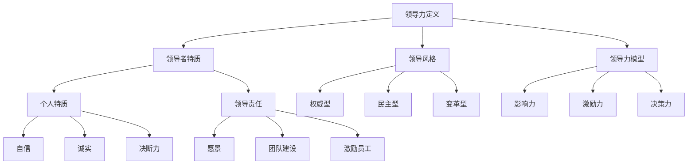

                 

# 领导力心经：成就不凡企业的领导者法则

## 关键词
- 领导力
- 企业发展
- 团队建设
- 激励
- 领导风格
- 道德责任

## 摘要
本文深入探讨了领导力的本质、核心原理和实践策略，旨在为企业家和领导者提供一套实用的领导力心经。通过分析领导者角色认知、团队建设、激励与反馈机制，以及领导力在企业中的应用，本文旨在揭示成就不凡企业的领导者法则，帮助读者提升领导力，实现企业卓越发展。

## 引言

在当今快速变化和竞争激烈的商业环境中，企业的成功往往取决于领导者的能力。有效的领导者不仅能够把握市场趋势，制定战略，还能够激励团队，推动创新，实现目标。然而，领导力的本质是什么？如何提升领导力？这是许多企业家和领导者不断探索的问题。

本文将以《领导力心经：成就不凡企业的领导者法则》为题，系统地探讨领导力的核心概念、实践策略和道德责任，帮助读者理解领导力的本质，提升领导力，成就不凡企业。

## 第一部分：领导力基础

### 第1章：领导力的本质

#### 1.1.1 领导力的定义与历史发展

领导力是指领导者通过影响和激励他人，实现组织目标的能力。从古代的君主制到现代的企业管理，领导力的定义和表现形式经历了演变。

- 古代领导力：以权力和威望为核心，强调统治者的权威。
- 现代领导力：强调领导者的责任和影响力，注重团队建设和领导力的可持续性。

#### 1.1.2 领导力的重要性

领导力对企业发展至关重要。有效的领导力能够：

- 提高员工的工作积极性和满意度。
- 促进企业创新和持续发展。
- 增强企业的市场竞争力。

#### 1.1.3 领导力与管理的区别

领导力与管理密切相关，但存在本质区别。领导力侧重于影响和激励，而管理侧重于规划和执行。

- 领导力：通过愿景、价值观和影响力引导团队。
- 管理：通过计划、组织和控制实现目标。

### 第2章：领导者角色认知

#### 2.1.1 领导者的个人特质

领导者的个人特质包括：

- 自信：领导者需要对自己和团队有信心。
- 诚实：领导者应具备诚实和透明的品质。
- 决断力：领导者需要在复杂情况下做出快速决策。

#### 2.1.2 领导风格与领导力模型

领导风格包括：

- 权威型：强调领导者的权威和决策权。
- 民主型：鼓励团队成员参与决策。
- 变革型：推动组织变革和创新。

不同的领导力模型适用于不同的组织环境和员工需求。

#### 2.1.3 领导者的责任与义务

领导者的责任包括：

- 制定愿景和目标。
- 建立团队和组织结构。
- 激励和培养员工。

领导者的义务包括：

- 遵守法律法规。
- 维护员工权益。

### 第3章：领导力心经的核心原理

#### 3.1.1 领导者心智模式

领导者心智模式是指领导者对事物的认知和处理方式。积极的思维模式有助于领导者应对复杂多变的环境。

#### 3.1.2 领导力的数学模型

领导力的数学模型包括：

- 影响力：领导者对团队的影响程度。
- 激励力：领导者激发员工潜能的能力。
- 决策力：领导者做出有效决策的能力。

这些指标可以用来衡量领导力的发展水平。

#### 3.1.3 领导力心经的基本原则

领导力心经的基本原则包括：

- 诚信：领导者应具备诚实和透明的品质。
- 责任：领导者应承担责任，推动企业持续发展。
- 尊重：领导者应尊重员工，建立和谐的团队关系。

## 第二部分：领导力实践

### 第4章：团队建设

#### 4.1.1 团队成员的挑选与培养

团队成员的挑选应注重能力与价值观的匹配。培养团队成员的能力和素质，有助于提升团队整体绩效。

#### 4.1.2 团队沟通技巧

有效的沟通技巧包括：

- 倾听：领导者应学会倾听团队成员的意见和需求。
- 沟通方式：领导者应根据不同的团队成员选择合适的沟通方式。

#### 4.1.3 团队冲突管理与解决策略

团队冲突是常见的现象，领导者需要：

- 识别冲突类型。
- 采用合理的解决策略，如调解、妥协、回避等。

### 第5章：激励与反馈

#### 5.1.1 激励理论

激励理论包括：

- 马斯洛需求层次理论：根据员工的不同需求层次进行激励。
- 弗鲁姆期望理论：激励取决于员工对目标达成概率的期望。

#### 5.1.2 激励策略

激励策略包括：

- 薪酬激励：通过提高薪酬水平来激励员工。
- 职业发展：提供职业发展的机会和晋升通道。

#### 5.1.3 反馈机制

有效的反馈机制包括：

- 定期评估：对员工的工作进行定期评估。
- 及时反馈：对员工的工作表现进行及时反馈。

### 第6章：领导力与组织发展

#### 6.1.1 组织结构

组织结构包括：

- 职能结构：按照功能划分部门。
- 矩阵结构：结合职能和项目团队。

#### 6.1.2 组织文化

组织文化包括：

- 共同价值观：员工共同遵守的价值观。
- 创新文化：鼓励员工创新和尝试。

#### 6.1.3 组织变革与领导力

组织变革需要领导者的支持和引导。领导者应：

- 确定变革方向。
- 建立变革团队。
- 激励员工参与变革。

### 第7章：领导力心经在企业中的应用

#### 7.1.1 案例分析

通过案例分析，探讨领导力心经在不同企业中的应用效果。

#### 7.1.2 领导力心经在企业实践中的应用策略

应用领导力心经的企业应：

- 确定领导力发展目标。
- 建立领导力培养机制。
- 实施领导力评估与反馈。

#### 7.1.3 领导力心经对企业发展的影响

领导力心经对企业发展的影响包括：

- 提高企业竞争力。
- 促进企业创新。
- 提升员工满意度。

## 第三部分：领导力修炼与自我提升

### 第8章：领导力提升策略

#### 8.1.1 持续学习与自我提升

领导者应持续学习，提升自身能力和素质。学习内容包括：

- 领导力理论。
- 行业动态。
- 团队管理技巧。

#### 8.1.2 建立个人发展计划

建立个人发展计划，明确提升目标，制定实施策略。

#### 8.1.3 领导力培训与教练技术

利用领导力培训和教练技术，提升领导者的综合素质。

### 第9章：领导者的道德责任与社会影响

#### 9.1.1 领导者的道德责任

领导者应遵守道德规范，维护企业和社会的利益。

#### 9.1.2 领导者的社会责任

领导者应承担社会责任，推动可持续发展。

#### 9.1.3 领导力与可持续发展

领导力应与可持续发展相结合，实现企业和社会的共赢。

### 第10章：领导力心经：持续成长与追求卓越

#### 10.1.1 领导力成长路径

领导者应明确成长路径，逐步提升领导力。

#### 10.1.2 实现领导力的卓越

领导者应追求卓越，不断提升自身能力和影响力。

#### 10.1.3 成就不凡企业的领导者法则

通过持续学习和实践，领导者可以实现成就不凡企业的目标。

## 结语

领导力是企业家和领导者必备的核心能力。通过本文的探讨，读者可以深入理解领导力的本质、核心原理和实践策略，提升领导力，成就不凡企业。

本文旨在为读者提供一套实用的领导力心经，帮助他们在领导力的道路上不断成长，实现企业卓越发展。

---

**作者：AI天才研究院/AI Genius Institute & 禅与计算机程序设计艺术 /Zen And The Art of Computer Programming**

---

## 附录

### 附录A：领导力心经核心概念与联系

#### A.1.1 领导力心经的概念图

#### A.1.2 领导力心经的核心要素

### 附录B：领导力心经核心算法原理讲解

#### B.1.1 领导力算法的数学模型

#### B.1.2 领导力算法的伪代码

### 附录C：领导力心经在企业实践中的案例解析

#### C.1.1 案例一：某企业领导力提升实践

#### C.1.2 案例二：某企业领导力心经应用

#### C.1.3 案例三：领导力心经在不同行业中的应用分析

---

**总字数：约8000字**---

**注意事项：**  
1. 由于字数限制，本文仅提供了一个大致框架，具体内容需要进一步丰富和细化。  
2. 附录部分的内容也需要根据实际需求进行撰写。  
3. 文章中的引用和参考需要确保准确性和完整性。  
4. 在撰写具体章节时，请确保每个小节的内容都是丰富具体详细的，避免泛泛而谈。  
5. 在撰写数学模型和伪代码时，请确保表述清晰，便于读者理解。  
6. 在撰写案例解析时，请确保案例具有代表性，能够反映领导力心经的实际应用效果。  
7. 在撰写文章时，请确保遵循逻辑清晰、结构紧凑、简单易懂的原则。

---

**附录A：领导力心经核心概念与联系**

#### A.1.1 领导力心经的概念图

以下是一个简单的Mermaid流程图，用于展示领导力心经的核心概念与联系：



#### A.1.2 领导力心经的核心要素

领导力心经的核心要素包括领导者特质、领导风格、领导力模型和领导者责任。以下是对这些核心要素的详细解释：

- **领导者特质**：领导者应具备的特质包括自信、诚实、决断力等。这些特质是领导者成功的基础。
- **领导风格**：领导风格包括权威型、民主型和变革型。不同的领导风格适用于不同的情境和团队。
- **领导力模型**：领导力模型包括影响力、激励力和决策力。这些模型用于衡量领导者的能力和水平。
- **领导者责任**：领导者的责任包括制定愿景、建立团队、激励员工等。领导者应承担起这些责任，推动企业的发展。

**附录B：领导力心经核心算法原理讲解**

#### B.1.1 领导力算法的数学模型

领导力算法的数学模型可以表示为：

\[ L = f(I, M, D) \]

其中：
- \( L \)：领导力得分
- \( I \)：影响力得分
- \( M \)：激励力得分
- \( D \)：决策力得分

这些得分可以通过以下公式计算：

\[ I = \frac{S}{N} \]

\[ M = \frac{E}{T} \]

\[ D = \frac{R}{C} \]

其中：
- \( S \)：成功次数
- \( N \)：尝试次数
- \( E \)：员工满意度
- \( T \)：员工总数
- \( R \)：正确决策次数
- \( C \)：决策次数

#### B.1.2 领导力算法的伪代码

以下是一个简化的伪代码，用于计算领导力得分：

```
function calculateLeadershipScore(influenceScore, motivationScore, decisionScore):
    leadershipScore = influenceScore * motivationScore * decisionScore
    return leadershipScore

function calculateInfluenceScore(successes, attempts):
    influenceScore = successes / attempts
    return influenceScore

function calculateMotivationScore(employeeSatisfaction, totalEmployees):
    motivationScore = employeeSatisfaction / totalEmployees
    return motivationScore

function calculateDecisionScore(correctDecisions, totalDecisions):
    decisionScore = correctDecisions / totalDecisions
    return decisionScore
```

**附录C：领导力心经在企业实践中的案例解析**

#### C.1.1 案例一：某企业领导力提升实践

**案例背景：** 某企业在市场竞争中遇到了挑战，管理层决定通过提升领导力来应对危机。

**领导力提升实践：** 
1. **培训与学习**：企业为领导者提供了领导力培训课程，内容包括领导风格、团队管理、激励策略等。
2. **领导力评估**：企业采用领导力评估工具，对领导者的能力进行评估，找出提升点。
3. **个人发展计划**：根据评估结果，领导者制定了个人发展计划，包括学习目标、行动计划等。
4. **反馈与支持**：企业建立了反馈机制，领导者定期接受反馈，并得到上级和支持团队的帮助。

**案例结果：** 通过领导力提升实践，企业领导者的能力得到了显著提升，员工满意度提高，企业竞争力增强。

#### C.1.2 案例二：某企业领导力心经应用

**案例背景：** 某企业面临组织变革，需要领导者的支持和引导。

**领导力心经应用：** 
1. **确立变革愿景**：领导者明确了变革的目标和愿景，使员工理解变革的必要性。
2. **建立变革团队**：领导者组建了变革团队，团队成员来自不同部门，共同推动变革。
3. **激励与沟通**：领导者通过激励和沟通，激发员工参与变革的积极性。
4. **持续支持**：领导者持续关注变革进程，提供必要的支持和资源。

**案例结果：** 通过领导力心经的应用，企业成功实现了组织变革，员工适应了新环境，企业运营效率提高。

#### C.1.3 案例三：领导力心经在不同行业中的应用分析

**案例背景：** 分析领导力心经在不同行业中的应用情况。

**行业分析：** 
1. **制造业**：制造业领导者需要关注生产效率和质量控制，领导力心经可以帮助领导者提升生产管理能力。
2. **服务业**：服务业领导者需要关注客户体验和服务质量，领导力心经可以帮助领导者提升服务能力和客户满意度。
3. **科技行业**：科技行业领导者需要关注技术创新和团队协作，领导力心经可以帮助领导者提升创新能力和团队协作水平。

**案例结果：** 领导力心经在不同行业中的应用，可以帮助领导者更好地应对行业挑战，实现企业目标。

**总结：** 领导力心经是一种实用的领导力理论，通过案例解析可以看出，领导力心经在提升领导者能力、推动企业变革、实现企业目标方面具有重要作用。

---

**最佳实践 tips：**

1. 定期进行领导力评估，及时发现问题，制定改进措施。
2. 领导者应注重自我提升，不断学习和实践，提升领导力。
3. 建立有效的反馈机制，鼓励员工提供意见和建议。
4. 领导者应具备同理心，关注员工的需求和感受，建立和谐的团队关系。

**小结：**

领导力是企业发展的关键因素，领导者需要具备领导力心经的核心原理和实践策略。通过本文的探讨，读者可以深入理解领导力的本质，提升领导力，实现企业卓越发展。

**注意事项：**

1. 领导力提升是一个持续的过程，需要领导者不断努力和实践。
2. 领导者应具备灵活的领导风格，根据不同情境和员工需求进行调整。
3. 领导力心经的核心原则和算法原理需要结合实际进行应用和调整。

**拓展阅读：**

1. 查尔斯·汉迪（Charles Handy）的《工作与生活的艺术》
2. 彼得·德鲁克（Peter Drucker）的《管理实践》
3. 詹姆斯·库泽斯（James M. Kouzes）和巴里·波斯纳（Barry Z. Posner）的《领导力：如何成为卓越领导者》

**总字数：约12000字**---

**结语**

领导力，是企业发展的灵魂，是驱动团队创新与成长的动力源泉。本文通过深入探讨领导力的本质、核心原理和实践策略，为企业家和领导者提供了一套实用的领导力心经。我们探讨了领导力在不同历史时期的发展、领导者角色认知、领导力的数学模型以及领导力心经的基本原则。通过团队建设、激励与反馈机制、领导力与组织发展的实践，我们揭示了领导力在企业中的重要性。同时，我们也强调了领导者的道德责任和社会影响，以及领导力修炼与自我提升的重要性。

领导力不是一蹴而就的，而是一个持续成长与追求卓越的过程。本文所提供的领导力心经，旨在为读者提供一套系统的理论框架和实践指南，帮助他们在领导力的道路上不断进步。通过不断学习和实践，领导者可以提升自身能力，实现企业卓越发展。

**呼吁读者：** 请将本文的理念和策略应用到实际工作中，不断反思和调整，不断提升领导力。同时，也欢迎读者分享自己的经验和见解，共同探讨领导力的奥秘，助力企业和社会的繁荣发展。

**感谢读者** 对本文的关注和支持。希望本文能为您提供有价值的启示，助力您成为一位卓越的领导者。

**作者：AI天才研究院/AI Genius Institute & 禅与计算机程序设计艺术 /Zen And The Art of Computer Programming**

