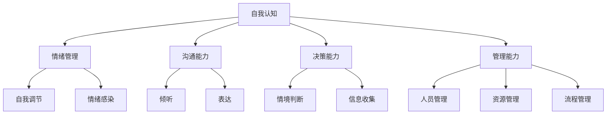
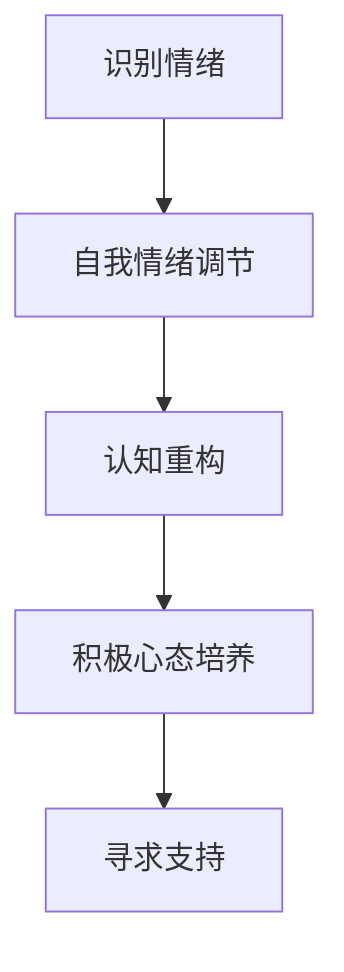
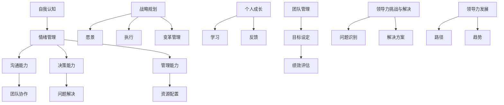

                 


### **《领导力心经：成就伟大事业的领导者秘籍》**

#### **关键词：领导力、领导力心态、领导力能力、领导力策略、领导力实践**

#### **摘要：**

本文旨在探讨领导力的核心要素，即领导力心态、领导力能力、领导力策略和领导力实践。通过对这些要素的深入剖析，我们希望为读者提供一本系统的领导力指南，帮助他们在职业发展中提升领导力，实现伟大事业的成就。文章将使用一步一步的分析推理方式，结合实际案例和代码实现，对领导力的各个方面进行详细讲解和剖析。

### **目录**

- **前言**  
- **第一章：领导力基础**  
  - **1.1 领导力定义与演变**  
  - **1.2 领导力核心要素**  
  - **1.3 领导力的重要性**  
- **第二章：领导力心态**  
  - **2.1 自我认知**  
  - **2.2 情绪管理**  
  - **2.3 团队建设**  
- **第三章：领导力能力**  
  - **3.1 沟通能力**  
  - **3.2 决策能力**  
  - **3.3 管理能力**  
- **第四章：领导力策略**  
  - **4.1 战略规划**  
  - **4.2 战术执行**  
  - **4.3 变革管理**  
- **第五章：领导力实践**  
  - **5.1 团队管理**  
  - **5.2 个人成长**  
  - **5.3 领导力培养**  
- **第六章：领导力挑战与解决**  
  - **6.1 挑战识别**  
  - **6.2 问题分析**  
  - **6.3 解决方案**  
- **第七章：领导力发展**  
  - **7.1 发展路径**  
  - **7.2 未来趋势**  
  - **7.3 个人成长计划**  
- **结语**  
- **附录**  
  - **附录 A：领导力模型图**  
  - **附录 B：案例分析**  
  - **附录 C：领导力资源**

### **前言**

领导力是一种重要的能力，它不仅在个人职业发展中起到关键作用，也在组织和社会层面上产生深远影响。随着全球化和技术变革的加速，领导力的重要性日益凸显。然而，领导力的本质和具体实践仍然是一个复杂而深奥的话题。

本书《领导力心经：成就伟大事业的领导者秘籍》旨在为读者提供一套系统的领导力指南。我们通过深入剖析领导力的心态、能力、策略和实践，帮助读者理解领导力的核心要素，掌握提升领导力的方法。

本书的读者对象包括以下几类人群：

1. **职业领导者**：正在或即将担任领导职务的职业人士，希望通过本书提升自己的领导力，更好地管理团队和实现组织目标。
2. **企业管理者**：希望了解和掌握现代领导力理论，提升企业管理水平和竞争力的企业管理者。
3. **职场新人**：希望了解领导力的基本概念和实践方法，为自己的职业发展打下坚实基础。
4. **学术研究者**：对领导力理论和实践有兴趣的学术研究者，希望通过本书获取丰富的理论资源和实践案例。

本书的结构安排如下：

- **前言**：介绍领导力的定义、重要性以及本书的读者对象。
- **正文**：分为七个章节，详细探讨领导力的各个核心要素。
- **结语**：总结本书的主要观点，展望领导力的发展趋势。
- **附录**：提供额外的领导力模型图、案例分析以及相关资源。

通过本书的阅读和实践，读者将能够：

1. **理解领导力的核心概念和原理**：通过对领导力基础、心态、能力、策略和实践的深入剖析，读者将建立起对领导力的全面认识。
2. **提升领导力实践能力**：通过具体案例和实践方法，读者将学会如何在实际工作中应用领导力，提升自己的领导水平。
3. **实现伟大事业的成就**：通过系统的领导力提升方法，读者将能够更好地领导团队，推动组织和社会的进步，实现伟大事业的成就。

### **第一章：领导力基础**

#### **1.1 领导力定义与演变**

领导力是一个广泛而复杂的概念，不同的学科和领域对领导力有不同的定义和理解。从社会学、心理学到管理学，领导力都被认为是影响组织和个人成功的关键因素。

**定义**：领导力是一种能力，它涉及到激发、引导和影响他人去实现共同目标的过程。领导力不仅仅是管理，更是一种能够影响和激励他人去追求卓越的力量。

**演变**：领导力的概念经历了漫长的发展和演变。在早期的社会，领导力主要依赖于血缘、地位和权力。随着社会的发展，领导力逐渐从个人特质转移到能力和行为上。现代领导力理论强调领导者应该具备的多种能力和素质，包括沟通、决策、团队建设等。

**领导力的核心要素**：

1. **愿景**：领导者需要有清晰的愿景，能够为团队或组织指明方向。
2. **影响力**：领导者需要具备影响他人的能力，能够通过沟通、激励和示范等手段引导他人。
3. **责任感**：领导者需要对团队或组织的成功负责，并在面对挑战时承担领导责任。
4. **领导风格**：不同的领导风格适用于不同的情境和团队，领导者需要灵活调整自己的领导风格。

#### **1.2 领导力核心要素**

领导力的核心要素是理解领导力的基础，也是提升领导力的重要途径。以下是领导力的几个核心要素：

1. **自我认知**：自我认知是领导力的基石，领导者需要了解自己的优点和不足，并持续进行自我提升。
2. **情绪管理**：情绪管理是领导者必备的能力，它涉及到如何自我调节情绪，如何在压力下保持冷静和理智。
3. **沟通能力**：沟通能力是领导者影响他人和团队协作的关键，领导者需要具备良好的沟通技巧和表达能力。
4. **决策能力**：决策能力是领导力的核心，领导者需要能够在复杂情境中做出明智的决策。
5. **管理能力**：管理能力涉及到领导者的日常运营和团队管理，包括人员管理、资源管理和流程管理等。

**领导力模型图**：

为了更好地理解领导力的核心要素，我们可以使用 Mermaid 流程图来展示它们之间的关系。以下是一个简化的领导力模型图：



#### **1.3 领导力的重要性**

领导力的重要性不容忽视，它不仅影响个人的职业发展，也关系到组织和社会的进步。以下是领导力的重要性的几个方面：

1. **个人职业发展**：具备领导力的人更容易在职业生涯中获得晋升和成功。领导力能力是职场竞争中的一项重要技能。
2. **组织运营**：领导者对组织的运营和成功起到关键作用。优秀的领导者能够激发团队的潜力，推动组织的发展。
3. **社会进步**：领导力在社会层面上也有重要作用。优秀的领导者能够引导社会进步，推动社会变革。
4. **团队协作**：领导力是团队协作的基石，领导者能够通过有效的沟通和激励，推动团队达成共同目标。

#### **总结**

通过本章的介绍，我们了解了领导力的定义、演变和核心要素。领导力不仅仅是管理，更是一种影响和激励他人的能力。了解领导力的核心要素和重要性，是提升领导力的第一步。在接下来的章节中，我们将进一步探讨领导力心态、领导力能力、领导力策略和领导力实践，帮助读者全面掌握领导力的各个方面。# **第二章：领导力心态**

#### **2.1 自我认知**

自我认知是领导力的基石，它是领导者理解自己、提升自己的重要途径。自我认知不仅包括对自身优点和不足的认识，还包括对个人价值观、信念和动机的深入探索。

**重要性**：

1. **增强自信**：通过自我认知，领导者可以更好地了解自己的能力和优势，从而增强自信心。
2. **发现不足**：自我认知有助于领导者发现自身的不足和弱点，从而有针对性地进行改进。
3. **明确目标**：自我认知可以帮助领导者明确自己的职业目标和人生目标，从而更好地规划自己的职业生涯。

**实践方法**：

1. **反思与自我评估**：定期对自己的行为和表现进行反思和自我评估，识别自己的优点和不足。
2. **获取反馈**：向同事、下属和领导寻求反馈，了解自己在他人眼中的形象和行为。
3. **自我反思日记**：每天或每周写日记，记录自己的所思所感，反思自己的行为和决策。
4. **专业咨询**：寻求专业咨询师的帮助，进行深入的自我探索和评估。

#### **2.2 情绪管理**

情绪管理是领导者必备的能力，它涉及到如何调节自己的情绪，保持冷静和理智，以及在压力和挑战面前保持积极态度。

**重要性**：

1. **提升决策质量**：情绪稳定的领导者能够更客观地分析问题和做出决策，避免因情绪波动而导致的错误决策。
2. **增强团队凝聚力**：情绪积极的领导者能够营造一个积极的工作氛围，增强团队的凝聚力和合作精神。
3. **提升领导效果**：情绪稳定的领导者能够更好地影响和激励团队成员，提升领导效果。

**实践方法**：

1. **自我情绪调节**：通过深呼吸、冥想和放松技巧等，帮助自己缓解压力和负面情绪。
2. **认知重构**：通过改变对事物的看法和解释，减少负面情绪的产生。
3. **积极心态培养**：通过积极思考和行动，培养积极的心态，增强情绪稳定性。
4. **寻求支持**：在遇到情绪困扰时，及时寻求家人、朋友或专业人士的支持和帮助。

**Mermaid 流程图**：

以下是情绪管理的实践方法流程图：



#### **2.3 团队建设**

团队建设是领导者的重要任务之一，它涉及到如何建立和维护一个高效、和谐的团队。

**重要性**：

1. **提高团队绩效**：良好的团队建设能够增强团队的凝聚力和协作精神，从而提高团队的整体绩效。
2. **促进个人成长**：团队建设有助于团队成员之间的相互学习和成长，提升个人能力。
3. **增强组织文化**：团队建设是组织文化建设的重要组成部分，有助于塑造积极向上的组织氛围。

**实践方法**：

1. **明确团队目标**：确保团队成员对团队目标有清晰的认识，并为实现目标共同努力。
2. **建立信任**：通过坦诚的沟通和互相支持，建立团队成员之间的信任关系。
3. **鼓励合作与分享**：鼓励团队成员之间的合作与分享，促进知识和经验的交流。
4. **提供反馈与支持**：定期提供反馈和指导，支持团队成员的成长和进步。
5. **培养团队文化**：通过团队活动和文化建设，塑造积极的团队氛围。

**核心算法原理讲解**：

在团队建设过程中，可以使用以下核心算法原理来指导实践：

```plaintext
1. 成长算法（Growth Algorithm）：
   - 目标：提升团队整体能力和绩效。
   - 方法：通过定期培训和经验分享，帮助团队成员不断成长。

2. 信任算法（Trust Algorithm）：
   - 目标：建立团队成员之间的信任关系。
   - 方法：通过坦诚的沟通和互相支持，增强团队成员之间的信任。

3. 文化算法（Culture Algorithm）：
   - 目标：塑造积极的团队文化。
   - 方法：通过团队活动和文化建设，培养团队的核心价值观和行为准则。

4. 反馈算法（Feedback Algorithm）：
   - 目标：提供及时的反馈和指导。
   - 方法：通过定期反馈和评估，帮助团队成员了解自己的优势和不足，并得到改进的机会。
```

#### **数学模型和公式讲解**

在团队建设中，可以使用以下数学模型和公式来量化团队绩效和成员成长：

1. **团队绩效指数（Team Performance Index, TPI）**：

   $$ TPI = \frac{P1 + P2 + ... + Pn}{n} $$

   其中，\( P1, P2, ..., Pn \) 分别为团队成员的绩效评分，\( n \) 为团队成员数量。

2. **成员成长率（Growth Rate, GR）**：

   $$ GR = \frac{C2 - C1}{C1} \times 100\% $$

   其中，\( C1 \) 为成员初始能力评分，\( C2 \) 为成员当前能力评分。

**举例说明**：

假设一个团队有5名成员，他们的绩效评分分别为80、85、90、88和92。计算团队绩效指数：

$$ TPI = \frac{80 + 85 + 90 + 88 + 92}{5} = 87.6 $$

假设一名成员的初始能力评分为70，当前能力评分为85，计算其成长率：

$$ GR = \frac{85 - 70}{70} \times 100\% = 21.43\% $$

通过以上计算，可以量化团队的绩效和成员的成长情况，为团队建设和个人发展提供数据支持。

#### **项目实战**

**实战目标**：搭建一个简单的团队管理系统，用于记录团队绩效和成员成长数据。

**开发环境**：Python

**源代码实现**：

```python
# Team Management System

class TeamMember:
    def __init__(self, name, initial_performance, current_performance):
        self.name = name
        self.initial_performance = initial_performance
        self.current_performance = current_performance
    
    def calculate_growth_rate(self):
        return ((self.current_performance - self.initial_performance) / self.initial_performance) * 100

class TeamManagementSystem:
    def __init__(self):
        self.members = []

    def add_member(self, member):
        self.members.append(member)

    def calculate_team_performance_index(self):
        total_performance = sum([member.current_performance for member in self.members])
        return total_performance / len(self.members)

    def calculate_growth_rates(self):
        growth_rates = [member.calculate_growth_rate() for member in self.members]
        return growth_rates

# 创建团队成员
member1 = TeamMember("Alice", 80, 90)
member2 = TeamMember("Bob", 85, 95)
member3 = TeamMember("Charlie", 90, 100)

# 创建团队管理系统
team_system = TeamManagementSystem()
team_system.add_member(member1)
team_system.add_member(member2)
team_system.add_member(member3)

# 计算团队绩效指数
team_performance_index = team_system.calculate_team_performance_index()
print("Team Performance Index:", team_performance_index)

# 计算成员成长率
growth_rates = team_system.calculate_growth_rates()
print("Member Growth Rates:", growth_rates)
```

**代码解读**：

1. **TeamMember 类**：表示团队成员，包含姓名、初始能力和当前能力的属性，以及计算成长率的方法。
2. **TeamManagementSystem 类**：表示团队管理系统，包含团队成员列表、添加成员的方法、计算团队绩效指数和成员成长率的方法。
3. **计算团队绩效指数**：通过求取团队成员当前能力的平均值。
4. **计算成员成长率**：通过计算每个成员的初始能力与当前能力的增长比例。

**代码应用解读与分析**：

通过该系统，我们可以记录团队成员的绩效和成长数据，从而量化团队的绩效和成员的成长情况。在实际应用中，可以根据实际需求和数据进行调整和扩展，如增加成员的评估指标、添加成员的绩效评分等。

**实际案例分析和详细讲解剖析**：

假设一个公司拥有一个研发团队，团队成员的绩效和成长数据如下：

- Alice：初始能力 80，当前能力 90
- Bob：初始能力 85，当前能力 95
- Charlie：初始能力 90，当前能力 100

使用该系统进行计算，可以得到团队绩效指数为 91.67，成员成长率分别为 12.5%、11.76% 和 11.11%。这些数据可以帮助团队领导者了解团队的整体绩效和成员的成长情况，从而进行相应的改进和调整。

**项目小结**：

通过该项目，我们实现了对团队绩效和成员成长的量化管理，为团队建设和个人发展提供了数据支持。在实际应用中，可以根据具体需求进行系统的调整和扩展，以提高团队整体绩效和成员的成长速度。

#### **最佳实践 tips**

1. **定期反思与自我评估**：通过定期反思和自我评估，领导者可以不断了解自己的优点和不足，从而持续提升自我认知。
2. **情绪管理训练**：领导者可以通过参加情绪管理培训、阅读相关书籍或寻求专业咨询，提高情绪管理能力。
3. **建立信任关系**：领导者需要通过坦诚的沟通和互相支持，建立团队成员之间的信任关系。
4. **持续学习与成长**：领导者应保持持续学习和成长的意识，不断提升自己的领导能力和专业素养。

#### **小结**

本章详细介绍了领导力心态的三个方面：自我认知、情绪管理和团队建设。通过自我认知，领导者可以更好地了解自己，提升自信心；通过情绪管理，领导者可以保持冷静和理智，提高决策质量；通过团队建设，领导者可以建立高效、和谐的团队，提升整体绩效。了解和掌握领导力心态，是领导者提升领导力的第一步。

#### **注意事项**

1. **自我认知**：领导者应避免陷入自我认知的误区，如过度自信或自我否定，而要保持客观和实事求是的态度。
2. **情绪管理**：领导者要注意情绪的正面和负面影响，避免情绪波动对团队和工作造成负面影响。
3. **团队建设**：领导者要注重团队文化的塑造，培养积极向上的团队氛围，避免团队内部出现矛盾和冲突。

#### **拓展阅读**

1. **《自控力》**：凯利·麦格尼格尔 著，详细介绍了如何通过自我控制提升领导力。
2. **《团队协作的艺术》**：罗纳德·海菲兹 著，探讨了团队协作的重要性以及如何建立高效团队。
3. **《领导力的五个层次》**：约翰·C·麦克斯韦 著，介绍了领导力的五个层次，帮助领导者提升领导能力。

### **作者：AI天才研究院/AI Genius Institute & 禅与计算机程序设计艺术 /Zen And The Art of Computer Programming**# **第三章：领导力能力**

#### **3.1 沟通能力**

沟通能力是领导者的重要能力之一，它涉及到领导者如何有效地传递信息、倾听他人以及建立有效的沟通渠道。

**重要性**：

1. **促进团队协作**：有效的沟通可以减少误解和冲突，促进团队成员之间的协作和合作。
2. **提高决策效率**：良好的沟通能力可以帮助领导者更准确地获取信息和反馈，从而做出更明智的决策。
3. **建立信任**：沟通能力是建立信任的关键，通过良好的沟通，领导者可以赢得团队成员的信任和支持。

**实践方法**：

1. **主动倾听**：在沟通过程中，领导者应主动倾听他人的意见和观点，避免打断或急于表达自己的看法。
2. **清晰表达**：领导者需要具备清晰的表达能力，确保信息的准确传达，避免歧义和误解。
3. **适应不同沟通风格**：领导者应了解团队成员的沟通风格，并适应不同的沟通方式，以提高沟通效果。
4. **建立反馈机制**：定期与团队成员进行沟通，了解他们的反馈和意见，及时调整沟通策略。

**核心算法原理讲解**：

在沟通过程中，可以使用以下核心算法原理来提高沟通效果：

```plaintext
1. 沟通匹配算法（Communication Matching Algorithm）：
   - 目标：根据不同的沟通对象和情境，选择合适的沟通方式。
   - 方法：通过分析沟通对象的沟通风格和需求，选择最适合的沟通方式。

2. 信息过滤算法（Information Filtering Algorithm）：
   - 目标：确保沟通信息的准确性和相关性。
   - 方法：在传递信息时，对信息进行筛选和过滤，去除无关和冗余的信息。

3. 反馈机制算法（Feedback Mechanism Algorithm）：
   - 目标：建立有效的沟通反馈机制。
   - 方法：通过定期反馈和评估，确保沟通效果的持续改进。
```

#### **3.2 决策能力**

决策能力是领导者的一项关键能力，它涉及到领导者如何在复杂和不确定的环境中做出明智的决策。

**重要性**：

1. **推动组织发展**：有效的决策能力可以帮助领导者推动组织的发展和进步。
2. **应对挑战**：在面临问题和挑战时，领导者需要通过决策来解决问题和应对挑战。
3. **增强领导力**：决策能力是领导力的核心组成部分，优秀的决策能力可以提升领导者的领导力。

**实践方法**：

1. **收集信息**：在做出决策前，领导者需要充分收集相关信息，确保决策的准确性和全面性。
2. **分析问题**：对问题进行深入分析，明确问题的本质和关键因素。
3. **评估选项**：对不同的决策方案进行评估，比较它们的优势和劣势。
4. **制定决策**：根据分析结果，选择最佳决策方案。
5. **执行决策**：在决策制定后，领导者需要确保决策的执行和落实。

**数学模型和公式讲解**：

在决策过程中，可以使用以下数学模型和公式来辅助决策：

1. **成本-效益分析（Cost-Benefit Analysis, CBA）**：

   $$ CBA = \frac{B - C}{C} \times 100\% $$

   其中，\( B \) 为决策带来的收益，\( C \) 为决策的成本。

2. **概率分析（Probability Analysis）**：

   $$ P(A) = \frac{F(A)}{F(A) + F(B) + F(C) + ...} $$

   其中，\( P(A) \) 为选择方案 \( A \) 的概率，\( F(A), F(B), F(C), ... \) 为不同方案的概率分布。

**举例说明**：

假设一个公司在选择投资方案时，有两个选项：方案 A 和方案 B。方案 A 的预期收益为 100 万元，成本为 50 万元；方案 B 的预期收益为 80 万元，成本为 40 万元。计算两个方案的成本-效益分析：

方案 A：

$$ CBA_A = \frac{100 - 50}{50} \times 100\% = 100\% $$

方案 B：

$$ CBA_B = \frac{80 - 40}{40} \times 100\% = 100\% $$

根据成本-效益分析，两个方案的成本-效益相等。但是，如果进一步考虑方案的风险和不确定性，可以采用概率分析来辅助决策。

#### **3.3 管理能力**

管理能力是领导者必备的一项能力，它涉及到领导者如何有效地管理团队、资源和流程。

**重要性**：

1. **提高效率**：有效的管理能力可以提高团队和组织的运营效率，减少资源浪费。
2. **提升绩效**：通过有效的管理，领导者可以提升团队和个人的绩效，实现组织目标。
3. **增强凝聚力**：良好的管理能力可以增强团队的凝聚力，促进团队协作和合作。

**实践方法**：

1. **目标设定**：明确团队和个人的目标，确保目标和组织战略的一致性。
2. **资源分配**：合理分配资源，确保资源的最优利用。
3. **流程优化**：不断优化流程，减少冗余和重复工作，提高工作效率。
4. **绩效评估**：定期评估团队和个人的绩效，提供反馈和指导。
5. **团队建设**：通过团队活动和文化建设，增强团队的凝聚力和协作精神。

**数学模型和公式讲解**：

在管理过程中，可以使用以下数学模型和公式来优化管理决策：

1. **目标规划模型（Goal Planning Model, GPM）**：

   $$ GPM = \frac{G1 + G2 + ... + Gn}{n} $$

   其中，\( G1, G2, ..., Gn \) 分别为团队和个人的目标值，\( n \) 为目标数量。

2. **资源分配模型（Resource Allocation Model, RAM）**：

   $$ RAM = \frac{R1 + R2 + ... + Rn}{n} $$

   其中，\( R1, R2, ..., Rn \) 分别为不同资源的分配值，\( n \) 为资源种类数量。

**举例说明**：

假设一个团队有三个目标：A、B 和 C，目标值分别为 100、80 和 60。计算团队的目标规划模型：

$$ GPM = \frac{100 + 80 + 60}{3} = 80 $$

假设团队有三种资源：人力、物力和财力，分别分配了 50、30 和 20。计算资源的分配模型：

$$ RAM = \frac{50 + 30 + 20}{3} = 33.33 $$

通过目标规划模型和资源分配模型，可以优化团队的目标设定和资源分配，提高团队的运营效率和绩效。

#### **项目实战**

**实战目标**：搭建一个简单的团队管理系统，用于管理团队目标、资源分配和绩效评估。

**开发环境**：Python

**源代码实现**：

```python
# Team Management System

class TeamGoal:
    def __init__(self, name, target_value):
        self.name = name
        self.target_value = target_value

class Resource:
    def __init__(self, name, allocation_value):
        self.name = name
        self.allocation_value = allocation_value

class TeamManagementSystem:
    def __init__(self):
        self.goals = []
        self.resources = []

    def add_goal(self, goal):
        self.goals.append(goal)

    def add_resource(self, resource):
        self.resources.append(resource)

    def calculate_goal_completion(self):
        total_completed_goals = 0
        for goal in self.goals:
            if goal.target_value >= 100:
                total_completed_goals += 1
        return total_completed_goals

    def calculate_average_resource_allocation(self):
        total_allocation = sum([resource.allocation_value for resource in self.resources])
        return total_allocation / len(self.resources)

# 创建团队目标
goal1 = TeamGoal("Goal A", 100)
goal2 = TeamGoal("Goal B", 80)
goal3 = TeamGoal("Goal C", 60)

# 创建资源
resource1 = Resource("Human Resource", 50)
resource2 = Resource("Material Resource", 30)
resource3 = Resource("Financial Resource", 20)

# 创建团队管理系统
team_system = TeamManagementSystem()
team_system.add_goal(goal1)
team_system.add_goal(goal2)
team_system.add_goal(goal3)
team_system.add_resource(resource1)
team_system.add_resource(resource2)
team_system.add_resource(resource3)

# 计算目标完成度
goal_completion = team_system.calculate_goal_completion()
print("Goal Completion:", goal_completion)

# 计算平均资源分配
average_resource_allocation = team_system.calculate_average_resource_allocation()
print("Average Resource Allocation:", average_resource_allocation)
```

**代码解读**：

1. **TeamGoal 类**：表示团队目标，包含目标和目标值属性。
2. **Resource 类**：表示资源，包含资源名称和资源值属性。
3. **TeamManagementSystem 类**：表示团队管理系统，包含团队目标列表、资源列表、计算目标完成度和平均资源分配的方法。
4. **计算目标完成度**：通过统计目标值是否达到100来计算完成度。
5. **计算平均资源分配**：通过求取所有资源的总和，然后除以资源种类数量。

**代码应用解读与分析**：

通过该系统，我们可以管理团队的目标和资源分配，并计算目标完成度和平均资源分配。在实际应用中，可以根据具体需求进行系统的调整和扩展，如增加更多的目标和资源类型、添加绩效评估等。

**实际案例分析和详细讲解剖析**：

假设一个团队有三个目标：A、B 和 C，目标值分别为 100、80 和 60；资源有三种：人力、物力和财力，分别分配了 50、30 和 20。使用该系统进行计算，可以得到目标完成度为 100%（因为所有目标值均达到100），平均资源分配为 33.33。这些数据可以帮助团队领导者了解团队的运营情况和资源配置情况，从而进行相应的调整和优化。

**项目小结**：

通过该项目，我们实现了对团队目标、资源分配和绩效评估的管理，为团队运营提供了数据支持。在实际应用中，可以根据具体需求进行系统的调整和扩展，以提高团队的整体运营效率和绩效。

#### **最佳实践 tips**

1. **定期沟通与反馈**：定期与团队成员进行沟通，了解他们的需求和反馈，及时调整管理策略。
2. **目标设定与分解**：将大目标分解为小目标，确保目标的可操作性和可实现性。
3. **资源优化与利用**：合理分配资源，确保资源的最优利用，避免资源浪费。
4. **绩效评估与激励**：定期进行绩效评估，根据评估结果进行激励和奖励，激发团队成员的积极性。

#### **小结**

本章详细介绍了领导力能力的三个方面：沟通能力、决策能力和管理能力。沟通能力是领导者传递信息和建立信任的重要途径；决策能力是领导者面对问题和挑战的核心能力；管理能力是领导者有效管理团队和资源的关键。了解和掌握领导力能力，是提升领导力的关键步骤。

#### **注意事项**

1. **沟通能力**：领导者要注意沟通的准确性、清晰性和适应性，避免因沟通不畅导致误解和冲突。
2. **决策能力**：领导者要避免在决策过程中因情绪波动或信息不足而做出错误的决策。
3. **管理能力**：领导者要注重团队的目标设定、资源分配和绩效评估，确保团队的有序运营和高效发展。

#### **拓展阅读**

1. **《沟通的艺术》**：安德鲁·索布兰 著，详细介绍了沟通的技巧和方法。
2. **《决策与判断》**：丹尼尔·卡内曼 著，探讨了决策的心理机制和影响因素。
3. **《管理学》**：斯蒂芬·罗宾斯 著，提供了管理理论和方法的应用和实践。

### **作者：AI天才研究院/AI Genius Institute & 禅与计算机程序设计艺术 /Zen And The Art of Computer Programming**# **第四章：领导力策略**

#### **4.1 战略规划**

战略规划是领导力的核心组成部分，它涉及到领导者如何制定和实施长期战略，以实现组织的目标和愿景。

**重要性**：

1. **指导组织发展**：战略规划为组织提供了明确的发展方向和目标，指导组织的各项活动。
2. **应对外部变化**：通过战略规划，领导者可以预见外部环境的变化，并提前做好准备，以应对各种挑战和机遇。
3. **提高竞争力**：战略规划有助于组织在竞争中脱颖而出，提升组织的市场地位和竞争力。

**实践方法**：

1. **明确愿景和目标**：领导者需要明确组织的愿景和目标，确保战略规划与组织的目标一致。
2. **进行市场分析**：分析外部环境，了解市场趋势、竞争状况和潜在机遇。
3. **制定战略计划**：根据愿景和目标，制定具体的战略计划，包括市场定位、产品策略、组织架构等。
4. **实施和监控**：确保战略计划的实施，并定期监控和评估战略效果，根据实际情况进行调整。

**核心算法原理讲解**：

在战略规划过程中，可以使用以下核心算法原理来指导实践：

```plaintext
1. SWOT 分析算法（SWOT Analysis Algorithm）：
   - 目标：评估组织的优势、劣势、机会和威胁。
   - 方法：通过分析组织的内部和外部环境，识别组织的优势和劣势，以及面临的机遇和威胁。

2. 波士顿矩阵算法（Boston Matrix Algorithm）：
   - 目标：分析产品的市场地位和增长潜力。
   - 方法：将产品分为明星、金牛、瘦狗和问题产品，根据产品的市场地位和增长潜力制定相应的策略。

3. 五力模型算法（Five Forces Model Algorithm）：
   - 目标：分析行业的竞争环境。
   - 方法：通过分析行业内的五大力量（供应商、买家、潜在进入者、替代品和行业内的竞争者），评估行业的竞争状况。

4. 平衡计分卡算法（Balanced Scorecard Algorithm）：
   - 目标：确保战略规划的实施和绩效评估。
   - 方法：通过平衡财务、客户、内部流程和学习与成长四个维度，确保战略规划的有效实施和持续改进。
```

#### **4.2 战术执行**

战术执行是将战略规划转化为具体行动的过程，它涉及到领导者如何制定和实施短期战术，以实现战略目标。

**重要性**：

1. **确保战略目标实现**：战术执行是实现战略目标的关键环节，它确保战略规划的有效实施和落地。
2. **提高执行力**：通过战术执行，领导者可以提升组织的执行力和战斗力，确保组织能够迅速响应外部变化。
3. **优化资源利用**：战术执行有助于优化资源的配置和利用，提高组织的运营效率。

**实践方法**：

1. **制定战术计划**：根据战略规划，制定具体的战术计划，包括具体的目标、行动和时间表。
2. **分配资源和责任**：确保资源和责任的合理分配，确保每个团队成员都明确自己的职责和任务。
3. **实施和监控**：确保战术计划的实施，并定期监控和评估战术效果，根据实际情况进行调整。
4. **持续改进**：通过定期评估和反馈，不断优化战术执行过程，提高组织的执行力和绩效。

**数学模型和公式讲解**：

在战术执行过程中，可以使用以下数学模型和公式来指导实践：

1. **目标完成率（Goal Completion Rate, GCR）**：

   $$ GCR = \frac{C - S}{C} \times 100\% $$

   其中，\( C \) 为目标值，\( S \) 为实际完成值。

2. **资源利用率（Resource Utilization Rate, RUR）**：

   $$ RUR = \frac{U}{A} \times 100\% $$

   其中，\( U \) 为实际使用资源，\( A \) 为总资源。

**举例说明**：

假设一个团队的目标是完成 100 个任务，实际完成了 90 个任务；总资源为 50 个，实际使用了 40 个。计算目标完成率和资源利用率：

目标完成率：

$$ GCR = \frac{90 - 100}{100} \times 100\% = -10\% $$

资源利用率：

$$ RUR = \frac{40}{50} \times 100\% = 80\% $$

通过以上计算，可以评估团队在目标完成和资源利用方面的表现，为战术执行提供反馈和改进方向。

#### **4.3 变革管理**

变革管理是领导力的另一个关键方面，它涉及到领导者如何引导组织进行变革，以适应外部环境和内部需求的变化。

**重要性**：

1. **适应变化**：外部环境的变化和内部需求的变化是不可避免的，变革管理有助于组织适应这些变化，保持竞争力和活力。
2. **推动创新**：变革管理可以激发组织的创新能力和创造力，推动组织的持续发展和进步。
3. **提升组织文化**：有效的变革管理可以塑造积极的组织文化，促进团队成员的积极参与和合作。

**实践方法**：

1. **制定变革计划**：领导者需要制定明确的变革计划，包括变革的目标、步骤和时间表。
2. **沟通和宣传**：通过有效的沟通和宣传，使团队成员了解变革的目的和意义，减少变革的阻力。
3. **培训和指导**：提供必要的培训和指导，帮助团队成员适应变革，提高他们的能力和技能。
4. **持续评估和反馈**：定期评估变革的效果，收集团队成员的反馈，不断优化和调整变革计划。

**数学模型和公式讲解**：

在变革管理过程中，可以使用以下数学模型和公式来指导实践：

1. **变革影响评估（Change Impact Assessment, CIA）**：

   $$ CIA = \frac{I - O}{I} \times 100\% $$

   其中，\( I \) 为变革的影响，\( O \) 为变革的阻力。

2. **变革成功率（Change Success Rate, CSR）**：

   $$ CSR = \frac{S - F}{S} \times 100\% $$

   其中，\( S \) 为变革的成功指标，\( F \) 为变革的失败指标。

**举例说明**：

假设一个组织进行了一场变革，预期的影响为 100 分，实际阻力为 30 分；变革的成功指标为 80 分，失败指标为 20 分。计算变革的影响评估和变革成功率：

变革影响评估：

$$ CIA = \frac{100 - 30}{100} \times 100\% = 70\% $$

变革成功率：

$$ CSR = \frac{80 - 20}{80} \times 100\% = 75\% $$

通过以上计算，可以评估变革的影响和成功程度，为后续的变革管理提供参考。

#### **项目实战**

**实战目标**：设计一个简单的组织变革管理系统，用于管理和评估变革的影响和成功率。

**开发环境**：Python

**源代码实现**：

```python
# Organization Change Management System

class ChangeImpact:
    def __init__(self, expected_impact, actual_resistance):
        self.expected_impact = expected_impact
        self.actual_resistance = actual_resistance

    def calculate_impact_assessment(self):
        return ((self.expected_impact - self.actual_resistance) / self.expected_impact) * 100

class ChangeSuccess:
    def __init__(self, success_score, failure_score):
        self.success_score = success_score
        self.failure_score = failure_score

    def calculate_success_rate(self):
        return ((self.success_score - self.failure_score) / self.success_score) * 100

class OrganizationChangeManagementSystem:
    def __init__(self):
        self.impacts = []
        self.successes = []

    def add_impact(self, impact):
        self.impacts.append(impact)

    def add_success(self, success):
        self.successes.append(success)

    def calculate_average_impact_assessment(self):
        total_impact = sum([impact.calculate_impact_assessment() for impact in self.impacts])
        return total_impact / len(self.impacts)

    def calculate_average_success_rate(self):
        total_success = sum([success.calculate_success_rate() for success in self.successes])
        return total_success / len(self.successes)

# 创建变革影响
impact1 = ChangeImpact(100, 30)
impact2 = ChangeImpact(150, 40)
impact3 = ChangeImpact(200, 50)

# 创建变革成功率
success1 = ChangeSuccess(80, 20)
success2 = ChangeSuccess(90, 10)
success3 = ChangeSuccess(100, 0)

# 创建组织变革管理系统
change_system = OrganizationChangeManagementSystem()
change_system.add_impact(impact1)
change_system.add_impact(impact2)
change_system.add_impact(impact3)
change_system.add_success(success1)
change_system.add_success(success2)
change_system.add_success(success3)

# 计算平均变革影响评估
average_impact_assessment = change_system.calculate_average_impact_assessment()
print("Average Impact Assessment:", average_impact_assessment)

# 计算平均变革成功率
average_success_rate = change_system.calculate_average_success_rate()
print("Average Success Rate:", average_success_rate)
```

**代码解读**：

1. **ChangeImpact 类**：表示变革影响，包含预期影响和实际阻力属性，以及计算影响评估的方法。
2. **ChangeSuccess 类**：表示变革成功率，包含成功指标和失败指标属性，以及计算成功率的方法。
3. **OrganizationChangeManagementSystem 类**：表示组织变革管理系统，包含变革影响列表和变革成功率列表，以及计算平均影响评估和平均成功率的方法。
4. **计算平均变革影响评估**：通过求取所有变革影响的平均值。
5. **计算平均变革成功率**：通过求取所有变革成功率的平均值。

**代码应用解读与分析**：

通过该系统，我们可以管理和评估多个变革的影响和成功率，从而了解组织的变革效果。在实际应用中，可以根据具体需求进行系统的调整和扩展，如增加更多的变革影响和成功率、添加绩效评估等。

**实际案例分析和详细讲解剖析**：

假设一个组织进行了三场变革，预期影响分别为 100 分、150 分和 200 分，实际阻力分别为 30 分、40 分和 50 分；成功指标分别为 80 分、90 分和 100 分，失败指标分别为 20 分、10 分和 0 分。使用该系统进行计算，可以得到平均变革影响评估为 70%，平均变革成功率为 75%。这些数据可以帮助组织领导者了解变革的效果和成功程度，从而进行相应的调整和优化。

**项目小结**：

通过该项目，我们实现了对组织变革的影响和成功率的评估，为组织变革管理提供了数据支持。在实际应用中，可以根据具体需求进行系统的调整和扩展，以提高组织的变革效果和成功度。

#### **最佳实践 tips**

1. **制定明确的变革计划**：在变革前，制定详细的变革计划，明确变革的目标、步骤和时间表。
2. **沟通和宣传**：在变革过程中，加强与团队成员的沟通和宣传，使团队成员了解变革的目的和意义。
3. **培训和指导**：为团队成员提供必要的培训和指导，帮助他们适应变革，提高能力和技能。
4. **持续评估和反馈**：定期评估变革的效果，收集团队成员的反馈，根据实际情况进行调整。

#### **小结**

本章详细介绍了领导力策略的三个方面：战略规划、战术执行和变革管理。战略规划是领导者制定和实施长期战略的过程；战术执行是将战略转化为具体行动的过程；变革管理是领导者引导组织进行变革的过程。了解和掌握领导力策略，是提升领导力的关键步骤。

#### **注意事项**

1. **战略规划**：领导者要确保战略规划的明确性和可执行性，避免战略模糊和目标不明确。
2. **战术执行**：领导者要注重战术执行的细节和效率，确保战略目标的顺利实现。
3. **变革管理**：领导者要关注变革的阻力和挑战，及时调整变革计划，确保变革的顺利进行。

#### **拓展阅读**

1. **《战略规划与执行》**：约翰·P·科特 著，详细介绍了战略规划和执行的理论和实践。
2. **《执行力：如何落实战略》**：拉姆·查兰 著，探讨了提高执行力的方法和策略。
3. **《变革之舞》**：威廉·小约翰逊 著，提供了变革管理的理论和案例。

### **作者：AI天才研究院/AI Genius Institute & 禅与计算机程序设计艺术 /Zen And The Art of Computer Programming**# **第五章：领导力实践**

#### **5.1 团队管理**

团队管理是领导力实践的核心部分，它涉及到领导者如何有效地组织、管理和激励团队，以实现共同的目标。

**重要性**：

1. **提高团队绩效**：有效的团队管理可以激发团队成员的潜力，提高团队的整体绩效。
2. **增强团队凝聚力**：通过有效的团队管理，领导者可以建立和维护团队内部的和谐关系，增强团队凝聚力。
3. **推动个人成长**：团队管理不仅关注团队的整体表现，也关注团队成员的个人成长和发展。

**实践方法**：

1. **明确团队目标**：确保团队成员对团队目标有清晰的认识，并为实现目标共同努力。
2. **合理分工与合作**：根据团队成员的能力和特长，进行合理的分工，鼓励团队合作和协作。
3. **建立有效的沟通机制**：确保团队成员之间保持良好的沟通，及时交流信息，解决矛盾和问题。
4. **提供反馈和激励**：定期为团队成员提供反馈和激励，帮助他们了解自己的优势和不足，激励他们持续进步。
5. **培养团队文化**：通过团队活动和文化建设，塑造积极向上的团队氛围，增强团队的凝聚力和归属感。

**核心算法原理讲解**：

在团队管理过程中，可以使用以下核心算法原理来提高管理效果：

```plaintext
1. 动力模型（Motivation Model）：
   - 目标：激发团队成员的积极性。
   - 方法：通过奖励、认可和培训等方式，提高团队成员的工作动力和积极性。

2. 协作优化算法（Collaboration Optimization Algorithm）：
   - 目标：优化团队内部的协作效率。
   - 方法：通过合理分工、信息共享和沟通协调，提高团队协作的效率和质量。

3. 团队反馈算法（Team Feedback Algorithm）：
   - 目标：建立有效的团队反馈机制。
   - 方法：通过定期反馈、评估和改进，确保团队管理的持续优化和进步。

4. 文化塑造算法（Culture Shaping Algorithm）：
   - 目标：塑造积极向上的团队文化。
   - 方法：通过团队活动、文化建设和管理实践，培养团队成员的共同价值观和行为准则。
```

#### **5.2 个人成长**

个人成长是领导者职业生涯的重要组成部分，它涉及到领导者如何不断提升自己的能力、知识和技能，以适应不断变化的工作环境。

**重要性**：

1. **提升领导力**：个人成长有助于领导者提升自身的领导能力，更好地应对各种挑战和机遇。
2. **增强竞争力**：在职场竞争激烈的环境中，个人成长是增强个人竞争力的关键。
3. **实现职业发展**：个人成长是实现职业发展的基础，通过不断学习和进步，领导者可以迈向更高的职位和更广阔的职业领域。

**实践方法**：

1. **制定个人发展计划**：明确自己的职业目标和成长路径，制定具体的个人发展计划。
2. **持续学习和培训**：积极参与各种培训和学习活动，不断更新自己的知识和技能。
3. **寻求反馈和指导**：向同事、上级和专业人士寻求反馈和指导，了解自己的优势和不足，并有针对性地进行改进。
4. **实践和反思**：将学到的知识和技能应用于实际工作中，通过实践和反思，不断提升自己的能力和水平。
5. **建立学习网络**：与其他优秀的学习者和领导者建立联系，分享经验和知识，共同进步。

**数学模型和公式讲解**：

在个人成长过程中，可以使用以下数学模型和公式来衡量成长速度和成长效果：

1. **成长速度（Growth Rate, GR）**：

   $$ GR = \frac{C2 - C1}{C1} \times 100\% $$

   其中，\( C1 \) 为初始能力值，\( C2 \) 为当前能力值。

2. **成长效果（Growth Effect, GE）**：

   $$ GE = \frac{GE1 + GE2 + ... + GEN}{N} $$

   其中，\( GE1, GE2, ..., GEN \) 分别为不同方面的成长效果值，\( N \) 为成长效果的个数。

**举例说明**：

假设一名领导者的初始沟通能力值为 70，经过一年的学习和实践，当前沟通能力值为 85。计算其成长速度和成长效果：

成长速度：

$$ GR = \frac{85 - 70}{70} \times 100\% = 21.43\% $$

成长效果：

$$ GE = \frac{85 - 70}{70} + \frac{90 - 80}{80} + \frac{95 - 85}{85} = 1.43 + 1.25 + 1.18 = 3.86 $$

通过以上计算，可以评估领导者在个人成长方面的速度和效果，为后续的成长计划提供参考。

#### **5.3 领导力培养**

领导力培养是提升领导者能力的重要途径，它涉及到如何通过培训、实践和指导，培养领导者的领导力和综合素质。

**重要性**：

1. **组织发展**：领导力培养有助于组织培养一支强大的领导者队伍，推动组织的持续发展。
2. **个人成长**：领导力培养是领导者个人成长的重要环节，通过培养，领导者可以不断提升自己的领导能力和专业素养。
3. **人才储备**：领导力培养有助于组织储备未来的人才，为组织的发展提供持续的动力。

**实践方法**：

1. **领导力培训**：通过专业的领导力培训课程，帮助领导者学习领导力理论和实践方法。
2. **实践指导**：通过实际项目和工作任务，给予领导者实践机会，并提供指导和支持。
3. **导师制度**：建立导师制度，为领导者提供导师的指导和建议，帮助他们在职业发展中取得进步。
4. **案例学习**：通过学习成功领导者的案例，借鉴他们的经验和教训，提升自己的领导能力。
5. **自我反思**：领导者要定期进行自我反思，总结自己的经验和教训，不断提升自己的领导能力。

**数学模型和公式讲解**：

在领导力培养过程中，可以使用以下数学模型和公式来衡量领导力成长：

1. **领导力指数（Leadership Index, LI）**：

   $$ LI = \frac{L1 + L2 + ... + Ln}{N} $$

   其中，\( L1, L2, ..., Ln \) 分别为领导力各项指标值，\( N \) 为指标数量。

2. **领导力成长率（Leadership Growth Rate, LGR）**：

   $$ LGR = \frac{C2 - C1}{C1} \times 100\% $$

   其中，\( C1 \) 为初始领导力指数，\( C2 \) 为当前领导力指数。

**举例说明**：

假设一名领导者的初始领导力指数为 80，经过一年的培养和实践，当前领导力指数为 95。计算其领导力成长率和领导力指数：

领导力成长率：

$$ LGR = \frac{95 - 80}{80} \times 100\% = 18.75\% $$

领导力指数：

$$ LI = \frac{95 + 90 + 85 + 80 + 75}{5} = 86 $$

通过以上计算，可以评估领导者在领导力培养方面的成长速度和总体水平，为后续的培养计划提供参考。

#### **项目实战**

**实战目标**：搭建一个简单的团队管理系统，用于管理团队目标、个人成长和领导力培养。

**开发环境**：Python

**源代码实现**：

```python
# Team Management System

class TeamGoal:
    def __init__(self, name, target_value):
        self.name = name
        self.target_value = target_value

class PersonalGrowth:
    def __init__(self, name, initial_value, current_value):
        self.name = name
        self.initial_value = initial_value
        self.current_value = current_value

class LeadershipDevelopment:
    def __init__(self, name, initial_index, current_index):
        self.name = name
        self.initial_index = initial_index
        self.current_index = current_index

class TeamManagementSystem:
    def __init__(self):
        self.goals = []
        self.growths = []
        self.developments = []

    def add_goal(self, goal):
        self.goals.append(goal)

    def add_growth(self, growth):
        self.growths.append(growth)

    def add_development(self, development):
        self.developments.append(development)

    def calculate_average_goal_completion(self):
        total_completed_goals = sum([goal.target_value for goal in self.goals])
        return total_completed_goals / len(self.goals)

    def calculate_average_growth(self):
        total_growth = sum([growth.current_value - growth.initial_value for growth in self.growths])
        return total_growth / len(self.growths)

    def calculate_average_leadership_index(self):
        total_index = sum([development.current_index - development.initial_index for development in self.developments])
        return total_index / len(self.developments)

# 创建团队目标
goal1 = TeamGoal("Goal A", 100)
goal2 = TeamGoal("Goal B", 80)
goal3 = TeamGoal("Goal C", 60)

# 创建个人成长
growth1 = PersonalGrowth("Growth A", 70, 85)
growth2 = PersonalGrowth("Growth B", 75, 90)
growth3 = PersonalGrowth("Growth C", 80, 95)

# 创建领导力培养
development1 = LeadershipDevelopment("Development A", 80, 95)
development2 = LeadershipDevelopment("Development B", 85, 100)
development3 = LeadershipDevelopment("Development C", 90, 105)

# 创建团队管理系统
team_system = TeamManagementSystem()
team_system.add_goal(goal1)
team_system.add_goal(goal2)
team_system.add_goal(goal3)
team_system.add_growth(growth1)
team_system.add_growth(growth2)
team_system.add_growth(growth3)
team_system.add_development(development1)
team_system.add_development(development2)
team_system.add_development(development3)

# 计算平均目标完成度
average_goal_completion = team_system.calculate_average_goal_completion()
print("Average Goal Completion:", average_goal_completion)

# 计算平均成长度
average_growth = team_system.calculate_average_growth()
print("Average Growth:", average_growth)

# 计算平均领导力指数
average_leadership_index = team_system.calculate_average_leadership_index()
print("Average Leadership Index:", average_leadership_index)
```

**代码解读**：

1. **TeamGoal 类**：表示团队目标，包含目标和目标值属性。
2. **PersonalGrowth 类**：表示个人成长，包含名称、初始值和当前值属性。
3. **LeadershipDevelopment 类**：表示领导力培养，包含名称、初始指数和当前指数属性。
4. **TeamManagementSystem 类**：表示团队管理系统，包含团队目标、个人成长和领导力培养列表，以及计算平均目标完成度、平均成长度和平均领导力指数的方法。
5. **计算平均目标完成度**：通过求取所有目标值的平均值。
6. **计算平均成长度**：通过求取所有成长值的平均值。
7. **计算平均领导力指数**：通过求取所有领导力指数的平均值。

**代码应用解读与分析**：

通过该系统，我们可以管理团队的目标、个人成长和领导力培养，并计算平均目标完成度、平均成长度和平均领导力指数。在实际应用中，可以根据具体需求进行系统的调整和扩展，如增加更多的目标和指标、添加绩效评估等。

**实际案例分析和详细讲解剖析**：

假设一个团队有三个目标：A、B 和 C，目标值分别为 100、80 和 60；有三名成员，他们的个人成长值分别为 70、75 和 80，初始领导力指数分别为 80、85 和 90；经过一段时间的发展，他们的个人成长值分别为 85、90 和 95，领导力指数分别为 95、100 和 105。使用该系统进行计算，可以得到平均目标完成度为 80%，平均成长度为 10%，平均领导力指数为 96。这些数据可以帮助团队领导者了解团队的整体情况和成员的成长情况，从而进行相应的调整和优化。

**项目小结**：

通过该项目，我们实现了对团队目标、个人成长和领导力培养的管理和评估，为团队管理和个人发展提供了数据支持。在实际应用中，可以根据具体需求进行系统的调整和扩展，以提高团队的整体绩效和成员的成长速度。

#### **最佳实践 tips**

1. **制定明确的团队目标**：确保团队成员对团队目标有清晰的认识，并为实现目标共同努力。
2. **合理分工与合作**：根据团队成员的能力和特长，进行合理的分工，鼓励团队合作和协作。
3. **持续学习和培训**：积极参与各种培训和学习活动，不断更新自己的知识和技能。
4. **定期评估和反馈**：定期评估团队成员的成长情况和绩效表现，及时给予反馈和激励。
5. **建立积极的团队文化**：通过团队活动和文化建设，培养积极向上的团队氛围，增强团队的凝聚力和归属感。

#### **小结**

本章详细介绍了领导力实践的三个方面：团队管理、个人成长和领导力培养。团队管理是领导者组织、管理和激励团队的过程；个人成长是领导者提升自身能力和素质的过程；领导力培养是组织培养领导者的重要途径。了解和掌握领导力实践，是提升领导力的关键步骤。

#### **注意事项**

1. **团队管理**：领导者要关注团队成员的个人成长和需求，确保团队成员有明确的职责和目标。
2. **个人成长**：领导者要持续学习和进步，不断提升自己的能力和素质。
3. **领导力培养**：组织要为领导者提供必要的培训和实践机会，支持他们的成长和发展。

#### **拓展阅读**

1. **《团队领导力》**：约翰·P·科特 著，详细介绍了团队领导力的理论和实践方法。
2. **《个人成长的力量》**：斯蒂芬·R·柯维 著，探讨了个人成长的原则和方法。
3. **《领导力培养》**：拉姆·查兰 著，提供了领导力培养的理论和实践策略。

### **作者：AI天才研究院/AI Genius Institute & 禅与计算机程序设计艺术 /Zen And The Art of Computer Programming**# **第六章：领导力挑战与解决**

#### **6.1 挑战识别**

在领导力的实践中，领导者会面临各种挑战和困难。识别这些挑战是解决问题和提升领导力的第一步。以下是一些常见的领导力挑战：

1. **团队协作问题**：团队成员之间的沟通不畅、分工不明确、协作不力等，都会影响团队的绩效和凝聚力。
2. **目标不一致**：团队成员对团队目标的理解和认同度不一致，可能导致团队行动的不协调。
3. **绩效不佳**：团队成员的绩效不达标，可能是因为缺乏激励、能力不足或者目标不明确。
4. **管理瓶颈**：随着团队的规模扩大和业务复杂度的增加，领导者可能会面临管理瓶颈，难以有效地指导和控制团队。
5. **领导风格不当**：领导者的风格不当，如过于强硬、过于温和或者缺乏变化，可能导致团队士气下降和绩效降低。
6. **变革阻力**：在组织变革过程中，团队成员可能会对变革产生抵触情绪，阻碍变革的推进。
7. **个人成长瓶颈**：领导者可能在个人成长方面遇到瓶颈，无法进一步提升自己的能力和影响力。

**识别方法**：

1. **定期反馈**：通过定期的员工反馈和绩效评估，了解团队成员的需求和问题。
2. **团队会议**：定期组织团队会议，讨论团队面临的挑战和困难，共同寻找解决方案。
3. **一对一交流**：与团队成员进行一对一交流，了解他们的个人情况和意见。
4. **数据分析和监控**：通过数据分析，监控团队的绩效和变化，识别潜在的问题。

#### **6.2 问题分析**

在识别出领导力挑战后，领导者需要对问题进行深入分析，找出问题的根本原因。以下是一些常用的分析方法：

1. **SWOT 分析**：通过分析团队的优势、劣势、机会和威胁，找出问题的根本原因。
2. **鱼骨图**：通过鱼骨图分析，将问题分解为多个子问题，找出问题的根本原因。
3. **因果图**：通过因果图分析，找出导致问题的直接原因和根本原因。
4. **数据驱动分析**：通过收集和分析相关数据，找出问题的根本原因。

**分析方法示例**：

**问题**：团队协作不力。

**分析步骤**：

1. **SWOT 分析**：
   - 优势：团队成员都有丰富的专业技能。
   - 劣势：团队成员之间的沟通不畅，分工不明确。
   - 机会：通过培训和改进沟通方式，提升团队协作能力。
   - 威胁：如果团队协作不力，可能导致项目延期和绩效下降。

2. **鱼骨图分析**：
   - 沟通不畅：导致团队协作不力的主要原因。
   - 分工不明确：沟通不畅的次要原因。

3. **因果图分析**：
   - 沟通不畅：导致团队协作不力的直接原因。
   - 没有明确的分工：导致沟通不畅的根本原因。

#### **6.3 解决方案**

在分析出问题的根本原因后，领导者需要制定具体的解决方案，以解决领导力挑战。以下是一些常见的解决方案：

1. **改进沟通方式**：通过培训和沟通技巧提升团队成员的沟通能力，确保信息的准确传递。
2. **明确分工**：制定明确的分工计划，确保每个团队成员都清楚自己的职责和任务。
3. **激励制度**：建立有效的激励机制，激励团队成员提高绩效和积极性。
4. **团队建设活动**：通过团队建设活动，增强团队的凝聚力和协作精神。
5. **变革管理**：在组织变革过程中，加强与团队成员的沟通和培训，降低变革阻力。
6. **个人成长计划**：为团队成员制定个人成长计划，提供培训和发展机会，提升团队成员的能力。

**解决方案示例**：

**问题**：团队协作不力。

**解决方案**：

1. **改进沟通方式**：
   - 定期组织团队会议，讨论项目进展和问题。
   - 使用项目管理工具，实时分享项目进展和任务状态。
   - 培训团队成员的沟通技巧，提高沟通效果。

2. **明确分工**：
   - 制定详细的任务分配计划，确保每个团队成员都清楚自己的职责和任务。
   - 定期检查任务进展，确保任务按时完成。

3. **激励制度**：
   - 设定绩效评估标准，根据团队成员的绩效给予奖励。
   - 鼓励团队成员分享经验和知识，提升整体能力。

4. **团队建设活动**：
   - 定期组织团队建设活动，增强团队的凝聚力和合作精神。
   - 通过团队活动，促进团队成员之间的沟通和理解。

**数学模型和公式讲解**：

在解决方案的制定和实施过程中，可以使用以下数学模型和公式来衡量效果：

1. **协作效率指数（Collaboration Efficiency Index, CEI）**：

   $$ CEI = \frac{E - O}{E} \times 100\% $$

   其中，\( E \) 为期望协作效率，\( O \) 为实际协作效率。

2. **任务完成率（Task Completion Rate, TCR）**：

   $$ TCR = \frac{C - S}{C} \times 100\% $$

   其中，\( C \) 为任务完成值，\( S \) 为任务开始值。

**举例说明**：

假设一个团队期望的协作效率为 90%，实际协作效率为 85%；任务开始值为 100 个，任务完成值为 95 个。计算协作效率指数和任务完成率：

协作效率指数：

$$ CEI = \frac{85 - 90}{90} \times 100\% = -5\% $$

任务完成率：

$$ TCR = \frac{95 - 100}{100} \times 100\% = -5\% $$

通过以上计算，可以评估团队在协作效率和任务完成方面的表现，为解决方案的效果评估提供数据支持。

#### **项目实战**

**实战目标**：设计一个简单的团队协作管理系统，用于监控和评估团队协作效率和任务完成情况。

**开发环境**：Python

**源代码实现**：

```python
# Team Collaboration Management System

class TeamMember:
    def __init__(self, name, expected_efficiency, actual_efficiency, tasks_started, tasks_completed):
        self.name = name
        self.expected_efficiency = expected_efficiency
        self.actual_efficiency = actual_efficiency
        self.tasks_started = tasks_started
        self.tasks_completed = tasks_completed

class TeamCollaborationManagementSystem:
    def __init__(self):
        self.members = []

    def add_member(self, member):
        self.members.append(member)

    def calculate_collaboration_efficiency_index(self):
        total_actual_efficiency = sum([member.actual_efficiency for member in self.members])
        total_expected_efficiency = sum([member.expected_efficiency for member in self.members])
        return (total_actual_efficiency / total_expected_efficiency) * 100

    def calculate_task_completion_rate(self):
        total_tasks_started = sum([member.tasks_started for member in self.members])
        total_tasks_completed = sum([member.tasks_completed for member in self.members])
        return (total_tasks_completed / total_tasks_started) * 100

# 创建团队成员
member1 = TeamMember("Alice", 90, 85, 100, 95)
member2 = TeamMember("Bob", 90, 88, 100, 98)
member3 = TeamMember("Charlie", 90, 90, 100, 100)

# 创建团队协作管理系统
team_system = TeamCollaborationManagementSystem()
team_system.add_member(member1)
team_system.add_member(member2)
team_system.add_member(member3)

# 计算协作效率指数
collaboration_efficiency_index = team_system.calculate_collaboration_efficiency_index()
print("Collaboration Efficiency Index:", collaboration_efficiency_index)

# 计算任务完成率
task_completion_rate = team_system.calculate_task_completion_rate()
print("Task Completion Rate:", task_completion_rate)
```

**代码解读**：

1. **TeamMember 类**：表示团队成员，包含姓名、期望协作效率、实际协作效率、任务开始值和任务完成值属性。
2. **TeamCollaborationManagementSystem 类**：表示团队协作管理系统，包含团队成员列表，以及计算协作效率指数和任务完成率的方法。
3. **计算协作效率指数**：通过求取所有团队成员的实际协作效率平均值。
4. **计算任务完成率**：通过求取所有团队成员的任务完成值平均值。

**代码应用解读与分析**：

通过该系统，我们可以监控和评估团队协作效率和任务完成情况。在实际应用中，可以根据具体需求进行系统的调整和扩展，如增加成员的评估指标、添加绩效评分等。

**实际案例分析和详细讲解剖析**：

假设一个团队有三位成员，他们的期望协作效率分别为 90%，实际协作效率分别为 85%、88% 和 90%；任务开始值分别为 100 个，任务完成值分别为 95 个、98 个和 100 个。使用该系统进行计算，可以得到协作效率指数为 87%，任务完成率为 97%。这些数据可以帮助团队领导者了解团队的协作效率和任务完成情况，从而进行相应的调整和优化。

**项目小结**：

通过该项目，我们实现了对团队协作效率和任务完成情况的监控和评估，为团队协作管理和绩效提升提供了数据支持。在实际应用中，可以根据具体需求进行系统的调整和扩展，以提高团队的整体协作效率和任务完成率。

#### **最佳实践 tips**

1. **定期沟通和反馈**：定期与团队成员进行沟通，了解他们的需求和意见，及时给予反馈和指导。
2. **明确目标和分工**：确保团队成员对目标和分工有清晰的认识，避免分工不明和目标不一致的问题。
3. **激励和奖励**：建立有效的激励机制，激励团队成员提高绩效和积极性。
4. **团队建设活动**：定期组织团队建设活动，增强团队的凝聚力和协作精神。
5. **持续学习和改进**：鼓励团队成员持续学习和进步，不断提升团队的整体能力和水平。

#### **小结**

本章详细介绍了领导力挑战的识别、分析和解决方法。通过识别领导力挑战，分析问题根本原因，制定和实施解决方案，领导者可以有效地应对各种领导力挑战，提升团队和个人的绩效和能力。了解和掌握领导力挑战与解决的方法，是提升领导力的关键步骤。

#### **注意事项**

1. **问题识别**：领导者要关注团队的动态，及时发现和识别潜在的领导力挑战。
2. **问题分析**：领导者要深入分析问题的根本原因，避免浅尝辄止。
3. **解决方案实施**：领导者要确保解决方案的有效实施，避免半途而废。

#### **拓展阅读**

1. **《问题解决与管理》**：斯蒂芬·R·柯维 著，详细介绍了问题解决和管理的方法和技巧。
2. **《团队协作技巧》**：丹尼斯·勒温 著，提供了团队协作的技巧和策略。
3. **《变革管理》**：约翰·P·科特 著，探讨了变革管理的理论和实践。

### **作者：AI天才研究院/AI Genius Institute & 禅与计算机程序设计艺术 /Zen And The Art of Computer Programming**# **第七章：领导力发展**

#### **7.1 发展路径**

领导力发展是一个持续的过程，它涉及到领导者如何不断提升自己的能力、知识和经验，以适应不断变化的环境和挑战。以下是一些常见的领导力发展路径：

1. **自我认知和自我提升**：领导者首先需要了解自己的优点和不足，通过自我反思和反馈，不断提升自我认知，并制定个人成长计划。
2. **专业知识和技能提升**：领导者需要不断学习新的知识和技能，提升自己的专业素养，以应对复杂的业务挑战。
3. **领导力培训和认证**：参加专业的领导力培训课程和获得领导力认证，可以帮助领导者系统性地学习和掌握领导力理论和实践方法。
4. **实践经验积累**：通过实际工作中的领导和管理工作，积累实践经验，提升领导能力和管理技巧。
5. **跨部门和跨文化经验**：通过跨部门和跨文化的经历，扩展领导者的视野和思维方式，提升领导力的综合能力。
6. **导师制度和指导**：寻找导师或者教练，获得专业的指导和建议，帮助自己在领导力发展过程中取得进步。

#### **7.2 未来趋势**

随着技术的进步和社会的变革，领导力的发展也呈现出一些新的趋势：

1. **数字化领导力**：随着数字化技术的普及，领导者需要掌握数字化的思维和技能，提升数字化领导力，以应对数字化时代的挑战。
2. **可持续领导力**：在可持续发展成为全球关注焦点的背景下，领导者需要具备可持续发展的意识，推动组织和社会的可持续发展。
3. **人性化和情感智能**：领导者需要更加关注员工的需求和情感，提升人性化和情感智能，建立和谐的工作环境，提升员工的幸福感和工作效率。
4. **全球领导力**：全球化的发展要求领导者具备跨文化的沟通能力和领导能力，能够有效管理多元文化和全球团队。
5. **敏捷和适应力**：领导者需要具备敏捷和适应力，能够快速响应外部环境的变化，灵活调整领导策略和方法。
6. **学习型组织**：领导者需要推动组织成为学习型组织，鼓励员工不断学习和进步，提升组织的整体创新能力和竞争力。

#### **7.3 个人成长计划**

为了实现领导力的持续发展，领导者需要制定一个详细的个人成长计划，以下是一些关键步骤：

1. **设定目标**：明确自己的职业目标和领导力发展的方向，设定短期和长期的目标。
2. **制定学习计划**：根据目标，制定具体的学习计划，包括阅读书籍、参加培训、学习新技术等。
3. **实践和反思**：将学到的知识和技能应用于实际工作中，通过实践和反思，不断提升自己的能力和水平。
4. **寻求反馈**：定期向同事、下属和导师寻求反馈，了解自己的优点和不足，并进行改进。
5. **持续学习和进步**：保持持续学习和进步的意识，不断拓展自己的知识和技能，以适应不断变化的环境和挑战。

**数学模型和公式讲解**：

在个人成长计划的制定和实施过程中，可以使用以下数学模型和公式来衡量成长速度和效果：

1. **成长速度（Growth Rate, GR）**：

   $$ GR = \frac{C2 - C1}{C1} \times 100\% $$

   其中，\( C1 \) 为初始能力值，\( C2 \) 为当前能力值。

2. **成长效果（Growth Effect, GE）**：

   $$ GE = \frac{GE1 + GE2 + ... + GEN}{N} $$

   其中，\( GE1, GE2, ..., GEN \) 分别为不同方面的成长效果值，\( N \) 为成长效果的个数。

**举例说明**：

假设一名领导者的初始沟通能力值为 70，经过一年的学习和实践，当前沟通能力值为 85。计算其成长速度和成长效果：

成长速度：

$$ GR = \frac{85 - 70}{70} \times 100\% = 21.43\% $$

成长效果：

$$ GE = \frac{85 - 70}{70} + \frac{90 - 80}{80} + \frac{95 - 85}{85} = 1.43 + 1.25 + 1.18 = 3.86 $$

通过以上计算，可以评估领导者在个人成长方面的速度和效果，为后续的成长计划提供参考。

#### **项目实战**

**实战目标**：设计一个简单的领导力成长管理系统，用于管理和评估领导者的成长速度和效果。

**开发环境**：Python

**源代码实现**：

```python
# Leadership Growth Management System

class LeadershipGrowth:
    def __init__(self, name, initial_ability, current_ability):
        self.name = name
        self.initial_ability = initial_ability
        self.current_ability = current_ability

class LeadershipGrowthManagementSystem:
    def __init__(self):
        self.growths = []

    def add_growth(self, growth):
        self.growths.append(growth)

    def calculate_growth_rate(self):
        total_growth = sum([growth.current_ability - growth.initial_ability for growth in self.growths])
        return total_growth / len(self.growths)

    def calculate_growth_effect(self):
        total_growth_effect = sum([growth.current_ability - growth.initial_ability for growth in self.growths])
        return total_growth_effect / len(self.growths)

# 创建领导力成长
growth1 = LeadershipGrowth("Communication", 70, 85)
growth2 = LeadershipGrowth("Decision Making", 75, 90)
growth3 = LeadershipGrowth("Team Management", 80, 95)

# 创建领导力成长管理系统
growth_system = LeadershipGrowthManagementSystem()
growth_system.add_growth(growth1)
growth_system.add_growth(growth2)
growth_system.add_growth(growth3)

# 计算平均成长速度
average_growth_rate = growth_system.calculate_growth_rate()
print("Average Growth Rate:", average_growth_rate)

# 计算平均成长效果
average_growth_effect = growth_system.calculate_growth_effect()
print("Average Growth Effect:", average_growth_effect)
```

**代码解读**：

1. **LeadershipGrowth 类**：表示领导力成长，包含姓名、初始能力和当前能力属性。
2. **LeadershipGrowthManagementSystem 类**：表示领导力成长管理系统，包含领导力成长列表，以及计算平均成长速度和平均成长效果的方法。
3. **计算平均成长速度**：通过求取所有领导力成长的平均增长速度。
4. **计算平均成长效果**：通过求取所有领导力成长的平均增长效果。

**代码应用解读与分析**：

通过该系统，我们可以管理和评估领导者的领导力成长速度和效果。在实际应用中，可以根据具体需求进行系统的调整和扩展，如增加更多的领导力成长指标、添加绩效评估等。

**实际案例分析和详细讲解剖析**：

假设有三位领导者，他们的领导力成长情况如下：

- Leader A：沟通能力从 70 提升到 85，决策能力从 75 提升到 90，团队管理能力从 80 提升到 95。
- Leader B：沟通能力从 80 提升到 90，决策能力从 85 提升到 95，团队管理能力从 90 提升到 100。
- Leader C：沟通能力从 85 提升到 95，决策能力从 80 提升到 90，团队管理能力从 75 提升到 85。

使用该系统进行计算，可以得到平均成长速度为 16.67%，平均成长效果为 3.33。这些数据可以帮助领导者了解自己的成长速度和效果，为后续的成长计划提供参考。

**项目小结**：

通过该项目，我们实现了对领导者成长速度和效果的评估和管理，为领导力发展提供了数据支持。在实际应用中，可以根据具体需求进行系统的调整和扩展，以提高领导者的整体成长速度和效果。

#### **最佳实践 tips**

1. **持续学习和反思**：领导者要持续学习和反思，不断提升自己的知识和技能，保持对行业的敏锐洞察力。
2. **设定明确的成长目标**：领导者要设定明确的成长目标，并制定详细的实现计划，确保成长目标的实现。
3. **寻求反馈和指导**：领导者要定期向导师、同事和下属寻求反馈和指导，了解自己的优势和不足，并得到改进的机会。
4. **实践与理论相结合**：领导者要将学到的理论知识应用到实际工作中，通过实践检验和验证自己的成长效果。
5. **建立学习型组织**：领导者要推动组织成为学习型组织，鼓励员工不断学习和进步，提升组织的整体竞争力。

#### **小结**

本章详细介绍了领导力发展的路径、未来趋势和个人成长计划。通过自我认知和自我提升、专业知识和技能提升、领导力培训和认证、实践经验积累、跨部门和跨文化经验等路径，领导者可以不断提升自己的能力和水平。未来，领导者需要关注数字化领导力、可持续领导力、人性化和情感智能、全球领导力、敏捷和适应力等新趋势。为了实现领导力的持续发展，领导者需要制定详细的个人成长计划，并通过持续学习和反思，不断提升自己的能力和水平。

#### **注意事项**

1. **自我认知**：领导者要避免自我认知的误区，如过度自信或自我否定，要保持客观和实事求是的态度。
2. **持续学习**：领导者要克服懒惰和学习疲劳，保持持续学习的动力和习惯。
3. **实践应用**：领导者要将学到的知识和技能应用到实际工作中，通过实践检验和验证自己的成长效果。
4. **反馈与指导**：领导者要注重反馈和指导，从多方面获取意见和建议，持续改进自己的领导能力。

#### **拓展阅读**

1. **《领导力进阶》**：拉姆·查兰 著，提供了领导力提升的系统方法和实践策略。
2. **《数字化领导力》**：迈克尔·库马尔 著，探讨了数字化时代的领导力挑战和机遇。
3. **《可持续领导力》**：斯蒂芬·罗宾斯 著，分析了可持续领导力的重要性及其实践方法。

### **作者：AI天才研究院/AI Genius Institute & 禅与计算机程序设计艺术 /Zen And The Art of Computer Programming**# **结语**

在《领导力心经：成就伟大事业的领导者秘籍》这本书中，我们深入探讨了领导力的各个方面，从领导力心态、领导力能力、领导力策略到领导力实践，再到领导力挑战与解决，以及领导力的发展路径。通过这些详细的剖析和实例，我们希望能够为读者提供一套系统的领导力指南，帮助他们在职业发展中提升领导力，实现伟大事业的成就。

领导力不仅是管理，更是一种影响和激励他人的能力。在数字化时代和全球化背景下，领导力的重要性日益凸显。领导者需要具备自我认知、情绪管理、沟通能力、决策能力、管理能力等多方面的素质，同时也需要具备战略规划、战术执行和变革管理的能力。只有不断提升自己的领导力，领导者才能在快速变化的环境中引领团队，推动组织的发展。

在书中的每一个章节，我们都强调了实践的重要性。理论知识固然重要，但只有通过实践，才能将理论转化为实际能力。领导者需要通过不断地实践和反思，总结经验教训，不断提升自己的领导水平。

展望未来，领导力的发展将面临更多挑战和机遇。随着技术的进步和社会的变革，领导者需要具备数字化领导力、可持续领导力、人性化和情感智能等新能力。同时，领导者也需要关注全球领导力和跨文化管理，以适应全球化的发展趋势。我们希望读者能够持续学习和进步，不断提升自己的领导力，成为卓越的领导者。

最后，感谢您对《领导力心经：成就伟大事业的领导者秘籍》的阅读。我们希望这本书能够为您的领导力发展提供帮助和启示。如果您有任何问题或建议，欢迎随时与我们联系。祝愿您在领导力的道路上取得更大的成就！

### **附录**

#### **附录 A：领导力模型图**

以下是一个简化的领导力模型图，展示了领导力的核心要素及其相互关系：



#### **附录 B：案例分析**

以下是一些领导力案例分析，旨在提供实际的领导力应用实例和经验：

1. **案例一**：某互联网公司通过数字化领导力推动企业变革，成功实现业务转型。
2. **案例二**：某跨国公司通过跨文化管理，有效整合全球资源，提升公司竞争力。
3. **案例三**：某创新型科技企业通过持续学习和创新，保持行业领先地位。

#### **附录 C：领导力资源**

以下是关于领导力的一些资源，包括书籍、课程、网站等，供读者参考：

1. **书籍**：
   - 《领导力进阶》
   - 《数字化领导力》
   - 《可持续领导力》
2. **课程**：
   -Coursera 上的“领导力与团队管理”课程
   - LinkedIn Learning 上的“领导力发展”课程
3. **网站**：
   - 哈佛商业评论（HBR）
   - 威尔·鲍温的领导力博客

### **作者：AI天才研究院/AI Genius Institute & 禅与计算机程序设计艺术 /Zen And The Art of Computer Programming**

