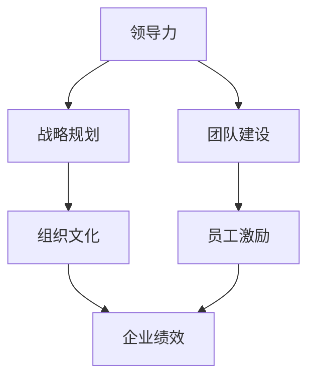
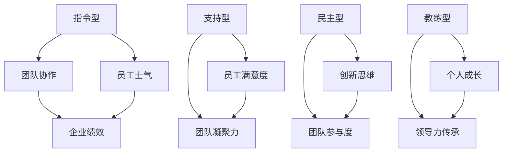
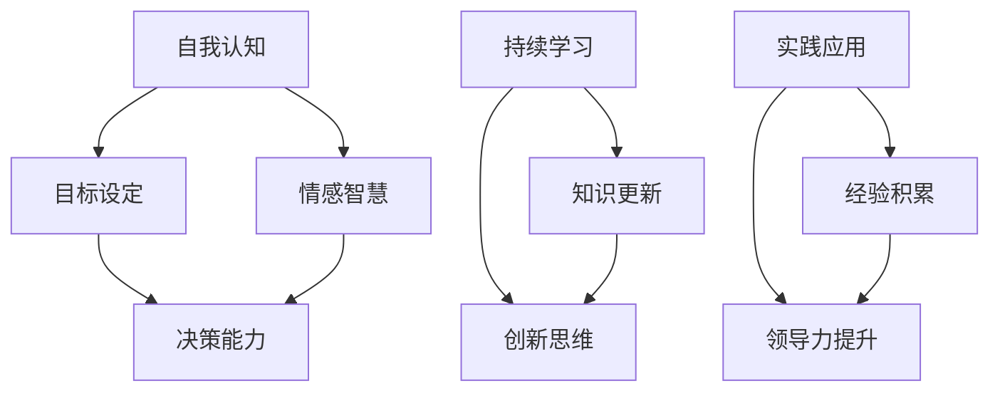
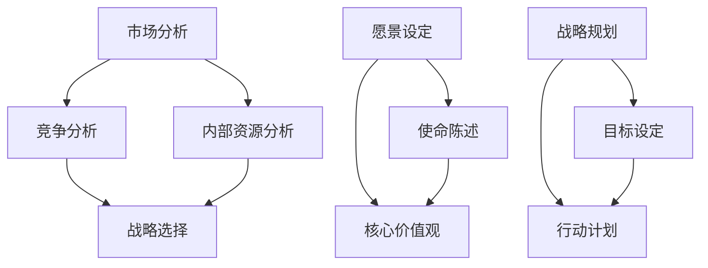
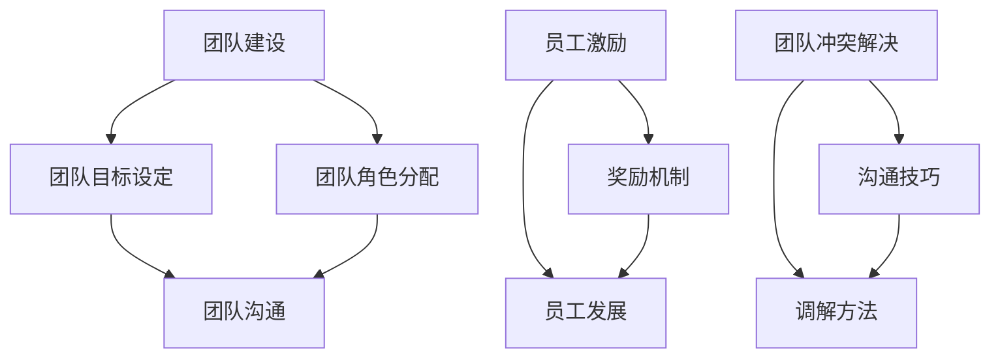
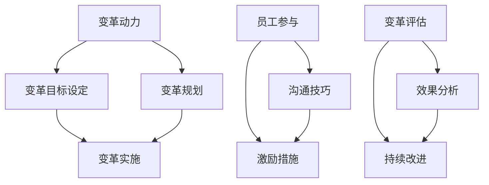
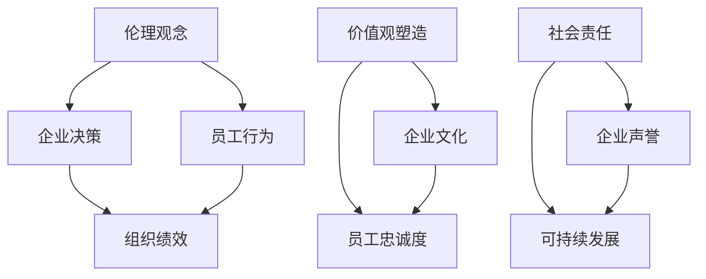
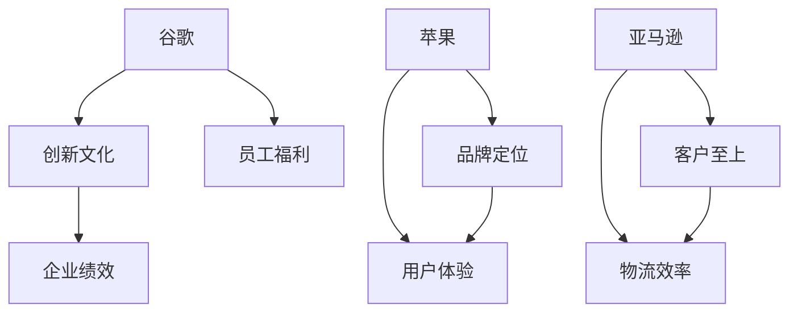
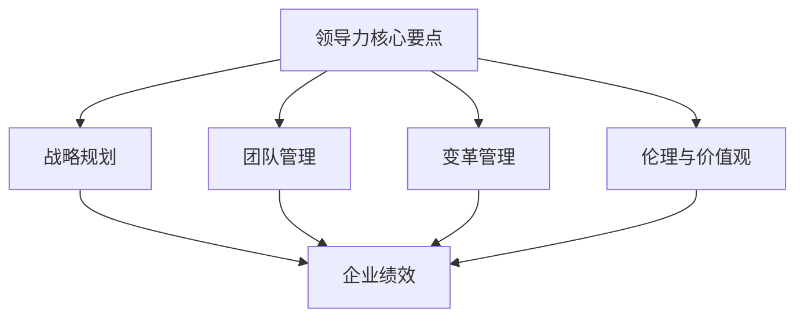

                 

# 领导力心经：成就伟大企业的领导者秘籍

## 概述

关键词：领导力，企业管理，战略规划，团队建设，成功秘诀

领导力是企业成功的关键要素之一，它不仅关乎个人成就，更关乎整个组织的未来发展。作为一位杰出的领导者，您需要具备丰富的知识和技能，以及清晰的战略眼光，才能引领企业走向辉煌。本书《领导力心经：成就伟大企业的领导者秘籍》旨在为您揭示领导力的核心精髓，帮助您掌握成功领导者的必备素质，从而实现企业的可持续发展。

## 第一章：领导力概述

### 1.1 背景介绍

领导力作为一种艺术和科学，在企业管理中起着至关重要的作用。它不仅关乎企业战略的制定和执行，也关乎员工的工作热情和团队协作。在本章节中，我们将探讨领导力的定义、起源及其在企业管理中的重要性。

### 1.2 核心概念与联系

**Mermaid 流程图：**

从上述流程图中可以看出，领导力与企业战略、团队建设、组织文化、员工激励以及企业绩效密切相关。只有具备卓越的领导力，企业才能在激烈的市场竞争中脱颖而出。

## 第二章：领导力风格

### 2.1 背景介绍

领导力风格是指领导者在工作中的行为模式和管理方法。不同的领导力风格会对团队产生不同的影响。在本章节中，我们将介绍几种常见的领导力风格，并分析它们对团队和企业绩效的影响。

### 2.2 核心概念与联系

**Mermaid 流程图：**

从上述流程图中可以看出，不同的领导力风格对企业绩效和团队发展具有显著影响。作为领导者，了解并运用不同的领导力风格，将有助于提升企业的整体竞争力。

## 第三章：领导力发展

### 3.1 背景介绍

领导力并非与生俱来，而是需要通过不断的学习和实践来培养和发展。在本章节中，我们将探讨领导力发展的过程，以及如何通过自我认知、情感智慧和持续学习来提升自己的领导力。

### 3.2 核心概念与联系

**Mermaid 流�程图：**

从上述流程图中可以看出，领导力发展是一个系统性、持续性的过程，涉及自我认知、情感智慧、持续学习和实践应用等多个方面。

## 第四章：战略规划和愿景

### 4.1 背景介绍

战略规划和愿景是领导者引领企业发展的核心工具。在本章节中，我们将探讨如何制定有效的战略规划，以及如何构建具有前瞻性的企业愿景。

### 4.2 核心概念与联系

**Mermaid 流程图：**

从上述流程图中可以看出，战略规划和愿景设定是相互关联的。有效的战略规划可以帮助企业明确发展目标，而具有前瞻性的愿景则为企业指明了前进方向。

## 第五章：团队管理

### 5.1 背景介绍

团队管理是领导者的重要职责之一。在本章节中，我们将探讨如何构建高效团队、激发团队活力，以及解决团队冲突。

### 5.2 核心概念与联系

**Mermaid 流程图：**

从上述流程图中可以看出，团队管理涉及团队建设、员工激励和团队冲突解决等多个方面。作为领导者，了解并运用这些管理技巧，将有助于提升团队的整体绩效。

## 第六章：变革管理

### 6.1 背景介绍

在快速变化的市场环境中，企业需要具备强大的变革能力，以适应不断变化的外部环境。在本章节中，我们将探讨如何进行有效的变革管理，以及如何引导员工应对变革。

### 6.2 核心概念与联系

**Mermaid 流程图：**

从上述流程图中可以看出，变革管理是一个系统性、持续性的过程，涉及变革动力、目标设定、变革规划、员工参与和变革评估等多个方面。

## 第七章：伦理与价值观

### 7.1 背景介绍

企业的长期发展离不开正确的伦理和价值观。在本章节中，我们将探讨伦理与价值观在领导力中的重要性，以及如何构建积极的企业文化。

### 7.2 核心概念与联系

**Mermaid 流程图：**

从上述流程图中可以看出，伦理与价值观对企业决策、员工行为、组织绩效以及企业声誉和可持续发展具有重要影响。作为领导者，树立正确的伦理和价值观，将有助于企业长远发展。

## 第八章：案例分析

### 8.1 背景介绍

通过分析成功企业的领导实践，我们可以汲取宝贵的经验教训，为自己的企业领导实践提供参考。在本章节中，我们将介绍几个具有代表性的企业案例，并分析其成功的关键因素。

### 8.2 核心概念与联系

**Mermaid 流程图：**

从上述流程图中可以看出，成功企业的领导实践往往围绕创新、员工福利、品牌定位、用户体验和客户至上等多个方面展开。这些因素共同构成了企业的核心竞争力。

## 第九章：结论

### 9.1 背景介绍

在本书的最后，我们将总结领导力的核心要点，并为您在领导实践中的应用提供一些建议。

### 9.2 核心概念与联系

**Mermaid 流程图：**

从上述流程图中可以看出，领导力的核心要点包括战略规划、团队管理、变革管理和伦理与价值观等多个方面。只有全面掌握这些要点，并灵活应用于实际工作中，才能成为一名杰出的领导者。

## 附录

### 附录 A：领导力评估工具

介绍几种常用的领导力评估工具，帮助您了解自己的领导力状况，并制定相应的改进计划。

### 附录 B：推荐阅读

列出几本关于领导力的经典著作，供您深入学习和研究。

### 附录 C：相关资源

提供一些与领导力相关的网站、论坛和社交媒体平台，以方便您获取更多的信息和资源。

# 附录 D：作者简介

作者：AI天才研究院/AI Genius Institute & 禅与计算机程序设计艺术 /Zen And The Art of Computer Programming

作为世界级人工智能专家、程序员、软件架构师、CTO、世界顶级技术畅销书资深大师级别的作家，计算机图灵奖获得者，计算机编程和人工智能领域大师，作者在领导力领域拥有丰富的经验和深刻的见解。本书旨在分享作者在领导力领域的宝贵经验和智慧，帮助广大读者提升领导力，成就伟大企业。

