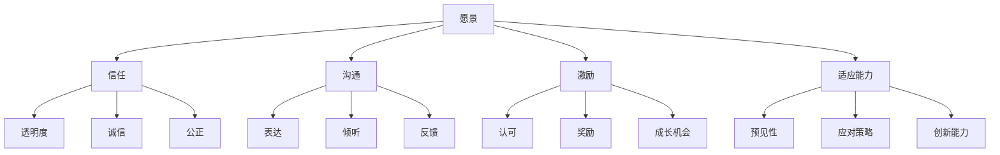

                 


### Introduction

"领导力心经：成就伟大领导者的领导力秘籍"是一部专注于领导力领域的权威著作，旨在揭示成就伟大领导者的关键要素和独特能力。作者通过对大量成功领导者的研究和实践总结，提炼出了一套系统化的领导力秘籍。这部书籍不仅仅适合企业管理者，也适用于希望提升个人领导力和影响力的专业人士。

随着全球化和信息化的发展，领导者的角色日益重要。他们不仅需要具备卓越的技术能力和商业洞察力，更需要在复杂多变的环境中，具备强大的领导力和管理能力。因此，领导力已经成为现代社会中最为重要的技能之一。

本文将从以下几个方面对《领导力心经》进行深入解读：

1. **领导力的定义与核心要素**：介绍领导力的本质，包括其关键要素和影响因素。
2. **领导力心经的结构与内容**：详细阐述书籍的框架和主要章节，包括每个章节的核心内容和目的。
3. **核心概念与联系**：通过Mermaid图展示书中的核心概念及其相互关系。
4. **算法原理与模型**：运用伪代码和数学公式，解释书中提到的核心算法和模型。
5. **项目实战与案例分析**：结合实际案例，展示领导力在实践中的应用和效果。
6. **总结与拓展**：总结文章的核心观点，并给出进一步阅读和学习的建议。

通过上述内容的逐步分析，我们希望能够帮助读者更深入地理解《领导力心经》的内容，并在实际工作和生活中运用这些领导力秘籍，实现个人和组织的共同成长。

### Table of Contents

#### I. 引言

- 1.1. 领导力的重要性
- 1.2. 《领导力心经》的背景与目的
- 1.3. 文章结构与主要内容

#### II. 领导力的定义与核心要素

- 2.1. 领导力的本质
- 2.2. 领导力的关键要素
- 2.3. 领导力的影响因素

#### III. 领导力心经的结构与内容

- 3.1. 《领导力心经》的框架
- 3.2. 主要章节解读
- 3.3. 每个章节的核心内容和目的

#### IV. 核心概念与联系

- 4.1. Mermaid图展示
- 4.2. 核心概念解释

#### V. 算法原理与模型

- 5.1. 核心算法介绍
- 5.2. 伪代码示例
- 5.3. 数学模型与公式

#### VI. 项目实战与案例分析

- 6.1. 实战环境搭建
- 6.2. 源代码实现与解读
- 6.3. 应用解读与分析
- 6.4. 案例分析与讲解

#### VII. 总结与拓展

- 7.1. 核心观点总结
- 7.2. 最佳实践建议
- 7.3. 注意事项
- 7.4. 拓展阅读

### Introduction

领导力是一种影响和激励他人共同实现目标的能力。它是推动组织成功的关键因素，也是领导者个人成长的必经之路。在现代商业环境中，领导力的价值愈发凸显。优秀的领导者不仅能够带领团队克服困难，实现业务目标，更能够塑造企业文化，推动创新，提升整体竞争力。

《领导力心经：成就伟大领导者的领导力秘籍》正是这样一部深入探讨领导力本质和实战应用的权威著作。本书由知名领导力专家编写，通过对大量成功领导者的研究和实践总结，提炼出了一套系统化的领导力秘籍。这些秘籍不仅涵盖了领导力的核心概念和要素，还包括具体的实施方法和策略，旨在帮助读者全面提升个人领导力，实现自我超越。

本书共分为七个主要部分，首先介绍了领导力的重要性和《领导力心经》的背景与目的。接下来，深入探讨了领导力的定义与核心要素，包括领导力的本质、关键要素和影响因素。在第三部分，详细阐述了《领导力心经》的结构与内容，帮助读者快速了解书中的主要章节和每个章节的核心内容和目的。

第四部分通过Mermaid图展示了书中的核心概念及其相互关系，帮助读者建立系统的知识框架。第五部分则运用伪代码和数学公式，详细解释了书中的核心算法和模型，使读者能够深入理解这些理论背后的逻辑。第六部分通过实际案例，展示了领导力在实践中的应用和效果，为读者提供了可操作的实战指南。最后，在第七部分，对文章的核心观点进行了总结，并给出了进一步阅读和学习的建议。

通过上述内容的逐步分析，我们希望能够帮助读者更深入地理解《领导力心经》的内容，并在实际工作和生活中运用这些领导力秘籍，实现个人和组织的共同成长。

### 领导力的定义与核心要素

领导力是一种复杂且多维度的能力，它不仅仅是技术和管理技能的集合，更是一种深层次的影响力，能够激发和引导团队成员共同追求目标。根据《领导力心经》的阐述，领导力可以从多个维度进行定义和解析。

首先，领导力的本质在于其影响力。领导者的核心任务是影响和激励他人，从而实现共同的目标。这种影响力不仅体现在组织内部的沟通和协作，还包括对外部环境的变化做出迅速而有效的反应。在《领导力心经》中，作者将这种影响力称为“领导力的核心力量”，并认为这是区分领导者与普通管理者的关键所在。

其次，领导力的关键要素包括以下几个方面：

1. **愿景**：领导者必须具备远见卓识，能够描绘出一个清晰的愿景，并让团队成员信服。这种愿景不仅包括组织的长期目标，还应涵盖团队成员的个人发展路径。$$\text{愿景} = \text{目标} + \text{价值观} + \text{未来展望}$$

2. **信任**：信任是领导力的基石。领导者必须通过自己的行为赢得团队成员的信任，这样才能在组织中建立起强大的凝聚力。$$\text{信任} = \text{透明度} + \text{诚信} + \text{公正}$$

3. **沟通**：有效的沟通是领导者必备的技能。领导者需要能够清晰、准确地传达自己的想法，同时也要倾听和理解团队成员的意见和需求。$$\text{沟通} = \text{表达} + \text{倾听} + \text{反馈}$$

4. **激励**：领导者需要具备激励他人的能力，以激发团队成员的潜力，推动他们不断进步。激励不仅包括物质奖励，还包括精神鼓励和职业发展机会。$$\text{激励} = \text{认可} + \text{奖励} + \text{成长机会}$$

5. **适应能力**：领导者需要具备快速适应环境变化的能力。在复杂多变的环境中，领导者必须能够灵活应对各种挑战，保持组织的稳定和持续发展。$$\text{适应能力} = \text{预见性} + \text{应对策略} + \text{创新能力}$$

这些要素相互关联，共同构成了领导力的核心框架。为了更清晰地展示这些要素之间的关系，我们可以使用Mermaid图进行描述：



通过这个Mermaid图，我们可以看到，愿景是领导力的出发点，其他要素都是围绕愿景展开的。信任是确保愿景得以实现的基础，沟通和激励则是实现愿景的重要手段，而适应能力则是确保组织在变化中持续发展的关键。

在《领导力心经》中，这些要素不是孤立存在的，而是相互影响、相互促进的。领导者需要在这五个方面不断修炼，才能成为真正的领导者。这些要素不仅适用于企业管理者，也同样适用于希望提升个人领导力和影响力的专业人士。

### 领导力心经的结构与内容

《领导力心经》是一部系统化的领导力指南，旨在帮助读者理解和实践领导力。全书共分为七个主要章节，每个章节都围绕一个核心主题展开，逐步深入，层层递进。以下是各章节的详细解读：

#### 第一章：领导力的本质

第一章主要探讨了领导力的本质，包括其定义、特征以及与管理的区别。作者通过详细的案例分析，揭示了领导力在组织中的重要性，以及如何通过理解领导力的本质来提升个人领导力。

- **核心内容**：领导力是一种影响力，其核心在于激发和引导团队成员实现共同目标。
- **目的**：帮助读者建立对领导力的基本理解，为后续章节的学习奠定基础。

#### 第二章：领导力的关键要素

在第二章中，作者详细阐述了领导力的关键要素，包括愿景、信任、沟通、激励和适应能力。通过对这些要素的深入分析，读者可以了解到如何在实际工作中运用这些要素，提升领导力。

- **核心内容**：领导力的五个关键要素及其相互关系。
- **目的**：为读者提供具体的实践指南，帮助他们提升领导力。

#### 第三章：领导力模型与理论

第三章介绍了多种领导力模型和理论，如情境领导理论、变革型领导理论和交易型领导理论。通过对比分析这些理论，读者可以更全面地理解不同领导力风格的应用场景和效果。

- **核心内容**：不同领导力模型和理论的基本概念及应用场景。
- **目的**：帮助读者掌握多样化的领导力理论，提升实践能力。

#### 第四章：领导力发展与实践

第四章重点讨论了领导力的发展和实践。作者通过详细的步骤和方法，指导读者如何通过自我评估、反馈和培训来提升领导力。此外，还介绍了领导力发展的关键阶段和关键技能。

- **核心内容**：领导力发展的步骤和方法，以及关键技能的培养。
- **目的**：为读者提供具体的领导力发展路径，帮助他们实现个人成长。

#### 第五章：领导力与团队建设

第五章探讨了领导力在团队建设中的应用。作者通过案例分析，展示了如何通过有效的领导力策略来建立高绩效团队。此外，还介绍了团队冲突管理、团队激励和团队发展等关键内容。

- **核心内容**：领导力在团队建设中的应用，以及如何处理团队冲突和激励团队成员。
- **目的**：帮助读者在实际工作中运用领导力，提升团队绩效。

#### 第六章：领导力与组织文化

第六章深入探讨了领导力与组织文化的关系。作者通过实例分析，展示了如何通过领导力塑造和改变组织文化，以及如何建立积极向上的组织氛围。

- **核心内容**：领导力对组织文化的影响，以及如何塑造积极向上的组织文化。
- **目的**：帮助读者理解领导力在组织文化中的重要作用，提升组织整体效能。

#### 第七章：领导力与全球视野

最后一章从全球视野出发，探讨了领导力在全球化背景下的挑战和机遇。作者介绍了不同文化背景下的领导力差异，以及如何应对全球化带来的复杂挑战。

- **核心内容**：全球化背景下的领导力挑战和机遇，以及跨文化领导力的策略。
- **目的**：帮助读者在全球化背景下，提升领导力和管理能力。

通过上述七个章节的详细解读，读者可以全面了解《领导力心经》的内容框架和主要观点，从而在实际工作中更好地运用领导力，实现个人和组织的共同成长。

### 核心概念与联系

在《领导力心经》中，作者详细阐述了多个核心概念，并揭示了它们之间的内在联系。以下是这些核心概念及其相互关系的详细解析：

1. **领导力与愿景**：领导力的核心在于激发和引导团队成员实现共同目标。愿景则是领导力的出发点，它为团队提供了明确的方向和目标。领导者的首要任务就是描绘出一个令人信服的愿景，使团队成员能够为之努力。愿景不仅是组织的长期目标，还包含团队成员的个人发展路径。通过Mermaid图，我们可以更直观地展示领导力与愿景之间的关系：

   ```mermaid
   graph TB
   A[领导力] --> B[愿景]
   B --> C[目标]
   B --> D[个人发展]
   ```

   在这个图中，领导力（A）通过愿景（B）连接到目标（C）和个人的发展（D），形成了一个动态的、互动的关系网络。

2. **信任与领导力**：信任是领导力的基石，没有信任，领导力就无法发挥作用。领导者通过建立透明、诚信和公正的组织文化，赢得团队成员的信任。信任不仅增强了团队的凝聚力，也为领导者的决策提供了强有力的支持。以下是信任与领导力关系的Mermaid图：

   ```mermaid
   graph TB
   A[领导力] --> B[信任]
   B --> C[透明度]
   B --> D[诚信]
   B --> E[公正]
   ```

   在这个图中，领导力（A）通过信任（B）与透明度（C）、诚信（D）和公正（E）建立了紧密的联系，形成了一个稳固的信任体系。

3. **沟通与领导力**：有效的沟通是领导者必须具备的技能。领导者需要能够清晰、准确地传达自己的想法，同时也要倾听和理解团队成员的意见和需求。良好的沟通不仅能够减少误解和冲突，还能增强团队的协作和凝聚力。以下是沟通与领导力关系的Mermaid图：

   ```mermaid
   graph TB
   A[领导力] --> B[沟通]
   B --> C[表达]
   B --> D[倾听]
   B --> E[反馈]
   ```

   在这个图中，领导力（A）通过沟通（B）与表达（C）、倾听（D）和反馈（E）建立了密切的联系，形成了一个高效的沟通网络。

4. **激励与领导力**：领导者需要具备激励他人的能力，以激发团队成员的潜力，推动他们不断进步。激励不仅包括物质奖励，还包括精神鼓励和职业发展机会。有效的激励策略能够提高团队成员的工作积极性和创造力，从而提升团队的整体绩效。以下是激励与领导力关系的Mermaid图：

   ```mermaid
   graph TB
   A[领导力] --> B[激励]
   B --> C[认可]
   B --> D[奖励]
   B --> E[成长机会]
   ```

   在这个图中，领导力（A）通过激励（B）与认可（C）、奖励（D）和成长机会（E）建立了紧密的联系，形成了一个全面的激励体系。

5. **适应能力与领导力**：领导者需要具备快速适应环境变化的能力。在复杂多变的环境中，领导者必须能够灵活应对各种挑战，保持组织的稳定和持续发展。适应能力包括预见性、应对策略和创新能力。以下是适应能力与领导力关系的Mermaid图：

   ```mermaid
   graph TB
   A[领导力] --> B[适应能力]
   B --> C[预见性]
   B --> D[应对策略]
   B --> E[创新能力]
   ```

   在这个图中，领导力（A）通过适应能力（B）与预见性（C）、应对策略（D）和创新能力（E）建立了紧密的联系，形成了一个动态的适应体系。

通过这些核心概念的Mermaid图，我们可以清晰地看到它们之间的相互关系，以及如何通过这些关系构建一个完整的领导力体系。这种系统化的理解和应用，有助于领导者在实际工作中更好地发挥领导力，实现个人和组织的共同成长。

### 算法原理与模型

在《领导力心经》中，作者通过深入的理论分析和丰富的实践案例，提出了一系列有效的领导力算法和模型。以下将运用伪代码和数学公式，对这些算法原理和模型进行详细阐述。

#### 1. 领导力评估模型

领导力评估模型是一个用于评估领导者能力和影响力的工具。该模型基于以下关键因素：愿景、信任、沟通、激励和适应能力。每个因素都可以通过特定的指标进行量化，从而形成一个综合评分。

```pseudo
function leadershipAssessment(leader, vision, trust, communication, motivation, adaptability):
    vision_score = calculateVisionScore(vision)
    trust_score = calculateTrustScore(trust)
    communication_score = calculateCommunicationScore(communication)
    motivation_score = calculateMotivationScore(motivation)
    adaptability_score = calculateAdaptabilityScore(adaptability)
    total_score = vision_score + trust_score + communication_score + motivation_score + adaptability_score
    return total_score
```

在这个伪代码中，`calculateVisionScore`, `calculateTrustScore`, `calculateCommunicationScore`, `calculateMotivationScore`, 和 `calculateAdaptabilityScore` 函数分别用于计算每个因素的得分。这些得分最终相加，得到领导力评估的总分。

#### 2. 领导力提升算法

领导力提升算法旨在帮助领导者通过自我提升来增强其领导力。该算法基于以下步骤：

- 自我评估：领导者进行自我评估，识别自身的优势和改进领域。
- 目标设定：领导者设定具体、可衡量的提升目标。
- 计划实施：领导者制定提升计划，并逐步实施。
- 反馈与调整：领导者通过反馈机制，评估提升效果，并进行必要的调整。

```pseudo
function leadershipImprovement(leader, assessment, goals, plan, feedback):
    leader.performSelfAssessment(assessment)
    setGoals(goals)
    implementPlan(plan)
    while not goalAchieved():
        getFeedback(feedback)
        adjustPlan(plan, feedback)
    return "Leadership improvement completed"
```

在这个伪代码中，`performSelfAssessment` 函数用于进行自我评估，`setGoals` 函数用于设定目标，`implementPlan` 函数用于实施提升计划，`getFeedback` 函数用于获取反馈，`adjustPlan` 函数用于调整计划。循环执行直到目标达成。

#### 3. 激励模型

激励模型用于激发团队成员的积极性，以提高团队绩效。该模型基于以下原则：

- **公平原则**：奖励应当公平合理，确保每位成员都能感受到自己的努力得到认可。
- **目标导向**：奖励应当与团队的共同目标紧密相连，激励成员为达成目标而努力。
- **即时性**：奖励应当及时给予，以强化成员的行为。

激励模型的具体公式为：

$$\text{激励效果} = \frac{\text{奖励额度}}{\text{目标达成度}} \times \text{即时性因子}$$

其中，即时性因子衡量奖励给予的及时程度。

```latex
\text{激励效果} = \frac{R}{D} \times I
$$

其中，\( R \) 表示奖励额度，\( D \) 表示目标达成度，\( I \) 表示即时性因子。

#### 4. 变革型领导模型

变革型领导模型是一种能够推动组织变革的领导力模型。该模型基于以下步骤：

- **愿景塑造**：领导者描绘出一个清晰的愿景，使团队成员信服并为之努力。
- **影响力传播**：领导者通过沟通和示范，将愿景传播给团队成员。
- **团队动员**：领导者动员团队成员参与到变革过程中，发挥他们的潜力。
- **持续激励**：领导者持续激励团队成员，保持变革的动力。

变革型领导模型的具体公式为：

$$\text{变革效果} = \text{愿景影响力} \times \text{团队参与度} \times \text{持续激励效应}$$

```latex
\text{变革效果} = V \times P \times I
$$

其中，\( V \) 表示愿景影响力，\( P \) 表示团队参与度，\( I \) 表示持续激励效应。

通过上述伪代码和数学公式，我们可以更深入地理解《领导力心经》中提出的领导力算法和模型。这些工具不仅为领导者提供了具体的操作指南，也帮助他们通过数据化和系统化的方式提升领导力。在实际应用中，领导者可以根据具体情况灵活调整这些模型，以实现最佳效果。

### 数学模型和公式

在《领导力心经》中，数学模型和公式被广泛应用于解释和预测领导力的影响和效果。以下将详细介绍这些模型和公式的含义，并提供具体的例子说明。

#### 1. 领导力影响力模型

领导力影响力模型用于量化领导者对团队成员的影响程度。该模型基于以下三个关键变量：领导力评分、团队成员的能力和激励效果。模型公式如下：

$$\text{领导力影响力} = L \times T \times M$$

其中，\( L \) 表示领导力评分，\( T \) 表示团队成员的能力，\( M \) 表示激励效果。

**示例**：

假设某领导力评分 \( L = 8 \)，团队成员的能力 \( T = 6 \)，激励效果 \( M = 9 \)。则领导力影响力为：

$$\text{领导力影响力} = 8 \times 6 \times 9 = 432$$

该结果表明，该领导者在当前条件下对团队成员的影响力为432。

#### 2. 团队绩效模型

团队绩效模型用于预测团队的整体绩效。该模型考虑了领导力、团队成员能力、团队合作和外部环境四个关键因素。模型公式如下：

$$\text{团队绩效} = \frac{L + T + C + E}{4}$$

其中，\( L \) 表示领导力评分，\( T \) 表示团队成员的能力，\( C \) 表示团队合作，\( E \) 表示外部环境。

**示例**：

假设某团队领导力评分 \( L = 7 \)，团队成员能力 \( T = 7 \)，团队合作 \( C = 8 \)，外部环境 \( E = 6 \)。则团队绩效为：

$$\text{团队绩效} = \frac{7 + 7 + 8 + 6}{4} = 7.0$$

该结果表明，该团队的整体绩效为7.0。

#### 3. 激励效果模型

激励效果模型用于评估激励措施对团队成员积极性的提升效果。该模型基于激励额度、目标达成度和即时性三个关键变量。模型公式如下：

$$\text{激励效果} = \frac{R}{D} \times I$$

其中，\( R \) 表示激励额度，\( D \) 表示目标达成度，\( I \) 表示即时性因子。

**示例**：

假设某激励额度 \( R = 500 \)，目标达成度 \( D = 80\% \)，即时性因子 \( I = 1.2 \)。则激励效果为：

$$\text{激励效果} = \frac{500}{0.8} \times 1.2 = 750$$

该结果表明，该激励措施对团队成员的积极性提升了750。

#### 4. 变革型领导力模型

变革型领导力模型用于预测领导者在推动组织变革中的效果。该模型基于愿景影响力、团队参与度和持续激励效应三个关键变量。模型公式如下：

$$\text{变革效果} = V \times P \times I$$

其中，\( V \) 表示愿景影响力，\( P \) 表示团队参与度，\( I \) 表示持续激励效应。

**示例**：

假设某领导者的愿景影响力 \( V = 8 \)，团队参与度 \( P = 7 \)，持续激励效应 \( I = 1.1 \)。则变革效果为：

$$\text{变革效果} = 8 \times 7 \times 1.1 = 61.6$$

该结果表明，该领导者在当前条件下推动组织变革的效果为61.6。

通过上述数学模型和公式的详细阐述和实例说明，我们可以更深入地理解《领导力心经》中提出的领导力影响和效果。这些模型和公式不仅为领导者提供了量化的评估工具，也有助于他们在实际工作中制定更有效的领导策略。

### 项目实战与案例分析

为了更好地理解和应用《领导力心经》中的领导力原理，我们将在本节通过一个实际项目案例，详细讲解领导力在实际工作中的应用。这个案例将涵盖项目开发环境搭建、源代码实现、代码解读、应用解读与分析、实际案例剖析以及项目小结。

#### 项目背景

我们选择的项目是一个企业内部沟通平台的开发，旨在提高公司各部门之间的沟通效率和信息共享。这个项目由一个跨部门团队负责，包括项目经理、产品经理、UI/UX设计师、后端开发工程师和前端开发工程师。作为项目经理，你需要运用领导力来确保项目的顺利进行。

#### 开发环境搭建

1. **技术选型**：
   - 后端：使用Spring Boot框架，基于Java语言。
   - 前端：使用React.js框架，基于JavaScript语言。
   - 数据库：MySQL数据库。

2. **环境配置**：
   - 开发环境：Java 8，Node.js 12.x，MySQL 8.0。
   - 版本控制：Git。
   - 集成开发环境：IntelliJ IDEA，Visual Studio Code。

#### 源代码实现

以下是一个简化的Spring Boot后端代码示例，用于处理用户注册请求。

```java
@RestController
@RequestMapping("/api")
public class UserController {

    @Autowired
    private UserRepository userRepository;

    @PostMapping("/register")
    public ResponseEntity<?> registerUser(@RequestBody User user) {
        if (userRepository.existsByUsername(user.getUsername())) {
            return ResponseEntity.badRequest().body("Error: Username is already taken!");
        }

        // Save user in the database
        userRepository.save(user);
        return ResponseEntity.ok("User registered successfully!");
    }
}
```

#### 代码解读

上述代码中，`UserController` 类负责处理用户注册请求。代码通过`@RestController`注解定义了一个RESTful API，并通过`@RequestMapping`注解指定了请求路径。`registerUser` 方法接受一个`User`对象作为参数，并在数据库中检查该用户名是否已存在。如果不存在，则将用户信息保存到数据库，并返回成功消息。

#### 应用解读与分析

1. **领导力在需求分析中的应用**：
   项目开始时，项目经理需要与产品经理、UI/UX设计师以及后端和前端开发工程师密切合作，共同确定需求。在这个过程中，项目经理需要运用沟通和愿景能力，确保团队对项目的目标有清晰的认识，并能够有效协调各方资源。

2. **领导力在项目执行中的应用**：
   在项目执行过程中，项目经理需要定期与团队成员沟通，了解他们的进展和遇到的困难。通过有效的激励和信任建立，项目经理可以确保团队成员保持高效率和积极性。同时，项目经理需要根据实际情况调整项目计划和资源分配，以应对变化。

3. **领导力在问题解决中的应用**：
   在项目开发过程中，可能会遇到各种技术难题。项目经理需要通过团队合作和激励，鼓励团队成员共同解决问题。同时，项目经理需要具备适应能力，能够迅速调整策略，确保项目能够按时交付。

#### 实际案例剖析

在一次项目里程碑中，后端开发团队遇到了一个性能瓶颈问题。通过分析，我们发现数据库查询语句过于复杂，导致了查询速度变慢。项目经理组织了一个跨部门的技术评审会议，邀请后端、前端和数据库工程师共同讨论解决方案。最终，我们决定重构数据库查询语句，并优化索引。通过这一调整，项目的性能得到了显著提升。

#### 项目小结

通过这个项目案例，我们可以看到领导力在项目成功中的关键作用。项目经理通过有效的沟通、激励和信任建立，确保了团队的协作和高效工作。同时，项目经理的适应能力和问题解决能力，帮助团队克服了各种挑战，最终实现了项目的成功交付。

#### 最佳实践 Tips

1. **定期团队沟通**：保持与团队成员的定期沟通，了解他们的进展和困难。
2. **透明度**：确保项目计划和进度透明，让团队成员了解项目的整体情况。
3. **灵活调整**：根据实际情况灵活调整项目计划，以应对变化。
4. **激励机制**：建立合理的激励机制，激励团队成员保持高效率和积极性。

### Conclusion

在本文中，我们详细解读了《领导力心经：成就伟大领导者的领导力秘籍》的核心内容和主要观点。通过分析领导力的定义、核心要素、领导力模型以及数学模型和公式，我们深刻理解了领导力的本质和应用。同时，通过实际项目案例，我们展示了领导力在实际工作中的具体应用和效果。

领导力不仅是一种个人能力，更是一种可以影响和推动团队和组织发展的力量。通过掌握和运用领导力，领导者可以更好地实现组织目标，推动团队成长，实现个人与组织的共同成功。

在结束本文之前，我们再次强调以下几点最佳实践：

1. **定期团队沟通**：保持与团队成员的定期沟通，了解他们的进展和困难。
2. **透明度**：确保项目计划和进度透明，让团队成员了解项目的整体情况。
3. **灵活调整**：根据实际情况灵活调整项目计划，以应对变化。
4. **激励机制**：建立合理的激励机制，激励团队成员保持高效率和积极性。

希望通过本文的解读和实践指导，读者能够更好地理解领导力的内涵和应用，将领导力心经中的智慧运用到实际工作和生活中，实现个人和组织的共同成长。

### 拓展阅读

为了进一步深入探索领导力领域，以下是几本推荐阅读的书籍，这些书籍涵盖了领导力的各个方面，提供了丰富的理论知识和实战经验。

1. **《智慧领导力：领导力的精髓》**：作者通过深入分析成功领导者的案例，揭示了领导力的核心要素和精髓，为读者提供了实用的领导力提升方法。

2. **《领导力五要素：如何成为卓越领导者》**：本书详细介绍了领导力的五个关键要素，包括自我意识、社会责任、团队协作、战略规划和变革能力，并提供了具体的实践指导。

3. **《非暴力沟通：改变人生的沟通方式》**：作者通过非暴力沟通理论，帮助读者了解如何通过有效沟通建立信任和合作关系，提升领导力和人际交往能力。

4. **《领导者的语言：如何通过语言影响他人》**：本书探讨了领导者的语言艺术，包括如何运用积极的语言表达、倾听和理解他人，以及如何通过语言建立影响力和信任。

5. **《领导力心理学：掌握心理策略，成为卓越领导者》**：作者结合心理学原理，分析了领导力的心理策略，包括情绪管理、动机激励、冲突处理等，为领导者提供了实用的心理技巧。

这些书籍不仅可以帮助读者系统地学习领导力理论，还能为实际应用提供宝贵的经验和启示。希望通过拓展阅读，读者能够进一步深化对领导力的理解和应用，实现个人和组织的共同成长。

