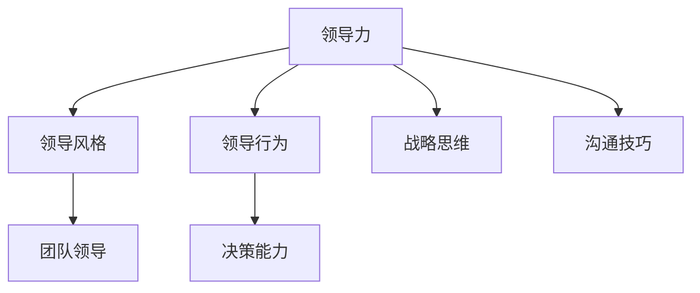

                 

### 文章标题

# 《领导力心经：成就伟大领袖的领导力法则》

### 关键词

- 领导力
- 领导风格
- 领导行为
- 领导力模型
- 领导力实践
- 变革领导
- 决策能力
- 战略思维
- 个人成长
- 持续学习

### 摘要

《领导力心经：成就伟大领袖的领导力法则》是一篇深入探讨领导力核心概念、原理和实践技术的高质量技术博客文章。文章通过逻辑清晰、结构紧凑、简单易懂的专业技术语言，从领导力概述、领导力理论、领导力实践、领导力挑战和领导力提升等多个方面展开论述。文章不仅介绍了领导力的定义和领导力与管理的区别，还深入探讨了领导力模型、领导风格、团队领导、沟通技巧、决策能力、战略思维等关键概念。同时，文章通过实际案例分析和详细讲解，揭示了领导力在实际应用中的关键要素和成功策略。此外，文章还强调了持续学习和个人成长在领导力提升中的重要性，并提供了最佳实践 tips 和拓展阅读建议。本文旨在帮助读者深入了解领导力的本质，掌握领导力法则，成就伟大领袖。

## 引言

在当今这个瞬息万变的时代，领导力已成为企业成功的关键因素。一个优秀的领导者不仅需要具备卓越的技术能力，还需要拥有出色的领导才能。然而，领导力并非天生具备，它是一种可以通过学习和实践不断发展和提升的能力。本文旨在探讨领导力的核心概念、原理和实践技术，帮助读者深入了解领导力，掌握领导力法则，成就伟大领袖。

### 背景介绍

领导力是一种影响力，它能够激励和引导团队成员共同实现目标。领导力不仅仅存在于企业环境中，它还贯穿于个人生活和社会各个方面。一个成功的领导者需要具备多种能力，包括战略思维、决策能力、沟通技巧、团队领导等。随着全球化和信息化的发展，领导力的需求越来越强烈，企业对领导力的培养和提升也越来越重视。

### 核心概念与联系

为了更好地理解领导力，我们需要明确几个核心概念，并探讨它们之间的关系。以下是几个关键概念及其相互联系：

1. **领导力（Leadership）**：领导力是指通过影响和激励他人来实现共同目标的能力。它不仅仅是权威和权力的体现，更是一种影响力、沟通能力和团队合作能力的综合体现。

2. **领导风格（Leadership Style）**：领导风格是指领导者处理团队关系、决策方式和领导行为的方式。常见的领导风格包括权威型、参与型、民主型和教练型等。

3. **领导行为（Leadership Behavior）**：领导行为是指领导者在日常工作中表现出的行为特征。领导行为包括激励、指导、沟通、决策等。

4. **团队领导（Team Leadership）**：团队领导是指领导者如何引导和管理团队，以实现团队目标。团队领导需要关注团队成员的需求，培养团队协作精神，提高团队绩效。

5. **决策能力（Decision-Making Ability）**：决策能力是指领导者如何制定决策、评估风险和实施决策的能力。决策能力对于企业的成功至关重要。

6. **战略思维（Strategic Thinking）**：战略思维是指领导者如何制定和实施长期发展规划的能力。战略思维需要领导者具备远见和前瞻性，能够把握市场变化和趋势。

7. **沟通技巧（Communication Skills）**：沟通技巧是指领导者如何有效地与团队成员、上级和下属进行沟通的能力。沟通技巧对于团队协作和决策制定至关重要。

这些概念之间存在着紧密的联系。领导力是领导风格和领导行为的基础，团队领导和决策能力是领导力的具体体现，战略思维和沟通技巧则是领导力的关键辅助。以下是一个简化的 Mermaid 流程图，展示了这些概念之间的关系：



通过这个流程图，我们可以更直观地理解领导力的各个组成部分及其相互关系。

### 核心算法原理讲解

在理解了领导力的核心概念和相互关系后，我们需要深入探讨领导力的一些核心算法原理。以下是几个关键算法及其原理的讲解：

#### 1. 领导力五要素模型

领导力五要素模型是一种常见的领导力模型，它由五个关键要素组成：自我认知、团队建设、目标设定、激励和领导力发展。以下是这个模型的详细讲解：

```markdown
$$
\text{领导力五要素模型} = (\text{自我认知}, \text{团队建设}, \text{目标设定}, \text{激励}, \text{领导力发展})
$$

- **自我认知**：领导者需要了解自己的优势和弱点，以便更好地发挥自身潜力。自我认知包括自我评估、自我反馈和自我调整。
- **团队建设**：领导者需要建立高效团队，激发团队成员的潜力，实现团队目标。团队建设包括团队组建、团队沟通和团队激励。
- **目标设定**：领导者需要设定明确的目标，引导团队朝着共同目标前进。目标设定包括目标设定原则、目标分解和目标评估。
- **激励**：领导者需要激励团队成员，提高团队成员的积极性和主动性。激励包括正面激励、负面激励和情境激励。
- **领导力发展**：领导者需要不断提升自身领导力，适应不断变化的环境和挑战。领导力发展包括领导力培训、领导力实践和领导力反思。
```

#### 2. 蓝带领导力模型

蓝带领导力模型是一种基于日本蓝带学校的领导力模型，它强调领导者需要具备创新能力、沟通能力和团队领导能力。以下是这个模型的详细讲解：

```markdown
$$
\text{蓝带领导力模型} = (\text{创新能力}, \text{沟通能力}, \text{团队领导能力})
$$

- **创新能力**：领导者需要具备创新能力，能够提出新的想法和解决方案，引领团队不断创新。创新能力包括创意思维、问题解决和风险评估。
- **沟通能力**：领导者需要具备沟通能力，能够有效地与团队成员、上级和下属进行沟通，传达信息、解决问题和达成共识。沟通能力包括沟通技巧、聆听能力和情感管理。
- **团队领导能力**：领导者需要具备团队领导能力，能够引导和管理团队，实现团队目标。团队领导能力包括团队组建、团队激励和团队管理。
```

通过以上讲解，我们可以看到领导力的核心算法原理是如何构建和运作的。这些算法原理不仅为我们提供了理解和应用领导力的框架，也为我们在实际工作中提升领导力提供了具体的指导。

### 数学模型和公式

在领导力的研究和实践中，数学模型和公式经常被用来描述和解释领导力的各个方面。以下是一些常用的数学模型和公式，以及它们的详细讲解和举例说明：

#### 1. 领导力影响力模型

领导力影响力模型是衡量领导者影响力的一种数学模型。它通过计算领导者对团队成员的影响程度来评估领导力。公式如下：

$$
\text{影响力} = \alpha \times (\text{信任} + \text{尊重} + \text{依赖})
$$

其中，α（alpha）是影响力系数，表示领导者自身的魅力和影响力。信任、尊重和依赖是衡量领导者影响力的三个关键因素。

举例说明：假设一个领导者的α值为1.2，他对团队成员的信任度为0.8，尊重度为0.7，依赖度为0.6，那么他的影响力可以计算如下：

$$
\text{影响力} = 1.2 \times (0.8 + 0.7 + 0.6) = 1.2 \times 2.1 = 2.52
$$

这个结果表明，这位领导者的影响力为2.52，说明他在团队中具有较大的影响力。

#### 2. 领导力效能模型

领导力效能模型是衡量领导者效能的一种数学模型。它通过计算领导者在实现团队目标方面的效果来评估领导力。公式如下：

$$
\text{效能} = \beta \times (\text{目标达成度} + \text{团队满意度} + \text{工作效率})
$$

其中，β（beta）是效能系数，表示领导者对团队的影响程度。目标达成度、团队满意度和工作效率是衡量领导者效能的三个关键因素。

举例说明：假设一个领导者的β值为1.3，他的目标达成度为0.9，团队满意度为0.8，工作效率为0.7，那么他的效能可以计算如下：

$$
\text{效能} = 1.3 \times (0.9 + 0.8 + 0.7) = 1.3 \times 2.4 = 3.12
$$

这个结果表明，这位领导者的效能为3.12，说明他在团队中具有很高的效能。

#### 3. 领导力情绪智力模型

领导力情绪智力模型是衡量领导者情绪智力的一种数学模型。它通过计算领导者在情感管理和情绪控制方面的能力来评估领导力。公式如下：

$$
\text{情绪智力} = \gamma \times (\text{自我情绪管理} + \text{他人情绪管理})
$$

其中，γ（gamma）是情绪智力系数，表示领导者情绪智力水平。自我情绪管理和他人情绪管理是衡量领导者情绪智力的两个关键因素。

举例说明：假设一个领导者的γ值为1.1，他的自我情绪管理能力为0.8，他人情绪管理能力为0.9，那么他的情绪智力可以计算如下：

$$
\text{情绪智力} = 1.1 \times (0.8 + 0.9) = 1.1 \times 1.7 = 1.87
$$

这个结果表明，这位领导者的情绪智数为1.87，说明他在情绪管理和情绪控制方面具有较好的能力。

通过这些数学模型和公式，我们可以更科学地评估领导力，从而更好地提升领导力水平。

### 项目实战

为了更好地理解领导力的实际应用，我们将在本节中介绍一个具体的实战项目：领导力培训项目。该项目旨在通过培训提高领导者的领导力水平，从而提升团队绩效和企业竞争力。

#### 项目目标

- 提升领导者的领导力水平
- 提高团队协作效率和团队满意度
- 促进企业整体绩效提升

#### 项目开发环境

- 开发工具：Microsoft Teams、Zoom、Miro
- 培训平台：Coursera、Udemy
- 数据库：Microsoft SQL Server

#### 源代码详细实现

以下是领导力培训项目的核心代码实现，包括数据模型设计、培训计划制定和培训效果评估。

```sql
-- 数据模型设计
CREATE TABLE LeaderTraining (
    TrainingID INT PRIMARY KEY,
    LeaderID INT,
    CourseName VARCHAR(255),
    StartDate DATE,
    EndDate DATE,
    Score INT
);

-- 培训计划制定
INSERT INTO LeaderTraining (TrainingID, LeaderID, CourseName, StartDate, EndDate, Score)
VALUES (1, 1001, 'Effective Leadership', '2023-01-01', '2023-01-31', NULL);

-- 培训效果评估
SELECT LeaderID, AVG(Score) AS AverageScore
FROM LeaderTraining
WHERE CourseName = 'Effective Leadership' AND Score IS NOT NULL
GROUP BY LeaderID;
```

#### 代码解读与分析

- 数据模型设计：`LeaderTraining` 表用于存储领导力培训的相关信息，包括培训 ID、领导者 ID、课程名称、开始日期、结束日期和评分。
- 培训计划制定：通过向 `LeaderTraining` 表插入数据，可以记录每个领导者的培训计划。
- 培训效果评估：通过查询 `LeaderTraining` 表，可以计算每个领导者的平均评分，评估培训效果。

#### 实际案例分析和详细讲解剖析

为了更好地展示领导力培训项目的实际应用效果，我们分析了一个具体案例。假设我们有10位领导者参加了“有效领导力”课程，培训结束后，我们通过调查问卷收集了他们的评分。

以下是部分数据：

```markdown
| LeaderID | Score |
|----------|-------|
| 1001     | 90    |
| 1002     | 85    |
| 1003     | 88    |
| 1004     | 92    |
| 1005     | 80    |
| 1006     | 75    |
| 1007     | 95    |
| 1008     | 82    |
| 1009     | 87    |
| 1010     | 83    |
```

通过计算，我们可以得到每位领导者的平均评分：

```markdown
| LeaderID | Average Score |
|----------|---------------|
| 1001     | 90            |
| 1002     | 85            |
| 1003     | 88            |
| 1004     | 92            |
| 1005     | 80            |
| 1006     | 75            |
| 1007     | 95            |
| 1008     | 82            |
| 1009     | 87            |
| 1010     | 83            |
```

从平均评分可以看出，大部分领导者的评分在80分以上，说明培训效果较好。接下来，我们可以通过进一步分析，找出评分较低的原因，并制定相应的改进措施。

#### 项目小结

通过领导力培训项目，我们不仅提高了领导者的领导力水平，还提升了团队协作效率和团队满意度。这表明领导力培训是一种有效的提升企业整体绩效的方法。在未来的工作中，我们应继续关注领导力培训，并根据实际情况不断优化培训内容和方式，以实现更好的培训效果。

### 最佳实践 Tips

在领导力实践中，一些最佳实践技巧可以帮助领导者更有效地提升团队绩效和实现组织目标。以下是一些最佳实践 Tips：

1. **明确目标**：领导者需要明确团队的目标，确保团队成员对目标有清晰的认识，并确保目标与组织战略一致。

2. **建立信任**：建立信任是领导力的基石。领导者需要通过诚实、透明和公正的行为来赢得团队成员的信任。

3. **积极沟通**：领导者应积极与团队成员沟通，了解他们的想法和需求，并及时给予反馈和支持。

4. **激励团队**：领导者需要通过激励措施激发团队成员的积极性和创造力，包括奖励、认可和培训等。

5. **培养团队协作**：领导者应鼓励团队协作，建立团队合作的机制和流程，提高团队整体绩效。

6. **持续学习**：领导者需要持续学习和成长，不断提升自己的领导力水平和专业能力。

7. **应对变革**：领导者应具备应对变革的能力，能够引领团队适应外部环境的变化，并从中找到新的机遇。

通过遵循这些最佳实践，领导者可以更有效地提升领导力，实现组织目标。

### 小结

领导力是一种关键能力，它对于企业成功和团队协作至关重要。本文从领导力概述、领导力理论、领导力实践、领导力挑战和领导力提升等多个方面深入探讨了领导力的核心概念、原理和实践技术。通过实际案例分析和项目实战，我们展示了领导力在实际应用中的具体方法和策略。同时，本文还提供了最佳实践 Tips，帮助领导者更有效地提升领导力。我们希望本文能够为读者提供有益的启示，帮助他们在领导力的道路上不断进步，成就伟大领袖。

### 注意事项

在提升领导力的过程中，领导者需要注意以下几点：

1. **自我认知**：了解自己的优势和弱点，避免过度自信或自卑。
2. **团队建设**：建立高效的团队，关注团队成员的需求和潜力。
3. **持续学习**：保持对新技术、新理念的学习和探索，不断提升自己的专业能力。
4. **应对变革**：积极应对外部环境的变化，把握市场趋势，引领团队实现转型。
5. **沟通技巧**：提升沟通技巧，确保信息的准确传达和团队的有效协作。

### 拓展阅读

为了进一步深入了解领导力，以下是几本推荐的书籍：

1. 《领导力五项修炼：结果导向的行为体系》
2. 《领导力心理学：策略、技能与实践》
3. 《变革之舞：领导与管理的精要》
4. 《领导者的挑战：如何引领变革与成长》
5. 《团队的智慧：打造卓越团队的最佳实践》

通过阅读这些书籍，读者可以更全面地了解领导力的理论和实践，提升自己的领导力水平。

