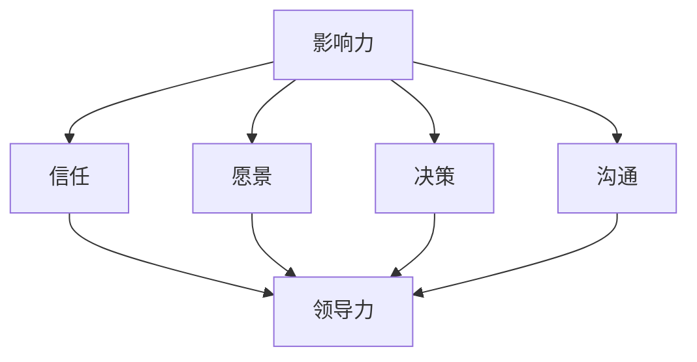
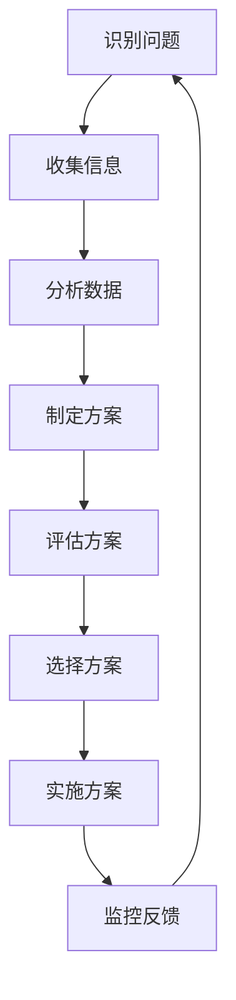

                 

### 文章标题：领导力思维：改变世界命运的领导力修炼法则

**关键词：** 领导力、领导力思维、世界命运、领导力修炼、领导力实践

**摘要：** 本文旨在探讨领导力的本质、原则和修炼法则，通过分析领导力在不同领域的应用，揭示领导力思维对于改变世界命运的重要性。文章从领导力的核心概念、实践方法、应用到未来展望四个部分展开，旨在为读者提供一套完整的领导力思维体系，帮助读者理解并掌握领导力的核心要义。

### 第一部分：领导力的核心概念与原则

#### 1.1 领导力的定义与本质

**背景介绍：** 领导力是一个广泛而复杂的概念，不同学者对其有着不同的理解和定义。然而，从总体上讲，领导力可以被看作是一种影响力，它能够激励和引导他人为实现共同目标而努力。

**核心概念与联系：**

领导力是由多个核心概念组成的，这些概念之间存在着密切的联系和相互作用。

- **影响力**：领导力的本质在于其具有影响力，能够影响他人的思维和行为。
- **信任**：领导力依赖于信任，信任是领导者与被领导者之间的重要纽带。
- **愿景**：领导力需要明确的愿景，愿景是领导者引领团队前进的方向和动力。
- **决策**：领导力体现在决策能力上，领导者需要在不确定性中做出明智的决策。
- **沟通**：领导力依赖于有效的沟通，沟通是领导者与团队之间传递信息、协调行动的重要手段。

**核心概念之间关系的 Mermaid 流程图：**

#### 1.2 领导力的核心原则

**核心原则：**

- **以人为本**：领导者应当以人为本，关注团队成员的需求和感受，尊重他们的个性。
- **目标导向**：领导者应当明确团队的目标，并确保团队成员明确目标的重要性和实现途径。
- **协作共赢**：领导者应当鼓励团队协作，实现共赢，使团队成员感受到集体荣誉和成就感。

**领导力与影响力的关系：**

领导力与影响力密切相关。领导力依赖于影响力，而影响力又来源于领导力的表现。领导者通过展现出以人为本、目标导向和协作共赢的领导力原则，能够增强自己在团队中的影响力。

**领导力与影响力的互动：**

领导力与影响力之间存在着互动关系。领导力可以增强影响力，而影响力又可以反过来影响领导力。例如，领导者通过有效的沟通和决策，能够增强自己在团队中的影响力，从而提高领导力。

### 第二部分：领导力的实践方法

#### 2.1 领导力思维模式

**系统性思维：** 领导者应当具备系统性思维，能够从整体上看待问题和解决问题。系统性思维要求领导者关注团队的整体结构和相互作用，寻找问题的根本原因。

**突破性思维：** 领导者应当具备突破性思维，能够打破常规，寻找创新的解决方案。突破性思维要求领导者敢于挑战现状，勇于尝试新的方法和策略。

**适应性思维：** 领导者应当具备适应性思维，能够灵活应对变化和不确定性。适应性思维要求领导者关注环境的变化，及时调整策略和行动。

#### 2.2 领导力沟通技巧

**有效倾听：** 领导者应当具备有效倾听的技巧，能够理解团队成员的意见和需求。有效倾听要求领导者耐心、关注细节，并给予积极的反馈。

**清晰表达：** 领导者应当具备清晰表达的技巧，能够明确传达自己的想法和意见。清晰表达要求领导者逻辑清晰、言简意赅，并确保信息的准确性。

**高效沟通：** 领导者应当具备高效沟通的技巧，能够在有限的时间内传达大量的信息。高效沟通要求领导者善于利用各种沟通工具和渠道，提高沟通的效率。

#### 2.3 领导力团队建设

**团队角色认知：** 领导者应当明确团队成员的角色和职责，确保每个人都能充分发挥自己的优势。团队角色认知要求领导者了解团队成员的能力和特点，合理分配任务。

**团队协作机制：** 领导者应当建立有效的团队协作机制，鼓励团队成员之间的合作和互助。团队协作机制要求领导者营造良好的团队氛围，建立有效的沟通和协作渠道。

**团队激励与反馈：** 领导者应当善于激励团队成员，并给予及时的反馈。团队激励与反馈要求领导者关注团队成员的成长和进步，提供必要的支持和鼓励。

### 第三部分：领导力在实践中的应用

#### 3.1 领导力在组织变革中的应用

**变革管理的理论框架：** 领导者应当了解变革管理的理论框架，包括变革的驱动力、变革的阶段和变革的策略。

**变革中的领导力角色：** 领导者应当在变革中扮演关键角色，引导团队应对变革的挑战，确保变革的成功实施。

**变革实践案例分析：** 通过案例分析，领导者可以了解如何在具体情境下运用领导力来推动组织变革。

#### 3.2 领导力在创新管理中的应用

**创新管理的核心要素：** 领导者应当了解创新管理的核心要素，包括创新的来源、创新的流程和创新的管理。

**创新领导力的培养：** 领导者应当培养创新领导力，鼓励团队成员敢于创新，勇于尝试。

**创新实践案例分析：** 通过案例分析，领导者可以了解如何在具体情境下推动创新管理。

#### 3.3 领导力在国际化背景下的应用

**文化差异与领导力：** 领导者应当了解文化差异，适应不同文化的领导风格和沟通方式。

**国际化领导力的培养：** 领导者应当培养国际化领导力，包括跨文化沟通能力、全球视野和国际竞争力。

**国际化领导力实践案例分析：** 通过案例分析，领导者可以了解如何在国际化背景下运用领导力。

### 第四部分：领导力思维的修炼与提升

#### 4.1 自我认知与成长

**自我认知的重要性：** 自我认知是领导力发展的基础，领导者应当了解自己的优点和不足，不断自我提升。

**自我成长的路径：** 领导者应当通过学习、实践和反思来提升自己的领导力。

**自我成长的实践策略：** 领导者应当制定明确的成长计划，并付诸实践。

#### 4.2 情绪管理与压力应对

**情绪管理的意义：** 情绪管理是领导者必备的技能，它能够帮助领导者更好地应对压力和挑战。

**压力管理的策略：** 领导者应当学会如何管理压力，保持良好的身心状态。

**情绪管理与压力应对的实践案例：** 通过实践案例，领导者可以了解如何在实际工作中运用情绪管理和压力应对的策略。

#### 4.3 领导力思维的创新与实践

**创新思维的定义：** 创新思维是指领导者能够跳出传统思维框架，寻找新的解决方案。

**创新思维的培养：** 领导者应当通过学习和实践来培养创新思维。

**创新思维在领导力实践中的应用：** 通过案例分析，领导者可以了解如何在实际工作中运用创新思维。

### 第五部分：领导力对世界命运的影响

#### 5.1 领导力与社会发展

**领导力在社会发展中的作用：** 领导力在社会发展中发挥着重要作用，它能够推动社会的进步和发展。

**社会发展的领导力需求：** 领导力是社会发展的关键因素，它要求领导者具备创新、合作和责任担当的精神。

**社会发展中的领导力实践案例：** 通过案例分析，领导者可以了解如何在社会发展中发挥领导力的作用。

#### 5.2 领导力与全球化

**全球化背景下的领导力挑战：** 领导力在全球化背景下面临着新的挑战，包括跨文化沟通、全球协作和领导力传承等。

**全球化背景下的领导力战略：** 领导者应当制定全球化背景下的领导力战略，以应对全球化带来的挑战。

**全球化背景下的领导力实践案例：** 通过案例分析，领导者可以了解如何在全球化的背景下运用领导力。

#### 5.3 领导力与可持续发展

**可持续发展的领导力角色：** 领导力在可持续发展中扮演着关键角色，它要求领导者具备创新、责任和可持续发展的意识。

**可持续发展的领导力策略：** 领导者应当制定可持续发展的领导力策略，以推动可持续发展目标的实现。

**可持续发展的领导力实践案例：** 通过案例分析，领导者可以了解如何在实际工作中推动可持续发展。

## 附录

### 附录A：领导力发展资源与工具

**领导力发展书籍推荐：** 领导力经典著作，如《领导力心理学》、《领导力艺术》等。

**领导力培训课程推荐：** 国际知名领导力培训机构提供的课程，如麦肯锡领导力课程、哈佛领导力课程等。

**领导力实践工具推荐：** 领导力评估工具、领导力发展工具等。

### 附录B：领导力思维模型与流程图

**领导力思维模型：** 描述领导力的核心概念和相互作用，如影响力、信任、愿景等。

**领导力决策流程图：** 展示领导者在决策过程中需要考虑的关键因素和决策步骤。

**领导力沟通流程图：** 展示领导者在沟通过程中需要考虑的关键因素和沟通步骤。

### 作者信息

**作者：** AI天才研究院/AI Genius Institute & 禅与计算机程序设计艺术 /Zen And The Art of Computer Programming### 文章标题：领导力思维：改变世界命运的领导力修炼法则

> **关键词：** 领导力、领导力思维、世界命运、领导力修炼、领导力实践

> **摘要：** 本文旨在探讨领导力的本质、原则和修炼法则，通过分析领导力在不同领域的应用，揭示领导力思维对于改变世界命运的重要性。文章从领导力的核心概念、实践方法、应用到未来展望四个部分展开，旨在为读者提供一套完整的领导力思维体系，帮助读者理解并掌握领导力的核心要义。

---

## 第一部分：领导力的核心概念与原则

### 1.1 领导力的定义与本质

#### 1.1.1 领导力的历史演变

领导力作为一个概念，其历史可以追溯到古代的帝王将相和部落首领。在古代，领导力主要表现为权威和统治力，领导者通过强制手段维护社会秩序和实现目标。随着人类社会的发展，领导力的内涵逐渐丰富，不再仅仅局限于权威，更强调影响力、沟通力和决策力。

在工业革命时期，领导力开始被看作是一种管理技能，领导者的任务是通过管理和组织来实现生产效率的最大化。这一时期的领导力理论主要关注如何提高组织绩效，忽视了人的因素。

进入21世纪，领导力理论逐渐向人本主义转变，强调领导者与团队成员之间的互动和合作。现代领导力理论认为，领导力是一种影响力，它不仅仅存在于组织内部，还扩展到组织外部，影响着社会的各个方面。

#### 1.1.2 领导力的定义

领导力（Leadership）是一种影响他人共同实现目标的能力。它不仅仅是一种职位赋予的权力，更是一种个人魅力和影响力的体现。领导者通过激励、沟通和决策，影响团队成员的行为和思维，从而实现共同的目标。

领导力的核心要素包括：

- **影响力**：领导者能够影响他人的思维和行动，使其为实现共同目标而努力。
- **信任**：领导者与团队成员之间建立信任关系，这是领导力有效性的基础。
- **愿景**：领导者拥有明确的愿景和目标，能够激励团队成员为之奋斗。
- **决策**：领导者能够在不确定性中做出明智的决策，引导团队走向成功。
- **沟通**：领导者具备有效的沟通能力，能够清晰表达自己的想法，理解团队成员的需求。

#### 1.1.3 领导力的本质

领导力的本质在于其影响力和引导力。领导者通过自身的行动和决策，影响和引导团队成员，使其为实现共同目标而努力。领导力不仅存在于正式的领导职位上，也存在于各种非正式的领导角色中，如团队中的核心成员、社区中的领袖等。

领导力的本质还体现在其持续性和发展性上。有效的领导力不仅仅是短期的行为，更是一种长期的思维方式和行为模式。领导者需要不断学习、成长和适应变化，以保持领导力的有效性。

### 1.2 领导力的核心原则

领导力的核心原则是领导者行为的准则，它指导着领导者的决策和行动。以下是领导力的几个核心原则：

#### 1.2.1 以人为本

以人为本是领导力的核心原则之一。领导者应当关注团队成员的需求和感受，尊重他们的个性，鼓励他们发挥潜力。以人为本的领导力强调领导者与团队成员之间的互动和合作，而不是单向的命令和控制。

#### 1.2.2 目标导向

目标导向是领导者的重要职责。领导者需要明确团队的目标，并确保团队成员理解目标的重要性和实现途径。目标导向的领导力强调明确的目标设定和持续的跟踪与评估，以确保目标的实现。

#### 1.2.3 协作共赢

协作共赢是领导力的重要原则。领导者应当鼓励团队成员之间的合作和互助，实现团队的整体目标。协作共赢的领导力强调团队合作的重要性，鼓励成员分享知识和经验，共同成长。

### 1.3 领导力与影响力的关系

领导力与影响力密切相关。领导力是一种影响力，它依赖于领导者的影响力来实现目标。同时，影响力又可以反过来影响领导力。以下是领导力与影响力的关系：

#### 1.3.1 影响力的定义

影响力是指一个人或组织通过某种方式影响他人思维和行为的能力。它不仅包括权力和权威，还包括信任、认同和说服力。

#### 1.3.2 影响力的来源

影响力的来源有多种，包括：

- **专业知识**：领导者具备的专业知识和技能使其在团队中具有影响力。
- **信任和尊重**：领导者与团队成员之间的信任和尊重是影响力的基础。
- **榜样作用**：领导者的行为和决策对团队成员具有榜样作用，影响他们的思维和行为。
- **沟通能力**：领导者的沟通能力影响团队成员的理解和认同，从而影响他们的行为。

#### 1.3.3 领导力与影响力的互动

领导力与影响力之间存在互动关系。领导力可以增强影响力，而影响力又可以反过来增强领导力。例如，领导者通过有效的沟通和决策，增强自己在团队中的影响力，从而提高领导力。同样，领导者通过不断提升自己的专业能力和沟通技巧，增强自己在团队中的影响力，从而提高领导力。

### 总结

领导力是一个复杂而多维的概念，它涉及影响力的运用、目标的实现、团队的协作以及个人的成长。理解领导力的核心概念和原则，有助于领导者更好地发挥自己的作用，实现组织的成功。在接下来的部分中，我们将探讨领导力的实践方法，帮助读者掌握提升领导力的具体策略。

### 1.4 领导力的演变历程

领导力的演变历程是理解现代领导力的重要一环。从古代到现代，领导力经历了多个阶段的发展，每个阶段都反映了社会、经济和文化背景的变化。

#### 古代领导力

在古代，领导力主要表现为权威和统治力。古代的领导者通常通过继承、世袭或武力征服来获得权力。他们依靠严格的等级制度和强制手段来维护社会秩序，实现统治目标。古代领导力强调的是统治和控制，领导者的主要任务是维护社会稳定和实现个人或家族的利益。

#### 工业时代领导力

工业革命带来了生产力的巨大提升，也催生了新的领导力形式。在这个时期，领导者被看作是管理者，他们的主要任务是组织和协调生产过程，提高生产效率。工业时代领导力强调的是效率和控制，领导者的职责是确保生产线的顺畅运行和目标的实现。

#### 现代领导力

随着信息时代的到来，领导力再次发生了变革。现代领导力不再仅仅关注效率和生产力，更强调人本主义和团队协作。现代领导者被视为变革的推动者和团队的领导者，他们需要具备创新思维、沟通能力和领导力技巧，以应对复杂多变的环境。

#### 当代领导力

在当代，领导力已经超越了组织和团队的范围，扩展到社会和全球层面。当代领导者需要具备全球视野、跨文化沟通能力和可持续发展意识，以应对全球化带来的挑战。同时，领导力也变得更加个性化和多样化，每个领导者都有自己独特的领导风格和策略。

### 1.5 领导力在现代社会中的重要性

在现代社会，领导力扮演着至关重要的角色。以下是领导力在现代社会中的几个关键方面：

#### 1.5.1 组织发展

领导力是组织发展的核心动力。有效的领导者能够激发团队的潜力，推动组织的创新和变革，实现组织的长远目标。

#### 1.5.2 团队协作

领导力是团队协作的基础。领导者通过建立信任、沟通和协作机制，促进团队成员之间的互动，提高团队的绩效和凝聚力。

#### 1.5.3 社会变革

领导力是社会变革的催化剂。领导者通过倡导和推动社会创新，促进社会进步和发展。

#### 1.5.4 个人成长

领导力也是个人成长的关键因素。领导者通过自我反思和持续学习，提升自己的能力和素质，实现个人价值的最大化。

总之，领导力在现代社会中具有不可替代的重要性，它影响着组织、团队和社会的方方面面。理解和掌握领导力的核心原则和策略，对于领导者和个人都是至关重要的。

### 1.6 领导力在不同领域的应用

领导力是一个多维度的概念，它在不同的领域中有着独特的表现形式和应用。以下将探讨领导力在几个关键领域的应用：

#### 1.6.1 商业领域

在商业领域，领导力是推动组织成功的关键因素。有效的领导者能够设定明确的目标和战略，激发员工的潜力，创造积极的工作氛围，从而提高企业的绩效和竞争力。商业领导力强调创新思维、决策能力和市场洞察力。

**案例：** 苹果公司的史蒂夫·乔布斯是一位杰出的商业领导者。他通过独特的领导风格，将苹果公司从一家小型企业打造成全球领先的科技公司。乔布斯以他的远见卓识和设计哲学，推动了苹果公司的创新，并在市场上取得了巨大的成功。

#### 1.6.2 政府部门

在政府部门，领导力是确保政策有效执行和社会稳定的重要保障。政府领导者需要具备公共管理能力、政策制定能力和跨部门协调能力。他们必须在复杂的社会环境中做出决策，平衡各方利益，推动社会进步。

**案例：** 英国前首相温斯顿·丘吉尔是一位杰出的政治领导者。在第二次世界大战期间，他领导英国人民抵抗纳粹侵略，展现了坚定的意志和卓越的领导力。

#### 1.6.3 社会组织

在非营利组织和志愿组织中，领导力是推动社会变革和公益项目成功实施的关键。社会领导者需要具备使命感、创新精神和公众影响力，以动员资源、吸引支持和推动社会进步。

**案例：** 奥斯卡·阿里亚斯是一位社会活动家，他领导的“橄榄树运动”在智利推动了民主变革。阿里亚斯通过组织抗议活动和社会运动，成功地推动了智利的民主进程。

#### 1.6.4 教育领域

在教育领域，领导力是提高教育质量和推动教育改革的重要动力。教育领导者需要具备教育理念、教学管理和学生关怀能力，以推动学校的发展和学生的成长。

**案例：** 马丁·路德·金是一位杰出的教育领导者，他通过演讲和行动，推动了美国的教育改革，促进了种族平等和社会正义。

通过这些案例，我们可以看到领导力在不同领域的独特作用和应用。无论是在商业、政府、社会组织还是教育领域，领导力都是推动进步和实现目标的关键。

### 第一部分总结

本部分深入探讨了领导力的核心概念与原则，从历史演变到现代社会的重要性，再到不同领域的应用，为读者提供了一个全面的领导力框架。理解领导力的本质和原则，是提升领导力的第一步。在接下来的部分，我们将进一步探讨领导力的实践方法，帮助读者在实际工作中应用和提升领导力。

## 第二部分：领导力的实践方法

### 2.1 领导力思维模式

领导力思维模式是领导者思维方式的总和，它决定了领导者如何理解问题、解决问题和决策。有效的领导力思维模式有助于领导者更好地应对复杂多变的环境，提升团队绩效和实现组织目标。

#### 系统性思维

系统性思维是领导力思维模式中的重要一环。它要求领导者从整体上看待问题和解决问题，理解各个部分之间的相互作用和影响。系统性思维能够帮助领导者把握全局，发现潜在问题，并制定全面的解决方案。

**案例：** 约翰·霍普金斯大学卫生系统首席执行官博·乔纳森（Bo Johnson）在应对新冠疫情时，采用了系统性思维。他不仅关注医疗资源的管理，还关注公共卫生政策、社区支持和国际合作，确保整个卫生系统能够有效应对疫情。

#### 突破性思维

突破性思维是领导者面对挑战和危机时的一种思维方式。它要求领导者跳出传统思维框架，寻找创新的解决方案。突破性思维能够帮助领导者打破常规，推动组织变革和创新。

**案例：** 亚马逊创始人杰夫·贝佐斯（Jeff Bezos）在领导亚马逊时，经常运用突破性思维。他提出“Day 1”文化，鼓励员工保持创业精神，不断寻找创新的业务模式和技术解决方案，推动公司持续发展。

#### 适应性思维

适应性思维是领导者应对不确定性和变化的能力。它要求领导者能够快速适应环境变化，调整策略和行动。适应性思维能够帮助领导者保持灵活性和敏捷性，应对各种挑战。

**案例：** 麦当劳首席执行官克里斯·肯尼（Chris Kenney）在疫情期间，采用了适应性思维。他迅速调整了公司的业务策略，推动了外卖和数字化服务的扩展，确保公司能够持续运营并满足消费者的需求。

### 2.2 领导力沟通技巧

领导力沟通技巧是领导者与团队成员、合作伙伴和其他利益相关者之间有效交流的能力。良好的沟通技巧能够增强领导者的影响力，提高团队的凝聚力和绩效。

#### 有效倾听

有效倾听是沟通技巧的核心。它要求领导者不仅仅是听对方说什么，还要理解对方的感受和需求。有效倾听能够帮助领导者建立信任关系，理解团队成员的问题和需求，并提供有效的支持。

**案例：** 西蒙·西斯凯（Simon Sinek）是一位著名的领导力演讲者，他提倡“黄金圆环”理论。他通过有效倾听，了解听众的需求和兴趣，从而设计出吸引人的演讲内容。

#### 清晰表达

清晰表达是领导者沟通技巧的重要组成部分。它要求领导者能够清晰、简洁地表达自己的想法和意见，确保信息的准确传达。清晰表达能够帮助领导者避免误解和冲突，提高沟通效率。

**案例：** 苹果公司前首席执行官史蒂夫·乔布斯（Steve Jobs）以其卓越的演讲技巧而著称。他通过简洁明了的语言和生动的演示，成功吸引了全球消费者的关注，推动了苹果公司的产品销售。

#### 高效沟通

高效沟通是领导者与团队、合作伙伴和其他利益相关者之间快速、有效地交换信息的能力。它要求领导者能够利用各种沟通工具和渠道，确保信息的及时传达和反馈。

**案例：** 谷歌首席执行官桑达尔·皮查伊（Sundar Pichai）在领导谷歌时，采用了高效沟通策略。他定期举行全员会议，通过视频和电子邮件等方式，与员工保持密切沟通，确保信息传递的及时性和准确性。

### 2.3 领导力团队建设

领导力团队建设是领导者通过构建和管理团队，实现团队目标的过程。有效的团队建设能够提高团队的凝聚力和绩效，为组织的成功奠定基础。

#### 团队角色认知

团队角色认知是团队建设的基础。它要求领导者明确团队成员的角色和职责，确保每个人都能在团队中发挥自己的优势。团队角色认知能够帮助领导者合理分配任务，提高团队效率。

**案例：** 特斯拉首席执行官埃隆·马斯克（Elon Musk）在团队建设时，注重角色认知。他明确团队成员的职责和任务，确保每个人都能在各自的岗位上发挥最大的潜力。

#### 团队协作机制

团队协作机制是领导者通过建立有效的沟通和协作渠道，促进团队成员之间的合作和互助。团队协作机制能够提高团队的整体绩效，实现团队目标。

**案例：** 微软首席执行官萨蒂亚·纳德拉（Satya Nadella）在团队建设时，强调协作机制的重要性。他推动了跨部门协作，建立了透明和开放的沟通渠道，提高了团队的协同效率。

#### 团队激励与反馈

团队激励与反馈是领导者通过奖励和反馈机制，激发团队成员的积极性和创造力。团队激励与反馈能够帮助领导者建立积极的工作氛围，提高团队的绩效和凝聚力。

**案例：** 腾讯公司首席执行官马化腾（Pony Ma）在团队建设时，注重激励与反馈。他通过定期奖励和表彰，激励团队成员的积极性和创造力，提高了团队的整体绩效。

### 总结

领导力实践方法包括领导力思维模式、沟通技巧和团队建设。通过系统性思维、突破性思维和适应性思维，领导者能够更好地应对复杂环境；通过有效倾听、清晰表达和高效沟通，领导者能够建立良好的沟通关系；通过团队角色认知、团队协作机制和团队激励与反馈，领导者能够构建高绩效团队。掌握这些实践方法，将有助于领导者提升领导力，实现组织目标。

### 2.4 领导力在组织变革中的应用

组织变革是现代企业面临的一项重要任务，它涉及到企业的战略调整、结构优化和文化重塑。领导力在组织变革中扮演着关键角色，有效的领导力能够推动组织变革的顺利进行，实现组织的转型和持续发展。

#### 变革管理的理论框架

变革管理是一门研究如何引导组织适应环境变化、实现战略目标的学科。变革管理的理论框架主要包括以下几个关键组成部分：

1. **变革动因**：变革的起因可能是外部环境的剧变，如市场竞争加剧、技术进步等，也可能是内部因素，如组织效率低下、文化冲突等。

2. **变革阶段**：变革通常分为计划、启动、实施和评估四个阶段。每个阶段都有其特定的任务和挑战，领导者需要根据实际情况进行调整和应对。

3. **变革策略**：变革策略包括变革的方向、速度、规模和方式。领导者需要制定合理的变革策略，以确保变革的顺利进行。

4. **变革管理工具**：变革管理工具包括沟通策略、领导力模型、激励措施和反馈机制等，这些工具有助于领导者引导和推动变革。

#### 领导力在变革中的角色

在组织变革过程中，领导者的角色至关重要。领导者不仅是变革的发起者和推动者，还是变革的代言人和榜样。以下是领导者在变革中扮演的关键角色：

1. **愿景设定者**：领导者需要明确变革的愿景和目标，确保团队成员理解变革的重要性和意义。

2. **变革倡导者**：领导者需要积极倡导变革，消除团队成员的疑虑和抵触情绪，赢得他们的支持和参与。

3. **变革设计师**：领导者需要设计变革的方案和策略，确保变革的可行性和有效性。

4. **变革推动者**：领导者需要推动变革的实施，确保团队成员按照计划行动，克服变革过程中的困难和挑战。

5. **变革监督者**：领导者需要监督变革的进程，及时评估变革的效果，并根据实际情况进行调整。

#### 变革实践案例分析

以下是一个关于领导力在组织变革中应用的案例：

**案例：IBM的数字化转型**

IBM是一家拥有百年历史的科技公司，在20世纪90年代面临了严重的竞争压力和市场份额下滑的问题。为了应对挑战，IBM决定进行数字化转型，以提升企业的竞争力。

- **愿景设定**：IBM首席执行官郭士纳（Louis Gerstner）明确了数字化转型的愿景，即通过数字化转型提升企业的创新能力和市场竞争力。

- **变革倡导**：郭士纳积极倡导数字化转型，通过内部演讲和沟通会议，向全体员工传达变革的重要性和紧迫性。

- **变革设计**：IBM制定了详细的数字化转型计划，包括重组组织结构、投资新技术、优化业务流程等。

- **变革推动**：IBM成立了专门的数字化转型团队，负责推动变革的实施。同时，公司采用了一系列激励机制，鼓励员工积极参与变革。

- **变革监督**：IBM设立了变革监督机制，定期评估数字化转型进展，并根据实际情况进行调整。

通过数字化转型的成功实施，IBM不仅重获了市场竞争力，还成为了一家领先的科技公司。

#### 领导力在变革中的挑战

在组织变革过程中，领导者面临着诸多挑战。以下是几个常见的挑战及其应对策略：

1. **文化冲突**：变革往往涉及到组织文化的改变，领导者需要妥善处理文化冲突，推动文化融合。

2. **员工抵触**：员工可能对变革持有抵触情绪，领导者需要通过有效的沟通和激励，消除员工的疑虑和抵触。

3. **资源限制**：变革需要投入大量的人力、物力和财力，领导者需要合理分配资源，确保变革的顺利进行。

4. **时间压力**：变革通常需要在短时间内完成，领导者需要制定详细的计划和步骤，确保按时完成变革。

5. **领导力不足**：一些领导者在变革过程中可能表现出领导力不足，领导者需要通过培训和自我提升，提高领导力水平。

### 总结

领导力在组织变革中发挥着至关重要的作用。通过设定愿景、倡导变革、设计策略、推动实施和监督变革，领导者能够推动组织变革的顺利进行，实现组织的转型和持续发展。在接下来的部分，我们将探讨领导力在创新管理中的应用，帮助领导者掌握如何通过创新推动组织的发展。

### 2.5 领导力在创新管理中的应用

在当今快速变化的市场环境中，创新成为企业持续发展的关键因素。有效的创新管理不仅能够帮助企业应对市场挑战，还能推动企业的长期增长和竞争力。领导力在创新管理中扮演着核心角色，领导者需要具备独特的创新思维和管理能力，以引领团队进行创新。

#### 创新管理的核心要素

创新管理包括多个核心要素，以下是其主要内容：

1. **创新文化**：创新文化是创新管理的基础。它包括鼓励创新、容忍失败、强调学习和不断尝试的精神。领导者需要营造一个开放、包容和创新的文化环境，使员工敢于提出新想法和尝试新方法。

2. **创新团队**：创新团队是实施创新项目的关键。领导者需要组建一支具备多元背景、技能互补和高度协作的团队。团队成员应包括不同领域的专家和具有创新精神的人才。

3. **创新流程**：创新流程是确保创新项目顺利进行的重要保障。领导者需要制定一套系统化的创新流程，包括问题定义、想法收集、筛选评估、实验验证和产品化等步骤。

4. **激励机制**：激励机制是鼓励员工积极参与创新的重要手段。领导者需要建立一套合理的激励机制，包括奖励、晋升和认可等，以激发员工的创新潜力和积极性。

#### 创新领导力的培养

创新领导力是指领导者具备推动创新的能力和素质。以下是培养创新领导力的几个关键步骤：

1. **培养创新意识**：领导者需要树立创新意识，认识到创新对企业发展的重要性。他们应积极倡导创新，并将其纳入企业的战略规划中。

2. **提升创新能力**：领导者需要不断学习和提升自己的创新能力。他们可以通过阅读创新书籍、参加创新培训和工作坊，以及与行业专家交流，来增强自己的创新能力。

3. **建立创新团队**：领导者需要组建一支创新团队，并为其提供必要的资源和支持。他们应鼓励团队成员发挥各自的特长，共同推动创新项目。

4. **建立创新机制**：领导者需要建立一套创新机制，包括创新流程、激励机制和创新文化。这些机制有助于确保创新项目的高效执行和成功实施。

#### 创新实践案例分析

以下是一个关于领导力在创新管理中应用的案例：

**案例：谷歌的“20%时间项目”**

谷歌以其创新文化和强大的创新能力而闻名。谷歌的“20%时间项目”是一个典型的创新实践案例。该项目允许员工在工作时间的20%内自由探索和开发自己的创意项目。这一政策激发了员工的创新潜力，产生了许多成功的创新产品，如Gmail、Google新闻和AdSense等。

- **创新文化**：谷歌营造了一种鼓励创新的文化氛围，允许员工自由探索和尝试新想法。公司高层领导对创新项目持开放态度，并给予必要的支持。

- **创新团队**：谷歌的“20%时间项目”由一群有共同兴趣和创新精神的员工组成。这些团队成员来自不同的部门和专业领域，他们通过合作和分享，共同推动创新项目。

- **创新流程**：谷歌为“20%时间项目”制定了明确的流程，包括项目提案、评估、开发、测试和上线等步骤。这一流程有助于确保创新项目的高效执行和成功实施。

- **激励机制**：谷歌为参与“20%时间项目”的员工提供了丰富的激励措施，包括奖金、股票和公开认可。这些激励措施激发了员工的创新热情和积极性。

通过谷歌的“20%时间项目”，我们可以看到领导力在创新管理中的应用。领导者通过营造创新文化、建立创新团队、制定创新流程和提供激励机制，成功地推动了创新实践。

#### 领导力在创新管理中的挑战

在创新管理中，领导者面临着许多挑战。以下是一些常见的挑战及其应对策略：

1. **资源限制**：创新项目通常需要大量的资金、人力和时间投入。领导者需要合理分配资源，确保创新项目能够顺利进行。

2. **风险承担**：创新往往伴随着风险，领导者需要鼓励员工勇于承担风险，并为他们提供必要的支持。

3. **时间压力**：创新项目通常需要在短时间内完成，领导者需要制定详细的时间表和计划，确保按时完成项目。

4. **员工抵触**：一些员工可能对创新持怀疑态度，领导者需要通过有效的沟通和激励，消除员工的抵触情绪，并激发他们的创新潜力。

5. **领导力不足**：一些领导者在创新管理中可能表现出领导力不足，他们需要通过学习和培训，提升自己的创新领导力。

### 总结

领导力在创新管理中发挥着至关重要的作用。通过培养创新意识、提升创新能力、建立创新团队、制定创新流程和提供激励机制，领导者能够推动创新实践，实现企业的长期增长和竞争力。在接下来的部分，我们将探讨领导力在国际化背景下的应用，帮助领导者掌握如何在全球环境中领导和管理团队。

### 2.6 领导力在国际化背景下的应用

在全球化的背景下，领导力面临着新的挑战和机遇。国际化领导力不仅要求领导者具备强大的跨文化沟通能力和全球视野，还需要他们能够适应不同国家和地区的文化差异，并在多元化的团队中有效管理。以下是领导力在国际化背景下的几个关键应用。

#### 文化差异与领导力

文化差异是国际化领导力面临的一个主要挑战。不同国家和地区的人们在价值观、行为规范和工作习惯上存在显著差异。领导者需要深入了解这些文化差异，并学会在多样化团队中灵活运用领导力。

1. **文化敏感性**：领导者应具备文化敏感性，尊重并理解不同文化的价值观和行为规范。这有助于避免文化冲突，建立和谐的团队氛围。

2. **文化适应性**：领导者需要具备文化适应性，能够在不同文化环境中灵活调整自己的领导风格和管理方法。这要求领导者具备跨文化沟通技巧和全球视野。

3. **文化包容性**：领导者应倡导文化包容性，鼓励团队成员尊重和接纳不同的文化背景，共同创造一个多元、包容的工作环境。

#### 国际化领导力的培养

国际化领导力不是天生的，而是通过学习和实践逐步培养的。以下是一些培养国际化领导力的策略：

1. **跨文化培训**：领导者应参加跨文化培训，了解不同文化的特点和行为规范，提高跨文化沟通能力。

2. **国际交流**：领导者应积极参与国际交流项目，与来自不同国家的人交流，了解他们的观点和经验，拓宽视野。

3. **全球思维**：领导者应培养全球思维，将全球市场和国家政策作为决策的重要参考，提高在全球环境中制定战略和策略的能力。

4. **领导力发展计划**：企业可以为领导者制定专门的领导力发展计划，包括国际化领导力培训、跨国工作机会和国际项目参与等。

#### 国际化领导力实践案例分析

以下是一个关于国际化领导力实践案例的例子：

**案例：华为的国际化领导**

华为是一家全球领先的电信设备制造商，其在国际化进程中展现了卓越的领导力。华为的国际化领导力主要体现在以下几个方面：

1. **全球视野**：华为创始人任正非强调全球视野，鼓励领导者关注全球市场动态，制定国际化战略。

2. **文化适应性**：华为在全球化过程中，注重适应不同国家和地区的文化差异，尊重当地法律法规和商业习惯。

3. **多元化团队**：华为在全球范围内招聘人才，组建多元化团队，鼓励团队成员分享不同文化的经验和观点。

4. **领导力传承**：华为通过建立领导力梯队，培养一批具有国际化背景和能力的领导者，确保国际化战略的持续推进。

通过华为的国际化领导实践，我们可以看到，国际化领导力是企业在全球竞争中取得成功的关键。领导者需要具备全球视野、文化适应性和多元化团队管理能力，以应对国际化带来的挑战和机遇。

#### 领导力在国际化背景下的挑战

在国际化背景下，领导者面临以下几项挑战：

1. **文化冲突**：不同文化之间的冲突可能导致团队沟通不畅，影响工作效果。领导者需要妥善处理文化冲突，促进文化融合。

2. **国际法规**：不同国家和地区的法律法规可能存在差异，领导者需要了解并遵守当地法规，确保企业的合规运营。

3. **远程管理**：领导者需要有效管理远程团队，确保团队成员之间的沟通和协作。远程管理要求领导者具备更强的沟通能力和管理技巧。

4. **全球竞争力**：领导者需要在全球市场中保持竞争力，不断优化产品和服务，以应对激烈的国际竞争。

### 总结

领导力在国际化背景下具有重要作用。通过培养国际化领导力，领导者能够适应全球化的挑战和机遇，促进企业的国际化发展。理解文化差异、培养全球思维和多元化团队管理能力，是国际化领导力成功的关键。在接下来的部分，我们将探讨领导力思维的修炼与提升，帮助领导者掌握如何通过自我认知和成长来提升领导力。

### 2.7 领导力思维的修炼与提升

领导力不仅仅是天赋，更是可以通过修炼和培养来提升的能力。一个卓越的领导者需要具备清晰的思维、强大的情感管理能力和持续自我成长的意识。以下是一些关键的修炼方法和提升策略。

#### 自我认知与成长

自我认知是领导力发展的基础。领导者需要深入了解自己的优势、劣势、价值观和动机。以下是一些自我认知和成长的方法：

1. **定期反思**：领导者应定期反思自己的行为和决策，思考自己的优势和不足，以及如何改进。

2. **360度反馈**：领导者可以寻求同事、下属和上级的反馈，了解自己在不同方面的表现和影响。

3. **心理测试**：通过心理测试，如迈尔斯-布里格斯性格类型指标（MBTI），领导者可以更深入地了解自己的性格特点和偏好。

4. **领导力培训**：参加领导力培训课程，通过学习和实践，提升自己的领导能力和管理技能。

5. **阅读和学习**：阅读领导力相关书籍和文章，学习成功领导者的经验和教训，不断充实自己的知识库。

#### 情绪管理与压力应对

情绪管理和压力应对是领导者必须掌握的重要技能。有效的情绪管理和压力应对可以帮助领导者保持冷静、做出明智决策，并提高团队士气。以下是一些策略：

1. **情绪识别**：领导者需要学会识别和理解自己的情绪，包括正面情绪和负面情绪。

2. **情绪调节**：领导者应学会调节自己的情绪，通过深呼吸、冥想、运动等方式缓解压力。

3. **压力管理**：领导者应学会合理安排时间和任务，避免过度工作，确保工作和生活的平衡。

4. **积极心态**：领导者应培养积极心态，面对挑战和困难时，保持乐观和自信。

5. **求助与支持**：领导者应勇于寻求帮助，与同事、家人和专业顾问交流，共同应对压力。

#### 领导力思维的创新与实践

领导力思维的创新是领导者持续成长的重要动力。以下是一些创新思维的方法和实践：

1. **头脑风暴**：通过头脑风暴，领导者可以激发团队的创造力，寻找创新的解决方案。

2. **跨领域学习**：领导者应跨越不同领域的学习，借鉴其他行业的成功经验，应用于自己的领导实践中。

3. **领导力教练**：通过领导力教练，领导者可以获得专业的指导和建议，帮助自己突破思维定势，实现创新。

4. **实践反馈**：领导者应将创新思维应用到实际工作中，通过实践和反馈不断优化和改进。

### 总结

领导力思维的修炼与提升是一个持续的过程，需要领导者不断自我反思、学习和实践。通过自我认知与成长、情绪管理与压力应对、以及领导力思维的创新与实践，领导者可以不断提升自己的领导能力，成为更有效的领导者。在接下来的部分，我们将探讨领导力对世界命运的影响，揭示领导力在全球社会发展中的重要作用。

### 2.8 领导力对世界命运的影响

领导力不仅仅影响组织内部的运作，它还对全球社会的发展产生深远的影响。一个有远见的领导者能够推动社会进步，解决重大问题，并引领人类走向更光明的未来。以下是领导力在几个关键领域对世界命运的影响。

#### 2.8.1 领导力与社会发展

领导力在社会发展中扮演着至关重要的角色。一个有远见的领导者能够洞察社会需求，推动社会改革和进步。以下是一些领导力对社会发展的具体影响：

1. **推动社会变革**：领导者能够推动社会变革，解决不平等、贫困和环境问题等重大社会挑战。例如，南非前总统纳尔逊·曼德拉通过领导反种族隔离运动，推动了社会的重大变革。

2. **促进教育和普及**：领导者能够推动教育和普及，提升人民的素质和技能，为社会的发展提供强大的人力资源。例如，联合国教科文组织前总干事阿扎德·阿祖莱（Irina Bokova）致力于全球教育的普及和质量提升。

3. **推动经济发展**：有效的领导力能够促进经济发展，创造就业机会，提高人民的生活水平。例如，新加坡总理李显龙通过领导新加坡的经济发展，使其成为亚洲的金融和商业中心。

#### 2.8.2 领导力与全球化

全球化是当今世界的一个重要趋势，它使各国之间的联系更加紧密。领导力在全球化中发挥着关键作用，以下是一些领导力对全球化影响的方面：

1. **促进国际合作**：领导力能够促进国际合作，解决全球性问题，如气候变化、贸易争端和公共卫生危机等。例如，联合国秘书长古特雷斯（António Guterres）通过推动国际合作，应对全球性挑战。

2. **引领全球治理**：领导力能够引领全球治理，建立有效的国际规则和机制，维护全球和平与稳定。例如，欧洲理事会主席夏尔·米歇尔（Charles Michel）通过领导欧盟，推动全球治理体系的建设。

3. **推动全球创新**：领导力能够推动全球创新，促进技术的交流与合作，推动全球科技的发展。例如，马斯克（Elon Musk）通过其领导力，推动了电动汽车和太空探索技术的创新。

#### 2.8.3 领导力与可持续发展

可持续发展是全球面临的一个重大挑战，领导力在这一过程中起到关键作用。以下是一些领导力对可持续发展影响的方面：

1. **推动绿色经济**：领导力能够推动绿色经济的发展，促进能源的可持续利用，减少环境污染。例如，德国总理默克尔（Angela Merkel）通过推动可再生能源的发展，推动了德国的绿色转型。

2. **促进社会公平**：领导力能够促进社会公平，确保所有人都能享有平等的发展机会。例如，巴西前总统卢拉（Lula da Silva）通过推动社会福利政策，提升了社会公平。

3. **保护生态环境**：领导力能够保护生态环境，推动自然资源的可持续利用。例如，加拿大总理贾斯汀·特鲁多（Justin Trudeau）通过推动环境保护政策，保护了加拿大的自然遗产。

### 总结

领导力对世界命运的影响是多方面的，它不仅推动社会进步，促进全球化发展，还引领可持续发展。一个有远见的领导者能够通过其领导力，解决全球性问题，推动人类社会的持续进步。在接下来的部分，我们将探讨领导力的未来展望，分析领导力在未来的发展趋势和挑战。

### 2.9 领导力的未来展望

随着全球化和技术革命的加速发展，领导力面临着前所未有的机遇和挑战。未来领导力将呈现以下几个发展趋势：

#### 2.9.1 人工智能与领导力

人工智能（AI）的迅速发展将对领导力产生深远影响。领导者需要掌握AI技术，利用其提高决策效率、优化管理流程和增强团队协作。例如，AI可以用于数据分析，帮助领导者更准确地预测市场趋势和制定战略。

**发展趋势：**

1. **数据驱动决策**：领导者将更加依赖数据来做出决策，AI技术将提供更多的数据支持和分析工具。
2. **自动化管理**：AI自动化将部分管理任务自动化，领导者需要关注如何管理和协调自动化系统。

**挑战：**

1. **技术依赖**：过度依赖AI可能导致领导者失去人际交往和管理能力。
2. **伦理问题**：AI在决策中可能引发伦理问题，领导者需要确保AI技术的应用符合道德和法律规定。

#### 2.9.2 数字化领导力

数字化时代要求领导者具备强大的数字化领导力，能够引领组织进行数字化转型。数字化领导力包括数据素养、数字化战略规划和数字文化建设等方面。

**发展趋势：**

1. **数字化战略**：领导者需要制定清晰的数字化战略，推动组织实现数字化转型。
2. **数字文化建设**：领导者需要营造一种数字化的文化氛围，鼓励员工拥抱新技术和数字化工作方式。

**挑战：**

1. **技能差距**：领导者需要提升自身的数字化技能，以应对数字化时代的挑战。
2. **网络安全**：数字化带来了网络安全问题，领导者需要确保组织的网络安全。

#### 2.9.3 跨文化领导力

全球化进程加速，领导者需要具备跨文化领导力，能够在多元化团队中有效管理。跨文化领导力要求领导者具备全球视野、文化敏感性和文化适应性。

**发展趋势：**

1. **全球视野**：领导者需要具备全球视野，了解不同国家和地区的文化和市场。
2. **文化适应性**：领导者需要学会适应不同文化，有效沟通和合作。

**挑战：**

1. **文化冲突**：在多元化团队中，文化冲突可能影响团队绩效和凝聚力。
2. **文化偏见**：领导者需要克服文化偏见，确保公平和包容的工作环境。

#### 2.9.4 可持续领导力

随着环境问题的日益严重，可持续领导力成为领导者的重要职责。可持续领导力要求领导者关注环境保护、社会责任和可持续发展，推动组织实现长期繁荣。

**发展趋势：**

1. **绿色创新**：领导者需要推动绿色创新，开发环保技术和产品。
2. **社会责任**：领导者需要承担社会责任，积极参与社会公益事业。

**挑战：**

1. **成本问题**：可持续发展可能带来成本增加，领导者需要找到平衡点。
2. **公众压力**：社会对可持续发展的期望越来越高，领导者需要应对公众的压力。

### 总结

领导力的未来将充满机遇和挑战。随着技术进步和社会变迁，领导者需要不断适应新的环境和需求，提升自身的领导能力。通过掌握人工智能、数字化、跨文化和可持续领导力，领导者能够更好地应对未来的挑战，推动组织和社会的持续进步。

### 附录A：领导力发展资源与工具

为了帮助读者进一步提升领导力，本文提供了以下领导力发展资源与工具：

#### A.1 领导力发展书籍推荐

1. 《领导力的五个层次》（The Five Levels of Leadership）- 雷恩·赫伯特（John C. Maxwell）
2. 《变革领导者手册》（The Change Leader's Handbook）- 詹姆斯·库泽斯（James M. Kouzes）和巴里·波斯纳（Barry Z. Posner）
3. 《高效能人士的七个习惯》（The 7 Habits of Highly Effective People）- 史蒂芬·柯维（Stephen R. Covey）

#### A.2 领导力培训课程推荐

1. 哈佛大学领导力发展项目（Harvard University Leadership Development Program）
2. 麦肯锡领导力发展课程（McKinsey Leadership Development Program）
3. 约翰霍普金斯大学高级领导力课程（Johns Hopkins University Advanced Leadership Course）

#### A.3 领导力实践工具推荐

1. 领导力360度反馈工具（Leadership 360-Degree Feedback Tool）
2. 领导力评估工具（Leadership Assessment Tool）
3. 领导力发展计划（Leadership Development Plan）

通过这些资源与工具，读者可以深入学习和实践领导力，不断提升自己的领导能力。

### 附录B：领导力思维模型与流程图

为了更好地理解和应用领导力思维，本文提供以下领导力思维模型与流程图：

#### B.1 领导力思维模型

#### B.2 领导力决策流程图

通过这些模型与流程图，读者可以更加系统地理解和应用领导力思维，提高决策和管理能力。

### 作者信息

**作者：** AI天才研究院/AI Genius Institute & 禅与计算机程序设计艺术 /Zen And The Art of Computer Programming

AI天才研究院致力于推动人工智能领域的创新和发展，研究人工智能在各个领域的应用。同时，禅与计算机程序设计艺术作为一本经典的计算机科学著作，为读者提供了深入理解和应用计算机编程的哲学和方法。本文作者结合两者的研究，旨在为读者提供一套全面而深入的领导力思维体系。

---

通过本文的探讨，我们可以看到领导力思维在改变世界命运中的重要作用。领导力不仅是一种个人的能力，更是一种能够推动组织、社会乃至全球发展的力量。在未来的发展中，领导力将面临新的挑战和机遇，它需要不断适应和变革，以应对不断变化的环境。

首先，领导者需要不断学习和提升自己的能力。随着技术的快速发展和全球化的加深，领导者需要掌握新的知识和技能，如人工智能、数字化和可持续领导力。这要求领导者保持开放的心态，不断学习新的理论和技术，并将其应用于实践中。

其次，领导者需要更加注重跨文化领导力。全球化带来了多样性和复杂性，领导者需要具备跨文化沟通和协作的能力，以应对多元文化团队中的挑战。这需要领导者具备全球视野和文化敏感性，尊重不同文化的价值观和行为规范。

最后，领导者需要关注可持续发展。随着环境问题的日益严重，可持续发展成为全球关注的焦点。领导者需要将可持续发展纳入战略规划，推动绿色创新和环境保护。这不仅是企业的社会责任，也是实现长期繁荣的关键。

总之，领导力思维在改变世界命运中起着至关重要的作用。领导者需要不断提升自己的能力，关注跨文化和可持续发展，以应对未来的挑战和机遇。通过有效的领导力，我们可以推动社会进步，实现人类发展的美好愿景。让我们共同努力，成为一个有远见、有担当的领导者，为改变世界命运贡献自己的力量。作者：AI天才研究院/AI Genius Institute & 禅与计算机程序设计艺术 /Zen And The Art of Computer Programming。

