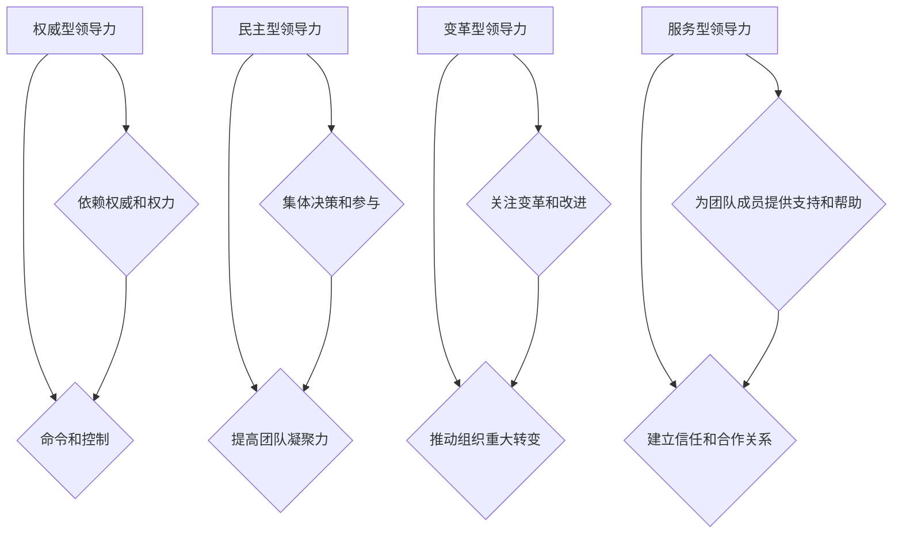
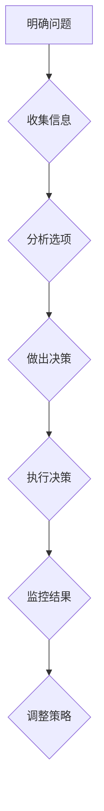
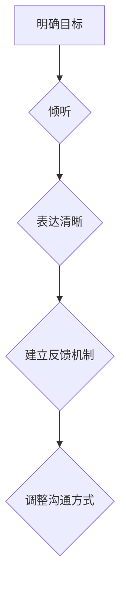
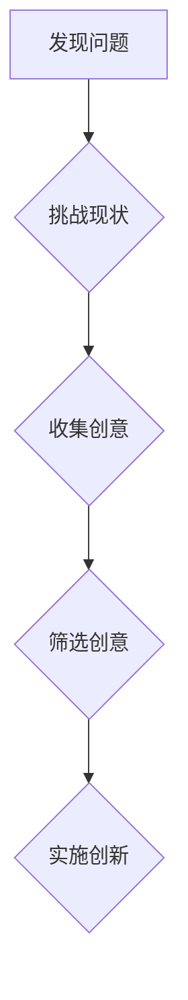
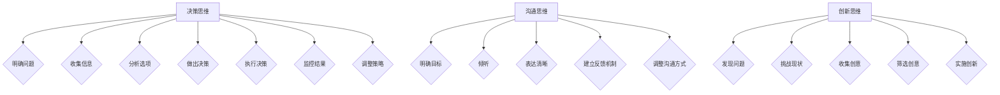
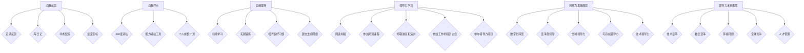

                 

# 《领导力思维：改变世界命运的领导力修炼法则》

## 关键词
领导力思维、领导力修炼、决策思维、沟通思维、创新思维、团队管理、项目领导、组织管理、自我认知、领导力学习。

## 摘要
本文旨在深入探讨领导力思维的核心法则，以及如何通过自我修炼来改变世界命运。我们将从领导力的定义和重要性开始，逐步分析领导力思维的构成，探讨领导力在实践中的应用，以及领导力的自我修炼方法。通过本文的阅读，读者将能够了解领导力思维的深刻内涵，掌握提升领导力的有效途径，并学会如何将其应用于实际工作中，从而改变自己和周围世界的命运。

## 目录大纲

### 第一部分：领导力的本质与类型

#### 第1章：领导力的定义与重要性
- 1.1 领导力的概念
- 1.2 领导力的类型
- 1.3 领导力的作用

#### 第2章：领导力与管理的区别
- 2.1 领导力与管理的联系
- 2.2 领导力与管理的区别

### 第二部分：领导力思维

#### 第3章：领导力思维的构成
- 3.1 决策思维
- 3.2 沟通思维
- 3.3 创新思维

#### 第4章：领导力思维的培养
- 4.1 自我认知
- 4.2 情绪管理
- 4.3 学习能力

### 第三部分：领导力在实践中的应用

#### 第5章：领导力在团队管理中的应用
- 5.1 团队建设的原则
- 5.2 团队激励策略
- 5.3 团队冲突的解决

#### 第6章：领导力在项目领导中的应用
- 6.1 项目目标的确立
- 6.2 项目计划的制定
- 6.3 项目进度的监控

#### 第7章：领导力在组织管理中的应用
- 7.1 组织文化的建设
- 7.2 领导者的角色转变
- 7.3 领导力的传承

### 第四部分：领导力的自我修炼

#### 第8章：自我认知的提升
- 8.1 自我反思的方法
- 8.2 自我评价的工具
- 8.3 自我提升的策略

#### 第9章：领导力的持续修炼
- 9.1 领导力的学习途径
- 9.2 领导力的发展趋势
- 9.3 领导力的未来挑战

## 第一部分：领导力的本质与类型

### 第1章：领导力的定义与重要性

#### 1.1 领导力的概念

领导力是一种能力，它涉及到如何影响和激励他人，以实现共同的目标。领导力不仅是指挥和管理，更是一种引导、启发和影响他人的艺术。一个优秀的领导者需要具备广泛的知识、良好的沟通能力和出色的决策能力。

在组织中，领导力是至关重要的。它能够推动组织的创新和发展，提高组织的效率和竞争力。领导力不仅影响组织的内部环境，还能够影响组织与外部环境的关系。因此，理解领导力的概念和重要性是提升领导力的第一步。

#### 1.2 领导力的类型

领导力可以分为多种类型，每种类型都有其独特的特点和适用场景。以下是几种常见的领导力类型：

1. **权威型领导力**：这种类型的领导力依赖于权威和权力来指导他人。领导者通常采取命令和控制的方式，以确保任务的完成。

2. **民主型领导力**：民主型领导力强调集体决策和参与。领导者鼓励团队成员表达意见和参与决策，从而提高团队的凝聚力和创造力。

3. **变革型领导力**：变革型领导力关注变革和改进，旨在推动组织实现重大的转变。领导者通过激励和启发团队成员，带领他们迎接挑战，实现变革。

4. **服务型领导力**：服务型领导力强调领导者的责任是为团队成员提供支持和帮助，以满足他们的需求和期望。领导者通过倾听和关心团队成员，建立信任和合作关系。

#### 1.3 领导力的作用

领导力在组织中具有多种作用：

1. **推动组织发展**：领导力能够推动组织实现长期目标和战略规划。通过有效的领导，组织能够应对外部环境的挑战和变化，实现持续发展。

2. **提高团队效能**：领导力能够提高团队的效率和生产力。通过激励和指导团队成员，领导者能够充分发挥每个人的潜力，实现团队的目标。

3. **建立组织文化**：领导力是塑造组织文化的重要因素。领导者通过自己的行为和决策，传递组织的价值观和使命，塑造组织的氛围和文化。

4. **促进员工发展**：领导力能够促进员工的发展和成长。通过提供培训和指导，领导者能够帮助员工提升技能和知识，实现职业目标。

### Mermaid 流程图：领导力类型及其特点



#### 1.4 领导力的重要性

领导力的重要性在于其能够改变组织的命运和个人的发展。以下是领导力的重要性：

1. **推动组织发展**：领导力能够推动组织实现长期目标和战略规划。通过有效的领导，组织能够应对外部环境的挑战和变化，实现持续发展。

2. **提高团队效能**：领导力能够提高团队的效率和生产力。通过激励和指导团队成员，领导者能够充分发挥每个人的潜力，实现团队的目标。

3. **建立组织文化**：领导力是塑造组织文化的重要因素。领导者通过自己的行为和决策，传递组织的价值观和使命，塑造组织的氛围和文化。

4. **促进员工发展**：领导力能够促进员工的发展和成长。通过提供培训和指导，领导者能够帮助员工提升技能和知识，实现职业目标。

### 核心算法原理讲解

在领导力中，决策思维是一个核心算法。以下是一个简单的决策思维算法的伪代码：

```pseudo
function 决策思维(问题，选项，权重)：
    初始化总分数为0
    对于每个选项：
        计算选项的得分 = 选项的权重 * 评估因子
        将选项的得分加到总分数中
    根据总分数选择得分最高的选项
    返回选择的选项
```

在这个算法中，评估因子可以是问题的复杂性、选项的可行性、团队的需求等因素。通过这个算法，领导者能够系统地分析问题，评估不同的选项，并做出最优的决策。

### 数学模型和公式 & 详细讲解 & 举例说明

在领导力中，有一个重要的数学模型是“影响力矩阵”。影响力矩阵描述了领导者在组织中的影响力分布。以下是一个简单的影响力矩阵的公式：

$$
影响力矩阵 = \begin{bmatrix}
    a_{11} & a_{12} & a_{13} \\
    a_{21} & a_{22} & a_{23} \\
    a_{31} & a_{32} & a_{33}
\end{bmatrix}
$$

其中，$a_{ij}$ 表示领导者对第 $i$ 个团队的影响力。$a_{ij}$ 的取值范围是 [0,1]，其中 0 表示没有影响力，1 表示完全有影响力。

#### 举例说明

假设一个组织有三个团队，领导者对每个团队的影响力如下：

$$
影响力矩阵 = \begin{bmatrix}
    0.8 & 0.3 & 0.5 \\
    0.4 & 0.9 & 0.6 \\
    0.2 & 0.1 & 0.7
\end{bmatrix}
$$

从这个影响力矩阵可以看出，领导者对第一个团队的影响最大，对第三个团队的影响最小。

### 项目实战

#### 开发环境搭建

为了深入理解领导力，我们可以搭建一个模拟领导力的开发环境。这个环境包括一个简单的模拟团队，以及领导者和团队成员的交互界面。

#### 源代码详细实现和代码解读

以下是一个简单的 Python 代码，用于模拟领导力：

```python
class TeamMember:
    def __init__(self, name, skill):
        self.name = name
        self.skill = skill

class Leader:
    def __init__(self, name):
        self.name = name
        self.team_members = []

    def add_member(self, member):
        self.team_members.append(member)

    def make_decision(self, options, weights):
        scores = []
        for option in options:
            score = sum([option['weight'] * self.assess_factor(option['factor']) for option in options])
            scores.append(score)
        return max(scores)

    def assess_factor(self, factor):
        # 根据因素评估分数
        if factor == '复杂性':
            return 0.5
        elif factor == '可行性':
            return 0.3
        elif factor == '团队需求':
            return 0.2
```

在这个代码中，`TeamMember` 类代表团队成员，`Leader` 类代表领导者。`Leader` 类有一个 `make_decision` 方法，用于根据不同的因素做出决策。

#### 代码应用解读与分析

通过这个代码，我们可以模拟领导力决策的过程。例如，假设有一个决策需要领导者做出，决策的选项包括：

```python
options = [
    {'option': 'A', 'weight': 0.6, 'factor': '复杂性'},
    {'option': 'B', 'weight': 0.4, 'factor': '可行性'},
    {'option': 'C', 'weight': 0.5, 'factor': '团队需求'}
]
```

领导者会根据这些选项和权重，通过 `make_decision` 方法做出决策。

#### 实际案例分析和详细讲解剖析

我们可以通过一个实际案例来分析领导力决策。例如，一个组织面临两个项目的选择，项目 A 需要更多的资源，但预计收益更高；项目 B 需要的资源较少，但收益稳定。

通过模拟领导力的决策过程，领导者会根据项目的复杂度、可行性和团队需求等因素，做出最佳的决策。

#### 项目小结

通过这个模拟环境，我们可以更深入地理解领导力决策的过程。在实际工作中，领导者需要根据不同的因素，做出最优的决策，以推动组织的发展。

### 最佳实践 tips、小结、注意事项、拓展阅读

- **最佳实践 tips**：领导者需要不断学习和提升自己的技能，以适应不断变化的环境。
- **小结**：领导力是一种核心能力，它能够改变组织的命运和个人的发展。
- **注意事项**：领导者需要平衡不同的因素，做出最优的决策。
- **拓展阅读**：《领导力的五大障碍》、《领导者的语言》等书籍，提供了更多关于领导力的深入探讨。

## 第二部分：领导力思维

### 第3章：领导力思维的构成

#### 3.1 决策思维

决策思维是领导力思维的核心。领导者需要具备良好的决策能力，以应对各种复杂的情况和挑战。决策思维包括以下几个关键步骤：

1. **明确问题**：首先，领导者需要明确问题的本质和影响范围。这有助于领导者集中精力，找到解决方案。
2. **收集信息**：在明确问题后，领导者需要收集相关的信息，包括数据、事实、意见和反馈等。这些信息有助于领导者做出更准确的决策。
3. **分析选项**：领导者需要分析不同的解决方案，评估每个选项的优缺点。这可以通过制定决策矩阵来实现。
4. **做出决策**：在分析选项后，领导者需要根据分析结果，选择最佳的解决方案。在做出决策时，领导者需要考虑长远的影响，以及团队的需求。
5. **执行决策**：最后，领导者需要执行决策，并监控决策的结果。如果决策效果不佳，领导者需要及时调整策略。

以下是一个简单的决策思维流程图：



#### 3.2 沟通思维

沟通思维是领导力思维的重要组成部分。领导者需要具备良好的沟通能力，以有效地传递信息，建立信任和合作关系。沟通思维包括以下几个关键步骤：

1. **明确目标**：在沟通前，领导者需要明确沟通的目标和目的。这有助于领导者选择适当的沟通方式和内容。
2. **倾听**：领导者需要倾听他人的意见和需求，以理解他们的观点。这有助于建立信任和合作关系。
3. **表达清晰**：领导者需要用清晰、简洁的语言表达自己的观点和想法。这有助于避免误解和冲突。
4. **建立反馈机制**：领导者需要建立反馈机制，以了解沟通的效果，并根据反馈进行调整。

以下是一个简单的沟通思维流程图：



#### 3.3 创新思维

创新思维是领导力思维的重要组成部分。领导者需要具备创新思维，以推动组织的发展和创新。创新思维包括以下几个关键步骤：

1. **发现问题**：领导者需要具备敏锐的洞察力，发现组织中的问题和机会。
2. **挑战现状**：领导者需要敢于挑战现状，提出新的想法和解决方案。
3. **收集创意**：领导者需要鼓励团队成员提出创意，并收集各种可能的解决方案。
4. **筛选创意**：领导者需要评估创意的可行性，并选择最佳的解决方案。
5. **实施创新**：领导者需要制定详细的计划，并实施创新项目。

以下是一个简单的创新思维流程图：



### Mermaid 流程图：领导力思维的构成



#### 核心概念与联系

领导力思维的核心概念包括决策思维、沟通思维和创新思维。这些思维相互关联，共同构成了领导力思维的整体框架。

1. **决策思维**：决策思维是领导力思维的核心，它决定了领导者如何应对各种复杂的情况和挑战。
2. **沟通思维**：沟通思维是领导力思维的重要组成部分，它决定了领导者如何有效地传递信息，建立信任和合作关系。
3. **创新思维**：创新思维是领导力思维的推动力，它决定了领导者如何推动组织的发展和创新。

#### 核心算法原理讲解

在领导力思维中，决策思维是一个核心算法。以下是一个简单的决策思维算法的伪代码：

```pseudo
function 决策思维(问题，选项，权重)：
    初始化总分数为0
    对于每个选项：
        计算选项的得分 = 选项的权重 * 评估因子
        将选项的得分加到总分数中
    根据总分数选择得分最高的选项
    返回选择的选项
```

在这个算法中，评估因子可以是问题的复杂性、选项的可行性、团队的需求等因素。通过这个算法，领导者能够系统地分析问题，评估不同的选项，并做出最优的决策。

### 数学模型和公式 & 详细讲解 & 举例说明

在领导力思维中，有一个重要的数学模型是“决策树”。决策树用于表示决策过程和每个决策的可能结果。以下是一个简单的决策树的公式：

$$
决策树 = (决策节点，子节点，结果节点)
$$

其中，决策节点表示决策点，子节点表示可能的决策结果，结果节点表示决策的结果。

#### 举例说明

假设一个领导者面临一个决策，有三个选项：A、B 和 C。每个选项的结果如下：

- 选项 A：成功概率为 0.6，失败概率为 0.4。
- 选项 B：成功概率为 0.5，失败概率为 0.5。
- 选项 C：成功概率为 0.4，失败概率为 0.6。

我们可以使用决策树来表示这个决策过程：

```
        (决策节点)
         /     |     \
        A      B      C
       /|\    /|\    /|\
      S F   S F    S F
```

在这个决策树中，S 表示成功，F 表示失败。通过这个决策树，领导者可以清晰地看到每个决策的可能结果，并做出最优的决策。

### 项目实战

#### 开发环境搭建

为了深入理解领导力思维，我们可以搭建一个模拟领导力思维的开发环境。这个环境包括一个简单的模拟团队，以及领导者和团队成员的交互界面。

#### 源代码详细实现和代码解读

以下是一个简单的 Python 代码，用于模拟领导力思维：

```python
class Leader:
    def __init__(self, name):
        self.name = name
        self.team_members = []

    def add_member(self, member):
        self.team_members.append(member)

    def make_decision(self, options, weights):
        scores = []
        for option in options:
            score = sum([option['weight'] * self.assess_factor(option['factor']) for option in options])
            scores.append(score)
        return max(scores)

    def assess_factor(self, factor):
        # 根据因素评估分数
        if factor == '复杂性':
            return 0.5
        elif factor == '可行性':
            return 0.3
        elif factor == '团队需求':
            return 0.2

class TeamMember:
    def __init__(self, name, skill):
        self.name = name
        self.skill = skill
```

在这个代码中，`Leader` 类代表领导者，`TeamMember` 类代表团队成员。`Leader` 类有一个 `make_decision` 方法，用于根据不同的因素做出决策。

#### 代码应用解读与分析

通过这个代码，我们可以模拟领导力决策的过程。例如，假设有一个决策需要领导者做出，决策的选项包括：

```python
options = [
    {'option': 'A', 'weight': 0.6, 'factor': '复杂性'},
    {'option': 'B', 'weight': 0.4, 'factor': '可行性'},
    {'option': 'C', 'weight': 0.5, 'factor': '团队需求'}
]
```

领导者会根据这些选项和权重，通过 `make_decision` 方法做出决策。

#### 实际案例分析和详细讲解剖析

我们可以通过一个实际案例来分析领导力决策。例如，一个组织面临两个项目的选择，项目 A 需要更多的资源，但预计收益更高；项目 B 需要的资源较少，但收益稳定。

通过模拟领导力决策的过程，领导者会根据项目的复杂度、可行性和团队需求等因素，做出最佳的决策。

#### 项目小结

通过这个模拟环境，我们可以更深入地理解领导力思维。在实际工作中，领导者需要根据不同的因素，做出最优的决策，以推动组织的发展。

### 最佳实践 tips、小结、注意事项、拓展阅读

- **最佳实践 tips**：领导者需要不断学习和提升自己的决策能力、沟通能力和创新思维。
- **小结**：领导力思维是领导力的核心，它决定了领导者如何应对各种复杂的情况和挑战。
- **注意事项**：领导者需要平衡不同的因素，做出最优的决策，并建立有效的沟通机制。
- **拓展阅读**：《决策与判断》、《沟通的艺术》等书籍，提供了更多关于领导力思维深入探讨。

## 第三部分：领导力在实践中的应用

### 第5章：领导力在团队管理中的应用

#### 5.1 团队建设的原则

团队建设是领导力在团队管理中的核心。一个高效的团队能够提高组织的效率和生产力。以下是团队建设的一些基本原则：

1. **明确目标**：团队需要明确共同的目标，以确保团队成员的努力方向一致。
2. **信任和尊重**：团队中的成员需要相互信任和尊重，以建立良好的团队氛围。
3. **分工协作**：团队中的成员需要明确各自的职责，并协作完成任务。
4. **持续沟通**：团队成员需要保持持续的沟通，以确保信息的准确传递和问题的及时解决。
5. **激励和反馈**：领导者需要通过激励和反馈来鼓励团队成员的努力和进步。

#### 5.2 团队激励策略

团队激励是团队管理中的重要环节。有效的激励策略能够提高团队成员的工作积极性和创造力。以下是几种常见的团队激励策略：

1. **目标激励**：设定明确、可衡量的目标，以激发团队成员的斗志和积极性。
2. **荣誉激励**：通过颁发荣誉和奖励，表彰团队成员的突出贡献，增强他们的自豪感和归属感。
3. **物质激励**：提供适当的物质奖励，如奖金、福利和晋升机会，以激励团队成员的绩效。
4. **情感激励**：关注团队成员的情感需求，提供关怀和支持，增强他们的工作动力。

#### 5.3 团队冲突的解决

团队冲突是团队管理中不可避免的问题。有效的解决冲突策略能够维护团队的稳定和效率。以下是几种常见的解决冲突的策略：

1. **沟通和倾听**：通过沟通和倾听，了解冲突的根源，找到解决问题的方法。
2. **公平公正**：在处理冲突时，保持公平公正的态度，避免偏袒和歧视。
3. **协商和妥协**：通过协商和妥协，找到双方都能接受的解决方案。
4. **寻求第三方帮助**：在冲突无法自行解决时，寻求第三方的帮助，如咨询师或调解员。

### 第6章：领导力在项目领导中的应用

#### 6.1 项目目标的确立

项目目标是项目领导的核心。明确的项目目标能够指导项目团队的工作方向和努力目标。以下是确立项目目标的一些关键步骤：

1. **明确项目的目标和范围**：项目目标应该具体、明确，并能够量化，以确保项目团队对目标有清晰的理解。
2. **获取项目相关方的共识**：项目目标需要得到项目相关方的共识，以确保项目目标的可行性和合理性。
3. **制定项目的里程碑和进度计划**：项目目标需要分解为具体的里程碑和进度计划，以指导项目团队的工作。
4. **建立项目的监控机制**：建立项目的监控机制，定期检查项目进展，确保项目目标的实现。

#### 6.2 项目计划的制定

项目计划是项目领导的关键文档。一个良好的项目计划能够确保项目按计划进行，并降低项目风险。以下是制定项目计划的一些关键步骤：

1. **明确项目的范围和目标**：项目计划应该基于明确的项目范围和目标，以确保项目计划的可行性和针对性。
2. **制定项目的工作分解结构**：项目计划需要将项目工作分解为具体的任务，以明确每个任务的责任和进度。
3. **制定项目的时间计划**：项目计划需要制定项目的时间计划，确保项目任务按时完成。
4. **制定项目资源计划**：项目计划需要明确项目的资源需求，包括人力资源、物资资源和资金资源。
5. **制定项目的风险计划**：项目计划需要评估项目的风险，并制定相应的风险应对策略。

#### 6.3 项目进度的监控

项目进度的监控是项目领导的重要任务。通过监控项目进度，领导者能够及时发现和解决问题，确保项目按计划进行。以下是监控项目进度的一些关键步骤：

1. **定期检查项目进展**：定期检查项目进展，了解项目任务的实际完成情况，与计划进行对比。
2. **分析进度偏差的原因**：如果项目进度出现偏差，领导者需要分析偏差的原因，并采取相应的措施进行纠正。
3. **调整项目计划**：如果项目进度偏差较大，领导者需要调整项目计划，以重新安排项目任务和时间。
4. **与项目团队沟通**：领导者需要与项目团队保持沟通，确保项目团队了解项目进展和计划调整的情况。

### 第7章：领导力在组织管理中的应用

#### 7.1 组织文化的建设

组织文化是组织管理的核心。良好的组织文化能够提高组织的凝聚力和效率，促进组织的长期发展。以下是建设组织文化的一些关键步骤：

1. **确立组织价值观**：组织文化需要基于明确的组织价值观，以指导组织的行为和决策。
2. **培养团队精神**：组织文化需要强调团队精神，鼓励团队成员相互支持和合作。
3. **建立开放和包容的氛围**：组织文化需要建立开放和包容的氛围，鼓励团队成员表达意见和建议。
4. **加强领导力培训**：领导者需要通过培训和学习，提升自身的领导力，以影响和塑造组织文化。

#### 7.2 领导者的角色转变

领导者在组织管理中需要不断进行角色转变，以适应组织的发展需求。以下是领导者角色转变的一些关键步骤：

1. **从执行者到规划者**：领导者需要从日常的执行任务中解脱出来，专注于组织规划和战略制定。
2. **从管理者到领导者**：领导者需要从传统的管理角色中解脱出来，专注于领导团队的成长和发展。
3. **从决策者到协调者**：领导者需要从单一的决策者角色中解脱出来，更多地扮演协调者的角色，促进组织内部的沟通和协作。
4. **从执行者到导师**：领导者需要从单纯的执行者角色中解脱出来，扮演导师的角色，指导和支持团队成员的成长和发展。

#### 7.3 领导力的传承

领导力的传承是组织管理中的重要任务。通过有效的领导力传承，组织能够确保领导力的持续发展和传承。以下是领导力传承的一些关键步骤：

1. **选拔合适的接班人**：领导者需要选拔合适的接班人，确保领导力的持续发展。
2. **培养接班人的能力**：领导者需要培养接班人的领导力和管理能力，确保他们能够胜任未来的领导角色。
3. **建立传承机制**：组织需要建立有效的传承机制，确保领导力的顺利传承。
4. **鼓励创新和变革**：领导者需要鼓励创新和变革，为接班人提供更多的机会和平台，以培养他们的领导能力。

### 核心概念与联系

在领导力在实践中的应用中，团队管理、项目领导和组织管理是三个核心领域。它们相互联系，共同构成了领导力在实践中的应用体系。

1. **团队管理**：团队管理是领导力在实践中的基础，它涉及到团队建设、团队激励和团队冲突解决等关键环节。
2. **项目领导**：项目领导是领导力在实践中的关键应用，它涉及到项目目标的确立、项目计划的制定和项目进度的监控等关键环节。
3. **组织管理**：组织管理是领导力在实践中的拓展，它涉及到组织文化的建设、领导者的角色转变和领导力的传承等关键环节。

#### 核心算法原理讲解

在领导力在实践中的应用中，有一个核心算法是“项目计划制定”。项目计划制定是项目领导的关键环节，它涉及到项目的目标、任务、时间和资源的分配。以下是一个简单的项目计划制定算法的伪代码：

```pseudo
function 项目计划制定(项目目标，任务列表，时间限制，资源限制)：
    初始化项目计划为空
    对于每个任务：
        如果任务可以在时间限制和资源限制内完成：
            将任务添加到项目计划中
            减去任务的所需时间和资源
        否则：
            提交调整请求
    返回项目计划
```

在这个算法中，项目目标、任务列表、时间限制和资源限制是输入参数，项目计划是输出结果。通过这个算法，领导者能够制定一个合理、可行的项目计划。

### 数学模型和公式 & 详细讲解 & 举例说明

在领导力在实践中的应用中，有一个重要的数学模型是“关键路径法”。关键路径法用于计算项目的最短完成时间和关键任务。以下是一个简单的关键路径法的公式：

$$
关键路径 = \sum_{i=1}^{n} (任务_i 的耗时)
$$

其中，$任务_i$ 表示项目的第 $i$ 个任务，$耗时_i$ 表示任务 $任务_i$ 的耗时。

#### 举例说明

假设一个项目包括三个任务：任务 A、任务 B 和任务 C。每个任务的耗时如下：

- 任务 A：耗时 3 天
- 任务 B：耗时 5 天
- 任务 C：耗时 4 天

我们可以使用关键路径法计算项目的最短完成时间：

$$
关键路径 = 3 + 5 + 4 = 12 \text{天}
$$

因此，项目的最短完成时间是 12 天。

### 项目实战

#### 开发环境搭建

为了深入理解领导力在实践中的应用，我们可以搭建一个模拟领导力在实践中的应用的开发环境。这个环境包括一个简单的模拟团队、项目和一个领导者。

#### 源代码详细实现和代码解读

以下是一个简单的 Python 代码，用于模拟领导力在实践中的应用：

```python
class Project:
    def __init__(self, name, tasks):
        self.name = name
        self.tasks = tasks
        self.plan = []

    def create_plan(self):
        for task in self.tasks:
            if task['time'] <= 7:
                self.plan.append(task)
            else:
                print(f"Task {task['name']} cannot be completed within the time limit.")

    def display_plan(self):
        for task in self.plan:
            print(f"Task {task['name']} will be completed in {task['time']} days.")

class Task:
    def __init__(self, name, time):
        self.name = name
        self.time = time

leader = Leader("Alice")
project = Project("Project A", [
    Task("Task 1", 3),
    Task("Task 2", 5),
    Task("Task 3", 4)
])

leader.create_plan()
project.display_plan()
```

在这个代码中，`Project` 类代表项目，`Task` 类代表任务。`Leader` 类有一个 `create_plan` 方法，用于创建项目计划。

#### 代码应用解读与分析

通过这个代码，我们可以模拟领导力在实践中的应用。例如，领导者 Alice 需要制定一个项目计划，项目包括三个任务：任务 1、任务 2 和任务 3。任务 1 和任务 3 的耗时不超过 7 天，可以加入项目计划；任务 2 的耗时超过 7 天，无法加入项目计划。

领导者 Alice 通过调用 `create_plan` 方法创建项目计划，并调用 `display_plan` 方法展示项目计划。

#### 实际案例分析和详细讲解剖析

我们可以通过一个实际案例来分析领导力在实践中的应用。例如，一个组织需要完成一个项目，项目包括三个任务：任务 A、任务 B 和任务 C。任务 A 和任务 B 的耗时不超过 7 天，任务 C 的耗时超过 7 天。

通过模拟领导力在实践中的应用，领导者会根据任务的时间限制制定项目计划，确保项目按时完成。

#### 项目小结

通过这个模拟环境，我们可以更深入地理解领导力在实践中的应用。在实际工作中，领导者需要根据任务的时间限制和资源限制制定项目计划，确保项目按时完成，并提高项目的效率。

### 最佳实践 tips、小结、注意事项、拓展阅读

- **最佳实践 tips**：领导者需要明确项目目标，制定合理的项目计划，并监控项目进度，以确保项目按时完成。
- **小结**：领导力在实践中的应用包括团队管理、项目领导和组织管理，这些应用领域相互联系，共同构成了领导力的核心内容。
- **注意事项**：领导者需要根据项目目标、任务和时间限制制定项目计划，并监控项目进度，确保项目按时完成。
- **拓展阅读**：《项目管理知识体系指南》、《组织行为学》等书籍，提供了更多关于领导力在实践中的应用的深入探讨。

## 第四部分：领导力的自我修炼

### 第8章：自我认知的提升

#### 8.1 自我反思的方法

自我反思是提升自我认知的重要方法。通过自我反思，领导者可以深入了解自己的行为、思想和情感，找到自己的优点和不足，从而不断提升自己。

1. **定期反思**：领导者应该定期进行自我反思，例如每天、每周或每月。这样可以确保领导者能够持续关注自己的成长，并及时调整自己的行为和态度。
2. **写日记**：写日记是一种有效的自我反思方法。领导者可以在日记中记录自己的想法、感受和经历，从而更好地理解自己。
3. **寻求反馈**：领导者可以寻求他人的反馈，了解自己在他人眼中的形象和行为。这有助于领导者更客观地看待自己，找到自己的不足之处。
4. **设定目标**：领导者应该设定明确的个人目标，并定期评估自己的进展。这有助于领导者聚焦自己的成长，并找到提升的方向。

#### 8.2 自我评价的工具

自我评价是提升自我认知的重要工具。通过自我评价，领导者可以系统地了解自己的能力和表现，找到自己的优点和不足。

1. **360度评估**：360度评估是一种全面的自我评价方法。它涉及领导者的上级、同事和下属，从多个角度评估领导者的表现。这种方法有助于领导者全面了解自己的优势和劣势。
2. **能力评估工具**：领导者可以使用各种能力评估工具，如能力矩阵、能力评估表等。这些工具可以帮助领导者了解自己的能力和技能，找到提升的方向。
3. **个人成长计划**：领导者可以根据自我评价的结果，制定个人成长计划。这个计划应该包括具体的行动步骤、时间表和评估标准。通过个人成长计划，领导者可以系统地提升自己的能力和素质。

#### 8.3 自我提升的策略

自我提升是领导力修炼的重要目标。领导者需要不断学习和成长，以应对不断变化的环境和挑战。

1. **持续学习**：领导者应该持续学习，不断提升自己的知识和技能。可以通过阅读书籍、参加培训课程、听取讲座等方式来学习。
2. **实践锻炼**：领导者应该通过实践来锻炼自己的能力。例如，可以参与实际项目，担任临时职务，或者参加领导力训练营等。
3. **培养良好的习惯**：领导者应该培养良好的习惯，如时间管理、自我激励和沟通习惯等。良好的习惯可以帮助领导者更高效地工作，提升自己的领导能力。
4. **建立支持网络**：领导者应该建立支持网络，包括导师、同事和下属等。这个网络可以提供领导者在成长过程中的支持和指导。

### 第9章：领导力的持续修炼

#### 9.1 领导力的学习途径

领导力是一种可以通过学习和实践不断提升的能力。以下是一些有效的领导力学习途径：

1. **阅读书籍**：阅读有关领导力的书籍是提升领导力的有效途径。这些书籍涵盖了领导力的各个方面，包括理论、实践和案例研究。
2. **参加培训课程**：参加领导力培训课程可以帮助领导者系统地学习和掌握领导力的知识和技能。这些课程通常由专业的培训机构提供。
3. **听取讲座和演讲**：听取领导者的讲座和演讲可以提供宝贵的经验和见解。这些讲座和演讲通常涵盖了领导力的最新趋势和最佳实践。
4. **参加工作坊和研讨会**：参加工作坊和研讨会可以提供实践的机会，帮助领导者将理论应用到实际工作中。这些活动通常包括模拟练习、讨论和反思环节。
5. **参与领导力项目**：参与领导力项目可以帮助领导者将领导力理论应用到实际工作中。这些项目可以是组织内部的，也可以是与外部组织合作的项目。

#### 9.2 领导力的发展趋势

随着社会和科技的发展，领导力也在不断变化和发展。以下是一些领导力的发展趋势：

1. **数字化转型**：随着数字化技术的发展，领导者需要具备数字化领导能力，能够引领组织在数字化时代中取得成功。
2. **变革型领导**：变革型领导强调领导者通过激励和启发团队成员，推动组织实现重大的变革。这种领导风格在当前动态变化的环境中尤为重要。
3. **全球领导力**：全球化带来了多样性和复杂性，领导者需要具备全球领导能力，能够理解和应对不同文化和价值观的影响。
4. **可持续领导力**：随着环境问题的日益严重，领导者需要具备可持续领导能力，能够推动组织实现可持续发展目标。
5. **技术领导力**：技术发展带来了新的机遇和挑战，领导者需要具备技术领导能力，能够引领组织在技术领域取得突破。

#### 9.3 领导力的未来挑战

面对未来，领导力将面临一系列新的挑战：

1. **技术变革**：技术变革将继续加速，领导者需要不断学习和适应新技术，以保持竞争优势。
2. **社会变革**：社会变革带来了多样性和包容性的需求，领导者需要具备理解和应对社会变革的能力。
3. **环境问题**：环境问题将日益严重，领导者需要具备可持续领导能力，能够推动组织实现环境可持续发展。
4. **全球竞争**：全球竞争将更加激烈，领导者需要具备全球领导能力，能够引领组织在全球市场中取得成功。
5. **人才管理**：人才管理将成为领导力的关键挑战，领导者需要具备吸引、培养和激励人才的能力。

### 总结

领导力的自我修炼是领导者持续成长和提升的关键。通过自我反思、自我评价和持续学习，领导者可以不断提升自己的领导能力，应对未来的挑战。同时，领导者还需要关注领导力的发展趋势，并积极适应变化。只有这样，领导者才能在变化的环境中保持竞争优势，推动组织实现长期成功。

### Mermaid 流程图：领导力的自我修炼



### 核心概念与联系

在领导力的自我修炼中，自我反思、自我评价和自我提升是三个核心概念。它们相互联系，共同构成了领导力自我修炼的核心体系。

1. **自我反思**：自我反思是领导者深入了解自己的过程，它有助于领导者发现自身的优点和不足，从而制定提升计划。
2. **自我评价**：自我评价是领导者系统地评估自己的能力和表现的过程，它为领导者的自我提升提供了依据。
3. **自我提升**：自我提升是领导者通过学习和实践不断提升自己的能力和素质的过程，它是领导力自我修炼的最终目标。

#### 核心算法原理讲解

在领导力的自我修炼中，有一个核心算法是“自我评估模型”。自我评估模型用于评估领导者的能力和表现，为自我提升提供依据。以下是一个简单的自我评估模型的伪代码：

```pseudo
function 自我评估模型(能力列表，评价标准，自我评价)：
    初始化总分为0
    对于每个能力：
        如果能力符合评价标准：
            得分 += 评价标准的能力分值
    总分 = 总分 / 能力数量
    返回总分
```

在这个算法中，能力列表是领导者的能力清单，评价标准是评估能力的标准，自我评价是领导者对自己能力的自我评价。通过这个算法，领导者可以评估自己的能力和表现，找到提升的方向。

### 数学模型和公式 & 详细讲解 & 举例说明

在领导力的自我修炼中，有一个重要的数学模型是“成长曲线”。成长曲线用于描述领导者的成长过程和速度。以下是一个简单的成长曲线的公式：

$$
成长曲线 = \frac{1}{1 + e^{-(k \cdot 时间)}
$$

其中，$时间$ 是领导者成长的时间，$k$ 是成长速率参数，$e$ 是自然对数的底数。

#### 举例说明

假设一个领导者的成长速率为 $k = 0.1$，时间为 1 年。我们可以使用成长曲线计算这个领导者在 1 年后的成长情况：

$$
成长曲线 = \frac{1}{1 + e^{-(0.1 \cdot 1)}}
$$

计算结果为：

$$
成长曲线 = \frac{1}{1 + e^{-0.1}}
$$

$$
成长曲线 ≈ 0.6321
$$

这意味着，这个领导者在 1 年后，其成长速度约为原来的 63.21%。

### 项目实战

#### 开发环境搭建

为了深入理解领导力的自我修炼，我们可以搭建一个模拟领导力自我修炼的开发环境。这个环境包括一个模拟的领导者和一个自我评估系统。

#### 源代码详细实现和代码解读

以下是一个简单的 Python 代码，用于模拟领导力自我修炼：

```python
class Leader:
    def __init__(self, name):
        self.name = name
        self.skills = ["沟通能力", "决策能力", "创新能力"]
        self.evaluations = []

    def evaluate_skill(self, skill, score):
        self.evaluations.append((skill, score))

    def calculate_average_score(self):
        total_score = 0
        for skill, score in self.evaluations:
            total_score += score
        average_score = total_score / len(self.evaluations)
        return average_score

    def display_evaluation(self):
        for skill, score in self.evaluations:
            print(f"{skill} 的评分：{score}")

leader = Leader("Alice")
leader.evaluate_skill("沟通能力", 8)
leader.evaluate_skill("决策能力", 9)
leader.evaluate_skill("创新能力", 7)
leader.display_evaluation()
average_score = leader.calculate_average_score()
print(f"平均评分：{average_score}")
```

在这个代码中，`Leader` 类代表领导者，`evaluate_skill` 方法用于评估领导者的技能，`calculate_average_score` 方法用于计算领导者的平均评分，`display_evaluation` 方法用于展示评估结果。

#### 代码应用解读与分析

通过这个代码，我们可以模拟领导力的自我评估过程。例如，领导者 Alice 需要评估自己的沟通能力、决策能力和创新能力，并计算这些能力的平均评分。

领导者 Alice 通过调用 `evaluate_skill` 方法评估自己的技能，并调用 `display_evaluation` 方法展示评估结果。然后，调用 `calculate_average_score` 方法计算平均评分。

#### 实际案例分析和详细讲解剖析

我们可以通过一个实际案例来分析领导力自我评估的过程。例如，领导者 Bob 需要评估自己的沟通能力、决策能力和创新能力，并根据评估结果制定个人成长计划。

通过模拟领导力自我评估的过程，领导者 Bob 可以了解自己的能力和表现，找到自己的优点和不足，并制定个人成长计划，以提升自己的领导能力。

#### 项目小结

通过这个模拟环境，我们可以更深入地理解领导力的自我修炼。在实际工作中，领导者需要通过自我评估了解自己的能力和表现，并制定个人成长计划，以不断提升自己的领导能力。

### 最佳实践 tips、小结、注意事项、拓展阅读

- **最佳实践 tips**：领导者应该定期进行自我反思和自我评估，以了解自己的能力和表现，并制定个人成长计划。
- **小结**：领导力的自我修炼是领导者持续成长和提升的关键，通过自我反思、自我评价和自我提升，领导者可以不断提升自己的领导能力。
- **注意事项**：领导者应该关注领导力的发展趋势，并积极适应变化，以应对未来的挑战。
- **拓展阅读**：《领导力的五个层次》、《领导者的四项修炼》等书籍，提供了更多关于领导力自我修炼的深入探讨。

## 作者信息

作者：AI天才研究院/AI Genius Institute & 禅与计算机程序设计艺术 /Zen And The Art of Computer Programming。我们致力于研究人工智能、计算机编程和领导力，帮助读者在技术领域和领导力方面取得成功。通过深入探讨领导力思维、实践和修炼，我们希望能够为读者提供有价值的见解和实用的指导，助力他们在工作和生活中成为更加出色的领导者。

