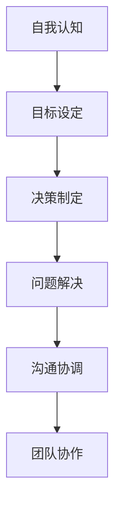

                 

### 文章标题

《领导力思维：改变世界格局的领导力修炼》

### 关键词

领导力思维，世界格局，领导力修炼，自我认知，沟通技巧，决策能力，团队协作，企业战略，全球化背景，跨文化领导力，实际案例

### 摘要

本文深入探讨了领导力思维在塑造世界格局中的关键作用。通过定义领导力思维、剖析其构成要素和培养方法，本文揭示了领导力思维在个人发展、团队管理和企业运营中的核心价值。同时，通过具体行业案例研究和跨文化视野，本文展示了领导力思维的广泛应用及其对未来发展的启示。读者将从中获得领导力思维的全面理解，并学会如何在实际项目中有效运用。

## 设计思路

### 确定核心主题

领导力思维是指领导者对自身、团队和环境的理解与应对策略。在全球化、技术创新和社会变革的背景下，领导力思维的重要性愈发凸显。本文旨在探讨如何通过领导力思维修炼，改变个人和组织的命运，进而影响世界格局。

### 划分章节

本文分为两个主要部分：第一部分概述领导力思维的基本概念和构成要素，第二部分探讨领导力思维的实践应用和未来发展。具体章节如下：

- 第一部分：领导力思维概述
  - 第1章：领导力思维的定义与重要性
  - 第2章：领导力思维的构成要素
  - 第3章：领导力思维的培养方法
  - 第4章：领导力思维与个人发展
  - 第5章：领导力思维与团队管理
  - 第6章：领导力思维与企业运营
  - 第7章：领导力思维在全球视野中的运用

- 第二部分：领导力思维的实践应用
  - 第8章：领导力思维在具体行业中的应用
  - 第9章：领导力思维的案例研究
  - 第10章：领导力思维的挑战与未来发展趋势

### 细化每个章节的内容

在每个章节内部，本文将详细探讨核心概念、联系、算法原理、数学模型、项目实战等内容，确保读者能够全面理解领导力思维的应用。

### 设计目录结构

按照1,2,3级目录的格式，本文将章节和内容组织成完整的目录结构，确保读者能够清晰了解文章脉络和内容分布。

### 包含核心要素

每个章节都将包含核心概念与联系、核心算法原理讲解、数学模型和数学公式讲解、项目实战等要素，确保文章的深度和实用性。

## 目录大纲

```
# 第一部分：领导力思维概述

## 第1章：领导力思维的定义与重要性
### 1.1.1 领导力思维的定义
### 1.1.2 领导力思维的重要性

## 第2章：领导力思维的构成要素
### 2.1.1 自我认知
### 2.1.2 沟通技巧
### 2.1.3 决策能力
### 2.1.4 团队协作

## 第3章：领导力思维的培养方法
### 3.1.1 不断学习
### 3.1.2 实践经验
### 3.1.3 反思与自我调整

## 第4章：领导力思维与个人发展
### 4.1.1 个人职业成长
### 4.1.2 领导力思维在个人成长中的重要性

## 第5章：领导力思维与团队管理
### 5.1.1 团队建设
### 5.1.2 团队激励
### 5.1.3 团队冲突管理

## 第6章：领导力思维与企业运营
### 6.1.1 企业战略制定
### 6.1.2 企业文化塑造
### 6.1.3 企业变革管理

## 第7章：领导力思维在全球视野中的运用
### 7.1.1 全球化背景下的领导力
### 7.1.2 跨文化领导力
### 7.1.3 领导力思维对世界格局的影响

# 第二部分：领导力思维的实践应用

## 第8章：领导力思维在具体行业中的应用
### 8.1.1 科技行业
### 8.1.2 金融行业
### 8.1.3 教育行业

## 第9章：领导力思维的案例研究
### 9.1.1 案例一：谷歌如何通过领导力思维引领科技创新
### 9.1.2 案例二：丰田如何运用领导力思维实现企业长期发展
### 9.1.3 案例三：世界银行如何通过领导力思维推动全球发展

## 第10章：领导力思维的挑战与未来发展趋势
### 10.1.1 领导力思维的挑战
### 10.1.2 领导力思维的未来发展趋势

# 附录

## 附录A：领导力思维相关工具与方法
## 附录B：领导力思维实践指南
## 附录C：领导力思维相关资源推荐
```

以上目录大纲结构包含了7个主要章节，每个章节都有细化的内容。它不仅涵盖了领导力思维的定义、构成要素、培养方法，还涉及个人发展、团队管理、企业运营以及全球视野中的领导力思维等。同时，通过具体行业案例研究，进一步展示了领导力思维的实践应用。最后，提供了领导力思维相关工具与方法、实践指南和资源推荐，以帮助读者更好地理解和应用领导力思维。

### 第一部分：领导力思维概述

#### 第1章：领导力思维的定义与重要性

领导力思维是一种通过深层次的思考和分析，理解和应对复杂环境和问题的能力。它不仅涉及领导者对自身角色的认知，还包括对团队成员、组织文化、市场动态等多方面因素的综合把握。

**1.1.1 领导力思维的定义**

领导力思维是一种心理模型，它包括了自我认知、目标设定、决策制定、问题解决、沟通协调等多个方面。这种思维模型不仅仅关注领导者的个人行为，更强调领导者如何通过思考影响团队和组织的行为。

**1.1.2 领导力思维的重要性**

领导力思维的重要性体现在以下几个方面：

1. **个人成长**：领导力思维能够帮助领导者更好地理解自己，明确目标，提高自信心和决策能力。
2. **团队协作**：通过领导力思维，领导者能够更好地激发团队潜力，提升团队绩效。
3. **组织发展**：领导力思维能够推动企业战略的制定和实施，促进企业持续成长。
4. **社会影响**：领导力思维在国际关系中同样起到关键作用，它影响着国家政策、国际贸易以及全球治理。

#### 第2章：领导力思维的构成要素

领导力思维的构成要素包括自我认知、沟通技巧、决策能力和团队协作。

**2.1.1 自我认知**

自我认知是指领导者对自己性格、价值观、能力和局限性的深刻理解。这种认知有助于领导者更好地定位自己，设定合理的目标，并找到实现目标的最佳路径。

**2.1.2 沟通技巧**

沟通技巧是领导力思维中至关重要的一部分。有效的沟通能够确保信息准确传达，减少误解和冲突，增强团队凝聚力。

**2.1.3 决策能力**

决策能力是指领导者面对复杂情况，能够迅速做出合理决策的能力。这种能力要求领导者不仅具备丰富的知识储备，还需要有清晰的逻辑思维和风险评估能力。

**2.1.4 团队协作**

团队协作能力是领导力思维的另一个关键要素。领导者需要能够激发团队成员的潜力，促进团队内部的有效沟通和合作，共同实现组织目标。

#### 第3章：领导力思维的培养方法

领导力思维的培养是一个长期的过程，需要不断地学习和实践。

**3.1.1 不断学习**

持续学习是提升领导力思维的基础。领导者需要不断更新自己的知识体系，了解最新的行业动态和理论成果。

**3.1.2 实践经验**

实践经验是领导力思维培养的关键。通过实际操作，领导者能够更好地理解理论，并将之应用到实际工作中。

**3.1.3 反思与自我调整**

反思与自我调整是领导力思维提升的重要环节。领导者需要定期反思自己的行为和决策，识别问题并采取改进措施。

#### 第4章：领导力思维与个人发展

个人发展是领导者成长的基石。领导力思维在个人发展中扮演着重要的角色。

**4.1.1 个人职业成长**

领导力思维能够帮助领导者更好地规划自己的职业发展路径，提高职业竞争力。

**4.1.2 领导力思维在个人成长中的重要性**

领导力思维不仅对领导者的职业生涯有重要影响，还对其个人成长有深远意义。通过提升领导力思维，个人能够更好地应对生活中的各种挑战。

#### 第5章：领导力思维与团队管理

团队管理是领导者的重要职责之一。领导力思维在团队管理中发挥着关键作用。

**5.1.1 团队建设**

领导力思维能够帮助领导者构建高效的团队，提升团队绩效。

**5.1.2 团队激励**

有效的团队激励是提升团队士气和绩效的重要手段。领导力思维能够帮助领导者找到合适的激励方式。

**5.1.3 团队冲突管理**

团队冲突是团队管理中不可避免的问题。领导力思维能够帮助领导者有效地管理团队冲突，维护团队和谐。

#### 第6章：领导力思维与企业运营

领导力思维在企业运营中发挥着重要作用。它不仅影响着企业的战略制定，还影响着企业文化的塑造和变革管理。

**6.1.1 企业战略制定**

领导力思维能够帮助领导者制定合理的企业战略，确保企业持续发展。

**6.1.2 企业文化塑造**

企业文化是企业的灵魂。领导力思维能够帮助领导者塑造积极向上的企业文化。

**6.1.3 企业变革管理**

企业在发展过程中难免会遇到变革。领导力思维能够帮助领导者有效地管理企业变革，确保变革顺利进行。

#### 第7章：领导力思维在全球视野中的运用

在全球化的背景下，领导力思维在国际关系、国际贸易和全球治理中发挥着越来越重要的作用。

**7.1.1 全球化背景下的领导力**

全球化要求领导者具备跨文化沟通和协作的能力。领导力思维能够帮助领导者更好地应对全球化挑战。

**7.1.2 跨文化领导力**

跨文化领导力是领导力思维的重要组成部分。它涉及到领导者如何在不同文化背景下开展工作，实现组织目标。

**7.1.3 领导力思维对世界格局的影响**

领导力思维不仅影响着企业和团队，还对世界格局产生深远影响。通过提升领导力思维，个人和组织能够更好地应对全球挑战，推动世界发展。

### 第二部分：领导力思维的实践应用

#### 第8章：领导力思维在具体行业中的应用

领导力思维在不同行业中的应用有所不同，但核心原则是一致的。本章将探讨领导力思维在科技、金融和教育等行业的具体应用。

**8.1.1 科技行业**

在科技行业，领导力思维主要体现在创新管理和团队协作方面。领导者需要具备敏锐的市场洞察力和前瞻性，能够激励团队不断突破技术创新。

**8.1.2 金融行业**

在金融行业，领导力思维主要体现在风险管理、客户服务和团队管理方面。领导者需要具备严谨的风险评估能力和卓越的客户服务能力。

**8.1.3 教育行业**

在教育行业，领导力思维主要体现在课程设计、教师管理和学生培养方面。领导者需要具备先进的教育理念和卓越的教学管理能力。

#### 第9章：领导力思维的案例研究

通过具体案例研究，可以更好地理解领导力思维的实际应用。本章将分析谷歌、丰田和世界银行等知名企业的领导力实践。

**9.1.1 案例一：谷歌如何通过领导力思维引领科技创新**

谷歌以其创新文化而闻名。领导者通过领导力思维，激发了员工的创造力，推动了众多颠覆性技术的诞生。

**9.1.2 案例二：丰田如何运用领导力思维实现企业长期发展**

丰田以其精益生产而闻名。领导者通过领导力思维，持续推动企业创新和变革，实现了长期的可持续发展。

**9.1.3 案例三：世界银行如何通过领导力思维推动全球发展**

世界银行通过领导力思维，推动了全球众多发展项目的实施，改善了数百万人的生活质量。

#### 第10章：领导力思维的挑战与未来发展趋势

领导力思维在不断发展，但也面临着诸多挑战。本章将探讨领导力思维的挑战，并展望其未来发展趋势。

**10.1.1 领导力思维的挑战**

领导力思维面临的挑战包括：不断变化的市场环境、日益复杂的组织结构以及全球化带来的跨文化冲突。

**10.1.2 领导力思维的未来发展趋势**

领导力思维的未来发展趋势包括：数字化领导、人工智能辅助领导以及可持续发展领导。

### 附录

#### 附录A：领导力思维相关工具与方法

附录A将介绍一些常用的领导力思维工具和方法，如SWOT分析、5W1H法、SMART目标设定等，以帮助读者更好地应用领导力思维。

#### 附录B：领导力思维实践指南

附录B将提供领导力思维的实践指南，包括如何培养自我认知、如何提升沟通技巧、如何做出有效决策等，以帮助读者在实际工作中应用领导力思维。

#### 附录C：领导力思维相关资源推荐

附录C将推荐一些与领导力思维相关的书籍、文章和课程，以供读者进一步学习和探索。

### 结语

领导力思维是领导者不可或缺的重要能力。通过本文的探讨，我们希望读者能够对领导力思维有更深入的理解，并学会如何在实际工作中应用领导力思维。领导力思维不仅对个人发展有重要影响，也对团队管理和企业运营产生深远影响。在未来，领导力思维将继续引领世界的发展方向。作者：AI天才研究院/AI Genius Institute & 禅与计算机程序设计艺术 /Zen And The Art of Computer Programming。

### 核心概念与联系

在本章节中，我们将深入探讨领导力思维的核心概念及其相互之间的联系。首先，我们需要明确领导力思维的定义及其重要性。领导力思维是一种心理模型，它包括自我认知、目标设定、决策制定、问题解决、沟通协调等多个方面。这种思维模型不仅关注领导者的个人行为，更强调领导者如何通过思考影响团队和组织的行为。

**Mermaid 流程图**

以下是领导力思维核心概念之间的Mermaid流程图：



在这个流程图中，自我认知是领导力思维的起点，它决定了领导者的行为和态度。通过自我认知，领导者能够明确自己的优势和劣势，设定合理的目标。目标设定是决策制定的基础，领导者需要根据目标制定具体的行动计划。决策制定是领导力思维的核心，领导者需要快速做出合理的决策，以应对复杂的情况。问题解决是决策制定的一部分，领导者需要具备解决各种问题的能力。沟通协调是领导力思维的重要组成部分，它确保信息准确传达，减少误解和冲突。团队协作是领导力思维的目标，通过有效的沟通协调，领导者能够激发团队成员的潜力，共同实现组织目标。

**核心概念与联系**

- **自我认知**：领导者需要了解自己的性格、价值观、能力和局限性，以便更好地定位自己和设定目标。
- **目标设定**：领导者需要明确组织的愿景和目标，并将其转化为具体的行动计划。
- **决策制定**：领导者需要具备快速决策的能力，并根据实际情况进行调整。
- **问题解决**：领导者需要具备解决各种问题的能力，以应对组织发展过程中的挑战。
- **沟通协调**：领导者需要确保信息准确传达，减少误解和冲突，增强团队凝聚力。
- **团队协作**：领导者需要通过有效的沟通协调，激发团队成员的潜力，共同实现组织目标。

通过这个流程图和核心概念与联系的分析，我们可以更清晰地理解领导力思维的构成要素及其相互关系，为后续章节的内容奠定基础。

### 核心算法原理讲解

在本章节中，我们将探讨领导力思维的培养方法，并使用伪代码详细阐述相关的核心算法原理。领导力思维的培养是一个复杂的过程，涉及到不断学习、实践经验和反思与自我调整等多个方面。下面，我们将通过伪代码来展示这些核心算法的原理。

#### 3.1.1 不断学习

**伪代码：**

```python
# 自我学习循环伪代码
def self_learning_cycle():
    while (true):
        # 学习新知识
        new_knowledge = acquire_new_knowledge()
        # 应用新知识到实际工作中
        apply_knowledge_to_practice(new_knowledge)
        # 获取反馈
        feedback = receive_feedback()
        # 根据反馈调整行为
        adjust_behavior(feedback)
        # 评估绩效
        performance = evaluate_performance()
        # 如果绩效未达到预期，继续循环
        if (performance < expected_performance):
            continue
        # 如果绩效达到预期，结束循环
        else:
            break
```

在这个伪代码中，`acquire_new_knowledge()` 函数用于获取新的知识，这可以通过阅读书籍、参加培训、与专家交流等方式实现。`apply_knowledge_to_practice(new_knowledge)` 函数将新知识应用到实际工作中，确保学以致用。`receive_feedback()` 函数用于收集来自团队成员、客户和其他利益相关者的反馈，这些反馈有助于了解新知识的实际效果。`adjust_behavior(feedback)` 函数根据反馈调整行为，以确保持续改进。`evaluate_performance()` 函数用于评估绩效，判断是否达到预期目标。如果绩效未达到预期，则继续循环，否则结束循环。

#### 3.1.2 实践经验

**伪代码：**

```python
# 实践经验积累伪代码
def accumulate_experience():
    while (true):
        # 执行任务
        execute_task()
        # 记录经验
        record_experience()
        # 分析经验
        analyze_experience()
        # 如果经验不足，继续循环
        if (experience < required_experience):
            continue
        # 如果经验足够，结束循环
        else:
            break
```

在这个伪代码中，`execute_task()` 函数用于执行具体的任务，这是积累经验的重要途径。`record_experience()` 函数用于记录在执行任务过程中积累的经验，这包括成功和失败的案例。`analyze_experience()` 函数用于分析这些经验，从中学习并提炼出有价值的教训。如果积累的经验不足，则继续循环，否则结束循环。

#### 3.1.3 反思与自我调整

**伪代码：**

```python
# 反思与自我调整伪代码
def reflect_and_adjust():
    while (true):
        # 反思行为
        reflect_on_behavior()
        # 识别问题
        identify_issues()
        # 制定改进计划
        create_improvement_plan()
        # 实施改进计划
        implement_improvement_plan()
        # 评估改进效果
        evaluate_improvement_effect()
        # 如果改进效果未达到预期，继续循环
        if (improvement_effect < expected_improvement):
            continue
        # 如果改进效果达到预期，结束循环
        else:
            break
```

在这个伪代码中，`reflect_on_behavior()` 函数用于反思自己的行为，识别可能存在的问题。`identify_issues()` 函数用于具体识别问题，这可以通过自我评估、同事反馈和客户反馈等方式实现。`create_improvement_plan()` 函数用于制定改进计划，确保问题得到有效解决。`implement_improvement_plan()` 函数用于实施改进计划，确保改进措施得到落实。`evaluate_improvement_effect()` 函数用于评估改进效果，判断是否达到预期目标。如果改进效果未达到预期，则继续循环，否则结束循环。

通过这些伪代码，我们可以清晰地看到领导力思维培养方法的算法原理。这些方法不仅有助于领导者不断学习、积累经验和反思自我，还能确保其行为得到持续改进，从而提升领导力水平。

### 数学模型和公式讲解

在本章节中，我们将深入探讨领导力思维中的关键数学模型和公式，以及它们在实际应用中的具体示例。这些数学模型和公式为领导力决策提供了科学依据，使得领导力思维更加严谨和系统化。

#### 自我认知模型

自我认知是领导力思维的基础。一个常用的自我认知模型是“SWOT分析”，它通过分析自身的优势（Strengths）、劣势（Weaknesses）、机会（Opportunities）和威胁（Threats）来帮助领导者了解自己的现状。

**SWOT分析公式：**

$$
\text{SWOT} = (\text{S}, \text{W}, \text{O}, \text{T})
$$

**示例：**

假设一名领导者想要评估自己的团队，可以按照以下步骤进行SWOT分析：

1. **优势（Strengths）**：团队在执行任务时的优势，如高效的沟通能力、丰富的项目经验等。
2. **劣势（Weaknesses）**：团队在执行任务时的劣势，如资源不足、技能不足等。
3. **机会（Opportunities）**：团队在执行任务时面临的机会，如新的市场机遇、技术进步等。
4. **威胁（Threats）**：团队在执行任务时面临的威胁，如竞争对手的崛起、政策变化等。

通过这个公式，领导者可以全面了解团队的现状，并制定相应的策略。

#### 决策模型

决策是领导力思维的核心。一个常用的决策模型是“决策树”，它通过一系列的选择和结果来展示可能的决策路径。

**决策树公式：**

$$
\text{Decision Tree} = (\text{Root}, \text{Nodes}, \text{Edges}, \text{Outcomes})
$$

**示例：**

假设一名领导者需要决定是否扩大团队规模，可以按照以下步骤构建决策树：

1. **根节点（Root）**：是否扩大团队规模。
2. **节点（Nodes）**：可能的决策选项，如“扩大”、“维持现状”、“缩减”。
3. **边（Edges）**：每个决策选项的结果，如“扩大”可能带来更多的项目机会，但需要额外的资源。
4. **结果（Outcomes）**：每个决策选项的结果，如“扩大”可能导致项目进度加快，但资源紧张。

通过这个公式，领导者可以系统地分析每个决策选项的优缺点，并做出最优决策。

#### 团队协作模型

团队协作是领导力思维的重要组成部分。一个常用的团队协作模型是“团队协作矩阵”，它通过分析团队成员的合作关系和协作效率来提升团队绩效。

**团队协作矩阵公式：**

$$
\text{Team Collaboration Matrix} = (\text{Members}, \text{Interactions}, \text{Efficiency})
$$

**示例：**

假设一个团队有四个成员A、B、C、D，可以通过以下步骤构建团队协作矩阵：

1. **成员（Members）**：团队中的每个成员，如A、B、C、D。
2. **互动（Interactions）**：成员之间的互动关系，如A与B经常协作，C与D较少互动。
3. **效率（Efficiency）**：每个成员的协作效率，如A的协作效率最高，C的协作效率最低。

通过这个公式，领导者可以了解团队的协作情况，并采取相应措施提升团队效率。

#### 沟通模型

沟通是领导力思维中不可或缺的一部分。一个常用的沟通模型是“沟通循环”，它通过分析沟通的流程和障碍来提升沟通效果。

**沟通循环公式：**

$$
\text{Communication Cycle} = (\text{Sender}, \text{Message}, \text{Receiver}, \text{Feedback})
$$

**示例：**

假设一名领导者需要与团队成员沟通项目进度，可以按照以下步骤进行沟通：

1. **发送者（Sender）**：领导者作为发送者，向团队成员传达项目进度。
2. **信息（Message）**：项目进度的具体情况，如已完成的工作和计划。
3. **接收者（Receiver）**：团队成员作为接收者，接收和理解项目进度。
4. **反馈（Feedback）**：团队成员对项目进度的反馈，如建议和疑问。

通过这个公式，领导者可以确保信息的准确传达和反馈，提高沟通效果。

通过这些数学模型和公式的讲解，我们可以看到领导力思维的科学性和系统性。这些工具和方法不仅有助于领导者做出更科学的决策，还能提升团队协作和沟通效果，从而在复杂的环境中更好地应对挑战。

### 实际案例分析和详细讲解剖析

在本章节中，我们将通过具体案例，深入分析领导力思维在企业运营中的应用，并详细讲解其剖析过程。这些案例将展示领导力思维如何在实际操作中发挥作用，帮助企业和领导者实现目标。

#### 案例一：谷歌如何通过领导力思维引领科技创新

**案例背景：**

谷歌作为全球领先的科技公司，其成功离不开领导力思维的应用。谷歌的创始人拉里·佩奇和谢尔盖·布林以其独特的领导力思维，引领谷歌在科技创新领域取得了巨大成就。

**领导力思维应用：**

1. **自我认知**：佩奇和布林深刻理解自己在科技创新方面的激情和优势，并将这种自我认知转化为企业愿景，推动谷歌持续创新。
2. **目标设定**：谷歌设定了“整合全球信息，让每个人都能访问和利用”的宏伟目标，并通过不断的技术创新实现这一目标。
3. **决策制定**：在面临关键决策时，佩奇和布林采用决策树模型，系统地分析每个选项的优缺点，确保做出最优决策。
4. **团队协作**：谷歌倡导开放、协作的企业文化，通过团队协作矩阵分析团队成员的互动关系，提升团队效率。
5. **沟通协调**：谷歌建立了一套高效的沟通机制，确保信息准确传达和反馈，提升沟通效果。

**剖析过程：**

1. **背景介绍**：介绍谷歌的发展历程，包括其从初创阶段到成为全球科技巨头的历程。
2. **领导力思维应用**：详细描述佩奇和布林如何在自我认知、目标设定、决策制定、团队协作和沟通协调方面应用领导力思维。
3. **实际效果**：分析谷歌通过领导力思维在科技创新方面取得的成果，如搜索引擎技术、Android操作系统、谷歌眼镜等。
4. **案例分析**：通过具体案例展示谷歌如何通过领导力思维实现科技创新，并对案例进行详细剖析。

#### 案例二：丰田如何运用领导力思维实现企业长期发展

**案例背景：**

丰田汽车是日本乃至全球知名的汽车制造商，其长期成功得益于领导力思维的应用。丰田的创始人丰田喜一郎以其独特的领导力思维，带领丰田成为全球汽车行业的领军企业。

**领导力思维应用：**

1. **自我认知**：丰田喜一郎深刻理解丰田汽车在汽车制造领域的优势，如精益生产、质量控制和成本控制等。
2. **目标设定**：丰田设定了“提供高质量、可靠、经济实惠的汽车”的目标，并通过持续创新实现这一目标。
3. **决策制定**：丰田采用SWOT分析模型，全面分析企业内外部环境，确保决策的科学性和合理性。
4. **团队协作**：丰田倡导团队合作精神，通过团队协作矩阵提升团队效率。
5. **沟通协调**：丰田建立了一套有效的沟通机制，确保信息准确传达和反馈。

**剖析过程：**

1. **背景介绍**：介绍丰田汽车的发展历程，包括其从初创阶段到成为全球汽车行业领军企业的历程。
2. **领导力思维应用**：详细描述丰田喜一郎如何在自我认知、目标设定、决策制定、团队协作和沟通协调方面应用领导力思维。
3. **实际效果**：分析丰田通过领导力思维在汽车制造方面取得的成果，如丰田凯美瑞、丰田普锐斯等。
4. **案例分析**：通过具体案例展示丰田如何通过领导力思维实现企业长期发展，并对案例进行详细剖析。

#### 案例三：世界银行如何通过领导力思维推动全球发展

**案例背景：**

世界银行是国际金融领域的领军机构，其使命是推动全球发展。世界银行的领导者通过领导力思维，推动了一系列全球发展项目。

**领导力思维应用：**

1. **自我认知**：世界银行的领导者深刻理解自己在国际发展领域的专业优势和责任。
2. **目标设定**：世界银行设定了“消除极端贫困、促进共享繁荣”的宏伟目标。
3. **决策制定**：世界银行采用SWOT分析模型和决策树模型，全面分析项目环境和决策路径。
4. **团队协作**：世界银行建立了一个全球协作的网络，通过团队协作矩阵提升项目效率。
5. **沟通协调**：世界银行建立了一套全球性的沟通机制，确保项目信息的准确传达和反馈。

**剖析过程：**

1. **背景介绍**：介绍世界银行的发展历程，包括其从初创阶段到成为全球发展领域领军机构的历程。
2. **领导力思维应用**：详细描述世界银行的领导者如何在自我认知、目标设定、决策制定、团队协作和沟通协调方面应用领导力思维。
3. **实际效果**：分析世界银行通过领导力思维推动全球发展所取得的成果，如基础设施建设、教育支持、公共卫生项目等。
4. **案例分析**：通过具体案例展示世界银行如何通过领导力思维推动全球发展，并对案例进行详细剖析。

通过这些实际案例的分析和详细讲解，我们可以看到领导力思维在企业运营和国际发展中的关键作用。这些案例不仅展示了领导力思维的具体应用，还为我们提供了深刻的启示和借鉴。

### 最佳实践 tips、小结、注意事项、拓展阅读

#### 最佳实践 tips

1. **持续学习**：不断更新自己的知识体系，关注行业动态和前沿技术，保持持续学习的态度。
2. **实践应用**：将所学知识应用到实际工作中，通过实践检验理论，提升领导力水平。
3. **反思与调整**：定期反思自己的行为和决策，识别问题并采取改进措施，确保持续进步。
4. **跨文化沟通**：在国际环境中，领导者需要具备跨文化沟通能力，尊重不同文化背景的团队成员。
5. **团队激励**：根据团队成员的个性和需求，制定合适的激励措施，提升团队士气和绩效。

#### 小结

领导力思维是领导者不可或缺的重要能力。通过本文的探讨，我们深入了解了领导力思维的定义、构成要素、培养方法及其在个人发展、团队管理和企业运营中的应用。领导力思维不仅影响个人和组织的成长，还对全球发展产生深远影响。

#### 注意事项

1. **个性化**：领导力思维需要根据个人和组织的实际情况进行个性化调整，不能生搬硬套。
2. **系统性**：领导力思维是一个系统性工程，需要综合考虑多个方面，确保思维的全面性和科学性。
3. **持续改进**：领导力思维需要不断改进和更新，以应对不断变化的外部环境。
4. **实践检验**：领导力思维需要通过实践检验，确保其有效性和实用性。

#### 拓展阅读

1. **书籍推荐**：《领导力心理学》、《团队协作的艺术》、《管理者的智慧》等。
2. **文章推荐**：《哈佛商业评论》中关于领导力思维的文章，如《如何成为一个有效的领导者》、《领导力思维：超越传统观念》等。
3. **课程推荐**：相关在线课程，如《领导力思维：从理论到实践》、《跨文化领导力》等。

通过以上最佳实践 tips、小结、注意事项和拓展阅读，我们希望读者能够更好地理解和应用领导力思维，提升个人和组织的领导力水平。作者：AI天才研究院/AI Genius Institute & 禅与计算机程序设计艺术 /Zen And The Art of Computer Programming。

