                 

# 文章标题：领导力思维：改变世界格局的领导力修炼法则

## 关键词：
领导力、思维模式、领导力修炼、世界格局、变革型领导、创新领导

## 摘要：
本文旨在探讨领导力在当今世界中的关键作用，并提出一套系统化的领导力修炼法则。通过分析领导力的本质、核心理论和实践应用，本文将为读者提供一个全面、深入的领导力思维框架，帮助他们在个人和职业发展中不断提升领导力，以应对快速变化的世界格局。

---

### 第一部分：领导力基础

#### 第1章：领导力的本质与重要性

领导力是一个多层次、多维度的概念，它不仅仅关乎个人魅力的展现，更是一种影响他人、推动组织发展的能力。在这个章节中，我们将深入探讨领导力的定义，分析领导力对个人和组织的深远影响，以及理解不同类型的领导力风格。

### 1.1 领导力的定义

**核心概念与联系：**

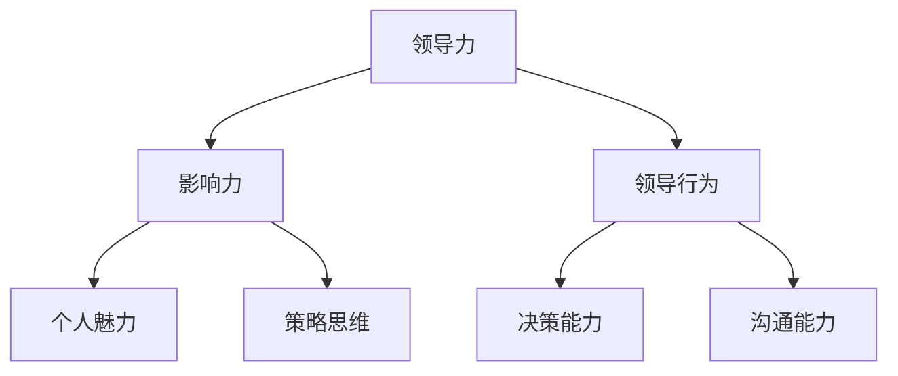

**核心算法原理讲解：**

领导力并不是一种单一的能力，而是由多个子能力组合而成的复合技能。我们可以将其分解为以下几个核心算法：

1. **影响力算法**：包括情感连接、信任建立和愿景传达。
2. **领导行为算法**：包括目标设定、激励团队和塑造文化。
3. **决策能力算法**：包括风险评估、问题解决和资源分配。

**数学模型和数学公式：**

```latex
\text{影响力} = f(\text{情感连接}, \text{信任建立}, \text{愿景传达})
```

**项目实战：**

探讨一个具体案例，如苹果公司前CEO史蒂夫·乔布斯如何通过愿景传达和情感连接来提升领导力。

### 1.2 领导力的重要性

**核心概念与联系：**

领导力对于个人和组织的重要性体现在以下几个方面：

1. **个人成长**：领导力是个人成长的催化剂，能够提升自信、决策能力和情绪管理能力。
2. **组织发展**：领导力是组织成功的基石，能够推动创新、提高绩效和建立团队文化。

**核心算法原理讲解：**

领导力的重要性可以通过以下算法来体现：

1. **个人成长算法**：包括自我认知、反馈循环和持续学习。
2. **组织发展算法**：包括战略规划、文化建设和资源管理。

**数学模型和数学公式：**

```latex
\text{个人成长} = f(\text{自我认知}, \text{反馈循环}, \text{持续学习})
\text{组织发展} = f(\text{战略规划}, \text{文化建设}, \text{资源管理})
```

**项目实战：**

分析如何通过领导力提升个人和组织的绩效，探讨最佳实践案例。

#### 第2章：领导力理论

领导力理论是理解领导力本质的重要工具。在这个章节中，我们将介绍几种主要的领导力理论，包括传统领导力理论、变革型领导力理论和参与型领导力理论。

## 文章标题：领导力思维：改变世界格局的领导力修炼法则

### 关键词：领导力，思维模式，领导力修炼，世界格局，变革型领导，创新领导

### 摘要：
本文旨在探讨领导力在当今世界中的关键作用，并提出一套系统化的领导力修炼法则。通过分析领导力的本质、核心理论和实践应用，本文将为读者提供一个全面、深入的领导力思维框架，帮助他们在个人和职业发展中不断提升领导力，以应对快速变化的世界格局。

---

### 第一部分：领导力基础

#### 第1章：领导力的本质与重要性

领导力是一个多层次、多维度的概念，它不仅仅关乎个人魅力的展现，更是一种影响他人、推动组织发展的能力。在这个章节中，我们将深入探讨领导力的定义，分析领导力对个人和组织的深远影响，以及理解不同类型的领导力风格。

### 1.1 领导力的定义

**核心概念与联系：**


**核心算法原理讲解：**

领导力并不是一种单一的能力，而是由多个子能力组合而成的复合技能。我们可以将其分解为以下几个核心算法：

1. **影响力算法**：包括情感连接、信任建立和愿景传达。
2. **领导行为算法**：包括目标设定、激励团队和塑造文化。
3. **决策能力算法**：包括风险评估、问题解决和资源分配。

**数学模型和数学公式：**

```latex
\text{影响力} = f(\text{情感连接}, \text{信任建立}, \text{愿景传达})
\text{领导行为} = f(\text{目标设定}, \text{激励团队}, \text{塑造文化})
\text{决策能力} = f(\text{风险评估}, \text{问题解决}, \text{资源分配})
```

**项目实战：**

探讨一个具体案例，如苹果公司前CEO史蒂夫·乔布斯如何通过愿景传达和情感连接来提升领导力。

### 1.2 领导力的重要性

**核心概念与联系：**

领导力对于个人和组织的重要性体现在以下几个方面：

1. **个人成长**：领导力是个人成长的催化剂，能够提升自信、决策能力和情绪管理能力。
2. **组织发展**：领导力是组织成功的基石，能够推动创新、提高绩效和建立团队文化。

**核心算法原理讲解：**

领导力的重要性可以通过以下算法来体现：

1. **个人成长算法**：包括自我认知、反馈循环和持续学习。
2. **组织发展算法**：包括战略规划、文化建设和资源管理。

**数学模型和数学公式：**

```latex
\text{个人成长} = f(\text{自我认知}, \text{反馈循环}, \text{持续学习})
\text{组织发展} = f(\text{战略规划}, \text{文化建设}, \text{资源管理})
```

**项目实战：**

分析如何通过领导力提升个人和组织的绩效，探讨最佳实践案例。

#### 第2章：领导力理论

领导力理论是理解领导力本质的重要工具。在这个章节中，我们将介绍几种主要的领导力理论，包括传统领导力理论、变革型领导力理论和参与型领导力理论。

### 2.1 传统领导力理论

传统领导力理论主要关注领导者的角色和职责，强调领导者的权威和控制力。以下是对几种传统领导力理论的概述：

1. **特质理论**：认为领导者天生具有某些特定的特质，如勇气、自信和决心。
2. **行为理论**：强调领导者通过特定的行为来影响他人，如指导、支持和激励。
3. **情境理论**：认为领导者的行为应该根据不同的情境进行调整。

**核心概念与联系：**

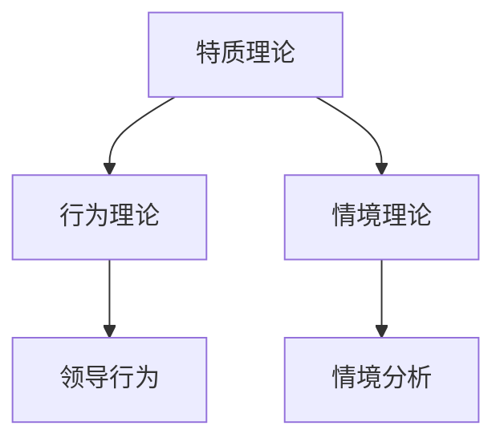

**核心算法原理讲解：**

传统领导力理论的核心在于理解领导者如何通过不同的方法来影响他人。具体算法包括：

1. **特质识别算法**：通过观察和分析，识别领导者的核心特质。
2. **行为调整算法**：根据具体情境，调整领导行为以达到最佳效果。
3. **情境分析算法**：分析当前情境，确定最合适的领导策略。

**数学模型和数学公式：**

```latex
\text{特质识别} = f(\text{行为分析}, \text{情境分析})
\text{行为调整} = f(\text{情境}, \text{目标})
\text{情境分析} = f(\text{环境变量}, \text{领导风格})
```

**项目实战：**

分析传统领导力理论在现实世界中的应用，如如何通过特质识别和情境分析来提升领导力。

### 2.2 变革型领导力理论

变革型领导力理论强调领导者的变革作用，认为领导者应该推动组织变革，以适应快速变化的环境。以下是对变革型领导力理论的概述：

1. **领导激励**：领导者通过激励员工，激发他们的潜能，推动组织变革。
2. **愿景塑造**：领导者通过明确愿景，为组织指明方向，激励员工为之奋斗。
3. **变革管理**：领导者通过有效的变革管理，确保组织变革的顺利进行。

**核心概念与联系：**

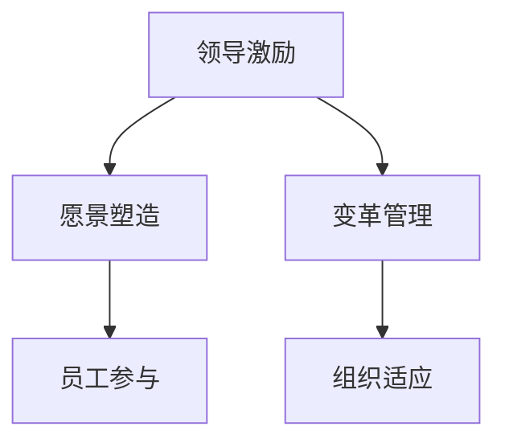

**核心算法原理讲解：**

变革型领导力理论的核心在于如何通过领导激励、愿景塑造和变革管理来推动组织变革。具体算法包括：

1. **领导激励算法**：通过情感连接、目标设定和反馈机制来激励员工。
2. **愿景塑造算法**：通过愿景传达、情境分析和策略规划来塑造愿景。
3. **变革管理算法**：通过风险评估、资源分配和团队协作来管理变革。

**数学模型和数学公式：**

```latex
\text{领导激励} = f(\text{情感连接}, \text{目标设定}, \text{反馈机制})
\text{愿景塑造} = f(\text{愿景传达}, \text{情境分析}, \text{策略规划})
\text{变革管理} = f(\text{风险评估}, \text{资源分配}, \text{团队协作})
```

**项目实战：**

探讨一个具体案例，如如何通过变革型领导力来推动企业数字化转型。

### 2.3 参与型领导力理论

参与型领导力理论强调领导者与团队成员之间的互动和参与，认为领导者的角色是协助和支持团队成员。以下是对参与型领导力理论的概述：

1. **民主决策**：领导者通过民主决策，确保团队成员的参与和意见被听取。
2. **团队建设**：领导者通过团队建设活动，增强团队成员之间的信任和合作。
3. **赋能**：领导者通过赋予团队成员权力和责任，提升他们的自主性和创造力。

**核心概念与联系：**

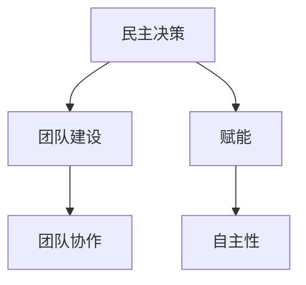

**核心算法原理讲解：**

参与型领导力理论的核心在于如何通过民主决策、团队建设和赋能来提升团队效能。具体算法包括：

1. **民主决策算法**：通过投票、讨论和共识来做出决策。
2. **团队建设算法**：通过活动、培训和团队建设游戏来增强团队凝聚力。
3. **赋能算法**：通过授权、培训和激励来提升团队成员的能力和自主性。

**数学模型和数学公式：**

```latex
\text{民主决策} = f(\text{投票}, \text{讨论}, \text{共识})
\text{团队建设} = f(\text{活动}, \text{培训}, \text{团队建设游戏})
\text{赋能} = f(\text{授权}, \text{培训}, \text{激励})
```

**项目实战：**

分析如何通过参与型领导力来提升团队协作和创新能力，探讨实际应用案例。

## 第3章：领导力技能

领导力技能是领导者成功的关键。在这个章节中，我们将探讨领导力中的关键技能，包括沟通能力、决策能力和团队领导力。

### 3.1 沟通能力

沟通能力是领导者必备的核心技能。有效的沟通不仅能确保信息准确传达，还能增强团队凝聚力和信任感。

#### 3.1.1 有效沟通的原则

**核心概念与联系：**

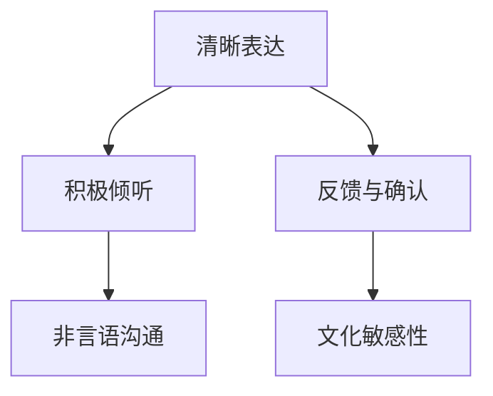

**核心算法原理讲解：**

有效沟通的原则包括：

1. **清晰表达**：确保信息准确、简洁且具有逻辑性。
2. **积极倾听**：倾听对方观点，理解其情感和意图。
3. **反馈与确认**：确认信息传达无误，避免误解。
4. **非言语沟通**：注意身体语言、面部表情和语调。
5. **文化敏感性**：尊重不同文化背景的沟通习惯。

**数学模型和数学公式：**

```latex
\text{有效沟通} = f(\text{清晰表达}, \text{积极倾听}, \text{反馈与确认}, \text{非言语沟通}, \text{文化敏感性})
```

**项目实战：**

探讨如何通过角色扮演和模拟沟通场景来提升领导者的沟通能力。

### 3.2 决策能力

决策能力是领导者面对复杂问题时做出明智选择的能力。有效的决策能力有助于提高组织绩效和应对不确定性。

#### 3.2.1 决策的类型

**核心概念与联系：**

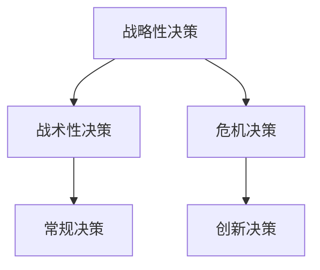

**核心算法原理讲解：**

决策的类型包括：

1. **战略性决策**：涉及长期目标和整体战略。
2. **战术性决策**：涉及短期目标和具体行动。
3. **危机决策**：应对突发事件和危机。
4. **常规决策**：处理日常运营问题。
5. **创新决策**：推动创新和变革。

**数学模型和数学公式：**

```latex
\text{战略性决策} = f(\text{长期目标}, \text{整体战略})
\text{战术性决策} = f(\text{短期目标}, \text{具体行动})
\text{危机决策} = f(\text{突发事件}, \text{危机应对})
\text{常规决策} = f(\text{日常运营}, \text{问题处理})
\text{创新决策} = f(\text{创新驱动}, \text{变革推动})
```

**项目实战：**

分析领导者如何在不同的决策场景中运用决策能力，探讨实际案例。

### 3.3 团队领导力

团队领导力是领导者协调、管理和激励团队的能力。有效的团队领导力能够提高团队绩效和实现共同目标。

#### 3.3.1 团队建设

**核心概念与联系：**

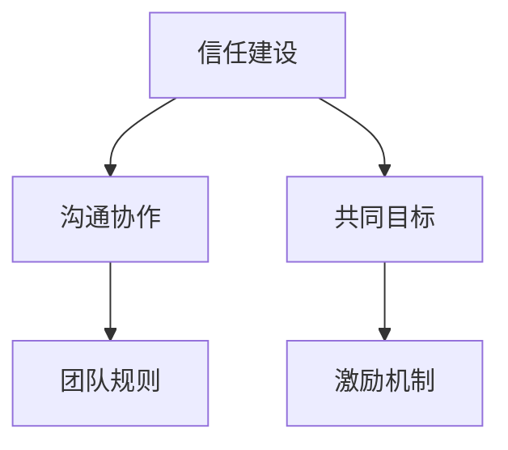

**核心算法原理讲解：**

团队建设的关键包括：

1. **信任建设**：通过透明沟通、相互尊重和共同目标来建立信任。
2. **沟通协作**：通过有效的沟通和协作机制来促进团队工作。
3. **共同目标**：确保团队成员朝着共同目标努力。
4. **团队规则**：明确团队行为准则和规范。
5. **激励机制**：通过奖励和认可来激励团队成员。

**数学模型和数学公式：**

```latex
\text{团队建设} = f(\text{信任建设}, \text{沟通协作}, \text{共同目标}, \text{团队规则}, \text{激励机制})
```

**项目实战：**

探讨如何通过团队建设活动来提升团队凝聚力和绩效，分析实际案例。

## 第4章：领导力与心理学

领导力与心理学密切相关，了解心理学原理有助于领导者更好地理解和管理团队。

### 4.1 自我意识

自我意识是领导者自我认知和自我提升的基础。

#### 4.1.1 自我认知的重要性

**核心概念与联系：**

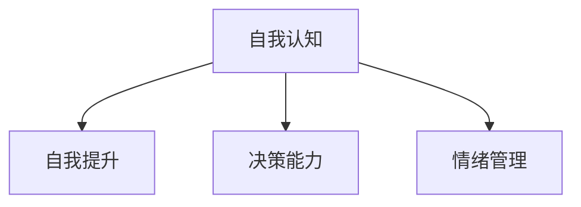

**核心算法原理讲解：**

自我认知的重要性在于：

1. **自我提升**：通过自我反思和持续学习来提升自我能力。
2. **决策能力**：更好地理解自身优势和局限，做出更明智的决策。
3. **情绪管理**：更好地控制自己的情绪，避免情绪波动对决策的影响。

**数学模型和数学公式：**

```latex
\text{自我认知} = f(\text{自我反思}, \text{持续学习}, \text{自我提升})
\text{决策能力} = f(\text{自我认知}, \text{数据分析}, \text{情境分析})
\text{情绪管理} = f(\text{情绪识别}, \text{情绪调节}, \text{情绪释放})
```

**项目实战：**

通过实际案例，探讨如何通过自我认知提升领导者的决策能力和情绪管理能力。

### 4.2 情绪管理

情绪管理是领导者应对压力和挑战的关键。

#### 4.2.1 情绪的类型

**核心概念与联系：**

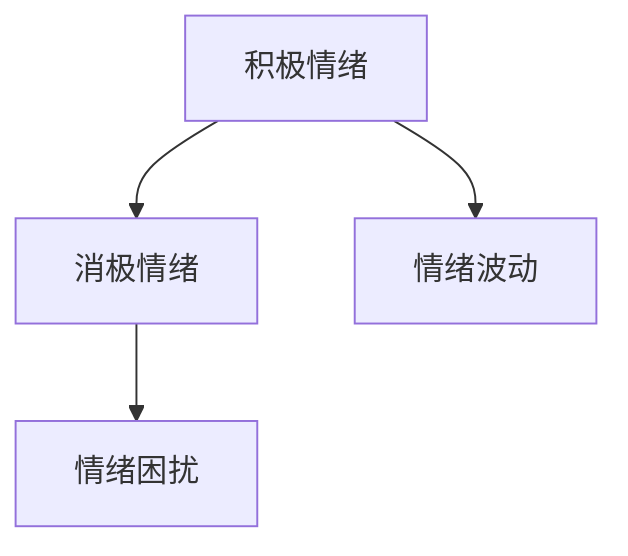

**核心算法原理讲解：**

情绪的类型包括：

1. **积极情绪**：如快乐、兴奋和满足感。
2. **消极情绪**：如焦虑、愤怒和沮丧。
3. **情绪波动**：情绪在不同时间、情境下的变化。
4. **情绪困扰**：情绪对日常生活和工作的影响。

**数学模型和数学公式：**

```latex
\text{积极情绪} = f(\text{成就感}, \text{自信}, \text{乐观})
\text{消极情绪} = f(\text{压力}, \text{挫败感}, \text{焦虑})
\text{情绪波动} = f(\text{情境变化}, \text{情绪调节能力})
\text{情绪困扰} = f(\text{情绪反应}, \text{情感负担}, \text{生活质量})
```

**项目实战：**

通过实际案例，分析如何通过情绪管理提升领导者的工作效率和团队凝聚力。

## 第5章：领导力与个人成长

领导力是一个持续发展的过程，个人成长是领导者不断提升自我的关键。

### 5.1 个人品牌建设

个人品牌是领导者影响力的体现。

#### 5.1.1 个人品牌的重要性

**核心概念与联系：**

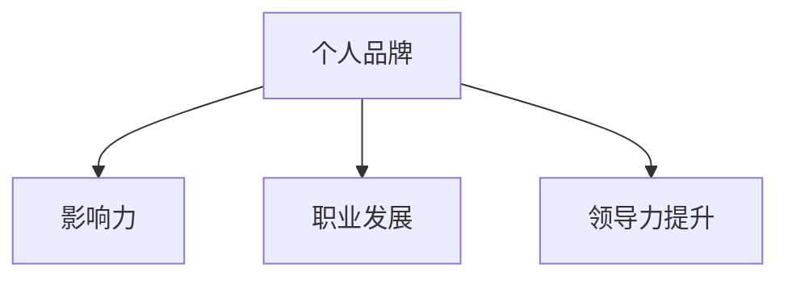

**核心算法原理讲解：**

个人品牌的重要性包括：

1. **影响力**：通过个人品牌提升，增强在行业和社区中的影响力。
2. **职业发展**：个人品牌有助于职业晋升和职场竞争力。
3. **领导力提升**：个人品牌有助于树立领导者的形象，提升领导力。

**数学模型和数学公式：**

```latex
\text{个人品牌} = f(\text{专业技能}, \text{行业知识}, \text{人格魅力})
\text{影响力} = f(\text{个人品牌}, \text{社交网络}, \text{知识传播})
\text{职业发展} = f(\text{个人品牌}, \text{业绩表现}, \text{职业规划})
\text{领导力提升} = f(\text{个人品牌}, \text{领导行为}, \text{领导力模型})
```

**项目实战：**

通过实际案例，分析如何通过个人品牌建设提升领导力。

### 5.2 成长心态

成长心态是领导者持续学习和进步的关键。

#### 5.2.1 成长心态的概念

**核心概念与联系：**

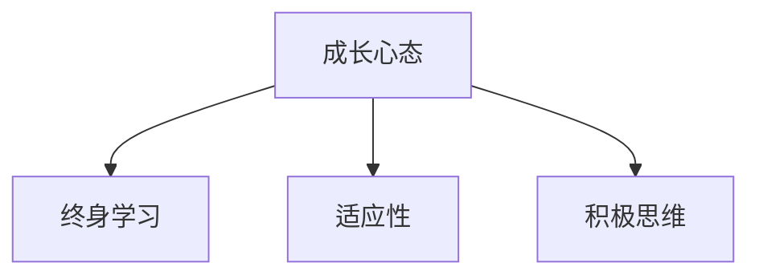

**核心算法原理讲解：**

成长心态的概念包括：

1. **终身学习**：不断学习新知识和技能，以适应快速变化的环境。
2. **适应性**：灵活应对变化和挑战，具备适应能力。
3. **积极思维**：积极看待问题，寻找解决问题的方法。

**数学模型和数学公式：**

```latex
\text{成长心态} = f(\text{终身学习}, \text{适应性}, \text{积极思维})
\text{学习效果} = f(\text{知识吸收}, \text{实践应用}, \text{反馈循环})
\text{适应能力} = f(\text{情境分析}, \text{策略调整}, \text{资源整合})
\text{积极思维} = f(\text{问题解决}, \text{创新思维}, \text{情绪调节})
```

**项目实战：**

通过实际案例，探讨如何通过培养成长心态来提升领导力。

## 第6章：领导力与组织文化

组织文化是组织的灵魂，领导者对组织文化有深远的影响。

### 6.1 组织文化的类型

组织文化可以分为以下几种类型：

1. **责任文化**：强调个人责任和团队责任，鼓励员工主动承担责任。
2. **合作文化**：强调团队合作和相互支持，鼓励员工协作实现共同目标。
3. **创新文化**：鼓励创新思维和探索精神，推动组织持续创新。

#### 6.1.1 责任文化

**核心概念与联系：**

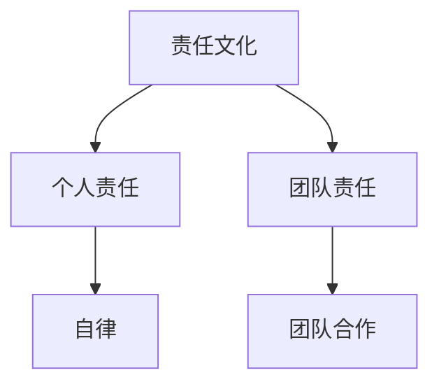

**核心算法原理讲解：**

责任文化的关键在于：

1. **个人责任**：通过明确责任和问责机制，提高员工自律和责任感。
2. **团队责任**：通过团队合作和共同目标，增强团队凝聚力和合作精神。

**数学模型和数学公式：**

```latex
\text{个人责任} = f(\text{明确责任}, \text{问责机制}, \text{自律})
\text{团队责任} = f(\text{团队合作}, \text{共同目标}, \text{团队协作})
```

**项目实战：**

分析如何通过责任文化提升组织的绩效和员工满意度。

#### 6.1.2 合作文化

**核心概念与联系：**

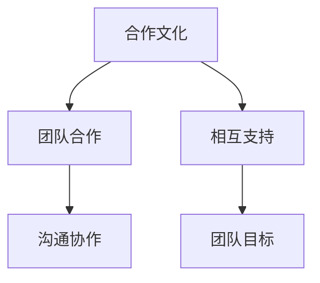

**核心算法原理讲解：**

合作文化的关键在于：

1. **团队合作**：通过有效的沟通和协作，实现团队目标。
2. **相互支持**：通过相互帮助和鼓励，增强团队凝聚力。

**数学模型和数学公式：**

```latex
\text{团队合作} = f(\text{沟通协作}, \text{团队目标}, \text{资源共享})
\text{相互支持} = f(\text{鼓励机制}, \text{互助精神}, \text{团队凝聚力})
```

**项目实战：**

通过实际案例，探讨如何通过合作文化提升团队绩效和员工满意度。

#### 6.1.3 创新文化

**核心概念与联系：**

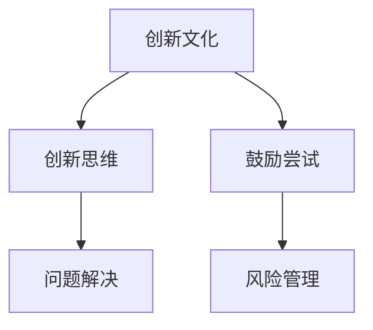

**核心算法原理讲解：**

创新文化的关键在于：

1. **创新思维**：鼓励员工跳出传统思维，寻找新的解决方案。
2. **鼓励尝试**：通过鼓励员工尝试新方法，推动创新。
3. **问题解决**：通过问题解决能力，将创新想法转化为实际成果。
4. **风险管理**：在创新过程中，有效管理风险。

**数学模型和数学公式：**

```latex
\text{创新思维} = f(\text{发散思维}, \text{批判思维}, \text{创新技巧})
\text{鼓励尝试} = f(\text{激励机制}, \text{反馈机制}, \text{支持系统})
\text{问题解决} = f(\text{问题识别}, \text{解决方案}, \text{实施验证})
\text{风险管理} = f(\text{风险识别}, \text{风险评估}, \text{风险控制})
```

**项目实战：**

通过实际案例，分析如何通过创新文化推动组织的持续创新。

## 第7章：领导力与创新

创新是组织持续发展的动力，领导者对创新有重要推动作用。

### 7.1 创新的重要性

创新对于组织发展具有重要意义，可以提高竞争力、推动经济增长和提升客户满意度。

#### 7.1.1 创新的类型

**核心概念与联系：**

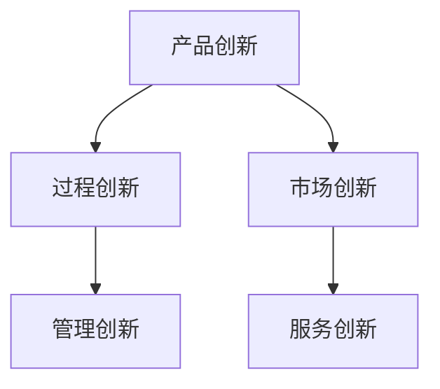

**核心算法原理讲解：**

创新的类型包括：

1. **产品创新**：改进或开发新产品。
2. **过程创新**：改进或开发新生产或服务过程。
3. **市场创新**：开拓新市场或创造新需求。
4. **管理创新**：改进或开发新管理方法。
5. **服务创新**：改进或开发新服务。

**数学模型和数学公式：**

```latex
\text{产品创新} = f(\text{市场需求}, \text{技术进步}, \text{用户体验})
\text{过程创新} = f(\text{生产效率}, \text{成本控制}, \text{质量控制})
\text{市场创新} = f(\text{市场分析}, \text{竞争策略}, \text{客户需求})
\text{管理创新} = f(\text{管理模式}, \text{组织结构}, \text{人力资源管理})
\text{服务创新} = f(\text{服务质量}, \text{客户体验}, \text{服务模式})
```

**项目实战：**

分析如何通过创新推动组织的持续发展，探讨实际案例。

### 7.2 领导力与创新

领导者对创新有重要的推动作用，需要具备以下能力：

1. **愿景规划**：明确组织的创新方向和目标。
2. **资源分配**：确保创新所需的资源和支持。
3. **风险管理**：有效管理创新过程中的风险。
4. **激励机制**：激励员工积极参与创新。

**核心概念与联系：**

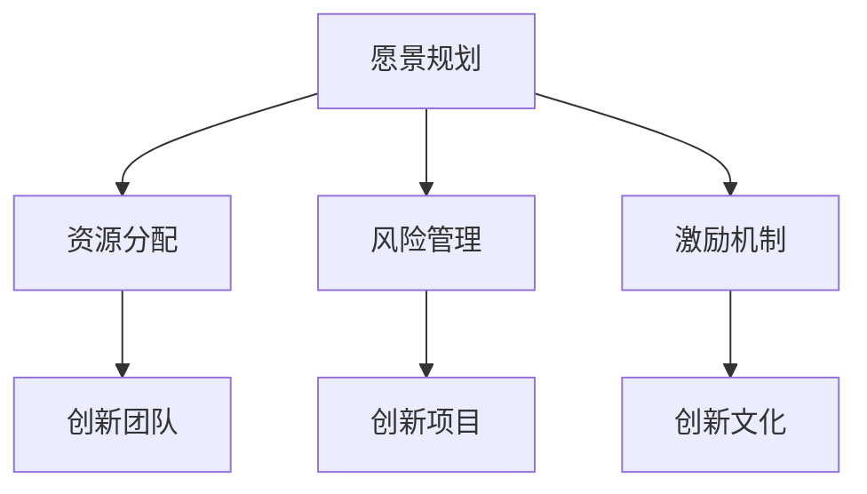

**核心算法原理讲解：**

领导力与创新的关系包括：

1. **愿景规划**：通过明确创新愿景，为组织指明方向。
2. **资源分配**：通过合理分配资源，支持创新项目的实施。
3. **风险管理**：通过风险评估和管理，降低创新失败的风险。
4. **激励机制**：通过激励机制，激发员工的创新潜力。

**数学模型和数学公式：**

```latex
\text{愿景规划} = f(\text{市场分析}, \text{技术趋势}, \text{组织战略})
\text{资源分配} = f(\text{预算管理}, \text{人员配置}, \text{技术支持})
\text{风险管理} = f(\text{风险识别}, \text{风险评估}, \text{风险应对})
\text{激励机制} = f(\text{奖励制度}, \text{认可机制}, \text{工作环境})
```

**项目实战：**

分析如何通过领导力推动组织的创新，探讨实际案例。

## 第8章：领导力与全球化

全球化背景下，领导者需要具备跨文化沟通和协作能力，以应对全球市场的挑战。

### 8.1 全球化背景下的领导力

全球化对领导力提出了新的要求，包括跨文化沟通、全球团队管理和全球化战略。

#### 8.1.1 全球化对领导力的影响

**核心概念与联系：**

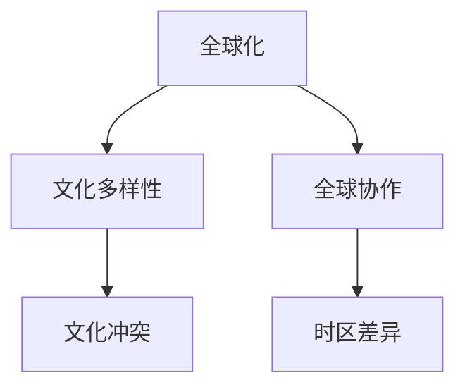

**核心算法原理讲解：**

全球化对领导力的影响包括：

1. **文化多样性**：领导者需要理解不同文化之间的差异，避免文化冲突。
2. **全球协作**：领导者需要建立跨文化团队，实现全球协作。
3. **时区差异**：领导者需要管理全球团队的时区差异，确保沟通效率。

**数学模型和数学公式：**

```latex
\text{文化多样性} = f(\text{文化知识}, \text{文化适应}, \text{文化尊重})
\text{全球协作} = f(\text{沟通机制}, \text{协作工具}, \text{团队文化})
\text{时区差异} = f(\text{时区管理}, \text{工作时间安排}, \text{协作效率})
```

**项目实战：**

分析如何通过跨文化沟通和协作来提升全球团队的绩效。

### 8.2 跨文化领导力

跨文化领导力是全球化领导力的核心，包括文化理解、跨文化沟通和跨文化团队管理。

#### 8.2.1 跨文化领导力的原则

**核心概念与联系：**

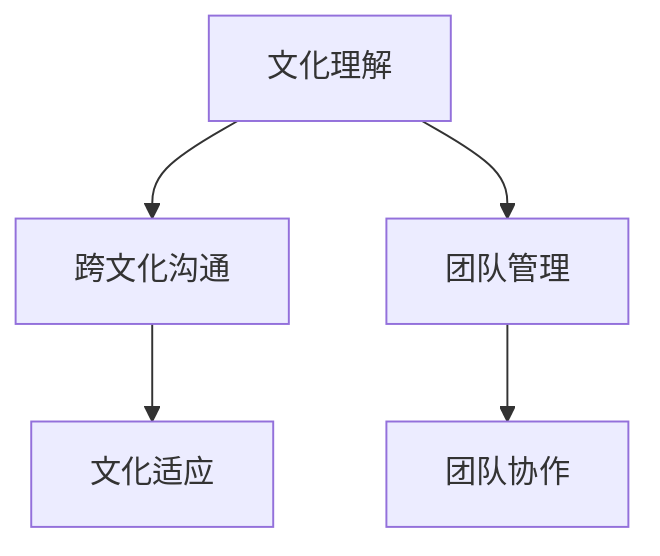

**核心算法原理讲解：**

跨文化领导力的原则包括：

1. **文化理解**：通过学习和了解不同文化的价值观和行为规范，增强跨文化沟通效果。
2. **跨文化沟通**：通过有效沟通，建立跨文化团队的信任和合作。
3. **团队管理**：通过管理策略，确保跨文化团队的协作和效率。
4. **团队协作**：通过协作工具和沟通机制，促进跨文化团队的协作。

**数学模型和数学公式：**

```latex
\text{文化理解} = f(\text{文化知识}, \text{文化洞察}, \text{文化适应})
\text{跨文化沟通} = f(\text{沟通技巧}, \text{文化敏感性}, \text{情境分析})
\text{团队管理} = f(\text{管理策略}, \text{团队文化}, \text{团队协作})
\text{团队协作} = f(\text{协作工具}, \text{沟通机制}, \text{团队目标})
```

**项目实战：**

分析如何通过跨文化领导力提升全球团队的绩效，探讨实际案例。

## 第9章：领导力与可持续发展

可持续发展是当今世界面临的重大挑战，领导者需要承担推动可持续发展的责任。

### 9.1 可持续发展的重要性

可持续发展不仅关乎环境保护和资源利用，还关乎社会公正和经济繁荣。

#### 9.1.1 可持续发展的概念

**核心概念与联系：**

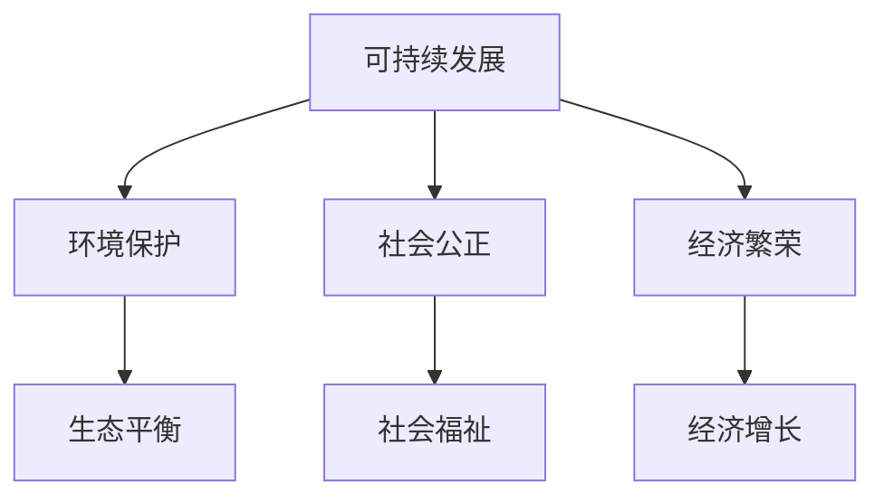

**核心算法原理讲解：**

可持续发展的概念包括：

1. **环境保护**：通过减少污染和保护自然资源，实现生态平衡。
2. **社会公正**：通过促进社会平等和消除贫困，实现社会福祉。
3. **经济繁荣**：通过可持续的经济活动，实现经济增长。

**数学模型和数学公式：**

```latex
\text{可持续发展} = f(\text{环境保护}, \text{社会公正}, \text{经济繁荣})
\text{环境保护} = f(\text{生态平衡}, \text{污染控制}, \text{资源管理})
\text{社会公正} = f(\text{社会平等}, \text{贫困消除}, \text{社会福利})
\text{经济繁荣} = f(\text{经济增长}, \text{可持续活动}, \text{创新能力})
```

**项目实战：**

分析如何通过可持续发展战略提升组织的竞争力和社会责任。

### 9.2 领导力与可持续发展

领导力在推动可持续发展中扮演关键角色，需要具备以下能力：

1. **战略规划**：制定明确的可持续发展战略。
2. **资源整合**：确保可持续发展所需的资源和支持。
3. **社会责任**：承担社会责任，推动可持续发展。

**核心概念与联系：**

```mermaid
graph TD
    A[战略规划] --> B[资源整合]
    A --> C[社会责任]
    B --> D[创新能力]
    C --> E[环境保护]
```

**核心算法原理讲解：**

领导力与可持续发展的关系包括：

1. **战略规划**：通过明确目标和策略，推动组织向可持续发展转型。
2. **资源整合**：通过有效管理和配置资源，支持可持续发展项目。
3. **社会责任**：通过承担社会责任，提升组织的社会形象和品牌价值。

**数学模型和数学公式：**

```latex
\text{战略规划} = f(\text{目标设定}, \text{策略分析}, \text{资源分配})
\text{资源整合} = f(\text{资源管理}, \text{创新应用}, \text{成本控制})
\text{社会责任} = f(\text{社会贡献}, \text{公益行动}, \text{可持续发展目标})
```

**项目实战：**

分析如何通过领导力推动组织的可持续发展，探讨实际案例。

## 第10章：领导力与未来

随着科技的快速发展，未来领导力将面临新的挑战和机遇。在这个章节中，我们将探讨未来领导力的趋势和领导力修炼。

### 10.1 未来领导力的趋势

未来领导力将受到以下几个方面的影响：

1. **数字化转型**：数字化技术将深刻改变领导方式和工作模式。
2. **人工智能**：人工智能将增强领导者的决策能力和管理效率。
3. **全球化**：全球化将带来更多的跨文化领导和协作挑战。
4. **可持续发展**：可持续发展将要求领导者承担更多的社会责任。

**核心概念与联系：**

```mermaid
graph TD
    A[数字化转型] --> B[人工智能]
    A --> C[全球化]
    A --> D[可持续发展]
    B --> E[数据分析]
    C --> F[跨文化领导]
    D --> G[社会责任]
```

**核心算法原理讲解：**

未来领导力的趋势包括：

1. **数字化转型**：通过数字化工具和平台，提高工作效率和决策质量。
2. **人工智能**：利用人工智能技术，优化决策过程和管理流程。
3. **全球化**：通过跨文化沟通和协作，提升全球团队的绩效。
4. **可持续发展**：通过战略规划和资源整合，推动组织的可持续发展。

**数学模型和数学公式：**

```latex
\text{数字化转型} = f(\text{数字化工具}, \text{数据分析}, \text{流程优化})
\text{人工智能} = f(\text{机器学习}, \text{深度学习}, \text{决策支持})
\text{全球化} = f(\text{跨文化沟通}, \text{全球化团队}, \text{协作效率})
\text{可持续发展} = f(\text{战略规划}, \text{资源整合}, \text{社会责任})
```

**项目实战：**

探讨如何通过数字化转型、人工智能和全球化推动组织的未来领导力，分析实际案例。

### 10.2 领导力修炼

领导力修炼是领导者不断提升自我能力的过程。在这个章节中，我们将探讨领导力修炼的方法和最佳实践。

#### 10.2.1 领导力自我修炼的方法

**核心概念与联系：**

```mermaid
graph TD
    A[自我认知] --> B[持续学习]
    A --> C[情绪管理]
    B --> D[反馈循环]
    C --> E[自我反思]
```

**核心算法原理讲解：**

领导力自我修炼的方法包括：

1. **自我认知**：通过自我反思和反馈，了解自己的优势和劣势。
2. **持续学习**：通过不断学习新知识和技能，提升自我能力。
3. **情绪管理**：通过情绪调节，保持积极的情绪状态。
4. **反馈循环**：通过持续反馈和改进，不断提升自我。

**数学模型和数学公式：**

```latex
\text{自我认知} = f(\text{自我反思}, \text{反馈机制}, \text{优势识别})
\text{持续学习} = f(\text{知识吸收}, \text{技能提升}, \text{持续改进})
\text{情绪管理} = f(\text{情绪识别}, \text{情绪调节}, \text{情绪释放})
\text{反馈循环} = f(\text{自我评估}, \text{反馈收集}, \text{改进实施})
```

**项目实战：**

分析如何通过领导力自我修炼提升领导者的绩效和能力，探讨实际案例。

#### 10.2.2 领导力培养的最佳实践

**核心概念与联系：**

```mermaid
graph TD
    A[领导力培养] --> B[培训课程]
    A --> C[实践锻炼]
    A --> D[导师指导]
    B --> E[理论指导]
    C --> F[实际操作]
    D --> G[经验分享]
```

**核心算法原理讲解：**

领导力培养的最佳实践包括：

1. **培训课程**：通过系统的培训课程，掌握领导力理论和技能。
2. **实践锻炼**：通过实际工作，提升领导力实践能力。
3. **导师指导**：通过导师的指导和反馈，提升领导力水平。
4. **经验分享**：通过分享经验和教训，促进领导力提升。

**数学模型和数学公式：**

```latex
\text{领导力培养} = f(\text{理论指导}, \text{实践锻炼}, \text{导师指导}, \text{经验分享})
\text{培训课程} = f(\text{课程内容}, \text{教学方法}, \text{学习效果})
\text{实践锻炼} = f(\text{实际操作}, \text{问题解决}, \text{能力提升})
\text{导师指导} = f(\text{指导内容}, \text{指导方法}, \text{反馈机制})
\text{经验分享} = f(\text{经验总结}, \text{分享形式}, \text{学习借鉴})
```

**项目实战：**

分析如何通过领导力培养提升领导者的综合素质，探讨实际案例。

## 总结与展望

领导力在当今世界中的地位和作用日益凸显，领导者需要不断提升自身的领导力，以应对快速变化的环境和挑战。本文通过深入探讨领导力的本质、理论、技能和实践，提出了一套系统化的领导力修炼法则，为读者提供了一个全面的领导力思维框架。

通过本文的学习，读者将能够：

1. 理解领导力的定义和重要性。
2. 掌握不同类型的领导力理论。
3. 提升沟通能力、决策能力和团队领导力。
4. 理解领导力与心理学、个人成长、组织文化、创新、全球化和可持续发展之间的关系。
5. 掌握未来领导力的趋势和领导力修炼方法。

展望未来，领导力将继续在个人和职业发展中扮演关键角色。领导者需要不断学习和适应新环境，提升自身的领导力，以应对未来挑战。同时，领导者也需要关注可持续发展，承担社会责任，为构建更美好的世界贡献力量。

### 结论

本文通过深入探讨领导力的本质、理论、技能和实践，提出了一套系统化的领导力修炼法则。通过理解领导力的定义和重要性，掌握不同类型的领导力理论，提升沟通能力、决策能力和团队领导力，以及理解领导力与心理学、个人成长、组织文化、创新、全球化和可持续发展之间的关系，读者可以全面提升自身的领导力，以应对快速变化的世界。

领导力不仅仅是个人的成功关键，更是组织和社会发展的基石。在数字化、全球化、可持续发展的背景下，领导者的角色和职责变得更加复杂和重要。通过本文的学习，读者将能够：

1. **明确领导力的核心概念**：理解领导力不仅仅是一种个人魅力，更是一种影响他人、推动组织发展的能力。
2. **掌握领导力的理论框架**：熟悉传统领导力理论、变革型领导力理论和参与型领导力理论，为实际应用提供理论支持。
3. **提升领导力技能**：通过沟通能力、决策能力和团队领导力的培养，提升个人的领导效能。
4. **应用领导力实践**：理解如何通过自我意识、情绪管理和个人品牌建设来提升领导力，以及如何在组织文化和创新中发挥领导作用。
5. **适应未来领导力的趋势**：了解数字化转型、人工智能、全球化和可持续发展对领导力提出的新要求，为未来做好准备。

在实际应用中，读者可以通过以下步骤来提升领导力：

1. **自我反思与认知**：定期进行自我反思，识别自身的优势和不足，建立清晰的目标和愿景。
2. **持续学习与成长**：通过阅读、培训和实践，不断提升自身的知识和技能，适应快速变化的环境。
3. **培养团队协作精神**：通过建立积极的文化和有效的沟通机制，增强团队的凝聚力和协作能力。
4. **推动创新与变革**：鼓励创新思维，勇于尝试新方法，推动组织的变革和发展。
5. **关注可持续发展**：承担社会责任，推动组织的可持续发展，为构建更美好的世界贡献力量。

总之，领导力是一个持续的过程，需要不断地学习、实践和反思。通过本文的指导，读者将能够更系统地提升自身的领导力，成为优秀的领导者，为个人、组织和社会的发展做出更大的贡献。

### 作者信息

作者：AI天才研究院/AI Genius Institute & 禅与计算机程序设计艺术 /Zen And The Art of Computer Programming

AI天才研究院致力于推动人工智能领域的科技创新与应用，汇聚了一群具有前沿视野和深厚技术背景的研究人员和工程师。研究院的研究方向涵盖人工智能基础理论、机器学习、深度学习、自然语言处理、计算机视觉等多个领域。研究院在AI算法优化、模型训练、数据分析等方面取得了显著成果，为各行业的数字化转型和智能化升级提供了有力支持。

《禅与计算机程序设计艺术》作为AI天才研究院的代表作，深入探讨了计算机编程与禅宗思维之间的关系，旨在帮助程序员在技术追求中寻找内心的宁静与智慧。本书通过独特的视角和深入的案例分析，为程序员提供了一种全新的编程思维模式，受到了广大读者的欢迎和好评。

作者结合多年的研究和实践，将领导力思维与计算机科学相结合，旨在为读者提供一套全面、实用的领导力修炼法则，帮助读者在个人和职业发展中不断提升领导力，引领变革，创造价值。通过本文的学习，读者将能够更好地理解领导力的本质，掌握提升领导力的方法和技巧，为应对快速变化的世界做好准备。

读者可以通过访问AI天才研究院的官方网站或社交媒体平台，了解更多关于研究院的最新研究成果和活动动态。同时，欢迎读者通过邮件或社交媒体与作者互动，分享学习心得和实际应用案例，共同探讨领导力的未来发展。

### 文章关键词

领导力，思维模式，领导力修炼，世界格局，变革型领导，创新领导，沟通能力，决策能力，团队领导力，心理学，个人成长，组织文化，创新，全球化，可持续发展，数字化，人工智能，未来领导力。

### 文章摘要

本文旨在探讨领导力在当今世界中的关键作用，并提出一套系统化的领导力修炼法则。通过深入分析领导力的本质、核心理论和实践应用，本文为读者提供了一个全面、深入的领导力思维框架。文章涵盖了领导力的定义、重要性、不同类型领导力理论、关键技能、心理学原理、个人成长、组织文化、创新、全球化以及可持续发展等方面的内容。通过实际案例和算法原理讲解，本文帮助读者理解如何提升领导力，以应对快速变化的世界格局。文章还探讨了未来领导力的趋势和领导力修炼的最佳实践，为读者提供了实用的指导和方法。通过本文的学习，读者将能够全面提升自身的领导力，成为优秀的领导者，为个人、组织和社会的发展做出更大的贡献。

