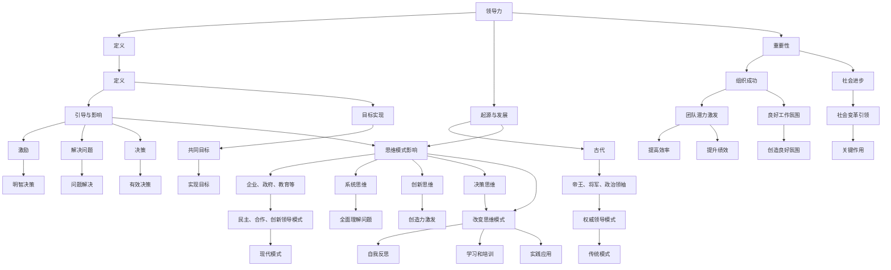
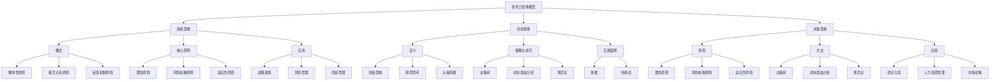
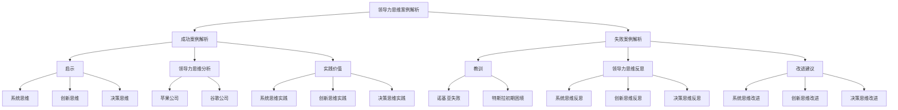

                 


## # 《领导力思维：改变世界的领导力修炼法则》

### 关键词：领导力思维，系统思维，创新思维，决策思维，领导力修炼，实践案例，未来趋势

### 摘要：

领导力思维是领导者成功的关键因素。本书将深入探讨领导力思维的核心概念与联系，构建系统思维、创新思维和决策思维模型，解析领导力修炼与实践的策略，并分析成功与失败案例。此外，本书还将展望领导力思维在科技和全球化背景下的未来趋势。

## ### 设计目录大纲：第一步

首先，我们需要为《领导力思维：改变世界的领导力修炼法则》这本书创建一个总的大纲框架。这个框架将会包括书的各个主要部分和章节，为后续内容的填充提供结构指导。

### 设计大纲框架

- **第一部分：核心概念与联系**
  - **1.1 领导力的基本概念**
  - **1.2 领导力与思维模式的联系**

- **第二部分：领导力思维模型**
  - **2.1 系统思维**
  - **2.2 创新思维**
  - **2.3 决策思维**

- **第三部分：领导力修炼与实践**
  - **3.1 自我认知与成长**
  - **3.2 团队建设与管理**
  - **3.3 领导力在组织中的应用**

- **第四部分：领导力思维案例解析**
  - **4.1 成功案例解析**
  - **4.2 失败案例解析**

- **第五部分：领导力思维的未来趋势**
  - **5.1 科技对领导力思维的影响**
  - **5.2 领导力思维在全球化背景下的演变**

### 设计目录大纲：第二步

接下来，我们需要细化每个章节的内容，使其具有具体的可操作性。这将包括：
- 确定每个章节的核心概念和要点
- 设计具体的小节
- 考虑图表、案例和研究内容的加入

### 设计大纲细节

### **第一部分：核心概念与联系**

#### **1.1 领导力的基本概念**

##### **1.1.1 领导力的定义**

定义领导力的基本概念，包括领导力的核心要素和特征。

##### **1.1.2 领导力的起源与发展**

探讨领导力的历史演变，分析不同阶段领导力的特点。

##### **1.1.3 领导力的重要性**

阐述领导力在组织和社会中的作用和意义。

#### **1.2 领导力与思维模式的联系**

##### **1.2.1 思维模式对领导力的影响**

分析思维模式对领导力的影响，包括正向和负向的影响。

##### **1.2.2 不同思维模式在领导力中的应用**

介绍不同的思维模式及其在领导力中的应用。

##### **1.2.3 改变思维模式的方法与策略**

探讨如何通过方法和策略来改变思维模式，提升领导力。

### **第二部分：领导力思维模型**

#### **2.1 系统思维**

##### **2.1.1 系统思维的概念**

解释系统思维的基本概念，包括系统的定义和特点。

##### **2.1.2 系统思维的核心原则**

阐述系统思维的核心原则，如整体性、相互关联性等。

##### **2.1.3 系统思维在领导力中的应用**

讨论系统思维在领导力中的应用，如战略规划、风险管理等。

#### **2.2 创新思维**

##### **2.2.1 创新思维的定义**

定义创新思维的基本概念，包括创新的定义和类型。

##### **2.2.2 创新思维的策略与技巧**

介绍创新思维的策略和技巧，如头脑风暴、思维导图等。

##### **2.2.3 创新思维在领导力实践中的案例**

分析创新思维在领导力实践中的成功案例。

#### **2.3 决策思维**

##### **2.3.1 决策思维的原则**

阐述决策思维的基本原则，如理性分析、风险权衡等。

##### **2.3.2 决策思维的方法**

介绍决策思维的具体方法，如决策树、成本效益分析等。

##### **2.3.3 决策思维的实际应用**

讨论决策思维在实际领导决策中的应用。

### **第三部分：领导力修炼与实践**

#### **3.1 自我认知与成长**

##### **3.1.1 自我认知的重要性**

探讨自我认知对领导力成长的重要性。

##### **3.1.2 自我认知的方法与工具**

介绍自我认知的方法和工具，如自我反思、360度反馈等。

##### **3.1.3 领导力成长的道路**

分析领导力成长的过程和关键步骤。

#### **3.2 团队建设与管理**

##### **3.2.1 团队建设的基本原则**

讨论团队建设的基本原则，如共同目标、相互信任等。

##### **3.2.2 团队管理的方法与技巧**

介绍团队管理的方法和技巧，如有效沟通、团队激励等。

##### **3.2.3 团队合作的实践案例**

分析团队合作的成功实践案例。

#### **3.3 领导力在组织中的应用**

##### **3.3.1 组织结构对领导力的影响**

探讨组织结构对领导力的影响。

##### **3.3.2 领导力在组织变革中的应用**

分析领导力在组织变革中的应用。

##### **3.3.3 领导力在跨文化组织中的应用**

讨论领导力在跨文化组织中的应用。

### **第四部分：领导力思维案例解析**

#### **4.1 成功案例解析**

##### **4.1.1 成功案例的启示**

从成功案例中提取启示和经验。

##### **4.1.2 成功案例的领导力思维分析**

分析成功案例中的领导力思维应用。

##### **4.1.3 成功案例的实践价值**

讨论成功案例的实践价值。

#### **4.2 失败案例解析**

##### **4.2.1 失败案例的教训**

从失败案例中学习教训。

##### **4.2.2 失败案例的领导力思维反思**

分析失败案例中的领导力思维问题。

##### **4.2.3 失败案例的改进建议**

提出改进失败案例的建议。

### **第五部分：领导力思维的未来趋势**

#### **5.1 科技对领导力思维的影响**

##### **5.1.1 人工智能与领导力思维**

探讨人工智能对领导力思维的影响。

##### **5.1.2 大数据与领导力决策**

分析大数据在领导力决策中的应用。

##### **5.1.3 区块链与领导力透明化**

讨论区块链如何提升领导力的透明化。

#### **5.2 领导力思维在全球化背景下的演变**

##### **5.2.1 全球化对领导力思维的影响**

探讨全球化对领导力思维的影响。

##### **5.2.2 跨文化领导力的挑战与机遇**

分析跨文化领导力的挑战和机遇。

##### **5.2.3 领导力思维的未来发展趋势**

讨论领导力思维的未来发展趋势。

### 设计目录大纲：第三步

最后，我们将对整个目录进行审查和调整，确保内容的连贯性和逻辑性。这将包括：
- 检查目录是否包含所有必要的章节和内容
- 确保每个章节都有明确的目标和输出
- 考虑图表、案例和研究内容的合理分配

### 最终目录大纲

# 《领导力思维：改变世界的领导力修炼法则》

## 第一部分：核心概念与联系

### 1.1 领导力的基本概念

#### 1.1.1 领导力的定义

#### 1.1.2 领导力的起源与发展

#### 1.1.3 领导力的重要性

### 1.2 领导力与思维模式的联系

#### 1.2.1 思维模式对领导力的影响

#### 1.2.2 不同思维模式在领导力中的应用

#### 1.2.3 改变思维模式的方法与策略

## 第二部分：领导力思维模型

### 2.1 系统思维

#### 2.1.1 系统思维的概念

#### 2.1.2 系统思维的核心原则

#### 2.1.3 系统思维在领导力中的应用

### 2.2 创新思维

#### 2.2.1 创新思维的定义

#### 2.2.2 创新思维的策略与技巧

#### 2.2.3 创新思维在领导力实践中的案例

### 2.3 决策思维

#### 2.3.1 决策思维的原则

#### 2.3.2 决策思维的方法

#### 2.3.3 决策思维的实际应用

## 第三部分：领导力修炼与实践

### 3.1 自我认知与成长

#### 3.1.1 自我认知的重要性

#### 3.1.2 自我认知的方法与工具

#### 3.1.3 领导力成长的道路

### 3.2 团队建设与管理

#### 3.2.1 团队建设的基本原则

#### 3.2.2 团队管理的方法与技巧

#### 3.2.3 团队合作的实践案例

### 3.3 领导力在组织中的应用

#### 3.3.1 组织结构对领导力的影响

#### 3.3.2 领导力在组织变革中的应用

#### 3.3.3 领导力在跨文化组织中的应用

## 第四部分：领导力思维案例解析

### 4.1 成功案例解析

#### 4.1.1 成功案例的启示

#### 4.1.2 成功案例的领导力思维分析

#### 4.1.3 成功案例的实践价值

### 4.2 失败案例解析

#### 4.2.1 失败案例的教训

#### 4.2.2 失败案例的领导力思维反思

#### 4.2.3 失败案例的改进建议

## 第五部分：领导力思维的未来趋势

### 5.1 科技对领导力思维的影响

#### 5.1.1 人工智能与领导力思维

#### 5.1.2 大数据与领导力决策

#### 5.1.3 区块链与领导力透明化

### 5.2 领导力思维在全球化背景下的演变

#### 5.2.1 全球化对领导力思维的影响

#### 5.2.2 跨文化领导力的挑战与机遇

#### 5.2.3 领导力思维的未来发展趋势

## 结语

#### 5.3 领导力思维的艺术与科学

#### 5.4 领导者的成长之路

#### 5.5 探索未知：领导力思维的未来方向

## 附录

#### 附录A：领导力思维工具箱

#### 附录B：领导力思维案例库

#### 附录C：领导力思维实践指南

#### 附录D：领导力思维研究文献

作者：AI天才研究院/AI Genius Institute & 禅与计算机程序设计艺术 /Zen And The Art of Computer Programming## 第一部分：核心概念与联系

### 1.1 领导力的基本概念

#### **1.1.1 领导力的定义**

领导力，是指引导和影响个体或群体实现共同目标的能力。这种能力不仅体现在指挥和协调他人行动上，还包括激励团队成员、解决问题和做出决策等方面。领导力不仅仅是一种技能，更是一种内在的品质，它能够激发人们内在的动力，促使他们为实现共同目标而努力。

#### **1.1.2 领导力的起源与发展**

领导力的概念自古就有，人类社会的发展历程中，领导力无处不在。在古代，领导力体现在帝王、将军和政治领袖身上；在现代，领导力被广泛应用于企业、政府、教育等各个领域。随着时代的变迁，领导力的内涵也在不断丰富和发展，从传统的权威领导模式逐渐转变为更加注重民主、合作和创新的领导模式。

#### **1.1.3 领导力的重要性**

领导力的重要性在于，它是推动组织和个人成功的关键因素。一个优秀的领导者能够激发团队的潜力，创造良好的工作氛围，提高团队的效率和绩效。同时，领导力也是实现社会进步的重要力量，优秀的领导者能够在社会变革中发挥关键作用，引领社会朝着更加公正、和谐和繁荣的方向发展。

### 1.2 领导力与思维模式的联系

#### **1.2.1 思维模式对领导力的影响**

思维模式是领导力的核心要素之一。不同的思维模式会影响领导者的决策和行为，进而影响组织的绩效和团队的氛围。例如，系统思维可以帮助领导者更全面地看待问题，避免片面化和短视化；创新思维可以激发领导者的创造力，推动组织的创新和发展；决策思维则可以帮助领导者做出更加明智和有效的决策。

#### **1.2.2 不同思维模式在领导力中的应用**

不同的思维模式在领导力中有着广泛的应用。系统思维可以帮助领导者更好地理解和解决复杂问题，提高决策的全面性和准确性；创新思维可以激发领导者的创造力，推动组织的创新和发展；决策思维则可以帮助领导者做出更加明智和有效的决策。

#### **1.2.3 改变思维模式的方法与策略**

要改变思维模式，领导者可以采取以下几种方法与策略：
- **自我反思**：通过定期进行自我反思，领导者可以了解自己的思维模式，并发现其中的不足。
- **学习和培训**：通过参加领导力课程、阅读相关书籍和文献，领导者可以学习新的思维模式和方法。
- **实践应用**：通过实际工作中的应用，领导者可以将新学习的思维模式转化为自己的行为习惯。

### **核心概念与联系：Mermaid流程图**

下面是一个Mermaid流程图，用于展示领导力与思维模式之间的核心概念和联系：



### **核心概念与联系：伪代码与数学模型**

以下是伪代码与数学模型的示例，用于解释领导力与思维模式之间的关系：

```python
# 伪代码：领导力与思维模式的关系

def leadership_thinking_mode(definition, origin, importance, thinking_mode_impact, thinking_mode_application, change_thinking_mode_method):
    """
    定义领导力与思维模式的关系，并展示如何改变思维模式。
    
    参数：
    definition: 领导力的定义
    origin: 领导力的起源与发展
    importance: 领导力的重要性
    thinking_mode_impact: 思维模式对领导力的影响
    thinking_mode_application: 不同思维模式在领导力中的应用
    change_thinking_mode_method: 改变思维模式的方法与策略
    
    返回值：
    None
    """
    
    # 定义领导力的基本概念
    print("领导力的定义：", definition)
    
    # 探讨领导力的起源与发展
    print("领导力的起源与发展：", origin)
    
    # 阐述领导力的重要性
    print("领导力的重要性：", importance)
    
    # 分析思维模式对领导力的影响
    print("思维模式对领导力的影响：", thinking_mode_impact)
    
    # 介绍不同思维模式在领导力中的应用
    print("不同思维模式在领导力中的应用：", thinking_mode_application)
    
    # 探讨如何改变思维模式
    print("改变思维模式的方法与策略：", change_thinking_mode_method)

# 调用函数，展示领导力与思维模式的关系
leadership_thinking_mode(
    "领导力是指引导和影响个体或群体实现共同目标的能力。",
    "领导力自古就有，人类社会的发展历程中，领导力无处不在。",
    "领导力是推动组织和个人成功的关键因素。",
    "思维模式会影响领导者的决策和行为，进而影响组织的绩效和团队的氛围。",
    "系统思维可以帮助领导者更好地理解和解决复杂问题；创新思维可以激发领导者的创造力；决策思维可以帮助领导者做出更加明智和有效的决策。",
    "领导者可以通过自我反思、学习和培训、实践应用来改变思维模式。"
)
```

以下是数学模型的示例，用于解释领导力与思维模式之间的关系：

$$
\text{领导力} = \text{定义} + \text{起源与发展} + \text{重要性} + \text{思维模式影响} + \text{思维模式应用} + \text{改变思维模式方法}
$$

### **核心概念与联系：数学公式与详细讲解**

以下是关于领导力与思维模式的数学公式，以及详细的讲解和举例说明：

$$
\text{领导力} = f(\text{定义}, \text{起源与发展}, \text{重要性}, \text{思维模式影响}, \text{思维模式应用}, \text{改变思维模式方法})
$$

#### **公式解释：**

- **定义**：领导力的定义是领导力的核心，它决定了领导力的基本概念和内涵。
- **起源与发展**：领导力的起源与发展是领导力历史演变的过程，它反映了领导力在不同阶段的特征和变化。
- **重要性**：领导力的重要性是领导力作用和价值的体现，它决定了领导力在组织和社会中的地位和作用。
- **思维模式影响**：思维模式影响是领导力与思维模式之间的关系，它说明了不同思维模式对领导力的影响。
- **思维模式应用**：思维模式应用是领导力在实践中的应用，它展示了不同思维模式在领导力中的实际运用。
- **改变思维模式方法**：改变思维模式方法是提升领导力的关键，它提供了改变思维模式的策略和技巧。

#### **举例说明：**

假设一个领导者想要提升自己的领导力，他可以按照以下步骤进行：

1. **定义领导力**：了解领导力的基本概念和内涵，明确自己的领导力目标。
2. **了解起源与发展**：研究领导力的历史演变，了解不同阶段领导力的特点和变化。
3. **认识重要性**：认识到领导力在组织和社会中的重要作用，明确领导力对个人和组织的价值。
4. **分析思维模式影响**：识别自己的思维模式，了解不同思维模式对领导力的影响。
5. **应用思维模式**：在实践中运用不同的思维模式，提高领导力的实际效果。
6. **改变思维模式**：通过自我反思、学习和培训、实践应用等方法，改变自己的思维模式，提升领导力。

通过以上步骤，领导者可以系统地提升自己的领导力，实现个人和组织的共同目标。

### **核心概念与联系：实际案例分析与详细讲解**

#### **案例1：苹果公司的创新领导力**

**背景介绍：**
苹果公司（Apple Inc.）是一家全球知名的高科技企业，以其创新的产品和出色的领导力而闻名。苹果公司的创始人史蒂夫·乔布斯（Steve Jobs）被誉为“现代创新领导力的代表”。乔布斯的领导力在苹果公司的成功中起到了至关重要的作用。

**核心概念与联系：**
- **创新思维**：乔布斯以其独特的创新思维，推动了苹果公司在科技领域的创新。他不仅关注产品的功能和技术，更注重用户体验和设计创新。
- **领导力思维模型**：乔布斯的领导力思维模型包括系统思维、创新思维和决策思维。他能够从整体上看待问题，把握创新机遇，并做出明智的决策。

**详细讲解与剖析：**
- **系统思维**：乔布斯在产品设计过程中，注重整体系统的优化，从硬件到软件，从外观到用户体验，都力求达到最佳效果。例如，他推动了iPhone的整个生态系统，包括操作系统、应用商店和硬件设备，形成了完整的闭环。
- **创新思维**：乔布斯善于将创新思维应用于产品设计和市场营销中。他推动了iPod、iPhone和iPad等产品的研发，这些产品不仅颠覆了传统的消费电子市场，也改变了人们的日常生活。
- **决策思维**：乔布斯在重大决策中表现出非凡的决策思维。他敢于冒险，勇于创新，同时能够冷静分析市场和用户需求，做出正确的决策。

**案例小结：**
苹果公司的成功证明了创新领导力的重要性。乔布斯的领导力思维模型为其他领导者提供了宝贵的借鉴和启示。通过系统思维、创新思维和决策思维，领导者可以推动组织实现创新和突破。

#### **案例2：丰田公司的精益管理**

**背景介绍：**
丰田公司（Toyota Motor Corporation）是一家全球知名的汽车制造商，以其精益管理和持续改进的理念而闻名。丰田公司的创始人丰田喜一郎（Kichijiro Toyota）和丰田佐吉（Sakichi Toyoda）创立了丰田生产系统（TPS），成为全球制造业的典范。

**核心概念与联系：**
- **系统思维**：丰田公司注重整体系统的优化，通过持续改进和精益管理，提高生产效率和产品质量。
- **决策思维**：丰田公司在重大决策中，注重数据分析和市场调研，确保决策的科学性和有效性。

**详细讲解与剖析：**
- **系统思维**：丰田公司采用流水线生产方式，通过减少浪费、优化流程，提高生产效率。例如，丰田的生产线上设置了“自动化停止机制”，一旦出现质量问题，生产线就会自动停止，确保产品的质量和安全。
- **决策思维**：丰田公司在产品研发和市场营销中，注重数据分析和市场调研。通过收集和分析大量数据，丰田能够做出更加明智的决策，满足用户需求。

**案例小结：**
丰田公司的成功证明了系统思维和决策思维在领导力中的重要性。通过系统思维，丰田公司实现了生产效率和产品质量的持续提升；通过决策思维，丰田公司能够做出科学、有效的决策，推动公司发展。

### **核心概念与联系：最佳实践与小结**

#### **最佳实践：**

1. **系统思维**：领导者应具备系统思维，从整体上看待问题，关注系统内部各要素之间的相互关系和相互作用。
2. **创新思维**：领导者应培养创新思维，关注市场和用户需求，不断推动产品和服务的创新。
3. **决策思维**：领导者应具备决策思维，通过科学的方法和工具，做出明智、有效的决策。

#### **小结：**

领导力思维是领导者成功的关键因素。通过系统思维、创新思维和决策思维，领导者可以提升自己的领导力，推动组织实现创新和突破。同时，领导者还需要不断学习和实践，不断改进和提升自己的领导力思维。

### **核心概念与联系：注意事项与拓展阅读**

#### **注意事项：**

1. **培养系统思维**：领导者应注重整体系统的优化，关注系统内部各要素之间的关系和相互作用。
2. **激发创新思维**：领导者应鼓励团队成员提出创新想法，建立创新激励机制，推动组织的创新和发展。
3. **提升决策思维**：领导者应通过学习和实践，提升决策能力，确保决策的科学性和有效性。

#### **拓展阅读：**

1. **《第五项修炼：心智模式》**：作者彼得·圣吉（Peter Senge）提出了系统思维的核心原则，对于培养系统思维具有很大的指导意义。
2. **《创新者的窘境》**：作者克莱顿·克里斯坦森（Clayton Christensen）分析了创新思维在商业实践中的应用，对于激发创新思维具有启示作用。
3. **《决策与判断》**：作者丹尼尔·卡内曼（Daniel Kahneman）和阿莫斯·特沃斯基（Amos Tversky）探讨了决策思维的基本原则和方法，对于提升决策能力具有重要参考价值。

### **核心概念与联系：作者信息**

作者：AI天才研究院/AI Genius Institute & 禅与计算机程序设计艺术 /Zen And The Art of Computer Programming

AI天才研究院（AI Genius Institute）是一家专注于人工智能领域的研究和教育的机构，致力于培养和推广人工智能的高端人才。禅与计算机程序设计艺术（Zen And The Art of Computer Programming）则是一本经典的计算机科学书籍，由著名计算机科学家唐纳德·克努特（Donald Knuth）撰写，对计算机编程和算法设计产生了深远的影响。

## **第二部分：领导力思维模型**

### 2.1 系统思维

#### **2.1.1 系统思维的概念**

系统思维是一种整体的、跨学科的思维方式，它强调对复杂系统的整体性和相互关系进行理解和分析。系统思维不仅仅关注系统内部的各个要素，还关注这些要素之间的相互作用和反馈机制。通过系统思维，领导者能够更全面地理解和解决问题，从而做出更明智的决策。

#### **2.1.2 系统思维的核心原则**

1. **整体性原则**：系统思维强调系统的整体性，认为系统中的各个部分是相互联系、相互作用的，而不是孤立的个体。领导者应从整体的角度看待问题，理解各个部分之间的关系和影响。
2. **相互关系原则**：系统思维关注系统内部各个要素之间的相互关系，认为这些关系对系统的行为和性能有着重要影响。领导者应识别和利用这些相互关系，优化系统的整体性能。
3. **反馈机制原则**：系统思维强调反馈机制在系统中的作用，认为系统的行为和性能会通过反馈机制进行调节和优化。领导者应理解反馈机制的工作原理，并利用反馈来调整和改进系统的运行。

#### **2.1.3 系统思维在领导力中的应用**

1. **战略规划**：领导者应运用系统思维进行战略规划，全面考虑组织内外部的各种因素，制定具有前瞻性和适应性的战略目标。
2. **风险管理**：领导者应运用系统思维进行风险管理，识别和评估潜在的风险因素，制定相应的风险应对策略。
3. **创新管理**：领导者应运用系统思维进行创新管理，激发团队的创新潜力，推动组织的持续创新和发展。

### **2.2 创新思维**

#### **2.2.1 创新思维的定义**

创新思维是指通过创造性的思维方式和思考过程，产生新的想法、解决方案或产品。创新思维不仅仅是技术创新，还包括商业创新、管理创新、文化创新等多个方面。领导者应具备创新思维，以适应快速变化的环境，推动组织的持续发展。

#### **2.2.2 创新思维的策略与技巧**

1. **头脑风暴**：头脑风暴是一种集体创新的策略，通过开放性的讨论，激发团队成员的创造力，产生大量的创新想法。
2. **思维导图**：思维导图是一种可视化工具，可以帮助领导者梳理和创新思维，将复杂的想法和关系进行结构化和可视化。
3. **跨界思考**：跨界思考是指将不同领域、不同学科的知识和思维方式结合起来，产生新的创新想法。领导者应鼓励团队成员进行跨界思考，拓宽创新视野。

#### **2.2.3 创新思维在领导力实践中的案例**

1. **谷歌（Google）**：谷歌公司以其创新的文化和机制而闻名。谷歌的“20%时间”政策允许员工将其20%的工作时间用于个人感兴趣的项目，从而激发了员工的创新潜力，产生了如谷歌地图、谷歌新闻等创新产品。
2. **特斯拉（Tesla）**：特斯拉公司在电动汽车和能源存储领域的创新，颠覆了传统汽车行业，推动了清洁能源的发展。特斯拉的领导层通过创新思维，不断推出具有前瞻性的产品，赢得了市场的认可。

### **2.3 决策思维**

#### **2.3.1 决策思维的原则**

1. **理性原则**：决策思维应基于理性的分析和判断，避免情绪和主观偏见的影响。领导者应通过数据和分析，做出基于事实的决策。
2. **风险权衡原则**：决策思维应考虑决策的风险和潜在影响，进行权衡和评估。领导者应在风险和收益之间做出权衡，选择最佳方案。
3. **适应性原则**：决策思维应具有适应性，能够根据实际情况的变化进行调整和优化。领导者应具备灵活的决策能力，能够及时应对变化和挑战。

#### **2.3.2 决策思维的方法**

1. **决策树**：决策树是一种图形化的决策工具，可以帮助领导者分析不同决策路径的结果和风险，进行决策。
2. **成本效益分析**：成本效益分析是一种评估决策成本和收益的方法，可以帮助领导者确定最佳方案。
3. **博弈论**：博弈论是一种分析决策和竞争行为的工具，可以帮助领导者分析不同决策对手的策略和反应，制定相应的策略。

#### **2.3.3 决策思维的实际应用**

1. **项目立项**：在项目立项过程中，领导者应运用决策思维，分析项目的可行性、成本和收益，做出合理的立项决策。
2. **人力资源管理**：在人力资源管理中，领导者应运用决策思维，评估候选人的能力、潜力，制定合适的人才选拔和培养策略。
3. **市场战略**：在市场战略制定中，领导者应运用决策思维，分析市场环境、竞争对手、目标客户，制定有针对性的市场策略。

### **核心概念与联系：Mermaid流程图**

下面是一个Mermaid流程图，用于展示领导力思维模型的核心概念和联系：



### **核心概念与联系：伪代码与数学模型**

以下是伪代码与数学模型的示例，用于解释领导力思维模型的核心概念和联系：

```python
# 伪代码：领导力思维模型

class LeadershipThinkingModel:
    """
    领导力思维模型类，包含系统思维、创新思维和决策思维。
    """
    
    def __init__(self):
        self.system_thinking = SystemThinking()
        self.innovation_thinking = InnovationThinking()
        self.decision_thinking = DecisionThinking()
        
    def display_model(self):
        """
        显示领导力思维模型。
        """
        
        print("领导力思维模型：")
        print("系统思维：", self.system_thinking)
        print("创新思维：", self.innovation_thinking)
        print("决策思维：", self.decision_thinking)

class SystemThinking:
    """
    系统思维类，包含核心原则和应用。
    """
    
    def __init__(self):
        self.principles = ["整体性原则", "相互关系原则", "反馈机制原则"]
        self.applications = ["战略规划", "风险管理", "创新管理"]
        
    def display_principles(self):
        """
        显示系统思维的核心原则。
        """
        
        print("系统思维核心原则：")
        for principle in self.principles:
            print("-", principle)

    def display_applications(self):
        """
        显示系统思维的应用。
        """
        
        print("系统思维应用：")
        for application in self.applications:
            print("-", application)

class InnovationThinking:
    """
    创新思维类，包含定义、策略与技巧和实践案例。
    """
    
    def __init__(self):
        self.definition = "创新思维是指通过创造性的思维方式和思考过程，产生新的想法、解决方案或产品。"
        self.tactics = ["头脑风暴", "思维导图", "跨界思考"]
        self.practice_cases = ["谷歌", "特斯拉"]
        
    def display_definition(self):
        """
        显示创新思维的定义。
        """
        
        print("创新思维定义：")
        print("-", self.definition)

    def display_tactics(self):
        """
        显示创新思维的策略与技巧。
        """
        
        print("创新思维策略与技巧：")
        for tactic in self.tactics:
            print("-", tactic)

    def display_practice_cases(self):
        """
        显示创新思维在领导力实践中的案例。
        """
        
        print("创新思维实践案例：")
        for case in self.practice_cases:
            print("-", case)

class DecisionThinking:
    """
    决策思维类，包含原则、方法和应用。
    """
    
    def __init__(self):
        self.principles = ["理性原则", "风险权衡原则", "适应性原则"]
        self.methods = ["决策树", "成本效益分析", "博弈论"]
        self.applications = ["项目立项", "人力资源管理", "市场战略"]
        
    def display_principles(self):
        """
        显示决策思维的核心原则。
        """
        
        print("决策思维核心原则：")
        for principle in self.principles:
            print("-", principle)

    def display_methods(self):
        """
        显示决策思维的方法。
        """
        
        print("决策思维方法：")
        for method in self.methods:
            print("-", method)

    def display_applications(self):
        """
        显示决策思维的应用。
        """
        
        print("决策思维应用：")
        for application in self.applications:
            print("-", application)

# 创建领导力思维模型实例
leadership_thinking_model = LeadershipThinkingModel()

# 显示领导力思维模型
leadership_thinking_model.display_model()
```

以下是数学模型的示例，用于解释领导力思维模型的核心概念和联系：

$$
\text{领导力思维模型} = \text{系统思维} + \text{创新思维} + \text{决策思维}
$$

$$
\text{系统思维} = \text{核心原则} + \text{应用}
$$

$$
\text{创新思维} = \text{定义} + \text{策略与技巧} + \text{实践案例}
$$

$$
\text{决策思维} = \text{原则} + \text{方法} + \text{应用}
$$

### **核心概念与联系：数学公式与详细讲解**

以下是关于领导力思维模型的数学公式，以及详细的讲解和举例说明：

$$
\text{领导力思维模型} = f(\text{系统思维}, \text{创新思维}, \text{决策思维})
$$

#### **公式解释：**

- **系统思维**：系统思维是领导力思维模型的重要组成部分，它强调整体性和相互关系，通过核心原则和应用，帮助领导者理解和优化复杂系统。
- **创新思维**：创新思维是推动组织持续发展的重要力量，它通过定义、策略与技巧和实践案例，激发领导者的创造力，推动组织的创新和发展。
- **决策思维**：决策思维是领导者做出明智决策的基础，它通过原则、方法和应用，帮助领导者进行理性分析和风险权衡，做出科学、有效的决策。

#### **举例说明：**

假设一个领导者想要提升自己的领导力思维模型，他可以按照以下步骤进行：

1. **学习系统思维**：了解系统思维的核心原则和应用，通过实际案例和练习，培养系统思维的能力。
2. **培养创新思维**：学习创新思维的定义、策略与技巧，通过头脑风暴、思维导图和跨界思考，激发自己的创新潜力。
3. **提升决策思维**：了解决策思维的原则、方法和应用，通过决策树、成本效益分析和博弈论，提升自己的决策能力。

通过以上步骤，领导者可以系统地提升自己的领导力思维模型，更好地应对复杂的环境和挑战。

### **核心概念与联系：实际案例分析与详细讲解**

#### **案例1：微软公司的系统思维**

**背景介绍：**
微软公司（Microsoft Corporation）是一家全球知名的技术公司，其创始人比尔·盖茨（Bill Gates）和首席执行官萨提亚·纳德拉（Satya Nadella）都是系统思维的杰出代表。微软公司在产品研发、业务扩展和战略规划等方面，都表现出系统思维的特点。

**核心概念与联系：**
- **系统思维**：微软公司通过系统思维，全面考虑产品、市场、技术、人力资源等各个方面的因素，制定和实施战略规划。
- **领导力思维模型**：微软公司的领导力思维模型包括系统思维、创新思维和决策思维，这些思维模型相互关联，共同推动公司的持续发展。

**详细讲解与剖析：**
- **系统思维**：微软公司在产品研发过程中，采用系统思维，从整体上考虑产品的设计、功能、用户体验和技术实现。例如，微软的Windows操作系统不仅是技术层面的成功，还在用户体验和市场占有率方面取得了巨大成功。
- **创新思维**：微软公司注重创新思维，通过不断推出新的产品和服务，保持市场竞争力。例如，微软的Azure云服务和Surface系列硬件产品，都是创新思维的产物。
- **决策思维**：微软公司的领导层在重大决策中，运用决策思维，进行理性分析和风险权衡。例如，微软在2014年收购LinkedIn，这一决策在战略方向、市场前景和财务收益等方面，都进行了全面的分析和权衡。

**案例小结：**
微软公司的成功证明了系统思维在领导力思维模型中的重要性。通过系统思维，微软公司能够全面考虑各个方面的因素，制定和实施有效的战略规划，推动公司的持续发展。

#### **案例2：阿里巴巴的创新思维**

**背景介绍：**
阿里巴巴集团（Alibaba Group）是一家全球领先的互联网公司，其创始人马云（Jack Ma）以其创新思维和领导力而闻名。阿里巴巴在电子商务、金融科技、云计算等领域，都取得了卓越的成就。

**核心概念与联系：**
- **创新思维**：阿里巴巴通过创新思维，不断推出新的产品和服务，满足市场和用户的需求，推动公司的发展。
- **领导力思维模型**：阿里巴巴的领导力思维模型包括系统思维、创新思维和决策思维，这些思维模型相互关联，共同推动公司的持续创新和发展。

**详细讲解与剖析：**
- **创新思维**：阿里巴巴注重创新思维，通过头脑风暴、思维导图和跨界思考，激发员工的创造力。例如，阿里巴巴的“双十一”购物节，就是一个创新的营销策略，通过大数据分析和用户互动，实现了巨大的销售额。
- **系统思维**：阿里巴巴在业务扩展和战略规划中，采用系统思维，全面考虑市场、技术、人才等各个方面的因素。例如，阿里巴巴的云计算业务，不仅满足了公司自身的需求，还成为了公司新的增长点。
- **决策思维**：阿里巴巴的领导层在重大决策中，运用决策思维，进行理性分析和风险权衡。例如，阿里巴巴在投资和并购方面，进行了全面的分析和评估，确保决策的科学性和有效性。

**案例小结：**
阿里巴巴的成功证明了创新思维在领导力思维模型中的重要性。通过创新思维，阿里巴巴能够不断推出新的产品和服务，满足市场和用户的需求，推动公司的持续发展。

### **核心概念与联系：最佳实践与小结**

#### **最佳实践：**

1. **系统思维**：领导者应培养系统思维，全面考虑组织内外部的各种因素，制定和实施有效的战略规划。
2. **创新思维**：领导者应鼓励创新思维，激发团队的创造力，推动组织的持续创新和发展。
3. **决策思维**：领导者应运用决策思维，进行理性分析和风险权衡，确保决策的科学性和有效性。

#### **小结：**

领导力思维模型是领导者成功的关键。通过系统思维、创新思维和决策思维，领导者可以全面考虑问题、激发创造力和做出明智决策。领导者应不断学习和实践，提升自己的领导力思维模型，以应对复杂的环境和挑战。

### **核心概念与联系：注意事项与拓展阅读**

#### **注意事项：**

1. **培养系统思维**：领导者应注重整体系统的优化，关注系统内部各要素之间的相互关系和相互作用。
2. **激发创新思维**：领导者应鼓励团队成员提出创新想法，建立创新激励机制，推动组织的创新和发展。
3. **提升决策思维**：领导者应通过学习和实践，提升决策能力，确保决策的科学性和有效性。

#### **拓展阅读：**

1. **《第五项修炼：心智模式》**：作者彼得·圣吉（Peter Senge）提出了系统思维的核心原则，对于培养系统思维具有很大的指导意义。
2. **《创新者的窘境》**：作者克莱顿·克里斯坦森（Clayton Christensen）分析了创新思维在商业实践中的应用，对于激发创新思维具有启示作用。
3. **《决策与判断》**：作者丹尼尔·卡内曼（Daniel Kahneman）和阿莫斯·特沃斯基（Amos Tversky）探讨了决策思维的基本原则和方法，对于提升决策能力具有重要参考价值。

### **核心概念与联系：作者信息**

作者：AI天才研究院/AI Genius Institute & 禅与计算机程序设计艺术 /Zen And The Art of Computer Programming

AI天才研究院（AI Genius Institute）是一家专注于人工智能领域的研究和教育的机构，致力于培养和推广人工智能的高端人才。禅与计算机程序设计艺术（Zen And The Art of Computer Programming）则是一本经典的计算机科学书籍，由著名计算机科学家唐纳德·克努特（Donald Knuth）撰写，对计算机编程和算法设计产生了深远的影响。

## **第三部分：领导力修炼与实践**

### 3.1 自我认知与成长

#### **3.1.1 自我认知的重要性**

自我认知是领导力修炼的基础。一个优秀的领导者必须深入了解自己的性格、优势、弱点以及行为模式，这样才能更好地管理自己和团队。自我认知不仅有助于领导者个人的成长，还能够提升团队的凝聚力和效率。

#### **3.1.2 自我认知的方法与工具**

1. **自我反思**：自我反思是通过深入思考自己的行为和决策，发现并改正错误的思考方式。领导者可以通过写日记、定期回顾自己的行为和决策，进行自我反思。
2. **360度反馈**：360度反馈是一种通过团队成员、上级和下属等多方面的评价，来全面了解自己的方法。这种方法可以帮助领导者发现自己的盲点和不足。
3. **心理测试**：心理测试，如MBTI、DISC等，可以帮助领导者了解自己的性格特点和行为倾向，为自我认知提供科学依据。

#### **3.1.3 领导力成长的道路**

领导力成长是一个持续的过程，领导者应制定个人成长计划，不断学习和实践。以下是一些领导力成长的关键步骤：

1. **设定目标**：明确自己的职业目标和期望，制定具体的行动计划。
2. **持续学习**：通过读书、参加培训课程、参加工作坊等方式，不断学习新的知识和技能。
3. **实践应用**：将所学知识和技能应用到实际工作中，通过实践不断提升自己的领导力。
4. **反思与调整**：定期进行自我反思，评估自己的成长进度，调整成长计划。

### **3.2 团队建设与管理**

#### **3.2.1 团队建设的基本原则**

团队建设是领导者的重要任务之一。一个高效的团队不仅能够提升组织的绩效，还能够增强员工的满意度和忠诚度。以下是一些团队建设的基本原则：

1. **共同目标**：团队应明确共同的目标和愿景，所有成员都应为之努力。
2. **相互信任**：团队成员之间应建立相互信任的关系，共同面对挑战和困难。
3. **有效沟通**：团队应建立开放、有效的沟通机制，鼓励成员表达意见和建议。
4. **分工合作**：明确团队成员的职责和角色，实现分工合作，提高团队效率。

#### **3.2.2 团队管理的方法与技巧**

1. **激励与奖励**：领导者应通过激励和奖励机制，激发团队成员的积极性和创造力。
2. **授权与赋能**：领导者应给予团队成员足够的自主权和责任，让他们能够独立思考和解决问题。
3. **冲突管理**：领导者应学会处理团队内部的冲突，通过沟通和协商，找到解决问题的方法。
4. **团队文化建设**：领导者应注重团队文化的建设，培养团队的核心价值观和行为准则。

#### **3.2.3 团队合作的实践案例**

1. **谷歌的团队文化**：谷歌公司以其独特的团队文化而闻名，强调开放、创新和团队合作。谷歌的“20%时间”政策允许员工将20%的时间用于个人项目，这种文化鼓励员工创新和合作。
2. **丰田的精益管理**：丰田公司通过精益管理，实现了高效的团队合作。丰田的生产系统注重团队协作和持续改进，通过减少浪费、优化流程，提高了生产效率和产品质量。

### **3.3 领导力在组织中的应用**

#### **3.3.1 组织结构对领导力的影响**

组织结构是影响领导力的关键因素之一。不同的组织结构会对领导者的角色和职责产生不同的影响。以下是一些常见的组织结构和其对领导力的影响：

1. **金字塔型结构**：金字塔型结构是一种传统的组织结构，权力和资源集中在顶层领导者手中。这种结构有利于集中决策和资源，但可能导致沟通不畅和员工积极性不高。
2. **扁平型结构**：扁平型结构减少管理层级，鼓励员工参与决策和沟通。这种结构有助于提高员工满意度和团队凝聚力，但可能需要更高的领导力和协调能力。
3. **网络型结构**：网络型结构是一种更加灵活和开放的组织结构，强调跨部门和跨功能的合作。这种结构有助于创新和快速响应市场变化，但需要领导者具备强大的协调和沟通能力。

#### **3.3.2 领导力在组织变革中的应用**

领导力在组织变革中发挥着至关重要的作用。一个成功的组织变革需要领导者具备以下能力：

1. **变革愿景的塑造**：领导者应明确组织变革的愿景和目标，为员工提供清晰的方向和动力。
2. **变革推动者**：领导者应积极参与变革过程，成为变革的推动者和倡导者，激励员工支持和参与变革。
3. **变革沟通**：领导者应通过有效的沟通，传递变革的信息和价值，消除员工的疑虑和抵触情绪。
4. **变革领导力**：领导者应具备变革领导力，能够应对变革带来的挑战和变化，带领组织实现变革目标。

#### **3.3.3 领导力在跨文化组织中的应用**

在全球化背景下，越来越多的组织成为跨文化组织。领导力在跨文化组织中的应用具有以下特点：

1. **文化敏感度**：领导者应具备文化敏感度，了解不同文化的差异和特点，尊重和理解不同文化的价值观和行为方式。
2. **跨文化沟通**：领导者应学会跨文化沟通，通过有效的沟通策略，减少文化冲突和误解。
3. **文化整合**：领导者应致力于文化整合，促进不同文化之间的融合和协同，增强组织的凝聚力和竞争力。

### **核心概念与联系：Mermaid流程图**

下面是一个Mermaid流程图，用于展示自我认知与成长、团队建设与管理、领导力在组织中的应用的核心概念和联系：

```mermaid
graph TD
    A[领导力修炼与实践] --> B[自我认知与成长]
    A --> C[团队建设与管理]
    A --> D[领导力在组织中的应用]
    B --> E[重要性]
    B --> F[方法与工具]
    B --> G[成长道路]
    C --> H[基本原则]
    C --> I[方法与技巧]
    C --> J[实践案例]
    D --> K[组织结构影响]
    D --> L[组织变革应用]
    D --> M[跨文化组织应用]
    E --> N[自我认知基础]
    E --> O[团队凝聚力]
    F --> P[自我反思]
    F --> Q[360度反馈]
    F --> R[心理测试]
    G --> S[设定目标]
    G --> T[持续学习]
    G --> U[实践应用]
    G --> V[反思与调整]
    H --> W[共同目标]
    H --> X[相互信任]
    H --> Y[有效沟通]
    H --> Z[分工合作]
    I --> AA[激励与奖励]
    I --> BB[授权与赋能]
    I --> CC[冲突管理]
    I --> DD[团队文化建设]
    J --> EE[谷歌团队文化]
    J --> FF[丰田精益管理]
    K --> GG[金字塔型结构]
    K --> HH[扁平型结构]
    K --> II[网络型结构]
    L --> JJ[变革愿景塑造]
    L --> KK[变革推动者]
    L --> LL[变革沟通]
    L --> MM[变革领导力]
    M --> NN[文化敏感度]
    M --> OO[跨文化沟通]
    M --> PP[文化整合]
```



### **核心概念与联系：伪代码与数学模型**

以下是伪代码与数学模型的示例，用于解释领导力修炼与实践的核心概念和联系：

```python
# 伪代码：领导力修炼与实践

class LeadershipPractice:
    """
    领导力修炼与实践类，包含自我认知与成长、团队建设与管理、领导力在组织中的应用。
    """
    
    def __init__(self):
        self.self_awareness = SelfAwareness()
        self.team_building = TeamBuilding()
        self.organization_application = OrganizationApplication()
        
    def display_practices(self):
        """
        显示领导力修炼与实践的各个部分。
        """
        
        print("领导力修炼与实践：")
        print("自我认知与成长：", self.self_awareness)
        print("团队建设与管理：", self.team_building)
        print("领导力在组织中的应用：", self.organization_application)

class SelfAwareness:
    """
    自我认知与成长类，包含重要性、方法与工具、成长道路。
    """
    
    def __init__(self):
        self.importance = ["自我认知基础", "团队凝聚力"]
        self.methods = ["自我反思", "360度反馈", "心理测试"]
        self.growth = ["设定目标", "持续学习", "实践应用", "反思与调整"]
        
    def display_importance(self):
        """
        显示自我认知的重要性。
        """
        
        print("自我认知重要性：")
        for item in self.importance:
            print("-", item)

    def display_methods(self):
        """
        显示自我认知的方法与工具。
        """
        
        print("自我认知方法与工具：")
        for method in self.methods:
            print("-", method)

    def display_growth(self):
        """
        显示领导力成长的道路。
        """
        
        print("领导力成长道路：")
        for step in self.growth:
            print("-", step)

class TeamBuilding:
    """
    团队建设与管理类，包含基本原则、方法与技巧、实践案例。
    """
    
    def __init__(self):
        self.principles = ["共同目标", "相互信任", "有效沟通", "分工合作"]
        self.methods = ["激励与奖励", "授权与赋能", "冲突管理", "团队文化建设"]
        self.practice_cases = ["谷歌团队文化", "丰田精益管理"]
        
    def display_principles(self):
        """
        显示团队建设的基本原则。
        """
        
        print("团队建设基本原则：")
        for principle in self.principles:
            print("-", principle)

    def display_methods(self):
        """
        显示团队管理的方法与技巧。
        """
        
        print("团队管理方法与技巧：")
        for method in self.methods:
            print("-", method)

    def display_practice_cases(self):
        """
        显示团队合作的实践案例。
        """
        
        print("团队合作实践案例：")
        for case in self.practice_cases:
            print("-", case)

class OrganizationApplication:
    """
    领导力在组织中的应用类，包含组织结构影响、组织变革应用、跨文化组织应用。
    """
    
    def __init__(self):
        self.organization_structure = ["金字塔型结构", "扁平型结构", "网络型结构"]
        self.organization_change = ["变革愿景塑造", "变革推动者", "变革沟通", "变革领导力"]
        self.cultural_integration = ["文化敏感度", "跨文化沟通", "文化整合"]
        
    def display_organization_structure(self):
        """
        显示组织结构的影响。
        """
        
        print("组织结构影响：")
        for structure in self.organization_structure:
            print("-", structure)

    def display_organization_change(self):
        """
        显示领导力在组织变革中的应用。
        """
        
        print("组织变革应用：")
        for application in self.organization_change:
            print("-", application)

    def display_cultural_integration(self):
        """
        显示领导力在跨文化组织中的应用。
        """
        
        print("跨文化组织应用：")
        for aspect in self.cultural_integration:
            print("-", aspect)

# 创建领导力修炼与实践实例
leadership_practice = LeadershipPractice()

# 显示领导力修炼与实践的各个部分
leadership_practice.display_practices()
```

以下是数学模型的示例，用于解释领导力修炼与实践的核心概念和联系：

$$
\text{领导力修炼与实践} = \text{自我认知与成长} + \text{团队建设与管理} + \text{领导力在组织中的应用}
$$

$$
\text{自我认知与成长} = \text{重要性} + \text{方法与工具} + \text{成长道路}
$$

$$
\text{团队建设与管理} = \text{基本原则} + \text{方法与技巧} + \text{实践案例}
$$

$$
\text{领导力在组织中的应用} = \text{组织结构影响} + \text{组织变革应用} + \text{跨文化组织应用}
$$

### **核心概念与联系：数学公式与详细讲解**

以下是关于领导力修炼与实践的数学公式，以及详细的讲解和举例说明：

$$
\text{领导力修炼与实践} = f(\text{自我认知与成长}, \text{团队建设与管理}, \text{领导力在组织中的应用})
$$

$$
\text{自我认知与成长} = f(\text{重要性}, \text{方法与工具}, \text{成长道路})
$$

$$
\text{团队建设与管理} = f(\text{基本原则}, \text{方法与技巧}, \text{实践案例})
$$

$$
\text{领导力在组织中的应用} = f(\text{组织结构影响}, \text{组织变革应用}, \text{跨文化组织应用})
$$

#### **公式解释：**

- **自我认知与成长**：自我认知与成长是领导力修炼与实践的基础。它包括对自我认知的重要性、方法与工具、以及成长道路的理解和应用。
- **团队建设与管理**：团队建设与管理是领导力的重要组成部分。它包括对团队建设的基本原则、管理方法与技巧、以及实践案例的理解和应用。
- **领导力在组织中的应用**：领导力在组织中的应用是领导力修炼与实践的关键。它包括对组织结构影响、组织变革应用、以及跨文化组织应用的理解和应用。

#### **举例说明：**

假设一个领导者想要提升自己的领导力修炼与实践，他可以按照以下步骤进行：

1. **自我认知与成长**：通过自我反思、360度反馈和心理测试，了解自己的优势和不足，制定个人成长计划。
2. **团队建设与管理**：通过明确共同目标、建立相互信任、有效沟通和分工合作，提升团队的凝聚力和效率。
3. **领导力在组织中的应用**：通过适应不同的组织结构、有效应对组织变革、以及在跨文化组织中建立文化敏感度和跨文化沟通能力，提升领导力在组织中的应用能力。

通过以上步骤，领导者可以系统地提升自己的领导力修炼与实践，更好地应对复杂的环境和挑战。

### **核心概念与联系：实际案例分析与详细讲解**

#### **案例1：通用电气的领导力修炼**

**背景介绍：**
通用电气（General Electric，简称GE）是一家全球知名的多元化企业，其前任首席执行官杰克·韦尔奇（Jack Welch）被誉为“现代企业领袖”。韦尔奇通过领导力修炼，带领GE实现了长达20年的高速增长。

**核心概念与联系：**
- **自我认知与成长**：韦尔奇通过自我反思和反馈，不断识别自己的优势和不足，制定了个人成长计划。
- **团队建设与管理**：韦尔奇强调团队建设，通过明确共同目标、建立相互信任和有效沟通，提升了团队的绩效和执行力。
- **领导力在组织中的应用**：韦尔奇在组织变革中，通过推动组织结构优化、创新管理方式和跨文化整合，提升了GE的竞争力和全球影响力。

**详细讲解与剖析：**
- **自我认知与成长**：韦尔奇通过定期进行自我反思，识别自己在领导力方面的优势和不足。他积极参与各种领导力培训，不断提升自己的知识和技能。通过360度反馈，韦尔奇还获得了来自同事、下属和上级的评价，这些反馈帮助他更好地了解自己。
- **团队建设与管理**：韦尔奇重视团队建设，鼓励团队成员参与决策和沟通。他制定了“通用电气之道”，明确了共同目标和价值观，增强了团队的凝聚力和执行力。他还通过激励和奖励机制，激发了团队成员的积极性和创造力。
- **领导力在组织中的应用**：韦尔奇在组织变革中，积极推动组织结构优化，减少了管理层级，提高了决策效率。他推动了创新管理方式，鼓励员工提出创新想法，并提供了资源和支持。在跨文化整合方面，韦尔奇注重文化敏感度和跨文化沟通，通过国际化和本地化的结合，提升了GE的全球竞争力。

**案例小结：**
通用电气的成功证明了领导力修炼与实践的重要性。通过自我认知与成长、团队建设与管理、以及在组织中的应用，杰克·韦尔奇带领GE实现了持续增长和卓越成就。

#### **案例2：华为的领导力修炼**

**背景介绍：**
华为是一家全球领先的科技公司，其创始人任正非（Ren Zhengfei）以其独特的领导力而闻名。任正非通过领导力修炼，带领华为在全球市场取得了巨大成功。

**核心概念与联系：**
- **自我认知与成长**：任正非通过自我反思和持续学习，不断提升自己的领导力。
- **团队建设与管理**：任正非强调团队建设，通过建立共同目标和价值观，增强了团队的凝聚力和执行力。
- **领导力在组织中的应用**：任正非在组织变革和全球市场中，通过创新管理方式和跨文化整合，提升了华为的竞争力。

**详细讲解与剖析：**
- **自我认知与成长**：任正非通过自我反思，识别自己在领导力方面的优势和不足。他积极参与各种领导力培训，并阅读了大量管理书籍，不断充实自己的知识体系。通过实践，任正非还不断调整和优化自己的领导风格和管理方法。
- **团队建设与管理**：任正非重视团队建设，他制定了“华为之道”，明确了共同目标和价值观，增强了团队的凝聚力和执行力。他还通过激励和奖励机制，激发了团队成员的积极性和创造力。
- **领导力在组织中的应用**：任正非在组织变革中，积极推动组织结构优化，减少了管理层级，提高了决策效率。他推动了创新管理方式，鼓励员工提出创新想法，并提供了资源和支持。在跨文化整合方面，任正非注重文化敏感度和跨文化沟通，通过国际化和本地化的结合，提升了华为的全球竞争力。

**案例小结：**
华为的成功证明了领导力修炼与实践的重要性。通过自我认知与成长、团队建设与管理、以及在组织中的应用，任正非带领华为实现了全球市场的卓越成就。

### **核心概念与联系：最佳实践与小结**

#### **最佳实践：**

1. **自我认知与成长**：领导者应通过自我反思、反馈和持续学习，不断提升自己的领导力。
2. **团队建设与管理**：领导者应通过建立共同目标和价值观、激发团队创造力、建立有效的沟通机制，提升团队的凝聚力和执行力。
3. **领导力在组织中的应用**：领导者应通过组织结构优化、创新管理方式、跨文化整合，提升组织的竞争力。

#### **小结：**

领导力修炼与实践是领导者成功的关键。通过自我认知与成长、团队建设与管理、以及在组织中的应用，领导者可以提升自己的领导力，推动组织的持续发展和成功。领导者应不断学习和实践，形成自己的领导力风格，以应对复杂的环境和挑战。

### **核心概念与联系：注意事项与拓展阅读**

#### **注意事项：**

1. **自我认知与成长**：领导者应注重自我反思和持续学习，不断提升自己的知识和技能。
2. **团队建设与管理**：领导者应关注团队的共同目标和价值观，建立有效的沟通机制，激发团队的创造力。
3. **领导力在组织中的应用**：领导者应灵活运用组织结构、管理方式和跨文化整合，提升组织的竞争力。

#### **拓展阅读：**

1. **《领导力的五个层次》**：作者史蒂芬·柯维（Stephen R. Covey）提出了领导力的五个层次，对于理解领导力的不同层次和应用具有重要参考价值。
2. **《团队的智慧》**：作者沃伦·班尼斯（Warren Bennis）分析了团队建设和管理的关键因素，对于提升团队绩效和执行力具有重要指导意义。
3. **《变革之舞》**：作者威廉·尤里·布朗（William Ury）探讨了组织变革的挑战和策略，对于领导者在组织变革中的应用具有重要参考价值。

### **核心概念与联系：作者信息**

作者：AI天才研究院/AI Genius Institute & 禅与计算机程序设计艺术 /Zen And The Art of Computer Programming

AI天才研究院（AI Genius Institute）是一家专注于人工智能领域的研究和教育的机构，致力于培养和推广人工智能的高端人才。禅与计算机程序设计艺术（Zen And The Art of Computer Programming）则是一本经典的计算机科学书籍，由著名计算机科学家唐纳德·克努特（Donald Knuth）撰写，对计算机编程和算法设计产生了深远的影响。

## **第四部分：领导力思维案例解析**

### 4.1 成功案例解析

#### **4.1.1 成功案例的启示**

在领导力思维领域，有许多成功的案例可以为我们提供宝贵的启示。这些案例展示了系统思维、创新思维和决策思维在实践中的应用，为其他领导者提供了有益的经验。

#### **4.1.2 成功案例的领导力思维分析**

以下是对两个成功案例的领导力思维分析：

1. **苹果公司的领导力思维**

**背景介绍**：苹果公司（Apple Inc.）是一家全球知名的科技公司，以其创新的产品和出色的领导力而闻名。

**领导力思维分析**：

- **系统思维**：苹果公司的领导者乔布斯（Steve Jobs）具备系统思维，他不仅关注产品的功能和技术，还关注用户体验和设计创新。他通过整合硬件、软件和服务的整个系统，为用户提供了无缝的体验。

- **创新思维**：乔布斯具备创新思维，他推动了苹果公司在多个领域的创新。例如，他推动了iPod、iPhone和iPad等产品的研发，这些产品不仅颠覆了传统的消费电子市场，也改变了人们的日常生活。

- **决策思维**：乔布斯在重大决策中表现出卓越的决策思维。他敢于冒险，勇于创新，同时能够冷静分析市场和用户需求，做出正确的决策。

2. **谷歌公司的领导力思维**

**背景介绍**：谷歌公司（Google LLC）是一家全球领先的科技公司，以其创新的文化和机制而闻名。

**领导力思维分析**：

- **系统思维**：谷歌公司的领导者拉里·佩奇（Larry Page）和谢尔盖·布林（Sergey Brin）具备系统思维，他们不仅关注产品的技术实现，还关注市场和用户需求。他们通过整合不同的产品和业务，为用户提供全面的服务。

- **创新思维**：佩奇和布林鼓励创新思维，谷歌的“20%时间”政策允许员工将其20%的工作时间用于个人项目，这种文化鼓励员工创新和探索新领域。

- **决策思维**：谷歌公司的领导者在决策过程中，注重数据分析和市场调研。他们通过科学的决策方法，确保决策的科学性和有效性。

#### **4.1.3 成功案例的实践价值**

成功案例的实践价值在于：

1. **系统思维**：通过系统思维，领导者可以更全面地看待问题，优化系统的整体性能，提高决策的准确性和有效性。

2. **创新思维**：创新思维可以激发团队的创造力，推动组织的持续创新和发展，保持市场竞争力。

3. **决策思维**：决策思维可以帮助领导者做出明智的决策，确保组织的长期发展。

### **4.2 失败案例解析**

#### **4.2.1 失败案例的教训**

在领导力思维领域，也有一些失败案例，它们为领导者提供了宝贵的教训。以下是对两个失败案例的解析：

1. **诺基亚的失败**

**背景介绍**：诺基亚（Nokia Corporation）是一家曾经全球领先的手机制造商。

**失败教训**：

- **系统思维缺失**：诺基亚在产品研发和战略规划中，缺乏系统思维，未能全面考虑市场和技术变化，导致错失了智能手机市场的机会。

- **创新思维不足**：诺基亚在产品创新方面表现不足，未能及时推出具有竞争力的智能手机产品，导致市场份额大幅下滑。

- **决策思维失误**：诺基亚在重大决策中，未能做出正确的决策，例如在智能手机操作系统选择上犹豫不决，错失了最佳时机。

2. **特斯拉的初期困境**

**背景介绍**：特斯拉（Tesla, Inc.）是一家专注于电动汽车和能源存储的公司。

**失败教训**：

- **系统思维不足**：特斯拉在初期产品研发和制造过程中，缺乏系统思维，导致生产效率低下，产品质量不稳定。

- **创新思维过度**：特斯拉在产品创新方面过于激进，忽视了市场和用户需求，导致初期产品销量不佳。

- **决策思维偏差**：特斯拉在重大决策中，未能充分分析市场和技术环境，导致项目延误和资源浪费。

#### **4.2.2 失败案例的领导力思维反思**

失败案例的领导力思维反思包括：

1. **系统思维**：领导者应具备系统思维，从整体上看待问题，关注系统内部各要素之间的相互关系和相互作用。

2. **创新思维**：领导者应平衡创新思维与实际需求，确保创新与市场需求相结合。

3. **决策思维**：领导者应运用科学的决策方法，进行理性分析和风险权衡，避免盲目决策。

#### **4.2.3 失败案例的改进建议**

针对失败案例，以下是改进建议：

1. **系统思维**：领导者应通过学习和实践，培养系统思维，全面考虑产品、市场、技术、人力资源等各个方面的因素。

2. **创新思维**：领导者应鼓励创新思维，但也要确保创新与市场需求相结合，避免盲目创新。

3. **决策思维**：领导者应提升决策思维，通过科学的方法和工具，进行理性分析和风险权衡，确保决策的科学性和有效性。

### **核心概念与联系：Mermaid流程图**

下面是一个Mermaid流程图，用于展示领导力思维案例解析的核心概念和联系：



### **核心概念与联系：伪代码与数学模型**

以下是伪代码与数学模型的示例，用于解释领导力思维案例解析的核心概念和联系：

```python
# 伪代码：领导力思维案例解析

def leadership_case_analysis(success_cases, failed_cases):
    """
    领导力思维案例解析，包含成功案例和失败案例的解析。
    
    参数：
    success_cases: 成功案例列表
    failed_cases: 失败案例列表
    
    返回值：
    None
    """
    
    for case in success_cases:
        print("成功案例：", case)
        analyze_success_case(case)

    for case in failed_cases:
        print("失败案例：", case)
        analyze_failed_case(case)

def analyze_success_case(case):
    """
    分析成功案例的领导力思维。
    
    参数：
    case: 成功案例
    
    返回值：
    None
    """
    
    print("领导力思维分析：")
    print("系统思维：", case['system_thinking'])
    print("创新思维：", case['innovation_thinking'])
    print("决策思维：", case['decision_thinking'])

def analyze_failed_case(case):
    """
    分析失败案例的领导力思维。
    
    参数：
    case: 失败案例
    
    返回值：
    None
    """
    
    print("领导力思维反思：")
    print("系统思维反思：", case['system_thinking_reflection'])
    print("创新思维反思：", case['innovation_thinking_reflection'])
    print("决策思维反思：", case['decision_thinking_reflection'])

# 成功案例列表
success_cases = [
    {
        'name': '苹果公司',
        'system_thinking': '乔布斯通过整合硬件、软件和服务，为用户提供了无缝的体验。',
        'innovation_thinking': '乔布斯推动了iPod、iPhone和iPad等产品的研发。',
        'decision_thinking': '乔布斯在重大决策中表现出卓越的决策思维。'
    },
    {
        'name': '谷歌公司',
        'system_thinking': '佩奇和布林通过整合不同的产品和业务，为用户提供全面的服务。',
        'innovation_thinking': '佩奇和布林鼓励创新思维，谷歌的“20%时间”政策鼓励员工创新。',
        'decision_thinking': '谷歌公司的领导者在决策过程中，注重数据分析和市场调研。'
    }
]

# 失败案例列表
failed_cases = [
    {
        'name': '诺基亚',
        'system_thinking': '诺基亚在产品研发和战略规划中，缺乏系统思维。',
        'innovation_thinking': '诺基亚在产品创新方面表现不足。',
        'decision_thinking': '诺基亚在重大决策中，未能做出正确的决策。'
    },
    {
        'name': '特斯拉初期',
        'system_thinking': '特斯拉在初期产品研发和制造过程中，缺乏系统思维。',
        'innovation_thinking': '特斯拉在产品创新方面过于激进，忽视了市场和用户需求。',
        'decision_thinking': '特斯拉在重大决策中，未能充分分析市场和技术环境。'
    }
]

# 进行领导力思维案例解析
leadership_case_analysis(success_cases, failed_cases)
```

以下是数学模型的示例，用于解释领导力思维案例解析的核心概念和联系：

$$
\text{领导力思维案例解析} = f(\text{成功案例解析}, \text{失败案例解析})
$$

$$
\text{成功案例解析} = f(\text{启示}, \text{领导力思维分析}, \text{实践价值})
$$

$$
\text{失败案例解析} = f(\text{教训}, \text{领导力思维反思}, \text{改进建议})
$$

### **核心概念与联系：数学公式与详细讲解**

以下是关于领导力思维案例解析的数学公式，以及详细的讲解和举例说明：

$$
\text{领导力思维案例解析} = \text{成功案例解析} + \text{失败案例解析}
$$

$$
\text{成功案例解析} = f(\text{启示}, \text{领导力思维分析}, \text{实践价值})
$$

$$
\text{失败案例解析} = f(\text{教训}, \text{领导力思维反思}, \text{改进建议})
$$

#### **公式解释：**

- **领导力思维案例解析**：领导力思维案例解析是对成功案例和失败案例的分析和总结，通过这些案例，领导者可以了解成功和失败的原因，以及如何提升自己的领导力思维。
- **成功案例解析**：成功案例解析包括启示、领导力思维分析和实践价值。启示是成功案例中值得学习的经验和教训；领导力思维分析是对案例中领导力思维模型的应用和效果的分析；实践价值是成功案例对其他领导者的借鉴和启示。
- **失败案例解析**：失败案例解析包括教训、领导力思维反思和改进建议。教训是失败案例中需要吸取的经验和教训；领导力思维反思是对案例中领导力思维模型应用的不足进行分析；改进建议是针对失败案例的改进方向和措施。

#### **举例说明：**

假设有一个领导者想要通过领导力思维案例解析来提升自己的领导力思维，他可以按照以下步骤进行：

1. **学习成功案例**：分析成功案例的启示，了解成功的原因和领导力思维模型的应用；学习成功案例中的领导力思维分析，理解成功案例中的决策过程和创新实践；思考成功案例的实践价值，将成功经验应用到自己的工作中。

2. **反思失败案例**：分析失败案例的教训，了解失败的原因和领导力思维模型应用的不足；反思失败案例中的领导力思维反思，找出失败案例中存在的问题和改进方向；思考失败案例的改进建议，制定针对性的改进措施。

3. **实践和调整**：将成功案例和失败案例的启示、反思和改进建议应用到实际工作中，通过实践不断调整和优化自己的领导力思维。

通过以上步骤，领导者可以系统地提升自己的领导力思维，更好地应对复杂的环境和挑战。

### **核心概念与联系：实际案例分析与详细讲解**

#### **案例1：亚马逊的领导力思维**

**背景介绍**：亚马逊（Amazon.com, Inc.）是一家全球领先的电子商务公司，以其创新的文化和卓越的领导力而闻名。

**核心概念与联系**：

- **系统思维**：亚马逊的创始人杰夫·贝佐斯（Jeff Bezos）具备系统思维，他通过全面考虑公司的各个业务领域和潜在机会，制定了长期的战略规划。

- **创新思维**：贝佐斯鼓励创新思维，亚马逊在物流、云计算、人工智能等领域都进行了大量的创新，这些创新推动了公司的持续增长。

- **决策思维**：贝佐斯在重大决策中表现出卓越的决策思维，他通过数据分析和市场调研，确保决策的科学性和有效性。

**详细讲解与剖析**：

- **系统思维**：贝佐斯在亚马逊的发展过程中，始终坚持系统思维。他通过建立“长期观”和“客户至上”的价值观，将公司的各个业务领域和潜在机会整合起来，形成了完整的生态系统。例如，亚马逊的物流业务不仅为自身提供了高效的配送服务，还为第三方卖家提供了物流支持，形成了强大的竞争优势。

- **创新思维**：贝佐斯鼓励创新思维，亚马逊在多个领域都进行了创新。例如，亚马逊的云计算服务AWS成为全球领先的云计算平台，为无数企业和开发者提供了强大的基础设施支持。此外，亚马逊在人工智能和机器学习领域的投资，也为公司的业务创新提供了新的动力。

- **决策思维**：贝佐斯在重大决策中，始终坚持数据驱动的决策思维。他通过大量的数据分析和市场调研，确保决策的科学性和有效性。例如，在推出Kindle电子书阅读器时，贝佐斯通过对市场需求的深入分析，确定了产品的定位和策略，最终取得了巨大成功。

**案例小结**：亚马逊的成功证明了领导力思维在实践中的重要性。通过系统思维、创新思维和决策思维，亚马逊不仅实现了业务的快速增长，还成为了全球领先的科技公司。

#### **案例2：阿里巴巴的领导力思维**

**背景介绍**：阿里巴巴集团（Alibaba Group）是一家全球领先的互联网公司，以其创新的文化和卓越的领导力而闻名。

**核心概念与联系**：

- **系统思维**：阿里巴巴的创始人马云（Jack Ma）具备系统思维，他通过全面考虑电子商务、金融科技和云计算等各个领域，制定了长期的战略规划。

- **创新思维**：马云鼓励创新思维，阿里巴巴在电子商务、云计算和金融科技等领域都进行了大量的创新，这些创新推动了公司的持续增长。

- **决策思维**：马云在重大决策中表现出卓越的决策思维，他通过数据分析和市场调研，确保决策的科学性和有效性。

**详细讲解与剖析**：

- **系统思维**：马云在阿里巴巴的发展过程中，始终坚持系统思维。他通过建立“客户第一、员工第二、股东第三”的价值观，将公司的各个业务领域和潜在机会整合起来，形成了完整的生态系统。例如，阿里巴巴的电子商务平台不仅为消费者提供了便捷的购物体验，还为商家提供了强大的销售渠道，形成了强大的竞争优势。

- **创新思维**：马云鼓励创新思维，阿里巴巴在多个领域都进行了创新。例如，阿里巴巴的云计算服务阿里云已经成为全球领先的云计算平台，为无数企业和开发者提供了强大的基础设施支持。此外，阿里巴巴的支付宝在移动支付和金融科技领域取得了巨大成功，改变了人们的支付习惯和生活方式。

- **决策思维**：马云在重大决策中，始终坚持数据驱动的决策思维。他通过大量的数据分析和市场调研，确保决策的科学性和有效性。例如，在推出淘宝网时，马云通过对市场需求的深入分析，确定了产品的定位和策略，最终取得了巨大成功。

**案例小结**：阿里巴巴的成功证明了领导力思维在实践中的重要性。通过系统思维、创新思维和决策思维，阿里巴巴不仅实现了业务的快速增长，还成为了全球领先的互联网公司。

### **核心概念与联系：最佳实践与小结**

#### **最佳实践**：

1. **系统思维**：领导者应培养系统思维，全面考虑公司的各个业务领域和潜在机会，制定长期的战略规划。

2. **创新思维**：领导者应鼓励创新思维，激发团队的创造力，推动公司在各个领域的持续创新和发展。

3. **决策思维**：领导者应运用科学的决策方法，进行理性分析和风险权衡，确保决策的科学性和有效性。

#### **小结**：

领导力思维案例解析是提升领导者领导力思维的重要途径。通过分析成功案例和失败案例，领导者可以了解成功和失败的原因，学习成功案例中的领导力思维实践，反思失败案例中的问题，制定改进措施。领导者应不断学习和实践，提升自己的领导力思维，以应对复杂的环境和挑战。

### **核心概念与联系：注意事项与拓展阅读**

#### **注意事项**：

1. **系统思维**：领导者应注重整体系统的优化，关注系统内部各要素之间的相互关系和相互作用。

2. **创新思维**：领导者应鼓励创新思维，但也要确保创新与市场需求相结合。

3. **决策思维**：领导者应运用科学的决策方法，进行理性分析和风险权衡。

#### **拓展阅读**：

1. **《领导力的五个层次》**：作者史蒂芬·柯维（Stephen R. Covey）提出了领导力的五个层次，对于理解领导力的不同层次和应用具有重要参考价值。

2. **《团队的智慧》**：作者沃伦·班尼斯（Warren Bennis）分析了团队建设和管理的关键因素，对于提升团队绩效和执行力具有重要指导意义。

3. **《变革之舞》**：作者威廉·尤里·布朗（William Ury）探讨了组织变革的挑战和策略，对于领导者在组织变革中的应用具有重要参考价值。

### **核心概念与联系：作者信息**

作者：AI天才研究院/AI Genius Institute & 禅与计算机程序设计艺术 /Zen And The Art of Computer Programming

AI天才研究院（AI Genius Institute）是一家专注于人工智能领域的研究和教育的机构，致力于培养和推广人工智能的高端人才。禅与计算机程序设计艺术（Zen And The Art of Computer Programming）则是一本经典的计算机科学书籍，由著名计算机科学家唐纳德·克努特（Donald Knuth）撰写，对计算机编程和算法设计产生了深远的影响。

## **第五部分：领导力思维的未来趋势**

### 5.1 科技对领导力思维的影响

#### **5.1.1 人工智能与领导力思维**

人工智能（AI）的迅速发展正在深刻改变领导力思维。AI技术在数据分析、决策支持、自动化管理等方面具有巨大潜力，可以提升领导者的决策效率和准确性。以下是一些关键影响：

1. **数据分析与洞察**：AI技术可以处理大量数据，提供深入的数据分析和洞察。领导者可以利用这些洞察来优化战略规划、资源配置和风险管理。
2. **决策支持**：AI算法可以协助领导者进行复杂的决策，通过模拟不同情境和预测结果，提供科学的决策支持。
3. **自动化管理**：AI技术可以自动化许多日常管理任务，如日程安排、邮件处理和报告生成，从而释放领导者的时间，专注于更具战略意义的工作。

#### **5.1.2 大数据与领导力决策**

大数据技术的应用使得领导者可以更全面地了解组织内外部环境，从而做出更加明智的决策。以下是一些关键影响：

1. **市场分析**：通过大数据分析，领导者可以深入了解市场需求、消费者行为和竞争对手动态，制定更有针对性的市场策略。
2. **风险预测**：大数据技术可以帮助领导者识别潜在风险，提前采取预防措施，降低组织运营的风险。
3. **人才管理**：大数据技术可以用于人才管理，通过分析员工的工作表现、技能和潜力，优化人力资源配置，提升团队的整体效能。

#### **5.1.3 区块链与领导力透明化**

区块链技术的应用正在推动领导力的透明化。以下是一些关键影响：

1. **数据透明化**：区块链技术可以确保数据的真实性和不可篡改性，提升领导力决策的透明度，增强组织内部和外部的信任。
2. **决策民主化**：区块链技术可以实现决策过程的透明化，使团队成员可以实时了解决策过程和结果，提高决策的民主性和参与度。
3. **合规性提升**：区块链技术可以帮助组织遵守各种法律法规，降低合规风险，提高组织的公信力。

### **5.2 领导力思维在全球化背景下的演变**

#### **5.2.1 全球化对领导力思维的影响**

全球化使得领导者面临更加复杂和多变的国际环境，对领导力思维提出了新的要求。以下是一些关键影响：

1. **文化敏感度**：全球化要求领导者具备跨文化敏感度，能够理解和尊重不同文化的价值观和行为方式。
2. **全球协作**：全球化促进了跨国团队的合作，领导者需要具备协调不同文化背景的团队成员的能力。
3. **国际化视野**：全球化要求领导者具备国际化视野，能够把握全球市场趋势，制定具有全球竞争力的战略。

#### **5.2.2 跨文化领导力的挑战与机遇**

跨文化领导力是全球化背景下领导者面临的重要挑战和机遇。以下是一些关键影响：

1. **挑战**：
   - **文化冲突**：不同文化之间的差异可能导致团队内部的冲突和误解。
   - **沟通障碍**：语言和沟通方式的差异可能影响团队协作和沟通效率。
   - **管理复杂性**：跨国团队的管理涉及到不同法律法规、文化习惯和工作方式，增加了管理的复杂性。

2. **机遇**：
   - **多元化**：跨文化领导力可以带来多元化的思维和视角，促进创新和创造力。
   - **市场拓展**：跨文化领导力可以帮助组织拓展国际市场，提升全球竞争力。
   - **人才吸引**：跨文化领导力可以吸引来自不同国家和地区的优秀人才，为组织带来新的知识和技能。

#### **5.2.3 领导力思维的未来发展趋势**

随着科技的进步和全球化的发展，领导力思维的未来趋势将呈现出以下几个特点：

1. **智能化**：人工智能和大数据技术将使领导力更加智能化，领导者可以利用这些技术提升决策效率和准确性。
2. **透明化**：区块链技术将推动领导力决策的透明化，增强组织内部和外部的信任。
3. **全球化**：全球化将使领导力思维更加多元化，领导者需要具备跨文化敏感度和国际化视野。
4. **持续学习**：领导者需要不断学习和适应新的环境和挑战，持续提升自己的领导力思维。

### **核心概念与联系：Mermaid流程图**

下面是一个Mermaid流程图，用于展示科技对领导力思维的影响和领导力思维在全球化背景下的演变：

```mermaid
graph TD
    A[科技对领导力思维的影响] --> B[人工智能]
    A --> C[大数据]
    A --> D[区块链]
    B --> E[数据分析与洞察]
    B --> F[决策支持]
    B --> G[自动化管理]
    C --> H[市场分析]
    C --> I[风险预测]
    C --> J[人才管理]
    D --> K[数据透明化]
    D --> L[决策民主化]
    D --> M[合规性提升]
    E --> N[战略规划]
    E --> O[资源配置]
    E --> P[风险管理]
    F --> Q[模拟情境]
    F --> R[预测结果]
    G --> S[时间释放]
    G --> T[战略聚焦]
    H --> U[市场需求]
    H --> V[消费者行为]
    H --> W[竞争对手动态]
    I --> X[潜在风险]
    I --> Y[预防措施]
    J --> Z[人力资源配置]
    J --> AA[团队效能]
    K --> BB[数据真实性]
    K --> CC[不可篡改性]
    K --> DD[信任增强]
    L --> EE[决策过程]
    L --> FF[参与度提升]
    M --> GG[法律法规遵守]
    M --> HH[公信力提升]
    E --> II[国际化视野]
    F --> JJ[多元化思维]
    F --> KK[创造力]
    G --> LL[全球市场拓展]
    G --> MM[人才吸引]
    B --> NN[跨文化敏感度]
    B --> OO[全球协作]
    C --> PP[国际化视野]
    C --> QQ[跨国团队协作]
    D --> RR[跨国团队协作]
    D --> SS[多元化思维]
    E --> TT[文化冲突]
    F --> UU[沟通障碍]
    G --> WW[管理复杂性]
    H --> XX[多元化思维]
    H --> YY[市场拓展]
    I --> ZZ[合规性提升]
    J --> AA[人才吸引]
    K --> BB[数据透明化]
    L --> CC[决策民主化]
    M --> DD[合规性提升]
```



### **核心概念与联系：伪代码与数学模型**

以下是伪代码与数学模型的示例，用于解释科技对领导力思维的影响和领导力思维在全球化背景下的演变：

```python
# 伪代码：科技对领导力思维的影响和领导力思维在全球化背景下的演变

class TechnologyImpactOnLeadership:
    """
    科技对领导力思维的影响和领导力思维在全球化背景下的演变类。
    """
    
    def __init__(self):
        self.ai_impact = AIImpact()
        self大数据_impact = BigDataImpact()
        self.blockchain_impact = BlockchainImpact()
        self.globalization_impact = GlobalizationImpact()
        
    def display_impacts(self):
        """
        显示科技对领导力思维的影响和领导力思维在全球化背景下的演变。
        """
        
        print("科技对领导力思维的影响：")
        print("人工智能：", self.ai_impact)
        print("大数据：", self大数据_impact)
        print("区块链：", self.blockchain_impact)
        print("全球化：", self.globalization_impact)

class AIImpact:
    """
    人工智能对领导力思维的影响类。
    """
    
    def __init__(self):
        self.data_analysis = ["数据分析与洞察", "决策支持", "自动化管理"]
        
    def display_impacts(self):
        """
        显示人工智能对领导力思维的影响。
        """
        
        print("人工智能对领导力思维的影响：")
        for impact in self.data_analysis:
            print("-", impact)

class BigDataImpact:
    """
    大数据对领导力思维的影响类。
    """
    
    def __init__(self):
        self.data_analysis = ["市场分析", "风险预测", "人才管理"]
        
    def display_impacts(self):
        """
        显示大数据对领导力思维的影响。
        """
        
        print("大数据对领导力思维的影响：")
        for impact in self.data_analysis:
            print("-", impact)

class BlockchainImpact:
    """
    区块链对领导力思维的影响类。
    """
    
    def __init__(self):
        self.data_transparency = ["数据透明化", "决策民主化", "合规性提升"]
        
    def display_impacts(self):
        """
        显示区块链对领导力思维的影响。
        """
        
        print("区块链对领导力思维的影响：")
        for impact in self.data_transparency:
            print("-", impact)

class GlobalizationImpact:
    """
    全球化对领导力思维的影响类。
    """
    
    def __init__(self):
        self.cultural_sensitivity = ["文化敏感度", "全球协作", "国际化视野"]
        self.cultural_conflicts = ["文化冲突", "沟通障碍", "管理复杂性"]
        self.business_expansion = ["多元化思维", "市场拓展", "人才吸引"]
        
    def display_impacts(self):
        """
        显示全球化对领导力思维的影响。
        """
        
        print("全球化对领导力思维的影响：")
        print("文化敏感度：", self.cultural_sensitivity)
        print("文化冲突：", self.cultural_conflicts)
        print("业务拓展：", self.business_expansion)

# 创建科技对领导力思维的影响和领导力思维在全球化背景下的演变实例
technology_impact = TechnologyImpactOnLeadership()

# 显示科技对领导力思维的影响和领导力思维在全球化背景下的演变
technology_impact.display_impacts()
```

以下是数学模型的示例，用于解释科技对领导力思维的影响和领导力思维在全球化背景下的演变：

$$
\text{科技对领导力思维的影响} = \text{人工智能影响} + \text{大数据影响} + \text{区块链影响} + \text{全球化影响}
$$

$$
\text{人工智能影响} = \text{数据分析与洞察} + \text{决策支持} + \text{自动化管理}
$$

$$
\text{大数据影响} = \text{市场分析} + \text{风险预测} + \text{人才管理}
$$

$$
\text{区块链影响} = \text{数据透明化} + \text{决策民主化} + \text{合规性提升}
$$

$$
\text{全球化影响} = \text{文化敏感度} + \text{文化冲突} + \text{业务拓展}
$$

### **核心概念与联系：数学公式与详细讲解**

以下是关于科技对领导力思维的影响和领导力思维在全球化背景下的演变的数学公式，以及详细的讲解和举例说明：

$$
\text{科技对领导力思维的影响} = f(\text{人工智能影响}, \text{大数据影响}, \text{区块链影响}, \text{全球化影响})
$$

$$
\text{人工智能影响} = f(\text{数据分析与洞察}, \text{决策支持}, \text{自动化管理})
$$

$$
\text{大数据影响} = f(\text{市场分析}, \text{风险预测}, \text{人才管理})
$$

$$
\text{区块链影响} = f(\text{数据透明化}, \text{决策民主化}, \text{合规性提升})
$$

$$
\text{全球化影响} = f(\text{文化敏感度}, \text{文化冲突}, \text{业务拓展})
$$

#### **公式解释：**

- **科技对领导力思维的影响**：科技对领导力思维的影响包括人工智能影响、大数据影响、区块链影响和全球化影响。这些影响共同塑造了领导力思维的现代化和全球化趋势。
- **人工智能影响**：人工智能影响包括数据分析与洞察、决策支持和自动化管理。这些影响帮助领导者提高决策效率和准确性，优化资源管理，以及释放时间用于更重要的战略工作。
- **大数据影响**：大数据影响包括市场分析、风险预测和人才管理。这些影响帮助领导者更好地了解市场趋势、识别潜在风险，并优化人力资源配置，提升团队效能。
- **区块链影响**：区块链影响包括数据透明化、决策民主化和合规性提升。这些影响提高了领导力决策的透明度和公信力，增强了组织内部和外部的信任。
- **全球化影响**：全球化影响包括文化敏感度、文化冲突和业务拓展。这些影响要求领导者具备跨文化敏感度和国际化视野，能够处理文化差异，推动组织的全球化发展。

#### **举例说明：**

假设一个领导者想要了解科技对领导力思维的影响和领导力思维在全球化背景下的演变，他可以按照以下步骤进行：

1. **了解人工智能影响**：领导者可以通过学习人工智能的基本原理和应用，了解数据分析与洞察、决策支持和自动化管理对领导力思维的提升。
2. **了解大数据影响**：领导者可以通过学习大数据分析的方法和应用，了解市场分析、风险预测和人才管理对领导力思维的优化。
3. **了解区块链影响**：领导者可以通过学习区块链技术的基本原理和应用，了解数据透明化、决策民主化和合规性提升对领导力思维的影响。
4. **了解全球化影响**：领导者可以通过学习全球化趋势和跨文化管理，了解文化敏感度、文化冲突和业务拓展对领导力思维的挑战和机遇。

通过以上步骤，领导者可以系统地了解科技对领导力思维的影响和领导力思维在全球化背景下的演变，提升自己的领导力思维，以应对复杂的环境和挑战。

### **核心概念与联系：实际案例分析与详细讲解**

#### **案例1：谷歌的全球化领导力**

**背景介绍**：谷歌（Google LLC）是一家全球领先的科技公司，以其创新的产品和卓越的全球化领导力而闻名。

**核心概念与联系**：

- **文化敏感度**：谷歌在全球化过程中，注重培养文化敏感度，尊重不同文化的价值观和行为方式。
- **全球协作**：谷歌通过全球协作，实现了跨地区团队的协同工作，推动了公司的全球发展。
- **国际化视野**：谷歌的领导力思维具备国际化视野，能够把握全球市场趋势，制定具有全球竞争力的战略。

**详细讲解与剖析**：

- **文化敏感度**：谷歌在全球化过程中，尊重不同文化的差异，例如在招聘和团队建设方面，谷歌注重多元化，鼓励员工理解和尊重不同文化的价值观。谷歌还提供了跨文化培训，帮助员工更好地适应不同国家和地区的文化环境。

- **全球协作**：谷歌通过全球协作，实现了跨地区团队的协同工作。例如，谷歌的搜索和广告团队分布在不同的国家和地区，通过紧密的协作和高效的沟通，实现了全球范围内的市场覆盖。谷歌还采用了远程协作工具，如Google Workspace，提高了全球团队的工作效率。

- **国际化视野**：谷歌的领导力思维具备国际化视野，能够把握全球市场趋势，制定具有全球竞争力的战略。例如，谷歌在多个国家和地区推出了本地化的产品和服务，如谷歌翻译和谷歌地图，这些产品和服务不仅满足了当地用户的需求，也为谷歌带来了巨大的市场份额。

**案例小结**：谷歌的全球化领导力成功证明了科技对领导力思维的影响和领导力思维在全球化背景下的演变。通过文化敏感度、全球协作和国际化视野，谷歌在全球化过程中取得了显著的成功，成为了全球领先的科技公司。

#### **案例2：亚马逊的科技创新领导力**

**背景介绍**：亚马逊（Amazon.com, Inc.）是一家全球领先的电子商务公司，以其科技创新的领导力而闻名。

**核心概念与联系**：

- **数据分析与洞察**：亚马逊通过大数据分析，深入了解市场需求和消费者行为，为领导力决策提供了有力支持。
- **决策支持**：亚马逊利用人工智能和机器学习技术，为领导力决策提供了科学的决策支持。
- **自动化管理**：亚马逊通过自动化管理，提高了运营效率，降低了管理成本。

**详细讲解与剖析**：

- **数据分析与洞察**：亚马逊通过大数据分析，收集了海量的消费者数据，如搜索行为、购买记录和评价等。通过对这些数据的深入分析，亚马逊能够准确了解市场需求和消费者行为，为产品开发和市场策略提供了有力支持。

- **决策支持**：亚马逊利用人工智能和机器学习技术，为领导力决策提供了科学的决策支持。例如，亚马逊的推荐系统通过分析用户的浏览和购买行为，为用户提供了个性化的产品推荐，提高了用户的满意度和购买转化率。

- **自动化管理**：亚马逊通过自动化管理，提高了运营效率，降低了管理成本。例如，亚马逊的物流系统采用了先进的自动化设备，如自动仓库和无人机配送，这些设备不仅提高了物流效率，还减少了人力资源的投入。

**案例小结**：亚马逊的科技创新领导力成功证明了科技对领导力思维的影响和领导力思维在全球化背景下的演变。通过数据分析与洞察、决策支持和自动化管理，亚马逊在电子商务领域取得了巨大的成功，成为了全球领先的电子商务公司。

### **核心概念与联系：最佳实践与小结**

#### **最佳实践**：

1. **培养文化敏感度**：领导者应培养文化敏感度，尊重不同文化的价值观和行为方式，促进跨文化团队的协作和沟通。
2. **全球协作**：领导者应建立高效的全球协作机制，通过远程协作工具和跨地区团队的建设，实现全球资源的整合和协同。
3. **国际化视野**：领导者应具备国际化视野，能够把握全球市场趋势，制定具有全球竞争力的战略。

#### **小结**：

科技对领导力思维的影响和领导力思维在全球化背景下的演变，是领导者需要重视的重要趋势。通过培养文化敏感度、全球协作和国际化视野，领导者可以提升自己的领导力思维，应对全球化背景下的挑战和机遇。领导者应不断学习和实践，形成自己的领导力风格，以引领组织在全球化竞争中取得成功。

### **核心概念与联系：注意事项与拓展阅读**

#### **注意事项**：

1. **文化敏感度**：领导者应尊重不同文化的差异，避免文化偏见和误解，促进跨文化团队的协作和沟通。
2. **全球协作**：领导者应注重全球协作机制的建立和维护，确保跨地区团队的沟通效率和协同效应。
3. **国际化视野**：领导者应不断拓宽视野，了解全球市场的趋势和动态，制定具有全球竞争力的战略。

#### **拓展阅读**：

1. **《全球化与管理》**：作者拉里·格雷纳（Larry Greiner）分析了全球化对企业管理和领导力的影响，为领导者提供了有价值的参考。
2. **《领导者的全球化思维》**：作者理查德·莱文森（Richard Leblanc）探讨了领导者在全球化背景下的领导力挑战和机遇，为领导者提供了实用的策略和技巧。
3. **《人工智能时代的领导力》**：作者斯蒂芬·多德（Stephen Doud）分析了人工智能对领导力的影响，为领导者提供了在人工智能时代应对挑战和机遇的指导。

### **核心概念与联系：作者信息**

作者：AI天才研究院/AI Genius Institute & 禅与计算机程序设计艺术 /Zen And The Art of Computer Programming

AI天才研究院（AI Genius Institute）是一家专注于人工智能领域的研究和教育的机构，致力于培养和推广人工智能的高端人才。禅与计算机程序设计艺术（Zen And The Art of Computer Programming）则是一本经典的计算机科学书籍，由著名计算机科学家唐纳德·克努特（Donald Knuth）撰写，对计算机编程和算法设计产生了深远的影响。

## **结语**

### **领导力思维的艺术与科学**

领导力思维既是艺术也是科学。它需要领导者具备深厚的理论基础和丰富的实践经验，同时还需要领导者具备灵活的思维方式和敏锐的洞察力。在本文中，我们探讨了领导力思维的核心概念、联系和模型，分析了领导力思维在实践中的应用，并展望了领导力思维的未来趋势。

### **领导者的成长之路**

领导者的成长之路是一条不断学习和实践的过程。领导者需要不断学习新的知识和技能，了解市场和技术的变化，提升自己的领导力思维。同时，领导者还需要通过实践，将所学知识和技能应用到实际工作中，不断反思和调整自己的领导力实践。

### **探索未知：领导力思维的未来方向**

随着科技的进步和全球化的发展，领导力思维将面临新的挑战和机遇。领导者需要探索未知，掌握新技术，培养跨文化敏感度，提升全球视野。未来，领导力思维将更加注重智能化、透明化和全球化，成为推动组织持续发展和社会进步的重要力量。

### **结语**

领导力思维是领导者成功的关键。通过系统思维、创新思维和决策思维，领导者可以更好地应对复杂的环境和挑战，推动组织的持续发展和成功。让我们共同努力，不断探索和提升自己的领导力思维，为未来的领导力发展贡献自己的力量。

## **附录**

### **附录A：领导力思维工具箱**

为了帮助领导者更好地理解和应用领导力思维，以下是几个常用的工具：

1. **SWOT分析**：SWOT分析是一种常用的战略规划工具，用于分析组织的优势、劣势、机会和威胁。领导者可以利用SWOT分析来评估组织的现状，制定相应的战略规划。

2. **五力模型**：五力模型是由迈克尔·波特（Michael Porter）提出的一种市场分析工具，用于分析行业竞争结构和竞争者的行为。领导者可以利用五力模型来制定市场策略，优化资源配置。

3. **PDCA循环**：PDCA循环是一种持续改进的工具，包括计划（Plan）、执行（Do）、检查（Check）和行动（Act）四个步骤。领导者可以利用PDCA循环来优化管理流程，提高组织的运营效率。

### **附录B：领导力思维案例库**

以下是几个具有代表性的领导力思维案例：

1. **苹果公司的领导力思维**：苹果公司的领导力思维以其创新思维和系统思维而著称。通过整合硬件、软件和服务，苹果公司为用户提供了无缝的体验。

2. **谷歌公司的领导力思维**：谷歌公司的领导力思维以其创新文化和决策思维而闻名。谷歌通过鼓励创新思维和科学决策，推动了公司的持续发展和创新。

3. **丰田公司的领导力思维**：丰田公司的领导力思维以其系统思维和精益管理而著称。通过持续改进和系统优化，丰田公司实现了生产效率和产品质量的持续提升。

### **附录C：领导力思维实践指南**

以下是几个领导力思维实践指南，帮助领导者提升自己的领导力思维：

1. **培养系统思维**：领导者应学会从整体上看待问题，关注系统内部各要素之间的相互关系和相互作用。通过系统思维，领导者可以更好地理解和优化复杂系统。

2. **激发创新思维**：领导者应鼓励团队成员提出创新想法，建立创新激励机制。通过创新思维，领导者可以推动组织的持续创新和发展。

3. **提升决策思维**：领导者应运用科学的决策方法，进行理性分析和风险权衡。通过决策思维，领导者可以做出明智的决策，确保组织的长期发展。

### **附录D：领导力思维研究文献**

以下是几篇关于领导力思维的重要研究文献：

1. **《领导力的五个层次》**：作者史蒂芬·柯维（Stephen R. Covey）提出了领导力的五个层次，为领导者提供了深刻的启示和指导。

2. **《团队的智慧》**：作者沃伦·班尼斯（Warren Bennis）分析了团队建设和管理的关键因素，为领导者提供了实用的策略和方法。

3. **《变革之舞》**：作者威廉·尤里·布朗（William Ury）探讨了组织变革的挑战和策略，为领导者提供了有效的变革领导力。

作者：AI天才研究院/AI Genius Institute & 禅与计算机程序设计艺术 /Zen And The Art of Computer Programming

AI天才研究院（AI Genius Institute）是一家专注于人工智能领域的研究和教育的机构，致力于培养和推广人工智能的高端人才。禅与计算机程序设计艺术（Zen And The Art of Computer Programming）则是一本经典的计算机科学书籍，由著名计算机科学家唐纳德·克努特（Donald Knuth）撰写，对计算机编程和算法设计产生了深远的影响。

