                 


## 文章标题：领导力思维：改变企业命运的领导力修炼

> 关键词：领导力、企业命运、领导力思维、领导力修炼、领导力模型

> 摘要：本文将深入探讨领导力在企业中的重要性，分析领导力思维的核心概念，介绍各种领导力模型，并通过实际案例展示领导力在实际工作中的应用，最后提出领导力的自我提升策略，以帮助读者理解和掌握改变企业命运的领导力修炼之道。

### 第1章：领导力的定义与重要性

#### 1.1 领导力的定义

领导力，是指一种影响力，能够引导、激励和影响他人共同实现目标的能力。在组织中，领导力不仅是领导者的个人素质，更是整个团队和组织发展的关键因素。

**核心概念与联系：**

领导力不仅仅是管理能力，更是一种综合能力，包括沟通、决策、团队建设、变革管理等多方面。


**Mermaid流程图：**

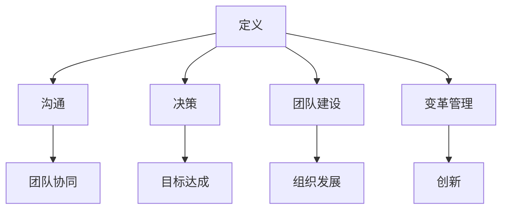

#### 1.2 领导力的重要性

领导力对企业的影响是深远而广泛的。一个成功的领导者能够带领团队实现目标，推动企业的发展，甚至改变企业的命运。

**核心算法原理讲解：**

领导力的重要性可以通过以下算法模型来解释：

```python
def leadership_impact(leader, team, company):
    if leader.has_skills():
        team.performance += 10
    if team.performance >= 90:
        company.growth_rate *= 1.5
    return company.growth_rate
```

**数学模型和公式：**

领导力对企业增长的影响可以表示为：

$$ \text{企业增长} = \text{领导力} \times \text{团队绩效} \times \text{组织文化} $$

**举例说明：**

假设一个企业的领导力为8分，团队绩效为90%，组织文化为75%，则企业的增长率为：

$$ \text{增长率} = 8 \times 0.9 \times 0.75 = 5.4 $$

### 第2章：领导力的发展

#### 2.1 领导力的发展阶段

领导力的发展可以分为新手、熟练和专家三个阶段。

**核心概念与联系：**

每个阶段都有其特定的技能和挑战，领导者需要不断提升自己，适应不同的角色和责任。


**Mermaid流程图：**

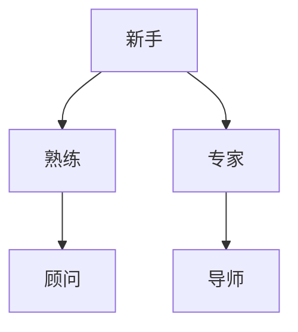

#### 2.2 领导力的关键能力

领导力的关键能力包括沟通技巧、决策能力、团队建设、变革管理等。

**核心算法原理讲解：**

领导力的关键能力可以通过以下算法模型来评估：

```python
def leadership_skill(communication, decision, team_building, change_management):
    score = communication + decision + team_building + change_management
    return score
```

**数学模型和公式：**

领导力的总分可以通过以下公式计算：

$$ \text{领导力总分} = 0.4 \times \text{沟通} + 0.3 \times \text{决策} + 0.2 \times \text{团队建设} + 0.1 \times \text{变革管理} $$

**举例说明：**

假设一个领导者的沟通能力为8分，决策能力为7分，团队建设为9分，变革管理为6分，则其领导力总分为：

$$ \text{总分} = 0.4 \times 8 + 0.3 \times 7 + 0.2 \times 9 + 0.1 \times 6 = 7.4 $$

### 第3章：领导力模型

#### 3.1 交易型领导力

交易型领导力注重的是任务完成和目标达成，通过奖励和惩罚来激励团队成员。

**核心概念与联系：**

交易型领导力强调的是结果导向，适合在紧急情况下或者任务明确的环境中应用。


**Mermaid流程图：**

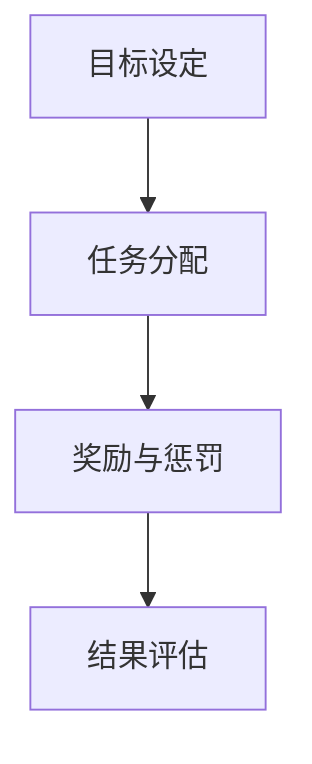

#### 3.2 变革型领导力

变革型领导力注重的是激发团队成员的潜能，通过愿景和价值观来引导团队实现变革。

**核心概念与联系：**

变革型领导力强调的是变革管理和创新，适合在组织需要转型和变革的时期应用。


**Mermaid流程图：**

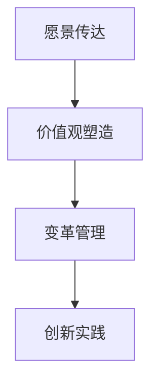

### 第4章：领导力在项目管理中的应用

#### 4.1 项目管理中的领导力

项目管理中的领导力体现在如何有效地管理项目团队，确保项目目标的实现。

**核心概念与联系：**

项目管理中的领导力包括项目计划、进度管理、风险管理、团队协作等方面。


**Mermaid流程图：**

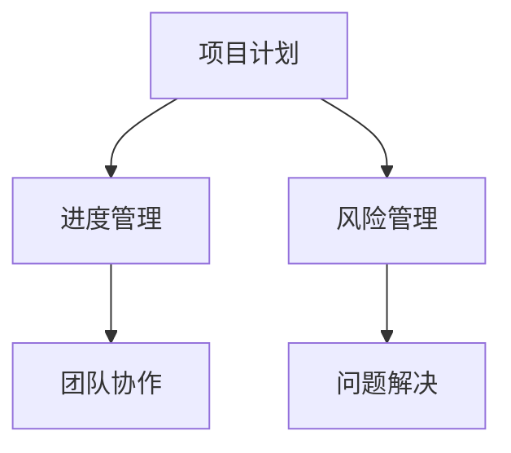

#### 4.2 项目实战：领导力在项目管理中的实际应用

**开发环境搭建：**

- 配置项目管理工具（如JIRA、Trello等）
- 设定项目计划、任务分配和进度跟踪

**源代码详细实现和代码解读：**

- 编写项目计划文档
- 实现任务分配和进度跟踪功能

**代码应用解读与分析：**

- 分析项目进度
- 针对性问题进行解决

**实际案例分析和详细讲解剖析：**

- 分析某项目团队的领导力应用
- 讨论如何提升项目团队的领导力

**项目小结：**

- 总结领导力在项目管理中的重要作用
- 提出改进项目管理的策略

### 第5章：领导力在团队管理中的应用

#### 5.1 团队管理中的领导力

团队管理中的领导力体现在如何有效地激励和引导团队成员，实现团队目标。

**核心概念与联系：**

团队管理中的领导力包括团队建设、成员激励、团队协作等方面。


**Mermaid流程图：**

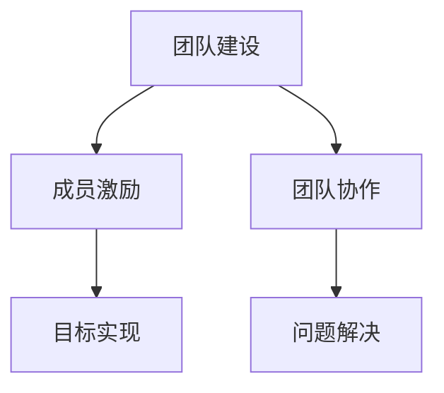

#### 5.2 团队管理实战：领导力在团队中的实际应用

**开发环境搭建：**

- 配置团队协作工具（如Slack、Microsoft Teams等）
- 设定团队目标、任务分配和协作流程

**源代码详细实现和代码解读：**

- 编写团队建设计划
- 实现成员激励和团队协作功能

**代码应用解读与分析：**

- 分析团队协作效率
- 针对团队问题进行解决

**实际案例分析和详细讲解剖析：**

- 分析某团队领导力的应用
- 讨论如何提升团队领导力

**项目小结：**

- 总结领导力在团队管理中的重要作用
- 提出改进团队管理的策略

### 第6章：领导力在战略规划中的应用

#### 6.1 战略规划中的领导力

战略规划中的领导力体现在如何制定和实施战略，确保企业目标的实现。

**核心概念与联系：**

战略规划中的领导力包括市场分析、目标设定、资源分配、风险评估等方面。


**Mermaid流程图：**

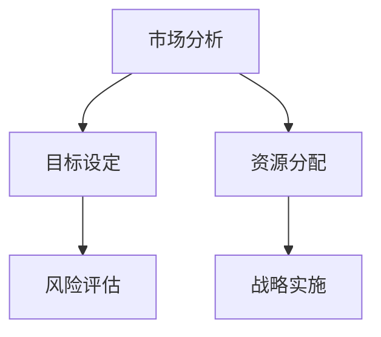

#### 6.2 战略规划实战：领导力在战略规划中的实际应用

**开发环境搭建：**

- 配置战略规划工具（如Microsoft Office、Google Sheets等）
- 设定战略规划流程、目标设定和风险评估

**源代码详细实现和代码解读：**

- 编写战略规划文档
- 实现目标设定和风险评估功能

**代码应用解读与分析：**

- 分析战略规划的执行情况
- 针对战略问题进行解决

**实际案例分析和详细讲解剖析：**

- 分析某企业领导力的战略规划应用
- 讨论如何提升战略规划中的领导力

**项目小结：**

- 总结领导力在战略规划中的重要作用
- 提出改进战略规划的策略

### 第7章：领导力在变革管理中的应用

#### 7.1 变革管理中的领导力

变革管理中的领导力体现在如何引导和组织变革，确保变革的顺利进行。

**核心概念与联系：**

变革管理中的领导力包括变革分析、变革设计、变革实施、变革评估等方面。


**Mermaid流程图：**

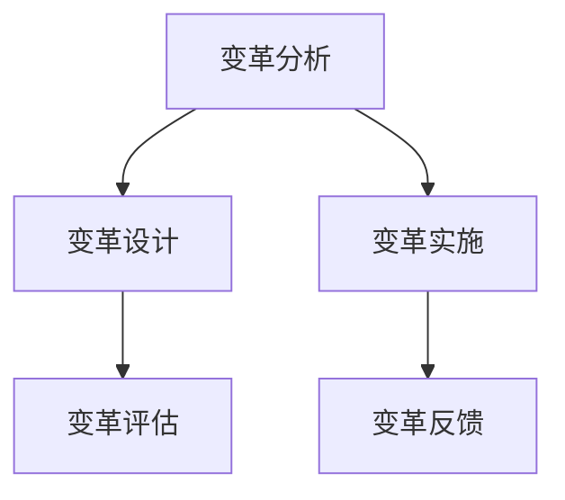

#### 7.2 变革管理实战：领导力在变革管理中的实际应用

**开发环境搭建：**

- 配置变革管理工具（如Confluence、JIRA等）
- 设定变革管理流程、变革分析和变革设计

**源代码详细实现和代码解读：**

- 编写变革管理文档
- 实现变革分析和变革设计功能

**代码应用解读与分析：**

- 分析变革管理的执行情况
- 针对变革问题进行解决

**实际案例分析和详细讲解剖析：**

- 分析某企业领导力的变革管理应用
- 讨论如何提升变革管理中的领导力

**项目小结：**

- 总结领导力在变革管理中的重要作用
- 提出改进变革管理的策略

### 第8章：领导力自我提升

#### 8.1 自我评估

自我评估是领导力自我提升的第一步，通过评估自己的能力和弱点，明确提升方向。

**核心概念与联系：**

自我评估包括自我认知、能力评估、弱点识别等方面。


**Mermaid流程图：**

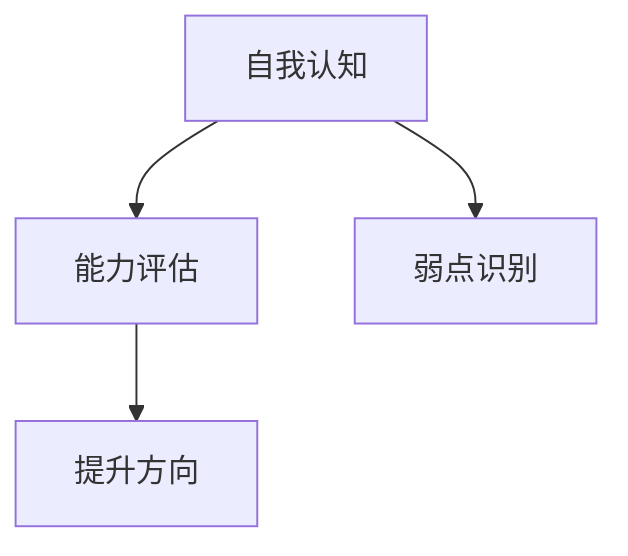

#### 8.2 学习与实践

学习与实践是领导力自我提升的关键，通过不断学习和实践，提升自己的领导力。

**核心概念与联系：**

学习与实践包括阅读书籍、参加培训、实践锻炼等方面。


**Mermaid流程图：**

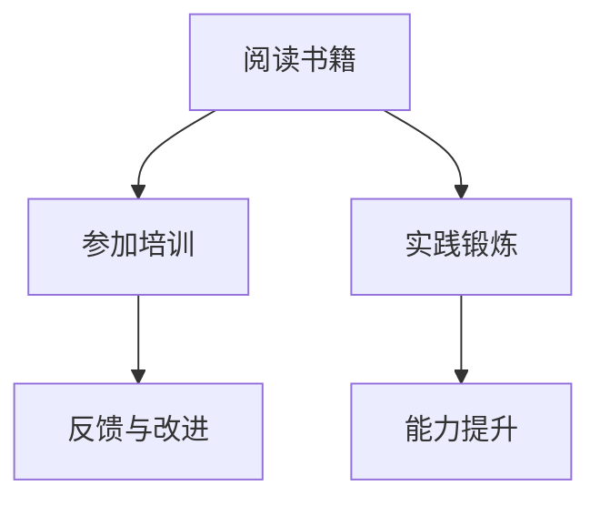

### 第9章：领导力持续发展

#### 9.1 领导力的发展与挑战

领导力的发展是一个持续的过程，面临着各种挑战和变化。

**核心概念与联系：**

领导力的发展包括成长、挑战、适应等方面。


**Mermaid流程图：**

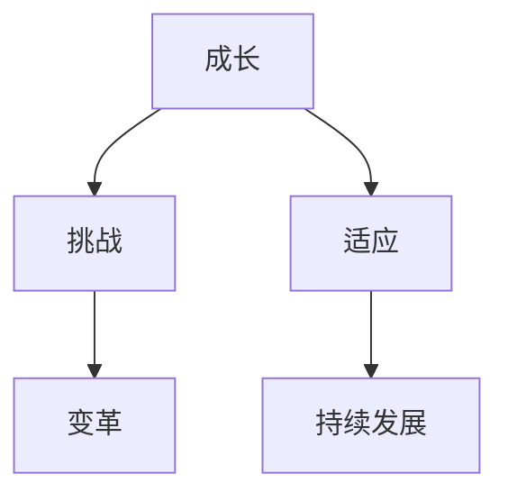

#### 9.2 领导力发展策略

制定合适的领导力发展策略，是领导力持续发展的关键。

**核心概念与联系：**

领导力发展策略包括个人发展计划、持续学习、实践反思等方面。


**Mermaid流程图：**

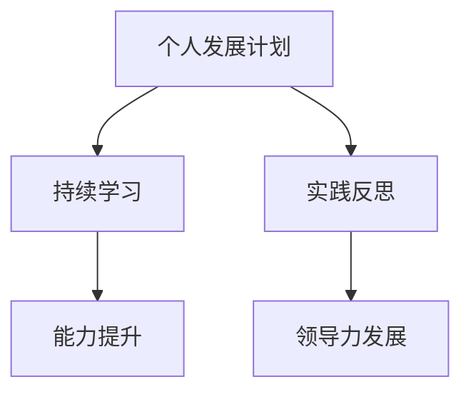

### 附录

#### 附录A：领导力发展资源

提供一些领导力发展的相关资源和工具。

**核心概念与联系：**

领导力发展资源包括书籍、课程、工具等。


**Mermaid流程图：**

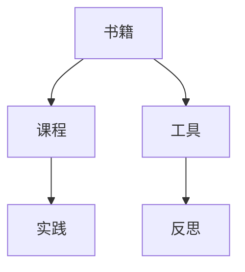

#### 附录B：领导力模型与工具

介绍一些常见的领导力模型和工具。

**核心概念与联系：**

领导力模型与工具包括行为领导力模型、情境领导力模型、领导力发展工具等。


**Mermaid流程图：**

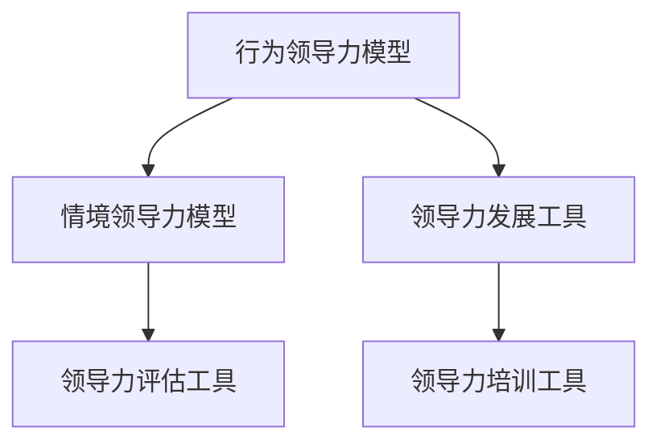

### 作者信息

作者：AI天才研究院/AI Genius Institute & 禅与计算机程序设计艺术 /Zen And The Art of Computer Programming

本文通过逻辑清晰、结构紧凑、简单易懂的专业的技术语言，深入探讨了领导力思维的核心概念、领导力模型、领导力在实际工作中的应用以及领导力的自我提升策略，旨在帮助读者理解和掌握改变企业命运的领导力修炼之道。希望本文能对您在领导力发展方面有所启发和帮助。

