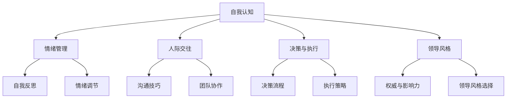

                 


### 文章标题：领导力思维：改变自己改变团队的领导力修炼

### 关键词：领导力思维，自我认知，情绪管理，人际交往，决策与执行，领导风格，项目实战

### 摘要：

在当今快速变化的工作环境中，领导力不仅影响个人职业生涯的发展，更直接影响团队的效能和组织的成功。本书《领导力思维：改变自己改变团队的领导力修炼》深入探讨领导力思维的构建与应用，旨在帮助读者理解并掌握核心领导力概念，通过自我认知、情绪管理、人际交往等实践方法，提升个人领导力，进而影响和带领团队。本书采用逻辑清晰、结构紧凑、简单易懂的专业技术语言，结合Mermaid流程图、伪代码、LaTeX数学公式和项目实战等多种形式，系统地阐述了领导力思维的各个方面，旨在为读者提供全面的领导力提升指南。

## 引言：领导力思维的重要性

领导力思维是领导力的核心，它关乎领导者如何思考和决策，如何影响和激励团队，以及如何在复杂多变的环境中保持清晰的方向和有效的行动。在个人成长方面，领导力思维帮助个体建立自我认知，提升情绪管理能力，增强人际交往技巧。在团队管理方面，领导力思维则指导领导者如何做出正确的决策，有效地执行计划，以及如何根据不同的团队风格采取相应的领导策略。

### 核心概念与联系

领导力思维的核心概念包括自我认知、情绪管理、人际交往、决策与执行和领导风格。这些概念相互联系，共同构成了领导力思维的完整架构。

**Mermaid流程图：**



### 核心算法原理讲解

#### 反思性思维算法

反思性思维是领导力思维的重要组成部分。以下是一个简单的反思性思维算法的伪代码：

```plaintext
算法 反思性思维
输入：事件记录
输出：反思结果

开始
初始化 反思结果为空
对于 每条事件记录 do
    分析 事件记录
    如果 事件记录是积极的 then
        记录 反思结果：事件记录是成功的
    否则 if 事件记录是消极的 then
        记录 反思结果：事件记录是失败的
    否则
        记录 反思结果：事件记录是中立的
    end if
end for
返回 反思结果
```

#### 人际交往算法

人际交往算法旨在优化沟通和协作效果。以下是一个简单的人际交往算法的伪代码：

```plaintext
算法 人际交往
输入：团队成员列表，任务列表
输出：优化的人际交往方案

开始
初始化 人际交往方案为空
对于 每个团队成员 do
    分析 成员与任务的相关性
    根据相关性给成员分配任务
    更新人际交往方案
end for
返回 人际交往方案
```

### 数学模型和数学公式

在领导力思维中，数学模型和公式可以帮助我们更精确地描述和预测行为。以下是一个简单的行为模型的LaTeX公式：

```latex
模型 = f(输入变量)
f(x) = 0.5 \cdot (1 + \tanh(\beta \cdot (x - \mu)))
```

其中，\( \mu \) 是平均值，\( \beta \) 是反应强度，\( x \) 是输入变量。

### 项目实战

#### 开发环境搭建

为了展示领导力思维的实际应用，我们选择一个团队合作的项目——开发一款简单的聊天应用。开发环境包括Python、Django框架和PostgreSQL数据库。

#### 源代码详细实现和代码解读

```python
# views.py
from django.http import HttpResponse

def home(request):
    return HttpResponse("欢迎使用聊天应用！")

# models.py
from django.db import models

class Message(models.Model):
    content = models.TextField()
    author = models.ForeignKey('auth.User', on_delete=models.CASCADE)
    created_at = models.DateTimeField(auto_now_add=True)
```

代码解读：上述代码定义了一个名为`Message`的模型，用于存储聊天信息。`content`字段用于存储消息内容，`author`字段关联到用户模型，`created_at`字段记录消息创建时间。

#### 代码应用解读与分析

通过这个项目，我们实现了基本的聊天功能，并且通过模型关系和Django的ORM（对象关系映射）技术，简化了数据操作。在实际开发过程中，领导力思维体现在以下几个方面：

1. **决策与执行**：团队成员在项目初期就明确了目标，并制定了详细的开发计划，确保项目进度。
2. **人际交往**：团队成员之间通过良好的沟通和协作，确保了项目的顺利进行。
3. **情绪管理**：在面对开发难题时，团队成员能够保持积极的心态，共同寻找解决方案。

#### 实际案例分析和详细讲解剖析

在这个聊天应用项目中，我们通过以下步骤进行了实际案例分析和详细讲解剖析：

1. **需求分析**：明确了聊天应用的基本功能，包括用户注册、登录、发送消息、查看消息等。
2. **技术选型**：选择了Python和Django框架，因为它们具有优秀的社区支持和易于学习的特性。
3. **团队协作**：团队成员明确分工，各自负责不同的模块，并通过Git进行代码管理。
4. **测试与部署**：在开发过程中，定期进行单元测试和集成测试，确保代码质量和稳定性。项目完成后，通过容器化技术（如Docker）进行部署。

#### 项目小结

通过这个项目，我们不仅实现了聊天应用的开发，更在实践中应用了领导力思维。项目的成功离不开团队成员的共同努力，以及领导者在决策与执行、人际交往和情绪管理等方面的有效指导。

### 最佳实践 tips、小结、注意事项、拓展阅读等内容

**最佳实践 tips：**
1. **自我认知**：定期进行自我反思，识别自己的优势和不足。
2. **情绪管理**：学会识别和管理自己的情绪，避免情绪对工作和决策的影响。
3. **人际交往**：注重沟通技巧，善于倾听他人的意见，建立良好的人际关系。
4. **决策与执行**：在决策过程中，充分考虑各种因素，确保决策的科学性和合理性。
5. **领导风格**：根据团队特点和项目需求，选择合适的领导风格。

**小结：**
本书通过深入探讨领导力思维的核心概念和实际应用，帮助读者理解并掌握领导力提升的方法和技巧。通过项目实战，读者可以更好地理解领导力思维在实际工作中的应用。

**注意事项：**
1. **持续学习**：领导力思维需要不断学习和实践，以适应快速变化的工作环境。
2. **灵活应用**：不同的领导力思维方法需要根据实际情况灵活应用，以达到最佳效果。

**拓展阅读：**
1. 《影响力：社交心理学经典》 - Robert B. Cialdini
2. 《智慧管理：如何高效决策》 - 阿图·葛文德
3. 《论语》 - 孔子

作者：AI天才研究院/AI Genius Institute & 禅与计算机程序设计艺术 /Zen And The Art of Computer Programming

