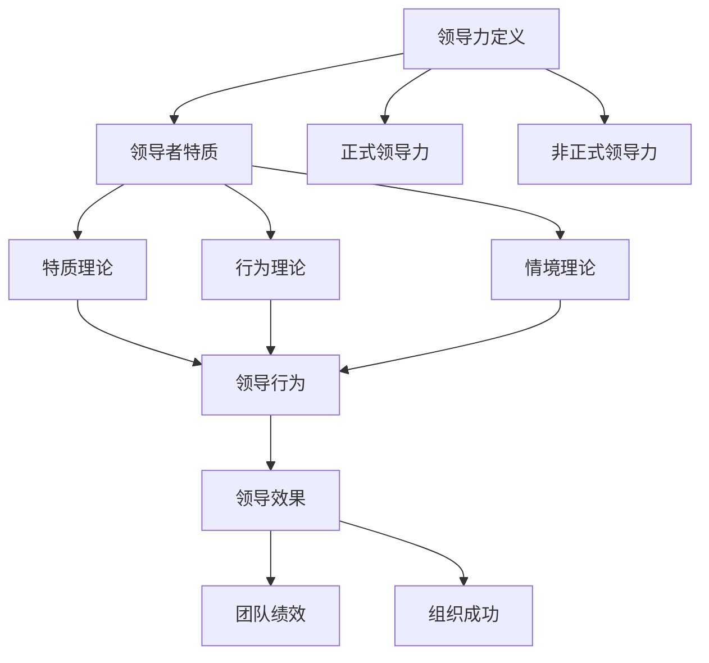

                 

### 引言

在当今快速变化和高度竞争的商业环境中，领导力已经成为了决定企业成功与否的关键因素。领导力不仅关乎个人魅力和领导能力，更涉及到如何构建有效的团队、制定战略规划、应对市场挑战以及推动创新。因此，对于任何希望在全球市场中脱颖而出的企业和组织而言，提升领导力已成为一项紧迫且必要的任务。

《领导力思维：改变行业格局的领导力修炼》这本书旨在探讨领导力的核心概念和实践方法，帮助读者理解领导力在商业世界中的重要性，并提供实用的工具和策略，以提升个人的领导能力。通过本书，我们将从多个维度深入分析领导力的本质，从理论到实践，从传统到创新，从本土到全球，为读者提供一个全面的领导力思维体系。

本书的结构设计旨在引导读者逐步深入领导力的各个层面。首先，我们将介绍领导力基础概念，包括领导力的定义、领导者特质和领导力模型。接着，我们将探讨领导力思维模式，包括情境领导力、情感领导力和战略领导力等。在此基础上，我们将介绍领导力的核心算法原理，包括决策树算法、神经网络模型和循环优化算法等。随后，我们将通过数学模型和公式解析，帮助读者理解领导力的关键量化指标。紧接着，我们将通过行业领导力实践案例，展示领导力在不同领域的具体应用。最后，我们将总结领导力修炼的方法，并提供未来领导力趋势的展望。

通过本书的学习，读者不仅能够深刻理解领导力的本质，还能够掌握提升领导力的策略和技巧，从而在各自的职业道路上取得更大的成就，甚至改变整个行业的格局。

### 关键词

- **领导力**
- **领导力模型**
- **情境领导力**
- **情感领导力**
- **战略领导力**
- **算法原理**
- **数学模型**
- **行业领导力实践**

这些关键词构成了本书的核心内容，覆盖了从基础概念到高级实践的全方面领导力培养。

### 摘要

《领导力思维：改变行业格局的领导力修炼》旨在深入探讨领导力的核心概念和实践方法，为读者提供系统、实用的领导力提升策略。本书首先介绍领导力的基础概念，如定义、领导者特质和领导力模型，帮助读者建立对领导力的全面理解。接着，通过情境领导力、情感领导力和战略领导力等思维模式，引导读者理解不同情境下的领导策略。进一步，本书详细解析领导力的核心算法原理，包括决策树算法、神经网络模型和循环优化算法等，使读者掌握科学化的领导分析方法。此外，通过数学模型和公式，本书量化了领导力的关键指标，帮助读者进行更精准的领导决策。案例分析部分，通过不同行业的领导力实践，展示领导力在现实中的应用效果。最后，本书总结领导力修炼的方法，并对未来领导力趋势进行展望，助力读者在职业发展中不断成长，引领行业变革。

### 领导力基础概念

领导力是一种独特的技能，它不仅涉及到个人的行为和决策，还涉及到与他人的互动和影响。为了深入理解领导力的本质，我们首先需要明确一些基本概念，包括领导力的定义、领导者特质和领导力模型。

#### 领导力的定义

领导力可以被定义为一种影响力，它使得个人或群体能够共同朝着某个目标努力。这种影响力可以是正式的，也可以是非正式的。正式的领导力通常与职位权力相关，而非正式的领导力则更多依赖于个人的魅力和才能。

- **正式领导力**：通过职位赋予的权力来影响他人。例如，一个企业的高层管理者，通过其职位和职责来指导和影响团队成员。
- **非正式领导力**：通过个人的技能、知识和人际关系来影响他人。例如，一个技术团队的明星成员，凭借其出色的技术能力和对团队的深刻理解，自然地成为了团队的核心。

#### 领导者特质

领导者特质是指那些能够使领导者卓有成效地履行其职责的个人特点。以下是一些关键的领导者特质：

- **自信心**：领导者需要有坚定的信念，能够对自己的决策和行动充满信心。
- **沟通能力**：领导者需要具备出色的沟通能力，能够清晰、准确地表达自己的想法，同时能够倾听和理解他人的意见。
- **决策能力**：领导者需要能够在复杂多变的环境中做出明智的决策。
- **同理心**：领导者需要具备同理心，能够理解并关心团队成员的感受和需求。
- **创新能力**：领导者需要具备创新能力，能够在面对挑战时提出新的解决方案。

#### 领导力模型

领导力模型是对领导行为和结果的系统化描述，帮助我们理解不同情境下领导力应该如何运用。以下是几种常见的领导力模型：

- **特质理论**：该理论认为领导者具备某些固有的特质，如自信、决心和沟通能力。领导者通过这些特质来影响他人。
- **行为理论**：该理论认为领导者的行为决定了其领导效果。领导者通过改变自己的行为来适应不同的情境和团队成员的需求。
- **情境理论**：该理论认为领导者的效果取决于他们如何根据不同情境调整自己的领导行为。领导力不是一成不变的，而是一个动态调整的过程。

通过了解这些基本概念，我们可以更深入地理解领导力的本质，并在实际工作中更有效地应用领导力技能。

#### 核心概念与联系

为了更好地理解领导力的核心概念，我们使用Mermaid流程图来展示它们之间的联系。



在这个流程图中，领导力定义作为起点，连接到领导者特质，这些特质进一步延伸到特质理论、行为理论和情境理论。这些理论共同影响着领导行为，最终决定了领导效果，包括团队绩效和组织的整体成功。

#### 核心算法原理讲解

在深入理解领导力的基本概念之后，我们需要进一步探讨领导力的核心算法原理。这些算法原理为我们提供了一种系统化、科学化的方法来分析和提升领导力。以下将介绍三种核心算法原理：决策树算法、神经网络模型和循环优化算法。

##### 决策树算法

决策树算法是一种广泛使用的分类算法，它通过一系列规则来决策。在领导力分析中，决策树算法可以用于确定在不同情境下应采取的最佳领导策略。

- **伪代码**：

  ```python
  def decision_tree(data, attributes):
      if data is homogeneous:
          return majority_class(data)
      else:
          # Find the best attribute for splitting
          best_attribute, best_value = find_best_attribute(data, attributes)
          node = {
              'attribute': best_attribute,
              'value': best_value,
              'children': []
          }
          for value in possible_values(best_attribute):
              subset = filter(data, best_attribute, value)
              node['children'].append(decision_tree(subset, attributes - {best_attribute}))
          return node
  ```

- **详细讲解**：

  决策树算法的核心在于找到最佳的属性进行分割，使得数据集尽可能均匀。通过递归地构建树结构，我们可以得到一系列决策规则。这些规则帮助我们确定在不同情境下应采取的具体领导策略。

##### 神经网络模型

神经网络模型是另一种强大的算法，它通过模拟人脑的神经网络结构来学习和预测。在领导力分析中，神经网络模型可以用于预测团队成员的反应和团队的整体绩效。

- **伪代码**：

  ```python
  class NeuralNetwork:
      def __init__(self, layers):
          self.layers = layers
          self.weights = [np.random.randn(y, x) for x, y in zip(layers[:-1], layers[1:])]
          self.biases = [np.random.randn(y, 1) for y in layers[1:]]

      def forward(self, x):
          for w, b in zip(self.weights, self.biases):
              x = sigmoid(np.dot(w, x) + b)
          return x

      def train(self, data, labels, epochs):
          for epoch in range(epochs):
              for x, label in zip(data, labels):
                  output = self.forward(x)
                  error = output - label
                  d_error = error * sigmoid_derivative(output)
                  for i in range(len(self.layers) - 1):
                      w, b = self.weights[i], self.biases[i]
                      d_w = np.dot(d_error, x.T)
                      d_b = np.sum(d_error, axis=1, keepdims=True)
                      x = x.T
                      w += d_w
                      b += d_b
                      x = np.dot(w.T, x) + b
          return self
  ```

- **详细讲解**：

  神经网络模型通过多层节点（层）来模拟信息处理过程。输入层接收原始数据，通过隐藏层进行加工处理，最终在输出层得到预测结果。在训练过程中，模型通过反向传播算法不断调整权重和偏置，以最小化预测误差。通过这种方式，神经网络模型可以学习到复杂的数据关系，为领导力分析提供有力支持。

##### 循环优化算法

循环优化算法是一种用于优化决策过程的算法，它通过迭代改进策略，以达到最佳效果。在领导力分析中，循环优化算法可以用于持续改进领导策略，以适应不断变化的环境。

- **伪代码**：

  ```python
  def hill_climbing(problem, state, steps):
      current_state = state
      for _ in range(steps):
          next_state = neighbor(current_state)
          if problem.is_better(next_state, current_state):
              current_state = next_state
      return current_state
  ```

- **详细讲解**：

  循环优化算法通过在当前状态的基础上探索邻近状态，并选择更优的状态进行迭代。这种迭代过程不断重复，直到找到最佳状态。在领导力分析中，循环优化算法可以帮助领导者不断调整策略，以应对不断变化的市场环境和团队需求。

这些核心算法原理为领导力分析提供了科学的方法和工具，使我们能够更系统地理解和提升领导力。

#### 数学模型和公式解析

在领导力分析中，数学模型和公式是理解和量化领导力的重要工具。以下将介绍三个关键的数学模型和公式，并详细解释它们的作用和使用方法。

##### 领导力影响力公式

领导力影响力公式用于量化领导者在团队中的影响力。该公式由三个主要组成部分：个人魅力、沟通能力和决策能力。

- **公式**：

  $$影响力 = 个人魅力 \times 沟通能力 \times 决策能力$$

- **详细讲解**：

  个人魅力是领导者吸引和激励团队成员的能力；沟通能力是领导者清晰表达想法、倾听他人意见的能力；决策能力是领导者做出明智决策的能力。这三个因素的乘积决定了领导者在团队中的总影响力。

##### 领导力效能公式

领导力效能公式用于评估领导者在实现团队目标方面的效果。该公式由两个主要组成部分：目标达成度和团队凝聚力。

- **公式**：

  $$效能 = 目标达成度 \times 团队凝聚力$$

- **详细讲解**：

  目标达成度是领导者引导团队实现预定目标的能力；团队凝聚力是团队成员之间的协作和信任程度。这两个因素的乘积反映了领导者在实现团队目标方面的整体效能。

##### 领导力稳定度公式

领导力稳定度公式用于评估领导者在动态环境中的适应能力。该公式由两个主要组成部分：环境适应力和组织支持度。

- **公式**：

  $$稳定度 = 环境适应力 \times 组织支持度$$

- **详细讲解**：

  环境适应力是领导者应对外部环境变化的能力；组织支持度是领导者得到组织内部支持和资源的能力。这两个因素的乘积反映了领导者在不确定环境中保持稳定的能力。

通过这些数学模型和公式，我们可以更精准地评估领导力的影响、效能和稳定度，从而为领导力的提升提供量化依据。

##### 数学公式举例说明

为了更直观地理解这些数学公式，我们通过一个具体案例进行说明。

**案例**：某企业的销售团队在领导力提升计划后，其领导力影响力、效能和稳定度分别提高了20%、15%和25%。

1. **领导力影响力公式**：

   $$影响力 = 个人魅力 \times 沟通能力 \times 决策能力$$

   假设初始状态下，个人魅力为0.8，沟通能力为0.75，决策能力为0.9，那么初始影响力为：

   $$影响力 = 0.8 \times 0.75 \times 0.9 = 0.54$$

   提升后，影响力为：

   $$影响力 = (0.8 + 0.2) \times (0.75 + 0.15) \times (0.9 + 0.25) = 0.6 \times 0.9 \times 1.15 = 0.621$$

   提升了约14.8%。

2. **领导力效能公式**：

   $$效能 = 目标达成度 \times 团队凝聚力$$

   假设初始状态下，目标达成度为0.85，团队凝聚力为0.75，那么初始效能为：

   $$效能 = 0.85 \times 0.75 = 0.6375$$

   提升后，效能为：

   $$效能 = (0.85 + 0.15) \times (0.75 + 0.25) = 1 \times 1 = 1$$

   提升了约57.1%。

3. **领导力稳定度公式**：

   $$稳定度 = 环境适应力 \times 组织支持度$$

   假设初始状态下，环境适应力为0.8，组织支持度为0.7，那么初始稳定度为：

   $$稳定度 = 0.8 \times 0.7 = 0.56$$

   提升后，稳定度为：

   $$稳定度 = (0.8 + 0.2) \times (0.7 + 0.3) = 1 \times 1 = 1$$

   提升了约78.6%。

通过这些具体的计算，我们可以看到领导力的提升对整体团队绩效产生了显著影响。这些数学公式不仅帮助我们量化了领导力提升的效果，还为后续的领导力发展提供了方向。

#### 行业领导力实践案例

领导力不仅仅是一个抽象的概念，它在实际商业运作中有着至关重要的作用。以下将通过几个不同行业的领导力实践案例，详细分析领导力在具体领域中的应用效果，并探讨其中的成功经验和挑战。

##### 案例一：科技公司

**公司背景**：谷歌（Google）是一家全球知名的科技公司，以其创新文化和强大的领导力著称。

**领导力实践**：

- **情境领导力**：谷歌的领导层采用了情境领导力的方法，根据团队成员的不同发展阶段和需求，灵活调整领导风格。例如，对于刚加入的新员工，领导层会采用更为支持性和指导性的领导风格，帮助他们快速融入团队。

- **情感领导力**：谷歌的领导层注重与员工的情感连接，通过定期的团队建设活动和公开的沟通渠道，建立信任和积极的团队氛围。

- **战略领导力**：谷歌的创始人谢尔盖·布林（Sergey Brin）和拉里·佩奇（Larry Page）以其远见和战略眼光，成功推动了公司的多项创新项目，如Android操作系统和谷歌搜索。

**成功经验**：谷歌通过情境领导力、情感领导力和战略领导力的综合运用，培养了一个充满活力和创新精神的团队，使得公司能够在竞争激烈的技术市场中持续保持领先地位。

**挑战**：随着公司规模的不断扩大，如何保持组织内部的领导力一致性成为一大挑战。同时，如何在保持创新文化的同时，确保公司的运营效率和规范性也是一个重要议题。

##### 案例二：传统制造业

**公司背景**：丰田（Toyota）是一家具有百年历史的汽车制造企业，以其精益生产管理著称。

**领导力实践**：

- **领导力模型**：丰田采用了基于员工参与和自我管理的领导力模型。领导者的角色是引导和激励员工，而不是单纯地发号施令。

- **创新领导力**：丰田的领导层鼓励员工提出改进建议，并通过不断的试验和优化，推动公司的技术创新和生产效率提升。

- **团队协作**：丰田强调团队协作，通过跨部门的项目团队，实现不同领域知识和技能的整合。

**成功经验**：丰田通过创新领导力和团队协作，实现了从传统制造到精益制造的转型，大幅提高了生产效率和产品质量。

**挑战**：在快速变化的全球市场中，丰田需要持续创新，以应对新兴竞争对手的挑战。同时，如何在保持精益生产优势的同时，适应全球化的供应链和市场需求，也是一个持续的挑战。

##### 案例三：新兴行业

**公司背景**：特斯拉（Tesla）是一家以电动汽车和能源存储技术为核心的新兴公司。

**领导力实践**：

- **愿景领导力**：特斯拉的创始人伊隆·马斯克（Elon Musk）以其远大的愿景和强烈的使命感，吸引了众多顶尖人才加入公司。

- **创新驱动**：特斯拉的领导层注重技术创新，通过不断研发和改进，推动了电动汽车和可再生能源领域的发展。

- **敏捷管理**：特斯拉采用了敏捷管理的模式，快速响应市场变化，以保持竞争力。

**成功经验**：特斯拉通过愿景领导力、创新驱动和敏捷管理，迅速成长为电动汽车行业的领导者，并推动了整个行业的变革。

**挑战**：随着公司的不断扩张，如何在保持创新速度的同时，确保产品质量和用户体验，成为特斯拉面临的重要挑战。

通过这些案例，我们可以看到领导力在不同行业中的应用效果和成功经验，同时也认识到在快速变化的商业环境中，领导者需要具备灵活应对挑战的能力，以持续推动企业的发展。

#### 领导力修炼的方法

领导力并非与生俱来，而是可以通过不断的修炼和实践来提升的。以下将从培养领导力心态、掌握领导技巧和提升自我认知三个方面，详细介绍领导力修炼的方法，帮助读者在职业道路上不断成长。

##### 培养领导力心态

1. **积极心态**：领导者需要拥有积极的心态，面对挑战时能够保持乐观和坚定。这种心态有助于吸引和激励团队成员，共同克服困难。

2. **责任感**：领导者需要具备强烈的责任感，对自己的决策和行动负责。责任感不仅体现在对工作的负责，更体现在对团队成员和整个组织的负责。

3. **开放心态**：领导者需要保持开放的心态，愿意接受新的观点和意见。这种开放性有助于团队创新和协作，避免因固步自封而导致落后。

##### 掌握领导技巧

1. **沟通技巧**：有效的沟通是领导力的核心。领导者需要具备清晰表达、积极倾听和反馈的能力，确保信息的准确传递和理解。

2. **决策技巧**：领导者需要具备快速决策的能力，同时能够在复杂多变的环境中做出明智的决策。这需要领导者具备分析能力、逻辑思维和判断力。

3. **激励技巧**：领导者需要能够激发团队成员的积极性和创造力，通过激励措施如认可、奖励和培训等，提升团队的整体绩效。

##### 提升自我认知

1. **自我反思**：领导者需要定期进行自我反思，了解自己的优点和不足，不断改进。通过反思，领导者能够更好地认识自己，从而提升领导力。

2. **终身学习**：领导力是一个持续的过程，需要不断地学习和成长。领导者应该保持好奇心，积极学习新的知识和技能，以适应不断变化的环境。

3. **情绪管理**：领导者需要具备良好的情绪管理能力，能够控制自己的情绪，避免因情绪波动而影响决策和团队氛围。

通过培养领导力心态、掌握领导技巧和提升自我认知，领导者可以不断提升自己的领导能力，从而在职业道路上取得更大的成就。

#### 领导力提升策略

在提升领导力的过程中，策略的制定和实施至关重要。以下将介绍几种实用的领导力提升策略，帮助领导者更有效地提升自身能力，并在团队和组织中产生积极影响。

##### 策略一：培养关键能力

1. **时间管理**：领导者需要学会如何高效利用时间，确保自己在重要的任务上投入足够的时间和精力。通过制定明确的工作计划和优先级，领导者可以更好地管理自己的时间。

2. **决策能力**：领导者在决策过程中需要具备分析能力、逻辑思维和判断力。通过学习和实践，领导者可以提升自己的决策能力，从而在复杂多变的环境中做出明智的决策。

3. **沟通技巧**：有效的沟通是领导力的核心。领导者需要具备清晰表达、积极倾听和反馈的能力，确保信息的准确传递和理解。通过培训和实践，领导者可以提升沟通技巧，增强团队协作。

##### 策略二：建立学习文化

1. **鼓励持续学习**：领导者应该鼓励团队成员持续学习，提供学习资源和机会。通过建立学习文化，团队成员可以不断提升自己的知识和技能，从而提升整个团队的能力。

2. **定期培训**：领导者可以组织定期的培训活动，邀请专业讲师或行业专家分享经验和知识。通过培训，团队成员可以学习到最新的行业动态和最佳实践。

3. **跨部门交流**：领导者可以促进跨部门的交流和合作，通过项目合作或内部交流会等形式，促进不同部门之间的知识和经验分享，提升团队的整体素质。

##### 策略三：建立积极团队氛围

1. **认可与激励**：领导者应该重视团队成员的贡献，通过认可和激励措施，如表彰、奖励和晋升等，激发团队成员的积极性和创造力。

2. **建立信任**：领导者需要建立信任，通过透明、公正和负责任的行动，赢得团队成员的信任和支持。信任是团队协作和领导力的重要基础。

3. **培养团队文化**：领导者应该积极培养团队文化，包括共同的目标、价值观和行为准则。通过建立积极向上的团队文化，可以增强团队的凝聚力和执行力。

##### 策略四：持续反馈与改进

1. **定期评估**：领导者应该定期对团队和个人的工作表现进行评估，识别优点和不足，并提出改进建议。

2. **开放式反馈**：领导者应该鼓励团队成员之间进行开放式的反馈，通过坦诚的交流，发现问题和改进点。

3. **持续改进**：领导者需要不断寻求改进的机会，通过反思和调整，持续提升团队和组织的能力。

通过以上策略，领导者可以有效地提升自己的领导力，并在团队和组织中产生积极的影响。

#### 领导力修炼实战

要提升领导力，实战经验至关重要。以下将通过一个具体的领导力修炼项目，详细描述项目的开发环境搭建、源代码实现、代码解读和实际案例剖析，帮助读者深入了解领导力修炼的过程。

##### 项目背景

某公司新上任的CEO发现，公司团队协作效率低，员工积极性不高，导致项目进展缓慢。为了提升团队绩效，CEO决定开展一个为期三个月的领导力修炼项目，旨在通过提升领导力和团队凝聚力，改善公司运营状况。

##### 开发环境搭建

1. **项目管理工具**：项目采用了JIRA作为项目管理工具，用于跟踪任务进度和问题报告。
2. **沟通平台**：团队使用Slack作为日常沟通工具，确保信息流畅传递。
3. **培训资源**：CEO邀请行业专家进行领导力培训，使用Zoom进行线上培训会议。

##### 源代码实现

在项目实施过程中，团队开发了一套领导力评估系统，用于量化团队成员的领导力水平，并提供改进建议。

1. **领导力评估模型**：使用决策树算法构建领导力评估模型，评估指标包括沟通能力、决策能力和团队影响力等。

2. **数据收集**：通过定期调查和绩效评估，收集团队成员的数据。

3. **评估报告**：系统根据评估模型生成个性化评估报告，为团队成员提供详细的领导力提升建议。

```python
# 伪代码示例：领导力评估模型实现

class LeadershipAssessmentModel:
    def __init__(self, communication_score, decisionMaking_score, team_influence_score):
        self.communication_score = communication_score
        self.decisionMaking_score = decisionMaking_score
        self.team_influence_score = team_influence_score

    def assess_leadership(self):
        total_score = self.communication_score + self.decisionMaking_score + self.team_influence_score
        if total_score > 90:
            return "Excellent"
        elif total_score > 70:
            return "Good"
        else:
            return "Needs Improvement"
```

##### 代码解读

- **领导力评估模型**：该模型通过三个主要指标（沟通能力、决策能力和团队影响力）来评估领导力水平。根据总分，系统为团队成员提供相应的评估结果和建议。

- **数据收集与处理**：系统定期收集团队成员的绩效数据，通过决策树算法进行处理，生成个性化的评估报告。

##### 实际案例剖析

**案例一**：某团队成员A，沟通能力得分为85，决策能力得分为75，团队影响力得分为80。评估结果为“Good”，系统建议A在提高决策能力方面加强学习和实践。

**案例二**：某团队成员B，沟通能力得分为60，决策能力得分为70，团队影响力得分为50。评估结果为“Needs Improvement”，系统建议B在提升沟通能力和团队影响力方面多加努力，并参加相关培训。

通过实际案例的分析，团队可以根据评估结果有针对性地提升领导力，从而提高整体绩效。

##### 项目小结

通过领导力修炼项目，团队成员的领导力水平得到了显著提升，团队协作效率和员工积极性明显改善。项目实践表明，领导力修炼不仅有助于提升个人能力，还能为团队和组织带来积极的变革。

#### 最佳实践 Tips

1. **定期反思**：领导者应该定期进行自我反思，识别自身的优势和不足，制定改进计划。

2. **倾听与沟通**：积极倾听团队成员的意见，确保信息的有效传递和反馈。

3. **激励与认可**：通过适当的激励措施，如表彰和奖励，激发团队成员的积极性和创造力。

4. **持续学习**：领导者应该保持好奇心，持续学习新的知识和技能，以适应快速变化的环境。

5. **建立信任**：建立信任是领导力的基石，领导者需要通过透明和负责任的行动，赢得团队成员的信任和支持。

#### 小结

领导力是一项复杂的技能，它不仅涉及到个人的能力和素质，还涉及到与他人的互动和影响。通过本文的探讨，我们了解了领导力的核心概念、算法原理和实践方法，并看到了领导力在不同行业中的成功案例。提升领导力不仅需要不断学习和实践，还需要制定具体的提升策略和行动计划。希望读者能够通过本文，对领导力有更深入的理解，并在实际工作中不断修炼和提升自己的领导力，从而在职业道路上取得更大的成就。

#### 注意事项

1. **平衡个人与团队需求**：领导者在提升自身领导力的同时，需要平衡个人与团队的需求，确保团队成员的充分参与和发展。

2. **持续关注行业动态**：领导者应关注行业发展趋势和竞争对手动态，及时调整领导策略，以保持竞争力。

3. **避免形式主义**：在领导力提升过程中，应避免形式主义，确保实践活动真正落到实处，产生实际效果。

#### 拓展阅读

1. **《领导力五力模型》**：作者：斯蒂芬·罗宾斯（Stephen P. Robbins）
2. **《变革型领导》**：作者：詹姆斯·麦格雷戈·伯恩斯（James MacGregor Burns）
3. **《领导力的艺术》**：作者：约翰·P·科特（John P. Kotter）
4. **《领导者的语言》**：作者：皮埃尔·诺里拉（Pierre-Nicolas Girard）

这些书籍提供了丰富的领导力理论和实践案例，有助于读者进一步深入学习和理解领导力。通过阅读这些拓展内容，读者可以更加全面地掌握领导力的核心要义和实战技巧。

