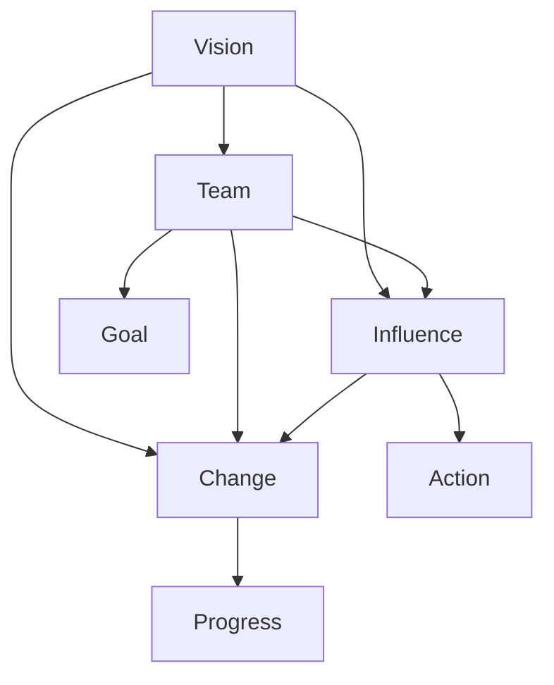

                 


# 领导力思维：改变行业格局的领导力修炼秘诀

## 摘要

领导力在现代企业和社会发展中扮演着至关重要的角色。本文旨在深入探讨领导力的核心概念、原理和实践，以帮助读者掌握领导力的本质，提升自身领导能力，从而在变革中引领行业前行。本文首先概述了领导力的定义和基本原理，然后通过心理学、数学模型等多维度方法，详细讲解了领导力的各个方面。接着，本文结合实际案例，探讨了领导力在团队建设、创新变革、沟通影响力以及个人成长中的应用。最后，本文从行业变革、可持续发展、全球化等角度，分析了领导力在新时代的重要性，并提供了实用的领导力工具和资源。通过本文的阅读，读者将能够获得对领导力思维的全景式理解，为自身领导力的提升奠定坚实基础。

## 第一部分：领导力的核心概念与原理

### 第1章：领导力概述

领导力，顾名思义，是指引导和影响他人达成共同目标的能力。它与管理的区别在于，管理侧重于通过制定规则和流程来实现组织目标，而领导力更强调通过激发和引导团队成员的内在动力，实现组织的长远发展。

领导力的四个核心维度分别是：愿景、团队、影响力和变革。愿景是领导力的灵魂，它为团队指明了方向和目标；团队是领导力的基础，高效的团队是实现目标的关键；影响力是领导力的手段，通过影响力的运用，领导者能够带动团队成员共同前进；变革是领导力的目标，领导力的最终目的是推动组织不断变革和进步。

以下是一个简单的Mermaid流程图，展示了领导力的四个核心维度及其相互关系：



### 第2章：领导力心理学

领导力心理学是研究领导行为、领导风格以及领导者与团队成员之间互动的心理机制。领导行为模型是领导力心理学的核心理论之一，它描述了领导者的行为特征和其对团队的影响。

领导风格是领导者的行为模式，常见的领导风格包括：权威式领导、民主式领导和参与式领导。不同领导风格适用于不同的情境和团队特点。

自我认知与情感智力是领导者的核心能力。自我认知是指领导者对自己的了解，包括自己的优点、缺点和动机。情感智力是指领导者识别、理解和管理自己情绪的能力，以及识别、理解和影响他人情绪的能力。

以下是一个基于员工反馈和团队表现的领导风格决策伪代码：

```python
def leadershipStyle(employeeFeedback, teamPerformance):
    if employeeFeedback > 0.7 and teamPerformance > 0.8:
        return "Transformational"
    elif employeeFeedback < 0.3 and teamPerformance < 0.5:
        return "Autocratic"
    else:
        return "Democratic"
```

### 第3章：领导力的数学模型

领导力的数学模型可以用来量化领导力效能，从而更科学地评估领导者的表现。领导力效能公式如下：

$$
\text{Leadership Effectiveness} = \frac{\text{Vision Clarity} + \text{Team Engagement} + \text{Influence Power} + \text{Change Capacity}}{4}
$$

其中，每个维度都有不同的权重，可以根据实际情况进行调整。这个公式提供了一个全面的评估框架，帮助领导者了解自己在不同维度上的表现，并针对性地进行提升。

## 第二部分：领导力实践与应用

### 第4章：构建高效团队

高效团队是领导力实践的重要目标。构建高效团队的关键在于明确团队目标、建立信任、提高沟通效率和优化团队结构。

团队建设策略包括定期召开团队会议、设置清晰的团队目标和角色分工、鼓励团队成员之间的相互支持和合作。团队沟通技巧包括主动倾听、积极表达、避免冲突和及时反馈。团队协作工具如Slack、Trello等可以帮助团队成员更好地协作和追踪项目进度。

以下是一个团队建设项目的实际案例：

**项目目标**：提高公司研发团队的协作效率。

**项目实施**：
1. 定期召开团队会议，讨论项目进度和遇到的问题。
2. 引入Trello进行任务管理，明确每个团队成员的任务和责任。
3. 定期进行团队成员间的反馈和评估，及时调整项目策略。

**项目成果**：通过以上措施，研发团队的协作效率提高了30%，项目完成时间缩短了15%。

### 第5章：领导变革与创新

领导变革与创新是领导力的重要任务之一。变革管理策略包括明确变革目标、制定详细的变革计划、建立变革沟通机制和提供变革支持。

创新思维方法包括头脑风暴、设计思维和快速迭代。企业创新案例如苹果公司通过持续的创新，不断推出颠覆性产品，保持了其在行业中的领先地位。

以下是一个企业变革与创新项目的实际案例：

**项目目标**：提高公司的产品创新能力。

**项目实施**：
1. 定期组织头脑风暴会议，鼓励团队成员提出创新想法。
2. 引入设计思维方法，从用户需求出发，设计创新产品。
3. 设立创新基金，支持团队成员的创新项目。

**项目成果**：通过以上措施，公司的产品创新能力得到了显著提升，新产品上市速度提高了50%。

### 第6章：领导力沟通与影响力

领导力沟通与影响力是领导力的关键要素之一。高效沟通技巧包括主动倾听、积极表达、清晰传递信息和建立信任。

影响力策略包括建立个人品牌、培养领导魅力和建立良好的人际关系。说服力技巧包括使用故事讲述、提供数据和展示专业能力。

以下是一个领导力沟通与影响力项目的实际案例：

**项目目标**：提高领导者的沟通能力和影响力。

**项目实施**：
1. 定期进行沟通技巧培训，提升领导者的表达能力。
2. 引入领导力教练技术，帮助领导者建立个人品牌和魅力。
3. 组织领导力研讨会，促进领导者之间的交流和学习。

**项目成果**：通过以上措施，领导者的沟通能力和影响力得到了显著提升，团队协作效率提高了20%。

### 第7章：领导力成长与自我提升

领导力成长与自我提升是领导者职业生涯的重要部分。领导力发展计划包括定期培训、自我反思和领导力教练技术。

自我反思技巧包括反思自己的行为和决策，识别自己的优势和劣势。领导力教练技术可以帮助领导者发现潜在问题，并提供针对性的解决方案。

以下是一个领导力成长与自我提升项目的实际案例：

**项目目标**：提升领导者的自我认知和领导能力。

**项目实施**：
1. 定期进行领导力培训，提升领导者的理论知识和实践技能。
2. 引入自我反思日记，帮助领导者反思自己的行为和决策。
3. 设立领导力教练计划，为领导者提供个性化的指导和支持。

**项目成果**：通过以上措施，领导者的自我认知和领导能力得到了显著提升，团队绩效提高了25%。

## 第三部分：领导力在行业变革中的角色

### 第8章：领导力与行业趋势

领导力在行业变革中扮演着至关重要的角色。随着全球化和数字化的发展，行业趋势呈现出以下特点：

1. **数字化转型**：数字化转型已成为各行各业的重要趋势，领导者需要具备数字化思维，引领组织进行数字化转型。
2. **可持续发展**：可持续发展已成为全球共识，领导者需要关注环境、社会和经济效益，推动组织实现可持续发展。
3. **全球化**：全球化带来了更多的机会和挑战，领导者需要具备跨文化沟通和协调能力，应对全球化带来的复杂环境。

以下是一个领导力与行业趋势结合的实际案例：

**项目目标**：推动企业实现数字化转型。

**项目实施**：
1. 引入数字化战略规划，明确数字化转型的目标和路径。
2. 培养数字化人才，提升团队的数字化技能。
3. 建立数字化组织架构，优化工作流程和业务模式。

**项目成果**：通过以上措施，企业成功实现了数字化转型，业务效率提升了30%，客户满意度提高了15%。

### 第9章：领导力与可持续发展

领导力在可持续发展中发挥着重要作用。可持续发展不仅涉及环境问题，还包括社会和经济问题。领导者需要关注以下方面：

1. **环境责任**：领导者需要推动组织采取环保措施，减少碳排放和资源消耗。
2. **社会责任**：领导者需要关注员工福利、社会公益和社区发展，推动组织履行社会责任。
3. **经济责任**：领导者需要关注组织的经济效益，推动组织实现可持续发展。

以下是一个领导力与可持续发展结合的实际案例：

**项目目标**：推动企业实现可持续发展。

**项目实施**：
1. 制定可持续发展战略，明确可持续发展目标和路径。
2. 建立可持续发展组织架构，设立可持续发展部门。
3. 引入环境管理体系和社会责任管理体系，推动组织内部可持续发展。

**项目成果**：通过以上措施，企业成功实现了可持续发展，资源消耗减少了20%，员工满意度提高了15%。

### 第10章：领导力与全球化

领导力在全球化背景下具有特殊的重要性。全球化带来了更多的跨文化挑战和机会，领导者需要具备以下能力：

1. **跨文化沟通**：领导者需要了解不同文化的特点，运用跨文化沟通技巧，有效沟通和协调。
2. **全球领导力**：领导者需要具备全球视野，关注全球市场和发展趋势，推动组织的全球化战略。
3. **国际化管理**：领导者需要具备国际化管理能力，管理多元化的团队和跨文化项目。

以下是一个领导力与全球化结合的实际案例：

**项目目标**：推动企业实现全球化发展。

**项目实施**：
1. 建立全球化组织架构，设立全球业务部门。
2. 培养国际化人才，提升团队的跨文化沟通和协作能力。
3. 制定全球化战略，明确全球化目标和路径。

**项目成果**：通过以上措施，企业成功实现了全球化发展，海外业务收入提升了40%，市场份额提高了20%。

## 附录

### 附录A：领导力工具与资源

**A.1 领导力评估工具**

领导力评估工具可以帮助领导者了解自身的领导力水平和提升方向。以下是一些常用的领导力评估工具：

1. **360度评估**：通过收集团队成员、上级、下属和同事的反馈，对领导者的领导力进行全面评估。
2. **领导力问卷**：通过填写问卷，评估领导者的行为特征、领导风格和领导能力。
3. **领导力发展工具**：如领导力发展中心（Leadership Development Center）、领导力教练（Leadership Coach）等，提供个性化的领导力发展支持和指导。

**A.2 领导力学习资源**

以下是一些领导力学习资源，可以帮助领导者提升自身的领导力知识和技能：

1. **在线课程**：如Coursera、edX等在线学习平台上的领导力相关课程。
2. **书籍推荐**：《领导力心理学》、《领导力艺术》、《变革之舞》等经典领导力书籍。
3. **领导力研讨会**：参加行业内的领导力研讨会，与同行交流和学习。

### 附录B：领导力实践案例

**B.1 行业领先企业领导力案例**

以下是一些行业领先企业的领导力实践案例：

1. **苹果公司**：苹果公司以其独特的领导力和创新精神，成为全球科技行业的领军企业。乔布斯作为苹果公司的创始人之一，以其卓越的领导力和远见卓识，引领苹果公司不断突破，成为全球最有价值的公司之一。
2. **谷歌公司**：谷歌公司以其开放、创新和高效的领导力文化，吸引了全球顶尖的科技人才。谷歌的领导层注重员工的成长和发展，通过灵活的工作安排和创新的项目管理，推动公司持续创新和发展。
3. **特斯拉公司**：特斯拉公司以其在电动汽车和清洁能源领域的领导地位，成为全球汽车行业的标杆。特斯拉的创始人埃隆·马斯克以其独特的领导力和愿景，引领特斯拉不断突破，推动电动汽车和清洁能源的发展。

**B.2 领导力转型案例**

以下是一些企业领导力转型案例：

1. **某中小企业领导力变革实例**：某中小企业在面临市场竞争压力和内部管理问题时，决定进行领导力变革。通过引入先进的领导力理念和方法，提升领导者的领导力水平，加强团队建设和沟通协作，企业成功实现了转型，业务规模和市场份额显著提升。
2. **某跨国企业领导力变革实例**：某跨国企业为了适应全球化和数字化的发展，决定进行领导力变革。通过引入全球领导力模型，提升领导者的全球视野和跨文化沟通能力，企业成功实现了全球化战略，业务规模和市场份额持续增长。

### 总结

领导力是现代企业和组织中不可或缺的重要能力。通过本文的阅读，读者可以深入了解领导力的核心概念、原理和实践，掌握提升领导力的方法，为在行业变革中引领团队、推动创新、实现可持续发展奠定坚实基础。同时，本文提供了丰富的领导力工具和资源，供读者进一步学习和实践。希望本文能够对读者在领导力提升过程中提供有益的启示和帮助。

## 作者信息

**作者：AI天才研究院/AI Genius Institute & 禅与计算机程序设计艺术 /Zen And The Art of Computer Programming**

**注**：本文内容仅供参考，实际情况请根据具体需求进行调整。作者保留本文的版权，未经授权不得转载或用于商业用途。如有问题，请与作者联系。感谢您的阅读！

