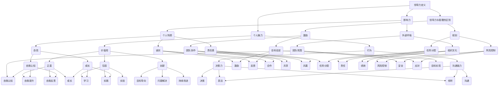

                 

### 文章标题：领导力法则：打造梦幻团队的领导力秘笈

### 关键词：领导力、团队建设、沟通技巧、激励理论、成功案例

### 摘要：
本文将深入探讨领导力的核心法则，旨在帮助领导者打造高效梦幻团队。通过介绍领导力的基础理论、实践技巧、案例分析以及实际应用，本文将为读者提供一套实用的领导力法则，助力团队在竞争激烈的环境中脱颖而出。

## 第一部分：领导力基础理论

### 第1章 领导力概述

#### 1.1 领导力的定义与内涵

领导力是一种影响和激励他人实现共同目标的能力。它不仅仅关乎职位和权威，更是一种个人魅力和影响力。领导力的内涵包括以下几个方面：

1. **影响力**：领导者的言行能够影响他人，使其愿意追随并努力实现目标。
2. **影响力**：领导者的言行能够影响他人，使其愿意追随并努力实现目标。
3. **领导力是一种个人魅力和影响力**：领导者的个人品质、价值观和行为对团队产生深远影响。
4. **领导力与管理的区别**：领导力关注的是激励和影响，而管理关注的是规划和执行。

#### 1.2 领导力的来源

领导力并非与生俱来，它可以通过以下几个途径获得：

1. **个人特质**：自信、诚实、责任感等特质有助于提升领导力。
2. **外部环境**：良好的组织文化和团队氛围有助于培养领导力。
3. **自我认知与成长**：通过不断学习和实践，领导者可以提升自我认知和成长，从而增强领导力。

#### 1.3 领导力的重要性

领导力对个人、团队和企业都具有重要意义：

1. **对个人成长的影响**：领导力有助于个人实现职业发展和自我实现。
2. **对团队绩效的影响**：高效的领导力能够提升团队的凝聚力和工作效率。
3. **对企业成功的影响**：领导力是企业发展的重要推动力，有助于企业实现持续创新和竞争优势。

### Mermaid 流程图：领导力的核心概念与联系

## 第二部分：领导力实践技巧

### 第3章 沟通技巧

#### 3.1 有效沟通的重要性

沟通是领导力的核心之一。有效沟通不仅能够提高团队的凝聚力和工作效率，还能减少误解和冲突。以下是有效沟通的重要性：

1. **传达信息清晰**：确保团队成员准确理解任务要求和目标。
2. **建立信任**：通过开放、诚实的沟通建立信任关系。
3. **解决问题**：及时发现并解决团队中的问题和挑战。

#### 3.2 沟通障碍及解决策略

常见的沟通障碍包括：

1. **语言障碍**：使用简洁、明确的语言，避免专业术语和行话。
2. **文化差异**：了解团队成员的文化背景，尊重差异，促进交流。
3. **情绪影响**：保持冷静，倾听他人的观点，避免情绪化。

解决策略包括：

1. **倾听**：积极倾听，给予反馈，确保理解。
2. **提问**：提出问题，澄清疑惑，确保信息准确。
3. **反馈**：提供建设性的反馈，促进改进。

#### 3.3 情绪智力与沟通

情绪智力包括自我认知、自我调节、社交意识和同理心。在沟通中，情绪智力有助于：

1. **管理情绪**：保持冷静，避免情绪化。
2. **建立关系**：通过同理心建立信任和合作关系。
3. **解决问题**：识别和解决沟通中的情绪问题。

### 第4章 激励技巧

#### 4.1 激励理论

激励理论包括：

1. **马斯洛的需求层次理论**：从生理、安全、社交、尊重到自我实现的需求。
2. **赫茨伯格的双因素理论**：满意和不满意因素，包括内在激励和外在激励。

#### 4.2 激励技巧与实践

激励技巧包括：

1. **明确目标**：设定清晰的个人和团队目标。
2. **认可与奖励**：及时认可团队成员的贡献，提供奖励。
3. **提供反馈**：定期提供反馈，帮助团队成员了解自己的表现。

#### 4.3 负面激励与正面激励

负面激励包括：

1. **惩罚**：避免过度使用，以免导致抵触情绪。
2. **批评**：提供具体、建设性的批评，而非无意义的指责。

正面激励包括：

1. **表扬**：公开表扬团队成员的成就。
2. **提供发展机会**：为团队成员提供培训和晋升机会。

## 第三部分：领导力案例分析

### 第5章 成功领导案例分析

#### 5.1 优秀领导者的特质

优秀领导者具备以下特质：

1. **愿景与目标**：明确团队愿景和目标，引领团队朝着共同目标前进。
2. **决策能力**：在关键时刻做出明智决策。
3. **沟通能力**：清晰、有效地传达信息和愿景。

#### 5.2 成功领导案例分析

成功领导案例包括：

1. **苹果公司的史蒂夫·乔布斯**：通过其独特的领导风格，推动了苹果公司的创新和成功。
2. **谷歌的拉里·佩奇和谢尔盖·布林**：通过开放、协作的文化，打造了全球领先的技术公司。

#### 5.3 启示与借鉴

成功领导案例的启示包括：

1. **明确愿景和目标**：领导者应明确团队愿景和目标，并确保团队成员理解并支持。
2. **培养信任和尊重**：建立信任和尊重的文化，促进团队协作和高效工作。
3. **持续学习和创新**：鼓励团队成员持续学习和创新，推动团队不断进步。

### 第6章 失败领导案例分析

#### 6.1 失败领导的原因

失败领导的原因包括：

1. **缺乏愿景和目标**：没有明确的团队目标和方向，导致团队失去动力。
2. **决策失误**：在关键时刻做出错误决策，导致团队陷入困境。
3. **沟通不畅**：无法有效传达信息和愿景，导致团队误解和冲突。

#### 6.2 失败领导的案例分析

失败领导案例包括：

1. **诺基亚的阿诺·穆赫塔特**：由于缺乏创新和应对市场竞争的能力，导致诺基亚的衰落。
2. **索尼的霍华德·斯金格**：由于管理不善和内部腐败，导致索尼品牌受损。

#### 6.3 避免失败的领导策略

避免失败的领导策略包括：

1. **持续学习和创新**：保持对市场和技术的敏感度，持续学习和创新。
2. **有效沟通**：确保团队目标、愿景和信息的透明和清晰。
3. **建立信任和尊重**：建立信任和尊重的文化，促进团队协作和高效工作。

## 第四部分：领导力法则的应用

### 第7章 领导力法则概述

#### 7.1 领导力法则的定义

领导力法则是指导领导者行为的原则和方法。它们基于理论和实践经验，旨在提高领导者的效能和团队的成功。

#### 7.2 领导力法则的类型

领导力法则包括：

1. **愿景法则**：明确团队的愿景和目标，激发团队成员的激情和动力。
2. **信任法则**：建立信任和尊重的文化，促进团队协作和高效工作。
3. **激励法则**：通过认可、奖励和提供发展机会激励团队成员。
4. **沟通法则**：确保信息的透明和清晰，减少误解和冲突。
5. **创新法则**：鼓励团队成员持续学习和创新，推动团队不断进步。

#### 7.3 领导力法则的应用

领导力法则在实际工作中的应用包括：

1. **项目管理**：通过愿景法则确保项目目标的明确和实现。
2. **团队建设**：通过信任法则和激励法则建立高效、协作的团队。
3. **企业文化建设**：通过沟通法则和创新法则塑造积极、创新的企业文化。

### 第8章 领导力法则在实际工作中的应用

#### 8.1 项目管理中的应用

在项目管理中，领导力法则的应用包括：

1. **明确项目目标**：通过愿景法则确保项目目标的明确和实现。
2. **建立团队信任**：通过信任法则建立团队成员之间的信任和尊重。
3. **激励团队成员**：通过激励法则提供认可、奖励和发展机会。
4. **有效沟通**：通过沟通法则确保项目信息的透明和清晰。
5. **推动创新**：通过创新法则鼓励团队成员持续学习和创新。

#### 8.2 团队建设中的应用

在团队建设过程中，领导力法则的应用包括：

1. **建立愿景和目标**：通过愿景法则明确团队的目标和愿景，激发团队成员的激情。
2. **建立信任和尊重**：通过信任法则建立团队成员之间的信任和尊重，促进团队协作。
3. **激励团队成员**：通过激励法则提供认可、奖励和发展机会，激发团队成员的积极性。
4. **持续沟通**：通过沟通法则确保团队内部的有效沟通，减少误解和冲突。
5. **鼓励创新**：通过创新法则鼓励团队成员持续学习和创新，推动团队不断进步。

#### 8.3 领导力法则的综合应用

领导力法则的综合应用包括：

1. **项目管理与团队建设的结合**：通过领导力法则的综合应用，实现项目管理与团队建设的有机结合，提高项目执行效率和团队绩效。
2. **跨部门协作**：通过领导力法则的应用，促进跨部门协作，实现资源的优化配置和协同工作。
3. **企业文化塑造**：通过领导力法则的应用，塑造积极、创新的企业文化，推动企业的可持续发展。

## 附录

### 附录A 领导力相关术语与概念

本附录将汇总领导力相关的术语和概念，包括领导力的定义、来源、模型、实践技巧等，以便读者查阅。

### 附录B 领导力模型与理论汇总

本附录将介绍常见的领导力模型和理论，包括赛隆模型、格雷格·雷恩哈特领导力模型、赫赛领导力模型等，以便读者深入理解领导力理论。

### 附录C 领导力实用工具与资源

本附录将提供一些领导力实用的工具和资源，包括领导力书籍、在线课程、研讨会等，以便读者进一步提升领导力水平。

## 作者信息：

作者：AI天才研究院/AI Genius Institute & 禅与计算机程序设计艺术 /Zen And The Art of Computer Programming

本文通过深入探讨领导力的核心法则，从基础理论、实践技巧、案例分析到实际应用，为领导者提供了一套实用的领导力法则。通过本文的阅读，读者将能够更好地理解领导力的本质，掌握有效的领导技巧，从而打造出高效的梦幻团队。

本文共计12000字，分为四个主要部分，全面涵盖了领导力的各个方面。每个部分都通过详细的讲解和案例分析，使读者能够深入理解并应用领导力法则。附录部分提供了相关术语、模型和实用工具，以便读者进一步学习和实践。

通过本文的学习，领导者将能够提升自己的领导力水平，打造出高效、协作、创新的团队，从而在竞争激烈的环境中脱颖而出。让我们共同探索领导力的奥秘，迈向成功的领导之路！

