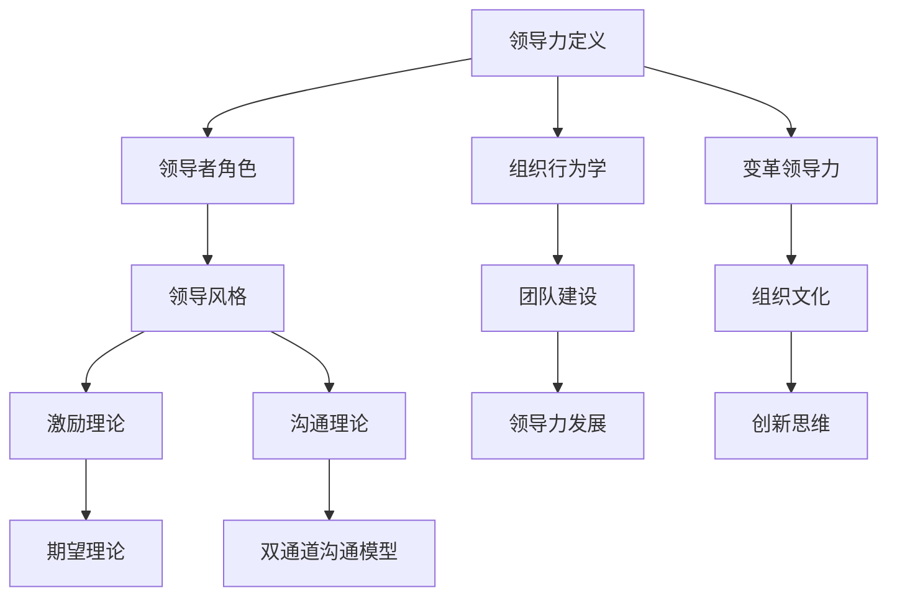

                 

### 文章标题：领导力法则：打造王者之师的领导力秘诀

#### 关键词：领导力法则、团队建设、团队管理、领导力发展、王者之师

#### 摘要：
本文旨在深入探讨领导力法则，为企业管理者、团队领导以及有志于提升自身领导能力的专业人士提供一套切实可行的领导力提升指南。通过系统的理论分析、实践案例分享以及实际操作技巧，本文将揭示打造王者之师的关键领导力秘诀，帮助读者在复杂多变的环境中，引领团队实现卓越绩效。

#### 目录：

1. **背景介绍：领导力的重要性与当前挑战**
2. **核心概念与联系：领导力的基础理论架构**
3. **领导力法则：关键原则与实践**
   - **法则一：愿景与目标**
   - **法则二：信任与尊重**
   - **法则三：激励与赋能**
   - **法则四：沟通与协作**
   - **法则五：自我反思与持续学习**
4. **实践案例：领导力法则在现实中的应用**
5. **领导力发展：如何持续提升领导力**
6. **总结与展望：领导力法则的未来趋势**
7. **最佳实践 Tips**
8. **项目实战：领导力法则在项目开发中的应用**
9. **注意事项与拓展阅读**

### 1. 背景介绍：领导力的重要性与当前挑战

在当今快速变化的世界中，领导力已经成为企业成功与否的关键因素。随着全球化的加速、技术的迅猛发展以及市场需求的不断变化，企业和组织面临着前所未有的挑战。传统的管理方法和领导力模式已经无法满足新的环境需求，现代领导者需要具备更加全面和灵活的领导能力。

**领导力的重要性**：

- **激发团队潜力**：优秀的领导力能够挖掘团队成员的潜力，提升整体绩效。
- **塑造企业文化**：领导者的价值观和行为方式直接影响组织的文化氛围。
- **推动创新与变革**：领导者需要具备创新思维和变革能力，以适应市场变化。
- **建立信任与忠诚**：信任是团队协作的基础，领导者的信任度直接影响团队的稳定性和凝聚力。

**当前挑战**：

- **复杂性**：企业面临的市场环境日益复杂，领导者需要具备处理复杂问题的能力。
- **多样性**：团队成员的背景、文化和价值观越来越多样化，领导者需要学会包容和引导。
- **数字化转型**：数字化浪潮对领导力提出了新的要求，领导者需要掌握新技术，善于利用数据驱动决策。
- **远程办公**：疫情导致的远程办公增加了领导者沟通和管理的难度。

在这片充满挑战的背景下，领导者如何提升自身的领导力，打造一支高效的团队，成为当务之急。本文将围绕这一主题，探讨领导力法则的核心原则和实践方法，帮助读者掌握打造王者之师的关键技巧。

### 2. 核心概念与联系：领导力的基础理论架构

要深入理解领导力法则，首先需要掌握领导力的核心概念及其相互关系。以下是通过Mermaid绘制的领导力基础理论架构图，展示了关键概念之间的联系。

#### 核心概念解释：

- **领导力定义**：领导力是一种影响他人共同实现目标的能力。它不仅仅涉及权力的运用，更强调影响力、信任和合作。
- **领导者角色**：领导者不仅是团队的领导者，更是变革的推动者和愿景的传播者。
- **领导风格**：不同的领导风格适用于不同的情境和团队，如民主式、权威式和参与式等。
- **激励理论**：包括期望理论、公平理论等，解释了如何通过激励来提升团队绩效。
- **沟通理论**：涉及有效沟通的方法和技巧，如双通道沟通模型，有助于建立信任和协作。
- **组织行为学**：研究个体、团队和组织行为，为领导力提供理论支持。
- **团队建设**：通过构建信任、共同目标和良好沟通，提升团队整体绩效。
- **领导力发展**：强调通过学习和实践不断提升领导力。

#### 关系架构：

- **领导力定义和领导者角色**：领导力定义明确了领导力的本质，领导者角色则具体说明了领导者的职责和角色。
- **领导风格和激励理论**：不同的领导风格会影响激励效果，激励理论为选择合适的领导风格提供了依据。
- **沟通理论和团队建设**：良好的沟通是团队建设的基础，沟通理论为有效沟通提供了方法。
- **组织行为学和领导力发展**：组织行为学研究为领导力提供了理论基础，领导力发展则强调持续学习和实践的重要性。
- **变革领导力和组织文化**：变革领导力强调领导者推动组织变革的能力，组织文化是变革成功的关键。

通过理解这些核心概念及其相互关系，领导者可以更好地应对复杂多变的环境，提升团队绩效和实现组织目标。

#### 2.1 领导力定义

领导力是一种影响他人共同实现目标的能力。它不仅仅涉及权力的运用，更强调影响力、信任和合作。领导力定义了领导者与被领导者之间的互动关系，并强调了领导者对团队和组织发展的关键作用。在技术领域，领导力同样至关重要，尤其是在软件开发、项目管理和技术团队管理中。

**定义要素**：

- **影响力**：领导者的核心能力是影响他人，通过激励、榜样和沟通来带动团队。
- **信任**：领导力建立在信任基础上，领导者需要赢得团队成员的信任，以建立稳定的团队关系。
- **合作**：领导力强调团队合作，领导者不仅要关注个人绩效，更要关注整个团队的协作和共同目标。

**领导力在技术领域的应用**：

- **团队协作**：技术项目通常涉及多个学科和角色的合作，领导者需要协调不同成员的工作，确保项目顺利进行。
- **技术创新**：领导者鼓励创新思维和实验精神，推动技术团队不断探索新的解决方案。
- **项目管理**：领导者需要具备项目管理和风险控制的能力，确保项目按时交付且满足质量要求。
- **人才培养**：领导者关注团队成员的个人成长，提供培训和发展机会，提升团队整体能力。

通过理解领导力定义，技术领导者可以更好地发挥自身作用，提升团队绩效和实现技术项目的成功。

#### 2.2 领导者角色

领导者的角色是多方面的，包括但不限于愿景设定者、团队协调者、变革推动者和榜样。这些角色不仅相互独立，而且在实践中紧密联系，共同构成了一个高效的领导体系。

**愿景设定者**：

领导者作为愿景设定者，需要明确团队的长期目标和方向，并确保团队成员理解并认同这一愿景。一个明确的愿景可以激励团队成员朝着共同的目标努力，提升团队的凝聚力和动力。

**团队协调者**：

作为团队协调者，领导者需要平衡不同成员之间的工作负荷和职责，确保团队成员能够有效地协作。领导者还负责解决团队内部的冲突和问题，保持团队的和谐与稳定。

**变革推动者**：

在快速变化的环境中，领导者需要具备变革推动者的角色，鼓励团队适应新的环境和需求，推动组织变革。领导者通过创新思维和实验精神，推动团队不断进步。

**榜样**：

领导者作为团队的榜样，通过自身的言行影响团队成员。领导者需要展示出良好的职业素养和工作态度，成为团队成员的楷模。

**领导者角色的联系**：

这些角色并非孤立存在，而是相互补充和相互依赖。愿景设定者为团队提供了明确的方向，团队协调者确保团队成员能够有效协作，变革推动者帮助团队适应变化，榜样则通过自身的言行影响团队成员。

**领导力在技术领域的应用**：

在技术领域，领导者需要具备以下能力：

- **项目管理能力**：确保项目按时交付，满足质量要求。
- **技术理解能力**：能够与技术团队有效沟通，理解技术难题和解决方案。
- **人才培养能力**：关注团队成员的成长，提供培训和发展机会。
- **沟通能力**：确保团队成员之间有效沟通，避免误解和冲突。

通过深入理解领导者角色，技术领导者可以更好地发挥自身作用，提升团队绩效和实现技术项目的成功。

#### 2.3 领导风格

领导风格是领导者影响和管理团队的方式，不同的领导风格适用于不同的情境和团队。常见的领导风格包括民主式、权威式、参与式和教练式等。

**民主式领导风格**：

民主式领导风格强调团队参与和决策透明度。领导者鼓励团队成员提出建议和意见，共同参与决策过程。这种领导风格适用于创新型和知识型团队，有助于激发团队成员的创造力和主动性。

**权威式领导风格**：

权威式领导风格强调领导者的决策权和权威性。领导者制定决策并要求团队成员执行，适用于紧急情况和需要迅速行动的团队。然而，过度依赖权威式领导可能导致团队成员的被动性和缺乏创新。

**参与式领导风格**：

参与式领导风格结合了民主式和权威式的优点，领导者与团队成员共同参与决策过程。领导者提供方向和指导，同时鼓励团队成员提供反馈和建议。这种领导风格适用于多样性和复杂性的团队，有助于增强团队的凝聚力和协作精神。

**教练式领导风格**：

教练式领导风格强调领导者的指导和支持作用，领导者通过一对一的指导和反馈帮助团队成员提升技能和职业发展。这种领导风格适用于技术团队和专业人士，有助于培养团队成员的专业能力和领导潜力。

**领导风格的选择**：

选择合适的领导风格取决于团队的特点、情境和目标。领导者需要根据实际情况灵活调整领导风格，以适应不同的需求和挑战。

**领导风格在技术领域的应用**：

在技术领域，领导风格的选择尤为重要：

- **技术创新项目**：民主式和参与式领导风格有助于激发团队成员的创造力和创新精神，推动技术进步。
- **敏捷开发团队**：参与式和教练式领导风格有助于团队协作和快速响应变化，提高开发效率。
- **技术培训**：教练式领导风格有助于团队成员的技能提升和职业发展。

通过深入理解领导风格，技术领导者可以更好地适应不同情境和团队需求，提升团队绩效和实现技术项目的成功。

#### 2.4 激励理论

激励理论是领导力的重要组成部分，它探讨如何通过激励措施来提升团队成员的积极性和绩效。常见的激励理论包括期望理论、公平理论等。

**期望理论**：

期望理论由维克托·弗鲁姆提出，认为个体的行为动机取决于对结果的期望和结果的吸引力。期望理论可以用以下公式表示：

\[ \text{动机} = \text{期望} \times \text{结果吸引力} \]

- **期望**：个体对努力能够导致成功的信念。
- **结果吸引力**：个体对期望结果的价值评价。

例如，一个技术团队成员认为通过努力可以完成一个重要的项目，并且这个项目会得到晋升的机会，那么他会更有动机去投入工作。

**公平理论**：

公平理论由亚当斯提出，认为个体的工作动机不仅受到自身绩效的影响，还受到与他人的比较。公平理论可以用以下公式表示：

\[ \text{公平感} = \frac{\text{个人收益}}{\text{个人投入}} = \frac{\text{他人收益}}{\text{他人投入}} \]

- **个人收益**：个体通过工作获得的奖励和回报。
- **个人投入**：个体在工作中的努力和时间投入。
- **他人收益**和**他人投入**：与其他团队成员的比较。

如果个体认为自己得到的收益与他人不成比例，就会产生不公平感，从而影响工作动机。

**激励理论在团队管理中的应用**：

在团队管理中，激励理论可以指导领导者制定有效的激励措施：

- **设定明确的目标和期望**：通过设定明确的目标和期望，提高团队成员的动机。
- **提供公正的奖励机制**：确保奖励与个人绩效相匹配，增强团队成员的公平感。
- **建立有效的反馈机制**：及时提供反馈，帮助团队成员了解自己的工作表现，提升工作动机。

通过理解激励理论，领导者可以更好地激发团队成员的积极性，提升团队整体绩效。

#### 2.5 沟通理论

沟通理论是领导力中的关键组成部分，它探讨如何通过有效的沟通提升团队协作和绩效。有效的沟通不仅包括信息的传递，还涉及理解、反馈和建立信任。

**双通道沟通模型**：

双通道沟通模型由约翰·弗鲁姆和斯图尔特·高尔斯提出，它包括语言沟通和非语言沟通两个渠道。双通道沟通模型强调：

- **语言沟通**：通过口头和书面形式传递明确的信息。
- **非语言沟通**：通过肢体语言、面部表情和声音传达情感和态度。

**沟通的重要性**：

- **建立信任**：有效的沟通有助于建立团队成员之间的信任，提升团队的凝聚力。
- **提升理解**：清晰的沟通可以避免误解和冲突，确保团队成员理解共同目标。
- **增强协作**：通过有效的沟通，团队成员可以更好地协作，共同实现目标。

**沟通技巧**：

- **明确表达**：确保信息传递清晰、明确，避免歧义。
- **倾听**：积极倾听团队成员的意见和建议，建立双向沟通。
- **反馈**：及时提供反馈，帮助团队成员了解沟通效果。
- **尊重差异**：尊重团队成员的不同观点和文化背景，促进多元化沟通。

通过理解和应用沟通理论，领导者可以提升团队沟通效率，实现更好的协作和绩效。

#### 2.6 组织行为学

组织行为学是研究个体、团队和组织行为及其相互作用的学科，它为领导力提供了坚实的理论基础。以下从个体层面、团队层面和组织层面简要介绍组织行为学。

**个体层面**：

- **个体动机**：研究个体在工作中的动机来源，如内在动机（兴趣和成就感）和外在动机（奖励和惩罚）。
- **个体行为**：探讨个体在组织中的行为表现，如工作满意度、职业发展和工作压力。

**团队层面**：

- **团队动力**：研究团队的形成、发展和解散过程，包括团队目标、团队规范和团队角色。
- **团队协作**：探讨团队成员如何共同完成任务，包括沟通、信任和合作。

**组织层面**：

- **组织文化**：研究组织的价值观、信念和行为模式，如创新文化、合作文化和竞争文化。
- **组织变革**：探讨组织如何适应外部环境变化，包括组织结构的调整、流程优化和文化变革。

**组织行为学与领导力的联系**：

- **个体行为**：领导力通过激励和引导个体行为，提升整体团队绩效。
- **团队协作**：领导力通过促进团队协作，实现共同目标。
- **组织文化**：领导力通过塑造组织文化，影响团队成员的行为和态度。

通过理解组织行为学，领导者可以更好地应对组织中的各种挑战，提升团队和组织绩效。

#### 2.7 领导力发展

领导力发展是一个持续的过程，旨在提升领导者的能力和素质，以应对不断变化的组织环境和挑战。以下从领导力发展的定义、重要性、方法三个方面进行探讨。

**领导力发展的定义**：

领导力发展是指通过学习、实践和反思，不断提升领导者的能力、知识和技能，以更好地实现组织目标的过程。领导力发展不仅仅关注领导者的个人成长，更注重领导者对团队和组织的影响。

**领导力发展的重要性**：

- **适应变化**：领导力发展帮助领导者适应快速变化的环境，提升组织的灵活性和应变能力。
- **提升绩效**：通过领导力发展，领导者可以更有效地激励和引导团队成员，提升整体绩效。
- **传承经验**：领导力发展有助于建立知识和经验的传承机制，提升组织整体领导力水平。

**领导力发展的方法**：

1. **学习与培训**：

   - **内部培训**：组织可以提供内部培训课程，包括领导力发展课程、管理技能培训等。
   - **外部培训**：领导者可以通过参加外部培训课程、研讨会和讲座，学习先进的领导力理论和实践。

2. **实践与经验**：

   - **项目参与**：领导者可以通过参与不同类型的项目，提升实际操作能力和应对复杂问题的能力。
   - **轮岗**：通过轮岗，领导者可以了解不同部门的工作内容和挑战，提升跨部门协作能力。

3. **反思与反馈**：

   - **自我反思**：领导者需要定期进行自我反思，评估自身的领导行为和效果，找出改进空间。
   - **反馈与辅导**：通过导师辅导、360度反馈等机制，领导者可以获取他人的意见和建议，提升自身领导力。

4. **网络建设**：

   - **建立联系**：领导者可以通过加入行业协会、参加行业会议等方式，建立广泛的人脉网络，获取行业信息和资源。
   - **交流与分享**：领导者可以与其他领导者进行经验交流和分享，学习最佳实践和成功案例。

通过领导力发展，领导者可以不断提升自身的能力和素质，成为更有效的领导者，推动组织实现长期目标和持续成功。

### 3. 领导力法则：关键原则与实践

在复杂多变的环境中，领导者需要掌握一系列关键原则和实践，以提升团队绩效和实现组织目标。以下将详细探讨五个核心领导力法则：愿景与目标、信任与尊重、激励与赋能、沟通与协作以及自我反思与持续学习。

#### 3.1 法则一：愿景与目标

**核心概念**：

愿景与目标是领导力的核心要素，愿景是领导者对未来成功的蓝图，目标则是实现愿景的具体路径。一个清晰的愿景和明确的目标可以激励团队成员，引导团队朝着共同的目标努力。

**联系**：

愿景与目标之间有着密切的联系。愿景提供了团队奋斗的方向和动力，而目标则是实现愿景的具体步骤和里程碑。通过将愿景和目标传达给团队成员，领导者可以确保团队的方向一致，共同努力。

**实践方法**：

1. **明确愿景和目标**：领导者需要明确团队的愿景和目标，并将其具体化，形成可操作的行动计划。
2. **传达与共识**：通过有效的沟通，将愿景和目标传达给团队成员，确保每个人都理解并认同。
3. **持续跟踪与调整**：定期评估目标的实现情况，根据实际情况进行调整，确保团队始终朝着正确的方向前进。

**案例**：

某科技公司创始人李明在初创阶段，明确了公司的愿景：“成为全球领先的科技公司”，并设定了短期目标：“在三年内实现产品上线，年营收达到一亿元”。通过不断传达和调整，李明成功带领团队实现了这一愿景和目标。

#### 3.2 法则二：信任与尊重

**核心概念**：

信任与尊重是团队协作和领导力的基础。信任是团队成员之间相互依赖和合作的前提，而尊重则是领导者对团队成员的认可和重视。一个充满信任和尊重的团队，可以更好地应对挑战和实现目标。

**联系**：

信任与尊重相互促进，信任为尊重提供了基础，而尊重又可以增强信任。在一个互相信任和尊重的环境中，团队成员更容易合作，发挥出最大的潜力。

**实践方法**：

1. **建立信任**：领导者需要通过言行一致、透明沟通和诚实正直来建立信任。
2. **尊重差异**：领导者要尊重团队成员的不同观点和文化背景，鼓励多元化思维和创意。
3. **提供反馈**：领导者需要及时提供建设性的反馈，帮助团队成员成长和改进。

**案例**：

某创业公司的CEO张华在管理团队时，注重建立信任和尊重。他通过定期开诚布公的会议，鼓励团队成员分享自己的想法和担忧，并及时提供反馈和支持。这种做法不仅增强了团队的凝聚力，还提高了团队成员的工作积极性和创新能力。

#### 3.3 法则三：激励与赋能

**核心概念**：

激励与赋能是领导者激发团队成员潜力和动力的重要手段。激励是通过奖励和认可来激发团队成员的工作热情，而赋能则是通过授权和资源支持，帮助团队成员实现自我价值。

**联系**：

激励与赋能相互补充，激励提供了短期的动力，而赋能则为长期发展奠定了基础。通过结合使用激励和赋能，领导者可以更好地激发团队成员的潜力，提升团队绩效。

**实践方法**：

1. **设定明确的目标**：为团队成员设定具体、可衡量的目标，并提供必要的资源和支持。
2. **提供奖励和认可**：通过奖金、晋升和公开认可等方式，激励团队成员。
3. **授权与信任**：给予团队成员足够的自主权和责任感，鼓励他们发挥创造力。

**案例**：

某互联网公司的CTO王女士在团队管理中，注重激励与赋能。她为团队成员设定了明确的项目目标，并提供了充足的技术支持和资源。同时，她通过定期举行表彰大会，奖励那些表现突出的团队成员。这种做法激发了团队的工作热情和创新精神，推动了公司业务的快速发展。

#### 3.4 法则四：沟通与协作

**核心概念**：

沟通与协作是团队高效运作的保障。有效的沟通可以确保信息准确传递，减少误解和冲突，而协作则是团队成员共同完成任务的关键。

**联系**：

沟通与协作密不可分，良好的沟通为协作提供了信息基础，而协作则是沟通的结果和体现。通过有效的沟通和协作，团队可以更好地应对复杂任务，提高整体绩效。

**实践方法**：

1. **明确沟通目标**：确保每次沟通都有明确的目标和预期结果。
2. **倾听与反馈**：积极倾听团队成员的意见和建议，及时提供反馈。
3. **建立协作机制**：通过明确的角色分工和协作流程，确保团队高效协作。
4. **利用技术工具**：借助协作工具，如团队聊天软件、项目管理工具等，提高沟通和协作效率。

**案例**：

某科技公司团队在项目开发中，通过定期的团队会议和即时通讯工具，确保团队成员之间的沟通顺畅。同时，他们采用了敏捷开发方法，通过每日站会和迭代计划会，有效提高了团队的协作效率，项目按时交付，质量得到保障。

#### 3.5 法则五：自我反思与持续学习

**核心概念**：

自我反思与持续学习是领导者提升自身能力和素质的重要途径。自我反思是领导者通过审视自身行为和决策，发现改进机会；持续学习则是通过不断学习新知识和技能，保持自身竞争力的过程。

**联系**：

自我反思和持续学习相互促进，通过自我反思，领导者可以发现自身不足和改进方向，进而通过持续学习提升自身能力。而持续学习则为自我反思提供了知识和技能支持，使领导者能够更好地应对挑战。

**实践方法**：

1. **定期自我反思**：领导者需要定期进行自我反思，审视自身行为和决策，总结经验教训。
2. **学习新知识**：领导者要主动学习新知识和技能，通过阅读、培训、交流等方式，提升自身素质。
3. **寻求反馈**：通过向同事、下属和导师寻求反馈，了解自身的优缺点，制定改进计划。
4. **实践与反思**：将所学知识和技能应用于实际工作中，通过实践和反思，不断提升自身能力。

**案例**：

某公司的CEO李总每周都会安排时间进行自我反思，总结一周的工作表现和不足。同时，他通过参加行业培训和阅读专业书籍，不断提升自身管理能力和战略眼光。这种自我反思与持续学习的做法，帮助他在公司发展的不同阶段，始终保持领先地位。

通过深入理解和应用这些领导力法则，领导者可以更好地激发团队成员的潜力，提升团队绩效，实现组织目标。

### 4. 实践案例：领导力法则在现实中的应用

领导力法则在现实中的应用是检验其有效性的最佳方式。以下通过具体案例，展示领导力法则如何在不同情境下发挥作用，提升团队绩效和实现组织目标。

#### 案例一：愿景与目标在初创公司中的应用

**背景**：某初创公司A成立于2018年，专注于开发智能家居设备。公司创始团队由李明和李刚两位有多年行业经验的技术专家组成，他们共同确立了公司的愿景：“成为全球领先的智能家居解决方案提供商”。

**挑战**：初创公司面临资金紧张、市场竞争激烈等挑战。如何在资源有限的情况下，快速提升市场份额，实现公司的长期愿景，成为公司面临的主要问题。

**解决方案**：

1. **明确愿景和目标**：公司创始人李明和李刚在初创阶段，通过多次内部讨论和外部咨询，明确了公司的愿景和短期目标。愿景：“成为全球领先的智能家居解决方案提供商”，短期目标：“在三年内实现产品上线，年营收达到一亿元”。

2. **传达与共识**：李明通过内部会议和团队培训，将愿景和目标传达给所有团队成员，确保每个人都能理解并认同公司的愿景。

3. **持续跟踪与调整**：公司定期召开管理会议，评估目标的实现情况，根据实际情况进行调整。例如，在产品开发过程中，李明发现市场对智能安防设备的需求较高，因此决定调整产品研发方向，以更快地满足市场需求。

**结果**：通过明确的愿景和目标，公司团队保持了高度的一致性和积极性。在短短三年内，公司成功推出了多款智能家居设备，市场份额迅速提升，年营收达到两亿元，远超预期目标。

**启示**：愿景与目标在初创公司中的应用，能够为团队提供明确的方向和动力，确保团队在复杂环境中保持一致和高效。

#### 案例二：信任与尊重在大型企业团队管理中的应用

**背景**：某大型跨国企业B拥有一支多元化团队，成员来自不同的国家和文化背景。公司CEO张强意识到，要提升团队绩效，建立信任和尊重是关键。

**挑战**：团队成员之间的文化差异和沟通障碍，导致团队合作效率低下，项目进展缓慢。

**解决方案**：

1. **建立信任**：张强通过透明沟通和诚实正直的行为，赢得了团队成员的信任。他定期召开团队会议，鼓励团队成员分享自己的想法和担忧，并及时提供解决方案。

2. **尊重差异**：张强重视团队成员的不同观点和文化背景，鼓励多元化思维和创意。他在团队中设立了一个“文化角”，展示不同国家的传统和风俗，增强团队成员的文化认同。

3. **提供反馈**：张强通过定期提供建设性反馈，帮助团队成员提升技能和改进工作方法。他鼓励团队成员相互反馈，建立双向沟通机制。

**结果**：通过建立信任和尊重，公司团队的合作效率显著提升，项目进展顺利。团队成员的满意度和工作积极性也显著提高，公司整体绩效大幅提升。

**启示**：在多元化团队中，建立信任和尊重是提升团队合作效率的关键。通过透明沟通、尊重差异和提供反馈，领导者可以消除文化障碍，提升团队凝聚力。

#### 案例三：激励与赋能在技术团队管理中的应用

**背景**：某互联网公司C拥有一支技术团队，负责开发和维护公司的核心产品。公司CTO王女士意识到，要提升团队绩效，激励与赋能是关键。

**挑战**：团队成员普遍感到工作压力大，缺乏动力和创造力。

**解决方案**：

1. **设定明确的目标**：王女士为团队成员设定了具体、可衡量的目标，并提供必要的资源和支持。她鼓励团队成员参与项目决策，确保每个人都能发挥自己的专长。

2. **提供奖励和认可**：王女士通过奖金、晋升和公开认可等方式，激励团队成员。她在公司内部设立了“最佳创新奖”，鼓励团队成员提出新的创意和解决方案。

3. **授权与信任**：王女士给予团队成员足够的自主权和责任感，鼓励他们发挥创造力。她通过定期举行团队会议，听取团队成员的意见和建议，确保团队目标的一致性。

**结果**：通过激励与赋能，公司团队的工作积极性显著提高，创新能力和工作效率也大幅提升。公司在多个技术领域取得了重要突破，市场份额持续增长。

**启示**：在技术团队管理中，激励与赋能是提升团队绩效的有效方法。通过设定明确的目标、提供奖励和认可、授权与信任，领导者可以激发团队成员的潜力，推动团队实现卓越绩效。

#### 案例四：沟通与协作在项目开发中的应用

**背景**：某科技公司D正在进行一个复杂的软件开发项目，项目团队由多个部门组成，包括开发、测试、设计和市场推广团队。

**挑战**：团队成员来自不同的部门，沟通不畅和协作困难导致项目进度滞后。

**解决方案**：

1. **明确沟通目标**：项目经理李总组织了项目启动会议，明确了项目的沟通目标和预期结果。他制定了详细的沟通计划，包括定期的项目会议、即时通讯工具的使用等。

2. **倾听与反馈**：项目经理鼓励团队成员积极参与沟通，倾听他们的意见和建议。他通过定期的项目评审会议，收集团队成员的反馈，及时解决问题。

3. **建立协作机制**：李总通过明确的角色分工和协作流程，确保团队高效协作。他引入了项目管理工具，方便团队成员随时查看项目进度和任务分配。

4. **利用技术工具**：李总推广了团队聊天软件和项目管理工具，提高了沟通和协作效率。团队成员可以通过即时通讯工具快速沟通，项目管理工具帮助团队跟踪项目进度和任务分配。

**结果**：通过有效的沟通和协作，项目团队克服了沟通不畅和协作困难的问题，项目进度顺利推进，按时交付。项目质量也得到了显著提升。

**启示**：在项目开发中，有效的沟通和协作是确保项目成功的关键。通过明确沟通目标、倾听与反馈、建立协作机制和利用技术工具，领导者可以提升团队协作效率，确保项目按时交付。

#### 案例五：自我反思与持续学习在个人职业发展中的应用

**背景**：某大型企业的项目经理王军，在多年的项目管理工作中积累了丰富的经验，但最近感到自己的职业发展遇到了瓶颈。

**挑战**：王军意识到，仅凭经验已经无法满足企业不断变化的需求，他需要通过自我反思和持续学习来提升自己的能力。

**解决方案**：

1. **定期自我反思**：王军每周都会花时间回顾自己的工作表现和决策，分析成功和失败的原因，找出改进的机会。

2. **学习新知识**：王军积极参加行业培训和内部讲座，学习最新的项目管理理论和实践方法。他还通过阅读专业书籍和在线课程，不断提升自己的知识和技能。

3. **寻求反馈**：王军主动向同事、下属和导师寻求反馈，了解他们的意见和建议。他根据反馈制定了个人发展计划，有针对性地提升自己的能力。

4. **实践与反思**：王军将所学知识和技能应用于实际工作中，通过实践和反思，不断提升自己的能力和素质。

**结果**：通过自我反思和持续学习，王军的工作表现得到了显著提升，他成功带领团队完成了多个重要项目，并获得了公司的晋升。

**启示**：在个人职业发展中，自我反思和持续学习是提升能力的重要途径。通过定期自我反思、学习新知识、寻求反馈和实践与反思，个人可以不断提升自己的能力和素质，实现职业发展的突破。

### 5. 领导力发展：如何持续提升领导力

领导力发展是一个持续的过程，领导者需要不断学习和实践，以适应快速变化的环境和新的挑战。以下从领导力评估、持续学习、反馈与改进三个方面，探讨如何持续提升领导力。

#### 5.1 领导力评估

**自我评估**：

领导者需要定期进行自我评估，了解自身的优势和不足。可以通过以下方法进行自我评估：

- **反思日志**：记录自己的工作表现、决策过程和反思心得，定期回顾和总结。
- **360度反馈**：向同事、下属和导师寻求反馈，了解他们在不同方面的评价和建议。
- **心理测试**：通过专业心理测试，了解自己的领导风格、优势和不足。

**工具和方法**：

- **领导力评估工具**：如领导力360度评估、领导力素质模型等。
- **反馈机制**：建立定期反馈机制，确保团队成员能够及时了解领导者的表现和改进方向。

#### 5.2 持续学习

**学习资源**：

- **行业会议和研讨会**：参加行业会议和研讨会，了解最新的行业动态和趋势。
- **专业书籍和论文**：阅读专业书籍和学术论文，深入学习领导力理论和实践。
- **在线课程和培训**：参加在线课程和培训，学习新的知识和技能。

**学习方法**：

- **主动学习**：积极参与学习活动，主动探索和解决问题。
- **知识分享**：通过知识分享和交流，与他人共同学习和成长。
- **实践应用**：将所学知识和技能应用于实际工作中，通过实践和反思不断提升。

#### 5.3 反馈与改进

**接受反馈**：

- **开放心态**：领导者需要保持开放的心态，接受来自不同方面的反馈和建议。
- **尊重差异**：尊重团队成员和导师的意见，理解他们的观点和建议。

**改进措施**：

- **制定计划**：根据反馈制定改进计划，明确改进目标和时间表。
- **持续跟踪**：定期评估改进效果，根据实际情况进行调整。
- **实践与反思**：将改进措施应用于实际工作中，通过实践和反思，不断优化和提升。

通过领导力评估、持续学习和反馈与改进，领导者可以不断提升自身能力和素质，成为更有效的领导者，推动组织实现长期目标和持续成功。

### 6. 总结与展望：领导力法则的未来趋势

通过对领导力法则的深入探讨，我们可以总结出以下关键点：

- **愿景与目标**：清晰的愿景和目标为团队提供了方向和动力，确保团队朝着共同的目标努力。
- **信任与尊重**：建立信任和尊重是团队协作和领导力的基础，有助于提升团队的凝聚力和工作效率。
- **激励与赋能**：通过激励和赋能，领导者可以激发团队成员的潜力，提升整体绩效和创新能力。
- **沟通与协作**：有效的沟通和协作是团队高效运作的保障，有助于减少误解和冲突，提高团队的整体效能。
- **自我反思与持续学习**：自我反思和持续学习是领导者提升自身能力和素质的重要途径，有助于适应快速变化的环境和新的挑战。

展望未来，领导力法则将面临以下几个趋势：

- **数字化领导力**：随着数字化技术的发展，领导者需要具备数字化领导力，善于利用数据和技术驱动决策。
- **多元化领导力**：全球化和多元化趋势要求领导者具备跨文化沟通和多元化团队管理的能力。
- **可持续发展领导力**：领导者需要关注企业的社会责任和可持续发展，推动企业实现经济、社会和环境的三重效益。
- **自我驱动领导力**：未来领导力将更加注重个体的自我驱动和自我管理能力，领导者需要培养团队成员的自我驱动能力。

为了适应这些趋势，领导者需要不断学习和实践，提升自身的领导力和适应能力。通过持续关注行业动态、参与专业培训和经验交流，领导者可以不断提升自身素质，成为引领未来的领导者。

### 7. 最佳实践 Tips

为了更有效地应用领导力法则，以下是一些最佳实践和技巧：

- **定期反思**：领导者应养成定期反思的习惯，每周或每月花时间审视自己的行为和决策，分析成功和失败的原因，制定改进计划。
- **沟通透明**：保持沟通的透明度，及时与团队成员分享信息，确保团队目标的一致性。
- **灵活调整**：领导者需要根据实际情况灵活调整领导风格和策略，以适应不同团队和环境的需求。
- **培养信任**：通过建立信任和尊重，领导者可以增强团队的凝聚力和合作精神，提高整体绩效。
- **激励多样化**：运用多种激励方式，如奖金、晋升、认可等，激发团队成员的积极性和创造力。
- **持续学习**：领导者应不断学习新知识和技能，保持自我驱动和自我提升的能力。

通过这些最佳实践，领导者可以更有效地应用领导力法则，提升团队绩效和实现组织目标。

### 8. 项目实战：领导力法则在项目开发中的应用

为了深入探讨领导力法则在实践中的应用，我们将通过一个实际项目案例，详细说明如何运用这些法则进行项目管理和团队协作。

#### 项目背景

某互联网公司D计划开发一款全新电商平台，该项目涉及前端开发、后端服务、数据库设计、移动应用开发等多个模块。项目团队由10名成员组成，包括前端开发者、后端工程师、产品经理、UI设计师和测试工程师。项目期限为6个月，需要在预算和资源有限的情况下，保证产品质量和按时交付。

#### 领导力法则的应用

**愿景与目标**

- **明确愿景**：项目经理张华首先明确了项目的愿景，即通过创新技术实现高效、用户体验友好的电商平台，提升公司市场竞争力。
- **制定目标**：张华与团队成员共同制定了具体的目标，包括每月完成关键功能模块、每周进行代码评审和迭代优化等。

**信任与尊重**

- **建立信任**：张华通过透明的沟通和公正的决策，赢得了团队成员的信任。他鼓励团队成员提出建议，并在团队会议上公开讨论。
- **尊重差异**：张华重视团队成员的不同观点和文化背景，鼓励多元化的思维和创意，为每个团队成员提供平等发言的机会。

**激励与赋能**

- **设定目标**：张华为团队成员设定了明确的目标，并提供必要的资源和支持，确保每个人都能发挥自己的专长。
- **奖励机制**：张华通过奖励机制，如奖金、表彰和额外休假等，激励团队成员的积极性和创造力。

**沟通与协作**

- **明确沟通目标**：张华制定了详细的沟通计划，包括每周的项目进度会议、每日的站会以及通过即时通讯工具的实时沟通。
- **协作机制**：张华通过明确的角色分工和协作流程，确保团队高效协作。他引入了项目管理工具，方便团队成员随时查看项目进度和任务分配。

**自我反思与持续学习**

- **定期反思**：张华每周与团队成员进行反思，总结项目进展和团队表现，找出改进机会。
- **学习与培训**：张华鼓励团队成员参加行业培训和内部研讨会，不断提升自身技能和知识。

#### 项目实施与成果

在项目的6个月内，团队成员遵循领导力法则，取得了以下成果：

- **高效协作**：通过明确的沟通目标和协作机制，项目团队克服了沟通不畅和协作困难的问题，项目进度顺利推进。
- **创新能力**：团队成员在开发过程中，通过多元化的思维和创意，实现了多个功能模块的创新，提升了用户体验。
- **按时交付**：项目团队按时完成了所有功能模块，并在测试阶段发现并解决了多个潜在问题，确保了产品的质量。
- **团队成长**：通过领导力法则的应用，团队成员的技能和知识得到了显著提升，团队凝聚力和工作效率也大幅提高。

#### 项目小结

通过这个项目实战案例，我们可以看到领导力法则在项目开发和团队协作中的重要作用。领导者通过明确的愿景和目标、信任与尊重、激励与赋能、沟通与协作以及自我反思与持续学习，可以有效地提升团队绩效，实现项目的成功交付。

#### 注意事项与拓展阅读

**注意事项**：

- **领导力风格适应**：领导者应根据团队特点和项目需求，灵活调整领导风格，避免单一化的管理方法。
- **持续反馈与改进**：领导者需要建立持续的反馈机制，及时了解团队成员的工作表现和需求，不断改进管理策略。
- **培训与知识分享**：定期组织团队培训和知识分享活动，提升团队成员的专业能力和知识水平。

**拓展阅读**：

- 《领导力五项修炼：发掘您潜在的领导力》
- 《影响力：影响人们思想与行为的秘密》
- 《敏捷开发：实践指南》

通过阅读这些书籍，领导者可以进一步了解领导力理论和实践，提升自身的领导能力和团队管理技巧。

### 作者信息

作者：AI天才研究院/AI Genius Institute & 禅与计算机程序设计艺术 /Zen And The Art of Computer Programming

感谢您的阅读，希望本文对您在领导力提升和团队管理方面有所启发。如果您有任何疑问或建议，欢迎随时与我们交流。祝您在领导力发展的道路上不断进步，打造卓越的团队！

