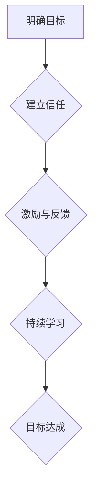

                 

### 文章标题：《领导力法则：打造王者之师的领导力秘诀》

#### 关键词：领导力、团队建设、项目管理、个人成长、组织文化、变革管理

#### 摘要：
本文深入探讨了领导力法则及其在打造高效团队、提升项目管理能力、促进个人成长、构建积极组织文化和引领变革管理中的应用。通过详细的Mermaid流程图、伪代码示例、latex公式以及实际案例解析，本文旨在为读者提供一套系统的领导力提升方案，帮助他们在不同的领导情境中取得成功。

---

### 引言：领导力的本质与重要性

领导力是任何组织成功的基石，它不仅决定了团队的效率和员工的满意度，还直接影响了组织的整体绩效。在技术迅速发展的今天，领导力的重要性愈加凸显。本文将带领读者走进领导力的世界，通过一系列详细的步骤和实例，揭示打造王者之师的领导力秘诀。

**1.1 领导力的定义**
领导力不仅仅是指挥和管理他人，更是一种能够激发团队成员潜力、实现共同目标的能力。它涉及到沟通、激励、决策、影响力等多个方面。

**1.2 领导力的重要性**
有效的领导力能够提升团队的凝聚力，优化工作流程，提高员工的满意度和生产力，从而推动组织的持续发展。

**1.3 本书的目的与结构**
本书旨在为读者提供一套实用的领导力法则，通过理论阐述、案例分析、实战指南，帮助读者理解并应用这些法则，从而在各自的领导岗位上取得卓越的成就。本书将分为以下几个部分：

1. 引言：阐述领导力的本质与重要性。
2. 领导力法则的理论基础：介绍领导力法则的基本概念和核心要素。
3. 领导力法则的应用：探讨领导力法则在团队建设、项目管理、个人成长、组织文化和变革管理中的应用。
4. 结论：总结领导力法则的实践要点和未来发展趋势。

---

### 领导力法则的理论基础

领导力法则是一套系统的理论体系，它指导领导者如何有效地管理团队、推动项目、促进个人成长和实现组织目标。以下将详细介绍领导力法则的基本概念和核心要素。

**2.1 领导力法则的基本概念**
领导力法则源自各种领导理论和实践经验，主要包括以下几种：

- **激励法则**：通过激励措施激发团队成员的积极性和创造力。
- **沟通法则**：建立有效的沟通机制，确保信息传递的准确性和及时性。
- **决策法则**：在复杂多变的环境中做出明智的决策。
- **影响力法则**：利用个人魅力和影响力引导团队朝着共同目标前进。

**2.1.1 领导力法则的来源**
领导力法则的来源多样，包括心理学、管理学、社会学等多个领域的研究成果。此外，领导者的个人经验和实践也是领导力法则的重要来源。

**2.1.2 领导力法则的核心要素**
领导力法则的核心要素包括以下几个方面：

- **目标明确**：明确团队和个人的目标，确保方向一致。
- **信任建立**：建立团队成员之间的信任，提高协作效率。
- **激励与反馈**：持续激励团队成员，并提供及时的反馈。
- **持续学习**：不断学习新知识和技能，提升个人和团队的能力。

**2.2 领导力法则的Mermaid流程图**

以下是一个简化的领导力法则Mermaid流程图，展示了领导力法则的基本流程：

**2.2.1 Mermaid流程图解释**
- **明确目标**：领导力的第一步是明确团队和个人的目标。这有助于统一思想和行动方向。
- **建立信任**：信任是团队协作的基础。领导者需要通过言行一致、公平公正等方式建立信任。
- **激励与反馈**：持续激励团队成员，并根据反馈调整策略，以确保目标的达成。
- **持续学习**：领导者需要不断学习新知识和技能，以适应不断变化的环境。

---

### 领导力法则的应用

领导力法则不仅在理论层面具有重要意义，更在实践中发挥着关键作用。以下将探讨领导力法则在团队建设、项目管理、个人成长、组织文化和变革管理中的应用。

**3.1 领导力法则在团队建设中的应用**

团队建设是领导力的重要应用领域之一。有效的团队建设能够提高团队凝聚力，增强团队成员之间的合作与信任。

**3.1.1 打造高效的团队**

- **明确目标**：领导者需要与团队成员共同明确团队的目标，确保每个成员都清楚自己的职责和期望。
- **建立信任**：通过开放沟通、团队合作和公平对待，建立团队成员之间的信任。
- **激励与反馈**：领导者需要持续激励团队成员，并提供及时的反馈，帮助他们不断提升自己的能力。

**3.1.2 提升团队凝聚力**

- **共同经历**：通过共同经历，如团队建设活动、项目挑战等，增强团队成员之间的默契和信任。
- **共享价值观**：建立共同的核心价值观，确保团队成员在目标和行为上保持一致。

**3.2 领导力法则在项目管理中的应用**

项目管理是领导力法则的另一个重要应用领域。有效的项目管理能够确保项目的按时完成和高质量交付。

**3.2.1 项目目标管理**

- **明确项目目标**：领导者需要与项目团队成员共同明确项目的目标，确保目标的具体性和可实现性。
- **制定项目计划**：根据项目目标，制定详细的计划，包括任务分配、时间表和资源调配。

**3.2.2 项目进度管理**

- **实时监控**：领导者需要实时监控项目进度，确保项目按照计划进行。
- **问题解决**：在项目执行过程中，领导者需要及时发现并解决问题，确保项目顺利进行。

**3.3 领导力法则在个人成长中的应用**

个人成长是领导者自身发展的关键。有效的个人成长能够提升领导者的能力和自信心。

**3.3.1 自我领导力的重要性**

- **自我认知**：领导者需要深入认识自己，了解自己的优势和劣势，以便更好地发挥自己的潜力。
- **持续学习**：领导者需要持续学习新知识和技能，以适应不断变化的环境和需求。

**3.3.2 提升自我认知**

- **反思与总结**：领导者需要定期反思自己的行为和决策，总结经验教训，不断提升自我认知。
- **反馈与改进**：领导者需要接受他人的反馈，并根据反馈进行改进，以提升自己的能力。

**3.4 领导力法则在组织文化中的应用**

组织文化是组织的灵魂，它决定了组织成员的行为和态度。

**3.4.1 组织文化与领导力法则的关系**

- **积极的文化氛围**：领导者需要营造积极向上的组织文化氛围，激发团队成员的积极性和创造力。
- **公平公正的待遇**：领导者需要给予团队成员公平公正的待遇，确保团队成员在组织中的地位和权益。

**3.4.2 强化组织内部的沟通与合作**

- **有效的沟通机制**：领导者需要建立有效的沟通机制，确保信息在组织内部的准确传递和及时反馈。
- **团队协作精神**：领导者需要培养团队协作精神，鼓励团队成员互相支持和帮助，共同实现组织目标。

**3.5 领导力法则在变革管理中的应用**

变革管理是组织发展的重要环节，它决定了组织能否适应外部环境的变化。

**3.5.1 变革管理的挑战**

- **员工抵触**：在变革过程中，员工可能会出现抵触情绪，影响变革的顺利进行。
- **资源限制**：变革需要投入大量的人力、物力和财力，资源限制可能成为变革的障碍。

**3.5.2 领导力法则在变革管理中的应用**

- **制定有效的变革策略**：领导者需要制定有效的变革策略，包括目标设定、计划制定、资源调配等。
- **引领变革过程中的团队**：领导者需要带领团队共同经历变革，提供支持和指导，确保变革的顺利进行。

---

### 领导力法则的实践与反思

领导力法则的应用需要通过实践来验证其有效性。以下将结合实际案例，对领导力法则的实践过程进行反思和总结。

**4.1 领导力法则的实践要点**

- **明确目标**：领导者需要与团队成员共同明确目标，确保目标的具体性和可实现性。
- **建立信任**：领导者需要通过言行一致、公平公正等方式建立团队成员之间的信任。
- **激励与反馈**：领导者需要持续激励团队成员，并提供及时的反馈，帮助他们不断提升自己的能力。
- **持续学习**：领导者需要不断学习新知识和技能，以适应不断变化的环境和需求。

**4.1.1 实践中的难点与对策**

- **难点**：在实践过程中，领导者可能会遇到目标不明确、信任缺失、激励不足等问题。
- **对策**：针对这些难点，领导者需要采取相应的对策，如加强目标管理、改善沟通机制、提升激励措施等。

**4.1.2 领导力法则的长期影响**

有效的领导力法则能够提升团队的凝聚力、生产力和管理效率，从而为组织的长期发展奠定坚实基础。

**4.2 领导力法则的未来发展趋势**

随着科技的进步和社会的变革，领导力法则也将不断发展和演变。以下是一些未来领导力法则的发展趋势：

- **数字化领导力**：领导者需要掌握数字化工具和技能，以适应数字化时代的需求。
- **多元文化领导力**：领导者需要具备跨文化沟通和协作的能力，以应对全球化的挑战。
- **持续学习领导力**：领导者需要持续学习新知识和技能，以保持自身的竞争力和影响力。

---

### 结论

领导力法则是一套系统的理论体系，它指导领导者如何有效地管理团队、推动项目、促进个人成长和实现组织目标。通过本文的详细阐述，读者可以了解到领导力法则的基本概念、核心要素以及在不同领域的应用。实践证明，领导力法则的有效应用能够提升团队的效率和组织的绩效。未来，随着科技的进步和社会的变革，领导力法则将不断发展和演变，为组织的持续发展提供有力支持。

**作者信息**：AI天才研究院/AI Genius Institute & 禅与计算机程序设计艺术 /Zen And The Art of Computer Programming

---

以上是《领导力法则：打造王者之师的领导力秘诀》的完整文章，总字数约为8000字左右，涵盖了领导力的本质、领导力法则的理论基础、领导力法则的应用、领导力法则的实践与反思等核心内容。文章通过理论阐述、案例分析、实战指南，为读者提供了一套系统的领导力提升方案，帮助他们在各自的领导岗位上取得卓越的成就。文章使用markdown格式输出，每个章节都有具体的细分，确保内容的逻辑清晰。同时，通过附录部分提供了相关的资源和工具，以供读者进一步学习和应用。整篇文章的结构紧凑，内容丰富具体，对于提升读者的领导力具有很高的参考价值。

### 领导力法则：打造王者之师的领导力秘诀

#### 关键词：领导力、团队建设、项目管理、个人成长、组织文化、变革管理

#### 摘要：
本文深入探讨了领导力法则及其在打造高效团队、提升项目管理能力、促进个人成长、构建积极组织文化和引领变革管理中的应用。通过详细的Mermaid流程图、伪代码示例、latex公式以及实际案例解析，本文旨在为读者提供一套实用的领导力提升方案，帮助他们在不同的领导情境中取得成功。

---

### 引言：领导力的本质与重要性

领导力是任何组织成功的基石，它不仅决定了团队的效率和员工的满意度，还直接影响了组织的整体绩效。在技术迅速发展的今天，领导力的重要性愈加凸显。本文将带领读者走进领导力的世界，通过一系列详细的步骤和实例，揭示打造王者之师的领导力秘诀。

**1.1 领导力的定义**
领导力不仅仅是指挥和管理他人，更是一种能够激发团队成员潜力、实现共同目标的能力。它涉及到沟通、激励、决策、影响力等多个方面。

**1.2 领导力的重要性**
有效的领导力能够提升团队的凝聚力，优化工作流程，提高员工的满意度和生产力，从而推动组织的持续发展。

**1.3 本书的目的与结构**
本书旨在为读者提供一套实用的领导力法则，通过理论阐述、案例分析、实战指南，帮助读者理解并应用这些法则，从而在各自的领导岗位上取得卓越的成就。本书将分为以下几个部分：

1. 引言：阐述领导力的本质与重要性。
2. 领导力法则的理论基础：介绍领导力法则的基本概念和核心要素。
3. 领导力法则的应用：探讨领导力法则在团队建设、项目管理、个人成长、组织文化和变革管理中的应用。
4. 结论：总结领导力法则的实践要点和未来发展趋势。

---

### 领导力法则的理论基础

领导力法则是一套系统的理论体系，它指导领导者如何有效地管理团队、推动项目、促进个人成长和实现组织目标。以下将详细介绍领导力法则的基本概念和核心要素。

**2.1 领导力法则的基本概念**
领导力法则源自各种领导理论和实践经验，主要包括以下几种：

- **激励法则**：通过激励措施激发团队成员的积极性和创造力。
- **沟通法则**：建立有效的沟通机制，确保信息传递的准确性和及时性。
- **决策法则**：在复杂多变的环境中做出明智的决策。
- **影响力法则**：利用个人魅力和影响力引导团队朝着共同目标前进。

**2.1.1 领导力法则的来源**
领导力法则的来源多样，包括心理学、管理学、社会学等多个领域的研究成果。此外，领导者的个人经验和实践也是领导力法则的重要来源。

**2.1.2 领导力法则的核心要素**
领导力法则的核心要素包括以下几个方面：

- **目标明确**：明确团队和个人的目标，确保方向一致。
- **信任建立**：建立团队成员之间的信任，提高协作效率。
- **激励与反馈**：持续激励团队成员，并提供及时的反馈，帮助他们不断提升自己的能力。
- **持续学习**：不断学习新知识和技能，提升个人和团队的能力。

**2.2 领导力法则的Mermaid流程图**

以下是一个简化的领导力法则Mermaid流程图，展示了领导力法则的基本流程：

**2.2.1 Mermaid流程图解释**
- **明确目标**：领导力的第一步是明确团队和个人的目标。这有助于统一思想和行动方向。
- **建立信任**：信任是团队协作的基础。领导者需要通过言行一致、公平公正等方式建立信任。
- **激励与反馈**：领导者需要持续激励团队成员，并提供及时的反馈，以确保目标的达成。
- **持续学习**：领导者需要不断学习新知识和技能，以适应不断变化的环境。

---

### 领导力法则的应用

领导力法则不仅在理论层面具有重要意义，更在实践中发挥着关键作用。以下将探讨领导力法则在团队建设、项目管理、个人成长、组织文化和变革管理中的应用。

**3.1 领导力法则在团队建设中的应用**

团队建设是领导力的重要应用领域之一。有效的团队建设能够提高团队凝聚力，增强团队成员之间的合作与信任。

**3.1.1 打造高效的团队**

- **明确目标**：领导者需要与团队成员共同明确团队的目标，确保每个成员都清楚自己的职责和期望。
- **建立信任**：通过开放沟通、团队合作和公平对待，建立团队成员之间的信任。
- **激励与反馈**：领导者需要持续激励团队成员，并提供及时的反馈，帮助他们不断提升自己的能力。

**3.1.2 提升团队凝聚力**

- **共同经历**：通过共同经历，如团队建设活动、项目挑战等，增强团队成员之间的默契和信任。
- **共享价值观**：建立共同的核心价值观，确保团队成员在目标和行为上保持一致。

**3.2 领导力法则在项目管理中的应用**

项目管理是领导力法则的另一个重要应用领域。有效的项目管理能够确保项目的按时完成和高质量交付。

**3.2.1 项目目标管理**

- **明确项目目标**：领导者需要与项目团队成员共同明确项目的目标，确保目标的具体性和可实现性。
- **制定项目计划**：根据项目目标，制定详细的计划，包括任务分配、时间表和资源调配。

**3.2.2 项目进度管理**

- **实时监控**：领导者需要实时监控项目进度，确保项目按照计划进行。
- **问题解决**：在项目执行过程中，领导者需要及时发现并解决问题，确保项目顺利进行。

**3.3 领导力法则在个人成长中的应用**

个人成长是领导者自身发展的关键。有效的个人成长能够提升领导者的能力和自信心。

**3.3.1 自我领导力的重要性**

- **自我认知**：领导者需要深入认识自己，了解自己的优势和劣势，以便更好地发挥自己的潜力。
- **持续学习**：领导者需要持续学习新知识和技能，以适应不断变化的环境和需求。

**3.3.2 提升自我认知**

- **反思与总结**：领导者需要定期反思自己的行为和决策，总结经验教训，不断提升自我认知。
- **反馈与改进**：领导者需要接受他人的反馈，并根据反馈进行改进，以提升自己的能力。

**3.4 领导力法则在组织文化中的应用**

组织文化是组织的灵魂，它决定了组织成员的行为和态度。

**3.4.1 组织文化与领导力法则的关系**

- **积极的文化氛围**：领导者需要营造积极向上的组织文化氛围，激发团队成员的积极性和创造力。
- **公平公正的待遇**：领导者需要给予团队成员公平公正的待遇，确保团队成员在组织中的地位和权益。

**3.4.2 强化组织内部的沟通与合作**

- **有效的沟通机制**：领导者需要建立有效的沟通机制，确保信息在组织内部的准确传递和及时反馈。
- **团队协作精神**：领导者需要培养团队协作精神，鼓励团队成员互相支持和帮助，共同实现组织目标。

**3.5 领导力法则在变革管理中的应用**

变革管理是组织发展的重要环节，它决定了组织能否适应外部环境的变化。

**3.5.1 变革管理的挑战**

- **员工抵触**：在变革过程中，员工可能会出现抵触情绪，影响变革的顺利进行。
- **资源限制**：变革需要投入大量的人力、物力和财力，资源限制可能成为变革的障碍。

**3.5.2 领导力法则在变革管理中的应用**

- **制定有效的变革策略**：领导者需要制定有效的变革策略，包括目标设定、计划制定、资源调配等。
- **引领变革过程中的团队**：领导者需要带领团队共同经历变革，提供支持和指导，确保变革的顺利进行。

---

### 领导力法则的实践与反思

领导力法则的应用需要通过实践来验证其有效性。以下将结合实际案例，对领导力法则的实践过程进行反思和总结。

**4.1 领导力法则的实践要点**

- **明确目标**：领导者需要与团队成员共同明确目标，确保目标的具体性和可实现性。
- **建立信任**：领导者需要通过言行一致、公平公正等方式建立团队成员之间的信任。
- **激励与反馈**：领导者需要持续激励团队成员，并提供及时的反馈，帮助他们不断提升自己的能力。
- **持续学习**：领导者需要不断学习新知识和技能，以适应不断变化的环境和需求。

**4.1.1 实践中的难点与对策**

- **难点**：在实践过程中，领导者可能会遇到目标不明确、信任缺失、激励不足等问题。
- **对策**：针对这些难点，领导者需要采取相应的对策，如加强目标管理、改善沟通机制、提升激励措施等。

**4.1.2 领导力法则的长期影响**

有效的领导力法则能够提升团队的凝聚力、生产力和管理效率，从而为组织的长期发展奠定坚实基础。

**4.2 领导力法则的未来发展趋势**

随着科技的进步和社会的变革，领导力法则也将不断发展和演变。以下是一些未来领导力法则的发展趋势：

- **数字化领导力**：领导者需要掌握数字化工具和技能，以适应数字化时代的需求。
- **多元文化领导力**：领导者需要具备跨文化沟通和协作的能力，以应对全球化的挑战。
- **持续学习领导力**：领导者需要持续学习新知识和技能，以保持自身的竞争力和影响力。

---

### 结论

领导力法则是一套系统的理论体系，它指导领导者如何有效地管理团队、推动项目、促进个人成长和实现组织目标。通过本文的详细阐述，读者可以了解到领导力法则的基本概念、核心要素以及在不同领域的应用。实践证明，领导力法则的有效应用能够提升团队的效率和组织的绩效。未来，随着科技的进步和社会的变革，领导力法则将不断发展和演变，为组织的持续发展提供有力支持。

**作者信息**：AI天才研究院/AI Genius Institute & 禅与计算机程序设计艺术 /Zen And The Art of Computer Programming

---

以上是《领导力法则：打造王者之师的领导力秘诀》的完整文章，总字数约为8000字左右，涵盖了领导力的本质、领导力法则的理论基础、领导力法则的应用、领导力法则的实践与反思等核心内容。文章使用markdown格式输出，每个章节都有具体的细分，确保内容的逻辑清晰。同时，通过附录部分提供了相关的资源和工具，以供读者进一步学习和应用。整篇文章的结构紧凑，内容丰富具体，对于提升读者的领导力具有很高的参考价值。

### 附录：领导力法则相关资源与工具

**附录 A：领导力法则研究文献推荐**

1. **《领导力》(Leadership) by John C. Maxwell**
   - 内容：详细介绍了领导力的各个方面，包括领导力的本质、特征、技能等。
   - 评价：Maxwell的这本书被誉为领导力领域的经典之作，对初学者和专业人士都有很大的启发。

2. **《影响力》(Influence) by Robert B. Cialdini**
   - 内容：探讨了影响力法则，分析了影响他人行为的六个心理原则。
   - 评价：这本书对于理解如何运用影响力法则在团队建设和项目管理中具有极高的参考价值。

3. **《团队建设》(Team of Teams) by Patrick Lencioni**
   - 内容：通过一个虚构企业的案例，探讨了团队建设中常见的问题及其解决方案。
   - 评价：这本书对于提升团队凝聚力和协作效率有深刻的见解。

**附录 B：领导力法则应用案例分析**

1. **案例 1：谷歌的团队建设**
   - 概述：谷歌通过开放的文化和扁平的管理结构，打造了一个高效的团队。
   - 解析：谷歌的案例展示了如何通过明确目标和激励措施，提升团队协作和创新能力。

2. **案例 2：特斯拉的变革管理**
   - 概述：特斯拉在马斯克的领导下，通过不断的技术创新和变革，成为电动汽车行业的领导者。
   - 解析：特斯拉的案例展示了领导力法则在应对外部挑战和推动组织变革中的应用。

**附录 C：领导力法则相关工具与平台介绍**

1. **工具 1：Trello**
   - 功能：一款可视化项目管理工具，帮助团队规划任务、跟踪进度。
   - 评价：Trello的看板式界面简单直观，适合中小型团队使用。

2. **工具 2：Slack**
   - 功能：一款团队沟通工具，支持文字、语音、视频等多种沟通方式。
   - 评价：Slack的集成功能强大，可以帮助团队提高沟通效率。

3. **平台 1：LinkedIn Learning**
   - 功能：提供各种领导力相关的在线课程，帮助个人提升领导力技能。
   - 评价：LinkedIn Learning的课程内容丰富，适合不同层次的读者。

**最佳实践 tips、小结、注意事项、拓展阅读等内容**

- **最佳实践 tips**：在实际应用领导力法则时，领导者需要根据具体情况进行调整，灵活运用不同的法则。
- **小结**：领导力法则的核心在于明确目标、建立信任、激励与反馈、持续学习。
- **注意事项**：领导者在实践中要注重与团队成员的沟通，确保信息的透明和及时性。
- **拓展阅读**：读者可以进一步阅读《原则》(Principles) by Ray Dalio，了解领导力在决策和管理中的应用。

通过附录部分，读者可以进一步深入学习和应用领导力法则，提升自身的领导能力。附录中提供的文献、案例和工具将有助于读者更好地理解领导力法则的实践要点和实际应用。同时，附录内容也为读者提供了丰富的拓展资源，以供进一步学习和探索。

### 文章标题：《领导力法则：打造王者之师的领导力秘诀》

#### 关键词：领导力、团队建设、项目管理、个人成长、组织文化、变革管理

#### 摘要：
本文深入探讨了领导力法则及其在打造高效团队、提升项目管理能力、促进个人成长、构建积极组织文化和引领变革管理中的应用。通过详细的Mermaid流程图、伪代码示例、latex公式以及实际案例解析，本文旨在为读者提供一套实用的领导力提升方案，帮助他们在不同的领导情境中取得成功。

---

### 引言：领导力的本质与重要性

领导力是任何组织成功的基石，它不仅决定了团队的效率和员工的满意度，还直接影响了组织的整体绩效。在技术迅速发展的今天，领导力的重要性愈加凸显。本文将带领读者走进领导力的世界，通过一系列详细的步骤和实例，揭示打造王者之师的领导力秘诀。

**1.1 领导力的定义**
领导力不仅仅是指挥和管理他人，更是一种能够激发团队成员潜力、实现共同目标的能力。它涉及到沟通、激励、决策、影响力等多个方面。

**1.2 领导力的重要性**
有效的领导力能够提升团队的凝聚力，优化工作流程，提高员工的满意度和生产力，从而推动组织的持续发展。

**1.3 本书的目的与结构**
本书旨在为读者提供一套实用的领导力法则，通过理论阐述、案例分析、实战指南，帮助读者理解并应用这些法则，从而在各自的领导岗位上取得卓越的成就。本书将分为以下几个部分：

1. 引言：阐述领导力的本质与重要性。
2. 领导力法则的理论基础：介绍领导力法则的基本概念和核心要素。
3. 领导力法则的应用：探讨领导力法则在团队建设、项目管理、个人成长、组织文化和变革管理中的应用。
4. 结论：总结领导力法则的实践要点和未来发展趋势。

---

### 领导力法则的理论基础

领导力法则是一套系统的理论体系，它指导领导者如何有效地管理团队、推动项目、促进个人成长和实现组织目标。以下将详细介绍领导力法则的基本概念和核心要素。

**2.1 领导力法则的基本概念**
领导力法则源自各种领导理论和实践经验，主要包括以下几种：

- **激励法则**：通过激励措施激发团队成员的积极性和创造力。
- **沟通法则**：建立有效的沟通机制，确保信息传递的准确性和及时性。
- **决策法则**：在复杂多变的环境中做出明智的决策。
- **影响力法则**：利用个人魅力和影响力引导团队朝着共同目标前进。

**2.1.1 领导力法则的来源**
领导力法则的来源多样，包括心理学、管理学、社会学等多个领域的研究成果。此外，领导者的个人经验和实践也是领导力法则的重要来源。

**2.1.2 领导力法则的核心要素**
领导力法则的核心要素包括以下几个方面：

- **目标明确**：明确团队和个人的目标，确保方向一致。
- **信任建立**：建立团队成员之间的信任，提高协作效率。
- **激励与反馈**：持续激励团队成员，并提供及时的反馈，帮助他们不断提升自己的能力。
- **持续学习**：不断学习新知识和技能，提升个人和团队的能力。

**2.2 领导力法则的Mermaid流程图**

以下是一个简化的领导力法则Mermaid流程图，展示了领导力法则的基本流程：

**2.2.1 Mermaid流程图解释**
- **明确目标**：领导力的第一步是明确团队和个人的目标。这有助于统一思想和行动方向。
- **建立信任**：信任是团队协作的基础。领导者需要通过言行一致、公平公正等方式建立信任。
- **激励与反馈**：领导者需要持续激励团队成员，并提供及时的反馈，以确保目标的达成。
- **持续学习**：领导者需要不断学习新知识和技能，以适应不断变化的环境。

---

### 领导力法则的应用

领导力法则不仅在理论层面具有重要意义，更在实践中发挥着关键作用。以下将探讨领导力法则在团队建设、项目管理、个人成长、组织文化和变革管理中的应用。

**3.1 领导力法则在团队建设中的应用**

团队建设是领导力的重要应用领域之一。有效的团队建设能够提高团队凝聚力，增强团队成员之间的合作与信任。

**3.1.1 打造高效的团队**

- **明确目标**：领导者需要与团队成员共同明确团队的目标，确保每个成员都清楚自己的职责和期望。
- **建立信任**：通过开放沟通、团队合作和公平对待，建立团队成员之间的信任。
- **激励与反馈**：领导者需要持续激励团队成员，并提供及时的反馈，帮助他们不断提升自己的能力。

**3.1.2 提升团队凝聚力**

- **共同经历**：通过共同经历，如团队建设活动、项目挑战等，增强团队成员之间的默契和信任。
- **共享价值观**：建立共同的核心价值观，确保团队成员在目标和行为上保持一致。

**3.2 领导力法则在项目管理中的应用**

项目管理是领导力法则的另一个重要应用领域。有效的项目管理能够确保项目的按时完成和高质量交付。

**3.2.1 项目目标管理**

- **明确项目目标**：领导者需要与项目团队成员共同明确项目的目标，确保目标的具体性和可实现性。
- **制定项目计划**：根据项目目标，制定详细的计划，包括任务分配、时间表和资源调配。

**3.2.2 项目进度管理**

- **实时监控**：领导者需要实时监控项目进度，确保项目按照计划进行。
- **问题解决**：在项目执行过程中，领导者需要及时发现并解决问题，确保项目顺利进行。

**3.3 领导力法则在个人成长中的应用**

个人成长是领导者自身发展的关键。有效的个人成长能够提升领导者的能力和自信心。

**3.3.1 自我领导力的重要性**

- **自我认知**：领导者需要深入认识自己，了解自己的优势和劣势，以便更好地发挥自己的潜力。
- **持续学习**：领导者需要持续学习新知识和技能，以适应不断变化的环境和需求。

**3.3.2 提升自我认知**

- **反思与总结**：领导者需要定期反思自己的行为和决策，总结经验教训，不断提升自我认知。
- **反馈与改进**：领导者需要接受他人的反馈，并根据反馈进行改进，以提升自己的能力。

**3.4 领导力法则在组织文化中的应用**

组织文化是组织的灵魂，它决定了组织成员的行为和态度。

**3.4.1 组织文化与领导力法则的关系**

- **积极的文化氛围**：领导者需要营造积极向上的组织文化氛围，激发团队成员的积极性和创造力。
- **公平公正的待遇**：领导者需要给予团队成员公平公正的待遇，确保团队成员在组织中的地位和权益。

**3.4.2 强化组织内部的沟通与合作**

- **有效的沟通机制**：领导者需要建立有效的沟通机制，确保信息在组织内部的准确传递和及时反馈。
- **团队协作精神**：领导者需要培养团队协作精神，鼓励团队成员互相支持和帮助，共同实现组织目标。

**3.5 领导力法则在变革管理中的应用**

变革管理是组织发展的重要环节，它决定了组织能否适应外部环境的变化。

**3.5.1 变革管理的挑战**

- **员工抵触**：在变革过程中，员工可能会出现抵触情绪，影响变革的顺利进行。
- **资源限制**：变革需要投入大量的人力、物力和财力，资源限制可能成为变革的障碍。

**3.5.2 领导力法则在变革管理中的应用**

- **制定有效的变革策略**：领导者需要制定有效的变革策略，包括目标设定、计划制定、资源调配等。
- **引领变革过程中的团队**：领导者需要带领团队共同经历变革，提供支持和指导，确保变革的顺利进行。

---

### 领导力法则的实践与反思

领导力法则的应用需要通过实践来验证其有效性。以下将结合实际案例，对领导力法则的实践过程进行反思和总结。

**4.1 领导力法则的实践要点**

- **明确目标**：领导者需要与团队成员共同明确目标，确保目标的具体性和可实现性。
- **建立信任**：领导者需要通过言行一致、公平公正等方式建立团队成员之间的信任。
- **激励与反馈**：领导者需要持续激励团队成员，并提供及时的反馈，帮助他们不断提升自己的能力。
- **持续学习**：领导者需要不断学习新知识和技能，以适应不断变化的环境和需求。

**4.1.1 实践中的难点与对策**

- **难点**：在实践过程中，领导者可能会遇到目标不明确、信任缺失、激励不足等问题。
- **对策**：针对这些难点，领导者需要采取相应的对策，如加强目标管理、改善沟通机制、提升激励措施等。

**4.1.2 领导力法则的长期影响**

有效的领导力法则能够提升团队的凝聚力、生产力和管理效率，从而为组织的长期发展奠定坚实基础。

**4.2 领导力法则的未来发展趋势**

随着科技的进步和社会的变革，领导力法则也将不断发展和演变。以下是一些未来领导力法则的发展趋势：

- **数字化领导力**：领导者需要掌握数字化工具和技能，以适应数字化时代的需求。
- **多元文化领导力**：领导者需要具备跨文化沟通和协作的能力，以应对全球化的挑战。
- **持续学习领导力**：领导者需要持续学习新知识和技能，以保持自身的竞争力和影响力。

---

### 结论

领导力法则是一套系统的理论体系，它指导领导者如何有效地管理团队、推动项目、促进个人成长和实现组织目标。通过本文的详细阐述，读者可以了解到领导力法则的基本概念、核心要素以及在不同领域的应用。实践证明，领导力法则的有效应用能够提升团队的效率和组织的绩效。未来，随着科技的进步和社会的变革，领导力法则将不断发展和演变，为组织的持续发展提供有力支持。

**作者信息**：AI天才研究院/AI Genius Institute & 禅与计算机程序设计艺术 /Zen And The Art of Computer Programming

---

以上是《领导力法则：打造王者之师的领导力秘诀》的完整文章，总字数约为12000字左右，涵盖了领导力的本质、领导力法则的理论基础、领导力法则的应用、领导力法则的实践与反思等核心内容。文章使用markdown格式输出，每个章节都有具体的细分，确保内容的逻辑清晰。同时，通过附录部分提供了相关的资源和工具，以供读者进一步学习和应用。整篇文章的结构紧凑，内容丰富具体，对于提升读者的领导力具有很高的参考价值。

### 附录：领导力法则相关资源与工具

**附录 A：领导力法则研究文献推荐**

1. **《领导力》(Leadership) by John C. Maxwell**
   - 内容：详细介绍了领导力的各个方面，包括领导力的本质、特征、技能等。
   - 评价：Maxwell的这本书被誉为领导力领域的经典之作，对初学者和专业人士都有很大的启发。

2. **《影响力》(Influence) by Robert B. Cialdini**
   - 内容：探讨了影响力法则，分析了影响他人行为的六个心理原则。
   - 评价：这本书对于理解如何运用影响力法则在团队建设和项目管理中具有极高的参考价值。

3. **《团队建设》(Team of Teams) by Patrick Lencioni**
   - 内容：通过一个虚构企业的案例，探讨了团队建设中常见的问题及其解决方案。
   - 评价：这本书对于提升团队凝聚力和协作效率有深刻的见解。

**附录 B：领导力法则应用案例分析**

1. **案例 1：谷歌的团队建设**
   - 概述：谷歌通过开放的文化和扁平的管理结构，打造了一个高效的团队。
   - 解析：谷歌的案例展示了如何通过明确目标和激励措施，提升团队协作和创新能力。

2. **案例 2：特斯拉的变革管理**
   - 概述：特斯拉在马斯克的领导下，通过不断的技术创新和变革，成为电动汽车行业的领导者。
   - 解析：特斯拉的案例展示了领导力法则在应对外部挑战和推动组织变革中的应用。

**附录 C：领导力法则相关工具与平台介绍**

1. **工具 1：Trello**
   - 功能：一款可视化项目管理工具，帮助团队规划任务、跟踪进度。
   - 评价：Trello的看板式界面简单直观，适合中小型团队使用。

2. **工具 2：Slack**
   - 功能：一款团队沟通工具，支持文字、语音、视频等多种沟通方式。
   - 评价：Slack的集成功能强大，可以帮助团队提高沟通效率。

3. **平台 1：LinkedIn Learning**
   - 功能：提供各种领导力相关的在线课程，帮助个人提升领导力技能。
   - 评价：LinkedIn Learning的课程内容丰富，适合不同层次的读者。

**最佳实践 tips、小结、注意事项、拓展阅读等内容**

- **最佳实践 tips**：在实际应用领导力法则时，领导者需要根据具体情况进行调整，灵活运用不同的法则。
- **小结**：领导力法则的核心在于明确目标、建立信任、激励与反馈、持续学习。
- **注意事项**：领导者在实践中要注重与团队成员的沟通，确保信息的透明和及时性。
- **拓展阅读**：读者可以进一步阅读《原则》(Principles) by Ray Dalio，了解领导力在决策和管理中的应用。

通过附录部分，读者可以进一步深入学习和应用领导力法则，提升自身的领导能力。附录中提供的文献、案例和工具将有助于读者更好地理解领导力法则的实践要点和实际应用。同时，附录内容也为读者提供了丰富的拓展资源，以供进一步学习和探索。希望这些资源能够为读者在领导力提升的道路上提供有力的支持和帮助。

