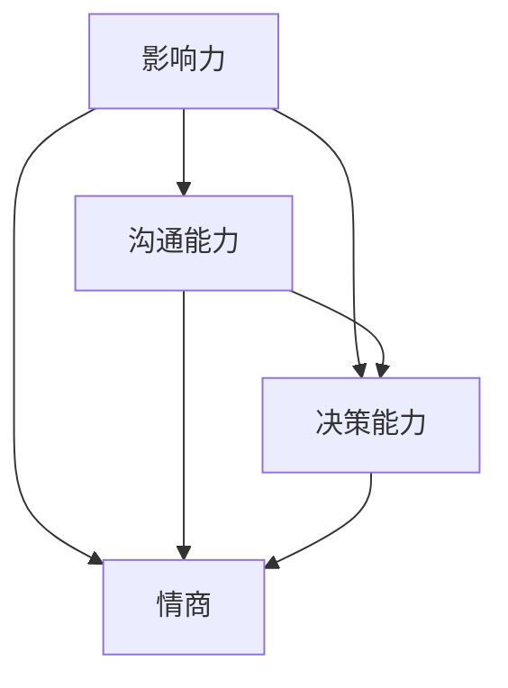
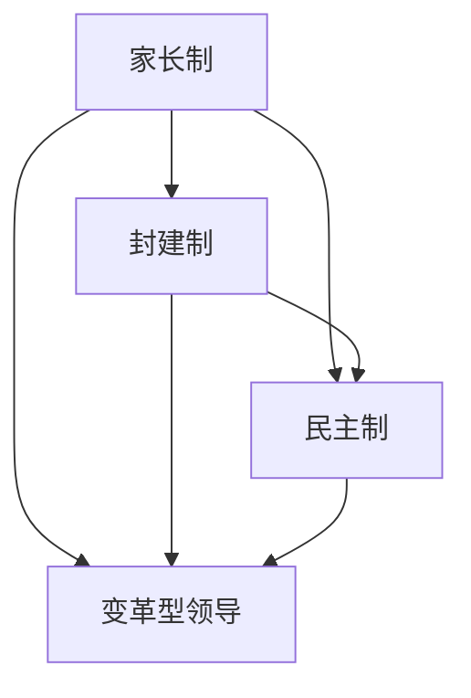
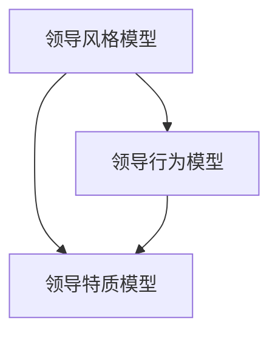

                 


### 文章标题

# 领导力法则：打造王者团队的领导力秘诀

---

关键词：领导力、团队管理、领导力模型、领导力技巧、领导力实践

摘要：本文将深入探讨领导力的核心概念、发展历程、模型、技巧和实践，通过逻辑清晰的分析和实例展示，为读者提供一套实用的领导力法则，助力打造王者团队。

---

### 引言

领导力，作为团队管理和组织成功的关键因素，一直备受关注。从古代帝王将相到现代企业管理者，领导力都是决定团队效率和成果的重要因素。本文旨在深入探讨领导力的核心法则，帮助读者理解并掌握打造王者团队的领导力秘诀。

### 领导力基本概念

首先，我们需要明确领导力的基本概念。领导力并非简单的权力和控制，而是一种影响他人共同达成目标的能力。它包括以下几个关键要素：

1. **影响力**：领导者需要具备足够的影响力，能够引导和激励团队成员。
2. **沟通能力**：有效的沟通是领导力的基础，领导者需要善于表达自己的观点，并倾听他人的意见。
3. **决策能力**：领导者需要在关键时刻做出明智的决策，为团队指明方向。
4. **情商**：领导者需要具备高情商，能够理解并管理自己的情绪，同时理解并影响他人的情绪。

#### 核心概念与联系

以下是一个使用Mermaid绘制的领导力核心概念流程图：



### 领导力发展历程

领导力的发展历程经历了多个阶段。从古代的家长制、封建制，到现代的民主制、变革型领导，每个阶段都有其独特的领导力特点和理念。

- **家长制**：领导者像家长一样管理团队，权力高度集中，决策由上至下。
- **封建制**：领导者依靠地位和资源进行管理，权力和责任相对明确。
- **民主制**：领导者与团队成员共同参与决策，强调平等和协作。
- **变革型领导**：领导者通过变革推动团队发展，鼓励创新和自主性。

#### 核心概念与联系

以下是一个使用Mermaid绘制的领导力发展历程流程图：



### 领导力模型

领导力模型是描述领导力特点和行为模式的理论框架。常见的领导力模型包括：

1. **领导风格模型**：包括权威型、民主型、放任型等。
2. **领导行为模型**：包括任务导向、关系导向等。
3. **领导特质模型**：包括自信、沟通能力、决策能力等。

#### 核心概念与联系

以下是一个使用Mermaid绘制的领导力模型流程图：



### 领导力技巧

掌握领导力技巧是提升领导力的关键。以下是一些实用的领导力技巧：

1. **有效沟通**：清晰、简洁地表达自己的观点，倾听他人的意见。
2. **激励团队**：了解团队成员的需求，提供激励和支持。
3. **决策能力**：在关键时刻做出明智的决策，考虑团队的整体利益。
4. **情商管理**：理解并管理自己的情绪，同时影响他人的情绪。

#### 核心算法原理讲解

以下是一个关于领导力技巧的伪代码示例：

```plaintext
伪代码：领导力技巧实践

function 领导力技巧（领导者，团队）：
    对于每个团队：
        沟通技巧：定期组织会议，分享团队目标和进展
        激励技巧：认可团队成员的贡献，提供奖励和培训
        决策技巧：在团队讨论中，权衡各方意见，做出最佳决策
        情商技巧：关注团队成员的情绪变化，提供心理支持

    如果团队面临挑战：
        沟通技巧：增加沟通频率，确保信息传递准确
        激励技巧：调整奖励机制，激励团队成员克服困难
        决策技巧：寻求外部意见，优化决策方案
        情商技巧：提供心理咨询，缓解团队成员的压力
```

### 领导力实践

领导力实践是领导力理论在现实中的应用。以下是一些领导力实践案例：

1. **项目启动会**：明确项目目标、进度和资源，确保团队成员了解项目要求。
2. **团队建设活动**：增强团队凝聚力，提高团队协作能力。
3. **绩效评估**：定期评估团队成员的表现，提供反馈和发展建议。

#### 项目实战

以下是一个关于领导力实践的Python代码案例：

```python
# Python代码：领导力实践工具

class LeadershipPracticeTool:
    def __init__(self, team_members, project_details):
        self.team_members = team_members
        self.project_details = project_details

    def start_project_meeting(self):
        # 组织项目启动会
        print("项目启动会：")
        print("项目目标：", self.project_details['目标'])
        print("项目进度：", self.project_details['进度'])
        print("项目资源：", self.project_details['资源'])

    def team_building_activity(self):
        # 团队建设活动
        print("团队建设活动：")
        print("活动目标：", "增强团队凝聚力")
        print("活动内容：", "团队游戏、团队讨论")

    def performance_evaluation(self):
        # 绩效评估
        print("绩效评估：")
        for member in self.team_members:
            print(f"{member['姓名']}的表现：{member['表现']}")

# 实例化工具类，并调用方法
tool = LeadershipPracticeTool(team_members, project_details)
tool.start_project_meeting()
tool.team_building_activity()
tool.performance_evaluation()
```

#### 实际案例分析和详细讲解剖析

以下是一个关于领导力实践的实际案例：

- **案例背景**：一家初创公司正在开发一款新产品，需要组建一个跨部门团队进行项目开发。
- **领导力实践**：
  - **项目启动会**：领导者组织项目启动会，明确项目目标、进度和资源，确保团队成员了解项目要求。
  - **团队建设活动**：领导者组织团队建设活动，增强团队凝聚力，提高团队协作能力。
  - **绩效评估**：领导者定期评估团队成员的表现，提供反馈和发展建议。

#### 项目小结

通过本次领导力实践，团队成功完成了产品开发，取得了显著成果。领导者通过有效的沟通、激励、决策和情商管理，提升了团队的整体绩效，为公司的成功奠定了基础。

### 最佳实践 tips

1. **明确目标**：确保团队成员明确项目目标，有助于提高团队协作效率。
2. **及时反馈**：及时给予团队成员反馈，帮助他们认识到自己的优势和改进方向。
3. **关注团队成员需求**：了解并满足团队成员的需求，有助于提高团队凝聚力。
4. **鼓励创新**：鼓励团队成员提出创新想法，激发团队活力。

### 小结

本文深入探讨了领导力的核心概念、发展历程、模型、技巧和实践，通过逻辑清晰的分析和实例展示，为读者提供了一套实用的领导力法则。掌握这些法则，有助于打造王者团队，实现组织目标。

### 注意事项

1. 领导力并非一蹴而就，需要长期积累和实践。
2. 针对不同团队成员，采用不同的领导力技巧，确保团队整体效益最大化。
3. 注重团队沟通，确保信息传递准确，减少误解和冲突。

### 拓展阅读

1. 《领导力的五大定律》
2. 《如何成为优秀的领导者》
3. 《变革型领导》

---

作者：AI天才研究院/AI Genius Institute & 禅与计算机程序设计艺术 /Zen And The Art of Computer Programming

