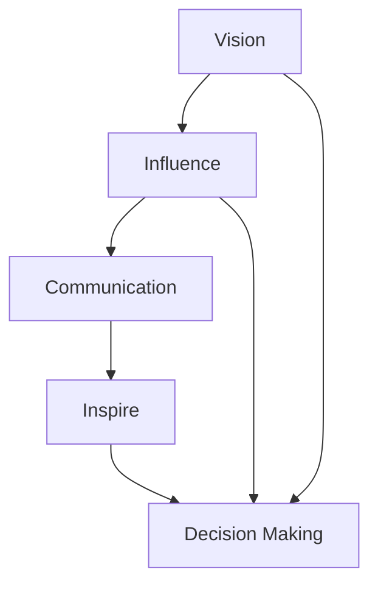

                 

### 文章标题

# 《领导力法则：打造超级团队的领导力秘笈》

### 关键词

- 领导力
- 团队建设
- 沟通技巧
- 决策与问题解决
- 员工激励
- 组织文化

### 摘要

本文深入探讨领导力的核心法则，旨在为读者提供打造超级团队的实用指南。通过分析领导力的定义、发展历程、核心要素，本文将逐步揭示领导风格、团队建设、沟通技巧、决策与问题解决、员工激励和组织文化等方面的关键原理和实践策略。文章还结合实际案例，提供可操作的领导力发展资源和工具，帮助读者在复杂多变的环境中，有效提升领导力，实现团队卓越表现。

---

## 引言：领导力的时代背景与重要性

在当今快速变化的时代，领导力的重要性愈加凸显。无论是在企业、政府机构还是非营利组织，领导力都是推动组织发展、应对挑战、实现目标的核心动力。本文旨在为读者提供一套系统化的领导力法则，帮助他们在各自的领域中打造超级团队，实现卓越的领导效果。

### 领导力的定义

领导力并非仅仅是职位赋予的权利，而是一种能力，是影响和激励他人共同实现目标的过程。领导力不仅仅与职位相关，更与个人的品格、行为和影响力紧密相连。一个优秀的领导者不仅能够指引团队前进，还能激发团队成员的潜能，共同创造卓越的成果。

### 领导力的发展历程

领导力的发展历程经历了多个阶段，从传统的权力集中式领导到现代的参与式领导，再到当前的变革型领导和变革型领导。每一个阶段都反映了领导理论的发展和领导实践的变革。

- **传统领导**：强调权威和命令式管理，领导者的角色是下达指令和控制过程。
- **现代领导**：关注团队合作和民主管理，鼓励成员参与决策，提高团队整体效能。
- **变革型领导**：领导者不仅仅是管理者，更是变革的推动者，通过激发团队成员的积极性和创造力，引领组织实现持续变革和成长。

### 领导力的核心要素

领导力的核心要素包括愿景、影响力、沟通、激励和决策。这些要素相互关联，共同构成了领导者不可或缺的能力。

- **愿景**：领导者需要具备清晰的愿景，能够描绘未来的美好蓝图，并引导团队为之努力。
- **影响力**：领导者通过自身的言行和魅力，影响和激励团队成员，形成共同的价值观和行为准则。
- **沟通**：有效的沟通是领导力的关键，领导者需要能够清晰地表达自己的想法，并倾听团队成员的意见和建议。
- **激励**：领导者通过激励措施，激发团队成员的内在动力，实现个人与团队的目标。
- **决策**：领导者需要具备果断的决策能力，在复杂多变的环境中做出明智的选择。

### 领导力的作用

领导力在组织中的作用至关重要。一个优秀的领导者能够：

- **提升团队效能**：通过有效的领导，提升团队的协作能力和执行力，实现组织的战略目标。
- **推动组织变革**：在变化迅速的市场环境中，领导者需要具备变革思维，推动组织不断适应和变革。
- **建立积极文化**：领导者通过自身的行为，塑造积极的组织文化，激发员工的创新和敬业精神。
- **提升个人影响力**：优秀的领导力不仅对团队有益，还能提升领导者个人的品牌和影响力。

综上所述，领导力是推动组织成功的关键因素。通过深入理解领导力的定义、发展历程和核心要素，领导者可以更好地发挥自身的作用，打造卓越的团队，实现组织的长远发展。

## 第1章 领导力的基础理论

领导力的基础理论是理解和应用领导力的基石。本章将深入探讨领导力的定义、核心概念及其相互关系，并通过Mermaid流程图展示这些概念之间的结构关系。

### 1.1 领导力的定义

领导力是一种能力，它涉及对他人和资源的影响、激励和引导，以实现共同的目标。领导力不仅与职位和权力相关，还与个人品格、价值观和行为方式密切相关。一个成功的领导者不仅仅是拥有权威，更重要的是能够通过自己的行为和决策，激发和带领团队向更高目标迈进。

### 1.2 核心概念

领导力的核心概念包括愿景、影响力、沟通、激励和决策。以下是这些概念的定义及其相互关系：

- **愿景**：领导者需要具备清晰的愿景，能够描绘未来的蓝图，并激励团队成员为之努力。愿景不仅是领导者的个人愿景，更是团队和组织的共同愿景。
- **影响力**：领导者通过自身的言行和魅力，影响和激励团队成员，形成共同的价值观和行为准则。影响力是领导力的重要组成部分，也是领导者能否成功的关键因素。
- **沟通**：有效的沟通是领导力的关键，领导者需要能够清晰地表达自己的想法，并倾听团队成员的意见和建议。良好的沟通有助于建立信任和协作，提高团队效能。
- **激励**：领导者通过激励措施，激发团队成员的内在动力，实现个人与团队的目标。激励不仅包括物质奖励，还包括认可、培训和发展机会等。
- **决策**：领导者需要具备果断的决策能力，在复杂多变的环境中做出明智的选择。决策能力直接影响团队的行动方向和效果。

### 1.3 概念关系结构

为了更好地理解领导力的核心概念及其相互关系，我们可以使用Mermaid流程图来展示这些概念的结构。以下是领导力核心概念关系的Mermaid流程图：

在这个流程图中，我们可以看到愿景、影响力、沟通和激励共同作用于决策，形成一个闭环。这表明领导力的各个方面是相互关联、相互影响的，一个优秀的领导者需要在这些方面都具备出色的能力。

### 1.4 领导力的特征

除了核心概念，领导力还有一些重要的特征，包括：

- **诚实与透明**：领导者需要诚实透明，建立信任，确保团队成员了解组织的真实情况。
- **自我反思**：领导者需要不断地自我反思，了解自身的优点和不足，持续提升自我。
- **适应性**：领导者需要具备适应变化的能力，能够在不同环境和情境中灵活应对。
- **创新思维**：领导者需要鼓励创新思维，推动团队不断探索新的方法和技术。

### 总结

通过深入理解领导力的定义、核心概念及其相互关系，我们可以更好地掌握领导力的本质，为实际应用提供理论支持。在接下来的章节中，我们将进一步探讨领导力的具体实践方法，帮助读者在各自的领域中提升领导力，打造超级团队。

## 第2章 领导风格与团队建设

领导风格是领导者管理团队的方式，不同的领导风格会对团队建设和团队绩效产生深远的影响。本章将详细介绍几种主要的领导风格，探讨如何根据团队特点和环境选择合适的领导风格，并分享提升团队凝聚力的有效方法。

### 2.1 领导风格的理论模型

领导风格的理论模型多种多样，其中最为人熟知的是赫塞和布兰查德的情境领导模型（Situation Leadership Model）。该模型认为领导风格应该根据员工的成熟度进行调整。

- **情境领导模型**：该模型将领导风格分为四个阶段：
  1. **指令型领导**：领导者详细说明任务和期望，对员工进行具体指导。
  2. **推销型领导**：领导者不仅提供指导，还通过激励和沟通来提高员工的积极性和能力。
  3. **参与型领导**：领导者鼓励员工参与决策，提供反馈和支持。
  4. **授权型领导**：领导者赋予员工高度自主权，让他们自主管理和完成任务。

### 2.2 团队建设的核心步骤

团队建设是一个持续的过程，需要领导者关注多个方面。以下是团队建设的核心步骤：

1. **明确团队目标**：领导者需要与团队成员共同制定清晰的目标，确保每个人都理解并认同这些目标。
2. **建立信任**：信任是团队协作的基础，领导者需要通过透明、诚实和公正的行为来建立和维护信任。
3. **促进沟通**：有效的沟通可以减少误解和冲突，提高团队效能。领导者应该鼓励开放、坦诚的沟通，并确保信息在团队中传递畅通。
4. **培养团队文化**：团队文化是团队行为的指南，领导者需要塑造积极、健康的团队文化，鼓励团队成员之间的合作和互助。
5. **提供支持和资源**：领导者需要为团队成员提供必要的支持和资源，帮助他们克服困难和挑战。

### 2.3 提升团队凝聚力的方法

团队凝聚力是指团队成员之间相互依赖、相互信任的程度，是团队效能的关键因素。以下是几种提升团队凝聚力的方法：

1. **共同目标**：通过明确共同的目标，使团队成员感受到自己是为一个共同的事业而奋斗，从而增强团队凝聚力。
2. **团队建设活动**：定期举办团队建设活动，如团建旅行、团队游戏等，可以加强团队成员之间的联系和合作。
3. **领导者的榜样作用**：领导者通过自己的行为和态度，为团队成员树立榜样，增强团队凝聚力。
4. **有效沟通**：通过有效的沟通，领导者可以了解团队成员的需求和期望，及时解决问题，增强团队凝聚力。
5. **认可和奖励**：领导者应该通过认可和奖励来表彰团队成员的成就和贡献，增强他们的归属感和自豪感。

### 2.4 领导风格与团队建设的关系

领导风格对团队建设有着直接的影响。不同的领导风格适用于不同的团队情境和成员特点。例如，在团队成员较为成熟、有经验的情况下，参与型和授权型领导风格更为有效；而在团队成员较不成熟、需要具体指导时，指令型或推销型领导风格更为合适。

### 2.5 实际应用案例

为了更好地理解领导风格与团队建设的关系，我们可以通过以下实际案例进行探讨：

- **案例一**：某科技公司的领导者在团队面临紧迫的项目交付压力时，采用了指令型领导风格，详细分解任务，明确时间节点和责任，确保团队高效推进项目。在项目完成后，领导者及时对团队成员进行表彰，提升了团队凝聚力。
- **案例二**：某初创公司的领导者在团队初期，采用了参与型领导风格，鼓励团队成员参与决策，共同制定公司愿景和战略。这增强了团队成员的归属感和责任感，为公司的发展奠定了坚实基础。

### 总结

通过本章的探讨，我们了解到领导风格与团队建设的重要性。领导者需要根据不同的情境和团队特点，灵活运用不同的领导风格，同时注重团队建设的关键步骤，提升团队凝聚力和效能。在接下来的章节中，我们将继续深入探讨沟通技巧、决策与问题解决等方面，帮助读者全面提升领导力。

## 第3章 沟通技巧与领导力

沟通是领导力的核心要素之一，有效的沟通不仅能够增强团队凝聚力，还能提升领导者的影响力。本章将详细讨论沟通在领导力中的作用、有效沟通的技巧以及领导力中的沟通障碍及解决策略。

### 3.1 沟通在领导力中的作用

沟通在领导力中扮演着至关重要的角色。有效的沟通有助于：

- **建立信任**：领导者通过坦诚、透明的沟通，可以建立与团队成员之间的信任关系，这是团队高效运作的基础。
- **提高决策质量**：通过沟通，领导者可以获取团队成员的意见和建议，从而做出更加全面和明智的决策。
- **增强团队凝聚力**：有效的沟通能够增强团队成员之间的理解和协作，提升团队的整体效能。
- **激发员工潜力**：领导者通过沟通，了解员工的困惑和需求，提供适当的激励和指导，有助于激发员工的潜力，实现个人和团队的共同成长。

### 3.2 有效沟通的技巧

为了提升沟通效果，领导者需要掌握以下几种技巧：

1. **倾听**：倾听是有效沟通的基础。领导者需要学会倾听团队成员的想法和感受，理解他们的需求和期望。
    - **倾听技巧**：包括保持专注、避免打断、验证理解等。
    - **倾听误区**：如过度关注自我、忽视他人、急于给出建议等。

2. **清晰表达**：领导者需要能够清晰、准确地表达自己的意图和期望。
    - **表达技巧**：包括使用简单明了的语言、避免模糊表述、确保信息一致性等。
    - **表达误区**：如使用复杂术语、假设对方理解、忽略反馈等。

3. **建立反馈机制**：领导者应该鼓励团队成员提供反馈，并积极回应。
    - **反馈技巧**：包括及时反馈、具体明确、尊重对方等。
    - **反馈误区**：如忽视反馈、负面评价、不尊重对方等。

4. **非语言沟通**：领导者需要注重非语言沟通，如肢体语言、面部表情、语调等，这些都能增强沟通效果。
    - **非语言技巧**：如保持眼神接触、使用积极肢体语言、调整语调等。
    - **非语言误区**：如缺乏眼神接触、过度紧张、使用单一肢体语言等。

### 3.3 领导力中的沟通障碍及解决策略

尽管沟通在领导力中至关重要，但领导者往往面临各种沟通障碍，影响沟通效果。以下是一些常见的沟通障碍及解决策略：

1. **信息过载**：在信息爆炸的时代，领导者常常面临信息过载的问题，导致无法有效处理所有信息。
    - **解决策略**：领导者需要学会筛选信息，关注关键信息，合理分配时间和精力。

2. **文化差异**：不同文化背景的团队成员可能会在沟通中产生误解和冲突。
    - **解决策略**：领导者需要尊重并理解不同文化的特点，通过跨文化培训等方式增强团队凝聚力。

3. **沟通渠道不畅**：组织内部的沟通渠道可能不够畅通，导致信息传递不及时或不准确。
    - **解决策略**：领导者需要建立有效的沟通渠道，确保信息在团队内部畅通无阻。

4. **心理障碍**：领导者或团队成员可能存在心理障碍，如恐惧、焦虑、抵触等，影响沟通效果。
    - **解决策略**：领导者可以通过心理辅导、团队建设等方式帮助团队成员克服心理障碍。

5. **权力差异**：在权力结构明显的组织中，领导者与团队成员之间的沟通可能存在不对称性，导致沟通效果不佳。
    - **解决策略**：领导者需要营造平等、开放的氛围，鼓励团队成员表达意见和建议。

### 3.4 实际应用案例

为了更好地理解沟通技巧和沟通障碍的解决策略，我们可以通过实际案例进行探讨：

- **案例一**：某公司的项目经理在项目管理中面临团队成员信息反馈不及时的问题。为了解决这一问题，项目经理采用了多种沟通技巧，如定期召开团队会议、建立即时通讯群组、设立反馈机制等，大大提高了信息传递的效率，项目进展顺利。
- **案例二**：某跨国公司的领导者在管理团队时，面临文化差异带来的沟通障碍。为了解决这个问题，公司开展了跨文化培训，帮助团队成员了解不同文化背景的沟通特点，增强了团队之间的理解和协作。

### 总结

有效的沟通是提升领导力的关键，领导者需要掌握多种沟通技巧，克服沟通障碍，营造积极的沟通氛围。通过本章的探讨，我们了解了沟通在领导力中的重要作用以及提升沟通效果的具体方法。在接下来的章节中，我们将继续探讨决策与问题解决、员工激励等方面的领导力实践，帮助读者全面提升领导力。

## 第4章 决策与问题解决

在复杂多变的环境中，领导者常常需要做出迅速且明智的决策。决策过程不仅影响组织的短期绩效，还决定了组织的长期发展和竞争力。本章将详细探讨决策的类型与过程，问题解决的方法论，以及领导者如何做出明智的决策。

### 4.1 决策的类型与过程

决策可以分为以下几种类型：

1. **战略决策**：涉及组织长期发展方向和目标，如市场扩张、产品研发等。这类决策通常需要综合考虑内外部环境、资源分配和风险因素。
2. **战术决策**：涉及短期内如何实现战略目标，如资源分配、任务分配等。这类决策通常更具体、更实际。
3. **操作决策**：涉及日常运营和管理中的具体操作，如生产计划、人员调配等。这类决策通常具有高频次和快速反应的特点。

决策过程通常包括以下几个步骤：

1. **问题识别**：领导者需要准确识别问题，明确问题的性质和影响范围。
2. **信息收集**：通过多种渠道收集与问题相关的信息，确保决策的基础数据全面、准确。
3. **方案生成**：基于收集到的信息，生成多个可能的解决方案。
4. **方案评估**：对每个方案进行评估，包括成本、收益、风险等。
5. **决策选择**：在评估结果的基础上，选择最佳的解决方案。
6. **实施与监控**：将决策方案付诸实施，并持续监控效果，及时调整策略。

### 4.2 问题解决的方法论

问题解决是决策过程的重要组成部分。以下是一种常见的问题解决方法论：

1. **界定问题**：明确问题的定义、范围和影响。
2. **收集信息**：通过调查、访谈、数据分析等方法收集与问题相关的信息。
3. **生成解决方案**：基于收集到的信息，生成多个可能的解决方案。
4. **评估方案**：对每个方案进行评估，包括成本、收益、可行性等。
5. **选择最佳方案**：在评估结果的基础上，选择最佳方案。
6. **实施方案**：将最佳方案付诸实施。
7. **监控与反馈**：持续监控方案实施效果，根据反馈进行改进。

### 4.3 领导者如何做出明智的决策

为了做出明智的决策，领导者需要掌握以下策略：

1. **信息整合**：领导者应该具备良好的信息整合能力，能够从大量信息中提取关键信息，为决策提供依据。
2. **风险管理**：领导者需要具备风险管理意识，能够在决策过程中识别潜在风险，并制定相应的应对措施。
3. **多元思维**：领导者应该鼓励团队成员提供不同角度的解决方案，以增加决策的全面性和创新性。
4. **及时反馈**：领导者应该建立有效的反馈机制，及时获取决策执行过程中的反馈信息，并根据反馈进行调整。
5. **价值观导向**：领导者应该基于组织的价值观和长期目标做出决策，确保决策符合组织的整体发展方向。

### 4.4 实际应用案例

为了更好地理解决策与问题解决的方法论，我们可以通过实际案例进行探讨：

- **案例一**：某公司在市场战略调整过程中，面临是否进入新市场的决策。领导者通过市场调研、数据分析，生成多个进入新市场的方案，并进行风险评估，最终选择了最佳方案，成功进入新市场，实现了业绩的快速增长。
- **案例二**：某公司在生产过程中遇到设备故障，影响了生产进度。领导者及时组织技术团队进行故障排查，生成多个解决方案，并在评估后选择了最佳方案，成功解决了问题，恢复了生产。

### 总结

决策与问题解决是领导者必备的能力，通过理解决策的类型与过程，掌握问题解决的方法论，领导者可以在复杂多变的环境中做出明智的决策。在接下来的章节中，我们将探讨员工激励与成长，帮助领导者提升团队的整体效能。

## 第5章 员工激励与成长

在领导力的实践中，员工激励与成长是至关重要的环节。一个优秀的领导者不仅能够激励团队成员，还应该关注员工的个人成长，帮助他们实现职业发展目标。本章将探讨员工激励的理论基础、具体实践方法以及促进员工个人成长的策略。

### 5.1 员工激励的理论基础

员工激励的理论基础涉及多个心理学和管理学理论，其中最著名的包括：

1. **期望理论**：期望理论认为，员工的行为取决于他们对付出、绩效和回报的期望。具体来说，员工激励公式可以表示为：
   \[
   激励 = 期望 \times 力度
   \]
   其中，期望是指员工认为努力能够达到绩效的可能性，力度是指员工认为绩效能够带来多少奖励。

2. **双因素理论**：赫茨伯格的双因素理论将工作激励因素分为两类：**保健因素**和**激励因素**。保健因素包括工作环境、薪酬、工作条件等，这些因素如果不足，会导致员工的不满意；激励因素包括成就、认可、成长机会等，这些因素能够激励员工。

3. **自我决定理论**：自我决定理论认为，人类行为受到三个基本心理需求的驱动：自主性、能力感和关联感。满足这些需求可以增强员工的内在动机和激励。

### 5.2 员工激励的具体实践

为了有效地激励员工，领导者可以采取以下具体实践方法：

1. **明确目标和期望**：领导者应该与员工共同设定清晰的目标和期望，确保员工了解自己的工作职责和期望成果。

2. **提供公平和有竞争力的薪酬**：薪酬是员工激励的重要方面。领导者应该确保薪酬体系公平合理，具有竞争力，能够吸引和留住优秀人才。

3. **认可和奖励**：领导者应该通过认可和奖励来表彰员工的成就和贡献，包括物质奖励和非物质奖励，如奖金、晋升、表彰等。

4. **提供培训和职业发展机会**：领导者应该为员工提供培训和发展机会，帮助他们提升技能和知识，实现职业发展。

5. **营造积极的工作环境**：领导者应该营造积极、健康的工作环境，鼓励员工之间的合作和沟通，减少压力和冲突。

6. **鼓励自主性和创新**：领导者应该鼓励员工发挥自主性和创新精神，提供必要的资源和支持，使员工能够自由地表达自己的想法和意见。

### 5.3 促进员工个人成长的策略

除了激励，领导者还应该关注员工的个人成长。以下是一些促进员工个人成长的策略：

1. **个性化发展计划**：领导者应该根据员工的特点和需求，制定个性化的职业发展计划，帮助员工实现个人目标和职业发展。

2. **持续反馈和指导**：领导者应该为员工提供持续、具体的反馈和指导，帮助员工了解自己的优势和改进点，提升工作能力。

3. **鼓励学习和创新**：领导者应该鼓励员工不断学习新知识和技能，提供学习资源和支持，营造创新文化。

4. **提供挑战性任务**：领导者应该为员工提供具有挑战性的任务，帮助员工提升解决问题的能力和自信心。

5. **建立导师制度**：领导者可以建立导师制度，为员工提供职业指导和支持，帮助他们在职业生涯中取得更好的发展。

### 5.4 实际应用案例

为了更好地理解员工激励与成长的方法，我们可以通过实际案例进行探讨：

- **案例一**：某公司的领导者在激励员工方面采取了多种措施，包括设立明确的绩效目标、提供具有竞争力的薪酬和晋升机会、定期组织培训和职业发展研讨会。这些措施有效提升了员工的积极性和工作满意度，促进了公司的整体发展。
- **案例二**：某公司的领导者通过建立导师制度，帮助新员工快速融入团队，并提供个性化的职业发展指导。这一策略不仅提升了新员工的工作能力，还增强了团队的凝聚力和整体效能。

### 总结

员工激励与成长是领导者的重要职责，通过理解和应用员工激励的理论基础和实践方法，领导者可以激发员工的内在动力，促进他们的个人成长，实现团队和组织的共同发展。在接下来的章节中，我们将探讨领导力面临的挑战与应对策略，帮助领导者更好地应对复杂多变的环境。

## 第6章 领导力挑战与应对

在领导力的实践中，领导者常常面临各种挑战，这些挑战可能来自于组织内部，也可能来自于外部环境。本章将探讨领导力面临的常见挑战，分析这些挑战对组织的影响，并提供应对策略。

### 6.1 领导力面临的常见挑战

1. **变革管理**：在快速变化的市场环境中，组织需要不断进行变革以适应新的挑战。然而，变革往往面临阻力，如员工对新变化的抵触、资源限制、沟通不畅等。

2. **团队协作**：现代组织越来越依赖跨职能和跨部门的协作，但团队协作并不总是一帆风顺。团队内部的沟通障碍、角色不清、目标不一致等问题都可能影响团队协作效果。

3. **领导力传承**：随着老一代领导者的退休或离职，领导力的传承成为一个重要的挑战。如何确保新一代领导者能够顺利接班，保持组织的稳定和发展，是领导者需要面对的问题。

4. **员工敬业度**：在竞争激烈的市场环境中，员工敬业度对组织的成功至关重要。然而，员工敬业度受到多种因素的影响，如薪酬福利、工作环境、职业发展机会等。

5. **技术创新**：在科技迅速发展的时代，领导者需要不断推动技术创新以保持组织的竞争力。然而，技术创新不仅需要大量资源投入，还面临技术风险和人才短缺等挑战。

### 6.2 挑战对组织的影响

这些挑战对组织的影响是多方面的：

1. **组织效能下降**：如果领导力无法有效应对变革管理、团队协作等方面的挑战，可能会导致组织效能下降，影响目标的实现。

2. **员工流失**：员工敬业度不足可能导致员工流失，影响组织的稳定和发展。

3. **创新能力不足**：如果领导者无法推动技术创新，组织可能无法在市场上保持竞争力，错失发展机会。

4. **领导力断层**：领导力传承不当可能导致领导力断层，影响组织的长期发展。

### 6.3 应对策略

为了有效应对这些挑战，领导者可以采取以下策略：

1. **变革管理策略**：
   - **明确变革目标**：领导者需要明确变革的目标和方向，确保全体员工理解并支持变革。
   - **沟通与参与**：领导者应通过有效的沟通，让员工了解变革的原因和重要性，鼓励员工积极参与变革过程。
   - **激励机制**：建立激励机制，鼓励员工在变革过程中发挥积极作用。

2. **团队协作策略**：
   - **明确团队目标**：确保团队目标清晰、具体，并与组织目标一致。
   - **角色定位**：明确团队成员的角色和职责，确保每个成员都清楚自己的工作内容和责任。
   - **沟通机制**：建立有效的沟通机制，确保信息在团队内部畅通无阻。

3. **领导力传承策略**：
   - **培养接班人**：领导者应提前培养接班人，通过实践和培训，提升他们的领导能力。
   - **建立领导力梯队**：建立领导力梯队，确保在不同层级都有合适的领导者。

4. **员工敬业度策略**：
   - **关注员工需求**：领导者应关注员工的需求，提供具有竞争力的薪酬福利和职业发展机会。
   - **营造积极氛围**：营造积极、健康的工作环境，鼓励员工之间的合作和沟通。
   - **认可与激励**：通过认可和激励，提升员工的敬业度和工作满意度。

5. **技术创新策略**：
   - **设立创新目标**：领导者应设立明确的创新目标，激励员工积极参与技术创新。
   - **资源投入**：为技术创新提供必要的资源支持，包括资金、技术和人才。
   - **风险管理**：建立风险管理体系，降低技术创新过程中的风险。

### 6.4 成功案例解析

为了更好地理解这些策略，我们可以通过以下成功案例进行解析：

- **案例一**：某科技公司通过有效的变革管理策略，成功实现了组织转型。公司明确了变革的目标，并通过内部沟通和激励机制，鼓励员工积极参与变革过程。最终，公司成功提升了市场竞争力，实现了业务的持续增长。

- **案例二**：某制造企业通过加强团队协作，提高了生产效率。公司明确了团队目标，建立了明确的角色定位和沟通机制。通过这些措施，企业有效地解决了团队协作中的问题，提升了整体效能。

- **案例三**：某初创公司通过关注员工需求，营造积极的工作氛围，成功提升了员工敬业度。公司提供了具有竞争力的薪酬福利，建立了员工认可和激励机制，使得员工工作满意度和忠诚度显著提升。

### 总结

领导力挑战是领导者必须面对的，通过理解这些挑战，并采取有效的应对策略，领导者可以提升组织的效能和竞争力。在接下来的章节中，我们将探讨领导力与组织文化的关系，帮助读者进一步了解如何构建积极健康的组织文化。

## 第7章 领导力与组织文化

组织文化是组织的灵魂，它对员工的价值观、行为模式和决策过程产生深远的影响。领导力与组织文化密切相关，领导者不仅需要塑造组织文化，还要确保组织文化能够支持组织的长期发展。本章将探讨领导力与组织文化的互动关系、构建积极组织文化的步骤以及领导力如何推动组织变革。

### 7.1 领导力与组织文化的互动关系

领导力与组织文化之间存在互动关系。领导者的行为和决策不仅塑造了组织文化，组织文化也反过来影响领导者的行为和决策。以下是领导力与组织文化互动的几个方面：

1. **领导风格与组织文化**：领导者的风格直接影响了组织文化的形成。例如，参与式领导风格倾向于建立开放、协作的文化，而指令型领导风格可能形成层级分明、严格服从的文化。

2. **领导行为与组织规范**：领导者的日常行为和决策树立了组织的规范，这些规范成为组织文化的核心组成部分。领导者的诚信、透明度和公正性会深深影响员工的行为和价值观。

3. **领导愿景与组织使命**：领导者的愿景和组织的使命紧密相连，共同构成了组织文化的核心。领导者的愿景需要通过组织文化来传达和实现。

4. **领导激励与组织价值观**：领导者的激励措施反映了组织的价值观。通过认可和奖励符合组织价值观的行为，领导者能够强化这些价值观，使之成为组织文化的一部分。

### 7.2 构建积极组织文化的步骤

构建积极组织文化是领导者的长期任务，需要系统的规划和持续的努力。以下是构建积极组织文化的几个关键步骤：

1. **确立愿景和使命**：领导者需要明确组织的愿景和使命，并将其传达给全体员工。这不仅是组织文化的指导原则，也是员工共同奋斗的目标。

2. **制定核心价值观**：核心价值观是组织文化的核心，需要与组织的使命和愿景相一致。这些价值观应该反映组织的核心信念和行为准则。

3. **领导者的榜样作用**：领导者需要通过自身的言行，成为组织文化的典范。领导者需要以身作则，践行组织的价值观，树立良好的行为榜样。

4. **员工参与**：员工是组织文化的重要组成部分，他们需要参与文化构建的过程。领导者可以通过员工调查、团队建设活动等方式，鼓励员工参与组织文化的讨论和制定。

5. **培养团队合作精神**：团队合作是积极组织文化的重要特征。领导者需要通过培训、团队建设活动等方式，培养员工之间的信任和合作精神。

6. **建立反馈机制**：建立有效的反馈机制，让员工能够表达意见和建议，同时领导者也能及时了解组织文化的实施情况，并进行调整。

### 7.3 领导力如何推动组织变革

领导力在推动组织变革中起着至关重要的作用。以下是领导者如何通过领导力推动组织变革的几个策略：

1. **明确变革目标**：领导者需要明确组织变革的目标和方向，确保全体员工理解变革的重要性和必要性。

2. **建立变革愿景**：领导者需要建立清晰的变革愿景，使员工能够看到变革带来的潜在利益，增强他们对变革的认同感。

3. **沟通与教育**：领导者需要通过有效的沟通和教育，让员工了解变革的原因、步骤和预期成果，减少变革过程中的不确定性和恐慌。

4. **激励员工参与**：领导者应鼓励员工积极参与变革过程，提供必要的支持和资源，确保员工在变革中发挥积极作用。

5. **解决阻力**：变革过程中难免会遇到阻力，领导者需要识别并解决这些阻力，通过沟通、培训等方式消除员工的疑虑和担忧。

6. **持续监控与调整**：领导者需要持续监控变革的进展，根据实际情况进行调整，确保变革能够顺利实施并取得预期效果。

### 7.4 成功案例解析

为了更好地理解领导力与组织文化的关系，我们可以通过以下成功案例进行解析：

- **案例一**：某跨国公司在全球金融危机期间进行了组织变革。公司领导者通过明确变革目标、建立变革愿景、激励员工参与等方式，成功推动了变革。公司不仅在危机中保持了稳定，还实现了业务的持续增长。

- **案例二**：某创新型科技公司通过构建积极组织文化，成功吸引了大量优秀人才。公司领导者确立了明确的愿景和核心价值观，并通过领导者的榜样作用和员工参与，建立了强大的团队凝聚力，推动了公司的快速发展。

### 总结

领导力与组织文化密切相关，领导者的行为和决策不仅塑造了组织文化，组织文化也反过来影响了领导力的实践。通过理解领导力与组织文化的互动关系，并采取有效的构建和推动策略，领导者可以打造积极健康的组织文化，推动组织的长期发展。在接下来的章节中，我们将总结全文，提供最佳实践建议。

## 总结与最佳实践

本文深入探讨了领导力的基础理论、领导风格与团队建设、沟通技巧、决策与问题解决、员工激励与成长、领导力挑战与应对以及领导力与组织文化等方面的核心内容。通过系统的分析和实际案例的解析，我们揭示了领导力在打造超级团队中的关键作用。

### 最佳实践建议

1. **建立清晰愿景**：领导者需要明确组织的愿景和目标，确保团队成员理解并认同这些目标，形成共同的价值观和行为准则。

2. **灵活运用领导风格**：根据团队特点和情境，灵活调整领导风格，例如在团队面临压力时采用参与型领导，促进团队合作。

3. **加强沟通**：领导者应注重有效的沟通，包括倾听、清晰表达、建立反馈机制，确保信息在团队内部畅通无阻。

4. **推动员工成长**：通过提供培训、职业发展机会和激励措施，激发员工的内在动力，实现个人与团队的共同成长。

5. **构建积极组织文化**：领导者应塑造积极、健康的组织文化，通过领导者的榜样作用、员工参与和持续的沟通，培养团队合作精神。

6. **应对挑战**：领导者需要具备应对变革、团队协作和员工敬业度等挑战的策略，确保组织能够在复杂多变的环境中保持竞争力。

### 小结

领导力是一项综合能力，涉及多个方面，包括愿景、影响力、沟通、激励和决策。通过不断学习和实践，领导者可以不断提升自身的领导力，打造卓越的团队，实现组织的长期发展。

### 注意事项

- 在实际应用中，领导者应注重因地制宜，根据组织的具体情况和团队特点，灵活运用各种领导力和管理策略。
- 领导者应始终保持自我反思和持续学习，不断调整和完善自己的领导方式，以适应不断变化的环境。

### 拓展阅读

- 《领导力的五个层次》作者：约翰·C·麦斯威尔
- 《组织文化与领导力》作者：雷蒙德·A·诺尔
- 《变革之舞》作者：约翰·P·科特

通过拓展阅读，读者可以深入了解领导力相关的理论和方法，进一步提升自己的领导能力。

## 附录

### 附录A 领导力发展资源与工具

为了帮助读者进一步提升领导力，以下是一些推荐的发展资源和工具：

### 附录A.1 领导力发展课程推荐

1. **领导力发展课程**（如“斯坦福大学领导力课程”）
2. **在线领导力培训平台**（如LinkedIn Learning、Coursera）
3. **企业内训课程**（与专业培训机构合作，量身定制课程）

### 附录A.2 领导力相关书籍推荐

1. **《领导力五层次》** 作者：约翰·C·麦斯威尔
2. **《高效能人士的七个习惯》** 作者：史蒂芬·柯维
3. **《变革之舞》** 作者：约翰·P·科特

### 附录A.3 领导力实践工具介绍

1. **360度反馈工具**：通过收集团队成员、客户和合作伙伴的反馈，帮助领导者了解自身的优势和改进点。
2. **项目管理工具**：如Trello、JIRA，帮助领导者管理项目进度、分配任务和协作。
3. **绩效管理工具**：如Lattice、16 Personalities，帮助领导者评估和激励员工。

通过这些资源与工具，读者可以系统地提升自己的领导力，更好地应对复杂多变的挑战。

## 作者信息

作者：AI天才研究院/AI Genius Institute & 禅与计算机程序设计艺术 /Zen And The Art of Computer Programming

AI天才研究院（AI Genius Institute）致力于推动人工智能技术的创新与发展，以深度学习和自然语言处理为核心研究领域，专注于培养下一代人工智能领域的人才。禅与计算机程序设计艺术（Zen And The Art of Computer Programming）则是一套经典的计算机科学著作，由著名计算机科学家Donald E. Knuth撰写，为编程和实践提供了深刻的哲学思考和指导。

通过这两本书籍和研究院的工作，作者在人工智能和计算机科学领域积累了丰富的经验和深厚的学术造诣，为读者提供了有价值的领导力和技术指导。

