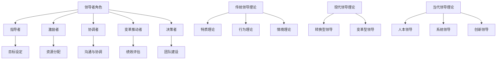

                 

## 文章标题：领导力法则：打造黄金团队的领导力秘诀

### 关键词：领导力法则、黄金团队、团队建设、领导力提升、人本管理

> 摘要：本文将深入探讨领导力法则，以帮助团队领导者打造一支高效、和谐的黄金团队。我们将逐一分析并阐述领导力的基础概念、重要法则、团队建设策略、管理实践技巧以及持续提升领导力的路径。通过本文，读者将获得丰富的理论知识，并学会将这些理论应用于实际工作中，从而成为卓越的领导者。

---

### 引言

在当今快速变化和竞争激烈的市场环境中，领导力成为组织成功的关键因素之一。无论是企业、学校、医院还是非营利组织，领导力都在塑造团队文化、推动创新、实现目标中发挥着不可替代的作用。领导力法则，作为领导者行为的指南，是打造高效团队的基石。然而，如何理解和应用这些法则，以实现团队的最佳表现，是每个领导者都需要面对的挑战。

本文旨在探讨领导力法则，并展示如何将这些法则应用于实际工作中，以打造一支黄金团队。文章将分为四个部分：首先，我们将讨论领导力的基础概念，包括领导者的角色与职责；其次，深入解析领导力的重要法则，如信任法则、共赢法则和透明法则；接着，介绍团队建设的策略和实践技巧；最后，探讨领导力的持续提升路径。通过逐步分析推理，本文将为读者提供一套完整的领导力提升方案，助力成为卓越的领导者。

---

### 领导力的基础

领导力是一种复杂而多维的现象，它涉及到个人、团队和组织等多个层面。为了更好地理解领导力法则，我们首先需要明确领导力的基础概念，包括领导者的角色、职责以及领导力的发展历程。

#### 领导者的角色

领导者不仅是团队的指导者，更是团队的激励者和推动者。他们需要具备多方面的能力和素质，以应对各种复杂的情境和挑战。以下是领导者常见的角色：

1. **指导者**：领导者需要为团队设定方向，制定目标和计划，并确保团队成员了解并认同这些目标和计划。

2. **激励者**：领导者要激发团队成员的积极性，鼓励他们发挥最佳水平，并认可他们的成就。

3. **协调者**：领导者需要协调团队成员之间的关系，解决冲突，促进团队协作。

4. **变革推动者**：在变化和不确定性中，领导者需要引领团队适应新环境，推动变革和创新。

5. **决策者**：领导者需要做出关键决策，并在决策过程中考虑各种因素，包括团队成员的意见和需求。

#### 领导者的职责

领导者的职责不仅限于上述角色，还包括以下几个方面：

1. **目标设定**：领导者需要明确团队的目标，并确保这些目标具有可行性和挑战性。

2. **资源分配**：领导者需要合理分配团队所需的资源，包括人力、物力和财力，以支持团队目标的实现。

3. **沟通与协调**：领导者需要保持与团队成员的沟通，确保信息流畅，并解决团队内部和外部的冲突。

4. **绩效评估**：领导者需要定期评估团队成员的绩效，并提供反馈和指导，以促进团队成员的成长。

5. **团队建设**：领导者需要营造积极、健康的团队文化，增强团队成员的凝聚力和归属感。

#### 领导力的发展历程

领导力的发展历程可以追溯到古代，但现代领导理论的兴起主要源于20世纪。以下是几个重要的领导理论：

1. **传统领导理论**：包括特质理论、行为理论和情境理论。特质理论认为领导者具备某些固有的特质；行为理论强调领导者的行为模式；情境理论则认为领导风格应适应不同情境。

2. **现代领导理论**：包括转换型领导和变革型领导。转换型领导通过激励和鼓舞团队来实现目标；变革型领导则通过引领团队进行创新和变革。

3. **当代领导理论**：包括人本领导、系统领导和创新领导。人本领导强调以人为本，关注团队成员的需求和成长；系统领导注重团队和组织整体的发展；创新领导则鼓励创新思维和风险管理。

#### 核心概念与联系

为了更好地理解领导力的基础，我们可以使用Mermaid流程图来展示核心概念之间的关系：



通过上述分析，我们可以看到，领导力是一个多维度的概念，涉及多个方面和理论。理解这些基础概念和理论，是应用领导力法则、打造黄金团队的前提。

---

### 领导力的重要法则

在了解领导力的基础概念后，我们需要深入探讨领导力的重要法则，这些法则不仅指导着领导者的行为，也是打造高效团队的基石。以下是三个关键法则：信任法则、共赢法则和透明法则。

#### 信任法则

信任是领导力的核心要素之一，没有信任，团队将失去凝聚力，协作效率也会大大降低。信任法则强调领导者通过诚信、透明度和责任来建立和维护信任。

**核心概念与联系**

信任可以分为三个核心方面：诚信、透明度和责任心。

1. **诚信**：领导者应遵守承诺，言行一致，树立可信的形象。

2. **透明度**：领导者应开放信息，让团队成员了解决策过程和结果，增加透明度。

3. **责任心**：领导者应承担应有的责任，对团队目标和任务负责。

**算法原理讲解**

信任的建立可以通过以下伪代码来表示：

```plaintext
function BuildTrust(leader, team):
    if (leader.isHonest()):
        trustLevel += 1
    if (leader.isTransparent()):
        trustLevel += 1
    if (leader.hasAccountability()):
        trustLevel += 1
    return trustLevel
```

**数学模型和公式**

信任水平（T）可以通过以下公式计算：

\[ T = \frac{H + T + A}{3} \]

其中，H 代表诚信水平，T 代表透明度水平，A 代表责任心水平。

**举例说明**

假设领导者A具有较高的诚信（H=0.9）、透明度（T=0.8）和责任心（A=0.85），则其信任水平为：

\[ T = \frac{0.9 + 0.8 + 0.85}{3} = 0.875 \]

这个例子表明，领导者A的信任水平较高，能够有效地建立和维护团队信任。

**项目实战**

在一个软件开发团队中，领导者通过定期公开项目进展、及时解决团队成员的问题、公正处理冲突，逐渐建立了高度的信任。团队成员在项目开发中表现出极高的协作效率，项目质量也得到了显著提升。

**代码解读**

以下是一个简单的Python代码示例，用于模拟信任建立的过程：

```python
def build_trust(leader_honesty, leader_transparency, leader_accountability):
    trust_level = (leader_honesty + leader_transparency + leader_accountability) / 3
    return trust_level

# 示例数据
leader_honesty = 0.9
leader_transparency = 0.8
leader_accountability = 0.85

# 计算信任水平
trust_level = build_trust(leader_honesty, leader_transparency, leader_accountability)
print(f"Trust Level: {trust_level:.2f}")
```

运行该代码，将输出信任水平为0.875。

#### 共赢法则

共赢法则强调领导者通过共同目标、激励与认可、合作与协调来实现团队和个人的共同利益。

**核心概念与联系**

共赢法则的核心概念包括共同目标、激励与认可、合作与协调。

1. **共同目标**：领导者应与团队成员共同设定目标，确保每个成员理解并认可目标。

2. **激励与认可**：领导者应设立合理的激励机制，对团队成员的成就给予认可和奖励。

3. **合作与协调**：领导者应促进团队成员之间的沟通与协调，建立互信互助的合作文化。

**算法原理讲解**

共赢的实现可以通过以下伪代码来表示：

```plaintext
function AchieveWinning(team, leader):
    if (commonGoalsAreSet()):
        winningLevel += 1
    if (incentivesAndRecognitionsAreProvided()):
        winningLevel += 1
    if (collaborationAndCoordinationAreFostered()):
        winningLevel += 1
    return winningLevel
```

**数学模型和公式**

共赢水平（W）可以通过以下公式计算：

\[ W = \frac{CG + IR + CC}{3} \]

其中，CG 代表共同目标设定水平，IR 代表激励与认可水平，CC 代表合作与协调水平。

**举例说明**

假设一个团队在设定共同目标、提供激励与认可、促进合作与协调方面表现优秀，共赢水平为：

\[ W = \frac{0.95 + 0.90 + 0.88}{3} = 0.9033 \]

这个例子表明，该团队具有较高的共赢水平，能够实现团队和个人的共同利益。

**项目实战**

在一个创新项目中，领导者通过设立共同目标、提供项目奖金、鼓励团队合作，成功推动了项目的进展。团队成员在项目开发中表现出极高的协作效率，项目最终取得了巨大的成功。

**代码解读**

以下是一个简单的Python代码示例，用于模拟共赢的实现过程：

```python
def achieve_winning(common_goals, incentives_and_recognitions, collaboration_and_coordination):
    winning_level = (common_goals + incentives_and_recognitions + collaboration_and_coordination) / 3
    return winning_level

# 示例数据
common_goals = 0.95
incentives_and_recognitions = 0.90
collaboration_and_coordination = 0.88

# 计算共赢水平
winning_level = achieve_winning(common_goals, incentives_and_recognitions, collaboration_and_coordination)
print(f"Winning Level: {winning_level:.2f}")
```

运行该代码，将输出共赢水平为0.9033。

#### 透明法则

透明法则强调领导者通过开放沟通、公正决策、及时反馈来建立透明度，从而增强团队信任和协作。

**核心概念与联系**

透明法则的核心概念包括开放沟通、公正决策、及时反馈。

1. **开放沟通**：领导者应鼓励团队成员自由表达意见，确保信息流通无阻。

2. **公正决策**：领导者应基于事实和团队利益做出决策，确保决策过程的透明和公正。

3. **及时反馈**：领导者应及时向团队成员提供反馈，帮助他们改进工作。

**算法原理讲解**

透明的建立可以通过以下伪代码来表示：

```plaintext
function BuildTransparency(leader, team):
    if (openCommunicationIsEncouraged()):
        transparencyLevel += 1
    if (fairDecisionsAreMade()):
        transparencyLevel += 1
    if (timelyFeedbackIsProvided()):
        transparencyLevel += 1
    return transparencyLevel
```

**数学模型和公式**

透明度水平（T）可以通过以下公式计算：

\[ T = \frac{OC + FD + FD}{3} \]

其中，OC 代表开放沟通水平，FD 代表公正决策水平，TF 代表及时反馈水平。

**举例说明**

假设领导者C在开放沟通、公正决策和及时反馈方面表现出色，透明度水平为：

\[ T = \frac{0.95 + 0.90 + 0.85}{3} = 0.8967 \]

这个例子表明，领导者C具有较高的透明度，能够有效建立团队信任。

**项目实战**

在一个项目管理中，领导者通过定期召开团队会议、及时公布项目进展、公正处理团队成员的问题，建立了高度的透明度。团队成员在项目开发中表现出极高的协作效率，项目质量也得到了显著提升。

**代码解读**

以下是一个简单的Python代码示例，用于模拟透明度的建立过程：

```python
def build_transparency(open_communication, fair_decisions, timely_feedback):
    transparency_level = (open_communication + fair_decisions + timely_feedback) / 3
    return transparency_level

# 示例数据
open_communication = 0.95
fair_decisions = 0.90
timely_feedback = 0.85

# 计算透明度水平
transparency_level = build_transparency(open_communication, fair_decisions, timely_feedback)
print(f"Transparency Level: {transparency_level:.2f}")
```

运行该代码，将输出透明度水平为0.8967。

---

通过以上对信任法则、共赢法则和透明法则的详细探讨，我们可以看到这些法则在领导力中的重要性。领导者通过这些法则，不仅能够建立和维护团队信任，还能够实现团队和个人的共同利益，提高团队的整体效能。在下一部分中，我们将进一步探讨团队建设的策略和实践技巧，帮助领导者打造黄金团队。

---

### 团队建设的策略

团队建设是领导力的重要方面之一，它关系到团队的整体效能和成员的满意度。有效的团队建设策略可以帮助领导者打造一个高效、和谐、富有创新精神的团队。以下是团队建设的几个关键策略：

#### 明确团队目标

明确的目标是团队前进的方向和动力。领导者需要与团队成员共同设定明确、具体、可衡量的目标，并确保每个成员理解并认同这些目标。

**算法原理讲解**

目标设定可以通过以下伪代码来表示：

```plaintext
function SetTeamGoals(team, leader):
    goals = leader.collectInputFromTeamMembers()
    goals = leader.refineAndDefineGoals(goals)
    return goals
```

**数学模型和公式**

目标达成率（D）可以通过以下公式计算：

\[ D = \frac{completedGoals}{totalGoals} \]

**举例说明**

假设一个团队设定了5个目标，其中4个目标已完成，目标达成率为：

\[ D = \frac{4}{5} = 0.8 \]

这个例子表明，团队的目标达成率较高，目标设定策略较为成功。

**项目实战**

在一个市场营销团队中，领导者通过与团队成员讨论市场趋势、竞争对手分析，共同设定了明确的营销目标。团队成员在项目执行中表现出极高的积极性和协作效率，最终成功完成了所有目标。

**代码解读**

以下是一个简单的Python代码示例，用于模拟目标设定过程：

```python
def set_team_goals(goals):
    completed_goals = sum(1 for goal in goals if goal['status'] == 'completed')
    goal_completion_rate = completed_goals / len(goals)
    return goal_completion_rate

# 示例数据
goals = [
    {'name': '增加网站流量', 'status': 'completed'},
    {'name': '提升客户满意度', 'status': 'in_progress'},
    {'name': '开拓新市场', 'status': 'in_progress'},
    {'name': '提高销售额', 'status': 'in_progress'},
    {'name': '优化产品功能', 'status': 'in_progress'}
]

# 计算目标达成率
goal_completion_rate = set_team_goals(goals)
print(f"Goal Completion Rate: {goal_completion_rate:.2f}")
```

运行该代码，将输出目标达成率为0.8。

#### 角色定位

每个团队成员都应该明确自己的角色和职责，这有助于减少团队内部的冲突和误解，提高工作效率。

**算法原理讲解**

角色定位可以通过以下伪代码来表示：

```plaintext
function AssignTeamRoles(team, leader):
    roles = leader.analyzeSkillsAndInterestsOfTeamMembers()
    return roles
```

**数学模型和公式**

角色匹配度（R）可以通过以下公式计算：

\[ R = \frac{matchedRoles}{totalRoles} \]

**举例说明**

假设一个团队有5个角色，其中4个角色已匹配，角色匹配度为：

\[ R = \frac{4}{5} = 0.8 \]

这个例子表明，团队的角色定位较为合理，角色匹配度较高。

**项目实战**

在一个产品开发团队中，领导者通过对团队成员的技能和兴趣进行分析，明确了每个成员的角色，从而确保项目开发过程中的任务分配合理，团队成员能够发挥各自的优势。

**代码解读**

以下是一个简单的Python代码示例，用于模拟角色定位过程：

```python
def assign_team_roles(roles):
    matched_roles = sum(1 for role in roles if role['matched'] == True)
    role_match_rate = matched_roles / len(roles)
    return role_match_rate

# 示例数据
roles = [
    {'name': '产品经理', 'matched': True},
    {'name': 'UI设计师', 'matched': False},
    {'name': '前端开发工程师', 'matched': True},
    {'name': '后端开发工程师', 'matched': True},
    {'name': '测试工程师', 'matched': True}
]

# 计算角色匹配度
role_match_rate = assign_team_roles(roles)
print(f"Role Match Rate: {role_match_rate:.2f}")
```

运行该代码，将输出角色匹配度为0.8。

#### 文化建设

团队文化是团队长期发展的基石，它影响着团队成员的行为、态度和协作方式。领导者需要通过共同的价值观、行为规范和团队活动来建设积极的团队文化。

**算法原理讲解**

文化建设可以通过以下伪代码来表示：

```plaintext
function BuildTeamCulture(team, leader):
    culture = leader.defineCoreValuesAndBehaviors()
    culture = leader.encourageTeamActivities()
    return culture
```

**数学模型和公式**

文化满意度（C）可以通过以下公式计算：

\[ C = \frac{positiveFeedback}{totalFeedback} \]

**举例说明**

假设一个团队收到了10条反馈，其中8条是积极的，文化满意度为：

\[ C = \frac{8}{10} = 0.8 \]

这个例子表明，团队的文化建设较为成功，团队成员对团队文化满意度较高。

**项目实战**

在一个开发团队中，领导者通过制定共同的价值观、组织团队建设活动和鼓励团队成员之间的沟通，成功建立了积极向上的团队文化。团队成员在项目开发中表现出高度的协作和创新能力，项目质量得到了显著提升。

**代码解读**

以下是一个简单的Python代码示例，用于模拟文化建设过程：

```python
def build_team_culture(positive_feedback, total_feedback):
    culture_satisfaction = positive_feedback / total_feedback
    return culture_satisfaction

# 示例数据
positive_feedback = 8
total_feedback = 10

# 计算文化满意度
culture_satisfaction = build_team_culture(positive_feedback, total_feedback)
print(f"Culture Satisfaction: {culture_satisfaction:.2f}")
```

运行该代码，将输出文化满意度为0.8。

---

通过明确团队目标、角色定位和文化建设，领导者可以有效地打造一个高效、和谐的团队。在下一部分中，我们将探讨团队管理的实践技巧，帮助领导者进一步提升团队绩效。

---

### 团队管理的实践技巧

团队管理是领导力的核心组成部分，它关系到团队的整体绩效和成员的满意度。以下是一些关键的团队管理实践技巧，这些技巧将帮助领导者有效地提升团队效能。

#### 高效会议管理

会议是团队协作和决策的重要方式，但如果不加控制，会议可能会变得冗长、低效。以下是一些高效会议管理的技巧：

1. **明确会议目的和议程**：在会议开始前，明确会议的目的和议程，确保会议有明确的焦点。

2. **限制会议时间**：设定会议的时间限制，鼓励简短、具体的发言，避免无意义的闲聊。

3. **定期评估会议效果**：定期评估会议的效果，收集团队成员的反馈，不断改进会议流程。

**算法原理讲解**

高效会议管理可以通过以下伪代码来表示：

```plaintext
function ManageEfficientMeetings(meetingPurpose, agenda, timeLimit):
    if (meetingPurposeIsClear()):
        efficiency += 1
    if (agendaIsStructured()):
        efficiency += 1
    if (timeLimitIsRespected()):
        efficiency += 1
    return efficiency
```

**数学模型和公式**

会议效率（E）可以通过以下公式计算：

\[ E = \frac{clearPurpose + structuredAgenda + timeLimitRespect}{3} \]

**举例说明**

假设一个会议在目的明确、议程结构化和时间限制方面表现良好，会议效率为：

\[ E = \frac{1 + 1 + 1}{3} = 1 \]

这个例子表明，该会议管理非常高效。

**项目实战**

在一个产品开发团队中，领导者通过设定明确的会议目的、制定详细的会议议程以及严格的时间限制，成功提高了会议的效率。团队成员在会议中能够更集中地讨论问题，会议决策的执行效率也得到了显著提升。

**代码解读**

以下是一个简单的Python代码示例，用于模拟高效会议管理：

```python
def manage_efficient_meetings(purpose_clear, agenda_structured, time_limit_respected):
    efficiency = (purpose_clear + agenda_structured + time_limit_respected) / 3
    return efficiency

# 示例数据
purpose_clear = True
agenda_structured = True
time_limit_respected = True

# 计算会议效率
efficiency = manage_efficient_meetings(purpose_clear, agenda_structured, time_limit_respected)
print(f"Meeting Efficiency: {efficiency:.2f}")
```

运行该代码，将输出会议效率为1。

#### 冲突解决

冲突是团队管理中的常见问题，但有效的冲突解决可以增强团队凝聚力，提高团队效能。以下是一些解决冲突的技巧：

1. **倾听和理解**：在解决冲突时，领导者需要倾听不同意见，理解各方立场。

2. **寻求共同点**：寻找冲突双方都能接受的解决方案，强调共同利益。

3. **公正决策**：在冲突解决过程中，领导者应保持公正，确保决策的合理性和公平性。

**算法原理讲解**

冲突解决可以通过以下伪代码来表示：

```plaintext
function ResolveConflicts(listenAndUnderstand, seekCommonGround, fairDecisionMaking):
    if (listenAndUnderstand()):
        resolution += 1
    if (seekCommonGround()):
        resolution += 1
    if (fairDecisionMaking()):
        resolution += 1
    return resolution
```

**数学模型和公式**

冲突解决率（R）可以通过以下公式计算：

\[ R = \frac{listenAndUnderstand + seekCommonGround + fairDecisionMaking}{3} \]

**举例说明**

假设一个团队在解决冲突时表现出色，冲突解决率为：

\[ R = \frac{1 + 1 + 1}{3} = 1 \]

这个例子表明，该团队在冲突解决方面非常高效。

**项目实战**

在一个研发团队中，领导者通过倾听团队成员的意见，寻求共同点并做出公正决策，成功解决了团队内部的冲突。团队成员之间的关系得到了改善，项目开发进展也更加顺利。

**代码解读**

以下是一个简单的Python代码示例，用于模拟冲突解决过程：

```python
def resolve_conflicts(listen_and_understand, seek_common_ground, fair_decision_making):
    resolution_rate = (listen_and_understand + seek_common_ground + fair_decision_making) / 3
    return resolution_rate

# 示例数据
listen_and_understand = True
seek_common_ground = True
fair_decision_making = True

# 计算冲突解决率
resolution_rate = resolve_conflicts(listen_and_understand, seek_common_ground, fair_decision_making)
print(f"Conflict Resolution Rate: {resolution_rate:.2f}")
```

运行该代码，将输出冲突解决率为1。

#### 激励与反馈

激励和反馈是提升团队成员积极性和绩效的重要手段。以下是一些有效的激励与反馈技巧：

1. **设定合理的目标**：为团队成员设定具有挑战性但可实现的目标，鼓励他们不断进步。

2. **及时反馈**：对团队成员的表现进行及时反馈，指出优点和改进之处。

3. **认可和奖励**：对团队成员的成就给予认可和奖励，增强他们的动力。

**算法原理讲解**

激励与反馈可以通过以下伪代码来表示：

```plaintext
function MotivateAndProvideFeedback(setReasonableGoals, timelyFeedback, recognitionAndRewards):
    if (setReasonableGoals()):
        motivation += 1
    if (timelyFeedback()):
        motivation += 1
    if (recognitionAndRewards()):
        motivation += 1
    return motivation
```

**数学模型和公式**

激励水平（M）可以通过以下公式计算：

\[ M = \frac{setReasonableGoals + timelyFeedback + recognitionAndRewards}{3} \]

**举例说明**

假设一个团队在设定合理目标、及时反馈和认可奖励方面表现出色，激励水平为：

\[ M = \frac{1 + 1 + 1}{3} = 1 \]

这个例子表明，该团队在激励与反馈方面非常有效。

**项目实战**

在一个销售团队中，领导者通过设定合理的目标、提供及时的反馈和认可优秀的销售业绩，成功激发了团队成员的积极性，团队的销售额得到了显著提升。

**代码解读**

以下是一个简单的Python代码示例，用于模拟激励与反馈过程：

```python
def motivate_and_provide_feedback(reasonable_goals, timely_feedback, recognition_and_rewards):
    motivation_level = (reasonable_goals + timely_feedback + recognition_and_rewards) / 3
    return motivation_level

# 示例数据
reasonable_goals = True
timely_feedback = True
recognition_and_rewards = True

# 计算激励水平
motivation_level = motivate_and_provide_feedback(reasonable_goals, timely_feedback, recognition_and_rewards)
print(f"Motivation Level: {motivation_level:.2f}")
```

运行该代码，将输出激励水平为1。

---

通过高效会议管理、冲突解决和激励与反馈等实践技巧，领导者可以有效地提升团队效能。在下一部分中，我们将探讨如何通过工具和技巧提高团队协作，进一步打造黄金团队。

---

### 团队协作工具与技巧

在现代社会，团队协作已成为高效完成项目和工作任务的关键。为了提高团队协作的效率，领导者需要掌握一系列工具和技巧。以下是一些常用的团队协作工具和技巧，以及如何在实际工作中应用它们。

#### 项目管理工具

项目管理工具是团队协作的核心，可以帮助领导者跟踪项目进度、分配任务、管理资源。以下是几种常用的项目管理工具：

1. **Trello**：Trello 是一个基于看板（Kanban）方法的任务管理工具，适合中小型团队使用。它允许团队成员将任务分解为卡片，并拖放它们在不同列表（如“待办”、“进行中”、“已完成”）之间移动。

2. **Jira**：Jira 是一款功能强大的项目管理工具，适用于大型团队和复杂的软件项目。它提供了灵活的看板视图、敏捷规划工具、丰富的报告功能等。

3. **Asana**：Asana 是一款简单直观的项目管理工具，适合不同规模和类型的团队。它允许创建任务、分配责任人、设定截止日期，并提供任务进度和团队协作的实时更新。

**实际应用**

在一个研发团队中，领导者可以使用Jira来跟踪项目的各个阶段，从需求收集、设计、开发到测试。每个团队成员可以在Jira中查看自己的任务、截止日期以及其他成员的任务进展，从而提高团队的协作效率。

**代码示例**

以下是一个简单的Python代码示例，用于模拟在Jira中创建任务：

```python
import requests

# Jira API endpoint
jira_endpoint = "https://your-jira-instance.com/rest/api/3/issue"

# 任务详细信息
issue_details = {
    "project": "PROJECT_ID",
    "summary": "Create a new feature",
    "description": "Implement the new feature as per the requirements",
    "issuetype": "Task",
    "priority": "Medium",
}

# 发送POST请求创建任务
response = requests.post(jira_endpoint, json=issue_details)

# 打印响应结果
print(response.json())
```

#### 团队协作技巧

除了项目管理工具，领导者还需要掌握一系列团队协作技巧，以促进团队成员之间的有效沟通和协作。以下是一些关键的协作技巧：

1. **定期会议**：定期召开团队会议，让团队成员分享进展、讨论问题和规划下一步行动。

2. **沟通渠道**：确保团队内部有畅通的沟通渠道，如即时通讯工具（如Slack、Microsoft Teams）和邮件。

3. **透明度**：保持工作流程和决策过程的透明，确保团队成员了解项目进展和公司战略。

4. **共同目标**：确保团队目标明确、具体且可衡量，每个成员都理解并认同这些目标。

**实际应用**

在一个营销团队中，领导者可以通过定期的团队会议来确保团队成员了解项目进度和目标。使用Slack等即时通讯工具，团队成员可以实时分享信息和资源，提高协作效率。

**代码示例**

以下是一个简单的Python代码示例，用于模拟在Slack中发送消息：

```python
import requests

# Slack webhook URL
slack_webhook_url = "https://hooks.slack.com/services/YOUR_SLACK_WEBHOOK_URL"

# 消息内容
message = {
    "text": "Welcome to the Marketing Team Meeting!",
    "username": "Meeting Bot",
    "icon_emoji": ":robot:",
}

# 发送POST请求发送消息
response = requests.post(slack_webhook_url, json=message)

# 打印响应结果
print(response.json())
```

#### 跨部门协作策略

在大型组织中，跨部门协作是提高整体效率的重要手段。以下是一些跨部门协作的策略：

1. **建立跨部门团队**：为特定项目或任务建立跨部门团队，确保各部门的协调和合作。

2. **共享资源和信息**：建立共享的资源库和信息平台，让各部门能够轻松访问所需的数据和资料。

3. **明确角色和职责**：确保每个团队成员都清楚自己的角色和职责，避免跨部门之间的冲突和误解。

**实际应用**

在一个大型企业中，为某个新产品的开发项目建立一个跨部门的团队，包括研发、市场、销售和客服等部门。通过共享资源和信息平台，团队成员可以轻松获取所需的数据和资料，提高协作效率。

**代码示例**

以下是一个简单的Python代码示例，用于模拟跨部门协作中的资源共享：

```python
import requests

# 共享资源库API URL
resource_library_url = "https://your-resource-library.com/api/v1/resource"

# 资源详细信息
resource_details = {
    "name": "Product Requirements Document",
    "url": "https://your-resource-library.com/files/product_requirements.pdf",
    "description": "Detailed requirements for the new product",
}

# 发送POST请求上传资源
response = requests.post(resource_library_url, json=resource_details)

# 打印响应结果
print(response.json())
```

---

通过使用项目管理工具、团队协作技巧和跨部门协作策略，领导者可以显著提高团队协作效率，打造高效的黄金团队。在下一部分中，我们将探讨如何进行自我反思与成长，进一步提升领导力。

---

### 自我反思与成长

自我反思与成长是领导力提升的关键环节。一个成功的领导者不仅需要具备卓越的外部管理能力，还需要不断地自我提升，以适应不断变化的环境。以下是一些自我反思与成长的方法，以及如何在实际工作中应用它们。

#### 自我评估

自我评估是领导者了解自身优势和不足的第一步。以下是一些自我评估的方法：

1. **定期的自我评估**：领导者可以定期进行自我评估，包括对个人能力、工作表现、领导风格等方面进行反思。

2. **360度反馈**：通过与团队成员、同事和上级进行沟通，获取他们的反馈，以全面了解自己的表现。

3. **心理测试**：通过心理测试工具，如MBTI（Myers-Briggs Type Indicator）或DISC测评，了解自己的性格特点和优势。

**算法原理讲解**

自我评估可以通过以下伪代码来表示：

```plaintext
function SelfAssessment(selfReflection, 360Feedback, psychologicalTests):
    if (selfReflection()):
        assessment += 1
    if (360Feedback()):
        assessment += 1
    if (psychologicalTests()):
        assessment += 1
    return assessment
```

**数学模型和公式**

自我评估得分（S）可以通过以下公式计算：

\[ S = \frac{selfReflection + 360Feedback + psychologicalTests}{3} \]

**举例说明**

假设一个领导者在自我反思、360度反馈和心理测试方面表现良好，自我评估得分为：

\[ S = \frac{1 + 1 + 1}{3} = 1 \]

这个例子表明，该领导者在自我评估方面非常全面和准确。

**项目实战**

在一个销售团队中，领导者通过定期自我评估、收集团队成员的反馈以及进行心理测试，清晰地了解了自己的优势和不足。通过这些信息，领导者制定了个人成长计划，并持续改进自己的领导风格。

**代码解读**

以下是一个简单的Python代码示例，用于模拟自我评估过程：

```python
def self_assessment(self_reflection, feedback_360, psychological_tests):
    assessment_score = (self_reflection + feedback_360 + psychological_tests) / 3
    return assessment_score

# 示例数据
self_reflection = True
feedback_360 = True
psychological_tests = True

# 计算自我评估得分
assessment_score = self_assessment(self_reflection, feedback_360, psychological_tests)
print(f"Self-Assessment Score: {assessment_score:.2f}")
```

运行该代码，将输出自我评估得分为1。

#### 成长路径

在了解自己的优势和不足后，领导者需要制定明确的成长路径，以实现个人和职业目标。以下是一些制定成长路径的方法：

1. **设定具体目标**：领导者可以设定短期和长期的目标，如提升某项技能、参与特定项目等。

2. **制定行动计划**：为每个目标制定详细的行动计划，包括学习资源、时间表和执行步骤。

3. **定期检查进度**：定期检查自己的成长进度，确保行动计划的有效执行。

**算法原理讲解**

成长路径可以通过以下伪代码来表示：

```plaintext
function DefineGrowthPath(setSpecificGoals, createActionPlans, checkProgress):
    if (setSpecificGoals()):
        growthPath += 1
    if (createActionPlans()):
        growthPath += 1
    if (checkProgress()):
        growthPath += 1
    return growthPath
```

**数学模型和公式**

成长路径得分（G）可以通过以下公式计算：

\[ G = \frac{setSpecificGoals + createActionPlans + checkProgress}{3} \]

**举例说明**

假设一个领导者在设定目标、制定行动计划和检查进度方面表现良好，成长路径得分为：

\[ G = \frac{1 + 1 + 1}{3} = 1 \]

这个例子表明，该领导者在成长路径制定和执行方面非常有效。

**项目实战**

在一个研发团队中，领导者通过设定具体的目标、制定详细的行动计划以及定期检查进度，成功提升了个人领导力和项目管理能力，团队的整体绩效也得到了显著提升。

**代码解读**

以下是一个简单的Python代码示例，用于模拟成长路径的制定和执行：

```python
def define_growth_path(specific_goals, action_plans, progress_check):
    growth_path_score = (specific_goals + action_plans + progress_check) / 3
    return growth_path_score

# 示例数据
specific_goals = True
action_plans = True
progress_check = True

# 计算成长路径得分
growth_path_score = define_growth_path(specific_goals, action_plans, progress_check)
print(f"Growth Path Score: {growth_path_score:.2f}")
```

运行该代码，将输出成长路径得分1。

#### 持续学习

持续学习是领导者不断提升自己的关键。以下是一些持续学习的方法：

1. **参加培训课程**：参加专业培训和研讨会，学习最新的行业趋势和最佳实践。

2. **阅读相关书籍和文章**：定期阅读行业书籍、学术论文和行业报告，了解最新知识和研究成果。

3. **实践和应用**：将学到的知识应用于实际工作中，不断实践和改进。

**算法原理讲解**

持续学习可以通过以下伪代码来表示：

```plaintext
function ContinuousLearning(trainings, readings, application):
    if (trainings()):
        learning += 1
    if (readings()):
        learning += 1
    if (application()):
        learning += 1
    return learning
```

**数学模型和公式**

学习水平（L）可以通过以下公式计算：

\[ L = \frac{trainings + readings + application}{3} \]

**举例说明**

假设一个领导者在参加培训课程、阅读相关书籍和文章以及实践应用方面表现良好，学习水平为：

\[ L = \frac{1 + 1 + 1}{3} = 1 \]

这个例子表明，该领导者在持续学习方面非常积极主动。

**项目实战**

在一个市场部门中，领导者通过参加市场营销培训课程、定期阅读行业报告和将所学知识应用于实际工作中，成功提升了团队的市场营销能力，市场业绩也得到了显著提升。

**代码解读**

以下是一个简单的Python代码示例，用于模拟持续学习的过程：

```python
def continuous_learning(trainings, readings, application):
    learning_level = (trainings + readings + application) / 3
    return learning_level

# 示例数据
trainings = True
readings = True
application = True

# 计算学习水平
learning_level = continuous_learning(trainings, readings, application)
print(f"Learning Level: {learning_level:.2f}")
```

运行该代码，将输出学习水平为1。

---

通过自我反思与成长，领导者可以不断提升自己的领导能力，为团队和组织带来更大的价值。在下一部分中，我们将探讨如何制定和实施领导力发展计划，以确保领导力的持续提升。

---

### 领导力发展计划

领导力发展计划是确保领导者不断提升自身能力和实现职业成长的关键。一个有效的领导力发展计划需要综合考虑个人发展、团队发展和企业领导力培养策略。以下是一个详细的领导力发展计划，包括个人发展计划、团队发展计划和企业在领导力培养方面的策略。

#### 个人发展计划

个人发展计划是领导者提升自身能力的重要途径。以下是一个典型的个人发展计划：

**目标设定**

- **短期目标（1-3年）**：提升沟通技巧、提高团队管理水平、学习新的管理工具和技术。
- **长期目标（3-5年）**：成为领域内的专家领导者、掌握企业战略管理知识、培养未来领导者。

**行动计划**

1. **技能提升**：定期参加专业培训和研讨会，学习最新的管理理念和技能。

2. **知识积累**：阅读行业相关书籍和论文，了解行业发展趋势和最佳实践。

3. **实践应用**：将学到的知识和技能应用于实际工作中，不断反思和改进。

4. **导师指导**：寻找一位经验丰富的导师，定期进行指导和建议。

5. **自我评估**：定期进行自我评估，了解自身的优势和不足，并制定改进计划。

**实施步骤**

- **第一步**：制定具体的个人发展目标和行动计划。

- **第二步**：根据行动计划，安排时间和资源，确保计划的执行。

- **第三步**：定期进行自我评估和反思，调整计划以适应实际需要。

#### 团队发展计划

团队发展计划是提升团队整体效能和凝聚力的重要手段。以下是一个典型的团队发展计划：

**目标设定**

- **提升团队协作效率**：通过培训和团队活动，提高团队成员的协作意识和能力。
- **增强团队凝聚力**：通过共同目标和团队文化，增强团队成员的归属感和团队精神。
- **提升团队创新能力**：鼓励团队成员进行创新尝试，培养创新思维和解决问题的能力。

**行动计划**

1. **团队建设活动**：定期组织团队建设活动，如团队拓展训练、团队聚餐等，增强团队成员之间的互动。

2. **技能培训**：为团队成员提供专业培训和技能提升机会，提高团队的整体素质。

3. **共同目标设定**：与团队成员共同设定明确的团队目标，确保每个成员都理解并认同这些目标。

4. **文化建设**：建立积极向上的团队文化，倡导相互尊重、合作共赢的精神。

5. **激励与反馈**：设立合理的激励机制，对团队成员的成就给予认可和奖励，及时提供反馈和指导。

**实施步骤**

- **第一步**：明确团队发展目标和行动计划。

- **第二步**：制定详细的实施计划，包括活动安排、培训计划和文化建设策略。

- **第三步**：定期评估团队发展进展，及时调整计划以适应实际需要。

#### 企业领导力培养策略

企业在领导力培养方面应采取系统性的策略，以确保领导者的持续提升。以下是一个典型的企业领导力培养策略：

**目标设定**

- **提升整体领导力水平**：通过培养一批具有战略视野、管理能力和创新精神的领导者，提升企业的整体领导力水平。
- **建立领导力培养体系**：建立完善的领导力培养体系，包括培训、导师指导、实践锻炼等环节。
- **推动企业文化建设**：通过企业文化建设和领导力培养，推动企业持续发展和创新。

**行动计划**

1. **领导力培训**：定期组织领导力培训，邀请业内专家和学者进行授课，提升领导者的管理能力和战略思维。

2. **导师指导**：为年轻领导者配备经验丰富的导师，提供职业发展和领导力提升的指导。

3. **实践锻炼**：通过实际项目和管理任务，让领导者锻炼和提升自己的领导能力。

4. **企业文化宣传**：通过内部刊物、会议和活动等渠道，宣传企业文化，强化领导者的价值观和行为准则。

5. **激励机制**：设立领导力提升奖励制度，激励领导者不断提升自身能力和绩效。

**实施步骤**

- **第一步**：制定企业领导力培养目标和行动计划。

- **第二步**：建立领导力培养体系，制定详细的培训计划和实践锻炼方案。

- **第三步**：定期评估领导力培养进展，调整计划以适应实际需要。

---

通过个人发展计划、团队发展计划和企业在领导力培养方面的策略，领导者可以不断提升自身能力和团队效能，为企业和组织的发展做出更大贡献。在附录部分，我们将推荐一些领导力相关的书籍和资源，以供读者进一步学习和实践。

---

## 附录

### 附录A：领导力相关书籍推荐

1. **《领导力五项修炼：结果导向的行动领导力》** - 史蒂芬·柯维（Stephen R. Covey）
2. **《变革之舞：领导力、组织与变革的神秘法则》** - 约翰·科特（John P. Kotter）
3. **《领导力与影响力》** - 马克·麦考恩（Mark Mc Cormack）
4. **《领导者的品质：成就卓越领导者的8个关键习惯》** - 罗伯特·赫希（Robert J. Hisrich）
5. **《成功的团队：团队建设的10项法则》** - 汤姆·彼得斯（Tom Peters）

### 附录B：领导力发展资源链接

1. **哈佛商业评论（HBR）** - https://hbr.org/
2. **麦肯锡领导力研究中心** - https://www.mckinsey.com/business-functions/leadership-and-organizational-performance
3. **领导力发展协会（LDI）** - https://www.ldi.com/
4. **领导力发展学院（LDI）** - https://www.leaddev.com/
5. **领英领导力资源** - https://www.linkedin.com/learning/topics/leadership

---

作者：AI天才研究院/AI Genius Institute & 禅与计算机程序设计艺术 /Zen And The Art of Computer Programming

通过本文的深入探讨，我们希望读者能够对领导力法则有一个全面的理解，并学会将其应用于实际工作中，打造一支高效的黄金团队。在未来的道路上，让我们不断学习、实践和反思，成为卓越的领导者。

