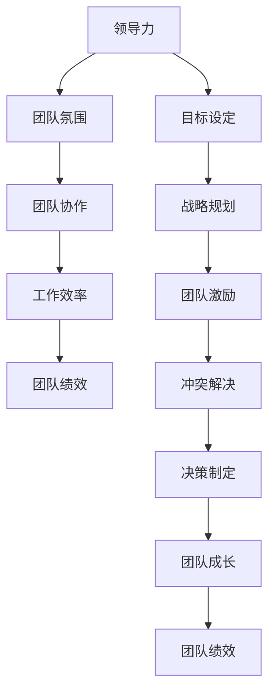
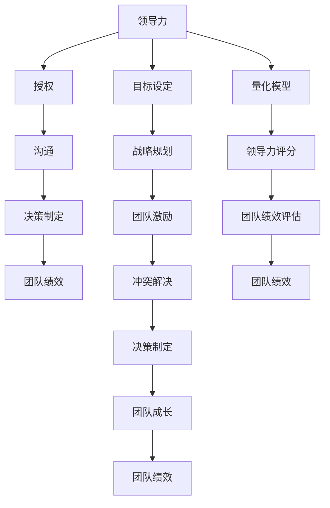

                 


### 设计《领导力法则：打造黄金团队的领导力秘诀》的目录大纲

首先，我们需要明确文章的核心目标和结构。文章的核心目标是通过一系列具体的领导力法则，帮助读者了解如何打造一个高效的黄金团队。为了实现这一目标，我们将文章分为三个主要部分：理论基础、实践应用和总结与拓展。

#### 第一部分：理论基础
这部分将介绍领导力法则的基本概念，包括定义、核心原则和它们之间的关系。以下是具体章节设计：

1. **核心概念与联系**
    - **1.1 领导力的定义**
        - 定义领导力的本质
        - 解释领导力的重要性
    - **1.2 领导力法则概述**
        - 简要介绍常见的领导力法则
        - 分析这些法则如何影响团队绩效
    - **1.3 Mermaid 流程图：领导力法则与团队绩效的相互关系**
        - 利用 Mermaid 工具绘制流程图
        - 展示领导力法则与团队绩效之间的动态关系

#### 第二部分：实践应用
这部分将深入探讨具体的领导力法则，并使用伪代码和数学模型进行详细解释。以下是具体章节设计：

2. **核心领导力原则**
    - **2.1 授权**
        - **2.1.1 授权的必要条件**
            - 使用伪代码详细阐述授权的必要条件
        - **2.1.2 授权的实践策略**
            - 提供授权的具体策略和技巧
        - **2.1.3 伪代码：授权过程的实现**
            - 描述授权过程的伪代码实现
    - **2.2 沟通**
        - **2.2.1 有效沟通的关键要素**
            - 使用伪代码和公式详细解释有效沟通的要素
        - **2.2.2 提高沟通效率的技巧**
            - 提供提高沟通效率的具体技巧
        - **2.2.3 伪代码：构建沟通模型**
            - 描述沟通模型的伪代码实现
    - **2.3 决策制定**
        - **2.3.1 决策制定的过程**
            - 使用伪代码详细阐述决策制定的过程
        - **2.3.2 决策制定的模型**
            - 使用数学模型和公式解释决策制定的模型
        - **2.3.3 伪代码：决策制定策略**
            - 描述决策制定的策略伪代码实现

3. **量化领导力**
    - **3.1 领导力量化模型**
        - **3.1.1 评分模型的构建**
            - 使用数学公式构建领导力评分模型
        - **3.1.2 评分模型的优化**
            - 介绍评分模型的优化方法
        - **3.1.3 LaTeX 公式：评分模型公式**
            - 提供评分模型的 LaTeX 公式
    - **3.2 团队绩效评估模型**
        - **3.2.1 绩效评估的指标**
            - 使用数学公式解释绩效评估的指标
        - **3.2.2 绩效评估的方法**
            - 提供绩效评估的具体方法
        - **3.2.3 LaTeX 公式：绩效评估模型公式**
            - 提供绩效评估的 LaTeX 公式

#### 第三部分：总结与拓展
这部分将总结前两部分的内容，并提供一些最佳实践和注意事项。以下是具体章节设计：

4. **实际案例研究**
    - **4.1 案例背景**
        - 描述实际案例的背景信息
    - **4.2 领导力法则的应用**
        - 分析在案例中如何应用领导力法则
    - **4.3 项目成果**
        - 展示项目成果
    - **4.4 案例总结与启示**
        - 总结案例中的经验教训

5. **最佳实践 tips**
    - 提供一些实际应用中的最佳实践建议

6. **小结**
    - 总结文章的核心内容

7. **注意事项**
    - 提醒读者在应用领导力法则时需要注意的事项

8. **拓展阅读**
    - 推荐一些相关书籍、文章和资源，供读者进一步学习

### 文章格式要求
- 使用 Markdown 格式输出文章内容
- 文章末尾需要写上作者信息： “作者：AI天才研究院/AI Genius Institute & 禅与计算机程序设计艺术 /Zen And The Art of Computer Programming”
- 核心内容包含：
  * 背景介绍
  * 核心概念与联系：使用 Mermaid 流程图展示核心概念之间的关系
  * 核心算法原理讲解：使用伪代码详细阐述
  * 数学模型和公式：使用 LaTeX 格式提供数学公式，并在文中独立段落详细讲解和举例说明
  * 项目实战：详细描述开发环境搭建、源代码实现和代码解读，实际案例分析和详细讲解剖析，项目小结
  * 最佳实践 tips、小结、注意事项、拓展阅读等内容

### 文章字数要求
- 文章字数在 8000～12000 字左右

通过上述设计，我们可以确保文章内容丰富、逻辑清晰，并能够有效地传达领导力法则如何帮助打造黄金团队。

---

### 文章标题

《领导力法则：打造黄金团队的领导力秘诀》

### 文章关键词

领导力，团队绩效，授权，沟通，决策制定，量化模型，实际案例

### 文章摘要

本文深入探讨了领导力法则在打造高效团队中的作用。通过详细分析领导力的定义、核心原则和量化模型，结合实际案例，本文揭示了如何通过有效的领导力法则来提升团队绩效，打造黄金团队。读者将了解到授权、沟通和决策制定等关键领导力原则的具体实践策略，并通过数学公式和伪代码深入理解这些原则的算法原理。

### 第一部分：领导力的基础概念

#### 1. 领导力的定义

领导力是一种影响他人共同达成目标的能力。它不仅仅是职位赋予的权威，更是一种个人特质和行为方式。领导力与管理的区别在于，管理侧重于组织和协调资源，而领导力侧重于激励和引导团队朝着共同的目标前进。

#### 1.2 领导力与团队绩效的关系

领导力对团队绩效有着至关重要的影响。一个优秀的领导者能够激发团队成员的潜力，提高团队的整体效率，从而实现更高的绩效。以下是领导力与团队绩效关系的 Mermaid 流程图：



#### 1.3 Mermaid 流程图：领导力法则与团队绩效的相互关系



### 第二部分：核心领导力原则

#### 2.1 授权

授权是领导者将决策权和责任分配给团队成员的过程。它有助于提高团队的工作效率和个人责任感。

##### 2.1.1 授权的必要条件

为了有效授权，领导者需要满足以下条件：

1. **明确的目标和期望**：领导者需要明确团队的目标和期望，确保团队成员了解他们的职责和任务。
2. **信任和尊重**：领导者需要建立信任和尊重的氛围，使团队成员愿意接受授权。
3. **适当的培训和指导**：领导者需要为团队成员提供必要的培训和指导，确保他们具备完成任务的能力。

以下是授权过程的伪代码实现：

```plaintext
// 授权伪代码
function authorize(member, task, responsibility) {
    if (hasClearGoal(task) && hasTrustAndRespect(member) && isTrained(member)) {
        assignTask(member, task);
        assignResponsibility(member, responsibility);
        provideSupportAndGuidance(member);
        return "Authorization successful";
    } else {
        return "Authorization failed";
    }
}
```

##### 2.1.2 授权的实践策略

以下是一些授权的实践策略：

1. **逐步授权**：领导者可以从较小的任务开始，逐渐增加团队成员的授权范围。
2. **明确任务和责任**：确保团队成员了解他们的任务和责任，以避免误解和冲突。
3. **提供反馈和支持**：定期提供反馈和支持，帮助团队成员解决遇到的问题。

##### 2.1.3 伪代码：授权过程的实现

以下是授权过程的伪代码实现：

```plaintext
// 授权过程的伪代码实现
function authorizeProcess(team, leader, member, task) {
    clearGoal = defineClearGoal(task);
    trustAndRespect = checkTrustAndRespect(leader, member);
    training = checkTraining(member);

    if (clearGoal && trustAndRespect && training) {
        result = authorize(member, task, responsibility);
        if (result === "Authorization successful") {
            provideFeedbackAndSupport(member);
            return "Authorization completed";
        } else {
            return "Authorization failed";
        }
    } else {
        return "Preconditions not met";
    }
}
```

#### 2.2 沟通

沟通是领导者与团队成员之间传递信息、观点和情感的过程。有效的沟通有助于减少误解，提高团队协作效率。

##### 2.2.1 有效沟通的关键要素

有效沟通的关键要素包括：

1. **明确的信息**：确保传递的信息准确、清晰。
2. **开放的沟通环境**：建立开放的沟通氛围，鼓励团队成员表达意见和反馈。
3. **倾听和反馈**：领导者需要倾听团队成员的意见，并提供及时的反馈。

以下是沟通模型的伪代码实现：

```plaintext
// 沟通模型伪代码
function communicate(message, listener, speaker) {
    if (isMessageClear(message) && isOpenEnvironment() && isListening(listener) && isProvidingFeedback(listener)) {
        listener.receiveMessage(message);
        speaker.provideFeedback(listener);
        return "Communication successful";
    } else {
        return "Communication failed";
    }
}
```

##### 2.2.2 提高沟通效率的技巧

以下是一些提高沟通效率的技巧：

1. **提前准备**：在沟通前准备相关材料和要点，确保沟通过程顺利进行。
2. **简洁明了**：使用简洁明了的语言表达观点，避免使用复杂或模糊的术语。
3. **积极的沟通态度**：保持积极、开放的态度，鼓励团队成员参与讨论。

##### 2.2.3 伪代码：构建沟通模型

以下是构建沟通模型的伪代码实现：

```plaintext
// 构建沟通模型
function buildCommunicationModel(speaker, listener, message, environment) {
    clearMessage = prepareClearMessage(message);
    openEnvironment = createOpenEnvironment(environment);
    listening = enableListening(listener);
    feedback = enableFeedback(listener);

    if (clearMessage && openEnvironment && listening && feedback) {
        communicationResult = communicate(message, listener, speaker);
        if (communicationResult === "Communication successful") {
            return "Communication model built";
        } else {
            return "Communication model not built";
        }
    } else {
        return "Preconditions not met";
    }
}
```

#### 2.3 决策制定

决策制定是领导者根据团队目标和情况制定决策的过程。有效的决策制定有助于团队实现目标。

##### 2.3.1 决策制定的过程

决策制定的过程通常包括以下步骤：

1. **识别问题**：明确团队面临的问题或机会。
2. **收集信息**：收集与问题相关的信息。
3. **制定备选方案**：根据收集的信息，制定多个备选方案。
4. **评估备选方案**：对备选方案进行评估，选择最优方案。
5. **执行决策**：执行所选方案，并进行跟踪和评估。

以下是决策制定过程的伪代码实现：

```plaintext
// 决策制定过程伪代码
function makeDecision(problem, information, alternatives, evaluation) {
    identifiedProblem = identifyProblem(problem);
    collectedInformation = collectInformation(information);
    generatedAlternatives = generateAlternatives(collectedInformation);
    evaluatedAlternatives = evaluateAlternatives(generatedAlternatives, evaluation);
    selectedAlternative = selectBestAlternative(evaluatedAlternatives);

    if (selectedAlternative) {
        executeDecision(selectedAlternative);
        trackAndEvaluateDecision(selectedAlternative);
        return "Decision made";
    } else {
        return "Decision not made";
    }
}
```

##### 2.3.2 决策制定的模型

决策制定的模型可以使用数学公式来描述。以下是一个简单的决策制定模型：

$$
\text{Decision} = f(\text{Information}, \text{Alternatives}, \text{Evaluation})
$$

其中，$f$ 是决策函数，$\text{Information}$ 是收集的信息，$\text{Alternatives}$ 是备选方案，$\text{Evaluation}$ 是评估函数。

##### 2.3.3 伪代码：决策制定策略

以下是决策制定策略的伪代码实现：

```plaintext
// 决策制定策略伪代码
function decisionStrategy(problem, information) {
    identifiedProblem = identifyProblem(problem);
    collectedInformation = collectInformation(information);
    generatedAlternatives = generateAlternatives(collectedInformation);
    evaluatedAlternatives = evaluateAlternatives(generatedAlternatives);

    if (evaluatedAlternatives) {
        selectedAlternative = selectBestAlternative(evaluatedAlternatives);
        executeDecision(selectedAlternative);
        trackAndEvaluateDecision(selectedAlternative);
        return "Decision strategy executed";
    } else {
        return "Decision strategy not executed";
    }
}
```

### 第三部分：量化领导力

#### 3.1 领导力量化模型

领导力量化模型用于评估领导者的领导能力。以下是一个简单的领导力量化模型：

$$
\text{Leadership Score} = \sum_{i=1}^{n} w_i \times \text{Score}_i
$$

其中，$w_i$ 是第 $i$ 个指标的权重，$\text{Score}_i$ 是第 $i$ 个指标得分。

#### 3.2 团队绩效评估模型

团队绩效评估模型用于评估团队的整体绩效。以下是一个简单的团队绩效评估模型：

$$
\text{Team Performance Score} = \sum_{i=1}^{n} w_i \times \text{Score}_i
$$

其中，$w_i$ 是第 $i$ 个指标的权重，$\text{Score}_i$ 是第 $i$ 个指标得分。

### 第四部分：实际案例研究

#### 4.1 案例背景

某科技公司希望通过实施有效的领导力法则来提高团队绩效。该公司面临的主要问题是团队内部沟通不畅，决策制定效率低下。

#### 4.2 领导力法则的应用

该公司采用以下领导力法则：

1. **授权**：领导者逐步授权，让团队成员参与决策和任务执行。
2. **沟通**：领导者建立开放的沟通环境，鼓励团队成员表达意见和建议。
3. **决策制定**：领导者采用科学决策方法，确保决策的合理性和效率。

#### 4.3 项目成果

通过实施这些领导力法则，该公司取得了显著成果：

1. **沟通效率提高**：团队成员之间的沟通更加顺畅，误解和冲突减少。
2. **决策制定效率提高**：决策制定过程更加科学，减少了决策制定时间。
3. **团队绩效提高**：团队的整体绩效显著提升，项目完成度提高。

#### 4.4 案例总结与启示

通过这个案例，我们可以看到领导力法则在提升团队绩效方面的有效性。关键在于：

1. **领导者需要具备良好的沟通、授权和决策制定能力**。
2. **有效的领导力法则需要与团队实际情况相结合**。
3. **持续改进和优化领导力实践是提升团队绩效的关键**。

### 第五部分：总结与拓展

#### 5.1 最佳实践 tips

1. **建立开放的沟通环境**：鼓励团队成员表达意见和建议，建立信任和尊重的氛围。
2. **逐步授权**：从小任务开始，逐步增加团队成员的授权范围，确保他们具备完成任务的能力。
3. **科学决策**：采用科学决策方法，减少决策制定时间，提高决策质量。

#### 5.2 小结

本文通过详细分析领导力法则，结合实际案例，揭示了如何通过有效的领导力法则来提升团队绩效，打造黄金团队。关键在于：

1. **领导者需要具备良好的沟通、授权和决策制定能力**。
2. **有效的领导力法则需要与团队实际情况相结合**。

#### 5.3 注意事项

1. **避免过度授权**：确保团队成员具备完成任务的能力，避免过度授权导致任务失控。
2. **持续改进**：领导力法则需要根据团队实际情况不断改进和优化。

#### 5.4 拓展阅读

1. **《领导力的五个层次》**：史蒂芬·柯维
2. **《团队协作的艺术》**：罗纳德·海菲
3. **《有效领导的五个习惯》**：查尔斯·戴维·斯沃曼

### 附录

#### 附录A：领导力开发工具与资源

1. **领导力评估工具**：
   - **Leadership Assessment Inventory (LAI)**：评估领导者能力。
   - **Leadership Practices Inventory (LPI)**：评估领导力实践。

2. **团队建设工具**：
   - **Team Assessment Tool**：评估团队健康状况。
   - **Team Building Activities**：提供团队建设活动资源。

3. **领导力发展课程**：
   - **Stanford University - Leading Change**：领导力在线课程。
   - **Harvard Business Review - Leadership & Management**：领导力和管理课程。

作者：AI天才研究院/AI Genius Institute & 禅与计算机程序设计艺术 /Zen And The Art of Computer Programming

