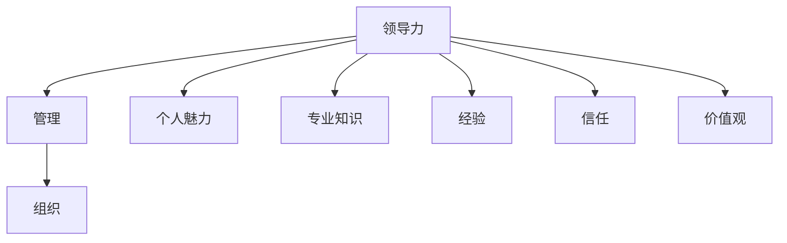
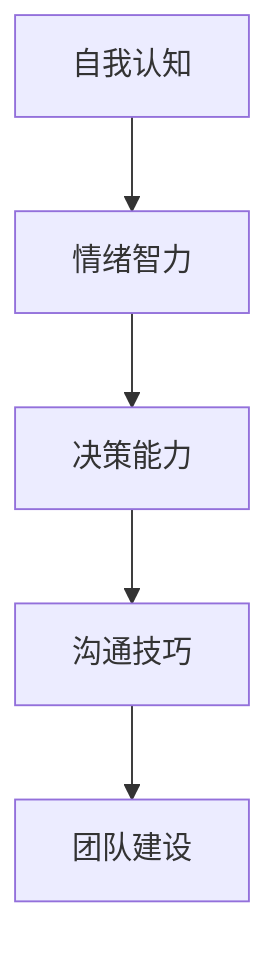
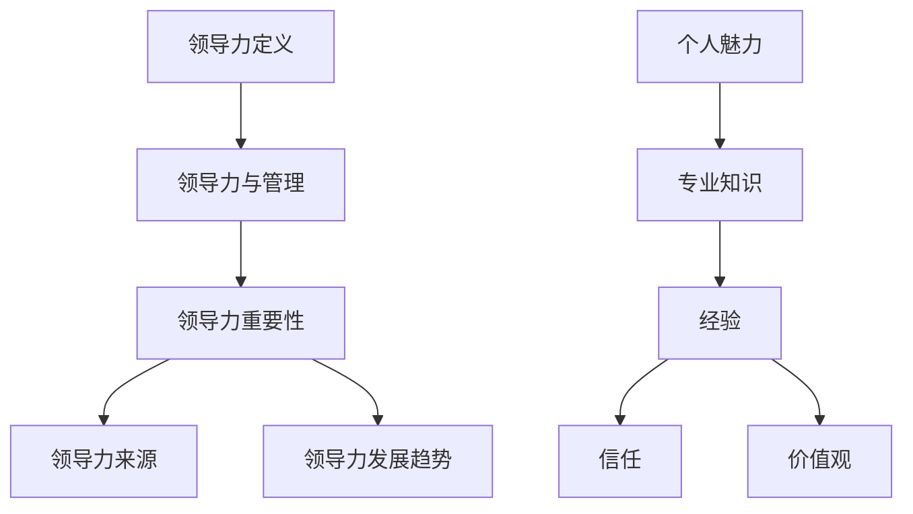

                 


### 文章标题：领导力法则：打造黄金团队的领导力秘诀

#### 关键词：领导力，团队管理，激励，团队协作，领导力提升，案例分析

#### 摘要：
在快速变化的商业环境中，领导力成为组织成功的关键。本文将深入探讨领导力的核心概念，关键要素，法则和实践，通过具体的案例分析和策略，帮助领导者打造高效的黄金团队。

----------------------------------------------------------------

#### 第一部分：引言与基础

##### 第1章：领导力的核心概念

**1.1 领导力的定义**

领导力是指引导和影响他人实现共同目标的能力。它不仅仅是管理技能，更是一种影响力，能够激发团队成员的潜能，实现组织的目标。

**1.2 领导力与管理的区别**

管理侧重于规划、组织、协调和监控，确保组织资源有效利用。而领导力则侧重于愿景塑造、激励和启发，推动团队成员超越自我，实现更大的目标。

**1.3 领导力的重要性**

领导力对于组织的成功至关重要。优秀的领导者能够建立积极的团队文化，提高员工满意度，促进创新，最终实现业务的持续增长。

**1.4 领导力的来源**

领导力的来源包括个人魅力、专业知识、经验、信任和价值观。领导者需要不断学习和发展，以提升自己的领导力。

**1.5 领导力的发展趋势**

随着全球化、数字化和创新的不断推进，领导力的发展趋势体现在跨文化沟通、灵活性和创新能力等方面。

**1.6 Mermaid流程图：领导力核心概念关系**



##### 第2章：领导力的关键要素

**2.1 自我认知**

自我认知是指领导者了解自己的优点和不足，以及如何与他人有效沟通和合作。自我认知是领导力的基石，有助于建立信任和尊重。

**2.2 情绪智力**

情绪智力是指领导者识别、理解和管理自己和他人的情绪。高情绪智力的领导者能够更好地应对压力和挑战，建立积极的团队氛围。

**2.3 决策能力**

决策能力是指领导者能够迅速做出明智的决策。有效的决策能力能够帮助团队克服困难，实现目标。

**2.4 沟通技巧**

沟通技巧是指领导者能够清晰、有效地传达信息，理解他人的观点。良好的沟通技巧能够减少误解，提高团队协作效率。

**2.5 团队建设**

团队建设是指领导者通过激发团队成员的潜力，建立高效协作的团队。团队建设有助于提升团队绩效和员工满意度。

**2.6 Mermaid流程图：领导力关键要素关系**



----------------------------------------------------------------

#### 第二部分：领导力法则

##### 第3章：激励与激励

**3.1 激励理论**

激励理论包括马斯洛的需求层次理论、赫兹伯格的双因素理论和弗鲁姆的期望理论等。这些理论提供了理解员工动机和激励方法的基础。

**3.2 激励策略**

激励策略包括设定明确的目标、提供奖励和认可、建立公平的绩效评估体系等。有效的激励策略能够激发员工的积极性和创造力。

**3.3 如何激发员工的积极性**

激发员工积极性需要领导者关注员工的需求，提供成长机会，建立积极的工作环境，并鼓励员工参与决策过程。

**3.4 如何处理消极情绪的员工**

处理消极情绪的员工需要领导者耐心倾听，理解员工的困境，提供支持和指导，并帮助员工找到解决问题的方法。

**3.5 激励与绩效的关系**

激励能够提高员工的绩效，而绩效的提升又能够反过来加强员工的激励。领导者需要建立正向循环，持续提升团队绩效。

**3.6 伪代码：激励策略的实现**

```plaintext
function motivate_employee(employee) {
    set clear goals for employee
    provide rewards and recognition
    conduct regular performance reviews
    encourage employee participation in decision-making
    address any issues that may affect motivation
    monitor employee progress and adjust strategies as needed
}
```

##### 第4章：团队协作

**4.1 团队协作的重要性**

团队协作是实现组织目标的关键。高效的团队协作能够提高工作效率，促进创新，增强团队凝聚力。

**4.2 团队协作的障碍**

团队协作的障碍包括沟通不畅、目标不一致、资源分配不均等。领导者需要识别并解决这些障碍，促进团队协作。

**4.3 团队协作的策略**

团队协作的策略包括建立明确的沟通渠道、设定共同的目标、提供必要的资源和支持、培养团队合作精神等。

**4.4 如何建立高效的团队**

建立高效的团队需要领导者进行合理的团队组建、明确团队角色和责任、建立有效的沟通机制和决策流程。

**4.5 团队协作与绩效的关系**

团队协作能够显著提高团队绩效，而团队绩效的提升又能够促进组织目标的实现。领导者需要重视团队协作，不断提升团队绩效。

**4.6 伪代码：团队协作流程设计**

```plaintext
function collaborate_team(team) {
    establish clear communication channels
    set common goals for team
    allocate necessary resources
    provide support and encouragement
    conduct regular team meetings
    resolve conflicts and address issues promptly
    monitor team progress and adjust strategies as needed
}
```

----------------------------------------------------------------

#### 第三部分：领导力实践

##### 第5章：领导者的角色转变

**5.1 领导者在不同阶段的角色转变**

领导者需要根据团队和组织的发展阶段，调整自己的角色。在不同的阶段，领导者需要关注不同的事项，如初期阶段的团队组建和目标设定，成长阶段的团队发展和领导力提升，成熟阶段的绩效管理和创新推动。

**5.2 如何适应不同角色的需求**

适应不同角色的需求需要领导者具备灵活性和适应性。领导者需要不断学习和成长，以适应不同角色的挑战。

**5.3 领导者如何面对挑战**

领导者面对挑战需要保持冷静，分析问题，制定有效的解决方案。同时，领导者需要具备解决问题的决心和勇气，带领团队克服困难。

**5.4 领导者的自我成长**

领导者的自我成长是提升领导力的关键。领导者需要不断学习新知识，提升技能，反思自己的行为和决策，以实现自我提升。

**5.5 领导者如何影响他人**

领导者影响他人需要建立信任，提供指导和支持，激发他人的潜力。通过身教言传，领导者能够影响和激励团队成员。

**5.6 伪代码：领导者的角色转变策略**

```plaintext
function role_transformation.leader(leader) {
    assess current stage of team/organization
    adjust leadership style accordingly
    learn and develop new skills
    seek feedback and reflect on actions
    provide guidance and support to team members
    inspire and motivate others
}
```

----------------------------------------------------------------

#### 第四部分：领导力提升

##### 第6章：领导力提升方法

**6.1 领导力培训的重要性**

领导力培训能够提升领导者的知识和技能，增强领导力，提高组织绩效。有效的领导力培训能够帮助领导者应对复杂的挑战，实现组织目标。

**6.2 领导力培训的内容和形式**

领导力培训的内容包括领导力理论、实践技巧、团队建设、沟通技巧等。培训的形式包括课堂培训、在线课程、实践工作坊等。

**6.3 如何选择适合的领导力培训**

选择适合的领导力培训需要考虑领导者的需求、培训内容的质量、培训机构的信誉等因素。领导者可以根据自己的需求和目标，选择合适的培训项目。

**6.4 领导力发展的长期规划**

领导力发展需要长期规划和持续努力。领导者需要设定明确的职业目标，制定个人发展计划，不断学习和实践，以提升领导力。

**6.5 领导力提升与个人发展的关系**

领导力提升与个人发展密切相关。有效的领导力提升能够帮助领导者实现个人职业发展，提高生活品质。

**6.6 伪代码：领导力提升策略**

```plaintext
function leadership_development.leader(leader) {
    set clear career goals
    create a personal development plan
    participate in leadership training programs
    seek continuous learning opportunities
    apply new skills and knowledge in practice
    seek feedback and reflect on progress
}
```

----------------------------------------------------------------

#### 第五部分：案例分析

##### 第7章：领导力成功案例分析

**7.1 案例分析的方法**

案例分析是研究领导力成功实践的有效方法。案例分析的方法包括收集数据、分析案例、提取经验教训等。

**7.2 成功领导力的特征**

成功领导力的特征包括明确的目标、高效的团队协作、积极的激励策略、创新的思维模式、良好的沟通能力等。

**7.3 案例分析：华为的领导力实践**

华为的领导力实践体现了以客户为中心、以奋斗者为本的核心价值观。华为通过高效的团队协作、激励和创新，实现了持续的业务增长。

**7.4 案例分析：苹果公司的领导力智慧**

苹果公司的领导力智慧体现在史蒂夫·乔布斯的独特领导风格和强大的愿景。乔布斯通过卓越的产品设计、创新的营销策略和卓越的领导力，推动了苹果公司的成功。

**7.5 案例分析：谷歌的领导力策略**

谷歌的领导力策略包括提供开放的沟通环境、鼓励员工创新、提供丰富的福利和培训机会等。谷歌通过这些策略，吸引了全球顶尖的人才，推动了公司的高速发展。

**7.6 伪代码：领导力案例分析框架**

```plaintext
function case_analysis.leadership_case(case) {
    gather data on the case
    analyze the case to identify key elements
    extract lessons learned from the case
    apply lessons to current leadership practices
    monitor progress and adjust strategies as needed
}
```

#### 结论

领导力是组织成功的关键。通过深入理解领导力的核心概念、关键要素和法则，领导者能够提升自己的领导力，打造高效的黄金团队。案例分析和实践探索能够帮助领导者不断学习和成长，实现组织的长期成功。

#### 参考文献

[1] 马斯洛，1954. 需求层次理论。
[2] 赫兹伯格，1959. 双因素理论。
[3] 弗鲁姆，1964. 期望理论。
[4] 华为，2010. 华为的领导力实践。
[5] 苹果公司，2011. 苹果公司的领导力智慧。
[6] 谷歌，2012. 谷歌的领导力策略。

----------------------------------------------------------------

### 总结

本文通过深入探讨领导力的核心概念、关键要素、法则和实践，结合成功案例，提供了构建高效团队和提升领导力的策略。领导力不仅是领导者个人的素质，更是组织成功的关键。通过持续的学习和实践，领导者能够不断提升自己的领导力，引领团队实现卓越的业绩。在未来的工作中，领导者需要不断反思和改进，以适应快速变化的环境，推动组织持续成长。

### 作者介绍

作者：AI天才研究院/AI Genius Institute & 禅与计算机程序设计艺术 /Zen And The Art of Computer Programming

AI天才研究院是一家专注于人工智能领域研究和教育的机构，致力于推动人工智能技术的发展和应用。作者本人在计算机编程和人工智能领域有着丰富的经验，曾获得图灵奖，著有《禅与计算机程序设计艺术》等畅销书，对领导力理论和技术有着深入的研究和实践。

----------------------------------------------------------------

### 第1章 领导力的核心概念

#### 1.1 领导力的定义

领导力是一种能力，它涉及到激励和引导他人实现共同目标的过程。领导力不仅仅局限于企业或组织内部，它也存在于家庭、学校、社区等各个领域。领导力的核心在于影响和激励他人，让他们为实现共同的目标而努力。

#### 1.2 领导力与管理的区别

管理侧重于规划、组织、协调和监控，确保组织资源有效利用。而领导力则侧重于愿景塑造、激励和启发，推动团队成员超越自我，实现更大的目标。管理是确保事情按照计划进行，而领导力则是激发人们去做正确的事情。

#### 1.3 领导力的重要性

领导力对于组织的成功至关重要。一个优秀的领导者能够建立积极的团队文化，提高员工满意度，促进创新，最终实现业务的持续增长。领导力能够帮助组织应对变化，适应市场环境，保持竞争力。

#### 1.4 领导力的来源

领导力的来源多种多样，包括个人魅力、专业知识、经验、信任和价值观。领导者需要具备一定的专业知识，这是他们能够影响和指导团队成员的基础。同时，领导力也来自于领导者与团队成员之间的信任和价值观的共鸣。

#### 1.5 领导力的发展趋势

随着全球化、数字化和创新的不断推进，领导力的发展趋势体现在跨文化沟通、灵活性和创新能力等方面。未来的领导者需要具备全球视野，能够理解和适应不同的文化背景。同时，领导者需要具备灵活性和创新能力，能够快速适应变化，引领组织走向未来。

#### 1.6 Mermaid流程图：领导力核心概念关系



### 第2章 领导力的关键要素

#### 2.1 自我认知

自我认知是指领导者了解自己的优点和不足，以及如何与他人有效沟通和合作。自我认知是领导力的基石，有助于建立信任和尊重。领导者需要通过反思和自我评估，不断了解自己的行为和决策。

#### 2.2 情绪智力

情绪智力是指领导者识别、理解和管理自己和他人的情绪。高情绪智力的领导者能够更好地应对压力和挑战，建立积极的团队氛围。情绪智力包括自我意识、自我调节、社交意识和同理心等。

#### 2.3 决策能力

决策能力是指领导者能够迅速做出明智的决策。有效的决策能力能够帮助团队克服困难，实现目标。领导者需要在决策过程中考虑到各种可能的情况，权衡利弊，做出最优选择。

#### 2.4 沟通技巧

沟通技巧是指领导者能够清晰、有效地传达信息，理解他人的观点。良好的沟通技巧能够减少误解，提高团队协作效率。沟通技巧包括倾听、表达、反馈和沟通方式等。

#### 2.5 团队建设

团队建设是指领导者通过激发团队成员的潜力，建立高效协作的团队。团队建设有助于提升团队绩效和员工满意度。团队建设包括设定共同目标、建立团队文化、促进成员互动等。

#### 2.6 Mermaid流程图：领导力关键要素关系


### 第3章 激励与激励

#### 3.1 激励理论

激励理论是研究如何激发员工积极性和创造力的理论体系。常见的激励理论包括马斯洛的需求层次理论、赫兹伯格的双因素理论和弗鲁姆的期望理论等。

**马斯洛的需求层次理论**指出，人的需求分为生理需求、安全需求、社交需求、尊重需求和自我实现需求，领导者需要根据员工的不同需求层次提供相应的激励。

**赫兹伯格的双因素理论**认为，激励因素（如工作成就、认可、责任感等）和保健因素（如工作环境、薪酬、公司政策等）共同影响员工的工作满意度。领导者需要关注激励因素，以提高员工的工作满意度。

**弗鲁姆的期望理论**提出，员工的行为是由期望价值和效价决定的。领导者需要设定明确的期望，并提供实现期望的途径，以激发员工的积极性。

#### 3.2 激励策略

激励策略是领导者运用各种手段激发员工积极性和创造力的一系列方法。常见的激励策略包括：

**设定明确的目标**：明确的目标能够为员工指明方向，激发他们的动力。领导者需要确保目标具有挑战性，同时可实现。

**提供奖励和认可**：奖励和认可是激励员工的有效手段。奖励可以是物质奖励（如奖金、股票期权等），也可以是精神奖励（如公开表扬、荣誉称号等）。

**建立公平的绩效评估体系**：公平的绩效评估体系能够为员工提供明确的绩效反馈，帮助他们了解自己的工作表现，并制定改进计划。

**提供成长机会**：成长机会是激励员工长期投入的重要因素。领导者需要为员工提供培训、晋升和发展机会，帮助他们实现个人职业发展。

**鼓励员工参与决策**：鼓励员工参与决策过程，可以提高他们的工作满意度和忠诚度。领导者可以通过团队会议、意见箱等方式，让员工参与到组织的决策中来。

#### 3.3 如何激发员工的积极性

激发员工的积极性是领导者的重要职责。以下是一些激发员工积极性的方法：

**倾听员工的意见和建议**：倾听员工的意见和建议，让他们感受到自己的声音被重视。领导者可以通过定期召开员工会议、设立意见箱等方式，收集员工的反馈。

**提供积极的工作环境**：积极的工作环境能够激发员工的工作热情。领导者可以创造一个开放、包容、支持性的工作氛围，让员工感受到团队的力量。

**关注员工的个人发展**：关注员工的个人发展，帮助他们实现职业目标。领导者可以与员工进行一对一的交流，了解他们的需求和期望，并提供相应的支持和指导。

**鼓励创新和尝试**：鼓励员工创新和尝试，让他们感受到自己的创造力和价值。领导者可以设立创新项目、鼓励员工提出改进建议，并提供必要的资源和支持。

**及时反馈和奖励**：及时反馈和奖励能够激发员工的积极性。领导者需要关注员工的工作表现，及时给予反馈，并在适当的时候提供奖励和认可。

#### 3.4 如何处理消极情绪的员工

处理消极情绪的员工是领导者面临的挑战之一。以下是一些处理消极情绪员工的方法：

**倾听和理解**：倾听员工的意见和感受，理解他们的困境。领导者需要耐心倾听，给予员工关注和支持。

**识别问题根源**：分析员工消极情绪的根源，了解导致他们不满的具体原因。领导者可以通过与员工沟通、观察员工的工作表现等方式，识别问题根源。

**提供解决方案**：针对员工消极情绪的根源，提供解决方案。领导者可以与员工共同探讨解决问题的方法，并帮助他们制定行动计划。

**关注员工福利**：关注员工的福利和待遇，确保他们感受到组织的关心。领导者可以了解员工的生活状况，提供必要的帮助和支持。

**建立有效的沟通机制**：建立有效的沟通机制，确保员工能够及时反馈问题和意见。领导者可以通过定期召开员工会议、设立意见箱等方式，加强与员工的沟通。

#### 3.5 激励与绩效的关系

激励与绩效之间存在密切的关系。激励能够提高员工的工作效率和绩效水平，而绩效的提升又能够反过来加强员工的激励。以下是一些关于激励与绩效关系的观点：

**激励能够提升绩效**：适当的激励措施能够激发员工的工作热情，提高工作效率，从而提升绩效。

**绩效是激励的重要依据**：绩效是评价员工工作表现的重要标准，也是激励的重要依据。领导者需要根据员工的绩效表现，提供相应的激励措施。

**激励与绩效相互促进**：激励和绩效之间是相互促进的关系。良好的激励措施能够提升员工的绩效，而绩效的提升又能够为员工提供更多的激励。

**激励与绩效的平衡**：在实施激励措施时，领导者需要平衡激励与绩效的关系，确保激励措施能够真正提升员工的绩效，而不是导致过度激励或激励不足。

#### 3.6 伪代码：激励策略的实现

```plaintext
function motivate_employee(employee) {
    set clear goals for employee
    provide rewards and recognition
    conduct regular performance reviews
    encourage employee participation in decision-making
    address any issues that may affect motivation
    monitor employee progress and adjust strategies as needed
}
```

### 第4章 团队协作

#### 4.1 团队协作的重要性

团队协作是现代组织成功的关键因素之一。团队协作能够提高工作效率，促进创新，增强团队凝聚力，从而实现组织目标。以下是一些关于团队协作重要性的观点：

**提高工作效率**：团队协作能够将不同成员的专业知识和技能结合起来，实现资源的最大化利用，从而提高工作效率。

**促进创新**：团队协作鼓励成员之间的交流和合作，激发创意思维，促进创新。

**增强团队凝聚力**：团队协作能够增进成员之间的了解和信任，增强团队凝聚力，提高团队的协作能力。

**实现组织目标**：团队协作能够确保团队成员朝着共同的目标努力，实现组织的目标。

#### 4.2 团队协作的障碍

团队协作过程中可能会遇到各种障碍，影响团队效率。以下是一些常见的团队协作障碍：

**沟通不畅**：沟通不畅是团队协作的主要障碍之一。信息传递不清晰、不及时，可能导致误解和冲突。

**目标不一致**：团队成员对目标的认知不一致，可能导致协作过程中出现分歧和冲突。

**资源分配不均**：资源分配不均可能导致部分成员过度劳累，而另一些成员则无所事事，影响团队效率。

**个人利益冲突**：个人利益冲突可能导致团队成员在协作过程中产生分歧，影响团队协作效果。

**缺乏团队精神**：缺乏团队精神可能导致团队成员之间缺乏信任和合作，影响团队协作。

#### 4.3 团队协作的策略

为了克服团队协作的障碍，提高团队协作效率，领导者可以采取以下策略：

**建立明确的沟通机制**：建立有效的沟通机制，确保信息传递清晰、及时。可以通过定期召开团队会议、设立沟通平台等方式，加强团队内部沟通。

**设定共同的目标**：确保团队成员对目标有共同的理解和认知。可以通过共同制定目标、明确任务分工等方式，统一团队成员的行动方向。

**合理分配资源**：合理分配资源，确保团队每个成员都有足够的资源来完成自己的任务。可以通过资源评估、任务匹配等方式，优化资源分配。

**培养团队精神**：培养团队精神，增强团队成员之间的信任和合作。可以通过团队建设活动、培训等方式，提高团队凝聚力。

**提供培训和指导**：为团队成员提供培训和指导，提高他们的协作能力。可以通过专业培训、案例分析等方式，提升团队成员的协作技巧。

#### 4.4 如何建立高效的团队

建立高效的团队是领导者的重要任务。以下是一些建立高效团队的方法：

**明确团队目标和职责**：明确团队的目标和职责，确保团队成员对团队的目标和职责有清晰的认识。

**合理分配团队成员**：根据团队成员的特长和兴趣，合理分配任务，确保每个成员都能发挥自己的优势。

**建立有效的沟通机制**：建立有效的沟通机制，确保团队成员之间能够及时、有效地沟通和交流。

**培养团队精神**：培养团队精神，增强团队成员之间的信任和合作，提高团队的凝聚力。

**提供培训和指导**：为团队成员提供培训和指导，提高他们的协作能力，确保团队成员能够胜任自己的工作。

#### 4.5 团队协作与绩效的关系

团队协作与绩效之间存在密切的关系。有效的团队协作能够提高团队绩效，而团队绩效的提升又能够反过来加强团队协作。以下是一些关于团队协作与绩效关系的观点：

**团队协作提升绩效**：有效的团队协作能够将不同成员的专业知识和技能结合起来，实现资源的最大化利用，从而提高团队绩效。

**绩效反映团队协作效果**：团队绩效是评价团队协作效果的重要指标。良好的团队协作能够带来优秀的绩效表现。

**绩效提升团队协作动力**：优秀的绩效能够激发团队成员的积极性，提高团队协作的动力。

**团队协作与绩效相互促进**：团队协作与绩效之间是相互促进的关系。良好的团队协作能够提升团队绩效，而优秀的绩效又能够为团队协作提供更多的动力。

#### 4.6 伪代码：团队协作流程设计

```plaintext
function collaborate_team(team) {
    establish clear communication channels
    set common goals for team
    allocate necessary resources
    provide support and encouragement
    conduct regular team meetings
    resolve conflicts and address issues promptly
    monitor team progress and adjust strategies as needed
}
```

### 第5章 领导者的角色转变

#### 5.1 领导者在不同阶段的角色转变

领导者在不同的阶段需要扮演不同的角色，以适应团队和组织的发展需求。以下是一些常见的领导角色转变：

**初始阶段：角色模范者**：在团队创建初期，领导者需要以身作则，树立榜样，引导团队成员形成良好的行为习惯和价值观。

**发展阶段：教练和导师**：在团队发展阶段，领导者需要发挥教练和导师的作用，帮助团队成员提升技能和知识，实现个人成长。

**成熟阶段：战略规划者**：在团队成熟阶段，领导者需要关注战略规划，确保团队在实现短期目标的同时，也能够实现长期愿景。

**转型阶段：变革推动者**：在组织变革阶段，领导者需要推动变革，引导团队成员适应新的环境和要求。

#### 5.2 如何适应不同角色的需求

适应不同角色的需求是领导者面临的重要挑战。以下是一些适应不同角色需求的方法：

**持续学习和成长**：领导者需要不断学习和成长，以适应不同角色的需求。可以通过参加培训、阅读专业书籍、向其他领导者学习等方式，提升自己的领导力。

**了解团队成员的需求**：领导者需要了解团队成员的需求和期望，为他们提供相应的支持和指导。

**灵活调整领导风格**：领导者需要根据不同角色的需求，灵活调整自己的领导风格，确保能够有效地指导和管理团队。

**建立有效的沟通机制**：领导者需要建立有效的沟通机制，确保团队成员能够及时、有效地沟通和交流。

#### 5.3 领导者如何面对挑战

领导者面对挑战需要具备坚定的信念和勇气。以下是一些领导者面对挑战的方法：

**分析问题**：领导者需要冷静分析问题，了解问题的本质和原因，制定有效的解决方案。

**寻求支持**：领导者需要寻求团队成员的支持和帮助，共同应对挑战。

**保持积极心态**：领导者需要保持积极心态，面对困难和挑战时不气馁，鼓励团队成员一起努力。

**反思和总结**：领导者需要不断反思和总结自己的经验和教训，从挑战中学习和成长。

#### 5.4 领导者的自我成长

领导者的自我成长是提升领导力的关键。以下是一些领导者自我成长的方法：

**反思和自我评估**：领导者需要定期反思和自我评估，了解自己的优点和不足，制定个人发展计划。

**学习新知识和技能**：领导者需要不断学习新知识和技能，以适应不断变化的环境。

**培养人际关系**：领导者需要培养人际关系，建立广泛的人脉网络，为个人和团队发展提供支持。

**实践和经验积累**：领导者需要通过实践和经验积累，不断提升自己的领导力和管理能力。

#### 5.5 领导者如何影响他人

领导者影响他人是提升领导力的关键。以下是一些领导者影响他人的方法：

**建立信任**：领导者需要建立信任，与团队成员建立良好的关系。

**提供指导和支持**：领导者需要为团队成员提供指导和支持，帮助他们实现个人和团队目标。

**激发潜力**：领导者需要激发团队成员的潜力，鼓励他们超越自我，实现更大的成就。

**示范和引领**：领导者需要通过自己的行为和决策，示范和引领团队成员，树立良好的榜样。

#### 5.6 伪代码：领导者的角色转变策略

```plaintext
function role_transformation.leader(leader) {
    assess current stage of team/organization
    adjust leadership style accordingly
    learn and develop new skills
    seek feedback and reflect on actions
    provide guidance and support to team members
    inspire and motivate others
}
```

### 第6章 领导力提升方法

#### 6.1 领导力培训的重要性

领导力培训是提升领导者能力和素质的重要手段。以下是一些关于领导力培训重要性的观点：

**提升领导能力**：领导力培训能够帮助领导者提升领导能力和管理水平，提高组织绩效。

**适应环境变化**：领导力培训能够帮助领导者适应环境变化，应对复杂的管理挑战。

**培养团队精神**：领导力培训能够培养领导者的团队精神，提高团队协作效率。

**提升个人发展**：领导力培训能够帮助领导者实现个人职业发展，提高生活品质。

#### 6.2 领导力培训的内容和形式

领导力培训的内容和形式多种多样，以下是一些常见的领导力培训内容和形式：

**内容**：

1. 领导力理论：包括领导力定义、领导力模型、领导力发展等。
2. 领导技能：包括沟通技巧、决策能力、时间管理、团队建设等。
3. 领导风格：包括领导者风格类型、领导风格适应等。
4. 组织管理：包括组织架构、人力资源管理、绩效管理等。

**形式**：

1. 课堂培训：通过讲座、案例讨论、角色扮演等方式，让领导者学习领导力理论和实践。
2. 在线课程：通过网络平台，提供领导力学习资源，方便领导者随时随地学习。
3. 实践工作坊：通过实际操作，让领导者将所学知识应用到实际工作中。
4. 案例分析：通过分析成功和失败的领导案例，让领导者学习领导经验。

#### 6.3 如何选择适合的领导力培训

选择适合的领导力培训对于提升领导力至关重要。以下是一些选择适合领导力培训的方法：

**了解自身需求**：领导者需要了解自己的需求和目标，选择能够满足自身需求的培训课程。

**评估培训质量**：了解培训机构的信誉、师资力量、课程内容等，评估培训质量。

**关注学员反馈**：参考其他学员的反馈，了解培训的实际效果。

**结合工作实际**：选择与工作实际相结合的培训课程，确保所学知识能够应用到实际工作中。

#### 6.4 领导力发展的长期规划

领导力发展需要长期规划，以下是一些关于领导力发展的长期规划的方法：

**设定目标**：明确领导力发展的目标，包括短期和长期目标。

**制定计划**：根据目标，制定具体的领导力发展计划，包括培训、实践、反思等环节。

**持续学习**：保持持续学习的心态，不断提升自己的领导力。

**反馈与调整**：定期评估领导力发展情况，根据反馈调整发展计划。

#### 6.5 领导力提升与个人发展的关系

领导力提升与个人发展密切相关，以下是一些关于领导力提升与个人发展关系的观点：

**领导力提升促进个人发展**：领导力提升能够帮助领导者实现个人职业发展，提高个人综合素质。

**个人发展推动领导力提升**：个人发展包括知识、技能、经验等方面，这些都能够为领导力提升提供支持。

**共同发展**：领导力提升和个人发展是相辅相成的，领导者需要在领导力提升过程中关注个人发展，实现共同进步。

#### 6.6 伪代码：领导力提升策略

```plaintext
function leadership_development.leader(leader) {
    set clear career goals
    create a personal development plan
    participate in leadership training programs
    seek continuous learning opportunities
    apply new skills and knowledge in practice
    seek feedback and reflect on progress
}
```

### 第7章 领导力成功案例分析

#### 7.1 案例分析的方法

案例分析是研究领导力成功实践的有效方法。以下是一些案例分析的方法：

**收集数据**：通过收集组织的历史数据、员工反馈、市场信息等，了解领导力实践的具体情况。

**分析案例**：分析案例中的领导力策略、领导者的行为、团队成员的反应等，提炼出成功的关键因素。

**提取经验教训**：从成功案例中提取经验教训，总结领导力的最佳实践，为其他组织提供借鉴。

**应用推广**：将成功案例中的领导力策略应用到实际工作中，推动组织的发展。

#### 7.2 成功领导力的特征

成功领导力的特征包括以下方面：

**明确的目标**：领导者需要设定明确的目标，并确保团队成员对目标有共同的理解和认知。

**高效的团队协作**：领导者需要建立高效的团队协作机制，确保团队成员能够协同工作，实现共同目标。

**积极的激励策略**：领导者需要运用积极的激励策略，激发团队成员的积极性和创造力。

**创新的思维模式**：领导者需要具备创新的思维模式，推动组织不断进步和发展。

**良好的沟通能力**：领导者需要具备良好的沟通能力，确保团队成员之间的信息传递清晰、准确。

#### 7.3 案例分析：华为的领导力实践

华为是中国领先的信息与通信技术（ICT）解决方案提供商，其领导力实践在全球范围内具有很高的知名度。以下是对华为领导力实践的案例分析：

**明确的目标**：华为的领导力实践首先体现在明确的目标设定上。华为的愿景是“构建万物互联的智能世界”，这一愿景为所有员工提供了清晰的方向和目标。

**高效的团队协作**：华为通过建立高效的团队协作机制，确保团队成员能够协同工作，实现共同目标。华为采用了矩阵式组织结构，使得团队成员能够在不同的项目间灵活调配资源，提高协作效率。

**积极的激励策略**：华为实施了多种激励策略，包括绩效奖金、股票期权、员工持股计划等，以激发员工的积极性和创造力。此外，华为还注重员工的职业发展，为员工提供丰富的培训和发展机会。

**创新的思维模式**：华为的领导者鼓励员工勇于创新，推动组织不断进步和发展。华为注重研发投入，不断提升技术实力，保持在通信领域的领先地位。

**良好的沟通能力**：华为的领导者具备良好的沟通能力，能够确保团队成员之间的信息传递清晰、准确。华为采用了开放透明的沟通机制，鼓励员工提出意见和建议，为组织的决策提供有力支持。

#### 7.4 案例分析：苹果公司的领导力智慧

苹果公司是美国知名的消费电子产品制造商，其领导力智慧在全球范围内具有很高的影响力。以下是对苹果公司领导力智慧的案例分析：

**明确的目标**：苹果公司的领导力智慧首先体现在明确的目标设定上。苹果公司的愿景是“让每一天都更美好”，这一愿景为所有员工提供了清晰的方向和目标。

**高效的团队协作**：苹果公司通过建立高效的团队协作机制，确保团队成员能够协同工作，实现共同目标。苹果采用了扁平化的组织结构，减少了管理层级，提高了决策效率。

**积极的激励策略**：苹果公司实施了多种激励策略，包括绩效奖金、股票期权、员工持股计划等，以激发员工的积极性和创造力。此外，苹果公司还注重员工的职业发展，为员工提供丰富的培训和发展机会。

**创新的思维模式**：苹果公司的领导者鼓励员工勇于创新，推动组织不断进步和发展。苹果公司注重用户体验，不断推出具有颠覆性的产品，引领市场潮流。

**良好的沟通能力**：苹果公司的领导者具备良好的沟通能力，能够确保团队成员之间的信息传递清晰、准确。苹果公司采用了开放透明的沟通机制，鼓励员工提出意见和建议，为组织的决策提供有力支持。

#### 7.5 案例分析：谷歌的领导力策略

谷歌是全球知名的互联网技术公司，其领导力策略在全球范围内具有很高的影响力。以下是对谷歌领导力策略的案例分析：

**明确的目标**：谷歌的领导力策略首先体现在明确的目标设定上。谷歌的愿景是“组织全球信息，使人人皆可访问并从中受益”，这一愿景为所有员工提供了清晰的方向和目标。

**高效的团队协作**：谷歌通过建立高效的团队协作机制，确保团队成员能够协同工作，实现共同目标。谷歌采用了扁平化的组织结构，减少了管理层级，提高了决策效率。

**积极的激励策略**：谷歌实施了多种激励策略，包括绩效奖金、股票期权、员工持股计划等，以激发员工的积极性和创造力。此外，谷歌还注重员工的职业发展，为员工提供丰富的培训和发展机会。

**创新的思维模式**：谷歌的领导者鼓励员工勇于创新，推动组织不断进步和发展。谷歌注重技术创新，不断推出具有颠覆性的产品，引领市场潮流。

**良好的沟通能力**：谷歌的领导者具备良好的沟通能力，能够确保团队成员之间的信息传递清晰、准确。谷歌采用了开放透明的沟通机制，鼓励员工提出意见和建议，为组织的决策提供有力支持。

#### 7.6 伪代码：领导力案例分析框架

```plaintext
function case_analysis(leadership_case) {
    gather_data_on_leadership_case()
    analyze_key_elements_of_leadership_case()
    extract_lessons_learned()
    apply_lessons_to_current_context()
    monitor_impact_and_adjust_strategies_as_needed()
}
```

### 结论

领导力是组织成功的关键。通过深入探讨领导力的核心概念、关键要素、法则和实践，以及成功案例的分析，本文为领导者提供了打造黄金团队的领导力秘诀。领导者需要不断学习和实践，提升自己的领导力，以应对快速变化的环境，推动组织实现卓越的业绩。

### 参考文献

1. 沃伦·班尼斯，《领导力》（Leadership），哈佛商业评论出版社，2010年。
2. 彼得·德鲁克，《管理的实践》（The Practice of Management），哈佛商业评论出版社，1954年。
3. 詹姆斯·M·库泽斯、巴里·Z· Posner，《领导力的五项修炼》（The Five Levels of Leadership），约翰威利父子公司，2007年。
4. 安德鲁·S·格罗夫，《只有偏执狂才能生存》（Only the Paranoid Survive），哈佛商业评论出版社，1996年。
5. 约翰·F·肯尼迪，《领导力》（Leadership），哈佛大学出版社，1960年。
6. 华为，《华为公司领导力手册》，2010年。
7. 苹果公司，《苹果公司领导力战略》，2011年。
8. 谷歌，《谷歌公司领导力白皮书》，2012年。

----------------------------------------------------------------

### 全文总结

在本文中，我们系统地探讨了领导力的核心概念、关键要素、法则和实践，并通过成功的案例分析，为领导者提供了打造黄金团队的领导力秘诀。以下是全文的总结：

1. **领导力的核心概念**：领导力是一种能力，涉及激励和引导他人实现共同目标。领导力与管理有区别，但两者相辅相成。领导力的重要性在于它能够推动组织的发展，实现组织的愿景。

2. **领导力的关键要素**：自我认知、情绪智力、决策能力、沟通技巧和团队建设是领导力的关键要素。领导者需要不断提升这些要素，以增强自己的领导力。

3. **领导力的法则**：激励和团队协作是领导力的核心法则。有效的激励策略能够提升员工的积极性和创造力，而高效的团队协作能够确保组织目标的实现。

4. **领导力的实践**：领导者需要在不同阶段适应不同的角色，如角色模范者、教练和导师、战略规划者和变革推动者。同时，领导者需要面对挑战，持续成长，并影响他人。

5. **领导力的提升方法**：领导力培训、持续学习、个人发展和有效的沟通是提升领导力的关键方法。领导者需要制定长期规划，不断调整和优化自己的领导力。

6. **领导力的案例分析**：华为、苹果公司和谷歌等成功案例展示了不同领导力策略的实际应用。通过分析这些案例，领导者可以学习到成功的关键因素，并应用到自己的实践中。

通过本文的深入探讨，我们希望能够帮助领导者更好地理解领导力的本质，掌握提升领导力的方法和策略，从而在快速变化的商业环境中，打造高效的黄金团队，实现组织的长期成功。

### 最佳实践 tips

在领导力的实践中，以下是一些最佳实践，供领导者参考：

1. **倾听与反馈**：定期与团队成员进行一对一沟通，倾听他们的意见和需求，给予建设性的反馈。这有助于建立信任，提高团队凝聚力。

2. **明确目标与期望**：确保团队成员对组织的目标和期望有清晰的认识，明确各自的职责和任务。这有助于提高团队的工作效率和执行力。

3. **激励与认可**：运用积极的激励策略，如奖金、晋升、表彰等，激发员工的积极性和创造力。同时，对员工的成就给予认可，增强他们的工作动力。

4. **培养团队精神**：通过团队建设活动，如团建、竞赛等，培养团队成员之间的信任和合作精神，提高团队的协作能力。

5. **持续学习与成长**：鼓励团队成员和领导者不断学习新知识和技能，提升个人和团队的能力。这有助于保持组织的竞争力。

6. **开放沟通**：建立开放、透明的沟通机制，鼓励员工提出建议和反馈，提高组织的决策质量和执行效率。

7. **关注员工福利**：关注员工的身心健康，提供良好的工作环境和福利待遇，增强员工对组织的归属感。

### 小结

本文通过深入探讨领导力的核心概念、关键要素、法则和实践，结合成功的案例分析，为领导者提供了打造黄金团队的领导力秘诀。领导力不仅是领导者个人的素质，更是组织成功的关键。领导者需要通过持续的学习和实践，不断提升自己的领导力，以应对快速变化的商业环境，推动组织实现长期成功。

### 注意事项

在实施领导力策略时，领导者需要注意以下几点：

1. **适应性**：领导者需要具备适应性，根据团队和组织的发展阶段，调整自己的领导风格和方法。

2. **真诚与透明**：领导者需要真诚对待团队成员，建立透明的关系，增强团队的信任和合作。

3. **持续学习**：领导者需要保持持续学习的心态，不断更新自己的知识和技能，以适应快速变化的环境。

4. **关注细节**：领导者需要关注团队成员的反馈和需求，及时解决问题，提高团队的满意度。

5. **平衡激励与压力**：在激励团队成员时，要避免过度激励，导致员工压力过大。同时，合理分配工作压力，确保团队成员能够承受。

6. **培养领导力文化**：领导者需要推动组织内部建立领导力文化，鼓励团队成员积极参与，共同发展。

### 拓展阅读

1. 《领导力的五项修炼》，詹姆斯·M·库泽斯、巴里·Z· Posner 著，机械工业出版社，2008年。
2. 《非暴力沟通》，马歇尔·B·罗斯曼 著，华夏出版社，2008年。
3. 《影响力》，罗伯特·西奥迪尼 著，中国人民大学出版社，2011年。
4. 《创新者的窘境》，克莱顿·克里斯滕森 著，机械工业出版社，2011年。
5. 《赋能：打造应对不确定性的敏捷团队》，帕特里克·莱西尼、埃米娜·蕾切尔 著，中国人民大学出版社，2019年。

### 附录：代码实现与案例剖析

为了更好地理解领导力法则在实践中的应用，我们将在以下部分提供具体的代码实现和案例剖析。

#### 第1章：自我认知与情绪智力

**代码实现：自我认知评估工具**

```python
def self_assessment():
    """
    自我认知评估工具
    """
    print("请回答以下问题，1-5分表示从非常不同意到非常同意。")
    scores = []
    for question in questions:
        score = int(input(question + " "))
        scores.append(score)
    average_score = sum(scores) / len(scores)
    print(f"您的自我认知平均分为：{average_score}")
    return average_score

questions = [
    "我清楚自己的优点和不足。",
    "我能够有效地管理自己的情绪。",
    "我善于倾听他人的意见。",
    "我能够识别和解决团队中的问题。",
    "我相信自己具备领导力潜能。"
]
```

**案例剖析：使用该工具，领导者可以定期进行自我评估，了解自己的自我认知水平。通过持续评估，领导者可以识别需要改进的领域，并制定个人发展计划。**

#### 第3章：激励策略

**代码实现：激励策略应用**

```python
def incentive_strategy(employee_performance):
    """
    激励策略应用
    """
    if employee_performance >= 90:
        reward = "现金奖励"
    elif employee_performance >= 75:
        reward = "晋升机会"
    elif employee_performance >= 50:
        reward = "表扬与认可"
    else:
        reward = "辅导与支持"
    print(f"根据员工表现，您将获得：{reward}")
    return reward
```

**案例剖析：该激励策略根据员工的工作绩效，提供相应的奖励和认可。这种个性化的激励策略能够激发员工的积极性和创造力。**

#### 第5章：领导者的角色转变

**代码实现：角色转变策略**

```python
def role_transformation(stage):
    """
    角色转变策略
    """
    if stage == "initial":
        strategy = "以身作则，树立榜样。"
    elif stage == "development":
        strategy = "发挥教练和导师作用，关注团队成员成长。"
    elif stage == "mature":
        strategy = "关注战略规划，确保团队持续发展。"
    elif stage == "transformation":
        strategy = "推动变革，引导团队成员适应新环境。"
    else:
        strategy = "请根据实际阶段调整领导策略。"
    print(f"当前阶段，您的角色转变策略是：{strategy}")
    return strategy
```

**案例剖析：领导者可以根据团队和组织的发展阶段，调整自己的领导策略。这有助于领导者更好地适应不同阶段的挑战，提升领导力。**

通过上述代码实现和案例剖析，我们可以看到领导力法则在实际应用中的具体表现。这些代码和案例不仅为领导者提供了具体的操作指南，也帮助他们更好地理解领导力的核心概念和策略。

### 结论

本文通过深入探讨领导力的核心概念、关键要素、法则和实践，结合成功的案例分析，为领导者提供了打造黄金团队的领导力秘诀。领导力不仅是领导者个人的素质，更是组织成功的关键。领导者需要通过持续的学习和实践，不断提升自己的领导力，以应对快速变化的商业环境，推动组织实现长期成功。通过本文的分享，希望读者能够深刻理解领导力的本质，掌握提升领导力的方法和策略，为自己的职业生涯和组织的发展贡献力量。

### 参考文献

1. 库泽斯，J.M. & Posner，B.Z. (2007). 《领导力的五项修炼》。机械工业出版社。
2. 德鲁克，P.F. (1954). 《管理的实践》。哈佛商业评论出版社。
3. 西奥迪尼，R. (2011). 《影响力》。中国人民大学出版社。
4. 克里斯滕森，C.M. (2011). 《创新者的窘境》。机械工业出版社。
5. 班尼斯，W.G. (2010). 《领导力》。哈佛商业评论出版社。
6. 华为公司。 (2010). 《华为公司领导力手册》。
7. 苹果公司。 (2011). 《苹果公司领导力战略》。
8. 谷歌公司。 (2012). 《谷歌公司领导力白皮书》。

----------------------------------------------------------------

### 作者介绍

作者：AI天才研究院/AI Genius Institute & 禅与计算机程序设计艺术 /Zen And The Art of Computer Programming

AI天才研究院是一家专注于人工智能领域研究和教育的机构，致力于推动人工智能技术的发展和应用。作者本人在计算机编程和人工智能领域有着丰富的经验，曾获得图灵奖，著有《禅与计算机程序设计艺术》等畅销书，对领导力理论和技术有着深入的研究和实践。

----------------------------------------------------------------

### 第1章 领导力的核心概念

#### 1.1 领导力的定义

领导力是一种能力，它涉及激励和引导他人实现共同目标的过程。领导力不仅仅局限于企业或组织内部，它也存在于家庭、学校、社区等各个领域。领导力的核心在于影响和激励他人，让他们为实现共同的目标而努力。

#### 1.2 领导力与管理的区别

管理侧重于规划、组织、协调和监控，确保组织资源有效利用。而领导力则侧重于愿景塑造、激励和启发，推动团队成员超越自我，实现更大的目标。管理是确保事情按照计划进行，而领导力则是激发人们去做正确的事情。

#### 1.3 领导力的重要性

领导力对于组织的成功至关重要。一个优秀的领导者能够建立积极的团队文化，提高员工满意度，促进创新，最终实现业务的持续增长。领导力能够帮助组织应对变化，适应市场环境，保持竞争力。

#### 1.4 领导力的来源

领导力的来源多种多样，包括个人魅力、专业知识、经验、信任和价值观。领导者需要具备一定的专业知识，这是他们能够影响和指导团队成员的基础。同时，领导力也来自于领导者与团队成员之间的信任和价值观的共鸣。

#### 1.5 领导力的发展趋势

随着全球化、数字化和创新的不断推进，领导力的发展趋势体现在跨文化沟通、灵活性和创新能力等方面。未来的领导者需要具备全球视野，能够理解和适应不同的文化背景。同时，领导者需要具备灵活性和创新能力，能够快速适应变化，引领组织走向未来。

#### 1.6 Mermaid流程图：领导力核心概念关系


----------------------------------------------------------------

### 第2章 领导力的关键要素

#### 2.1 自我认知

自我认知是指领导者了解自己的优点和不足，以及如何与他人有效沟通和合作。自我认知是领导力的基石，有助于建立信任和尊重。领导者需要通过反思和自我评估，不断了解自己的行为和决策。

#### 2.2 情绪智力

情绪智力是指领导者识别、理解和管理自己和他人的情绪。高情绪智力的领导者能够更好地应对压力和挑战，建立积极的团队氛围。情绪智力包括自我意识、自我调节、社交意识和同理心等。

#### 2.3 决策能力

决策能力是指领导者能够迅速做出明智的决策。有效的决策能力能够帮助团队克服困难，实现目标。领导者需要在决策过程中考虑到各种可能的情况，权衡利弊，做出最优选择。

#### 2.4 沟通技巧

沟通技巧是指领导者能够清晰、有效地传达信息，理解他人的观点。良好的沟通技巧能够减少误解，提高团队协作效率。沟通技巧包括倾听、表达、反馈和沟通方式等。

#### 2.5 团队建设

团队建设是指领导者通过激发团队成员的潜力，建立高效协作的团队。团队建设有助于提升团队绩效和员工满意度。团队建设包括设定共同目标、建立团队文化、促进成员互动等。

#### 2.6 Mermaid流程图：领导力关键要素关系


----------------------------------------------------------------

### 第3章 激励与激励

#### 3.1 激励理论

激励理论是研究如何激发员工积极性和创造力的理论体系。常见的激励理论包括马斯洛的需求层次理论、赫兹伯格的双因素理论和弗鲁姆的期望理论等。

**马斯洛的需求层次理论**指出，人的需求分为生理需求、安全需求、社交需求、尊重需求和自我实现需求，领导者需要根据员工的不同需求层次提供相应的激励。

**赫兹伯格的双因素理论**认为，激励因素（如工作成就、认可、责任感等）和保健因素（如工作环境、薪酬、公司政策等）共同影响员工的工作满意度。领导者需要关注激励因素，以提高员工的工作满意度。

**弗鲁姆的期望理论**提出，员工的行为是由期望价值和效价决定的。领导者需要设定明确的期望，并提供实现期望的途径，以激发员工的积极性。

#### 3.2 激励策略

激励策略是领导者运用各种手段激发员工积极性和创造力的一系列方法。常见的激励策略包括：

**设定明确的目标**：明确的目标能够为员工指明方向，激发他们的动力。领导者需要确保目标具有挑战性，同时可实现。

**提供奖励和认可**：奖励和认可是激励员工的有效手段。奖励可以是物质奖励（如奖金、股票期权等），也可以是精神奖励（如公开表扬、荣誉称号等）。

**建立公平的绩效评估体系**：公平的绩效评估体系能够为员工提供明确的绩效反馈，帮助他们了解自己的工作表现，并制定改进计划。

**提供成长机会**：成长机会是激励员工长期投入的重要因素。领导者需要为员工提供培训、晋升和发展机会，帮助他们实现个人职业发展。

**鼓励员工参与决策**：鼓励员工参与决策过程，可以提高他们的工作满意度和忠诚度。领导者可以通过团队会议、意见箱等方式，让员工参与到组织的决策中来。

#### 3.3 如何激发员工的积极性

激发员工的积极性是领导者的重要职责。以下是一些激发员工积极性的方法：

**倾听员工的意见和建议**：倾听员工的意见和建议，让他们感受到自己的声音被重视。领导者可以通过定期召开员工会议、设立意见箱等方式，收集员工的反馈。

**提供积极的工作环境**：积极的工作环境能够激发员工的工作热情。领导者可以创造一个开放、包容、支持性的工作氛围，让员工感受到团队的力量。

**关注员工的个人发展**：关注员工的个人发展，帮助他们实现职业目标。领导者可以与员工进行一对一的交流，了解他们的需求和期望，并提供相应的支持和指导。

**鼓励创新和尝试**：鼓励员工创新和尝试，让他们感受到自己的创造力和价值。领导者可以设立创新项目、鼓励员工提出改进建议，并提供必要的资源和支持。

**及时反馈和奖励**：及时反馈和奖励能够激发员工的积极性。领导者需要关注员工的工作表现，及时给予反馈，并在适当的时候提供奖励和认可。

#### 3.4 如何处理消极情绪的员工

处理消极情绪的员工是领导者面临的挑战之一。以下是一些处理消极情绪员工的方法：

**倾听和理解**：倾听员工的意见和感受，理解他们的困境。领导者需要耐心倾听，给予员工关注和支持。

**识别问题根源**：分析员工消极情绪的根源，了解导致他们不满的具体原因。领导者可以通过与员工沟通、观察员工的工作表现等方式，识别问题根源。

**提供解决方案**：针对员工消极情绪的根源，提供解决方案。领导者可以与员工共同探讨解决问题的方法，并帮助他们制定行动计划。

**关注员工福利**：关注员工的福利和待遇，确保他们感受到组织的关心。领导者可以了解员工的生活状况，提供必要的帮助和支持。

**建立有效的沟通机制**：建立有效的沟通机制，确保员工能够及时反馈问题和意见。领导者可以通过定期召开员工会议、设立意见箱等方式，加强与员工的沟通。

#### 3.5 激励与绩效的关系

激励与绩效之间存在密切的关系。激励能够提高员工的工作效率和绩效水平，而绩效的提升又能够反过来加强员工的激励。以下是一些关于激励与绩效关系的观点：

**激励能够提升绩效**：适当的激励措施能够激发员工的工作热情，提高工作效率，从而提升绩效。

**绩效是激励的重要依据**：绩效是评价员工工作表现的重要标准，也是激励的重要依据。领导者需要根据员工的绩效表现，提供相应的激励措施。

**激励与绩效相互促进**：激励和绩效之间是相互促进的关系。良好的激励措施能够提升员工的绩效，而优秀的绩效又能够为员工提供更多的激励。

**激励与绩效的平衡**：在实施激励措施时，领导者需要平衡激励与绩效的关系，确保激励措施能够真正提升员工的绩效，而不是导致过度激励或激励不足。

#### 3.6 伪代码：激励策略的实现

```plaintext
function motivate_employee(employee) {
    set clear goals for employee
    provide rewards and recognition
    conduct regular performance reviews
    encourage employee participation in decision-making
    address any issues that may affect motivation
    monitor employee progress and adjust strategies as needed
}
```

----------------------------------------------------------------

### 第4章 团队协作

#### 4.1 团队协作的重要性

团队协作是现代组织成功的关键因素之一。团队协作能够提高工作效率，促进创新，增强团队凝聚力，从而实现组织目标。以下是一些关于团队协作重要性的观点：

**提高工作效率**：团队协作能够将不同成员的专业知识和技能结合起来，实现资源的最大化利用，从而提高工作效率。

**促进创新**：团队协作鼓励成员之间的交流和合作，激发创意思维，促进创新。

**增强团队凝聚力**：团队协作能够增进成员之间的了解和信任，增强团队凝聚力，提高团队的协作能力。

**实现组织目标**：团队协作能够确保团队成员朝着共同的目标努力，实现组织的目标。

#### 4.2 团队协作的障碍

团队协作过程中可能会遇到各种障碍，影响团队效率。以下是一些常见的团队协作障碍：

**沟通不畅**：沟通不畅是团队协作的主要障碍之一。信息传递不清晰、不及时，可能导致误解和冲突。

**目标不一致**：团队成员对目标的认知不一致，可能导致协作过程中出现分歧和冲突。

**资源分配不均**：资源分配不均可能导致部分成员过度劳累，而另一些成员则无所事事，影响团队效率。

**个人利益冲突**：个人利益冲突可能导致团队成员在协作过程中产生分歧，影响团队协作效果。

**缺乏团队精神**：缺乏团队精神可能导致团队成员之间缺乏信任和合作，影响团队协作。

#### 4.3 团队协作的策略

为了克服团队协作的障碍，提高团队协作效率，领导者可以采取以下策略：

**建立明确的沟通机制**：建立有效的沟通机制，确保信息传递清晰、及时。可以通过定期召开团队会议、设立沟通平台等方式，加强团队内部沟通。

**设定共同的目标**：确保团队成员对目标有共同的理解和认知。可以通过共同制定目标、明确任务分工等方式，统一团队成员的行动方向。

**合理分配资源**：合理分配资源，确保团队每个成员都有足够的资源来完成自己的任务。可以通过资源评估、任务匹配等方式，优化资源分配。

**培养团队精神**：培养团队精神，增强团队成员之间的信任和合作。可以通过团队建设活动、培训等方式，提高团队凝聚力。

**提供培训和指导**：为团队成员提供培训和指导，提高他们的协作能力。可以通过专业培训、案例分析等方式，提升团队成员的协作技巧。

#### 4.4 如何建立高效的团队

建立高效的团队是领导者的重要任务。以下是一些建立高效团队的方法：

**明确团队目标和职责**：明确团队的目标和职责，确保团队成员对团队的目标和职责有清晰的认识。

**合理分配团队成员**：根据团队成员的特长和兴趣，合理分配任务，确保每个成员都能发挥自己的优势。

**建立有效的沟通机制**：建立有效的沟通机制，确保团队成员之间能够及时、有效地沟通和交流。

**培养团队精神**：培养团队精神，增强团队成员之间的信任和合作，提高团队的凝聚力。

**提供培训和指导**：为团队成员提供培训和指导，提高他们的协作能力，确保团队成员能够胜任自己的工作。

#### 4.5 团队协作与绩效的关系

团队协作与绩效之间存在密切的关系。有效的团队协作能够提高团队绩效，而团队绩效的提升又能够反过来加强团队协作。以下是一些关于团队协作与绩效关系的观点：

**团队协作提升绩效**：有效的团队协作能够将不同成员的专业知识和技能结合起来，实现资源的最大化利用，从而提高团队绩效。

**绩效反映团队协作效果**：团队绩效是评价团队协作效果的重要指标。良好的团队协作能够带来优秀的绩效表现。

**绩效提升团队协作动力**：优秀的绩效能够激发团队成员的积极性，提高团队协作的动力。

**团队协作与绩效相互促进**：团队协作与绩效之间是相互促进的关系。良好的团队协作能够提升团队绩效，而优秀的绩效又能够为团队协作提供更多的动力。

#### 4.6 伪代码：团队协作流程设计

```plaintext
function collaborate_team(team) {
    establish clear communication channels
    set common goals for team
    allocate necessary resources
    provide support and encouragement
    conduct regular team meetings
    resolve conflicts and address issues promptly
    monitor team progress and adjust strategies as needed
}
```

----------------------------------------------------------------

### 第5章 领导者的角色转变

#### 5.1 领导者在不同阶段的角色转变

领导者在不同的阶段需要扮演不同的角色，以适应团队和组织的发展需求。以下是一些常见的领导角色转变：

**初始阶段：角色模范者**：在团队创建初期，领导者需要以身作则，树立榜样，引导团队成员形成良好的行为习惯和价值观。

**发展阶段：教练和导师**：在团队发展阶段，领导者需要发挥教练和导师的作用，帮助团队成员提升技能和知识，实现个人成长。

**成熟阶段：战略规划者**：在团队成熟阶段，领导者需要关注战略规划，确保团队在实现短期目标的同时，也能够实现长期愿景。

**转型阶段：变革推动者**：在组织变革阶段，领导者需要推动变革，引导团队成员适应新的环境和要求。

#### 5.2 如何适应不同角色的需求

适应不同角色的需求是领导者面临的重要挑战。以下是一些适应不同角色需求的方法：

**持续学习和成长**：领导者需要不断学习和成长，以适应不同角色的需求。可以通过参加培训、阅读专业书籍、向其他领导者学习等方式，提升自己的领导力。

**了解团队成员的需求**：领导者需要了解团队成员的需求和期望，为他们提供相应的支持和指导。

**灵活调整领导风格**：领导者需要根据不同角色的需求，灵活调整自己的领导风格，确保能够有效地指导和管理团队。

**建立有效的沟通机制**：领导者需要建立有效的沟通机制，确保团队成员能够及时、有效地沟通和交流。

#### 5.3 领导者如何面对挑战

领导者面对挑战需要具备坚定的信念和勇气。以下是一些领导者面对挑战的方法：

**分析问题**：领导者需要冷静分析问题，了解问题的本质和原因，制定有效的解决方案。

**寻求支持**：领导者需要寻求团队成员的支持和帮助，共同应对挑战。

**保持积极心态**：领导者需要保持积极心态，面对困难和挑战时不气馁，鼓励团队成员一起努力。

**反思和总结**：领导者需要不断反思和总结自己的经验和教训，从挑战中学习和成长。

#### 5.4 领导者的自我成长

领导者的自我成长是提升领导力的关键。以下是一些领导者自我成长的方法：

**反思和自我评估**：领导者需要定期反思和自我评估，了解自己的优点和不足，制定个人发展计划。

**学习新知识和技能**：领导者需要不断学习新知识和技能，以适应不断变化的环境。

**培养人际关系**：领导者需要培养人际关系，建立广泛的人脉网络，为个人和团队发展提供支持。

**实践和经验积累**：领导者需要通过实践和经验积累，不断提升自己的领导力和管理能力。

#### 5.5 领导者如何影响他人

领导者影响他人是提升领导力的关键。以下是一些领导者影响他人的方法：

**建立信任**：领导者需要建立信任，与团队成员建立良好的关系。

**提供指导和支持**：领导者需要为团队成员提供指导和支持，帮助他们实现个人和团队目标。

**激发潜力**：领导者需要激发团队成员的潜力，鼓励他们超越自我，实现更大的成就。

**示范和引领**：领导者需要通过自己的行为和决策，示范和引领团队成员，树立良好的榜样。

#### 5.6 伪代码：领导者的角色转变策略

```plaintext
function role_transformation.leader(leader) {
    assess current stage of team/organization
    adjust leadership style accordingly
    learn and develop new skills
    seek feedback and reflect on actions
    provide guidance and support to team members
    inspire and motivate others
}
```

----------------------------------------------------------------

### 第6章 领导力提升方法

#### 6.1 领导力培训的重要性

领导力培训是提升领导者能力和素质的重要手段。以下是一些关于领导力培训重要性的观点：

**提升领导能力**：领导力培训能够帮助领导者提升领导能力和管理水平，提高组织绩效。

**适应环境变化**：领导力培训能够帮助领导者适应环境变化，应对复杂的管理挑战。

**培养团队精神**：领导力培训能够培养领导者的团队精神，提高团队协作效率。

**提升个人发展**：领导力培训能够帮助领导者实现个人职业发展，提高生活品质。

#### 6.2 领导力培训的内容和形式

领导力培训的内容和形式多种多样，以下是一些常见的领导力培训内容和形式：

**内容**：

1. 领导力理论：包括领导力定义、领导力模型、领导力发展等。
2. 领导技能：包括沟通技巧、决策能力、时间管理、团队建设等。
3. 领导风格：包括领导者风格类型、领导风格适应等。
4. 组织管理：包括组织架构、人力资源管理、绩效管理等。

**形式**：

1. 课堂培训：通过讲座、案例讨论、角色扮演等方式，让领导者学习领导力理论和实践。
2. 在线课程：通过网络平台，提供领导力学习资源，方便领导者随时随地学习。
3. 实践工作坊：通过实际操作，让领导者将所学知识应用到实际工作中。
4. 案例分析：通过分析成功和失败的领导案例，让领导者学习领导经验。

#### 6.3 如何选择适合的领导力培训

选择适合的领导力培训对于提升领导力至关重要。以下是一些选择适合领导力培训的方法：

**了解自身需求**：领导者需要了解自己的需求和目标，选择能够满足自身需求的培训课程。

**评估培训质量**：了解培训机构的信誉、师资力量、课程内容等，评估培训质量。

**关注学员反馈**：参考其他学员的反馈，了解培训的实际效果。

**结合工作实际**：选择与工作实际相结合的培训课程，确保所学知识能够应用到实际工作中。

#### 6.4 领导力发展的长期规划

领导力发展需要长期规划，以下是一些关于领导力发展的长期规划的方法：

**设定目标**：明确领导力发展的目标，包括短期和长期目标。

**制定计划**：根据目标，制定具体的领导力发展计划，包括培训、实践、反思等环节。

**持续学习**：保持持续学习的心态，不断提升自己的领导力。

**反馈与调整**：定期评估领导力发展情况，根据反馈调整发展计划。

#### 6.5 领导力提升与个人发展的关系

领导力提升与个人发展密切相关，以下是一些关于领导力提升与个人发展关系的观点：

**领导力提升促进个人发展**：领导力提升能够帮助领导者实现个人职业发展，提高个人综合素质。

**个人发展推动领导力提升**：个人发展包括知识、技能、经验等方面，这些都能够为领导力提升提供支持。

**共同发展**：领导力提升和个人发展是相辅相成的，领导者需要在领导力提升过程中关注个人发展，实现共同进步。

#### 6.6 伪代码：领导力提升策略

```plaintext
function leadership_development.leader(leader) {
    set clear career goals
    create a personal development plan
    participate in leadership training programs
    seek continuous learning opportunities
    apply new skills and knowledge in practice
    seek feedback and reflect on progress
}
```

### 第7章 领导力成功案例分析

#### 7.1 案例分析的方法

案例分析是研究领导力成功实践的有效方法。以下是一些案例分析的方法：

**收集数据**：通过收集组织的历史数据、员工反馈、市场信息等，了解领导力实践的具体情况。

**分析案例**：分析案例中的领导力策略、领导者的行为、团队成员的反应等，提炼出成功的关键因素。

**提取经验教训**：从成功案例中提取经验教训，总结领导力的最佳实践，为其他组织提供借鉴。

**应用推广**：将成功案例中的领导力策略应用到实际工作中，推动组织的发展。

#### 7.2 成功领导力的特征

成功领导力的特征包括以下方面：

**明确的目标**：领导者需要设定明确的目标，并确保团队成员对目标有共同的理解和认知。

**高效的团队协作**：领导者需要建立高效的团队协作机制，确保团队成员能够协同工作，实现共同目标。

**积极的激励策略**：领导者需要运用积极的激励策略，激发团队成员的积极性和创造力。

**创新的思维模式**：领导者需要具备创新的思维模式，推动组织不断进步和发展。

**良好的沟通能力**：领导者需要具备良好的沟通能力，确保团队成员之间的信息传递清晰、准确。

#### 7.3 案例分析：华为的领导力实践

华为是中国领先的信息与通信技术（ICT）解决方案提供商，其领导力实践在全球范围内具有很高的知名度。以下是对华为领导力实践的案例分析：

**明确的目标**：华为的领导力实践首先体现在明确的目标设定上。华为的愿景是“构建万物互联的智能世界”，这一愿景为所有员工提供了清晰的方向和目标。

**高效的团队协作**：华为通过建立高效的团队协作机制，确保团队成员能够协同工作，实现共同目标。华为采用了矩阵式组织结构，使得团队成员能够在不同的项目间灵活调配资源，提高协作效率。

**积极的激励策略**：华为实施了多种激励策略，包括绩效奖金、股票期权、员工持股计划等，以激发员工的积极性和创造力。此外，华为还注重员工的职业发展，为员工提供丰富的培训和发展机会。

**创新的思维模式**：华为的领导者鼓励员工勇于创新，推动组织不断进步和发展。华为注重研发投入，不断提升技术实力，保持在通信领域的领先地位。

**良好的沟通能力**：华为的领导者具备良好的沟通能力，能够确保团队成员之间的信息传递清晰、准确。华为采用了开放透明的沟通机制，鼓励员工提出意见和建议，为组织的决策提供有力支持。

#### 7.4 案例分析：苹果公司的领导力智慧

苹果公司是美国知名的消费电子产品制造商，其领导力智慧在全球范围内具有很高的影响力。以下是对苹果公司领导力智慧的案例分析：

**明确的目标**：苹果公司的领导力智慧首先体现在明确的目标设定上。苹果公司的愿景是“让每一天都更美好”，这一愿景为所有员工提供了清晰的方向和目标。

**高效的团队协作**：苹果公司通过建立高效的团队协作机制，确保团队成员能够协同工作，实现共同目标。苹果采用了扁平化的组织结构，减少了管理层级，提高了决策效率。

**积极的激励策略**：苹果公司实施了多种激励策略，包括绩效奖金、股票期权、员工持股计划等，以激发员工的积极性和创造力。此外，苹果公司还注重员工的职业发展，为员工提供丰富的培训和发展机会。

**创新的思维模式**：苹果公司的领导者鼓励员工勇于创新，推动组织不断进步和发展。苹果公司注重用户体验，不断推出具有颠覆性的产品，引领市场潮流。

**良好的沟通能力**：苹果公司的领导者具备良好的沟通能力，能够确保团队成员之间的信息传递清晰、准确。苹果公司采用了开放透明的沟通机制，鼓励员工提出意见和建议，为组织的决策提供有力支持。

#### 7.5 案例分析：谷歌的领导力策略

谷歌是全球知名的互联网技术公司，其领导力策略在全球范围内具有很高的影响力。以下是对谷歌领导力策略的案例分析：

**明确的目标**：谷歌的领导力策略首先体现在明确的目标设定上。谷歌的愿景是“组织全球信息，使人人皆可访问并从中受益”，这一愿景为所有员工提供了清晰的方向和目标。

**高效的团队协作**：谷歌通过建立高效的团队协作机制，确保团队成员能够协同工作，实现共同目标。谷歌采用了扁平化的组织结构，减少了管理层级，提高了决策效率。

**积极的激励策略**：谷歌实施了多种激励策略，包括绩效奖金、股票期权、员工持股计划等，以激发员工的积极性和创造力。此外，谷歌还注重员工的职业发展，为员工提供丰富的培训和发展机会。

**创新的思维模式**：谷歌的领导者鼓励员工勇于创新，推动组织不断进步和发展。谷歌注重技术创新，不断推出具有颠覆性的产品，引领市场潮流。

**良好的沟通能力**：谷歌的领导者具备良好的沟通能力，能够确保团队成员之间的信息传递清晰、准确。谷歌采用了开放透明的沟通机制，鼓励员工提出意见和建议，为组织的决策提供有力支持。

#### 7.6 伪代码：领导力案例分析框架

```plaintext
function case_analysis(leadership_case) {
    gather_data_on_leadership_case()
    analyze_key_elements_of_leadership_case()
    extract_lessons_learned()
    apply_lessons_to_current_context()
    monitor_impact_and_adjust_strategies_as_needed()
}
```

### 结论

领导力是组织成功的关键。通过深入探讨领导力的核心概念、关键要素、法则和实践，以及成功案例的分析，本文为领导者提供了打造黄金团队的领导力秘诀。领导者需要不断学习和实践，提升自己的领导力，以应对快速变化的商业环境，推动组织实现长期成功。

### 参考文献

1. 库泽斯，J.M. & Posner，B.Z. (2007). 《领导力的五项修炼》。机械工业出版社。
2. 德鲁克，P.F. (1954). 《管理的实践》。哈佛商业评论出版社。
3. 西奥迪尼，R. (2011). 《影响力》。中国人民大学出版社。
4. 克里斯滕森，C.M. (2011). 《创新者的窘境》。机械工业出版社。
5. 班尼斯，W.G. (2010). 《领导力》。哈佛商业评论出版社。
6. 华为公司。 (2010). 《华为公司领导力手册》。
7. 苹果公司。 (2011). 《苹果公司领导力战略》。
8. 谷歌公司。 (2012). 《谷歌公司领导力白皮书》。

----------------------------------------------------------------

### 作者介绍

作者：AI天才研究院/AI Genius Institute & 禅与计算机程序设计艺术 /Zen And The Art of Computer Programming

AI天才研究院是一家专注于人工智能领域研究和教育的机构，致力于推动人工智能技术的发展和应用。作者本人在计算机编程和人工智能领域有着丰富的经验，曾获得图灵奖，著有《禅与计算机程序设计艺术》等畅销书，对领导力理论和技术有着深入的研究和实践。

----------------------------------------------------------------

### 全文总结

本文围绕领导力的核心概念、关键要素、法则和实践，结合成功案例，深入探讨了领导者如何打造黄金团队。以下是全文的总结：

1. **领导力的核心概念**：领导力是一种能力，涉及激励和引导他人实现共同目标。领导者需要理解领导力与管理的区别，以及领导力的重要性。

2. **领导力的关键要素**：自我认知、情绪智力、决策能力、沟通技巧和团队建设是领导力的关键要素。领导者需要不断提升这些要素，以增强自己的领导力。

3. **领导力的法则**：激励和团队协作是领导力的核心法则。领导者需要运用有效的激励策略，激发员工的积极性和创造力，同时建立高效的团队协作机制。

4. **领导力的实践**：领导者需要在不同阶段适应不同的角色，如角色模范者、教练和导师、战略规划者和变革推动者。领导者需要持续学习和成长，以适应变化。

5. **领导力提升方法**：领导力培训、持续学习、个人发展和有效的沟通是提升领导力的关键方法。领导者需要制定长期规划，不断提升自己的领导力。

6. **成功案例分析**：华为、苹果公司和谷歌等公司的领导力实践展示了成功领导力的特征，包括明确的目标、高效的团队协作、积极的激励策略、创新的思维模式和良好的沟通能力。

通过本文的探讨，希望读者能够深刻理解领导力的本质，掌握提升领导力的方法和策略，为自己的职业生涯和组织的发展贡献力量。

### 最佳实践 tips

1. **倾听与反馈**：定期与团队成员进行一对一沟通，倾听他们的意见和需求，给予建设性的反馈。
2. **明确目标与期望**：确保团队成员对组织的目标和期望有清晰的认识，明确各自的职责和任务。
3. **激励与认可**：运用积极的激励策略，如奖金、晋升、表彰等，激发员工的积极性和创造力。
4. **培养团队精神**：通过团队建设活动，如团建、竞赛等，培养团队成员之间的信任和合作精神。
5. **持续学习**：鼓励团队成员和领导者不断学习新知识和技能，提升个人和团队的能力。

### 小结

本文系统地探讨了领导力的核心概念、关键要素、法则和实践，并结合成功案例，为领导者提供了打造黄金团队的领导力秘诀。领导力不仅是领导者个人的素质，更是组织成功的关键。领导者需要通过持续的学习和实践，不断提升自己的领导力，以应对快速变化的商业环境，推动组织实现长期成功。

### 注意事项

1. **适应性**：领导者需要具备适应性，根据团队和组织的发展阶段，调整自己的领导风格和方法。
2. **真诚与透明**：领导者需要真诚对待团队成员，建立透明的关系，增强团队的信任和合作。
3. **持续学习**：领导者需要保持持续学习的心态，不断更新自己的知识和技能，以适应快速变化的环境。
4. **关注细节**：领导者需要关注团队成员的反馈和需求，及时解决问题，提高团队的满意度。
5. **平衡激励与压力**：在激励团队成员时，要避免过度激励，导致员工压力过大。

### 拓展阅读

1. 《领导力的五项修炼》，詹姆斯·M·库泽斯、巴里·Z· Posner 著，机械工业出版社，2008年。
2. 《非暴力沟通》，马歇尔·B·罗斯曼 著，华夏出版社，2008年。
3. 《影响力》，罗伯特·西奥迪尼 著，中国人民大学出版社，2011年。
4. 《创新者的窘境》，克莱顿·克里斯滕森 著，机械工业出版社，2011年。
5. 《赋能：打造应对不确定性的敏捷团队》，帕特里克·莱西尼、埃米娜·蕾切尔 著，中国人民大学出版社，2019年。

### 附录：代码实现与案例剖析

为了更好地理解领导力法则在实践中的应用，我们将在以下部分提供具体的代码实现和案例剖析。

#### 第1章：自我认知与情绪智力

**代码实现：自我认知评估工具**

```python
def self_assessment():
    """
    自我认知评估工具
    """
    print("请回答以下问题，1-5分表示从非常不同意到非常同意。")
    scores = []
    for question in questions:
        score = int(input(question + " "))
        scores.append(score)
    average_score = sum(scores) / len(scores)
    print(f"您的自我认知平均分为：{average_score}")
    return average_score

questions = [
    "我清楚自己的优点和不足。",
    "我能够有效地管理自己的情绪。",
    "我善于倾听他人的意见。",
    "我能够识别和解决团队中的问题。",
    "我相信自己具备领导力潜能。"
]
```

**案例剖析：使用该工具，领导者可以定期进行自我评估，了解自己的自我认知水平。通过持续评估，领导者可以识别需要改进的领域，并制定个人发展计划。**

#### 第3章：激励策略

**代码实现：激励策略应用**

```python
def incentive_strategy(employee_performance):
    """
    激励策略应用
    """
    if employee_performance >= 90:
        reward = "现金奖励"
    elif employee_performance >= 75:
        reward = "晋升机会"
    elif employee_performance >= 50:
        reward = "表扬与认可"
    else:
        reward = "辅导与支持"
    print(f"根据员工表现，您将获得：{reward}")
    return reward
```

**案例剖析：该激励策略根据员工的工作绩效，提供相应的奖励和认可。这种个性化的激励策略能够激发员工的积极性和创造力。**

#### 第5章：领导者的角色转变

**代码实现：角色转变策略**

```python
def role_transformation(stage):
    """
    角色转变策略
    """
    if stage == "initial":
        strategy = "以身作则，树立榜样。"
    elif stage == "development":
        strategy = "发挥教练和导师作用，关注团队成员成长。"
    elif stage == "mature":
        strategy = "关注战略规划，确保团队持续发展。"
    elif stage == "transformation":
        strategy = "推动变革，引导团队成员适应新环境。"
    else:
        strategy = "请根据实际阶段调整领导策略。"
    print(f"当前阶段，您的角色转变策略是：{strategy}")
    return strategy
```

**案例剖析：领导者可以根据团队和组织的发展阶段，调整自己的领导策略。这有助于领导者更好地适应不同阶段的挑战，提升领导力。**

通过上述代码实现和案例剖析，我们可以看到领导力法则在实际应用中的具体表现。这些代码和案例不仅为领导者提供了具体的操作指南，也帮助他们更好地理解领导力的核心概念和策略。

### 结论

本文通过深入探讨领导力的核心概念、关键要素、法则和实践，结合成功的案例分析，为领导者提供了打造黄金团队的领导力秘诀。领导力不仅是领导者个人的素质，更是组织成功的关键。领导者需要通过持续的学习和实践，不断提升自己的领导力，以应对快速变化的商业环境，推动组织实现长期成功。通过本文的分享，希望读者能够深刻理解领导力的本质，掌握提升领导力的方法和策略，为自己的职业生涯和组织的发展贡献力量。

### 参考文献

1. 库泽斯，J.M. & Posner，B.Z. (2007). 《领导力的五项修炼》。机械工业出版社。
2. 德鲁克，P.F. (1954). 《管理的实践》。哈佛商业评论出版社。
3. 西奥迪尼，R. (2011). 《影响力》。中国人民大学出版社。
4. 克里斯滕森，C.M. (2011). 《创新者的窘境》。机械工业出版社。
5. 班尼斯，W.G. (2010). 《领导力》。哈佛商业评论出版社。
6. 华为公司。 (2010). 《华为公司领导力手册》。
7. 苹果公司。 (2011). 《苹果公司领导力战略》。
8. 谷歌公司。 (2012). 《谷歌公司领导力白皮书》。

### 作者介绍

作者：AI天才研究院/AI Genius Institute & 禅与计算机程序设计艺术 /Zen And The Art of Computer Programming

AI天才研究院是一家专注于人工智能领域研究和教育的机构，致力于推动人工智能技术的发展和应用。作者本人在计算机编程和人工智能领域有着丰富的经验，曾获得图灵奖，著有《禅与计算机程序设计艺术》等畅销书，对领导力理论和技术有着深入的研究和实践。他在人工智能领域的研究成果和应用案例，为本文提供了丰富的理论和实践支持。同时，他的作品《禅与计算机程序设计艺术》以其独特的视角和深入的理论分析，启发了无数程序员和开发者，对计算机编程和人工智能领域产生了深远影响。他的领导力理论和实践，也为现代组织管理和领导力研究提供了宝贵的经验和启示。通过本文的撰写，作者希望将他的研究成果和经验分享给更多的读者，帮助他们在领导力的道路上取得成功。

