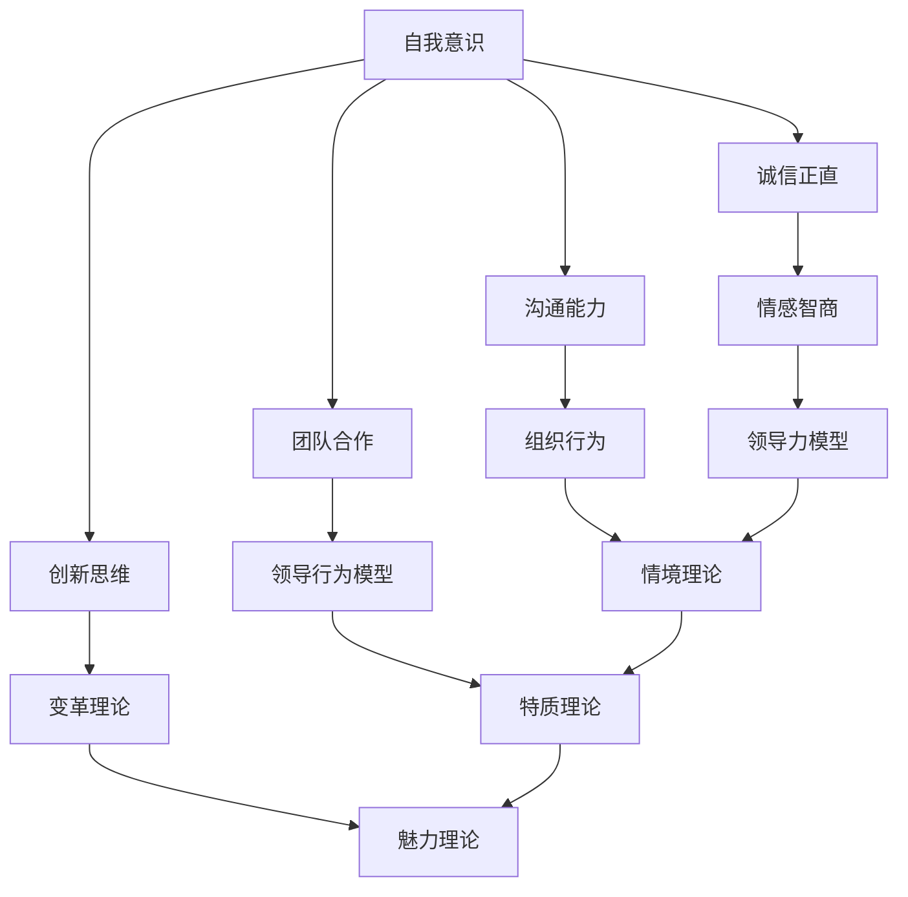

                 

## 领导力法则：打造黄金团队的领导力秘诀

### 关键词

- 领导力
- 黄金团队
- 团队建设
- 创新思维
- 自我提升
- 沟通能力
- 多元化团队
- 成功案例

### 摘要

本文旨在探讨领导力在打造黄金团队中的关键作用。通过分析领导力的核心素质、领导力的模型与理论、领导力实践与提升策略，以及多元化团队中的领导力挑战，本文将提供一系列有效的领导力法则，帮助领导者打造高效、协同、创新的团队。文章还将通过实际案例研究，展示成功领导力法则在实践中的应用，为读者提供有价值的参考。

### 第一部分：领导力的基础理论

#### 第1章：领导力的定义与重要性

**1.1 领导力的本质**

领导力是指一种影响力，它不仅涉及个人的能力，还包括在团队或组织中引导和激励他人的能力。领导力是一种动态的过程，它要求领导者具备洞察力、决策力、沟通能力和团队协作精神。领导力的核心在于激发团队成员的潜力，共同实现目标。

**1.2 领导力的重要性**

领导力对个人和组织的发展至关重要。对于个人而言，具备领导力能够提升自我认知、自我管理和自我激励的能力。对于组织而言，优秀的领导力能够提高团队的工作效率、创新能力和整体绩效。

**1.3 领导力与管理的区别**

领导力与管理密切相关，但又有所不同。领导力侧重于愿景的描绘和团队的激励，而管理则侧重于资源的分配和流程的优化。一个成功的领导者需要兼顾领导力和管理，以实现组织的长远发展。

#### 第2章：领导力的核心素质

**2.1 自我意识**

自我意识是领导力的基石。领导者需要深入了解自己的性格、价值观、优势与不足，从而更好地引导团队。自我意识的提升有助于领导者建立自信，增强决策能力。

**2.2 诚信正直**

诚信正直是领导力的核心品质。领导者应以诚信为本，树立良好的榜样，赢得团队的信任和尊重。诚信正直是团队凝聚力的关键因素，有助于建立和谐的工作环境。

**2.3 沟通能力**

沟通能力是领导力的关键要素。领导者需要具备有效的沟通技巧，包括倾听、表达、反馈和协调。良好的沟通能力有助于消除误解、增强协作，从而提高团队的整体效能。

**2.4 团队合作**

团队合作是领导力的重要组成部分。领导者需要培养团队成员的协作精神，促进资源共享和优势互补。团队合作能够激发团队的创造力，实现共同目标。

**2.5 创新思维**

创新思维是领导力的动力源泉。领导者应鼓励团队成员发挥创造性思维，勇于探索新方法和新思路。创新思维能够推动团队不断进步，适应快速变化的环境。

#### 第3章：领导力的模型与理论

**3.1 领导行为的模型**

领导行为的模型包括授权型领导、变革型领导和交易型领导等。每种领导行为都有其特定的场景和效果，领导者应根据具体情况选择合适的领导方式。

**3.2 领导风格的模型**

领导风格的模型包括民主型、专制型和放任型等。不同的领导风格适用于不同的团队和环境，领导者需要灵活调整自己的风格，以实现最佳效果。

**3.3 领导力的五大理论**

领导力的五大理论包括特质理论、行为理论、情境理论、魅力理论和变革理论。这些理论从不同角度解释了领导力的本质和作用，为领导者提供了有益的指导。

#### 第4章：领导力的核心概念与联系

**4.1 领导力与心理学**

领导力与心理学密切相关。领导者需要了解心理学原理，包括动机、情感和行为，以更好地理解和引导团队成员。

**4.2 领导力与组织行为**

领导力在组织行为中起着至关重要的作用。领导者需要关注团队的组织结构、角色分工和沟通机制，以提高团队的整体效能。

**4.3 领导力与情感智商**

情感智商是领导力的关键因素。领导者需要具备较高的情感智商，包括自我意识、自我管理、社会意识和人际关系管理能力。

**4.4 Mermaid 流程图：领导力核心概念联系图**

通过Mermaid流程图，我们可以直观地展示领导力核心概念之间的联系，包括自我意识、诚信正直、沟通能力、团队合作和创新思维等。以下是一个示例：

### 第二部分：领导力实践与提升

#### 第5章：领导力提升策略

**5.1 自我提升**

自我提升是领导力发展的关键。领导者应定期进行自我评估，识别自身优势和不足，并采取相应措施进行提升。自我提升包括学习新知识、培养新技能和增强自我意识。

**5.2 持续学习**

持续学习是领导者保持竞争力的关键。领导者应不断学习新的管理理念、领导技巧和行业动态，以适应快速变化的环境。持续学习有助于提升领导力的深度和广度。

**5.3 反思与调整**

反思与调整是领导力提升的重要环节。领导者应定期反思自己的领导行为和决策效果，识别存在的问题，并采取相应措施进行调整和改进。反思与调整有助于提升领导力的精准度和效能。

#### 第6章：团队建设与领导力

**6.1 团队角色与责任**

团队角色与责任是团队建设的基础。领导者应明确团队成员的角色和责任，确保每个人都能发挥自己的优势，为团队的目标贡献力量。

**6.2 团队冲突管理**

团队冲突是不可避免的。领导者需要具备有效的冲突管理能力，通过沟通、调解和协商等方式，化解冲突，维护团队的稳定和和谐。

**6.3 团队激励与反馈**

团队激励与反馈是提升团队效能的重要手段。领导者应运用适当的激励措施，激发团队成员的积极性和创造力。同时，领导者应提供及时的反馈，帮助团队成员了解自己的表现，不断改进。

**6.4 团队目标设定与实现**

团队目标设定与实现是团队工作的核心。领导者需要与团队成员共同设定明确的目标，并制定可行的实施计划。在实现目标的过程中，领导者应密切关注团队的进展，提供必要的支持和指导。

#### 第7章：领导力在危机管理中的应用

**7.1 危机管理的领导力要素**

危机管理是领导者面临的重要挑战。领导力在危机管理中起着关键作用，包括决策能力、沟通能力和应变能力等。

**7.2 应对危机的策略**

应对危机的策略包括预防措施、紧急响应和长期规划。领导者需要根据危机的类型和程度，采取相应的应对策略，最大限度地降低危机带来的影响。

**7.3 从危机中恢复与成长**

从危机中恢复与成长是领导力的重要体现。领导者需要引导团队从危机中吸取教训，总结经验，不断提升团队的能力和素质。

#### 第8章：领导力在多元化团队中的挑战

**8.1 多元化团队的特点**

多元化团队是指由不同背景、文化、经验和技能的成员组成的团队。多元化团队具有独特的优势，但也面临着一系列挑战。

**8.2 多元文化领导力**

多元文化领导力是指领导者能够理解和尊重不同文化的差异，并在团队中有效地引导和协调。多元文化领导力有助于增强团队的凝聚力和创新能力。

**8.3 多元化团队的挑战与解决方案**

多元化团队面临的挑战包括文化冲突、沟通障碍和决策困难等。领导者需要采取有效的解决方案，包括加强沟通、建立共识和培养多元化思维等。

### 第三部分：领导力法则与团队成功案例

#### 第9章：成功领导力法则

**9.1 坚持与韧性**

坚持与韧性是成功领导力的关键要素。领导者需要在面对困难和挫折时保持坚定的信念和毅力，带领团队克服困难，实现目标。

**9.2 激励与赋能**

激励与赋能是领导者激发团队潜力的关键。领导者应关注团队成员的需求和动机，提供适当的激励和支持，帮助团队成员实现自我价值和团队目标。

**9.3 决策与执行**

决策与执行是领导力的重要职责。领导者需要做出明智的决策，并确保决策得到有效执行。领导者应注重决策的科学性和执行力，以提高团队的效能和竞争力。

**9.4 战略规划与目标管理**

战略规划与目标管理是领导者带领团队实现长期目标的关键。领导者应制定明确的战略规划，设定可行的目标，并制定详细的实施计划。通过有效的目标管理，领导者可以引导团队朝着共同的目标努力。

#### 第10章：黄金团队打造实战

**10.1 团队塑造的步骤**

团队塑造是领导者打造黄金团队的重要步骤。领导者需要明确团队的目标和价值观，培养团队成员的协作精神，建立高效的团队机制。

**10.2 团队成员角色定位**

团队成员角色定位是团队高效运作的基础。领导者应明确每个成员的角色和责任，确保团队成员能够充分发挥自己的优势，为团队的目标贡献力量。

**10.3 团队文化建设**

团队文化建设是团队长期稳定发展的关键。领导者应倡导积极向上的团队文化，营造和谐的工作氛围，增强团队的凝聚力和归属感。

**10.4 团队效能提升策略**

团队效能提升是领导者持续关注的重要课题。领导者应采取有效的策略，包括优化团队结构、提升团队成员的能力和技能、激发团队的创造力和创新精神等，以提高团队的效能和竞争力。

#### 第11章：领导力案例研究

**11.1 国内外领导力成功案例**

国内外领导力成功案例为领导者提供了宝贵的经验借鉴。领导者可以通过研究这些案例，了解成功领导力法则在实践中的应用，为自己的团队提供有益的启示。

**11.2 案例分析与启示**

通过对成功案例的分析，领导者可以提炼出有效的领导力法则和实践经验。这些法则和经验有助于领导者更好地应对团队挑战，提升领导力水平。

**11.3 团队领导力实践应用**

团队领导力实践应用是将理论知识转化为实际操作的过程。领导者应在实际工作中运用领导力法则，培养团队成员的领导力，提升团队的整体效能。

### 附录

**附录 A：领导力资源与工具**

**A.1.1 领导力书籍推荐**

推荐一些经典的领导力书籍，包括《高效能人士的七个习惯》、《领导力五项修炼》等，为领导者提供理论指导。

**A.1.2 领导力培训课程**

介绍一些知名的领导力培训课程，如哈佛商学院领导力课程、麦肯锡领导力培训等，帮助领导者提升领导力水平。

**A.1.3 领导力评估工具**

推荐一些常用的领导力评估工具，如MBTI、领导力360度评估等，帮助领导者了解自己的领导力状况，并进行针对性的提升。

### 总结与展望

本文从领导力的定义、核心素质、模型与理论、实践与提升策略等方面，详细探讨了领导力在打造黄金团队中的关键作用。通过实际案例研究，本文展示了成功领导力法则在实践中的应用，为领导者提供了有益的启示。未来，领导力将继续在团队建设和企业发展中发挥重要作用，领导者需要不断学习和实践，提升自己的领导力水平，为团队的成功奠定坚实基础。

