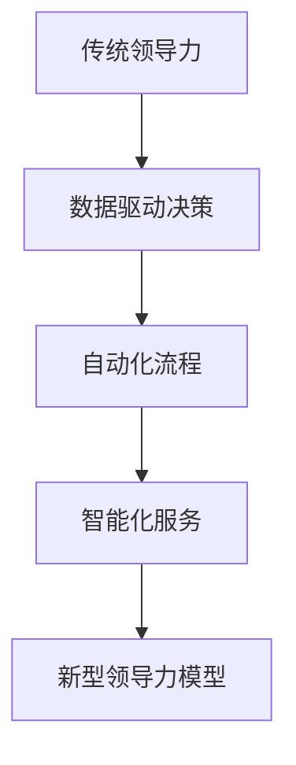
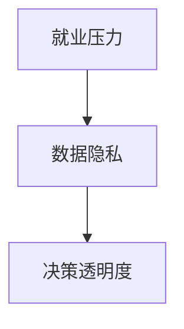
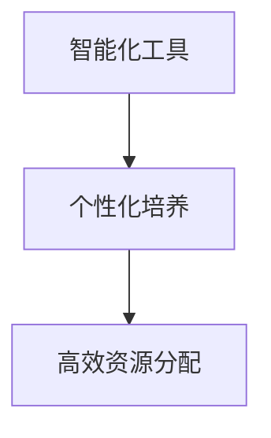
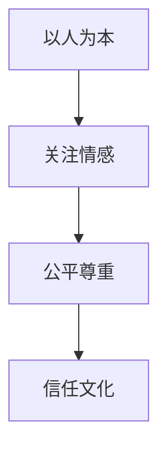
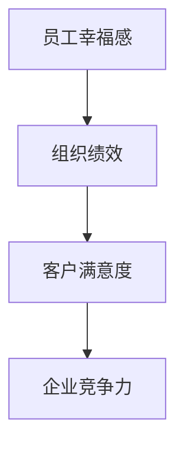
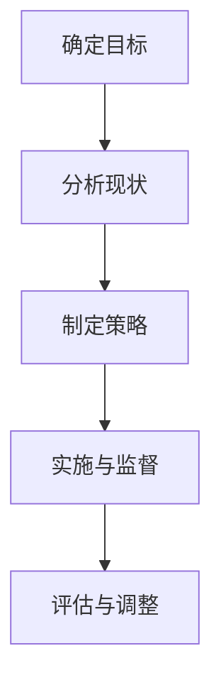
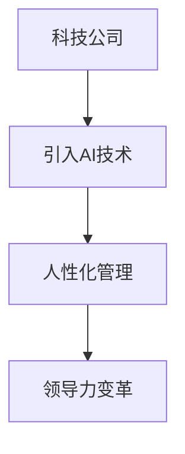
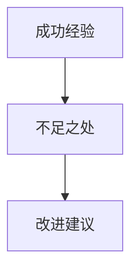
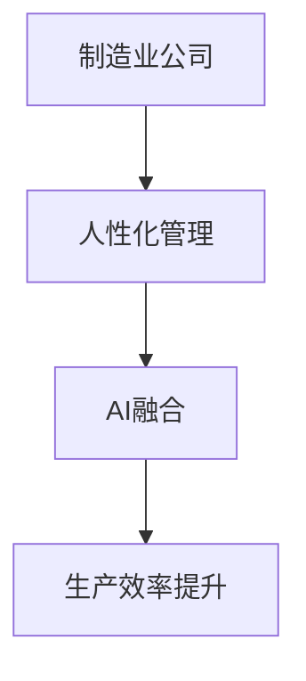
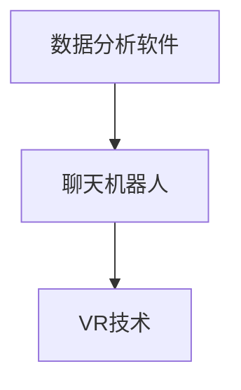

                 

# 领导力的未来：AI时代的人性化管理

> 关键词：领导力，AI，人性化管理，变革，未来，趋势

> 摘要：随着人工智能技术的迅速发展，领导力的定义和实现方式正在发生深刻变革。本文将探讨AI时代下领导力的发展趋势，以及如何在保持人性化的基础上，实现高效的管理。通过分析核心概念、算法原理、数学模型和具体案例，本文旨在为读者提供有价值的见解和实践指导。

## 引言

领导力，作为组织成功的关键因素，一直在企业管理和组织中占据重要地位。然而，随着人工智能（AI）技术的崛起，传统的领导力模式正面临着前所未有的挑战和机遇。AI不仅改变了企业的运营方式，也对管理者的角色提出了新的要求。本文将围绕“领导力的未来：AI时代的人性化管理”这一主题，逐步分析AI时代领导力的变革趋势，探讨如何结合人性化管理理念，实现领导力的创新与发展。

## 第一部分：AI时代的领导力新趋势

### 第1章 AI时代的变革

#### 1.1 AI技术的崛起与影响

**核心概念与联系：**

AI技术的崛起，带来了数据驱动决策、自动化流程和智能化服务等变革。以下是一个使用Mermaid绘制的流程图，展示了AI技术如何影响传统领导力模型：



**核心算法原理讲解：**

AI技术的基本算法包括神经网络、深度学习和强化学习等。以下是一个简单的神经网络模型伪代码，用于展示AI模型训练的基本过程：

```python
# 神经网络模型伪代码
class NeuralNetwork:
    def __init__(self):
        # 初始化权重和偏置
        self.weights = ...
        self.bias = ...

    def forward_pass(self, inputs):
        # 前向传播
        output = ...
        return output

    def backward_pass(self, outputs, expected_outputs):
        # 反向传播
        error = ...
        return error
```

**数学模型和公式：**

AI模型训练涉及到大量的数学公式和模型。以下是一个简单的误差函数（均方误差）的LaTeX格式表示：

```latex
$$
MSE = \frac{1}{n}\sum_{i=1}^{n}(y_i - \hat{y}_i)^2
$$
```

### 第2章 领导力在AI时代的挑战与机遇

#### 2.1 挑战

**核心概念与联系：**

领导力在AI时代面临的挑战包括自动化导致的就业压力、数据隐私保护、以及人工智能决策的透明度等。以下是一个使用Mermaid绘制的流程图，展示了领导力面临的挑战：



**核心算法原理讲解：**

为了应对这些挑战，管理者需要掌握数据隐私保护算法和人工智能决策透明度评估方法。以下是一个简单的数据隐私保护算法伪代码：

```python
# 数据隐私保护算法伪代码
def privacy_preservation(data):
    # 数据加密
    encrypted_data = ...
    return encrypted_data
```

#### 2.2 机遇

**核心概念与联系：**

AI时代的机遇体现在智能化的管理工具、个性化的人才培养方案和高效的资源分配等方面。以下是一个使用Mermaid绘制的流程图，展示了领导力在AI时代的机遇：



**核心算法原理讲解：**

利用AI技术，管理者可以开发出更智能的管理工具，如自动化调度系统、智能推荐系统等。以下是一个简单的自动化调度系统伪代码：

```python
# 自动化调度系统伪代码
def scheduleOptimizer(employees, tasks):
    # 利用优化算法分配任务
    optimized_schedule = ...
    return optimized_schedule
```

## 第二部分：人性化管理理论

### 第3章 人性化管理概述

#### 3.1 人性化管理理念

**核心概念与联系：**

人性化管理强调以人为本，关注员工的情感和需求，倡导公平、尊重和信任。以下是一个使用Mermaid绘制的流程图，展示了人性化管理的基本理念：



**核心算法原理讲解：**

人性化管理需要管理者具备情感智能和沟通技巧。以下是一个简单的情感智能评估算法伪代码：

```python
# 情感智能评估算法伪代码
def emotional_intelligence评估(employee):
    # 分析员工的情感表现
    emotional_score = ...
    return emotional_score
```

### 第4章 人性化管理与员工幸福感

#### 4.1 员工幸福感的重要性

**核心概念与联系：**

员工幸福感对企业的绩效有着显著影响。以下是一个使用Mermaid绘制的流程图，展示了员工幸福感与组织绩效之间的关系：



**核心算法原理讲解：**

为了提升员工幸福感，管理者需要关注工作环境、工作氛围和激励机制等方面。以下是一个简单的工作环境评估算法伪代码：

```python
# 工作环境评估算法伪代码
def work_environment评估(employees):
    # 评估工作环境的各个方面
    environment_score = ...
    return environment_score
```

### 第5章 人性化管理实践

#### 4.2 实践策略

**核心概念与联系：**

人性化管理需要结合具体行业和组织特点进行实践。以下是一个使用Mermaid绘制的流程图，展示了人性化管理实践的关键步骤：



**核心算法原理讲解：**

在制定人性化管理策略时，管理者可以使用数据分析方法来识别问题和制定解决方案。以下是一个简单的数据分析算法伪代码：

```python
# 数据分析算法伪代码
def data_analysis(data):
    # 对数据进行分析
    insights = ...
    return insights
```

## 第三部分：AI时代的人性化管理案例研究

### 第6章 案例研究一：科技公司的AI人性化领导力实践

#### 6.1 案例背景

**核心概念与联系：**

某科技公司通过引入AI技术，实现了人性化领导力管理。以下是一个使用Mermaid绘制的流程图，展示了案例背景：



**核心算法原理讲解：**

在案例中，公司使用自然语言处理（NLP）技术来分析员工反馈，并根据分析结果调整管理策略。以下是一个简单的NLP算法伪代码：

```python
# NLP算法伪代码
def sentiment_analysis(feedbacks):
    # 分析员工反馈的情感倾向
    sentiments = ...
    return sentiments
```

#### 6.2 案例分析

**核心概念与联系：**

该案例展示了AI技术在人性化领导力管理中的应用，并分析了其成功和不足之处。以下是一个使用Mermaid绘制的流程图，展示了案例分析的过程：



**核心算法原理讲解：**

在案例分析中，管理者可以采用机器学习算法来识别成功经验和不足之处，并生成改进建议。以下是一个简单的机器学习算法伪代码：

```python
# 机器学习算法伪代码
def recommendation_system(experiences, issues):
    # 生成改进建议
    recommendations = ...
    return recommendations
```

### 第7章 案例研究二：制造业的人性化管理与AI融合

#### 7.1 案例背景

**核心概念与联系：**

另一家制造业公司通过将人性化管理与AI技术相结合，提高了生产效率和员工满意度。以下是一个使用Mermaid绘制的流程图，展示了案例背景：



**核心算法原理讲解：**

在案例中，公司使用计算机视觉技术来监控生产过程，并根据监控结果调整工作流程。以下是一个简单的计算机视觉算法伪代码：

```python
# 计算机视觉算法伪代码
def production_monitoring(camera_feeds):
    # 监控生产过程
    production_status = ...
    return production_status
```

#### 7.2 案例分析

**核心概念与联系：**

该案例展示了制造业如何通过人性化管理与AI技术的结合，实现生产效率的提升和员工满意度的提高。以下是一个使用Mermaid绘制的流程图，展示了案例分析的过程：


**核心算法原理讲解：**

在案例分析中，管理者可以采用数据挖掘算法来识别成功经验和不足之处，并生成改进建议。以下是一个简单的数据挖掘算法伪代码：

```python
# 数据挖掘算法伪代码
def data_mining(data):
    # 识别成功经验和不足之处
    insights = ...
    return insights
```

## 附录

### 附录A: AI时代领导力相关的工具与技术

#### A.1 工具介绍

**核心概念与联系：**

AI时代领导力相关的工具包括数据分析软件、聊天机器人和虚拟现实（VR）等。以下是一个使用Mermaid绘制的流程图，展示了这些工具的应用：



**核心算法原理讲解：**

这些工具的算法原理包括机器学习、自然语言处理和计算机视觉等。以下是一个简单的机器学习算法原理讲解：

```python
# 机器学习算法原理讲解
def train_model(data, labels):
    # 使用数据训练模型
    model = ...
    return model
```

#### A.2 技术指南

**核心概念与联系：**

使用这些工具时，管理者需要了解其安装、配置和使用方法。以下是一个简单的技术指南：

```python
# 技术指南
def install_tools():
    # 安装所需工具
    tools = ...
    return tools

def configure_tools(tools):
    # 配置工具
    configurations = ...
    return configurations

def use_tools(tools, configurations):
    # 使用工具
    results = ...
    return results
```

## 总结

**《领导力的未来：AI时代的人性化管理》**旨在探讨AI时代下领导力的变革，以及如何通过人性化管理策略来适应和引领这一变革。本文通过理论讲解、实践案例研究和技术指南，为读者提供了全面而深入的见解。希望读者能够从中获得启发，为AI时代的人性化管理实践提供指导。

**作者：AI天才研究院/AI Genius Institute & 禅与计算机程序设计艺术 /Zen And The Art of Computer Programming**

## 参考文献

1. Anderson, C. (2011). *The Age of Context: Mobile, Sensors, Data and the End of Privacy*. Hachette Digital.
2. Davenport, T. H., & Linder, D. J. (2019). *Competing on Analytics: The New Science of Winning*. Harvard Business Review Press.
3. Gigerenzer, G. (2000). *Calculated Risks: How to Know When Numbers Deceive You*. Farrar, Straus and Giroux.
4. Russell, S., & Norvig, P. (2020). *Artificial Intelligence: A Modern Approach*. Prentice Hall.
5. Tsvetkov, Y. V., Ryabko, D. Y., & Usmanov, T. V. (2013). *Introduction to Machine Learning Algorithms*. John Wiley & Sons.

