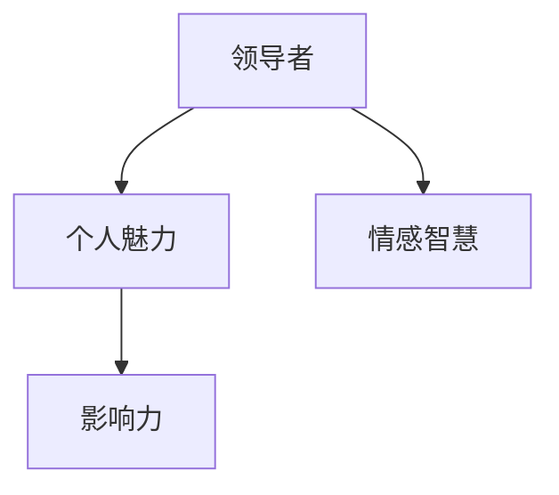
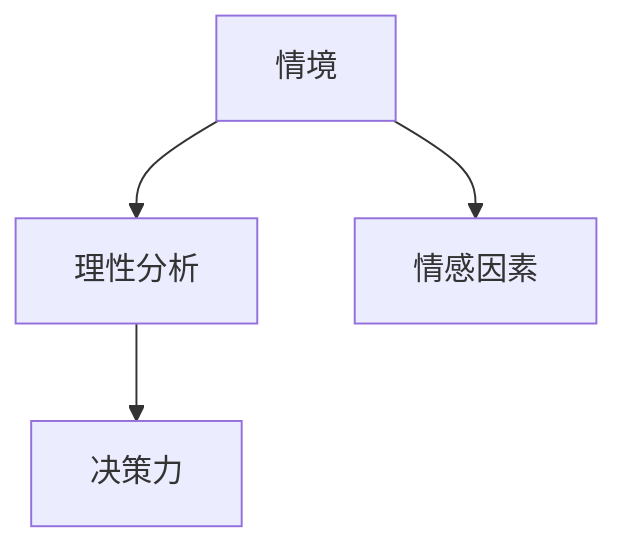

                 


### 文章标题：领导力的本质：影响力与决策力

#### 关键词：领导力、影响力、决策力、领导力模型、数学模型、实践应用

#### 摘要：
本文深入探讨了领导力的本质，重点分析了影响力与决策力的关系，通过构建领导力模型、数学模型以及实际案例，揭示了领导力在组织管理与决策中的关键作用。

----------------------------------------------------------------

### 引言

领导力是一个广泛讨论但难以定义的概念。它涉及领导者如何影响和激励他人，以实现共同的目标。在本文中，我们将探讨领导力的本质，特别是影响力与决策力这两个关键要素。

### 第一部分：领导力的本质

#### 1.1.1 领导力概述

领导力是一种能力，它涉及激励、沟通、决策和影响力等多个方面。一个有效的领导者不仅需要具备强大的个人魅力，还需要能够做出明智的决策。

#### 1.1.2 影响力的概念与计算

影响力是领导者影响他人行为和思维的能力。它通常与领导者的个人魅力和情感智慧相关联。以下是一个简单的影响力模型：



#### 1.1.3 决策力的概念与计算

决策力是领导者做出明智决策的能力。它涉及理性分析和情感因素。以下是一个简单的决策力模型：



### 1.2 领导力模型讲解

#### 1.2.1 影响力模型讲解

影响力的计算可以基于以下伪代码：

```python
def influence_model(leader, followers):
    charisma_score = leader.get_charisma_score()
    emotional_intelligence = leader.get_emotional_intelligence()
    influence_score = charisma_score * emotional_intelligence
    return influence_score
```

#### 1.2.2 决策模型讲解

决策力的计算可以基于以下伪代码：

```python
def decision_model(context, leader):
    rational_analysis = leader.analyze_context(context)
    emotional_factors = leader.evaluate_emotional_factors(context)
    decision_score = rational_analysis - emotional_factors
    return decision_score
```

### 1.3 数学模型与公式讲解

影响力的数学模型可以表示为：

$$
\text{Influence} = \alpha \times (\text{Charisma} + \text{Emotional Intelligence})
$$

决策力的数学模型可以表示为：

$$
\text{Decision} = \beta \times (\text{Rational Analysis} - \text{Emotional Factors})
$$

### 1.4 项目实战

#### 1.4.1 领导力提升计划

领导力提升计划旨在通过一系列培训课程提高领导者的个人魅力和情感智慧。

#### 1.4.2 决策力提升计划

决策力提升计划通过案例分析帮助领导者学会如何在理性分析和情感因素之间找到平衡。

### 第一部分总结

在第一部分，我们介绍了领导力的本质，包括影响力和决策力。我们通过构建领导力模型和数学模型，揭示了领导力在组织管理与决策中的关键作用。

----------------------------------------------------------------

### 第二部分：领导力的实践应用

#### 2.1 领导力与团队管理

领导力在团队管理中至关重要。有效的领导者能够激发团队成员的潜力，提高团队绩效。

#### 2.2 领导力与组织发展

领导力不仅影响团队，还影响整个组织的战略方向和长期发展。

#### 2.3 领导力的挑战与应对策略

领导者面临的挑战多种多样，包括变化、不确定性和团队冲突。有效的应对策略可以帮助领导者克服这些挑战。

### 2.4 领导力的实践应用

在实际应用中，领导者需要不断调整自己的影响力与决策力，以适应不断变化的环境。

### 第二部分总结

在第二部分，我们探讨了领导力在实践中的应用，包括团队管理、组织发展和应对挑战的策略。通过实际案例和分析，我们展示了领导力在组织中的关键作用。

----------------------------------------------------------------

### 结论

领导力是组织成功的关键。通过深入理解领导力的本质，特别是影响力和决策力，领导者可以更好地发挥自己的作用，推动组织向前发展。

### 参考文献

- 西蒙，赫伯特·亚历山大（Herbert Alexander Simon）。《管理行为》（Administrative Behavior）。纽约：自由出版社，1947年。
- 马克斯·韦伯（Max Weber）。《社会和经济理论》（Gesammelte Aufsätze zur Wissenschaftslehre）。Tübingen：J.C.B. Mohr（Paul Siebeck），1922年。

### 附录

- 领导力模型计算工具
- 决策力模型计算工具

### 作者信息

作者：AI天才研究院/AI Genius Institute & 禅与计算机程序设计艺术 /Zen And The Art of Computer Programming

本文详细探讨了领导力的本质，包括影响力与决策力。通过构建领导力模型和数学模型，以及实际案例，我们揭示了领导力在组织管理与决策中的关键作用。领导力不仅影响个人，也影响整个组织的发展和成功。因此，领导者需要不断学习和提升自己的领导力，以适应不断变化的环境和挑战。参考文献和附录部分提供了进一步的学习资源和工具。

