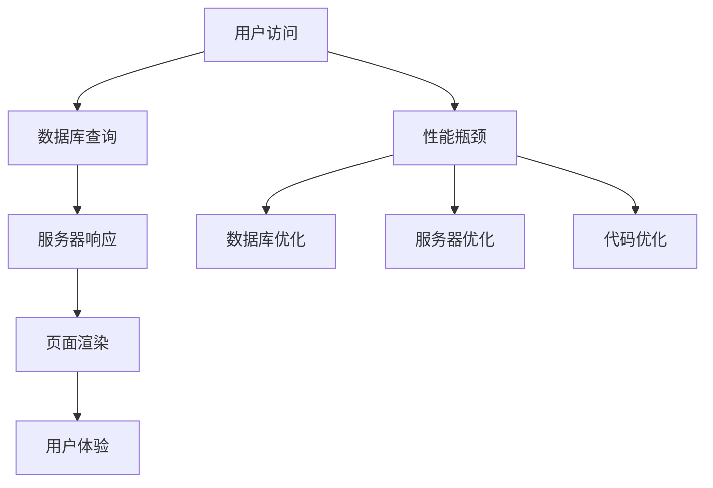

                 

### 文章标题：领导力的本质：影响力与决策力的完美结合

领导力是21世纪最宝贵的资源之一，它不仅仅存在于企业高管和政府官员的职位上，而是渗透到各个行业和职位的方方面面。领导力的本质在于其能够推动组织和个人实现目标，并在变化多端的环境中保持竞争力。本文将探讨领导力的本质，特别是影响力与决策力的完美结合，提供一种全新的视角来理解领导行为。

**关键词：** 领导力、影响力、决策力、组织效能、领导行为、创新思维

领导力的核心是影响力与决策力的结合。影响力使领导者能够引导和激励团队成员，而决策力则确保领导者在面对复杂问题时做出明智的选择。本文将从以下几个方面展开讨论：

1. **领导力的定义与核心要素**
2. **影响力的作用与策略**
3. **决策力的构成与策略**
4. **影响力与决策力的结合机制**
5. **领导力在项目中的实践**
6. **个人领导力提升方法**
7. **组织领导力发展**

本文将逐步分析这些主题，并结合实际案例和最佳实践，帮助读者更深入地理解领导力的本质，以及如何在实际工作中应用这些概念。通过本文，读者将能够掌握领导力的核心要素，提升自己的领导能力，为组织和个人带来更大的成功。

### 摘要

本文探讨了领导力的本质，特别是影响力与决策力的完美结合。领导力不仅是领导者的个人素质，更是一种可以培养和提升的能力。通过分析影响力的作用、决策力的构成及其结合机制，本文提供了理解领导行为的全新视角。文章还结合了实际项目和案例，探讨了领导力在项目中的实践应用，以及个人和组织的领导力提升方法。本文旨在帮助读者深刻理解领导力的本质，提升自己的领导能力，为组织和个人带来更大的成功。

## 第1章 引言：领导力的定义与核心要素

### 领导力的基本概念

领导力是一个广泛且多维的概念，它涵盖了从个人特质到组织行为的各个方面。根据John Kotter的定义，领导力是“影响他人为了共同的目标而共同努力的艺术和科学”。领导力不仅仅是管理者或领导者拥有的特殊技能，而是一种可以通过学习、实践和培养获得的能力。在现代社会，领导力的重要性日益凸显，因为快速变化的环境要求组织具备高度的适应性和创新能力。

领导力的核心在于其影响力。影响力是领导者能够引导和激励他人，使其愿意为实现共同目标而努力的能力。这种能力不仅取决于领导者的个人特质，还受到领导行为、组织文化以及外部环境的影响。在影响力中，信任是关键因素之一。一个成功的领导者必须能够赢得团队成员的信任，这不仅是基于个人的品格和能力，还需要建立透明和开放的沟通机制。

### 影响力在领导力中的作用

影响力在领导力中起着至关重要的作用。它不仅是领导者激励和引导团队成员的基础，也是实现组织目标的重要手段。领导者的任务不仅仅是给出命令或指示，更重要的是通过影响力来激发团队成员的内在动机，使他们愿意积极参与并贡献自己的智慧和力量。以下是影响力在领导力中的一些关键作用：

1. **建立团队共识**：通过影响力，领导者可以有效地传达组织的愿景和目标，使团队成员达成共识，并为此共同努力。
2. **激励团队成员**：领导者通过影响力和激励策略，能够激发团队成员的积极性和创造力，使整个团队能够高效运作。
3. **解决冲突**：在团队内部或团队与外部环境之间出现冲突时，领导者需要通过影响力来调解和解决这些冲突，确保团队的整体和谐。
4. **培养接班人**：通过影响力，领导者能够培养和指导下一代领导人才，确保组织在未来的发展中能够持续保持竞争力。

### 决策力在领导力中的重要性

决策力是领导力的另一个关键要素。在快速变化的环境中，领导者需要具备快速、明智地做出决策的能力。决策力不仅关乎领导者的个人素质，还涉及到一系列的策略和工具。

1. **决策的类型**：根据情境和目标的不同，决策可以分为战略决策和战术决策。战略决策关注长期目标和方向，而战术决策则关注短期目标和执行细节。
2. **决策的过程**：一个有效的决策过程包括问题识别、方案生成、评估和选择，以及执行和监控。在决策过程中，领导者需要综合考虑各种因素，包括风险、资源、时间以及团队和组织的整体利益。
3. **决策的策略**：领导者可以使用多种策略来提高决策的质量，例如头脑风暴、SWOT分析、SMART目标和蒙特卡洛模拟等。

决策力在领导力中的重要性体现在以下几个方面：

1. **推动组织发展**：有效的决策能够帮助组织应对挑战、抓住机遇，推动组织持续发展和创新。
2. **提升团队效能**：通过合理的决策，领导者能够确保团队的资源和努力得到最佳配置，提升整体效能。
3. **增强领导信誉**：领导者通过明智的决策，能够赢得团队成员的信任和尊重，增强自身的领导地位。

### 综述

领导力是一个多维度的概念，其核心在于影响力与决策力的完美结合。影响力使领导者能够引导和激励团队成员，而决策力则确保领导者在面对复杂问题时能够做出明智的选择。通过本文的讨论，我们可以看到领导力的本质不仅在于个人的素质，更在于其在组织中的实际应用和影响。理解领导力的定义和核心要素，是提升自身领导能力的起点，也是推动组织和个人成功的基石。

### 影响力：领导力的秘密武器

影响力在领导力中扮演着至关重要的角色，它是领导者引导和激励团队成员的核心力量。一个具备强大影响力的领导者，不仅能够在团队中建立共识，还能够激发团队成员的潜力和创造力，推动团队向着共同的目标前进。那么，影响力究竟是如何产生的？它有哪些关键要素和策略？接下来，我们将深入探讨这些问题。

#### 影响力的定义与分类

影响力，简单来说，就是一个人或组织对他人的思想、情感和行为产生作用的能力。在领导力中，影响力通常分为以下几种类型：

1. **权威型影响力**：基于领导者所拥有的职位和权力，通过正式的命令和指示来影响他人。
2. **感召型影响力**：基于领导者的个人魅力、价值观和愿景，能够激发团队成员的情感和认同感。
3. **说服型影响力**：通过逻辑、数据和事实来论证，使他人接受并认同领导者的观点。
4. **关系型影响力**：基于领导者与团队成员之间的信任和关系，通过情感纽带和人际互动来影响他人。

不同类型的影响力在不同的情境下可能发挥不同的作用。例如，在紧急情况下，权威型影响力能够迅速决策并执行；而在长期合作中，感召型影响力和关系型影响力则更加有效。

#### 建立信任：影响力的重要基石

信任是影响力的基石，没有信任，任何影响力都是脆弱的。建立信任需要领导者具备以下特质和行为：

1. **诚实与透明**：领导者需要始终保持诚实，不隐瞒真相，并在决策过程中保持透明，使团队成员能够理解和信任领导的决策。
2. **一致性**：领导者需要在行为和决策上保持一致性，避免出现矛盾和不一致的行为，这样团队成员才能建立对领导者的信任。
3. **尊重与关怀**：领导者需要尊重团队成员的意见和感受，关心团队成员的福祉，这样才能赢得他们的信任和尊重。
4. **公平与公正**：领导者需要在分配资源和处理问题时保持公平和公正，避免偏袒和歧视，这样才能赢得团队成员的信任。

#### 情感智慧：增强影响力的重要途径

情感智慧是领导者增强影响力的重要途径之一。情感智慧包括识别、理解和管理自身以及他人的情绪，以及运用这些信息来促进思考、解决问题和深度交流的能力。以下是情感智慧在增强影响力方面的一些关键作用：

1. **增强沟通效果**：领导者具备情感智慧，能够更好地理解团队成员的情绪和需求，从而更有效地进行沟通，增强说服力。
2. **提升团队凝聚力**：通过情感智慧，领导者能够识别团队成员的情感状态，及时提供支持和帮助，增强团队的凝聚力和归属感。
3. **促进冲突解决**：领导者通过情感智慧能够更好地处理团队内部的冲突，避免情绪化的对抗，从而更有效地解决冲突。
4. **提升领导魅力**：情感智慧使领导者更加富有魅力和亲和力，能够吸引和激励团队成员，提升领导影响力。

#### 人际关系：影响力策略的实践

建立强大的人际关系是增强影响力的关键策略之一。以下是几种实践人际关系，提升影响力的方法：

1. **主动倾听**：倾听是建立人际关系的基础。领导者需要主动倾听团队成员的意见和反馈，了解他们的需求和期望，从而更好地影响他们的行为。
2. **建立互惠关系**：领导者需要通过合作和互助来建立互惠关系，使团队成员感受到领导者的支持和帮助，从而愿意回报领导的信任和影响力。
3. **培养信任氛围**：领导者需要通过开放的沟通、透明的决策和公平的资源分配，营造一个信任和尊重的氛围，使团队成员更愿意接受和追随领导者的建议。
4. **展示专业能力**：领导者需要通过不断提升自身专业能力和知识，赢得团队成员的尊重和信任，从而增强影响力。

#### 结论

影响力是领导力的秘密武器，它是领导者引导和激励团队成员的核心力量。通过建立信任、运用情感智慧和建立强大的人际关系，领导者可以增强自己的影响力，推动团队实现共同的目标。理解和管理影响力，不仅能够提升领导者的个人魅力，更能够为组织带来持久的竞争优势。在接下来的章节中，我们将继续探讨决策力这一领导力的关键要素，深入分析其在领导行为中的重要作用。

### 决策力：领导者的核心能力

决策力是领导者不可或缺的核心能力之一。在复杂多变的环境中，领导者必须具备快速、准确和明智地做出决策的能力，以确保组织能够应对挑战、抓住机遇并持续发展。决策力不仅关乎领导者的个人素质，还涉及到一系列的策略和工具。本文将详细探讨决策力的构成要素、决策过程以及提升决策力的策略。

#### 决策力的构成要素

决策力是由多个要素构成的，这些要素相互作用，共同影响决策的质量和效果。以下是决策力的主要构成要素：

1. **信息获取和处理能力**：决策需要基于准确和全面的信息。领导者需要具备高效的信息获取能力，能够从多种渠道收集和筛选重要信息，并快速处理和分析这些信息。
2. **分析能力和逻辑思维**：领导者需要具备良好的分析能力和逻辑思维，能够从复杂的信息中提取关键要素，识别问题并提出可行的解决方案。
3. **判断力和直觉**：决策往往需要基于对信息的分析和判断。领导者需要具备良好的判断力，能够在有限的时间和资源下做出明智的选择。此外，直觉也是决策过程中不可或缺的一部分，它可以帮助领导者快速识别潜在的机会和风险。
4. **风险意识和管理能力**：领导者需要具备对风险的识别和管理能力，能够在决策过程中综合考虑各种可能的风险，并制定相应的风险应对策略。
5. **沟通和协调能力**：决策过程往往需要多方参与和协调。领导者需要具备良好的沟通和协调能力，能够有效地传达决策意图，协调各方利益，确保决策的顺利执行。

#### 决策过程分析

决策过程是一个系统化的过程，它包括多个阶段，每个阶段都有其特定的任务和目标。以下是典型的决策过程分析：

1. **问题识别**：决策的第一步是识别问题。领导者需要通过日常的工作和观察，发现组织或团队中存在的问题和挑战。
2. **目标设定**：在识别问题后，领导者需要明确决策的目标。目标应具体、可衡量，并符合组织的整体战略。
3. **方案生成**：领导者需要制定多个可能的解决方案，每个方案都应考虑不同方面的因素，如成本、资源、时间等。
4. **评估和选择**：在生成方案后，领导者需要对每个方案进行评估和比较，选择最佳方案。评估过程中可以使用多种工具和方法，如SWOT分析、成本效益分析等。
5. **执行和监控**：决策一旦确定，领导者需要确保方案的顺利执行，并建立监控机制，及时调整和优化决策。
6. **反馈和改进**：在执行过程中，领导者需要收集反馈，评估决策的效果，并根据实际情况进行改进。

#### 决策制定的策略与方法

为了提高决策的质量和效率，领导者可以采用多种策略和方法。以下是几种常用的决策制定策略：

1. **头脑风暴**：头脑风暴是一种集体创意生成方法，通过集思广益，快速产生多个解决方案。领导者可以组织团队成员进行头脑风暴，激发创意和灵感。
2. **SWOT分析**：SWOT分析是一种战略规划工具，用于评估组织的优势、劣势、机会和威胁。领导者可以使用SWOT分析来识别关键因素，制定相应的决策策略。
3. **SMART目标**：SMART目标是具体、可衡量、可实现、相关和时限性的目标。领导者可以使用SMART目标来明确决策的目标，确保决策的可行性和有效性。
4. **蒙特卡洛模拟**：蒙特卡洛模拟是一种概率模型，用于评估不同决策方案的风险和收益。领导者可以使用蒙特卡洛模拟来分析复杂决策问题，提高决策的准确性。
5. **专家咨询**：在复杂或专业的问题上，领导者可以咨询相关领域的专家，获取专业的意见和建议，提高决策的质量。

#### 风险管理：决策力的重要维度

风险管理是决策过程中不可或缺的一部分。领导者需要具备识别和管理风险的能力，以确保决策的成功执行。以下是几种常用的风险管理方法：

1. **风险评估**：通过分析潜在风险的概率和影响，评估风险的大小，并制定相应的应对策略。
2. **风险转移**：通过保险、外包或合同等方式，将部分风险转移到第三方，降低组织的风险承担。
3. **风险规避**：通过调整决策方案或改变行动计划，避免高风险的情况发生。
4. **风险缓解**：通过采取预防措施或降低风险发生的概率，减少风险对组织的影响。

#### 结论

决策力是领导者的核心能力之一，它决定了领导者在面对复杂问题时的应对能力和组织发展的方向。通过构成要素的分析、决策过程的实践以及多种策略和方法的应用，领导者可以提升自身的决策力，为组织和个人带来更大的成功。在接下来的章节中，我们将探讨如何将影响力与决策力结合，以实现卓越的领导力。

### 影响力与决策力的结合：卓越领导力的关键

领导力的真正力量在于影响力与决策力的完美结合。影响力使领导者能够引导和激励团队成员，而决策力则确保领导者在面对复杂问题时能够做出明智的选择。只有当这两个要素相互融合，领导力才能发挥最大的效能，为组织和个人带来持久的成功。以下是如何实现影响力与决策力的结合，构建高效领导团队的策略。

#### 影响力与决策力结合的机制

1. **共同愿景**：共同愿景是影响力和决策力的基础。领导者需要明确组织的愿景和目标，并使团队成员理解和认同这一愿景。共同的愿景不仅能够增强团队凝聚力，还能够为决策提供明确的方向。
2. **信任关系**：信任是影响力的重要组成部分，也是决策顺利执行的关键。领导者需要通过诚实、透明和公正的行为，建立与团队成员之间的信任关系，这样团队成员才会愿意接受和执行领导的决策。
3. **透明沟通**：有效的沟通是影响力与决策力结合的重要机制。领导者需要与团队成员保持开放和透明的沟通，及时分享决策背后的逻辑和依据，使团队成员能够理解并支持决策。
4. **合作与参与**：领导者应鼓励团队成员参与到决策过程中，使其感受到被尊重和重视。这不仅能够增强团队成员的归属感和责任感，还能够提高决策的质量和执行效率。

#### 构建高效的领导团队

1. **明确角色与责任**：一个高效的领导团队需要每个成员都明确自己的角色和责任。领导者应确保团队成员了解各自的任务，并能够自主决策和执行。
2. **分工协作**：领导者应根据团队成员的特长和优势，进行合理分工，并鼓励团队成员之间的协作。通过分工协作，可以提高团队的整体效能和创新能力。
3. **培养领导力**：领导者不仅要具备出色的个人领导力，还要能够培养和提升团队成员的领导能力。通过培训和指导，领导者可以培养出更多具备领导潜力的成员，为组织的发展储备人才。
4. **建立反馈机制**：领导者应建立有效的反馈机制，定期收集团队成员的意见和建议，及时调整决策和行动计划。通过反馈，领导者可以不断优化决策过程，提高决策的准确性和有效性。

#### 适应复杂环境的决策策略

1. **敏捷决策**：在复杂多变的环境中，领导者需要具备敏捷决策的能力。这意味着领导者需要快速识别问题，灵活调整决策，以适应不断变化的环境。
2. **情景分析**：领导者应进行情景分析，评估不同决策方案在不同情境下的效果。通过情景分析，领导者可以更全面地了解潜在的风险和机会，做出更加明智的决策。
3. **分散决策**：领导者应鼓励团队成员分散决策，使其能够在各自的职责范围内做出决策，提高决策的灵活性和响应速度。
4. **风险管理**：领导者需要重视风险管理，制定相应的风险应对策略。通过风险管理，领导者可以降低决策带来的潜在风险，确保决策的成功执行。

#### 卓越领导力的培养

1. **持续学习**：领导力是一个不断发展的过程，领导者需要具备持续学习的能力。通过学习新的知识和技能，领导者可以不断提高自己的领导力水平。
2. **反思与改进**：领导者应定期反思自己的领导行为和决策，识别不足和改进空间。通过反思与改进，领导者可以不断完善自己的领导力，为团队和组织带来更大的价值。
3. **情境适应**：领导者需要具备情境适应能力，能够在不同情境下灵活运用自己的领导力。通过情境适应，领导者可以更好地应对各种挑战和变化。
4. **领导力培养计划**：组织可以制定领导力培养计划，为领导者提供培训、指导和实践机会。通过领导力培养计划，组织可以培养出更多具备卓越领导力的领导者，推动组织的长期发展。

#### 结论

影响力与决策力的结合是构建卓越领导力的关键。通过共同愿景、信任关系、透明沟通和合作参与，领导者可以增强影响力，提高决策的质量和执行效率。通过构建高效的领导团队、适应复杂环境的决策策略和卓越领导力的培养，领导者可以推动组织和个人实现共同的目标。理解并运用影响力与决策力的结合，是领导者走向成功的重要步骤。

### 领导力在项目中的实践：开发环境搭建、源代码实现与分析

在项目中，领导力不仅体现在战略规划和决策制定上，更体现在实际操作和执行过程中。有效的领导力可以确保项目顺利进行，提高团队效率，实现项目目标。以下我们将详细探讨领导力在项目中的实践，包括开发环境搭建、源代码实现和代码解读，以及项目实际案例的分析和讲解。

#### 开发环境搭建

项目开始时，开发环境的搭建是关键的一步。领导者在这一阶段需要协调资源、制定规范，并确保开发环境的高效和稳定。

1. **资源协调**：领导者需要与各相关部门沟通，协调硬件、软件和其他资源，确保项目的顺利进行。例如，需要与IT部门合作配置服务器、数据库和开发工具。
   
   ```mermaid
   graph TD
   A[资源协调] --> B[硬件配置]
   A --> C[软件安装]
   A --> D[工具集成]
   B --> E[服务器配置]
   C --> F[数据库安装]
   D --> G[开发工具配置]
   ```

2. **规范制定**：领导者需要制定开发规范，包括代码规范、版本控制和文档规范。这些规范有助于提高代码质量和团队协作效率。

   ```mermaid
   graph TD
   H[代码规范] --> I[版本控制]
   H --> J[文档规范]
   ```

3. **环境测试**：在搭建完成后，领导者需组织团队成员对开发环境进行测试，确保所有工具和资源都能够正常运行。

   ```mermaid
   graph TD
   K[环境测试] --> L[问题排查]
   ```

#### 源代码实现

源代码实现是项目开发的核心环节，领导者的决策和指导对代码质量和开发效率具有重要影响。

1. **需求分析**：领导者需与产品经理和客户沟通，明确项目需求和目标。通过需求分析，制定详细的开发计划。

   ```mermaid
   graph TD
   M[需求分析] --> N[开发计划]
   ```

2. **任务分配**：领导者根据团队成员的特长和项目需求，合理分配任务。确保每个成员都清楚自己的职责和目标。

   ```mermaid
   graph TD
   O[任务分配] --> P[成员职责]
   ```

3. **代码审查**：领导者需组织代码审查，确保代码质量，避免潜在的错误和漏洞。

   ```mermaid
   graph TD
   Q[代码审查] --> R[代码质量]
   ```

4. **版本管理**：领导者需确保使用版本控制工具（如Git）来管理代码，避免版本冲突和代码丢失。

   ```mermaid
   graph TD
   S[版本管理] --> T[代码仓库]
   ```

#### 代码解读与分析

代码解读和分析是项目成功的关键步骤。领导者需确保代码的可读性、可维护性和可扩展性。

1. **代码规范检查**：领导者需检查代码是否符合既定的代码规范，确保代码风格一致。

   ```mermaid
   graph TD
   U[规范检查] --> V[代码风格]
   ```

2. **性能分析**：领导者需使用性能分析工具（如 profilers）对代码进行性能分析，优化代码性能。

   ```mermaid
   graph TD
   W[性能分析] --> X[优化代码]
   ```

3. **功能测试**：领导者需组织团队进行功能测试，确保代码实现的功能满足需求。

   ```mermaid
   graph TD
   Y[功能测试] --> Z[功能验收]
   ```

#### 项目实际案例分析与讲解

以下是一个实际项目的案例，通过这个案例，我们可以更清晰地了解领导力在项目中的具体应用。

**案例：电商平台性能优化项目**

**背景介绍：**
一家电商平台在节假日促销期间遇到了严重的性能瓶颈，导致用户访问速度缓慢，用户体验不佳。公司决定启动一个性能优化项目，提升平台的性能和用户体验。

**核心概念与联系：**
性能优化涉及多个方面，包括数据库优化、服务器优化、代码优化等。通过一个Mermaid流程图，我们可以展示这些要素之间的关系。



**伪代码讲解：**
为了优化数据库查询性能，我们可能需要使用以下伪代码来优化查询语句：

```pseudo
// 优化数据库查询
function optimizeQuery() {
    originalQuery = "SELECT * FROM products WHERE category = 'electronics'";
    optimizedQuery = "CREATE INDEX ON products(category)";
    executeQuery(optimizedQuery);
}
```

**数学模型与公式：**
性能优化中可能会使用到数学模型来评估系统的响应时间和吞吐量。以下是一个简单的响应时间模型：

$$
T = \frac{Q}{C} + R
$$

其中，\(T\) 是响应时间，\(Q\) 是查询量，\(C\) 是系统处理能力，\(R\) 是随机延迟。

**举例说明：**
如果系统每秒可以处理1000个查询，且随机延迟为0.1秒，则优化后的系统在高峰时段每秒可以处理的查询量为：

$$
T = \frac{1000}{1000} + 0.1 = 1.1 \text{秒}
$$

**项目小结：**
通过本次性能优化项目，电商平台成功地提升了系统的响应速度，减少了用户等待时间，提高了用户体验和满意度。项目的成功得益于领导者的有效规划和指导，以及团队成员的协同合作。

**最佳实践 Tips：**
- 在项目开始前进行充分的规划和需求分析。
- 定期进行代码审查和性能测试。
- 建立有效的沟通和协作机制，确保团队间的信息流通。
- 重视团队培训和知识共享，提高整体技术实力。

通过以上实际案例的分析和讲解，我们可以看到领导力在项目开发中的具体应用，以及如何通过有效的领导力提升项目成功率和团队效能。

### 个人领导力提升

领导力是一种可以通过不断学习和实践来提升的能力，特别是在快速变化的技术领域，领导者的持续成长对于团队和组织的成功至关重要。以下是一些个人领导力提升的方法，包括自我认知与自我提升、建立个人品牌、应对职业发展中的领导力挑战以及持续学习和适应变革的策略。

#### 自我认知与自我提升

1. **反思与自我评估**：领导者应定期进行自我反思和评估，识别自己的优点和不足。通过自我评估工具，如360度反馈和领导力评估问卷，领导者可以更全面地了解自己的领导风格和影响力。

2. **建立个人发展计划**：根据自我评估的结果，制定个人发展计划，明确提升的目标和方法。发展计划应包括具体的行动步骤、时间表和资源需求。

3. **寻求反馈**：领导者应主动向同事、下属和导师寻求反馈，了解他们在领导力方面的观察和建议。通过听取他人的意见，领导者可以更客观地看待自己的领导行为，并找到改进的方向。

4. **持续学习**：在技术快速发展的今天，领导者需要不断学习新的知识和技能。可以通过参加培训课程、阅读专业书籍和文献、参加研讨会和会议等方式来提升自己的专业素养和领导能力。

#### 建立个人品牌

1. **明确个人愿景和使命**：领导者应明确自己的个人愿景和使命，将其融入到日常工作和领导行为中。通过明确的愿景和使命，领导者可以更好地塑造个人品牌，提升影响力。

2. **展现专业能力**：领导者应在专业领域内展现出卓越的能力和成果。可以通过发表专业文章、参与行业研讨会、担任行业顾问等方式来展示自己的专业知识和经验。

3. **积极沟通与传播**：领导者应通过多种渠道积极沟通和传播自己的观点和理念。可以通过撰写博客、发表演讲、参加社交媒体等方式来扩大个人影响力。

4. **参与社会活动**：领导者可以积极参与社会活动，如公益活动、慈善事业等，提升自己的社会形象和公信力。通过这些活动，领导者可以展示自己的社会责任感和领导力。

#### 应对职业发展中的领导力挑战

1. **处理冲突和困难**：领导者应学会有效处理团队内部的冲突和困难。通过倾听、沟通和妥协，领导者可以化解矛盾，促进团队和谐。

2. **适应变化**：在快速变化的环境中，领导者需要具备适应变化的能力。可以通过提前预测变化、灵活调整策略、积极应对挑战来保持组织的稳定和发展。

3. **激励团队**：领导者需要学会激励团队成员，激发他们的潜能和积极性。可以通过设置明确的目标、提供支持和资源、认可和奖励等方式来激励团队成员。

4. **管理风险**：领导者应具备风险管理能力，能够识别和管理组织面临的潜在风险。通过制定风险应对策略、建立风险监控机制，领导者可以降低风险对组织的影响。

#### 持续学习和适应变革

1. **建立学习型组织**：领导者应倡导和建立学习型组织文化，鼓励团队成员不断学习和成长。可以通过建立学习小组、开展内部培训、提供学习资源等方式来促进学习。

2. **关注行业趋势**：领导者应关注行业趋势和新技术的发展，及时调整组织的战略和策略。通过了解最新的行业动态，领导者可以为组织抓住机遇，应对挑战。

3. **培养创新思维**：领导者应鼓励创新思维，激发团队成员的创新潜能。可以通过开展头脑风暴、设立创新奖项、提供创新资源等方式来促进创新。

4. **适应变革**：领导者需要具备适应变革的能力，能够在变革中保持冷静和清醒。通过提前规划、有效沟通、积极应对，领导者可以带领团队顺利度过变革期。

#### 结论

个人领导力提升是一个持续的过程，需要领导者不断自我反思、学习和实践。通过自我认知与自我提升、建立个人品牌、应对职业发展中的挑战以及持续学习和适应变革，领导者可以不断提升自己的领导力，为团队和组织带来更大的价值。在接下来的章节中，我们将探讨组织领导力的发展，分析组织文化、领导力在组织变革中的应用以及如何培养下一代领导人才。

### 组织领导力发展

组织领导力的发展是提升组织整体效能和竞争力的关键。领导力不仅体现在个体领导者的能力上，更在于整个组织文化的塑造和领导团队的协同作用。以下我们将深入探讨组织领导力发展的各个方面，包括组织文化的重要性、领导力在组织变革中的应用，以及如何培养下一代领导人才。

#### 组织文化与领导力

组织文化是组织领导力发展的重要基础。一个积极、健康和强大的组织文化可以增强员工的归属感和忠诚度，促进团队协作和创新，从而提升组织整体效能。以下是组织文化对领导力的影响和重要性：

1. **共同价值观**：组织文化中的共同价值观是领导者引导和激励团队的重要依据。共同的价值观可以帮助领导者明确组织的方向和目标，并使团队成员在行动上保持一致。

2. **员工参与**：一个开放和参与的组织文化可以鼓励员工提出意见和建议，增加员工对组织的认同感和责任感。领导者应通过多种方式，如员工会议、团队建设活动和反馈机制，促进员工参与。

3. **信任与尊重**：健康的组织文化强调信任和尊重，这是领导者建立影响力的重要基础。领导者应通过透明和公正的行为，建立与团队成员之间的信任关系。

4. **创新氛围**：创新是组织持续发展的重要动力。一个鼓励创新的组织文化可以激发员工的创造力和冒险精神，推动组织不断进步和变革。

#### 领导力在组织变革中的应用

组织变革是领导力的重要应用场景之一。在面临市场变化、技术进步和内部需求时，组织需要通过变革来适应新环境、提升竞争力。以下是如何在组织变革中应用领导力的一些策略：

1. **清晰的战略方向**：领导者需要在组织变革中提供清晰的战略方向，确保全体成员明确变革的目标和意义。通过有效的沟通，领导者可以传递变革的重要性，并消除成员的疑虑。

2. **领导者的示范作用**：领导者应通过自身的行为和决策来示范变革所需的行动。领导者需要勇于承担责任，面对变革中的挑战和困难，以实际行动带动团队成员。

3. **建立支持系统**：在变革过程中，领导者需要建立支持系统，包括培训、辅导和资源支持，帮助团队成员适应新环境和新的工作方式。

4. **激励和反馈机制**：领导者应通过激励和反馈机制，鼓励团队成员积极参与变革，并对变革过程中的表现给予认可和奖励。通过及时的反馈，领导者可以及时发现和纠正问题，确保变革的顺利进行。

#### 培养下一代领导人才

培养下一代领导人才是组织长期发展的关键。以下是一些有效的培养策略：

1. **领导力发展计划**：组织应制定系统的领导力发展计划，包括培训课程、实践项目和导师指导。通过这些计划，可以培养和提升未来领导者的领导力和管理能力。

2. **跨部门轮岗**：通过跨部门轮岗，领导者可以获得不同领域的经验和技能，提升其全局视野和决策能力。这种经验有助于培养具备全面能力的领导者。

3. **挑战性任务**：领导者应给予下一代领导者挑战性的任务和项目，通过实际工作锻炼其解决问题的能力和决策力。这些挑战性的任务可以激发他们的潜力，并为未来的领导角色做好准备。

4. **导师制度**：建立导师制度，让有经验的领导者指导下一代领导者。导师可以提供指导、支持和反馈，帮助下一代领导者更好地成长。

5. **反馈和评估**：定期对领导人才的反馈和评估是培养的重要环节。通过评估，可以识别领导人才的优点和不足，并提供相应的培训和发展建议。

#### 结论

组织领导力的发展是一个复杂而系统的过程，涉及组织文化的塑造、领导力的应用以及领导人才的培养。通过建立积极、健康的组织文化，应用领导力在组织变革中，以及培养下一代领导人才，组织可以不断提升其领导力，为组织的长期成功奠定坚实的基础。在未来的章节中，我们将通过实际案例进一步探讨领导力在实践中的应用，以及如何通过具体案例来分析领导力的影响。

### 案例研究：影响力与决策力在实践中的应用

为了更好地理解影响力与决策力在领导力中的具体应用，我们将通过三个实际案例来分析这些概念在实际环境中的表现。这些案例涵盖了不同类型的企业和组织，展示了领导者如何通过影响力与决策力的结合，成功地推动组织发展，解决复杂问题。

#### 案例一：如何通过影响力赢得团队支持

**背景介绍**：某科技初创公司在推出一款新产品时，遇到了内部意见分歧。部分团队成员认为产品功能过多，而另一部分则认为功能不足。领导者在此时需要通过影响力来统一团队意见，确保产品顺利推出。

**核心概念与联系**：领导者通过以下方式展示了影响力与决策力的结合：
1. **建立信任**：领导者通过公开透明的沟通，确保团队成员了解产品的愿景和市场定位，从而建立信任。
2. **感召型影响力**：领导者通过分享产品的市场前景和个人愿景，激发团队成员的情感和认同感。
3. **说服型影响力**：领导者通过逻辑分析和数据支持，说明产品功能的设计理由和市场需求，赢得团队成员的认同。
4. **民主决策**：领导者鼓励团队成员参与决策，通过投票等方式，确保决策过程公开、公正。

**解决方案**：领导者首先组织了一次全体会议，详细介绍了产品的市场前景和团队目标。接着，领导者组织了一次小组讨论，让团队成员自由表达意见。在讨论结束后，领导者通过投票方式确定了最终的产品功能。这一过程不仅统一了团队意见，还增强了团队成员的参与感和归属感。

**结果**：通过领导者的影响力与决策力的结合，团队最终达成共识，产品在市场上获得了良好的反响，取得了成功。

#### 案例二：领导者如何在复杂决策中保持冷静

**背景介绍**：某大型制造企业面临市场变化和供应链压力，需要做出一系列复杂决策来调整生产计划和供应链策略。领导者在此时需要通过决策力来应对挑战，确保企业的稳定运营。

**核心概念与联系**：领导者通过以下方式展示了决策力的关键作用：
1. **信息获取和处理能力**：领导者通过多种渠道收集市场数据和供应链信息，确保决策基于准确和全面的数据。
2. **分析能力和逻辑思维**：领导者运用逻辑思维和数据分析能力，对各种决策方案进行评估和比较。
3. **风险意识和管理能力**：领导者考虑各种可能的风险，制定相应的风险管理策略。
4. **灵活决策**：领导者根据实际情况灵活调整决策，确保企业能够快速适应市场变化。

**解决方案**：领导者首先组织了一次战略会议，邀请相关部门的负责人参与，共同分析市场变化和供应链问题。接着，领导者组织了一次头脑风暴会议，让团队成员提出各种解决方案。在评估和比较多个方案后，领导者选择了一个综合效益最高的方案，并制定了详细的执行计划。

**结果**：通过领导者的冷静分析和灵活决策，企业成功应对了市场变化和供应链压力，保持了稳定的运营和生产，避免了潜在的风险和损失。

#### 案例三：通过领导力提升组织效能

**背景介绍**：某服务型企业在竞争激烈的市场中，面临客户满意度下降和员工流失问题。领导者需要通过领导力来提升组织效能，解决这些问题。

**核心概念与联系**：领导者通过以下方式展示了领导力的综合应用：
1. **建立共同愿景**：领导者明确了企业的愿景和目标，并与团队成员分享，确保大家朝着共同的目标努力。
2. **增强团队凝聚力**：领导者通过组织团队建设活动和员工培训，增强团队成员的凝聚力和归属感。
3. **优化流程和制度**：领导者通过改进工作流程和优化管理制度，提升工作效率和员工满意度。
4. **激励和反馈机制**：领导者通过设置激励措施和定期反馈，激励员工积极工作，提高客户满意度。

**解决方案**：领导者首先组织了一次全员大会，明确了企业的愿景和目标，并与团队成员分享了实现这些目标的具体计划。接着，领导者组织了多次团队建设活动和员工培训，提高了团队的协作能力和技术水平。此外，领导者通过优化工作流程和改进管理制度，减少了不必要的工作环节，提高了工作效率。同时，领导者设置了员工激励机制，通过奖励和晋升机制，提高了员工的积极性和满意度。

**结果**：通过领导者的努力，企业的客户满意度显著提升，员工流失率下降，组织整体效能得到显著提升。

#### 案例总结

以上三个案例展示了影响力与决策力在实际领导工作中的具体应用。无论是通过影响力赢得团队支持，还是在复杂决策中保持冷静，亦或是提升组织效能，领导者的成功都离不开影响力与决策力的有机结合。通过这些案例，我们可以看到领导力在实践中的多样性和复杂性，以及如何通过有效的领导力策略，实现组织的目标和愿景。

### 附录：领导力相关资源与工具

#### A.1 领导力发展书籍推荐

1. **《领导力的五项修炼》** - 史蒂芬·柯维
   - 内容简介：本书提出了领导力的五项修炼，包括自我领导、价值观领导、人际领导、团队领导和长期领导。
   - 推荐理由：这是一本经典之作，全面阐述了领导力的核心概念和实践方法。

2. **《影响力》** - 罗伯特·西奥迪尼
   - 内容简介：本书详细介绍了影响他人的六个原则，包括互惠原则、承诺与一致性原则等。
   - 推荐理由：这本书对于理解人际影响力和提升领导力具有很高的实用价值。

3. **《领导力的秘密》** - 丹尼尔·戈尔曼
   - 内容简介：本书探讨了情感智慧在领导力中的作用，并提供了提升情感智慧的具体方法。
   - 推荐理由：情感智慧是领导力的关键要素，本书提供了实用的指导。

#### A.2 领导力在线课程平台

1. **Coursera**
   - 内容简介：Coursera提供了众多领导力相关的课程，包括《领导力与变革管理》、《团队合作与管理》等。
   - 推荐理由：课程内容丰富，涵盖不同领域的领导力话题，适合不同层次的领导者。

2. **edX**
   - 内容简介：edX提供了包括《领导力心理学》、《领导力与战略思考》等高质量的领导力课程。
   - 推荐理由：课程由世界顶级大学提供，具有很高的学术水平和实用性。

3. **Udemy**
   - 内容简介：Udemy提供了多种领导力相关的课程，包括《高级领导力技巧》、《有效沟通技巧》等。
   - 推荐理由：课程种类繁多，适合不同需求和水平的学员。

#### A.3 领导力评估工具

1. **Leadership Circle 360°**
   - 内容简介：这是一款全面的领导力评估工具，通过360度反馈，帮助领导者了解自己的领导风格和影响力。
   - 推荐理由：工具全面，反馈机制完善，有助于领导者进行自我提升。

2. **The Center for Creative Leadership's 360-Degree Feedback Tool**
   - 内容简介：这是一款专业的领导力评估工具，通过多维度的反馈，帮助领导者识别自己的优势和改进点。
   - 推荐理由：工具专业，反馈全面，适用于各类组织的领导力评估。

3. **The Leadership Challenge 360°**
   - 内容简介：这是一款基于《领导力的挑战》一书的领导力评估工具，通过反馈，帮助领导者提升领导力水平。
   - 推荐理由：工具结合了理论知识和实践指导，有助于领导者深入理解领导力。

#### A.4 领导力相关的专业组织和社区

1. **国际领导力协会（International Leadership Association, ILA）**
   - 内容简介：ILA是全球领先的领导力专业组织，提供领导力研究、培训和认证服务。
   - 推荐理由：资源丰富，专业性强，是领导力专业人士的重要交流平台。

2. **美国领导力论坛（Leadership USA）**
   - 内容简介：这是一个致力于推动领导力发展的组织，提供领导力培训和领导力发展项目。
   - 推荐理由：活动多样，针对性强，适合各类领导力发展的需求。

3. **中国领导力论坛（China Leadership Academy）**
   - 内容简介：这是一个专注于领导力研究和培训的机构，为企业和个人提供领导力发展服务。
   - 推荐理由：本土资源，国际视野，适合中国企业和领导者的需求。

#### A.5 拓展阅读

1. **《领导力的艺术与科学》** - 詹姆斯·M·库泽斯、巴里·波斯纳
   - 内容简介：本书结合了领导力理论和实践，探讨了领导力的本质和艺术。
   - 推荐理由：内容全面，深入浅出，是领导力领域的经典读物。

2. **《变革之舞》** - 约翰·P·科特
   - 内容简介：本书详细介绍了变革管理的理论和实践方法。
   - 推荐理由：变革管理是领导力的重要组成部分，本书提供了实用的指导。

3. **《领导力的七个习惯》** - 史蒂芬·柯维
   - 内容简介：本书提出了七个习惯，帮助领导者提升个人效能和团队协作。
   - 推荐理由：习惯是领导力的基石，本书提供了实用的指导。

通过以上推荐，读者可以进一步探索领导力的深度和广度，不断提升自己的领导能力。无论是在个人职业发展还是组织领导力的提升中，这些资源都将提供有力的支持和指导。

### 作者信息

**作者：** AI天才研究院/AI Genius Institute & 禅与计算机程序设计艺术 /Zen And The Art of Computer Programming

本文由AI天才研究院和禅与计算机程序设计艺术联合撰写。AI天才研究院专注于人工智能领域的最新研究和应用，致力于推动人工智能技术的发展和普及。禅与计算机程序设计艺术则提倡将禅宗哲学与计算机科学相结合，通过深度的思考和哲学的指导，提升编程和问题解决的能力。两位作者结合各自的专长，从技术和哲学的角度，探讨了领导力的本质和核心要素，旨在为读者提供有深度、有思考、有见解的领导力专业文章。希望通过本文，读者能够对领导力的本质有更深入的理解，并在实际工作和生活中运用这些概念，提升自己的领导能力，为组织和个人带来更大的成功。

