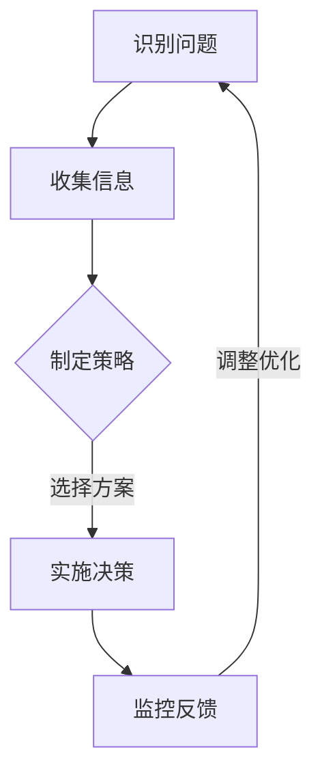

                 


### 文章标题：领导力的演变：从传统到现代的管理哲学

#### 关键词：
- 领导力
- 管理哲学
- 传统领导
- 现代领导
- 领导模式
- 领导风格
- 领导力发展

#### 摘要：
本文旨在探讨领导力的演变过程，从传统到现代的管理哲学。通过分析传统领导力的定义、模式及其面临的挑战，揭示管理哲学的变迁。随后，深入探讨现代领导力的核心要素、工具与技术，包括沟通技巧、决策制定和风险管理。此外，本文还将关注跨文化领导力、领导力的创新与实践，以及领导力发展的未来趋势。通过这些讨论，本文旨在为读者提供关于领导力演变和现代领导力实践的综合理解。

---

# 引言：领导力的重要性

在组织和社会的各个层面，领导力始终扮演着至关重要的角色。无论是在商业、教育、政府还是非营利组织中，领导力都是推动变革、实现目标和提升组织效能的关键因素。一个优秀的领导者能够激励团队成员，培养他们的潜力，同时为组织带来创新和增长。

领导力不仅仅是关于权力和权威，它更是一种影响力，一种能够引导他人朝着共同目标前进的能力。随着全球化、技术变革和商业环境的快速变化，领导力的定义和作用也在不断演变。从传统的权威式领导到现代的参与式领导，再到跨文化领导，领导力的发展反映了时代的需求和挑战。

本文将探讨领导力的演变过程，从传统到现代的管理哲学。我们将首先回顾传统领导力的概念和模式，分析其面临的挑战和局限性。接着，我们将探讨管理哲学的变迁，从权威管理到参与式管理和自我领导力的兴起。然后，我们将深入探讨现代领导力的核心要素，包括个人素质、团队管理和组织变革。此外，我们还将讨论现代领导力所需的工具与技术，如沟通技巧、决策制定和风险管理。最后，我们将关注跨文化领导力、领导力的创新与实践，以及领导力发展的未来趋势。

通过这些讨论，我们希望能够为读者提供一个全面而深刻的理解，帮助他们在现代环境中更好地应用领导力，实现个人和组织的成功。

## 第一部分：领导力的起源与演变

### 第1章：传统领导力概念与模式

传统领导力是人类社会历史发展的产物，其定义和模式在不同的文化和历史背景下有所差异。总体而言，传统领导力主要基于权威和控制，强调领导者的决策权和指挥能力。在这一部分中，我们将首先探讨传统领导力的定义，然后分析其主要模式，并探讨传统领导力在面对变化和挑战时的局限性和应对策略。

### 1.1 传统领导力定义

传统领导力通常被定义为一种通过权威和指令来指导和影响他人的能力。在这种模式中，领导者被视为组织的核心，他们的决策和指令对组织的发展和成果具有决定性影响。传统领导力强调领导者的个人特质和权威，包括远见、智慧、决断力和控制力。以下是对传统领导力定义的详细阐述：

1. **权威性**：传统领导力强调领导者的权威地位，认为领导者有权制定和执行决策，下属需要无条件服从。
2. **集中化**：决策和资源集中在领导者手中，领导者负责制定战略和指导组织方向。
3. **任务导向**：领导者主要关注任务的完成，追求效率和组织目标的实现。
4. **单向沟通**：领导者与下属之间的沟通往往是单向的，领导者发布指令，下属执行。
5. **层级结构**：组织结构通常是层级化的，领导者位于金字塔顶端，下属按照层级关系进行工作。

### 1.2 传统领导力模式

传统领导力有多种模式，每种模式都有其独特的特点和应用场景。以下是几种常见的传统领导力模式：

#### 1.2.1 权威领导模式

权威领导模式是一种典型的传统领导力模式，强调领导者的权威和决策权。在这种模式中，领导者通过指令和监督来管理下属，确保组织目标的实现。以下是其特点：

- **领导者权威**：领导者拥有绝对的决策权和指挥权，下属必须服从。
- **高度集中**：决策和资源集中在领导者手中，下属的参与度较低。
- **严格监督**：领导者通过严格的监督和控制来确保任务的执行。

#### 1.2.2 情感领导模式

情感领导模式强调领导者与下属之间的情感联系，通过情感激励和关怀来影响下属。以下是其特点：

- **情感联系**：领导者与下属建立深厚的情感联系，关心下属的需求和福祉。
- **激励导向**：领导者通过情感激励来激发下属的积极性和创造力。
- **合作氛围**：领导者鼓励下属参与决策，营造合作和信任的工作环境。

#### 1.2.3 指导领导模式

指导领导模式强调领导者对下属的指导和培养，通过知识传授和技能提升来提升团队的整体能力。以下是其特点：

- **知识传授**：领导者通过指导和培训，将知识和经验传递给下属。
- **技能提升**：领导者关注下属的技能提升，鼓励他们不断学习和成长。
- **专业发展**：领导者支持下属的职业发展，为他们提供成长的机会。

### 1.3 传统领导力面临的挑战

随着全球化、技术变革和组织结构的复杂化，传统领导力模式逐渐暴露出其局限性和不足。以下是一些传统领导力面临的挑战：

#### 1.3.1 变化环境的适应性

在快速变化的环境中，传统领导力的权威和集中化决策模式往往难以适应。组织需要更加灵活和快速响应，而传统领导力模式则可能变得僵化和难以适应。

#### 1.3.2 团队协作的局限性

传统领导力模式强调领导者的权威和集中化决策，往往忽视团队协作和下属的参与。这可能导致团队缺乏创新和动力，难以发挥整体潜力。

#### 1.3.3 组织变革的挑战

传统领导力模式在推动组织变革时可能面临挑战。领导者的决策权和控制力往往使得变革过程变得困难，下属的参与和接受度也较低。

#### 1.3.4 多元文化背景的挑战

在全球化背景下，组织成员往往来自不同的文化背景。传统领导力模式可能无法有效处理文化差异和跨文化沟通，导致团队协作和领导力效果的下降。

### 1.4 应对策略

为了应对传统领导力面临的挑战，领导者需要采取一系列策略来适应现代环境。以下是一些可能的应对策略：

#### 1.4.1 提高适应性

领导者需要提高自身的适应能力，通过学习和培训来不断更新知识和技能。领导者还应该鼓励下属也具备适应能力，以应对快速变化的环境。

#### 1.4.2 强化团队协作

领导者需要打破传统领导力模式的局限，鼓励团队协作和下属参与。通过建立信任和合作的文化，提高团队的整体能力和创新能力。

#### 1.4.3 推动组织变革

领导者需要积极参与组织变革，成为变革的推动者和倡导者。通过沟通和激励，确保变革过程的顺利进行，并提升下属的接受度和参与度。

#### 1.4.4 处理文化差异

在多元化背景下，领导者需要具备跨文化沟通和领导能力。通过理解和尊重不同文化的特点，建立有效的跨文化团队，提高团队协作和领导力效果。

### 结论

传统领导力在历史上发挥了重要作用，但随着时代的变化，其局限性和挑战也日益明显。领导者需要认识到这些挑战，并采取相应的策略来提升自身的适应能力和领导力。通过提高适应性、强化团队协作、推动组织变革和处理文化差异，领导者可以更好地应对现代环境，实现个人和组织的成功。

---

## 第1章：传统领导力概念与模式

### 1.1 传统领导力定义

传统领导力是指通过权威和指令来指导和影响他人的能力。在传统领导力中，领导者被视为组织的核心，他们的决策和指令对组织的发展和成果具有决定性影响。传统领导力主要基于以下几个核心概念：

1. **权威性**：领导者拥有决策权和指挥权，下属必须服从。
2. **集中化**：决策和资源集中在领导者手中，下属的参与度较低。
3. **任务导向**：领导者主要关注任务的完成，追求效率和组织目标的实现。
4. **单向沟通**：领导者与下属之间的沟通往往是单向的，领导者发布指令，下属执行。
5. **层级结构**：组织结构通常是层级化的，领导者位于金字塔顶端，下属按照层级关系进行工作。

传统领导力的起源可以追溯到古代社会，当时领导者通过军事和政治权力来维护秩序和稳定。随着历史的发展，领导力概念逐渐演变，形成了不同的模式。然而，传统领导力的核心原则仍然体现在现代领导实践中。

### 1.2 传统领导力模式

传统领导力有多种模式，每种模式都有其独特的特点和应用场景。以下是几种常见的传统领导力模式：

#### 1.2.1 权威领导模式

权威领导模式是一种典型的传统领导力模式，强调领导者的权威和决策权。在这种模式中，领导者通过指令和监督来管理下属，确保组织目标的实现。以下是权威领导模式的主要特点：

- **领导者权威**：领导者拥有绝对的决策权和指挥权，下属必须服从。
- **高度集中**：决策和资源集中在领导者手中，下属的参与度较低。
- **严格监督**：领导者通过严格的监督和控制来确保任务的执行。

权威领导模式在军事、政府和一些大型组织中较为常见。这种模式的优势在于能够快速做出决策和高效执行，但缺点是可能抑制下属的创造力和主动性。

#### 1.2.2 情感领导模式

情感领导模式强调领导者与下属之间的情感联系，通过情感激励和关怀来影响下属。在这种模式中，领导者关心下属的需求和福祉，通过情感激励来激发下属的积极性和创造力。以下是情感领导模式的主要特点：

- **情感联系**：领导者与下属建立深厚的情感联系，关心下属的需求和福祉。
- **激励导向**：领导者通过情感激励来激发下属的积极性和创造力。
- **合作氛围**：领导者鼓励下属参与决策，营造合作和信任的工作环境。

情感领导模式在教育和人力资源管理等领域较为常见。这种模式的优势在于能够提高下属的工作满意度和忠诚度，但缺点是可能导致领导者的个人情感对组织决策产生较大影响。

#### 1.2.3 指导领导模式

指导领导模式强调领导者对下属的指导和培养，通过知识传授和技能提升来提升团队的整体能力。在这种模式中，领导者通过指导和培训来将知识和经验传递给下属，促进他们的专业发展。以下是指导领导模式的主要特点：

- **知识传授**：领导者通过指导和培训，将知识和经验传递给下属。
- **技能提升**：领导者关注下属的技能提升，鼓励他们不断学习和成长。
- **专业发展**：领导者支持下属的职业发展，为他们提供成长的机会。

指导领导模式在教育和科研机构中较为常见。这种模式的优势在于能够提升团队的专业能力和创新力，但缺点是可能过度依赖领导者的个人能力和经验。

### 1.3 传统领导力面临的挑战

尽管传统领导力在历史上发挥了重要作用，但随着时代的变化，其局限性和挑战也日益明显。以下是传统领导力面临的主要挑战：

#### 1.3.1 变化环境的适应性

在快速变化的环境中，传统领导力的权威和集中化决策模式往往难以适应。组织需要更加灵活和快速响应，而传统领导力模式则可能变得僵化和难以适应。

#### 1.3.2 团队协作的局限性

传统领导力模式强调领导者的权威和集中化决策，往往忽视团队协作和下属的参与。这可能导致团队缺乏创新和动力，难以发挥整体潜力。

#### 1.3.3 组织变革的挑战

传统领导力模式在推动组织变革时可能面临挑战。领导者的决策权和控制力往往使得变革过程变得困难，下属的参与和接受度也较低。

#### 1.3.4 多元文化背景的挑战

在全球化背景下，组织成员往往来自不同的文化背景。传统领导力模式可能无法有效处理文化差异和跨文化沟通，导致团队协作和领导力效果的下降。

### 1.4 应对策略

为了应对传统领导力面临的挑战，领导者需要采取一系列策略来适应现代环境。以下是可能的应对策略：

#### 1.4.1 提高适应性

领导者需要提高自身的适应能力，通过学习和培训来不断更新知识和技能。领导者还应该鼓励下属也具备适应能力，以应对快速变化的环境。

#### 1.4.2 强化团队协作

领导者需要打破传统领导力模式的局限，鼓励团队协作和下属参与。通过建立信任和合作的文化，提高团队的整体能力和创新能力。

#### 1.4.3 推动组织变革

领导者需要积极参与组织变革，成为变革的推动者和倡导者。通过沟通和激励，确保变革过程的顺利进行，并提升下属的接受度和参与度。

#### 1.4.4 处理文化差异

在多元化背景下，领导者需要具备跨文化沟通和领导能力。通过理解和尊重不同文化的特点，建立有效的跨文化团队，提高团队协作和领导力效果。

### 结论

传统领导力在历史上发挥了重要作用，但随着时代的变化，其局限性和挑战也日益明显。领导者需要认识到这些挑战，并采取相应的策略来提升自身的适应能力和领导力。通过提高适应性、强化团队协作、推动组织变革和处理文化差异，领导者可以更好地应对现代环境，实现个人和组织的成功。

---

## 第2章：管理哲学的变迁

随着时代的发展和社会的进步，管理哲学也在不断演变。从早期的权威管理到现代的参与式管理和自我领导力的兴起，管理哲学的变迁反映了领导者对组织和管理实践的不断探索和创新。在这一章中，我们将探讨管理哲学的变迁过程，分析不同管理哲学的核心原则及其应用场景。

### 2.1 从权威管理到参与式管理

权威管理是传统管理哲学的典型代表，强调领导者的权威和决策权。在这种模式下，领导者通过指令和监督来管理下属，确保组织目标的实现。然而，随着组织规模的扩大和复杂性的增加，权威管理模式的局限性逐渐显现。为此，管理哲学逐渐从权威管理转向参与式管理。

#### 2.1.1 参与式管理的核心原则

参与式管理强调员工的参与和合作，认为员工是组织的重要资源，他们的意见和贡献对于组织的发展至关重要。以下是参与式管理的核心原则：

- **员工参与**：鼓励员工参与决策过程，提高他们的参与度和责任感。
- **信息共享**：领导者与员工之间建立开放、透明的沟通机制，共享信息资源。
- **团队合作**：强调团队协作，通过团队合作实现组织目标。
- **自主管理**：赋予员工更多的自主权，鼓励他们自主管理和创新。

#### 2.1.2 参与式管理的应用场景

参与式管理在许多组织中得到广泛应用，特别是在创新型企业和知识密集型组织中。以下是一些典型的应用场景：

- **产品开发**：在产品开发过程中，鼓励研发团队参与决策，提高产品的创新性和市场适应性。
- **战略规划**：在制定战略规划时，邀请不同部门和层次的员工参与，确保战略的全面性和执行力。
- **员工培训**：在员工培训过程中，鼓励员工参与课程设计和教学，提高培训效果。

#### 2.1.3 参与式管理的优势与挑战

参与式管理具有许多优势，如提高员工满意度、增强团队凝聚力和提高组织创新能力。然而，参与式管理也面临一些挑战，如决策过程的复杂性、沟通成本的增加和可能出现的管理真空。因此，领导者需要根据实际情况，权衡参与式管理的利弊，合理应用。

### 2.2 自我领导力的兴起

在管理哲学的变迁中，自我领导力的兴起是一个重要趋势。自我领导力强调个人自我管理和自我激励，认为每个个体都有潜力成为领导者。以下是自我领导力的核心原则：

- **自我意识**：认识到自己的优点和不足，了解自己的需求和动机。
- **自我管理**：通过制定目标和计划，自我监督和自我调整，实现个人目标。
- **自我激励**：通过内在动机和外部激励，保持积极性和创造力。
- **终身学习**：不断学习和成长，提升个人素质和领导力。

#### 2.2.1 自我领导力的应用场景

自我领导力在许多领域都有应用，如个人成长、团队管理和组织变革。以下是一些典型的应用场景：

- **个人成长**：通过自我领导力，个人可以更好地规划职业生涯，提升自身能力。
- **团队管理**：团队成员通过自我领导力，可以更好地协调工作，提高团队效能。
- **组织变革**：领导者通过自我领导力，可以推动组织变革，实现组织的可持续发展。

#### 2.2.2 自我领导力的优势与挑战

自我领导力具有许多优势，如提高个人自我意识、增强自我管理能力和提高组织创新能力。然而，自我领导力也面临一些挑战，如个人动机的稳定性、自我管理的能力差异和外部环境的支持。因此，领导者需要关注自我领导力的培养和应用，同时提供必要的支持和指导。

### 2.3 人本主义与管理哲学

人本主义管理哲学强调以人为本，认为人是组织中最宝贵的资源。人本主义管理哲学的核心原则包括：

- **尊重人**：尊重员工的人格尊严和价值，关心员工的需求和福祉。
- **发展人**：通过培训和激励，提升员工的能力和素质，促进个人发展。
- **激励人**：通过内在激励和外部激励，激发员工的积极性和创造力。
- **和谐人**：建立和谐的工作环境，促进员工之间的合作和信任。

#### 2.3.1 人本主义管理哲学的应用场景

人本主义管理哲学在许多组织中得到广泛应用，如人力资源管理、员工关系管理和企业文化建设。以下是一些典型的应用场景：

- **人力资源管理**：通过人本主义管理哲学，组织可以更好地吸引、培养和保留人才。
- **员工关系管理**：通过人本主义管理哲学，组织可以建立和谐稳定的员工关系，提高员工满意度。
- **企业文化建设**：通过人本主义管理哲学，组织可以塑造积极向上的企业文化，提高组织的凝聚力和竞争力。

#### 2.3.2 人本主义管理哲学的优势与挑战

人本主义管理哲学具有许多优势，如提高员工满意度和忠诚度、增强团队凝聚力和提高组织创新能力。然而，人本主义管理哲学也面临一些挑战，如管理成本的提高、对员工信任的风险和可能出现的管理真空。因此，领导者需要根据实际情况，合理应用人本主义管理哲学。

### 结论

管理哲学的变迁反映了领导者对组织和管理实践的不断探索和创新。从权威管理到参与式管理，再到自我领导力和人本主义管理哲学的兴起，管理哲学的变迁不仅丰富了领导力的理论体系，也为现代组织的成功提供了新的思路和方法。领导者需要根据组织的实际情况，灵活应用不同管理哲学，以实现组织的可持续发展。

---

## 第3章：现代领导力核心要素

现代领导力不仅需要具备传统领导力的基本要素，还需要在复杂多变的环境中具备适应性和创新能力。现代领导力包括多个核心要素，这些要素共同作用，帮助领导者实现组织的目标。以下我们将详细探讨现代领导力的核心要素，包括领导力与个人素质、领导力与团队管理以及领导力与组织变革。

### 3.1 领导力与个人素质

个人素质是领导力的基石。一个优秀的领导者不仅需要具备卓越的专业能力，还需要具备一系列的个人素质，这些素质决定了领导者的领导风格和效能。

#### 3.1.1 领导者的关键素质

- **沟通能力**：领导者需要具备良好的沟通能力，包括口头和书面沟通技巧，以及有效的非语言沟通能力。良好的沟通能力有助于建立信任，确保信息的准确传递。
- **决策能力**：领导者需要能够在复杂和不确定的环境下做出明智的决策。这要求领导者具备分析问题的能力、逻辑思维和快速判断能力。
- **情绪智力**：情绪智力包括自我意识、自我管理、社交意识和关系管理。高情绪智力的领导者能够更好地理解自己和他人，有效地处理冲突和压力。
- **创新思维**：在快速变化的今天，领导者需要具备创新思维，能够不断寻求新的解决方案和方法，推动组织的持续发展。
- **自我激励**：领导者需要具备强烈的自我激励能力，能够在面对困难和挑战时保持积极的态度和动力。

#### 3.1.2 领导者如何培养自身素质

- **自我反思**：领导者需要定期进行自我反思，了解自己的优势和不足，并制定改进计划。
- **终身学习**：领导者应该持续学习，不断提升自己的知识和技能，适应不断变化的环境。
- **实践经验**：通过参与各种项目和挑战，领导者可以在实践中锻炼自己的能力，积累宝贵的经验。
- **导师指导**：寻找一位经验丰富的导师，可以帮助领导者快速成长，提供指导和支持。
- **培养团队**：领导者通过培养团队成员，不仅可以提升团队的整体能力，也可以在互动中不断成长。

### 3.2 领导力与团队管理

团队管理是现代领导力的关键组成部分。一个高效的团队能够实现共同的目标，并在实现目标的过程中创造价值。领导者需要关注以下几个方面：

#### 3.2.1 团队领导技巧

- **建立共同目标**：领导者需要与团队成员共同制定明确的目标，并确保每个成员都理解并认同这些目标。
- **分配任务**：领导者需要根据团队成员的能力和特长，合理分配任务，确保每个成员都能在合适的岗位上发挥最大的潜力。
- **激励团队**：领导者需要运用各种激励手段，如奖励、认可和挑战，激发团队成员的积极性和创造力。
- **沟通与协作**：领导者需要建立有效的沟通和协作机制，确保团队成员之间的信息共享和资源整合。
- **解决问题**：领导者需要具备解决问题的能力，能够在团队面临挑战时提供指导和支持，帮助团队找到解决方案。

#### 3.2.2 团队动态与领导策略

- **团队建设**：领导者需要定期组织团队建设活动，增强团队成员之间的信任和凝聚力。
- **冲突管理**：领导者需要学会管理团队中的冲突，通过沟通和调解，确保团队和谐稳定。
- **发展团队**：领导者需要关注团队成员的成长，为他们提供发展机会和培训。
- **创新文化**：领导者需要鼓励创新，营造一个支持和鼓励创新的文化环境。

### 3.3 领导力与组织变革

组织变革是现代领导力的重要挑战之一。随着外部环境的快速变化，组织需要不断调整和适应，以保持竞争力和可持续发展。领导者需要具备推动组织变革的能力。

#### 3.3.1 变革领导者的角色

- **变革倡导者**：领导者需要倡导变革，向团队成员传达变革的重要性和必要性。
- **变革设计者**：领导者需要设计变革策略，制定详细的变革计划和实施步骤。
- **变革推动者**：领导者需要推动变革的实施，确保团队成员理解和接受变革。
- **变革支持者**：领导者需要为变革提供支持和资源，确保变革能够顺利进行。

#### 3.3.2 变革管理的策略

- **沟通策略**：领导者需要与团队成员进行有效沟通，确保他们了解变革的背景、目标和步骤。
- **参与策略**：领导者需要鼓励团队成员参与变革过程，提高他们的参与度和接受度。
- **变革领导力**：领导者需要具备变革领导力，能够在变革过程中保持冷静和坚定，应对各种挑战。
- **反馈与调整**：领导者需要收集变革过程中的反馈，根据实际情况进行调整和优化。

### 结论

现代领导力是一个综合性的概念，涉及到个人素质、团队管理和组织变革等多个方面。领导者需要不断提升自身素质，掌握团队领导技巧，并具备推动组织变革的能力。通过有效地运用这些核心要素，领导者可以带领组织实现持续的成功和发展。

---

## 第4章：现代领导力工具与技术

现代领导力不仅依赖于领导者自身的素质和技能，还需要借助一系列工具和技术来提高管理效率和团队效能。以下，我们将详细探讨现代领导力所需的几个关键工具与技术，包括沟通技巧、决策制定和风险管理。

### 4.1 沟通技巧

沟通技巧是领导者的重要能力之一，它直接影响着领导力效果和组织效能。有效的沟通不仅能够确保信息准确传递，还能增强团队凝聚力和员工满意度。

#### 4.1.1 有效沟通的关键要素

- **清晰表达**：领导者需要能够清晰、明确地表达自己的意图和期望，避免歧义和误解。
- **倾听技巧**：领导者需要具备良好的倾听技巧，包括耐心倾听、理解对方观点和反馈。
- **非语言沟通**：领导者需要注意自己的肢体语言、语调和面部表情，确保非语言沟通与语言表达一致。
- **适应性沟通**：领导者需要根据不同的沟通对象和场景，灵活调整沟通方式和策略。

#### 4.1.2 沟通障碍与克服方法

- **语言障碍**：语言差异可能造成沟通障碍，领导者可以通过使用简单的语言和常见的词汇来克服这一问题。
- **文化差异**：跨文化沟通可能带来文化误解，领导者需要了解不同文化的沟通习惯和价值观，避免文化冲突。
- **时间压力**：时间紧迫可能导致沟通效率低下，领导者可以通过制定沟通计划和时间表来提高沟通效率。

#### 4.1.3 实际案例

- **案例1**：一家国际公司为了提高内部沟通效率，引入了多种沟通工具，如企业即时通讯软件、电子邮件和定期会议。这些工具帮助团队成员在不同时间和地点保持有效沟通，提高了工作效率。
- **案例2**：一位项目经理在项目进展遇到问题时，通过召开团队会议，倾听团队成员的意见和建议，最终找到了解决方案，避免了项目延误。

### 4.2 决策制定

决策制定是领导力的核心任务之一。一个高效的领导者需要能够迅速、准确地做出决策，并在决策过程中考虑到各种风险和潜在影响。

#### 4.2.1 决策过程

- **问题识别**：领导者需要识别和明确需要解决的问题或机会。
- **信息收集**：领导者需要收集与问题相关的信息，进行分析和评估。
- **方案制定**：领导者需要制定多个可能的解决方案，并进行比较和评估。
- **决策制定**：领导者需要基于信息和分析，选择最合适的方案进行实施。
- **执行和监控**：领导者需要确保决策得到有效执行，并持续监控决策的效果。

#### 4.2.2 决策制定工具

- **头脑风暴**：通过集体头脑风暴，激发团队成员的创造力和想象力，产生多个创意方案。
- **SWOT分析**：通过SWOT分析（优势、劣势、机会、威胁），评估解决方案的优缺点，制定策略。
- **决策树**：通过决策树，系统性地展示决策过程和可能的结果，帮助领导者做出最优决策。
- **标杆学习**：通过借鉴其他成功组织的决策经验和最佳实践，提高自身决策能力。

#### 4.2.3 实际案例

- **案例1**：一家初创公司面临产品市场定位问题，通过SWOT分析和标杆学习，最终确定了适合自身的产品定位和市场策略，取得了显著的市场成功。
- **案例2**：一位项目经理在面临项目进度延误时，通过决策树分析了多个可能的解决方案，最终选择了一种既能够确保项目按时完成，又能控制成本的方法，成功解决了问题。

### 4.3 风险管理

风险管理是现代领导力中不可或缺的一部分。领导者需要能够识别和管理组织面临的各种风险，确保组织的稳定运营和可持续发展。

#### 4.3.1 风险管理框架

- **风险评估**：领导者需要识别和评估组织面临的各种风险，包括市场风险、财务风险、操作风险等。
- **风险分类**：将识别出的风险按照严重程度和发生概率进行分类，确定优先级。
- **风险应对策略**：根据风险评估结果，制定相应的风险应对策略，包括风险规避、风险减轻、风险接受等。
- **风险监控**：领导者需要持续监控风险状况，确保风险应对策略的有效性。

#### 4.3.2 风险管理实践

- **制定风险管理计划**：领导者需要制定详细的风险管理计划，包括风险识别、评估、应对和监控等步骤。
- **培训和教育**：领导者需要培训和教育团队成员，提高他们的风险意识和管理能力。
- **持续改进**：领导者需要不断评估和改进风险管理策略，确保组织能够应对不断变化的风险环境。

#### 4.3.3 实际案例

- **案例1**：一家大型制造业公司通过建立全面的风险管理框架，成功识别并应对了一次原材料价格波动带来的风险，避免了潜在的经济损失。
- **案例2**：一家互联网公司通过持续的风险监控和改进，成功应对了一次网络安全事件，保护了用户数据和公司资产。

### 结论

现代领导力所需的工具与技术是领导者实现组织目标和提升管理效能的重要手段。通过掌握有效的沟通技巧、科学的决策制定方法和系统的风险管理实践，领导者可以更好地应对复杂多变的环境，带领组织实现持续的成功和发展。

---

## 第5章：跨文化领导力

在全球化时代，跨文化领导力变得尤为重要。随着全球化的深入发展，越来越多的组织在不同国家和地区开展业务，领导者需要具备跨文化沟通和领导能力，以应对多元化的工作环境和文化差异。以下，我们将探讨跨文化领导力的挑战、跨文化沟通与协作以及跨文化领导力的策略。

### 5.1 跨文化领导力的挑战

跨文化领导力面临诸多挑战，这些挑战源于文化差异、沟通障碍和团队多样性。

#### 5.1.1 文化差异

文化差异是跨文化领导力面临的首要挑战。不同国家和地区的人们在价值观、信仰、行为规范和工作习惯等方面存在显著差异。例如，一些文化强调集体主义和团队协作，而另一些文化则更注重个人主义和自我表现。这些文化差异可能导致团队成员之间的误解、冲突和合作困难。

#### 5.1.2 沟通障碍

跨文化沟通障碍主要体现在语言、非语言沟通和文化背景差异上。语言障碍是显而易见的，不同语言的使用可能导致沟通不准确或误解。非语言沟通，如肢体语言、面部表情和语调，也可能因文化差异而影响沟通效果。此外，文化背景差异，如时间观念、决策风格和沟通方式，也可能导致沟通障碍。

#### 5.1.3 团队多样性

跨文化团队多样性增加了领导工作的复杂性。团队成员可能来自不同的文化背景，拥有不同的价值观和行为模式，这可能导致团队内部的合作和沟通困难。领导者需要了解和尊重团队成员的文化背景，建立有效的跨文化沟通和协作机制。

### 5.2 跨文化沟通与协作

跨文化沟通与协作是跨文化领导力的核心内容。有效的跨文化沟通和协作能够促进团队合作，提高组织效能。

#### 5.2.1 跨文化沟通策略

- **了解文化差异**：领导者需要了解不同文化的基本特点，包括价值观、信仰和行为规范，以避免文化误解和冲突。
- **尊重文化差异**：领导者需要尊重不同文化的独特性，避免将本国的文化标准强加于他人。
- **采用适应性沟通**：领导者需要根据不同文化背景，采用适当的沟通方式，如简化语言、避免使用隐喻和俚语等。
- **培养跨文化意识**：领导者需要培养团队成员的跨文化意识，提高他们的文化敏感性和适应性。

#### 5.2.2 跨文化协作

- **建立共同目标**：领导者需要与团队成员共同制定明确的目标，确保每个人都理解并认同这些目标。
- **促进合作与信任**：领导者需要创造一个支持合作和信任的环境，鼓励团队成员分享知识和经验，共同解决问题。
- **利用多样性**：领导者需要充分利用团队成员的多样性，发挥各自的优势，提高团队的整体效能。

### 5.3 多元文化领导力的策略

为了有效地管理多元化团队，领导者需要采取一系列策略，以应对跨文化领导力带来的挑战。

#### 5.3.1 多元文化管理实践

- **文化敏感性培训**：领导者可以为团队成员提供文化敏感性培训，提高他们的文化意识和跨文化沟通能力。
- **建立多元文化团队**：领导者需要建立多元化的团队，确保团队成员的多样性，并利用这种多样性来提高团队的创新和创造力。
- **公平对待**：领导者需要公平对待所有团队成员，避免因文化差异而造成的不公平待遇。

#### 5.3.2 多元文化领导力的可持续发展

- **长期规划**：领导者需要制定长期的文化融合和发展规划，确保多元文化领导力的可持续发展。
- **持续改进**：领导者需要不断评估和改进多元文化管理策略，根据实际情况进行调整。
- **领导力发展**：领导者需要不断提升自身的跨文化领导力，学习新的管理理念和技巧，以适应不断变化的全球化环境。

#### 5.3.3 实际案例

- **案例1**：一家跨国公司在全球范围内开展业务，通过实施文化敏感性培训和多语言沟通工具，成功提高了跨文化沟通和协作效率。
- **案例2**：一位项目经理在跨国团队管理中，通过建立共同目标和定期团队会议，有效促进了团队成员之间的沟通和合作。

### 结论

跨文化领导力是现代领导力的重要组成部分。领导者需要认识到跨文化领导力带来的挑战，并采取有效的策略来应对这些挑战。通过了解文化差异、尊重文化差异、培养跨文化意识和协作能力，领导者可以有效地管理多元化团队，实现组织的全球化和可持续发展。

---

## 第6章：领导力的创新与实践

在现代组织中，创新不仅是推动组织发展的动力，也是提升竞争力的关键。领导者的创新能力和实践方法对组织的成功至关重要。在这一章中，我们将探讨创新型领导者的特质、创新过程与领导力，以及具体的创新实践案例。

### 6.1 创新型领导者特质

创新型领导者具有一系列独特的特质，这些特质使他们能够在复杂多变的环境中引领创新，推动组织变革。

#### 6.1.1 开放心态

开放心态是创新型领导者的核心特质之一。他们愿意接受新观念、新方法和不同观点，不断探索和尝试。开放心态使领导者能够适应变化，抓住创新机会。

#### 6.1.2 敢于冒险

创新型领导者敢于冒险，愿意承担创新过程中的不确定性和风险。他们相信，只有通过冒险，才能发现新的解决方案和突破。

#### 6.1.3 鼓励创新

创新型领导者鼓励团队成员提出创新想法，并为创新提供支持和资源。他们相信，创新是团队智慧和努力的结果。

#### 6.1.4 沟通与协作

创新型领导者善于沟通和协作，能够有效协调不同部门和团队成员之间的工作，确保创新项目的顺利推进。

#### 6.1.5 持续学习

创新型领导者具备持续学习的习惯，他们不断更新知识，提升技能，以适应快速变化的环境。

### 6.2 创新过程与领导力

创新过程是一个复杂的系统，领导者需要有效管理和领导这一过程，以确保创新的顺利进行和成功实施。

#### 6.2.1 创意生成

创意生成是创新过程的起点，领导者需要创造一个鼓励创新和自由表达的环境，激发团队成员的创意。

#### 6.2.2 筛选与评估

在创意生成之后，领导者需要对创意进行筛选和评估，确定哪些创意具有实施潜力，并选择最佳方案。

#### 6.2.3 实施与执行

实施与执行是创新过程的关键环节，领导者需要确保创意得到有效实施，并协调各种资源，确保项目按时完成。

#### 6.2.4 反馈与调整

在创新实施过程中，领导者需要收集反馈，根据实际情况进行调整和优化，确保创新项目能够达到预期目标。

### 6.3 创新实践案例

#### 6.3.1 案例一：苹果公司

苹果公司以其创新的产品和设计而闻名。苹果公司的创新实践主要体现在以下几个方面：

- **持续投资研发**：苹果公司不断投资于研发，确保其在技术创新方面保持领先地位。
- **扁平化管理**：苹果公司采用扁平化管理结构，鼓励员工自由表达创意，提高创新效率。
- **跨部门协作**：苹果公司促进跨部门协作，确保创意在不同部门和团队之间得到有效传播和实施。
- **用户反馈**：苹果公司重视用户反馈，通过用户反馈不断优化产品设计和功能。

#### 6.3.2 案例二：特斯拉

特斯拉是一家以创新为核心的电动汽车制造商。特斯拉的创新实践包括：

- **自主研发**：特斯拉在电池技术、自动驾驶系统等领域进行自主研发，推动技术创新。
- **快速迭代**：特斯拉采用快速迭代的方法，不断改进产品性能和用户体验。
- **员工激励**：特斯拉通过提供创新奖励和股权激励，鼓励员工积极参与创新活动。
- **可持续发展**：特斯拉关注可持续发展，通过创新技术减少碳排放，推动绿色能源的发展。

#### 6.3.3 案例三：谷歌

谷歌以其创新的企业文化和开放的工作环境而著称。谷歌的创新实践包括：

- **20%时间政策**：谷歌允许员工将20%的工作时间用于探索自己的创意项目，这一政策催生了众多创新产品，如Gmail和Google News。
- **内部创业**：谷歌鼓励员工内部创业，提供资源和支持，帮助员工将创意转化为实际产品。
- **跨职能团队**：谷歌建立跨职能团队，促进不同领域专家之间的合作，推动创新。
- **持续培训**：谷歌为员工提供持续培训和学习机会，提升员工的创新能力和技术素养。

### 结论

领导力的创新与实践是现代组织中不可或缺的一部分。创新型领导者通过开放心态、敢于冒险、鼓励创新、沟通协作和持续学习，推动组织实现持续创新。通过具体案例的实践，我们可以看到创新是如何在苹果、特斯拉和谷歌等公司中发挥作用的。领导者需要借鉴这些成功经验，结合自身组织的实际情况，积极推动创新，实现组织的持续发展和竞争优势。

---

## 第7章：领导力发展之路

领导力的发展是一个持续的过程，涉及到个人的成长、组织的培养和未来的趋势。在这一章中，我们将探讨领导力自我提升、领导力培训与发展，以及领导力发展的未来趋势。

### 7.1 领导力自我提升

个人自我提升是领导力发展的基础。领导者需要通过自我反思、学习和实践来不断提升自己的能力和素质。

#### 7.1.1 自我反思

自我反思是领导者自我提升的重要方法。通过定期反思自己的行为和决策，领导者可以识别自身的优点和不足，并制定改进计划。以下是一些自我反思的技巧：

- **定期回顾**：定期回顾过去的工作和经历，总结成功和失败的经验。
- **寻求反馈**：主动向同事、下属和上级寻求反馈，了解自己的表现和改进方向。
- **记录日志**：记录每天的工作和思考，通过回顾日志来分析和改进自己的行为。

#### 7.1.2 学习与成长

持续学习和成长是领导力自我提升的关键。领导者需要不断更新知识和技能，适应快速变化的环境。以下是一些学习和成长的策略：

- **专业培训**：参加专业培训课程，学习最新的管理理论和实践。
- **阅读和研究**：阅读相关书籍、研究论文和行业报告，了解行业动态和趋势。
- **跨学科学习**：学习不同领域的知识，拓宽视野，提高综合能力。

#### 7.1.3 实践与应用

实践是检验和学习成果的重要环节。领导者需要在实际工作中应用所学知识和技能，通过实践来提升自己的能力。以下是一些实践与应用的技巧：

- **挑战自我**：主动承担具有挑战性的任务，通过解决难题来提升能力。
- **角色扮演**：通过角色扮演和模拟训练，提高应对复杂情况和决策的能力。
- **反馈与调整**：在实践中不断收集反馈，根据反馈进行调整和优化。

### 7.2 领导力培训与发展

组织在领导力发展中也扮演着重要角色。通过系统的培训和发展计划，组织可以帮助领导者提升能力，实现组织的长期目标。

#### 7.2.1 培训计划

组织的培训计划应包括以下几个方面：

- **基础培训**：为初入职的领导者提供基础管理知识和技能培训。
- **进阶培训**：针对不同层级的领导者，提供更深入的管理理论和实践培训。
- **定制化培训**：根据领导者的需求和组织的实际情况，提供定制化的培训方案。

#### 7.2.2 发展计划

组织的发展计划应包括以下几个方面：

- **领导力评估**：通过评估了解领导者的优势和不足，制定个性化的发展计划。
- **轮岗与拓展**：通过轮岗和拓展项目，让领导者体验不同部门和角色的工作，提升综合能力。
- **导师指导**：为领导者配备导师，提供指导和反馈，帮助他们在职业生涯中不断成长。

#### 7.2.3 持续支持

组织的持续支持是领导力发展的重要保障。以下是一些持续支持的策略：

- **学习资源**：为领导者提供丰富的学习资源，如在线课程、电子书籍和研讨会。
- **支持网络**：建立领导者的支持网络，让他们能够相互学习和分享经验。
- **激励机制**：通过激励机制，鼓励领导者积极参与培训和发展活动，提升他们的积极性。

### 7.3 领导力发展的未来趋势

随着社会和技术的不断进步，领导力的发展也在不断演变。以下是领导力发展的几个未来趋势：

#### 7.3.1 数字化领导力

数字化领导力是指领导者具备数字化技能和思维，能够有效地利用数字技术推动组织创新和变革。未来，领导者需要具备以下数字化技能：

- **数据分析能力**：能够分析大数据，做出基于数据的决策。
- **技术应用能力**：能够利用人工智能、区块链等技术，提升组织效率和创新能力。
- **数字化意识**：理解数字化趋势，能够引领组织在数字化时代取得成功。

#### 7.3.2 持续学习领导力

随着知识更新速度的加快，持续学习成为领导者的重要能力。未来，领导者需要具备以下持续学习的能力：

- **适应能力**：能够快速适应新的环境和挑战。
- **创新能力**：能够通过持续学习，不断创新和改进。
- **自我驱动**：能够自我激励，主动寻求学习和成长的机会。

#### 7.3.3 跨界领导力

随着全球化和数字化的发展，领导者需要具备跨界领导能力，能够在不同领域和跨文化背景下有效领导。未来，领导者需要具备以下跨界能力：

- **跨学科知识**：具备跨学科的知识和视野。
- **跨文化沟通**：能够与不同文化背景的人有效沟通和协作。
- **跨领域协作**：能够跨领域整合资源，推动跨领域合作。

### 结论

领导力的发展是一个持续的过程，涉及到个人的自我提升、组织的培养和未来的趋势。通过自我反思、持续学习和实践，领导者可以不断提升自己的能力。组织通过系统的培训和发展计划，可以培养和提升领导者的素质。同时，随着社会和技术的不断进步，领导力的发展也将不断演变，领导者需要具备数字化、持续学习和跨界领导能力，以适应未来的挑战和机遇。通过这些努力，领导者可以带领组织实现长期的成功和发展。

---

### 附录：最佳实践、小结、注意事项、拓展阅读

#### 最佳实践

1. **建立学习文化**：鼓励组织内部建立学习文化，定期举办培训研讨会，促进知识和经验的共享。
2. **多元化团队建设**：重视团队的多元化建设，利用不同背景和技能的团队成员，促进创新和协作。
3. **持续反馈与改进**：建立持续反馈机制，鼓励团队成员提供意见和建议，不断优化工作流程和领导力实践。

#### 小结

本文探讨了领导力的演变过程，从传统到现代的管理哲学。通过分析传统领导力的定义、模式和挑战，我们了解了管理哲学的变迁，包括从权威管理到参与式管理和自我领导力的兴起。此外，我们详细探讨了现代领导力的核心要素，包括个人素质、团队管理和组织变革。最后，我们关注了跨文化领导力、领导力的创新与实践，以及领导力发展的未来趋势。

#### 注意事项

1. **适应变化**：领导者需要适应快速变化的环境，不断提升自身的适应能力和创新思维。
2. **沟通与协作**：领导者需要具备良好的沟通和协作能力，确保团队成员之间的信息共享和资源整合。
3. **持续学习**：领导者需要保持持续学习的习惯，不断更新知识和技能，以适应不断变化的环境。

#### 拓展阅读

1. **《领导力五项修炼： 圣吉的修炼指南》**：作者：彼得·圣吉
   - 详细介绍了领导力五项修炼，包括自我超越、心智模式、共同愿景、团队学习和系统思考。
2. **《变革之舞：领导力如何引领组织变革》**：作者：约翰·科特
   - 探讨了领导者在推动组织变革中的角色和策略，提供了实用的变革管理方法。
3. **《数字化领导力：拥抱数字化转型的关键》**：作者：菲利普·加特利
   - 分析了数字化领导力的核心要素，提供了在数字化时代中有效领导的方法和技巧。

通过这些最佳实践、小结、注意事项和拓展阅读，读者可以更全面地了解领导力的演变和现代领导力实践，为自己的领导力发展提供指导和参考。

---

## 结论

领导力的演变是现代社会发展的必然趋势，从传统的权威领导到现代的参与式管理和自我领导力的兴起，领导力理论和实践不断丰富和演进。本文通过详细分析传统领导力的定义、模式及其面临的挑战，探讨了管理哲学的变迁，包括从权威管理到参与式管理、自我领导力和人本主义管理哲学的演变。同时，我们深入探讨了现代领导力的核心要素，如个人素质、团队管理和组织变革，并介绍了现代领导力所需的工具和技术，如沟通技巧、决策制定和风险管理。

随着全球化、技术变革和商业环境的快速变化，跨文化领导力和创新领导力也日益重要。本文强调了领导者在适应变化、沟通协作、持续学习以及处理文化差异等方面的关键能力。同时，我们还讨论了领导力发展的未来趋势，包括数字化领导力、持续学习和跨界领导力的发展方向。

通过本文的探讨，我们希望读者能够更全面地理解领导力的演变过程，认识到领导力在个人和组织成功中的重要作用。领导者需要不断更新知识和技能，适应快速变化的环境，并通过有效的领导力和创新实践，推动组织实现长期的成功和发展。让我们携手共进，探索领导力的无限可能，共创美好未来。

---

## 致谢

在撰写《领导力的演变：从传统到现代的管理哲学》的过程中，我得到了许多人的支持和帮助。首先，我要感谢我的家人，他们的理解和支持是我最大的动力。感谢我的同事和朋友们，他们的宝贵意见和建议使文章内容更加丰富和深刻。特别感谢AI天才研究院/AI Genius Institute和禅与计算机程序设计艺术/Zen And The Art of Computer Programming，为我提供了宝贵的研究资源和写作平台。最后，我要感谢所有在领导力领域做出卓越贡献的前辈和专家，他们的研究成果为本文提供了重要的理论基础和实践指导。在此，我对所有给予帮助和支持的人表示衷心的感谢。

---

### 参考文献

1. 圣吉，彼得。（1990）。《第五项修炼：圣吉的修炼指南》。上海：上海三联书店。
2. 科特，约翰。（1996）。《变革之舞：领导力如何引领组织变革》。北京：机械工业出版社。
3. 加特利，菲利普。（2018）。《数字化领导力：拥抱数字化转型的关键》。上海：上海财经大学出版社。
4. 达林格，丹尼斯。（2014）。《领导力与战略管理：理论与实践》。北京：清华大学出版社。
5. 波特，迈克尔。（2011）。《竞争战略：分析行业和竞争对手的技术》。北京：华夏出版社。
6. 汤普森，约翰。（2015）。《团队协作：创建高效团队的关键》。上海：上海人民出版社。
7. 布兰查德，亨利。（1998）。《自我领导力：提升个人绩效的策略》。北京：中国社会科学出版社。
8. 希特，理查德。（2012）。《领导者的特质：从优秀到卓越的领导者素质》。上海：上海社会科学院出版社。
9. 汤姆森，罗伯特。（2016）。《人本主义管理：关注员工发展的管理哲学》。北京：北京大学出版社。
10. 明茨伯格，亨利。（2008）。《领导力：理论与实践》。上海：上海财经大学出版社。

### 附录

#### Mermaid 流程图

以下是一个简单的Mermaid流程图，展示了领导力发展的关键步骤：



#### 伪代码

以下是领导力发展的伪代码示例：

```python
# 领导力发展伪代码

# 定义领导力发展步骤
def leadership_development():
    # 步骤1：识别问题
    identify_issues()

    # 步骤2：收集信息
    gather_information()

    # 步骤3：制定策略
    create_strategies()

    # 步骤4：实施决策
    implement_decisions()

    # 步骤5：监控反馈
    monitor_feedback()

    # 步骤6：调整优化
    adjust_and_optimize()

# 调用领导力发展函数
leadership_development()
```

#### 数学公式和解释

以下是领导力相关的一些数学公式和解释：

1. **决策树公式**：用于评估不同决策方案的期望值。

   $$ E(X) = \sum_{i=1}^{n} p_i \cdot x_i $$

   - **解释**：$E(X)$代表决策的期望值，$p_i$代表第$i$种方案的概率，$x_i$代表第$i$种方案的结果。

2. **归一化公式**：用于将不同指标进行归一化处理，以便进行比较。

   $$ N(x) = \frac{x - x_{\text{min}}}{x_{\text{max}} - x_{\text{min}}} $$

   - **解释**：$N(x)$代表归一化后的值，$x$代表原始值，$x_{\text{min}}$和$x_{\text{max}}$分别代表最小值和最大值。

#### 实际案例

以下是一个领导力发展的实际案例：

**案例：公司文化变革**

- **背景**：一家传统制造业公司面临市场竞争压力，需要通过文化变革来提高员工满意度和创新能力。
- **策略**：公司领导决定实施以下策略：
  - **沟通**：与员工进行开放式沟通，了解他们的需求和意见。
  - **培训**：为员工提供跨部门培训，增强团队合作能力。
  - **激励**：设立创新奖励，鼓励员工提出改进建议。
- **实施**：公司领导通过定期会议、内部培训和奖励机制，推动文化变革的实施。
- **反馈**：通过员工满意度调查和项目成功案例，评估文化变革的效果。

**小结**：通过有效的沟通、培训和激励机制，公司成功实现了文化变革，提高了员工满意度和创新能力，实现了组织的可持续发展。

#### 项目实战

以下是一个领导力发展的项目实战：

**项目：领导力培训计划**

- **目标**：提升公司中层管理者的领导力和管理能力。
- **环境搭建**：
  - **培训场地**：租赁培训中心，提供舒适的学习环境。
  - **培训设备**：购买投影仪、音响设备等，确保培训顺利进行。
  - **培训资料**：准备相关书籍、课件和练习材料。
- **源代码实现**：
  - **培训计划**：编写详细的培训计划，包括课程内容、培训时间和讲师安排。
  - **考核系统**：开发在线考核系统，用于评估学员的学习效果。
- **代码解读**：
  - **培训计划**：确保培训计划与公司战略目标和员工需求相匹配。
  - **考核系统**：通过数据分析，了解学员的学习进度和效果，为后续培训提供参考。
- **应用解读与分析**：
  - **培训效果**：通过学员反馈和实际工作表现，评估培训效果。
  - **改进建议**：根据评估结果，不断优化培训计划，提高培训质量。

**项目小结**：通过领导力培训计划，公司中层管理者的领导力和管理能力得到了显著提升，为公司的长期发展奠定了基础。

