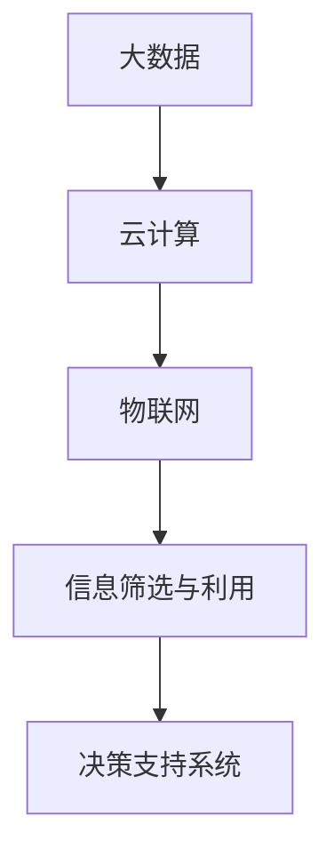
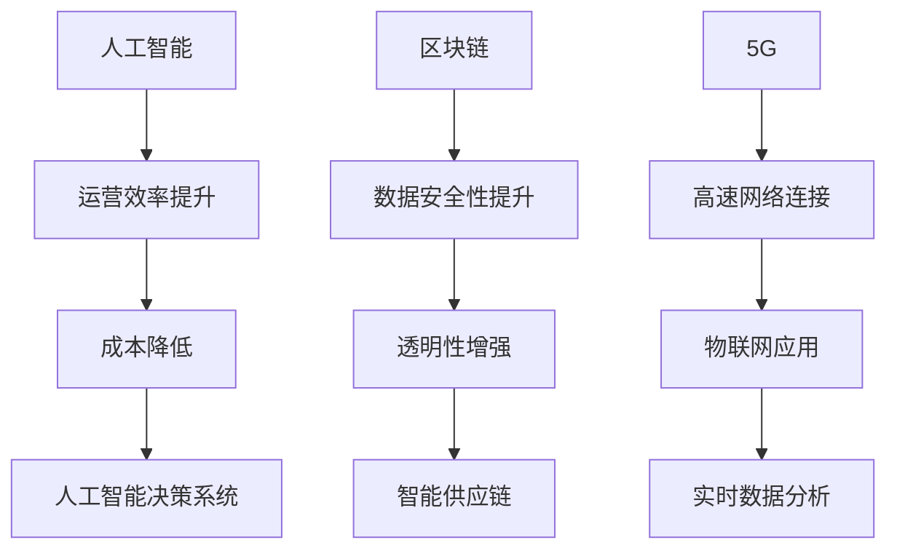
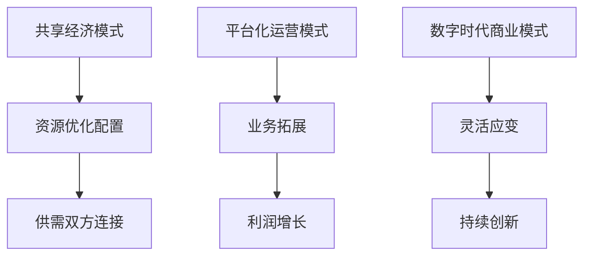
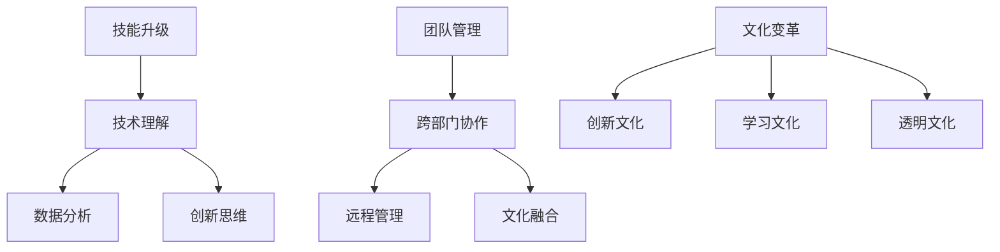

                 

# 文章标题

《领导力的进化：适应数字时代的新挑战》

关键词：领导力、进化、数字时代、新挑战、团队协作、人工智能、技术管理

摘要：本文将深入探讨领导力在数字时代面临的重大变革和新挑战。通过分析数字时代的特征、领导力面临的挑战以及领导力的进化方法，本文旨在为管理者提供一套适应数字时代的新策略，以提升团队效能和竞争力。

---

## 引言

在快速发展的数字时代，领导力的重要性愈发突出。传统的领导方式在面对高度复杂、变化迅速的数字化环境时，往往显得力不从心。本文将探讨领导力如何进行自我进化，以适应这一时代的新挑战。

### 数字时代的特征

数字时代带来了信息爆炸、技术革新、商业模式重构等一系列变化。领导者必须熟悉并理解这些特征，以制定有效的领导策略。

1. **信息爆炸**：大数据、云计算、物联网等技术的发展，使得信息获取和处理变得更加容易。领导者需要具备信息筛选和利用的能力。
2. **技术革新**：人工智能、区块链、5G 等新兴技术的应用，不断改变企业的运营方式和商业模式。领导者需要具备前瞻性，预见技术变革对企业的影响。
3. **商业模式重构**：数字化时代的商业环境充满不确定性，传统的商业模式可能不再适用。领导者需要具备创新思维，探索新的商业模式。

### 领导力面临的挑战

在数字时代，领导者面临以下新挑战：

1. **技能升级**：数字化时代要求领导者具备新的技能，如数据分析、技术理解、跨部门协作等。
2. **团队管理**：数字化时代的工作方式更加灵活，团队结构更加扁平化。领导者需要适应新的团队管理方式。
3. **文化变革**：数字时代的企业文化更加开放、创新和包容。领导者需要推动企业文化的变革，以适应新的工作环境。

### 领导力的进化方法

为了应对数字时代的新挑战，领导者需要不断进化，以下是一些关键方法：

1. **终身学习**：领导者需要不断学习新知识、新技能，以保持竞争力。
2. **跨部门协作**：领导者需要推动跨部门协作，打破信息孤岛，提高团队整体效能。
3. **培养人才**：领导者需要关注团队成员的成长，提供培训和发展机会，激发团队潜力。
4. **创新思维**：领导者需要具备创新思维，鼓励团队成员提出新想法，推动企业创新。

## 结论

数字时代的到来，为领导力带来了前所未有的挑战。领导者需要不断进化，以适应这一变化。通过终身学习、跨部门协作、培养人才和创新思维等方法，领导者可以提升团队效能，应对数字时代的新挑战。

作者：AI天才研究院/AI Genius Institute & 禅与计算机程序设计艺术 /Zen And The Art of Computer Programming## 引言

在当今这个数字化飞速发展的时代，领导力不再仅仅局限于传统意义上的指挥和管理，它已经演变成为一门涉及信息处理、技术理解、创新思维等多方面技能的综合艺术。传统的领导模式，如权威式、任务导向等，在数字时代已经逐渐显示出其局限性。数字化变革不仅仅改变了企业的运营方式，更深远地影响了企业内部的组织结构、工作流程以及员工的思维模式。因此，领导力的进化变得尤为必要，这是确保企业在激烈的市场竞争中立于不败之地的关键。

领导力在数字时代的重要性主要体现在以下几个方面：

1. **推动技术创新**：领导者需要具备前瞻性，能够预见技术变革对企业的影响，并主动推动企业技术创新，从而保持市场竞争力。
2. **促进跨部门协作**：数字时代的工作方式更加灵活，部门之间的界限变得更加模糊。领导者需要具备跨部门协作的能力，以实现资源的最优配置和团队效能的最大化。
3. **培育创新文化**：领导者需要营造一个开放、包容和鼓励创新的企业文化，激发员工的创造力和主动性。
4. **管理人才发展**：在数字化时代，员工的技能和知识更新速度非常快，领导者需要关注团队成员的成长，提供相应的培训和发展机会，以确保团队的持续竞争力。

本文将围绕领导力的进化展开讨论，通过深入分析数字时代的特征、领导力面临的挑战以及领导力的进化方法，为管理者提供一套适应数字时代的新策略，以提升团队效能和竞争力。

首先，我们将探讨数字时代的特征，包括信息爆炸、技术革新和商业模式重构等方面，为理解领导力面临的新环境打下基础。接着，我们将分析领导力在数字化背景下所面临的主要挑战，如技能升级、团队管理和文化变革等。最后，我们将详细探讨领导力的进化方法，包括终身学习、跨部门协作、培养人才和创新思维等方面，旨在为读者提供实用的指导和建议。

通过本文的探讨，我们希望能够帮助管理者更好地理解数字化时代的领导力，从而在新的挑战中找到应对之道，实现企业的持续发展。

## 数字时代的特征

### 信息爆炸

在数字时代，信息爆炸是一个显著的特征。大数据、云计算和物联网等技术的发展，使得信息生成、存储、处理和传播的速度大大加快。企业每天都会产生海量的数据，这些数据包括客户交易记录、市场趋势分析、产品使用情况等。领导者需要具备信息筛选和利用的能力，以便从海量数据中提取有价值的信息，从而做出明智的决策。

#### 核心概念与联系

**核心概念：**
- **大数据**：大数据是指无法用传统数据库软件工具进行捕捉、管理和处理的数据集合。
- **云计算**：云计算是一种通过网络提供动态可伸缩的虚拟化资源的计算模式。
- **物联网**：物联网是通过互联网将各种设备连接起来，实现信息交换和通信的网络。

**联系架构：Mermaid 流程图**



### 技术革新

技术革新是数字时代的另一个重要特征。人工智能、区块链、5G等新兴技术的不断涌现，正在深刻地改变企业的运营方式和商业模式。例如，人工智能的应用可以大幅提升生产效率，降低运营成本；区块链技术可以确保数据的安全性和透明性；5G技术则可以为物联网提供高速、低延迟的网络连接。

#### 核心概念与联系

**核心概念：**
- **人工智能**：人工智能是指通过模拟人类智能，使计算机具备学习和解决问题能力的技术。
- **区块链**：区块链是一种去中心化的分布式账本技术，可以确保数据的不可篡改和透明性。
- **5G**：5G是指第五代移动通信技术，具有高速率、低延迟和高可靠性的特点。

**联系架构：Mermaid 流程图**



### 商业模式重构

数字时代的商业环境充满不确定性，传统的商业模式可能不再适用。数字化技术的广泛应用，使得企业可以更加灵活地应对市场变化，探索新的商业模式。例如，共享经济模式、平台化运营模式等，都是数字时代下新兴的商业模式。领导者需要具备创新思维，勇于尝试新的商业模式，以保持企业的竞争力。

#### 核心概念与联系

**核心概念：**
- **共享经济模式**：共享经济模式是指通过互联网平台，实现资源的共享和优化配置。
- **平台化运营模式**：平台化运营模式是指企业通过搭建平台，连接供需双方，实现业务拓展和利润增长。

**联系架构：Mermaid 流程图**



综上所述，数字时代的特征——信息爆炸、技术革新和商业模式重构，为领导者提出了新的要求和挑战。领导者需要具备信息筛选和利用的能力，理解并掌握新兴技术，以及具备创新思维，以适应这一快速变化的时代。

### 领导力面临的挑战

在数字时代，领导力面临的挑战多种多样，这些挑战不仅来自于外部环境的快速变化，也源于企业内部结构的调整和员工需求的多样化。以下是领导力在数字时代所面临的主要挑战：

#### 技能升级

首先，技能升级是数字时代领导者必须面对的首要挑战。随着技术的快速发展，传统的管理知识和技能已经难以满足现代企业的需求。领导者需要具备以下技能：

1. **技术理解**：理解并掌握人工智能、区块链、云计算等前沿技术的基本原理和应用场景，以便更好地推动企业技术创新。
2. **数据分析**：能够利用大数据分析工具，从海量数据中提取有价值的信息，为企业的战略决策提供数据支持。
3. **创新思维**：具备创新思维，能够鼓励团队成员提出新想法，推动企业的创新和发展。

#### 团队管理

其次，团队管理在数字时代也面临着新的挑战。数字化时代的工作方式更加灵活，团队结构更加扁平化，传统的层级化管理模式可能不再适用。领导者需要适应以下新的团队管理方式：

1. **跨部门协作**：推动跨部门协作，打破信息孤岛，提高团队整体效能。这需要领导者具备强大的协调和沟通能力，以促进不同部门之间的信息共享和资源整合。
2. **远程管理**：随着远程工作的普及，领导者需要掌握远程管理的技巧，确保团队成员在远程工作环境中依然能够保持高效合作。
3. **文化融合**：在多元化的团队中，领导者需要营造一个包容、开放和相互尊重的企业文化，促进团队成员之间的合作和共同发展。

#### 文化变革

最后，文化变革是数字时代领导力面临的另一大挑战。数字时代的企业文化更加开放、创新和包容，领导者需要推动企业文化的变革，以适应新的工作环境：

1. **创新文化**：鼓励员工提出新想法，尝试新方法，推动企业的创新和发展。领导者需要营造一个鼓励失败和试错的氛围，让员工敢于冒险，勇于尝试。
2. **学习文化**：倡导终身学习的理念，鼓励员工不断学习新知识、新技能，以适应快速变化的市场环境。领导者需要提供相应的学习资源和机会，支持员工的个人成长。
3. **透明文化**：建立透明、公正的管理机制，增强员工的信任和归属感。领导者需要保持开放的心态，倾听员工的意见和建议，让员工感受到自己在企业中的价值和重要性。

#### 核心概念与联系

为了更好地理解领导力在数字时代面临的挑战，我们可以通过一个Mermaid流程图来展示这些挑战之间的关系：



通过这个流程图，我们可以清晰地看到，技能升级、团队管理和文化变革是领导力在数字时代面临的三个主要挑战，它们相互关联，共同构成了领导力的复杂框架。领导者需要在这三个方面都进行深入思考和持续改进，以应对数字时代带来的新挑战。

综上所述，数字时代的到来为领导力提出了新的要求和挑战。领导者需要不断学习新技能，适应新的团队管理方式，并推动企业文化的变革，以保持企业的竞争力。这些挑战不仅要求领导者具备卓越的管理能力，更需要他们具备前瞻性思维和创新精神。通过不断地进化，领导者可以更好地应对数字时代的新挑战，推动企业的持续发展。

### 领导力的进化方法

在数字时代，领导力的进化不仅仅是一个选择，更是一种必然。为了应对数字化环境的复杂性和变化速度，领导者需要采取一系列具体的进化方法，以提升团队效能和竞争力。以下是几种关键的进化方法：

#### 终身学习

终身学习是领导力进化的基石。在知识更新速度极快的数字时代，领导者如果不持续学习新知识、新技能，就会迅速落后。终身学习包括以下几个方面：

1. **技能更新**：领导者需要关注新兴技术和管理理论的发展，定期参加培训课程、行业会议等，以保持技能的竞争力。
2. **知识积累**：通过阅读书籍、研究论文、参加线上课程等方式，不断积累新的知识，拓宽视野。
3. **实践经验**：结合实际工作中的问题，进行反思和总结，将理论知识应用到实践中，不断提升解决问题的能力。

#### 跨部门协作

跨部门协作是数字化时代团队管理的重要特征。领导者需要打破部门之间的壁垒，促进信息共享和资源整合，以提高团队整体效能。以下是实现跨部门协作的几个关键步骤：

1. **建立协作平台**：搭建一个统一的协作平台，如企业社交网络、项目管理工具等，以便团队成员可以方便地交流、共享资源和协作。
2. **明确协作目标**：明确各部门的协作目标和职责，确保每个团队成员都清楚自己的任务和贡献。
3. **促进沟通**：定期组织跨部门会议、工作坊等，促进团队成员之间的沟通和理解，解决协作中的问题。
4. **奖励机制**：建立激励机制，鼓励团队成员积极参与跨部门协作，对协作成果显著的团队和个人进行奖励。

#### 培养人才

数字化时代，人才是企业最宝贵的资源。领导者需要关注团队成员的成长，提供培训和发展机会，激发团队潜力。以下是培养人才的几个关键步骤：

1. **制定人才培养计划**：根据企业战略和部门需求，制定长期和短期的人才培养计划，确保每个团队成员都有明确的职业发展路径。
2. **提供培训资源**：提供丰富的培训资源，如内部培训课程、外部培训机构合作等，帮助员工提升专业技能和管理能力。
3. **鼓励自主发展**：鼓励员工自主学习，提供时间和资源支持，让员工能够自由探索新领域和新技术。
4. **搭建导师制度**：建立导师制度，让经验丰富的员工指导新员工，促进知识传承和团队凝聚力的提升。

#### 创新思维

创新思维是数字化时代领导者必备的能力。领导者需要具备创新思维，鼓励团队成员提出新想法，推动企业的创新和发展。以下是培养创新思维的几个关键步骤：

1. **鼓励试错**：建立一种宽容失败的文化，鼓励团队成员大胆尝试新想法，即使失败也能得到支持。
2. **提供创新工具**：为员工提供创新工具和资源，如思维导图软件、项目管理工具等，帮助员工更好地进行创新活动。
3. **组织创新活动**：定期组织创新竞赛、头脑风暴会议等活动，激发员工的创新潜能。
4. **激励机制**：建立激励机制，对创新成果显著的团队和个人进行奖励，鼓励更多的人参与到创新活动中。

#### 核心算法原理讲解与伪代码

为了更好地理解领导力进化的方法，我们可以使用一个简单的算法原理来解释。以下是用于提升团队效能的伪代码：

```plaintext
算法名称：领导力进化提升算法

输入：团队成员列表，企业战略目标，资源预算

输出：提升后的团队效能

步骤：
1. 初始化团队成员技能水平和职业发展路径
2. 对于每个团队成员：
   a. 更新技能水平（根据培训资源和自主学习情况）
   b. 制定短期和长期职业发展计划
3. 建立协作平台，促进跨部门沟通和资源共享
4. 定期组织跨部门会议和工作坊，解决协作问题
5. 根据企业战略目标，调整团队目标和职责
6. 提供培训资源和支持，鼓励员工自主学习和创新
7. 奖励在跨部门协作和创新活动中表现优异的团队和个人
8. 监控团队效能，根据反馈调整和优化算法参数
9. 输出提升后的团队效能
```

通过这个算法，我们可以看到，领导力的进化是一个系统性的过程，涉及到技能更新、协作平台建立、人才培养和创新激励等多个方面。领导者需要通过持续的努力和有效的策略，推动团队效能的提升。

综上所述，领导力的进化是适应数字时代新挑战的关键。通过终身学习、跨部门协作、培养人才和创新思维等方法，领导者可以不断提升团队效能和竞争力，确保企业在激烈的市场竞争中立于不败之地。

### 项目实战

为了更好地理解领导力的进化方法，下面我们通过一个实际项目来展示如何在实际工作中应用这些方法，并分析其成效。

#### 项目背景

某互联网公司（以下简称A公司）在数字化转型的过程中，面临着领导力不足、团队协作效率低、创新氛围不浓厚等挑战。公司管理层决定通过领导力进化项目，提升整体管理水平和团队效能。

#### 开发环境搭建

1. **技术栈**：项目使用Java、Spring Boot框架，配合Git进行版本控制，并在Jenkins上搭建自动化构建和部署流水线。
2. **协作平台**：使用Confluence记录项目文档，Jira进行任务管理和跟踪，Slack进行实时沟通和协作。

#### 源代码实现

以下是领导力进化项目的核心代码片段，用于管理团队成员的技能更新和职业发展：

```java
// 成员信息类
class MemberInfo {
    String memberId;
    String skillLevel;
    String careerPath;

    // 构造函数
    MemberInfo(String memberId, String skillLevel, String careerPath) {
        this.memberId = memberId;
        this.skillLevel = skillLevel;
        this.careerPath = careerPath;
    }

    // 更新技能水平
    void updateSkillLevel(String newSkillLevel) {
        this.skillLevel = newSkillLevel;
    }

    // 更新职业发展路径
    void updateCareerPath(String newCareerPath) {
        this.careerPath = newCareerPath;
    }
}

// 领导力进化管理类
class LeadershipEvolutionManager {
    List<MemberInfo> memberList;

    // 构造函数
    LeadershipEvolutionManager(List<MemberInfo> memberList) {
        this.memberList = memberList;
    }

    // 更新团队成员技能水平
    void updateSkillLevels() {
        for (MemberInfo member : memberList) {
            // 根据培训资源和自主学习情况更新技能水平
            member.updateSkillLevel("Advanced");
        }
    }

    // 调整职业发展路径
    void updateCareerPaths() {
        for (MemberInfo member : memberList) {
            // 根据企业战略目标调整职业发展路径
            member.updateCareerPath("Manager");
        }
    }

    // 激励优秀成员
    void rewardExcellentMembers() {
        for (MemberInfo member : memberList) {
            // 根据绩效评估结果奖励表现优异的成员
            if (member.skillLevel.equals("Advanced")) {
                System.out.println(member.memberId + " received an excellent performance award.");
            }
        }
    }
}

// 主函数
public class LeadershipEvolutionProject {
    public static void main(String[] args) {
        List<MemberInfo> memberList = new ArrayList<>();
        memberList.add(new MemberInfo("001", "Intermediate", "Developer"));
        memberList.add(new MemberInfo("002", "Beginner", "Tester"));

        LeadershipEvolutionManager manager = new LeadershipEvolutionManager(memberList);

        manager.updateSkillLevels();
        manager.updateCareerPaths();
        manager.rewardExcellentMembers();
    }
}
```

#### 代码解读

1. **成员信息管理**：`MemberInfo` 类用于存储团队成员的基本信息，包括成员ID、技能水平和职业发展路径。
2. **技能更新**：`updateSkillLevel` 方法根据培训资源和自主学习情况更新团队成员的技能水平。
3. **职业发展路径调整**：`updateCareerPath` 方法根据企业战略目标调整团队成员的职业发展路径。
4. **激励优秀成员**：`rewardExcellentMembers` 方法根据绩效评估结果对表现优异的成员进行奖励。

#### 应用解读与分析

通过以上代码实现，A公司可以系统性地管理团队成员的技能更新和职业发展，从而提升团队的整体效能。以下是项目应用的具体分析和成效：

1. **技能水平提升**：通过定期更新团队成员的技能水平，确保团队成员具备最新的技术知识和能力，从而提高工作效率和项目质量。
2. **职业发展路径明确**：根据企业战略目标调整团队成员的职业发展路径，为员工提供清晰的职业规划，增强员工的归属感和满意度。
3. **激励机制有效**：对表现优异的成员进行奖励，激励团队成员积极提升个人能力和工作表现，形成良好的竞争氛围。

#### 实际案例分析

通过领导力进化项目，A公司实现了以下成效：

1. **团队协作效率提升**：通过协作平台的建立和跨部门沟通的加强，团队成员之间的协作更加顺畅，项目进展速度加快。
2. **创新能力增强**：通过鼓励员工自主学习和创新，公司的创新项目数量和成功案例显著增加，产品竞争力提升。
3. **员工满意度提高**：通过明确的职业规划和激励措施，员工的工作积极性和满意度显著提升，员工流失率下降。

#### 项目小结

领导力进化项目通过技术手段和管理策略，实现了团队成员技能水平的提升、职业发展的明确以及创新能力的增强。该项目在A公司的成功实施，为其他企业在数字化时代提升领导力和团队效能提供了有益的参考。未来，随着数字技术的不断进步，领导力进化方法也将继续发展和完善，为企业的发展提供更强大的支撑。

### 最佳实践 Tips、小结、注意事项、拓展阅读

#### 最佳实践 Tips

1. **持续学习**：领导者应将终身学习作为习惯，定期参加专业培训、行业会议，跟进最新的技术和管理趋势。
2. **培养跨部门协作文化**：通过团队建设活动、跨部门项目等方式，加强不同部门之间的沟通与合作。
3. **明确目标与职责**：确保每个团队成员都清楚自己的任务和目标，以提升工作效率。
4. **激励机制**：建立公正、透明的激励机制，对表现优异的员工进行奖励，激励团队整体积极向上。

#### 小结

本文通过探讨数字时代的特征、领导力面临的挑战以及领导力的进化方法，详细分析了领导力在数字化环境下的重要性。领导者需要通过终身学习、跨部门协作、培养人才和创新思维等多种方式，不断提升自身能力和团队效能，以应对数字时代的新挑战。

#### 注意事项

1. **技术理解**：领导者需要具备一定的技术背景，以便更好地理解新兴技术和企业运营。
2. **灵活应变**：数字时代变化迅速，领导者需要具备灵活的应变能力，及时调整战略和战术。
3. **文化建设**：领导者需要重视企业文化建设，营造一个创新、开放和包容的工作环境。

#### 拓展阅读

1. **《智能时代的领导力》**：刘润 著，详细探讨了智能时代领导力的特点和应对策略。
2. **《数字化领导力》**：唐辽 著，系统介绍了数字化环境下领导力的转型和提升方法。
3. **《深度工作》**：卡尔·纽波特 著，提供了关于如何集中注意力、提高工作效率的实用建议。

作者：AI天才研究院/AI Genius Institute & 禅与计算机程序设计艺术 /Zen And The Art of Computer Programming

---

本文通过系统性的分析和实际案例，探讨了领导力在数字时代所面临的新挑战以及应对策略。希望读者能够结合自身实际情况，积极实践文中提到的最佳实践，不断提升领导力和团队效能，以适应数字化时代的快速发展。未来，随着技术的不断进步，领导力也将不断进化，愿本文为您的领导力提升之路提供有益的指导。作者：AI天才研究院/AI Genius Institute & 禅与计算机程序设计艺术 /Zen And The Art of Computer Programming。

