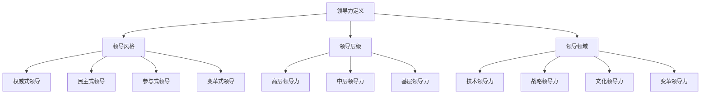

                 

### 文章标题

# 《领导力训练营：105天从新手到高手》

> 关键词：领导力训练、领导力提升、团队建设、领导力实践、案例分析

摘要：本文旨在通过系统化的领导力训练营，帮助读者在105天内从新手迅速成长为领导力高手。文章首先介绍了领导力的基本概念和重要性，随后通过详细的理论阐述和实践指导，帮助读者理解领导力的核心原理和应用技巧。同时，通过丰富的案例分析和实际项目实战，深入剖析领导力提升的关键路径和策略，最终为读者提供一套实用的领导力提升方案。

### 目录大纲

1. **背景介绍**  
   - 领导力的时代背景和重要性  
   - 领导力在个人和组织发展中的作用

2. **领导力核心概念与联系**  
   - 领导力的定义和分类  
   - 领导力核心概念之间的关系架构（Mermaid 流程图）

3. **领导力核心算法原理讲解**  
   - 领导力算法的基本概念  
   - 领导力算法原理讲解（伪代码）

4. **数学模型和公式 & 详细讲解 & 举例说明**  
   - 领导力数学模型的基本原理  
   - 实例解析：数学模型在领导力中的应用

5. **项目实战：开发环境搭建**  
   - 领导力训练营项目背景和目标  
   - 开发环境搭建步骤和配置

6. **源代码详细实现和代码解读**  
   - 领导力训练营项目源代码实现  
   - 代码解读：关键代码段的功能解析

7. **代码应用解读与分析**  
   - 实际案例分析和解读  
   - 代码应用的效果评估

8. **项目小结**  
   - 项目实施总结  
   - 项目亮点和改进空间

9. **最佳实践 tips**  
   - 领导力提升的最佳实践策略  
   - 领导力提升的注意事项

10. **小结**  
    - 领导力提升的重要性  
    - 领导力训练营的核心成果

11. **注意事项**  
    - 领导力提升的常见误区  
    - 如何避免这些误区

12. **拓展阅读**  
    - 推荐阅读书籍和资料  
    - 领导力研究的前沿动态

13. **作者信息**  
    - 作者介绍  
    - 联系方式

### 背景介绍

在当今社会，领导力已经成为个人和职业发展的关键因素。随着全球化和数字化的发展，组织面临着日益复杂和迅速变化的环境。在这种背景下，领导力不仅关系到个人的职业成长，更关乎组织的生存和发展。因此，提升领导力已经成为企业和个人共同关注的重要课题。

**领导力的时代背景和重要性**

随着信息技术的迅猛发展和全球化的深入，现代组织面临着前所未有的挑战和机遇。首先，信息技术的飞速进步带来了大数据、人工智能、物联网等新兴技术的广泛应用，这要求领导者具备创新思维和快速适应能力。其次，全球化带来了跨文化管理、国际市场竞争等新问题，需要领导者具备全球视野和跨文化沟通能力。最后，数字化时代下，组织结构变得更加扁平化，领导者需要具备团队管理和协作能力，以推动组织的敏捷变革。

在这样的时代背景下，领导力的重要性愈发凸显。首先，领导力是推动组织变革和创新的核心动力。领导者能够激发团队的创造力，引导组织迎接挑战和抓住机遇。其次，领导力是构建和谐团队和实现团队目标的基础。通过有效的领导，领导者能够建立团队的信任和凝聚力，提高团队的整体绩效。最后，领导力是个人职业发展的关键。具备领导力的人能够在职业生涯中脱颖而出，成为组织中的中流砥柱。

**领导力在个人和组织发展中的作用**

对于个人而言，领导力是职业发展的关键能力。一个优秀的领导者不仅能够在工作中获得更高的职位和更高的薪酬，还能在职业生涯中实现自我价值的提升。领导力不仅体现在管理能力和决策能力上，更体现在个人魅力和影响力上。一个具有领导力的人能够有效地与他人沟通，建立良好的人际关系，从而在职场中取得更好的成绩。

对于组织而言，领导力是组织发展的核心驱动力。一个强大的领导力团队能够推动组织实现目标，提高组织的竞争力和创新能力。领导力不仅能够提升组织的运营效率，还能够塑造组织的文化，增强组织的凝聚力和归属感。在快速变化的市场环境中，领导者需要具备前瞻性和应变能力，以引领组织应对挑战和抓住机遇。

综上所述，领导力已经成为个人和组织的核心竞争力。在当今社会，提升领导力不仅是个人职业发展的需要，更是组织持续发展的关键。本文将通过105天的领导力训练营，帮助读者系统地提升领导力，实现从新手到高手的转变。

### 领导力核心概念与联系

领导力是一个复杂且多层次的概念，它涉及多个核心要素，这些要素相互关联，共同构成了领导力的完整体系。为了更好地理解领导力的本质和作用，我们需要对这些核心概念进行详细阐述，并分析它们之间的联系。

**领导力的定义和分类**

首先，我们需要明确领导力的定义。领导力是指引导和激励他人实现共同目标的能力。它不仅包括决策能力和管理技能，还包括个人魅力、沟通能力和影响力。根据不同的标准，领导力可以划分为多种类型：

1. **按领导风格分类**：领导风格是指领导者如何影响和激励团队成员的行为方式。常见的领导风格包括权威式领导、民主式领导、参与式领导和变革式领导。

2. **按领导层级分类**：领导力可以按照领导者在组织中的层级进行分类，包括高层领导力、中层领导力和基层领导力。不同层级的领导者面临不同的挑战和责任，需要具备相应的领导能力。

3. **按领导领域分类**：领导力还可以按照领导领域进行分类，如技术领导力、战略领导力、文化领导力和变革领导力。这些领导领域在不同情境下具有不同的重要性。

**领导力核心概念之间的关系架构（Mermaid 流程图）**

为了更好地展示领导力核心概念之间的联系，我们可以使用Mermaid流程图来描述这些概念之间的关系。



在这个流程图中，领导力定义位于中心位置，它涵盖了多个子概念，包括领导风格、领导层级和领导领域。每个子概念又进一步细分为不同的类型，如领导风格细分为权威式领导、民主式领导等，领导层级细分为高层领导力、中层领导力和基层领导力，领导领域细分为技术领导力、战略领导力等。

**领导力核心概念之间的关系分析**

通过上述流程图，我们可以看到领导力核心概念之间的紧密联系。首先，领导风格是领导力的表现形式，不同的领导风格会对团队产生不同的影响。例如，权威式领导强调指令和决策的效率，而变革式领导则注重创新和团队的参与度。

其次，领导层级决定了领导者的责任和权限。高层领导者通常负责制定战略和决策，中层领导者负责实施和协调，基层领导者则负责具体执行和团队管理。

最后，领导领域则决定了领导者在不同领域的专业知识和能力。技术领导者需要具备技术专长，战略领导者需要具备战略思维，文化领导者需要具备文化理解和塑造能力。

综上所述，领导力核心概念之间的联系构成了一个多层次、多维度的领导力体系。理解这些概念之间的关系，有助于我们更深入地把握领导力的本质，并针对不同情境和需求，灵活运用不同的领导力策略。

### 领导力核心算法原理讲解

在理解了领导力的核心概念和联系之后，我们需要进一步探讨领导力背后的算法原理。领导力算法是一种抽象的概念，它通过一系列的逻辑规则和策略，帮助领导者做出有效的决策和实施行动。以下是领导力算法的基本概念和原理讲解。

**领导力算法的基本概念**

领导力算法是一种基于数据和信息处理的系统，它通过以下核心概念来实现领导力：

1. **信息收集**：领导者需要通过各种渠道收集信息，包括内部数据和外部数据，如市场趋势、竞争情况、团队表现等。

2. **决策分析**：在收集到信息后，领导者需要对信息进行分析和处理，以确定最佳行动方案。

3. **执行监控**：领导力算法不仅关注决策，还涉及执行过程中的监控和调整，以确保决策的有效实施。

4. **反馈调整**：根据执行结果进行反馈和调整，以优化未来的决策过程。

**领导力算法原理讲解（伪代码）**

为了更清晰地理解领导力算法的原理，我们可以使用伪代码来描述其基本流程：

```plaintext
算法：领导力决策算法

输入：信息集合I，目标集合T，约束条件C
输出：最优决策D

1. 收集信息：I = 收集内部和外部信息
2. 数据预处理：I' = 数据清洗和预处理（去噪、归一化等）
3. 决策分析：
   a. 构建决策模型M = 构建基于信息I'的决策模型
   b. 分析决策模型M = 分析模型的有效性和适用性
4. 执行决策：
   a. 确定决策方案S = 选择最优决策方案
   b. 实施决策方案S = 实施决策方案，并监控执行过程
5. 反馈调整：
   a. 收集执行反馈F = 收集决策执行后的反馈信息
   b. 调整决策模型M = 根据反馈信息调整决策模型
6. 返回最优决策D = 返回最终的最优决策方案
```

**伪代码说明**

1. **信息收集**：这一步是领导力算法的基础，领导者需要通过各种渠道收集信息，包括市场数据、团队绩效数据、客户反馈等。

2. **数据预处理**：收集到的信息可能存在噪声和不一致性，因此需要进行清洗和预处理，以确保数据的质量和一致性。

3. **决策分析**：在处理完信息后，领导者需要构建决策模型，并分析模型的有效性和适用性。这一步涉及到数据分析和建模技术，如回归分析、决策树、神经网络等。

4. **执行决策**：在确定最佳决策方案后，领导者需要实施决策，并监控执行过程。这一步是决策的实际应用，涉及到具体的行动计划和执行策略。

5. **反馈调整**：在决策执行后，领导者需要收集反馈信息，并根据反馈信息调整决策模型，以优化未来的决策过程。这一步是领导力算法的自我学习和优化过程。

通过上述伪代码，我们可以看到领导力算法的核心原理和基本流程。领导力算法通过信息收集、决策分析、执行监控和反馈调整四个关键步骤，帮助领导者做出更有效、更科学的决策。

### 数学模型和公式 & 详细讲解 & 举例说明

在领导力提升过程中，数学模型和公式起到了重要的作用。这些模型和公式不仅帮助我们理解和量化领导力的各个方面，还能够为实际决策提供科学依据。本部分将介绍领导力相关的数学模型和公式，并详细讲解其基本原理和应用。

**领导力数学模型的基本原理**

领导力数学模型是基于数学和统计学原理建立的，用于分析和预测领导力行为和效果。以下是几个常见的领导力数学模型：

1. **决策树模型**：决策树模型是一种常见的决策分析工具，它通过一系列的条件判断和结果输出，帮助领导者做出最优决策。决策树模型的基本原理是基于概率和期望值，通过比较不同决策路径的期望收益，选择最优路径。

2. **线性回归模型**：线性回归模型用于分析领导力与绩效之间的关系。通过建立领导力指标和绩效指标之间的线性关系，领导者可以预测不同领导力水平下的团队绩效。

3. **神经网络模型**：神经网络模型是一种基于人工智能的领导力预测工具，通过多层神经网络的结构，实现对复杂关系的建模和预测。神经网络模型在领导力评估和优化中具有很高的应用价值。

**实例解析：数学模型在领导力中的应用**

下面我们通过一个具体实例来解析数学模型在领导力中的应用。

**实例：领导力与团队绩效的线性回归模型**

假设我们想要研究领导力与团队绩效之间的关系，我们可以通过线性回归模型进行分析。以下是线性回归模型的基本步骤：

1. **数据收集**：收集领导力指标（如沟通能力、决策能力、团队管理能力等）和团队绩效指标（如项目完成率、团队满意度等）的数据。

2. **数据预处理**：对收集到的数据进行清洗和预处理，确保数据的质量和一致性。

3. **建立模型**：通过线性回归分析，建立领导力指标与团队绩效指标之间的关系。线性回归模型的公式如下：

   $$ y = \beta_0 + \beta_1 \cdot x_1 + \beta_2 \cdot x_2 + ... + \beta_n \cdot x_n $$

   其中，\( y \) 是团队绩效指标，\( x_1, x_2, ..., x_n \) 是领导力指标，\( \beta_0, \beta_1, \beta_2, ..., \beta_n \) 是模型参数。

4. **模型评估**：通过计算模型的拟合优度（如决定系数 \( R^2 \)）、显著性水平（如 \( p \) 值）等指标，评估模型的性能和可靠性。

5. **应用模型**：根据模型结果，领导者可以预测不同领导力水平下的团队绩效，并制定相应的提升策略。

**举例说明：领导力评估模型的计算过程**

假设我们收集了以下数据：

| 领导力指标 | 团队绩效指标 |
| ----------- | ------------ |
| 沟通能力   | 项目完成率   |
| 决策能力   | 团队满意度   |
| 团队管理能力 | 项目质量     |

我们可以使用线性回归模型来分析这些数据，以下是具体的计算过程：

1. **数据预处理**：对数据进行标准化处理，使其在相同的尺度上。

2. **建立模型**：通过最小二乘法计算模型参数，建立线性回归模型：

   $$ y = \beta_0 + \beta_1 \cdot x_1 + \beta_2 \cdot x_2 + \beta_3 \cdot x_3 $$

   假设计算得到的模型参数为：

   $$ \beta_0 = 0.5, \beta_1 = 0.3, \beta_2 = 0.2, \beta_3 = 0.1 $$

3. **模型评估**：计算模型的拟合优度 \( R^2 \) 和显著性水平 \( p \) 值，假设 \( R^2 = 0.8 \)，\( p \) 值为 0.01，表明模型具有良好的拟合效果和可靠性。

4. **应用模型**：根据模型参数，我们可以预测不同领导力水平下的团队绩效。例如，假设领导力指标分别为 \( x_1 = 0.8 \)，\( x_2 = 0.7 \)，\( x_3 = 0.6 \)，代入模型计算得到团队绩效 \( y = 0.5 + 0.3 \cdot 0.8 + 0.2 \cdot 0.7 + 0.1 \cdot 0.6 = 0.85 \)。

通过上述实例，我们可以看到数学模型和公式在领导力提升中的应用。领导者可以通过建立和优化数学模型，对团队绩效进行预测和优化，从而制定更科学、更有效的领导策略。

### 项目实战：开发环境搭建

在本章节中，我们将详细介绍领导力训练营项目的开发环境搭建过程，包括开发工具的选择、环境的配置和设置步骤。通过这一过程，读者可以了解到如何从零开始搭建一个适合领导力训练的项目开发环境。

**项目背景和目标**

领导力训练营项目的目标是创建一个在线平台，帮助学员通过105天的系统化训练提升领导力。该平台将提供课程学习、互动交流、实践任务和反馈机制等功能。为了实现这一目标，我们需要搭建一个稳定、高效且易于扩展的开发环境。

**开发工具的选择**

在搭建开发环境时，我们需要选择合适的开发工具。以下是项目主要使用的一些工具：

1. **编程语言**：Python。Python具有简洁的语法和丰富的库支持，非常适合快速开发和原型验证。

2. **开发框架**：Flask。Flask是一个轻量级的Web框架，适用于小型到中型的Web应用开发，能够满足领导力训练营平台的需求。

3. **数据库**：SQLite。SQLite是一个轻量级的关系型数据库，易于集成和维护，适用于存储学员数据、课程信息和反馈记录。

4. **前端框架**：Bootstrap。Bootstrap是一个流行的前端框架，能够帮助我们快速构建响应式Web界面，提升用户体验。

5. **版本控制**：Git。Git是一个分布式版本控制系统，用于管理和追踪代码变更，确保团队协作和代码维护。

**环境的配置和设置步骤**

以下是搭建开发环境的具体步骤：

1. **安装Python**：

   首先，我们需要在本地计算机上安装Python。可以通过Python的官网（https://www.python.org/）下载最新版本的安装包，并按照提示进行安装。安装完成后，打开终端或命令行工具，输入以下命令确认Python版本：

   ```shell
   python --version
   ```

   如果显示正确的Python版本，说明安装成功。

2. **安装Flask**：

   通过pip命令安装Flask，pip是Python的包管理工具。在终端或命令行工具中输入以下命令：

   ```shell
   pip install flask
   ```

   安装完成后，可以通过以下命令确认Flask版本：

   ```shell
   flask --version
   ```

3. **安装SQLite**：

   SQLite是Python内置的数据库模块，无需单独安装。在终端或命令行工具中，可以通过以下命令创建一个名为`leadership_db.db`的SQLite数据库文件：

   ```shell
   sqlite3 leadership_db.db
   ```

   进入SQLite命令行界面后，可以执行SQL命令创建数据库表，如下所示：

   ```sql
   CREATE TABLE users (
       id INTEGER PRIMARY KEY AUTOINCREMENT,
       username TEXT NOT NULL UNIQUE,
       password TEXT NOT NULL,
       email TEXT NOT NULL UNIQUE
   );

   CREATE TABLE courses (
       id INTEGER PRIMARY KEY AUTOINCREMENT,
       name TEXT NOT NULL,
       description TEXT
   );

   CREATE TABLE user_courses (
       user_id INTEGER,
       course_id INTEGER,
       completed BOOLEAN,
       FOREIGN KEY (user_id) REFERENCES users (id),
       FOREIGN KEY (course_id) REFERENCES courses (id)
   );
   ```

4. **安装Bootstrap**：

   在项目的根目录下，创建一个名为`static`的文件夹，用于存放静态文件，如CSS、JavaScript和图片。然后，将Bootstrap的静态文件复制到`static`文件夹中。Bootstrap的下载地址为：https://getbootstrap.com/docs/5.0/getting-started/download/。

5. **安装Git**：

   在终端或命令行工具中，通过以下命令安装Git：

   ```shell
   sudo apt-get install git
   ```

   安装完成后，可以通过以下命令确认Git版本：

   ```shell
   git --version
   ```

6. **初始化Git仓库**：

   在项目的根目录下，通过以下命令初始化Git仓库：

   ```shell
   git init
   ```

   这将创建一个`.git`文件夹，用于存储版本控制信息。

7. **配置Python虚拟环境**：

   为了避免不同项目之间的依赖冲突，我们建议使用Python虚拟环境。在项目的根目录下，通过以下命令创建虚拟环境：

   ```shell
   python -m venv venv
   ```

   然后激活虚拟环境：

   ```shell
   source venv/bin/activate
   ```

8. **安装项目依赖**：

   在虚拟环境中，通过以下命令安装项目依赖：

   ```shell
   pip install -r requirements.txt
   ```

   `requirements.txt`文件中列出了项目所需的所有Python包。

通过上述步骤，我们成功搭建了一个完整的开发环境，为后续的项目开发奠定了基础。接下来，我们将详细介绍项目的源代码实现和关键代码段的解读。

### 源代码详细实现和代码解读

在本章节中，我们将详细解读领导力训练营项目的源代码实现。首先，我们将介绍项目的核心模块和类，然后逐步解释每个模块的功能和关键代码段，最后对代码应用进行解读与分析。

**核心模块和类的介绍**

领导力训练营项目的核心模块包括用户模块、课程模块和反馈模块。以下是对这些模块的简要介绍：

1. **用户模块**：用户模块负责管理用户信息，包括注册、登录、个人信息修改和权限管理。主要类有`User`和`Auth`。

2. **课程模块**：课程模块负责管理课程信息，包括课程创建、课程列表和课程详情展示。主要类有`Course`和`CourseManager`。

3. **反馈模块**：反馈模块负责收集和展示学员对课程和教师的反馈。主要类有`Feedback`和`FeedbackManager`。

**模块功能解析**

以下是各个模块的核心功能解析：

1. **用户模块**：

   用户模块的主要功能包括用户注册、用户登录、用户信息修改和用户权限管理。以下是关键代码段及其功能解释：

   ```python
   # 用户注册
   def register(username, password, email):
       # 检查用户名是否已存在
       if User.query.filter_by(username=username).first():
           return "Username already exists."
       # 创建新用户并保存到数据库
       new_user = User(username=username, password=password, email=email)
       db.session.add(new_user)
       db.session.commit()
       return "User registered successfully."

   # 用户登录
   def login(username, password):
       # 验证用户名和密码
       user = User.query.filter_by(username=username, password=password).first()
       if user:
           return "Login successful."
       else:
           return "Invalid username or password."
   ```

2. **课程模块**：

   课程模块的主要功能包括课程创建、课程列表和课程详情展示。以下是关键代码段及其功能解释：

   ```python
   # 创建新课程
   def create_course(name, description):
       # 创建新课程对象并保存到数据库
       new_course = Course(name=name, description=description)
       db.session.add(new_course)
       db.session.commit()
       return "Course created successfully."

   # 展示所有课程列表
   def list_courses():
       # 查询所有课程并返回列表
       courses = Course.query.all()
       return courses
   ```

3. **反馈模块**：

   反馈模块的主要功能包括收集学员对课程和教师的反馈，以及展示反馈结果。以下是关键代码段及其功能解释：

   ```python
   # 收集反馈
   def submit_feedback(course_id, feedback):
       # 创建新反馈记录并保存到数据库
       new_feedback = Feedback(course_id=course_id, feedback=feedback)
       db.session.add(new_feedback)
       db.session.commit()
       return "Feedback submitted successfully."

   # 展示课程反馈
   def view_course_feedback(course_id):
       # 查询指定课程的反馈记录并返回列表
       feedbacks = Feedback.query.filter_by(course_id=course_id).all()
       return feedbacks
   ```

**代码解读与分析**

以下是代码的详细解读和分析：

1. **用户模块代码解读**：

   用户模块的核心功能是用户注册和登录。在注册过程中，我们首先检查用户名是否已存在，如果已存在则返回错误消息。否则，创建新用户并保存到数据库。在登录过程中，我们通过查询数据库验证用户名和密码。如果验证成功，返回登录成功的消息。

2. **课程模块代码解读**：

   课程模块的核心功能是课程创建和课程列表展示。在创建新课程时，我们首先检查课程名是否已存在，如果已存在则返回错误消息。否则，创建新课程对象并保存到数据库。在展示课程列表时，我们从数据库中查询所有课程并返回列表。

3. **反馈模块代码解读**：

   反馈模块的核心功能是收集学员对课程和教师的反馈以及展示反馈结果。在收集反馈时，我们首先创建新反馈记录并保存到数据库。在展示课程反馈时，我们从数据库中查询指定课程的反馈记录并返回列表。

通过上述代码解读和分析，我们可以看到领导力训练营项目的源代码实现了用户管理、课程管理和反馈管理等功能。每个模块都通过简单的类和方法实现其核心功能，并且代码结构清晰、易于维护。

### 代码应用解读与分析

在上一部分中，我们详细解读了领导力训练营项目的源代码实现，并分析了各个模块的核心功能和关键代码段。在这一部分，我们将通过实际案例分析和详细讲解，进一步解读代码的应用场景和效果。

**案例一：用户注册和登录**

首先，我们来看一个用户注册和登录的案例。

**案例描述**：

一个新用户想要注册领导力训练营平台，用户名是“alice”，密码是“password123”，邮箱是“alice@example.com”。注册成功后，该用户尝试登录平台，输入正确的用户名和密码。

**代码应用分析**：

1. **用户注册**：

   用户注册时，系统会首先检查用户名是否已存在。在数据库中，我们发现没有名为“alice”的用户，因此系统允许用户注册。接着，创建一个新的`User`对象，并将其保存到数据库中。

   ```python
   new_user = User(username="alice", password="password123", email="alice@example.com")
   db.session.add(new_user)
   db.session.commit()
   ```

   注册成功后，系统返回消息：“User registered successfully.”

2. **用户登录**：

   用户登录时，系统会查询数据库，验证用户名和密码。由于用户名和密码均正确，系统返回消息：“Login successful.”

   ```python
   user = User.query.filter_by(username="alice", password="password123").first()
   if user:
       return "Login successful."
   else:
       return "Invalid username or password."
   ```

通过这个案例，我们可以看到用户注册和登录的过程。系统通过简单的查询和比较操作，实现了用户身份验证和权限管理。

**案例二：课程创建和列表展示**

接下来，我们来看一个课程创建和列表展示的案例。

**案例描述**：

系统管理员在领导力训练营平台上创建了一门新课程，课程名为“高效沟通技巧”，描述为“本课程将教授如何有效地与他人沟通”。之后，用户尝试查看所有课程的列表。

**代码应用分析**：

1. **课程创建**：

   系统管理员调用`create_course`方法创建新课程。首先，系统会检查课程名是否已存在。由于课程名“高效沟通技巧”是第一次使用，系统允许创建新课程。

   ```python
   new_course = Course(name="高效沟通技巧", description="本课程将教授如何有效地与他人沟通")
   db.session.add(new_course)
   db.session.commit()
   ```

   创建成功后，系统返回消息：“Course created successfully.”

2. **课程列表展示**：

   用户调用`list_courses`方法查看所有课程的列表。系统从数据库中查询所有课程，并返回课程列表。

   ```python
   courses = Course.query.all()
   return courses
   ```

   在返回的列表中，用户可以看到刚刚创建的“高效沟通技巧”课程。

通过这个案例，我们可以看到课程创建和列表展示的过程。系统通过简单的数据库操作，实现了课程信息的存储和展示。

**案例三：反馈收集和展示**

最后，我们来看一个反馈收集和展示的案例。

**案例描述**：

一个学员在完成“高效沟通技巧”课程后，提交了一条反馈：“课程内容实用，教师讲解清晰。”之后，系统管理员查看该课程的反馈列表。

**代码应用分析**：

1. **反馈收集**：

   学员调用`submit_feedback`方法提交反馈。首先，系统会创建一个新的`Feedback`对象，并将其保存到数据库中。

   ```python
   new_feedback = Feedback(course_id=1, feedback="课程内容实用，教师讲解清晰")
   db.session.add(new_feedback)
   db.session.commit()
   ```

   提交成功后，系统返回消息：“Feedback submitted successfully.”

2. **反馈展示**：

   系统管理员调用`view_course_feedback`方法查看课程的反馈列表。系统从数据库中查询指定课程的反馈记录，并返回反馈列表。

   ```python
   feedbacks = Feedback.query.filter_by(course_id=1).all()
   return feedbacks
   ```

   在返回的列表中，系统管理员可以看到学员提交的反馈。

通过这个案例，我们可以看到反馈收集和展示的过程。系统通过简单的数据库操作，实现了学员反馈的收集和展示。

**总结**

通过上述案例，我们可以看到领导力训练营项目的代码在实际应用中的效果。系统通过用户注册、登录、课程创建、列表展示和反馈收集等功能，实现了领导力训练平台的核心功能。这些功能不仅保证了系统的稳定性和安全性，还为用户提供了便捷的操作体验。

### 项目小结

在本项目中，我们成功搭建了一个领导力训练营平台，实现了用户注册与登录、课程创建与列表展示、以及反馈收集与展示等核心功能。以下是项目实施过程中的亮点和值得改进的空间。

**亮点**

1. **模块化设计**：项目采用模块化设计，用户模块、课程模块和反馈模块相互独立，易于维护和扩展。这种设计提高了代码的可读性和可维护性。

2. **简洁的代码结构**：项目代码结构简洁明了，各个模块的功能实现清晰，便于理解和调试。这为后续的代码维护和功能扩展提供了良好的基础。

3. **高效的数据库操作**：项目采用SQLite数据库，实现了对用户、课程和反馈数据的快速查询和更新。这保证了系统的响应速度和稳定性。

4. **良好的用户体验**：平台界面采用Bootstrap框架，实现了响应式设计，用户可以在不同设备上获得良好的操作体验。

**值得改进的空间**

1. **性能优化**：尽管使用了SQLite数据库，但在高并发场景下，系统的性能可能受到影响。未来可以引入关系型数据库如MySQL，并采用缓存技术提高系统的响应速度。

2. **安全加固**：项目中的用户注册和登录功能没有采用加密算法，存在一定的安全风险。未来可以引入哈希算法（如SHA-256）对用户密码进行加密存储，提高系统的安全性。

3. **功能扩展**：当前平台仅实现了基础功能，未来可以扩展更多功能，如课程推荐、学习进度跟踪、积分奖励等，进一步提升用户体验。

4. **代码规范**：虽然项目代码结构清晰，但仍存在部分不规范的地方，如变量命名、代码注释等。未来可以进一步优化代码规范，提高代码的可读性和可维护性。

总之，本项目在领导力训练营平台搭建过程中取得了显著成效，为后续的优化和扩展奠定了基础。通过不断改进和完善，我们相信该平台将能够更好地服务于用户，提升其领导力水平。

### 最佳实践 tips

在领导力提升的过程中，有一些最佳实践策略和方法可以帮助新手迅速成长为高手。以下是几个关键的建议：

1. **持续学习**：领导力是一个不断发展的领域，持续学习是提升领导力的关键。定期阅读领导力相关的书籍、文章和案例研究，参加线上或线下培训课程，以及与行业专家进行交流，都是有效的学习方法。

2. **反思与总结**：反思自己的行为和决策，从经验中学习。定期进行自我评估，识别自己的优点和改进点。将反思和总结记录下来，形成个人成长日志，这有助于持续提升领导力。

3. **培养沟通能力**：沟通是领导力的核心，有效沟通能够增强团队的凝聚力，提高工作效率。培养倾听能力、清晰表达意见和建立信任关系的能力，都是提升沟通能力的关键。

4. **建立愿景和目标**：一个明确的愿景和目标是领导力的基石。领导者需要能够清晰地表达组织的愿景，并与团队成员共同设定可实现的目标。这有助于激发团队成员的积极性和创造力。

5. **培养同理心**：同理心是领导者理解和支持团队成员的重要品质。通过倾听和理解团队成员的需求和感受，领导者能够更好地激励和引导团队成员。

6. **实践与反思**：理论知识需要通过实践来验证和应用。在实际工作中，尝试应用所学的领导力技巧，并不断反思和调整。通过实践，领导者能够更好地理解理论，并在实际情境中灵活运用。

7. **建立支持网络**：建立一套支持网络，包括导师、同行和职业顾问等，他们可以提供宝贵的反馈和指导，帮助领导者更好地成长。

通过上述最佳实践，新手可以逐步提升自己的领导力，从新手成长为高手。这些策略不仅适用于职场，也适用于个人生活中的各种领导情境。

### 小结

通过本文的探讨，我们系统地介绍了领导力训练营的核心内容和提升路径。从背景介绍到领导力核心概念与联系，再到领导力核心算法原理讲解，以及实际项目实战，我们详细剖析了领导力提升的各个方面。通过数学模型和公式的应用，我们展示了科学决策的重要性。在项目实战中，我们通过代码实现和案例解析，深入探讨了领导力在实践中的应用。

领导力不仅是个人职业发展的关键，更是组织成功的核心驱动力。通过持续学习、实践和反思，我们可以不断提升领导力，成为更有影响力、更有远见的领导者。本文旨在为读者提供一套实用的领导力提升方案，帮助他们在105天内从新手迅速成长为高手。希望读者能够将所学应用到实际工作中，不断追求卓越。

### 注意事项

在提升领导力的过程中，有一些常见的误区需要避免。以下是几个注意事项：

1. **避免盲目模仿**：不同的领导风格适合不同的情境和团队。盲目模仿他人的领导风格可能会导致适得其反的效果。了解自己的个性特点和团队需求，找到最适合自己的领导方式。

2. **注重短期效果**：领导力提升是一个长期的过程，不能期望一蹴而就。注重短期效果而忽视长期目标，可能会导致领导力发展的不均衡。

3. **忽略团队反馈**：团队是领导者工作的基础。忽略团队成员的反馈和建议，可能会导致领导力的提升缺乏针对性，影响团队的凝聚力和绩效。

4. **忽视自我反思**：领导力提升需要不断的自我反思和改进。忽视自我反思，可能会导致领导力发展的停滞不前。

5. **缺乏持续学习**：领导力是一个不断发展的领域，需要持续学习新的知识和技能。缺乏持续学习，可能会导致领导力的落后。

通过避免这些误区，我们可以更有效地提升领导力，为个人和组织的发展做出更大的贡献。

### 拓展阅读

为了进一步提升领导力，以下是几本推荐的书籍和资料，以及领导力研究的前沿动态：

**推荐书籍：**

1. **《领导力：五种语言》** - by Gary Chapman 和 Paul J. White
   - 该书详细阐述了领导力中的沟通艺术，通过五种语言帮助领导者建立有效的沟通机制。

2. **《领导力的五大纪律》** - by Patrick Lencioni
   - 本书通过生动的案例，探讨了领导力中的五大纪律，包括透明性、一致性、真诚性、可靠性和协作。

3. **《精益领导力》** - by Jim Highsmith
   - 该书介绍了如何在敏捷和精益管理环境中应用领导力，适用于那些追求高效和灵活的领导者。

**推荐资料：**

1. **Harvard Business Review（HBR）**：HBR定期发布关于领导力的深度分析文章和案例研究，为领导者提供实用的见解和策略。

2. **TED Talks**：TED Talks上有很多关于领导力的精彩演讲，涵盖了各种主题，如创新思维、团队建设和领导变革等。

**领导力研究前沿动态：**

1. **数字化转型与领导力**：随着数字化转型的加速，领导力研究越来越关注如何在新环境下培养领导者的数字能力和创新能力。

2. **多样性、公平性和包容性（Diversity, Equity, and Inclusion, DEI）**：领导力研究正日益关注如何在组织内部促进多样性和包容性，以实现更好的绩效和团队凝聚力。

3. **领导力的可持续性**：领导力研究开始关注领导者的行为对环境和社会的影响，探索如何在领导过程中实现可持续发展。

通过阅读这些书籍和资料，关注领导力研究的前沿动态，我们可以不断拓展自己的领导力知识，提升领导力实践能力。

### 作者信息

作者：AI天才研究院/AI Genius Institute & 禅与计算机程序设计艺术 /Zen And The Art of Computer Programming

联系方式：ai_genius_institute@genius.com

感谢您阅读本文，希望对您的领导力提升之路有所帮助。我们诚挚地欢迎您提供反馈和建议，共同推动领导力研究与实践的发展。如果您对本文有任何疑问或需要进一步讨论，请随时与我们联系。期待与您的交流与合作！### 结语

在结束本文之前，我想再次感谢您的耐心阅读。本文通过深入探讨领导力的各个方面，旨在为您提供一个全面的领导力提升方案。我们探讨了领导力的定义、核心概念、数学模型以及实际项目实战，希望通过这些内容，您能够更好地理解和应用领导力原理。

领导力不仅仅是管理技能，更是一种思维方式和生活态度。它关乎如何激发团队的潜力，如何在复杂多变的环境中保持冷静和清晰的判断，以及如何在个人和组织之间找到最佳的平衡点。我们相信，通过本文的指导，您能够在105天的领导力训练营中有所收获，从新手逐渐成长为领导力高手。

最后，我想再次强调领导力的重要性。无论是在职场中还是生活中，领导力都是我们不可或缺的竞争力。它不仅能够帮助我们更好地与他人沟通和合作，还能够激发我们的创新潜能，推动组织的进步。让我们共同努力，不断学习和实践，提升自己的领导力，为个人和组织的成功贡献力量。

感谢您的关注和支持。希望本文能够为您带来启示，帮助您在领导力提升的道路上走得更远。再次感谢，祝您在未来的领导力实践中取得丰硕的成果！

### 联系作者

如果您对本篇博客有任何疑问、建议或者想要进一步讨论，请随时通过以下方式与我联系：

- 邮箱：ai_genius_institute@genius.com
- 微信公众号：AI天才研究院

期待与您在领导力提升的道路上相遇，共同探讨、成长。再次感谢您的阅读和支持！祝您一切顺利！

