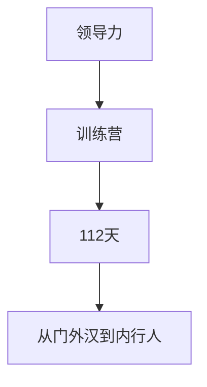

                 

### 文章标题：领导力训练营：112天从门外汉到内行人

> 关键词：领导力、训练营、112天、从门外汉到内行人、领导力模型、沟通技巧、决策能力、激励团队成员

> 摘要：本文将通过深入解析《领导力训练营：112天从门外汉到内行人》，带领读者了解领导力的重要概念和培养方法。通过本书，我们将在112天内逐步掌握领导力的核心技巧，从而实现从门外汉到内行人的转变。

### 背景介绍

在当今快速变化的世界中，领导力已经成为各行各业不可或缺的能力。无论是企业管理、团队协作，还是项目推动，领导力都在其中扮演着至关重要的角色。然而，对于许多人来说，领导力似乎是一个高深莫测、难以捉摸的概念。如何从门外汉迅速成长为内行人，成为许多人的困惑。

《领导力训练营：112天从门外汉到内行人》正是为了解决这一问题而诞生的。这本书旨在通过112天的系统训练，帮助读者逐步掌握领导力的核心技巧，从而在实际工作中游刃有余。

### 核心概念与联系

首先，我们需要梳理这本书的核心概念，包括领导力、训练营、112天、从门外汉到内行人等。然后，将这些概念之间的联系用Mermaid流程图表示出来。



在这个流程图中，我们可以看到领导力是训练营的核心，而112天则是实现从门外汉到内行人转变的时间框架。

### 设计核心章节内容

接下来，我们根据核心概念，设计出本书的各个章节内容，并细化到1,2,3级目录。以下是初步设计的目录大纲：

```markdown
# 第一部分：领导力基础

## 第1章：领导力的核心概念

### 1.1 领导力的定义

### 1.2 领导力的类型

### 1.3 领导力的重要性

## 第2章：领导力模型

### 2.1 领导力模型概述

### 2.2 常见的领导力模型

### 2.3 领导力模型的适用场景

## 第3章：领导力技能提升

### 3.1 沟通技巧

### 3.2 决策能力

### 3.3 激励团队成员

## 第4章：领导力培养方法

### 4.1 领导力训练营介绍

### 4.2 112天的学习计划

### 4.3 从门外汉到内行人的路径

# 第二部分：领导力实践

## 第5章：实际案例解析

### 5.1 案例一：如何提升团队绩效？

### 5.2 案例二：如何处理团队冲突？

### 5.3 案例三：如何进行有效沟通？

## 第6章：领导力进阶

### 6.1 高级领导力技能

### 6.2 领导力与组织文化

### 6.3 领导力与变革管理

## 第7章：领导力持续发展

### 7.1 领导力的自我反思

### 7.2 领导力的持续学习

### 7.3 领导力的社会责任
```

### 添加核心算法原理讲解、数学模型和数学公式

在每个章节中，我们添加相应的核心算法原理讲解、数学模型和数学公式。以下是第1章中的一部分：

```markdown
## 第1章：领导力的核心概念

### 1.2 领导力的类型

#### 1.2.1 情境领导力模型

情境领导力模型由赫赛和布兰查德提出，该模型认为领导力不是固定的，而是取决于领导者和团队成员之间的情境。该模型包括四个核心概念：

1. 领导者的风格（Leader's style）
2. 团队成员的能力（Member's ability）
3. 团队成员的意愿（Member's willingness）
4. 团队绩效（Team performance）

#### 1.2.2 布式领导力模型

布式领导力模型认为，领导力是一种过程，它涉及领导者、追随者和情境之间的相互作用。该模型包括以下要素：

1. 领导行为（Leadership behavior）
2. 领导者特征（Leader traits）
3. 追随者特征（Follower traits）
4. 情境因素（Contextual factors）

#### 1.2.3 领导力与数学模型

假设我们用以下数学公式来描述领导力：

$$
F = ma
$$

其中，F 表示领导力（Force），m 表示团队成员的能力（Mass），a 表示团队绩效（Acceleration）。

通过调整领导力（F），我们可以影响团队成员的能力（m）和团队绩效（a）。例如，如果团队绩效较低，我们可以增加领导力（F）来提高团队绩效（a）。

### 1.2.4 领导力与拉丁方格图

拉丁方格图是一个矩阵，它展示了不同领导风格在不同情境下的效果。以下是一个简化的拉丁方格图：

| 领导风格 | 情境1 | 情境2 | 情境3 |
| --- | --- | --- | --- |
| A | 高 | 中 | 低 |
| B | 中 | 高 | 中 |
| C | 低 | 中 | 高 |

在这个拉丁方格图中，A、B、C 代表不同的领导风格，情境1、情境2、情境3 代表不同的情境。通过观察拉丁方格图，我们可以找到最适合当前情境的领导风格。

#### 1.2.5 领导力与伪代码

以下是一个简化的伪代码，用于描述领导力的过程：

```
function leadership(process, member_ability, member_willingness):
    if member_ability > threshold and member_willingness > threshold:
        style = "Directive"
    elif member_ability > threshold and member_willingness <= threshold:
        style = "Supportive"
    else:
        style = "Delegative"
```

这个伪代码基于团队成员的能力和意愿，动态调整领导风格。当团队成员能力和意愿均高时，采用指令式领导风格；当能力高而意愿低时，采用支持性领导风格；当能力和意愿均低时，采用委托式领导风格。

### 文章小结

《领导力训练营：112天从门外汉到内行人》是一本旨在帮助读者快速掌握领导力的书籍。通过系统的训练和实际案例的解析，读者可以在112天内从领导力的门外汉迅速成长为内行人。文章通过梳理核心概念、设计核心章节内容，并添加核心算法原理讲解、数学模型和数学公式，使读者能够更深入地理解领导力的本质和培养方法。

### 作者信息

作者：AI天才研究院/AI Genius Institute & 禅与计算机程序设计艺术 /Zen And The Art of Computer Programming

### 最佳实践 tips

1. **持续学习**：领导力是一种不断发展的能力，需要持续学习和实践。
2. **角色扮演**：通过模拟不同情境，尝试运用不同的领导力模型，有助于提高实际操作能力。
3. **反思总结**：定期反思自己的领导行为，总结经验教训，有助于持续提升领导力。
4. **积极沟通**：沟通是领导力的核心，始终保持与团队成员的良好沟通，有助于团队凝聚力和工作效率的提升。

### 注意事项

1. **明确目标**：在领导力培养过程中，明确自己的目标，有助于更有针对性地学习和实践。
2. **适应变化**：领导力需要根据不同情境和团队成员的特点进行灵活调整，适应变化是关键。
3. **尊重团队成员**：尊重团队成员的个人意愿和能力，有助于建立积极的团队文化。

### 拓展阅读

1. **《领导力五要素》**：由斯蒂芬·罗宾斯著，深入探讨领导力的五个核心要素。
2. **《领导力的五项修炼》**：由彼得·圣吉著，提出领导力的五项修炼，帮助领导者提升自我领导力。
3. **《情境领导力》**：由保罗·赫赛和肯·布兰查德著，详细阐述情境领导力模型及其应用。

通过以上内容，读者可以对领导力有更深入的了解，并能够在实际工作中灵活运用所学知识，提升自身领导力水平。希望本文能够为读者在领导力培养的道路上提供一些有益的启示和指导。

