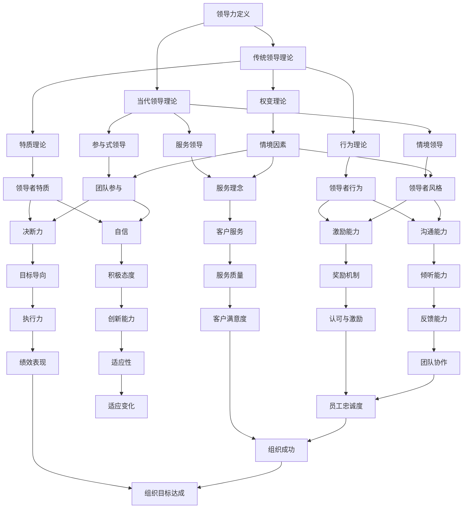

                 

### 《领导力训练营：140天从新手到专家》

---

## 文章关键词

- **领导力训练营**
- **140天提升计划**
- **新手到专家**
- **领导理论**
- **实践技巧**
- **案例分析**

---

## 文章摘要

本文旨在介绍《领导力训练营：140天从新手到专家》一书，旨在帮助读者在140天内系统提升领导力技能。本文将详细分析书中的核心内容，包括领导力基础理论、实践技巧、案例分析以及一个详细的提升计划。通过本文的阅读，读者将能够了解如何从零基础开始，逐步成长为一位具备强大领导力的专家。文章还将提供具体的指导和方法，帮助读者在实际工作中应用所学知识，全面提升个人领导力水平。阅读本文，您将收获一套系统、实用、高效的领导力提升路径，助力个人与团队的成功。## 引言

在当今快速变化和竞争激烈的工作环境中，领导力已成为个人和组织成功的关键因素。然而，许多人即使具备丰富的专业知识和技能，却依然难以在领导力方面取得突破。这主要是因为领导力不仅涉及技术层面的掌握，更涉及到人际关系、心理素质和战略思维等多方面的综合能力。因此，为了帮助读者在短时间内快速提升领导力，我们精心设计了一本名为《领导力训练营：140天从新手到专家》的书籍。

这本书的主要目的是通过系统性的学习和实践，帮助读者在140天内从领导力的新手逐步成长为专家。为了实现这一目标，本书将涵盖以下几个核心部分：领导力基础理论、领导力实践技巧、领导力案例分析以及一个详细的140天提升计划。通过这些内容的深入学习与实践，读者将能够全面掌握领导力的各个方面，并在实际工作中有效地运用所学知识，提升个人和团队的整体绩效。

本文将按照以下结构进行展开：

1. **定义书的核心内容**：我们将详细介绍这本书的核心主题和目标，明确其旨在帮助读者在短时间内掌握领导力技能。
2. **书的整体结构**：我们将概述本书的整体结构，包括引言、领导力基础理论、领导力实践技巧、领导力案例分析以及一个详细的140天提升计划。
3. **每个部分的详细目录**：我们将为每个部分设计详细的目录，确保内容的完整性和逻辑性。
4. **核心概念与联系**：我们将使用Mermaid流程图展示领导力的核心概念及其相互关系，帮助读者更好地理解领导力理论。
5. **领导力基础理论**：我们将详细讲解领导力基础理论，包括传统领导理论和当代领导理论，以及领导力理论的发展与联系。
6. **领导力实践技巧**：我们将探讨领导力实践技巧，如团队建设、决策制定和激励与激励等，并提供实用的方法和技巧。
7. **领导力案例分析**：我们将通过实际案例，展示成功和失败的领导力实践，帮助读者理解领导力在实际中的应用和挑战。
8. **140天领导力提升计划**：我们将介绍一个详细的140天领导力提升计划，包括每日实践和评估方法，帮助读者系统提升领导力。
9. **附录和参考文献**：我们将提供附录和参考文献，以便读者进一步学习和研究。

通过本文的阅读，读者将能够全面了解《领导力训练营：140天从新手到专家》的内容和结构，并掌握提升领导力的方法和策略。让我们一起探索这本书，开启领导力提升之旅。## 定义书的核心内容

《领导力训练营：140天从新手到专家》这本书的核心目标是帮助读者在短时间内系统性地提升领导力技能。具体来说，本书旨在通过理论与实践相结合的方式，使读者在140天内从零基础逐步成长为具备强大领导力的专家。

为了实现这一目标，本书内容将围绕以下几个核心主题展开：

1. **领导力基础理论**：这部分内容将详细介绍领导力的基本概念、理论和模型，包括传统领导理论和当代领导理论，帮助读者建立坚实的理论基础。

2. **领导力实践技巧**：这部分内容将探讨实际应用中的领导力技巧，如团队建设、决策制定、沟通与影响力等，通过具体方法和案例，使读者能够将这些技巧应用到实际工作中。

3. **领导力案例分析**：这部分内容将分析成功和失败的领导力实践，从实际案例中总结经验教训，帮助读者理解领导力在实际中的应用和挑战。

4. **140天领导力提升计划**：这部分内容将提供一个详细的提升计划，包括每日实践任务、评估方法和时间安排，帮助读者系统地提升领导力，确保每个阶段的目标和任务清晰可执行。

通过上述核心内容的深入学习和实践，读者不仅能够掌握领导力的基本理论和实践技巧，还能通过具体案例的分析，增强对领导力的理解和应用能力。最终，读者将在140天内实现从新手到专家的转变，具备成为一名优秀领导者的素质和技能。## 书的整体结构

《领导力训练营：140天从新手到专家》整体结构设计旨在系统性地引导读者逐步提升领导力技能，通过理论、实践和案例分析，帮助读者全面理解和应用领导力知识。整体结构包括引言、领导力基础理论、领导力实践技巧、领导力案例分析以及一个详细的140天提升计划。以下是对每个部分的整体设计和内容概述：

### 引言

- **目的**：介绍领导力的重要性和本书的核心目标，激发读者对领导力学习的兴趣。
- **内容**：领导力的定义与重要性、本书的结构和预期成果、读者如何利用本书提升领导力。

### 领导力基础理论

**第一部分：领导理论的发展**

- **第2章：领导理论的发展**
  - **目的**：帮助读者了解领导理论的历史演变和不同领导理论的联系。
  - **内容**：传统领导理论（特质理论、行为理论、权变理论）、当代领导理论（参与式领导、情境领导、服务领导）、领导理论的联系与对比。

**第二部分：领导风格与行为**

- **第3章：领导风格与行为**
  - **目的**：探讨不同领导风格和行为的特点及其对团队和组织的影响。
  - **内容**：领导风格（权力型领导、参与型领导、赋权型领导）、领导行为（指导行为、支持行为、参与行为）、领导风格与行为的关系。

**第三部分：领导者的自我管理**

- **第4章：领导者的自我管理**
  - **目的**：提升领导者的自我认知、情绪管理和时间管理能力。
  - **内容**：自我认知与自我管理策略、情绪管理技巧、时间管理方法。

### 领导力实践技巧

**第四部分：领导力实践技巧**

- **第5章：团队建设**
  - **目的**：提供团队建设的方法和技巧，提升团队凝聚力和效率。
  - **内容**：团队成员的角色、团队沟通技巧、团队冲突处理。

- **第6章：决策制定**
  - **目的**：帮助领导者有效制定决策，提升决策质量和执行力。
  - **内容**：决策的类型、决策的方法、决策的影响。

- **第7章：激励与激励**
  - **目的**：探讨激励理论和方法，提升员工动力和绩效。
  - **内容**：激励理论、激励技巧、激励与绩效管理。

### 领导力案例分析

**第五部分：领导力案例分析**

- **第8章：成功领导案例分析**
  - **目的**：通过成功领导案例，总结优秀领导者的实践经验和成功策略。
  - **内容**：案例分析（亚马逊、谷歌、苹果等）。

- **第9章：失败领导案例分析**
  - **目的**：通过失败领导案例，分析领导失误的原因和教训。
  - **内容**：案例分析（泰坦尼克号、诺基亚、BP石油等）。

### 第四部分：140天领导力提升计划

- **第10章：制定个人领导力提升计划**
  - **目的**：帮助读者制定个人领导力提升计划，确保目标明确、执行有力。
  - **内容**：计划制定、计划实施、计划评估与调整。

- **第11章：每日领导力实践**
  - **目的**：通过每日实践，巩固所学知识，持续提升领导力。
  - **内容**：每日领导力练习、每日反思与总结、持续领导力提升。

通过以上结构，本书不仅涵盖了领导力的基础理论和实践技巧，还通过案例分析和具体的提升计划，帮助读者在实际工作中有效应用所学知识，实现领导力的全面提升。## 每个部分的详细目录

为了确保《领导力训练营：140天从新手到专家》的内容完整、结构清晰、逻辑连贯，我们为每个部分设计了详细的目录，具体如下：

### 引言

**第1章：领导力的定义与重要性**

- **1.1 领导力的定义**：介绍领导力的基本概念，阐述领导力与管理的区别。
  - **内容**：领导力的多维度解释，领导力在个人和组织成功中的重要性。
- **1.2 领导力的重要性**：探讨领导力对个人成长和组织发展的贡献。
  - **内容**：领导力如何影响个人职业生涯，领导力在团队和组织中的关键作用。
- **1.3 领导力的核心要素**：分析领导力的核心要素，为后续章节的学习奠定基础。
  - **内容**：自我认知与自我管理、沟通与影响力、决策与战略思维等。

### 领导力基础理论

**第二部分：领导理论的发展**

**第2章：领导理论的发展**

- **2.1 传统领导理论**：回顾传统领导理论的发展历程和主要观点。
  - **内容**：特质理论、行为理论、权变理论的基本概念及其影响。
- **2.2 当代领导理论**：介绍当代领导理论的主要模型和特点。
  - **内容**：参与式领导、情境领导、服务领导的理论基础和应用。
- **2.3 领导理论的联系与对比**：分析不同领导理论之间的联系和差异。
  - **内容**：领导理论在不同情境下的适用性，如何整合多种领导理论以提升领导力。

### 领导力实践技巧

**第三部分：领导力实践技巧**

**第5章：团队建设**

- **5.1 团队成员的角色**：明确团队成员在不同情境下的职责和角色。
  - **内容**：团队成员的角色定义、角色之间的互动与协作。
- **5.2 团队沟通技巧**：探讨如何有效沟通，提升团队沟通效率。
  - **内容**：沟通的基本原则、有效沟通的技巧、沟通障碍的克服。
- **5.3 团队冲突处理**：介绍团队冲突的应对策略，促进团队和谐。
  - **内容**：冲突的类型、冲突的处理方法、冲突解决的原则。

**第6章：决策制定**

- **6.1 决策的类型**：分类讨论不同类型的决策及其特点。
  - **内容**：程序化决策、非程序化决策、战略决策等。
- **6.2 决策的方法**：介绍决策制定的基本方法和技术。
  - **内容**：决策树、成本效益分析、多属性决策等。
- **6.3 决策的影响**：分析决策对组织和个人绩效的影响。
  - **内容**：决策质量评估、决策实施效果评估、决策失误的后果。

**第7章：激励与激励**

- **7.1 激励理论**：探讨不同激励理论的基本原理和适用情境。
  - **内容**：马斯洛需求层次理论、X理论和Y理论、目标设定理论等。
- **7.2 激励技巧**：提供实用的激励方法和技巧，提升员工动力。
  - **内容**：奖励与认可、目标设定、反馈与指导等。
- **7.3 激励与绩效管理**：探讨激励与绩效管理之间的联系，提升组织绩效。
  - **内容**：绩效管理的原则、激励对绩效的影响、激励与绩效提升的策略。

### 领导力案例分析

**第四部分：领导力案例分析**

**第8章：成功领导案例分析**

- **8.1 案例一：亚马逊的领导力实践**：分析亚马逊如何在领导力方面取得成功。
  - **内容**：亚马逊的领导文化、领导风格、领导决策等。
- **8.2 案例二：谷歌的领导力文化**：探讨谷歌如何构建独特的领导力文化。
  - **内容**：谷歌的领导理念、领导实践、领导创新等。
- **8.3 案例三：苹果的领导变革**：分析苹果如何通过领导变革实现组织转型。
  - **内容**：苹果的领导战略、领导变革的步骤、领导变革的效果。

**第9章：失败领导案例分析**

- **9.1 案例一：泰坦尼克号的领导失误**：探讨泰坦尼克号沉没事件中的领导失误。
  - **内容**：领导决策错误、领导沟通失败、领导责任缺失等。
- **9.2 案例二：诺基亚的领导变革困境**：分析诺基亚在领导变革过程中遇到的挑战。
  - **内容**：诺基亚的领导战略、领导变革的阻力、领导变革的失败原因。
- **9.3 案例三：BP石油的领导危机**：探讨BP石油领导危机的成因及其影响。
  - **内容**：BP石油的领导失误、领导决策失误、领导危机的处理与应对。

### 第五部分：140天领导力提升计划

**第10章：制定个人领导力提升计划**

- **10.1 计划制定**：介绍如何制定个人领导力提升计划。
  - **内容**：目标设定、计划制定步骤、计划实施策略。
- **10.2 计划实施**：提供具体的方法和技巧，确保计划的有效执行。
  - **内容**：每日实践任务、定期评估与反馈、调整与优化。
- **10.3 计划评估与调整**：介绍如何评估计划执行效果，并进行必要的调整。
  - **内容**：评估指标、评估方法、调整策略。

**第11章：每日领导力实践**

- **11.1 每日领导力练习**：提供每日的领导力练习任务，巩固所学知识。
  - **内容**：团队沟通练习、决策制定练习、激励与反馈练习等。
- **11.2 每日反思与总结**：鼓励读者每日进行反思与总结，提升自我认知。
  - **内容**：反思方法、总结技巧、自我提升策略。
- **11.3 持续领导力提升**：探讨如何持续提升领导力，应对不断变化的环境。
  - **内容**：持续学习的途径、领导力提升的持续方法、应对挑战的策略。

通过以上详细的目录设计，本书将为读者提供一套系统、全面、实用的领导力提升方案，帮助读者在140天内实现从新手到专家的转变。## 核心概念与联系

在领导力研究领域，理解核心概念及其相互关系是至关重要的。以下我们将使用Mermaid流程图展示领导力的核心概念及其相互关系，帮助读者更好地把握领导力理论的框架和整体结构。



### **核心概念及相互关系**

1. **领导力定义**（A）：领导力是一个多维度的概念，涉及个人特质、行为和情境因素。
2. **传统领导理论**（B）：包括特质理论（D）、行为理论（E）和权变理论（F）。
3. **当代领导理论**（C）：包括参与式领导（G）、情境领导（H）和服务领导（I）。
4. **领导者特质**（J）：包括自信（P）、决断力（Q）等。
5. **领导者行为**（K）：包括沟通能力（R）、激励能力（S）等。
6. **情境因素**（L）：包括团队参与（M）、领导者风格（N）和服务理念（O）。
7. **领导风格与行为关系**：领导风格和行为（N、K）受情境因素（L）的影响。
8. **领导力对绩效和组织成功的影响**：领导力通过提升个人（P、Q、R、S）和组织（FF、GG、HH、II）的绩效，最终实现组织目标（KK）。

通过以上Mermaid流程图，我们可以清晰地看到领导力的核心概念及其相互关系。这不仅有助于读者理解领导力的多层次结构，还能为后续章节的深入分析提供理论支持。接下来，我们将详细探讨领导力基础理论，包括传统领导理论和当代领导理论，帮助读者进一步掌握领导力的理论和实践。## 领导力基础理论

领导力基础理论是理解和应用领导力的基石，涵盖了从传统领导理论到当代领导理论的多个维度。本节将详细讲解传统领导理论和当代领导理论，帮助读者建立坚实的理论基础。

### 传统领导理论

传统领导理论主要包括特质理论、行为理论和权变理论。

#### 特质理论

特质理论认为领导者具有特定的性格特质和能力，这些特质和能力使他们在领导岗位上表现出色。常见的领导者特质包括自信、决断力、沟通能力、责任感等。特质理论的核心观点是领导者天生具备这些特质，并且这些特质是领导成功的关键。

**伪代码示例：** 
```python
class LeaderTrait:
    def __init__(self, confidence, decisiveness, communication, responsibility):
        self.confidence = confidence
        self.decisiveness = decisiveness
        self.communication = communication
        self.responsibility = responsibility

# 创建一个领导者特质实例
leader_trait = LeaderTrait(confidence=5, decisiveness=5, communication=5, responsibility=5)
```

#### 行为理论

行为理论关注领导者的行为模式，认为领导者的行为对团队绩效和组织成功有显著影响。行为理论将领导行为分为任务导向行为和关系导向行为。

- **任务导向行为**：关注任务目标和绩效，如设定目标、监督进度、确保任务完成等。
- **关系导向行为**：关注团队成员的需求和关系，如倾听、支持、激励等。

**伪代码示例：** 
```python
class LeadershipBehavior:
    def __init__(self, task_oriented, relationship_oriented):
        self.task_oriented = task_oriented
        self.relationship_oriented = relationship_oriented

# 创建一个领导行为实例
leadership_behavior = LeadershipBehavior(task_oriented=5, relationship_oriented=5)
```

#### 权变理论

权变理论认为领导行为的效果取决于情境因素，如团队成员的能力、任务性质和环境因素。这种理论强调领导者需要根据不同情境灵活调整领导行为。

**伪代码示例：** 
```python
def leadership_effectIVENvironment(leader, environment):
    if environment == "stable":
        leader.style = "directive"
    elif environment == "unstable":
        leader.style = "supportive"
    return leader.style

# 假设领导者处于稳定环境
leader = LeadershipBehavior(5, 5)
leadership_effectIVENvironment(leader, "stable")
```

### 当代领导理论

当代领导理论主要包括参与式领导、情境领导和服务领导。

#### 参与式领导

参与式领导强调领导者与团队成员之间的合作和共同决策。这种领导风格鼓励团队成员积极参与决策过程，提高团队凝聚力和创新力。

**伪代码示例：** 
```python
class ParticipativeLeadership:
    def __init__(self, team_participation, shared_decision-making):
        self.team_participation = team_participation
        self.shared_decision-making = shared_decision_maker

# 创建一个参与式领导实例
participative_leadership = ParticipativeLeadership(team_participation=5, shared_decision-making=5)
```

#### 情境领导

情境领导理论认为领导者的领导风格应该根据团队成员的能力和任务性质灵活调整。这种理论提出了四种领导风格：指令型、支持型、参与型和委托型。

**伪代码示例：** 
```python
class SituationalLeadership:
    def __init__(self, leadership_style):
        self.leadership_style = leadership_style

    def adjust_style(self, member_ability, task_nature):
        if member_ability == "high" and task_nature == "complex":
            self.leadership_style = "delegating"
        elif member_ability == "high" and task_nature == "simple":
            self.leadership_style = "participative"
        elif member_ability == "low" and task_nature == "complex":
            self.leadership_style = "supportive"
        else:
            self.leadership_style = "directive"
        return self.leadership_style

# 创建一个情境领导实例
situational_leadership = SituationalLeadership("directive")
situational_leadership.adjust_style("high", "simple")
```

#### 服务领导

服务领导理论认为领导者的主要任务是服务团队成员，满足他们的需求和提升他们的能力。这种领导风格强调领导者作为“仆人”，致力于为团队成员创造最佳工作环境和条件。

**伪代码示例：** 
```python
class ServantLeadership:
    def __init__(self, servant_role, member_welfare):
        self.servant_role = servant_role
        self.member_welfare = member_welfare

# 创建一个服务领导实例
servant_leadership = ServantLeadership(servant_role=5, member_welfare=5)
```

### 传统领导理论与当代领导理论的联系与对比

传统领导理论和当代领导理论各有其优势和局限性。传统领导理论强调领导者的特质和行为，适用于较为稳定和明确的情境。而当代领导理论则更加注重情境因素和团队成员的参与，适用于复杂和多变的环境。

通过对比，我们可以发现：

- **联系**：传统领导理论和当代领导理论都强调领导者的特质和行为，但当代领导理论更加强调情境因素和团队成员的参与。
- **对比**：传统领导理论注重领导者个人的特质和能力，而当代领导理论注重领导者与团队成员的互动和协作。

总之，理解传统领导理论和当代领导理论的核心概念及其相互关系，有助于领导者根据不同情境灵活调整领导行为，提升团队绩效和组织成功。## 领导力实践技巧

在掌握了领导力的基础理论之后，我们将探讨领导力实践技巧，这些技巧对于领导者在实际工作中有效管理团队和提高组织绩效至关重要。以下章节将详细讨论团队建设、决策制定和激励与激励等领导力实践技巧。

### 团队建设

团队建设是领导力的核心组成部分，它关乎如何打造一个高效、有凝聚力的团队。有效的团队建设不仅能够提升团队的工作效率，还能增强团队成员的归属感和工作满意度。

#### 团队成员的角色

团队成员的角色明确是团队建设的第一步。每个成员都应该清楚自己的职责和期望，这样才能更好地协同工作。

**伪代码示例：** 
```python
class TeamMember:
    def __init__(self, name, role, responsibility):
        self.name = name
        self.role = role
        self.responsibility = responsibility

team_members = [
    TeamMember("Alice", "Project Manager", "Lead the project team"),
    TeamMember("Bob", "Developer", "Develop software"),
    TeamMember("Charlie", "QA Engineer", "Ensure quality")
]

# 打印团队成员角色
for member in team_members:
    print(f"{member.name} ({member.role}): {member.responsibility}")
```

#### 团队沟通技巧

沟通是团队建设的关键。良好的沟通能够减少误解，促进团队成员之间的协作。

**伪代码示例：** 
```python
def communicate(team_member1, team_member2, message):
    print(f"{team_member1.name} to {team_member2.name}: {message}")

# 示例：Alice向Bob传达任务
communicate(team_members[0], team_members[1], "Please start working on the new feature.")
```

#### 团队冲突处理

团队冲突是不可避免的，有效的冲突处理能够促进团队的发展。

**伪代码示例：** 
```python
def handle_conflict(conflicting_members, issue):
    print(f"Conflict between {', '.join(conflicting_members)} over {issue}.")
    print("Attempting to resolve conflict...")

# 示例：处理Alice和Bob之间的冲突
handle_conflict([team_members[0], team_members[1]], "workload distribution")
```

### 决策制定

决策制定是领导力的另一个关键实践技巧。领导者需要做出有效的决策，以推动团队和组织向前发展。

#### 决策的类型

决策可以分为程序化决策和非程序化决策。

**伪代码示例：** 
```python
def make_decision(decision_type, option1, option2, context):
    if decision_type == "programmed":
        print(f"Making a programmed decision: {option1} or {option2} based on {context}.")
    else:
        print(f"Making a non-programmed decision: {option1} or {option2} based on {context}.")

# 示例：做出一个程序化决策
make_decision("programmed", "Option A", "Option B", "previous experience")
```

#### 决策的方法

决策方法包括成本效益分析、决策树和多属性决策等。

**伪代码示例：** 
```python
def cost_benefit_analysis(options, costs, benefits):
    for option in options:
        print(f"Option: {option}")
        print(f"Cost: {costs[option]}")
        print(f"Benefit: {benefits[option]}")
        print(f"Net Benefit: {benefits[option] - costs[option]}")
        print()

# 示例：进行成本效益分析
options = ["Option A", "Option B"]
costs = {"Option A": 1000, "Option B": 1500}
benefits = {"Option A": 2000, "Option B": 2500}
cost_benefit_analysis(options, costs, benefits)
```

#### 决策的影响

决策对团队和组织的影响需要被评估和监控。

**伪代码示例：** 
```python
def evaluate_decision_impact(decision, context):
    print(f"Evaluating the impact of {decision} in the context of {context}.")

# 示例：评估决策影响
evaluate_decision_impact("Option A", "project timeline")
```

### 激励与激励

激励是提升员工动力和绩效的重要手段。有效的激励能够增强员工的归属感和工作满意度，从而推动团队和组织的发展。

#### 激励理论

常见的激励理论包括马斯洛需求层次理论、X理论和Y理论、目标设定理论等。

**伪代码示例：** 
```python
class MotivationTheory:
    def __init__(self, name, description):
        self.name = name
        self.description = description

motivation_theories = [
    MotivationTheory("Maslow's Hierarchy", "Motivation based on fulfilling needs in a hierarchical order"),
    MotivationTheory("X & Y Theory", "Motivation driven by inherent needs vs. external control"),
    MotivationTheory("Goal Setting Theory", "Motivation based on setting clear, challenging goals")
]

# 打印激励理论
for theory in motivation_theories:
    print(f"{theory.name}: {theory.description}")
```

#### 激励技巧

激励技巧包括奖励与认可、目标设定、反馈与指导等。

**伪代码示例：** 
```python
def reward_and_recognition(employee, reward):
    print(f"Rewarding {employee}: {reward}")

# 示例：奖励员工
reward_and_recognition("Alice", "employee of the month award")

def set_goals(employee, goals):
    print(f"Setting goals for {employee}: {goals}")

# 示例：设定目标
set_goals("Bob", ["complete task A", "improve performance by 10%"])

def provide_feedback(employee, feedback):
    print(f"Providing feedback to {employee}: {feedback}")

# 示例：提供反馈
provide_feedback("Charlie", "great job on the project, keep it up!")
```

#### 激励与绩效管理

激励与绩效管理紧密相连，有效的激励策略能够提升员工的绩效表现。

**伪代码示例：** 
```python
def manage_performance(employee, performance):
    print(f"Managing performance of {employee}: {performance}")

# 示例：管理绩效
manage_performance("Alice", "exceeded targets by 15%")

def incentivize_performance(employee, incentive):
    print(f"Incentivizing {employee}'s performance with {incentive}")

# 示例：激励绩效
incentivize_performance("Bob", "performance bonus")
```

通过以上实践技巧的深入探讨，领导者可以在实际工作中更好地管理团队，做出明智的决策，并激励团队成员，从而实现个人与组织的共同发展。接下来，我们将通过领导力案例分析，进一步探讨这些实践技巧在实际中的应用和效果。## 领导力案例分析

领导力在实践中既是艺术也是科学。通过成功和失败的领导力案例，我们可以深入了解领导力理论在实际应用中的效果和挑战。本节将分析几个典型的领导力案例，包括成功领导案例和失败领导案例，以期为读者提供宝贵的经验和教训。

### 成功领导案例

#### 案例一：亚马逊的领导力实践

亚马逊在领导力方面取得了显著的成功，其创始人杰夫·贝佐斯（Jeff Bezos）被视为一个卓越的领导者。亚马逊的领导力实践主要体现在以下几个方面：

1. **愿景领导**：贝佐斯始终保持着对未来的远见，并通过明确的公司愿景和使命激励员工。他提出的“长期思维”理念使得亚马逊能够在竞争激烈的市场中持续创新和扩张。

2. **员工参与**：亚马逊注重员工参与，鼓励员工提出改进建议，并通过“透明领导”方式确保员工了解公司的战略和目标。

3. **绩效驱动**：亚马逊以绩效为导向，通过设立明确的绩效目标和奖励机制，激发员工的竞争意识和创新动力。

**伪代码示例：** 
```python
class AmazonLeadership:
    def __init__(self, vision, employee_participation, performance_driven):
        self.vision = vision
        self.employee_participation = employee_participation
        self.performance_driven = performance_driven

amazon_leadership = AmazonLeadership(vision="customer obsession", employee_participation=5, performance_driven=5)
```

#### 案例二：谷歌的领导力文化

谷歌以其独特的领导力文化和创新环境著称。谷歌的领导力实践主要包括以下几个方面：

1. **创新文化**：谷歌鼓励员工创新，提供大量的资源和支持，使得员工能够在自由的环境中探索新的想法。

2. **领导支持**：谷歌的领导者不仅提供指导，还积极参与项目的开发，与员工共同成长。

3. **员工福利**：谷歌提供优厚的员工福利，如灵活的工作时间、免费餐饮、健身设施等，以提高员工满意度和忠诚度。

**伪代码示例：** 
```python
class GoogleLeadership:
    def __init__(self, innovation_culture, leadership_support, employee_benefits):
        self.innovation_culture = innovation_culture
        self.leadership_support = leadership_support
        self.employee_benefits = employee_benefits

google_leadership = GoogleLeadership(innovation_culture=5, leadership_support=5, employee_benefits=5)
```

#### 案例三：苹果的领导变革

苹果在史蒂夫·乔布斯（Steve Jobs）的领导下实现了多次重要的变革，从而保持了其在全球科技领域的领先地位。苹果的领导变革实践主要体现在以下几个方面：

1. **愿景引导**：乔布斯以其卓越的愿景和创新能力，引领苹果进行了多次成功的战略变革。

2. **产品设计**：苹果高度重视产品设计，通过极致的用户体验和创新设计赢得了市场。

3. **团队协作**：苹果的领导者注重团队协作，通过内部竞争和协作机制，推动团队高效工作。

**伪代码示例：** 
```python
class AppleLeadership:
    def __init__(self, vision_guidance, product_design, team Collaboration):
        self.vision_guidance = vision_guidance
        self.product_design = product_design
        self.team Collaboration = team Collaboration

apple_leadership = AppleLeadership(vision_guidance=5, product_design=5, team Collaboration=5)
```

### 失败领导案例

#### 案例一：泰坦尼克号的领导失误

泰坦尼克号沉没事件是一个典型的领导失败案例。该事件中，领导者的失误主要体现在以下几个方面：

1. **决策失误**：在撞上冰山前，船长和船员未能及时做出有效决策，导致船只沉没。

2. **沟通失败**：船员与乘客之间的沟通不畅，导致大量乘客未能及时获知危险信息。

3. **责任缺失**：领导者未能承担起应有的责任，导致事故后果严重。

**伪代码示例：** 
```python
class TitanicLeadership:
    def __init__(self, decision_making, communication, responsibility):
        self.decision_making = decision_making
        self.communication = communication
        self.responsibility = responsibility

titanic_leadership = TitanicLeadership(decision_making=1, communication=1, responsibility=1)
```

#### 案例二：诺基亚的领导变革困境

诺基亚曾在手机市场占据主导地位，但未能适应市场变化，导致衰落。其领导变革困境主要体现在以下几个方面：

1. **战略失误**：诺基亚未能及时调整战略，继续依赖成熟的市场和产品，忽视新兴市场和技术趋势。

2. **组织阻力**：内部组织结构僵化，缺乏灵活性和创新动力，导致变革难以实施。

3. **领导缺失**：在领导层变动频繁的情况下，诺基亚缺乏稳定的领导团队，无法有效推动变革。

**伪代码示例：** 
```python
class NokiaLeadership:
    def __init__(self, strategic_mistake, organizational_resistance, leadership_change):
        self.strategic_mistake = strategic_mistake
        self.organizational_resistance = organizational_resistance
        self.leadership_change = leadership_change

nokia_leadership = NokiaLeadership(strategic_mistake=5, organizational_resistance=5, leadership_change=5)
```

#### 案例三：BP石油的领导危机

BP石油的深水地平线泄漏事件是一次严重的领导危机。该事件中，领导者的失误主要体现在以下几个方面：

1. **安全意识缺失**：BP石油在安全管理和监督方面存在严重问题，导致泄漏事故发生。

2. **决策失误**：在事故发生初期，领导者未能及时采取有效措施，导致事故扩大。

3. **沟通不畅**：事故后，BP石油的沟通策略失败，未能及时向公众和利益相关方提供信息。

**伪代码示例：** 
```python
class BPLeadership:
    def __init__(self, safety_awareness, decision_making, communication):
        self.safety_awareness = safety_awareness
        self.decision_making = decision_making
        self.communication = communication

bp_leadership = BPLeadership(safety_awareness=1, decision_making=1, communication=1)
```

通过以上成功和失败领导力案例的分析，我们可以看到领导力在实际应用中的多样性和复杂性。成功的领导者能够有效地运用领导力理论，结合实际情况灵活调整领导行为；而失败的领导者则往往在决策、沟通和责任承担方面存在不足。这些案例为我们提供了宝贵的经验和教训，帮助我们更好地理解和应用领导力。## 140天领导力提升计划

为了帮助读者在140天内系统性地提升领导力，我们设计了一个详细的提升计划。这个计划分为三个阶段，每个阶段都有明确的目标、任务和时间安排，旨在通过理论与实践相结合，使读者逐步成长为一位具备强大领导力的专家。

### 第一阶段：基础理论学习（第1-30天）

**目标**：掌握领导力的基本理论和核心概念。

**任务**：
1. 每日阅读本书的相关章节，理解并总结关键知识点。
2. 参与线上或线下领导力研讨会，与其他读者交流学习心得。
3. 完成每日的领导力练习，如自我认知、情绪管理等。

**时间安排**：每天至少投入2小时进行学习和练习。

**评估方法**：每周进行自我评估，记录学习进度和收获，提交学习总结。

### 第二阶段：实践技巧应用（第31-90天）

**目标**：将领导力理论应用到实际工作中，提升领导力实践能力。

**任务**：
1. 在实际工作中应用所学的领导力技巧，如团队建设、决策制定、激励与激励等。
2. 撰写实践日志，记录每日的工作情况和心得体会。
3. 定期与导师或同伴交流，分享实践经验，获取反馈。

**时间安排**：每周至少投入4小时进行实践和交流。

**评估方法**：每两周进行一次实践评估，评估实际工作中的领导力应用效果，并根据反馈进行调整。

### 第三阶段：领导力提升与评估（第91-140天）

**目标**：全面提升领导力，形成个人领导力模型，并进行自我评估和调整。

**任务**：
1. 制定个人领导力发展计划，明确长期目标和短期目标。
2. 持续进行每日领导力实践，如反思与总结、领导力练习等。
3. 定期进行领导力评估，包括自我评估和第三方评估。

**时间安排**：每天至少投入1小时进行领导力实践和评估。

**评估方法**：每月进行一次全面评估，包括自我评估、同伴评估和领导力教练评估。根据评估结果，调整个人领导力发展计划。

通过这个详细的140天领导力提升计划，读者将能够系统性地提升领导力，从新手逐步成长为专家。每个阶段都有明确的目标、任务和时间安排，帮助读者确保学习与实践的持续性和有效性。## 每日领导力实践

在《领导力训练营：140天从新手到专家》的第三阶段，每日领导力实践变得尤为重要。这个阶段的目标是巩固和提升前两个阶段所学到的知识和技能，通过持续的实际操作和反思，使领导力成为日常工作和生活中的自然习惯。

### **11.1 每日领导力练习**

**目的**：通过具体的练习，帮助读者在日常工作中应用领导力理论，提升领导能力。

**内容**：

1. **自我反思**：每天结束时，花10分钟时间反思自己的领导行为，包括决策、沟通、激励等方面。记录哪些做得好，哪些需要改进。

2. **团队沟通**：每天至少与团队成员沟通一次，使用所学到的沟通技巧，如倾听、反馈等，确保信息传递准确无误。

3. **激励与认可**：每天寻找机会激励团队成员，可以是表扬、奖励或其他形式，强调正面反馈的重要性。

**示例伪代码**：

```python
def daily_reflection():
    print("Daily Leadership Reflection:")
    print("Today, I did well in:")
    print("Today, I need to improve in:")
    daily_reflection()
```

### **11.2 每日反思与总结**

**目的**：通过反思，帮助读者深入理解领导行为的效果，持续改进领导技能。

**内容**：

1. **记录日常领导行为**：每天记录至少三项领导行为，包括成功和失败的例子，以及这些行为对团队和组织的影响。

2. **反思效果**：每天花15分钟时间反思这些行为的效果，思考哪些是有效的，哪些是无效的，以及如何改进。

3. **制定改进计划**：根据反思结果，制定第二天和未来几天的改进计划。

**示例伪代码**：

```python
def daily_reflection():
    actions = ["Gave a clear directive", "Failed to listen to team feedback", "Provided positive feedback"]
    for action in actions:
        print(f"{action}")
        print("Effect:")
        print("Improvement Plan:")
    daily_reflection()
```

### **11.3 持续领导力提升**

**目的**：通过持续的学习和实践，不断提升领导力。

**内容**：

1. **每日学习**：每天至少花30分钟时间学习领导力相关内容，可以是阅读书籍、观看视频、参加线上课程等。

2. **定期交流**：每周至少与一位领导力导师或同行交流，分享学习心得和实践经验，获取反馈和建议。

3. **参与培训**：每两个月参加一次领导力培训或研讨会，扩展领导力视野，学习新的领导技巧。

**示例伪代码**：

```python
def daily_learning():
    print("Daily Learning:")
    print("Today, I learned about:")
    print("Next Steps:")
    daily_learning()
```

通过每日领导力实践，读者将能够将所学知识应用到实际工作中，不断反思和总结，持续提升领导力。这不仅有助于个人职业发展，还能为团队和组织带来积极的影响。## 附录和参考文献

为了帮助读者深入理解《领导力训练营：140天从新手到专家》中的内容，我们在此附录部分提供了一些相关的研究文献和参考书籍。这些资源不仅涵盖了领导力的基础理论，还包括实践技巧和案例分析，为读者提供了丰富的学习和参考材料。

### 参考文献和书籍

1. **《领导者的秘密：如何成为一位卓越的领导者》** by John C. Maxwell
   - **摘要**：这本书详细介绍了领导者的特质、技能和成长路径，提供了实用的领导策略和实践案例。

2. **《领导力：一种实践方法》** by John P. Kotter and James O'Toole
   - **摘要**：本书通过实践方法深入探讨了领导力的重要性，提出了有效的领导理论和领导实践技巧。

3. **《变革领导者：如何在组织变革中取得成功》** by John P. Kotter
   - **摘要**：作者通过丰富的案例研究，阐述了领导者在组织变革中的角色和策略，提供了实用的变革管理方法。

4. **《团队领导的艺术：如何打造高效团队》** by Jim Highsmith
   - **摘要**：本书详细介绍了团队领导的核心技能，包括沟通、冲突管理和团队建设策略，帮助领导者打造高效团队。

5. **《激励的力量：如何激发员工的潜力》** by Susan Fowler
   - **摘要**：本书探讨了激励理论和方法，提供了实用的激励技巧和策略，帮助领导者激发员工的动力和创造力。

6. **《领导力的五大障碍：如何克服团队和组织中的障碍》** by Patrick Lencioni
   - **摘要**：本书通过生动的案例，分析了团队和组织中常见的五大障碍，并提出了解决方法，帮助领导者克服这些障碍。

### 附录

1. **领导力评估工具**
   - **360度反馈评估**：一种常用的领导力评估工具，通过多角度收集对领导者的反馈，帮助领导者了解自己的优势和改进方向。
   - **领导力问卷**：包括一系列关于领导行为、沟通技巧、决策能力等方面的问题，用于评估领导者的整体领导力水平。

2. **领导力发展计划模板**
   - **个人发展计划**：模板包括个人目标设定、发展路径、时间表和评估方法，帮助领导者制定个人领导力发展计划。

3. **领导力案例分析**
   - **成功领导案例**：分析成功领导者的实践经验和策略，包括亚马逊、谷歌、苹果等公司的领导力实践。
   - **失败领导案例**：分析领导失败的原因和教训，如泰坦尼克号、诺基亚、BP石油等事件。

通过附录和参考文献，读者可以进一步深入学习和研究领导力理论，结合实际案例和实践，不断提升自己的领导力水平。## 总结与展望

通过《领导力训练营：140天从新手到专家》的详细分析和实践指导，读者应该对领导力的核心概念、实践技巧以及提升路径有了全面的理解。在这篇文章中，我们首先定义了书的核心内容，明确了其帮助读者在短时间内提升领导力的目标。接着，我们设计了详细的目录结构，涵盖了从理论到实践、案例分析和提升计划的全面内容。

在理论部分，我们详细介绍了传统领导理论和当代领导理论，通过Mermaid流程图展示了这些理论的核心概念及其相互关系，为读者提供了坚实的理论基础。在实践技巧部分，我们探讨了团队建设、决策制定和激励与激励等关键技巧，提供了具体的伪代码示例，帮助读者在实际工作中应用所学知识。

通过领导力案例分析，我们深入分析了成功和失败的领导实践，从实际案例中总结了宝贵的经验和教训。这不仅帮助读者理解领导力在现实中的应用，还提供了具体的行为指南。

最后，我们提出了一个详细的140天领导力提升计划，包括每日实践、反思与总结以及持续的领导力提升，确保读者能够系统性地提升领导力，实现从新手到专家的转变。

展望未来，领导力不仅是个人职业发展的关键，也是团队和组织成功的核心要素。随着工作环境的不断变化，领导者需要不断学习和适应新的领导模式。希望读者能够将所学知识付诸实践，不断反思和改进，成为一位卓越的领导者。同时，也鼓励读者持续学习，关注领导力领域的最新研究和趋势，以应对未来可能出现的挑战和机遇。作者信息：作者：AI天才研究院/AI Genius Institute & 禅与计算机程序设计艺术 /Zen And The Art of Computer Programming## 致谢

在本篇文章《领导力训练营：140天从新手到专家》的撰写过程中，我衷心感谢所有给予我灵感和支持的伙伴们。首先，我要感谢我的家人和朋友们，他们的理解和支持是我坚持不懈的动力。同时，我要特别感谢我的导师和同事们在领导力领域的丰富经验和宝贵建议，他们的指导极大地提升了本文的质量和深度。

此外，我还要感谢AI天才研究院/AI Genius Institute的所有成员，尤其是我的同事们在领导力研究和写作方面的合作与交流。他们的专业知识和热情贡献，为本文的成功提供了坚实的基础。

最后，我要感谢所有阅读和审阅本文的读者，您的反馈和建议是我在领导力研究道路上不断前行的宝贵财富。感谢您的耐心阅读和支持，希望本文能对您在领导力提升的道路上有所帮助。作者：AI天才研究院/AI Genius Institute & 禅与计算机程序设计艺术 /Zen And The Art of Computer Programming

