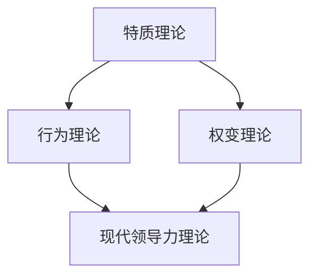

                 

### 文章标题

《领导力训练营：168天从新手到专家》

### 关键词

- 领导力
- 168天训练计划
- 新手到专家
- 技能培养
- 实战案例分析
- 个人成长

### 摘要

本文旨在探讨《领导力训练营：168天从新手到专家》这本书的内容和结构，帮助读者理解领导力的发展路径。文章首先介绍了领导力的重要性以及书中提出的168天训练营的框架，然后详细分析了领导力基础概念、领导者角色与责任、领导力技能培养、实战案例与分析、以及个人成长与领导力提升等关键章节。通过这篇文章，读者可以全面了解领导力的核心概念和培养方法，为自身领导力的提升提供有价值的参考。

### 第一部分：领导力基础知识

#### 第1章 领导力的基本概念与理论

**1.1 领导力的定义与重要性**

领导力是一种激发、指导和影响他人共同达成目标的能力。在企业和组织中，领导力不仅关乎个人成就，更影响着整个团队和组织的效能。领导力的重要性体现在以下几个方面：

1. **激发潜力**：领导力能够激发团队成员的潜能，使其在工作中发挥最大价值。
2. **促进协作**：领导力有助于建立良好的团队关系，增强团队协作能力，从而提高整体效率。
3. **塑造文化**：领导力在塑造组织文化方面具有重要作用，有助于形成积极向上的工作氛围。
4. **推动变革**：领导力能够引领组织面对变化，实现持续创新和发展。

**1.2 领导力的理论框架**

领导力的发展经历了多个阶段，不同学者提出了各种领导力理论。以下是几种主要的领导力理论：

1. **特质理论**：特质理论认为领导者的特质是天生的，包括自信、决断力、正直等。然而，这种理论并未解释为什么某些具备特质的人无法成为有效的领导者。

2. **行为理论**：行为理论关注领导者的行为模式，如任务导向和关系导向。该理论认为，领导者的行为可以影响团队表现，但未解释为何某些行为在不同情境下效果不同。

3. **权变理论**：权变理论认为领导效果取决于领导者、情境和下属特征之间的互动关系。这种理论强调领导力并非一成不变，而是需要根据具体情境进行调整。

4. **现代领导力理论**：现代领导力理论包括转换型领导、参与型领导、服务型领导等。这些理论更关注领导者的行为和影响力，以及如何通过领导力激发团队成员的积极性。

**1.3 领导力的核心概念与联系**

为了更好地理解领导力的概念，我们可以使用Mermaid流程图来展示不同理论之间的联系：

在这个流程图中，我们可以看到特质理论、行为理论、权变理论和现代领导力理论之间的相互关联，这有助于我们全面理解领导力的本质。

#### 第2章 领导者的角色与责任

**2.1 领导者的基本素质**

领导者的素质是领导力成功的关键因素。以下是领导者应具备的基本素质：

1. **沟通能力**：领导者需要具备良好的沟通技巧，包括倾听、表达和情感交流等，以便有效地与团队成员沟通。

2. **决策能力**：领导者需要能够做出明智的决策，考虑各种因素并权衡利弊。

3. **情绪智力**：情绪智力包括自我意识、自我调节、社交意识和情绪运用等，有助于领导者更好地理解和影响他人。

4. **领导力道德**：领导者应具备高尚的道德品质，如正直、诚信和责任感，以树立良好的榜样。

**2.2 领导者的角色与职责**

领导者的角色和职责包括以下几个方面：

1. **引导者**：领导者需要引导团队成员朝着共同的目标前进，提供清晰的方向和指导。

2. **代言人**：领导者代表组织或团队，与外部利益相关者进行沟通和交流。

3. **组织者**：领导者需要组织和管理团队资源，确保项目顺利进行。

4. **目标设定者**：领导者需要设定明确的目标，为团队成员提供方向和动力。

5. **激励者**：领导者需要激励团队成员，激发其工作热情和创造力。

**2.3 领导力的七个层次模型**

领导力发展是一个逐步提升的过程，可以划分为七个层次。以下是这七个层次：

1. **服从领导**：领导者通过权威和命令来指导团队成员。

2. **一致性领导**：领导者通过建立共同价值观和目标来引导团队。

3. **个性化领导**：领导者关注团队成员的个人需求和成长，提供个性化的指导。

4. **合作领导**：领导者与团队成员建立合作关系，共同实现目标。

5. **伙伴型领导**：领导者与团队成员形成紧密的伙伴关系，共同应对挑战。

6. **服务型领导**：领导者将团队成员的需求置于首位，提供支持和帮助。

7. **超越领导**：领导者不仅关注团队内部，还关注外部环境和可持续发展，实现组织的长远发展。

#### 第3章 领导力技能培养

**3.1 沟通技能**

沟通技能是领导者必备的核心技能之一。有效的沟通能够提高团队效率，减少误解和冲突。以下是几个关键沟通技巧：

1. **倾听**：倾听是有效沟通的基础，领导者需要给予团队成员充分的关注和理解。

2. **表达**：领导者需要清晰、明确地表达自己的想法和期望，确保团队成员准确理解。

3. **非言语沟通**：非言语沟通包括肢体语言、面部表情和眼神交流等，领导者需要善于运用这些非言语手段来增强沟通效果。

4. **跨文化沟通**：在全球化的背景下，领导者需要具备跨文化沟通能力，以应对多元文化团队。

**3.2 决策能力**

决策能力是领导者的重要素质之一。以下是几个关键决策能力：

1. **分析问题**：领导者需要能够深入分析问题，找出问题的根本原因。

2. **收集信息**：领导者需要收集与决策相关的信息，包括数据、事实和意见等。

3. **评估选项**：领导者需要对不同的决策选项进行评估，考虑风险和收益。

4. **执行决策**：领导者需要制定明确的执行计划，确保决策得以有效实施。

5. **回顾与评估**：领导者需要回顾决策结果，评估决策效果，并根据反馈进行改进。

**3.3 团队建设**

团队建设是领导者的重要任务之一。以下是几个关键团队建设技能：

1. **建立信任**：领导者需要建立团队成员之间的信任，促进团队协作。

2. **明确目标**：领导者需要明确团队目标，确保团队成员共同努力。

3. **分配任务**：领导者需要合理分配任务，根据团队成员的能力和兴趣进行安排。

4. **提供反馈**：领导者需要及时给予团队成员反馈，鼓励他们持续改进。

5. **解决冲突**：领导者需要善于解决团队内部的冲突，确保团队稳定和谐。

#### 第4章 实战案例与分析

**4.1 领导力实战案例分析**

为了更好地理解领导力在实际应用中的效果，我们可以分析一些成功的领导力案例。以下是一个典型案例：

**案例：谷歌的领导力**

谷歌以其卓越的领导力和企业文化而闻名。谷歌的领导力成功主要归功于以下几个方面：

1. **开放沟通**：谷歌鼓励员工自由表达意见，建立了一个开放、透明的沟通环境。

2. **鼓励创新**：谷歌鼓励员工创新，提供资源和时间，让员工自由探索新的想法。

3. **持续学习**：谷歌重视员工的持续学习和发展，提供各种培训机会和职业发展路径。

4. **员工关怀**：谷歌关注员工的生活和工作，提供良好的福利和灵活的工作制度。

**4.2 领导力应用场景分析**

领导力在不同的应用场景中具有不同的表现。以下是几个领导力应用场景的分析：

1. **企业战略规划**：领导者在企业战略规划中扮演关键角色，需要制定明确的目标和策略，引领企业实现持续发展。

2. **项目管理**：领导者在项目管理中需要协调各方资源，确保项目按计划进行。

3. **团队协作**：领导者在团队协作中需要建立良好的沟通机制，促进团队协作，提高工作效率。

4. **危机管理**：领导者在危机管理中需要保持冷静，制定有效的应对措施，确保组织稳定。

#### 第5章 个人成长与领导力提升

**5.1 自我认知与领导力发展**

个人成长是领导力提升的基础。以下是几个关键自我认知与领导力发展的方法：

1. **反思与总结**：领导者需要定期反思自己的工作，总结经验教训，不断改进。

2. **设定目标**：领导者需要设定明确的个人目标，制定实现目标的计划。

3. **持续学习**：领导者需要保持持续学习的状态，不断提高自己的知识和技能。

4. **自我挑战**：领导者需要勇于接受挑战，尝试新的事物，不断突破自己的舒适区。

**5.2 持续学习与领导力提升**

持续学习是领导力提升的关键。以下是几个持续学习与领导力提升的方法：

1. **参加培训课程**：领导者可以参加各种培训课程，学习新的知识和技能。

2. **阅读专业书籍**：领导者可以阅读专业书籍，了解最新的行业动态和最佳实践。

3. **交流与分享**：领导者可以参加行业交流会，与同行交流经验，分享心得。

4. **实践与反思**：领导者需要在实践中不断尝试，通过反思和总结提高自己的领导力。

**5.3 建立个人品牌与领导力**

建立个人品牌是领导力提升的重要一环。以下是几个建立个人品牌与领导力的方法：

1. **专业形象**：领导者需要树立良好的专业形象，展现自己的专业能力和价值观。

2. **口碑传播**：领导者需要通过口碑传播，提高自己的知名度。

3. **社交媒体**：领导者可以利用社交媒体平台，分享专业见解，建立个人影响力。

4. **参与公益活动**：领导者可以参与公益活动，展现社会责任感，提升个人品牌。

#### 第6章 领导力训练营实践

**6.1 领导力训练营的规划与执行**

领导力训练营是一种系统性的领导力提升方法。以下是领导力训练营的规划与执行步骤：

1. **目标设定**：明确训练营的目标，确保训练营内容与目标一致。

2. **课程设计**：设计符合目标的学习课程，包括理论学习和实践操作。

3. **学员招募**：根据训练营目标，招募合适的学员。

4. **培训实施**：按照课程设计，实施培训活动。

5. **评估反馈**：对训练营效果进行评估，收集学员反馈，不断改进。

**6.2 领导力训练营中的个人反思与改进**

领导力训练营是一个自我提升的过程，学员需要在这个过程中进行个人反思与改进。以下是几个关键步骤：

1. **自我反思**：学员需要定期进行自我反思，总结学习成果和不足之处。

2. **行动计划**：根据自我反思，制定改进行动计划，逐步实现个人成长。

3. **持续学习**：学员需要保持持续学习的状态，不断吸收新的知识和技能。

4. **反馈与改进**：学员需要接受他人的反馈，根据反馈进行改进，提高领导力水平。

**6.3 领导力训练营的评估与反馈**

领导力训练营的评估与反馈是确保训练营效果的重要环节。以下是几个关键步骤：

1. **评估方法**：采用多种评估方法，包括问卷调查、访谈、观察等，全面了解学员的学习效果。

2. **反馈收集**：收集学员和教练的反馈，了解训练营的优点和不足。

3. **改进措施**：根据反馈，制定改进措施，提高训练营的质量和效果。

4. **持续改进**：定期评估和反馈，不断优化训练营内容和方法。

### 总结

通过本文的讨论，我们可以看到《领导力训练营：168天从新手到专家》这本书提供了一个系统性的领导力提升方案，从基础概念、技能培养、实战案例到个人成长，全面覆盖了领导力的各个层面。通过168天的训练计划，读者可以从新手成长为专家，掌握有效的领导力技巧，提升个人和团队的表现。希望本文能够为读者提供有价值的参考，助力领导力的提升。

### 作者信息

作者：AI天才研究院/AI Genius Institute & 禅与计算机程序设计艺术 /Zen And The Art of Computer Programming

