                 

### 文章标题

# 领导力训练营：196天从新手到专家

> 关键词：领导力提升、196天训练营、新手到专家、实践技巧、案例分析、心理建设

> 摘要：
在快速变化的商业环境中，领导力的提升已成为企业成功的关键。本书旨在通过一个为期196天的领导力训练营，帮助读者从新手逐步成长为专家。通过系统的理论讲解、实践技巧分享、案例分析以及心理建设，本书为读者提供了一条清晰、可行的领导力提升路径。

### 设计书籍目录大纲的步骤

为了确保书籍内容的系统性和逻辑性，我们需要按照以下步骤设计书籍目录大纲：

#### 第1步：确定书名与主题

首先，根据用户输入的书名《领导力训练营：196天从新手到专家》，我们需要明确书籍的主题为领导力提升，并将196天作为一个重要的时间节点，强调读者在这个时间框架内能够实现从新手到专家的飞跃。

#### 第2步：梳理书籍结构

接下来，我们需要梳理书籍的整体结构，确定主要包含的几个核心部分。这包括：

1. **领导力基础理论**：介绍领导力的定义、类型和重要性。
2. **领导力实践技巧**：探讨沟通、决策、时间管理等关键技能。
3. **领导力案例解析**：分析成功与失败的领导案例，从中汲取经验。
4. **领导力心理建设**：关注领导者的心理健康和心理素质提升。

#### 第3步：细化章节内容

针对每一部分，我们进一步细化出具体的章节内容，确保每个章节都有明确的学习目标和内容范围。例如：

1. **领导力基础理论**：
   - 第1章：领导力概述
   - 第2章：领导者的自我认知
   - 第3章：领导力模型与理论

2. **领导力实践技巧**：
   - 第4章：沟通与协作
   - 第5章：决策与战略
   - 第6章：领导者的时间管理与优先级

3. **领导力案例解析**：
   - 第7章：成功领导案例
   - 第8章：失败领导案例分析

4. **领导力心理建设**：
   - 第9章：心理素质与领导力
   - 第10章：领导力与心理健康
   - 第11章：压力管理

#### 第4步：完善目录

在细化章节内容后，我们需要对整个目录进行审核，确保每个章节都有清晰的标题，并在必要时添加子章节或附录。同时，我们需要确保整体目录结构的逻辑清晰，方便读者阅读。

#### 第5步：审核与优化

最后，我们对整个目录进行审核，确保内容完整、逻辑清晰，没有遗漏或重复的部分。根据需要进行调整和优化，确保目录能够准确地反映书籍的内容。

### 完整目录大纲

以下是根据上述步骤设计的《领导力训练营：196天从新手到专家》的完整目录大纲：

```
# 《领导力训练营：196天从新手到专家》目录大纲

## 第一部分：领导力基础理论

### 第1章：领导力概述
#### 1.1 领导力的定义与类型
#### 1.2 领导力在组织中的重要性
#### 1.3 领导力的发展历程

### 第2章：领导者的自我认知
#### 2.1 自我认知的重要性
#### 2.2 自我评估与成长
#### 2.3 自我认知与领导力提升

### 第3章：领导力模型与理论
#### 3.1 领导力模型的分类
#### 3.2 常见的领导力理论
#### 3.3 案例研究：领导力模型的应用

## 第二部分：领导力实践技巧

### 第4章：沟通与协作
#### 4.1 有效沟通技巧
#### 4.2 协作机制与团队建设
#### 4.3 沟通与协作的实践案例

### 第5章：决策与战略
#### 5.1 决策过程与策略
#### 5.2 战略规划与实施
#### 5.3 决策与战略的实践案例

### 第6章：领导者的时间管理与优先级
#### 6.1 时间管理的原则与方法
#### 6.2 优先级管理
#### 6.3 时间管理与优先级的实践案例

## 第三部分：领导力案例解析

### 第7章：成功领导案例
#### 7.1 国内成功领导案例
#### 7.2 国际成功领导案例
#### 7.3 成功领导案例的启示

### 第8章：失败领导案例分析
#### 8.1 失败原因分析
#### 8.2 启示与反思
#### 8.3 领导力提升的策略

## 第四部分：领导力心理建设

### 第9章：心理素质与领导力
#### 9.1 心理素质的重要性
#### 9.2 提升心理素质的方法
#### 9.3 心理素质与领导力的关系

### 第10章：领导力与心理健康
#### 10.1 领导者的心理健康
#### 10.2 心理健康对领导力的影响
#### 10.3 心理健康促进策略

### 第11章：压力管理
#### 11.1 压力来源与应对策略
#### 11.2 压力管理的实践案例
#### 11.3 压力管理与领导力提升

## 附录
### 附录A：领导力提升资源与工具
#### A.1 领导力书籍推荐
#### A.2 领导力培训课程
#### A.3 领导力实践工具

### 附录B：领导力测试问卷
#### B.1 自我认知问卷
#### B.2 领导力能力评估问卷
#### B.3 领导风格评估问卷
```

此目录大纲基于196天的训练营时间框架，确保每个部分的学习目标和实践建议都能够在有限的时间内得到充分覆盖。通过这样的系统设计，读者将能够在196天的训练营中全面提升自己的领导力。

### 第一部分：领导力基础理论

#### 第1章：领导力概述

**1.1 领导力的定义与类型**

领导力是一个复杂而多层次的概念，其定义因不同的学者和研究视角而有所不同。一般来说，领导力可以被视为一种影响他人共同实现目标的能力。这种能力不仅仅局限于企业的管理层，它广泛存在于各种社会和组织结构中。

在类型上，领导力可以分为：

1. **交易型领导力**：依赖于明确的奖励和惩罚机制来激励团队成员。
2. **变革型领导力**：通过激发团队成员的内在动机，鼓励创新和进步。
3. **服膺型领导力**：基于个人的魅力和价值观来影响他人。
4. **服务型领导力**：以服务团队成员为中心，关注团队的整体福祉。

**1.2 领导力在组织中的重要性**

领导力在组织中的重要性不容忽视。有效的领导力能够推动组织的创新、提高团队凝聚力、增强员工忠诚度，并最终提升组织的竞争力。以下是领导力在组织中的一些关键作用：

1. **制定战略和愿景**：领导者需要为企业设定清晰的战略目标和愿景，引导组织朝着正确的方向前进。
2. **激励和指导团队**：领导者通过激励和指导团队成员，帮助他们实现个人和组织的目标。
3. **决策和解决问题**：领导者需要具备良好的决策能力，能够在复杂和不确定的环境中做出正确的决策。
4. **建立团队文化**：领导者通过塑造积极向上的团队文化，促进团队成员之间的合作和信任。

**1.3 领导力的发展历程**

领导力的发展历程可以追溯到古代的军事领导和宗教领袖。随着社会和组织的演变，领导力的理论和方法也在不断发展和完善。

1. **早期领导力理论**：如领导特质理论，强调领导者的个性特征和能力。
2. **行为理论**：关注领导者的行为和风格，认为领导力可以通过学习和模仿来培养。
3. **情境理论**：强调领导力应根据具体情境来调整，不存在一成不变的领导风格。
4. **当代领导力理论**：如变革型领导力和服务型领导力，强调领导者的长远视野和团队导向。

**核心概念与联系：**

为了更好地理解领导力的概念，我们需要梳理几个核心概念之间的关系，这包括：

1. **领导力与权力**：领导力不仅仅是权力的运用，更是对团队成员的影响和激励。
2. **领导力与影响力**：领导力是影响力的体现，通过建立信任和共识来推动组织的发展。
3. **领导力与变革**：领导者需要具备变革思维，能够引领组织适应外部环境的变化。

**Mermaid 流程图：**

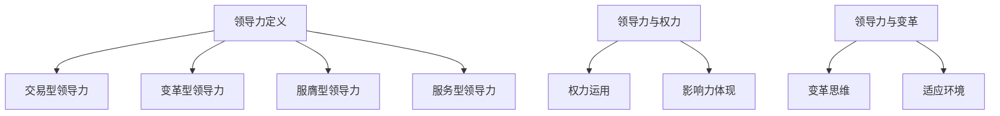

**核心算法原理讲解：**

在领导力的培养过程中，没有特定的算法可以一蹴而就，但以下是一些通用的策略和原则：

1. **自我认知**：领导者需要了解自己的优势和弱点，明确个人发展目标。
2. **情境适应**：领导者应根据不同的情境和团队成员的特点来调整领导风格。
3. **团队建设**：领导者需要注重团队建设，培养团队成员的协作精神和归属感。

**数学模型和公式：**

虽然领导力不是一门精确的科学，但以下模型和公式可以提供一些指导：

$$\text{领导力} = \text{自我认知} + \text{情境适应} + \text{团队建设}$$

**详细讲解与举例说明：**

1. **自我认知**：例如，通过360度反馈来了解自己的领导风格和影响力。
2. **情境适应**：例如，在危机管理中采用更加果断和决策性的领导风格。
3. **团队建设**：例如，通过定期的团队活动和培训来增强团队成员的凝聚力。

#### 第2章：领导者的自我认知

**2.1 自我认知的重要性**

领导者的自我认知是领导力提升的基础。只有深入了解自己的优势和弱点，领导者才能制定合适的发展计划，并在实际工作中进行调整和改进。

**2.2 自我评估与成长**

自我评估是领导者自我认知的重要手段。通过定期的自我评估，领导者可以了解自己的行为模式、领导风格和影响力。以下是一些自我评估的方法：

1. **360度反馈**：收集来自团队成员、上级和其他利益相关者的反馈，全面了解自己的领导力表现。
2. **自我反思**：定期花时间反思自己的行为和决策，分析成功和失败的原因。
3. **行为观察**：通过观察自己在不同情境下的行为和反应，了解自己的领导风格和习惯。

**2.3 自我认知与领导力提升**

自我认知不仅是了解自己的过程，更是提升领导力的关键。以下是一些策略，帮助领导者通过自我认知提升领导力：

1. **设定个人发展目标**：根据自我评估的结果，设定具体、可衡量的个人发展目标。
2. **持续学习和成长**：通过参加培训、阅读书籍、交流经验等方式，不断学习新知识和技能。
3. **实践与反思**：将学到的知识和技能应用到实际工作中，通过实践和反思不断提升自己的领导能力。

**核心概念与联系：**

领导者的自我认知与其他核心概念之间存在紧密的联系，包括：

1. **领导力与自我认知**：自我认知是领导力的基础，只有深入了解自己，才能更好地发挥领导作用。
2. **情境与自我认知**：不同的情境下，领导者的自我认知会有所不同，这直接影响领导力的发挥。
3. **自我评估与团队建设**：通过自我评估，领导者可以更好地了解团队成员的需求和期望，从而进行更有效的团队建设。

**Mermaid 流�程图：**

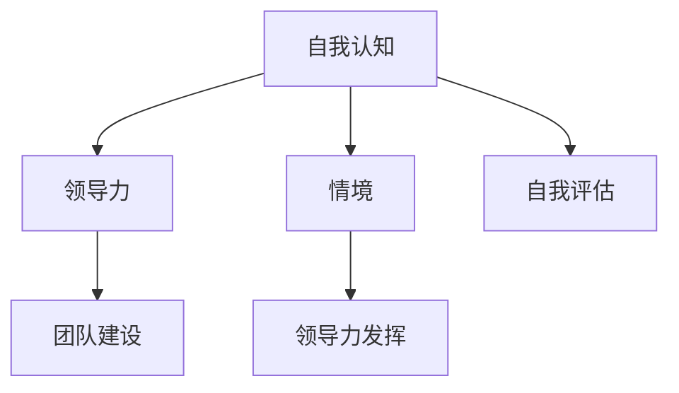

**核心算法原理讲解：**

领导者的自我认知可以通过以下步骤进行：

1. **收集反馈**：通过360度反馈等方式收集来自不同角度的反馈。
2. **分析反馈**：对反馈进行分析，识别自己的优势和弱点。
3. **设定目标**：根据分析结果，设定个人发展目标。
4. **实践与反思**：将目标付诸实践，通过反思不断调整和优化。

**数学模型和公式：**

$$\text{自我认知} = \text{反馈收集} + \text{反馈分析} + \text{目标设定} + \text{实践反思}$$

**详细讲解与举例说明：**

1. **反馈收集**：例如，通过定期的员工反馈会议，了解团队成员对自己的看法。
2. **反馈分析**：例如，将反馈结果进行分类和总结，识别出主要的优势和弱点。
3. **目标设定**：例如，根据分析结果，设定提升沟通技巧或团队管理能力的具体目标。
4. **实践与反思**：例如，通过参加沟通技巧培训和实践项目，不断调整自己的领导方式。

#### 第3章：领导力模型与理论

**3.1 领导力模型的分类**

领导力模型是对领导行为和风格的理论化描述，有助于我们理解和培养有效的领导力。常见的领导力模型包括：

1. **路径-目标模型**：强调领导者通过设定清晰的目标和提供指导，帮助团队成员实现目标。
2. **领导生活周期模型**：认为领导风格应随着团队成员成熟度的变化而调整。
3. **情境领导模型**：根据团队成员的不同特点和情境，选择最合适的领导风格。

**3.2 常见的领导力理论**

除了领导力模型，还有一些经典的领导力理论，为我们提供了理解领导力的不同视角：

1. **特质理论**：认为领导者天生具备某些特质，如自信、决断力和责任感。
2. **行为理论**：强调领导行为的重要性，认为领导力可以通过学习和模仿来培养。
3. **影响力理论**：关注领导者如何影响他人，包括使用权力、建立信任和激发动机等。

**3.3 案例研究：领导力模型的应用**

以下是一个关于领导力模型应用的案例研究：

**案例：某科技公司的领导力转型**

在某科技公司，领导者意识到传统的权威型领导风格已经无法适应快速变化的商业环境。为了提升团队的绩效和创新力，他们决定采用变革型领导力模型。

首先，领导者通过沟通和培训，明确公司的愿景和战略目标。然后，他们鼓励团队成员参与决策过程，激发他们的内在动机。此外，领导者还注重团队建设，通过定期的团队活动和培训，增强团队成员之间的信任和协作。

在变革型领导力的引导下，该公司在短时间内实现了显著的绩效提升和创新能力。团队成员更加积极主动，公司业绩持续增长。

**核心概念与联系：**

领导力模型和理论之间存在着紧密的联系和相互作用。以下是一些核心概念的联系：

1. **领导力模型与情境**：不同的领导力模型适用于不同的情境，领导者需要根据具体情境选择最合适的模型。
2. **领导力理论与发展**：领导力理论为我们提供了理解领导力的基础，而领导力模型则是将这些理论应用于实践的工具。
3. **模型与理论的应用**：通过案例研究，我们可以看到领导力模型和理论在实际应用中的效果，以及如何根据实际情况进行调整。

**Mermaid 流程图：**

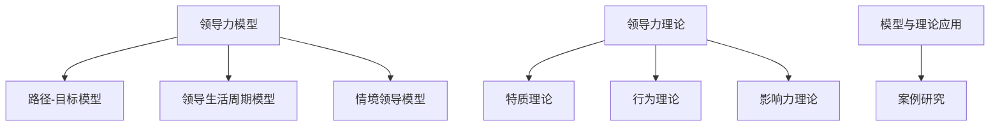

**核心算法原理讲解：**

领导力模型和理论的应用可以遵循以下步骤：

1. **理解模型和理论**：深入了解各种领导力模型和理论，理解它们的核心理念和适用情境。
2. **分析具体情境**：根据组织的实际情况和团队特点，分析最合适的领导力模型和理论。
3. **应用模型和理论**：在实际工作中应用领导力模型和理论，通过实践检验其效果，并根据反馈进行调整。

**数学模型和公式：**

虽然领导力不是一门精确的科学，但以下模型和公式可以提供一些指导：

$$\text{领导力模型应用} = \text{理解模型} + \text{分析情境} + \text{实践应用} + \text{反馈调整}$$

**详细讲解与举例说明：**

1. **理解模型和理论**：例如，通过阅读相关书籍和研究论文，了解路径-目标模型的核心理念。
2. **分析具体情境**：例如，通过团队会议和问卷调查，分析团队成员的成熟度和需求。
3. **应用模型和理论**：例如，在项目启动阶段采用路径-目标模型，明确目标和提供指导。
4. **反馈调整**：例如，根据团队成员的反馈和项目进展情况，调整领导风格和策略。

### 第二部分：领导力实践技巧

#### 第4章：沟通与协作

**4.1 有效沟通技巧**

有效沟通是领导力的重要组成部分，它不仅影响团队成员之间的协作，还决定了领导者的决策效果。以下是一些关键的有效沟通技巧：

1. **倾听**：倾听不仅仅是听别人说什么，更包括理解对方的意图和感受。领导者应该积极倾听，鼓励团队成员表达自己的观点和需求。
2. **清晰表达**：领导者需要用简洁明了的语言表达自己的想法，避免使用复杂或模糊的术语，确保信息的准确传达。
3. **反馈**：及时的反馈能够帮助团队成员了解自己的表现，从而进行改进。领导者应该提供具体、建设性的反馈，鼓励团队成员的持续进步。
4. **非言语沟通**：肢体语言、面部表情和语调等非言语沟通方式在信息传递中起着重要作用。领导者应该注意自己的非言语表达，确保其与言语信息一致。

**4.2 协作机制与团队建设**

协作机制和团队建设是提升团队效率和凝聚力的关键。以下是一些有效的协作机制和团队建设策略：

1. **明确目标**：确保团队成员都清楚团队的目标和期望，这样可以减少误解和冲突。
2. **分工合作**：根据团队成员的能力和兴趣进行合理分工，确保每个人都能在自己的岗位上发挥最大作用。
3. **定期会议**：定期召开团队会议，讨论项目进展、问题和挑战，确保团队成员之间的沟通畅通。
4. **团队活动**：组织定期的团队活动，如团建、培训等，增强团队成员之间的信任和合作。
5. **共享资源**：鼓励团队成员共享资源，如工具、知识和经验，提高整体工作效率。

**4.3 沟通与协作的实践案例**

以下是一个关于沟通与协作的实践案例：

**案例：某公司的跨部门协作**

某公司负责产品开发、市场推广和客户服务三个部门的领导者在项目启动时，意识到跨部门协作的重要性。他们决定采取以下措施：

1. **建立沟通渠道**：设立专门的跨部门沟通渠道，如定期例会和在线协作平台，确保各部门之间的信息畅通。
2. **明确职责**：为每个部门设定清晰的责任范围，确保每个人都了解自己的职责和任务。
3. **团队建设**：组织跨部门团队建设活动，如团队拓展训练，增强团队成员之间的信任和合作。
4. **共享资源**：通过共享市场和客户数据，提高整个团队的决策效率和市场响应速度。

通过这些措施，该公司的跨部门协作得到了显著改善，项目进度加快，客户满意度提高。

**核心概念与联系：**

沟通与协作是领导力实践中的重要组成部分，它们与其他核心概念之间存在紧密的联系：

1. **沟通与领导力**：有效的沟通是领导力的重要体现，领导者通过沟通来激励、指导和协调团队成员。
2. **协作与团队建设**：协作机制和团队建设是提升团队效率和凝聚力的重要手段，它们直接影响组织的整体绩效。
3. **目标与协作**：明确的目标是协作的基石，只有当团队成员都清楚目标时，才能更好地协同工作。

**Mermaid 流程图：**

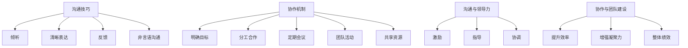

**核心算法原理讲解：**

沟通与协作的实践可以遵循以下步骤：

1. **建立沟通机制**：设立有效的沟通渠道和机制，确保信息畅通。
2. **明确目标和职责**：确保团队成员都清楚目标和工作职责。
3. **开展团队建设活动**：通过团队活动增强团队成员之间的信任和合作。
4. **共享资源和经验**：鼓励团队成员共享资源和经验，提高整体工作效率。

**数学模型和公式：**

虽然沟通与协作不是一门精确的科学，但以下模型和公式可以提供一些指导：

$$\text{沟通与协作} = \text{建立机制} + \text{明确目标} + \text{团队建设} + \text{资源共享}$$

**详细讲解与举例说明：**

1. **建立沟通机制**：例如，设立每周的跨部门会议，确保各部门之间的信息共享和问题解决。
2. **明确目标和职责**：例如，在项目启动时明确每个团队成员的具体任务和目标。
3. **开展团队建设活动**：例如，组织定期的团建活动和培训，增强团队成员之间的默契。
4. **共享资源和经验**：例如，建立知识库和经验分享平台，鼓励团队成员共享最佳实践和成功经验。

#### 第5章：决策与战略

**5.1 决策过程与策略**

有效的决策是领导者的一项关键能力。一个良好的决策过程不仅能够提高决策的质量，还能增强团队的信任和合作。以下是一个典型的决策过程及其策略：

1. **问题识别**：首先，领导者需要明确问题的性质和范围。这可以通过数据收集、市场调研、员工反馈等方式实现。
2. **信息收集**：在明确问题后，领导者需要收集相关的信息，包括数据、市场趋势、竞争对手的情况等。
3. **方案评估**：在收集到足够的信息后，领导者需要评估不同的解决方案。这可以通过成本效益分析、风险评估等方法进行。
4. **决策制定**：在评估方案后，领导者需要根据信息和分析结果做出决策。这应该是一个理性且综合考虑的过程。
5. **执行与反馈**：决策制定后，领导者需要确保决策能够得到有效执行，并在执行过程中不断收集反馈，以便进行必要的调整。

**5.2 战略规划与实施**

战略规划是确保组织长期成功的关键。以下是一些关键的战略规划与实施策略：

1. **愿景和使命**：组织需要有一个清晰的愿景和使命，这为组织的长远发展指明了方向。
2. **市场分析**：领导者需要对市场进行深入分析，了解市场需求、竞争对手和潜在的机会与威胁。
3. **目标设定**：在市场分析的基础上，组织需要设定具体、可衡量的目标，确保组织的发展方向明确。
4. **资源分配**：根据目标和战略，领导者需要合理分配资源，确保每个目标和项目都能得到足够的支持。
5. **监控与调整**：在战略实施过程中，领导者需要不断监控进展，并根据实际情况进行必要的调整。

**5.3 决策与战略的实践案例**

以下是一个关于决策与战略的实践案例：

**案例：某公司的市场进入决策**

某公司在考虑进入一个新的市场时，采取了以下决策和战略：

1. **问题识别**：公司意识到现有市场已经趋于饱和，需要寻找新的增长点。
2. **信息收集**：公司通过市场调研和竞争对手分析，发现一个新的市场潜力巨大。
3. **方案评估**：公司评估了多种进入新市场的策略，包括直接进入、合作进入和合资等。
4. **决策制定**：公司决定采用直接进入策略，并在新的市场上迅速建立了自己的品牌。
5. **执行与反馈**：公司在新的市场上推出了一系列营销活动，并通过定期评估和调整，确保策略的有效执行。

通过这个案例，我们可以看到决策与战略在组织发展中的关键作用。有效的决策和战略不仅能够帮助组织抓住新的市场机会，还能确保组织的持续增长和竞争力。

**核心概念与联系：**

决策与战略是领导力实践中的重要部分，它们与其他核心概念之间存在紧密的联系：

1. **决策与领导力**：有效的决策是领导力的体现，领导者通过决策来指导组织的发展方向。
2. **战略与愿景**：战略规划是基于组织的愿景和目标制定的，确保组织的长远发展。
3. **执行与反馈**：决策和战略的有效执行需要持续的监控和调整，通过反馈机制来不断优化。

**Mermaid 流程图：**

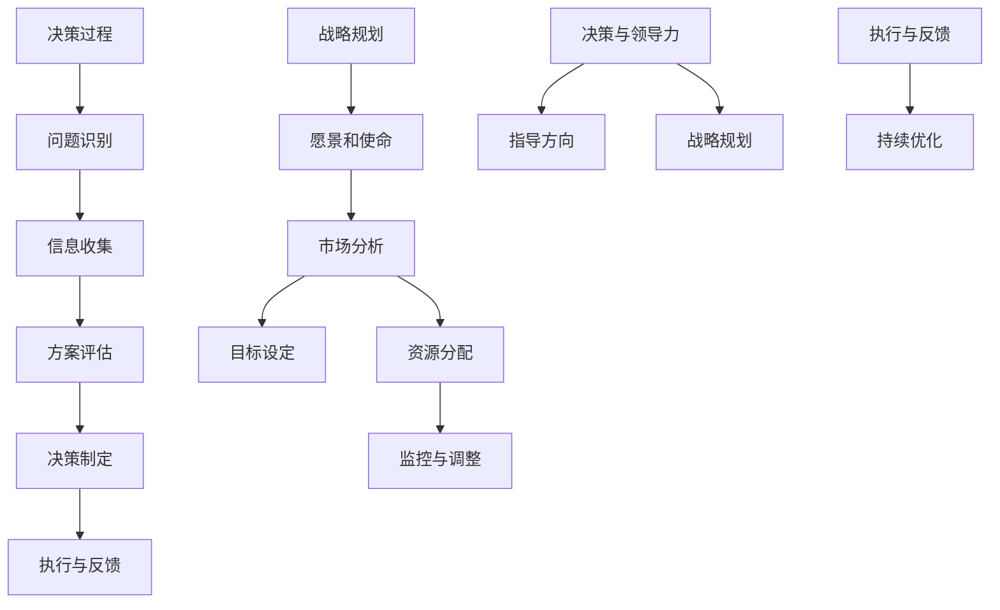

**核心算法原理讲解：**

决策与战略的制定和执行可以遵循以下步骤：

1. **明确问题和目标**：首先，领导者需要明确组织面临的问题和需要达成的目标。
2. **收集和分析信息**：通过市场调研、数据分析和竞争对手分析，收集和分析相关信息。
3. **评估方案和制定决策**：在评估不同方案后，根据信息和分析结果制定决策。
4. **制定战略并实施**：根据决策结果，制定具体的战略规划并确保其得到有效执行。
5. **监控和反馈**：在战略实施过程中，持续监控进展，并根据反馈进行必要的调整。

**数学模型和公式：**

虽然决策和战略不是一门精确的科学，但以下模型和公式可以提供一些指导：

$$\text{决策与战略} = \text{明确问题} + \text{信息收集} + \text{方案评估} + \text{决策制定} + \text{战略规划} + \text{监控与反馈}$$

**详细讲解与举例说明：**

1. **明确问题和目标**：例如，公司决定进入新市场，明确问题是如何找到新的增长点。
2. **收集和分析信息**：例如，通过市场调研和数据分析，了解新市场的需求和竞争情况。
3. **评估方案和制定决策**：例如，评估多种进入新市场的策略，选择最佳方案。
4. **制定战略并实施**：例如，根据决策结果，制定详细的市场进入计划并实施。
5. **监控和反馈**：例如，定期评估市场表现，根据反馈调整营销策略和活动。

#### 第6章：领导者的时间管理与优先级

**6.1 时间管理的原则与方法**

时间管理是领导者的一项基本技能，有效的时间管理能够提高工作效率，减少压力，确保重要任务的完成。以下是一些时间管理的原则和方法：

1. **明确目标和优先级**：领导者需要明确自己的工作目标和优先级，将精力集中在最重要和最紧急的任务上。
2. **规划时间表**：制定合理的时间表，包括日常任务、项目计划和长期目标，确保时间得到有效利用。
3. **避免拖延**：及时处理任务，避免拖延，确保任务按时完成。
4. **减少干扰**：在工作时减少干扰，如关闭不必要的社交媒体通知，专注于当前任务。
5. **分块时间**：将时间分为小块，专注于每个小块内的任务，提高工作效率。

**6.2 优先级管理**

优先级管理是时间管理的核心，它决定了领导者的时间和精力应该投向哪些任务。以下是一些优先级管理的策略：

1. **紧急-重要矩阵**：使用紧急-重要矩阵，将任务分为四个象限，分别表示紧急且重要、紧急但不重要、不紧急但重要、不紧急且不重要。领导者应优先处理紧急且重要的任务，其次是不紧急但重要的任务。
2. **任务分解**：将复杂的任务分解为多个小任务，每个小任务都有明确的优先级，确保每个任务都能按时完成。
3. **定期评估**：定期评估任务进展和优先级，根据实际情况进行调整，确保资源得到最佳利用。

**6.3 时间管理与优先级的实践案例**

以下是一个关于时间管理与优先级管理的实践案例：

**案例：某项目经理的时间管理实践**

某项目经理在使用时间管理和优先级管理策略后，显著提高了工作效率。以下是他的具体做法：

1. **明确目标和优先级**：项目经理在每周的开始，明确本周的目标和任务，并根据紧急性和重要性将其分为不同的优先级。
2. **规划时间表**：项目经理制定了详细的时间表，包括每日的任务和时间分配，确保每个任务都有足够的时间完成。
3. **避免拖延**：项目经理设置了提醒和截止日期，确保任务按时完成，避免拖延。
4. **减少干扰**：在工作期间，项目经理关闭了不必要的电子邮件和社交媒体通知，专注于当前任务。
5. **任务分解**：对于复杂的任务，项目经理将其分解为多个小任务，每个小任务都有明确的优先级和截止日期。

通过这些策略，项目经理不仅提高了工作效率，还减少了工作压力，确保了项目的按时完成。

**核心概念与联系：**

时间管理与优先级管理是领导力实践中的重要组成部分，它们与其他核心概念之间存在紧密的联系：

1. **时间管理与领导力**：时间管理是领导者的一项基本技能，它直接影响领导者的工作效率和团队绩效。
2. **优先级管理与决策**：优先级管理是决策过程中的一部分，领导者需要根据任务的紧急性和重要性进行合理分配。
3. **效率与团队绩效**：有效的时间管理和优先级管理能够提高团队的工作效率，从而提升整体绩效。

**Mermaid 流程图：**

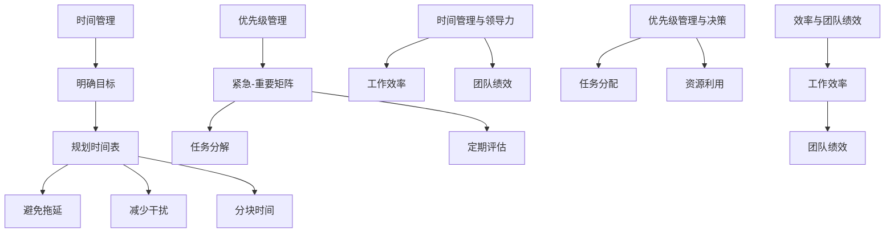

**核心算法原理讲解：**

时间管理和优先级管理可以遵循以下步骤：

1. **明确目标和优先级**：根据工作目标和任务的重要性，设定明确的优先级。
2. **规划时间表**：制定详细的时间表，确保每个任务都有足够的时间完成。
3. **避免拖延**：设置提醒和截止日期，确保任务按时完成。
4. **减少干扰**：在工作期间，减少不必要的干扰，提高专注度。
5. **任务分解**：将复杂任务分解为小任务，每个小任务都有明确的优先级和截止日期。
6. **定期评估**：定期评估任务进展和优先级，根据实际情况进行调整。

**数学模型和公式：**

虽然时间管理和优先级管理不是一门精确的科学，但以下模型和公式可以提供一些指导：

$$\text{时间管理} = \text{明确目标} + \text{规划时间表} + \text{避免拖延} + \text{减少干扰} + \text{任务分解} + \text{定期评估}$$
$$\text{优先级管理} = \text{紧急-重要矩阵} + \text{任务分解} + \text{定期评估}$$

**详细讲解与举例说明：**

1. **明确目标和优先级**：例如，项目经理在一周开始时，明确本周需要完成的关键任务和优先级。
2. **规划时间表**：例如，制定每日的时间表，确保每个任务都有明确的时间安排。
3. **避免拖延**：例如，设置每日任务的提醒和截止日期，确保任务按时完成。
4. **减少干扰**：例如，在工作期间关闭不必要的电子邮件和社交媒体通知，专注于当前任务。
5. **任务分解**：例如，将一个复杂的项目分解为多个小任务，每个小任务都有明确的优先级和截止日期。
6. **定期评估**：例如，每周进行一次任务进展的评估，根据实际情况调整优先级和时间表。

### 第三部分：领导力案例解析

#### 第7章：成功领导案例

**7.1 国内成功领导案例**

在国内，有许多领导者在各自领域取得了显著的成就。以下是一些国内成功领导案例：

**案例1：阿里巴巴的马云**

马云是中国互联网界的传奇人物，他领导下的阿里巴巴从一家小型的电子商务公司成长为全球最大的零售电商平台之一。马云的成功得益于他的愿景和领导力。

1. **愿景和使命**：马云始终坚信电子商务的未来，并为此设定了明确的愿景和使命，即让天下没有难做的生意。
2. **创新思维**：马云鼓励创新和尝试，不畏惧失败，这种开放和包容的领导风格吸引了大量优秀的人才。
3. **员工激励**：马云注重员工的成长和福利，通过股权激励和员工培训，提高了员工的归属感和忠诚度。

**案例2：华为的任正非**

华为的创始人任正非以其独特的领导风格和管理理念，带领华为成为全球领先的科技公司。以下是任正非的成功秘诀：

1. **军事化管理**：任正非借鉴军队的管理模式，强调纪律和执行力，使华为在竞争激烈的市场中保持高效的运作。
2. **客户导向**：任正非始终将客户需求放在首位，以客户为中心，不断优化产品和服务。
3. **长期投资**：华为在研发和技术创新方面投入巨资，这为其在技术创新和市场竞争中保持领先地位提供了有力支持。

**7.2 国际成功领导案例**

在国际上，也有许多领导者在不同领域取得了卓越的成就。以下是一些国际成功领导案例：

**案例1：苹果的史蒂夫·乔布斯**

史蒂夫·乔布斯是苹果公司的联合创始人，他以其创新和领导力，将苹果公司从濒临破产的边缘带到全球科技巨头的地位。

1. **设计思维**：乔布斯强调产品设计和用户体验，他的设计思维影响了苹果公司的产品风格和品牌形象。
2. **愿景和执行力**：乔布斯以其远见和执行力，推动苹果公司在产品创新和市场拓展方面取得了巨大成功。
3. **员工文化**：乔布斯注重培养员工的创新精神和工作热情，使苹果公司成为一个充满活力和创新的企业。

**案例2：亚马逊的杰夫·贝佐斯**

亚马逊的创始人杰夫·贝佐斯以其卓越的商业头脑和创新精神，将亚马逊发展成为全球最大的在线零售平台。

1. **长期愿景**：贝佐斯始终注重长期愿景，他相信通过不断的技术创新和业务拓展，亚马逊能够在未来成为全球最大的零售商。
2. **客户体验**：贝佐斯将客户体验放在首位，不断优化购物流程和物流服务，提升客户满意度。
3. **技术创新**：贝佐斯强调技术创新，通过云计算、人工智能等技术的应用，提升了亚马逊的竞争力和市场地位。

**7.3 成功领导案例的启示**

从以上成功领导案例中，我们可以得出一些有益的启示：

1. **愿景和使命**：领导者需要具备远见和使命感，为组织设定清晰的目标和方向。
2. **创新思维**：领导者应鼓励创新和尝试，不断推动组织的发展。
3. **员工激励**：领导者需要关注员工的成长和福利，提高员工的归属感和忠诚度。
4. **客户导向**：领导者应将客户需求放在首位，不断提升产品和服务质量。
5. **执行力**：领导者需要具备强大的执行力，确保组织的战略和决策得到有效执行。

**核心概念与联系：**

成功领导案例为我们提供了丰富的经验和启示，它们与其他核心概念之间存在紧密的联系：

1. **领导力与成功**：成功领导案例展示了领导力在组织成功中的关键作用。
2. **创新与成长**：创新思维是领导者推动组织成长和发展的核心动力。
3. **员工激励与团队建设**：员工激励和团队建设是提升组织绩效和竞争力的重要手段。
4. **客户导向与市场地位**：客户需求和市场地位是领导者制定战略和决策的重要依据。

**Mermaid 流程图：**

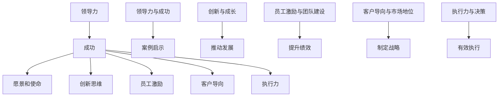

**核心算法原理讲解：**

成功领导案例的解析可以遵循以下步骤：

1. **案例选择**：选择具有代表性的成功领导案例。
2. **分析案例**：分析案例中的领导力要素、创新思维、员工激励、客户导向和执行力。
3. **总结启示**：总结案例中的成功经验，提炼出可以应用于其他组织的领导力原则。
4. **应用启示**：将案例中的启示应用于实际工作，提升自身的领导力和组织绩效。

**数学模型和公式：**

虽然领导力案例解析不是一门精确的科学，但以下模型和公式可以提供一些指导：

$$\text{领导力案例解析} = \text{案例选择} + \text{分析案例} + \text{总结启示} + \text{应用启示}$$

**详细讲解与举例说明：**

1. **案例选择**：例如，选择阿里巴巴的马云作为领导力案例。
2. **分析案例**：分析马云的愿景和使命、创新思维、员工激励和执行力。
3. **总结启示**：总结马云的成功经验，如愿景和使命的重要性、创新思维的价值等。
4. **应用启示**：将马云的成功经验应用于自身的领导实践中，如设定清晰的愿景和目标、鼓励创新和尝试、关注员工激励等。

### 第8章：失败领导案例分析

**8.1 失败原因分析**

在领导力的发展过程中，失败案例同样具有重要价值。通过分析失败领导案例，我们可以识别出导致失败的主要原因，从而避免在未来的领导实践中犯同样的错误。以下是一些常见的失败原因：

1. **缺乏愿景和目标**：没有明确的愿景和目标，领导者容易在决策过程中迷失方向，导致组织无法实现长期发展。
2. **缺乏执行力**：即使制定了战略和计划，如果没有有效的执行，一切都将化为泡影。缺乏执行力会导致战略无法落实，从而影响组织的绩效。
3. **忽视员工需求**：领导者如果忽视员工的需求和福利，会导致员工流失和士气低落，最终影响组织的稳定和发展。
4. **过度依赖个人能力**：有些领导者过于依赖个人的能力和经验，忽视团队协作和集体智慧，这可能导致组织在面临复杂挑战时无法有效应对。
5. **缺乏创新思维**：在快速变化的市场环境中，缺乏创新思维会导致组织在竞争中处于劣势，最终导致失败。

**8.2 启示与反思**

通过对失败领导案例的分析，我们可以得到以下启示和反思：

1. **明确愿景和目标**：领导者需要明确组织的愿景和目标，确保组织在正确的方向上不断前进。
2. **提升执行力**：领导者需要具备强大的执行力，确保战略和计划得到有效执行。
3. **关注员工需求**：领导者应关注员工的需求和福利，培养团队的凝聚力和合作精神。
4. **发挥团队协作**：领导者应重视团队协作，鼓励集体智慧和多元化思维，提高组织的创新能力和竞争力。
5. **培养创新思维**：领导者应培养创新思维，鼓励尝试和探索，以应对快速变化的市场环境。

**8.3 领导力提升的策略**

为了避免失败，领导者可以采取以下策略来提升自身的领导力：

1. **持续学习和成长**：领导者应保持持续学习和成长的心态，不断提升自己的知识和技能。
2. **建立有效的沟通机制**：领导者需要建立有效的沟通机制，确保信息畅通，减少误解和冲突。
3. **培养团队精神**：领导者应注重团队建设，培养员工的团队合作精神，提高组织的整体绩效。
4. **关注心理健康**：领导者应关注自身的心理健康，保持良好的心态和情绪，以应对工作压力和挑战。
5. **适应变化**：领导者应具备快速适应变化的能力，灵活调整战略和决策，以应对市场的变化。

**核心概念与联系：**

失败领导案例分析是领导力发展的重要组成部分，它与其他核心概念之间存在紧密的联系：

1. **失败与成功**：失败是成功的前提，通过分析失败案例，我们可以识别出导致失败的原因，从而避免在未来犯同样的错误。
2. **领导力与执行力**：领导力是组织成功的关键，而执行力是领导力的重要组成部分，领导者需要具备强大的执行力。
3. **员工需求与团队建设**：关注员工的需求和福利是提升团队绩效和凝聚力的重要手段。
4. **创新思维与市场适应**：在快速变化的市场环境中，领导者需要具备创新思维，以适应市场的变化和挑战。

**Mermaid 流程图：**

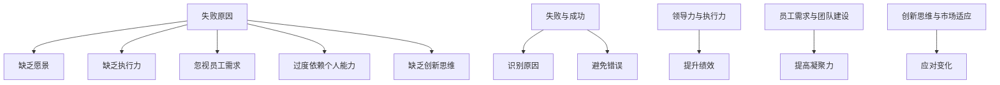

**核心算法原理讲解：**

失败领导案例分析可以遵循以下步骤：

1. **案例收集**：收集具有代表性的失败领导案例。
2. **原因分析**：分析案例中的失败原因，识别导致失败的关键因素。
3. **启示提炼**：总结案例中的教训，提炼出可以应用于其他组织的领导力原则。
4. **策略制定**：根据启示和教训，制定提升领导力的具体策略。

**数学模型和公式：**

虽然领导力案例解析不是一门精确的科学，但以下模型和公式可以提供一些指导：

$$\text{失败领导案例分析} = \text{案例收集} + \text{原因分析} + \text{启示提炼} + \text{策略制定}$$

**详细讲解与举例说明：**

1. **案例收集**：例如，收集某公司的领导力失败案例，如战略执行不力或员工流失严重。
2. **原因分析**：分析案例中的失败原因，如战略决策失误或管理不善。
3. **启示提炼**：总结案例中的教训，如重视员工培训和激励，避免战略决策失误。
4. **策略制定**：根据启示，制定提升领导力的策略，如加强员工培训和团队建设。

### 第四部分：领导力心理建设

#### 第9章：心理素质与领导力

**9.1 心理素质的重要性**

心理素质是领导力的重要组成部分，它直接影响领导者的决策、沟通和执行力。良好的心理素质包括自我认知、情绪调节、压力管理和决策能力。以下是心理素质在领导力中的重要性：

1. **自我认知**：领导者需要了解自己的优点和缺点，这有助于他们更好地发挥自己的优势，并针对自己的不足进行改进。
2. **情绪调节**：领导者需要能够有效地调节自己的情绪，避免在压力和挑战面前失去理智。情绪稳定有助于维持团队的士气和工作氛围。
3. **压力管理**：领导者在面对工作压力和挑战时，需要具备良好的压力管理能力，以保持高效的工作状态和清晰的思路。
4. **决策能力**：心理素质良好的领导者能够更理性地分析问题，做出明智的决策，从而推动组织的发展。

**9.2 提升心理素质的方法**

为了提升心理素质，领导者可以采取以下方法：

1. **自我反思**：定期进行自我反思，了解自己的心理状态和行为模式，识别需要改进的方面。
2. **专业培训**：参加相关的心理素质培训课程，学习情绪调节、压力管理和决策能力的技巧。
3. **锻炼身体**：保持良好的身体状态，通过体育锻炼来释放压力，提高心理素质。
4. **心理咨询**：在面对心理困扰时，寻求专业心理咨询，解决心理问题，提升心理素质。

**9.3 心理素质与领导力的关系**

心理素质与领导力之间存在紧密的联系。良好的心理素质有助于领导者更有效地发挥领导作用，提升团队绩效和组织发展。以下是一个具体的例子：

**案例：某公司的心理素质提升计划**

某公司在意识到心理素质对领导力的重要性后，实施了一系列心理素质提升计划。这些计划包括：

1. **心理培训**：定期为领导者提供心理培训，教授情绪调节和压力管理的技巧。
2. **团队活动**：组织团队活动，增强领导者之间的信任和协作。
3. **心理辅导**：为领导者提供心理辅导服务，帮助他们解决心理问题，提升心理素质。

通过这些措施，该公司领导者的心理素质得到了显著提升，团队凝聚力和工作效率也显著提高，公司业绩持续增长。

**核心概念与联系：**

心理素质与领导力之间的关系可以概括为：

1. **心理素质与领导力**：心理素质是领导力的重要组成部分，良好的心理素质有助于领导者更有效地发挥领导作用。
2. **情绪调节与决策**：情绪调节能力直接影响领导者的决策质量和执行力。
3. **压力管理与团队绩效**：良好的压力管理能力有助于提升团队绩效和组织发展。

**Mermaid 流程图：**

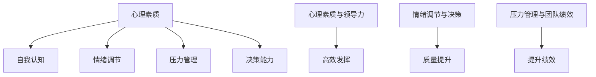

**核心算法原理讲解：**

提升心理素质的方法可以遵循以下步骤：

1. **自我反思**：定期进行自我反思，识别自己的心理状态和行为模式。
2. **专业培训**：参加心理培训课程，学习情绪调节和压力管理的技巧。
3. **身体锻炼**：保持良好的身体状态，通过体育锻炼来释放压力。
4. **心理辅导**：在需要时寻求专业心理咨询，解决心理问题。

**数学模型和公式：**

虽然心理素质提升不是一门精确的科学，但以下模型和公式可以提供一些指导：

$$\text{心理素质提升} = \text{自我反思} + \text{专业培训} + \text{身体锻炼} + \text{心理辅导}$$

**详细讲解与举例说明：**

1. **自我反思**：例如，领导者每周花时间反思自己的情绪和行为，识别需要改进的方面。
2. **专业培训**：例如，领导者参加情绪调节和压力管理的培训课程，提升相关技能。
3. **身体锻炼**：例如，领导者每天进行适量的体育锻炼，如跑步或瑜伽，以释放压力。
4. **心理辅导**：例如，领导者面临心理困扰时，寻求专业心理咨询，解决心理问题。

#### 第10章：领导力与心理健康

**10.1 领导者的心理健康**

心理健康是领导者有效履行职责的基础。良好的心理健康有助于领导者更好地应对工作压力和挑战，提高决策质量和团队绩效。以下是领导者心理健康的一些关键因素：

1. **情绪稳定性**：领导者需要具备情绪稳定性，避免在压力和挑战面前失去理智。情绪稳定性有助于维持团队的士气和工作氛围。
2. **心理健康**：领导者需要关注自己的心理健康，包括心理健康问题和心理健康水平。心理健康问题如焦虑、抑郁等，会严重影响领导者的工作效率和决策能力。
3. **压力管理**：领导者需要具备良好的压力管理能力，学会有效地应对工作压力，保持身心健康。

**10.2 心理健康对领导力的影响**

心理健康对领导力有着深远的影响。良好的心理健康有助于领导者：

1. **提高决策质量**：心理健康良好的领导者能够更理性地分析问题，做出更明智的决策。
2. **增强沟通能力**：心理健康良好的领导者能够更有效地沟通，减少误解和冲突，提高团队的协作效率。
3. **提升团队绩效**：心理健康良好的领导者能够营造积极的工作氛围，提高团队的凝聚力和工作效率，从而提升整体绩效。

**10.3 心理健康促进策略**

为了促进领导者的心理健康，可以采取以下策略：

1. **建立健康的工作环境**：组织应提供健康的工作环境，如合理的工作时间、弹性的工作安排和良好的工作氛围。
2. **提供心理支持**：组织应提供心理支持，包括心理咨询服务和心理健康培训，帮助领导者解决心理问题，提升心理健康水平。
3. **鼓励身心健康**：组织应鼓励领导者保持身心健康，如定期进行体检、提供健身设施和安排健康讲座等。

**案例：某公司的心理健康促进计划**

某公司意识到心理健康对领导力的重要性，实施了一系列心理健康促进计划。这些计划包括：

1. **心理咨询服务**：为领导者提供心理咨询服务，帮助他们解决心理问题，提升心理健康水平。
2. **心理健康培训**：定期为领导者提供心理健康培训，教授情绪调节和压力管理的技巧。
3. **健康福利**：提供健康福利，如健身设施和健康检查，鼓励领导者保持身心健康。

通过这些措施，该公司的领导者心理健康水平显著提升，团队绩效和整体满意度也得到提高。

**核心概念与联系：**

领导力与心理健康之间存在着紧密的联系：

1. **领导力与心理健康**：心理健康是领导力的重要组成部分，良好的心理健康有助于领导者更有效地履行职责。
2. **决策质量与情绪稳定性**：情绪稳定性直接影响决策质量，良好的情绪稳定性有助于领导者做出明智的决策。
3. **团队绩效与心理健康**：心理健康良好的领导者能够营造积极的工作氛围，提高团队的凝聚力和工作效率，从而提升整体绩效。

**Mermaid 流程图：**

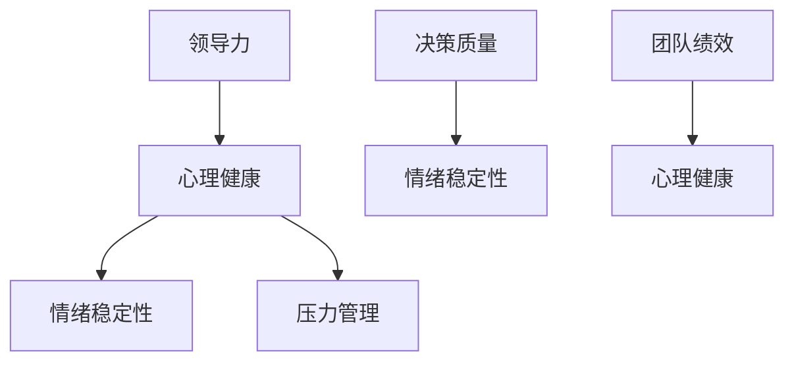

**核心算法原理讲解：**

促进领导者的心理健康可以遵循以下步骤：

1. **建立健康的工作环境**：确保领导者有合理的工作时间和弹性的工作安排。
2. **提供心理支持**：为领导者提供心理咨询服务和心理健康培训。
3. **鼓励身心健康**：提供健康福利和健康讲座，鼓励领导者保持身心健康。

**数学模型和公式：**

虽然心理健康促进不是一门精确的科学，但以下模型和公式可以提供一些指导：

$$\text{心理健康促进} = \text{健康工作环境} + \text{心理支持} + \text{身心健康鼓励}$$

**详细讲解与举例说明：**

1. **建立健康的工作环境**：例如，公司提供灵活的工作时间和良好的工作氛围，鼓励员工平衡工作与生活。
2. **提供心理支持**：例如，公司为领导者提供心理咨询服务，帮助解决心理问题，提升心理健康水平。
3. **鼓励身心健康**：例如，公司提供健身设施和健康检查，鼓励领导者定期进行体检和锻炼。

#### 第11章：压力管理

**11.1 压力来源与应对策略**

压力是领导者工作中常见的现象，有效的压力管理对于维持心理健康和提高工作效率至关重要。以下是压力的主要来源和应对策略：

**压力来源：**

1. **工作压力**：高工作强度、长期加班和紧迫的项目期限是导致压力的主要因素。
2. **人际关系**：与团队成员、上级和同事之间的冲突和误解也可能导致压力。
3. **个人生活**：家庭问题、健康问题和个人生活变化也是压力的重要来源。
4. **工作-生活平衡**：难以平衡工作和个人生活，导致工作和生活压力的双重压力。

**应对策略：**

1. **时间管理**：合理安排时间，优先处理重要和紧急的任务，避免过度劳累。
2. **情绪调节**：学会有效地管理情绪，如通过冥想、深呼吸等方法减轻压力。
3. **寻求支持**：与同事、家人和朋友交流，寻求他们的建议和支持，共同应对压力。
4. **健康生活**：保持健康的生活习惯，如定期锻炼、合理饮食和充足的睡眠，提高抗压能力。

**11.2 压力管理的实践案例**

以下是一个关于压力管理的实践案例：

**案例：某公司的压力管理计划**

某公司为了帮助员工有效管理压力，实施了一系列压力管理计划。这些计划包括：

1. **心理健康咨询**：为员工提供心理健康咨询服务，帮助他们解决心理问题，减轻压力。
2. **员工辅导计划**：为员工提供个人辅导，帮助他们应对工作压力和个人生活挑战。
3. **团队建设活动**：定期组织团队建设活动，增强员工之间的信任和协作，减轻工作压力。

通过这些措施，该公司的员工压力水平显著降低，工作效率和满意度也得到提高。

**11.3 压力管理与领导力提升**

有效的压力管理不仅有助于提高领导者的心理健康和工作效率，还能提升领导力。以下是压力管理与领导力提升之间的联系：

1. **情绪稳定性**：压力管理良好的领导者能够更好地控制情绪，避免在压力面前失去理智，保持冷静和清晰的思路。
2. **决策质量**：压力管理有助于领导者更理性地分析问题，做出更明智的决策，从而提升领导力。
3. **团队协作**：压力管理良好的领导者能够更好地处理团队冲突和误解，促进团队协作，提升团队绩效。

**核心概念与联系：**

压力管理是领导力的重要组成部分，它与心理健康、情绪稳定性和决策质量之间存在紧密的联系：

1. **压力管理与心理健康**：有效的压力管理有助于提高心理健康水平，减轻心理压力。
2. **情绪稳定性与领导力**：情绪稳定性是领导力的关键因素，有助于领导者更好地发挥领导作用。
3. **决策质量与团队协作**：有效的压力管理有助于提高决策质量和团队协作，提升领导力和组织绩效。

**Mermaid 流程图：**

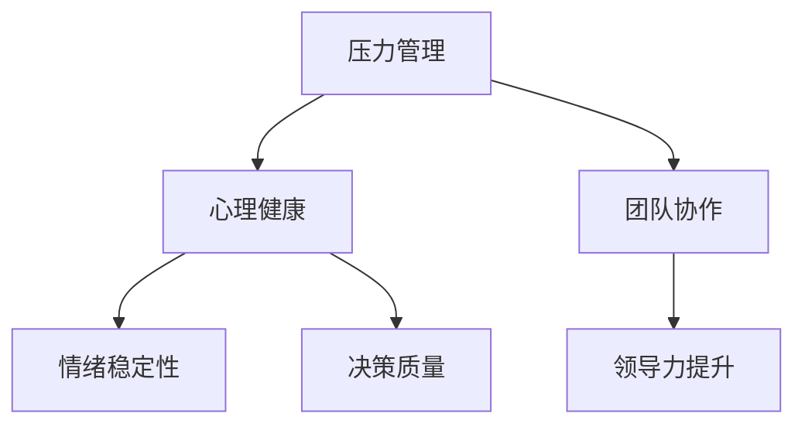

**核心算法原理讲解：**

压力管理可以遵循以下步骤：

1. **识别压力来源**：分析导致压力的主要因素，如工作压力、人际关系和个人生活问题。
2. **制定应对策略**：根据压力来源，制定具体的应对策略，如时间管理、情绪调节和寻求支持。
3. **实践与调整**：将应对策略付诸实践，并根据实际情况进行调整和优化。

**数学模型和公式：**

虽然压力管理不是一门精确的科学，但以下模型和公式可以提供一些指导：

$$\text{压力管理} = \text{识别压力来源} + \text{制定应对策略} + \text{实践与调整}$$

**详细讲解与举例说明：**

1. **识别压力来源**：例如，领导者分析工作压力的主要原因，如项目期限和团队冲突。
2. **制定应对策略**：例如，领导者制定时间管理计划，合理安排工作任务，减少工作压力。
3. **实践与调整**：例如，领导者定期评估压力管理效果，根据反馈调整应对策略。

### 附录

#### 附录A：领导力提升资源与工具

为了帮助读者进一步学习和提升领导力，以下是一些推荐的资源和工具：

1. **领导力书籍推荐**：
   - 《领导力五项修炼》
   - 《变革之舞》
   - 《领导者的影响力》

2. **领导力培训课程**：
   - “哈佛商学院领导力课程”
   - “领导力发展与执行课程”
   - “领导力与变革管理”

3. **领导力实践工具**：
   - 时间管理工具（如Trello、Asana）
   - 沟通工具（如Slack、Microsoft Teams）
   - 心理健康工具（如Moodmeter、Headspace）

#### 附录B：领导力测试问卷

为了帮助读者评估自己的领导力水平和找到提升的方向，以下是一个领导力测试问卷：

1. **自我认知问卷**：
   - 我能够清楚地了解自己的优势和劣势。
   - 我能够在工作中保持积极的态度和情绪。
   - 我能够有效地管理时间和任务。

2. **领导力能力评估问卷**：
   - 我能够激励和鼓舞团队成员。
   - 我能够有效地沟通和协调团队成员。
   - 我能够在团队中建立信任和协作。

3. **领导风格评估问卷**：
   - 我认为我在团队中更倾向于采用授权型领导风格。
   - 我认为我在团队中更倾向于采用参与型领导风格。
   - 我认为我在团队中更倾向于采用指导型领导风格。

通过这些测试问卷，读者可以了解自己的领导力水平和风格，并制定相应的提升计划。

### 作者信息

作者：AI天才研究院/AI Genius Institute & 禅与计算机程序设计艺术/Zen And The Art of Computer Programming

### 小结

本文通过系统地梳理和分析了领导力训练营的核心内容，从领导力基础理论、实践技巧到案例分析，再到心理建设和压力管理，为读者提供了一条清晰、可行的领导力提升路径。通过196天的训练营，读者可以逐步从新手成长为专家，掌握领导力的核心要素和实用技巧。希望本文能够为读者在领导力提升的道路上提供有价值的指导和帮助。

### 注意事项

1. **定期复习**：领导力提升是一个持续的过程，需要定期复习和巩固所学知识。
2. **实践应用**：将所学知识和技巧应用到实际工作中，通过实践检验和优化。
3. **寻求反馈**：定期向团队成员和上级寻求反馈，了解自己的领导力提升情况，并据此进行调整。

### 拓展阅读

1. **《领导力心理学》**：深入探讨领导力与心理学之间的联系，提供实用的心理学工具和方法。
2. **《领导者的语言》**：分析领导者在沟通中的语言和行为模式，提升领导者的沟通能力。
3. **《领导者的战略思维》**：探讨领导者在战略规划中的思维方式和方法，提升战略思维能力。

通过拓展阅读，读者可以更全面地了解领导力的各个方面，进一步提升自己的领导力水平。

