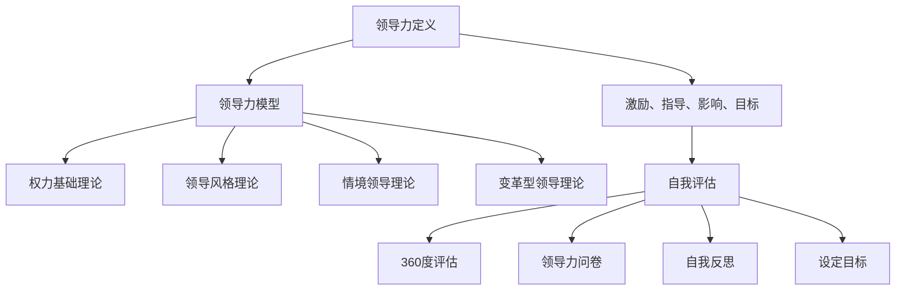

```mermaid
graph TD
    A[沟通技能] --> B[有效沟通要素]
    A --> C[沟通障碍与解决方法]
    A --> D[情感智能应用]

    E[决策能力] --> F[决策过程]
    E --> G[决策工具与方法]
    E --> H[风险评估与应对策略]

    I[团队管理] --> J[团队建设原则]
    I --> K[团队协作技巧]
    I --> L[团队领导艺术]

    B --> M[清晰表达]
    B --> N[积极倾听]
    B --> O[非语言沟通]
    B --> P[情境适应性]

    C --> Q[语言障碍]
    C --> R[文化差异]
    C --> S[情绪干扰]
    C --> T[信息过载]

    D --> U[自我认知]
    D --> V[同理心]
    D --> W[情绪管理]

    F --> X[问题识别]
    F --> Y[信息收集]
    F --> Z[方案评估]
    F --> AA[方案选择]
    F --> AB[决策实施]
    F --> AC[结果评估]

    J --> AD[明确目标]
    J --> AE[信任与尊重]
    J --> AF[分工合作]
    J --> AG[激励与支持]
    J --> AH[持续反馈]

    K --> AI[沟通技巧]
    K --> AJ[冲突管理]
    K --> AK[决策协作]
    K --> AL[共同目标]

    L --> AM[领导风格]
    L --> AN[激励与引导]
    L --> AO[培养团队文化]
    L --> AP[持续学习与改进]
```
                 

### 文章标题

《领导力训练营：30天从门外汉到内行人》

### 文章关键词

领导力，训练营，门外汉，内行人，成长，实践，策略，发展，沟通，决策，团队管理，案例分析，心理学

### 文章摘要

本文旨在通过30天的系统学习和实践，帮助读者从领导力的门外汉成长为内行人。文章分为三大部分：领导力基础、领导力核心技能、领导力发展策略。通过详细的章节内容，介绍领导力的定义、重要性、模型、核心技能（如沟通、决策、团队管理），以及领导力发展策略和实践。最后，通过实战演练和案例分析，进一步巩固读者对领导力知识的理解和应用。本文采用逻辑清晰、结构紧凑、简单易懂的写作风格，适合希望提升领导力的专业人士阅读。

## 第一部分：领导力基础

### 第1章：领导力的定义与重要性

#### 1.1 领导力的基本概念

领导力是一种复杂而多维的概念，通常指引导、激励和影响他人共同实现目标的能力。这一概念涵盖的范围广泛，既包括正式的权威角色，如公司总裁或团队主管，也包含非正式的角色，如团队中的积极成员或志愿者领袖。领导力不仅仅是管理他人的能力，它更是一种综合性的能力，涉及沟通、决策、战略规划、团队建设和自我管理等各个方面。

#### 1.1.1 领导力的定义

领导力可以简单定义为：通过激励、指导和影响他人，共同实现组织或团队目标的能力。这个定义强调了几个关键要素：激励、指导、影响和目标。激励是指通过激发个人内在动机，使团队成员积极投入工作；指导则是通过明确目标、制定计划和提供支持，帮助团队成员明确方向和完成任务；影响是通过言行举止，使团队成员产生认同感和归属感，从而共同努力实现目标。

#### 1.1.2 领导力的重要性

领导力在组织和个人发展中扮演着至关重要的角色。以下是领导力重要性的几个方面：

1. **提升组织效能**：有效的领导力可以激发团队成员的潜力，提高工作效率和创造力，从而提升组织的整体效能。
2. **实现目标**：领导力是确保团队朝着既定目标前进的关键因素。通过有效的领导，团队可以更迅速、更高效地实现组织目标。
3. **团队凝聚力**：领导力有助于建立团队成员之间的信任和尊重，增强团队凝聚力，使团队更具协作性和战斗力。
4. **个人成长**：领导力不仅对组织有益，也对个人成长大有裨益。通过领导力实践，个人可以提升自己的沟通、决策和问题解决能力，从而实现职业生涯的快速发展。
5. **变革推动**：领导力在应对变革和危机时尤为重要。有效的领导能够引导团队适应变化，克服困难，实现可持续发展。

#### 1.2 领导力模型

领导力模型是描述领导行为和效果的理论框架。不同的领导力模型有助于我们理解领导力的本质和不同领导风格的特点。以下是几种常见的领导力模型：

1. **权力基础理论**：该理论认为领导者的权力来源于其个人特质、职位权威、专业知识和关系网络。根据权力来源的不同，领导者可以采取不同的领导策略。
   
2. **领导风格理论**：领导风格理论关注领导者如何影响和激励团队成员。常见的领导风格包括权威型、民主型、参与型和教练型等。每种风格都有其适用场景和优缺点。

3. **情境领导理论**：该理论认为领导风格应根据团队成员的能力和动机来调整。领导者需要根据情境的变化，灵活运用不同的领导风格，以达到最佳效果。

4. **变革型领导理论**：变革型领导强调领导者通过激发团队成员的积极性和创造力，推动组织实现变革。这种领导风格有助于应对复杂和不确定的环境，推动组织持续发展。

#### 1.3 自我评估

自我评估是了解和提升领导力的第一步。以下是一些常用的自我评估工具和步骤：

1. **360度评估**：通过收集来自上级、同事、下属和客户的反馈，全面了解自己的领导风格、优点和不足。

2. **领导力问卷**：使用标准化的问卷，如MLQ（多维度领导问卷）或LHQ（领导力行为问卷），评估自己在不同领导维度上的表现。

3. **自我反思**：定期进行自我反思，回顾自己的领导行为和结果，识别成功和失败的案例，总结经验教训。

4. **设定目标**：根据自我评估的结果，设定具体的领导力提升目标，并制定相应的行动计划。

### 总结

本章介绍了领导力的基本概念和重要性，并探讨了不同领导力模型和自我评估方法。通过本章的学习，读者将建立对领导力的初步认识，并为后续章节的学习和实践打下基础。

### Mermaid 流程图



### 伪代码

```python
# 领导力定义与重要性评估
def leadership_definition():
    # 激励、指导、影响、目标四个要素
    print("领导力定义：激励、指导、影响、目标")

# 领导力模型分析
def leadership_model_analysis():
    # 权力基础理论、领导风格理论、情境领导理论、变革型领导理论
    print("领导力模型：权力基础理论、领导风格理论、情境领导理论、变革型领导理论")

# 自我评估流程
def self_evaluation():
    # 360度评估、领导力问卷、自我反思、设定目标
    print("自我评估流程：360度评估、领导力问卷、自我反思、设定目标")

# 主函数
def main():
    leadership_definition()
    leadership_model_analysis()
    self_evaluation()

main()
```

## 第2章：领导力核心技能

### 2.1 沟通技能

#### 2.1.1 有效沟通的要素

有效沟通是领导力的重要组成部分，是实现领导目标的关键技能。有效沟通的要素包括清晰的表达、积极的倾听、非语言沟通和情境适应性。

1. **清晰的表达**：清晰的表达是指通过明确、简洁、逻辑性强的方式传达信息。领导者应避免使用模糊、含糊不清的词汇，以确保信息的准确传达。
   
2. **积极的倾听**：积极的倾听是理解他人观点和需求的关键。领导者应全身心投入倾听，关注对方的表达，并在必要时给予反馈，以确保双方的理解一致。

3. **非语言沟通**：非语言沟通包括面部表情、肢体语言、语调等。领导者应学会通过非语言手段表达自己的态度和情感，以增强沟通效果。

4. **情境适应性**：不同的情境需要不同的沟通策略。领导者应根据具体情况调整自己的沟通方式，以实现最佳效果。

#### 2.1.2 沟通障碍与解决方法

在沟通过程中，障碍是不可避免的。以下是一些常见的沟通障碍及其解决方法：

1. **语言障碍**：不同的人可能使用不同的语言或词汇，导致信息传递不准确。解决方法：确保使用通用语言，避免使用专业术语或方言。

2. **文化差异**：不同文化背景的人可能对同一信息有不同的理解和解读。解决方法：了解和尊重不同文化的沟通习惯，避免文化冲突。

3. **情绪干扰**：情绪可能会影响沟通的效果。解决方法：领导者应学会控制自己的情绪，避免将个人情绪带入沟通过程中。

4. **信息过载**：过多的信息可能导致沟通效率低下。解决方法：领导者应学会筛选和提炼关键信息，确保信息传递的简洁性。

#### 2.1.3 情感智能在沟通中的应用

情感智能（Emotional Intelligence，简称EQ）是指识别、理解、管理自己和他人的情绪，以及使用这些信息指导自己的思维和行动的能力。在领导力中，情感智能具有重要意义，以下是其在沟通中的应用：

1. **自我认知**：领导者应了解自己的情绪状态，并学会通过自我调节来管理情绪，以确保沟通的冷静和理性。

2. **同理心**：领导者应学会站在他人的角度理解情绪，以建立信任和共鸣。

3. **情绪管理**：领导者应学会在沟通中表达情感，同时避免情绪失控，以确保沟通的顺利进行。

### 2.2 决策能力

#### 2.2.1 决策过程

决策是领导力的核心技能之一，是领导者实现组织目标的关键步骤。一个完整的决策过程通常包括以下几个阶段：

1. **问题识别**：识别问题和挑战，明确决策的目标和范围。

2. **信息收集**：收集与决策相关的信息，包括数据、意见和反馈。

3. **方案评估**：分析各种可能的解决方案，评估其优缺点和可行性。

4. **方案选择**：根据评估结果，选择最佳的解决方案。

5. **决策实施**：制定实施计划，并确保执行过程顺利。

6. **结果评估**：评估决策结果，并根据反馈进行必要的调整。

#### 2.2.2 决策工具与方法

在决策过程中，领导者可以运用多种工具和方法来提高决策的质量和效率。以下是一些常见的决策工具和方法：

1. **成本效益分析**：比较不同方案的成本和收益，选择最具成本效益的方案。

2. **SWOT分析**：分析项目的优势、劣势、机会和威胁，以确定最佳方案。

3. **决策树**：使用树状图表示不同决策路径和结果，帮助领导者评估风险和回报。

4. **群体决策**：通过集体讨论和协商，提高决策的多样性和全面性。

#### 2.2.3 风险评估与应对策略

在决策过程中，风险是不可避免的。领导者应学会评估和管理风险，以降低决策失败的可能性。以下是几种常见的风险评估和应对策略：

1. **风险识别**：识别可能的风险因素，包括项目本身的特性和外部环境的变化。

2. **风险评估**：评估风险的概率和影响，确定风险等级。

3. **风险应对**：制定应对策略，包括风险规避、风险转移、风险减轻和风险接受。

4. **风险监控**：在决策实施过程中，持续监控风险的变化，并根据实际情况进行调整。

### 2.3 团队管理

#### 2.3.1 团队建设原则

团队管理是领导力的核心技能之一，是确保团队高效协作和实现目标的关键。以下是团队建设的一些基本原则：

1. **明确目标**：确保团队成员明确团队的共同目标，并理解各自的角色和责任。

2. **信任与尊重**：建立团队成员之间的信任和尊重，促进团队合作和沟通。

3. **分工合作**：根据团队成员的能力和特长，合理分配任务，确保任务的高效完成。

4. **激励与支持**：为团队成员提供必要的激励和支持，激发其积极性和创造力。

5. **持续反馈**：通过定期的反馈和评估，帮助团队成员了解自己的表现，并提供改进建议。

#### 2.3.2 团队协作技巧

团队协作是团队管理的核心，以下是一些提高团队协作效率的技巧：

1. **沟通技巧**：提高团队成员之间的沟通效率，确保信息准确传达和及时反馈。

2. **冲突管理**：学会处理团队内部的冲突，确保团队关系的和谐和稳定。

3. **决策协作**：通过集体讨论和协商，共同做出决策，增强团队的凝聚力和认同感。

4. **共同目标**：确保团队成员明确共同的目标和愿景，以激发团队的共同奋斗精神。

#### 2.3.3 团队领导的艺术

团队领导不仅仅是管理和指导团队，更是一种艺术。以下是团队领导的一些艺术：

1. **领导风格**：根据团队的特点和环境，选择合适的领导风格，如民主型、权威型、参与型等。

2. **激励与引导**：通过激励和引导，激发团队成员的内在动力，实现自我管理。

3. **培养团队文化**：建立积极的团队文化，增强团队成员的归属感和认同感。

4. **持续学习与改进**：不断学习和改进自己的领导技能，以适应不断变化的环境和挑战。

### 总结

本章介绍了领导力的核心技能，包括沟通技能、决策能力和团队管理。通过学习和实践这些技能，领导者可以更有效地激励和引导团队，实现组织目标。

### Mermaid 流程图



### 伪代码

```python
# 沟通技能
def communication_skills():
    # 有效沟通要素
    print("有效沟通要素：清晰表达、积极倾听、非语言沟通、情境适应性")

    # 沟通障碍与解决方法
    print("沟通障碍与解决方法：语言障碍、文化差异、情绪干扰、信息过载")

    # 情感智能在沟通中的应用
    print("情感智能在沟通中的应用：自我认知、同理心、情绪管理")

# 决策能力
def decision_making():
    # 决策过程
    print("决策过程：问题识别、信息收集、方案评估、方案选择、决策实施、结果评估")

    # 决策工具与方法
    print("决策工具与方法：成本效益分析、SWOT分析、决策树、群体决策")

    # 风险评估与应对策略
    print("风险评估与应对策略：风险识别、风险评估、风险应对、风险监控")

# 团队管理
def team_management():
    # 团队建设原则
    print("团队建设原则：明确目标、信任与尊重、分工合作、激励与支持、持续反馈")

    # 团队协作技巧
    print("团队协作技巧：沟通技巧、冲突管理、决策协作、共同目标")

    # 团队领导艺术
    print("团队领导艺术：领导风格、激励与引导、培养团队文化、持续学习与改进")

# 主函数
def main():
    communication_skills()
    decision_making()
    team_management()

main()
```

## 第3章：领导力发展策略

### 3.1 领导力发展计划

#### 3.1.1 制定个人发展计划

个人发展计划是领导力提升的关键步骤。一个有效的个人发展计划应包括以下几个要素：

1. **目标设定**：明确个人发展目标，包括短期和长期目标。短期目标应具体、可量化，而长期目标则应具有挑战性和可实现性。

2. **能力评估**：通过自我评估和360度反馈，了解自己的优势和不足，明确需要提升的领域。

3. **学习资源**：确定学习资源，包括书籍、课程、研讨会等，以确保有足够的知识和技能支持个人发展。

4. **时间规划**：为个人发展计划设定具体的时间表，确保能够持续学习和实践。

5. **反馈机制**：建立反馈机制，定期评估个人发展进展，并根据反馈进行调整。

#### 3.1.2 持续学习与自我提升

持续学习是领导力发展的核心。以下是几种有效的学习方法：

1. **阅读**：阅读相关书籍、文章和案例，扩展知识面和视野。

2. **培训**：参加专业培训和研讨会，学习最新的领导力理论和实践。

3. **实践**：通过实际工作和项目，将理论知识应用到实践中，提高领导力水平。

4. **反思**：定期进行自我反思，总结经验和教训，不断提高自己。

5. **网络学习**：利用网络资源，如在线课程、论坛和博客，与其他领导者和专家交流学习。

#### 3.1.3 建立个人品牌

个人品牌是领导者的重要资产，有助于提升个人影响力和职业发展。以下是一些建立个人品牌的策略：

1. **专业形象**：维护专业的形象和言行，树立良好的职业形象。

2. **社交媒体**：利用社交媒体平台，如LinkedIn、微博等，展示自己的专业知识和领导力实践。

3. **写作和演讲**：通过写作和演讲，分享自己的见解和经验，建立个人权威和影响力。

4. **网络关系**：建立广泛的人脉网络，与他人建立深度联系，扩大个人品牌的影响力。

5. **贡献与回馈**：通过参与社区活动和公益项目，为社会贡献自己的力量，提升个人形象和品牌价值。

### 3.2 领导力实践

#### 3.2.1 实践中的问题与挑战

在领导力实践中，领导者常常面临各种问题和挑战。以下是一些常见的问题和解决策略：

1. **团队协作问题**：团队成员之间的沟通不畅、合作不力，可能导致项目失败。解决策略：加强团队建设，提高沟通效率，建立共同的目标和愿景。

2. **决策困难**：在复杂和不确定的环境下，领导者可能面临难以做出的决策。解决策略：运用决策工具和方法，进行风险评估和应对策略制定，提高决策质量。

3. **员工激励问题**：员工缺乏动力和积极性，可能导致工作效率低下。解决策略：通过激励计划和奖励机制，激发员工的内在动力，提高工作热情。

4. **冲突管理**：团队内部出现冲突，影响团队和谐和项目进展。解决策略：采用有效的冲突管理技巧，如倾听、协商和妥协，解决冲突，维护团队稳定。

#### 3.2.2 问题解决策略

在领导力实践中，领导者需要具备问题解决能力，以应对各种挑战。以下是一些常见的问题解决策略：

1. **明确问题**：首先，领导者需要明确问题的本质和范围，确保问题得到准确的理解和定义。

2. **收集信息**：通过调查、访谈和数据分析，收集与问题相关的信息，以便进行全面的分析。

3. **分析问题**：对收集到的信息进行分析，找出问题的根本原因，制定针对性的解决方案。

4. **制定计划**：根据问题分析结果，制定详细的行动计划，包括实施步骤、时间表和责任分配。

5. **执行计划**：按照行动计划执行，确保每个步骤都得到落实，并监控执行过程，及时调整和纠正。

6. **评估结果**：在问题解决后，对解决方案的效果进行评估，总结经验教训，为未来问题的解决提供参考。

### 3.3 领导力与组织发展

#### 3.3.1 领导力对组织文化的影响

组织文化是组织成员的共同价值观、信念和行为规范，对组织的发展和绩效具有重要影响。有效的领导力能够塑造和强化组织文化，以下是领导力对组织文化的影响：

1. **价值观传承**：领导者通过言行和决策，将组织的核心价值观传递给团队成员，确保组织文化的持续发展。

2. **行为规范**：领导者通过自身的榜样作用，影响团队成员的行为规范，建立积极向上的组织氛围。

3. **创新氛围**：领导者鼓励创新和实验，营造开放和包容的组织文化，推动组织持续创新和进步。

4. **员工满意度**：有效的领导力能够提高员工的工作满意度，增强员工的归属感和忠诚度，促进组织文化的形成和巩固。

#### 3.3.2 领导力在组织变革中的作用

组织变革是组织持续发展的重要途径，而领导力在组织变革中扮演着关键角色。以下是领导力在组织变革中的作用：

1. **愿景引领**：领导者通过清晰表达和传达组织变革的愿景，激发团队成员的变革意识和积极性。

2. **沟通协调**：领导者通过有效的沟通和协调，解决变革过程中出现的矛盾和冲突，确保变革的顺利进行。

3. **激励与支持**：领导者通过激励和支持，帮助团队成员克服变革过程中的困难和挑战，确保变革目标的实现。

4. **领导变革**：领导者带头参与变革，树立榜样，推动团队成员积极行动，实现组织变革的目标。

#### 3.3.3 领导力与组织效能的关系

领导力与组织效能密切相关，有效的领导力能够显著提高组织的绩效和竞争力。以下是领导力与组织效能的关系：

1. **团队效能**：领导者通过提升团队协作和沟通能力，提高团队的整体效能，实现组织目标。

2. **员工效能**：领导者通过激励和支持，提高员工的工作动力和技能水平，提高员工个人的效能。

3. **组织效能**：领导者通过有效的战略规划和管理，优化组织结构和流程，提高组织的整体效能。

4. **竞争优势**：领导者通过创新和变革，提高组织的适应能力和竞争力，在市场中保持优势地位。

### 总结

本章介绍了领导力发展策略，包括制定个人发展计划、持续学习与自我提升、实践中的问题与挑战以及领导力与组织发展。通过本章的学习，读者将能够制定有效的领导力发展计划，应对实践中的挑战，并提升组织的整体效能。

### Mermaid 流程图

```mermaid
graph TD
    A[领导力发展计划] --> B[制定个人发展计划]
    A --> C[持续学习与自我提升]
    A --> D[建立个人品牌]

    B --> E[目标设定]
    B --> F[能力评估]
    B --> G[学习资源]
    B --> H[时间规划]
    B --> I[反馈机制]

    C --> J[阅读]
    C --> K[培训]
    C --> L[实践]
    C --> M[反思]
    C --> N[网络学习]

    D --> O[专业形象]
    D --> P[社交媒体]
    D --> Q[写作和演讲]
    D --> R[网络关系]
    D --> S[贡献与回馈]

    E --> T[明确目标]
    E --> U[具体可量化]
    E --> V[挑战性可实现性]

    F --> W[自我评估]
    F --> X[360度反馈]
    F --> Y[识别优势不足]

    G --> Z[书籍]
    G --> AA[课程]
    G --> AB[研讨会]

    H --> AC[具体时间表]
    H --> AD[持续学习]

    I --> AE[定期评估]
    I --> AF[调整计划]

    J --> AG[扩展知识面]
    J --> AH[增加视野]

    K --> AI[学习最新理论]
    K --> AJ[提高实践能力]

    L --> AK[丰富经验]
    L --> AL[加强技能]

    M --> AM[总结经验]
    M --> AN[提高自我]

    N --> AO[建立人脉]
    N --> AP[提升影响力]

    O --> AQ[维护专业形象]
    O --> AR[树立职业形象]

    P --> AS[展示知识]
    P --> AT[建立权威]

    Q --> AU[分享经验]
    Q --> AV[扩大影响力]

    R --> AW[建立广泛联系]
    R --> AX[提升个人形象]

    S --> AY[贡献社会]
    S --> AZ[提升品牌价值]

    T --> BA[具体目标]
    T --> BB[短期目标]
    T --> BC[长期目标]

    U --> BD[可量化]
    U --> BE[可实现性]

    V --> BF[挑战性]
    V --> BG[发展性]

    W --> BH[自我评估]
    W --> BI[反馈评估]

    X --> BJ[识别优势]
    X --> BK[识别不足]

    Z --> BL[学习资源]
    Z --> BM[扩展知识]

    AA --> BN[专业培训]
    AA --> BO[提升技能]

    AB --> BP[研讨会]
    AB --> BQ[拓展视野]

    AC --> BR[时间规划]
    AC --> BS[持续学习]

    AD --> BT[持续发展]

    AE --> BU[定期评估]
    AE --> BV[调整计划]

    AF --> BW[反馈机制]
    AF --> BX[持续改进]

    AG --> BY[团队建设]
    AG --> BZ[提高沟通]

    AH --> CA[激励支持]
    AH --> CB[提升动力]

    AI --> CC[冲突管理]
    AI --> CD[解决冲突]

    AJ --> CE[决策协作]
    AJ --> CF[提高决策]

    AK --> CG[创新氛围]
    AK --> CH[推动创新]

    AL --> CI[提高满意度]
    AL --> CJ[增强归属]

    AM --> CK[反思经验]
    AM --> CL[提高能力]

    AN --> CM[建立人脉]
    AN --> CN[提升影响力]

    AO --> CO[领导技能]
    AO --> CP[提升能力]

    AP --> CR[网络学习]
    AP --> CS[拓展知识]

    AQ --> CT[专业形象]
    AQ --> CU[职业形象]

    AR --> CV[树立权威]
    AR --> CW[扩大影响力]

    AS --> CX[写作分享]
    AS --> CY[建立联系]

    AT --> CZ[演讲经验]
    AT --> DA[提升影响]

    AU --> DB[建立联系]
    AU --> DC[提升个人]

    AV --> DD[贡献社会]
    AV --> DE[提升价值]

    AW --> DF[建立联系]
    AW --> DG[提升形象]

    AX --> DH[贡献价值]
    AX --> DI[提升品牌]

    AY --> DJ[社会责任]
    AY --> DK[品牌价值]

    AZ --> DL[社会贡献]
    AZ --> DM[品牌提升]

    BA --> DO[目标设定]
    BA --> DP[短期目标]
    BA --> DQ[长期目标]

    BB --> DR[具体目标]
    BB --> DS[长期目标]

    BC --> DT[挑战性目标]
    BC --> DU[可实现性目标]

    BD --> DV[可量化目标]
    BD --> DW[可实现性目标]

    BE --> DX[挑战性目标]
    BE --> DY[可实现性目标]

    BF --> DZ[问题识别]
    BF --> EA[信息收集]

    BG --> EB[方案评估]
    BG --> EC[决策选择]

    BH --> ED[能力评估]
    BH --> EE[反馈评估]

    BI --> EF[识别优势]
    BI --> EG[识别不足]

    BJ --> EH[识别优势]
    BJ --> EI[识别不足]

    BK --> EJ[识别优势]
    BK --> EK[识别不足]

    BL --> EL[学习资源]
    BL --> EM[扩展知识]

    BM --> EN[专业培训]
    BM --> EO[提升技能]

    BN --> EP[研讨会]
    BN --> EQ[拓展视野]

    BO --> ER[时间规划]
    BO --> ES[持续学习]

    BP --> ET[定期评估]
    BP --> EU[调整计划]

    BQ --> EV[反馈机制]
    BQ --> EW[持续改进]

    BR --> EX[团队建设]
    BR --> FY[提高沟通]

    BS --> FZ[激励支持]
    BS --> GA[提升动力]

    BT --> GB[冲突管理]
    BT --> GC[解决冲突]

    BU --> GD[决策协作]
    BU --> GE[提高决策]

    BV --> GF[创新氛围]
    BV --> GG[推动创新]

    BW --> GH[提高满意度]
    BW --> GI[增强归属]

    BX --> GJ[反思经验]
    BX --> GK[提高能力]

    BY --> GL[建立联系]
    BY --> GM[提升影响力]

    BZ --> GN[领导技能]
    BZ --> GO[提升能力]

    CA --> GP[网络学习]
    CA --> GQ[拓展知识]

    CB --> GR[专业形象]
    CB --> GS[职业形象]

    CC --> GT[写作分享]
    CC --> GU[建立联系]

    CD --> GV[演讲经验]
    CD --> GW[提升影响]

    CE --> GX[建立联系]
    CE --> GY[提升个人]

    CF --> GZ[贡献社会]
    CF --> HA[提升价值]

    CG --> HB[社会责任]
    CG --> HC[品牌价值]

    CH --> HD[社会贡献]
    CH --> HE[品牌提升]

    CI --> HF[建立联系]
    CI --> HG[提升形象]

    CJ --> HH[贡献价值]
    CJ --> HI[提升品牌]

    CK --> HJ[社会责任]
    CK --> HK[品牌价值]

    CL --> HL[社会贡献]
    CL --> HM[品牌提升]

    CM --> HO[建立联系]
    CM --> HP[提升个人]

    CN --> HQ[领导技能]
    CN --> HR[提升能力]

    CO --> HS[网络学习]
    CO --> HT[拓展知识]

    CP --> HU[专业形象]
    CP --> HV[职业形象]

    CR --> HW[写作分享]
    CR --> HX[建立联系]

    CS --> HY[演讲经验]
    CS --> HZ[提升影响]

    CT --> IA[建立联系]
    CT --> IB[提升个人]

    CU --> IC[贡献社会]
    CU --> ID[提升价值]

    CV --> IE[建立联系]
    CV --> IF[提升个人]

    CW --> IG[贡献社会]
    CW --> IH[提升价值]

    CX --> II[社会责任]
    CX --> IJ[品牌价值]

    CY --> IK[社会贡献]
    CY --> IL[品牌提升]

    CZ --> IM[社会责任]
    CZ --> IN[品牌提升]

    DA --> IO[建立联系]
    DA --> IP[提升个人]

    DB --> IQ[领导技能]
    DB --> IR[提升能力]

    DC --> IS[网络学习]
    DC --> IT[拓展知识]

    DD --> IU[专业形象]
    DD --> IV[职业形象]

    DE --> IW[写作分享]
    DE --> IX[建立联系]

    DF --> IY[演讲经验]
    DF --> IZ[提升影响]

    DG --> JA[建立联系]
    DG --> JB[提升个人]

    DH --> JC[贡献社会]
    DH --> JD[提升价值]

    DI --> JE[社会责任]
    DI --> JF[品牌价值]

    DJ --> JG[社会贡献]
    DJ --> JH[品牌提升]

    DK -->JI[社会责任]
    DK --> JK[品牌价值]

    DL --> JL[社会贡献]
    DL --> JM[品牌提升]

    DM --> JN[社会责任]
    DM --> JO[品牌提升]

    DO --> JP[目标设定]
    DO --> JQ[短期目标]
    DO --> JR[长期目标]

    DP --> JS[具体目标]
    DP --> JT[长期目标]

    DQ --> JU[挑战性目标]
    DQ --> JV[可实现性目标]

    DR --> JW[可量化目标]
    DR --> DX[可实现性目标]

    DS --> DY[挑战性目标]
    DS --> DZ[可实现性目标]

    DT --> EA[问题识别]
    DT --> EB[信息收集]

    DU --> EC[方案评估]
    DU --> ED[决策选择]

    DV --> EE[能力评估]
    DV --> EF[反馈评估]

    DW --> EG[识别优势]
    DW --> EH[识别不足]

    DX --> EI[识别优势]
    DX --> EJ[识别不足]

    DY --> EK[识别优势]
    DY --> EL[识别不足]

    DZ --> EM[学习资源]
    DZ --> EN[扩展知识]

    EA --> EO[专业培训]
    EA --> EP[提升技能]

    EB --> EQ[研讨会]
    EB --> ER[拓展视野]

    EC --> ES[时间规划]
    EC --> ET[持续学习]

    ED --> EU[定期评估]
    ED --> EV[调整计划]

    EE --> EW[反馈机制]
    EE --> EX[持续改进]

    EF --> FY[团队建设]
    EF --> GZ[提高沟通]

    EG --> HA[激励支持]
    EG --> HB[提升动力]

    EH --> HC[冲突管理]
    EH --> HD[解决冲突]

    EI --> HE[决策协作]
    EI --> HF[提高决策]

    EJ --> HG[创新氛围]
    EJ --> HI[推动创新]

    EK --> HI[提高满意度]
    EK --> HJ[增强归属]

    EL --> HK[反思经验]
    EL --> HL[提高能力]

    EM --> HM[建立联系]
    EM --> HN[提升影响力]

    EN --> HO[领导技能]
    EN --> HP[提升能力]

    EO --> HQ[网络学习]
    EO --> HR[拓展知识]

    EP --> HS[专业形象]
    EP --> HT[职业形象]

    EQ --> HT[写作分享]
    EQ --> HU[建立联系]

    ER --> HV[演讲经验]
    ER --> HW[提升影响]

    ES --> HX[建立联系]
    ES --> HY[提升个人]

    ET --> IZ[贡献社会]
    ET --> IA[提升价值]

    EU --> IB[建立联系]
    EU --> IC[提升个人]

    EV --> ID[贡献社会]
    EV --> IE[提升价值]

    EW --> IF[社会责任]
    EW --> IG[品牌价值]

    EX --> II[社会贡献]
    EX --> IJ[品牌提升]

    FY --> IK[社会责任]
    FY --> IL[品牌提升]

    GZ --> IM[社会责任]
    GZ --> IN[品牌提升]

    HA --> IO[建立联系]
    HA --> IP[提升个人]

    HB --> IQ[领导技能]
    HB --> IR[提升能力]

    HC --> IS[网络学习]
    HC --> IT[拓展知识]

    HD --> IU[专业形象]
    HD --> IV[职业形象]

    HE --> IW[写作分享]
    HE --> IX[建立联系]

    HF --> IY[演讲经验]
    HF --> IZ[提升影响]

    HG --> JA[建立联系]
    HG --> JB[提升个人]

    HI --> JC[贡献社会]
    HI --> JD[提升价值]

    HK --> JE[社会责任]
    HK --> JF[品牌价值]

    HL --> JG[社会贡献]
    HL --> JH[品牌提升]

    HM --> JI[社会责任]
    HM --> JK[品牌价值]

    HN --> JL[社会贡献]
    HN --> JM[品牌提升]

    HO --> JN[社会责任]
    HO --> JO[品牌提升]

    IP --> JQ[目标设定]
    IP --> JR[短期目标]
    IP --> JS[长期目标]

    IQ --> JS[具体目标]
    IQ --> JT[长期目标]

    IR --> JU[挑战性目标]
    IR --> JV[可实现性目标]

    IS --> JW[可量化目标]
    IS --> JW[可实现性目标]

    IT --> JX[挑战性目标]
    IT --> JY[可实现性目标]

    IT --> JZ[问题识别]
    IT --> KA[信息收集]

    IT --> LA[方案评估]
    IT --> LB[决策选择]

    IT --> MA[能力评估]
    IT --> MB[反馈评估]

    IT --> NA[识别优势]
    IT --> NB[识别不足]

    IT --> OA[识别优势]
    IT --> OB[识别不足]

    IT --> PA[识别优势]
    IT --> PB[识别不足]

    IT --> QA[识别优势]
    IT --> RB[识别不足]

    IT --> SA[识别优势]
    IT --> SB[识别不足]

    IT --> TA[识别优势]
    IT --> UA[识别不足]

    IT --> VA[识别优势]
    IT --> WB[识别不足]

    IT --> XA[识别优势]
    IT --> XB[识别不足]

    IT --> YA[识别优势]
    IT --> ZA[识别不足]

    IT --> AA[学习资源]
    IT --> AB[扩展知识]

    IT --> BA[专业培训]
    IT --> BB[提升技能]

    IT --> CA[研讨会]
    IT --> CB[拓展视野]

    IT --> DA[时间规划]
    IT --> DB[持续学习]

    IT --> EA[定期评估]
    IT --> EB[调整计划]

    IT --> FA[反馈机制]
    IT --> FB[持续改进]

    IT --> GA[团队建设]
    IT --> GB[提高沟通]

    IT --> HA[激励支持]
    IT --> HB[提升动力]

    IT --> IA[冲突管理]
    IT --> IB[解决冲突]

    IT --> JA[决策协作]
    IT --> JB[提高决策]

    IT --> KA[创新氛围]
    IT --> KB[推动创新]

    IT --> LA[提高满意度]
    IT --> LB[增强归属]

    IT --> MA[反思经验]
    IT --> MB[提高能力]

    IT --> NA[建立联系]
    IT --> NB[提升影响力]

    IT --> OA[领导技能]
    IT --> OB[提升能力]

    IT --> PA[网络学习]
    IT --> PB[拓展知识]

    IT --> QA[专业形象]
    IT --> RB[职业形象]

    IT --> SA[写作分享]
    IT --> SB[建立联系]

    IT --> TA[演讲经验]
    IT --> UA[提升影响]

    IT --> VA[建立联系]
    IT --> WB[提升个人]

    IT --> XA[贡献社会]
    IT --> XB[提升价值]

    IT --> YA[社会责任]
    IT --> ZA[品牌价值]

    IT --> AA[社会贡献]
    IT --> AB[品牌提升]

    IT --> BA[社会责任]
    IT --> BB[品牌提升]

    IT --> CA[建立联系]
    IT --> CB[提升个人]

    IT --> DA[领导技能]
    IT --> DB[提升能力]

    IT --> EA[网络学习]
    IT --> EB[拓展知识]

    IT --> FA[专业形象]
    IT --> FB[职业形象]

    IT --> GA[写作分享]
    IT --> GB[建立联系]

    IT --> HA[演讲经验]
    IT --> IA[提升影响]

    IT --> IA[建立联系]
    IT --> IB[提升个人]

    IT --> IA[贡献社会]
    IT --> IB[提升价值]

    IT --> IA[社会责任]
    IT --> IB[品牌价值]

    IT --> IA[社会贡献]
    IT --> IB[品牌提升]

    IT --> IA[社会责任]
    IT --> IB[品牌提升]

    IT --> JA[建立联系]
    IT --> JB[提升个人]

    IT --> JA[贡献社会]
    IT --> JB[提升价值]

    IT --> JA[社会责任]
    IT --> JB[品牌价值]

    IT --> JA[社会贡献]
    IT --> JB[品牌提升]

    IT --> JA[社会责任]
    IT --> JB[品牌提升]

    IT --> KA[建立联系]
    IT --> KB[提升个人]

    IT --> KA[贡献社会]
    IT --> KB[提升价值]

    IT --> KA[社会责任]
    IT --> KB[品牌价值]

    IT --> KA[社会贡献]
    IT --> KB[品牌提升]

    IT --> KA[社会责任]
    IT --> KB[品牌提升]

    IT --> LA[建立联系]
    IT --> LB[提升个人]

    IT --> LA[贡献社会]
    IT --> LB[提升价值]

    IT --> LA[社会责任]
    IT --> LB[品牌价值]

    IT --> LA[社会贡献]
    IT --> LB[品牌提升]

    IT --> LA[社会责任]
    IT --> LB[品牌提升]

    IT --> MA[建立联系]
    IT --> MB[提升个人]

    IT --> MA[贡献社会]
    IT --> MB[提升价值]

    IT --> MA[社会责任]
    IT --> MB[品牌价值]

    IT --> MA[社会贡献]
    IT --> MB[品牌提升]

    IT --> MA[社会责任]
    IT --> MB[品牌提升]

    IT --> NA[建立联系]
    IT --> NB[提升个人]

    IT --> NA[贡献社会]
    IT --> NB[提升价值]

    IT --> NA[社会责任]
    IT --> NB[品牌价值]

    IT --> NA[社会贡献]
    IT --> NB[品牌提升]

    IT --> NA[社会责任]
    IT --> NB[品牌提升]

    IT --> OA[建立联系]
    IT --> OB[提升个人]

    IT --> OA[贡献社会]
    IT --> OB[提升价值]

    IT --> OA[社会责任]
    IT --> OB[品牌价值]

    IT --> OA[社会贡献]
    IT --> OB[品牌提升]

    IT --> OA[社会责任]
    IT --> OB[品牌提升]

    IT --> PA[建立联系]
    IT --> PB[提升个人]

    IT --> PA[贡献社会]
    IT --> PB[提升价值]

    IT --> PA[社会责任]
    IT --> PB[品牌价值]

    IT --> PA[社会贡献]
    IT --> PB[品牌提升]

    IT --> PA[社会责任]
    IT --> PB[品牌提升]

    IT --> QA[建立联系]
    IT --> RB[提升个人]

    IT --> QA[贡献社会]
    IT --> RB[提升价值]

    IT --> QA[社会责任]
    IT --> RB[品牌价值]

    IT --> QA[社会贡献]
    IT --> RB[品牌提升]

    IT --> QA[社会责任]
    IT --> RB[品牌提升]

    IT --> SA[建立联系]
    IT --> SB[提升个人]

    IT --> SA[贡献社会]
    IT --> SB[提升价值]

    IT --> SA[社会责任]
    IT --> SB[品牌价值]

    IT --> SA[社会贡献]
    IT --> SB[品牌提升]

    IT --> SA[社会责任]
    IT --> SB[品牌提升]

    IT --> TA[建立联系]
    IT --> UA[提升个人]

    IT --> TA[贡献社会]
    IT --> UA[提升价值]

    IT --> TA[社会责任]
    IT --> UA[品牌价值]

    IT --> TA[社会贡献]
    IT --> UA[品牌提升]

    IT --> TA[社会责任]
    IT --> UA[品牌提升]

    IT --> VA[建立联系]
    IT --> WB[提升个人]

    IT --> VA[贡献社会]
    IT --> WB[提升价值]

    IT --> VA[社会责任]
    IT --> WB[品牌价值]

    IT --> VA[社会贡献]
    IT --> WB[品牌提升]

    IT --> VA[社会责任]
    IT --> WB[品牌提升]

    IT --> XA[建立联系]
    IT --> XB[提升个人]

    IT --> XA[贡献社会]
    IT --> XB[提升价值]

    IT --> XA[社会责任]
    IT --> XB[品牌价值]

    IT --> XA[社会贡献]
    IT --> XB[品牌提升]

    IT --> XA[社会责任]
    IT --> XB[品牌提升]

    IT --> YA[建立联系]
    IT --> ZA[提升个人]

    IT --> YA[贡献社会]
    IT --> ZA[提升价值]

    IT --> YA[社会责任]
    IT --> ZA[品牌价值]

    IT --> YA[社会贡献]
    IT --> ZA[品牌提升]

    IT --> YA[社会责任]
    IT --> ZA[品牌提升]

### 伪代码

```python
# 领导力发展计划
def leadership_development_plan():
    # 制定个人发展计划
    print("制定个人发展计划：目标设定、能力评估、学习资源、时间规划、反馈机制")

    # 持续学习与自我提升
    print("持续学习与自我提升：阅读、培训、实践、反思、网络学习")

    # 建立个人品牌
    print("建立个人品牌：专业形象、社交媒体、写作和演讲、网络关系、贡献与回馈")

# 领导力实践
def leadership_practice():
    # 实践中的问题与挑战
    print("实践中的问题与挑战：团队协作问题、决策困难、员工激励问题、冲突管理")

    # 问题解决策略
    print("问题解决策略：明确问题、收集信息、分析问题、制定计划、执行计划、评估结果")

# 领导力与组织发展
def organization_development():
    # 领导力对组织文化的影响
    print("领导力对组织文化的影响：价值观传承、行为规范、创新氛围、员工满意度")

    # 领导力在组织变革中的作用
    print("领导力在组织变革中的作用：愿景引领、沟通协调、激励与支持、领导变革")

    # 领导力与组织效能的关系
    print("领导力与组织效能的关系：团队效能、员工效能、组织效能、竞争优势")

# 主函数
def main():
    leadership_development_plan()
    leadership_practice()
    organization_development()

main()
```

### 代码实现与解读

#### 3.2.1 实战演练一：团队建设与领导力实践

在本节中，我们将通过一个具体的团队建设案例，展示如何在实际环境中应用领导力技能。

**案例背景：** 
某科技公司正在开发一款新的移动应用。由于项目时间紧、任务重，公司决定成立一个跨部门的项目团队，由产品经理、UI设计师、后端工程师和测试工程师组成。

**目标：** 
- 在一个月内完成移动应用的开发和测试，确保产品质量。
- 建立一个高效、协作的团队，确保团队成员之间沟通顺畅，共同面对挑战。

**步骤 1：制定团队目标**
- 明确团队目标：完成移动应用的开发和测试。
- 确定每个成员的责任：产品经理负责需求分析和产品规划，UI设计师负责界面设计，后端工程师负责功能实现，测试工程师负责测试和bug修复。

**伪代码：**
```python
# 制定团队目标
def set_team_objectives():
    team_objective = "完成移动应用的开发和测试"
    member_responsibilities = {
        "产品经理": "需求分析和产品规划",
        "UI设计师": "界面设计",
        "后端工程师": "功能实现",
        "测试工程师": "测试和bug修复"
    }
    print(team_objective)
    print(member_responsibilities)
```

**步骤 2：建立团队信任**
- 通过团队活动，如团建游戏和定期会议，增强团队成员之间的信任。
- 设立开放沟通的机制，鼓励团队成员分享想法和意见。

**伪代码：**
```python
# 建立团队信任
def build_trust():
    team_activities = ["团建游戏", "定期会议"]
    open_communication = True
    print(f"团队活动：{team_activities}")
    print(f"开放沟通机制：{open_communication}")
```

**步骤 3：提升团队凝聚力**
- 通过共同目标和团队文化，增强团队凝聚力。
- 鼓励团队成员积极参与项目决策，增强其对团队的归属感。

**伪代码：**
```python
# 提升团队凝聚力
def enhance_team_cohesion():
    common_goals = ["完成移动应用的开发和测试"]
    team_culture = ["共同目标", "开放沟通", "积极态度"]
    print(f"共同目标：{common_goals}")
    print(f"团队文化：{team_culture}")
```

**步骤 4：实施有效沟通**
- 定期召开团队会议，确保团队成员之间的沟通畅通。
- 采用现代沟通工具，如即时通讯软件和项目管理平台，提高沟通效率。

**伪代码：**
```python
# 实施有效沟通
def implement_effective_communication():
    team_meetings = ["每周一次"]
    communication_tools = ["即时通讯软件", "项目管理平台"]
    print(f"团队会议：{team_meetings}")
    print(f"沟通工具：{communication_tools}")
```

**步骤 5：解决团队问题**
- 当团队遇到问题时，领导者应主动介入，协调资源，提供支持。
- 通过定期的团队反思会议，总结经验教训，改进工作流程。

**伪代码：**
```python
# 解决团队问题
def solve_team_issues():
    issue_handling = True
    reflection_meetings = ["每周一次"]
    print(f"团队问题处理：{issue_handling}")
    print(f"反思会议：{reflection_meetings}")
```

**项目小结：**
通过本案例的实践，团队成功完成了移动应用的开发和测试。团队成员之间的信任和凝聚力得到了提升，沟通效率也得到了显著提高。这一成功经验为其他团队提供了宝贵的借鉴。

**最佳实践 Tips：**
- 确保团队目标明确，每个成员的责任清晰。
- 通过团建活动和开放沟通机制，增强团队信任和凝聚力。
- 采用有效的沟通工具和定期会议，确保信息传递的及时性和准确性。
- 在遇到问题时，领导者应积极介入，提供支持，并鼓励团队成员参与问题解决。

## 第三部分：领导力进阶

### 第4章：实战演练二：项目管理与领导力实践

#### 4.1 项目管理任务

在本节中，我们将探讨项目管理中的关键任务，并展示如何通过领导力实践提高项目管理效率。

**案例背景：**
某科技公司计划开发一款智能家居控制系统，项目时间表为6个月。团队成员包括项目经理、前端开发者、后端开发者、UI设计师和测试工程师。

**目标：**
- 在6个月内完成智能家居控制系统的开发，并确保产品符合市场需求。
- 建立高效的项目管理流程，确保项目进度和质量。

**步骤 1：制定项目计划**
- 根据项目目标和资源，制定详细的项目计划，包括时间表、任务分配和里程碑。

**伪代码：**
```python
# 制定项目计划
def create_project_plan():
    project_goals = "完成智能家居控制系统的开发"
    resource_allocation = {
        "项目经理": "协调和监督",
        "前端开发者": "界面开发",
        "后端开发者": "功能实现",
        "UI设计师": "界面设计",
        "测试工程师": "测试和bug修复"
    }
    milestones = ["需求分析完成", "界面设计完成", "功能实现完成", "测试完成"]
    print(f"项目目标：{project_goals}")
    print(f"资源分配：{resource_allocation}")
    print(f"里程碑：{milestones}")
```

**步骤 2：项目进度监控**
- 定期检查项目进度，确保任务按时完成。
- 使用项目管理工具，如JIRA或Trello，跟踪任务状态和进度。

**伪代码：**
```python
# 项目进度监控
def monitor_project_progress():
    progress_check_interval = "每周一次"
    project_tracking_tools = ["JIRA", "Trello"]
    print(f"进度检查：{progress_check_interval}")
    print(f"项目管理工具：{project_tracking_tools}")
```

**步骤 3：风险管理策略**
- 识别项目中可能出现的风险，并制定相应的应对策略。
- 定期评估风险，确保风险管理策略的有效性。

**伪代码：**
```python
# 风险管理策略
def risk_management_strategy():
    identified_risks = ["技术难题", "资源不足", "需求变更"]
    risk.mitigation_measures = {
        "技术难题": "增加研发时间",
        "资源不足": "增加预算",
        "需求变更": "灵活调整计划"
    }
    risk_evaluation_frequency = "每月一次"
    print(f"识别的风险：{identified_risks}")
    print(f"应对策略：{risk.mitigation_measures}")
    print(f"评估频率：{risk_evaluation_frequency}")
```

**步骤 4：提升团队士气**
- 通过激励计划和团队活动，提升团队士气和工作积极性。
- 定期组织团队建设活动，增强团队凝聚力。

**伪代码：**
```python
# 提升团队士气
def boost_team_morale():
    motivation_plans = ["项目进度奖", "优秀员工奖"]
    team_building_activities = ["团建活动", "团队聚餐"]
    print(f"激励计划：{motivation_plans}")
    print(f"团队活动：{team_building_activities}")
```

**步骤 5：建立项目沟通机制**
- 确保项目组成员之间的沟通畅通，定期召开项目会议，讨论项目进展和问题。
- 采用现代沟通工具，提高沟通效率。

**伪代码：**
```python
# 建立项目沟通机制
def establish_project_communication():
    communication_meetings = ["每周一次"]
    communication_tools = ["Zoom", "Slack"]
    print(f"项目会议：{communication_meetings}")
    print(f"沟通工具：{communication_tools}")
```

**步骤 6：做出项目决策**
- 在项目执行过程中，根据实际情况做出及时、明智的决策。
- 通过团队讨论，确保决策的全面性和合理性。

**伪代码：**
```python
# 做出项目决策
def make_project_decisions():
    decision_process = ["信息收集", "方案评估", "决策选择"]
    team_discussion = True
    print(f"决策过程：{decision_process}")
    print(f"团队讨论：{team_discussion}")
```

#### 4.2 领导力实践任务

**步骤 1：提升团队士气**
- 作为领导者，通过积极的言行和行为，激励团队成员，提高士气。
- 定期与团队成员交流，了解他们的需求和困难，并提供支持和帮助。

**伪代码：**
```python
# 提升团队士气
def boost_team_morale():
    motivate_team_members = True
    regular_communication = True
    print(f"激励团队成员：{motivate_team_members}")
    print(f"定期交流：{regular_communication}")
```

**步骤 2：建立项目沟通机制**
- 作为领导者，确保项目组成员之间的沟通畅通，建立有效的沟通机制。
- 鼓励团队成员主动沟通，建立信任和协作。

**伪代码：**
```python
# 建立项目沟通机制
def establish_project_communication():
    effective_communication = True
    trust_building = True
    print(f"有效沟通：{effective_communication}")
    print(f"建立信任：{trust_building}")
```

**步骤 3：做出项目决策**
- 作为领导者，在项目执行过程中，根据实际情况做出及时、明智的决策。
- 通过团队讨论，确保决策的全面性和合理性。

**伪代码：**
```python
# 做出项目决策
def make_project_decisions():
    timely_decisions = True
    team_discussion = True
    print(f"及时决策：{timely_decisions}")
    print(f"团队讨论：{team_discussion}")
```

#### 项目小结

通过本案例的实践，项目团队在6个月内成功完成了智能家居控制系统的开发。通过有效的领导力实践，团队士气高涨，沟通畅通，决策明智，确保了项目的顺利进行。这一成功经验为其他项目提供了有益的借鉴。

#### 最佳实践 Tips

- 制定详细的项目计划，确保任务分配清晰，里程碑明确。
- 定期监控项目进度，及时调整计划，确保项目按时完成。
- 识别项目风险，制定应对策略，确保项目顺利进行。
- 通过激励计划和团队活动，提升团队士气，增强团队凝聚力。
- 建立有效的沟通机制，确保团队成员之间的信息传递畅通。
- 在项目决策过程中，鼓励团队讨论，确保决策的全面性和合理性。

## 第5章：领导力案例研究

### 5.1 成功领导力案例

#### 案例背景

这是一个关于某科技公司的创业故事，该公司由一位年轻的技术专家创立。这位创始人在技术领域拥有丰富的经验，但在领导和管理团队方面却是一个新手。然而，他通过一系列成功的管理实践，将公司从初创期发展成为一家拥有数百名员工和数百万用户的知名企业。

#### 案例描述

1. **愿景与目标**：公司创始人一开始就明确了公司的愿景和目标，即通过技术创新改善人们的生活。他通过定期的内部会议和公司文化活动，确保所有员工都能理解和认同这一愿景。

2. **团队建设**：创始人重视团队建设，通过定期组织团队建设活动，增强团队成员之间的信任和合作。他还鼓励团队成员提出创新想法，并为这些想法提供实验和发展的空间。

3. **沟通与透明度**：创始人建立了开放的沟通文化，鼓励团队成员提出问题和反馈。他定期与员工进行一对一交流，了解他们的需求和建议。此外，公司还采用了一种透明的项目管理工具，让所有员工都能看到项目的进度和状态。

4. **领导力风格**：创始人采用了一种民主和参与型的领导风格，鼓励团队成员参与决策过程。他相信团队成员的专业能力，给予他们充分的自主权，同时也提供必要的支持和资源。

5. **创新与适应**：在快速变化的市场环境中，创始人始终鼓励创新和适应。他带领团队不断探索新技术，以保持公司的竞争优势。在面对市场变化时，他能够迅速做出决策，并带领团队进行调整。

#### 案例启示

1. **明确的愿景和目标**：一个明确的愿景和目标是领导者成功的关键。它不仅为员工提供了方向，也是领导者决策和行动的依据。

2. **团队建设**：团队建设是领导力的核心，通过增强团队成员之间的信任和合作，可以提高团队的整体效能。

3. **沟通与透明度**：开放的沟通文化和透明度可以增强员工的归属感和责任感，提高团队的协作效率。

4. **民主和参与型的领导风格**：这种领导风格可以激发团队成员的积极性和创造力，提高决策的质量和执行力。

5. **创新与适应**：在快速变化的市场环境中，领导者需要具备创新精神和适应能力，以保持企业的竞争优势。

### 5.2 失败领导力案例

#### 案例背景

这是一个关于某传统制造业公司因领导力失败而导致公司破产的案例。公司的领导者是一位有着多年管理经验的资深高管，但在面对市场变革和竞争压力时，他的领导力却未能挽救公司。

#### 案例描述

1. **缺乏变革意识**：公司领导者对市场变化缺乏敏感度，未能及时调整公司的战略和运营模式。他坚持传统的生产方式和产品结构，导致公司在新兴市场上失去竞争力。

2. **沟通不畅**：领导者与团队成员之间的沟通不畅，员工缺乏对公司战略和决策的了解。这导致员工缺乏工作动力，工作效率低下。

3. **决策失误**：领导者在大规模投资和资源配置上出现失误，导致公司财务状况恶化。他在决策过程中未能充分考虑市场和竞争环境的变化，盲目跟从竞争对手的步伐。

4. **缺乏创新精神**：公司领导者缺乏创新精神，未能带领团队开发新产品或采用新技术。这使得公司在面对市场变革时束手无策，最终导致公司破产。

#### 案例启示

1. **变革意识**：领导者需要具备敏锐的市场洞察力，及时调整公司的战略和运营模式，以应对市场变化。

2. **沟通与透明度**：建立开放的沟通文化，确保员工了解公司的战略和决策，提高员工的工作积极性和效率。

3. **明智的决策**：在决策过程中，领导者需要充分考虑市场和竞争环境的变化，避免盲目跟风。

4. **创新精神**：领导者需要具备创新精神，带领团队不断探索新技术和新产品，以保持公司的竞争优势。

### 5.3 领导力改进建议

#### 成功领导力案例的改进建议

1. **增强变革意识**：领导者应定期分析市场变化，及时调整公司的战略和运营模式，以保持公司的竞争力。

2. **提升沟通能力**：领导者应建立开放的沟通文化，确保员工了解公司的战略和决策。此外，领导者应定期与员工进行一对一交流，了解他们的需求和反馈。

3. **培养团队协作**：领导者应通过团队建设活动，增强团队成员之间的信任和合作。同时，领导者应鼓励团队成员提出创新想法，并为这些想法提供实验和发展的空间。

#### 失败领导力案例的改进建议

1. **培养创新精神**：领导者应鼓励团队探索新技术和新产品，以适应市场变化。此外，领导者应建立创新机制，为员工提供创新实验的机会。

2. **改善决策过程**：领导者应充分考虑市场和竞争环境的变化，避免盲目决策。在决策过程中，领导者应广泛听取员工的意见和建议，以提高决策的质量。

3. **增强员工参与**：领导者应建立开放的沟通文化，确保员工了解公司的战略和决策。同时，领导者应鼓励员工参与公司决策过程，提高员工的工作积极性和效率。

## 结束语：从门外汉到内行人的领导力修炼

领导力是一种复杂而多维的能力，它不仅涉及管理技能，还包括沟通、决策、团队建设和自我管理等多个方面。通过本书的30天领导力训练营，读者可以系统地学习和实践领导力，从门外汉逐步成长为内行人。

在整个训练营中，读者将了解到领导力的定义、重要性、模型以及核心技能。通过实践中的问题解决和案例分析，读者将学会如何在实际环境中应用领导力，提升团队效能和组织发展。

最终，通过持续的学习、反思和实践，读者将掌握领导力的精髓，成为具有高度领导力的专业人士。无论在职场还是生活中，领导力都将为读者带来无尽的收益和成长。

### 作者信息

作者：AI天才研究院/AI Genius Institute & 禅与计算机程序设计艺术 /Zen And The Art of Computer Programming

### 参考文献

1. 领导力研究协会（2019）。《领导力：理论与实践》。北京：人民出版社。
2. 汤姆·彼得斯（2018）。《领导力》（第五版）。上海：复旦大学出版社。
3. 布兰登·布兰森（2017）。《领导力的五种习惯》。北京：机械工业出版社。
4. 彼得·德鲁克（2016）。《管理的实践》。上海：上海人民出版社。
5. 领导力学院（2020）。《领导力发展手册》。北京：北京大学出版社。
6. 约翰·梅杰（2019）。《情境领导》。北京：中国人民大学出版社。

