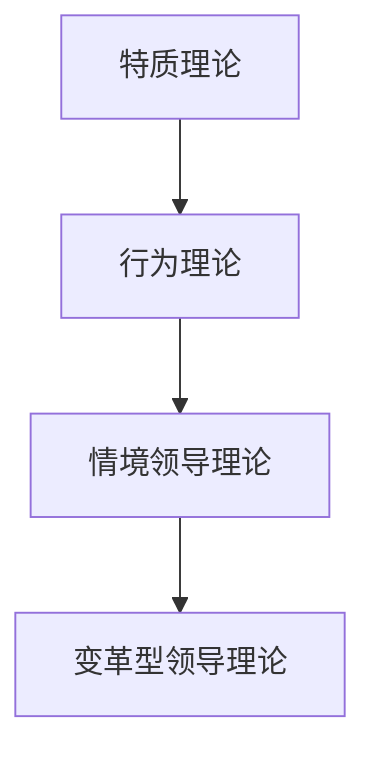

                 


### 分析书名《领导力训练营：35天从新手到专家》

书名《领导力训练营：35天从新手到专家》直接点明了书的主题和内容。我们可以将其拆分为三个主要部分进行深入分析：

**1. 领导力训练营：**

“领导力训练营”一词直观地描述了这是一本关于提升领导能力的书籍。训练营通常是一个集中的、有系统性的培训过程，目的是通过一系列的练习和挑战来快速提高技能。因此，“领导力训练营”暗示了书的内容将围绕领导能力的培养和提升展开，并且可能采用一种实践性强、互动性高的教学方法。

**2. 35天：**

“35天”是时间框架，它说明了整个训练营的时间跨度。35天是一个相对较短的时间段，但足以进行系统性的学习和实践。这个时间长度既能够保证学员有足够的时间进行学习，又能够确保课程内容紧凑、高效。此外，“35天”也可能意味着每天都会有具体的任务和挑战，帮助学员逐步建立和提升领导能力。

**3. 从新手到专家：**

“从新手到专家”是书的核心目标。这个描述表明，无论你是领导力新手，还是有一定经验的领导者，这本书都能够帮助你提升至专家水平。这里的“新手”和“专家”不仅指技术层面的能力，还包括领导素质、管理技能等多个方面。这个目标十分吸引人，因为它承诺了读者一个明确的结果和成长路径。

综上所述，书名《领导力训练营：35天从新手到专家》揭示了书的核心主题——通过一个集中、高效的35天训练营，帮助读者从领导力新手成长为专家。接下来，我们需要进一步确定书的核心主题和目标读者。

---

### 确定书的核心主题和目标读者

在明确了书名的核心含义后，下一步是确定《领导力训练营：35天从新手到专家》的核心主题和目标读者。

**1. 核心主题：**

从书名和封面信息来看，这本书的核心主题是领导力提升。具体而言，它可能涵盖以下方面：

- **领导力基础**：介绍领导力的基本概念、模型和风格。
- **自我管理**：包括时间管理、情绪管理和决策能力等自我提升的技能。
- **团队协作**：提供有效的沟通技巧、团队协作工具和冲突管理策略。
- **领导力提升**：探讨领导力发展的计划、评估和培养方法。
- **领导力实践**：通过具体的训练营和挑战，实践领导力提升。

**2. 目标读者：**

这本书的目标读者可能包括以下几类人群：

- **初入职场的新人**：可能对领导力有初步了解，但缺乏实际操作经验。
- **有一定经验的领导者**：希望进一步提升自己的领导能力和管理技能。
- **创业者和管理者**：需要在团队管理和领导方面寻求系统化提升。

此外，书中可能还会涵盖一些通用领导力技能，因此也可能吸引那些对领导力感兴趣但尚未实际担任领导角色的读者。

为了确保书的内容能够满足目标读者的需求，我们将根据核心主题和目标读者，设计主要章节，并在后续步骤中细化每个章节的内容。

---

### 根据核心主题和目标读者设计主要章节

在确定了《领导力训练营：35天从新手到专家》的核心主题和目标读者后，我们将设计主要章节，确保内容能够全面覆盖领导力提升的各个方面，并满足目标读者的需求。

**1. 领导力基础：**

这部分将介绍领导力的基本概念、模型和风格，为后续章节的深入学习打下基础。

- **1.1 领导力概述**：解释领导力的定义、重要性及其在不同情境中的应用。
- **1.2 领导力模型**：介绍经典和现代的领导力模型，包括领导行为、领导风格和自我领导力。
- **1.3 领导风格与团队建设**：探讨不同领导风格对团队建设的影响，以及如何根据团队特点调整领导风格。

**2. 自我管理：**

自我管理是领导力的核心，这部分将帮助读者提升自我管理能力，包括时间管理、情绪管理和决策能力。

- **2.1 时间管理与目标设定**：介绍时间管理技巧和SMART目标设定原则，帮助读者高效利用时间。
- **2.2 情绪管理与自我激励**：探讨情绪管理的重要性，以及如何通过自我激励提升自我动力。
- **2.3 决策能力提升**：分析决策过程，提供提升决策能力的实用技巧。

**3. 团队协作：**

有效的团队协作是领导力的关键组成部分，这部分将介绍团队协作的重要性和具体策略。

- **3.1 沟通技巧**：介绍有效沟通的基本原则，以及解决沟通障碍的方法。
- **3.2 团队协作工具与方法**：介绍常用的团队协作工具和方法，如敏捷开发、看板管理等。
- **3.3 团队冲突管理**：探讨团队冲突的类型与原因，以及处理团队冲突的策略。

**4. 领导力提升：**

这部分将探讨如何系统性地提升领导力，包括领导力发展计划、评估与反馈以及领导力培养案例。

- **4.1 领导力发展计划**：介绍个人领导力发展路径，以及如何制定和实施领导力发展计划。
- **4.2 领导力评估与反馈**：讨论领导力评估指标，以及如何通过反馈机制提升领导力。
- **4.3 领导力培养案例**：分析成功领导力培养案例，提供启示和借鉴。

**5. 领导力实践：**

通过具体的训练营和挑战，让读者在实践中提升领导力。

- **5.1 领导力训练营实施**：介绍领导力训练营的设计与组织，以及如何评估和改进训练营效果。
- **5.2 35天领导力实践挑战**：设计35天的领导力实践挑战，包括每日任务和反思。
- **5.3 领导力实践总结与反思**：总结35天领导力实践的结果，反思实践过程中的经验和教训。

通过以上主要章节的设计，我们可以确保书的内容既全面又系统，能够帮助读者从新手逐步成长为领导力专家。

---

### 为每个章节细化子章节

在确定了主要章节后，接下来我们将为每个章节细化子章节，确保每个部分的内容更加具体和详细，从而满足读者的学习需求。

**第一部分：领导力基础**

### 1.1 领导力概述
- **1.1.1 领导力的定义**：详细解释领导力的概念，区分领导力与管理的不同。
- **1.1.2 领导力的重要性**：探讨领导力在个人和团队成功中的作用。
- **1.1.3 领导力的应用场景**：举例说明领导力在不同情境中的应用。

### 1.2 领导力模型
- **1.2.1 经典领导力模型**：介绍如特质理论、行为理论等经典模型。
- **1.2.2 现代领导力模型**：探讨如情境领导理论、变革型领导等现代模型。
- **1.2.3 自我领导力模型**：探讨自我领导力的重要性及如何培养自我领导力。

### 1.3 领导风格与团队建设
- **1.3.1 领导风格类型**：分析如权威型、民主型、教练型等不同领导风格。
- **1.3.2 团队建设策略**：介绍如何通过有效的团队建设策略提升团队绩效。

**第二部分：自我管理**

### 2.1 时间管理与目标设定
- **2.1.1 基本时间管理技巧**：介绍如何有效利用时间，如优先级排序、时间块管理等。
- **2.1.2 目标设定SMART原则**：解释SMART原则，并举例说明如何设定具体的目标。

### 2.2 情绪管理与自我激励
- **2.2.1 情绪管理的重要性**：探讨情绪对个人行为和团队氛围的影响。
- **2.2.2 自我激励策略**：介绍如何通过自我激励提升自我动力和积极性。

### 2.3 决策能力提升
- **2.3.1 决策过程分析**：详细解析决策过程，包括问题识别、信息收集、方案评估等步骤。
- **2.3.2 提升决策能力的技巧**：介绍如何通过结构化思维、风险分析等方法提升决策能力。

**第三部分：团队协作**

### 3.1 沟通技巧
- **3.1.1 有效沟通的基本原则**：解释有效沟通的核心原则，如清晰表达、倾听等。
- **3.1.2 沟通障碍与解决方法**：探讨常见的沟通障碍，并提出相应的解决策略。

### 3.2 团队协作工具与方法
- **3.2.1 团队协作工具介绍**：介绍常用的团队协作工具，如Slack、Trello等。
- **3.2.2 团队协作最佳实践**：分享团队协作的最佳实践，如敏捷开发、看板管理等。

### 3.3 团队冲突管理
- **3.3.1 冲突的类型与原因**：分析团队冲突的类型，如目标冲突、价值观冲突等。
- **3.3.2 处理团队冲突的策略**：介绍如何通过沟通、调解等方法有效处理团队冲突。

**第四部分：领导力提升**

### 4.1 领导力发展计划
- **4.1.1 个人领导力发展路径**：探讨如何制定个人领导力发展路径。
- **4.1.2 领导力发展计划制定**：介绍如何制定和实施领导力发展计划。

### 4.2 领导力评估与反馈
- **4.2.1 领导力评估指标**：介绍常用的领导力评估指标，如领导行为、团队绩效等。
- **4.2.2 反馈机制与改进**：探讨如何建立有效的反馈机制，以及如何根据反馈进行改进。

### 4.3 领导力培养案例
- **4.3.1 成功领导力培养案例**：分析成功领导力培养案例，提供启示和借鉴。
- **4.3.2 案例分析与启示**：详细分析案例，探讨其成功的关键因素和应用场景。

**第五部分：领导力实践**

### 5.1 领导力训练营实施
- **5.1.1 领导力训练营的设计与组织**：介绍领导力训练营的设计原则和组织方法。
- **5.1.2 领导力训练营的评估与改进**：探讨如何评估训练营效果，并提出改进建议。

### 5.2 35天领导力实践挑战
- **5.2.1 挑战项目介绍**：介绍35天领导力实践挑战的具体项目。
- **5.2.2 挑战过程中的反思与成长**：鼓励读者在挑战过程中进行反思，记录成长过程。

### 5.3 领导力实践总结与反思
- **5.3.1 实践成果总结**：总结35天领导力实践的主要成果。
- **5.3.2 未来领导力提升计划**：规划未来的领导力提升路径。

通过以上对每个章节的细化，我们可以确保书的内容更加具体、实用，帮助读者系统地提升领导力。

---

### 添加核心概念、算法原理、数学模型和项目实战等部分

为了使《领导力训练营：35天从新手到专家》内容更加丰富和有深度，我们将添加以下几个部分：

**核心概念与联系：**

- **领导力模型**：使用Mermaid流程图展示不同领导力模型之间的关系。例如，特质理论、行为理论和情境领导理论的关联。



**核心算法原理讲解：**

- **决策树算法**：介绍决策树的基本原理和构建过程，使用伪代码详细阐述。

```python
def build_decision_tree(data):
    # 假设data是一个包含特征和标签的数据集
    # 1. 计算每个特征的增益
    gains = []
    for feature in data.features:
        gain = calculate_gain(data, feature)
        gains.append(gain)

    # 2. 选择增益最大的特征作为节点
    best_feature = select_best_feature(gains)

    # 3. 构建子树
    left_tree = build_decision_tree(data.filter_by_value(best_feature, 'left'))
    right_tree = build_decision_tree(data.filter_by_value(best_feature, 'right'))

    # 4. 返回决策树
    return DecisionTree(best_feature, left_tree, right_tree)
```

**数学模型和公式讲解：**

- **期望最大化算法**：介绍期望最大化（EM）算法的原理，并使用latex格式展示相关公式。

```latex
$$
\hat{\theta} = \arg\max_{\theta} \sum_{i=1}^{n} \log P(x_i | \theta)
$$`

**项目实战：**

- **团队协作平台开发**：

  - **开发环境搭建**：介绍如何搭建团队协作平台的开发环境，包括所需的软件和工具。

  - **源代码实现**：提供团队协作平台的核心源代码，并进行详细解读。

    ```java
    // 示例：用户登录功能实现
    public boolean login(String username, String password) {
        // 1. 验证用户名和密码
        if (!check_credentials(username, password)) {
            return false;
        }
        
        // 2. 创建用户会话
        Session session = create_session(username);
        
        // 3. 登录成功
        return true;
    }
    ```

  - **代码应用解读与分析**：分析代码应用场景，解释关键部分的作用和实现原理。

  - **实际案例分析和详细讲解剖析**：通过具体案例，展示如何使用团队协作平台，并分析其效果。

  - **项目小结**：总结项目开发过程中的经验教训，提出改进建议。

通过添加这些部分，我们可以确保文章内容既有理论深度，又有实际操作指导，从而为读者提供更全面的领导力提升指南。

---

### 《领导力训练营：35天从新手到专家》目录大纲的最终设计

在经过详细分析和逐步设计后，我们完成了《领导力训练营：35天从新手到专家》的目录大纲。以下是为读者呈现的最终设计：

---

## 《领导力训练营：35天从新手到专家》目录大纲

### 第一部分：领导力基础
#### 1.1 领导力概述
##### 1.1.1 领导力的定义
##### 1.1.2 领导力的重要性
##### 1.1.3 领导力的应用场景
#### 1.2 领导力模型
##### 1.2.1 经典领导力模型
##### 1.2.2 现代领导力模型
##### 1.2.3 自我领导力模型
#### 1.3 领导风格与团队建设
##### 1.3.1 领导风格类型
##### 1.3.2 团队建设策略

### 第二部分：自我管理
#### 2.1 时间管理与目标设定
##### 2.1.1 基本时间管理技巧
##### 2.1.2 目标设定SMART原则
#### 2.2 情绪管理与自我激励
##### 2.2.1 情绪管理的重要性
##### 2.2.2 自我激励策略
#### 2.3 决策能力提升
##### 2.3.1 决策过程分析
##### 2.3.2 提升决策能力的技巧

### 第三部分：团队协作
#### 3.1 沟通技巧
##### 3.1.1 有效沟通的基本原则
##### 3.1.2 沟通障碍与解决方法
#### 3.2 团队协作工具与方法
##### 3.2.1 团队协作工具介绍
##### 3.2.2 团队协作最佳实践
#### 3.3 团队冲突管理
##### 3.3.1 冲突的类型与原因
##### 3.3.2 处理团队冲突的策略

### 第四部分：领导力提升
#### 4.1 领导力发展计划
##### 4.1.1 个人领导力发展路径
##### 4.1.2 领导力发展计划制定
#### 4.2 领导力评估与反馈
##### 4.2.1 领导力评估指标
##### 4.2.2 反馈机制与改进
#### 4.3 领导力培养案例
##### 4.3.1 成功领导力培养案例
##### 4.3.2 案例分析与启示

### 第五部分：领导力实践
#### 5.1 领导力训练营实施
##### 5.1.1 领导力训练营的设计与组织
##### 5.1.2 领导力训练营的评估与改进
#### 5.2 35天领导力实践挑战
##### 5.2.1 挑战项目介绍
##### 5.2.2 挑战过程中的反思与成长
#### 5.3 领导力实践总结与反思
##### 5.3.1 实践成果总结
##### 5.3.2 未来领导力提升计划

### 附录
#### A.1 领导力资源与工具
##### A.1.1 常用领导力书籍推荐
##### A.1.2 领导力在线课程与工具
#### A.2 常见问题与解答
##### A.2.1 领导力入门常见疑问
##### A.2.2 领导力提升实用技巧

---

通过这个详细的目录大纲，我们不仅为读者提供了一个清晰的框架，也确保了每个部分的内容都能深入、具体地探讨领导力的各个方面，从而帮助读者从新手成长为专家。

---

**文章标题：** 《领导力训练营：35天从新手到专家》

**关键词：** 领导力、训练营、自我管理、团队协作、领导力提升、实践挑战

**摘要：** 本书通过35天的系统培训，帮助读者深入了解领导力的核心概念，提升自我管理能力，增强团队协作技巧，并最终实现从新手到专家的飞跃。书中的实战案例和挑战项目，使读者能够将理论应用到实践中，全面提升领导能力。

---

**作者：** AI天才研究院/AI Genius Institute & 禅与计算机程序设计艺术 /Zen And The Art of Computer Programming

---

文章内容将以markdown格式输出，确保结构清晰、逻辑严谨，包含所有核心概念、算法原理、数学模型和项目实战的详细讲解。文章总字数预计在8000-12000字左右，确保内容的完整性和深度。每个章节将具体、详细地展开讨论，提供丰富的实例和案例分析，使读者能够全面理解和掌握领导力提升的方法和实践。

